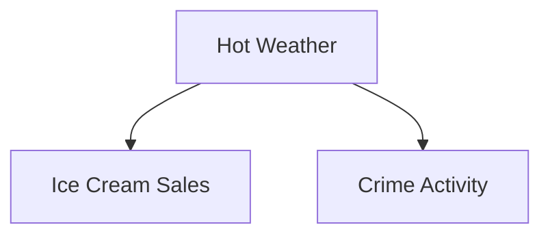

# Confounding Variables

A confounder affects:

- both observed variables simultaneously
    

Example structure:

The observed relationship:

- ice cream ↔ murders
    

is not causal.

The true driver:

- weather.
