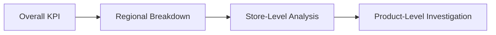

# Drill-Down as a Defense Against Misleading Aggregation

The lecture correctly links Simpson’s Paradox to:

- dashboard interactivity
    
- drill-down exploration
    

Good dashboards allow users to move from:

- summary  
    to
    
- decomposition
    

Example workflow:

Without drill-down:

- misleading aggregation remains hidden.
