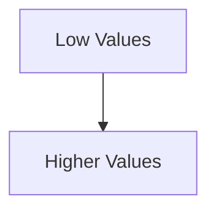

# The Core Manipulation: Inverted Axis

The Y-axis was reversed.

Instead of increasing upward:

- values increased downward
    

This violated normal perceptual expectations.

Humans naturally expect:

Bottom = smaller.  
Top = larger.

The misleading graph inverted this relationship.

As a result:

- increasing murders visually resembled decreasing murders
