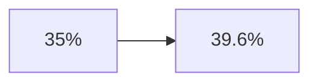

# Visual Perception Problem

### True Relationship

Moderate increase.

### Truncated Axis Interpretation

The same increase appears:

- steep
    
- alarming
    
- disproportionate
    

The chart amplifies emotional impact beyond numerical reality.
