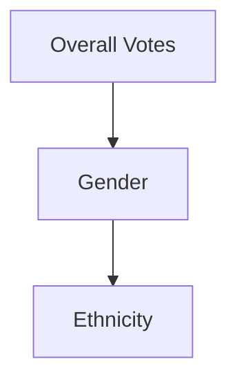
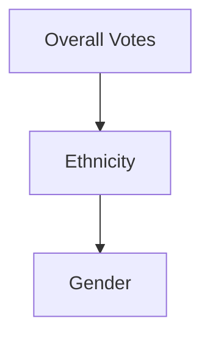

# What Is Drill-Down?

Drill-down means:

> progressively adding dimensions to explore subgroup behavior.

Example hierarchy:

or:

Both lead to the same endpoint.

But the interpretive journey differs.
