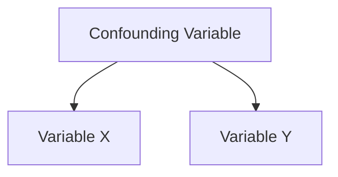

# What Is a Confounding Variable?

A confounder is a variable that:

- affects multiple observed variables simultaneously
    
- creates the illusion of direct relationship
    

Structure:

The observed correlation:

- X ↔ Y
    

may actually be driven by:

- A
