## Misleading with Charts: How Bad Visualization Distorts Decision-Making

This lecture addresses one of the most important and dangerous realities in data visualization:

> Charts are not neutral.

Even when the underlying data is correct, visualization choices can:

- distort perception
    
- bias interpretation
    
- manipulate conclusions
    
- damage decision-making
    

Sometimes intentionally.  
Often unintentionally.

## The Core Purpose of Data Visualization

The lecture restates a foundational principle:

> The goal of visualization is to communicate information efficiently and accurately so audiences can make informed decisions.

Good visualization should:

- reduce cognitive effort
    
- reveal patterns truthfully
    
- preserve proportional meaning
    
- support correct interpretation
    

Bad visualization does the opposite.

It creates:

- perceptual distortion
    
- false emphasis
    
- misleading narratives
    
- cognitive bias
    

## Humans Process Visuals Extremely Quickly

The transcript highlights an important cognitive reality:

> Humans respond to visual patterns almost instantly.

Before consciously analyzing a graph, the brain already interprets:

- direction
    
- shape
    
- color
    
- motion
    
- spatial orientation
    

This is called:

> pre-attentive perception.

Humans instinctively associate:

- upward movement with increase
    
- downward movement with decline
    
- red with danger/loss
    
- green with improvement/growth
    

Visualization design exploits these automatic cognitive shortcuts.

## Example: The Misleading Firearm Murder Chart

The lecture describes a graph about firearm-related murders after a law was enacted in Florida.

At first glance:

- the graph appears to show declining murders
    
- viewers instinctively interpret the trend as positive
    

Why?

Because:

- the line visually slopes downward
    
- the red color suggests danger reduction
    
- spatial positioning implies decrease
    

But the graph is deceptive.

## The Core Manipulation: Inverted Axis

The Y-axis was reversed.

Instead of increasing upward:

- values increased downward
    

This violated normal perceptual expectations.

Humans naturally expect:

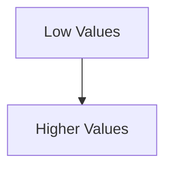

Bottom = smaller.  
Top = larger.

The misleading graph inverted this relationship.

As a result:

- increasing murders visually resembled decreasing murders
    

## Why This Is So Dangerous

Most viewers:

- do not inspect axes carefully
    
- rely on visual intuition first
    

This means:

- perception dominates interpretation
    

The graph effectively weaponized:

- spatial expectation
    
- visual habit
    
- cognitive shortcuts
    

## Actual Reality

The actual data showed:

- murders increased from roughly 500 to 850
    

But visually:

- the graph implied improvement
    

This demonstrates a critical principle:

> Visualization design can overpower factual accuracy.

## Cognitive Bias in Visualization

The lecture implicitly demonstrates several psychological biases.

## 1. Spatial Bias

Humans associate:

- upward = more
    
- downward = less
    

Violating this convention creates confusion or manipulation.

## 2. Color Bias

The graph used red to imply:

- danger
    
- negativity
    
- seriousness
    

But the visual downward motion psychologically overrode the actual increase.

This created contradictory signals.

## 3. Gestalt Perception

Humans interpret:

- overall shape  
    before
    
- exact numbers
    

Most viewers absorb:

- trend direction  
    before
    
- scale interpretation
    

This is why chart design matters enormously.

## Why Misleading Charts Often Go Unnoticed

Most audiences:

- trust visualizations automatically
    
- assume graphs are objective
    
- do not audit scales carefully
    

Executives especially rely on:

- rapid pattern recognition
    
- summary interpretation
    

That makes misleading visuals extremely dangerous in:

- boardrooms
    
- media
    
- policy discussions
    
- financial reporting
    

## Important Insight: Misleading Does Not Always Mean Malicious

The lecture correctly notes:

> the intention may not always be manipulation.

Many misleading charts emerge because of:

- poor design literacy
    
- rushed dashboards
    
- software defaults
    
- aesthetic prioritization
    
- misunderstanding perception
    

However:

- accidental distortion is still distortion
    

Impact matters more than intent.

## Why Natural Ordering Matters

Humans develop strong expectations for visual structure.

Standard chart conventions exist because they align with cognition.

Examples:

|Convention|Human Expectation|
|---|---|
|Higher values upward|Growth/increase|
|Time flows left to right|Chronological progression|
|Green = positive|Improvement|
|Red = negative|Risk/loss|

Breaking these conventions requires extreme caution.

Otherwise:

- interpretation becomes unreliable
    

## Visualization Ethics

This lecture touches an important ethical principle:

> A technically correct graph can still be cognitively dishonest.

Visualization ethics requires:

- preserving interpretive integrity
    
- minimizing perceptual distortion
    
- avoiding manipulative framing
    

Good analysts optimize for:

- truthful understanding
    

Not merely:

- persuasive impact
    

## Common Sources of Misleading Charts

The inverted-axis example is one category among many.

Other common issues include:

|Misleading Technique|Effect|
|---|---|
|Truncated axes|Exaggerates differences|
|3D charts|Distorts proportions|
|Inconsistent scales|Creates false comparisons|
|Cherry-picked date ranges|Alters trend perception|
|Overloaded visuals|Hides key insights|
|Dual axes misuse|Implies false relationships|
|Area exaggeration|Overstates magnitude|

## Why Visualization Is Powerful

The transcript ultimately reinforces this principle:

> Humans believe what they see faster than what they calculate.

Visualization bypasses slow analytical reasoning and directly influences:

- intuition
    
- emotion
    
- memory
    
- judgment
    

That is why charts are powerful.  
And dangerous.

## The Real Responsibility of Analysts

A dashboard developer or analyst is not merely:

- formatting charts
    
- selecting colors
    
- arranging KPIs
    

They are shaping:

- interpretation
    
- organizational understanding
    
- strategic decisions
    

Poor visualization can lead to:

- wrong investments
    
- bad policies
    
- incorrect conclusions
    
- operational failure
    

## Key Strategic Lesson

The strongest visualization practitioners constantly ask:

1. Could this chart be misinterpreted?
    
2. Does visual perception match numerical reality?
    
3. Am I emphasizing truth or manipulating attention?
    
4. Would an uninformed viewer reach the correct conclusion quickly?
    

Because ultimately:

> the effectiveness of visualization is measured not by aesthetics, but by interpretive accuracy.

===
## Axis Manipulation and Misleading Scale Design

The lecture now moves deeper into one of the most common forms of visualization distortion:

> axis manipulation.

This is one of the easiest ways to unintentionally or deliberately mislead an audience while technically displaying “correct” data.

## 1. Natural Ordering Matters

Humans interpret charts using deeply ingrained perceptual conventions.

We naturally expect:

- values to increase upward
    
- time to move left-to-right
    
- proportions to scale consistently
    

These conventions reduce cognitive friction.

When they are violated:

- confusion increases
    
- interpretation errors emerge
    
- visual intuition breaks down
    

The lecture emphasizes:

> do not violate natural ordering unless there is an extremely strong reason.

## Why the Inverted Axis Was Misleading

In the firearm-murder example:

- the chart visually appeared to decline
    
- viewers subconsciously interpreted “downward” as “less”
    

Even though numerically:

- murders increased significantly
    

This happened because:

- the axis orientation contradicted natural expectation
    

The graph effectively disconnected:

- visual perception  
    from
    
- numerical reality
    

## Correct Use of Color vs Manipulative Structure

The lecture makes an important distinction:

Using color for emphasis is acceptable.

Manipulating scale or ordering is not.

Example:

- red can appropriately communicate danger or severity
    
- but scale should remain logically consistent
    

Good storytelling emphasizes truth.

Bad storytelling alters perception itself.

## 2. Truncated Y-Axis

The lecture then introduces another classic manipulation:

> truncating the Y-axis.

This means:

- the graph does not begin at zero
    
- only a narrow range is displayed
    

This visually magnifies small differences.

## Example: Tax Rate Increase

The example compares:

- tax rate increasing from 35% to 39.6%
    

Numerically:

- increase = 4.6 percentage points
    

But visually:

- the first chart makes the increase appear enormous
    

Why?

Because the axis only spans:

- 34% to 40%
    

Instead of:

- 0% to 40%
    

## Why This Distorts Perception

Humans judge magnitude visually through:

- length
    
- height
    
- area
    
- slope
    

If the scale is compressed:  
small numerical differences appear dramatic.

## Visual Perception Problem

### True Relationship

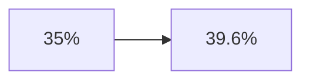

Moderate increase.

### Truncated Axis Interpretation

The same increase appears:

- steep
    
- alarming
    
- disproportionate
    

The chart amplifies emotional impact beyond numerical reality.

## The Importance of Baselines

The lecture correctly emphasizes:

> removing the zero baseline exaggerates differences.

This is especially dangerous in:

- bar charts
    
- column charts
    
- financial reporting
    
- political graphics
    

Because bars encode value using:

- length
    
- height
    

If the baseline is altered:

- the entire visual relationship changes.
    

## When Truncation Is Acceptable

Important nuance:  
not all truncated axes are unethical.

In some contexts:

- tiny fluctuations genuinely matter
    

Examples:

- stock market micro-movements
    
- scientific measurements
    
- medical monitoring
    
- manufacturing tolerances
    

But in those cases:

- truncation must be clearly communicated
    
- context must justify precision focus
    

The problem occurs when truncation is used primarily to:

- dramatize
    
- persuade emotionally
    
- distort significance
    

## Comparing Three Versions of the Same Data

The lecture references three visual versions:

1. exaggerated scale
    
2. accurate scale
    
3. another exaggerated presentation
    

All represent identical data.

Yet emotional interpretation differs drastically.

This reveals a profound truth:

> Visualization framing often shapes interpretation more strongly than the underlying numbers themselves.

## The Reader’s Responsibility

The lecture gives an important defensive strategy for audiences:

> Always inspect the axes.

Specifically check:

- starting values
    
- ending values
    
- interval consistency
    
- baseline presence
    
- directional orientation
    

This is especially important in:

- media graphics
    
- political charts
    
- executive presentations
    
- social media visualizations
    

## The Analyst’s Responsibility

The lecture also frames this as an ethical issue for analysts.

Analysts should avoid:

- exaggerating differences
    
- minimizing differences
    
- manipulating perception through scale
    

because visualization influences:

- business decisions
    
- policy outcomes
    
- public understanding
    

## Common Axis Manipulation Techniques

|Technique|Effect|
|---|---|
|Truncated Y-axis|Exaggerates differences|
|Expanded axis|Minimizes differences|
|Uneven intervals|Distorts progression|
|Reversed axis|Inverts interpretation|
|Missing baseline|Misrepresents proportionality|

## The Psychological Mechanism

Humans process charts holistically first.

Most people:

- do not compute exact ratios
    
- do not inspect scales deeply
    
- rely on immediate perception
    

This means:

- visual framing dominates reasoning
    

The brain prioritizes:

1. shape
    
2. direction
    
3. color
    
4. relative size
    

before:

- precise numerical analysis
    

That is why misleading visuals are effective.

## “Visualization Noise” and Decorative Distortion

The lecture then introduces another issue:

> excessive decorative elements reducing clarity.

The transcript says:

> “bringing additional elements into the graph and dumping down the message.”

This refers to:

- chartjunk
    
- decorative overload
    
- non-essential visual complexity
    

## What Is Chartjunk?

The term was popularized by Edward Tufte.

Chartjunk includes:

- unnecessary 3D effects
    
- excessive gradients
    
- decorative icons
    
- distracting backgrounds
    
- ornamental graphics
    
- visual clutter
    

These elements:

- consume attention
    
- increase cognitive load
    
- weaken interpretability
    

## Why Decorative Overload Is Harmful

Visualization should maximize:

> data-to-ink ratio.

Meaning:

- most visual elements should communicate information
    

Decorative clutter creates:

- attentional fragmentation
    
- slower comprehension
    
- hidden insights
    

## Example Problems

|Decorative Choice|Problem|
|---|---|
|3D pie charts|Distorts proportions|
|Heavy gradients|Distracts from values|
|Excessive labels|Overwhelms users|
|Complex textures|Reduces readability|
|Animation overload|Breaks focus|

## The Deeper Principle

Good visualization is not:

- artistic decoration
    
- aesthetic complexity
    
- visual spectacle
    

It is:

> perceptual engineering.

The goal is to align:

- visual perception  
    with
    
- numerical truth
    

## Key Strategic Lesson

The lecture repeatedly reinforces one foundational idea:

> A chart can be factually correct and still cognitively deceptive.

This is why visualization literacy matters.

Strong analysts must understand:

- human perception
    
- cognitive bias
    
- visual hierarchy
    
- scale interpretation
    
- ethical framing
    

Because once a chart enters:

- a boardroom
    
- a policy document
    
- a media narrative
    

the visualization itself often becomes:

> the reality people remember.

===
## Misleading Comparisons Through Scale Manipulation

This section of the lecture explores another dangerous visualization failure:

> visually implying equivalence between quantities that are not proportionally comparable.

The examples demonstrate how:

- bar lengths
    
- scale consistency
    
- visual proportionality
    

can distort interpretation even when the numbers themselves are technically correct.

## 1. False Comparability Through Scale Design

The first example involves survey results related to:

- recreational drug use
    
- alcohol usage
    

The key issue is not the survey itself.

The issue is:

> the visual encoding misrepresents magnitude differences.

## The Core Problem

The graphs display values such as:

- 0.7
    
- 29.4
    

Yet visually:

- the bars appear relatively comparable
    

This violates a critical visualization principle:

> Visual size should correspond proportionally to numerical magnitude.

If two values differ massively:

- the visual representation should also differ massively.
    

Otherwise:

- viewers underestimate differences
    
- scale relationships collapse
    

## Why This Happens

The lecture suggests the designer:

- fixed the chart dimensions uniformly
    
- compressed or manipulated scaling
    

This created:

- false perceptual equivalence
    

The viewer instinctively interprets:

> “These quantities are somewhat similar.”

when numerically:  
they are not remotely similar.

## Human Perception Relies on Physical Encoding

Humans decode charts through:

- length
    
- area
    
- position
    
- slope
    
- spatial relationships
    

This is foundational to visualization theory.

For bar charts specifically:

> humans interpret bar length as value magnitude.

If the length is misleading:

- the meaning becomes misleading.
    

## Important Principle

Bar charts must preserve:

- proportional integrity
    

Otherwise the visual encoding becomes dishonest.

## De-emphasis vs Over-emphasis

The lecture introduces an important duality:

Visualization manipulation can:

- exaggerate differences  
    or
    
- minimize differences
    

Both are dangerous.

## Exaggeration

Example:

- truncated axes
    
- inflated slopes
    
- compressed baselines
    

Goal:  
make changes appear dramatic.

## De-emphasis

Example:

- flattening differences
    
- compressing variance
    
- visually equalizing large gaps
    

Goal:  
make significant changes appear unimportant.

## 2. Misleading Petrol Price Visualization

The petrol price example is especially important because it demonstrates:

> confusion between value and rate of change.

This is one of the most common analytical communication failures.

## What the Graph Implied

The visualization strongly suggested:

- petrol prices had fallen by 28%
    

Why?

Because:

- bar lengths decreased
    
- downward arrows were emphasized
    
- pre-attentive cues implied decline
    

The audience naturally concludes:

> “Prices are lower.”

## What Actually Happened

The actual petrol prices increased:

|Period|Price|
|---|---|
|Earlier|21|
|Later|30|
|Later|56|
|Latest|72|

Prices rose continuously.

The only thing that decreased was:

> the rate of increase.

This distinction is critical.

## Difference Between Value and Growth Rate

The visualization confused:

- level  
    with
    
- growth velocity
    

These are fundamentally different concepts.

## Example

### Actual Prices

|Time|Price|
|---|---|
|T1|21|
|T2|30|
|T3|56|
|T4|72|

Prices continuously rise.

## Growth Rates

|Transition|Growth|
|---|---|
|21 → 30|~42%|
|30 → 56|~84%|
|56 → 72|~28%|

Growth slows.  
But prices still increase.

## Why This Is Misleading

The graph visually encoded:

- price levels  
    using
    
- bar heights
    

But then implied:

- growth-rate interpretation
    

This creates semantic confusion.

The audience sees:

> smaller bars

and interprets:

> lower prices

even though:  
prices are higher.

## Correct Visualization Approach

The lecture correctly notes:

> the graph should have separated price level from growth rate.

Possible solutions:

## Option 1: Proper Bar Chart

Bars should represent actual prices proportionally.

## Option 2: Separate Line for Growth Rate

Use:

- bars for prices
    
- line chart for percentage growth
    

This avoids conflating:

- magnitude  
    with
    
- acceleration
    

## Core Visualization Principle

Every visual encoding must answer clearly:

> “What exactly does this visual dimension represent?”

Examples:

- bar height = value
    
- line slope = trend
    
- area = magnitude
    
- color = category or intensity
    

If encoding semantics become ambiguous:

- interpretation breaks down.
    

## Pre-attentive Manipulation

The lecture references:

- arrows
    
- highlights
    
- emphasized numbers
    

These are pre-attentive attributes.

Humans process them almost instantly before conscious reasoning begins.

Examples include:

- color
    
- direction
    
- size
    
- orientation
    
- contrast
    

These cues strongly shape interpretation.

## Why Pre-attentive Features Are Powerful

Humans evolved to react rapidly to visual signals.

This creates:

- speed  
    but also
    
- vulnerability
    

If arrows point downward:  
viewers instinctively associate:

- reduction
    
- improvement
    
- decline
    

even before reading labels carefully.

## Dual-Axis and Scaling Problems

The lecture begins transitioning into another major issue:

> dual-axis manipulation.

This is one of the most abused techniques in business dashboards.

## What Is a Dual-Axis Chart?

A dual-axis chart uses:

- two separate Y-axes
    
- different scales
    
- multiple metrics on one chart
    

Example:

- revenue on left axis
    
- customer satisfaction on right axis
    

## Why Dual Axes Are Dangerous

By changing scales independently:  
analysts can visually force:

- correlation
    
- divergence
    
- alignment
    

between unrelated metrics.

This can create:

- fake relationships
    
- misleading trends
    
- false causality
    

## Example Problem

Suppose:

- ice cream sales rise
    
- shark attacks rise
    

A manipulated dual-axis chart can visually align both lines perfectly.

This creates the illusion:

> “ice cream causes shark attacks.”

In reality:  
both correlate with:

- summer temperature
    

## The Deeper Problem

Humans assume:

- aligned lines imply relationship
    

Dual axes exploit this assumption.

## Core Strategic Lesson

This section reinforces one of the most important principles in visualization:

> Visual proportionality must reflect numerical proportionality.

If not:

- interpretation becomes distorted
    
- trust collapses
    
- decision quality declines
    

## The Analyst’s Ethical Responsibility

A visualization designer controls:

- emphasis
    
- framing
    
- perceptual hierarchy
    
- interpretive cues
    

That means analysts influence:

- organizational belief systems
    
- strategic decisions
    
- public understanding
    

Good analysts therefore optimize for:

- interpretive honesty
    

not merely:

- persuasive aesthetics
    

Because in practice:

> most people remember the picture, not the footnote.

===

## Scaling Problems and Dual-Axis Misuse

This section of the lecture explores another subtle but highly dangerous visualization issue:

> improper scaling can hide patterns, distort trends, or imply false relationships.

The problem becomes especially severe when:

- variables have very different magnitudes
    
- multiple metrics share a chart
    
- dual axes are used carelessly
    

## 1. Scale Compression Hides Meaning

The lecture gives an example comparing:

- cancer screenings
    
- abortions
    

Both are plotted on the same chart.

The issue:

- cancer screening counts are dramatically larger in magnitude
    

As a result:

- the abortion trend visually flattens
    
- its slope becomes difficult to interpret
    

## Why This Happens

Suppose:

|Metric|Scale|
|---|---|
|Cancer screenings|Millions|
|Abortions|Thousands|

If both share the same Y-axis:

- the smaller variable becomes visually compressed
    

This destroys:

- trend visibility
    
- variance interpretation
    
- slope perception
    

## Visual Compression Problem

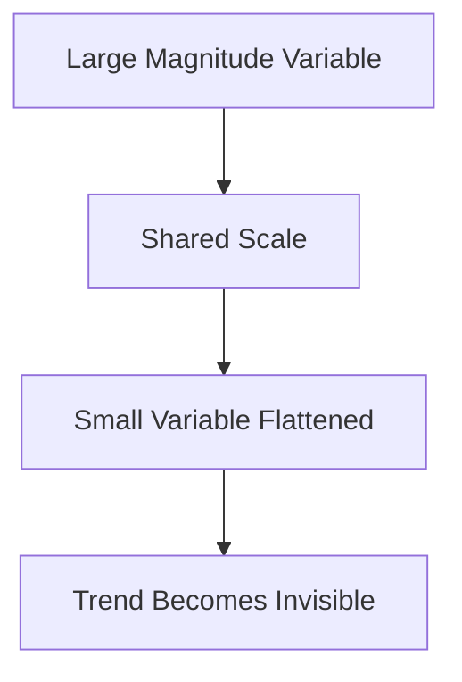

## Why Trend Shape Matters

Humans infer meaning from:

- slope
    
- acceleration
    
- curvature
    
- volatility
    

If scaling hides the slope:

- important behavioral changes disappear
    

A visually flat line may actually contain:

- meaningful growth
    
- volatility
    
- inflection points
    

But scaling masks it.

## The Key Tradeoff in Visualization

When comparing variables:  
you must preserve both:

1. quantity interpretation
    
2. trend interpretation
    

This is difficult when magnitudes differ drastically.

## 2. Dual-Axis Charts

The lecture introduces dual-axis charts as a potential solution.

A dual-axis chart uses:

- one Y-axis for metric A
    
- another Y-axis for metric B
    

Example:

- left axis = cancer screenings
    
- right axis = abortions
    

This allows:

- both trends to remain visible
    
- independent scaling
    

## Proper Use of Dual Axes

Dual axes are not inherently bad.

They are powerful when:

- scales differ greatly
    
- comparison of movement matters more than absolute magnitude
    

But they require:

- extreme clarity
    
- explicit labeling
    
- careful visual separation
    

## Important Risk

The lecture correctly warns:

> dual axes can easily mislead audiences.

Why?

Because humans naturally assume:

- lines sharing space imply comparability
    

Even if:

- scales differ dramatically
    

## Example of Misleading Alignment

An analyst can manipulate scales so two unrelated variables visually move together.

This creates:

- false pattern perception
    
- implied causality
    
- artificial synchronization
    

## Good Dual-Axis Design Principles

|Principle|Reason|
|---|---|
|Clearly label both axes|Prevent ambiguity|
|Use distinct colors|Separate variables cognitively|
|Avoid forcing visual overlap|Prevent fake correlations|
|Explain units explicitly|Preserve interpretability|
|Use only when necessary|Reduce confusion|

## The Deeper Problem: Humans See Patterns Everywhere

The lecture then moves into one of the most important concepts in analytics:

> Correlation does not imply causation.

This is foundational in:

- statistics
    
- machine learning
    
- economics
    
- scientific reasoning
    
- business analytics
    

## Correlation vs Causation

Correlation means:

- two variables move together
    

Causation means:

- one variable directly influences another
    

These are fundamentally different claims.

## Correlation Example

The lecture gives intentionally absurd examples:

- murders vs ice cream sales
    
- Nicolas Cage movies vs swimming pool drownings
    

These variables may exhibit similar trends.

But:

- similarity of movement does not prove causality.
    

## Why Correlation Happens Accidentally

Variables can correlate because of:

- coincidence
    
- seasonality
    
- shared external drivers
    
- confounding variables
    
- pure randomness
    

## Example: Ice Cream Sales and Murders

Suppose both rise during summer.

Does ice cream cause murder?

No.

Likely hidden factor:

- temperature
    
- increased outdoor activity
    
- population movement
    

This hidden influence is called:

> a confounding variable.

## Confounding Variables

A confounder affects:

- both observed variables simultaneously
    

Example structure:

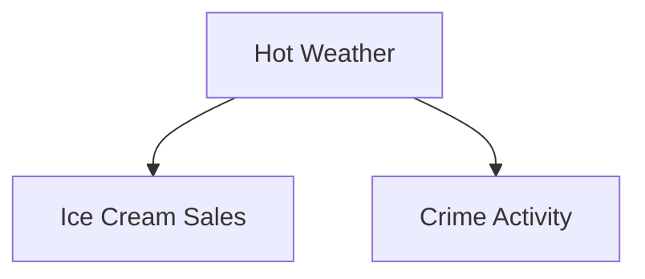

The observed relationship:

- ice cream ↔ murders
    

is not causal.

The true driver:

- weather.
    

## Why Humans Mistake Correlation for Causation

Humans are evolved pattern-detection systems.

We instinctively search for:

- explanations
    
- causes
    
- narratives
    

This tendency is extremely useful for survival.

But analytically:  
it creates danger.

## Visualization Amplifies This Bias

When two lines visually track together:  
humans automatically infer:

- relationship
    
- dependency
    
- influence
    

Especially if:

- colors match
    
- slopes align
    
- timing overlaps
    

This is why careless visualization can unintentionally create false causal stories.

## The Statistical Danger

The lecture warns analysts:

> do not overstate conclusions from visual patterns.

This is critical.

Visualization can suggest:

- hypotheses
    
- possible relationships
    
- areas for investigation
    

But visualization alone rarely proves causality.

## Establishing Causation Requires More

Causal claims usually require:

- controlled experiments
    
- randomized trials
    
- temporal validation
    
- theoretical grounding
    
- domain expertise
    

Merely observing correlation is insufficient.

## Important Analytical Discipline

Good analysts distinguish carefully between:

|Statement|Validity|
|---|---|
|“Variables are correlated.”|Usually acceptable|
|“Variables may be associated.”|Acceptable|
|“Variable A causes Variable B.”|Requires strong evidence|

## Why This Matters in Business

False causal assumptions lead to:

- bad strategy
    
- wasted investment
    
- incorrect KPIs
    
- failed interventions
    

Example:  
A company notices:

- increased app usage correlates with retention
    

They conclude:

> “More app usage causes retention.”

Reality may be:

- loyal customers naturally use the app more
    

The direction of causality may be reversed.

## Visualization as Hypothesis Generation

One of the best uses of visualization is:

> exploratory analysis.

Charts help identify:

- anomalies
    
- patterns
    
- clusters
    
- correlations
    
- possible relationships
    

But analysts must stop short of:

- declaring unsupported causal conclusions.
    

The lecture correctly emphasizes:

> visual exploration should generate questions, not premature certainty.

## Strategic Insight

This section exposes a critical danger in modern dashboards and analytics culture:

> Humans trust visually coherent stories even when they are statistically weak.

That means analysts carry enormous responsibility.

A compelling chart can:

- overpower skepticism
    
- suppress nuance
    
- create false confidence
    

Good visualization therefore requires:

- statistical literacy
    
- ethical restraint
    
- perceptual awareness
    
- contextual reasoning
    

Because ultimately:

> the most dangerous dashboard is not the inaccurate one.  
> It is the believable one that tells the wrong story.

## Confounding Variables and the Limits of Correlation

The lecture continues reinforcing a critical analytical principle:

> Even strong correlations can become meaningless once hidden variables are considered.

These hidden influences are called:

> confounding variables.

## What Is a Confounding Variable?

A confounder is a variable that:

- affects multiple observed variables simultaneously
    
- creates the illusion of direct relationship
    

Structure:

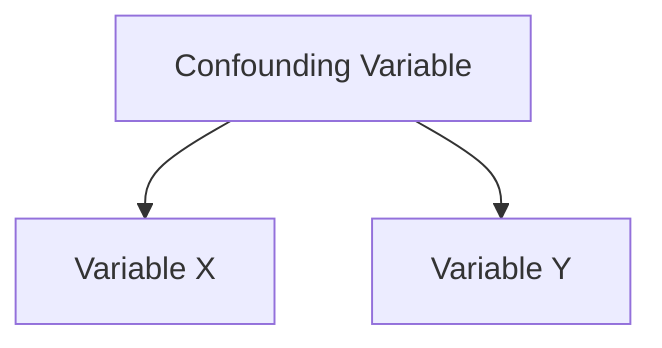

The observed correlation:

- X ↔ Y
    

may actually be driven by:

- A
    

## Why Confounders Are Dangerous

Without identifying confounders:

- analysts overstate conclusions
    
- dashboards imply false narratives
    
- decision-makers infer nonexistent causal mechanisms
    

The lecture correctly notes:

> sometimes confounders are impossible to identify completely.

This is extremely important.

Real-world systems are:

- noisy
    
- multivariate
    
- interconnected
    

Complete causal certainty is often unrealistic.

## Best Practice

Therefore:

> analysts should present correlation cautiously and avoid claiming causation without evidence.

Good analytical language:

- “associated with”
    
- “correlated with”
    
- “appears related to”
    

Dangerous language:

- “causes”
    
- “drives”
    
- “results in”
    

unless causal evidence exists.

## Simpson’s Paradox

The lecture then introduces one of the most important concepts in statistical reasoning:

> Simpson’s Paradox.

This occurs when:

- aggregated data suggests one conclusion  
    but
    
- subgroup analysis reveals the opposite conclusion.
    

This is profoundly important in:

- business analytics
    
- healthcare
    
- economics
    
- machine learning
    
- dashboard design
    

because aggregation can completely reverse interpretation.

## Core Principle of Simpson’s Paradox

The way data is grouped fundamentally changes:

- patterns
    
- averages
    
- conclusions
    

This means:

> summaries can lie.

## The Task Completion Example

The lecture gives an example involving:

- Person A
    
- Person B
    
- Saturday and Sunday performance
    

## Day-Level Analysis

## Saturday

|Person|Completed|Total|Success Rate|
|---|---|---|---|
|A|7|8|87.5%|
|B|2|2|100%|

B performs better.

## Sunday

|Person|Completed|Total|Success Rate|
|---|---|---|---|
|A|5|8|62.5%|
|B|1|2|50%|

A performs better.

## Aggregated Analysis

When totals are combined:

## Person A

\frac{7+5}{8+8}=\frac{12}{16}=75%

## Person B

\frac{2+1}{2+2}=\frac{3}{4}=75%

Depending on the exact values and weighting, the aggregate conclusion may reverse or flatten subgroup conclusions.

The key insight:

- subgroup behavior differs from overall behavior.
    

## Why Simpson’s Paradox Happens

It usually occurs because:

- subgroup sizes differ
    
- weighting effects distort averages
    
- hidden composition effects exist
    

The aggregate hides:

- structural imbalance
    

## Business Example

The lecture translates this into business hierarchy:

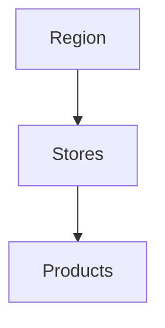

Performance can differ dramatically depending on:

- aggregation level
    
- grouping sequence
    
- drill-down path
    

## Example Problem

Suppose:

- Region A performs well in high-volume products
    
- Region B performs better in low-volume products
    

Aggregated metrics may misleadingly favor one region overall even though:

- subgroup performance differs.
    

## Why This Matters in Dashboards

Dashboards often emphasize:

- summary KPIs
    
- top-level averages
    
- aggregate percentages
    

But aggregation can conceal:

- inequality
    
- subgroup failure
    
- operational bottlenecks
    
- hidden risk
    

This is why:

> drill-down capability is essential.

## Drill-Down as a Defense Against Misleading Aggregation

The lecture correctly links Simpson’s Paradox to:

- dashboard interactivity
    
- drill-down exploration
    

Good dashboards allow users to move from:

- summary  
    to
    
- decomposition
    

Example workflow:

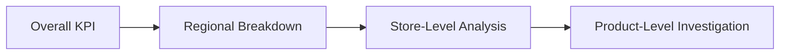

Without drill-down:

- misleading aggregation remains hidden.
    

## Narrative Control Through Grouping

A subtle but important insight from the lecture:

> Grouping order influences interpretation.

This is extremely important in storytelling.

The sequence of:

- filters
    
- drill paths
    
- categories
    

can guide audiences toward certain conclusions.

## Example

If a dashboard first shows:

- national averages
    

users perceive:

- stability
    

If it first highlights:

- regional failures
    

users perceive:

- crisis
    

Same dataset.  
Different grouping hierarchy.  
Different narrative.

## Filter Ordering as Narrative Design

The lecture emphasizes:

- preset drill sequences shape interpretation
    

This means dashboard architecture itself contains:

> narrative bias.

Examples:

- country → state → district
    
- company → region → store
    
- customer segment → product → transaction
    

Each path emphasizes different patterns.

## Author-Driven vs Reader-Driven Connection

This directly connects to earlier storytelling concepts.

## Author-Driven Dashboard

The analyst controls:

- grouping sequence
    
- drill hierarchy
    
- interpretive path
    

## Reader-Driven Dashboard

The user explores:

- freely
    
- independently
    
- dynamically
    

## Hybrid Systems

Most modern dashboards combine:

- guided summaries  
    with
    
- exploratory drill-down
    

## Important Strategic Lesson

The lecture exposes a profound truth about analytics:

> Data does not speak independently of structure.

The way we:

- aggregate
    
- filter
    
- group
    
- sequence
    
- scale
    
- visualize
    

fundamentally changes interpretation.

This means:  
analytics is not merely computation.

It is:

- representation
    
- framing
    
- abstraction design
    

## Why Analysts Must Be Careful

Analysts often unintentionally:

- hide subgroup effects
    
- create misleading averages
    
- oversimplify systems
    

This happens because:  
aggregates feel cleaner and easier to communicate.

But reality is hierarchical.

## Final Insight

The deeper lesson behind Simpson’s Paradox is:

> Summary metrics can destroy truth.

Good analysts therefore constantly ask:

1. What does the aggregate hide?
    
2. Are subgroup behaviors different?
    
3. Does drill-down reverse conclusions?
    
4. Is grouping influencing interpretation?
    
5. Could another segmentation tell the opposite story?
    

Because in complex systems:

> the most dangerous insights are often the ones that appear obvious at the top level.

## Drill-Down Order and Narrative Framing

This section of the lecture explores a subtle but extremely important concept in dashboard storytelling:

> The sequence of drill-down changes narrative interpretation even when the final data remains identical.

This is a powerful idea because it shows:

- analytics is not purely objective presentation
    
- navigation structure itself shapes perception
    

## The Election Example

The lecture uses the 2016 US election as an example.

At the top level:

|Candidate|Vote Share|
|---|---|
|Hillary Clinton|48%|
|Donald Trump|46%|
|Others|6%|

This is the aggregate view.

But the lecture explores how interpretation changes when:

- additional dimensions are introduced
    

The two dimensions used:

1. Gender
    
2. Ethnicity
    

## What Is Drill-Down?

Drill-down means:

> progressively adding dimensions to explore subgroup behavior.

Example hierarchy:

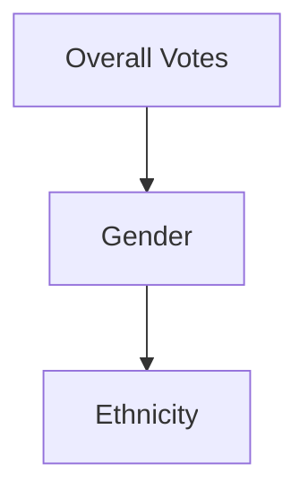

or:

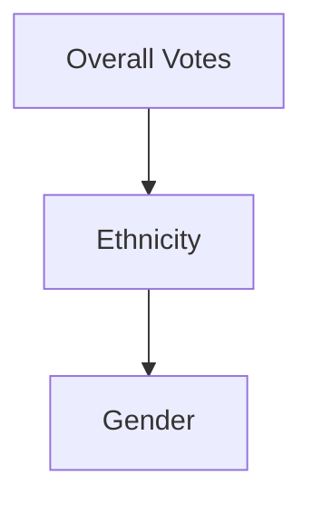

Both lead to the same endpoint.

But the interpretive journey differs.

## Path 1: Gender → Ethnicity

First layer:

- women voters preferred Hillary Clinton
    

Example:

- 53% women supported Clinton
    
- 42% supported Trump
    

This establishes the first narrative anchor:

> “Gender is the defining pattern.”

Then ethnicity is introduced:

- African American women strongly favored Clinton
    

Result:

- 94% support among African American women
    

## Narrative Effect

The audience psychologically interprets:

> Women voters preferred Clinton, and African American women preferred her even more strongly.

Gender becomes:

- the primary explanatory lens.
    

## Path 2: Ethnicity → Gender

Now reverse the order.

First:

- African Americans strongly supported Clinton
    

Then:

- women within that subgroup supported her even more strongly
    

## Narrative Effect

The audience now interprets:

> African American voters strongly preferred Clinton, and women within that group showed even stronger support.

Now ethnicity becomes:

- the primary explanatory frame.
    

## Important Insight

The final subgroup result is identical:

- African American women strongly supported Clinton
    

But the interpretive emphasis changes dramatically depending on:

- drill-down order
    

## Why This Matters Psychologically

Humans heavily anchor on:

- first information encountered
    

The first dimension introduced becomes:

- the dominant causal lens
    
- the narrative frame
    

This is called:

> framing effect.

## Framing Effect in Dashboards

Dashboard designers often underestimate this.

But:

- filter order
    
- grouping hierarchy
    
- navigation structure
    

all shape:

- interpretation
    
- perceived causality
    
- narrative emphasis
    

## Visualization Is Sequential Cognition

Dashboards are not merely:

- collections of charts
    

They are:

> guided cognitive journeys.

The sequence of exposure matters.

## Example Analogy

Imagine these headlines:

### Headline A

“Women overwhelmingly supported Candidate X.”

### Headline B

“African Americans overwhelmingly supported Candidate X.”

Both may be true simultaneously.

But they activate different:

- social interpretations
    
- political narratives
    
- emotional associations
    

## Why Interactive Dashboards Matter

The lecture makes an important recommendation:

> users should be allowed to explore multiple drill paths.

This reduces:

- narrative bias
    
- framing lock-in
    
- interpretive restriction
    

Good dashboards allow:

- alternative segmentation
    
- dynamic filtering
    
- user-controlled hierarchy
    

## Hybrid Narrative Design

This directly connects to:

- author-driven storytelling
    
- reader-driven storytelling
    

## Fully Author-Driven

The analyst forces:

- one sequence
    
- one interpretation path
    

## Fully Reader-Driven

Users:

- choose dimensions freely
    
- construct independent narratives
    

## Hybrid Approach

The system:

- suggests structure
    
- preserves exploration freedom
    

This is usually the best design approach.

## Why Drill-Down Order Can Manipulate Audiences

The lecture correctly warns:

> drill sequences can intentionally push specific narratives.

This is important because:

- analysts choose the hierarchy
    
- hierarchy influences interpretation
    
- interpretation influences decisions
    

Even subtle ordering changes can:

- alter emotional emphasis
    
- shift blame attribution
    
- change perceived causality
    

## Business Example

Suppose customer churn analysis is presented.

## Sequence A

1. Region
    
2. Product
    
3. Customer Segment
    

Narrative:

> “Regional operations are the main issue.”

## Sequence B

1. Customer Segment
    
2. Product
    
3. Region
    

Narrative:

> “Customer demographics are the main issue.”

Same data.  
Different story.

## The Hidden Power of Dashboard Architecture

This section reveals a profound truth:

> Dashboard structure itself is a storytelling mechanism.

Not just:

- charts
    
- colors
    
- metrics
    

But:

- interaction order
    
- navigation logic
    
- drill hierarchy
    

all shape understanding.

## Cherry Picking

The lecture finally transitions into another major issue:

> cherry picking.

This occurs when analysts selectively present:

- specific periods
    
- specific data points
    
- specific segments
    
- favorable subsets
    

while ignoring contradictory evidence.

## Why Cherry Picking Is Dangerous

Cherry picking creates:

- incomplete truth
    
- distorted narratives
    
- biased conclusions
    

Examples:

- selecting only favorable months
    
- excluding outlier failures
    
- highlighting isolated success cases
    
- ignoring broader trends
    

## Common Cherry-Picking Tactics

|Technique|Effect|
|---|---|
|Selective date ranges|Alters trend perception|
|Ignoring counterexamples|Creates false certainty|
|Highlighting extreme points|Exaggerates conclusions|
|Selective subgroup focus|Creates narrative bias|

## The Strategic Lesson

This lecture section ultimately teaches:

> Data storytelling is inseparable from framing.

The way analysts:

- order information
    
- group data
    
- sequence drill-downs
    
- choose subsets
    
- define hierarchies
    

fundamentally changes:

- audience perception
    
- narrative interpretation
    
- decision outcomes
    

This means:  
analytics is not only mathematical.

It is:

- psychological
    
- structural
    
- rhetorical
    

## Final Insight

The strongest analysts constantly ask:

1. Does my drill-down order bias interpretation?
    
2. Am I emphasizing one narrative over others?
    
3. Could another grouping tell a different story?
    
4. Am I enabling exploration or forcing conclusions?
    
5. Am I presenting the whole picture or a selective slice?
    

Because in practice:

> the most persuasive dashboard is not always the most truthful one.

===
## Cherry Picking and Selective Framing

This section of the lecture discusses another major source of misleading analytics:

> cherry picking.

Cherry picking occurs when analysts selectively choose:

- time periods
    
- categories
    
- observations
    
- subsets
    
- comparisons
    

that support a desired narrative while excluding broader context.

Importantly:

- the selected data may still be factually correct
    
- yet the overall interpretation becomes misleading
    

## Why Cherry Picking Is Dangerous

Humans naturally assume:

- the presented data is representative
    

Most audiences do not ask:

- what was excluded?
    
- what historical context is missing?
    
- why this timeframe was chosen?
    

This creates enormous narrative power.

## The Core Mechanism

Cherry picking manipulates:

- context  
    rather than
    
- raw numbers.
    

The numbers themselves may be true.

But selective framing changes perceived significance.

## Example: UK National Debt as Percentage of GDP

The lecture uses the example of United Kingdom national debt.

The first chart:

- only shows data from 1995–2016
    

The visual implication:

> debt is at historically unprecedented levels.

At first glance:

- the trend appears alarming
    
- recent growth appears extreme
    
- viewers infer crisis escalation
    

## The Hidden Manipulation

The problem:

- the UK economy existed long before 1995
    

When earlier historical data is included:

- debt previously exceeded 200% of GDP during earlier periods
    

This completely changes interpretation.

## Two Different Narratives

## Cherry-Picked Narrative

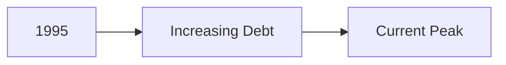

Interpretation:

> “Debt is historically catastrophic.”

## Historical Context Narrative

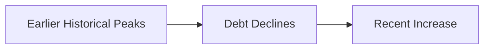

Interpretation:

> “Debt increased recently but is not historically unprecedented.”

## Why Context Changes Meaning

Humans interpret patterns relatively.

Without historical context:

- recent increases appear unique
    

With context:

- they may appear cyclical or moderate
    

This demonstrates a foundational principle:

> Timeframe selection is itself a storytelling decision.

## The Ethical Responsibility of Analysts

The lecture emphasizes:

> analysts should prioritize accuracy over aesthetics.

This is extremely important.

Many misleading charts emerge because analysts optimize for:

- dramatic impact
    
- persuasive framing
    
- visual intensity
    

instead of:

- proportional understanding
    
- contextual honesty
    

## Best Practices Against Cherry Picking

## 1. Use Longer Timelines When Relevant

Avoid artificially narrow windows unless justified.

## 2. Provide Historical Benchmarks

Context improves interpretability.

## 3. Add Caveats

Explicitly state:

- timeframe limitations
    
- missing historical data
    
- scope constraints
    

## 4. Explain Why the Period Was Chosen

This increases interpretive transparency.

## Example of Responsible Framing

Instead of:

> “Debt is at catastrophic historical highs.”

Say:

> “Debt has increased substantially since 1995, though historical debt levels were higher during earlier periods.”

This preserves:

- factual integrity
    
- contextual accuracy
    

## Accuracy vs Aesthetics

The lecture makes an important philosophical point:

> visual appeal should never override interpretive truth.

A visually dramatic chart that misleads:

- fails analytically
    
- even if aesthetically impressive
    

Good visualization prioritizes:

- clarity
    
- proportionality
    
- contextual honesty
    

## Color Saturation and Visual Attention Manipulation

The lecture then transitions into another subtle manipulation mechanism:

> misuse of color saturation.

This is especially important because humans process color pre-attentively.

## What Is Color Saturation?

Saturation refers to:

- intensity
    
- vividness
    
- visual strength of color
    

Highly saturated colors:

- attract attention immediately
    

Muted colors:

- recede into background perception
    

## COVID-19 Example

The lecture references a map showing COVID-positive cases across the United States.

The issue:

- darker colors were assigned inconsistently relative to actual importance
    

For example:

- some states with fewer cases visually attracted more attention because of darker saturation
    

Meanwhile:

- larger states with much higher counts appeared visually weaker.
    

## Why This Is Misleading

Humans instinctively associate:

- darker shades with larger magnitude
    
- stronger color with greater severity
    

This is automatic perception.

If saturation encoding does not align with magnitude:

- attention becomes distorted
    

## Pre-attentive Attention Hijacking

The lecture highlights states like:

- Wyoming
    
- Minnesota
    
- Pennsylvania
    

drawing disproportionate visual attention.

Meanwhile states with larger actual case counts such as:

- California
    
- Texas
    
- Illinois
    

appeared less visually dominant.

## Why This Happens

The visual system prioritizes:

1. color intensity
    
2. contrast
    
3. brightness
    
4. spatial prominence
    

before numerical reasoning occurs.

This means:

> color encoding directly shapes perceived importance.

## Good Color Encoding Principles

## Sequential Data

For ordered magnitude:

- use progressively increasing saturation
    

Example:  
light → medium → dark

where darker means:

- larger value
    
- greater intensity
    

## Categorical Data

Use distinct hues rather than saturation gradients.

## Avoid Arbitrary Emphasis

Color should encode:

- meaning  
    not
    
- emotional manipulation
    

## Common Color Misuse Patterns

|Misuse|Result|
|---|---|
|Over-saturated minor categories|Distracts attention|
|Arbitrary dark colors|Implies false severity|
|Red-green misuse|Accessibility issues|
|Excessive color variety|Cognitive overload|
|Inconsistent gradients|Interpretive confusion|

## The Deeper Principle

This lecture section reinforces a crucial truth:

> Human perception is hierarchical and biased.

People do not analyze charts mathematically first.

They react first to:

- shape
    
- color
    
- contrast
    
- motion
    
- spatial prominence
    

Only afterward do they consciously inspect numbers.

That means visualization design directly shapes:

- interpretation
    
- emotional reaction
    
- perceived urgency
    

## Strategic Insight

Cherry picking and color manipulation both exploit the same fundamental mechanism:

> selective attention control.

The analyst decides:

- what users notice first
    
- what feels important
    
- what fades into the background
    

This is why visualization is never purely neutral.

## Final Lesson

The strongest visualization practitioners constantly ask:

1. Am I showing representative context?
    
2. Is my timeframe selectively biased?
    
3. Does color accurately reflect magnitude?
    
4. Am I emphasizing truth or emotion?
    
5. Would the audience reach the same conclusion if all context were visible?
    

Because ultimately:

> misleading dashboards rarely rely on false numbers.  
> They rely on selective perception.

===
## Misuse of Color Saturation in Visualization

The lecture concludes with a final but extremely important visualization principle:

> Color intensity must correspond logically to data intensity.

When this relationship breaks:

- attention becomes distorted
    
- importance becomes misrepresented
    
- audiences draw incorrect conclusions
    

## The COVID Case Map Example

The lecture discusses a COVID-19 case map across the United States.

The issue:

- darker color saturation was applied inconsistently
    

As a result:

- states with fewer cases visually appeared more important
    
- states with larger outbreaks appeared visually weaker
    

This caused viewers to focus more on states like:

- Arizona
    
- Wyoming
    
- Minnesota
    

instead of states with substantially higher counts such as:

- Texas
    
- California
    
- Florida
    
- New York
    

## Why This Happens

Human visual cognition prioritizes:

1. contrast
    
2. saturation
    
3. brightness
    
4. spatial prominence
    

before:

- reading legends
    
- inspecting scales
    
- checking actual numbers
    

This means:

> darker colors automatically feel more significant.

## Color as a Pre-attentive Attribute

Color is one of the strongest pre-attentive visual features.

Humans process color almost instantly.

That makes it extremely powerful for:

- highlighting trends
    
- emphasizing anomalies
    
- guiding attention
    

But it also makes misuse dangerous.

## Correct Use of Saturation

For quantitative data:

- darker or stronger colors should represent higher intensity consistently.
    

Example:

|Value Magnitude|Appropriate Saturation|
|---|---|
|Low|Light shade|
|Medium|Moderate shade|
|High|Dark shade|

This creates intuitive interpretation.

## Counterintuitive Saturation

The lecture warns against:

> counterintuitive encoding.

Example:

- darker colors representing smaller quantities
    
- lighter colors representing larger quantities
    

This reverses natural expectation.

Just like inverted axes:

- it breaks perceptual consistency.
    

## Why Legends Matter

The lecture ends with an important practical warning:

> Always inspect the legend carefully.

Many misleading visualizations rely on the fact that:

- audiences rarely inspect legends deeply
    

Instead, viewers rely on:

- instinctive interpretation
    
- visual cues
    
- rapid perception
    

This creates opportunities for:

- accidental distortion
    
- manipulative framing
    
- interpretive confusion
    

## Visualization Literacy

This entire lecture ultimately teaches:

> reading charts critically is a skill.

Good visualization consumers should always verify:

- axes
    
- scales
    
- baselines
    
- legends
    
- time ranges
    
- grouping logic
    
- proportional encoding
    

## Summary of Misleading Visualization Techniques

|Technique|How It Misleads|
|---|---|
|Inverted axis|Reverses intuitive interpretation|
|Truncated baseline|Exaggerates differences|
|Scale compression|Hides trends|
|Dual-axis misuse|Implies false relationships|
|Correlation framing|Suggests false causality|
|Cherry picking|Distorts historical context|
|Selective drill-down|Pushes narratives|
|Decorative clutter|Obscures meaning|
|Color saturation misuse|Misdirects attention|

## Core Analytical Principle

A visualization should preserve:

> perceptual honesty.

Meaning:

- what viewers instinctively perceive  
    should align with
    
- the underlying numerical reality
    

If those diverge:  
the chart becomes misleading even if the raw data is technically correct.

## Final Strategic Insight

The lecture repeatedly reinforces a deeper truth:

> Visualization is cognitive engineering.

Charts influence:

- attention
    
- emotion
    
- memory
    
- interpretation
    
- decisions
    

That means dashboard designers and analysts are not merely:

- formatting visuals
    
- arranging metrics
    

They are shaping:

- organizational narratives
    
- strategic understanding
    
- public perception
    

## Best Practices for Ethical Visualization

## As an Analyst

Always:

- preserve proportionality
    
- use intuitive scales
    
- provide contextual timelines
    
- label clearly
    
- avoid overstating conclusions
    
- separate correlation from causation
    
- use color consistently
    

## As a Reader

Always verify:

- axis orientation
    
- scale ranges
    
- legends
    
- baselines
    
- timeframe selection
    
- grouping logic
    
- hidden assumptions
    

## Final Takeaway

The strongest visualizations are not:

- the most dramatic
    
- the most colorful
    
- the most visually complex
    

They are the ones where:

> immediate visual intuition matches statistical truth.

That alignment is the foundation of trustworthy analytics.

Tags: #statistics #machine-learning #data-science #statistical-modelling