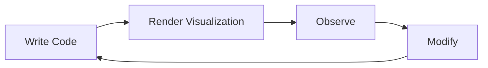

# Effective Learning Loop

```mermaid
flowchart LR
    A[Write Code] --> B[Render Visualization]
    B --> C[Observe]
    C --> D[Modify]
    D --> A
```

This iterative cycle builds:

- visual intuition
    
- debugging skill
    
- design judgment
