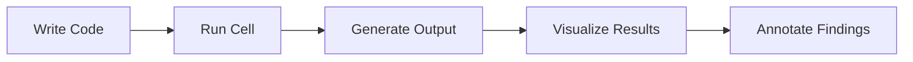

# Notebook Workflow

```mermaid
flowchart LR
    A[Write Code] --> B[Run Cell]
    B --> C[Generate Output]
    C --> D[Visualize Results]
    D --> E[Annotate Findings]
```

This makes notebooks ideal for:

- teaching
    
- exploratory analysis
    
- ML experimentation
    
- reporting
    
- reproducible research
