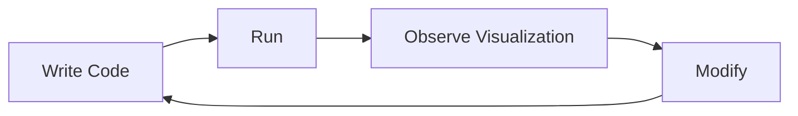

# The Iterative Learning Model

```mermaid
flowchart LR
    A[Write Code] --> B[Run]
    B --> C[Observe Visualization]
    C --> D[Modify]
    D --> A
```

This cycle develops:

- intuition
    
- debugging ability
    
- visual reasoning
