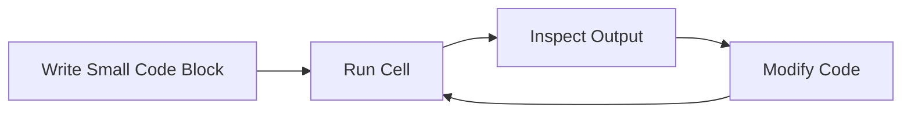

# Typical Workflow

```mermaid
flowchart LR
    A[Write Small Code Block] --> B[Run Cell]
    B --> C[Inspect Output]
    C --> D[Modify Code]
    D --> B
```

This iterative cycle is central to:

- data science
    
- visualization
    
- ML experimentation
