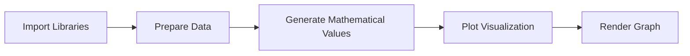

# Core Workflow of Visualization in Python

The lecture implicitly demonstrates a standard visualization workflow:

This pipeline appears repeatedly in:

- data science
    
- analytics
    
- machine learning
    
- scientific computing
