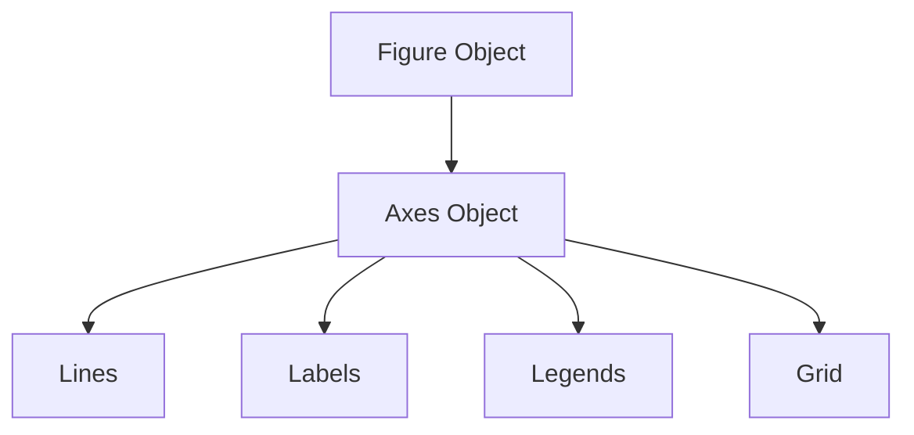

# Internal Structure

```mermaid
flowchart TD
    A[Figure Object] --> B[Axes Object]
    B --> C[Lines]
    B --> D[Labels]
    B --> E[Legends]
    B --> F[Grid]
```

Everything is added to the axes object.
