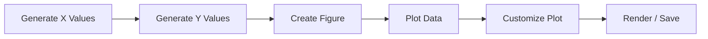

# Recap of the Plotting Workflow

The lecture summarizes the full visualization pipeline:

```mermaid
flowchart LR
    A[Generate X Values] --> B[Generate Y Values]
    B --> C[Create Figure]
    C --> D[Plot Data]
    D --> E[Customize Plot]
    E --> F[Render / Save]
```

This is the standard structure behind most scientific and analytical plotting workflows.
