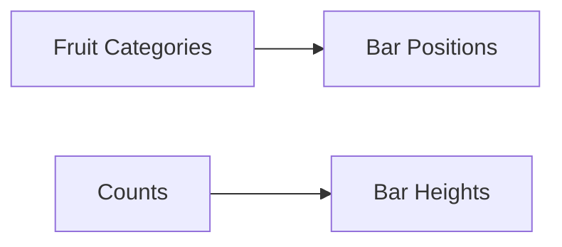

# What Happens Internally?

```mermaid
flowchart LR
    A[Fruit Categories] --> B[Bar Positions]
    C[Counts] --> D[Bar Heights]
```

Matplotlib:

- places categories on X-axis
    
- maps counts to bar heights
