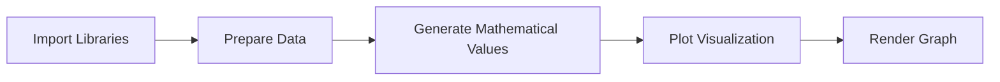
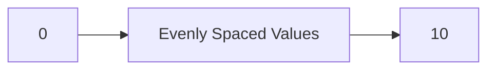
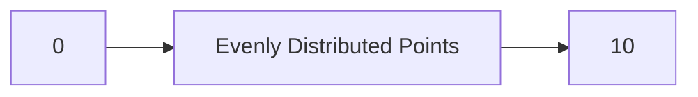
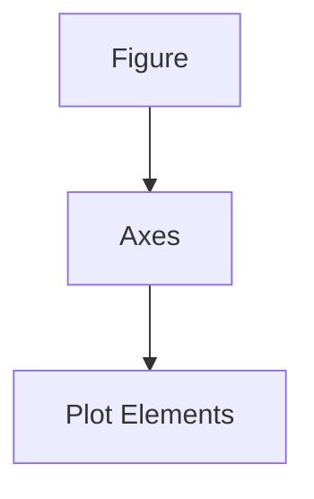
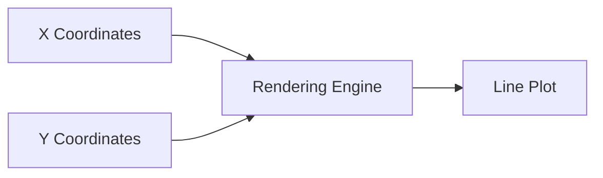
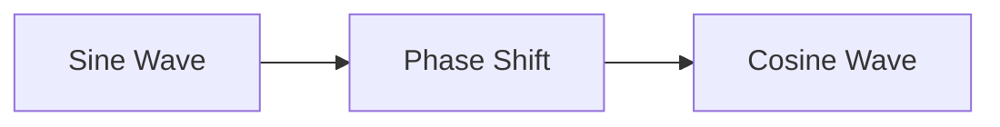
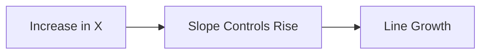
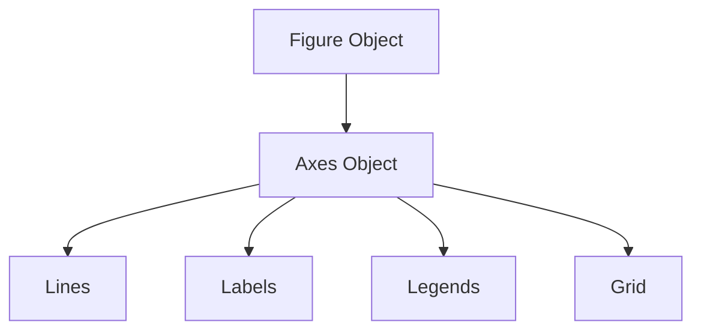
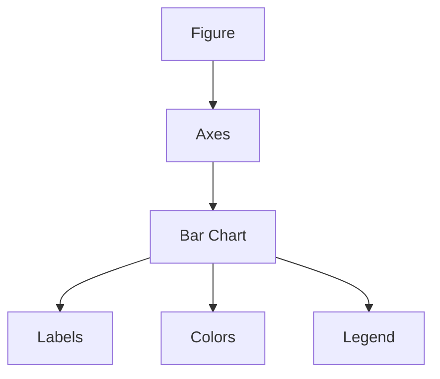
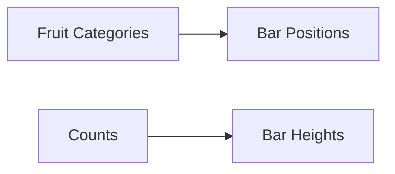

## Getting Started with Matplotlib

This lecture transitions from visualization theory into practical implementation using the Python visualization library Matplotlib.

The goal is simple:

- generate a sine wave
    
- understand plotting workflow
    
- introduce basic visualization mechanics in Python
    

But underneath this simple example are several foundational ideas:

- data preparation
    
- library imports
    
- plotting pipelines
    
- notebook execution
    
- mathematical visualization
    

## Why Matplotlib Matters

Matplotlib is one of the foundational visualization libraries in the Python ecosystem.

It provides:

- static plots
    
- line charts
    
- scatter plots
    
- histograms
    
- bar charts
    
- subplot systems
    
- annotation tools
    

Most modern Python visualization libraries either:

- build on top of Matplotlib  
    or
    
- imitate its plotting model.
    

Examples:

- Seaborn
    
- Pandas plotting
    
- many scientific visualization tools
    

## Core Workflow of Visualization in Python

The lecture implicitly demonstrates a standard visualization workflow:



This pipeline appears repeatedly in:

- data science
    
- analytics
    
- machine learning
    
- scientific computing
    

## 1. Importing Libraries

The lecture begins with importing required libraries.

Typical imports:

```python
import matplotlib.pyplot as plt
import numpy as np
```

## Why Libraries Are Needed

Python itself contains minimal built-in visualization capability.

Libraries provide:

- mathematical functions
    
- plotting engines
    
- rendering systems
    
- numerical computation tools
    

## Understanding the Import Statement

## Matplotlib Import

```python
import matplotlib.pyplot as plt
```

This imports the plotting interface.

`pyplot` behaves similarly to a graphing canvas.

The alias:

```python
plt
```

is simply shorthand.

Without aliasing:  
you would repeatedly write:

```python
matplotlib.pyplot.plot()
```

Instead:

```python
plt.plot()
```

This is cleaner and conventional.

## NumPy Import

```python
import numpy as np
```

NumPy provides:

- arrays
    
- mathematical operations
    
- vectorized computation
    
- numerical functions
    

Most scientific Python workflows depend heavily on NumPy.

## 2. Inline Plot Rendering

The lecture references:

```python
%matplotlib inline
```

This is commonly used in:

- Jupyter notebooks
    
- Google Colab notebooks
    

Purpose:

- display plots directly inside the notebook
    

Without it:

- plots may open externally
    
- rendering behavior changes
    

## Why Notebook Visualization Matters

Notebook-based workflows are important because they combine:

- code
    
- explanation
    
- output
    
- charts
    

inside a single interactive document.

This is why tools like:

- Jupyter Notebook
    
- Google Colab
    

became dominant in data science education.

## 3. Comments and Annotations

The lecture explains the hash symbol:

```python
## This is a comment
```

Anything following `#` becomes:

- non-executable text
    
- documentation
    
- annotation
    

## Why Comments Matter

Comments improve:

- readability
    
- maintainability
    
- collaboration
    
- debugging
    

Good code is not merely executable.

It should also be:

- understandable
    
- explainable
    
- maintainable
    

## Example

```python
## Create x values from 0 to 10
x = np.linspace(0, 10, 100)
```

Without the comment:  
future readers may not understand intent immediately.

## 4. Creating Data with `linspace`

The lecture introduces:

```python
np.linspace()
```

This is one of the most important NumPy functions.

Purpose:

- generate evenly spaced numerical values over an interval.
    

General structure:

```python
np.linspace(start, stop, num_points)
```

Example:

```python
x = np.linspace(0, 10, 100)
```

Meaning:

- start at 0
    
- end at 10
    
- generate 100 evenly spaced values
    

## Visual Intuition



## Why Even Spacing Matters

Smooth plots require:

- dense sampling
    
- continuous intervals
    

If too few points exist:

- curves become jagged
    
- visual quality decreases
    

## 5. Generating the Sine Wave

The lecture aims to create a sine curve.

The sine function is:

genui{"math_block_widget_always_prefetch_v2":{"content":"y = \sin(x)"}}

This produces oscillating values between:

- -1 and 1
    

## Why Sine Waves Are Common Teaching Examples

Sine waves demonstrate:

- continuous functions
    
- periodic behavior
    
- smooth curves
    
- mathematical visualization
    

They are widely used in:

- signal processing
    
- physics
    
- machine learning
    
- audio engineering
    
- wave mechanics
    

## Example Code

```python
import matplotlib.pyplot as plt
import numpy as np

## Generate x values
x = np.linspace(0, 10, 100)

## Compute sine values
y = np.sin(x)

## Plot graph
plt.plot(x, y)

## Display plot
plt.show()
```

## What Happens Internally

## Step 1

```python
x = np.linspace(0, 10, 100)
```

Creates:

- 100 numerical positions
    

## Step 2

```python
y = np.sin(x)
```

Computes sine for every x value.

NumPy performs this efficiently using:

- vectorized computation
    

## Step 3

```python
plt.plot(x, y)
```

Creates the line graph.

## Step 4

```python
plt.show()
```

Renders the figure visually.

## Vectorized Computation

An important hidden concept here:

```python
y = np.sin(x)
```

works on the entire array simultaneously.

This is called:

> vectorization.

Without NumPy:  
you would need loops.

Example:

```python
y = []

for value in x:
    y.append(math.sin(value))
```

NumPy avoids explicit loops and is much faster.

## Why Matplotlib Became Popular

Matplotlib became dominant because it:

- integrates tightly with NumPy
    
- supports scientific workflows
    
- provides fine-grained customization
    
- works well in notebooks
    

Even though newer libraries exist, Matplotlib remains foundational.

## Common Beginner Errors

## 1. Missing Imports

```python
NameError: plt is not defined
```

Occurs if Matplotlib is not imported.

## 2. Forgetting `show()`

Some environments require explicit rendering.

## 3. Using Text Without `#`

Notebook interprets plain text as Python code and throws syntax errors.

## 4. Shape Mismatch

If x and y lengths differ:

```python
ValueError: x and y must have same first dimension
```

## Key Educational Insight from the Lecture

The lecture subtly teaches an important mindset:

> Visualization begins with data generation.

Before charts:

- values must exist
    
- structures must be created
    
- mathematical relationships must be modeled
    

This is why visualization is deeply connected to:

- computation
    
- mathematics
    
- programming
    
- numerical systems
    

## Final Takeaway

This lecture introduces the foundational visualization workflow in Python:

1. Import libraries
    
2. Generate data
    
3. Apply mathematical transformation
    
4. Plot values
    
5. Render visualization
    

The sine-wave example may seem simple.

But it introduces core concepts that underpin:

- data science
    
- ML visualization
    
- dashboard engineering
    
- exploratory analysis
    
- scientific computing
    

Everything from:

- stock charts  
    to
    
- neural network loss curves  
    follows essentially the same pipeline.

## Building and Customizing Plots in Matplotlib

This section moves from:

- generating data  
    to
    
- constructing and customizing plots.
    

The lecture introduces one of the most important ideas in visualization engineering:

> plotting is not just drawing.  
> It is controlled visual communication.

## 1. Creating Numerical Data with `linspace`

The lecture revisits:

```python
np.linspace()
```

General structure:

```python
np.linspace(start, stop, number_of_points)
```

Example:

```python
x = np.linspace(0, 10, 100)
```

Meaning:

- start at 0
    
- stop at 10
    
- create 100 evenly spaced values
    

## Visual Intuition



## Why Dense Sampling Matters

The more points generated:

- the smoother the curve
    

Too few points:

- jagged visualization
    
- inaccurate visual approximation
    

## Example Comparison

## Sparse Sampling

```python
x = np.linspace(0, 10, 5)
```

Produces:

- rough curve approximation
    

## Dense Sampling

```python
x = np.linspace(0, 10, 1000)
```

Produces:

- smooth continuous curve
    

## 2. Generating the Sine Function

The lecture defines:

```python
y = np.sin(x)
```

This computes:

genui{"math_block_widget_always_prefetch_v2":{"content":"y = \sin(x)"}}

for every value inside the array `x`.

## Important Hidden Concept: Vectorized Computation

NumPy applies the sine function:

- to the entire array simultaneously
    

This is efficient because:

- operations are implemented in optimized low-level code
    

This avoids Python loops.

## Mathematical Behavior of the Sine Wave

The sine function:

- oscillates periodically
    
- alternates between positive and negative values
    

Properties:

|Property|Value|
|---|---|
|Maximum|1|
|Minimum|-1|
|Period|(2\pi)|

## Visual Shape


## 3. Creating a Figure and Axes

The lecture introduces:

```python
fig, ax = plt.subplots()
```

This is one of the most important plotting patterns in modern Matplotlib.

## Why `subplots()` Matters

Matplotlib internally separates:

- the figure
    
- the plotting area (axes)
    

## Figure

The outer container.

## Axes

The actual graphing region.

## Conceptual Structure



## Why This Design Is Powerful

This structure enables:

- multiple plots
    
- subplot grids
    
- advanced customization
    
- dashboard-like layouts
    

## Example

```python
fig, ax = plt.subplots()
```

Creates:

- one figure
    
- one plotting area
    

## 4. Plotting the Data

The lecture then uses:

```python
ax.plot(x, y, label='sine')
```

This means:

- plot x values horizontally
    
- plot y values vertically
    
- assign legend label `"sine"`
    

## Internal Plotting Logic



## Why Labels Matter

The label:

```python
label='sine'
```

becomes useful when:

- multiple lines exist
    
- legends are added
    

Without labels:

- legends cannot describe curves properly.
    

## 5. Customizing the Plot

The lecture emphasizes an extremely important principle:

> Visualization is not merely plotting.  
> It is customization for communication.

This is the essence of effective analytics.

## Adding a Title

```python
ax.set_title("Simple Sine Wave")
```

Titles answer:

> What is this chart about?

Without titles:

- interpretation slows
    
- ambiguity increases
    

## Axis Labels

```python
ax.set_xlabel("X-axis")
ax.set_ylabel("Y-axis")
```

Axis labels define:

- measurement meaning
    
- units
    
- dimensions
    

Without labels:

- charts lose interpretability
    

## Why Labeling Matters

Poorly labeled dashboards are one of the biggest enterprise BI problems.

Common failures:

- missing units
    
- vague metrics
    
- ambiguous time scales
    
- undefined abbreviations
    

Good labeling reduces:

- cognitive effort
    
- interpretation error
    

## 6. Legends

The lecture references legends:

```python
ax.legend()
```

Legends explain:

- line identity
    
- category meaning
    
- color mapping
    

Especially important for:

- multi-series charts
    
- comparative visualization
    

## Example

```python
ax.plot(x, np.sin(x), label='sine')
ax.plot(x, np.cos(x), label='cosine')

ax.legend()
```

## Result

|Line|Meaning|
|---|---|
|sine|Sine wave|
|cosine|Cosine wave|

## 7. Rendering the Plot

The lecture mentions:

```python
plt.show()
```

Purpose:

- explicitly display the figure
    

## Why `show()` Exists

Matplotlib separates:

- plot construction  
    from
    
- rendering
    

This enables:

- staged customization
    
- multiple modifications before display
    

## Full Example

```python
import matplotlib.pyplot as plt
import numpy as np

## Generate x values
x = np.linspace(0, 10, 100)

## Generate sine values
y = np.sin(x)

## Create figure and axes
fig, ax = plt.subplots()

## Plot the sine wave
ax.plot(x, y, label='sine')

## Add chart title
ax.set_title("Simple Sine Wave")

## Add axis labels
ax.set_xlabel("X-axis")
ax.set_ylabel("Y-axis")

## Add legend
ax.legend()

## Display plot
plt.show()
```

## Why Customization Matters

The lecture correctly emphasizes:

> visualization is about making information more discernible and appealing.

But importantly:  
“appealing” should not mean:

- decorative overload
    
- chartjunk
    
- unnecessary complexity
    

Good customization improves:

- readability
    
- hierarchy
    
- interpretability
    
- attention guidance
    

## The Hidden Philosophy of Matplotlib

Matplotlib is fundamentally:

> stateful graphical programming.

You are:

- creating objects
    
- modifying properties
    
- controlling rendering behavior
    

This is why Matplotlib can become extremely sophisticated for:

- scientific publishing
    
- dashboards
    
- research visualization
    
- engineering systems
    

## Common Beginner Mistakes

## 1. Forgetting Legends

Multiple lines become ambiguous.

## 2. Missing Labels

Charts lose interpretability.

## 3. Plotting Before Defining Data

Causes variable errors.

## 4. Over-customization

Too many:

- colors
    
- fonts
    
- styles
    
- annotations
    

reduce clarity.

## Strategic Insight

This lecture introduces a foundational visualization mindset:

> Raw plots are only the beginning.

Effective visualization requires:

- structure
    
- annotation
    
- semantic clarity
    
- visual hierarchy
    
- contextual framing
    

A chart without thoughtful customization is often:

- technically correct  
    but
    
- communicatively weak.
    

That distinction separates:

- coding plots  
    from
    
- designing visual analytics systems.

## Plotting Multiple Functions in Matplotlib

This section extends the earlier sine-wave example into:

- multi-line plotting
    
- styling customization
    
- legends
    
- grids
    
- saving figures
    
- plotting linear equations
    

The lecture is now introducing the transition from:

> basic plotting  
> to  
> structured visualization design.

## Recap of the Plotting Workflow

The lecture summarizes the full visualization pipeline:


This is the standard structure behind most scientific and analytical plotting workflows.

## 1. Plotting Multiple Functions

The lecture adds a second function:

- cosine
    

The original sine function:

genui{"math_block_widget_always_prefetch_v2":{"content":"y = \sin(x)"}}

Now adds:

genui{"math_block_widget_always_prefetch_v2":{"content":"y = \cos(x)"}}

## Why Multi-Line Plots Matter

Multiple plots are useful for:

- comparison
    
- trend analysis
    
- signal analysis
    
- forecasting
    
- model evaluation
    

Examples:

- actual vs predicted values
    
- revenue vs expenses
    
- training loss vs validation loss
    

## Defining the Cosine Function

```python
y2 = np.cos(x)
```

Now:

- `y` stores sine values
    
- `y2` stores cosine values
    

Both share the same x-axis.

## Mathematical Relationship

Sine and cosine are phase-shifted periodic functions.

They are closely related:

\cos(x)=\sin\left(x+\frac{\pi}{2}\right)

## Visual Intuition



## 2. Plotting the Second Line

The lecture uses:

```python
ax.plot(x, y2, color='red', linestyle='--', label='cosine')
```

This introduces several important customization concepts.

## Understanding Plot Parameters

## `color='red'`

Sets line color.

Purpose:

- distinguish datasets visually
    

## `linestyle='--'`

Creates dashed lines instead of continuous lines.

Useful for:

- comparisons
    
- projections
    
- secondary metrics
    

## `label='cosine'`

Defines legend text.

## Why Styling Matters

Without styling:  
multiple lines become difficult to distinguish.

Good styling improves:

- interpretability
    
- visual separation
    
- cognitive clarity
    

## Common Line Styles

|Style|Meaning|
|---|---|
|`-`|Solid line|
|`--`|Dashed line|
|`:`|Dotted line|
|`-.`|Dash-dot|

## Example

```python
ax.plot(x, y, color='blue', linestyle='-', label='sine')
ax.plot(x, y2, color='red', linestyle='--', label='cosine')
```

## 3. Legends

The lecture correctly notes:

> legends become necessary once multiple plots exist.

Adding:

```python
ax.legend()
```

creates automatic mapping between:

- colors
    
- line styles
    
- labels
    

## Why Legends Matter

Without legends:

- users cannot identify curves confidently
    

Especially problematic in:

- dashboards
    
- scientific reports
    
- ML experiments
    

## 4. Adding Grids

The lecture introduces:

```python
ax.grid(True)
```

This overlays grid lines onto the plot.

## Purpose of Grids

Grids improve:

- readability
    
- value estimation
    
- coordinate tracking
    

Especially useful for:

- engineering plots
    
- scientific charts
    
- educational visuals
    

## Visual Effect

Without grid:

- cleaner appearance
    
- less clutter
    

With grid:

- better numerical interpretation
    

## Tradeoff

Too much grid intensity creates:

- visual noise
    
- distraction
    

Good practice:

- subtle grids
    
- low opacity
    
- restrained styling
    

## 5. Saving Figures

The lecture introduces:

```python
fig.savefig("myplot.png")
```

This exports the chart as an image.

## Why Saving Matters

Plots are often reused in:

- PowerPoint presentations
    
- Word documents
    
- reports
    
- dashboards
    
- research papers
    

## Common File Formats

|Format|Usage|
|---|---|
|PNG|General presentations|
|JPG|Compressed images|
|PDF|High-quality vector graphics|
|SVG|Scalable web graphics|

## Example

```python
fig.savefig("sine_cosine_plot.png")
```

## Important Hidden Concept

The figure object:

```python
fig
```

contains the entire visualization canvas.

This is why saving happens through:

```python
fig.savefig()
```

rather than:

```python
ax.savefig()
```

## 6. Syntax Errors and Notebook Behavior

The lecture demonstrates a common beginner issue:

- accidentally pasting text into a code cell
    

This produces:

```python
SyntaxError
```

because plain English is not valid Python.

## Important Notebook Distinction

|Cell Type|Purpose|
|---|---|
|Code cell|Executable Python|
|Text/Markdown cell|Documentation and explanation|

## Why This Matters

Good notebooks combine:

- code
    
- explanation
    
- interpretation
    

This is why notebook systems became popular in:

- education
    
- data science
    
- ML experimentation
    

## 7. Plotting a Linear Equation

The lecture introduces a new exercise:

genui{"math_block_widget_always_prefetch_v2":{"content":"y = 2x + 5"}}

This is a straight-line equation.

## Mathematical Meaning

General linear form:

genui{"math_block_widget_always_prefetch_v2":{"content":"y = mx + c"}}

Where:

- (m) = slope
    
- (c) = intercept
    

In this example:

- slope = 2
    
- intercept = 5
    

## Visual Interpretation



## Defining X Values

```python
x = np.linspace(-5, 5, 100)
```

Meaning:

- generate values from -5 to 5
    

## Defining Y Values

```python
y = 2 * x + 5
```

This applies the equation to every x value.

## Why Vectorization Matters Again

NumPy automatically computes:

- all y values simultaneously
    

No loops required.

## Full Example

```python
import matplotlib.pyplot as plt
import numpy as np

## Generate x values
x = np.linspace(-5, 5, 100)

## Define linear equation
y = 2 * x + 5

## Create figure and axes
fig, ax = plt.subplots()

## Plot the line
ax.plot(x, y, color='blue', label='y = 2x + 5')

## Add title and labels
ax.set_title("Linear Function")
ax.set_xlabel("X-axis")
ax.set_ylabel("Y-axis")

## Add grid and legend
ax.grid(True)
ax.legend()

## Show plot
plt.show()
```

## What This Teaches Conceptually

This section introduces a crucial idea:

> visualizations are mathematical objects rendered graphically.

The plotting pipeline converts:

- equations  
    into
    
- visual geometry.
    

This connection between:

- algebra
    
- arrays
    
- rendering
    

is foundational to:

- scientific computing
    
- ML visualization
    
- simulation systems
    
- data analysis
    

## Strategic Insight

The lecture gradually moves students from:

- using charts  
    to
    
- thinking computationally about visualization.
    

This distinction matters.

A dashboard engineer is not merely:

- dragging chart widgets
    

They are:

- encoding mathematical relationships visually
    
- designing interpretive systems
    
- controlling perception through computation.
## Customizing Matplotlib Visualizations

This section focuses on an important transition:

> moving from merely generating charts  
> to  
> controlling visualization behavior deliberately.

The lecture demonstrates:

- plot customization
    
- intelligent coding assistance
    
- line styles
    
- exploratory learning
    
- reusable visualization patterns
    

## 1. Plot Space Creation with `subplots()`

The lecture repeatedly uses:

```python
fig, ax = plt.subplots()
```

This is now the central plotting pattern.

## Why This Pattern Matters

Matplotlib internally separates:

- figure container
    
- plotting axes
    

This object-oriented structure is foundational for:

- multi-panel layouts
    
- dashboard systems
    
- advanced customization
    

## Internal Structure



Everything is added to the axes object.

## 2. Plotting a Linear Function

The lecture uses the equation:

genui{"math_block_widget_always_prefetch_v2":{"content":"y = 2x + 5"}}

## Meaning of the Equation

General linear form:

genui{"math_block_widget_always_prefetch_v2":{"content":"y = mx + c"}}

Where:

- (m) = slope
    
- (c) = intercept
    

In this case:

- slope = 2
    
- intercept = 5
    

## Visual Interpretation


As (x) increases:

- (y) increases linearly.
    

## Defining Variables

```python
x = np.linspace(-5, 5, 100)
y = 2 * x + 5
```

This generates:

- evenly spaced x values
    
- corresponding y values
    

## Plotting the Line

```python
ax.plot(x, y, color='green')
```

## Why Color Matters

Color improves:

- separation
    
- categorization
    
- emphasis
    

Matplotlib supports:

- named colors
    
- RGB values
    
- HEX colors
    
- colormaps
    

Examples:

```python
color='blue'
color='red'
color='green'
```

## 3. Intelligent Coding Assistance

The lecture references code suggestions from notebook environments like:

- Google Colab
    

These systems provide:

- autocomplete
    
- parameter hints
    
- documentation previews
    

## Why This Matters

Modern development environments reduce friction by:

- exposing function signatures
    
- suggesting valid arguments
    
- surfacing inline help
    

This accelerates learning significantly.

## Example

Typing:

```python
ax.set_
```

may suggest:

- `set_title`
    
- `set_xlabel`
    
- `set_ylabel`
    

This helps beginners discover API functionality interactively.

## 4. Plot Customization

The lecture emphasizes:

> visualization is about customization and clarity.

Customization transforms:

- raw mathematical output  
    into
    
- communicative graphics.
    

## Adding Titles

```python
ax.set_title("Linear Function y = 2x + 5")
```

## Axis Labels

```python
ax.set_xlabel("X-axis")
ax.set_ylabel("Y-axis")
```

These improve:

- interpretability
    
- semantic clarity
    
- audience understanding
    

## 5. Line Styles

The lecture experiments with:

```python
linestyle='--'
```

## Common Line Styles

|Style|Appearance|
|---|---|
|`-`|Solid|
|`--`|Dashed|
|`:`|Dotted|
|`-.`|Dash-dot|

## Why Line Styles Matter

Useful when:

- printing in grayscale
    
- comparing multiple series
    
- differentiating forecast vs actual
    
- distinguishing categories
    

## Example

```python
ax.plot(x, y, color='green', linestyle='--')
```

## Important Learning Insight

The lecture intentionally demonstrates:

- trial and error
    
- experimentation
    
- debugging
    

This is critical.

Visualization programming is learned primarily through:

> iterative experimentation.

## The Debugging Mindset

The instructor shows:

- trying styles
    
- making syntax mistakes
    
- correcting code interactively
    

This is realistic engineering workflow.

Good programmers:

- test incrementally
    
- inspect outputs
    
- refine continuously
    

## Common Beginner Syntax Errors

## Incorrect Line Style

Wrong:

```python
linestyle='dot'
```

Correct:

```python
linestyle=':'
```

## Why Errors Matter Educationally

Errors teach:

- API structure
    
- parameter expectations
    
- syntax conventions
    

Reading error messages is an important technical skill.

## 6. Learning Through Examples

The lecture makes a strong pedagogical point:

> You do not need to memorize every Matplotlib feature.

Instead:

- master common patterns deeply.
    

## Important Industry Reality

Most business visualization tasks repeatedly use:

- line charts
    
- bar charts
    
- scatter plots
    
- histograms
    
- heatmaps
    
- pie charts
    
- box plots
    

A relatively small set of visual forms solves most analytical problems.

## Approximate Pareto Principle

The lecture implicitly references a 90/10 rule:

> 10–15 chart types solve the majority of business visualization needs.

Therefore focus should be:

- mastery  
    not
    
- exhaustive memorization
    

## Important Skill Hierarchy

## Weak Approach

Knowing many chart names superficially.

## Strong Approach

Deeply understanding:

- customization
    
- interpretation
    
- implementation
    
- design tradeoffs
    

for common charts.

## 7. Exploring Example Libraries

The lecture begins exploring Matplotlib examples:

- infinite lines
    
- bar charts
    
- category plots
    

This reflects an important learning strategy:

> study working examples and modify them.

## Why Example-Driven Learning Works

Visualization libraries are huge.

Practical mastery comes from:

1. finding templates
    
2. understanding components
    
3. modifying incrementally
    

This mirrors real-world engineering practice.

## Example Workflow


## Bar Charts

The lecture starts discussing bar charts.

Bar charts are among the most important business visuals because humans compare lengths very effectively.

Typical use cases:

- category comparison
    
- KPI comparison
    
- ranking
    
- frequency analysis
    

## Simple Example

```python
categories = ['A', 'B', 'C']
values = [10, 20, 15]

fig, ax = plt.subplots()

ax.bar(categories, values)

plt.show()
```

## Why Bar Charts Are Powerful

Humans estimate:

- relative length  
    very accurately.
    

This makes bar charts highly effective for:

- comparisons
    
- ranking tasks
    

## Strategic Insight

This lecture is gradually teaching a deeper engineering mindset:

> Visualization is programmable perception control.

You are not merely:

- drawing shapes
    

You are:

- encoding information visually
    
- guiding attention
    
- structuring interpretation
    
- designing cognitive interfaces
    

That is why visualization sits at the intersection of:

- programming
    
- mathematics
    
- psychology
    
- communication
    
- design engineering.

## Building Bar Charts in Matplotlib

This section introduces one of the most important visualization types in business analytics:

> the bar chart.

The lecture demonstrates:

- categorical visualization
    
- arrays
    
- color customization
    
- legends
    
- visual enhancement
    
- pre-attentive attributes
    

Bar charts are foundational because humans are exceptionally good at comparing:

- lengths
    
- heights
    
- aligned positions
    

That makes them one of the most effective charts for:

- comparisons
    
- rankings
    
- category analysis
    

## 1. Figure Creation

The lecture again begins with:

```python
fig, ax = plt.subplots()
```

This creates:

- the figure container
    
- the plotting axes
    

Everything is drawn inside this visualization space.

## Visualization Structure



## 2. Arrays in Python

The lecture introduces arrays conceptually.

Example:

```python
fruits = ['Apple', 'Blueberry', 'Cherry', 'Orange']
counts = [40, 100, 30, 55]
```

## What Is Happening Here?

There is positional correspondence between arrays.

|Fruit|Count|
|---|---|
|Apple|40|
|Blueberry|100|
|Cherry|30|
|Orange|55|

The first element of `fruits` corresponds to:

- first element of `counts`
    

and so on.

## Important Concept

This is essentially:

> category-to-value mapping.

Most visualization systems operate this way internally.

## Why Arrays Matter in Visualization

Visualization libraries need:

- categories
    
- coordinates
    
- values
    
- labels
    

Arrays provide structured storage for these relationships.

## 3. Basic Bar Chart

The lecture first creates a simple bar chart:

```python
ax.bar(fruits, counts)
```

## What Happens Internally?



Matplotlib:

- places categories on X-axis
    
- maps counts to bar heights
    

## Result

|Fruit|Height|
|---|---|
|Apple|40|
|Blueberry|100|
|Cherry|30|
|Orange|55|

## Why Bar Charts Are Effective

Humans compare aligned lengths accurately.

This makes bar charts excellent for:

- comparisons
    
- ranking
    
- categorical analysis
    

Better than:

- pie charts
    
- area-heavy graphics
    
- decorative visuals
    

for many business tasks.

## 4. Basic Chart vs Enhanced Chart

The lecture correctly observes:

> the default chart is functional but visually bland.

Default Matplotlib styling:

- prioritizes simplicity
    
- not presentation aesthetics
    

So customization becomes important.

## Important Visualization Principle

Customization should improve:

- readability
    
- hierarchy
    
- distinction
    
- interpretability
    

not merely:

- decoration
    

## 5. Adding Colors

The lecture creates arrays for bar colors:

```python
bar_colors = ['tab:red', 'tab:blue', 'tab:red', 'tab:orange']
```

Then passes them into:

```python
ax.bar(fruits, counts, color=bar_colors)
```

## Why Color Matters

Color is a powerful pre-attentive attribute.

Humans notice color differences instantly.

Color helps:

- distinguish categories
    
- emphasize importance
    
- group information
    
- improve memorability
    

## Pre-attentive Processing

Humans process color before conscious reasoning.

This means:

> color strongly influences attention.

## Important Warning

Color should encode:

- meaningful distinction
    

not random decoration.

Too many arbitrary colors create:

- clutter
    
- cognitive overload
    
- interpretive confusion
    

## 6. Labels and Legends

The lecture adds:

- labels
    
- legends
    
- titles
    

## Example

```python
ax.set_title("Food Supply by Kind and Color")
ax.legend()
```

## Why Legends Matter

Legends explain:

- category mappings
    
- color semantics
    
- line identities
    

Without legends:

- interpretation slows
    

## Semantic Labeling

Good labels answer:

- what is shown?
    
- what do colors mean?
    
- what units are represented?
    

## 7. The Difference Between Raw and Designed Visualization

The lecture compares:

- default blue bars  
    vs
    
- customized multicolor visualization
    

This demonstrates an important principle:

> visual design influences perception and engagement.

## But Important Nuance

“Visually appealing” should not mean:

- decorative excess
    
- unnecessary gradients
    
- chartjunk
    

Good design:

- enhances comprehension
    

Bad design:

- distracts from information
    

## Example Comparison

## Weak Visualization

```python
ax.bar(fruits, counts)
```

Functional but visually flat.

## Improved Visualization

```python
bar_colors = ['tab:red', 'tab:blue', 'tab:red', 'tab:orange']

ax.bar(fruits, counts, color=bar_colors)

ax.set_title("Food Supply by Kind and Color")
```

Now:

- categories are distinguishable
    
- visual hierarchy improves
    
- engagement increases
    

## Full Example

```python
import matplotlib.pyplot as plt

## Define categories
fruits = ['Apple', 'Blueberry', 'Cherry', 'Orange']

## Define values
counts = [40, 100, 30, 55]

## Define colors
bar_colors = ['tab:red', 'tab:blue', 'tab:red', 'tab:orange']

## Create figure
fig, ax = plt.subplots()

## Create bar chart
ax.bar(fruits, counts, color=bar_colors)

## Add title
ax.set_title("Food Supply by Kind")

## Add axis labels
ax.set_xlabel("Fruit")
ax.set_ylabel("Count")

## Show plot
plt.show()
```

## Why the Instructor Emphasizes Practice

The lecture repeatedly encourages:

- experimentation
    
- reading documentation
    
- modifying examples
    

This is the correct approach.

Visualization mastery is primarily:

> experiential.

## The Real Skill in Visualization

The difficult part is not:

- remembering syntax
    

The difficult part is:

- selecting appropriate visuals
    
- designing interpretable graphics
    
- encoding meaning clearly
    
- avoiding misleading representation
    

## The “10–15 Core Charts” Principle

The lecture makes a highly practical point:

> a small number of chart types solve most business problems.

Typically:

- line charts
    
- bar charts
    
- scatter plots
    
- histograms
    
- box plots
    
- heatmaps
    

cover the overwhelming majority of analytical tasks.

## Therefore the Real Goal Is:

Not:

- learning every chart library feature
    

But:

- mastering common charts deeply
    

Including:

- customization
    
- interpretation
    
- storytelling
    
- scaling
    
- labeling
    
- color usage
    
- audience readability
    

## Strategic Insight

This lecture ultimately reinforces a powerful idea:

> Visualization is programmable communication.

Charts are not merely:

- outputs
    
- decorations
    
- technical artifacts
    

They are:

- cognitive interfaces
    
- perception systems
    
- storytelling mechanisms
    

That is why strong visualization practitioners need:

- technical skill
    
- statistical literacy
    
- design judgment
    
- audience awareness
    
- perceptual understanding
    

simultaneously.

Tags: #statistics #machine-learning #data-science #statistical-modelling