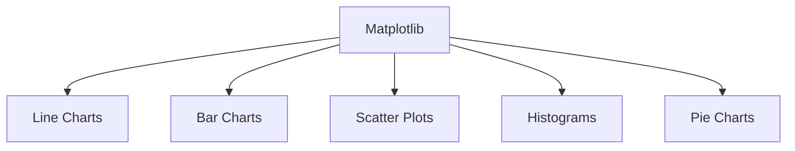
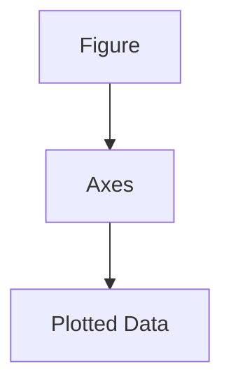
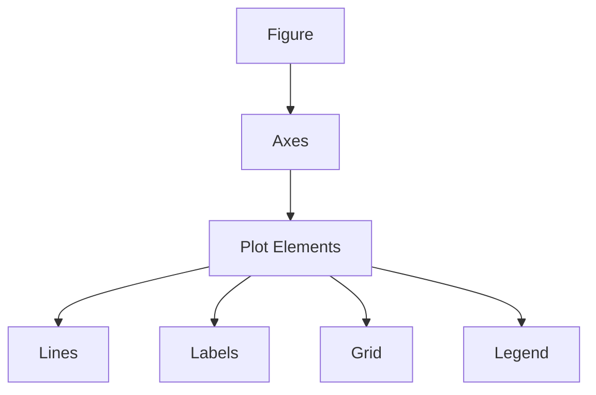
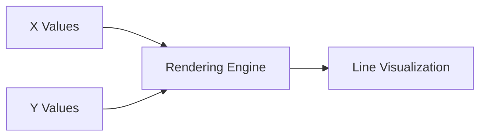
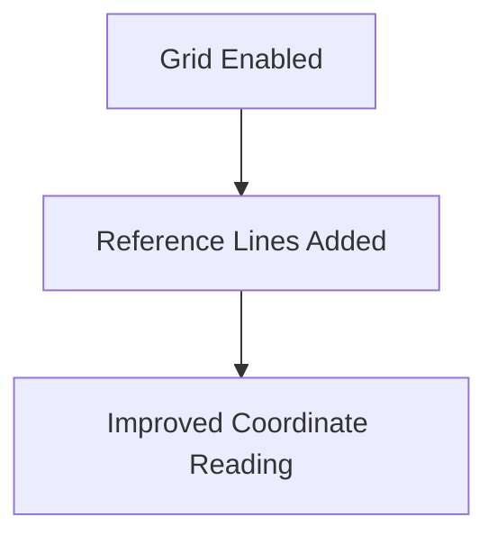

# Introduction to Matplotlib (with Python & NumPy)

# 1. What is Matplotlib?

Matplotlib is one of the foundational visualization libraries in Python.

It is used for creating:

- static plots
    
- animated plots
    
- interactive visualizations
    

Matplotlib is deeply integrated into the Python data ecosystem and works especially well with:

- NumPy
    
- pandas
    

# Core Purpose

Matplotlib converts:

- numerical data  
    into
    
- visual representations.
    

This enables:

- pattern discovery
    
- exploratory analysis
    
- communication of insights
    
- scientific visualization
    

# Typical Use Cases

|Domain|Usage|
|---|---|
|Data Science|Exploratory analysis|
|Machine Learning|Loss curves, metrics|
|Finance|Time series visualization|
|Research|Scientific plots|
|BI & Reporting|Charts and dashboards|
|Engineering|Signal and system visualization|

# Why Visualization Matters

Humans detect:

- trends
    
- anomalies
    
- clusters
    
- relationships
    

much faster visually than numerically.

Visualization transforms:

- raw values  
    into
    
- perceptual structure.
    

# Core Visualization Pipeline


# The `pyplot` Submodule

The most commonly used interface is:

```python
import matplotlib.pyplot as plt
```

`pyplot` provides:

- plotting functions
    
- figure management
    
- chart customization
    
- rendering controls
    

The alias:

```python
plt
```

is the standard convention across the Python ecosystem.

# Why Aliases Are Used

Without aliasing:

```python
matplotlib.pyplot.plot()
```

With aliasing:

```python
plt.plot()
```

Cleaner and easier to read.

# 2. Why Use Matplotlib? (Merits)

# A. Versatility

Matplotlib supports a huge range of visualizations.

# Common Chart Types

|Chart Type|Purpose|
|---|---|
|Line Plot|Trends over time|
|Bar Chart|Category comparison|
|Scatter Plot|Relationship analysis|
|Histogram|Distribution analysis|
|Pie Chart|Part-to-whole comparison|
|Box Plot|Statistical spread|
|Heatmap|Matrix intensity visualization|

# Example Visualization Types



# Why Versatility Matters

Real-world analytics problems vary significantly.

A visualization library must support:

- statistical graphics
    
- business dashboards
    
- scientific diagrams
    
- publication-quality figures
    

Matplotlib became dominant partly because of this flexibility.

# B. High Customizability

One of Matplotlib’s biggest strengths:

> nearly every visual element can be controlled.

# Customizable Components

|Component|Examples|
|---|---|
|Colors|Line/bar colors|
|Line Styles|Dashed, dotted|
|Fonts|Titles, labels|
|Figure Size|Width and height|
|Axes|Scale, ticks|
|Legends|Labels for plots|
|Grids|Readability enhancement|

# Example

```python
ax.plot(x, y, color='red', linestyle='--')
```

This changes:

- color
    
- line style
    

# Why Customization Matters

Visualization is not merely:

- generating charts
    

It is:

> designing interpretive systems.

Customization helps:

- improve clarity
    
- guide attention
    
- support storytelling
    
- reduce ambiguity
    

# Important Tradeoff

Too little customization:

- charts become bland or unclear
    

Too much customization:

- clutter
    
- distraction
    
- misleading emphasis
    

Good visualization balances:

- simplicity
    
- clarity
    
- emphasis
    

# C. Integration with NumPy and pandas

Matplotlib works naturally with:

- NumPy arrays
    
- pandas DataFrames
    

# NumPy Integration

Example:

```python
import numpy as np

x = np.linspace(0, 10, 100)
y = np.sin(x)
```

Matplotlib can directly plot NumPy arrays.

# pandas Integration

Example:

```python
import pandas as pd

df.plot()
```

Internally:

- pandas often uses Matplotlib as the rendering engine.
    

# Why This Ecosystem Matters

The Python data ecosystem is interconnected:


This creates smooth workflows for:

- data analysis
    
- machine learning
    
- scientific computing
    

# Core Philosophy of Matplotlib

Matplotlib follows a very important idea:

> visualization should be programmable.

Instead of manually drawing charts:

- code generates visual structure dynamically.
    

This enables:

- automation
    
- scalability
    
- reproducibility
    
- parameterization
    

# Example Workflow

```python
import matplotlib.pyplot as plt
import numpy as np

# Create x values
x = np.linspace(0, 10, 100)

# Compute y values
y = np.sin(x)

# Create plot
plt.plot(x, y)

# Show chart
plt.show()
```

# What Happens Internally

## Step 1

Generate numerical values.

## Step 2

Apply mathematical transformation.

## Step 3

Map values to visual coordinates.

## Step 4

Render graphical output.

# Mathematical Visualization

The sine wave example visualizes:

genui{"math_block_widget_always_prefetch_v2":{"content":"y = \sin(x)"}}

This demonstrates a critical principle:

> mathematical relationships can be translated directly into visual geometry.

# Why Matplotlib Became Foundational

Despite newer libraries existing:

- Matplotlib remains central because it is:
    
    - mature
        
    - stable
        
    - flexible
        
    - deeply integrated
        

Many libraries either:

- build on Matplotlib  
    or
    
- imitate its API philosophy.
    

# Common Beginner Mistakes

|Mistake|Problem|
|---|---|
|Missing labels|Ambiguous charts|
|Overusing colors|Visual clutter|
|Wrong chart type|Misleading interpretation|
|Missing legends|Confusion|
|Excessive decoration|Reduced readability|

# Important Visualization Principle

A technically correct chart can still fail communicatively.

Good visualization requires:

- proportional accuracy
    
- semantic clarity
    
- contextual labeling
    
- perceptual consistency
    

# Strategic Insight

Matplotlib is not just a charting library.

It is:

> a programmable visualization framework.

That distinction matters because:

- dashboards
    
- ML monitoring systems
    
- scientific reports
    
- BI pipelines
    

all fundamentally rely on:

- converting abstract numerical systems into interpretable visual form.
    

That is why visualization is deeply connected to:

- statistics
    
- cognition
    
- perception
    
- communication
    
- software engineering.

===
# Matplotlib with NumPy: Basic Plotting Workflow

# 1. Direct Plotting with Arrays and Series

One major advantage of Matplotlib is that it works directly with:

- NumPy arrays
    
- pandas Series
    
- pandas DataFrames
    

This makes it ideal for:

- data analysis
    
- machine learning
    
- scientific workflows
    

# Example with NumPy Arrays

```python
import numpy as np
import matplotlib.pyplot as plt

x = np.array([1, 2, 3, 4])
y = np.array([10, 20, 15, 30])

plt.plot(x, y)
plt.show()
```

# Why This Matters

Visualization libraries become powerful when they integrate tightly with:

- numerical computation
    
- tabular data processing
    

This allows:

- direct analytical workflows  
    without
    
- manual transformation overhead.
    

# 2. Why Matplotlib Became Widely Used

Matplotlib has become dominant because it has:

- enormous documentation
    
- extensive examples
    
- long ecosystem maturity
    
- large community support
    

This matters practically because:

- visualization debugging is common
    
- styling complexity grows quickly
    
- reusable examples accelerate learning
    

# Real Engineering Insight

Most developers rarely build complex plots entirely from memory.

Instead they:

1. search examples
    
2. adapt templates
    
3. customize incrementally
    

This is normal professional workflow.

# 3. Basic Setup

The lecture introduces the standard plotting setup:

```python
import matplotlib.pyplot as plt
import numpy as np

%matplotlib inline
```

# Understanding Each Component

# A. Importing `pyplot`

```python
import matplotlib.pyplot as plt
```

This imports the plotting interface.

`plt` is the standard alias.

# Why Aliases Matter

Without aliasing:

```python
matplotlib.pyplot.plot()
```

With aliasing:

```python
plt.plot()
```

Cleaner and faster.

# B. Importing NumPy

```python
import numpy as np
```

NumPy provides:

- arrays
    
- vectorized computation
    
- mathematical functions
    

Matplotlib depends heavily on NumPy structures internally.

# C. `%matplotlib inline`

```python
%matplotlib inline
```

This is a:

> Jupyter magic command.

Used in:

- Jupyter Notebook
    
- Google Colab
    

# Purpose

Ensures plots render:

- directly inside notebook cells
    

instead of:

- external windows.
    

# Why Notebook Rendering Matters

Notebook systems combine:

- code
    
- explanation
    
- outputs
    
- visualizations
    

inside one environment.

This transformed:

- teaching
    
- experimentation
    
- reproducible research
    

# 4. Creating a Simple Plot

The lecture now builds a sine wave visualization.

This is one of the canonical examples in scientific plotting because it demonstrates:

- smooth curves
    
- mathematical functions
    
- periodic behavior
    

# 4.1 Preparing the Data

The lecture uses:

```python
x = np.linspace(0, 10, 100)
y = np.sin(x)
```

# Understanding `linspace`

General structure:

```python
np.linspace(start, stop, num_points)
```

Meaning:

- generate evenly spaced values.
    

# Example Breakdown

```python
x = np.linspace(0, 10, 100)
```

Creates:

- 100 evenly spaced points
    
- from 0 to 10
    

# Visual Intuition


# Why Even Spacing Is Important

Smooth curves require:

- dense sampling
    

Too few points:

- jagged appearance
    
- inaccurate curve representation
    

# Generating the Sine Function

```python
y = np.sin(x)
```

This computes:

genui{"math_block_widget_always_prefetch_v2":{"content":"y = \sin(x)"}}

for every x value.

# Important Hidden Concept: Vectorization

NumPy applies the sine function:

- across the entire array simultaneously.
    

Without vectorization:  
you would need loops.

# Vectorized Version

```python
y = np.sin(x)
```

# Non-vectorized Version

```python
y = []

for value in x:
    y.append(np.sin(value))
```

Vectorization is:

- faster
    
- cleaner
    
- more memory-efficient
    

# Why Sine Waves Matter

Sine functions appear everywhere:

- physics
    
- signal processing
    
- audio engineering
    
- machine learning
    
- Fourier analysis
    

# Properties of Sine

|Property|Value|
|---|---|
|Range|[-1, 1]|
|Period|(2\pi)|
|Shape|Oscillatory|

# Visual Behavior


# 4.2 Creating Figure and Axes

The lecture introduces:

```python
fig, ax = plt.subplots()
```

This is one of the most important Matplotlib patterns.

# Understanding Figure vs Axes

## Figure

The outer visualization container.

## Axes

The actual plotting region.

# Internal Structure



# Why This Structure Exists

This design allows:

- multiple plots
    
- subplot grids
    
- independent chart customization
    
- dashboard-like layouts
    

# Example

```python
fig, ax = plt.subplots()
```

creates:

- one figure
    
- one plotting area
    

# Why `subplots()` Became Standard

Older Matplotlib code often used:

```python
plt.figure()
```

But `subplots()` is preferred because:

- cleaner structure
    
- object-oriented design
    
- easier scaling
    

# Next Step in the Workflow

After:

- creating data
    
- creating figure space
    

the next step becomes:

- plotting data onto axes
    

# Standard Plotting Pipeline


# Full Example So Far

```python
import matplotlib.pyplot as plt
import numpy as np

# Generate x values
x = np.linspace(0, 10, 100)

# Compute sine values
y = np.sin(x)

# Create figure and axes
fig, ax = plt.subplots()
```

# Strategic Insight

This lecture section introduces a foundational engineering idea:

> visualizations are computational objects.

Charts are not manually drawn.

They are:

- generated from mathematical structures
    
- rendered from numerical arrays
    
- controlled programmatically
    

This is why modern visualization sits at the intersection of:

- mathematics
    
- programming
    
- perception
    
- communication
    
- statistical reasoning.

===
# Understanding Figure, Axes, Plotting, and Customization in Matplotlib

This section introduces the core architecture of Matplotlib.

These concepts are foundational because almost every visualization in Matplotlib is built around:

- Figure objects
    
- Axes objects
    
- plotted graphical elements
    

# 1. Figure vs Axes

The lecture defines:

```python
fig, ax = plt.subplots()
```

# What Is `fig`?

```python
fig
```

represents:

> the entire canvas or container.

It includes:

- all plots
    
- titles
    
- margins
    
- subplot layouts
    
- rendering space
    

# What Is `ax`?

```python
ax
```

represents:

> the actual plotting region.

This is where:

- lines
    
- bars
    
- scatter points
    
- grids
    
- labels
    

are drawn.

# Visual Structure



# Why This Separation Matters

This architecture allows:

- multiple subplots
    
- reusable layouts
    
- advanced customization
    
- dashboard-like visual systems
    

# Example

A figure can contain:

- one axes
    
- multiple axes
    
- nested subplot arrangements
    

# Multi-Plot Example

```python
fig, axs = plt.subplots(2, 2)
```

Creates:

- one figure
    
- four plotting areas
    

# 2. Plotting the Data

The lecture introduces:

```python
ax.plot(x, y, label='Sine')
```

# What `plot()` Does

This creates a:

> line plot.

Internally:

- x values map horizontally
    
- y values map vertically
    

# Mathematical Relationship

The plotted function is:

genui{"math_block_widget_always_prefetch_v2":{"content":"y = \sin(x)"}}

# Plotting Pipeline



# The `label` Parameter

```python
label='Sine'
```

defines:

- the legend entry
    

This becomes visible only when:

```python
ax.legend()
```

is called.

# Why Labels Matter

Labels are essential for:

- multi-line plots
    
- comparative analysis
    
- interpretability
    

Without labels:

- charts become ambiguous quickly.
    

# 3. Plot Customization

The lecture now transitions into:

> semantic enhancement of the chart.

This is where visualization becomes:

- communicative  
    rather than merely
    
- graphical.
    

# Adding a Title

```python
ax.set_title("Simple Sine Wave")
```

# Purpose of Titles

Titles answer:

> What is this chart showing?

Good titles reduce:

- interpretation friction
    
- ambiguity
    

# Weak Title

```text
Graph 1
```

# Better Title

```text
Simple Sine Wave
```

# Best Practice

Titles should:

- describe the phenomenon
    
- provide context
    
- avoid vagueness
    

# Axis Labels

```python
ax.set_xlabel("X-Axis")
ax.set_ylabel("Y-Axis")
```

# Why Axis Labels Matter

Axes encode:

- dimensions
    
- units
    
- measurements
    

Without labels:

- charts lose semantic meaning
    

# Example

Bad:

```text
Sales
```

Better:

```text
Quarterly Sales Revenue (USD Millions)
```

# Important Visualization Principle

A chart without labels is often:

> visually complete but analytically incomplete.

# 4. Adding a Grid

The lecture introduces:

```python
ax.grid(True)
```

# Purpose of Grids

Grids improve:

- value estimation
    
- coordinate tracking
    
- readability
    

Especially useful for:

- scientific plots
    
- engineering diagrams
    
- educational material
    

# Tradeoff

Too much grid visibility creates:

- clutter
    
- distraction
    

Best practice:

- subtle grid lines
    
- low visual dominance
    

# 5. Adding Legends

The lecture introduces:

```python
ax.legend()
```

# What Legends Do

Legends explain:

- line identity
    
- category meaning
    
- color semantics
    

# Example

```python
ax.plot(x, y, label='Sine')
ax.plot(x, y2, label='Cosine')

ax.legend()
```

# Result

|Line|Meaning|
|---|---|
|Sine|Sine wave|
|Cosine|Cosine wave|

# Why Legends Matter

Without legends:

- multi-series charts become confusing
    

# Important Design Principle

Legends should:

- clarify  
    not
    
- compete visually with the chart itself.
    

# 6. Rendering the Plot

The lecture ends the workflow with:

```python
plt.show()
```

# What `show()` Does

It:

- renders the final figure visually.
    

# Important Hidden Concept

Matplotlib separates:

- chart construction  
    from
    
- rendering
    

This allows:

- incremental customization before display
    

# Internal Workflow

```mermaid
flowchart LR
    A[Create Figure] --> B[Add Plots]
    B --> C[Customize]
    C --> D[Render with show()]
```

# Why This Architecture Is Powerful

This staged design enables:

- reusable templates
    
- dynamic updates
    
- dashboard generation
    
- automated reporting
    

# Full Example

```python
import matplotlib.pyplot as plt
import numpy as np

# Generate x values
x = np.linspace(0, 10, 100)

# Generate sine values
y = np.sin(x)

# Create figure and axes
fig, ax = plt.subplots()

# Plot the data
ax.plot(x, y, label='Sine')

# Customize chart
ax.set_title("Simple Sine Wave")
ax.set_xlabel("X-Axis")
ax.set_ylabel("Y-Axis")

# Add grid and legend
ax.grid(True)
ax.legend()

# Render chart
plt.show()
```

# 7. What Happens When You Uncomment the Cosine Line?

The lecture begins introducing:

- multiple functions on the same plot.
    

Adding cosine:

```python
y2 = np.cos(x)

ax.plot(x, y2, label='Cosine')
```

This overlays:

genui{"math_block_widget_always_prefetch_v2":{"content":"y = \cos(x)"}}

onto the same axes.

# Why This Is Useful

Multi-line plots enable:

- comparison
    
- phase analysis
    
- trend relationships
    
- model evaluation
    

# Relationship Between Sine and Cosine

Cosine is phase-shifted relative to sine:

\cos(x)=\sin\left(x+\frac{\pi}{2}\right)

# Visual Intuition


# Why Legends Become Necessary

Once multiple lines exist:

- colors alone become insufficient
    

Legends create explicit mapping between:

- visual encoding  
    and
    
- semantic meaning
    

# Strategic Insight

This lecture section introduces a profound engineering idea:

> Visualization is layered abstraction.

A chart is not a single object.

It is composed of:

- numerical structures
    
- rendering objects
    
- semantic annotations
    
- perceptual encodings
    

all working together.

That is why strong visualization systems require understanding:

- mathematics
    
- programming
    
- perception
    
- communication
    
- interface design
    

simultaneously.

# Plot Enhancements in Matplotlib

This section introduces three critical visualization enhancements:

1. multiple plotted lines
    
2. grids
    
3. legends
    

These are small additions technically, but they dramatically improve:

- readability
    
- interpretability
    
- communication quality
    

# 1. Adding a Second Line: Cosine Function

The lecture adds a cosine curve alongside the sine wave.

Code:

```python
ax.plot(x, y2, color='red', linestyle='--', label='Cosine')
```

# What This Does

This line:

- plots cosine values
    
- colors the line red
    
- uses dashed styling
    
- assigns the legend label `"Cosine"`
    

# Mathematical Function

The second curve is:

genui{"math_block_widget_always_prefetch_v2":{"content":"y = \cos(x)"}}

while the original curve remains:

genui{"math_block_widget_always_prefetch_v2":{"content":"y = \sin(x)"}}

# Why Plot Multiple Functions Together?

Multi-line plots help compare:

- trends
    
- phase shifts
    
- correlations
    
- behaviors over time
    

This is extremely common in:

- machine learning metrics
    
- stock analysis
    
- forecasting
    
- engineering signals
    
- scientific experiments
    

# Relationship Between Sine and Cosine

Cosine is essentially a shifted sine wave:

\cos(x)=\sin\left(x+\frac{\pi}{2}\right)

# Visual Intuition


# Understanding the Plot Parameters

# A. `color='red'`

Controls line color.

Example options:

- red
    
- blue
    
- green
    
- black
    

You can also use:

- RGB values
    
- HEX codes
    
- colormaps
    

# Why Color Matters

Color enables:

- category distinction
    
- visual hierarchy
    
- attention guidance
    

But excessive color variation creates:

- clutter
    
- cognitive overload
    

# B. `linestyle='--'`

Creates dashed lines.

# Common Line Styles

|Style|Appearance|
|---|---|
|`-`|Solid|
|`--`|Dashed|
|`:`|Dotted|
|`-.`|Dash-dot|

# Why Line Styles Matter

Useful when:

- printing in grayscale
    
- distinguishing overlapping series
    
- differentiating predictions from observations
    

# C. `label='Cosine'`

Defines legend text.

The label becomes visible only after:

```python
ax.legend()
```

# 2. Adding a Grid

The lecture introduces:

```python
ax.grid(True)
```

# What Grids Do

Grids add reference lines behind the chart.

Purpose:

- improve readability
    
- assist coordinate estimation
    
- reveal structure more clearly
    

# Visual Role of Grids

Without grids:

- cleaner appearance
    
- harder numerical estimation
    

With grids:

- easier value interpretation
    
- better alignment perception
    

# Why Grids Matter in Scientific Visualization

Especially important in:

- engineering plots
    
- mathematical graphs
    
- statistical analysis
    
- educational charts
    

# Tradeoff

Too much grid emphasis creates:

- visual noise
    
- distraction
    

Best practice:

- subtle grids
    
- low contrast
    
- supportive rather than dominant
    

# Example

```python
ax.grid(True)
```

# Internal Effect



# 3. Adding a Legend

The lecture introduces:

```python
ax.legend()
```

# Purpose of Legends

Legends map:

- visual elements  
    to
    
- semantic meaning
    

Example:

|Line|Meaning|
|---|---|
|Blue solid line|Sine|
|Red dashed line|Cosine|

# Why Legends Matter

Without legends:

- multi-series plots become ambiguous
    

Especially problematic when:

- colors are similar
    
- many lines exist
    
- charts are reused in reports
    

# How Legends Work Internally

Matplotlib automatically collects:

- `label=` values  
    from plotted elements.
    

Then:

```python
ax.legend()
```

renders them into a legend box.

# Visualization Pipeline with Enhancements


# Full Example

```python
import matplotlib.pyplot as plt
import numpy as np

# Generate x values
x = np.linspace(0, 10, 100)

# Generate sine and cosine values
y = np.sin(x)
y2 = np.cos(x)

# Create figure and axes
fig, ax = plt.subplots()

# Plot sine wave
ax.plot(x, y, label='Sine')

# Plot cosine wave
ax.plot(x, y2, color='red', linestyle='--', label='Cosine')

# Add title and labels
ax.set_title("Sine and Cosine Waves")
ax.set_xlabel("X-Axis")
ax.set_ylabel("Y-Axis")

# Add grid and legend
ax.grid(True)
ax.legend()

# Show plot
plt.show()
```

# Important Learning Strategy

The lecture gives an excellent practical recommendation:

> change one thing at a time and re-run the code.

This is exactly how strong developers learn visualization systems.

# Why Incremental Experimentation Works

Visualization systems are highly visual.

Small parameter changes create immediate perceptual feedback.

This builds:

- intuition
    
- debugging skill
    
- design understanding
    

# Example Learning Loop


# 4. Saving the Plot

The lecture then introduces:

```python
fig.savefig('my_plot.png')
```

# Purpose of `savefig()`

Exports the visualization to an external file.

Useful for:

- presentations
    
- reports
    
- dashboards
    
- research papers
    
- websites
    

# Supported Formats

|Format|Usage|
|---|---|
|PNG|General-purpose image|
|JPG|Compressed image|
|PDF|High-quality vector graphics|
|SVG|Scalable web graphics|

# Examples

```python
fig.savefig('sine_wave.jpg')
fig.savefig('sine_and_cosine.pdf')
```

# Why PDF and SVG Matter

These formats are:

- vector-based
    
- resolution-independent
    

Meaning:

- no quality loss when zooming
    

Important for:

- publications
    
- posters
    
- presentations
    

# Why `savefig()` Is Better Than Manual Saving

The lecture correctly notes:  
GUI save buttons exist in notebook environments.

But:

```python
fig.savefig()
```

is superior because it is:

- reproducible
    
- automatable
    
- scriptable
    

# Example Automation

```python
for i in range(10):
    fig.savefig(f'plot_{i}.png')
```

This is impossible manually at scale.

# Strategic Insight

This lecture section introduces a key engineering mindset:

> visualization is iterative design.

A plot evolves through:

- layering
    
- refinement
    
- styling
    
- annotation
    
- interpretation support
    

Strong visualization practitioners therefore think beyond:

- “Can I draw the chart?”
    

toward:

- “Can the audience interpret it correctly and efficiently?”
    

That distinction separates:

- technical plotting  
    from
    
- effective analytical communication.

Tags: #statistics #machine-learning #data-science #statistical-modelling