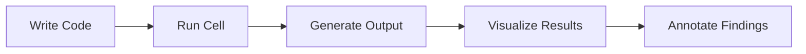
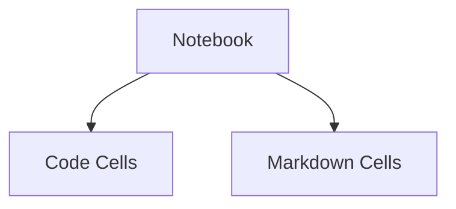
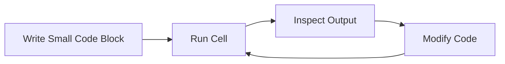
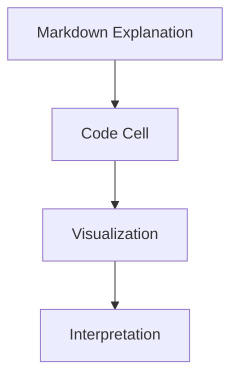
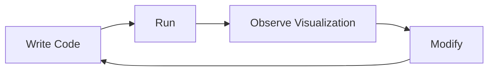

# Matplotlib Visual Basics and the Notebook Workflow

This lecture section shifts focus from:

- plotting concepts  
    to
    
- the actual development environment used for visualization work.
    

The emphasis is on:

- interactive coding
    
- notebook workflows
    
- experimentation
    
- collaborative analysis
    

The tools discussed are foundational to modern data science workflows.

# 1. Interactive Notebook Environments

The lecture introduces two commonly used notebook systems:

|Environment|Description|
|---|---|
|Google Colab|Cloud-based notebook environment|
|Jupyter Notebook|Local notebook environment|

Both environments allow:

- code execution
    
- visualization rendering
    
- documentation
    
- experimentation
    

inside a single interactive interface.

# Why Notebooks Became Dominant

Notebook systems solved a major problem in technical workflows:

Traditional programming environments separate:

- code
    
- outputs
    
- explanation
    
- charts
    

Notebook systems unify them.

# Notebook Workflow



This makes notebooks ideal for:

- teaching
    
- exploratory analysis
    
- ML experimentation
    
- reporting
    
- reproducible research
    

# 2. Google Colab

The lecture uses Google Colab.

# What Is Colab?

Colab is:

> a cloud-hosted Jupyter notebook environment.

It allows users to:

- write Python code
    
- execute remotely
    
- generate visualizations
    
- share notebooks collaboratively
    

without local installation complexity.

# Advantages of Colab

|Feature|Benefit|
|---|---|
|Cloud execution|No local setup|
|GPU support|ML acceleration|
|Sharing support|Collaboration|
|Notebook interface|Interactive workflow|
|Google integration|Easy access|

# Why Colab Became Popular

Especially useful for:

- beginners
    
- teaching
    
- quick prototyping
    
- collaborative projects
    

because environment setup is minimized.

# 3. Notebook Cell Types

The lecture explains an important notebook concept:

- code cells
    
- text cells
    

# A. Code Cells

Used for executable Python code.

Example:

```python
print("Hello")
```

# B. Text / Markdown Cells

Used for:

- documentation
    
- explanation
    
- annotations
    
- formatting
    

Example:

```markdown
# Introduction to Matplotlib
```

# Why This Separation Matters

Good notebooks combine:

- computation
    
- explanation
    

This makes notebooks:

- readable
    
- shareable
    
- reproducible
    

# Internal Notebook Structure



# 4. Comments in Python

The lecture revisits:

```python
# This is a comment
```

Anything after `#` becomes:

- non-executable annotation
    

# Why Comments Matter

Comments improve:

- readability
    
- maintainability
    
- collaboration
    

Especially important in:

- analytical workflows
    
- shared notebooks
    
- teaching material
    

# Common Beginner Error

The lecture correctly warns:

- plain English inside code cells without `#`  
    causes:
    

```python
SyntaxError
```

because Python attempts to execute it.

# 5. Executing Notebook Cells

The lecture references:

- clicking the run button
    

Notebook execution works cell-by-cell.

# Why Cell-Based Execution Matters

This allows:

- incremental testing
    
- debugging
    
- iterative exploration
    

instead of running entire programs repeatedly.

# Typical Workflow



This iterative cycle is central to:

- data science
    
- visualization
    
- ML experimentation
    

# 6. Notebook Presentation Features

The lecture highlights:

- formatted text
    
- bolding
    
- documentation
    
- collaborative presentation
    

This is extremely important.

Modern notebooks are not just coding environments.

They are:

> executable analytical documents.

# Why This Matters

A notebook can simultaneously contain:

- theory
    
- code
    
- charts
    
- explanations
    
- conclusions
    

This bridges:

- programming  
    and
    
- communication.
    

# Example Notebook Structure



# 7. Collaboration in Colab

The lecture emphasizes:

> Colab is collaborative.

This means notebooks can be:

- shared
    
- reviewed
    
- edited simultaneously
    

similar to:

- collaborative documents
    

# Why Collaboration Matters

Data science work is rarely isolated.

Teams often need to:

- review code
    
- inspect results
    
- validate analysis
    
- iterate collectively
    

Notebook collaboration accelerates this process.

# 8. AI-Assisted Coding

The lecture references built-in AI assistance via:

- Gemini suggestions
    

# Important Engineering Insight

Modern programming environments increasingly include:

- autocomplete
    
- AI-assisted debugging
    
- inline documentation
    
- code generation
    

# Example

Asking:

> “How to import Matplotlib?”

returns:

```python
import matplotlib.pyplot as plt
```

# Why This Matters

The bottleneck in programming is shifting from:

- memorization
    

toward:

- understanding
    
- reasoning
    
- design decisions
    

AI tools reduce:

- syntax friction
    
- lookup overhead
    

But they do not replace:

- conceptual understanding
    

# Important Warning

The lecture uses AI correctly:

> as assistance, not replacement thinking.

Strong analytical practice still requires:

- understanding the code
    
- validating outputs
    
- interpreting results critically
    

# 9. Importing Matplotlib

The lecture revisits the standard import:

```python
import matplotlib.pyplot as plt
```

# Why `pyplot` Is Important

`pyplot` provides:

- plotting functions
    
- figure management
    
- rendering utilities
    

It acts similarly to:

- a plotting controller interface
    

# Standard Alias Convention

```python
plt
```

is universally recognized across Python visualization codebases.

# 10. The Real Educational Objective

The lecture quietly emphasizes something deeper:

> visualization learning is experiential.

Students are encouraged to:

- run examples
    
- modify parameters
    
- observe effects
    
- experiment repeatedly
    

# Why This Matters

Visualization skill is not built through:

- memorization
    

It is built through:

- iteration
    
- observation
    
- debugging
    
- experimentation
    

# The Iterative Learning Model



This cycle develops:

- intuition
    
- debugging ability
    
- visual reasoning
    

# Strategic Insight

This lecture section introduces a critical modern reality:

> visualization work is now interactive, collaborative, and computational.

Analysts no longer merely:

- generate static reports
    

They increasingly work inside:

- live notebooks
    
- interactive environments
    
- cloud workflows
    
- collaborative systems
    

That changes the nature of analytics itself.

Visualization becomes:

- iterative
    
- exploratory
    
- conversational
    
- reproducible
    

rather than:

- static and linear.
    

# Final Takeaway

The notebook environment is not just a coding tool.

It is:

> an integrated analytical workspace.

It combines:

- computation
    
- visualization
    
- explanation
    
- experimentation
    
- collaboration
    

into a single system.

That is why notebook-based workflows became foundational in:

- data science
    
- AI
    
- research
    
- modern analytics engineering.