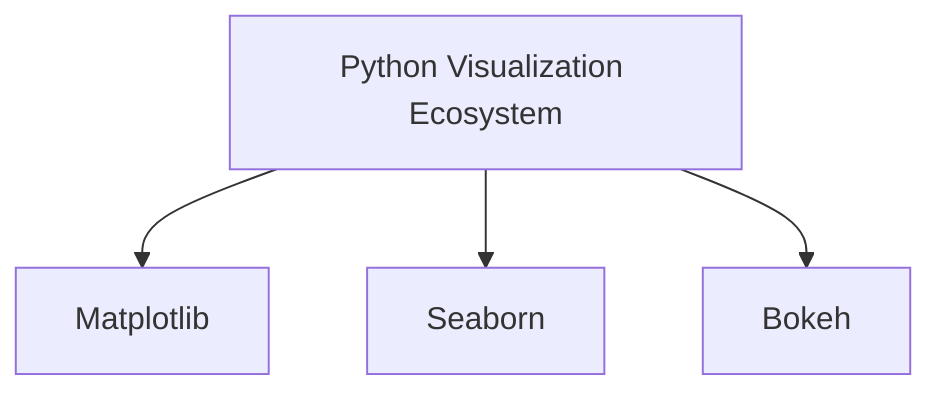
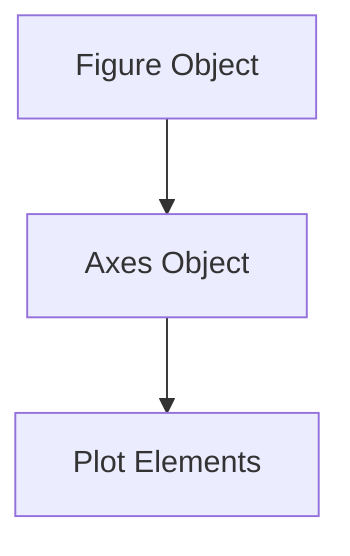

# Merits of Matplotlib and the Python Visualization Ecosystem

This lecture introduces the broader role of visualization libraries inside the Python ecosystem and positions Matplotlib as the foundational plotting framework for analytical visualization work.

The discussion also connects visualization tooling to:

- experimentation
    
- customization
    
- practical analytics
    
- exploratory data science workflows
    

# 1. Visualization Libraries in Python

The lecture introduces three major visualization tools:

|Library|Primary Focus|
|---|---|
|Matplotlib|Foundational plotting|
|Seaborn|Statistical visualization|
|Bokeh|Interactive visualizations|

# Why Multiple Visualization Libraries Exist

Different libraries optimize for different goals.

# Matplotlib

Optimized for:

- flexibility
    
- low-level control
    
- scientific plotting
    

# Seaborn

Built on top of Matplotlib.

Optimized for:

- statistical graphics
    
- cleaner defaults
    
- easier styling
    

# Bokeh

Optimized for:

- browser-based interaction
    
- dashboards
    
- zooming/panning
    
- web visualizations
    

# Ecosystem Relationship



# Important Insight

Most advanced Python visualization ultimately traces back to:

- Matplotlib concepts
    
- NumPy arrays
    
- object-oriented plotting structures
    

# 2. Why Matplotlib Is Foundational

The lecture frames Matplotlib as:

> the base visualization layer in Python.

This is historically accurate.

Many higher-level visualization tools either:

- build directly on Matplotlib  
    or
    
- inherit its design philosophy.
    

# Why Matplotlib Became Dominant

|Strength|Explanation|
|---|---|
|Flexibility|Fine-grained control|
|Stability|Mature ecosystem|
|Documentation|Extensive examples|
|Integration|Works with NumPy/pandas|
|Scientific support|Publication-quality plots|

# Historical Background

The lecture mentions that Matplotlib was created by:

John D. Hunter

Originally developed for:

- EEG data visualization
    
- scientific plotting workflows
    

# Important Historical Context

Matplotlib was inspired partly by:

- MATLAB
    

particularly in:

- plotting syntax
    
- scientific computation style
    

But over time it evolved into a more Pythonic and object-oriented framework.

# 3. Object-Oriented Plotting

The lecture briefly references:

> object-oriented programming within Python.

This is a critical concept.

Modern Matplotlib plotting primarily follows:

> object-oriented plotting architecture.

# Core Structure

```python
fig, ax = plt.subplots()
```

# Object Relationships



This architecture enables:

- reusable layouts
    
- multiple subplots
    
- advanced customization
    
- scalable plotting systems
    

# Why This Matters

Weak visualization usage:

- calling isolated plotting commands
    

Strong visualization engineering:

- controlling figure objects explicitly
    

# 4. Visualization as Hands-On Learning

The lecture emphasizes an important educational philosophy:

> visualization cannot be learned purely theoretically.

This is extremely true.

Visualization is inherently:

- visual
    
- iterative
    
- experimental
    

# Why Hands-On Practice Matters

Visualization quality depends on:

- perception
    
- layout
    
- spacing
    
- color
    
- interaction
    
- readability
    

These cannot be fully understood abstractly.

# Effective Learning Loop


This iterative cycle builds:

- visual intuition
    
- debugging skill
    
- design judgment
    

# 5. The Scale of Visualization Libraries

The lecture repeatedly warns:

> these are vast tools.

This is important.

Matplotlib contains:

- hundreds of plotting options
    
- extensive styling systems
    
- rendering controls
    
- layout engines
    
- animation support
    

# Important Practical Insight

You do not need to master every feature.

Most real-world work repeatedly uses:

- a relatively small set of chart patterns.
    

# The 80/20 Reality

Typically:

- 10–15 chart types solve most business problems.
    

Examples:

- line charts
    
- bar charts
    
- scatter plots
    
- histograms
    
- box plots
    
- heatmaps
    

# Therefore the Real Skill Is:

Not:

- memorizing APIs
    

But:

- understanding visualization principles deeply.
    

# 6. Documentation-Driven Learning

The lecture encourages students to:

- explore official documentation
    
- study examples
    
- experiment independently
    

This reflects real engineering practice.

# Why Documentation Matters

Strong developers:

- rarely memorize entire libraries
    
- instead learn how to navigate documentation efficiently
    

# Important Engineering Skill

Reading documentation is itself a technical skill.

Good documentation usage involves:

- identifying examples
    
- adapting templates
    
- understanding parameters
    
- experimenting incrementally
    

# Official Documentation Areas Mentioned

The lecture references:

- quick start guides
    
- tutorials
    
- examples
    

These are critical learning resources.

# Typical Learning Path


# 7. Pre-attentive Attributes in Matplotlib

The lecture briefly references:

- colors
    
- text
    
- visual enhancement
    

These connect directly to earlier storytelling concepts.

# Pre-attentive Attributes

Humans process certain visual features instantly:

- color
    
- size
    
- contrast
    
- orientation
    
- shape
    

Matplotlib allows these to be customized programmatically.

# Example

```python
ax.plot(x, y, color='red', linewidth=3)
```

This changes:

- visual emphasis
    
- attention hierarchy
    

# Why This Matters

Visualization is not just:

- rendering data
    

It is:

> controlling perceptual focus.

# 8. Visualization and Storytelling

The lecture implicitly connects Matplotlib to:

- data storytelling
    

This is important.

Charts are not neutral objects.

They influence:

- interpretation
    
- emphasis
    
- narrative framing
    

# Visualization Pipeline


# Therefore Visualization Quality Affects:

- business decisions
    
- policy interpretation
    
- strategic thinking
    
- analytical trust
    

# 9. The Importance of Exploration

The lecture repeatedly encourages:

> experimentation with datasets and features.

This is critical because visualization quality depends heavily on:

- data structure
    
- scale
    
- distribution
    
- audience context
    

There is no universal chart recipe.

# Strong Analysts Continuously Ask:

- Which chart best communicates this pattern?
    
- What visual encoding is clearest?
    
- Is the audience technical or executive?
    
- Does the visualization preserve proportional truth?
    
- Am I emphasizing the correct insight?
    

# 10. The Deeper Educational Goal

This lecture is not merely teaching:

- plotting syntax
    

It is teaching:

> computational visualization thinking.

The student is expected to move from:

- consuming charts  
    to
    
- engineering visual systems.
    

# Strategic Insight

Matplotlib is important not because:

- it draws graphs
    

but because it teaches the deeper structure of visualization systems:

- figure management
    
- coordinate systems
    
- rendering pipelines
    
- perceptual encoding
    
- customization logic
    

Once those ideas are understood:

- learning Seaborn
    
- learning Bokeh
    
- learning Plotly
    
- learning dashboard tools
    

becomes much easier.

# Final Takeaway

The lecture ultimately frames visualization correctly:

> Visualization is not a static technical skill.  
> It is an exploratory engineering practice.

Strong visualization practitioners combine:

- programming
    
- statistics
    
- perception
    
- communication
    
- experimentation
    

to transform:

- numerical abstraction  
    into
    
- interpretable human insight.

Tags: #statistics #machine-learning #data-science #statistical-modelling