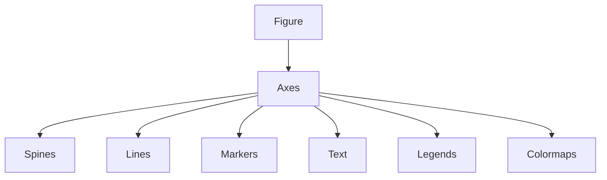

# Visualization Architecture in Matplotlib

```mermaid
flowchart TD

A[Figure] --> B[Axes]
B --> C[Spines]
B --> D[Lines]
B --> E[Markers]
B --> F[Text]
B --> G[Legends]
B --> H[Colormaps]
```

Understanding this hierarchy is crucial for advanced customization.
