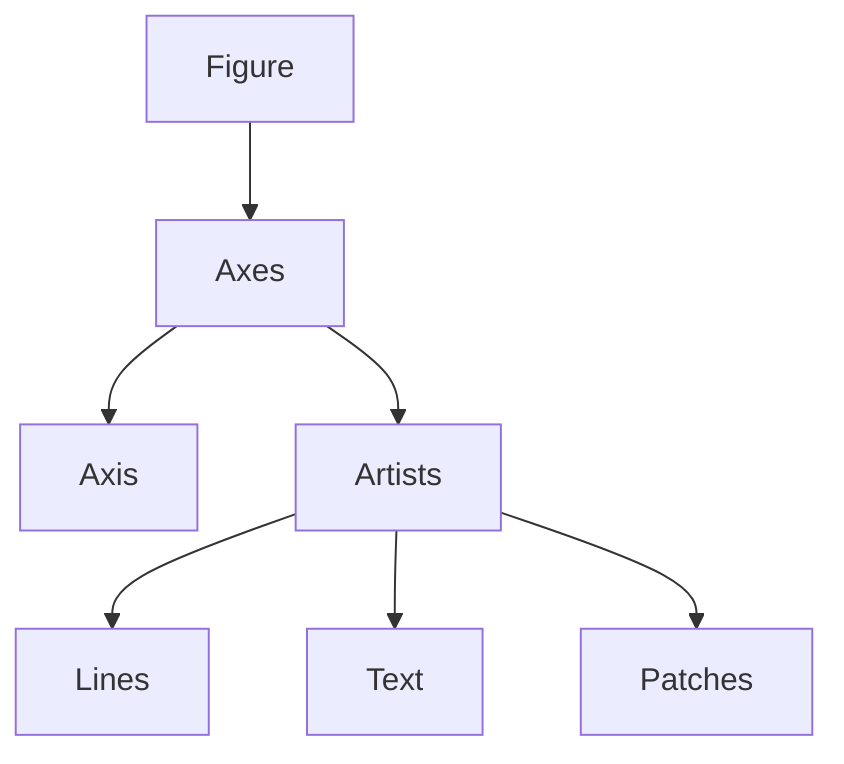

# Advanced Matplotlib Architecture

Matplotlib internally follows:

```mermaid
flowchart TD

A[Figure] --> B[Axes]
B --> C[Axis]
B --> D[Artists]
D --> E[Lines]
D --> F[Text]
D --> G[Patches]
```

Everything visible is an "Artist".

Understanding this architecture unlocks deep customization.
