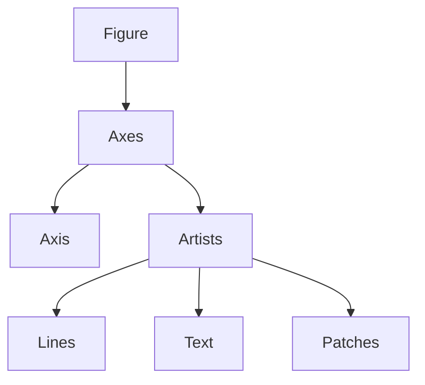

# Advanced Matplotlib

## Introduction to Advanced Visualization in Matplotlib

Matplotlib is not merely a plotting library. It is a low-level visualization engine that exposes direct control over nearly every graphical element in a figure. Most modern Python visualization libraries such as Seaborn and Plotly either wrap or extend Matplotlib internally.

The core strength of Matplotlib lies in:

- fine-grained customization
    
- rendering flexibility
    
- publication-quality plotting
    
- compatibility with NumPy and Pandas ecosystems
    
- low-level access to graphical primitives
    

The transcript introduces several important native plot types:

- Histograms
    
- Bar charts
    
- Grouped bar plots with error bars
    
- Pie charts
    
- Radar charts
    
- Text annotations
    
- Style sheets
    

These are foundational visualization primitives used in:

- exploratory data analysis
    
- dashboards
    
- scientific computing
    
- statistical communication
    
- storytelling
    
- machine learning diagnostics
    

Source material:

---

# Histograms

## Conceptual Foundation

A histogram visualizes the distribution of a single numerical variable.

Unlike a bar chart:

|Histogram|Bar Chart|
|---|---|
|Continuous numerical data|Discrete categories|
|Bins intervals|Categories|
|Distribution analysis|Category comparison|
|Frequency density|Aggregate values|

The transcript correctly emphasizes that histograms are used to understand:

- frequency distribution
    
- concentration of values
    
- spread
    
- skewness
    
- modality
    

---

# Intuition Behind Histograms

Suppose you measure:

- customer spending
    
- employee salaries
    
- exam scores
    
- model prediction errors
    

A histogram answers:

> "How often do values fall into particular ranges?"

Instead of examining thousands of raw numbers individually, histograms compress numerical behavior into frequency intervals.

---

# Mathematical Perspective

A histogram approximates the probability density function:

$$  
f(x)  
$$

Each bin represents:

$$  
\text{Frequency in Interval}  
$$

If normalized:

$$  
\sum P(x_i) = 1  
$$

Histogram estimation is related to density estimation:

$$  
\hat{f}(x)=\frac{1}{nh}\sum K\left(\frac{x-x_i}{h}\right)  
$$

Where:

- ( n ) = sample size
    
- ( h ) = bin width
    
- ( K ) = kernel function
    

This connects directly to Kernel Density Estimation.

---

# Basic Histogram Example

```python
import numpy as np
import matplotlib.pyplot as plt

# Reproducibility
np.random.seed(42)

# Generate random data
data = np.random.normal(
    loc=0,
    scale=1,
    size=1000
)

# Plot histogram
plt.hist(
    data,
    bins=30,
    color='skyblue',
    edgecolor='black'
)

plt.title("Histogram of Normal Distribution")
plt.xlabel("Value")
plt.ylabel("Frequency")

plt.show()
```

Transcript reference:

---

# Why `np.random.seed()` Matters

The transcript briefly explains reproducibility.

This is critically important in:

- machine learning experiments
    
- statistical simulations
    
- debugging
    
- collaborative research
    

Without a fixed seed:

```python
np.random.seed(42)
```

every execution generates different random samples.

That makes:

- visual comparisons unstable
    
- debugging difficult
    
- scientific replication impossible
    

---

# Understanding Bins

Bins determine grouping granularity.

Too few bins:

- oversmooths data
    
- hides structure
    

Too many bins:

- amplifies noise
    
- creates misleading spikes
    

This is fundamentally a bias-variance tradeoff.

---

# Common Bin Selection Rules

## Sturges Rule

$$  
k = 1 + \log_2(n)  
$$

## Square Root Rule

$$  
k = \sqrt{n}  
$$

## Freedman-Diaconis Rule

$$  
h = 2 \frac{IQR}{n^{1/3}}  
$$

Most practitioners ignore this completely and manually choose bins, which often produces misleading interpretations.

---

# Adding Labels to Histogram Bars

The transcript discusses manually labeling frequencies using loops.

Implementation:

```python
import numpy as np
import matplotlib.pyplot as plt

np.random.seed(42)

data = np.random.normal(size=1000)

counts, bins, patches = plt.hist(
    data,
    bins=20,
    color='lightblue',
    edgecolor='black'
)

# Add labels
for count, patch in zip(counts, patches):

    if count > 0:

        plt.text(
            patch.get_x() + patch.get_width()/2,
            patch.get_height(),
            int(count),
            ha='center',
            va='bottom',
            fontsize=8
        )

plt.show()
```

---

# Engineering Insight

Adding labels directly on histograms becomes unreadable quickly when:

- bins are too many
    
- distributions are noisy
    
- values overlap
    

Production dashboards usually avoid direct labels unless the number of bins is very small.

---

# Histogram Failure Modes

## Misleading Bin Width

A small change in bins can visually manufacture patterns.

This is one reason bad analytics dashboards create false narratives.

## Outliers Distort Interpretation

Extreme values stretch axes and compress meaningful regions.

Solution:

```python
plt.xlim(-3, 3)
```

or log scaling.

---

# Bar Charts

## Conceptual Purpose

Bar charts compare discrete categories.

Transcript reference:

Unlike histograms:

- categories are independent
    
- ordering may be arbitrary
    
- bars should not touch
    

---

# Example Dataset

The transcript models social media platforms and user counts.

```python
import pandas as pd
import matplotlib.pyplot as plt

platforms = [
    "ConnectMe",
    "ShareIt",
    "LinkUp",
    "BuzzNet"
]

users = [120, 95, 140, 80]

df = pd.DataFrame({
    "Platform": platforms,
    "Users": users
})

ax = df.plot(
    kind='bar',
    x='Platform',
    y='Users',
    legend=False,
    color='cornflowerblue'
)

plt.title("Monthly Active Users")
plt.xlabel("Platform")
plt.ylabel("Users (Millions)")

plt.show()
```

Transcript reference:

---

# Why Pandas Plotting Exists

Pandas integrates directly with Matplotlib.

```python
df.plot()
```

is effectively a wrapper around Matplotlib.

Advantages:

- simpler syntax
    
- dataframe awareness
    
- automatic labels
    
- quick EDA
    

Tradeoff:

Less control than raw Matplotlib.

---

# Horizontal Bar Charts

The transcript discusses `barh`.

```python
df.plot(
    kind='barh',
    x='Platform',
    y='Users'
)
```

Horizontal bars are superior when:

- category names are long
    
- ranking matters
    
- labels overlap
    

This is why many enterprise dashboards use horizontal layouts.

---

# Grouped Bar Charts with Error Bars

## Core Statistical Idea

Error bars represent uncertainty.

Transcript reference:

This is fundamentally important because averages alone are deceptive.

Two groups may have identical means but radically different variances.

---

# Example

```python
import pandas as pd
import matplotlib.pyplot as plt

df = pd.DataFrame({
    "Before": [6.5, 5.8],
    "After": [8.2, 6.1]
}, index=["Redesign", "Control"])

errors = pd.DataFrame({
    "Before": [0.05, 0.04],
    "After": [0.03, 0.05]
}, index=["Redesign", "Control"])

ax = df.plot(
    kind='bar',
    yerr=errors,
    capsize=4,
    color=['salmon', 'lightblue']
)

plt.title("User Engagement Before and After")
plt.ylabel("Average Engagement Score")

plt.show()
```

---

# Statistical Interpretation

Error bars may represent:

- standard deviation
    
- standard error
    
- confidence interval
    
- measurement uncertainty
    

This distinction is frequently omitted in dashboards.

That omission is dangerous because viewers assume confidence intervals even when charts display standard deviations.

---

# Machine Learning Connection

Error bars are heavily used in:

- cross-validation metrics
    
- A/B testing
    
- model comparison
    
- uncertainty quantification
    

For example:

|Model|Accuracy|Error|
|---|---|---|
|Random Forest|91%|±2%|
|XGBoost|93%|±4%|

Without uncertainty estimates, comparisons are statistically weak.

---

# Pie Charts

## Core Use Case

Pie charts show proportional composition.

Transcript reference:

But the transcript correctly warns:

> Pie charts fail when categories become numerous.

Humans compare lengths better than angles.

This is a neuroscience problem, not merely a visualization preference.

---

# Basic Pie Chart

```python
import matplotlib.pyplot as plt

sources = [
    "Organic",
    "Direct",
    "Referral",
    "Social",
    "Other"
]

traffic = [45, 25, 15, 10, 5]

plt.figure(figsize=(6,6))

plt.pie(
    traffic,
    labels=sources,
    autopct='%1.1f%%',
    startangle=90
)

plt.title("Website Traffic Sources")

plt.show()
```

---

# Why Pie Charts Are Often Bad

Humans struggle to compare:

- arc lengths
    
- angular differences
    
- areas
    

Especially between:

- similar percentages
    
- many categories
    

Bar charts outperform pie charts for analytical tasks.

Pie charts are mainly storytelling tools.

---

# Explode Feature

Transcript reference:

```python
explode = [0, 0, 0, 0.1, 0]

plt.pie(
    traffic,
    labels=sources,
    explode=explode,
    autopct='%1.1f%%'
)
```

This creates visual emphasis.

But overuse becomes manipulative.

Many executive dashboards misuse explode effects to artificially exaggerate categories.

---

# Radar Charts

## Conceptual Structure

Radar charts visualize multivariate relationships.

Transcript reference:

All axes originate from a common center.

Used for:

- performance analysis
    
- capability mapping
    
- KPI comparison
    
- competency evaluation
    

---

# Example

```python
import numpy as np
import matplotlib.pyplot as plt

categories = [
    "Sales",
    "Marketing",
    "Finance",
    "Operations",
    "HR"
]

values = [80, 70, 90, 85, 60]

angles = np.linspace(
    0,
    2 * np.pi,
    len(categories),
    endpoint=False
)

values = np.concatenate((values, [values[0]]))
angles = np.concatenate((angles, [angles[0]]))

fig, ax = plt.subplots(
    figsize=(6,6),
    subplot_kw=dict(polar=True)
)

ax.plot(angles, values)

ax.fill(angles, values, alpha=0.25)

ax.set_xticks(angles[:-1])
ax.set_xticklabels(categories)

plt.show()
```

---

# Hidden Problem with Radar Charts

Radar charts distort comparisons because:

- area perception is nonlinear
    
- radial distance is hard to compare
    
- shape aesthetics bias interpretation
    

Two datasets may appear dramatically different visually while differing minimally numerically.

This is why serious analytical systems often avoid them.

---

# Text Annotations

## Why Text Matters

The transcript correctly highlights text as a pre-attentive storytelling mechanism.

Annotations transform plots from:

- passive charts
    

into:

- narrative visualizations
    

---

# Simple Text Placement

```python
import numpy as np
import matplotlib.pyplot as plt

x = np.linspace(0, 10, 100)
y = np.sin(x)

plt.plot(x, y)

plt.text(
    3,
    0,
    "Important Region",
    fontsize=12
)

plt.show()
```

---

# Arrow Annotations

```python
peak_x = 1.5 * np.pi
peak_y = np.sin(peak_x)

plt.plot(x, y)

plt.annotate(
    "Local Minimum",
    xy=(peak_x, peak_y),
    xytext=(5, -0.5),
    arrowprops=dict(
        facecolor='black'
    )
)

plt.show()
```

Transcript reference:

---

# Storytelling Principle

Good annotations answer:

> "What should the viewer notice?"

Without annotations:

- viewers wander
    
- interpretations vary
    
- attention disperses
    

Annotations create intentional focus.

---

# Style Sheets

## Concept

Style sheets are predefined aesthetic templates.

Transcript reference:

They control:

- background
    
- grids
    
- fonts
    
- colors
    
- spacing
    
- linewidths
    

---

# Example

```python
import matplotlib.pyplot as plt
import numpy as np

plt.style.use('fivethirtyeight')

x = np.linspace(0, 10, 100)

plt.plot(x, np.sin(x), label='Sine')
plt.plot(x, np.cos(x), label='Cosine')

plt.legend()

plt.show()
```

---

# Why Style Consistency Matters

In production systems:

- consistency builds trust
    
- visual coherence reduces cognitive load
    
- standardized themes improve readability
    

This is why enterprise BI systems enforce theme standards.

---

# Important Engineering Insight

Most beginners focus excessively on:

- colors
    
- fancy effects
    
- gradients
    
- shadows
    

Experienced visualization engineers focus on:

- clarity
    
- contrast
    
- cognitive efficiency
    
- information density
    

The transcript correctly warns against unnecessary 3D effects.

That warning is extremely important.

3D charts usually reduce interpretability.

---

# Visualization as Cognitive Compression

A useful mental model:

> Visualization compresses high-dimensional information into perceptual structures.

Good visualization reduces cognitive effort.

Bad visualization increases decoding effort.

This is fundamentally an information theory problem.

---

# Machine Learning Connections

Matplotlib is heavily used in ML workflows:

|Use Case|Plot Type|
|---|---|
|Feature distributions|Histogram|
|Class imbalance|Bar chart|
|Model uncertainty|Error bars|
|Probability distributions|KDE + Histogram|
|Feature importance|Horizontal bars|
|Training curves|Line plots|
|Embedding visualization|Scatter plots|

---

# Common Visualization Mistakes

## Overusing Colors

Too many colors destroy hierarchy.

## Decorative Charts

3D charts reduce analytical clarity.

## Missing Labels

Unlabeled axes make charts meaningless.

## Wrong Chart Type

Pie charts for 20 categories is visualization malpractice.

## No Uncertainty Representation

Displaying means without variance is statistically misleading.

---

# Advanced Matplotlib Architecture

Matplotlib internally follows:



Everything visible is an "Artist".

Understanding this architecture unlocks deep customization.

---

# Performance Considerations

Matplotlib struggles with:

- millions of points
    
- highly interactive rendering
    
- real-time dashboards
    

Alternatives:

|Library|Strength|
|---|---|
|Plotly|Interactivity|
|Bokeh|Web dashboards|
|Altair|Declarative grammar|
|Datashader|Massive datasets|

Matplotlib excels in:

- static scientific plots
    
- publication-quality figures
    
- deep customization
    

---

# Final Takeaways

The transcript is fundamentally teaching an important transition:

> moving from simple plotting toward intentional visual communication.

The real lesson is not syntax.

The real lesson is:

- choosing correct visual structures
    
- guiding attention
    
- representing uncertainty
    
- reducing cognitive friction
    
- telling statistically honest stories
    

Matplotlib remains relevant because it exposes low-level control over all these dimensions.

Source transcript: