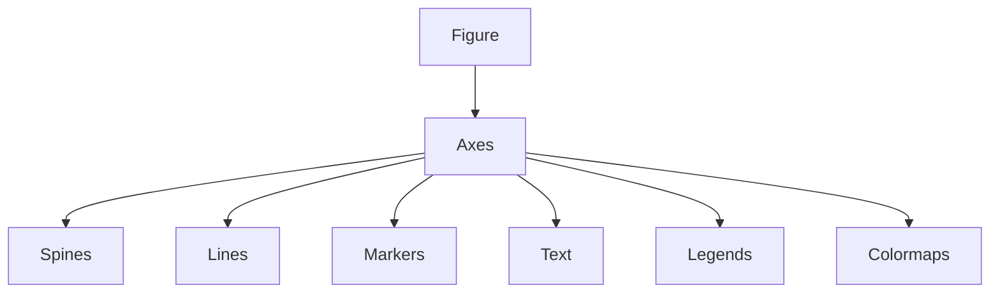

## Decorating Graphs with Plot Styles and Types

## Introduction

Visualization quality is not determined merely by whether a graph "works." A technically correct graph can still fail cognitively. The human visual system does not passively consume charts. It actively filters, groups, prioritizes, suppresses, and interprets visual signals before conscious reasoning even begins.

This is where graph decoration becomes critically important.

The transcript focuses on one of the most underestimated aspects of data visualization:

> controlling pre-attentive attributes.

These include:

- color
    
- line style
    
- marker shape
    
- thickness
    
- spacing
    
- borders
    
- transparency
    
- visual emphasis
    

Source transcript:

Most beginners think these are "cosmetic."

They are not.

These are cognitive encoding mechanisms.

A visualization without deliberate styling is often equivalent to poorly structured writing with no punctuation, headings, or emphasis.

---

## The Psychology of Visual Encoding

Before discussing Matplotlib syntax, it is important to understand why these features matter.

Human perception operates through:

## Pre-attentive Processing

The brain identifies certain features automatically within milliseconds:

- color differences
    
- orientation
    
- size
    
- motion
    
- contrast
    
- shape
    

This occurs before conscious attention.

Visualization systems exploit this biological shortcut.

For example:

- a red object among blue objects is instantly noticeable
    
- a thicker line appears more important
    
- a bright region attracts focus
    
- grouped colors imply relatedness
    

This directly connects to Gestalt principles.

The transcript briefly references this idea when discussing common colors and grouping behavior.

---

## Why Matplotlib Matters

Matplotlib is not merely a plotting API.

It is fundamentally a rendering engine.

Most modern Python visualization libraries:

- Seaborn
    
- Pandas plotting
    
- GeoPandas
    
- mplfinance
    

ultimately rely on Matplotlib internally.

Understanding Matplotlib styling means understanding the foundation of Python visualization itself.

---

## Importing Visualization Libraries

The transcript begins by importing:

```python
import numpy as np
import matplotlib.pyplot as plt
from matplotlib import colors
from matplotlib import lines
```

---

## Why NumPy Is Used Everywhere

NumPy is not optional in scientific Python.

Matplotlib internally expects numerical arrays.

NumPy provides:

- vectorized operations
    
- efficient memory representation
    
- broadcasting
    
- fast mathematical computation
    

Without NumPy, visualization pipelines become inefficient.

---

## Understanding Colors in Matplotlib

## The Fundamental Role of Color

Color is one of the strongest pre-attentive attributes.

The transcript correctly emphasizes this point.

Color can encode:

|Meaning|Example|
|---|---|
|Categories|Product groups|
|Intensity|Heatmaps|
|Importance|Alerts|
|Deviation|Outliers|
|Correlation|Scatter density|
|Sentiment|Positive vs negative|

But misuse of color is one of the biggest problems in dashboard design.

---

## Default Color Cycles

Matplotlib provides default colors:

```python
'C0' to 'C9'
```

Transcript reference:

Example:

```python
plt.plot(x, y, color='C0')
```

These are part of Matplotlib's internal style cycle.

---

## Single-Letter Color Codes

Simple shorthand:

|Code|Color|
|---|---|
|r|Red|
|g|Green|
|b|Blue|
|k|Black|
|w|White|
|c|Cyan|
|m|Magenta|
|y|Yellow|

Example:

```python
plt.plot(x, y, color='r')
```

Transcript reference:

---

## Named Colors

Matplotlib supports CSS-like names:

```python
plt.plot(x, y, color='limegreen')
```

Transcript reference:

This improves readability dramatically.

Compare:

```python
'#32CD32'
```

vs

```python
'limegreen'
```

Named colors are usually preferable unless strict branding is required.

---

## Hexadecimal Colors

Hex codes provide exact control.

```python
plt.plot(x, y, color='#FF5733')
```

Structure:

```text
#RRGGBB
```

Where:

- RR = red intensity
    
- GG = green intensity
    
- BB = blue intensity
    

Each ranges:

$$  
00 \to FF  
$$

Equivalent to:

$$  
0 \to 255  
$$

---

## RGBA Color System

The transcript discusses RGBA tuples.

RGBA stands for:

|Component|Meaning|
|---|---|
|R|Red|
|G|Green|
|B|Blue|
|A|Alpha transparency|

Values range:

$$  
0 \to 1  
$$

Example:

```python
color=(0.2, 0.4, 0.8, 0.5)
```

This means:

- low red
    
- moderate green
    
- strong blue
    
- 50% transparency
    

---

## Transparency and Alpha

Alpha controls visibility intensity.

```python
plt.plot(
    x,
    y,
    alpha=0.3
)
```

Lower alpha is extremely useful when plotting:

- overlapping distributions
    
- dense scatter plots
    
- uncertainty regions
    
- ensemble models
    

---

## Grayscale Encoding

The transcript explains grayscale intensity.

In grayscale:

$$  
0 = \text{black}  
$$

$$  
1 = \text{white}  
$$

Example:

```python
color='0.5'
```

This becomes medium gray.

---

## Comprehensive Color Demonstration

```python
import numpy as np
import matplotlib.pyplot as plt

x = [0, 1]

plt.figure(figsize=(10, 5))

plt.plot(x, [0, 0], color='r', linewidth=4, label='Single Letter')
plt.plot(x, [1, 1], color='C1', linewidth=4, label='Default Cycle')
plt.plot(x, [2, 2], color='limegreen', linewidth=4, label='Named')
plt.plot(x, [3, 3], color='#FF5733', linewidth=4, label='Hex')
plt.plot(x, [4, 4], color=(0.2, 0.4, 0.8, 0.7), linewidth=4, label='RGBA')
plt.plot(x, [5, 5], color='0.4', linewidth=4, label='Grayscale')

plt.legend()
plt.show()
```

Transcript reference:

---

## Cognitive Risks of Color

## Bad Color Choices Create Analytical Errors

Example failures:

- rainbow colormaps distort gradients
    
- low contrast hides information
    
- red-green combinations fail for colorblind users
    
- oversaturated dashboards cause fatigue
    

This is not aesthetics.

This is information distortion.

---

## Color Maps

## Why Colormaps Exist

A colormap maps numerical values to colors.

Instead of assigning one static color:

```python
blue
```

a colormap creates:

$$  
f(x) \to \text{color}  
$$

This enables:

- heatmaps
    
- density maps
    
- correlation intensity
    
- elevation maps
    
- probability gradients
    

Transcript reference:

---

## Viridis Colormap

The transcript references `viridis`.

Viridis became Matplotlib's default colormap because it is:

- perceptually uniform
    
- colorblind friendly
    
- printer friendly
    
- visually smooth
    

---

## Scatter Plot with Colormap

```python
import numpy as np
import matplotlib.pyplot as plt

x = np.random.rand(100)
y = np.random.rand(100)
z = np.random.rand(100)

plt.scatter(
    x,
    y,
    c=z,
    cmap='viridis'
)

plt.colorbar()

plt.show()
```

---

## Why Jet Colormap Is Problematic

Older systems often used:

```python
cmap='jet'
```

This is now discouraged.

Reason:

Jet creates artificial boundaries where none exist.

It exaggerates gradients psychologically.

Viridis avoids this issue.

---

## Custom Colormaps

The transcript demonstrates segmented colormaps.

Example:

```python
from matplotlib.colors import LinearSegmentedColormap

custom_cmap = LinearSegmentedColormap.from_list(
    "custom",
    ["red", "yellow", "green"]
)
```

---

## Engineering Use Cases

Custom colormaps are heavily used in:

|Domain|Usage|
|---|---|
|Finance|Profit/loss gradients|
|Medicine|Risk heatmaps|
|ML|Feature importance|
|GIS|Terrain elevation|
|Operations|KPI dashboards|

---

## Line Styles

## Why Line Styles Matter

When multiple series appear together:

- color alone is insufficient
    
- printouts may lose color
    
- accessibility suffers
    

Line style introduces redundant encoding.

Transcript reference:

---

## Basic Line Styles

|Style|Syntax|
|---|---|
|Solid|`'-'`|
|Dashed|`'--'`|
|Dotted|`':'`|
|Dash-dot|`'-.'`|

---

## Example

```python
import numpy as np
import matplotlib.pyplot as plt

x = np.linspace(0, 10, 20)

y1 = x
y2 = x + 2

plt.plot(
    x,
    y1,
    color='red',
    linestyle='--',
    label='Series 1'
)

plt.plot(
    x,
    y2,
    color='green',
    marker='*',
    markersize=8,
    linestyle=':',
    label='Series 2'
)

plt.legend()

plt.show()
```

Transcript reference:

---

## Why Markers Matter

Markers reveal:

- exact observations
    
- sample density
    
- missing values
    
- discrete measurements
    

Without markers, line charts imply continuity.

This can accidentally mislead viewers.

---

## Marker Types

|Marker|Meaning|
|---|---|
|`o`|Circle|
|`s`|Square|
|`*`|Star|
|`^`|Triangle|
|`x`|Cross|

---

## Line Width

The transcript demonstrates varying linewidths.

```python
linewidth=5
```

Thicker lines visually imply:

- importance
    
- emphasis
    
- confidence
    
- hierarchy
    

This is a perceptual bias.

---

## Dash Cap Styles

Cap styles define line endings.

Options:

- butt
    
- round
    
- projecting
    

Example:

```python
dash_capstyle='round'
```

This subtly changes perceived smoothness.

---

## Spines

## What Are Spines?

Spines are chart borders.

Transcript reference:

Most people never notice them consciously.

Yet they strongly affect visual clutter.

---

## Accessing Spines

```python
ax = plt.gca()
```

Then:

```python
ax.spines['top']
```

---

## Removing Spines

```python
ax.spines['top'].set_visible(False)
ax.spines['right'].set_visible(False)
```

Transcript reference:

This creates cleaner modern visualizations.

---

## Customizing Spine Width and Color

```python
ax.spines['left'].set_linewidth(4)
ax.spines['left'].set_color('red')
```

---

## Why Spine Removal Matters

Heavy borders increase non-data ink.

Edward Tufte's principle:

> maximize data ink ratio.

The graph should emphasize:

- data
    
- relationships
    
- interpretation
    

not decorative framing.

---

## Minimalist Visualization Philosophy

Modern dashboard systems increasingly favor:

- fewer borders
    
- reduced clutter
    
- muted grids
    
- soft colors
    
- restrained decoration
    

This improves:

- scanning speed
    
- cognitive efficiency
    
- analytical focus
    

---

## Advanced Mental Model

Think of every visual attribute as bandwidth allocation.

You have limited perceptual bandwidth.

If everything is emphasized:

> nothing is emphasized.

Good visualization controls attention hierarchy intentionally.

---

## Real-World Dashboard Example

Suppose a KPI dashboard contains:

- 20 saturated colors
    
- thick borders
    
- gradients
    
- shadows
    
- flashing alerts
    
- multiple fonts
    

The viewer experiences cognitive overload.

The dashboard fails despite technical correctness.

This is extremely common in enterprise BI.

---

## Visualization Architecture in Matplotlib



Understanding this hierarchy is crucial for advanced customization.

---

## Machine Learning Connections

Visualization styling matters heavily in ML systems:

|ML Context|Visualization|
|---|---|
|Training loss|Styled line plots|
|Feature importance|Horizontal bars|
|Correlation matrices|Colormaps|
|Decision boundaries|Scatter + colormap|
|Uncertainty estimation|Alpha transparency|
|Embedding spaces|Marker differentiation|

---

## Common Mistakes

## Overdecorating Charts

More decoration usually reduces clarity.

## Using Too Many Colors

Humans cannot meaningfully distinguish many simultaneous hues.

## Excessive Saturation

Bright colors should be reserved for emphasis.

## Ignoring Accessibility

Red-green colorblindness affects many users.

## Decorative Borders

Heavy spines create unnecessary clutter.

---

## Advanced Insight

Most beginners think visualization quality comes from:

- prettier charts
    
- more colors
    
- more effects
    

Experts optimize for:

- faster cognition
    
- lower ambiguity
    
- stronger attention guidance
    
- truthful statistical representation
    

This is a fundamentally different mindset.

---

## Final Takeaways

The transcript is really teaching something deeper than Matplotlib syntax.

It is teaching:

> how visual structure influences human cognition.

Every design choice:

- color
    
- spacing
    
- border
    
- transparency
    
- line style
    
- marker
    

changes interpretation.

Matplotlib provides low-level access to these perceptual controls.

That is why it remains one of the most important visualization systems in scientific computing.

Source transcript:

Tags: #statistics #machine-learning #data-science #statistical-modelling