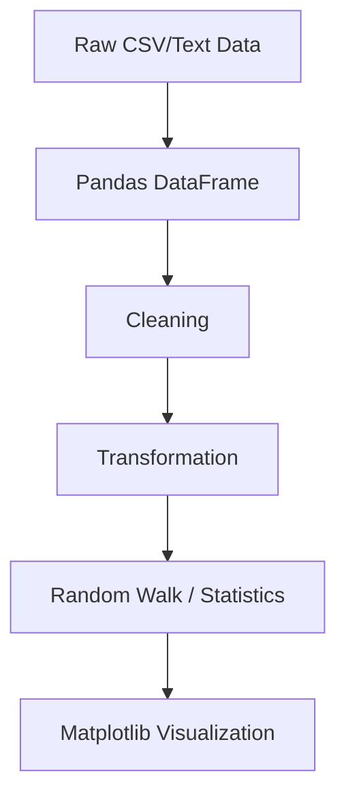

# Advanced Visualization Pipeline

```mermaid
flowchart TD

A[Raw CSV/Text Data]
--> B[Pandas DataFrame]

B --> C[Cleaning]

C --> D[Transformation]

D --> E[Random Walk / Statistics]

E --> F[Matplotlib Visualization]
```
