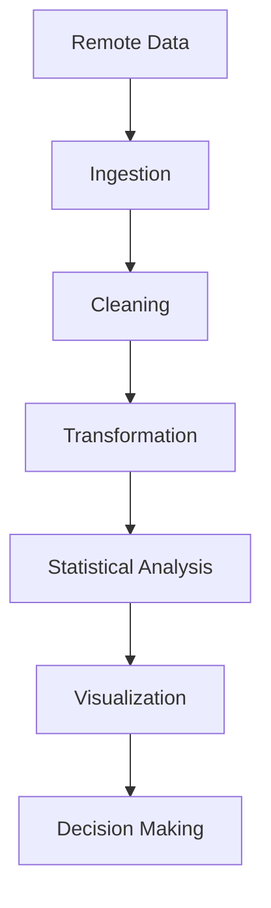
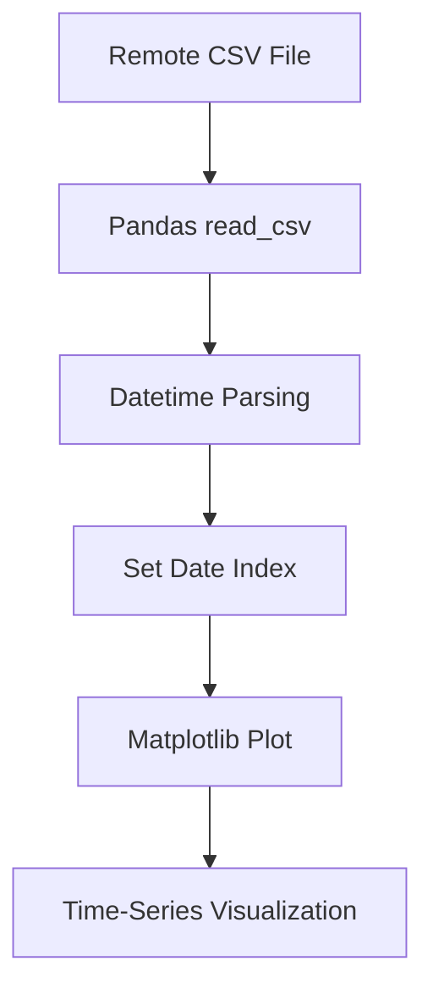
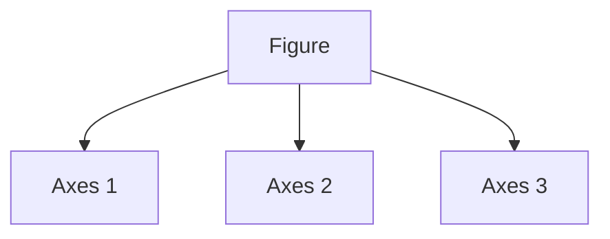
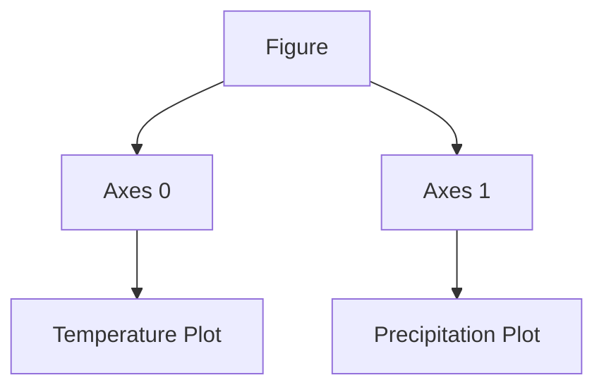
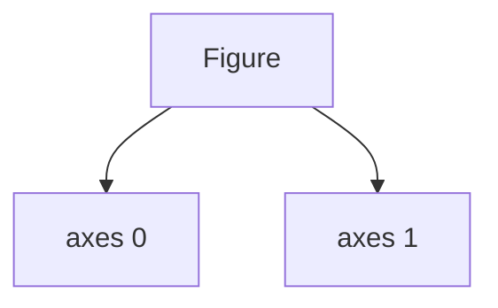

## Advanced Matplotlib & Data from the Web

## Introduction

Modern data visualization systems rarely operate on static local files. In real-world analytics pipelines, data typically flows from:

- APIs
    
- cloud storage
    
- databases
    
- remote servers
    
- streaming systems
    
- web endpoints
    

The lecture introduces one of the most important transitions in practical data science:

> moving from manually stored datasets toward web-connected data pipelines.

This shift is foundational because nearly all modern analytical systems depend on remote data ingestion.

Examples include:

- financial market feeds
    
- weather APIs
    
- social media analytics
    
- IoT sensor streams
    
- business intelligence dashboards
    
- machine learning inference pipelines
    

The lecture specifically focuses on:

- reading CSV data from URLs
    
- reading JSON data from URLs
    
- integrating Pandas with remote datasets
    
- preparing data for advanced Matplotlib visualization
    


## Data Formats in Analytics Systems

## Why Data Formats Matter

Before visualization can happen, data must be represented in a structured form.

Different formats optimize for different goals:

|Format|Best For|Weakness|
|---|---|---|
|CSV|Tabular datasets|No hierarchy|
|JSON|Nested structures|Larger size|
|Parquet|Big data analytics|Less human readable|
|XML|Enterprise systems|Verbose|
|SQL Tables|Structured querying|Requires database|

The lecture focuses on the two most common web-delivered formats:

- CSV
    
- JSON
    


## CSV Files

## Conceptual Structure

CSV stands for:

```text
Comma-Separated Values
```

Each line represents a row.

Each comma separates columns.

Example:

```csv
Name,Age,Salary
Alice,25,50000
Bob,30,70000
```

This structure maps naturally into tables.


## Why CSV Became Dominant

CSV became popular because:

- lightweight
    
- universally supported
    
- human-readable
    
- easy to parse
    
- language independent
    

Even massive enterprise systems still exchange data through CSV exports.


## Reading CSV Files with Pandas

The lecture introduces:

```python
import pandas as pd

csv_url = "https://example.com/data.csv"

df = pd.read_csv(csv_url)
```

Source notes: provided lecture content.


## What `read_csv()` Actually Does

Internally, Pandas:

1. downloads remote file
    
2. parses delimiter structure
    
3. infers column types
    
4. constructs DataFrame
    
5. handles missing values
    
6. builds memory-efficient representation
    

This is significantly more sophisticated than beginners realize.


## DataFrame Mental Model

A DataFrame is conceptually:

$$  
\text{DataFrame} =  
\text{Spreadsheet}  
+  
\text{SQL Table}  
+  
\text{NumPy Matrix}  
$$

It combines:

- row-column structure
    
- vectorized computation
    
- indexing
    
- metadata handling
    


## Example: Reading Real CSV Data

```python
import pandas as pd

url = "https://raw.githubusercontent.com/mwaskom/seaborn-data/master/tips.csv"

df = pd.read_csv(url)

print(df.head())
```


## Inspecting Downloaded Data

Immediately after loading remote data:

```python
print(df.info())
print(df.describe())
print(df.isnull().sum())
```

This is critically important.

Most beginners skip validation entirely.

That creates silent analytical corruption.


## Common CSV Problems

## Delimiter Issues

Not all CSVs use commas.

Some use:

- semicolon `;`
    
- tab `\t`
    
- pipe `|`
    

Example:

```python
pd.read_csv(url, sep=';')
```


## Encoding Problems

Some files fail because of text encoding mismatches.

Common fix:

```python
pd.read_csv(url, encoding='latin1')
```


## Missing Values

CSV files often contain:

```text
NA
NULL
?
-
```

These must be normalized.


## JSON Files

## Why JSON Exists

CSV is excellent for flat tabular data.

But real systems often contain nested structures.

Example:

```json
{
  "name": "Alice",
  "scores": {
    "math": 90,
    "science": 85
  }
}
```

CSV cannot naturally represent this hierarchy.

JSON can.


## JSON Structure

JSON supports:

- dictionaries
    
- arrays
    
- nested objects
    
- hierarchical relationships
    

This makes it ideal for:

- APIs
    
- web applications
    
- cloud services
    
- machine learning APIs
    


## Reading JSON with Pandas

Lecture example:

```python
json_url = "https://example.com/data.json"

df_json = pd.read_json(json_url)
```


## Internal Parsing Complexity

`read_json()` performs:

- recursive parsing
    
- schema interpretation
    
- nested normalization
    
- type inference
    

JSON ingestion is computationally more expensive than CSV parsing.


## Real API Example

```python
import pandas as pd

url = "https://jsonplaceholder.typicode.com/users"

df = pd.read_json(url)

print(df.head())
```

This fetches live web API data directly into Pandas.


## Flattening Nested JSON

Many JSON structures are deeply nested.

Example:

```python
from pandas import json_normalize

flat_df = json_normalize(data)
```

This is essential in production analytics systems.


## Why Direct URL Reading Matters

The lecture emphasizes an important point:

> Pandas can read directly from URLs.

This eliminates:

- manual downloads
    
- intermediate storage
    
- repeated file handling
    

This is foundational for automation.


## Real-World Analytics Pipeline


## Why This Changes Everything

Once data ingestion becomes automated:

- dashboards update dynamically
    
- ML pipelines retrain automatically
    
- monitoring systems become real-time
    
- analytics becomes scalable
    

Without remote ingestion:

> visualization is static storytelling.

With remote ingestion:

> visualization becomes a live analytical system.


## Standard Imports

The lecture introduces standard imports:

```python
import numpy as np
import pandas as pd
```

These are foundational components of the scientific Python ecosystem.


## Why NumPy Is Always Imported

NumPy provides:

- vectorized arrays
    
- mathematical operations
    
- random generation
    
- broadcasting
    
- matrix operations
    

Matplotlib internally relies heavily on NumPy arrays.


## Why Pandas Is Central

Pandas handles:

- tabular structures
    
- missing values
    
- joins
    
- grouping
    
- indexing
    
- time-series operations
    

Without Pandas, real-world data visualization becomes painful.


## Advanced Visualization Workflow

A realistic workflow:

```python
import numpy as np
import pandas as pd
import matplotlib.pyplot as plt
```

Then:

```python
## Read remote data
df = pd.read_csv(url)

## Clean data
df.dropna(inplace=True)

## Aggregate
summary = df.groupby("category")["sales"].mean()

## Plot
summary.plot(kind='bar')

plt.show()
```


## Data from the Web + Matplotlib

This combination is extremely powerful.

Examples:

|Domain|Remote Data Source|
|---|---|
|Finance|Stock APIs|
|Sports|Live score feeds|
|Weather|Meteorological APIs|
|ML Monitoring|Prediction logs|
|Business|Cloud warehouses|
|IoT|Sensor streams|


## Performance Considerations

## CSV vs JSON

|Aspect|CSV|JSON|
|---|---|---|
|Parsing speed|Faster|Slower|
|Storage size|Smaller|Larger|
|Nested support|No|Yes|
|Human readability|Moderate|High|
|Analytics friendliness|Excellent|Moderate|


## Failure Modes in Remote Data Systems

## Network Failures

URLs may fail.

Always handle exceptions.

```python
try:
    df = pd.read_csv(url)
except Exception as e:
    print(e)
```


## Schema Drift

A dangerous production issue.

Columns may suddenly:

- disappear
    
- rename
    
- change datatype
    

This silently breaks visualizations.


## Security Considerations

Reading remote data blindly is risky.

Potential problems:

- malicious payloads
    
- corrupted schemas
    
- massive files
    
- API instability
    

Production systems validate inputs aggressively.


## Machine Learning Connections

Remote data ingestion is fundamental in ML systems:

|ML Stage|Usage|
|---|---|
|Training|Dataset ingestion|
|Monitoring|Live prediction logs|
|Drift detection|Streaming distributions|
|Feature stores|Remote retrieval|
|Dashboards|Real-time metrics|


## Advanced Insight

Most beginner tutorials treat visualization as isolated plotting.

Real systems work differently.

Visualization is usually the final layer of a much larger pipeline:



Understanding ingestion is therefore just as important as understanding plotting.


## Common Mistakes

## Hardcoding Local Paths

Bad:

```python
"C:/Users/Desktop/file.csv"
```

Better:

```python
URL-based ingestion
```


## Ignoring Missing Data

Remote data is rarely clean.

Always validate.


## Assuming Stable APIs

Web data structures change constantly.


## No Error Handling

Production systems must survive failures gracefully.


## Final Takeaways

This lecture is fundamentally about:

> connecting visualization systems to live data ecosystems.

The key conceptual transition is:

|Beginner Thinking|Real-World Thinking|
|---|---|
|Plot local file|Build automated pipeline|
|Static visualization|Dynamic visualization|
|Manual workflow|Reproducible workflow|

The combination of:

- Pandas
    
- NumPy
    
- Matplotlib
    
- Remote data ingestion
    

forms the foundation of modern Python analytics systems.
## Fetching & Plotting Online Weather Data

## Introduction

This section introduces one of the most important practical workflows in modern data visualization:

> fetching real-world online datasets and visualizing time-series information.

The lecture demonstrates a complete mini pipeline:

1. fetch remote CSV data
    
2. parse datetime information
    
3. structure the dataset properly
    
4. configure visualization styles
    
5. plot a time-series graph
    

This is significantly more realistic than toy datasets manually typed into Python lists.

The example uses weather data from the Vega datasets repository.

This matters because weather datasets exhibit several characteristics common in real-world analytics:

- temporal structure
    
- seasonality
    
- trends
    
- variability
    
- cyclic behavior
    
- continuous numerical measurements
    


## Standard Visualization Imports

The lecture begins with:

```python
import numpy as np
import pandas as pd
import matplotlib.pyplot as plt
```

These three libraries form the foundational visualization stack in Python.


## Why These Three Libraries Always Appear Together

## NumPy

Used for:

- numerical arrays
    
- mathematical computation
    
- vectorized operations
    
- efficient memory handling
    


## Pandas

Used for:

- tabular datasets
    
- indexing
    
- grouping
    
- datetime handling
    
- time-series structures
    


## Matplotlib

Used for:

- rendering graphs
    
- controlling visual appearance
    
- building statistical plots
    
- customizing figures
    


## Global Plot Styling

The lecture introduces:

```python
plt.style.use('seaborn-v0_8-whitegrid')
```

Source notes: provided lecture content.


## What This Actually Does

Matplotlib internally uses a large collection of rendering parameters called:

```text
rcParams
```

A style sheet modifies these parameters globally.

This affects:

- background color
    
- grids
    
- fonts
    
- spacing
    
- axis styles
    
- line thickness
    
- default colors
    


## Why Global Styles Matter

Without styles:

- plots appear inconsistent
    
- dashboards feel fragmented
    
- visual hierarchy weakens
    

A style sheet enforces visual coherence automatically.

This becomes critically important in:

- enterprise dashboards
    
- research reports
    
- machine learning monitoring systems
    
- publication-quality figures
    


## Why `seaborn-whitegrid` Became Popular

The whitegrid style became widely adopted because it improves readability for statistical plots.

It provides:

- subtle grid lines
    
- clean white backgrounds
    
- softer aesthetics
    
- reduced visual clutter
    

Compared to default Matplotlib, it feels more modern and analytically cleaner.


## The Hidden Cognitive Benefit of Gridlines

Gridlines are not decorative.

They reduce:

- eye movement effort
    
- axis interpolation difficulty
    
- value estimation error
    

But excessive grids create clutter.

Good visualization balances:

$$  
\text{Readability}  
\quad vs \quad  
\text{Visual Noise}  
$$


## Online Weather Dataset

The lecture uses:

```python
url = 'https://raw.githubusercontent.com/vega/vega-datasets/main/data/seattle-weather.csv'
```

This dataset contains historical Seattle weather observations.


## Why Remote Data Sources Matter

Traditional beginner workflows:

```text
Download CSV manually
→ save locally
→ open in Python
```

Modern workflows:

```text
Python fetches directly from source
```

This creates:

- automation
    
- reproducibility
    
- scalability
    
- dynamic analytics
    


## Reading CSV from URL

```python
df_weather = pd.read_csv(
    url,
    parse_dates=['date']
)
```


## What `parse_dates` Does

This is critically important.

Without parsing:

```python
'2012-01-01'
```

is treated as plain text.

With parsing:

```python
Timestamp('2012-01-01')
```

becomes a true datetime object.

That enables:

- time-series plotting
    
- rolling averages
    
- resampling
    
- temporal grouping
    
- forecasting
    


## Why Datetime Parsing Matters

Time-series analysis depends heavily on datetime intelligence.

Without proper datetime parsing, operations like:

```python
monthly averages
weekly trends
seasonality
lag analysis
```

become difficult or impossible.


## Understanding DataFrames in Time-Series Systems

The lecture then uses:

```python
df_weather.set_index('date', inplace=True)
```

This converts the date column into the DataFrame index.


## Why Indexing Matters

In Pandas, indexes are not just row numbers.

Indexes define:

- lookup structure
    
- alignment behavior
    
- time-series semantics
    

Using dates as indexes enables powerful operations:

```python
df_weather.resample('M').mean()
```

or:

```python
df_weather.loc['2015']
```


## Time-Series Mental Model

A time-series DataFrame is conceptually:

$$  
f(t)  
$$

where:

- ( t ) = time
    
- ( f(t) ) = observed variable
    

Examples:

|Time|Variable|
|---|---|
|Date|Temperature|
|Timestamp|Stock price|
|Hour|Sensor reading|


## Plotting Maximum Temperature

The lecture plots:

```python
df_weather['temp_max'].plot(color='crimson')
```


## Why Time-Series Visualization Matters

Time-series plots reveal:

- trends
    
- cycles
    
- anomalies
    
- seasonality
    
- volatility
    
- structural changes
    

Humans are exceptionally good at visually detecting temporal patterns.


## Complete Example

```python
import pandas as pd
import matplotlib.pyplot as plt

plt.style.use('seaborn-v0_8-whitegrid')

url = 'https://raw.githubusercontent.com/vega/vega-datasets/main/data/seattle-weather.csv'

## Read dataset
df_weather = pd.read_csv(
    url,
    parse_dates=['date']
)

## Set date index
df_weather.set_index(
    'date',
    inplace=True
)

## Create figure
plt.figure(figsize=(12, 6))

## Plot temperature
df_weather['temp_max'].plot(
    color='crimson'
)

## Labels and title
plt.title(
    'Maximum Daily Temperature in Seattle',
    fontsize=16
)

plt.ylabel('Temperature (°C)')
plt.xlabel('Date')

plt.show()
```


## Understanding Figure Size

The lecture uses:

```python
figsize=(12, 6)
```

This controls:

$$  
(width, height)  
$$

in inches.


## Why Aspect Ratio Matters

Incorrect figure proportions distort perception.

Too narrow:

- compresses patterns
    
- overlaps labels
    

Too tall:

- wastes space
    
- exaggerates variability
    

Time-series data generally benefits from wider layouts because time naturally extends horizontally.


## Why Crimson Was Chosen

```python
color='crimson'
```

This is not arbitrary.

Red shades psychologically imply:

- heat
    
- intensity
    
- temperature
    

Visualization often leverages semantic color associations.


## Time-Series Visualization Insights

When viewing weather data, several phenomena become visually obvious:

- annual cycles
    
- seasonal oscillation
    
- summer peaks
    
- winter troughs
    

This is periodic behavior.


## Seasonal Patterns

Weather datasets often approximate sinusoidal structures:

```python
y = A \sin(Bx + C)
```

Where:

- ( A ) = amplitude
    
- ( B ) = frequency
    
- ( C ) = phase shift
    

This creates yearly cyclic temperature behavior.


## Visualization Architecture




## Why Indexing Improves Plotting

When the date becomes the index:

```python
df_weather.index
```

Matplotlib automatically interprets the x-axis as temporal.

This enables:

- automatic tick spacing
    
- date formatting
    
- chronological scaling
    

Without indexing:

- plots become messy
    
- labels overlap
    
- temporal ordering may break
    


## Common Problems in Time-Series Visualization

## Overplotting

Long datasets become visually dense.

Solutions:

- aggregation
    
- smoothing
    
- rolling averages
    


## Missing Dates

Real-world datasets often contain gaps.

This creates misleading discontinuities.


## Datetime Parsing Failures

Some datasets use inconsistent formats:

```text
01/02/2020
2020-02-01
Feb 1 2020
```

These can silently parse incorrectly.


## Rolling Averages

Weather data is noisy.

Smoothing improves interpretability.

Example:

```python
df_weather['temp_max'].rolling(30).mean().plot()
```

This computes a 30-day moving average.


## Why Moving Averages Matter

They reduce:

- short-term volatility
    
- random fluctuations
    
- local noise
    

while preserving:

- trends
    
- seasonality
    

This is foundational in:

- finance
    
- climate science
    
- ML monitoring
    
- forecasting
    


## Machine Learning Connections

Time-series visualization is central in ML systems:

|ML Area|Visualization|
|---|---|
|Forecasting|Line plots|
|Drift detection|Rolling statistics|
|Model monitoring|Prediction timelines|
|Sensor analytics|Streaming charts|
|Reinforcement learning|Reward curves|


## Advanced Insight

The lecture is implicitly teaching something deeper:

> visualization becomes exponentially more valuable when connected to live external data.

Static plots are snapshots.

Dynamic remote-data plots become analytical systems.

This transition is foundational for:

- dashboards
    
- monitoring
    
- forecasting
    
- automation
    
- machine learning operations
    


## Real-World Extensions

The same pipeline can scale to:

|Source|Example|
|---|---|
|APIs|Stock market feeds|
|IoT sensors|Smart devices|
|Cloud databases|Enterprise analytics|
|Weather APIs|Climate dashboards|
|ML endpoints|Live inference monitoring|


## Final Takeaways

This lecture demonstrates a complete real-world workflow:

|Step|Purpose|
|---|---|
|Read remote data|Automation|
|Parse datetime|Temporal intelligence|
|Set index|Time-series structure|
|Apply style|Visual consistency|
|Plot data|Pattern discovery|

The deeper lesson is not merely plotting temperature.

The deeper lesson is:

> building reproducible analytical pipelines connected directly to remote data ecosystems.


## Multi-Plot Layouts with `plt.subplots`

## Introduction

As visualizations become more sophisticated, a single chart is often insufficient to represent multiple related variables.

Real analytical systems rarely involve only one signal.

For example, in weather analytics:

- temperature
    
- precipitation
    
- humidity
    
- wind speed
    
- pressure
    

all interact simultaneously.

The lecture introduces one of the most important structural tools in Matplotlib:

```python
plt.subplots()
```

This is foundational for building:

- dashboards
    
- comparative visualizations
    
- monitoring systems
    
- machine learning diagnostics
    
- financial analytics
    
- scientific reporting
    

Source notes: provided lecture content.


## Why Multi-Plot Layouts Matter

Suppose you plot:

- temperature
    
- rainfall
    

on the same graph.

The result may become visually confusing because:

- scales differ
    
- units differ
    
- patterns overlap
    
- interpretation becomes difficult
    

Subplots solve this problem by:

- separating variables visually
    
- preserving alignment
    
- enabling comparison
    
- reducing clutter
    


## The Core Idea Behind Subplots

A figure can contain multiple axes.

Think of Matplotlib hierarchically:



Where:

- Figure = entire canvas
    
- Axes = individual plotting regions
    


## Understanding `plt.subplots()`

The lecture introduces:

```python
fig, axes = plt.subplots(
    2,
    1,
    figsize=(12, 8),
    sharex=True
)
```


## Breaking This Down

## `2, 1`

This means:

$$  
2 \text{ rows}, 1 \text{ column}  
$$

Layout:

```text
Plot 1
Plot 2
```


## `fig`

Represents the entire figure object.

Think of it as:

> the master container.

It controls:

- overall size
    
- figure-level title
    
- layout behavior
    
- export settings
    


## `axes`

Represents individual plotting areas.

Since there are 2 subplots:

```python
axes[0]
axes[1]
```

Each axis behaves like an independent graph.


## Why This Architecture Is Powerful

Each subplot can have:

- different scales
    
- different labels
    
- different colors
    
- different plot types
    

while remaining visually synchronized.


## `sharex=True`

This is extremely important in time-series visualization.

It means:

> both plots use the same x-axis.

In this case:

```text
Date
```

This ensures:

- aligned timelines
    
- synchronized zooming
    
- easier comparison
    
- reduced label clutter
    


## Why Shared Axes Matter

Without shared axes:

- time alignment becomes inconsistent
    
- comparisons become cognitively expensive
    
- visual interpretation slows down
    

Human perception depends heavily on alignment consistency.


## Complete Example

```python
import pandas as pd
import matplotlib.pyplot as plt

## Load dataset
url = 'https://raw.githubusercontent.com/vega/vega-datasets/main/data/seattle-weather.csv'

df_weather = pd.read_csv(
    url,
    parse_dates=['date']
)

df_weather.set_index(
    'date',
    inplace=True
)

## Create subplots
fig, axes = plt.subplots(
    2,
    1,
    figsize=(12, 8),
    sharex=True
)

## Maximum temperature
axes[0].plot(
    df_weather.index,
    df_weather['temp_max'],
    color='crimson'
)

axes[0].set_title(
    'Maximum Temperature Trend'
)

axes[0].set_ylabel(
    'Temp (°C)'
)

## Precipitation
axes[1].plot(
    df_weather.index,
    df_weather['precipitation'],
    color='royalblue'
)

axes[1].set_title(
    'Daily Precipitation'
)

axes[1].set_ylabel(
    'Precipitation (mm)'
)

## Overall figure title
fig.suptitle(
    'Seattle Weather Analysis',
    fontsize=16
)

plt.show()
```


## Understanding `figsize=(12,8)`

Controls figure dimensions:

$$  
(width, height)  
$$

in inches.

A taller figure is necessary because:

- multiple subplots require vertical space
    
- overlapping titles must be avoided
    
- readability must be preserved
    


## Why Different Colors Were Chosen

## Crimson for Temperature

Psychologically associated with:

- heat
    
- warmth
    
- intensity
    


## Royal Blue for Rainfall

Psychologically associated with:

- water
    
- coolness
    
- precipitation
    

Visualization often exploits semantic color associations.


## Subplots as Analytical Dashboards

Subplots are essentially primitive dashboards.

Modern BI systems are built from the same conceptual principle:

```text
multiple synchronized analytical views
```


## Time-Series Comparison

The real value of subplot layouts is comparative analysis.

Now the viewer can immediately observe:

- rainfall spikes
    
- temperature changes
    
- seasonal relationships
    
- temporal synchronization
    

This enables causal reasoning.


## Example Insight

Suppose:

- precipitation increases sharply
    
- temperature simultaneously drops
    

The viewer immediately perceives correlation patterns visually.

This is much harder to infer from tables.


## Figure-Level Titles

The lecture introduces:

```python
fig.suptitle()
```

This differs from:

```python
axes[0].set_title()
```


## Difference Between Figure and Axis Titles

|Function|Scope|
|---|---|
|`set_title()`|Individual subplot|
|`suptitle()`|Entire figure|

This distinction becomes critical in large dashboards.


## Internal Architecture




## Why Subplots Scale Well

Subplots enable:

- modular analysis
    
- visual consistency
    
- synchronized comparisons
    
- reusable dashboard layouts
    

This becomes extremely important in:

- machine learning monitoring
    
- financial systems
    
- operational analytics
    


## Advanced Layout Variations

## Horizontal Layout

```python
plt.subplots(1, 2)
```

Creates:

```text
Plot 1 | Plot 2
```


## Grid Layout

```python
plt.subplots(2, 2)
```

Creates:

```text
Plot 1 | Plot 2
Plot 3 | Plot 4
```


## High-Dimensional Dashboards

Enterprise dashboards often contain:

- dozens of synchronized subplots
    
- shared axes
    
- linked interactions
    
- coordinated filters
    

The principles remain identical.


## Common Time-Series Enhancements

## Rolling Average

Weather data is noisy.

Smooth trends improve interpretability.

```python
df_weather['temp_max'].rolling(30).mean()
```


## Seasonal Aggregation

```python
df_weather.resample('M').mean()
```

This aggregates by month.


## Overlaying Multiple Signals

Instead of separate subplots:

```python
axes[0].plot(temp)
axes[0].plot(humidity)
```

But this risks clutter if scales differ significantly.


## Why Separate Subplots Are Often Better

Human perception struggles when:

- multiple scales overlap
    
- colors compete
    
- signals intersect excessively
    

Subplots preserve clarity.


## Machine Learning Connections

Subplot layouts are heavily used in ML systems.

Examples:

|ML Use Case|Subplot Purpose|
|---|---|
|Training diagnostics|Loss vs accuracy|
|Forecasting|Prediction vs actual|
|Monitoring|Multiple KPIs|
|Drift analysis|Distribution comparisons|
|Sensor analytics|Multi-signal tracking|


## Advanced Insight

Subplots are fundamentally about:

> preserving relational structure while reducing visual interference.

This is an information architecture problem, not merely a plotting problem.

Good subplot design minimizes:

- cognitive switching cost
    
- perceptual ambiguity
    
- comparison friction
    


## Common Mistakes

## Too Many Subplots

Overcrowded dashboards reduce interpretability.


## Misaligned Axes

If scales differ unintentionally, comparisons become misleading.


## Inconsistent Colors

Changing color semantics across plots confuses viewers.


## Overlapping Labels

Poor spacing destroys readability.

Use:

```python
plt.tight_layout()
```


## Tight Layout

A very important addition:

```python
plt.tight_layout()
```

This automatically adjusts spacing.

Without it:

- titles overlap
    
- labels collide
    
- plots become cramped
    


## Advanced Mental Model

Think of subplot systems as:

```text
coordinated analytical lenses
```

Each subplot reveals one aspect of the same underlying phenomenon.

Together, they create multidimensional understanding.


## Final Takeaways

The lecture is introducing a critical visualization capability:

> organizing multiple related visual narratives within a single coherent analytical space.

Key concepts:

|Concept|Purpose|
|---|---|
|`fig`|Entire canvas|
|`axes`|Individual plots|
|`sharex=True`|Temporal alignment|
|`subplots()`|Structured dashboards|
|`suptitle()`|Global context|

The deeper lesson is that advanced visualization is not just plotting isolated charts.

It is:

> designing coordinated systems for comparative reasoning.

## Advanced Layout Control with `tight_layout()`

## Introduction

As visualizations become more complex, layout management becomes a serious engineering concern.

Beginners often focus entirely on plotting data while ignoring:

- spacing
    
- alignment
    
- readability
    
- title collisions
    
- label overlap
    

But poor layout destroys analytical clarity.

The lecture introduces one of the most important utilities in Matplotlib:

```python
plt.tight_layout()
```

This function automatically adjusts spacing between plot elements.

Source notes: provided lecture content.


## Why Layout Problems Happen

Every visualization contains competing visual components:

- axis labels
    
- subplot titles
    
- figure titles
    
- legends
    
- tick labels
    
- grids
    

As the number of subplots increases, these components begin colliding.

Typical symptoms:

- overlapping text
    
- clipped labels
    
- unreadable titles
    
- compressed plots
    


## The Core Problem

Matplotlib gives very fine-grained control.

But with flexibility comes responsibility.

Unlike high-level BI tools:

- spacing is not always handled automatically
    
- plot elements may overlap
    
- figure geometry must often be managed manually
    


## Understanding `tight_layout()`

The lecture uses:

```python
plt.tight_layout(rect=[0, 0, 1, 0.96])
```


## What `tight_layout()` Actually Does

Internally, Matplotlib computes:

- bounding boxes
    
- text dimensions
    
- subplot geometry
    
- padding requirements
    

Then it automatically repositions elements to minimize collisions.

This is fundamentally a geometric optimization process.


## Why `rect=[0,0,1,0.96]` Matters

The lecture includes:

```python
rect=[0, 0, 1, 0.96]
```

This reserves space for the figure title.

Without this:

```python
fig.suptitle()
```

may overlap with subplot titles.


## Understanding Rectangle Coordinates

The rectangle format:

```python
[left, bottom, right, top]
```

uses normalized coordinates:

$$  
0 \to 1  
$$

Where:

|Value|Meaning|
|---|---|
|0|Minimum boundary|
|1|Maximum boundary|

So:

```python
top = 0.96
```

means:

> leave 4% vertical space at the top.


## Why This Matters Visually

Without reserved space:

- the figure title collides with subplot titles
    
- readability suffers
    
- the visualization appears amateurish
    

Small layout mistakes disproportionately affect perceived quality.


## Understanding `axes[0]` and `axes[1]`

The lecture emphasizes:

```python
axes[0]
axes[1]
```

These represent individual subplot objects.


## Mental Model of Axes Arrays

When using:

```python
fig, axes = plt.subplots(2,1)
```

Matplotlib creates:

```python
axes = [Axes0, Axes1]
```

Conceptually:



Each subplot is independently controllable.


## Example: Minimum Temperature + Wind Speed

The lecture introduces a second weather analysis example.

```python
fig, axes = plt.subplots(
    2,
    1,
    figsize=(12,8),
    sharex=True
)

axes[0].plot(
    df_weather.index,
    df_weather['temp_min'],
    color='deepskyblue'
)

axes[0].set_title(
    'Minimum Daily Temperature'
)

axes[0].set_ylabel(
    'Temp (°C)'
)

axes[1].plot(
    df_weather.index,
    df_weather['wind'],
    color='slategray'
)

axes[1].set_title(
    'Average Daily Wind Speed'
)

axes[1].set_ylabel(
    'Speed (m/s)'
)

fig.suptitle(
    'Seattle Weather Metrics',
    fontsize=16
)

plt.tight_layout(
    rect=[0,0,1,0.96]
)

plt.show()
```


## Why These Variables Were Chosen

The visualization now compares:

- minimum temperature
    
- wind speed
    

This introduces multidimensional environmental analysis.

These variables often exhibit relationships such as:

- cold fronts increasing wind
    
- seasonal storm patterns
    
- winter volatility
    


## Why Shared X-Axes Are Powerful

Both plots align temporally.

This allows immediate comparison:

```text
Did wind spikes occur during cold periods?
```

Without aligned axes, this inference becomes cognitively difficult.


## Cognitive Science Behind Alignment

Humans compare aligned objects far more efficiently than unaligned ones.

This is one reason dashboards use:

- aligned grids
    
- synchronized timelines
    
- shared axes
    

Alignment reduces mental transformation effort.


## Why Different Colors Matter

## `deepskyblue`

Associated psychologically with:

- coldness
    
- atmosphere
    
- winter
    
- air
    


## `slategray`

Associated with:

- storms
    
- clouds
    
- wind
    
- neutrality
    

Color semantics subtly reinforce interpretation.


## Figure-Level Narrative

The figure title:

```python
fig.suptitle()
```

creates contextual framing.

Without a global title:

- plots feel disconnected
    
- interpretation fragments
    
- analytical cohesion weakens
    


## Visualization as Hierarchical Communication

A good subplot system communicates at multiple levels simultaneously:

|Level|Purpose|
|---|---|
|Figure title|Global context|
|Subplot title|Local context|
|Axis labels|Measurement meaning|
|Line color|Semantic encoding|

This creates layered understanding.


## Transition to Curve Fitting

The lecture then introduces:

```python
np.polyfit()
```

and

```python
np.poly1d()
```

This is a major conceptual shift.

The discussion moves from:

```text
visualizing observed data
```

to:

```text
modeling and extrapolating trends
```

This connects visualization directly to predictive analytics.


## What Is Curve Fitting?

Curve fitting attempts to approximate relationships mathematically.

Suppose data contains:

$$  
(x_1, y_1),  
(x_2, y_2),  
...  
(x_n, y_n)  
$$

Curve fitting finds:

$$  
f(x)  
$$

such that:

$$  
f(x_i) \approx y_i  
$$


## Understanding `np.polyfit()`

The lecture defines:

```python
np.polyfit(x, y, deg)
```

Where:

|Parameter|Meaning|
|---|---|
|`x`|Input variable|
|`y`|Output variable|
|`deg`|Polynomial degree|


## Example

```python
coeffs = np.polyfit(
    x,
    y,
    2
)
```

Fits a quadratic:

$$  
ax^2 + bx + c  
$$


## What `polyfit()` Returns

It returns polynomial coefficients.

Example:

```python
[2.1, -0.4, 3.2]
```

represents:

$$  
2.1x^2 - 0.4x + 3.2  
$$


## Understanding `np.poly1d()`

The lecture introduces:

```python
np.poly1d(coeffs)
```

This converts coefficients into a callable function.

Example:

```python
poly = np.poly1d(coeffs)

poly(5)
```

evaluates the fitted curve at:

$$  
x = 5  
$$


## Why This Matters

This enables:

- smoothing
    
- trend estimation
    
- forecasting
    
- extrapolation
    
- predictive visualization
    


## Example Workflow

```python
import numpy as np
import matplotlib.pyplot as plt

x = np.arange(10)

y = np.array([
    2,3,5,7,11,
    13,17,19,23,29
])

## Fit quadratic curve
coeffs = np.polyfit(
    x,
    y,
    2
)

## Polynomial function
poly = np.poly1d(coeffs)

## Generate smooth curve
x_smooth = np.linspace(0, 12, 100)

y_smooth = poly(x_smooth)

## Plot
plt.scatter(x, y)

plt.plot(
    x_smooth,
    y_smooth,
    color='red'
)

plt.show()
```


## Why Extrapolation Is Dangerous

The lecture mentions future trend visualization.

This must be treated carefully.

Curve fitting assumes:

> future behavior resembles past behavior.

This is often false.


## Overfitting Problem

High-degree polynomials can produce absurd extrapolations.

Example:

- fitting degree 10 polynomial to noisy data
    
- creating wild oscillations
    

This is classic overfitting.


## Polynomial Degree Intuition

|Degree|Shape|
|---|---|
|1|Linear|
|2|Quadratic|
|3|Cubic|
|Higher|Complex oscillations|


## Mathematical Foundation

Polynomial fitting minimizes squared error:

\min \sum_{i=1}^{n}(y_i-f(x_i))^2

This is least squares optimization.


## Machine Learning Connection

Curve fitting is fundamentally an early form of regression modeling.

Connections:

|Visualization|ML Equivalent|
|---|---|
|Linear fit|Linear regression|
|Polynomial fit|Feature expansion|
|Trend extrapolation|Forecasting|
|Error minimization|Loss optimization|


## Real-World Uses

Curve fitting is heavily used in:

|Domain|Application|
|---|---|
|Finance|Trend analysis|
|Climate science|Temperature prediction|
|Engineering|Sensor calibration|
|Physics|Experimental modeling|
|ML|Regression pipelines|


## Common Mistakes

## Blind Extrapolation

Projecting trends too far into the future is statistically dangerous.


## Overfitting High-Degree Curves

Complex curves often memorize noise instead of learning signal.


## Ignoring Residuals

A fitted curve may appear visually convincing while having poor predictive quality.


## Advanced Insight

The lecture is transitioning from:

```text
descriptive visualization
```

to:

```text
predictive visualization
```

This is a major conceptual leap.

Visualization is no longer just about displaying observations.

It becomes a tool for:

- inference
    
- forecasting
    
- modeling
    
- decision support
    

That transition forms the foundation of modern analytical systems.

Tags: #statistics #machine-learning #data-science #statistical-modelling