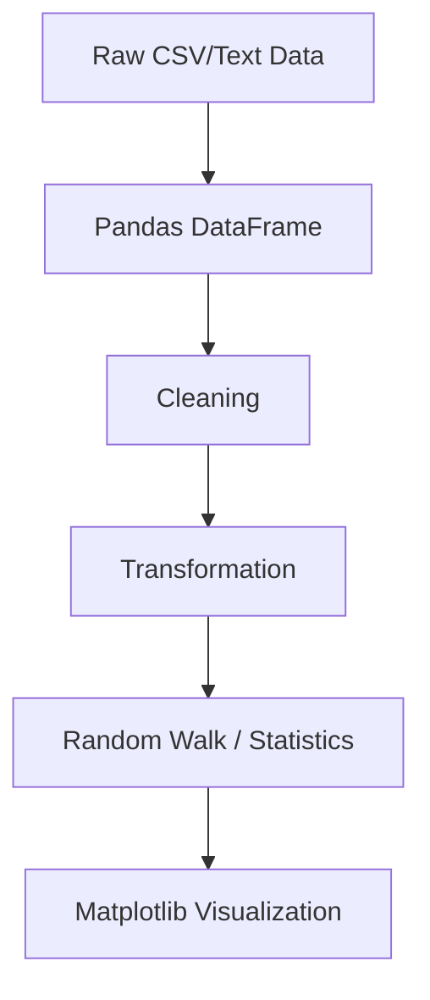

## Plotting Data from CSVs and DataFrames

## Introduction

This lecture moves from synthetic toy examples toward realistic analytical workflows.

The central theme is:

> how to ingest structured data into Python and visualize it effectively.

Most real-world visualization systems do not begin with plotting.

They begin with:

- raw data ingestion
    
- parsing
    
- cleaning
    
- transformation
    
- structuring
    

Only after this pipeline does visualization happen.

Source transcript:

---

## Standard Imports

The lecture begins with:

```python
import numpy as np
import pandas as pd
import matplotlib.pyplot as plt
```

These form the core scientific visualization stack.

---

## Setting a Global Style

```python
plt.style.use('seaborn-v0_8-whitegrid')
```

This globally modifies Matplotlib rendering defaults.

Effects include:

- softer grids
    
- cleaner axes
    
- improved spacing
    
- modern aesthetics
    

Without styles:

- plots appear inconsistent
    
- dashboards feel fragmented
    
- readability suffers
    

---

## Understanding CSV Data

CSV means:

```text
Comma-Separated Values
```

Example:

```csv
Country,GDP,Population
USA,70000,331
India,2500,1400
```

Each row:

- represents an observation
    

Each column:

- represents a variable
    

---

## Reading CSV Data into Pandas

The lecture demonstrates:

```python
import pandas as pd

df = pd.read_csv("data.csv")
```

But it also shows an advanced idea:

> parsing raw CSV text directly from a string.

---

## Creating CSV Data as a String

```python
data = """
country,gdp_per_capita,life_expectancy,population,region
USA,70000,79,331,North America
India,2500,69,1400,Asia
Germany,50000,81,83,Europe
"""
```

---

## Reading String Data into Pandas

```python
from io import StringIO

df = pd.read_csv(
    StringIO(data)
)
```

This converts raw text into a DataFrame.

---

## Why This Matters

This technique is useful for:

- API responses
    
- embedded datasets
    
- testing
    
- rapid prototyping
    
- dynamically generated CSV content
    

---

## Understanding DataFrames

The transcript repeatedly emphasizes DataFrames.

A DataFrame is:

```text
structured tabular memory
```

Conceptually:

|Country|GDP|Population|
|---|---|---|
|USA|70000|331|
|India|2500|1400|

---

## Inspecting DataFrames

Always inspect imported data immediately.

```python
print(df.head())

print(df.info())

print(df.describe())
```

This prevents silent failures.

---

## Bubble Scatter Plot

The lecture demonstrates a bubble chart.

This is an important visualization type because it introduces:

- x-axis
    
- y-axis
    
- marker size
    

simultaneously.

---

## Plotting GDP vs Life Expectancy

```python
import matplotlib.pyplot as plt

plt.figure(figsize=(10, 6))

plt.scatter(
    df['gdp_per_capita'],
    df['life_expectancy'],
    s=df['population'] * 10
)

plt.xlabel('GDP per Capita')
plt.ylabel('Life Expectancy')

plt.title(
    'GDP vs Life Expectancy'
)

plt.grid(True)

plt.show()
```

Source transcript:

---

## Why GDP Was Chosen as X-Axis

The lecture explains an implicit hypothesis:

> richer countries tend to have higher life expectancy.

This creates:

$$  
GDP \rightarrow Life\ Expectancy  
$$

So:

- GDP becomes independent variable
    
- life expectancy becomes dependent variable
    

---

## Why Bubble Size Matters

The lecture uses:

```python
s=df['population'] * 10
```

Where:

```python
s
```

controls marker size.

This transforms a 2D plot into quasi-3D information encoding.

Now the chart simultaneously represents:

|Visual Element|Meaning|
|---|---|
|X-axis|GDP|
|Y-axis|Life expectancy|
|Bubble size|Population|

---

## Why Scaling Is Necessary

Without scaling:

```python
s=df['population']
```

bubble sizes may become too large.

Marker size scales quadratically visually.

Large populations can dominate the figure.

---

## Advanced Bubble Scaling

Better scaling often uses:

```python
s=np.sqrt(df['population']) * 20
```

This reduces perceptual distortion.

---

## Cognitive Problem with Bubble Charts

Humans compare lengths more accurately than areas.

Bubble charts can mislead perception because:

- area comparisons are nonlinear
    
- large bubbles dominate attention
    
- overlapping markers hide information
    

---

## Improved Bubble Plot

```python
plt.figure(figsize=(10,6))

scatter = plt.scatter(
    df['gdp_per_capita'],
    df['life_expectancy'],
    s=np.sqrt(df['population']) * 20,
    c=df['gdp_per_capita'],
    cmap='viridis',
    alpha=0.7
)

plt.colorbar(scatter)

plt.xlabel('GDP per Capita')
plt.ylabel('Life Expectancy')

plt.title(
    'Economic Prosperity vs Health'
)

plt.grid(True)

plt.show()
```

---

## Why `alpha` Matters

```python
alpha=0.7
```

controls transparency.

Useful for:

- overlapping points
    
- dense scatter plots
    
- visual clarity
    

---

## Random Data Generation

The lecture then shifts toward synthetic data simulation.

Source transcript:

---

## Creating Random DataFrames

```python
import numpy as np
import pandas as pd

np.random.seed(42)

dates = pd.date_range(
    '2000-01-01',
    periods=1000
)

df = pd.DataFrame(
    np.random.randn(1000, 3),
    index=dates,
    columns=['A', 'B', 'C']
)
```

---

## Understanding `randn()`

```python
np.random.randn(1000, 3)
```

Generates:

$$  
1000 \times 3  
$$

matrix sampled from:

$$  
N(0,1)  
$$

standard normal distribution.

---

## Why Random Seeds Matter

```python
np.random.seed(42)
```

ensures reproducibility.

Without fixed seeds:

- results change every run
    
- debugging becomes difficult
    
- comparisons become unstable
    

---

## Time-Series Index

```python
pd.date_range()
```

creates datetime indexes.

This enables:

- temporal plotting
    
- resampling
    
- rolling windows
    
- forecasting
    

---

## Cumulative Sum and Random Walks

The lecture introduces:

```python
df = df.cumsum()
```

This is extremely important conceptually.

---

## What Is a Random Walk?

A random walk is:

$$  
X_t = X_{t-1} + \epsilon_t  
$$

Where:

- ( \epsilon_t ) = random noise
    

Each step depends on the previous position.

---

## Why Random Walks Matter

Random walks appear everywhere:

|Domain|Example|
|---|---|
|Finance|Stock prices|
|Physics|Brownian motion|
|ML|Stochastic optimization|
|Economics|Market fluctuations|
|Biology|Particle diffusion|

---

## Plotting Random Walks

```python
df.cumsum().plot()

plt.xlabel('Date')
plt.ylabel('Cumulative Value')

plt.grid(True)

plt.show()
```

Source transcript:

---

## Why Cumulative Sum Changes Everything

Without cumulative sum:

```python
df.plot()
```

you see random noise.

With cumulative sum:

```python
df.cumsum().plot()
```

you observe trajectories.

This creates trend-like behavior.

---

## Visual Difference

## Raw Noise

```text
up down up down random
```

## Random Walk

```text
persistent movement over time
```

This is fundamentally different statistically.

---

## Mathematical Interpretation

Suppose:

$$  
\epsilon_t \sim N(0,1)  
$$

Then cumulative walk becomes:

$$  
X_t = \sum_{i=1}^{t}\epsilon_i  
$$

Variance grows over time:

Var(X_t)=t\sigma^2

This is why random walks drift increasingly over time.

---

## Plotting Multiple Series

The lecture uses:

```python
df.plot()
```

Since DataFrames contain multiple columns:

- A
    
- B
    
- C
    

Matplotlib automatically plots all series.

---

## Advanced Plot Customization

```python
df.cumsum().plot(
    figsize=(12,6),
    linewidth=2
)

plt.title(
    'Random Walk Simulation'
)

plt.xlabel('Date')
plt.ylabel('Cumulative Value')

plt.legend(
    loc='upper left'
)

plt.grid(alpha=0.3)

plt.show()
```

---

## Why Random Walks Look Predictive

Humans naturally detect patterns even in randomness.

This is dangerous.

Random walks often create:

- fake trends
    
- false cycles
    
- illusory momentum
    

This is a major issue in financial analysis.

---

## Machine Learning Connections

Random walks are foundational in:

|ML Area|Usage|
|---|---|
|Reinforcement learning|Exploration|
|Optimization|SGD trajectories|
|Time-series forecasting|Baseline models|
|Monte Carlo simulation|Sampling|
|Bayesian methods|MCMC|

---

## Advanced Visualization Pipeline



---

## Common Mistakes

## Forgetting Datetime Indexes

Time-series plots become messy without proper indexing.

---

## Not Scaling Bubble Sizes

Large populations dominate charts.

---

## Treating Random Walks as Predictive Trends

Randomness often looks meaningful visually.

---

## Ignoring Data Validation

Always inspect imported data.

---

## Final Takeaways

This lecture is fundamentally about:

> transforming raw structured data into analyzable visual systems.

Key ideas include:

|Concept|Purpose|
|---|---|
|`read_csv()`|Data ingestion|
|DataFrames|Structured memory|
|Scatter plots|Relationship analysis|
|Bubble size|Third-variable encoding|
|`cumsum()`|Random walk simulation|
|Datetime index|Time-series support|

The deeper lesson is that visualization begins long before plotting.

It begins with:

- data structure
    
- transformation
    
- statistical interpretation
    
- pipeline design
    

The plotting itself is only the final rendering layer.

Tags: #statistics #machine-learning #data-science #statistical-modelling