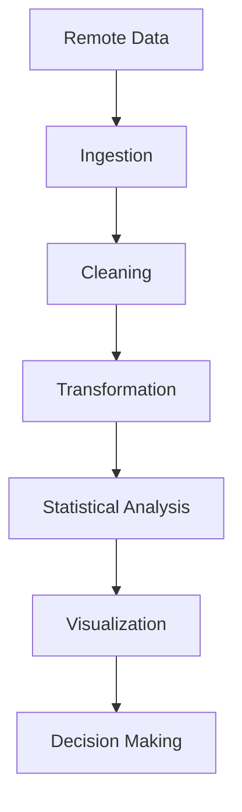

# Advanced Insight

Most beginner tutorials treat visualization as isolated plotting.

Real systems work differently.

Visualization is usually the final layer of a much larger pipeline:

Understanding ingestion is therefore just as important as understanding plotting.
