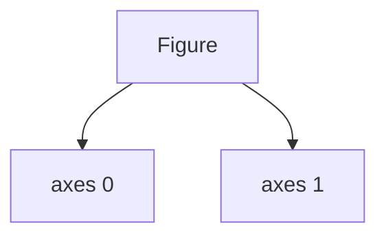

# Mental Model of Axes Arrays

When using:

```python
fig, axes = plt.subplots(2,1)
```

Matplotlib creates:

```python
axes = [Axes0, Axes1]
```

Conceptually:



Each subplot is independently controllable.
