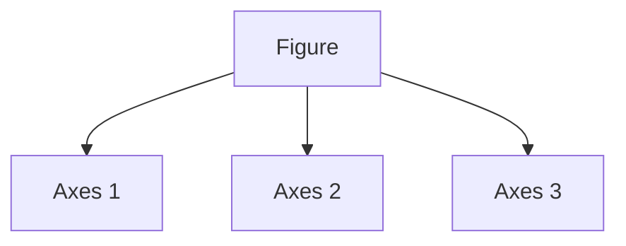

# The Core Idea Behind Subplots

A figure can contain multiple axes.

Think of Matplotlib hierarchically:

```mermaid
flowchart TD

A[Figure] --> B[Axes 1]
A --> C[Axes 2]
A --> D[Axes 3]
```

Where:

- Figure = entire canvas
    
- Axes = individual plotting regions
