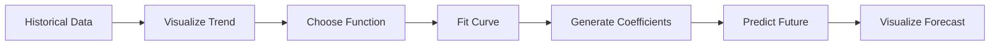

This transcript explains one of the most important ideas in analytics and forecasting:

```text
Using mathematical functions to model trends in data
and extrapolate future values.
```

This is the foundation of:

- forecasting
    
- regression
    
- predictive analytics
    
- machine learning
    
- time-series modelling
    

The entire lecture revolves around:

```text
Observed Data → Fit Function → Predict Future
```

# Core Concept

You have historical data.

Example:

|Month|Users|
|---|---|
|1|100|
|2|120|
|3|150|

You want to estimate:

```text
What happens in month 13?
month 18?
next year?
```

You cannot directly know the future.

So instead:

1. Detect pattern
    
2. Approximate pattern mathematically
    
3. Extend the pattern into the future
    

This process is called:

# Extrapolation

The transcript defines it as:

> “You are extrapolating data from the current time period to the next time period using a particular function.”

# Big Picture Pipeline



This exact architecture appears in:

- stock forecasting
    
- sales forecasting
    
- ML regression
    
- recommendation systems
    
- climate prediction
    
- demand planning
    

# Why Visualization Matters First

The transcript repeatedly emphasizes:

```text
You must first understand the shape of the data.
```

Because different trends require different models.

# Example Trends

|Trend Type|Shape|Example|
|---|---|---|
|Linear|straight line|constant growth|
|Polynomial|curved|accelerating adoption|
|Exponential|explosive|viral growth|
|Cyclical|repeating wave|weather/seasons|
|Logistic|S-curve|population saturation|

# Critical Insight

The model is chosen based on:

```text
the geometry of the data
```

not randomly.

# Polynomial Curve Fitting

The lecture primarily uses:

```python
np.polyfit()
```

This fits a polynomial equation to data.

# Polynomial Intuition

A polynomial is:

```text
A weighted combination of powers of x
```

General form:

y = a_nx^n + a_{n-1}x^{n-1} + \dots + a_1x + a_0

# Degree Meaning

|Degree|Shape|
|---|---|
|1|straight line|
|2|parabola|
|3|cubic|
|4+|more flexible curves|

The transcript explains:

> “If it is degree 2 you have a parabolic.”

# Step-by-Step Example

# Step 1: Create Data

```python
import numpy as np

months = np.array([1,2,3,4,5,6,7,8,9,10,11,12])

users = np.array([
    100,
    120,
    150,
    180,
    230,
    300,
    400,
    520,
    650,
    800,
    1000,
    1250
])
```

This simulates user growth.

# Step 2: Fit Polynomial Curve

```python
coefficients = np.polyfit(
    months,
    users,
    2
)
```

# What Is Happening Internally?

NumPy is solving:

```text
Find the parabola that minimizes total error
```

between:

- actual data points
    
- predicted curve
    

This is optimization.

# Important Output

`coefficients` might look like:

```python
array([ 12.3, -45.1, 120.7 ])
```

These become the polynomial equation coefficients.

Meaning:

genui{"math_block_widget_always_prefetch_v2":{"content":"y = 12.3x^2 - 45.1x + 120.7"}}

# Step 3: Convert Coefficients Into Function

```python
polynomial_function = np.poly1d(coefficients)
```

Now Python creates an actual mathematical function.

# Step 4: Generate Future Months

```python
future_months = np.arange(1, 19)
```

Original data:

```text
1 → 12
```

Forecast range:

```text
1 → 18
```

# Step 5: Predict Future Values

```python
future_users = polynomial_function(future_months)
```

This is the key forecasting step.

You are mathematically extending the curve.

# Visualization

```python
import matplotlib.pyplot as plt

plt.figure(figsize=(10,6))

# Actual data
plt.plot(
    months,
    users,
    'o',
    color='blue',
    label='Actual Users'
)

# Predicted trend
plt.plot(
    future_months,
    future_users,
    '--',
    color='darkorange',
    label='Extrapolated Trend'
)

plt.xlabel('Months')
plt.ylabel('Users')
plt.title('Polynomial Curve Fitting')

plt.legend()

plt.show()
```

# What the Plot Shows

The transcript explains:

- blue dots = actual data
    
- orange curve = extrapolated prediction
    

# Why Curve Fitting Works

Because many real systems are not linear.

Example:

|System|Behavior|
|---|---|
|Social media growth|exponential|
|Sales|seasonal|
|Climate|cyclical|
|Population|logistic|

Linear assumptions fail often.

# The Critical Comparison: Polynomial vs Linear

This is the most important section of the lecture.

The instructor compares:

|Model|Prediction|
|---|---|
|Linear|1000 users|
|Polynomial|1400 users|

That is a:

```text
40% forecasting difference
```

This is massive in business.

# Why Linear Regression Failed

Linear regression assumes:

genui{"math_block_widget_always_prefetch_v2":{"content":"y = mx + b"}}

meaning:

```text
constant growth rate
```

But the actual data accelerates.

So the model underfits.

# Underfitting

The linear model is too simple.

It cannot capture curvature.

This is called:

```text
underfitting
```

# Overfitting vs Underfitting

|Problem|Meaning|
|---|---|
|Underfitting|model too simple|
|Overfitting|model too complex|

Polynomial degree selection is fundamentally balancing these two.

# Visual Importance

The transcript makes a subtle but extremely important business point:

Visualization increases trust.

Without visualization:

```text
"Trust my forecast."
```

With visualization:

```text
"See how closely the model matches reality."
```

This matters enormously in:

- executive reporting
    
- investor presentations
    
- forecasting systems
    
- ML explainability
    

# Hidden Mathematical Principle

Curve fitting minimizes prediction error.

Typically:

\text{Error} = \sum (y_i - \hat{y}_i)^2

This is least squares optimization.

The same principle powers:

- linear regression
    
- neural networks
    
- deep learning
    
- gradient descent systems
    

# Real ML Connection

This lecture is secretly introducing regression modeling.

Modern ML systems do the same thing:

```text
Data → Learn Function → Predict
```

Only the functions become more complex:

|Method|Function Type|
|---|---|
|Linear Regression|line|
|Polynomial Regression|curve|
|Neural Network|nonlinear high-dimensional function|
|XGBoost|ensemble functions|

# Common Beginner Mistakes

# 1. Blindly Choosing High-Degree Polynomial

Higher degree does NOT mean better.

Example:

```python
np.polyfit(x, y, 15)
```

can create nonsense oscillations.

# 2. Assuming Forecasts Are Truth

The transcript warns:

> “There is scope for error.”

Forecasts are assumptions, not facts.

# 3. Ignoring Domain Knowledge

A mathematically good fit can still be unrealistic.

Example:

- predicting infinite customer growth
    
- predicting negative rainfall
    
- predicting impossible temperatures
    

# Computational Insight

Polynomial fitting internally solves matrix equations.

Complexity grows with:

- number of points
    
- polynomial degree
    

Very high-degree fitting becomes unstable.

# Better Real-World Alternatives

For production forecasting:

|Method|Use Case|
|---|---|
|ARIMA|time-series|
|Prophet|business forecasting|
|XGBoost|tabular forecasting|
|LSTM|sequential deep learning|

# Most Important Conceptual Takeaway

The lecture is not really about plotting.

It is about this idea:

```text
Visualization helps humans choose mathematical models.
```

That is one of the deepest ideas in data science.

Humans visually detect structure.  
Models formalize it mathematically.