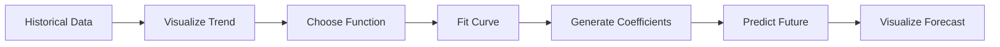

# Big Picture Pipeline

This exact architecture appears in:

- stock forecasting
    
- sales forecasting
    
- ML regression
    
- recommendation systems
    
- climate prediction
    
- demand planning
