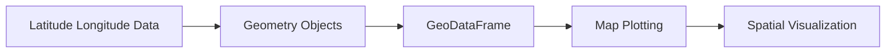
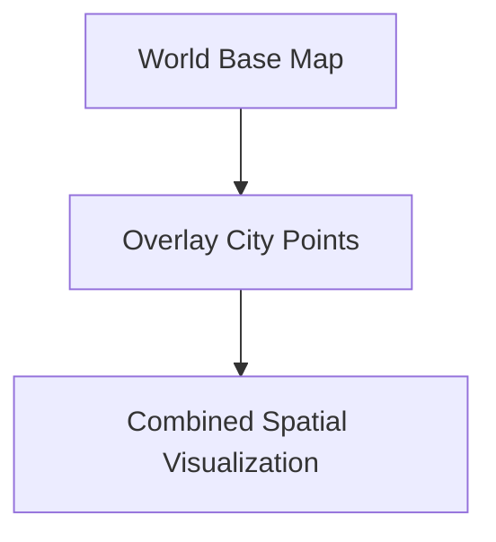

This transcript explains how to visualize geographical and spatial data using GeoPandas.

At a deeper level, this lesson is really about:

```text
Turning numerical coordinates into spatial meaning.
```

This is foundational to:

- GIS systems
    
- logistics analytics
    
- location intelligence
    
- urban planning
    
- climate mapping
    
- delivery optimization
    
- geospatial machine learning
    

## Core Idea

Normal Pandas handles:

|Type|Example|
|---|---|
|numbers|sales|
|strings|city names|
|dates|timestamps|

GeoPandas adds:

```text
geometry
```

Meaning:

- points
    
- lines
    
- polygons
    
- regions
    
- spatial boundaries
    

The transcript explains:

> “The geometry column is what brings in the richness to the map visualisations.”

That single sentence is the heart of geospatial analytics.

## Big Picture Workflow



## Why Geographical Visualization Matters

The lecture makes a business point:

> “People can closely associate that with the space in which they are living.”

Spatial visualization is psychologically powerful because humans naturally think geographically.

Examples:

|Use Case|Why Maps Matter|
|---|---|
|Sales regions|compare territory performance|
|Delivery tracking|optimize logistics|
|Crime analytics|identify hotspots|
|Population density|urban planning|
|Climate|spatial weather patterns|

## What Is GeoPandas?

GeoPandas is an extension of Pandas.

Normal Pandas:

```python
DataFrame
```

GeoPandas:

```python
GeoDataFrame
```

Difference:

```text
GeoDataFrame contains geometry
```

## Standard DataFrame

|city|sales|
|---|---|
|Delhi|100|

## GeoDataFrame

|city|sales|geometry|
|---|---|---|
|Delhi|100|POINT(77.1 28.7)|

Now Python knows:

```text
where the object exists physically
```

## Step 1: Install GeoPandas

```python
pip install geopandas geodatasets
```

The transcript mentions:

> “First you have to install the geodatasets into geopandas.”

## Step 2: Import Libraries

```python
import geopandas as gpd
import geodatasets
```

## Step 3: Load Geographic Data

```python
chicago = gpd.read_file(
    geodatasets.get_path("geoda.chicago_commpop")
)
```

This is equivalent to:

```python
pd.read_csv()
```

but for geospatial files.

## Important Difference

GeoPandas reads:

- shapefiles
    
- geojson
    
- spatial databases
    
- geometry-aware formats
    

not just CSVs.

## What Is a Shapefile?

The transcript mentions shapefiles briefly.

A shapefile stores:

- boundaries
    
- polygons
    
- coordinates
    
- geometry metadata
    

Think of it as:

```text
a blueprint for drawing maps
```

## Geometry Types

GeoPandas supports:

|Geometry|Meaning|
|---|---|
|Point|city|
|Line|road|
|Polygon|country/state|
|MultiPolygon|multiple regions|

The transcript shows:

> “multipolygon with latitude and longitude”

## Step 4: Inspect Data

```python
chicago.head()
```

Example:

|community|population|geometry|
|---|---|---|
|Hyde Park|25000|POLYGON(...)|

## Key Insight

The geometry column is not human-readable.

But mathematically it defines shape boundaries.

## Step 5: Basic Map Plot

```python
chicago.plot()
```

This creates a map automatically.

Why?

Because GeoPandas interprets geometry spatially.

## Mental Model

Regular plotting:

```text
x-axis + y-axis
```

Geo plotting:

```text
longitude + latitude + geometry topology
```

## Choropleth Maps

The lecture then visualizes population density.

```python
chicago.plot(
    column='POP2010',
    legend=True
)
```

## What Happens Here?

Population values determine color intensity.

Dark regions:

```text
higher population
```

Light regions:

```text
lower population
```

This is called a:

## Choropleth Map

One of the most common GIS visualizations.

## Visualization Principle

The transcript says:

> “Darker shades indicating darker colour.”

This is encoding magnitude through color saturation.

## Human Perception Insight

Humans interpret:

|Visual Variable|Perceived As|
|---|---|
|darker color|more intensity|
|larger size|higher magnitude|
|brighter color|higher attention|

Maps leverage this strongly.

## Step 6: Add Legend

```python
chicago.plot(
    column='POP2010',
    legend=True
)
```

Without legend:

```text
colors have no meaning
```

With legend:

```text
colors become quantitative
```

## Step 7: Overlay Cities on World Map

This is one of the most important concepts in the lecture.

## Create City Dataset

```python
cities_data = {
    'city': ['New Delhi', 'New York', 'Tokyo'],
    'latitude': [28.61, 40.71, 35.67],
    'longitude': [77.20, -74.00, 139.69]
}
```

## Convert Into DataFrame

```python
import pandas as pd

cities_df = pd.DataFrame(cities_data)
```

## Create Geometry

```python
gdf_cities = gpd.GeoDataFrame(
    cities_df,
    geometry=gpd.points_from_xy(
        cities_df.longitude,
        cities_df.latitude
    )
)
```

## Critical Spatial Transformation

This is the most important line:

```python
points_from_xy()
```

It converts:

```text
numbers → spatial objects
```

## Why Geometry Matters

Without geometry:

```text
just numbers
```

With geometry:

```text
mappable entities
```

## Step 8: Plot World Map

```python
world = gpd.read_file(
    gpd.datasets.get_path('naturalearth_lowres')
)

ax = world.plot(figsize=(15,10))
```

## Step 9: Overlay Cities

```python
gdf_cities.plot(
    ax=ax,
    color='red',
    markersize=50
)
```

## What Is Happening?

You are layering plots.



This is exactly how:

- Google Maps
    
- Uber
    
- logistics systems
    
- GIS dashboards
    

work internally.

## Important GIS Principle

Maps are layers.

Example:

|Layer|Content|
|---|---|
|Base|world map|
|Overlay 1|roads|
|Overlay 2|stores|
|Overlay 3|traffic|
|Overlay 4|weather|

## Latitude and Longitude

The lecture emphasizes these are mandatory.

## Coordinate Meaning

|Coordinate|Meaning|
|---|---|
|Latitude|north/south|
|Longitude|east/west|

## Geometry Construction

GeoPandas internally creates:

```text
POINT(longitude latitude)
```

Example:

```text
POINT(77.20 28.61)
```

## Why Longitude Comes First

Important GIS convention:

```text
x = longitude
y = latitude
```

Many beginners reverse these accidentally.

## Just Noticeable Shape Principle

The instructor mentions closure perception.

This is a Gestalt psychology principle.

Humans recognize incomplete geographical patterns automatically.

Even simplified outlines are recognizable.

## Real-World Applications

## 1. Logistics

```text
delivery optimization
```

## 2. Retail

```text
store performance by region
```

## 3. Climate Science

```text
temperature heatmaps
```

## 4. Epidemiology

```text
disease spread maps
```

## 5. Telecom

```text
network coverage analysis
```

## ML Connections

Geospatial ML uses:

- latitude
    
- longitude
    
- spatial clusters
    
- region embeddings
    

for:

- demand forecasting
    
- ride prediction
    
- fraud detection
    
- location recommendation
    

## Common Beginner Mistakes

## 1. Missing Geometry

Without geometry:

```python
gdf.plot()
```

fails spatially.

## 2. Swapping Latitude/Longitude

Wrong:

```python
points_from_xy(latitude, longitude)
```

Correct:

```python
points_from_xy(longitude, latitude)
```

## 3. Using Wrong Coordinate Systems

Advanced GIS systems use:

- WGS84
    
- UTM
    
- Mercator projections
    

Projection mismatch creates distorted maps.

## Computational Insight

Geospatial operations are expensive because:

- polygons are mathematically complex
    
- intersection tests are costly
    
- geometry calculations scale poorly
    

Spatial indexing is often required in production systems.

## Hidden Deep Idea

This lecture is actually introducing:

```text
Spatial databases and geometry-aware computing
```

which is a massive field itself.

GeoPandas is essentially:

```text
Pandas + GIS engine
```

## Most Important Takeaway

The key transformation is:

```text
Coordinates → Geometry → Spatial Meaning
```

That is the foundation of all modern mapping systems.

Tags: #statistics #machine-learning #data-science #statistical-modelling
