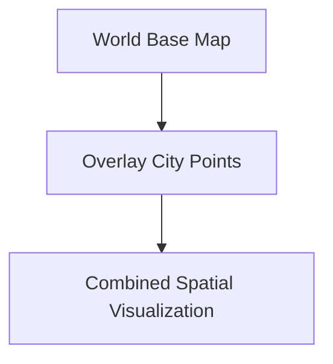

# What Is Happening?

You are layering plots.

```mermaid
flowchart TD
    A[World Base Map] --> B[Overlay City Points]
    B --> C[Combined Spatial Visualization]
```

This is exactly how:

- Google Maps
    
- Uber
    
- logistics systems
    
- GIS dashboards
    

work internally.
