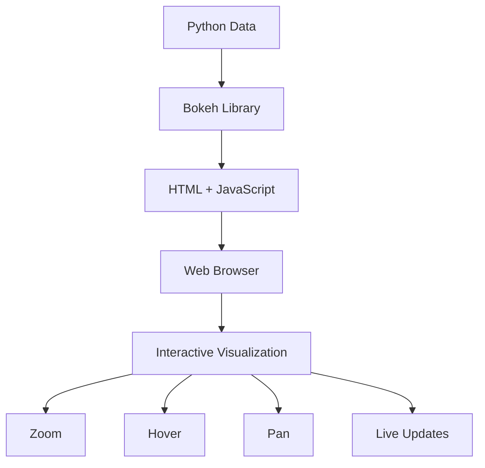
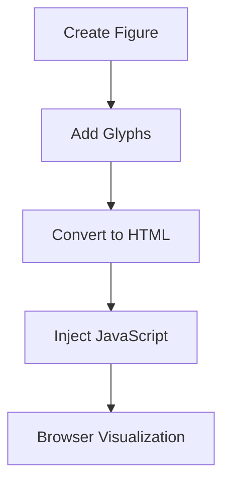
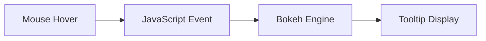
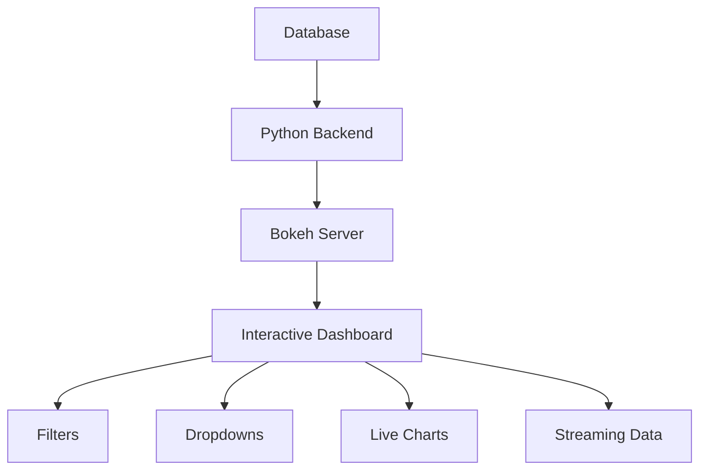
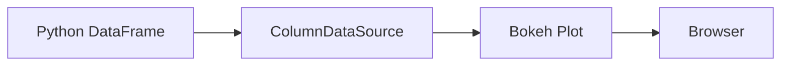
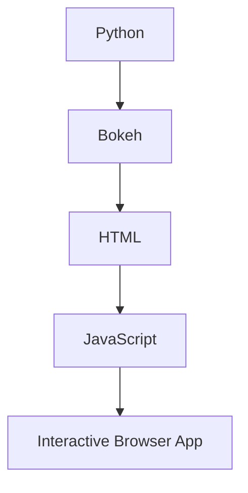

Based on your lecture transcript, the instructor is introducing **Bokeh**, a powerful library in the Python ecosystem designed specifically for creating **interactive, web-ready visualizations**.

The lecture highlights a core data storytelling philosophy: balancing the narrative between the author and the audience by giving viewers the power to manipulate the data and draw their own conclusions.

## 1. Data Storytelling Framework: Balancing Author & Audience Control

The instructor connects Bokeh's technical capabilities directly to visualization theory, specifically how to structure a data narrative:

- **Author-Driven Narrative (Initial Phase):** The creator sets the stage, defines the core visuals, and establishes the initial baseline story to capture attention.
    
- **Audience-Driven Exploration (Interactive Phase):** By utilizing Bokeh's web-based interactivity (zooming, panning, hovering, filtering), the audience transitions from passive viewers to active explorers. They can manipulate the canvas to test hypotheses and derive their own personalized conclusions, building deeper credibility for the data.
    

## 2. Technical Architecture: How Bokeh Works Under the Hood

Unlike Matplotlib or Seaborn, which render static image blocks (like PNGs or JPEGs), Bokeh bridges the gap between Python data science and modern web technology:

```
[ Your Python Code ] 
       │ (High-Level Configuration)
       ▼
[ Bokeh Engine ] ──(Serializes Data)──► [ BokehJS (JavaScript Backend) ]
                                                       │
                                                       ▼
                                            [ Dynamic Web Browser ]
                                        (Interactive, HTML5 Canvas, Charts)
```

### The Two Interface Layers

1. **Bokeh Plotting (`high-level`):** The primary, general-purpose interface. Similar to Matplotlib or Seaborn, it automates visual design attributes like styling, spacing, and color schemes, allowing you to convert a DataFrame into a chart rapidly.
    
2. **Bokeh Models (`low-level`):** The underlying foundation of the library. It gives advanced developers absolute control over every individual component, object property, and customized connection on the web canvas.
    

## 3. Production-Ready Python Implementation

To use Bokeh inside a Jupyter or Google Colab notebook, you must explicitly declare a target workspace using `output_notebook()`. This flags the backend to inject the necessary JavaScript components directly into your browser window.

```Python
## =====================================================================
## 1. INSTALLATION & ENVIRONMENT SETUP
## =====================================================================
## In a Colab/Jupyter cell, you would run: !pip install bokeh

import numpy as np
import pandas as pd
from bokeh.io import output_notebook, show
from bokeh.plotting import figure

## CRITICAL: Initialize the corporate workspace inside your notebook browser.
## This ensures BokehJS loads correctly to render interactive elements.
output_notebook()

## =====================================================================
## 2. GENERATING DATA
## =====================================================================
np.random.seed(42)
x_data = np.linspace(0, 10, 50)
y_data = np.sin(x_data) + np.random.normal(0, 0.1, 50)

## =====================================================================
## 3. HIGH-LEVEL BOKEH PLOTTING INTERFACE
## =====================================================================

## Step A: Initialize the Figure object (Defines canvas size and default tools)
## Bokeh automatically adds web tools like Pan, Box Zoom, Wheel Zoom, Reset, and Save.
p = figure(
    title="Interactive Wave Patterns (Author-Driven Baseline)",
    x_axis_label="Time Interval",
    y_axis_label="Signal Value",
    width=700,
    height=400,
    tools="pan,box_zoom,wheel_zoom,reset,save,hover"
)

## Step B: Render Glyphs (Geometric data markers)
## Adding a continuous trendline
p.line(x_data, y_data, legend_label="Trend", line_width=2, line_color="navy")

## Overlaying individual scatter points that the audience can interact with
p.circle(x_data, y_data, legend_label="Data Points", size=8, color="orange", alpha=0.7)

## Step C: Style layout properties
p.legend.location = "top_right"
p.title.text_font_size = "14pt"

## Step D: Deploy the plot to the browser canvas
show(p)
```

## 4. Operational Ecosystem Matrix

| **Feature Dimension**       | **Static Libraries (Matplotlib / Seaborn)**               | **Interactive Framework (Bokeh)**                                            |
| --------------------------- | --------------------------------------------------------- | ---------------------------------------------------------------------------- |
| **Output Target**           | Inline static matrix blocks (Static Images).              | Standalone **HTML**, live streaming dashboards, or web apps.                 |
| **Backend Engine**          | Vector / Raster graphics renderers.                       | **BokehJS** (Native client-side JavaScript engine).                          |
| **Audience Capability**     | Passive consumption of pre-calculated, fixed chart views. | **Active exploration** via zooming, scaling, panning, and live hovers.       |
| **Notebook Initialization** | Standard execution out of the box.                        | Requires explicitly invoking `output_notebook()` to load the JS environment. |
| **Core Interface Split**    | Functional wrappers vs. figure axis layers.               | **High-Level Plotting** (Fast) vs. **Low-Level Models** (Hyper-Customized).  |
## Bokeh Introduction Explained Visually + Code Wise

The transcript introduces one core idea:

> Bokeh = Python library for creating **interactive visualizations in web browsers**

Unlike static plots from Matplotlib, Bokeh allows:

- zooming
    
- hovering
    
- panning
    
- live updates
    
- dashboards
    
- browser embedding
    

Source:


## 1. Why Bokeh Exists

## Traditional Visualization Problem

Matplotlib creates mostly static images.

```python
import matplotlib.pyplot as plt

x = [1,2,3,4]
y = [10,20,25,30]

plt.plot(x, y)
plt.show()
```

You see a graph.  
But:

- no zoom
    
- no hover tool
    
- no interactivity
    

Good for reports.  
Bad for exploration.


## 2. What Bokeh Changes

Bokeh generates:

- HTML
    
- JavaScript
    
- interactive browser visuals
    

Internally:

```text
Python Code
    ↓
Bokeh Engine
    ↓
HTML + JavaScript
    ↓
Interactive Browser Visualization
```


## Visual Architecture




## 3. Installing Bokeh

Transcript mentions:

```python
pip install bokeh
```

Source:


## 4. First Important Concept: `output_notebook()`

This line is critical.

```python
from bokeh.io import output_notebook

output_notebook()
```

Source:


## Why This Is Needed

Bokeh needs a rendering environment.

Without it:

- plots may not display inside Jupyter
    

Think of it like:

```text
Matplotlib:
direct image rendering

Bokeh:
browser-based rendering
```

So `output_notebook()` tells Bokeh:

> "Render interactive visuals INSIDE the notebook."


## Visual Understanding

```mermaid
flowchart LR

A[Notebook] --> B[output_notebook()]
B --> C[Bokeh JS Loaded]
C --> D[Interactive Plot Works]
```


## 5. Your First Bokeh Plot

## Full Example

```python
from bokeh.plotting import figure, show
from bokeh.io import output_notebook

## Enable notebook rendering
output_notebook()

## Create figure object
p = figure(
    title="Simple Line Plot",
    x_axis_label='X Values',
    y_axis_label='Y Values',
    width=600,
    height=400
)

## Add line
x = [1, 2, 3, 4, 5]
y = [6, 7, 2, 4, 5]

p.line(x, y, line_width=3)

## Display plot
show(p)
```


## What Each Part Does


## `figure()`

Creates plotting canvas.

```python
p = figure(...)
```

Equivalent to:

- `plt.figure()` in Matplotlib
    


## `p.line()`

Adds graphical object.

```python
p.line(x, y)
```

Equivalent to:

- `plt.plot()`
    


## `show()`

Renders visualization.

```python
show(p)
```

Equivalent to:

- `plt.show()`
    


## Internal Flow




## 6. Why Bokeh Feels Different

The transcript highlights:

- browser rendering
    
- JavaScript backend
    
- interactivity
    

Source:


## Static vs Interactive

|Feature|Matplotlib|Bokeh|
|---|---|---|
|Static PNG|Excellent|Good|
|Interactivity|Limited|Excellent|
|Browser Ready|Weak|Native|
|Dashboards|Hard|Easy|
|Hover Tool|Manual|Built-in|
|Live Streaming|Weak|Strong|


## 7. Core Bokeh Mental Model

Bokeh works using:

```text
Figure
    ↓
Glyphs
    ↓
Tools
    ↓
Rendering
```


## What Are Glyphs?

Glyphs are visual objects:

- line
    
- circle
    
- bar
    
- patch
    
- rectangle
    

Example:

```python
p.circle(x, y)
```

or

```python
p.vbar(...)
```


## 8. Add Interactivity

Now let’s see why Bokeh is powerful.


## Hover Tool Example

```python
from bokeh.plotting import figure, show
from bokeh.models import HoverTool
from bokeh.io import output_notebook

output_notebook()

x = [1,2,3,4,5]
y = [10,20,15,30,25]

p = figure(
    title="Interactive Hover Example",
    tools="pan,wheel_zoom,box_zoom,reset"
)

p.circle(x, y, size=15)

hover = HoverTool(
    tooltips=[
        ("X Value", "@x"),
        ("Y Value", "@y")
    ]
)

p.add_tools(hover)

show(p)
```


## What Happens Here?

Now user can:

- zoom
    
- pan
    
- hover over points
    
- inspect data
    

This is browser-native interaction.


## Visual Interaction Pipeline




## 9. High-Level vs Low-Level Bokeh

Transcript mentions:

- High-level plotting interface
    
- Low-level models
    

Source:


## High-Level Interface

Easy mode.

```python
from bokeh.plotting import figure
```

You focus on:

- data
    
- charts
    

Bokeh handles:

- colors
    
- layout
    
- rendering
    


## Example

```python
p.line(x, y)
```

Very simple.


## Low-Level Models

Advanced customization.

You directly manipulate:

- axes
    
- renderers
    
- layouts
    
- callbacks
    
- widgets
    

Used for:

- dashboards
    
- enterprise applications
    
- complex interactions
    


## Engineering Analogy

|Level|Analogy|
|---|---|
|High-Level|Driving automatic car|
|Low-Level|Building engine manually|


## 10. Real Strength of Bokeh

The transcript subtly hints at something important:

> Bokeh is not just plotting.  
> It is a visualization application framework.

This is a major distinction.


## Bokeh Can Build Dashboards

Example architecture:




## 11. Streaming Data Example

This is where Bokeh becomes serious.

```python
from bokeh.plotting import figure, curdoc
from bokeh.models import ColumnDataSource
from bokeh.driving import linear
import random

source = ColumnDataSource(data=dict(x=[], y=[]))

p = figure(width=600, height=300)
p.line('x', 'y', source=source)

@linear()
def update(step):
    new_data = {
        'x': [step],
        'y': [random.randint(0, 100)]
    }
    source.stream(new_data, rollover=50)

curdoc().add_periodic_callback(update, 1000)
curdoc().add_root(p)
```


## What This Does

Every second:

- new data arrives
    
- graph updates automatically
    

Used in:

- stock dashboards
    
- IoT monitoring
    
- operations analytics
    
- real-time ML systems
    


## 12. Key Object: `ColumnDataSource`

This is central to Bokeh.

Think of it as:

- internal dataframe for visualization
    


## Example

```python
from bokeh.models import ColumnDataSource

source = ColumnDataSource(data={
    'x': [1,2,3],
    'y': [4,5,6]
})
```


## Why It Matters

Bokeh synchronizes:

- Python data
    
- browser visualization
    

through this object.


## Visual Understanding




## 13. Bokeh vs Seaborn vs Matplotlib

|Tool|Best For|
|---|---|
|Matplotlib|Low-level static control|
|Seaborn|Statistical visualization|
|Bokeh|Interactive web visualization|


## 14. Common Beginner Mistakes

## Forgetting `output_notebook()`

Result:

- plot not displayed
    


## Using Huge Datasets Directly

Bokeh can slow down.

Bad:

```python
1 million browser-rendered points
```

Better:

- sampling
    
- Datashader integration
    


## Confusing Bokeh With Dash/Streamlit

Bokeh:

- visualization-first framework
    

Dash:

- full web app framework
    

Streamlit:

- rapid ML app framework
    


## 15. Where Bokeh Is Actually Used

## Strong Use Cases

### Operational Dashboards

- manufacturing
    
- healthcare
    
- logistics
    

### Real-Time Monitoring

- IoT
    
- server metrics
    
- trading
    

### Scientific Visualization

- simulation outputs
    
- research dashboards
    

### Embedded Analytics

- internal enterprise portals
    


## 16. Interview-Level Understanding

If asked:

> "Why use Bokeh instead of Matplotlib?"

Strong answer:

> Matplotlib is optimized for static publication-quality graphics, while Bokeh is optimized for browser-native interactive visualizations using a Python-to-JavaScript rendering pipeline.

That answer shows:

- architecture understanding
    
- not just syntax familiarity
    


## 17. The Hidden Design Philosophy

Most plotting libraries think:

```text
Chart → Image
```

Bokeh thinks:

```text
Chart → Interactive Application
```

That is the conceptual leap.


## 18. Minimal End-to-End Example

```python
from bokeh.plotting import figure, show
from bokeh.io import output_notebook

## Setup notebook rendering
output_notebook()

## Create data
x = [1,2,3,4,5]
y = [2,5,8,2,7]

## Create figure
plot = figure(
    title="My First Bokeh Plot",
    x_axis_label="X Axis",
    y_axis_label="Y Axis",
    tools="pan,wheel_zoom,box_zoom,reset,save"
)

## Add line and circles
plot.line(x, y, line_width=2)
plot.circle(x, y, size=10)

## Render
show(plot)
```


## Final Mental Model




## Final Takeaways

- Bokeh is built for browser-native interactivity
    
- It converts Python visuals into HTML + JavaScript
    
- `output_notebook()` enables notebook rendering
    
- `figure()` creates plotting canvas
    
- glyphs build visuals
    
- tools enable interaction
    
- `ColumnDataSource` powers dynamic data updates
    
- Bokeh scales from simple charts to live dashboards
    
- The key shift is:
    

```text
static visualization
        →
interactive visualization systems
```

Transcript source:

Tags: #statistics #machine-learning #data-science #statistical-modelling