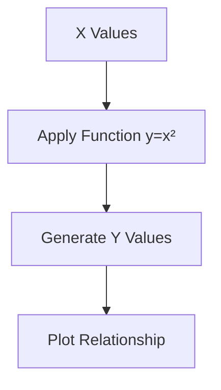
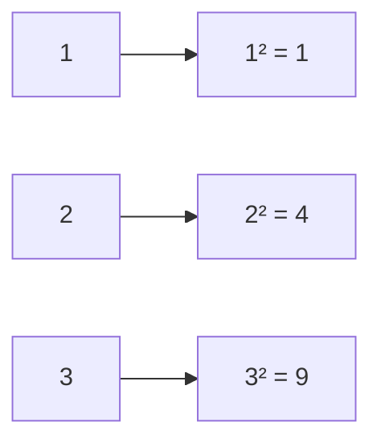
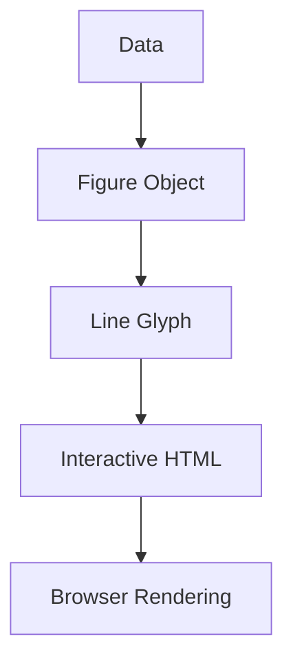
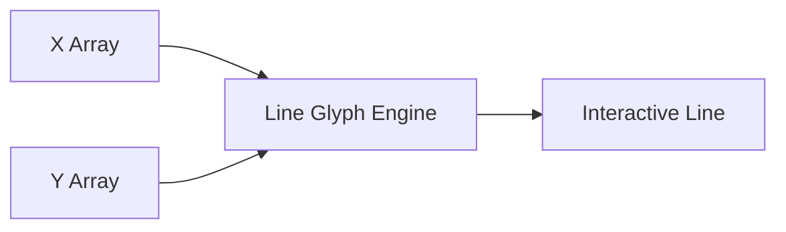
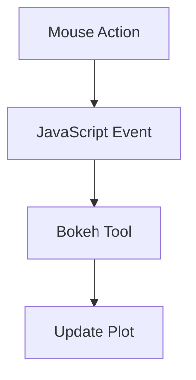
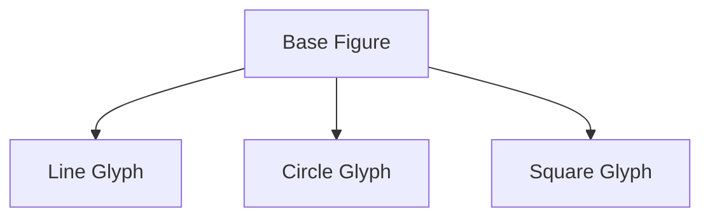
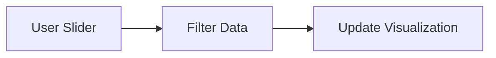
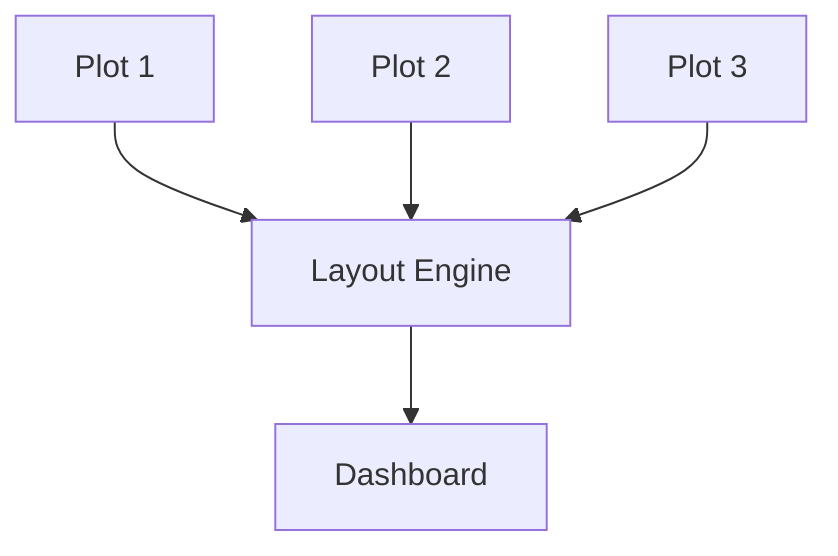
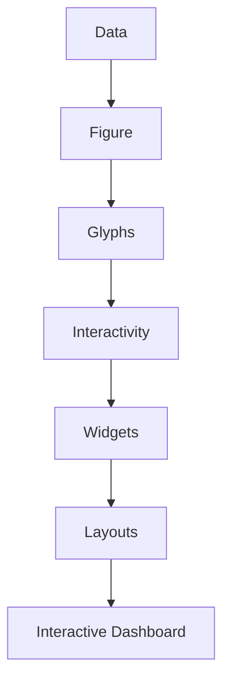

Based on your lecture transcript, the instructor covers the fundamental architecture of **Bokeh**: setting up canvases, rendering geometric layers called **Glyphs**, applying dynamic **Widgets** (audience narrative controls), and building multi-plot **Layouts** (Rows and Columns) to reduce cognitive load.

## 1. Core Architecture & Render Layers

Unlike Matplotlib or Seaborn, Bokeh treats visualizations as dynamic HTML components. Every chart relies on three progressive building blocks:

1. **The Figure Canvas (`figure`):** Defines the plotting boundaries, coordinate space, canvas sizing, and native web-based toolbar engines (pan, box zoom, wheel zoom, reset).
    
2. **Glyphs:** The underlying data geometry (lines, circles, squares, bars) rendered on the canvas. Every glyph maintains unique parameters (color, size, alpha transparency) and acts as an independent data object.
    
3. **The Show Action (`show()`):** Bokeh does not use inline static execution. Figures must be explicitly packaged and transmitted to the web browser utilizing the `show()` call.
    

## 2. Audience Narrative Control: Clickable Legends & Widgets

The instructor introduces two critical interactive capabilities that shift analytical control directly to the viewer:

- **Muted / Hidden Legends:** By passing a `.click_policy = "hide"` configuration, the legend changes from a static text list into an interactive toggle switch. Audiences can click individual legend items to hide clutter and isolate comparative trends.
    
- **Widgets (e.g., `DateRangeSlider`):** Small UI tools embedded alongside plots. They provide the audience with a mechanism to filter datasets (such as limiting a broad time-series to a specific quarter or date interval) without modifying the source Python code.
    

## 3. Production-Ready Python Demonstration

This complete script aggregates every step discussed in the transcript: initializing data streams, overlaying lines, circles, and offset squares, establishing a clickable legend policy, building a dynamic date slider widget, and utilizing multi-plot layouts.


```Python
import numpy as np
import pandas as pd
from datetime import date
from bokeh.io import output_notebook, show
from bokeh.plotting import figure
from bokeh.models import DateRangeSlider
from bokeh.layouts import row, column

# Initialize client-side JavaScript environment inside the browser
output_notebook()

# =====================================================================
# 1. CORE BUILDING BLOCKS & GLYPH OVERLAYS
# =====================================================================
# Creating simple coordinates
x_base = [1, 2, 3, 4]
y_base = [2, 5, 4, 6]

# Shifted dataset for secondary glyph evaluation
y_offset = [val - 1 for val in y_base]

# Step A: Initialize the main Figure canvas
p1 = figure(
    title="Layered Glyph Architecture & Interactive Toolbar",
    x_axis_label="X Values",
    y_axis_label="Y Values",
    width=600,
    height=350,
    tools="pan,box_zoom,wheel_zoom,reset,save"
)

# Step B: Render consecutive glyph objects to build visual richness
# Glyph 1: Continuous Line Trend
p1.line(x_base, y_base, legend_label="Trendline", line_width=3, line_color="navy")

# Glyph 2: Circle markers anchored over coordinates
p1.circle(x_base, y_base, legend_label="Target Identifiers", size=10, fill_color="red", line_color="black")

# Glyph 3: Square markers mapped to alternate offset data streams
p1.square(x_base, y_offset, legend_label="Baseline Offset", size=12, fill_color="orange", line_color="darkorange")

# Step C: Turn legend components into actionable visibility toggles
p1.legend.title = "Interactive Layers"
p1.legend.click_policy = "hide"  # Clicking an item hides its mapped glyph group

show(p1)


# =====================================================================
# 2. INTERACTIVE WIDGETS: DateRangeSlider Setup
# =====================================================================
# Creating an audience-facing date picker slider widget
date_slider = DateRangeSlider(
    title="Temporal Filter Range",
    start=date(2022, 1, 1),
    end=date(2023, 12, 31),
    value=(date(2022, 10, 1), date(2022, 12, 31)),
    step=1,
    width=500
)

# Render standalone widget component directly into browser
show(date_slider)


# =====================================================================
# 3. ADVANCED LAYOUTS: Comparative Multi-Plots (Rows & Columns)
# =====================================================================
# Generate functional evaluation structures
x_layout = list(range(1, 11))
y0 = [x for x in x_layout]                      # Linear Function: y = x
y1 = [10 - x for x in x_layout]                 # Inverse Linear:  y = 10 - x
y2 = [abs(x - 5) for x in x_layout]             # Modulus/V-Shape: y = |x - 5|

# Pre-set uniform layout sizing parameters
fig_settings = dict(width=260, height=260, tools="pan,wheel_zoom,reset")

# Initialize isolated figures
s1 = figure(title="Linear (y=x)", background_fill_color="#fafafa", **fig_settings)
s1.scatter(x_layout, y0, size=8, color="teal", marker="circle")

s2 = figure(title="Inverse (y=10-x)", background_fill_color="#f0f0f0", **fig_settings)
s2.scatter(x_layout, y1, size=8, color="crimson", marker="square")

s3 = figure(title="Modulus (y=|x-5|)", background_fill_color="#e6e6e6", **fig_settings)
s3.scatter(x_layout, y2, size=8, color="indigo", marker="triangle")

# Arrangement Style A: Row Layout (Side-by-Side Comparison)
horizontal_dashboard = row(s1, s2, s3)
print("--- Displaying Horizontal Row Layout ---")
show(horizontal_dashboard)

# Arrangement Style B: Column Layout (Vertically Stacked Grid)
vertical_dashboard = column(s1, s2, s3)
print("--- Displaying Vertical Column Layout ---")
show(vertical_dashboard)
```

## 4. Layout Mechanics Summary

The instructor highlights how Bokeh’s `row` and `column` layouts function similarly to small multiple grids found in static libraries, but preserve the independent interactivity of every sub-plot:

- **Horizontal Rows (`row(s1, s2, s3)`):** Best used to cross-examine coordinate values horizontally across charts with shared or identical Y-axis boundaries.
    
- **Vertical Columns (`column(s1, s2, s3)`):** Ideal for stacked time-series dashboards where your audience wants to evaluate separate variables tracking against a unified timeline.

# Bokeh Building Blocks Explained Visually + Code Wise

This transcript explains the actual mechanics of building Bokeh visualizations.

Core idea:

```text
Bokeh visualization =
Figure + Glyphs + Interactivity + Layouts + Widgets
```

Source:

---

# 1. The First Principle of Plotting

The transcript starts with an important idea:

> Before plotting anything:  
> know your x-axis and y-axis.

Source:

This sounds basic, but it matters.

Most bad visualizations fail because:

- axes are unclear
    
- relationships are undefined
    
- chart type does not match data structure
    

---

# Example Used in Transcript

They plot:

$$  
y = x^2  
$$

which is a parabola.

---

## Visual Intuition



---

# 2. Creating Data

Transcript:

```python
x = 1 to 50
y = x squared
```

---

## Actual Python

```python
# Generate x values
x = list(range(1, 51))

# Generate y values using square function
y = [i**2 for i in x]

print(x[:5])
print(y[:5])
```

---

# What This Means

For every x:

$$  
y = x^2  
$$

Example:

|x|y|
|---|---|
|1|1|
|2|4|
|3|9|
|4|16|
|5|25|

---

# Visual Understanding



---

# 3. Importing Figure and Show

Transcript explains:

```python
from bokeh.plotting import figure, show
```

Source:

---

# Why These Matter

## `figure`

Creates plotting canvas.

Equivalent to:

```python
plt.figure()
```

in Matplotlib.

---

## `show`

Renders visualization.

Without `show()`:

- nothing appears
    

This is different from Matplotlib notebooks.

---

# Mental Model

```mermaid
flowchart TD

A[Create Figure]
--> B[Add Visual Objects]
--> C[Render using show()]
```

---

# 4. First Complete Bokeh Plot

---

## Code

```python
from bokeh.plotting import figure, show
from bokeh.io import output_notebook

# Enable notebook rendering
output_notebook()

# Data
x = list(range(1, 51))
y = [i**2 for i in x]

# Create figure
p = figure(
    title="Parabola Plot",
    x_axis_label="X Values",
    y_axis_label="Y Values",
    width=700,
    height=400
)

# Add line glyph
p.line(
    x,
    y,
    line_width=3,
    legend_label="y = x²"
)

# Show visualization
show(p)
```

---

# What Happens Internally



---

# 5. What Is a Glyph?

This is one of the MOST important Bokeh concepts.

Transcript:

> Glyph is a visual representation of data.

Source:

---

# Simple Definition

A glyph is:

- line
    
- circle
    
- bar
    
- square
    
- wedge
    
- tile
    

Any visual object representing data.

---

# Mental Model

```text
Data
  ↓
Glyph
  ↓
Visual Representation
```

---

# Examples

|Glyph|Meaning|
|---|---|
|line()|line chart|
|circle()|scatter points|
|vbar()|vertical bars|
|square()|square markers|

---

# 6. Line Glyph

Transcript uses:

```python
p.line(x, y)
```

Source:

---

# What It Actually Does

```python
p.line(
    x,
    y,
    line_width=2,
    color="blue",
    legend_label="Line"
)
```

---

# Parameters Explained

|Parameter|Meaning|
|---|---|
|x|x-axis data|
|y|y-axis data|
|line_width|thickness|
|color|line color|
|legend_label|legend text|

---

# Visual Pipeline



---

# 7. Interactivity Features

Transcript highlights:

- zoom
    
- pan
    
- reset
    
- save
    
- localized zoom
    

Source:

---

# This Is The Key Difference

Matplotlib:

- static image mindset
    

Bokeh:

- browser application mindset
    

---

# Built-In Interactive Tools

```python
p = figure(
    tools="pan,wheel_zoom,box_zoom,reset,save"
)
```

---

# Tool Breakdown

|Tool|Purpose|
|---|---|
|pan|move graph|
|wheel_zoom|mouse wheel zoom|
|box_zoom|drag zoom|
|reset|restore|
|save|export PNG|

---

# Visual Interaction Model



---

# 8. Adding Multiple Glyphs

Transcript then moves to:

- line
    
- circles
    
- squares
    

on SAME plot.

Source:

---

# Why This Matters

Modern visualizations combine:

- multiple data layers
    
- multiple encodings
    
- multiple visual meanings
    

---

# Example

```python
from bokeh.plotting import figure, show
from bokeh.io import output_notebook

output_notebook()

x = [1,2,3,4]
y = [2,5,8,2]

p = figure(
    title="Multiple Glyphs Example",
    width=700,
    height=400
)

# Line glyph
p.line(
    x,
    y,
    line_width=2,
    legend_label="Line"
)

# Circle glyph
p.circle(
    x,
    y,
    size=12,
    color="red",
    legend_label="Circles"
)

# Square glyph
p.square(
    x,
    [1,4,5,3],
    size=12,
    color="green",
    legend_label="Squares"
)

show(p)
```

---

# Visual Structure



---

# 9. Why Multiple Glyphs Matter

This enables:

- overlays
    
- trend highlighting
    
- anomaly marking
    
- forecast comparison
    
- multi-series charts
    

---

# Real Analytics Example

|Glyph|Meaning|
|---|---|
|line|sales trend|
|circles|actual observations|
|squares|forecast points|

---

# 10. Clickable Legends

Transcript mentions:

```python
legend.click_policy = "hide"
```

Source:

---

# Why This Is Powerful

Users can:

- hide clutter
    
- isolate signals
    
- compare categories dynamically
    

---

# Example

```python
p.legend.click_policy = "hide"
```

---

# Behavior

```text
Click Legend
    ↓
Glyph Visibility Toggles
```

---

# This Is Huge In Dashboards

Imagine:

- 20 lines
    
- 20 categories
    

Instead of filtering data:

- user clicks legend
    

Very efficient.

---

# 11. Widgets

Transcript introduces widgets.

Source:

---

# What Are Widgets?

Widgets are UI controls:

- sliders
    
- dropdowns
    
- date pickers
    
- buttons
    

---

# Core Idea

```text
Visualization
+
User Controls
=
Interactive Analytics
```

---

# Date Range Slider Example

```python
from bokeh.models import DateRangeSlider
from datetime import datetime

slider = DateRangeSlider(
    title="Select Date Range",
    start=datetime(2022, 1, 1),
    end=datetime(2023, 12, 31),
    value=(
        datetime(2022, 7, 1),
        datetime(2023, 3, 31)
    )
)

show(slider)
```

---

# Why This Matters

User controls:

- time filtering
    
- zooming
    
- exploration
    

without changing code.

---

# Dashboard Interaction Model



---

# 12. Layouts

Transcript explains:

- rows
    
- columns
    

Source:

---

# Why Layouts Matter

Real dashboards rarely contain:

- one chart
    

They contain:

- grids
    
- panels
    
- KPI blocks
    
- filters
    
- charts
    

---

# Row Layout

```python
from bokeh.layouts import row

show(row(plot1, plot2, plot3))
```

---

# Column Layout

```python
from bokeh.layouts import column

show(column(plot1, plot2, plot3))
```

---

# Visual Understanding

## Row

```text
[Plot1] [Plot2] [Plot3]
```

---

## Column

```text
[Plot1]
[Plot2]
[Plot3]
```

---

# 13. Full Layout Example

```python
from bokeh.plotting import figure, show
from bokeh.layouts import row
from bokeh.io import output_notebook

output_notebook()

x = list(range(11))

# Plot 1
p1 = figure(title="y = x")
p1.line(x, x)

# Plot 2
p2 = figure(title="y = 10-x")
p2.line(x, [10-i for i in x])

# Plot 3
p3 = figure(title="Absolute Function")
p3.line(x, [abs(5-i) for i in x])

# Arrange in row
layout = row(p1, p2, p3)

show(layout)
```

---

# Internal Architecture



---

# 14. Important Design Insight

The transcript quietly reveals something important:

> Bokeh is NOT just plotting.

It is:

- plotting
    
- UI framework
    
- interaction engine
    
- dashboard system
    

combined.

---

# 15. Bokeh vs Traditional Plotting

|Traditional Plotting|Bokeh|
|---|---|
|image output|browser object|
|static|interactive|
|passive viewing|exploratory|
|chart-focused|application-focused|

---

# 16. Real Industry Usage

Bokeh becomes valuable when:

- users need exploration
    
- executives need interaction
    
- dashboards require filtering
    
- data updates live
    

---

# Typical Use Cases

|Industry|Use|
|---|---|
|Finance|live stock dashboards|
|Healthcare|patient monitoring|
|Manufacturing|sensor analytics|
|Logistics|shipment tracking|
|Data Science|model diagnostics|

---

# 17. Complete Mental Model



---

# Final Takeaways

## Core Bokeh Pipeline

```text
Figure
  ↓
Glyphs
  ↓
Interactivity
  ↓
Widgets
  ↓
Layouts
  ↓
Dashboard
```

---

# Most Important Concepts

|Concept|Meaning|
|---|---|
|figure()|plotting canvas|
|glyph|visual representation|
|show()|render visualization|
|widgets|interactive controls|
|layouts|arrange plots|
|legend click policy|dynamic visibility|

---

# Biggest Conceptual Shift

Matplotlib mindset:

```text
Create chart
```

Bokeh mindset:

```text
Create interactive analytical experience
```

Source:

Tags: #statistics #machine-learning #data-science #statistical-modelling