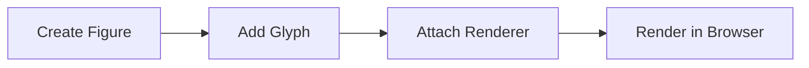
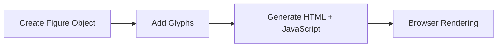
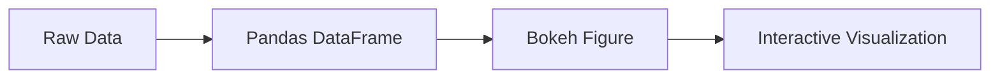
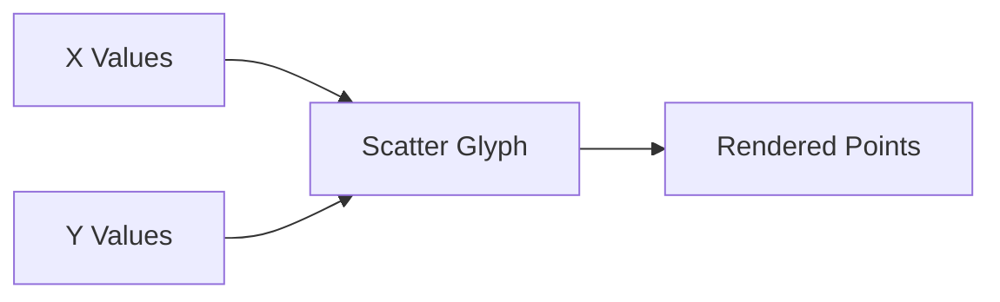
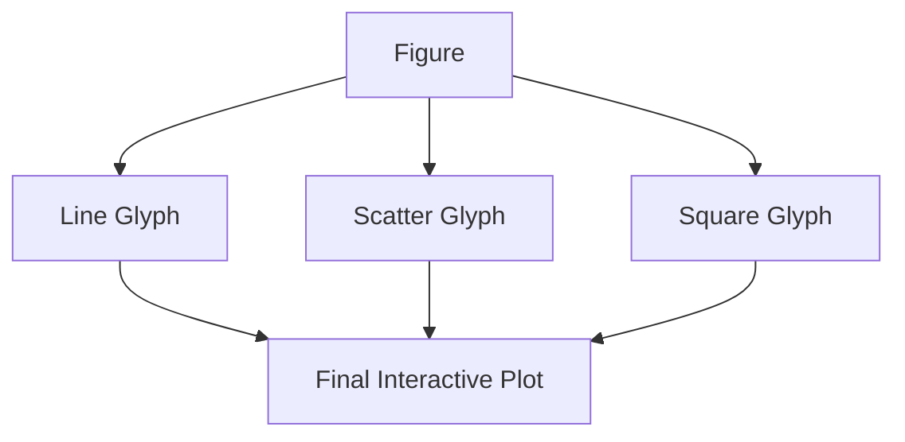

# Bokeh Glyphs Explained

## What are Glyphs in Bokeh?

In Bokeh, every visual element drawn on the plot is called a **glyph**.

Examples:

- line
    
- circle
    
- scatter
    
- rectangle
    
- bar
    
- triangle
    

Think of glyphs as the actual geometric shapes used to represent data.

|Data Visualization|Glyph Used|
|---|---|
|Line chart|line glyph|
|Scatter plot|circle/scatter glyph|
|Bar chart|rect/vbar glyph|
|Bubble chart|circle glyph with varying size|

So when the transcript says:

> "lines or the data representation within the Bokeh environment are called glyphs"

it means:

- Bokeh internally treats every visual object as a glyph renderer.
    

## Core Workflow in Bokeh

The transcript is describing the standard Bokeh workflow:

```python
from bokeh.plotting import figure, show
from bokeh.io import output_notebook

output_notebook()

# Step 1: Create figure
plot = figure(height=300, width=300)

# Step 2: Define data
x = [1, 2, 3, 4]
y = [5, 6, 7, 8]

# Step 3: Add glyph
plot.line(x, y)

# Step 4: Show plot
show(plot)
```

---

# Understanding Each Part

## 1. `output_notebook()`

```python
from bokeh.io import output_notebook

output_notebook()
```

This tells Bokeh:

> "Render graphics directly inside Jupyter/Colab notebook."

Without this:

- plots may not display properly in notebook environments.
    

---

## 2. `figure()`

```python
plot = figure(height=300, width=300)
```

This creates the plotting canvas.

Think of it like:

- an empty chart area
    
- a drawing board
    
- a blank coordinate system
    

The transcript correctly calls it:

> "creating a canvas for your graphic"

---

# Visual Intuition

```text
+----------------------+
|                      |
|      Empty Figure    |
|                      |
|                      |
+----------------------+
```

Nothing exists yet.

After adding glyphs:

```text
+----------------------+
|     *        *       |
|        *             |
|   *            *     |
|                      |
+----------------------+
```

Now the figure contains glyphs.

---

# Why Assign Figure to a Variable?

```python
plot = figure()
```

This is critical.

You are storing the figure object inside `plot`.

Then:

```python
plot.line(...)
plot.scatter(...)
```

means:

> "Draw these glyphs on THIS figure."

Without storing it:

```python
figure().line(x, y)
```

works but becomes messy for complex applications.

---

# How `plot.line()` Works

```python
plot.line(x, y)
```

This:

1. Takes x coordinates
    
2. Takes y coordinates
    
3. Creates a line glyph
    
4. Attaches it to the figure
    

Internally:

```text
Figure
   └── Glyph Renderer
           └── Line Glyph
```

---

# Why Bokeh Uses Object-Oriented Design

Matplotlib often uses:

```python
plt.plot()
```

Bokeh instead prefers:

```python
plot.line()
```

Reason:

- better for interactive apps
    
- better for dashboards
    
- easier event handling
    
- cleaner architecture
    

This becomes important when building:

- hover tools
    
- filters
    
- linked charts
    
- streaming dashboards
    

---

# Scatter Plot Example

The transcript mentions extending from line plots to scatter plots.

```python
from bokeh.plotting import figure, show
from bokeh.io import output_notebook

output_notebook()

plot = figure(height=400, width=500)

x = [1, 2, 3, 4, 5]
y = [5, 3, 6, 2, 7]

plot.scatter(x, y, size=12)

show(plot)
```

---

# What Happens Internally?



---

# Why Bokeh is Different from Static Libraries

Traditional plotting libraries:

- generate static images
    

Bokeh:

- generates interactive HTML + JavaScript
    

Meaning:

- zooming
    
- panning
    
- hover tooltips
    
- live updates
    
- widgets
    
- dashboards
    

all become possible.

---

# Figure Dimensions

```python
figure(height=300, width=300)
```

Controls pixel size.

|Parameter|Meaning|
|---|---|
|height|vertical size|
|width|horizontal size|

---

# Important Architectural Idea

Bokeh separates:

|Layer|Responsibility|
|---|---|
|Figure|canvas/layout|
|Glyph|visual object|
|Data source|data|
|Tools|interactions|

This separation makes dashboards scalable.

---

# Example with Multiple Glyphs

```python
from bokeh.plotting import figure, show
from bokeh.io import output_notebook

output_notebook()

plot = figure(height=400, width=500)

x = [1, 2, 3, 4, 5]
y1 = [1, 4, 2, 6, 5]
y2 = [5, 3, 6, 2, 7]

# Line glyph
plot.line(x, y1, line_width=2)

# Scatter glyph
plot.scatter(x, y2, size=10)

show(plot)
```

Now the same figure contains:

- line glyph
    
- scatter glyph
    

---

# Key Bokeh Concept

Bokeh is fundamentally:

```text
Data
  → Glyphs
      → Renderers
          → Figure
              → Browser
```

This is the mental model.

---

# Common Beginner Mistakes

## Forgetting `show()`

```python
show(plot)
```

Without this:

- plot may never render.
    

---

## Forgetting `output_notebook()`

Especially in Colab/Jupyter.

---

## Confusing Figure with Glyph

Wrong mental model:

```text
figure = graph
```

Correct model:

```text
figure = canvas
glyphs = objects drawn on canvas
```

---

# Engineering Insight

Bokeh was designed for:

- browser-native visualization
    
- interactive analytics
    
- dashboard applications
    

It is closer to:

- D3.js
    
- Plotly
    
- Tableau internals
    

than to traditional static plotting systems.

---

# Equivalent in Matplotlib

Matplotlib:

```python
plt.plot(x, y)
```

Bokeh:

```python
plot.line(x, y)
```

Difference:

- Matplotlib focuses on static rendering
    
- Bokeh focuses on interactive object management
    

---

# Advanced Insight

Every glyph in Bokeh becomes:

- a JavaScript object in browser memory
    

This enables:

- real-time updates
    
- callbacks
    
- streaming data
    
- linked interactions
    

But also creates:

- browser memory overhead
    
- slower rendering for millions of points
    

For huge datasets:

- Datashader is often combined with Bokeh.
    

---

# Final Takeaways

## Core Mental Model

```text
Figure = canvas
Glyph = visual object
Renderer = engine attaching glyph to figure
```

---

## Important Workflow

```python
1. Create figure
2. Define data
3. Add glyphs
4. Show plot
```

---

## Why Glyphs Matter

Everything in Bokeh is built around glyphs:

- lines
    
- circles
    
- bars
    
- wedges
    
- patches
    
- text
    

Understanding glyphs is the foundation for:

- interactive dashboards
    
- advanced visualizations
    
- streaming analytics
    
- Bokeh server apps


# Bokeh `show()` Function and Plot Customization

This section explains:

- why `show()` is mandatory in Bokeh
    
- how titles and labels work
    
- glyph styling
    
- interactivity
    
- figure resizing
    
- how Bokeh differs from Matplotlib
    

---

# Why `show()` is Required in Bokeh

The transcript says:

> "you have to use the show function to display the graph"

This is extremely important.

In Bokeh:

```python
plot = figure()
```

only creates the object in memory.

Nothing is rendered yet.

You must explicitly tell Bokeh:

> "Render this object into HTML/JavaScript and display it."

That happens with:

```python
show(plot)
```

---

# Full Basic Example

```python
from bokeh.plotting import figure, show
from bokeh.io import output_notebook

output_notebook()

# Create figure
plot = figure(
    height=300,
    width=400,
    title="Basic Line Plot",
    x_axis_label="x",
    y_axis_label="y"
)

# Data
x = [1, 2, 3, 4]
y = [5, 6, 2, 8]

# Add line glyph
plot.line(
    x,
    y,
    legend_label="Temperature",
    line_width=2,
    color="red"
)

# Render plot
show(plot)
```

---

# What Happens Internally?



---

# Important Difference from Matplotlib

## Matplotlib

```python
plt.plot(x, y)
```

Often automatically displays in notebook.

---

## Bokeh

```python
plot.line(x, y)
```

ONLY adds glyph.

You still need:

```python
show(plot)
```

because Bokeh must:

- generate HTML
    
- generate JavaScript
    
- attach interactive tools
    
- render browser components
    

---

# Understanding Plot Customization

The transcript adds:

```python
title="Basic Line Plot"
x_axis_label="x"
y_axis_label="y"
```

These are figure-level properties.

---

# Visual Structure

```text
+--------------------------------+
|        Basic Line Plot         |
|                                |
|                                |
|                                |
|                                |
|________________________________|
               x-axis
```

---

# Figure Configuration

```python
plot = figure(
    height=300,
    width=400,
    title="Basic Line Plot",
    x_axis_label="x",
    y_axis_label="y"
)
```

---

# Why Configuration Happens in `figure()`

Bokeh separates:

- figure configuration
    
- glyph rendering
    

This is deliberate architecture.

|Component|Responsibility|
|---|---|
|figure()|canvas/layout|
|line()|draw glyph|
|show()|render|

This separation scales well for dashboards.

---

# Line Glyph Styling

The transcript adds:

```python
legend_label="Temperature"
line_width=2
color="red"
```

---

# Understanding Each Property

## `legend_label`

```python
legend_label="Temperature"
```

Creates legend automatically.

---

## `line_width`

```python
line_width=2
```

Controls thickness.

Visual intuition:

```text
line_width=1  → thin
line_width=5  → thick
```

---

## `color`

```python
color="red"
```

Controls glyph color.

Can use:

- named colors
    
- hex colors
    
- RGB
    

Examples:

```python
color="blue"
color="#FF5733"
```

---

# Complete Styled Example

```python
from bokeh.plotting import figure, show
from bokeh.io import output_notebook

output_notebook()

months = [1, 2, 3, 4, 5]
sales = [10, 15, 13, 20, 18]

plot = figure(
    height=400,
    width=600,
    title="Monthly Sales",
    x_axis_label="Month",
    y_axis_label="Sales"
)

plot.line(
    months,
    sales,
    line_width=3,
    color="green",
    legend_label="Sales Trend"
)

show(plot)
```

---

# Interactivity in Bokeh

The transcript mentions:

- zoom
    
- reset
    

These are built-in tools.

Bokeh automatically includes interactive controls.

---

# Built-in Interactive Tools

|Tool|Purpose|
|---|---|
|Pan|move plot|
|Wheel Zoom|zoom in/out|
|Box Zoom|zoom selected region|
|Reset|restore original|
|Save|save image|

---

# Why This Matters

Matplotlib:

- static rendering
    

Bokeh:

- browser-native interaction
    

This changes the design philosophy entirely.

Bokeh is closer to:

- Tableau
    
- Power BI
    
- Plotly
    
- D3.js
    

than classic plotting libraries.

---

# Figure Size Control

The transcript changes:

```python
width=500
```

Result:

- wider plot
    

---

# Why Figure Size Matters

Large figures help:

- dashboards
    
- presentations
    
- dense data
    
- storytelling
    

Small figures help:

- compact reports
    
- multiple charts
    

---

# Example Comparing Sizes

## Small Figure

```python
figure(width=300, height=300)
```

```text
+---------+
| compact |
+---------+
```

---

## Wide Figure

```python
figure(width=800, height=300)
```

```text
+---------------------------+
| wide dashboard-like plot  |
+---------------------------+
```

---

# Real Engineering Insight

Interactive plotting systems must solve:

- rendering
    
- browser communication
    
- event handling
    
- state synchronization
    

So Bokeh internally maintains:

- Python objects
    
- JSON structures
    
- JavaScript representations
    

This is why:

- architecture is object-oriented
    
- `show()` exists
    
- figures are explicitly managed
    

---

# Airline Passenger Example

The transcript begins a realistic business example:

```python
month = list(range(1, 13))
```

This creates:

```python
[1,2,3,4,5,6,7,8,9,10,11,12]
```

representing:

- January → December
    

Likely next step:

```python
passengers = [10,12,15,...]
```

Then:

```python
plot.line(month, passengers)
```

This is typical business storytelling:

- trends over time
    
- seasonality
    
- growth patterns
    

---

# Why Line Charts Work for Time Series

Line charts preserve:

- continuity
    
- trend direction
    
- temporal ordering
    

Good for:

- stock prices
    
- passengers
    
- sales
    
- weather
    
- metrics
    

Bad for:

- categorical comparison
    
- distribution analysis
    

---

# Common Beginner Mistakes

## Forgetting `show()`

Most common issue.

---

## Using Wrong Parameter Name

Wrong:

```python
colour="red"
```

Correct:

```python
color="red"
```

Bokeh uses American spelling.

---

## Confusing Figure Size Units

`width=500`  
means:

- 500 pixels
    
- not percentages
    

---

## Adding Glyph Before Creating Figure

Wrong:

```python
plot.line(x, y)
plot = figure()
```

Correct order:

1. create figure
    
2. add glyph
    
3. show
    

---

# Mental Model

```text
Figure
   ↓
Add Glyphs
   ↓
Configure Appearance
   ↓
Render with show()
   ↓
Interactive Browser Plot
```

---

# Advanced Insight

Bokeh internally converts plots into:

- JSON document models
    

Then:

- JavaScript renders them in browser
    

This enables:

- live streaming
    
- server apps
    
- linked brushing
    
- callbacks
    
- dashboards
    

---

# Final Takeaways

## Core Workflow

```python
plot = figure()
plot.line(...)
show(plot)
```

---

## Important Architecture

|Component|Role|
|---|---|
|figure|canvas|
|glyph|visual representation|
|show|rendering engine|

---

## Why Bokeh is Powerful

Bokeh combines:

- Python simplicity
    
- browser interactivity
    
- dashboard architecture
    

without directly writing JavaScript.

---

# Most Important Concept Here

`show()` is not optional in Bokeh.

It is the bridge between:

- Python object model
    
- browser visualization engine.
- 
# Bokeh with Pandas DataFrames

This section introduces something important:

> using Pandas DataFrames directly with Bokeh.

This is where Bokeh starts becoming useful for real analytics workflows.

Until now:

- data was stored in Python lists
    

Now:

- data is structured inside a DataFrame
    

This is how most real-world dashboards work.

---

# Step 1: Creating the Data

The transcript describes:

```python
months = list(range(1, 13))
```

This creates:

```python
[1, 2, 3, 4, 5, 6, 7, 8, 9, 10, 11, 12]
```

representing:

- January → December
    

---

# Passenger Data

```python
passengers = [
    35.1, 36.2, 38.4, 40.1,
    42.3, 45.0, 47.8, 49.5,
    50.1, 51.2, 53.0, 54.6
]
```

Units:

- millions of passengers
    

---

# Step 2: Creating a DataFrame

The transcript says:

> "create a dataframe using Pandas dataframe"

Code:

```python
import pandas as pd

monthly_df = pd.DataFrame(
    data={"Passengers": passengers},
    index=months
)
```

---

# Understanding This Structure

The DataFrame becomes:

|Month|Passengers|
|---|---|
|1|35.1|
|2|36.2|
|3|38.4|
|...|...|
|12|54.6|

---

# Renaming the Index

The transcript:

```python
monthly_df.index.name = "Month"
```

This labels the index column.

Without it:

```text
index
0
1
2
```

With it:

```text
Month
1
2
3
```

Important for:

- readability
    
- plotting
    
- exports
    
- dashboards
    

---

# Why Use a DataFrame?

Using lists is fine for toy examples.

Real systems use DataFrames because they support:

- filtering
    
- grouping
    
- aggregation
    
- joins
    
- missing values
    
- time-series operations
    

Bokeh integrates naturally with Pandas.

---

# Visual Pipeline



---

# Viewing the Data

The transcript says:

> "trying to see how the dataframe looks"

Usually:

```python
monthly_df.head()
```

Output:

|Month|Passengers|
|---|---|
|1|35.1|
|2|36.2|
|3|38.4|
|4|40.1|
|5|42.3|

---

# Step 3: Creating the Figure

```python
from bokeh.plotting import figure, show
from bokeh.io import output_notebook

output_notebook()

plot = figure(
    height=400,
    width=700,
    title="Domestic Airline Passengers in 2021",
    x_axis_label="Month",
    y_axis_label="Passengers (Millions)"
)
```

---

# What This Creates

```text
+------------------------------------------------+
| Domestic Airline Passengers in 2021            |
|                                                |
|                                                |
|                                                |
|________________________________________________|
```

Still empty.

No glyphs yet.

---

# Step 4: Extracting X and Y Values

The transcript explains:

```python
x = monthly_df.index
y = monthly_df["Passengers"]
```

---

# Important Insight

## X-axis

```python
monthly_df.index
```

returns:

```python
[1,2,3,...,12]
```

---

## Y-axis

```python
monthly_df["Passengers"]
```

returns passenger values.

---

# Why This Matters

This is how real analytics pipelines work:

```text
Database
   ↓
Pandas DataFrame
   ↓
Bokeh Visualization
```

---

# Step 5: Adding the Line Glyph

```python
plot.line(
    x,
    y,
    legend_label="Passengers",
    line_width=3,
    line_color="blue"
)
```

---

# Understanding Each Parameter

|Parameter|Purpose|
|---|---|
|x|x coordinates|
|y|y coordinates|
|legend_label|legend text|
|line_width|thickness|
|line_color|line color|

---

# Rendering the Plot

```python
show(plot)
```

Now the interactive chart appears.

---

# Full Complete Example

```python
import pandas as pd

from bokeh.plotting import figure, show
from bokeh.io import output_notebook

output_notebook()

# Data
months = list(range(1, 13))

passengers = [
    35.1, 36.2, 38.4, 40.1,
    42.3, 45.0, 47.8, 49.5,
    50.1, 51.2, 53.0, 54.6
]

# Create dataframe
monthly_df = pd.DataFrame(
    data={"Passengers": passengers},
    index=months
)

monthly_df.index.name = "Month"

# Create figure
plot = figure(
    height=400,
    width=700,
    title="Domestic Airline Passengers in 2021",
    x_axis_label="Month",
    y_axis_label="Passengers (Millions)"
)

# Plot line
plot.line(
    monthly_df.index,
    monthly_df["Passengers"],
    legend_label="Passengers",
    line_width=3,
    line_color="blue"
)

# Display
show(plot)
```

---

# Visual Interpretation

The graph shows:

- increasing passenger traffic
    
- likely seasonal recovery
    
- upward trend across the year
    

---

# Why Line Charts Work Here

This is time-series data.

Line charts preserve:

- order
    
- continuity
    
- trend direction
    

Perfect for:

- monthly metrics
    
- growth trends
    
- business KPIs
    

---

# Real-World Analytics Interpretation

This resembles:

- airline traffic dashboards
    
- transportation analytics
    
- business growth monitoring
    

Possible insights:

- strong Q4 growth
    
- summer peaks
    
- recovery trends
    

---

# Interactivity Advantage

The transcript mentions:

- zooming
    
- reset
    

Bokeh automatically adds these tools.

---

# Why This Matters for Storytelling

Interactive exploration helps:

- executives inspect trends
    
- analysts zoom into anomalies
    
- users explore patterns
    

Static charts cannot do this well.

---

# Important Bokeh Architecture

When you call:

```python
plot.line(...)
```

Bokeh creates:

```text
Line Glyph
   ↓
Glyph Renderer
   ↓
Attached to Figure
```

---

# Why Width Adjustment Matters

The transcript changes:

```python
width=700
```

Wide charts are useful for:

- time-series
    
- dashboards
    
- presentations
    

because:

- labels fit better
    
- trends become clearer
    

---

# Thicker Line Insight

```python
line_width=3
```

Thicker lines improve:

- visibility
    
- presentation quality
    
- readability on projectors/screens
    

But too thick:

- hides detail
    
- creates clutter
    

---

# Common Beginner Mistakes

## Forgetting DataFrame Column Access

Wrong:

```python
monthly_df.Passenger
```

Correct:

```python
monthly_df["Passengers"]
```

---

## Using Different Length Arrays

Wrong:

```python
x = [1,2,3]
y = [1,2]
```

Bokeh requires equal lengths.

---

## Forgetting `show()`

Still the most common issue.

---

# Advanced Insight

Bokeh works especially well with:

- Pandas
    
- NumPy
    
- ColumnDataSource
    

Eventually most Bokeh apps move toward:

```python
ColumnDataSource
```

because:

- filtering becomes easier
    
- callbacks become easier
    
- dashboards scale better
    

---

# Mental Model

```text
Pandas DataFrame
      ↓
Extract columns
      ↓
Feed into glyphs
      ↓
Interactive visualization
```

---

# Performance Insight

Current approach:

- fine for small-medium datasets
    

For large datasets:

- browser rendering slows
    
- millions of points become expensive
    

Solutions:

- Datashader
    
- WebGL
    
- downsampling
    

---

# Final Takeaways

## Important Workflow

```python
DataFrame
   → figure()
   → plot.line()
   → show()
```

---

## Key Learning

Bokeh integrates naturally with Pandas.

This is critical because:

- most analytics data lives in DataFrames.
    

---

## Main Architectural Insight

Bokeh separates:

- data
    
- figure
    
- glyph
    
- rendering
    

which makes it scalable for:

- dashboards
    
- web analytics
    
- interactive storytelling
    
- business intelligence systems.

# Adding Context to Bokeh Visualizations

This section focuses on:

- axis labels
    
- scatter plots
    
- marker customization
    
- opacity
    
- figure configuration
    
- visual storytelling
    

This is where visualization moves from:

- "just plotting data"
    

to:

- communicating meaning clearly.
    

---

# Why Axis Labels Matter

The transcript says:

> "I want to add more context to this"

This is exactly correct.

Without labels:

```text
What does x mean?
What does y mean?
What are the units?
```

A chart without labels forces the viewer to guess.

---

# Adding Axis Labels

```python
plot = figure(
    title="Domestic Airline Passengers in 2021",
    x_axis_label="Month",
    y_axis_label="Passengers in Millions"
)
```

---

# Important Architectural Detail

The transcript emphasizes:

> "You have to add it in the figure itself"

Correct.

Axis labels belong to:

- the figure
    
- not the glyph
    

Because:

- labels describe the coordinate system
    
- not individual visual elements
    

---

# Mental Model

```text
Figure
 ├── title
 ├── axes
 ├── labels
 └── glyphs
```

---

# Why Context is Critical in Data Storytelling

A visualization has 2 jobs:

|Job|Description|
|---|---|
|Encode data|draw shapes|
|Explain meaning|provide context|

Most bad dashboards fail at:

- context
    
- labeling
    
- interpretation
    

not plotting.

---

# Scatter Plot Introduction

The transcript now moves to:

> scatterplot

Scatter plots are one of the most important visualizations in analytics.

They show:

- relationships
    
- correlations
    
- clusters
    
- outliers
    

---

# Basic Scatter Plot Example

```python
from bokeh.plotting import figure, show
from bokeh.io import output_notebook

output_notebook()

# Create figure
p = figure(
    width=400,
    height=200,
    title="Basic Scatter Plot",
    x_axis_label="X Values",
    y_axis_label="Y Values"
)

# Scatter glyph
p.scatter(
    [1, 2, 3, 4, 5],
    [6, 7, 8, 4, 5],
    size=15
)

# Render
show(p)
```

---

# Visual Intuition

```text
y
8 |        *
7 |     *
6 |  *
5 |              *
4 |           *
  +-----------------
    1  2  3  4  5
           x
```

---

# Important Bokeh Workflow

The transcript repeatedly reinforces:

```python
p = figure()
```

then:

```python
p.scatter(...)
```

This matters because Bokeh uses:

- object-oriented plotting
    

The figure is the canvas.

---

# Understanding `scatter()`

```python
p.scatter(x, y, size=15)
```

Creates:

- individual point glyphs
    

Each `(x, y)` pair becomes one marker.

---

# What `size=15` Means

```python
size=15
```

Controls marker size in pixels.

Visual intuition:

```text
size=5   → small points
size=15  → medium points
size=40  → very large points
```

---

# Why Scatter Plots Matter

Scatter plots are foundational in:

- statistics
    
- machine learning
    
- exploratory data analysis
    

They help detect:

- trends
    
- nonlinear relationships
    
- anomalies
    
- clusters
    

---

# Scatter Plot Architecture



---

# Marker Customization

The transcript mentions:

- marker type
    
- opacity
    
- color
    

This is where Bokeh becomes flexible.

---

# Marker Types

Bokeh supports many marker styles.

Examples:

```python
p.scatter(x, y, marker="circle")
```

```python
p.scatter(x, y, marker="square")
```

```python
p.scatter(x, y, marker="triangle")
```

---

# Common Marker Types

|Marker|Use Case|
|---|---|
|circle|default/general|
|square|categorical distinction|
|triangle|directional emphasis|
|diamond|highlight subset|
|cross|sparse points|

---

# Example with Marker Styling

```python
from bokeh.plotting import figure, show
from bokeh.io import output_notebook

output_notebook()

x = [1, 2, 3, 4, 5]
y = [6, 7, 8, 4, 5]

p = figure(
    width=500,
    height=300,
    title="Customized Scatter Plot"
)

p.scatter(
    x,
    y,
    size=20,
    marker="triangle",
    color="green",
    alpha=0.6
)

show(p)
```

---

# What is Opacity (`alpha`)?

The transcript refers to:

- opacity of color
    

This is controlled using:

```python
alpha=0.6
```

---

# Alpha Range

|Alpha|Meaning|
|---|---|
|1.0|fully opaque|
|0.5|semi-transparent|
|0.1|nearly invisible|

---

# Why Transparency Matters

Transparency helps with:

- overlapping points
    
- dense datasets
    
- visual layering
    

Especially important in:

- large scatter plots
    
- ML visualization
    
- cluster analysis
    

---

# Example of Overplotting

Without transparency:

```text
*****
*****
*****
```

Everything becomes cluttered.

With transparency:

```text
lighter overlapping regions
show density naturally
```

---

# Why Bokeh is Good for Scatter Plots

Scatter plots become much more useful with:

- hover tools
    
- zooming
    
- selection
    
- brushing
    

Static scatter plots often become unreadable.

---

# Real-World Use Cases

|Domain|Scatter Plot Usage|
|---|---|
|Finance|risk vs return|
|ML|feature relationships|
|Healthcare|patient metrics|
|Marketing|spend vs conversion|
|Aviation|delay vs traffic|

---

# Figure Size Discussion

Transcript:

```python
width=400
height=200
```

This creates:

- wide rectangular chart
    

Good for:

- dashboards
    
- compact layouts
    

---

# Why Aspect Ratio Matters

Different shapes communicate differently.

|Shape|Best For|
|---|---|
|square|balanced data|
|wide|time-series|
|tall|ranking/comparison|

---

# Important Design Principle

Good visualization is not:

- adding random colors
    
- making charts pretty
    

It is:

- reducing cognitive load
    
- improving interpretation speed
    

---

# Common Beginner Mistakes

## Using Huge Markers

```python
size=50
```

creates clutter.

---

## Too Many Colors

Avoid rainbow dashboards.

Use color intentionally.

---

## Missing Labels

A chart without labels is ambiguous.

---

## Fully Opaque Dense Scatter Plots

Without alpha transparency:

- clusters disappear
    
- overplotting occurs
    

---

# Advanced Insight

Bokeh scatter plots internally create:

- one glyph renderer
    
- many marker instances
    

Large scatter plots can become expensive because:

- every point becomes a browser-rendered object
    

For millions of points:

- use Datashader
    
- use WebGL backend
    

---

# Machine Learning Connection

Scatter plots are heavily used in ML for:

- feature analysis
    
- dimensionality reduction
    
- embeddings
    
- clustering
    

Examples:

- PCA plots
    
- t-SNE plots
    
- UMAP projections
    

---

# Mental Model

```text
Figure
   ↓
Scatter Glyph
   ↓
Markers
   ↓
Interactive Browser Rendering
```

---

# Key Concept from This Section

The important shift here is:

```text
Visualization
≠
Just plotting data

Visualization
=
Data + Context + Interpretation
```

Axis labels and styling are not decoration.

They are communication infrastructure.

---

# Final Takeaways

## Core Scatter Plot Workflow

```python
p = figure()
p.scatter(x, y)
show(p)
```

---

## Important Customization Features

|Feature|Purpose|
|---|---|
|size|marker size|
|color|marker color|
|alpha|transparency|
|marker|shape|

---

## Most Important Design Principle

Always optimize for:

- readability
    
- interpretability
    
- information clarity
    

not visual decoration.

# Marker Types and Combining Glyphs in Bokeh

This section introduces two important ideas:

1. Multiple marker styles in scatter plots
    
2. Combining multiple glyphs into the same figure
    

This is where Bokeh starts behaving like a real visualization framework rather than a simple plotting library.

---

# Marker Customization in Scatter Plots

The transcript experiments with:

- triangle markers
    
- square markers
    
- different colors
    
- transparency (`alpha`)
    

The important concept is:

```text
A scatter plot is not restricted to one marker style.
```

You can customize:

- shape
    
- size
    
- color
    
- transparency
    

for better storytelling.

---

# Basic Scatter Plot

```python
from bokeh.plotting import figure, show
from bokeh.io import output_notebook

output_notebook()

x = [1, 2, 3, 4, 5]
y = [6, 7, 8, 4, 5]

p = figure(width=400, height=400)

p.scatter(x, y)

show(p)
```

---

# Using Triangle Markers

The transcript mentions:

> "marker is triangle"

Example:

```python
p.scatter(
    x,
    y,
    marker="triangle",
    size=15,
    color="red",
    alpha=0.7
)
```

---

# Visual Intuition

## Circle Marker

```text
●
```

---

## Triangle Marker

```text
▲
```

---

## Square Marker

```text
■
```

---

# Why Marker Choice Matters

Different markers help distinguish:

- categories
    
- groups
    
- datasets
    
- data layers
    

Example:

- circles → actual observations
    
- triangles → predictions
    
- squares → anomalies
    

---

# Understanding `alpha`

Transcript mentions:

- opacity
    

In Bokeh:

```python
alpha=0.5
```

controls transparency.

---

# Why Transparency Matters

Transparency helps reveal:

- overlapping points
    
- density
    
- clusters
    

Without transparency:

```text
Dense points become blobs.
```

With transparency:

- overlap becomes visible naturally.
    

---

# Superimposing Multiple Scatter Glyphs

The transcript says:

> "yellow pink one being superimposed on the other"

This is important.

Bokeh allows multiple glyphs on the same figure.

Example:

```python
p.scatter(
    x,
    y,
    marker="triangle",
    size=20,
    color="yellow",
    alpha=0.6
)

p.scatter(
    x,
    y,
    marker="square",
    size=10,
    color="pink",
    alpha=0.8
)
```

---

# What Happens Internally

```text
Figure
 ├── Scatter Glyph 1
 ├── Scatter Glyph 2
 └── Rendered Together
```

---

# Layering in Visualization

This is called:

- layering
    
- superimposing glyphs
    

Very important in:

- dashboards
    
- scientific visualization
    
- GIS systems
    
- machine learning visualization
    

---

# Visual Example

```text
▲
■
```

One marker drawn over another.

---

# Combining Multiple Glyphs

Now the transcript introduces a major concept:

> "Combining glyphs into a single plot"

This is foundational in Bokeh.

---

# Why Combine Glyphs?

Real dashboards often combine:

- lines
    
- points
    
- bars
    
- annotations
    
- shaded regions
    

on the same chart.

---

# Example: Line + Scatter Together

```python
from bokeh.plotting import figure, show
from bokeh.io import output_notebook

output_notebook()

x = [1, 2, 3, 4, 5]
y = [6, 7, 8, 4, 5]

p = figure(
    width=500,
    height=300,
    title="Line and Scatter Combined"
)

# Line glyph
p.line(
    x,
    y,
    line_width=2,
    color="blue"
)

# Scatter glyph
p.scatter(
    x,
    y,
    size=12,
    color="red"
)

show(p)
```

---

# Visual Intuition

```text
     ●
    / \
●--●   ●
       /
      ●
```

The:

- line shows trend
    
- scatter shows actual observations
    

---

# Why This is Powerful

Combining glyphs allows:

- richer storytelling
    
- multiple perspectives
    
- layered interpretation
    

---

# Real-World Examples

|Combination|Use Case|
|---|---|
|line + scatter|time-series observations|
|bars + line|revenue vs growth|
|scatter + regression line|ML/statistics|
|heatmap + annotations|scientific analysis|

---

# Important Bokeh Principle

The transcript says:

> "call multiple glyph functions on the same figure"

This is the key architecture.

Same figure:

```python
p.line(...)
p.scatter(...)
p.square(...)
```

All render into:

- one coordinate system
    
- one canvas
    

---

# Bokeh Rendering Model



---

# Why This Matters for Analytics

Modern dashboards require:

- overlays
    
- comparisons
    
- trend + detail simultaneously
    

Single-glyph charts are often insufficient.

---

# Scatter + Line Interpretation

The transcript example:

```text
line plot on top
scatterplot connected
```

This is extremely common in:

- forecasting
    
- KPI dashboards
    
- sensor analytics
    
- financial charts
    

because:

- line = continuity
    
- scatter = actual measurements
    

---

# Categorical Data Introduction

The transcript then transitions into:

> categorical data in bar charts

This is an important shift.

---

# Numerical vs Categorical Visualization

## Numerical Data

Continuous scale:

```text
1, 2, 3, 4, 5
```

Used for:

- line plots
    
- scatter plots
    

---

## Categorical Data

Discrete labels:

```text
["Male", "Female"]
["A", "B", "C"]
```

Used for:

- bar charts
    
- count plots
    

---

# Why Scatter Plots Are Not Ideal for Categories

Scatter plots assume:

- numeric coordinate systems
    
- continuous relationships
    

Categorical variables:

- have discrete groups
    
- no natural distance metric
    

Bar charts work better.

---

# Connection to Seaborn

Transcript references:

- tips dataset
    
- total bill vs tip amount
    

This is classic categorical visualization.

Examples:

- smoker vs non-smoker
    
- lunch vs dinner
    
- male vs female
    

---

# Common Beginner Mistakes

## Adding Too Many Glyphs

Too many layers create:

- clutter
    
- cognitive overload
    

---

## Using Too Many Marker Types

Avoid marker chaos.

Use marker differences intentionally.

---

## Fully Opaque Overlapping Points

Without transparency:

- patterns disappear
    

---

## Combining Unrelated Glyphs

Every layer should answer:

- a specific analytical question
    

---

# Advanced Insight

Each glyph added to a Bokeh figure creates:

- a separate renderer object
    

Too many renderers:

- increase browser overhead
    
- slow interactions
    

---

# Machine Learning Connection

Combined glyphs are heavily used in ML:

|Visualization|Purpose|
|---|---|
|scatter + regression line|model fit|
|scatter + confidence band|uncertainty|
|embeddings + labels|clustering|
|actual vs predicted|evaluation|

---

# Mental Model

```text
Figure
   ↓
Multiple Glyph Layers
   ↓
Single Interactive Visualization
```

---

# Key Design Principle

Good visualizations often combine:

- overview
    
- detail
    
- trend
    
- annotation
    

into one coherent chart.

That is exactly what:

- layered glyphs
    
- combined plots
    

enable.

---

# Final Takeaways

## Core Concept

Multiple glyphs can coexist on the same figure.

---

## Important Workflow

```python
p.line(...)
p.scatter(...)
p.square(...)
show(p)
```

---

## Why This Matters

Layered visualizations are essential for:

- business dashboards
    
- statistical analysis
    
- machine learning interpretation
    
- storytelling systems
    

because one chart often needs to communicate:

- trend
    
- detail
    
- comparison
    
- context
    

simultaneously.

# Categorical Data and Bar Charts in Bokeh

This final section introduces one of the most important visualization concepts:

```text
Categorical data visualization
```

Until now:

- x-axis contained continuous numeric values
    

Now:

- x-axis contains categories
    

Examples:

- fruits
    
- gender
    
- smoker/non-smoker
    
- weekdays
    
- product types
    

This changes how Bokeh handles the axis internally.

---

# Continuous vs Categorical Axes

## Continuous Axis

Used for:

- line plots
    
- scatter plots
    
- time series
    

Example:

```text
1, 2, 3, 4, 5
```

Bokeh interprets:

- distances numerically
    

---

## Categorical Axis

Used for:

- bar charts
    
- grouped comparisons
    

Example:

```text
["Apple", "Pear", "Plum"]
```

Now:

- spacing is symbolic
    
- not numerical
    

---

# Why Bar Charts Exist

Bar charts are designed to compare:

- quantities across categories
    

Good for:

- comparisons
    
- rankings
    
- frequencies
    
- counts
    

Bad for:

- continuous trends
    
- temporal continuity
    

---

# Fruit Dataset

The transcript defines:

```python
fruits = [
    "Apples",
    "Pears",
    "Plums",
    "Grapes",
    "Nectarines",
    "Strawberries"
]

counts = [5, 3, 4, 2, 6, 7]
```

---

# Understanding the Data

|Fruit|Count|
|---|---|
|Apples|5|
|Pears|3|
|Plums|4|
|Grapes|2|
|Nectarines|6|
|Strawberries|7|

---

# Key Concept: Categories

The transcript correctly says:

> "Each fruit is a category"

This is important.

Categories are:

- labels
    
- groups
    
- discrete entities
    

not continuous measurements.

---

# Why `x_range` Matters

This is the most important technical concept in this section.

The transcript uses:

```python
x_range=fruits
```

inside `figure()`.

---

# What `x_range` Does

It tells Bokeh:

```text
"Treat the x-axis as categorical."
```

Without this:

- Bokeh expects numeric coordinates.
    

---

# Important Architectural Insight

When using categorical data:

```python
figure(x_range=fruits)
```

creates:

- a categorical coordinate system
    

instead of:

- a numeric coordinate system
    

---

# Mental Model

## Numeric Axis

```text
0 --- 1 --- 2 --- 3
```

Distance matters.

---

## Categorical Axis

```text
Apple   Pear   Plum
```

Order matters.  
Distance does not.

---

# Complete Bar Chart Example

```python
from bokeh.plotting import figure, show
from bokeh.io import output_notebook

output_notebook()

fruits = [
    "Apples",
    "Pears",
    "Plums",
    "Grapes",
    "Nectarines",
    "Strawberries"
]

counts = [5, 3, 4, 2, 6, 7]

# Create categorical figure
p = figure(
    x_range=fruits,
    height=350,
    title="Fruit Counts",
    x_axis_label="Fruit Type",
    y_axis_label="Count"
)

# Vertical bar chart
p.vbar(
    x=fruits,
    top=counts,
    width=0.6,
    color="firebrick"
)

show(p)
```

---

# Understanding `vbar()`

The transcript uses:

```python
p.vbar(...)
```

This means:

- vertical bar chart
    

---

# Important Parameters

|Parameter|Meaning|
|---|---|
|x|category labels|
|top|bar heights|
|width|bar thickness|
|color|bar color|

---

# Understanding `top`

```python
top=counts
```

means:

- top edge of each bar
    

Bar starts at:

- y = 0
    

ends at:

- y = count value
    

---

# Visual Intuition

```text
7 |                    █
6 |              █     █
5 | █            █     █
4 | █      █     █     █
3 | █  █   █     █     █
2 | █  █   █  █  █     █
1 | █  █   █  █  █     █
  +-------------------------
    A  P   Pl G  N     S
```

---

# Why `width` Matters

The transcript uses:

```python
width=0.6
```

Controls:

- bar thickness
    

---

# Width Interpretation

|Width|Result|
|---|---|
|0.2|thin bars|
|0.6|balanced|
|1.0|touching bars|

---

# Why Color Matters

Transcript uses:

```python
color="firebrick"
```

Bokeh supports:

- named colors
    
- hex colors
    

---

# Why Bar Charts Are Powerful

Bar charts are extremely effective because humans compare:

- lengths
    
- heights
    

very accurately.

This makes bar charts excellent for:

- category comparison
    

---

# Business Intelligence Connection

Bar charts dominate BI dashboards because they answer:

```text
"Which category is bigger?"
```

Examples:

- sales by region
    
- customers by segment
    
- profit by product
    
- flights by airline
    

---

# Seaborn Connection

The transcript references:

- smoker vs non-smoker
    
- restaurant visits
    
- gender
    
- day/time
    

These are categorical variables.

---

# Typical Categorical Variables

|Variable|Categories|
|---|---|
|Gender|Male/Female|
|Smoker|Yes/No|
|Day|Mon/Tue/Wed|
|Product|A/B/C|

---

# Why Categorical Data Needs Different Handling

Numeric axes assume:

- arithmetic relationships
    

But categories do not support:

- subtraction
    
- interpolation
    
- continuity
    

Example:

```text
Apple - Pear
```

has no mathematical meaning.

---

# Internal Bokeh Representation

When using:

```python
x_range=fruits
```

Bokeh internally creates:

```text
FactorRange
```

This manages:

- category ordering
    
- spacing
    
- rendering
    

---

# Important Insight About Ordering

Transcript says:

> "They have to be in a particular order"

Correct.

Categorical order affects interpretation.

Different orders tell different stories.

---

# Example Orders

## Alphabetical

```text
Apple
Grape
Pear
```

---

## Frequency-Based

```text
Most common → least common
```

Usually more insightful.

---

# Combining Categorical + Numerical

Bar charts are fundamentally:

```text
Category
    →
Numerical aggregation
```

---

# Common Beginner Mistakes

## Forgetting `x_range`

Wrong:

```python
figure()
```

with string categories often fails or behaves incorrectly.

---

## Mismatched Data Lengths

Wrong:

```python
fruits = ["A", "B"]
counts = [1]
```

Must match lengths.

---

## Too Many Categories

Bar charts become unreadable with:

- 100+ categories
    

Alternatives:

- grouping
    
- filtering
    
- treemaps
    

---

## Random Color Usage

Avoid assigning random colors without meaning.

---

# Advanced Insight

Bokeh bar charts are glyph-based too.

Internally:

```text
vbar()
   ↓
Rectangular glyph renderer
```

Everything in Bokeh is still:

- glyph rendering
    

even bars.

---

# Machine Learning Connection

Categorical visualization is heavily used in ML for:

- class distributions
    
- feature analysis
    
- imbalance detection
    
- confusion matrices
    

---

# Mental Model

```text
Categories
    ↓
Categorical Axis
    ↓
Bar Glyphs
    ↓
Interactive Comparison
```

---

# Most Important Concept Here

The key idea is:

```text
x_range converts the axis
from continuous
to categorical.
```

That is the architectural shift enabling categorical plotting.

---

# Final Takeaways

## Core Workflow

```python
p = figure(x_range=categories)

p.vbar(
    x=categories,
    top=values
)

show(p)
```

---

## Important Concepts

|Concept|Meaning|
|---|---|
|x_range|categorical axis|
|vbar|vertical bar glyph|
|top|bar height|
|width|bar thickness|

---

## Key Visualization Principle

Use:

- line/scatter plots for continuous relationships
    
- bar charts for categorical comparisons
    

because they encode information differently and support different types of reasoning.