Here is a technical document created from the transcript, designed for self-paced learning.


## Technical Document: Decorating Visuals in Bokeh

**Course:** Data Visualisation Storytelling
**Platform:** BITS PLANET DIGITAL
**Environment:** Python with Bokeh (Google Colab)


## 1. Learning Objectives

By the end of this document, you will be able to:

- Customize plot appearance including titles, axis labels, and grid lines
- Add and configure legends
- Apply different color definitions (HTML/CSS names, Hex, RGB, RGBA)
- Load and apply custom themes
- Differentiate between Bokeh's `show()` command and Matplotlib/Seaborn display methods


## 2. Prerequisites & Setup

### 2.1 Environment
This tutorial uses **Google Colab** with a Jupyter notebook.

### 2.2 Required Import
Unlike Matplotlib or Seaborn, Bokeh requires you to import specific components:

```python
from bokeh.plotting import figure, show
```

| Import | Purpose |
|--------|---------|
| `figure` | Creates the plot canvas where you add glyphs (bars, lines, circles, etc.) |
| `show` | Renders and displays the final visualization (Bokeh equivalent of `plt.show()`) |

> **Important:** Bokeh uses `show()` for final visualization. Do not use `plt.show()` from Matplotlib.


## 3. Colors in Bokeh

Bokeh accepts colors in **three different formats**, all interchangeable across the library.

### 3.1 Color Definition Methods

| Method | Format | Example |
|--------|--------|---------|
| HTML/CSS Color Names | String with color name | `"green"`, `"indigo"` |
| Hexadecimal | String with `#` prefix | `"#FF5733"` |
| RGB Tuple | 3 integers (0-255) | `(0, 128, 255)` |
| RGBA Tuple | 4 values: 3 integers + 1 float (transparency) | `(0, 128, 255, 0.5)` |

### 3.2 Transparency (Alpha) in RGBA

The fourth value (Alpha) controls transparency:
- **Range:** 0.0 (fully transparent) to 1.0 (fully opaque)
- **Example:** `(255, 0, 0, 0.3)` = Red with 30% opacity

### 3.3 Available Colors

Bokeh supports all **140 standard HTML and CSS color names**, including:
- Red, Blue, Green, Black, White
- Indigo, Crimson, Teal, Coral, Navy
- And many more


## 4. Code Structure & Execution

### 4.1 Dataset Used (from previous lesson)

```python
## Data being used in the demonstration
fruits = ['apples', 'pears', 'nectarines', 'plums', 'grapes', 'strawberries']
count = [/* numeric values for each fruit */]
color_plot = [/* color definitions for each bar */]
```

### 4.2 Basic Workflow Pattern

```python
## STEP 1: Import
from bokeh.plotting import figure, show

## STEP 2: Prepare data
categories = ['Category A', 'Category B', 'Category C']
values = [10, 20, 15]
bar_colors = ['red', '#00FF00', (0, 0, 255)]  # Mix of color formats

## STEP 3: Create figure
p = figure(x_range=categories, title="Your Title Here")

## STEP 4: Add glyphs (visual elements)
p.vbar(x=categories, top=values, width=0.9, color=bar_colors)

## STEP 5: Display
show(p)
```


## 5. Customization Categories

The lesson covers **five main areas** of plot customization:

| Category | Elements to Customize |
|----------|----------------------|
| Title | Main title, subtitle positioning |
| Axis Labels | X-axis label, Y-axis label |
| Grid Lines | Major/minor grid visibility, color, dash pattern |
| Legends | Position, orientation, click policy (muting/hiding) |
| Themes | Built-in themes (caliber, dark_minimal, light_minimal, etc.) |


## 6. Key Bokeh vs. Matplotlib/Seaborn Differences

| Feature | Bokeh | Matplotlib/Seaborn |
|---------|-------|-------------------|
| Display command | `show(figure)` | `plt.show()` |
| Default output | Interactive HTML | Static image |
| Glyph type | Bars = `vbar`, `hbar` | Bars = `bar()` |
| Color specification | Unified across all elements | Varies by function |


## 7. Practice Exercise

Based on the transcript, try to replicate this workflow:

```python
## Task: Create a colored bar chart of fruit counts
## 1. Import figure and show
## 2. Create fruit names and count data
## 3. Define a list of different colors (use at least two different color formats)
## 4. Create a figure with fruit names on x-axis
## 5. Add vertical bars with your colors
## 6. Display the plot using show()
```

### Expected Output
A bar chart where each fruit bar has a distinctly different color, demonstrating pre-attentive attributes (viewers can instantly distinguish between categories by color).


## 8. Common Errors & Troubleshooting

| Error | Likely Cause | Solution |
|-------|--------------|----------|
| `NameError: name 'show' is not defined` | Forgot to import `show` | Add `from bokeh.plotting import show` |
| Plot appears blank | Forgot to call `show()` | End with `show(p)` |
| Colors not applying | Color format incorrect | Use string names, Hex with `#`, or RGB tuple |
| `x_range` error | Categorical data without proper range | Use `x_range=list_of_categories` |


## 9. Next Steps (Preview)

The next section of the lesson (continued in original transcript) will cover:
- Applying built-in Bokeh themes
- Advanced legend configuration
- Styling axes (tick marks, labels, formatting)


## 10. Reference: Color Format Quick Guide

```python
## All THREE formats work in Bokeh - use whichever is convenient

## Option 1: Named color (easiest for common colors)
color = "green"

## Option 2: Hexadecimal (good for exact web colors)
color = "#2E8B57"    # SeaGreen

## Option 3: RGB tuple (good for programmatic generation)
color = (46, 139, 87)   # Same SeaGreen in RGB

## Option 4: RGBA tuple (use when transparency is needed)
color = (46, 139, 87, 0.6)   # SeaGreen with 60% opacity
```


This section is explaining how Bokeh handles categorical axes and color systems in bar charts.

## Core Idea

Normally, plots use continuous numerical axes:

- x = 1, 2, 3, 4
    
- y = numeric values
    

But bar charts often use categories:

- Apple
    
- Mango
    
- Banana
    

These are labels, not numbers.

So Bokeh must be explicitly told:

> "Treat the x-axis as categories, not numeric values."

## Basic Bokeh Bar Chart

```python
from bokeh.plotting import figure, show

fruits = ["Apple", "Mango", "Orange", "Banana"]
counts = [10, 25, 18, 30]

## Define figure
p = figure(
    x_range=fruits,   # categorical axis
    height=350,
    title="Fruit Counts"
)

## Create vertical bars
p.vbar(
    x=fruits,
    top=counts,
    width=0.5,
    color="indigo"
)

show(p)
```

## What `x_range=fruits` Does

This is the important part.

```python
x_range=fruits
```

Without this:

```python
x = [1,2,3,4]
```

Bokeh assumes a continuous numeric axis.

With:

```python
x = ["Apple", "Mango"]
```

Bokeh creates a categorical axis.

Visual interpretation:

```text
Continuous Axis:
1 ---- 2 ---- 3 ---- 4

Categorical Axis:
Apple | Mango | Orange | Banana
```

## Understanding `vbar()`

```python
p.vbar(
    x=fruits,
    top=counts,
    width=0.5,
    color="indigo"
)
```

## Parameters

|Parameter|Meaning|
|---|---|
|`x`|category positions|
|`top`|bar heights|
|`width`|thickness of bars|
|`color`|fill color|

## How Color Works in Bokeh

Bokeh supports multiple color formats.

## 1. Named Colors

Simplest method:

```python
color="indigo"
```

Other examples:

```python
color="red"
color="green"
color="gold"
```

## RGB Tuple Colors

You can define colors manually using RGB values.

RGB means:

|Channel|Meaning|
|---|---|
|R|Red|
|G|Green|
|B|Blue|

Each ranges from:

```text
0 to 255
```

Example:

```python
color=(0, 100, 0)
```

This gives a dark green.

## RGB Color Intuition

|RGB|Result|
|---|---|
|`(255,0,0)`|pure red|
|`(0,255,0)`|pure green|
|`(0,0,255)`|pure blue|
|`(100,100,100)`|gray|
|`(255,255,255)`|white|
|`(0,0,0)`|black|

## Example

```python
p.vbar(
    x=fruits,
    top=counts,
    width=0.5,
    color=(150, 10, 10)
)
```

Produces a dark red.

## RGBA: Adding Transparency

RGBA adds:

|Component|Meaning|
|---|---|
|A|Alpha (transparency)|

Format:

```python
(R, G, B, A)
```

Where:

```text
A = 0     fully transparent
A = 1     fully opaque
```

## Example

```python
p.vbar(
    x=fruits,
    top=counts,
    width=0.5,
    color=(100, 100, 100, 0.85)
)
```

Gray with 85% opacity.

## Lower Transparency

```python
color=(100,100,100,0.15)
```

Now bars become faint/light because opacity is only 15%.

## Visual Intuition

```text
Opacity = 1.0
████████████

Opacity = 0.5
▒▒▒▒▒▒▒▒▒▒▒▒

Opacity = 0.1
░░░░░░░░░░░░
```

## Hexadecimal Colors

Another common format:

```python
color="#FF0000"
```

This is red.

## Structure

```text
#RRGGBB
```

Examples:

|Hex|Color|
|---|---|
|`#FF0000`|red|
|`#00FF00`|green|
|`#0000FF`|blue|
|`#808080`|gray|

## Full Example

```python
from bokeh.plotting import figure, show

fruits = ["Apple", "Mango", "Orange", "Banana"]
counts = [10, 25, 18, 30]

p = figure(
    x_range=fruits,
    height=350,
    title="Fruit Sales"
)

p.vbar(
    x=fruits,
    top=counts,
    width=0.5,

    # RGBA color
    color=(120, 20, 20, 0.6)
)

show(p)
```

## Engineering Insight

Why transparency matters:

## Useful Cases

### Overlapping Plots

Transparency helps reveal overlap.

### Dense Visualizations

Semi-transparent objects reduce visual clutter.

### Highlighting

You can make important bars opaque and less important bars transparent.

## Common Mistakes

## Mistake 1

Using categories without `x_range`

Wrong:

```python
p = figure()
```

Correct:

```python
p = figure(x_range=fruits)
```

## Mistake 2

Using RGB values beyond 255

Wrong:

```python
(300, 50, 50)
```

RGB should usually stay within:

```text
0-255
```

## Mistake 3

Confusing alpha range

Alpha uses:

```text
0 to 1
```

Not:

```text
0 to 255
```

## Mental Model

Think of Bokeh bar charts as:

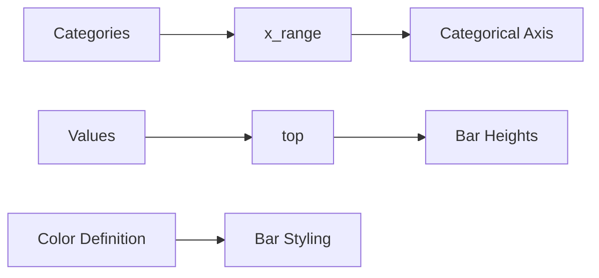

## Important Concept

Bokeh separates:

|Layer|Responsibility|
|---|---|
|Figure|coordinate system|
|Glyph (`vbar`)|drawing objects|
|Color system|styling|
|Alpha|visibility/transparency|

This separation is one reason Bokeh scales well for interactive visualization systems.

This section is introducing Bokeh visual styling properties.

The important shift here is:

> Earlier, you learned how to create plots.  
> Now you are learning how to control appearance.

That means:

- text styling
    
- line styling
    
- fill styling
    
- transparency
    
- hatch/pattern styling
    

These are the visual grammar of plots.

## Big Picture

In Bokeh, every visual element has properties.

Example:

|Element|Properties|
|---|---|
|Text|font size, color, style|
|Line|width, color, dash, transparency|
|Fill|fill color, opacity|
|Hatch|patterns, hatch color|

Think of Bokeh as:

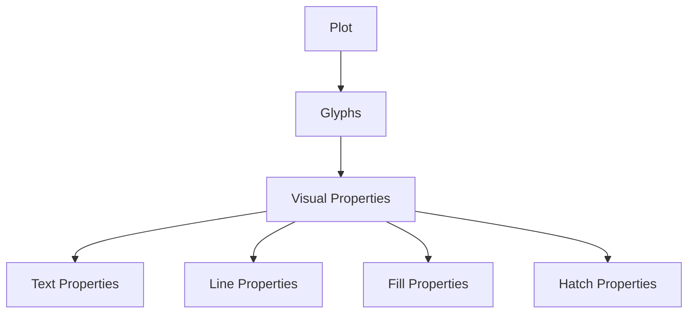

## What the Instructor is Building

They are creating:

- a synthetic dataset
    
- monthly freight/mail transport data
    
- random numbers using NumPy
    
- a Pandas DataFrame
    
- then styling the visualization
    

This is common in teaching because:

- real datasets are not required initially
    
- random data helps focus on visualization concepts
    

## Imports

```python
import pandas as pd
import numpy as np

from bokeh.plotting import figure, show
```

## Why Each Library Is Used

|Library|Purpose|
|---|---|
|Pandas|table/dataframe handling|
|NumPy|random data generation|
|Bokeh|visualization|

## Figure Setup

```python
visual_properties_plot = figure(
    plot_height=350,
    title="Domestic Freight Mail"
)
```

## Important Concept: Figure Object

This creates the plotting canvas.

Think of it as:

```text
Empty graph area
+ axis system
+ title
+ plotting space
```

Everything later gets added onto this figure.

## Synthetic Data Generation

```python
data = {
    "freight": np.random.randint(500, 2000, size=12),
    "mail": np.random.randint(100, 500, size=12)
}
```

## Understanding `np.random.randint()`

Syntax:

```python
np.random.randint(low, high, size)
```

Meaning:

|Parameter|Meaning|
|---|---|
|low|minimum value|
|high|maximum value|
|size|number of random values|

## Example

```python
np.random.randint(500, 2000, size=12)
```

Generates:

```text
[1450, 1880, 720, 1100, ...]
```

12 random freight values.

## Why Size = 12?

Because:

- likely representing 12 months
    
- Jan to Dec
    

This is implicit in the example.

## Creating the DataFrame

```python
df = pd.DataFrame(data)
```

Result:

|freight|mail|
|---|---|
|1450|210|
|1880|340|
|720|180|

etc.

## Why Use a DataFrame?

Because:

- structured tabular data
    
- easier plotting
    
- easier filtering/grouping later
    
- industry-standard data structure
    

Bokeh integrates naturally with Pandas.

## Visual Properties in Bokeh

Now the key learning section.

## 1. Text Properties

These control:

- titles
    
- labels
    
- annotations
    

Examples:

```python
p.title.text_font_size = "20pt"
p.title.text_color = "navy"
```

## Common Text Properties

|Property|Meaning|
|---|---|
|text_font_size|font size|
|text_color|text color|
|text_font|font family|
|text_alpha|transparency|
|text_font_style|italic/bold|

## Example

```python
p.title.text_font_style = "bold"
```

## 2. Line Properties

Used for:

- lines
    
- plot borders
    
- glyph outlines
    

Examples:

```python
line_width=3
line_color="red"
line_alpha=0.5
line_dash="dashed"
```

## Line Dash Types

|Value|Result|
|---|---|
|solid|continuous line|
|dashed|broken line|
|dotted|dot pattern|
|dotdash|mixed|

## Example

```python
p.line(
    x,
    y,
    line_width=4,
    line_dash="dashed"
)
```

## Visual Intuition

```text
Solid:
──────────

Dashed:
- - - - - -

Dotted:
..........
```

## 3. Fill Properties

Used inside shapes:

- bars
    
- circles
    
- rectangles
    
- patches
    

Example:

```python
fill_color="green"
fill_alpha=0.3
```

## Important Distinction

|Property|Controls|
|---|---|
|line_color|border|
|fill_color|inside area|

Example:

```python
p.circle(
    x,
    y,
    size=20,
    fill_color="red",
    line_color="black"
)
```

Visual:

```text
Black border
Red interior
```

## 4. Hatch Properties

Hatching means patterns inside shapes.

Examples:

- stripes
    
- dots
    
- cross patterns
    

Example:

```python
hatch_pattern="/"
```

## Visual Intuition

```text
///////
///////

xxxxxxx

.......
```

## Hatch Styling

```python
hatch_color="black"
hatch_alpha=0.5
```

## Why Hatch Patterns Matter

Useful when:

- printing in grayscale
    
- colorblind-safe charts
    
- dense visualizations
    
- academic papers
    

This is underappreciated in beginner tutorials.

## Full Example Combining Properties

```python
import pandas as pd
import numpy as np

from bokeh.plotting import figure, show

## Generate random data
data = {
    "freight": np.random.randint(500, 2000, size=12),
    "mail": np.random.randint(100, 500, size=12)
}

df = pd.DataFrame(data)

## Create figure
p = figure(
    height=350,
    title="Domestic Freight and Mail"
)

## Add bars
p.vbar(
    x=list(range(12)),
    top=df["freight"],

    width=0.8,

    fill_color="orange",
    fill_alpha=0.6,

    line_color="black",
    line_width=2,

    hatch_pattern="/",
    hatch_color="red"
)

## Text styling
p.title.text_font_size = "18pt"
p.title.text_color = "navy"

show(p)
```

## Mental Model

Every Bokeh glyph has layers:

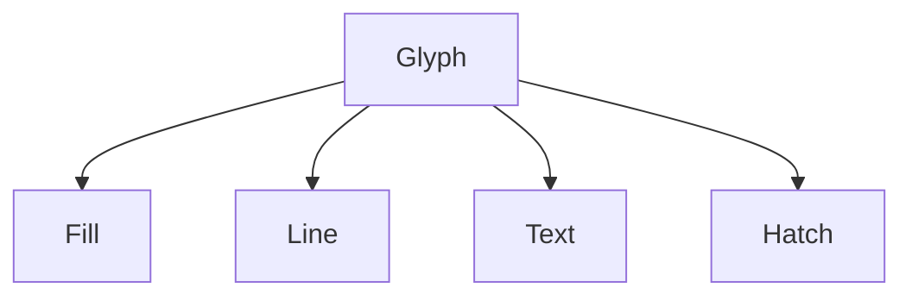

Each layer has:

- color
    
- alpha
    
- style
    
- width/pattern
    

## Engineering Insight

This property system is what makes Bokeh powerful for:

- dashboards
    
- interactive analytics
    
- enterprise visualization systems
    

Because styling is:

- modular
    
- composable
    
- programmable
    

Unlike static plotting systems.

## Common Beginner Mistakes

## Mistake 1: Confusing Fill vs Line

Wrong assumption:

```text
line_color changes bar interior
```

Reality:

```text
line_color = border
fill_color = inside
```

## Mistake 2: Alpha Overuse

Too much transparency:

```python
fill_alpha=0.05
```

Makes plots unreadable.

## Mistake 3: Excessive Styling

Beginners often:

- use many colors
    
- many hatch patterns
    
- thick lines
    
- huge fonts
    

Result:

- visual clutter
    

Good visualization is usually restrained.

## Important Design Principle

The instructor briefly mentioned:

> "visualization guidelines"

This matters more than syntax.

A technically correct plot can still be:

- misleading
    
- unreadable
    
- cognitively exhausting
    

Good visualization balances:

- information density
    
- contrast
    
- hierarchy
    
- readability
    

Not decoration.

This section explains one of the most important ideas in Bokeh:

> Everything in the plot is an object with editable properties.

You create a figure once, then modify parts of it incrementally.

This is object-oriented visualization design.

## Step-by-Step Breakdown

## 1. Creating the DataFrame

```python
monthly_values_df = pd.DataFrame(data)
```

Suppose:

```python
data = {
    "freight": [...],
    "mail": [...]
}
```

Then the DataFrame becomes:

|index|freight|mail|
|---|---|---|
|0|1450|210|
|1|1720|310|
|2|980|150|

etc.

## Important Concept: Index

The instructor says:

> "Use the index"

Meaning:

```python
x = monthly_values_df.index
```

This produces:

```python
RangeIndex(start=0, stop=12, step=1)
```

Which behaves like:

```python
[0,1,2,3,4,5,6,7,8,9,10,11]
```

These become x-axis coordinates.

## Extracting Columns

```python
freight = monthly_values_df["freight"]
mail = monthly_values_df["mail"]
```

Now:

|Variable|Meaning|
|---|---|
|`x`|month indices|
|`freight`|freight values|
|`mail`|mail values|

## Mental Model

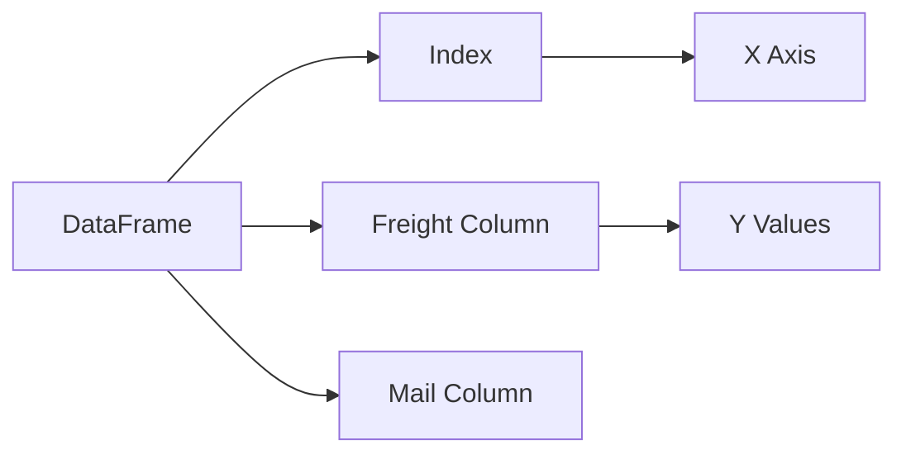

## Key Bokeh Pattern

The instructor repeatedly emphasizes this structure:

```python
figure_object.property.subproperty = value
```

This is the core customization mechanism in Bokeh.

## Example

```python
visual_properties_plot.title.text_font_size = "1.2em"
```

## Breaking This Down

|Part|Meaning|
|---|---|
|`visual_properties_plot`|figure object|
|`.title`|title component|
|`.text_font_size`|title font size property|

This is hierarchical object access.

## Another Example

```python
visual_properties_plot.title.text_color = "darkblue"
```

Changes title color.

## Visual Hierarchy

Internally Bokeh looks conceptually like:

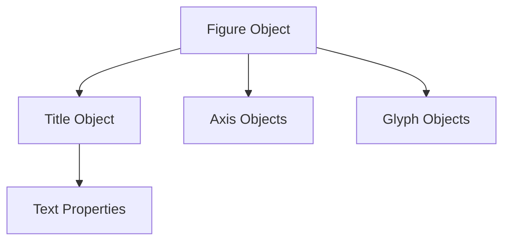

## Understanding `"1.2em"`

This comes from CSS/web typography.

## Meaning

```text
1 em = current/default font size
```

So:

```python
"1.2em"
```

Means:

```text
120% of base font size
```

## Why Use Relative Units?

Better responsiveness.

If display size changes:

- fonts scale proportionally
    

This matters in:

- dashboards
    
- browser rendering
    
- responsive UIs
    

## Creating the Line Plot

```python
visual_properties_plot.line(
    x,
    freight,
    line_width=3,
    line_color="blue",
    line_alpha=0.7,
    line_dash="dashed"
)
```

## Important Insight

`line()` creates a glyph object.

The instructor mentions:

> "glyph object is created"

This is important.

Bokeh internally represents every visual element as a glyph.

## Glyph = Renderable Visual Object

Examples:

|Glyph|Visual|
|---|---|
|`line()`|line plot|
|`vbar()`|vertical bars|
|`circle()`|circles|
|`patch()`|polygons|

## Why This Matters

Because glyphs have independent styling.

You can have:

- multiple lines
    
- multiple bars
    
- different styles
    
- layered plots
    

inside one figure.

## Understanding Layering

The instructor notices:

> "It has taken the vertical bar also"

Meaning:

- previous glyphs remain on the figure
    
- new glyphs are layered
    

Bokeh does not erase old glyphs unless explicitly recreated.

## Visual Model

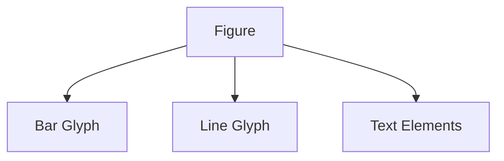

## Example of Combined Plot

```python
from bokeh.plotting import figure, show
import pandas as pd
import numpy as np

## Data
data = {
    "freight": np.random.randint(500, 2000, 12),
    "mail": np.random.randint(100, 500, 12)
}

monthly_values_df = pd.DataFrame(data)

## Variables
x = monthly_values_df.index
freight = monthly_values_df["freight"]
mail = monthly_values_df["mail"]

## Figure
p = figure(
    height=400,
    title="Freight and Mail Analysis"
)

## Title customization
p.title.text_font_size = "1.5em"
p.title.text_color = "darkblue"

## Line glyph
p.line(
    x,
    freight,

    line_width=3,
    line_color="green",
    line_alpha=0.8,
    line_dash="dashed"
)

## Bar glyph
p.vbar(
    x=x,
    top=mail,

    width=0.5,

    fill_color="orange",
    fill_alpha=0.5,

    hatch_pattern="spiral",
    hatch_color="yellow",
    hatch_alpha=0.8
)

show(p)
```

## Hatch Pattern Insight

The instructor mentions:

```python
hatch_pattern="spiral"
```

This creates patterned fills.

Useful when:

- printing in grayscale
    
- avoiding overdependence on color
    
- accessibility
    

## Transparency (`alpha`)

Example:

```python
line_alpha=0.7
```

Controls visibility strength.

|Alpha|Effect|
|---|---|
|1.0|fully visible|
|0.5|semi-transparent|
|0.1|faint|

## Why Transparency Is Powerful

In layered plots:

- overlapping information remains visible
    
- visual clutter reduces
    

Without alpha:

```text
front layer hides everything behind
```

## Important Design Principle

The instructor accidentally demonstrates something important:

```text
Plots are stateful
```

Meaning:

- once glyphs are added
    
- they persist in the figure object
    

This is why rerunning cells in notebooks can produce unexpected layered results.

## Common Jupyter Notebook Problem

Beginners often:

```python
p.line(...)
p.line(...)
p.line(...)
```

without recreating the figure.

Result:

- duplicate lines
    
- confusing plots
    

## Good Practice

Reinitialize figure:

```python
p = figure(...)
```

before rebuilding plots.

## The Most Important Takeaway

The instructor summarizes the core architecture correctly:

```python
plot_object.component.property = value
```

Examples:

```python
p.title.text_color = "red"

p.xaxis.axis_label_text_font_size = "14pt"

p.legend.label_text_color = "green"
```

This object-property system is the foundation of:

- Bokeh
    
- Matplotlib OO API
    
- Plotly internals
    
- most UI frameworks
    

## Deep Insight

Bokeh is closer to a UI framework than a simple plotting library.

Why?

Because:

- plots are objects
    
- components are editable
    
- properties are reactive
    
- rendering happens dynamically
    

This becomes extremely important in:

- dashboards
    
- interactive analytics
    
- streaming systems
    
- web applications
    

Not just static charts.

This section explains an extremely important Bokeh concept:

> A figure can be customized either:
> 
> 1. during creation
>     
> 2. after creation
>     

This distinction matters because Bokeh is fundamentally object-oriented.

## Two Ways to Configure a Plot

## Method 1: Configure Inside `figure()`

Everything at once:

```python
p = figure(
    height=300,
    width=700,
    title="My Plot"
)
```

## Method 2: Configure After Creation

Create first:

```python
p = figure()
```

Then customize incrementally:

```python
p.height = 300
p.width = 700
```

The instructor is teaching Method 2.

## Why This Matters

Method 2 is more flexible for:

- dashboards
    
- dynamic applications
    
- reusable plotting systems
    
- interactive UI workflows
    

Because properties can be modified later.

## Core Architectural Pattern

```python
plot.property = value
```

This is the central Bokeh design philosophy.

## Example

```python
plot.height = 300
plot.width = 700
```

## Visual Interpretation

```text
Canvas Height = 300 pixels
Canvas Width  = 700 pixels
```

## Important Difference

Earlier:

```python
figure(height=300)
```

Now:

```python
plot = figure()

plot.height = 300
```

Both achieve the same result.

Difference is:

- timing
    
- flexibility
    
- readability
    

## Plot Styling Properties

Now the instructor moves from:

- glyph styling
    

to:

- entire plot styling
    

This is a different layer.

## Visualization Layers

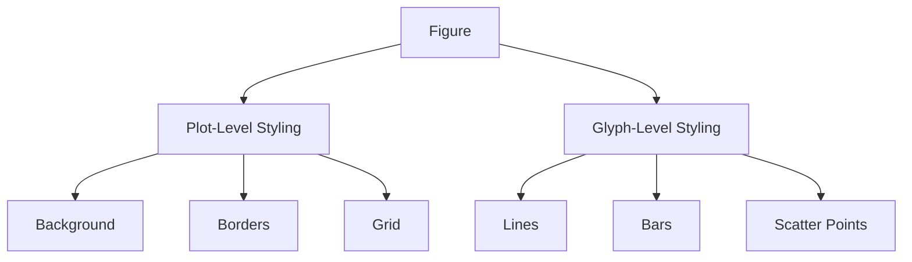

## Plot Height and Width

```python
plot.height = 300
plot.width = 700
```

Controls:

- total canvas dimensions
    

Not:

- data scaling
    

## Outline Styling

```python
plot.outline_line_color = "navy"
```

This styles the border around the plot.

Visual:

```text
+-------------------+
|                   |
|      PLOT         |
|                   |
+-------------------+
```

The border becomes navy blue.

## Border Width

```python
plot.outline_line_width = 2
```

Makes border thicker.

## Border Transparency

```python
plot.outline_line_alpha = 0.5
```

Semi-transparent border.

## Background Fill

```python
plot.background_fill_color = "lightblue"
```

Changes plot interior background.

Visual:

```text
Entire plotting area
gets light blue fill
```

## Removing Grid Lines

```python
plot.xgrid.grid_line_color = None
```

This is important.

## Understanding the Hierarchy

```python
plot.xgrid.grid_line_color
```

Breakdown:

|Part|Meaning|
|---|---|
|`plot`|figure|
|`xgrid`|x-axis grid object|
|`grid_line_color`|grid styling|

## Setting `None`

```python
None
```

means:

- disable drawing
    

So grid lines disappear.

## Why Remove Grid Lines?

Grid lines help:

- precise reading
    

But too many:

- create clutter
    
- reduce visual clarity
    

Good visualization often minimizes unnecessary grid usage.

## Edward Tufte Principle

The instructor indirectly references this idea:

> maximize data-ink ratio

Meaning:

- reduce non-essential visual elements
    
- emphasize actual data
    

Removing excessive grids improves:

- focus
    
- readability
    
- signal-to-noise ratio
    

## Scatter Plot

```python
plot.scatter(
    [1,2,3,4,5],
    [2,5,7,8,2],
    size=10
)
```

## Scatter Plot Logic

|X|Y|
|---|---|
|1|2|
|2|5|
|3|7|
|4|8|
|5|2|

Each pair becomes a point.

## Visual Interpretation

```text
(1,2)
(2,5)
(3,7)
...
```

## `size=10`

Controls marker size.

Not data scaling.

## Full Example

```python
from bokeh.plotting import figure, show

## Create empty figure
plot = figure()

## Plot dimensions
plot.height = 300
plot.width = 700

## Border styling
plot.outline_line_color = "navy"
plot.outline_line_width = 2
plot.outline_line_alpha = 0.5

## Background styling
plot.background_fill_color = "lightblue"

## Remove grid lines
plot.xgrid.grid_line_color = None
plot.ygrid.grid_line_color = None

## Scatter plot
plot.scatter(
    [1,2,3,4,5],
    [2,5,7,8,2],
    size=10
)

show(plot)
```

## Important Insight

The instructor is now teaching:

- plot aesthetics
    
- not data visualization logic
    

These are separate concerns.

## Engineering Analogy

Think of Bokeh like frontend UI development.

|Web UI|Bokeh|
|---|---|
|div container|figure|
|CSS styling|visual properties|
|UI components|glyphs|

This is why Bokeh feels different from traditional scientific plotting libraries.

## Deep Insight

Most beginners think plotting means:

```text
data -> graph
```

But real visualization systems are:

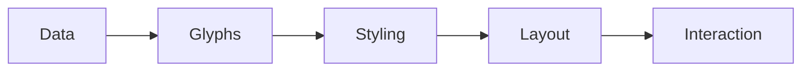

Bokeh is designed for this richer architecture.

## Common Beginner Mistakes

## Mistake 1: Overstyling

Beginners often:

- strong colors
    
- thick borders
    
- bright backgrounds
    
- large markers
    

Result:

- visually exhausting plots
    

## Mistake 2: Removing All Grids

Some grids are useful.

Without grids:

- numeric interpretation becomes harder
    

Good visualization balances:

- clarity
    
- precision
    

## Mistake 3: Confusing Plot vs Glyph Styling

Example confusion:

```python
plot.background_fill_color
```

affects:

- whole plot
    

NOT:

- individual points
    

Whereas:

```python
fill_color
```

inside scatter affects:

- markers only
    

## Most Important Takeaway

Bokeh customization operates at multiple levels:

|Level|Example|
|---|---|
|Figure|background, borders|
|Axis|labels, ticks|
|Grid|grid lines|
|Glyph|bars, lines, points|
|Text|title, annotations|

Understanding these layers is the key to mastering Bokeh.

This section transitions from:

- styling the entire plot  
    to
    
- styling individual glyphs
    

This distinction is critical in Bokeh.

## Key Concept

Bokeh has two major customization layers:

|Layer|Controls|
|---|---|
|Figure styling|canvas/background/grid/border|
|Glyph styling|bars/points/lines/shapes|

The instructor is now focusing on glyph styling.

## Important Idea

The instructor repeats the same architectural pattern:

```python
object.property = value
```

This works for:

- figures
    
- titles
    
- axes
    
- glyphs
    

Bokeh is highly consistent internally.

## What Is a Glyph?

A glyph is:

> a visual object rendered on the plot

Examples:

|Glyph Function|Visual|
|---|---|
|`circle()`|scatter points|
|`line()`|line chart|
|`vbar()`|bars|
|`rect()`|rectangles|

## Important Clarification

The instructor says:

> "scatter plot"

But technically:

```python
circle()
```

is a glyph used to create a scatter plot.

Scatter plot = concept.  
Circle glyph = rendering mechanism.

## Basic Example

```python
from bokeh.plotting import figure, show

plot = figure(height=300)

circle = plot.circle(
    x=[1,2,3],
    y=[2,5,8],

    size=15,

    fill_color="yellow",
    line_color="red"
)

show(plot)
```

## Understanding the Parameters

## Coordinates

```python
x=[1,2,3]
y=[2,5,8]
```

Creates points:

|X|Y|
|---|---|
|1|2|
|2|5|
|3|8|

## Marker Size

```python
size=15
```

Controls circle diameter.

## Fill Color

```python
fill_color="yellow"
```

Controls interior.

## Line Color

```python
line_color="red"
```

Controls border.

## Visual Interpretation

```text
Red outline
Yellow interior
```

Like:

```text
   🔴 border
  🟡 inside
```

## Important Bokeh Design Principle

Glyphs are objects.

This line:

```python
circle = plot.circle(...)
```

stores the glyph renderer.

That means:

- you can modify it later
    
- inspect it
    
- update it dynamically
    

## This Is the Big Idea

Instead of:

```text
draw and forget
```

Bokeh does:

```text
create editable visual objects
```

## Object Flow

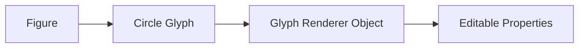

## Styling During Creation

The instructor first demonstrates:

```python
plot.circle(
    ...,
    fill_color="yellow",
    line_color="red"
)
```

This is:

> inline styling

## Alternative: Style After Creation

Because the glyph is stored:

```python
circle = plot.circle(...)
```

You can later do:

```python
circle.glyph.fill_color = "blue"
```

This is extremely important.

## Why?

Because it enables:

- interactivity
    
- dynamic dashboards
    
- animations
    
- user-driven styling
    

## Internal Structure

Conceptually:

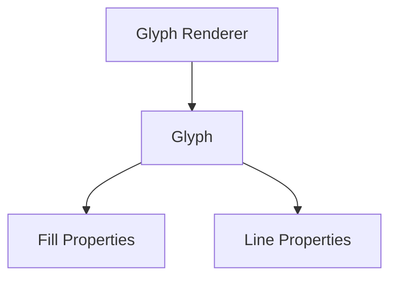

## Accessing Glyph Properties

Example:

```python
circle.glyph.fill_color = "green"
```

Breakdown:

|Part|Meaning|
|---|---|
|`circle`|renderer object|
|`.glyph`|actual visual glyph|
|`.fill_color`|style property|

## Why the `.glyph` Layer Exists

Because renderers manage:

- rendering logic
    
- data binding
    
- interactivity
    

while glyphs manage:

- appearance
    

This separation is architectural.

## Example of Dynamic Modification

```python
from bokeh.plotting import figure, show

plot = figure(height=300)

circle = plot.circle(
    [1,2,3],
    [2,5,8],

    size=15,
    fill_color="yellow",
    line_color="red"
)

## Modify later
circle.glyph.fill_color = "green"
circle.glyph.line_width = 4

show(plot)
```

## Important Insight

The instructor comments out code to show differences.

This is pedagogically important.

Visualization learning requires:

- iterative experimentation
    
- immediate visual feedback
    

Not just reading syntax.

## Engineering Parallel

This is similar to frontend frameworks.

|Frontend UI|Bokeh|
|---|---|
|button object|glyph object|
|CSS styling|visual properties|
|DOM update|glyph update|

This is why Bokeh feels closer to web programming than traditional plotting.

## Fill vs Line Properties

Very important distinction:

|Property|Affects|
|---|---|
|`fill_*`|inside|
|`line_*`|border|

## Example

```python
fill_alpha=0.2
line_alpha=1.0
```

Result:

- faint interior
    
- strong border
    

## Visual Intuition

```text
Opaque border
Transparent center
```

## Common Beginner Confusion

Beginners often assume:

```python
color="red"
```

controls everything.

But Bokeh separates:

- fill
    
- border
    
- transparency
    
- hatch
    

This separation gives fine-grained control.

## Important Design Philosophy

Bokeh intentionally exposes low-level styling primitives.

Why?

Because dashboards and enterprise visualizations require:

- exact branding
    
- accessibility compliance
    
- layered styling
    
- dynamic updates
    

## Hidden Lesson in This Section

The instructor casually demonstrates a major software engineering idea:

```text
visualizations are stateful object systems
```

not just static images.

This becomes critical later for:

- callbacks
    
- hover tools
    
- streaming data
    
- linked interactions
    
- live dashboards
    

## Most Important Takeaway

Bokeh styling can happen at two moments:

|Timing|Method|
|---|---|
|During creation|pass parameters|
|After creation|modify object properties|

This flexibility is one of the reasons Bokeh is suitable for interactive analytical applications, not just academic plotting.

This section introduces a deeper Bokeh concept:

> Glyphs remain editable after creation.

And then transitions into:

> axis customization

These are two different but related layers of visualization control.

## Part 1: Editing Glyphs After Creation

## Initial Circle Glyph

```python
circle = plot.circle(
    x=[1,2,3],
    y=[2,5,8],

    fill_color="yellow",
    line_color="red"
)
```

Result:

- yellow interior
    
- red border
    

## Visual Interpretation

```text
Point positions:
(1,2)
(2,5)
(3,8)

Circle:
inside = yellow
border = red
```

## Important Clarification

The instructor says:

> "line colour is the colour of the circle"

This is partially true but technically incomplete.

Correct interpretation:

|Property|Controls|
|---|---|
|`fill_color`|interior|
|`line_color`|outline/border|

## Dynamic Modification

Now they modify the glyph later:

```python
circle.glyph.fill_color = "green"
```

## What Happens Internally?

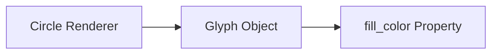

The property changes dynamically.

## Then Border Change

```python
circle.glyph.line_color = "blue"
```

Now:

- inside = green
    
- border = blue
    

## Important Architectural Idea

This is not repainting manually.

Instead:

- you mutate object properties
    
- Bokeh re-renders automatically
    

This is reactive visualization architecture.

## Mental Model

Think of Bokeh objects like editable UI components.

Instead of:

```text
draw static image
```

Bokeh does:

```text
maintain live visual objects
```

## Why This Matters

This becomes powerful later for:

- hover interactions
    
- streaming dashboards
    
- filtering
    
- animations
    
- callbacks
    

Because plots are mutable.

## Core Pattern

The instructor summarizes:

```python
circle.glyph.property = value
```

This is the key syntax pattern.

## General Form

```python
renderer.glyph.visual_property = new_value
```

## Common Editable Properties

|Property|Meaning|
|---|---|
|`fill_color`|interior color|
|`fill_alpha`|interior transparency|
|`line_color`|border color|
|`line_width`|border thickness|
|`size`|glyph size|

## Full Example

```python
from bokeh.plotting import figure, show

plot = figure(height=300)

circle = plot.circle(
    [1,2,3],
    [2,5,8],

    size=20,
    fill_color="yellow",
    line_color="red"
)

## Modify later
circle.glyph.fill_color = "green"
circle.glyph.line_color = "blue"
circle.glyph.line_width = 3

show(plot)
```

## Important Software Engineering Insight

The instructor is unknowingly teaching:

- object mutation
    
- property binding
    
- reactive rendering
    

These ideas appear in:

- React
    
- Vue
    
- frontend frameworks
    
- game engines
    
- visualization systems
    

Bokeh is much closer to a UI engine than a static plotting package.

## Part 2: Axis Customization

Now the discussion shifts to axes.

This is extremely important because:

> axes determine how users interpret quantities

## The Instructor Mentions "True Zero"

This is actually a major visualization ethics principle.

## Why True Zero Matters

Suppose:

|Real Values|
|---|
|98|
|100|

If axis starts at 97:

```text
98 █
100 ██████████████
```

Difference appears enormous.

But if axis starts at 0:

```text
98  ██████████
100 ███████████
```

Difference looks correctly small.

## This Is a Common Visualization Manipulation Technique

Especially in:

- media graphics
    
- financial reporting
    
- political presentations
    

## Important Principle

Axes are not neutral.  
They shape interpretation.

## Axis Customization in Bokeh

The instructor says:

- color
    
- thickness
    
- grid lines  
    can all be modified.
    

## Basic Line Plot

```python
axis_plot = figure()

axis_plot.line(
    x,
    y,
    line_color="purple"
)
```

This creates:

- a figure
    
- with a purple line glyph
    

## Visual Hierarchy

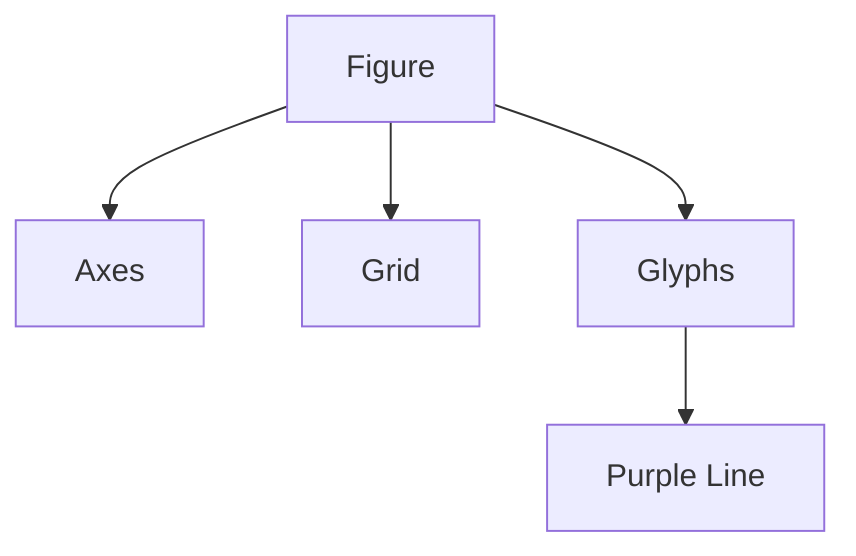

## Axis Objects in Bokeh

Bokeh internally has:

- x-axis object
    
- y-axis object
    

Accessible via:

```python
plot.xaxis
plot.yaxis
```

## Common Axis Properties

|Property|Meaning|
|---|---|
|axis_label|axis title|
|major_label_text_color|tick label color|
|axis_line_width|axis thickness|
|axis_line_color|axis color|

## Example

```python
plot.xaxis.axis_label = "Months"
plot.yaxis.axis_label = "Freight"
```

## Styling Axis Lines

```python
plot.xaxis.axis_line_color = "red"
plot.xaxis.axis_line_width = 3
```

## Styling Tick Labels

```python
plot.xaxis.major_label_text_color = "blue"
```

## Grid Customization

The instructor also mentions grid lines.

Example:

```python
plot.xgrid.grid_line_color = "gray"
```

## Why Grid Styling Matters

Grids can:

- improve readability
    
- improve precision
    

But excessive grids:

- overwhelm visuals
    
- reduce signal clarity
    

## Professional Visualization Principle

Good visualizations emphasize:

- data  
    not
    
- scaffolding
    

Meaning:

- grids should support
    
- not dominate
    

## Full Axis Styling Example

```python
from bokeh.plotting import figure, show

x = [1,2,3,4,5]
y = [2,5,3,8,6]

axis_plot = figure(
    height=300,
    width=600
)

## Line graph
axis_plot.line(
    x,
    y,
    line_color="purple",
    line_width=3
)

## Axis labels
axis_plot.xaxis.axis_label = "Month"
axis_plot.yaxis.axis_label = "Freight"

## Axis styling
axis_plot.xaxis.axis_line_color = "red"
axis_plot.yaxis.axis_line_color = "blue"

## Tick styling
axis_plot.xaxis.major_label_text_color = "green"

## Grid styling
axis_plot.xgrid.grid_line_color = "gray"

show(axis_plot)
```

## Deep Insight

Most plotting tutorials focus on:

- drawing charts
    

But professional visualization work focuses heavily on:

- scales
    
- axes
    
- framing
    
- perception
    

Because:

> interpretation depends more on framing than on the raw chart type itself.

## Most Important Takeaway

Bokeh customization is hierarchical:

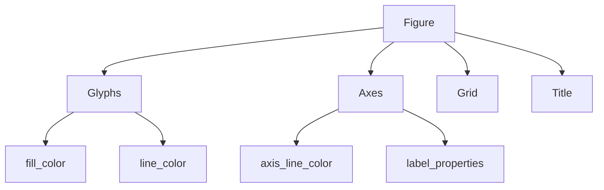

Mastering Bokeh means understanding:

- which object owns which property
    
- and how those objects relate structurally.

This section goes deeper into axis customization and introduces:

- tick styling
    
- label styling
    
- label orientation
    
- tick formatting
    

This is where visualization starts becoming presentation engineering, not just plotting.

## Initial Line Plot

The instructor begins with:

```python
axis_plot.line(x, y, line_color="purple")
```

Simple line graph:

- x values
    
- y values
    
- purple line
    

Then they increase values:

> "5 to 12"

Meaning they are modifying the data range to change the graph appearance.

This demonstrates an important idea:

> styling and data are independent layers

## Axis Customization

Now they customize the axis itself.

## X-Axis Line Color

```python
axis_plot.xaxis.axis_line_color = "blue"
```

## Understanding the Hierarchy

Breakdown:

|Component|Meaning|
|---|---|
|`axis_plot`|figure object|
|`.xaxis`|x-axis object|
|`.axis_line_color`|axis line styling|

## Visual Interpretation

Before:

```text
default black axis
```

After:

```text
blue x-axis line
```

## Important Insight

Axes are objects too.

Bokeh internally models:

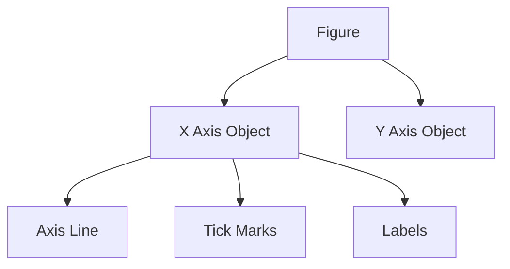

## Minor Tick Styling

Instructor mentions:

> "smaller declines"

They mean:

> minor ticks

## What Are Minor Ticks?

Example axis:

```text
0   10   20   30
|----|----|----|

small ticks between major ticks
```

Major ticks:

- important divisions
    

Minor ticks:

- intermediate reference marks
    

## Styling Minor Ticks

```python
axis_plot.xaxis.minor_tick_line_color = "orange"
```

Now small ticks become orange.

## Major Tick Styling

```python
axis_plot.xaxis.major_tick_line_color = "red"
```

Major ticks become red.

## Tick Hierarchy

```text
Major Tick:
|    labeled

Minor Tick:
'    smaller reference mark
```

## Why Minor Ticks Matter

Useful when:

- precision reading matters
    
- dense quantitative charts
    
- scientific plotting
    

But excessive minor ticks:

- clutter visuals
    
- overwhelm dashboards
    

## Major Label Font Size

The instructor changes:

```python
axis_plot.yaxis.major_label_text_font_size = "1.8em"
```

## What Are Major Labels?

These:

```text
0
10
20
30
```

The actual numeric text.

## Important Distinction

|Component|Example|
|---|---|
|Tick|small line mark|
|Label|number beside tick|

## Visual Model

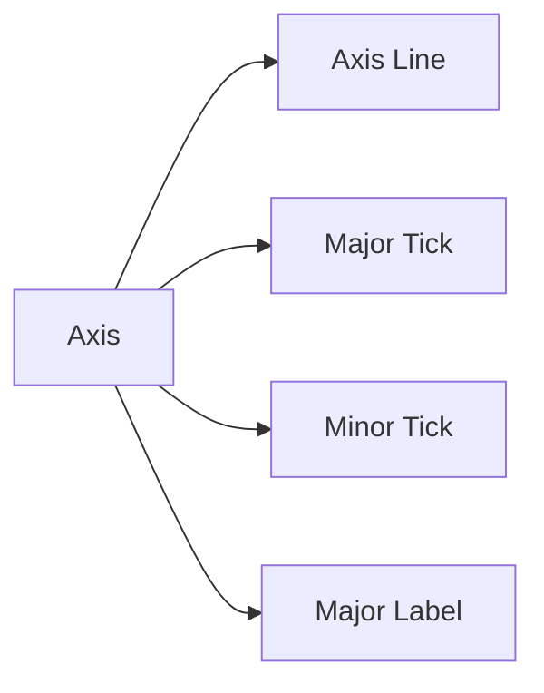

## Why Increase Font Size?

Because small labels:

- hurt readability
    
- fail in presentations
    
- fail in dashboards
    

Especially on:

- projectors
    
- mobile screens
    
- business dashboards
    

## Axis Label Orientation

Now the instructor introduces one of the most practically useful visualization features.

## Problem

Long labels overlap:

```text
January February March April
```

Unreadable.

## Solution: Rotate Labels

Example:

```text
J
a
n

F
e
b
```

## Why Rotation Matters

Important for:

- categorical axes
    
- long names
    
- dashboards
    
- dense bar charts
    

## Bokeh Label Orientation

Example:

```python
plot.xaxis.major_label_orientation = 1.0
```

## Important Detail

Orientation uses radians.

|Value|Meaning|
|---|---|
|`0`|horizontal|
|`1.57`|vertical|
|`0.78`|diagonal|

## Visual Intuition

```text
0 radians:
January

0.78 radians:
/January

1.57 radians:
J
a
n
u
a
r
y
```

## Why Radians?

Because Bokeh is web-rendering based.

Internally:

- canvas rendering
    
- geometric transforms
    
- trigonometric rotations
    

## NumericalTickFormatter

Instructor imports:

```python
NumeralTickFormatter
```

This is for formatting axis labels.

## Why Formatting Matters

Raw numbers often look ugly:

```text
1000000
```

Better:

```text
1M
```

## Example

```python
from bokeh.models import NumeralTickFormatter

plot.yaxis.formatter = NumeralTickFormatter(
    format="0.0a"
)
```

## Output

|Raw|Display|
|---|---|
|1000|1k|
|1000000|1m|

## Why This Matters

Human readability.

Visualization is fundamentally:

> cognitive compression

## Airline Example

Instructor mentions:

- airline numbers
    
- passenger counts
    

Likely categorical labels:

```python
airways = ["Air India", "Delta", "Lufthansa"]
```

with passenger values.

This is exactly where label rotation becomes necessary because airline names are long.

## Example

```python
from bokeh.plotting import figure, show
from bokeh.models import NumeralTickFormatter

airways = [
    "Air India",
    "Delta Airlines",
    "Lufthansa",
    "Singapore Airlines"
]

passengers = [1200000, 2500000, 1800000, 3200000]

plot = figure(
    x_range=airways,
    height=400,
    width=700
)

plot.vbar(
    x=airways,
    top=passengers,
    width=0.5
)

## Axis styling
plot.xaxis.axis_line_color = "blue"
plot.xaxis.major_tick_line_color = "red"
plot.xaxis.minor_tick_line_color = "orange"

## Label styling
plot.yaxis.major_label_text_font_size = "1.2em"

## Rotate labels
plot.xaxis.major_label_orientation = 1.0

## Number formatting
plot.yaxis.formatter = NumeralTickFormatter(
    format="0.0a"
)

show(plot)
```

## Important Visualization Principle

The instructor accidentally touches a deep principle:

> readability is part of truthfulness

A technically correct graph can still fail because:

- labels overlap
    
- axes are unclear
    
- scaling is unreadable
    

Visualization quality is not just:

- correctness
    

but:

- interpretability
    

## Common Beginner Mistakes

## Mistake 1: Over-Rotating Labels

Vertical labels:

```text
J
a
n
u
a
r
y
```

are slower to read.

Diagonal is often better.

## Mistake 2: Excessive Tick Styling

Bright:

- red
    
- orange
    
- blue
    

simultaneously creates clutter.

Professional dashboards usually use restrained axis styling.

## Mistake 3: Ignoring Formatting

Raw large numbers:

```text
123456789
```

are cognitively expensive.

Formatting matters enormously.

## Deep Insight

At this point, the instructor is no longer teaching "charts."

They are teaching:

- perception engineering
    
- visual hierarchy
    
- information architecture
    

because axis systems determine how humans decode quantitative information.

This section is one of the most practically important parts of visualization design:

> handling clutter and readability

The instructor is solving two classic problems:

1. overlapping categorical labels
    
2. unreadable large numeric scales
    

This is real-world visualization work.

## The Dataset

The instructor has:

- airline carrier names
    
- passenger counts
    

Likely something like:

|carrier|passengers|
|---|---|
|Delta Airlines|14,200,000|
|Lufthansa|11,500,000|
|Emirates|13,000,000|

## Step 1: Creating the Figure

## Categorical X-Axis

```python
x_range=unique_carrier_name
```

This tells Bokeh:

> use airline names as categories

not continuous numbers.

## Why This Matters

Without categorical axes:

```text
1 2 3 4 5
```

With categorical axes:

```text
Delta | Emirates | Lufthansa
```

## Figure Definition

```python
carriers_by_passenger_plot = figure(
    x_range=carrier_names,
    title="Top 10 Carriers by Passengers",
    height=400,
    width=700
)
```

## Important Insight

Width becomes very important for categorical charts.

Why?

Long labels consume horizontal space.

## Step 2: Vertical Bar Chart

```python
plot.vbar(
    x=carrier_names,
    top=df["passengers"],
    width=0.5,
    legend_label="Passengers"
)
```

## Understanding `top`

`top` defines:

- bar height
    

Example:

|Airline|Passengers|
|---|---|
|Delta|14M|

Bar height becomes 14M.

## Initial Problem: Label Clutter

The instructor observes:

> "all of them are cluttered"

This is one of the most common failures in categorical plots.

## Why Clutter Happens

Long labels:

```text
American Airlines
Southwest Airlines
United Airlines
```

cannot fit horizontally.

## Visual Failure

```text
AmericanAirlinesSouthwestAirlinesUnited...
```

Unreadable.

## Solution: Rotate Labels

## Orientation Property

```python
carriers_by_passenger_plot.xaxis.major_label_orientation = 0.8
```

## Important Detail

Orientation uses radians.

## Approximate Meaning

|Value|Effect|
|---|---|
|`0`|horizontal|
|`0.5`|slightly diagonal|
|`0.8`|readable slant|
|`1.57`|vertical|

## Visual Intuition

```text
0:
Delta Airlines

0.8:
/Delta Airlines

1.57:
D
e
l
t
a
```

## Why 0.8 Is Good

Completely vertical text is slower to read.

Diagonal labels often maximize:

- readability
    
- space efficiency
    

This is a subtle but important visualization tradeoff.

## The Second Problem: Numeric Scale Readability

The instructor says:

> "Y axis variable is very large"

Example:

```text
1.4e7
```

This is scientific notation.

Technically correct.  
Human-unfriendly.

## Visualization Principle

Readable numbers matter more than compact numbers in dashboards.

## Formatter

They use:

```python
NumeralTickFormatter(format="0")
```

## What This Does

Converts:

```text
1.4e7
```

into:

```text
14000000
```

rounded to integer precision.

## Why `format="0"`?

Meaning:

- no decimal places
    

## Formatting Examples

|Format|Output|
|---|---|
|`"0"`|14000000|
|`"0.0"`|14000000.0|
|`"0,0"`|14,000,000|
|`"0.0a"`|14.0m|

## Important Observation

The instructor actually chooses a suboptimal formatter.

Better would usually be:

plot.yaxis.formatter = NumeralTickFormatter(  
format="0.0a"  
)

````

because:

```text id="jlwmpc"
14.0m
````

is cognitively easier than:

```text
14000000
```

This is an important real-world dashboard principle:

- humans scan abbreviations faster
    

## Full Example

```python
from bokeh.plotting import figure, show
from bokeh.models import NumeralTickFormatter

carrier_names = [
    "Delta Airlines",
    "American Airlines",
    "United Airlines",
    "Lufthansa",
    "Emirates",
    "Qatar Airways",
    "Singapore Airlines",
    "Air India",
    "Southwest Airlines",
    "British Airways"
]

passengers = [
    14000000,
    12000000,
    11000000,
    10000000,
    9500000,
    9200000,
    9000000,
    8500000,
    8000000,
    7800000
]

plot = figure(
    x_range=carrier_names,
    title="Top 10 Carriers by Passengers",
    height=400,
    width=800
)

plot.vbar(
    x=carrier_names,
    top=passengers,
    width=0.5,
    legend_label="Passengers"
)

## Rotate labels
plot.xaxis.major_label_orientation = 0.8

## Better number formatting
plot.yaxis.formatter = NumeralTickFormatter(
    format="0.0a"
)

show(plot)
```

## Why Formatting Matters So Much

Visualization is not:

> showing numbers

It is:

> reducing cognitive decoding effort

Humans struggle with:

```text
14328765
```

But quickly understand:

```text
14.3M
```

## Important UX Principle

Every additional mental decoding step:

- slows interpretation
    
- increases fatigue
    
- increases misunderstanding
    

## The Instructor Demonstrates Iteration

They experiment:

```python
orientation = 0.6
```

instead of:

```python
orientation = 0.8
```

This demonstrates a critical truth:

> visualization tuning is empirical

There is rarely one perfect setting.

You adjust based on:

- label length
    
- screen size
    
- audience
    
- density
    

## Visualization Tradeoff

|Rotation|Advantage|Disadvantage|
|---|---|---|
|Horizontal|fastest reading|overlaps easily|
|Diagonal|balanced|moderate readability|
|Vertical|space efficient|slowest reading|

## Important Bokeh Hierarchy

The instructor again reinforces the object hierarchy:

```python
plot.xaxis.major_label_orientation
```

This pattern appears everywhere in Bokeh.

## Hierarchical Structure

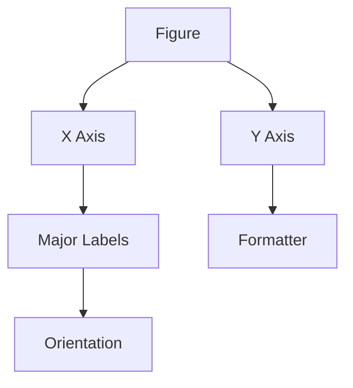

## Deep Visualization Insight

This section quietly introduces something important:

> charts fail more often from formatting problems than from statistical problems

Common real-world failures:

- unreadable labels
    
- cluttered axes
    
- bad scaling
    
- ugly numeric formatting
    

not:

- wrong chart type
    

## Professional Dashboard Design Principle

Good dashboards optimize:

- scanability
    
- decoding speed
    
- label clarity
    
- visual hierarchy
    

not:

- decorative styling
    

## Common Beginner Mistakes

## Mistake 1: Excessive Rotation

People often use:

```python
1.57
```

(vertical)

for everything.

Usually diagonal is better.

## Mistake 2: Huge Raw Numbers

Showing:

```text
15438293
```

instead of:

- 15.4M
    
- 15M
    

creates cognitive overload.

## Mistake 3: Too Many Categories

Even rotated labels fail if:

- there are 50 categories
    

At that point:

- filtering
    
- grouping
    
- interactivity  
    becomes necessary.
    

## Important Real-World Insight

When labels become unreadable, the problem may not be:

- styling
    

It may be:

- too much information density
    

No amount of formatting fixes fundamentally overloaded charts.

## Most Important Takeaway

This section teaches:

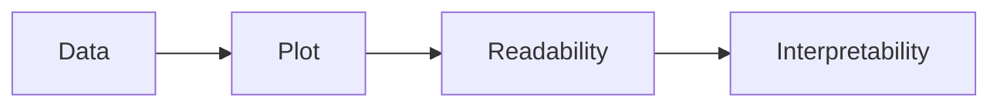

A graph is only useful if humans can decode it efficiently.
This section focuses entirely on title customization.

At first glance this seems cosmetic, but in professional visualization systems, titles are actually part of information architecture.

A bad title can make a correct graph misleading or useless.

## Core Idea

Bokeh titles are editable objects.

You can:

- create them initially
    
- reposition them
    
- modify them later
    
- style them dynamically
    

## Initial Figure

```python
plot = figure(
    title="Headline Example",
    height=300
)
```

Then:

```python
plot.line(x, y, line_width=2)
```

Simple line graph with:

- title
    
- line plot
    

## Important Architectural Point

When you define:

```python
title="Headline Example"
```

Bokeh internally creates:

- a Title object
    

not just plain text.

## Internal Structure

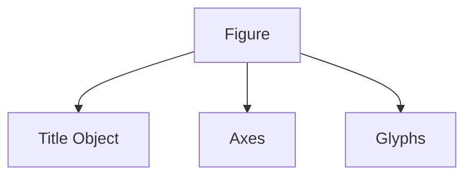

This matters because the title becomes editable later.

## Two Ways to Define Titles

## Method 1: Inside `figure()`

```python
plot = figure(
    title="Sales Dashboard"
)
```

## Method 2: Modify After Creation

```python
plot.title.text = "Updated Sales Dashboard"
```

This is the main concept being taught.

## Important Principle

Bokeh favors:

> mutable object properties

not:

> one-time static rendering

## Title Positioning

The instructor changes title location.

## Left Alignment

```python
plot.title.align = "left"
```

## Available Alignments

|Value|Effect|
|---|---|
|`"left"`|left aligned|
|`"center"`|centered|
|`"right"`|right aligned|

## Visual Comparison

## Center

```text
        Sales Dashboard
```

## Left

```text
Sales Dashboard
```

## Right

```text
                    Sales Dashboard
```

## Important Visualization Insight

Title alignment changes visual emphasis.

## Typical Usage

|Alignment|Common Usage|
|---|---|
|center|academic/basic plots|
|left|dashboards/news graphics|
|right|rare|

Modern dashboards often prefer:

- left-aligned titles
    

because reading naturally begins from left-to-right.

## Instructor Confusion: `top` vs `above`

This is actually important.

They mention:

> "do not use top, use above"

## Why?

Bokeh layout system uses positional keywords.

Correct:

```python
plot.add_layout(plot.title, "above")
```

Not:

```python
"top"
```

because internally Bokeh layout regions are:

- above
    
- below
    
- left
    
- right
    

This comes from web-layout architecture.

## Updating Title Text

```python
plot.title.text = "Updated Plot Title"
```

## Important Insight

This demonstrates:

- dynamic text mutation
    

The title object already exists.  
You are editing its property.

## Object Mutation Flow

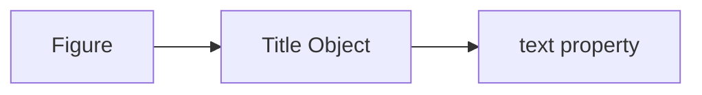

Changing `.text` updates rendering.

## Full Example

```python
from bokeh.plotting import figure, show

x = [1,2,3,4,5]
y = [2,5,3,7,6]

plot = figure(
    title="Headline Example",
    height=300
)

plot.line(
    x,
    y,
    line_width=2
)

## Modify title
plot.title.text = "Updated Plot Title"

## Align left
plot.title.align = "left"

show(plot)
```

## Important Distinction

The instructor says:

> "title location"

But technically:

- alignment changes horizontal placement
    
- layout position changes region placement
    

These are different concepts.

## Title Alignment vs Position

|Concept|Example|
|---|---|
|alignment|left/center/right|
|position|above/below/left/right|

## Example of Position Change

```python
plot.add_layout(plot.title, "below")
```

Places title under plot.

Rarely used, but possible.

## Title Styling

Although not fully covered yet, titles also support:

```python
plot.title.text_color = "navy"
plot.title.text_font_size = "18pt"
plot.title.text_font_style = "bold"
```

## Why Titles Matter So Much

Most viewers:

1. read title first
    
2. scan axes second
    
3. interpret plot third
    

Meaning:

> the title frames interpretation

## Example

Same chart:

## Title A

```text
Revenue Growth
```

## Title B

```text
Revenue Growth Slowing Since Q3
```

Same data.  
Different narrative.

## Deep Visualization Insight

Titles are not neutral metadata.

They are interpretive framing devices.

This is why:

- journalism
    
- finance
    
- politics
    

often manipulate titles strategically.

## Good Visualization Title Principles

Good titles should:

- explain the variable
    
- explain context
    
- reduce ambiguity
    

Bad titles:

- vague
    
- generic
    
- decorative
    

## Weak

```text
Sales Data
```

## Better

```text
Monthly Sales Revenue by Region (2025)
```

## Dashboard Design Insight

Professional dashboards often separate:

- headline
    
- subtitle
    
- annotations
    

because one title cannot carry all context cleanly.

## Common Beginner Mistakes

## Mistake 1: Decorative Titles

```text
Amazing Analytics Dashboard!!!
```

adds noise.

## Mistake 2: Centering Everything

Centered titles are common by default but often weaken scan flow in dashboards.

## Mistake 3: Overly Large Titles

Huge titles:

- dominate attention
    
- reduce data focus
    

## Mistake 4: Ambiguous Titles

```text
Performance
```

Performance of what?

## Most Important Takeaway

This section reinforces the core Bokeh philosophy again:

```python
plot.component.property = value
```

Titles are just another editable object in the visualization hierarchy.

## Final Mental Model

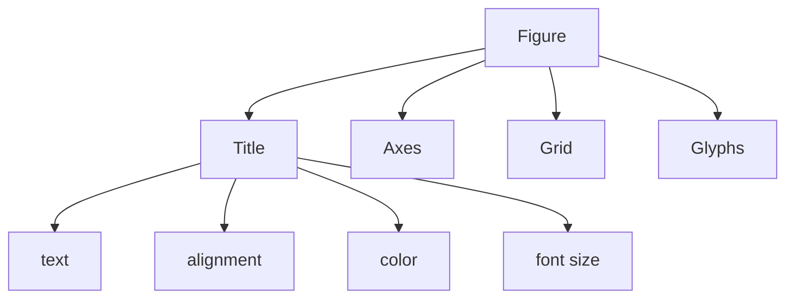

Once you understand this hierarchy, most Bokeh customization becomes predictable.

This section covers two major ideas:

1. advanced title customization
    
2. legend customization
    

Both are part of what could be called:

> visualization metadata systems

These elements do not contain the data itself, but they determine how humans interpret the data.

## Part 1: Advanced Title Customization

The instructor now modifies:

- font size
    
- alignment
    
- background color
    
- text color
    

## Title Font Size

Example:

```python
title_plot.title.text_font_size = "25pt"
```

## Important Clarification

The transcript says:

> "25 percent"

But Bokeh uses:

- pt
    
- em
    
- px
    

not percentages.

Correct usage:

```python
"25pt"
```

or:

```python
"1.5em"
```

## Alignment

```python
title_plot.title.align = "right"
```

Now the title moves to the right side.

## Background Color

```python
title_plot.title.background_fill_color = "darkgrey"
```

This creates a background panel behind the title.

## Text Color

```python
title_plot.title.text_color = "white"
```

Now:

- dark background
    
- white text
    

## Visual Interpretation

Before:

```text
Simple black title on white background
```

After:

```text
Dark grey title banner
White text
Right aligned
Large font
```

## Important UI Insight

At this point the title becomes:

- a visual component  
    not
    
- plain text
    

This is dashboard-style presentation logic.

## Full Example

```python
from bokeh.plotting import figure, show

x = [1,2,3,4]
y = [2,5,3,7]

title_plot = figure(
    title="Headline Example",
    height=300
)

title_plot.line(x, y, line_width=2)

## Title customization
title_plot.title.text = "Updated Plot Title"

title_plot.title.text_font_size = "25pt"

title_plot.title.align = "right"

title_plot.title.background_fill_color = "darkgrey"

title_plot.title.text_color = "white"

show(title_plot)
```

## Important Design Insight

The instructor demonstrates:

- visual hierarchy engineering
    

Large title + dark background:

- increases attention weight
    

## Visualization Attention Flow

```mermaid
flowchart TD
    A[Large Title]
    A --> B[Viewer Attention]
    B --> C[Data Interpretation]
```

## Why This Matters

Humans scan dashboards hierarchically.

Usually:

1. title
    
2. legends
    
3. axes
    
4. data patterns
    

## Deep Visualization Principle

Metadata elements are not secondary.  
They frame interpretation.

## Part 2: Legends

Now the instructor moves to legends.

## What Is a Legend?

A legend maps:

- visual encoding  
    to
    
- semantic meaning
    

Example:

|Visual|Meaning|
|---|---|
|blue line|temperature|
|red circles|rainfall|

Without legends:

- multi-series charts become ambiguous
    

## Creating Multiple Glyphs

## Line Glyph

```python
legend_plot.line(
    x,
    y1,

    legend_label="Temperature",

    line_color="blue",
    line_width=2
)
```

## Scatter Glyph

```python
legend_plot.scatter(
    x,
    y2,

    legend_label="Objects"
)
```

## Important Mechanism

The legend is automatically created because:

```python
legend_label=
```

was provided.

## Internal Architecture

```mermaid
flowchart TD
    A[Glyph]
    A --> B[legend_label]
    B --> C[Legend Object]
```

## Important Insight

Legends are not manually drawn.  
They are generated from glyph metadata.

## Result

You now have:

- blue line labeled Temperature
    
- circles labeled Objects
    

## Visualization Structure

```mermaid
flowchart TD
    A[Figure]

    A --> B[Line Glyph]
    A --> C[Scatter Glyph]

    B --> D[Temperature Legend Entry]
    C --> E[Objects Legend Entry]
```

## Important Clarification

The instructor says:

> "circles representing the objects"

Meaning:

- scatter glyph corresponds to second variable
    

But semantically the legend determines interpretation.

## Why Legends Matter

Legends are essential when:

- multiple series exist
    
- colors encode categories
    
- shapes encode meaning
    

## But Legends Also Fail Frequently

Common problems:

- too many entries
    
- poor positioning
    
- ambiguous names
    
- color confusion
    

## Typical Legend Customizations

Bokeh allows:

|Property|Purpose|
|---|---|
|location|placement|
|title|legend heading|
|label_text_font_size|readability|
|background_fill_color|styling|
|border_line_color|outline|

## Example

```python
plot.legend.location = "top_left"
```

## Possible Locations

|Value|Position|
|---|---|
|`"top_left"`|upper left|
|`"top_right"`|upper right|
|`"bottom_left"`|lower left|
|`"center"`|center|

## Important Dashboard Principle

Legend placement should:

- avoid covering data
    
- minimize eye movement
    
- preserve scan flow
    

## Common Bad Practice

```text
legend overlaps important trend lines
```

Very common in beginner plots.

## Better Practice

Move legends:

- outside plot
    
- top right
    
- unused whitespace
    

## Full Example

```python
from bokeh.plotting import figure, show

x = [1,2,3,4,5]

y1 = [2,4,6,8,10]
y2 = [1,3,2,5,4]

legend_plot = figure(
    title="Legend Example",
    height=400
)

## Line plot
legend_plot.line(
    x,
    y1,

    legend_label="Temperature",

    line_color="blue",
    line_width=2
)

## Scatter plot
legend_plot.scatter(
    x,
    y2,

    legend_label="Objects",

    size=10,
    color="red"
)

## Legend customization
legend_plot.legend.location = "top_left"
legend_plot.legend.title = "Measurements"

show(legend_plot)
```

## Deep Insight

Legends are a workaround.

The best visualizations often avoid legends entirely by:

- direct labeling
    
- annotations
    
- embedded text
    

Because legends force:

> eye movement between chart and decoding key

This increases cognitive load.

## Example

Instead of:

```text
Blue = Temperature
```

Better:

```text
label directly beside blue line
```

Modern visualization systems increasingly prefer direct annotation.

## Common Beginner Mistakes

## Mistake 1: Redundant Legends

Single-series charts often do not need legends.

## Mistake 2: Generic Labels

```text
Series 1
Series 2
```

Meaningless.

## Mistake 3: Huge Legends

Too many categories:

- destroy readability
    
- overwhelm charts
    

## Mistake 4: Legends Over Data

Especially in dense scatter plots.

## Most Important Takeaway

This section reinforces that Bokeh is an object hierarchy:

```mermaid
flowchart TD
    A[Figure]

    A --> B[Title]
    A --> C[Legend]
    A --> D[Glyphs]

    C --> E[Location]
    C --> F[Title]
    C --> G[Text Properties]
```

Everything is editable because everything is represented as structured objects, not static rendering instructions.

This section covers two important topics:

1. advanced legend customization
    
2. color palettes in Bokeh
    

The deeper theme is:

> turning default charts into intentionally designed visual systems

## Part 1: Legend Customization

Initially the legend looked like:

```text
Temperature   blue line
Objects       circle marker
```

Now the instructor customizes:

- position
    
- title
    
- font
    
- colors
    
- transparency
    
- border
    
- background
    

## Legend Location

```python
legend_plot.legend.location = "top_left"
```

Moves legend from:

- top right  
    to:
    
- top left
    

## Why Placement Matters

Legend placement affects:

- readability
    
- obstruction
    
- scan flow
    

## Common Positions

|Location|Usage|
|---|---|
|top_left|common|
|top_right|default-like|
|bottom_left|sparse plots|
|center|rarely ideal|

## Important Visualization Principle

A legend should:

- not cover important data
    
- minimize eye travel
    
- fit natural reading flow
    

## Legend Title

```python
legend_plot.legend.title = "Observations"
```

Now legend box has a heading.

## Visual Interpretation

Before:

```text
Temperature
Objects
```

After:

```text
Observations
Temperature
Objects
```

## Why Titles Matter

Without titles:

- legends may feel contextless
    
- users may not understand grouping
    

Especially important in:

- dashboards
    
- multi-series charts
    
- scientific figures
    

## Legend Label Text Color

```python
legend_plot.legend.label_text_color = "navy"
```

Changes label text color.

## Font Customization

```python
legend_plot.legend.label_text_font = "Times New Roman"

legend_plot.legend.label_text_font_style = "italic"
```

## Important Design Insight

Typography strongly affects perception.

|Font Style|Perception|
|---|---|
|serif|formal/traditional|
|sans-serif|modern/dashboard|
|italic|emphasis/decorative|

## Professional Dashboard Reality

Most modern dashboards avoid:

- serif fonts
    
- italics
    

because they reduce scanability.

But for:

- academic reports
    
- publications
    
- print visuals
    

they may work.

## Legend Border Styling

```python
legend_plot.legend.border_line_width = 3

legend_plot.legend.border_line_color = "navy"
```

Creates thick navy border.

## Border Transparency

```python
legend_plot.legend.border_line_alpha = 0.8
```

80% visible border.

## Legend Background Fill

```python
legend_plot.legend.background_fill_color = "navy"

legend_plot.legend.background_fill_alpha = 0.2
```

Creates lightly transparent navy background.

## Visual Result

You now have:

- translucent legend panel
    
- styled typography
    
- custom border
    
- titled legend
    

This is now closer to:

- dashboard UI styling  
    than
    
- default plotting
    

## Full Example

```python
from bokeh.plotting import figure, show

x = [1,2,3,4,5]

y1 = [2,4,6,8,10]
y2 = [1,3,2,5,4]

legend_plot = figure(
    title="Legend Example",
    height=400
)

## Line
legend_plot.line(
    x,
    y1,

    legend_label="Temperature",

    line_color="blue",
    line_width=2
)

## Scatter
legend_plot.scatter(
    x,
    y2,

    legend_label="Objects",

    size=10,
    color="red"
)

## Legend customization
legend_plot.legend.location = "top_left"

legend_plot.legend.title = "Observations"

legend_plot.legend.label_text_color = "navy"

legend_plot.legend.label_text_font = "Times New Roman"

legend_plot.legend.label_text_font_style = "italic"

legend_plot.legend.border_line_width = 3

legend_plot.legend.border_line_color = "navy"

legend_plot.legend.border_line_alpha = 0.8

legend_plot.legend.background_fill_color = "navy"

legend_plot.legend.background_fill_alpha = 0.2

show(legend_plot)
```

## Important Architectural Pattern

Again the instructor reinforces:

```python
plot.legend.property = value
```

This is the consistent Bokeh object model.

## Internal Structure

```mermaid
flowchart TD
    A[Figure]
    
    A --> B[Legend Object]

    B --> C[Labels]
    B --> D[Border]
    B --> E[Background]
    B --> F[Title]
```

## Deep Insight

Legends are UI panels.

Not just annotations.

This becomes more obvious in:

- interactive dashboards
    
- hover interactions
    
- filtering systems
    

## Part 2: Color Palettes

Now the instructor moves into:

> palette systems

This is extremely important in professional visualization.

## Why Palettes Matter

Manual colors fail at scale.

Example:

```python
color="red"
```

works for:

- 1 or 2 categories
    

Fails for:

- 20 categories
    
- gradients
    
- heatmaps
    
- continuous distributions
    

## What Is a Palette?

A palette is:

> a predefined collection of coordinated colors

## Bokeh Palettes

Imported from:

```python
from bokeh.palettes import Cividis
```

## Instructor Says "CIDES"

They mean:

> Cividis

which is a real palette.

## What Is Cividis?

A perceptually uniform palette designed for:

- readability
    
- accessibility
    
- colorblind safety
    

## Why Perceptual Uniformity Matters

Bad palettes distort interpretation.

Example:

- rainbow palettes create false boundaries
    
- some colors appear visually stronger
    

Perceptually uniform palettes preserve:

- quantitative continuity
    

## Palette Example

```python
from bokeh.palettes import Cividis

print(Cividis[10])
```

Returns 10 hex colors:

```text
['#00204C', '#123570', ...]
```

## Hexadecimal Colors

Each color:

```text
#RRGGBB
```

represents RGB encoding.

Example:

```text
#FF0000
```

means:

- red = 255
    
- green = 0
    
- blue = 0
    

## Why Palettes Matter in Real Systems

Useful for:

- heatmaps
    
- choropleth maps
    
- clustering
    
- categorical grouping
    
- continuous intensity mapping
    

## Example Usage

```python
from bokeh.palettes import Cividis

colors = Cividis[5]
```

Now:

```python
colors[0]
colors[1]
```

provide coordinated colors.

## Example Plot

```python
from bokeh.plotting import figure, show
from bokeh.palettes import Cividis

x = [1,2,3,4,5]
y = [3,7,2,6,4]

colors = Cividis[5]

plot = figure(height=300)

plot.vbar(
    x=x,
    top=y,
    width=0.5,
    color=colors
)

show(plot)
```

## Why Predefined Palettes Are Better

Hand-picked colors often:

- clash visually
    
- create accessibility problems
    
- encode unintended meaning
    

Good palettes are:

- balanced
    
- perceptually tuned
    
- tested
    

## Important Visualization Principle

Color should encode information,  
not decoration.

## Common Beginner Mistakes

## Mistake 1: Random Colors

```python
["red", "green", "purple", "yellow"]
```

Often visually chaotic.

## Mistake 2: Rainbow Palettes

Rainbow maps:

- distort quantitative perception
    
- create artificial edges
    

Widely criticized in scientific visualization.

## Mistake 3: Excessive Transparency

Heavy alpha blending:

- muddies colors
    
- reduces contrast
    

## Deep Insight

The instructor is now transitioning from:

- plotting mechanics
    

to:

- visual encoding systems
    

This is where visualization becomes:

- perception science
    
- cognitive design
    
- information communication
    

not just coding.

This section introduces one of the most important concepts in advanced visualization:

> mapping numerical values to colors

This is the foundation of:

- heatmaps
    
- density plots
    
- scientific visualization
    
- geospatial analysis
    
- ML feature visualization
    

The instructor is now moving beyond:

- fixed colors
    

into:

- data-driven color encoding
    

## Core Idea

Instead of manually assigning colors:

```python
color="blue"
```

you let:

> the data determine the color

## Color Mapping

```mermaid
flowchart LR
    A[Numeric Value]
    --> B[Color Mapper]
    --> C[Visual Color]
```

## Types of Color Mapping

The instructor mentions:

|Mapper|Behavior|
|---|---|
|linear|uniform progression|
|logarithmic|compressed/exponential progression|

## Linear Color Mapping

Equal numeric change:

- equal color change
    

Example:

|Value|Color|
|---|---|
|10|dark blue|
|20|medium blue|
|30|light blue|

Gradient changes uniformly.

## Logarithmic Color Mapping

Used when data spans huge ranges.

Example:

|Value|Color|
|---|---|
|1|dark|
|10|slightly brighter|
|1000|much brighter|

Why?

Because logarithmic scaling compresses magnitude differences.

## Important Real-World Insight

Linear scales fail badly when:

- data distributions are skewed
    
- extreme outliers exist
    

This is common in:

- finance
    
- population data
    
- web traffic
    
- scientific measurements
    

## Example Dataset

The instructor defines:

```python
x = range(-32, 33)
y = x^2
```

This creates a parabola.

## Mathematical Interpretation

The parabola equation is:

genui{"math_block_widget_always_prefetch_v2":{"content":"y=x^2"}}

## Shape Intuition

```text
          *
       *     *
    *           *
 *                 *
```

Lowest value:

- near x = 0
    

Highest values:

- at extremes
    

## Why This Is a Good Demo

Because:

- values increase smoothly
    
- easy to visualize gradients
    

## Importing `linear_cmap`

```python
from bokeh.transform import linear_cmap
```

This is the transformation function.

## Important Concept

`linear_cmap()` does not directly create colors.

It creates:

> a mapping rule

## Syntax

```python
linear_cmap(
    field_name,
    palette,
    low,
    high
)
```

## Meaning

|Parameter|Purpose|
|---|---|
|field_name|which data column controls color|
|palette|color palette|
|low|minimum value|
|high|maximum value|

## Scatter Plot with Color Mapping

```python
mapper_plot.scatter(
    x,
    y,

    color=linear_cmap(
        'y',
        Turbo256,
        min(y),
        max(y)
    ),

    size=10
)
```

## Important Clarification

The transcript simplifies slightly.

In real Bokeh usage, `linear_cmap()` usually references:

- ColumnDataSource fields
    

not raw arrays directly.

But conceptually the instructor explanation is correct.

## What Happens Visually

Low y-values:

- one color
    

High y-values:

- another color
    

Intermediate values:

- gradient transition
    

## Visual Mapping

```text
Low Values  -> Dark Blue
Medium      -> Green
High Values -> Yellow/Red
```

## Turbo256 Palette

The instructor uses:

```python
Turbo256
```

## What Is Turbo256?

A high-resolution palette with:

- 256 gradient colors
    

Designed for:

- smooth continuous transitions
    

## Why 256?

More colors:

- smoother gradients
    
- fewer visible transitions
    

## Palette Comparison

|Palette|Use Case|
|---|---|
|Viridis|scientific default|
|Cividis|accessibility|
|Turbo256|vivid gradients|
|Inferno|high contrast|

## Important Scientific Visualization Insight

Color palettes are not interchangeable.

Different palettes optimize for:

- contrast
    
- accessibility
    
- perceptual uniformity
    
- print compatibility
    

## The Result

The parabola becomes:

- geometrically identical  
    but
    
- color-encoded by magnitude
    

## Meaning

Now the viewer sees:

- shape  
    and
    
- value intensity simultaneously
    

## Deep Insight

This is multidimensional encoding.

|Channel|Encodes|
|---|---|
|position|geometry|
|color|magnitude|

Visualization becomes more information-dense.

## The Color Bar

Now the instructor addresses a critical problem:

> what do the colors mean?

Without explanation:

- color gradients are ambiguous
    

## Solution: Color Bar

```python
color_bar
```

## What Is a Color Bar?

A legend for continuous colors.

## Visual Structure

```text
Blue    -> low values
Green   -> medium
Yellow  -> high values
```

## Why It's Essential

Without a color bar:

- viewers cannot decode the mapping
    

## Adding Color Bar

The instructor mentions:

```python
mapper_plot.add_layout(color_bar, "right")
```

## Important Layout Concept

`add_layout()` inserts UI components into figure regions.

Regions:

- left
    
- right
    
- above
    
- below
    

## Internal Architecture

```mermaid
flowchart TD
    A[Figure]

    A --> B[Plot Area]
    A --> C[Color Bar]

    C --> D[Gradient]
    C --> E[Numeric Labels]
```

## Placement

```python
"right"
```

places color bar on right side.

Could also use:

```python
"left"
```

## Full Example

```python
from bokeh.plotting import figure, show
from bokeh.transform import linear_cmap
from bokeh.palettes import Turbo256
from bokeh.models import ColorBar
from bokeh.models import ColumnDataSource

x = list(range(-32, 33))
y = [i**2 for i in x]

source = ColumnDataSource(data=dict(x=x, y=y))

mapper = linear_cmap(
    field_name='y',
    palette=Turbo256,
    low=min(y),
    high=max(y)
)

mapper_plot = figure(
    title="Linear Color Mapping Example",
    height=400,
    width=700
)

scatter = mapper_plot.scatter(
    'x',
    'y',

    source=source,

    color=mapper,
    size=10
)

## Color bar
color_bar = ColorBar(
    color_mapper=mapper['transform']
)

mapper_plot.add_layout(
    color_bar,
    'right'
)

show(mapper_plot)
```

## Deep Visualization Insight

At this point, visualization is no longer:

- drawing shapes
    

It becomes:

> encoding information into perceptual channels

Channels include:

- position
    
- color
    
- size
    
- opacity
    
- shape
    

## Why Color Mapping Is Powerful

Especially useful when:

- datasets are dense
    
- spatial patterns matter
    
- distributions matter more than exact values
    

## Common Use Cases

|Application|Use|
|---|---|
|Heatmaps|intensity|
|Weather maps|temperature|
|ML feature maps|activation strength|
|Geographic maps|population density|
|Scientific imaging|measurement gradients|

## Important Warning

Color maps can easily mislead.

## Example Failure

Rainbow palettes:

- create fake boundaries
    
- exaggerate transitions
    

Widely criticized in scientific visualization.

## Better Practice

Use:

- perceptually uniform palettes
    
- accessible gradients
    
- restrained color encoding
    

## Common Beginner Mistakes

## Mistake 1: Using Color Without Meaning

Decorative gradients add confusion.

## Mistake 2: Missing Color Bar

Without scale reference:

- color encoding becomes meaningless
    

## Mistake 3: Wrong Scaling

Linear scales on highly skewed data:

- hide important structure
    

## Most Important Takeaway

This section introduces the real foundation of advanced visualization:

```mermaid
flowchart LR
    A[Data Values]
    --> B[Transformation]
    --> C[Visual Encoding]
    --> D[Human Perception]
```

Bokeh is now being used not just to draw charts, but to map numerical structure into perceptual structure.

This final section introduces two advanced visualization concepts:

1. color bars as quantitative legends
    
2. themes as global styling systems
    

This is the transition from:

- individual plot customization  
    to
    
- system-wide visual consistency
    

## Part 1: Color Bars

The instructor finishes the discussion about color mapping.

## Core Problem

When values are mapped to colors:

```mermaid
flowchart LR
    A[Numeric Values]
    --> B[Colors]
```

viewers still need to know:

> which color corresponds to which value?

Without explanation:

- the gradient is visually attractive
    
- but semantically incomplete
    

## Solution: Color Bar

A color bar acts like:

> a continuous legend

## Difference Between Legend and Color Bar

| Feature | Legend | Color Bar |  
|---|---|  
| categorical | yes |  
| continuous values | no |  
| gradient scale | no |  
| numerical mapping | limited |

Color bars are specifically for:

- continuous numerical encoding
    

## Adding the Color Bar

Instructor mentions:

```python
mapper_plot.add_layout(color_bar, "right")
```

## Important Layout Concept

Bokeh treats:

- legends
    
- titles
    
- color bars
    
- widgets
    

as layout components.

## Layout Regions

|Region|Meaning|
|---|---|
|`"left"`|left side|
|`"right"`|right side|
|`"above"`|top|
|`"below"`|bottom|

## Example

```python
mapper_plot.add_layout(color_bar, "left")
```

Places the scale on the left side.

## Internal Architecture

```mermaid
flowchart TD
    A[Figure]

    A --> B[Plot Area]
    A --> C[Color Bar]

    C --> D[Gradient]
    C --> E[Numeric Scale]
```

## Important Visualization Principle

Whenever:

- color encodes quantity
    

you almost always need:

- a color bar
    

Otherwise users cannot decode the mapping.

## Real-World Example

Without color bar:

```text
Red areas look important
```

But:

- how important?
    
- what value range?
    
- relative to what?
    

Unknown.

## Part 2: Themes

Now the instructor introduces:

> themes

This is one of the most important concepts for professional dashboards.

## What Is a Theme?

A theme is:

> a predefined styling system

Instead of customizing every plot manually:

```python
plot.background_fill_color = ...
plot.title.text_color = ...
plot.axis_line_color = ...
```

you apply:

- one global visual system
    

## Why Themes Matter

Without themes:

```text
Plot 1 = dark
Plot 2 = bright
Plot 3 = different fonts
```

Result:

- visual inconsistency
    
- dashboard fragmentation
    

## Themes Solve This

They enforce:

- unified colors
    
- typography
    
- spacing
    
- backgrounds
    
- defaults
    

## Important Dashboard Principle

Consistency reduces cognitive friction.

Users should focus on:

- information
    

not:

- changing visual styles
    

## `curdoc()`

Instructor imports:

```python
from bokeh.io import curdoc
```

## What Is `curdoc()`?

It refers to:

> the current Bokeh document

Think of the document as:

- the entire notebook/app/dashboard
    

## Internal Mental Model

```mermaid
flowchart TD
    A[Bokeh Document]

    A --> B[Plot 1]
    A --> C[Plot 2]
    A --> D[Widgets]
```

## Applying a Theme

```python
curdoc().theme = "caliber"
```

Now:

- all subsequent plots inherit that style system
    

## Important Architectural Insight

Themes modify:

- default properties
    

not necessarily:

- explicit overrides
    

Meaning:

```python
plot.title.text_color = "red"
```

still overrides theme defaults.

## Built-In Themes Mentioned

The instructor demonstrates:

|Theme|Style|
|---|---|
|night_sky|dark|
|caliber|light/clean|
|dark_minimal|minimal dark|
|light_minimal|minimal light|
|contrast|high contrast|

## Night Sky

Dark dashboard style.

Useful for:

- control rooms
    
- monitoring systems
    
- low-light viewing
    

## Caliber

Clean white background.

Good for:

- business dashboards
    
- reports
    
- presentations
    

## Dark Minimal

Minimalist dark UI.

Popular in:

- developer dashboards
    
- analytics tools
    

## Light Minimal

Simplified bright theme.

Often best for:

- readability
    
- print compatibility
    
- executive dashboards
    

## Contrast

Strong visual separation.

Useful for:

- accessibility
    
- presentations
    
- large displays
    

## Example

```python
from bokeh.io import curdoc
from bokeh.plotting import figure, show

## Apply theme
curdoc().theme = "dark_minimal"

x = [1,2,3,4]
y = [2,5,3,7]

plot = figure(
    title="Theme Example",
    height=300
)

plot.line(x, y, line_width=2)

show(plot)
```

## Important UI Insight

Themes are essentially:

- visualization CSS
    

for Bokeh applications.

## Engineering Parallel

|Web Development|Bokeh|
|---|---|
|CSS theme|Bokeh theme|
|design system|visualization theme|
|UI consistency|dashboard consistency|

## Important Professional Insight

Large dashboards without themes become impossible to maintain.

Because every plot becomes:

- manually styled
    
- inconsistent
    
- fragile
    

Themes centralize visual governance.

## Deeper Insight

The instructor says:

> "everything will come in the same thematic format"

This is actually a major enterprise visualization concern:

- branding consistency
    
- accessibility consistency
    
- design governance
    

## Real Enterprise Usage

Organizations often enforce:

- exact fonts
    
- approved palettes
    
- standard spacing
    
- accessibility contrast rules
    

Themes make this scalable.

## Common Beginner Mistakes

## Mistake 1: Overusing Dark Themes

Dark themes:

- look impressive
    
- often reduce readability for dense data
    

## Mistake 2: Mixing Themes

Applying manual styling inconsistently defeats the purpose of themes.

## Mistake 3: Decorative Themes

Themes should improve:

- comprehension
    

not:

- aesthetic novelty
    

## Mistake 4: Ignoring Accessibility

Some dark themes:

- fail contrast requirements
    
- become unreadable on projectors
    

## Deep Visualization Insight

This final section reveals the full evolution of visualization complexity:

```mermaid
flowchart LR
    A[Data]
    --> B[Glyphs]
    --> C[Visual Encoding]
    --> D[Layout]
    --> E[Themes]
    --> F[Perception]
```

At the highest level, visualization systems are:

- perception orchestration systems
    

not merely plotting libraries.

## Final Mental Model of Bokeh

```mermaid
flowchart TD
    A[Bokeh Document]

    A --> B[Theme]

    A --> C[Figures]

    C --> D[Titles]
    C --> E[Axes]
    C --> F[Glyphs]
    C --> G[Legends]
    C --> H[Color Bars]

    F --> I[Visual Properties]
```

This hierarchy explains almost every customization feature in Bokeh.

Tags: #statistics #machine-learning #data-science #statistical-modelling