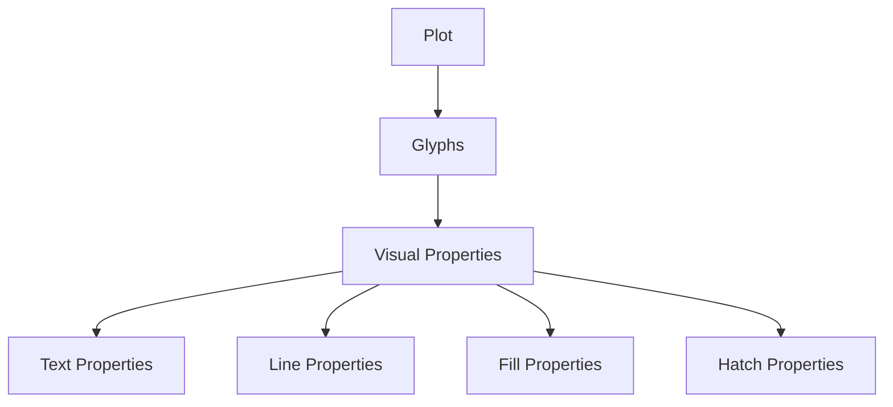

# Big Picture

In Bokeh, every visual element has properties.

Example:

|Element|Properties|
|---|---|
|Text|font size, color, style|
|Line|width, color, dash, transparency|
|Fill|fill color, opacity|
|Hatch|patterns, hatch color|

Think of Bokeh as:

