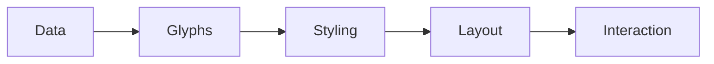

# Deep Insight

Most beginners think plotting means:

```text
data -> graph
```

But real visualization systems are:


```mermaid
flowchart LR
    A[Data]
    B[Glyphs]
    C[Styling]
    D[Layout]
    E[Interaction]

    A --> B
    B --> C
    C --> D
    D --> E
```

Bokeh is designed for this richer architecture.
