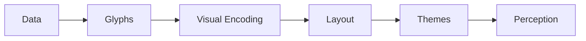

# Deep Visualization Insight

This final section reveals the full evolution of visualization complexity:

At the highest level, visualization systems are:

- perception orchestration systems
    

not merely plotting libraries.
