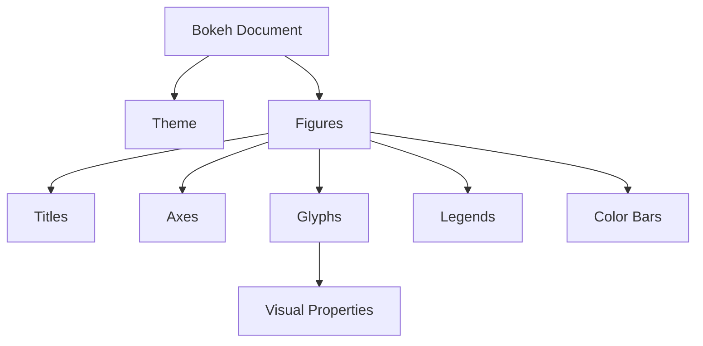

# Final Mental Model of Bokeh

```mermaid
flowchart TD
    A[Bokeh Document]

    A --> B[Theme]

    A --> C[Figures]

    C --> D[Titles]
    C --> E[Axes]
    C --> F[Glyphs]
    C --> G[Legends]
    C --> H[Color Bars]

    F --> I[Visual Properties]
```

This hierarchy explains almost every customization feature in Bokeh.

Tags: #statistics #machine-learning #data-science #statistical-modelling
