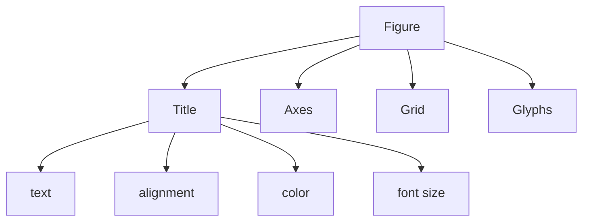

# Final Mental Model

Once you understand this hierarchy, most Bokeh customization becomes predictable.

This section covers two major ideas:

1. advanced title customization
    
2. legend customization
    

Both are part of what could be called:

> visualization metadata systems

These elements do not contain the data itself, but they determine how humans interpret the data.
