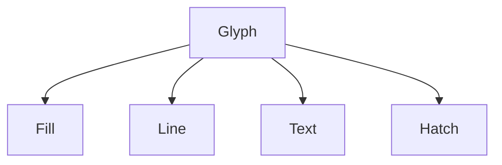

# Mental Model

Every Bokeh glyph has layers:

```mermaid
flowchart TD
    A[Glyph] --> B[Fill]
    A --> C[Line]
    A --> D[Text]
    A --> E[Hatch]
```

Each layer has:

- color
    
- alpha
    
- style
    
- width/pattern
