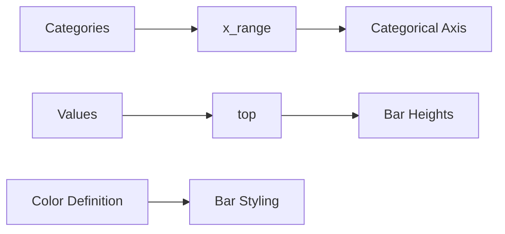

# Mental Model

Think of Bokeh bar charts as:

```mermaid
flowchart LR
    A[Categories] --> B[x_range]
    B --> C[Categorical Axis]
    D[Values] --> E[top]
    E --> F[Bar Heights]
    G[Color Definition] --> H[Bar Styling]
```
