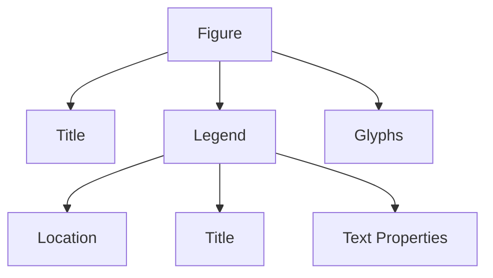

# Most Important Takeaway

This section reinforces that Bokeh is an object hierarchy:

Everything is editable because everything is represented as structured objects, not static rendering instructions.

This section covers two important topics:

1. advanced legend customization
    
2. color palettes in Bokeh
    

The deeper theme is:

> turning default charts into intentionally designed visual systems
