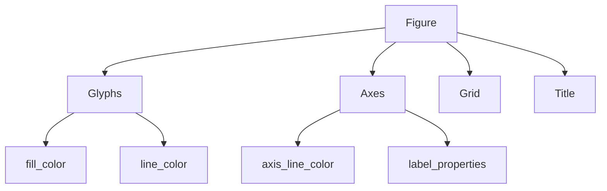

# Most Important Takeaway

Bokeh customization is hierarchical:

Mastering Bokeh means understanding:

- which object owns which property
    
- and how those objects relate structurally.

This section goes deeper into axis customization and introduces:

- tick styling
    
- label styling
    
- label orientation
    
- tick formatting
    

This is where visualization starts becoming presentation engineering, not just plotting.
