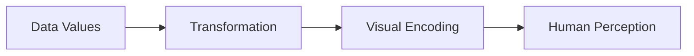

# Most Important Takeaway

This section introduces the real foundation of advanced visualization:

Bokeh is now being used not just to draw charts, but to map numerical structure into perceptual structure.

This final section introduces two advanced visualization concepts:

1. color bars as quantitative legends
    
2. themes as global styling systems
    

This is the transition from:

- individual plot customization  
    to
    
- system-wide visual consistency
