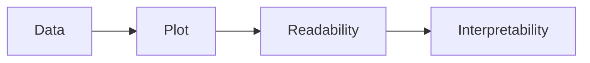

# Most Important Takeaway

This section teaches:

A graph is only useful if humans can decode it efficiently.
This section focuses entirely on title customization.

At first glance this seems cosmetic, but in professional visualization systems, titles are actually part of information architecture.

A bad title can make a correct graph misleading or useless.
