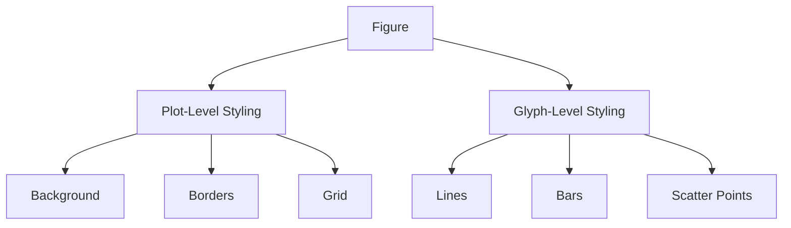

# Visualization Layers

```mermaid
flowchart TD
    A[Figure]
    
    A --> B[Plot-Level Styling]
    A --> C[Glyph-Level Styling]
    
    B --> D[Background]
    B --> E[Borders]
    B --> F[Grid]
    
    C --> G[Lines]
    C --> H[Bars]
    C --> I[Scatter Points]
```
