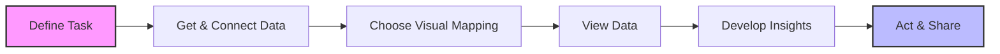

### **Overview**
The transcript focuses on conducting visual analysis within **Tableau** to discover [data](https://github.com/Balasubramanian-pg/MSC.-[Data](https://github.com/Balasubramanian-pg/MSC.-[Data](https://github.com/Balasubramanian-pg/MSC.-[Data](https://github.com/Balasubramanian-pg/MSC.-[Data](https://github.com/Balasubramanian-pg/MSC.-Data-Science-AI/blob/main/Trimester%201/Data%20Visualization%20%26%20Storytelling/W10 - Module 4c. Python Bokeh package - Module 4c. Python Bokeh package - Module 4c. Python Bokeh package/L29/Decorating%20the%20Visuals.md#data)-Science-AI/blob/main/Trimester%201/[Data](https://github.com/Balasubramanian-pg/MSC.-Data-Science-AI/blob/main/Trimester%201/Data%20Visualization%20%26%20Storytelling/W10 - Module 4c. Python Bokeh package - Module 4c. Python Bokeh package - Module 4c. Python Bokeh package/L29/Decorating%20the%20Visuals.md#data)%20Visualization%20%26%20Storytelling/W10 - Module 4c. Python Bokeh package - Module 4c. Python Bokeh package - Module 4c. Python Bokeh package/L28/Glyphs.md#[data](https://github.com/Balasubramanian-pg/MSC.-Data-Science-AI/blob/main/Trimester%201/Data%20Visualization%20%26%20Storytelling/W10 - Module 4c. Python Bokeh package - Module 4c. Python Bokeh package - Module 4c. Python Bokeh package/L29/Decorating%20the%20Visuals.md#data))-Science-AI/blob/main/Trimester%201/[Data](https://github.com/Balasubramanian-pg/MSC.-[Data](https://github.com/Balasubramanian-pg/MSC.-Data-Science-AI/blob/main/Trimester%201/Data%20Visualization%20%26%20Storytelling/W10 - Module 4c. Python Bokeh package - Module 4c. Python Bokeh package - Module 4c. Python Bokeh package/L29/Decorating%20the%20Visuals.md#data)-Science-AI/blob/main/Trimester%201/[Data](https://github.com/Balasubramanian-pg/MSC.-Data-Science-AI/blob/main/Trimester%201/Data%20Visualization%20%26%20Storytelling/W10 - Module 4c. Python Bokeh package - Module 4c. Python Bokeh package - Module 4c. Python Bokeh package/L29/Decorating%20the%20Visuals.md#data)%20Visualization%20%26%20Storytelling/W10 - Module 4c. Python Bokeh package - Module 4c. Python Bokeh package - Module 4c. Python Bokeh package/L28/Glyphs.md#[data](https://github.com/Balasubramanian-pg/MSC.-Data-Science-AI/blob/main/Trimester%201/Data%20Visualization%20%26%20Storytelling/W10 - Module 4c. Python Bokeh package - Module 4c. Python Bokeh package - Module 4c. Python Bokeh package/L29/Decorating%20the%20Visuals.md#data))%20Visualization%20%26%20Storytelling/W10 - Module 4c. Python Bokeh package - Module 4c. Python Bokeh package - Module 4c. Python Bokeh package/L28/Glyphs.md#[data](https://github.com/Balasubramanian-pg/MSC.-[Data](https://github.com/Balasubramanian-pg/MSC.-Data-Science-AI/blob/main/Trimester%201/Data%20Visualization%20%26%20Storytelling/W10 - Module 4c. Python Bokeh package - Module 4c. Python Bokeh package - Module 4c. Python Bokeh package/L29/Decorating%20the%20Visuals.md#data)-Science-AI/blob/main/Trimester%201/[Data](https://github.com/Balasubramanian-pg/MSC.-Data-Science-AI/blob/main/Trimester%201/Data%20Visualization%20%26%20Storytelling/W10 - Module 4c. Python Bokeh package - Module 4c. Python Bokeh package - Module 4c. Python Bokeh package/L29/Decorating%20the%20Visuals.md#data)%20Visualization%20%26%20Storytelling/W10 - Module 4c. Python Bokeh package - Module 4c. Python Bokeh package - Module 4c. Python Bokeh package/L28/Glyphs.md#[data](https://github.com/Balasubramanian-pg/MSC.-Data-Science-AI/blob/main/Trimester%201/Data%20Visualization%20%26%20Storytelling/W10 - Module 4c. Python Bokeh package - Module 4c. Python Bokeh package - Module 4c. Python Bokeh package/L29/Decorating%20the%20Visuals.md#data)))-Science-AI/blob/main/Trimester%201/[Data](https://github.com/Balasubramanian-pg/MSC.-[Data](https://github.com/Balasubramanian-pg/MSC.-[Data](https://github.com/Balasubramanian-pg/MSC.-Data-Science-AI/blob/main/Trimester%201/Data%20Visualization%20%26%20Storytelling/W10 - Module 4c. Python Bokeh package - Module 4c. Python Bokeh package - Module 4c. Python Bokeh package/L29/Decorating%20the%20Visuals.md#data)-Science-AI/blob/main/Trimester%201/[Data](https://github.com/Balasubramanian-pg/MSC.-Data-Science-AI/blob/main/Trimester%201/Data%20Visualization%20%26%20Storytelling/W10 - Module 4c. Python Bokeh package - Module 4c. Python Bokeh package - Module 4c. Python Bokeh package/L29/Decorating%20the%20Visuals.md#data)%20Visualization%20%26%20Storytelling/W10 - Module 4c. Python Bokeh package - Module 4c. Python Bokeh package - Module 4c. Python Bokeh package/L28/Glyphs.md#[data](https://github.com/Balasubramanian-pg/MSC.-Data-Science-AI/blob/main/Trimester%201/Data%20Visualization%20%26%20Storytelling/W10 - Module 4c. Python Bokeh package - Module 4c. Python Bokeh package - Module 4c. Python Bokeh package/L29/Decorating%20the%20Visuals.md#data))-Science-AI/blob/main/Trimester%201/[Data](https://github.com/Balasubramanian-pg/MSC.-[Data](https://github.com/Balasubramanian-pg/MSC.-Data-Science-AI/blob/main/Trimester%201/Data%20Visualization%20%26%20Storytelling/W10 - Module 4c. Python Bokeh package - Module 4c. Python Bokeh package - Module 4c. Python Bokeh package/L29/Decorating%20the%20Visuals.md#data)-Science-AI/blob/main/Trimester%201/[Data](https://github.com/Balasubramanian-pg/MSC.-Data-Science-AI/blob/main/Trimester%201/Data%20Visualization%20%26%20Storytelling/W10 - Module 4c. Python Bokeh package - Module 4c. Python Bokeh package - Module 4c. Python Bokeh package/L29/Decorating%20the%20Visuals.md#data)%20Visualization%20%26%20Storytelling/W10 - Module 4c. Python Bokeh package - Module 4c. Python Bokeh package - Module 4c. Python Bokeh package/L28/Glyphs.md#[data](https://github.com/Balasubramanian-pg/MSC.-Data-Science-AI/blob/main/Trimester%201/Data%20Visualization%20%26%20Storytelling/W10 - Module 4c. Python Bokeh package - Module 4c. Python Bokeh package - Module 4c. Python Bokeh package/L29/Decorating%20the%20Visuals.md#data))%20Visualization%20%26%20Storytelling/W10 - Module 4c. Python Bokeh package - Module 4c. Python Bokeh package - Module 4c. Python Bokeh package/L28/Glyphs.md#[data](https://github.com/Balasubramanian-pg/MSC.-[Data](https://github.com/Balasubramanian-pg/MSC.-Data-Science-AI/blob/main/Trimester%201/Data%20Visualization%20%26%20Storytelling/W10 - Module 4c. Python Bokeh package - Module 4c. Python Bokeh package - Module 4c. Python Bokeh package/L29/Decorating%20the%20Visuals.md#data)-Science-AI/blob/main/Trimester%201/[Data](https://github.com/Balasubramanian-pg/MSC.-Data-Science-AI/blob/main/Trimester%201/Data%20Visualization%20%26%20Storytelling/W10 - Module 4c. Python Bokeh package - Module 4c. Python Bokeh package - Module 4c. Python Bokeh package/L29/Decorating%20the%20Visuals.md#data)%20Visualization%20%26%20Storytelling/W10 - Module 4c. Python Bokeh package - Module 4c. Python Bokeh package - Module 4c. Python Bokeh package/L28/Glyphs.md#[data](https://github.com/Balasubramanian-pg/MSC.-Data-Science-AI/blob/main/Trimester%201/Data%20Visualization%20%26%20Storytelling/W10 - Module 4c. Python Bokeh package - Module 4c. Python Bokeh package - Module 4c. Python Bokeh package/L29/Decorating%20the%20Visuals.md#data)))%20Visualization%20%26%20Storytelling/W10 - Module 4c. Python Bokeh package - Module 4c. Python Bokeh package - Module 4c. Python Bokeh package/L27/Lesson-27-Notes.md#[data](https://github.com/Balasubramanian-pg/MSC.-[Data](https://github.com/Balasubramanian-pg/MSC.-[Data](https://github.com/Balasubramanian-pg/MSC.-Data-Science-AI/blob/main/Trimester%201/Data%20Visualization%20%26%20Storytelling/W10 - Module 4c. Python Bokeh package - Module 4c. Python Bokeh package - Module 4c. Python Bokeh package/L29/Decorating%20the%20Visuals.md#data)-Science-AI/blob/main/Trimester%201/[Data](https://github.com/Balasubramanian-pg/MSC.-Data-Science-AI/blob/main/Trimester%201/Data%20Visualization%20%26%20Storytelling/W10 - Module 4c. Python Bokeh package - Module 4c. Python Bokeh package - Module 4c. Python Bokeh package/L29/Decorating%20the%20Visuals.md#data)%20Visualization%20%26%20Storytelling/W10 - Module 4c. Python Bokeh package - Module 4c. Python Bokeh package - Module 4c. Python Bokeh package/L28/Glyphs.md#[data](https://github.com/Balasubramanian-pg/MSC.-Data-Science-AI/blob/main/Trimester%201/Data%20Visualization%20%26%20Storytelling/W10 - Module 4c. Python Bokeh package - Module 4c. Python Bokeh package - Module 4c. Python Bokeh package/L29/Decorating%20the%20Visuals.md#data))-Science-AI/blob/main/Trimester%201/[Data](https://github.com/Balasubramanian-pg/MSC.-[Data](https://github.com/Balasubramanian-pg/MSC.-Data-Science-AI/blob/main/Trimester%201/Data%20Visualization%20%26%20Storytelling/W10 - Module 4c. Python Bokeh package - Module 4c. Python Bokeh package - Module 4c. Python Bokeh package/L29/Decorating%20the%20Visuals.md#data)-Science-AI/blob/main/Trimester%201/[Data](https://github.com/Balasubramanian-pg/MSC.-Data-Science-AI/blob/main/Trimester%201/Data%20Visualization%20%26%20Storytelling/W10 - Module 4c. Python Bokeh package - Module 4c. Python Bokeh package - Module 4c. Python Bokeh package/L29/Decorating%20the%20Visuals.md#data)%20Visualization%20%26%20Storytelling/W10 - Module 4c. Python Bokeh package - Module 4c. Python Bokeh package - Module 4c. Python Bokeh package/L28/Glyphs.md#[data](https://github.com/Balasubramanian-pg/MSC.-Data-Science-AI/blob/main/Trimester%201/Data%20Visualization%20%26%20Storytelling/W10 - Module 4c. Python Bokeh package - Module 4c. Python Bokeh package - Module 4c. Python Bokeh package/L29/Decorating%20the%20Visuals.md#data))%20Visualization%20%26%20Storytelling/W10 - Module 4c. Python Bokeh package - Module 4c. Python Bokeh package - Module 4c. Python Bokeh package/L28/Glyphs.md#[data](https://github.com/Balasubramanian-pg/MSC.-[Data](https://github.com/Balasubramanian-pg/MSC.-Data-Science-AI/blob/main/Trimester%201/Data%20Visualization%20%26%20Storytelling/W10 - Module 4c. Python Bokeh package - Module 4c. Python Bokeh package - Module 4c. Python Bokeh package/L29/Decorating%20the%20Visuals.md#data)-Science-AI/blob/main/Trimester%201/[Data](https://github.com/Balasubramanian-pg/MSC.-Data-Science-AI/blob/main/Trimester%201/Data%20Visualization%20%26%20Storytelling/W10 - Module 4c. Python Bokeh package - Module 4c. Python Bokeh package - Module 4c. Python Bokeh package/L29/Decorating%20the%20Visuals.md#data)%20Visualization%20%26%20Storytelling/W10 - Module 4c. Python Bokeh package - Module 4c. Python Bokeh package - Module 4c. Python Bokeh package/L28/Glyphs.md#[data](https://github.com/Balasubramanian-pg/MSC.-Data-Science-AI/blob/main/Trimester%201/Data%20Visualization%20%26%20Storytelling/W10 - Module 4c. Python Bokeh package - Module 4c. Python Bokeh package - Module 4c. Python Bokeh package/L29/Decorating%20the%20Visuals.md#data))))-Science-AI/blob/main/Trimester%201/[Data](https://github.com/Balasubramanian-pg/MSC.-[Data](https://github.com/Balasubramanian-pg/MSC.-[Data](https://github.com/Balasubramanian-pg/MSC.-[Data](https://github.com/Balasubramanian-pg/MSC.-Data-Science-AI/blob/main/Trimester%201/Data%20Visualization%20%26%20Storytelling/W10 - Module 4c. Python Bokeh package - Module 4c. Python Bokeh package - Module 4c. Python Bokeh package/L29/Decorating%20the%20Visuals.md#data)-Science-AI/blob/main/Trimester%201/[Data](https://github.com/Balasubramanian-pg/MSC.-Data-Science-AI/blob/main/Trimester%201/Data%20Visualization%20%26%20Storytelling/W10 - Module 4c. Python Bokeh package - Module 4c. Python Bokeh package - Module 4c. Python Bokeh package/L29/Decorating%20the%20Visuals.md#data)%20Visualization%20%26%20Storytelling/W10 - Module 4c. Python Bokeh package - Module 4c. Python Bokeh package - Module 4c. Python Bokeh package/L28/Glyphs.md#[data](https://github.com/Balasubramanian-pg/MSC.-Data-Science-AI/blob/main/Trimester%201/Data%20Visualization%20%26%20Storytelling/W10 - Module 4c. Python Bokeh package - Module 4c. Python Bokeh package - Module 4c. Python Bokeh package/L29/Decorating%20the%20Visuals.md#data))-Science-AI/blob/main/Trimester%201/[Data](https://github.com/Balasubramanian-pg/MSC.-[Data](https://github.com/Balasubramanian-pg/MSC.-Data-Science-AI/blob/main/Trimester%201/Data%20Visualization%20%26%20Storytelling/W10 - Module 4c. Python Bokeh package - Module 4c. Python Bokeh package - Module 4c. Python Bokeh package/L29/Decorating%20the%20Visuals.md#data)-Science-AI/blob/main/Trimester%201/[Data](https://github.com/Balasubramanian-pg/MSC.-Data-Science-AI/blob/main/Trimester%201/Data%20Visualization%20%26%20Storytelling/W10 - Module 4c. Python Bokeh package - Module 4c. Python Bokeh package - Module 4c. Python Bokeh package/L29/Decorating%20the%20Visuals.md#data)%20Visualization%20%26%20Storytelling/W10 - Module 4c. Python Bokeh package - Module 4c. Python Bokeh package - Module 4c. Python Bokeh package/L28/Glyphs.md#[data](https://github.com/Balasubramanian-pg/MSC.-Data-Science-AI/blob/main/Trimester%201/Data%20Visualization%20%26%20Storytelling/W10 - Module 4c. Python Bokeh package - Module 4c. Python Bokeh package - Module 4c. Python Bokeh package/L29/Decorating%20the%20Visuals.md#data))%20Visualization%20%26%20Storytelling/W10 - Module 4c. Python Bokeh package - Module 4c. Python Bokeh package - Module 4c. Python Bokeh package/L28/Glyphs.md#[data](https://github.com/Balasubramanian-pg/MSC.-[Data](https://github.com/Balasubramanian-pg/MSC.-Data-Science-AI/blob/main/Trimester%201/Data%20Visualization%20%26%20Storytelling/W10 - Module 4c. Python Bokeh package - Module 4c. Python Bokeh package - Module 4c. Python Bokeh package/L29/Decorating%20the%20Visuals.md#data)-Science-AI/blob/main/Trimester%201/[Data](https://github.com/Balasubramanian-pg/MSC.-Data-Science-AI/blob/main/Trimester%201/Data%20Visualization%20%26%20Storytelling/W10 - Module 4c. Python Bokeh package - Module 4c. Python Bokeh package - Module 4c. Python Bokeh package/L29/Decorating%20the%20Visuals.md#data)%20Visualization%20%26%20Storytelling/W10 - Module 4c. Python Bokeh package - Module 4c. Python Bokeh package - Module 4c. Python Bokeh package/L28/Glyphs.md#[data](https://github.com/Balasubramanian-pg/MSC.-Data-Science-AI/blob/main/Trimester%201/Data%20Visualization%20%26%20Storytelling/W10 - Module 4c. Python Bokeh package - Module 4c. Python Bokeh package - Module 4c. Python Bokeh package/L29/Decorating%20the%20Visuals.md#data)))-Science-AI/blob/main/Trimester%201/[Data](https://github.com/Balasubramanian-pg/MSC.-[Data](https://github.com/Balasubramanian-pg/MSC.-[Data](https://github.com/Balasubramanian-pg/MSC.-Data-Science-AI/blob/main/Trimester%201/Data%20Visualization%20%26%20Storytelling/W10 - Module 4c. Python Bokeh package - Module 4c. Python Bokeh package - Module 4c. Python Bokeh package/L29/Decorating%20the%20Visuals.md#data)-Science-AI/blob/main/Trimester%201/[Data](https://github.com/Balasubramanian-pg/MSC.-Data-Science-AI/blob/main/Trimester%201/Data%20Visualization%20%26%20Storytelling/W10 - Module 4c. Python Bokeh package - Module 4c. Python Bokeh package - Module 4c. Python Bokeh package/L29/Decorating%20the%20Visuals.md#data)%20Visualization%20%26%20Storytelling/W10 - Module 4c. Python Bokeh package - Module 4c. Python Bokeh package - Module 4c. Python Bokeh package/L28/Glyphs.md#[data](https://github.com/Balasubramanian-pg/MSC.-Data-Science-AI/blob/main/Trimester%201/Data%20Visualization%20%26%20Storytelling/W10 - Module 4c. Python Bokeh package - Module 4c. Python Bokeh package - Module 4c. Python Bokeh package/L29/Decorating%20the%20Visuals.md#data))-Science-AI/blob/main/Trimester%201/[Data](https://github.com/Balasubramanian-pg/MSC.-[Data](https://github.com/Balasubramanian-pg/MSC.-Data-Science-AI/blob/main/Trimester%201/Data%20Visualization%20%26%20Storytelling/W10 - Module 4c. Python Bokeh package - Module 4c. Python Bokeh package - Module 4c. Python Bokeh package/L29/Decorating%20the%20Visuals.md#data)-Science-AI/blob/main/Trimester%201/[Data](https://github.com/Balasubramanian-pg/MSC.-Data-Science-AI/blob/main/Trimester%201/Data%20Visualization%20%26%20Storytelling/W10 - Module 4c. Python Bokeh package - Module 4c. Python Bokeh package - Module 4c. Python Bokeh package/L29/Decorating%20the%20Visuals.md#data)%20Visualization%20%26%20Storytelling/W10 - Module 4c. Python Bokeh package - Module 4c. Python Bokeh package - Module 4c. Python Bokeh package/L28/Glyphs.md#[data](https://github.com/Balasubramanian-pg/MSC.-Data-Science-AI/blob/main/Trimester%201/Data%20Visualization%20%26%20Storytelling/W10 - Module 4c. Python Bokeh package - Module 4c. Python Bokeh package - Module 4c. Python Bokeh package/L29/Decorating%20the%20Visuals.md#data))%20Visualization%20%26%20Storytelling/W10 - Module 4c. Python Bokeh package - Module 4c. Python Bokeh package - Module 4c. Python Bokeh package/L28/Glyphs.md#[data](https://github.com/Balasubramanian-pg/MSC.-[Data](https://github.com/Balasubramanian-pg/MSC.-Data-Science-AI/blob/main/Trimester%201/Data%20Visualization%20%26%20Storytelling/W10 - Module 4c. Python Bokeh package - Module 4c. Python Bokeh package - Module 4c. Python Bokeh package/L29/Decorating%20the%20Visuals.md#data)-Science-AI/blob/main/Trimester%201/[Data](https://github.com/Balasubramanian-pg/MSC.-Data-Science-AI/blob/main/Trimester%201/Data%20Visualization%20%26%20Storytelling/W10 - Module 4c. Python Bokeh package - Module 4c. Python Bokeh package - Module 4c. Python Bokeh package/L29/Decorating%20the%20Visuals.md#data)%20Visualization%20%26%20Storytelling/W10 - Module 4c. Python Bokeh package - Module 4c. Python Bokeh package - Module 4c. Python Bokeh package/L28/Glyphs.md#[data](https://github.com/Balasubramanian-pg/MSC.-Data-Science-AI/blob/main/Trimester%201/Data%20Visualization%20%26%20Storytelling/W10 - Module 4c. Python Bokeh package - Module 4c. Python Bokeh package - Module 4c. Python Bokeh package/L29/Decorating%20the%20Visuals.md#data)))%20Visualization%20%26%20Storytelling/W10 - Module 4c. Python Bokeh package - Module 4c. Python Bokeh package - Module 4c. Python Bokeh package/L27/Lesson-27-Notes.md#[data](https://github.com/Balasubramanian-pg/MSC.-[Data](https://github.com/Balasubramanian-pg/MSC.-[Data](https://github.com/Balasubramanian-pg/MSC.-Data-Science-AI/blob/main/Trimester%201/Data%20Visualization%20%26%20Storytelling/W10 - Module 4c. Python Bokeh package - Module 4c. Python Bokeh package - Module 4c. Python Bokeh package/L29/Decorating%20the%20Visuals.md#data)-Science-AI/blob/main/Trimester%201/[Data](https://github.com/Balasubramanian-pg/MSC.-Data-Science-AI/blob/main/Trimester%201/Data%20Visualization%20%26%20Storytelling/W10 - Module 4c. Python Bokeh package - Module 4c. Python Bokeh package - Module 4c. Python Bokeh package/L29/Decorating%20the%20Visuals.md#data)%20Visualization%20%26%20Storytelling/W10 - Module 4c. Python Bokeh package - Module 4c. Python Bokeh package - Module 4c. Python Bokeh package/L28/Glyphs.md#[data](https://github.com/Balasubramanian-pg/MSC.-Data-Science-AI/blob/main/Trimester%201/Data%20Visualization%20%26%20Storytelling/W10 - Module 4c. Python Bokeh package - Module 4c. Python Bokeh package - Module 4c. Python Bokeh package/L29/Decorating%20the%20Visuals.md#data))-Science-AI/blob/main/Trimester%201/[Data](https://github.com/Balasubramanian-pg/MSC.-[Data](https://github.com/Balasubramanian-pg/MSC.-Data-Science-AI/blob/main/Trimester%201/Data%20Visualization%20%26%20Storytelling/W10 - Module 4c. Python Bokeh package - Module 4c. Python Bokeh package - Module 4c. Python Bokeh package/L29/Decorating%20the%20Visuals.md#data)-Science-AI/blob/main/Trimester%201/[Data](https://github.com/Balasubramanian-pg/MSC.-Data-Science-AI/blob/main/Trimester%201/Data%20Visualization%20%26%20Storytelling/W10 - Module 4c. Python Bokeh package - Module 4c. Python Bokeh package - Module 4c. Python Bokeh package/L29/Decorating%20the%20Visuals.md#data)%20Visualization%20%26%20Storytelling/W10 - Module 4c. Python Bokeh package - Module 4c. Python Bokeh package - Module 4c. Python Bokeh package/L28/Glyphs.md#[data](https://github.com/Balasubramanian-pg/MSC.-Data-Science-AI/blob/main/Trimester%201/Data%20Visualization%20%26%20Storytelling/W10 - Module 4c. Python Bokeh package - Module 4c. Python Bokeh package - Module 4c. Python Bokeh package/L29/Decorating%20the%20Visuals.md#data))%20Visualization%20%26%20Storytelling/W10 - Module 4c. Python Bokeh package - Module 4c. Python Bokeh package - Module 4c. Python Bokeh package/L28/Glyphs.md#[data](https://github.com/Balasubramanian-pg/MSC.-[Data](https://github.com/Balasubramanian-pg/MSC.-Data-Science-AI/blob/main/Trimester%201/Data%20Visualization%20%26%20Storytelling/W10 - Module 4c. Python Bokeh package - Module 4c. Python Bokeh package - Module 4c. Python Bokeh package/L29/Decorating%20the%20Visuals.md#data)-Science-AI/blob/main/Trimester%201/[Data](https://github.com/Balasubramanian-pg/MSC.-Data-Science-AI/blob/main/Trimester%201/Data%20Visualization%20%26%20Storytelling/W10 - Module 4c. Python Bokeh package - Module 4c. Python Bokeh package - Module 4c. Python Bokeh package/L29/Decorating%20the%20Visuals.md#data)%20Visualization%20%26%20Storytelling/W10 - Module 4c. Python Bokeh package - Module 4c. Python Bokeh package - Module 4c. Python Bokeh package/L28/Glyphs.md#[data](https://github.com/Balasubramanian-pg/MSC.-Data-Science-AI/blob/main/Trimester%201/Data%20Visualization%20%26%20Storytelling/W10 - Module 4c. Python Bokeh package - Module 4c. Python Bokeh package - Module 4c. Python Bokeh package/L29/Decorating%20the%20Visuals.md#data))))%20Visualization%20%26%20Storytelling/W10 - Module 4c. Python Bokeh package - Module 4c. Python Bokeh package - Module 4c. Python Bokeh package/L27/Building%20Blocks.md#[data](https://github.com/Balasubramanian-pg/MSC.-[Data](https://github.com/Balasubramanian-pg/MSC.-[Data](https://github.com/Balasubramanian-pg/MSC.-[Data](https://github.com/Balasubramanian-pg/MSC.-Data-Science-AI/blob/main/Trimester%201/Data%20Visualization%20%26%20Storytelling/W10 - Module 4c. Python Bokeh package - Module 4c. Python Bokeh package - Module 4c. Python Bokeh package/L29/Decorating%20the%20Visuals.md#data)-Science-AI/blob/main/Trimester%201/[Data](https://github.com/Balasubramanian-pg/MSC.-Data-Science-AI/blob/main/Trimester%201/Data%20Visualization%20%26%20Storytelling/W10 - Module 4c. Python Bokeh package - Module 4c. Python Bokeh package - Module 4c. Python Bokeh package/L29/Decorating%20the%20Visuals.md#data)%20Visualization%20%26%20Storytelling/W10 - Module 4c. Python Bokeh package - Module 4c. Python Bokeh package - Module 4c. Python Bokeh package/L28/Glyphs.md#[data](https://github.com/Balasubramanian-pg/MSC.-Data-Science-AI/blob/main/Trimester%201/Data%20Visualization%20%26%20Storytelling/W10 - Module 4c. Python Bokeh package - Module 4c. Python Bokeh package - Module 4c. Python Bokeh package/L29/Decorating%20the%20Visuals.md#data))-Science-AI/blob/main/Trimester%201/[Data](https://github.com/Balasubramanian-pg/MSC.-[Data](https://github.com/Balasubramanian-pg/MSC.-Data-Science-AI/blob/main/Trimester%201/Data%20Visualization%20%26%20Storytelling/W10 - Module 4c. Python Bokeh package - Module 4c. Python Bokeh package - Module 4c. Python Bokeh package/L29/Decorating%20the%20Visuals.md#data)-Science-AI/blob/main/Trimester%201/[Data](https://github.com/Balasubramanian-pg/MSC.-Data-Science-AI/blob/main/Trimester%201/Data%20Visualization%20%26%20Storytelling/W10 - Module 4c. Python Bokeh package - Module 4c. Python Bokeh package - Module 4c. Python Bokeh package/L29/Decorating%20the%20Visuals.md#data)%20Visualization%20%26%20Storytelling/W10 - Module 4c. Python Bokeh package - Module 4c. Python Bokeh package - Module 4c. Python Bokeh package/L28/Glyphs.md#[data](https://github.com/Balasubramanian-pg/MSC.-Data-Science-AI/blob/main/Trimester%201/Data%20Visualization%20%26%20Storytelling/W10 - Module 4c. Python Bokeh package - Module 4c. Python Bokeh package - Module 4c. Python Bokeh package/L29/Decorating%20the%20Visuals.md#data))%20Visualization%20%26%20Storytelling/W10 - Module 4c. Python Bokeh package - Module 4c. Python Bokeh package - Module 4c. Python Bokeh package/L28/Glyphs.md#[data](https://github.com/Balasubramanian-pg/MSC.-[Data](https://github.com/Balasubramanian-pg/MSC.-Data-Science-AI/blob/main/Trimester%201/Data%20Visualization%20%26%20Storytelling/W10 - Module 4c. Python Bokeh package - Module 4c. Python Bokeh package - Module 4c. Python Bokeh package/L29/Decorating%20the%20Visuals.md#data)-Science-AI/blob/main/Trimester%201/[Data](https://github.com/Balasubramanian-pg/MSC.-Data-Science-AI/blob/main/Trimester%201/Data%20Visualization%20%26%20Storytelling/W10 - Module 4c. Python Bokeh package - Module 4c. Python Bokeh package - Module 4c. Python Bokeh package/L29/Decorating%20the%20Visuals.md#data)%20Visualization%20%26%20Storytelling/W10 - Module 4c. Python Bokeh package - Module 4c. Python Bokeh package - Module 4c. Python Bokeh package/L28/Glyphs.md#[data](https://github.com/Balasubramanian-pg/MSC.-Data-Science-AI/blob/main/Trimester%201/Data%20Visualization%20%26%20Storytelling/W10 - Module 4c. Python Bokeh package - Module 4c. Python Bokeh package - Module 4c. Python Bokeh package/L29/Decorating%20the%20Visuals.md#data)))-Science-AI/blob/main/Trimester%201/[Data](https://github.com/Balasubramanian-pg/MSC.-[Data](https://github.com/Balasubramanian-pg/MSC.-[Data](https://github.com/Balasubramanian-pg/MSC.-Data-Science-AI/blob/main/Trimester%201/Data%20Visualization%20%26%20Storytelling/W10 - Module 4c. Python Bokeh package - Module 4c. Python Bokeh package - Module 4c. Python Bokeh package/L29/Decorating%20the%20Visuals.md#data)-Science-AI/blob/main/Trimester%201/[Data](https://github.com/Balasubramanian-pg/MSC.-Data-Science-AI/blob/main/Trimester%201/Data%20Visualization%20%26%20Storytelling/W10 - Module 4c. Python Bokeh package - Module 4c. Python Bokeh package - Module 4c. Python Bokeh package/L29/Decorating%20the%20Visuals.md#data)%20Visualization%20%26%20Storytelling/W10 - Module 4c. Python Bokeh package - Module 4c. Python Bokeh package - Module 4c. Python Bokeh package/L28/Glyphs.md#[data](https://github.com/Balasubramanian-pg/MSC.-Data-Science-AI/blob/main/Trimester%201/Data%20Visualization%20%26%20Storytelling/W10 - Module 4c. Python Bokeh package - Module 4c. Python Bokeh package - Module 4c. Python Bokeh package/L29/Decorating%20the%20Visuals.md#data))-Science-AI/blob/main/Trimester%201/[Data](https://github.com/Balasubramanian-pg/MSC.-[Data](https://github.com/Balasubramanian-pg/MSC.-Data-Science-AI/blob/main/Trimester%201/Data%20Visualization%20%26%20Storytelling/W10 - Module 4c. Python Bokeh package - Module 4c. Python Bokeh package - Module 4c. Python Bokeh package/L29/Decorating%20the%20Visuals.md#data)-Science-AI/blob/main/Trimester%201/[Data](https://github.com/Balasubramanian-pg/MSC.-Data-Science-AI/blob/main/Trimester%201/Data%20Visualization%20%26%20Storytelling/W10 - Module 4c. Python Bokeh package - Module 4c. Python Bokeh package - Module 4c. Python Bokeh package/L29/Decorating%20the%20Visuals.md#data)%20Visualization%20%26%20Storytelling/W10 - Module 4c. Python Bokeh package - Module 4c. Python Bokeh package - Module 4c. Python Bokeh package/L28/Glyphs.md#[data](https://github.com/Balasubramanian-pg/MSC.-Data-Science-AI/blob/main/Trimester%201/Data%20Visualization%20%26%20Storytelling/W10 - Module 4c. Python Bokeh package - Module 4c. Python Bokeh package - Module 4c. Python Bokeh package/L29/Decorating%20the%20Visuals.md#data))%20Visualization%20%26%20Storytelling/W10 - Module 4c. Python Bokeh package - Module 4c. Python Bokeh package - Module 4c. Python Bokeh package/L28/Glyphs.md#[data](https://github.com/Balasubramanian-pg/MSC.-[Data](https://github.com/Balasubramanian-pg/MSC.-Data-Science-AI/blob/main/Trimester%201/Data%20Visualization%20%26%20Storytelling/W10 - Module 4c. Python Bokeh package - Module 4c. Python Bokeh package - Module 4c. Python Bokeh package/L29/Decorating%20the%20Visuals.md#data)-Science-AI/blob/main/Trimester%201/[Data](https://github.com/Balasubramanian-pg/MSC.-Data-Science-AI/blob/main/Trimester%201/Data%20Visualization%20%26%20Storytelling/W10 - Module 4c. Python Bokeh package - Module 4c. Python Bokeh package - Module 4c. Python Bokeh package/L29/Decorating%20the%20Visuals.md#data)%20Visualization%20%26%20Storytelling/W10 - Module 4c. Python Bokeh package - Module 4c. Python Bokeh package - Module 4c. Python Bokeh package/L28/Glyphs.md#[data](https://github.com/Balasubramanian-pg/MSC.-Data-Science-AI/blob/main/Trimester%201/Data%20Visualization%20%26%20Storytelling/W10 - Module 4c. Python Bokeh package - Module 4c. Python Bokeh package - Module 4c. Python Bokeh package/L29/Decorating%20the%20Visuals.md#data)))%20Visualization%20%26%20Storytelling/W10 - Module 4c. Python Bokeh package - Module 4c. Python Bokeh package - Module 4c. Python Bokeh package/L27/Lesson-27-Notes.md#[data](https://github.com/Balasubramanian-pg/MSC.-[Data](https://github.com/Balasubramanian-pg/MSC.-[Data](https://github.com/Balasubramanian-pg/MSC.-Data-Science-AI/blob/main/Trimester%201/Data%20Visualization%20%26%20Storytelling/W10 - Module 4c. Python Bokeh package - Module 4c. Python Bokeh package - Module 4c. Python Bokeh package/L29/Decorating%20the%20Visuals.md#data)-Science-AI/blob/main/Trimester%201/[Data](https://github.com/Balasubramanian-pg/MSC.-Data-Science-AI/blob/main/Trimester%201/Data%20Visualization%20%26%20Storytelling/W10 - Module 4c. Python Bokeh package - Module 4c. Python Bokeh package - Module 4c. Python Bokeh package/L29/Decorating%20the%20Visuals.md#data)%20Visualization%20%26%20Storytelling/W10 - Module 4c. Python Bokeh package - Module 4c. Python Bokeh package - Module 4c. Python Bokeh package/L28/Glyphs.md#[data](https://github.com/Balasubramanian-pg/MSC.-Data-Science-AI/blob/main/Trimester%201/Data%20Visualization%20%26%20Storytelling/W10 - Module 4c. Python Bokeh package - Module 4c. Python Bokeh package - Module 4c. Python Bokeh package/L29/Decorating%20the%20Visuals.md#data))-Science-AI/blob/main/Trimester%201/[Data](https://github.com/Balasubramanian-pg/MSC.-[Data](https://github.com/Balasubramanian-pg/MSC.-Data-Science-AI/blob/main/Trimester%201/Data%20Visualization%20%26%20Storytelling/W10 - Module 4c. Python Bokeh package - Module 4c. Python Bokeh package - Module 4c. Python Bokeh package/L29/Decorating%20the%20Visuals.md#data)-Science-AI/blob/main/Trimester%201/[Data](https://github.com/Balasubramanian-pg/MSC.-Data-Science-AI/blob/main/Trimester%201/Data%20Visualization%20%26%20Storytelling/W10 - Module 4c. Python Bokeh package - Module 4c. Python Bokeh package - Module 4c. Python Bokeh package/L29/Decorating%20the%20Visuals.md#data)%20Visualization%20%26%20Storytelling/W10 - Module 4c. Python Bokeh package - Module 4c. Python Bokeh package - Module 4c. Python Bokeh package/L28/Glyphs.md#[data](https://github.com/Balasubramanian-pg/MSC.-Data-Science-AI/blob/main/Trimester%201/Data%20Visualization%20%26%20Storytelling/W10 - Module 4c. Python Bokeh package - Module 4c. Python Bokeh package - Module 4c. Python Bokeh package/L29/Decorating%20the%20Visuals.md#data))%20Visualization%20%26%20Storytelling/W10 - Module 4c. Python Bokeh package - Module 4c. Python Bokeh package - Module 4c. Python Bokeh package/L28/Glyphs.md#[data](https://github.com/Balasubramanian-pg/MSC.-[Data](https://github.com/Balasubramanian-pg/MSC.-Data-Science-AI/blob/main/Trimester%201/Data%20Visualization%20%26%20Storytelling/W10 - Module 4c. Python Bokeh package - Module 4c. Python Bokeh package - Module 4c. Python Bokeh package/L29/Decorating%20the%20Visuals.md#data)-Science-AI/blob/main/Trimester%201/[Data](https://github.com/Balasubramanian-pg/MSC.-Data-Science-AI/blob/main/Trimester%201/Data%20Visualization%20%26%20Storytelling/W10 - Module 4c. Python Bokeh package - Module 4c. Python Bokeh package - Module 4c. Python Bokeh package/L29/Decorating%20the%20Visuals.md#data)%20Visualization%20%26%20Storytelling/W10 - Module 4c. Python Bokeh package - Module 4c. Python Bokeh package - Module 4c. Python Bokeh package/L28/Glyphs.md#[data](https://github.com/Balasubramanian-pg/MSC.-Data-Science-AI/blob/main/Trimester%201/Data%20Visualization%20%26%20Storytelling/W10 - Module 4c. Python Bokeh package - Module 4c. Python Bokeh package - Module 4c. Python Bokeh package/L29/Decorating%20the%20Visuals.md#data))))) trends, extract insights, and craft compelling [data](https://github.com/Balasubramanian-pg/MSC.-[Data](https://github.com/Balasubramanian-pg/MSC.-[Data](https://github.com/Balasubramanian-pg/MSC.-[Data](https://github.com/Balasubramanian-pg/MSC.-[Data](https://github.com/Balasubramanian-pg/MSC.-Data-Science-AI/blob/main/Trimester%201/Data%20Visualization%20%26%20Storytelling/W10 - Module 4c. Python Bokeh package - Module 4c. Python Bokeh package - Module 4c. Python Bokeh package/L29/Decorating%20the%20Visuals.md#data)-Science-AI/blob/main/Trimester%201/[Data](https://github.com/Balasubramanian-pg/MSC.-Data-Science-AI/blob/main/Trimester%201/Data%20Visualization%20%26%20Storytelling/W10 - Module 4c. Python Bokeh package - Module 4c. Python Bokeh package - Module 4c. Python Bokeh package/L29/Decorating%20the%20Visuals.md#data)%20Visualization%20%26%20Storytelling/W10 - Module 4c. Python Bokeh package - Module 4c. Python Bokeh package - Module 4c. Python Bokeh package/L28/Glyphs.md#[data](https://github.com/Balasubramanian-pg/MSC.-Data-Science-AI/blob/main/Trimester%201/Data%20Visualization%20%26%20Storytelling/W10 - Module 4c. Python Bokeh package - Module 4c. Python Bokeh package - Module 4c. Python Bokeh package/L29/Decorating%20the%20Visuals.md#data))-Science-AI/blob/main/Trimester%201/[Data](https://github.com/Balasubramanian-pg/MSC.-[Data](https://github.com/Balasubramanian-pg/MSC.-Data-Science-AI/blob/main/Trimester%201/Data%20Visualization%20%26%20Storytelling/W10 - Module 4c. Python Bokeh package - Module 4c. Python Bokeh package - Module 4c. Python Bokeh package/L29/Decorating%20the%20Visuals.md#data)-Science-AI/blob/main/Trimester%201/[Data](https://github.com/Balasubramanian-pg/MSC.-Data-Science-AI/blob/main/Trimester%201/Data%20Visualization%20%26%20Storytelling/W10 - Module 4c. Python Bokeh package - Module 4c. Python Bokeh package - Module 4c. Python Bokeh package/L29/Decorating%20the%20Visuals.md#data)%20Visualization%20%26%20Storytelling/W10 - Module 4c. Python Bokeh package - Module 4c. Python Bokeh package - Module 4c. Python Bokeh package/L28/Glyphs.md#[data](https://github.com/Balasubramanian-pg/MSC.-Data-Science-AI/blob/main/Trimester%201/Data%20Visualization%20%26%20Storytelling/W10 - Module 4c. Python Bokeh package - Module 4c. Python Bokeh package - Module 4c. Python Bokeh package/L29/Decorating%20the%20Visuals.md#data))%20Visualization%20%26%20Storytelling/W10 - Module 4c. Python Bokeh package - Module 4c. Python Bokeh package - Module 4c. Python Bokeh package/L28/Glyphs.md#[data](https://github.com/Balasubramanian-pg/MSC.-[Data](https://github.com/Balasubramanian-pg/MSC.-Data-Science-AI/blob/main/Trimester%201/Data%20Visualization%20%26%20Storytelling/W10 - Module 4c. Python Bokeh package - Module 4c. Python Bokeh package - Module 4c. Python Bokeh package/L29/Decorating%20the%20Visuals.md#data)-Science-AI/blob/main/Trimester%201/[Data](https://github.com/Balasubramanian-pg/MSC.-Data-Science-AI/blob/main/Trimester%201/Data%20Visualization%20%26%20Storytelling/W10 - Module 4c. Python Bokeh package - Module 4c. Python Bokeh package - Module 4c. Python Bokeh package/L29/Decorating%20the%20Visuals.md#data)%20Visualization%20%26%20Storytelling/W10 - Module 4c. Python Bokeh package - Module 4c. Python Bokeh package - Module 4c. Python Bokeh package/L28/Glyphs.md#[data](https://github.com/Balasubramanian-pg/MSC.-Data-Science-AI/blob/main/Trimester%201/Data%20Visualization%20%26%20Storytelling/W10 - Module 4c. Python Bokeh package - Module 4c. Python Bokeh package - Module 4c. Python Bokeh package/L29/Decorating%20the%20Visuals.md#data)))-Science-AI/blob/main/Trimester%201/[Data](https://github.com/Balasubramanian-pg/MSC.-[Data](https://github.com/Balasubramanian-pg/MSC.-[Data](https://github.com/Balasubramanian-pg/MSC.-Data-Science-AI/blob/main/Trimester%201/Data%20Visualization%20%26%20Storytelling/W10 - Module 4c. Python Bokeh package - Module 4c. Python Bokeh package - Module 4c. Python Bokeh package/L29/Decorating%20the%20Visuals.md#data)-Science-AI/blob/main/Trimester%201/[Data](https://github.com/Balasubramanian-pg/MSC.-Data-Science-AI/blob/main/Trimester%201/Data%20Visualization%20%26%20Storytelling/W10 - Module 4c. Python Bokeh package - Module 4c. Python Bokeh package - Module 4c. Python Bokeh package/L29/Decorating%20the%20Visuals.md#data)%20Visualization%20%26%20Storytelling/W10 - Module 4c. Python Bokeh package - Module 4c. Python Bokeh package - Module 4c. Python Bokeh package/L28/Glyphs.md#[data](https://github.com/Balasubramanian-pg/MSC.-Data-Science-AI/blob/main/Trimester%201/Data%20Visualization%20%26%20Storytelling/W10 - Module 4c. Python Bokeh package - Module 4c. Python Bokeh package - Module 4c. Python Bokeh package/L29/Decorating%20the%20Visuals.md#data))-Science-AI/blob/main/Trimester%201/[Data](https://github.com/Balasubramanian-pg/MSC.-[Data](https://github.com/Balasubramanian-pg/MSC.-Data-Science-AI/blob/main/Trimester%201/Data%20Visualization%20%26%20Storytelling/W10 - Module 4c. Python Bokeh package - Module 4c. Python Bokeh package - Module 4c. Python Bokeh package/L29/Decorating%20the%20Visuals.md#data)-Science-AI/blob/main/Trimester%201/[Data](https://github.com/Balasubramanian-pg/MSC.-Data-Science-AI/blob/main/Trimester%201/Data%20Visualization%20%26%20Storytelling/W10 - Module 4c. Python Bokeh package - Module 4c. Python Bokeh package - Module 4c. Python Bokeh package/L29/Decorating%20the%20Visuals.md#data)%20Visualization%20%26%20Storytelling/W10 - Module 4c. Python Bokeh package - Module 4c. Python Bokeh package - Module 4c. Python Bokeh package/L28/Glyphs.md#[data](https://github.com/Balasubramanian-pg/MSC.-Data-Science-AI/blob/main/Trimester%201/Data%20Visualization%20%26%20Storytelling/W10 - Module 4c. Python Bokeh package - Module 4c. Python Bokeh package - Module 4c. Python Bokeh package/L29/Decorating%20the%20Visuals.md#data))%20Visualization%20%26%20Storytelling/W10 - Module 4c. Python Bokeh package - Module 4c. Python Bokeh package - Module 4c. Python Bokeh package/L28/Glyphs.md#[data](https://github.com/Balasubramanian-pg/MSC.-[Data](https://github.com/Balasubramanian-pg/MSC.-Data-Science-AI/blob/main/Trimester%201/Data%20Visualization%20%26%20Storytelling/W10 - Module 4c. Python Bokeh package - Module 4c. Python Bokeh package - Module 4c. Python Bokeh package/L29/Decorating%20the%20Visuals.md#data)-Science-AI/blob/main/Trimester%201/[Data](https://github.com/Balasubramanian-pg/MSC.-Data-Science-AI/blob/main/Trimester%201/Data%20Visualization%20%26%20Storytelling/W10 - Module 4c. Python Bokeh package - Module 4c. Python Bokeh package - Module 4c. Python Bokeh package/L29/Decorating%20the%20Visuals.md#data)%20Visualization%20%26%20Storytelling/W10 - Module 4c. Python Bokeh package - Module 4c. Python Bokeh package - Module 4c. Python Bokeh package/L28/Glyphs.md#[data](https://github.com/Balasubramanian-pg/MSC.-Data-Science-AI/blob/main/Trimester%201/Data%20Visualization%20%26%20Storytelling/W10 - Module 4c. Python Bokeh package - Module 4c. Python Bokeh package - Module 4c. Python Bokeh package/L29/Decorating%20the%20Visuals.md#data)))%20Visualization%20%26%20Storytelling/W10 - Module 4c. Python Bokeh package - Module 4c. Python Bokeh package - Module 4c. Python Bokeh package/L27/Lesson-27-Notes.md#[data](https://github.com/Balasubramanian-pg/MSC.-[Data](https://github.com/Balasubramanian-pg/MSC.-[Data](https://github.com/Balasubramanian-pg/MSC.-Data-Science-AI/blob/main/Trimester%201/Data%20Visualization%20%26%20Storytelling/W10 - Module 4c. Python Bokeh package - Module 4c. Python Bokeh package - Module 4c. Python Bokeh package/L29/Decorating%20the%20Visuals.md#data)-Science-AI/blob/main/Trimester%201/[Data](https://github.com/Balasubramanian-pg/MSC.-Data-Science-AI/blob/main/Trimester%201/Data%20Visualization%20%26%20Storytelling/W10 - Module 4c. Python Bokeh package - Module 4c. Python Bokeh package - Module 4c. Python Bokeh package/L29/Decorating%20the%20Visuals.md#data)%20Visualization%20%26%20Storytelling/W10 - Module 4c. Python Bokeh package - Module 4c. Python Bokeh package - Module 4c. Python Bokeh package/L28/Glyphs.md#[data](https://github.com/Balasubramanian-pg/MSC.-Data-Science-AI/blob/main/Trimester%201/Data%20Visualization%20%26%20Storytelling/W10 - Module 4c. Python Bokeh package - Module 4c. Python Bokeh package - Module 4c. Python Bokeh package/L29/Decorating%20the%20Visuals.md#data))-Science-AI/blob/main/Trimester%201/[Data](https://github.com/Balasubramanian-pg/MSC.-[Data](https://github.com/Balasubramanian-pg/MSC.-Data-Science-AI/blob/main/Trimester%201/Data%20Visualization%20%26%20Storytelling/W10 - Module 4c. Python Bokeh package - Module 4c. Python Bokeh package - Module 4c. Python Bokeh package/L29/Decorating%20the%20Visuals.md#data)-Science-AI/blob/main/Trimester%201/[Data](https://github.com/Balasubramanian-pg/MSC.-Data-Science-AI/blob/main/Trimester%201/Data%20Visualization%20%26%20Storytelling/W10 - Module 4c. Python Bokeh package - Module 4c. Python Bokeh package - Module 4c. Python Bokeh package/L29/Decorating%20the%20Visuals.md#data)%20Visualization%20%26%20Storytelling/W10 - Module 4c. Python Bokeh package - Module 4c. Python Bokeh package - Module 4c. Python Bokeh package/L28/Glyphs.md#[data](https://github.com/Balasubramanian-pg/MSC.-Data-Science-AI/blob/main/Trimester%201/Data%20Visualization%20%26%20Storytelling/W10 - Module 4c. Python Bokeh package - Module 4c. Python Bokeh package - Module 4c. Python Bokeh package/L29/Decorating%20the%20Visuals.md#data))%20Visualization%20%26%20Storytelling/W10 - Module 4c. Python Bokeh package - Module 4c. Python Bokeh package - Module 4c. Python Bokeh package/L28/Glyphs.md#[data](https://github.com/Balasubramanian-pg/MSC.-[Data](https://github.com/Balasubramanian-pg/MSC.-Data-Science-AI/blob/main/Trimester%201/Data%20Visualization%20%26%20Storytelling/W10 - Module 4c. Python Bokeh package - Module 4c. Python Bokeh package - Module 4c. Python Bokeh package/L29/Decorating%20the%20Visuals.md#data)-Science-AI/blob/main/Trimester%201/[Data](https://github.com/Balasubramanian-pg/MSC.-Data-Science-AI/blob/main/Trimester%201/Data%20Visualization%20%26%20Storytelling/W10 - Module 4c. Python Bokeh package - Module 4c. Python Bokeh package - Module 4c. Python Bokeh package/L29/Decorating%20the%20Visuals.md#data)%20Visualization%20%26%20Storytelling/W10 - Module 4c. Python Bokeh package - Module 4c. Python Bokeh package - Module 4c. Python Bokeh package/L28/Glyphs.md#[data](https://github.com/Balasubramanian-pg/MSC.-Data-Science-AI/blob/main/Trimester%201/Data%20Visualization%20%26%20Storytelling/W10 - Module 4c. Python Bokeh package - Module 4c. Python Bokeh package - Module 4c. Python Bokeh package/L29/Decorating%20the%20Visuals.md#data))))-Science-AI/blob/main/Trimester%201/[Data](https://github.com/Balasubramanian-pg/MSC.-[Data](https://github.com/Balasubramanian-pg/MSC.-[Data](https://github.com/Balasubramanian-pg/MSC.-[Data](https://github.com/Balasubramanian-pg/MSC.-Data-Science-AI/blob/main/Trimester%201/Data%20Visualization%20%26%20Storytelling/W10 - Module 4c. Python Bokeh package - Module 4c. Python Bokeh package - Module 4c. Python Bokeh package/L29/Decorating%20the%20Visuals.md#data)-Science-AI/blob/main/Trimester%201/[Data](https://github.com/Balasubramanian-pg/MSC.-Data-Science-AI/blob/main/Trimester%201/Data%20Visualization%20%26%20Storytelling/W10 - Module 4c. Python Bokeh package - Module 4c. Python Bokeh package - Module 4c. Python Bokeh package/L29/Decorating%20the%20Visuals.md#data)%20Visualization%20%26%20Storytelling/W10 - Module 4c. Python Bokeh package - Module 4c. Python Bokeh package - Module 4c. Python Bokeh package/L28/Glyphs.md#[data](https://github.com/Balasubramanian-pg/MSC.-Data-Science-AI/blob/main/Trimester%201/Data%20Visualization%20%26%20Storytelling/W10 - Module 4c. Python Bokeh package - Module 4c. Python Bokeh package - Module 4c. Python Bokeh package/L29/Decorating%20the%20Visuals.md#data))-Science-AI/blob/main/Trimester%201/[Data](https://github.com/Balasubramanian-pg/MSC.-[Data](https://github.com/Balasubramanian-pg/MSC.-Data-Science-AI/blob/main/Trimester%201/Data%20Visualization%20%26%20Storytelling/W10 - Module 4c. Python Bokeh package - Module 4c. Python Bokeh package - Module 4c. Python Bokeh package/L29/Decorating%20the%20Visuals.md#data)-Science-AI/blob/main/Trimester%201/[Data](https://github.com/Balasubramanian-pg/MSC.-Data-Science-AI/blob/main/Trimester%201/Data%20Visualization%20%26%20Storytelling/W10 - Module 4c. Python Bokeh package - Module 4c. Python Bokeh package - Module 4c. Python Bokeh package/L29/Decorating%20the%20Visuals.md#data)%20Visualization%20%26%20Storytelling/W10 - Module 4c. Python Bokeh package - Module 4c. Python Bokeh package - Module 4c. Python Bokeh package/L28/Glyphs.md#[data](https://github.com/Balasubramanian-pg/MSC.-Data-Science-AI/blob/main/Trimester%201/Data%20Visualization%20%26%20Storytelling/W10 - Module 4c. Python Bokeh package - Module 4c. Python Bokeh package - Module 4c. Python Bokeh package/L29/Decorating%20the%20Visuals.md#data))%20Visualization%20%26%20Storytelling/W10 - Module 4c. Python Bokeh package - Module 4c. Python Bokeh package - Module 4c. Python Bokeh package/L28/Glyphs.md#[data](https://github.com/Balasubramanian-pg/MSC.-[Data](https://github.com/Balasubramanian-pg/MSC.-Data-Science-AI/blob/main/Trimester%201/Data%20Visualization%20%26%20Storytelling/W10 - Module 4c. Python Bokeh package - Module 4c. Python Bokeh package - Module 4c. Python Bokeh package/L29/Decorating%20the%20Visuals.md#data)-Science-AI/blob/main/Trimester%201/[Data](https://github.com/Balasubramanian-pg/MSC.-Data-Science-AI/blob/main/Trimester%201/Data%20Visualization%20%26%20Storytelling/W10 - Module 4c. Python Bokeh package - Module 4c. Python Bokeh package - Module 4c. Python Bokeh package/L29/Decorating%20the%20Visuals.md#data)%20Visualization%20%26%20Storytelling/W10 - Module 4c. Python Bokeh package - Module 4c. Python Bokeh package - Module 4c. Python Bokeh package/L28/Glyphs.md#[data](https://github.com/Balasubramanian-pg/MSC.-Data-Science-AI/blob/main/Trimester%201/Data%20Visualization%20%26%20Storytelling/W10 - Module 4c. Python Bokeh package - Module 4c. Python Bokeh package - Module 4c. Python Bokeh package/L29/Decorating%20the%20Visuals.md#data)))-Science-AI/blob/main/Trimester%201/[Data](https://github.com/Balasubramanian-pg/MSC.-[Data](https://github.com/Balasubramanian-pg/MSC.-[Data](https://github.com/Balasubramanian-pg/MSC.-Data-Science-AI/blob/main/Trimester%201/Data%20Visualization%20%26%20Storytelling/W10 - Module 4c. Python Bokeh package - Module 4c. Python Bokeh package - Module 4c. Python Bokeh package/L29/Decorating%20the%20Visuals.md#data)-Science-AI/blob/main/Trimester%201/[Data](https://github.com/Balasubramanian-pg/MSC.-Data-Science-AI/blob/main/Trimester%201/Data%20Visualization%20%26%20Storytelling/W10 - Module 4c. Python Bokeh package - Module 4c. Python Bokeh package - Module 4c. Python Bokeh package/L29/Decorating%20the%20Visuals.md#data)%20Visualization%20%26%20Storytelling/W10 - Module 4c. Python Bokeh package - Module 4c. Python Bokeh package - Module 4c. Python Bokeh package/L28/Glyphs.md#[data](https://github.com/Balasubramanian-pg/MSC.-Data-Science-AI/blob/main/Trimester%201/Data%20Visualization%20%26%20Storytelling/W10 - Module 4c. Python Bokeh package - Module 4c. Python Bokeh package - Module 4c. Python Bokeh package/L29/Decorating%20the%20Visuals.md#data))-Science-AI/blob/main/Trimester%201/[Data](https://github.com/Balasubramanian-pg/MSC.-[Data](https://github.com/Balasubramanian-pg/MSC.-Data-Science-AI/blob/main/Trimester%201/Data%20Visualization%20%26%20Storytelling/W10 - Module 4c. Python Bokeh package - Module 4c. Python Bokeh package - Module 4c. Python Bokeh package/L29/Decorating%20the%20Visuals.md#data)-Science-AI/blob/main/Trimester%201/[Data](https://github.com/Balasubramanian-pg/MSC.-Data-Science-AI/blob/main/Trimester%201/Data%20Visualization%20%26%20Storytelling/W10 - Module 4c. Python Bokeh package - Module 4c. Python Bokeh package - Module 4c. Python Bokeh package/L29/Decorating%20the%20Visuals.md#data)%20Visualization%20%26%20Storytelling/W10 - Module 4c. Python Bokeh package - Module 4c. Python Bokeh package - Module 4c. Python Bokeh package/L28/Glyphs.md#[data](https://github.com/Balasubramanian-pg/MSC.-Data-Science-AI/blob/main/Trimester%201/Data%20Visualization%20%26%20Storytelling/W10 - Module 4c. Python Bokeh package - Module 4c. Python Bokeh package - Module 4c. Python Bokeh package/L29/Decorating%20the%20Visuals.md#data))%20Visualization%20%26%20Storytelling/W10 - Module 4c. Python Bokeh package - Module 4c. Python Bokeh package - Module 4c. Python Bokeh package/L28/Glyphs.md#[data](https://github.com/Balasubramanian-pg/MSC.-[Data](https://github.com/Balasubramanian-pg/MSC.-Data-Science-AI/blob/main/Trimester%201/Data%20Visualization%20%26%20Storytelling/W10 - Module 4c. Python Bokeh package - Module 4c. Python Bokeh package - Module 4c. Python Bokeh package/L29/Decorating%20the%20Visuals.md#data)-Science-AI/blob/main/Trimester%201/[Data](https://github.com/Balasubramanian-pg/MSC.-Data-Science-AI/blob/main/Trimester%201/Data%20Visualization%20%26%20Storytelling/W10 - Module 4c. Python Bokeh package - Module 4c. Python Bokeh package - Module 4c. Python Bokeh package/L29/Decorating%20the%20Visuals.md#data)%20Visualization%20%26%20Storytelling/W10 - Module 4c. Python Bokeh package - Module 4c. Python Bokeh package - Module 4c. Python Bokeh package/L28/Glyphs.md#[data](https://github.com/Balasubramanian-pg/MSC.-Data-Science-AI/blob/main/Trimester%201/Data%20Visualization%20%26%20Storytelling/W10 - Module 4c. Python Bokeh package - Module 4c. Python Bokeh package - Module 4c. Python Bokeh package/L29/Decorating%20the%20Visuals.md#data)))%20Visualization%20%26%20Storytelling/W10 - Module 4c. Python Bokeh package - Module 4c. Python Bokeh package - Module 4c. Python Bokeh package/L27/Lesson-27-Notes.md#[data](https://github.com/Balasubramanian-pg/MSC.-[Data](https://github.com/Balasubramanian-pg/MSC.-[Data](https://github.com/Balasubramanian-pg/MSC.-Data-Science-AI/blob/main/Trimester%201/Data%20Visualization%20%26%20Storytelling/W10 - Module 4c. Python Bokeh package - Module 4c. Python Bokeh package - Module 4c. Python Bokeh package/L29/Decorating%20the%20Visuals.md#data)-Science-AI/blob/main/Trimester%201/[Data](https://github.com/Balasubramanian-pg/MSC.-Data-Science-AI/blob/main/Trimester%201/Data%20Visualization%20%26%20Storytelling/W10 - Module 4c. Python Bokeh package - Module 4c. Python Bokeh package - Module 4c. Python Bokeh package/L29/Decorating%20the%20Visuals.md#data)%20Visualization%20%26%20Storytelling/W10 - Module 4c. Python Bokeh package - Module 4c. Python Bokeh package - Module 4c. Python Bokeh package/L28/Glyphs.md#[data](https://github.com/Balasubramanian-pg/MSC.-Data-Science-AI/blob/main/Trimester%201/Data%20Visualization%20%26%20Storytelling/W10 - Module 4c. Python Bokeh package - Module 4c. Python Bokeh package - Module 4c. Python Bokeh package/L29/Decorating%20the%20Visuals.md#data))-Science-AI/blob/main/Trimester%201/[Data](https://github.com/Balasubramanian-pg/MSC.-[Data](https://github.com/Balasubramanian-pg/MSC.-Data-Science-AI/blob/main/Trimester%201/Data%20Visualization%20%26%20Storytelling/W10 - Module 4c. Python Bokeh package - Module 4c. Python Bokeh package - Module 4c. Python Bokeh package/L29/Decorating%20the%20Visuals.md#data)-Science-AI/blob/main/Trimester%201/[Data](https://github.com/Balasubramanian-pg/MSC.-Data-Science-AI/blob/main/Trimester%201/Data%20Visualization%20%26%20Storytelling/W10 - Module 4c. Python Bokeh package - Module 4c. Python Bokeh package - Module 4c. Python Bokeh package/L29/Decorating%20the%20Visuals.md#data)%20Visualization%20%26%20Storytelling/W10 - Module 4c. Python Bokeh package - Module 4c. Python Bokeh package - Module 4c. Python Bokeh package/L28/Glyphs.md#[data](https://github.com/Balasubramanian-pg/MSC.-Data-Science-AI/blob/main/Trimester%201/Data%20Visualization%20%26%20Storytelling/W10 - Module 4c. Python Bokeh package - Module 4c. Python Bokeh package - Module 4c. Python Bokeh package/L29/Decorating%20the%20Visuals.md#data))%20Visualization%20%26%20Storytelling/W10 - Module 4c. Python Bokeh package - Module 4c. Python Bokeh package - Module 4c. Python Bokeh package/L28/Glyphs.md#[data](https://github.com/Balasubramanian-pg/MSC.-[Data](https://github.com/Balasubramanian-pg/MSC.-Data-Science-AI/blob/main/Trimester%201/Data%20Visualization%20%26%20Storytelling/W10 - Module 4c. Python Bokeh package - Module 4c. Python Bokeh package - Module 4c. Python Bokeh package/L29/Decorating%20the%20Visuals.md#data)-Science-AI/blob/main/Trimester%201/[Data](https://github.com/Balasubramanian-pg/MSC.-Data-Science-AI/blob/main/Trimester%201/Data%20Visualization%20%26%20Storytelling/W10 - Module 4c. Python Bokeh package - Module 4c. Python Bokeh package - Module 4c. Python Bokeh package/L29/Decorating%20the%20Visuals.md#data)%20Visualization%20%26%20Storytelling/W10 - Module 4c. Python Bokeh package - Module 4c. Python Bokeh package - Module 4c. Python Bokeh package/L28/Glyphs.md#[data](https://github.com/Balasubramanian-pg/MSC.-Data-Science-AI/blob/main/Trimester%201/Data%20Visualization%20%26%20Storytelling/W10 - Module 4c. Python Bokeh package - Module 4c. Python Bokeh package - Module 4c. Python Bokeh package/L29/Decorating%20the%20Visuals.md#data))))%20Visualization%20%26%20Storytelling/W10 - Module 4c. Python Bokeh package - Module 4c. Python Bokeh package - Module 4c. Python Bokeh package/L27/Building%20Blocks.md#[data](https://github.com/Balasubramanian-pg/MSC.-[Data](https://github.com/Balasubramanian-pg/MSC.-[Data](https://github.com/Balasubramanian-pg/MSC.-[Data](https://github.com/Balasubramanian-pg/MSC.-Data-Science-AI/blob/main/Trimester%201/Data%20Visualization%20%26%20Storytelling/W10 - Module 4c. Python Bokeh package - Module 4c. Python Bokeh package - Module 4c. Python Bokeh package/L29/Decorating%20the%20Visuals.md#data)-Science-AI/blob/main/Trimester%201/[Data](https://github.com/Balasubramanian-pg/MSC.-Data-Science-AI/blob/main/Trimester%201/Data%20Visualization%20%26%20Storytelling/W10 - Module 4c. Python Bokeh package - Module 4c. Python Bokeh package - Module 4c. Python Bokeh package/L29/Decorating%20the%20Visuals.md#data)%20Visualization%20%26%20Storytelling/W10 - Module 4c. Python Bokeh package - Module 4c. Python Bokeh package - Module 4c. Python Bokeh package/L28/Glyphs.md#[data](https://github.com/Balasubramanian-pg/MSC.-Data-Science-AI/blob/main/Trimester%201/Data%20Visualization%20%26%20Storytelling/W10 - Module 4c. Python Bokeh package - Module 4c. Python Bokeh package - Module 4c. Python Bokeh package/L29/Decorating%20the%20Visuals.md#data))-Science-AI/blob/main/Trimester%201/[Data](https://github.com/Balasubramanian-pg/MSC.-[Data](https://github.com/Balasubramanian-pg/MSC.-Data-Science-AI/blob/main/Trimester%201/Data%20Visualization%20%26%20Storytelling/W10 - Module 4c. Python Bokeh package - Module 4c. Python Bokeh package - Module 4c. Python Bokeh package/L29/Decorating%20the%20Visuals.md#data)-Science-AI/blob/main/Trimester%201/[Data](https://github.com/Balasubramanian-pg/MSC.-Data-Science-AI/blob/main/Trimester%201/Data%20Visualization%20%26%20Storytelling/W10 - Module 4c. Python Bokeh package - Module 4c. Python Bokeh package - Module 4c. Python Bokeh package/L29/Decorating%20the%20Visuals.md#data)%20Visualization%20%26%20Storytelling/W10 - Module 4c. Python Bokeh package - Module 4c. Python Bokeh package - Module 4c. Python Bokeh package/L28/Glyphs.md#[data](https://github.com/Balasubramanian-pg/MSC.-Data-Science-AI/blob/main/Trimester%201/Data%20Visualization%20%26%20Storytelling/W10 - Module 4c. Python Bokeh package - Module 4c. Python Bokeh package - Module 4c. Python Bokeh package/L29/Decorating%20the%20Visuals.md#data))%20Visualization%20%26%20Storytelling/W10 - Module 4c. Python Bokeh package - Module 4c. Python Bokeh package - Module 4c. Python Bokeh package/L28/Glyphs.md#[data](https://github.com/Balasubramanian-pg/MSC.-[Data](https://github.com/Balasubramanian-pg/MSC.-Data-Science-AI/blob/main/Trimester%201/Data%20Visualization%20%26%20Storytelling/W10 - Module 4c. Python Bokeh package - Module 4c. Python Bokeh package - Module 4c. Python Bokeh package/L29/Decorating%20the%20Visuals.md#data)-Science-AI/blob/main/Trimester%201/[Data](https://github.com/Balasubramanian-pg/MSC.-Data-Science-AI/blob/main/Trimester%201/Data%20Visualization%20%26%20Storytelling/W10 - Module 4c. Python Bokeh package - Module 4c. Python Bokeh package - Module 4c. Python Bokeh package/L29/Decorating%20the%20Visuals.md#data)%20Visualization%20%26%20Storytelling/W10 - Module 4c. Python Bokeh package - Module 4c. Python Bokeh package - Module 4c. Python Bokeh package/L28/Glyphs.md#[data](https://github.com/Balasubramanian-pg/MSC.-Data-Science-AI/blob/main/Trimester%201/Data%20Visualization%20%26%20Storytelling/W10 - Module 4c. Python Bokeh package - Module 4c. Python Bokeh package - Module 4c. Python Bokeh package/L29/Decorating%20the%20Visuals.md#data)))-Science-AI/blob/main/Trimester%201/[Data](https://github.com/Balasubramanian-pg/MSC.-[Data](https://github.com/Balasubramanian-pg/MSC.-[Data](https://github.com/Balasubramanian-pg/MSC.-Data-Science-AI/blob/main/Trimester%201/Data%20Visualization%20%26%20Storytelling/W10 - Module 4c. Python Bokeh package - Module 4c. Python Bokeh package - Module 4c. Python Bokeh package/L29/Decorating%20the%20Visuals.md#data)-Science-AI/blob/main/Trimester%201/[Data](https://github.com/Balasubramanian-pg/MSC.-Data-Science-AI/blob/main/Trimester%201/Data%20Visualization%20%26%20Storytelling/W10 - Module 4c. Python Bokeh package - Module 4c. Python Bokeh package - Module 4c. Python Bokeh package/L29/Decorating%20the%20Visuals.md#data)%20Visualization%20%26%20Storytelling/W10 - Module 4c. Python Bokeh package - Module 4c. Python Bokeh package - Module 4c. Python Bokeh package/L28/Glyphs.md#[data](https://github.com/Balasubramanian-pg/MSC.-Data-Science-AI/blob/main/Trimester%201/Data%20Visualization%20%26%20Storytelling/W10 - Module 4c. Python Bokeh package - Module 4c. Python Bokeh package - Module 4c. Python Bokeh package/L29/Decorating%20the%20Visuals.md#data))-Science-AI/blob/main/Trimester%201/[Data](https://github.com/Balasubramanian-pg/MSC.-[Data](https://github.com/Balasubramanian-pg/MSC.-Data-Science-AI/blob/main/Trimester%201/Data%20Visualization%20%26%20Storytelling/W10 - Module 4c. Python Bokeh package - Module 4c. Python Bokeh package - Module 4c. Python Bokeh package/L29/Decorating%20the%20Visuals.md#data)-Science-AI/blob/main/Trimester%201/[Data](https://github.com/Balasubramanian-pg/MSC.-Data-Science-AI/blob/main/Trimester%201/Data%20Visualization%20%26%20Storytelling/W10 - Module 4c. Python Bokeh package - Module 4c. Python Bokeh package - Module 4c. Python Bokeh package/L29/Decorating%20the%20Visuals.md#data)%20Visualization%20%26%20Storytelling/W10 - Module 4c. Python Bokeh package - Module 4c. Python Bokeh package - Module 4c. Python Bokeh package/L28/Glyphs.md#[data](https://github.com/Balasubramanian-pg/MSC.-Data-Science-AI/blob/main/Trimester%201/Data%20Visualization%20%26%20Storytelling/W10 - Module 4c. Python Bokeh package - Module 4c. Python Bokeh package - Module 4c. Python Bokeh package/L29/Decorating%20the%20Visuals.md#data))%20Visualization%20%26%20Storytelling/W10 - Module 4c. Python Bokeh package - Module 4c. Python Bokeh package - Module 4c. Python Bokeh package/L28/Glyphs.md#[data](https://github.com/Balasubramanian-pg/MSC.-[Data](https://github.com/Balasubramanian-pg/MSC.-Data-Science-AI/blob/main/Trimester%201/Data%20Visualization%20%26%20Storytelling/W10 - Module 4c. Python Bokeh package - Module 4c. Python Bokeh package - Module 4c. Python Bokeh package/L29/Decorating%20the%20Visuals.md#data)-Science-AI/blob/main/Trimester%201/[Data](https://github.com/Balasubramanian-pg/MSC.-Data-Science-AI/blob/main/Trimester%201/Data%20Visualization%20%26%20Storytelling/W10 - Module 4c. Python Bokeh package - Module 4c. Python Bokeh package - Module 4c. Python Bokeh package/L29/Decorating%20the%20Visuals.md#data)%20Visualization%20%26%20Storytelling/W10 - Module 4c. Python Bokeh package - Module 4c. Python Bokeh package - Module 4c. Python Bokeh package/L28/Glyphs.md#[data](https://github.com/Balasubramanian-pg/MSC.-Data-Science-AI/blob/main/Trimester%201/Data%20Visualization%20%26%20Storytelling/W10 - Module 4c. Python Bokeh package - Module 4c. Python Bokeh package - Module 4c. Python Bokeh package/L29/Decorating%20the%20Visuals.md#data)))%20Visualization%20%26%20Storytelling/W10 - Module 4c. Python Bokeh package - Module 4c. Python Bokeh package - Module 4c. Python Bokeh package/L27/Lesson-27-Notes.md#[data](https://github.com/Balasubramanian-pg/MSC.-[Data](https://github.com/Balasubramanian-pg/MSC.-[Data](https://github.com/Balasubramanian-pg/MSC.-Data-Science-AI/blob/main/Trimester%201/Data%20Visualization%20%26%20Storytelling/W10 - Module 4c. Python Bokeh package - Module 4c. Python Bokeh package - Module 4c. Python Bokeh package/L29/Decorating%20the%20Visuals.md#data)-Science-AI/blob/main/Trimester%201/[Data](https://github.com/Balasubramanian-pg/MSC.-Data-Science-AI/blob/main/Trimester%201/Data%20Visualization%20%26%20Storytelling/W10 - Module 4c. Python Bokeh package - Module 4c. Python Bokeh package - Module 4c. Python Bokeh package/L29/Decorating%20the%20Visuals.md#data)%20Visualization%20%26%20Storytelling/W10 - Module 4c. Python Bokeh package - Module 4c. Python Bokeh package - Module 4c. Python Bokeh package/L28/Glyphs.md#[data](https://github.com/Balasubramanian-pg/MSC.-Data-Science-AI/blob/main/Trimester%201/Data%20Visualization%20%26%20Storytelling/W10 - Module 4c. Python Bokeh package - Module 4c. Python Bokeh package - Module 4c. Python Bokeh package/L29/Decorating%20the%20Visuals.md#data))-Science-AI/blob/main/Trimester%201/[Data](https://github.com/Balasubramanian-pg/MSC.-[Data](https://github.com/Balasubramanian-pg/MSC.-Data-Science-AI/blob/main/Trimester%201/Data%20Visualization%20%26%20Storytelling/W10 - Module 4c. Python Bokeh package - Module 4c. Python Bokeh package - Module 4c. Python Bokeh package/L29/Decorating%20the%20Visuals.md#data)-Science-AI/blob/main/Trimester%201/[Data](https://github.com/Balasubramanian-pg/MSC.-Data-Science-AI/blob/main/Trimester%201/Data%20Visualization%20%26%20Storytelling/W10 - Module 4c. Python Bokeh package - Module 4c. Python Bokeh package - Module 4c. Python Bokeh package/L29/Decorating%20the%20Visuals.md#data)%20Visualization%20%26%20Storytelling/W10 - Module 4c. Python Bokeh package - Module 4c. Python Bokeh package - Module 4c. Python Bokeh package/L28/Glyphs.md#[data](https://github.com/Balasubramanian-pg/MSC.-Data-Science-AI/blob/main/Trimester%201/Data%20Visualization%20%26%20Storytelling/W10 - Module 4c. Python Bokeh package - Module 4c. Python Bokeh package - Module 4c. Python Bokeh package/L29/Decorating%20the%20Visuals.md#data))%20Visualization%20%26%20Storytelling/W10 - Module 4c. Python Bokeh package - Module 4c. Python Bokeh package - Module 4c. Python Bokeh package/L28/Glyphs.md#[data](https://github.com/Balasubramanian-pg/MSC.-[Data](https://github.com/Balasubramanian-pg/MSC.-Data-Science-AI/blob/main/Trimester%201/Data%20Visualization%20%26%20Storytelling/W10 - Module 4c. Python Bokeh package - Module 4c. Python Bokeh package - Module 4c. Python Bokeh package/L29/Decorating%20the%20Visuals.md#data)-Science-AI/blob/main/Trimester%201/[Data](https://github.com/Balasubramanian-pg/MSC.-Data-Science-AI/blob/main/Trimester%201/Data%20Visualization%20%26%20Storytelling/W10 - Module 4c. Python Bokeh package - Module 4c. Python Bokeh package - Module 4c. Python Bokeh package/L29/Decorating%20the%20Visuals.md#data)%20Visualization%20%26%20Storytelling/W10 - Module 4c. Python Bokeh package - Module 4c. Python Bokeh package - Module 4c. Python Bokeh package/L28/Glyphs.md#[data](https://github.com/Balasubramanian-pg/MSC.-Data-Science-AI/blob/main/Trimester%201/Data%20Visualization%20%26%20Storytelling/W10 - Module 4c. Python Bokeh package - Module 4c. Python Bokeh package - Module 4c. Python Bokeh package/L29/Decorating%20the%20Visuals.md#data))))) [stories](https://github.com/Balasubramanian-pg/MSC.-[Data](https://github.com/Balasubramanian-pg/MSC.-[Data](https://github.com/Balasubramanian-pg/MSC.-[Data](https://github.com/Balasubramanian-pg/MSC.-[Data](https://github.com/Balasubramanian-pg/MSC.-[Data](https://github.com/Balasubramanian-pg/MSC.-Data-Science-AI/blob/main/Trimester%201/Data%20Visualization%20%26%20Storytelling/W10 - Module 4c. Python Bokeh package - Module 4c. Python Bokeh package - Module 4c. Python Bokeh package/L29/Decorating%20the%20Visuals.md#data)-Science-AI/blob/main/Trimester%201/[Data](https://github.com/Balasubramanian-pg/MSC.-Data-Science-AI/blob/main/Trimester%201/Data%20Visualization%20%26%20Storytelling/W10 - Module 4c. Python Bokeh package - Module 4c. Python Bokeh package - Module 4c. Python Bokeh package/L29/Decorating%20the%20Visuals.md#data)%20Visualization%20%26%20Storytelling/W10 - Module 4c. Python Bokeh package - Module 4c. Python Bokeh package - Module 4c. Python Bokeh package/L28/Glyphs.md#[data](https://github.com/Balasubramanian-pg/MSC.-Data-Science-AI/blob/main/Trimester%201/Data%20Visualization%20%26%20Storytelling/W10 - Module 4c. Python Bokeh package - Module 4c. Python Bokeh package - Module 4c. Python Bokeh package/L29/Decorating%20the%20Visuals.md#data))-Science-AI/blob/main/Trimester%201/[Data](https://github.com/Balasubramanian-pg/MSC.-[Data](https://github.com/Balasubramanian-pg/MSC.-Data-Science-AI/blob/main/Trimester%201/Data%20Visualization%20%26%20Storytelling/W10 - Module 4c. Python Bokeh package - Module 4c. Python Bokeh package - Module 4c. Python Bokeh package/L29/Decorating%20the%20Visuals.md#data)-Science-AI/blob/main/Trimester%201/[Data](https://github.com/Balasubramanian-pg/MSC.-Data-Science-AI/blob/main/Trimester%201/Data%20Visualization%20%26%20Storytelling/W10 - Module 4c. Python Bokeh package - Module 4c. Python Bokeh package - Module 4c. Python Bokeh package/L29/Decorating%20the%20Visuals.md#data)%20Visualization%20%26%20Storytelling/W10 - Module 4c. Python Bokeh package - Module 4c. Python Bokeh package - Module 4c. Python Bokeh package/L28/Glyphs.md#[data](https://github.com/Balasubramanian-pg/MSC.-Data-Science-AI/blob/main/Trimester%201/Data%20Visualization%20%26%20Storytelling/W10 - Module 4c. Python Bokeh package - Module 4c. Python Bokeh package - Module 4c. Python Bokeh package/L29/Decorating%20the%20Visuals.md#data))%20Visualization%20%26%20Storytelling/W10 - Module 4c. Python Bokeh package - Module 4c. Python Bokeh package - Module 4c. Python Bokeh package/L28/Glyphs.md#[data](https://github.com/Balasubramanian-pg/MSC.-[Data](https://github.com/Balasubramanian-pg/MSC.-Data-Science-AI/blob/main/Trimester%201/Data%20Visualization%20%26%20Storytelling/W10 - Module 4c. Python Bokeh package - Module 4c. Python Bokeh package - Module 4c. Python Bokeh package/L29/Decorating%20the%20Visuals.md#data)-Science-AI/blob/main/Trimester%201/[Data](https://github.com/Balasubramanian-pg/MSC.-Data-Science-AI/blob/main/Trimester%201/Data%20Visualization%20%26%20Storytelling/W10 - Module 4c. Python Bokeh package - Module 4c. Python Bokeh package - Module 4c. Python Bokeh package/L29/Decorating%20the%20Visuals.md#data)%20Visualization%20%26%20Storytelling/W10 - Module 4c. Python Bokeh package - Module 4c. Python Bokeh package - Module 4c. Python Bokeh package/L28/Glyphs.md#[data](https://github.com/Balasubramanian-pg/MSC.-Data-Science-AI/blob/main/Trimester%201/Data%20Visualization%20%26%20Storytelling/W10 - Module 4c. Python Bokeh package - Module 4c. Python Bokeh package - Module 4c. Python Bokeh package/L29/Decorating%20the%20Visuals.md#data)))-Science-AI/blob/main/Trimester%201/[Data](https://github.com/Balasubramanian-pg/MSC.-[Data](https://github.com/Balasubramanian-pg/MSC.-[Data](https://github.com/Balasubramanian-pg/MSC.-Data-Science-AI/blob/main/Trimester%201/Data%20Visualization%20%26%20Storytelling/W10 - Module 4c. Python Bokeh package - Module 4c. Python Bokeh package - Module 4c. Python Bokeh package/L29/Decorating%20the%20Visuals.md#data)-Science-AI/blob/main/Trimester%201/[Data](https://github.com/Balasubramanian-pg/MSC.-Data-Science-AI/blob/main/Trimester%201/Data%20Visualization%20%26%20Storytelling/W10 - Module 4c. Python Bokeh package - Module 4c. Python Bokeh package - Module 4c. Python Bokeh package/L29/Decorating%20the%20Visuals.md#data)%20Visualization%20%26%20Storytelling/W10 - Module 4c. Python Bokeh package - Module 4c. Python Bokeh package - Module 4c. Python Bokeh package/L28/Glyphs.md#[data](https://github.com/Balasubramanian-pg/MSC.-Data-Science-AI/blob/main/Trimester%201/Data%20Visualization%20%26%20Storytelling/W10 - Module 4c. Python Bokeh package - Module 4c. Python Bokeh package - Module 4c. Python Bokeh package/L29/Decorating%20the%20Visuals.md#data))-Science-AI/blob/main/Trimester%201/[Data](https://github.com/Balasubramanian-pg/MSC.-[Data](https://github.com/Balasubramanian-pg/MSC.-Data-Science-AI/blob/main/Trimester%201/Data%20Visualization%20%26%20Storytelling/W10 - Module 4c. Python Bokeh package - Module 4c. Python Bokeh package - Module 4c. Python Bokeh package/L29/Decorating%20the%20Visuals.md#data)-Science-AI/blob/main/Trimester%201/[Data](https://github.com/Balasubramanian-pg/MSC.-Data-Science-AI/blob/main/Trimester%201/Data%20Visualization%20%26%20Storytelling/W10 - Module 4c. Python Bokeh package - Module 4c. Python Bokeh package - Module 4c. Python Bokeh package/L29/Decorating%20the%20Visuals.md#data)%20Visualization%20%26%20Storytelling/W10 - Module 4c. Python Bokeh package - Module 4c. Python Bokeh package - Module 4c. Python Bokeh package/L28/Glyphs.md#[data](https://github.com/Balasubramanian-pg/MSC.-Data-Science-AI/blob/main/Trimester%201/Data%20Visualization%20%26%20Storytelling/W10 - Module 4c. Python Bokeh package - Module 4c. Python Bokeh package - Module 4c. Python Bokeh package/L29/Decorating%20the%20Visuals.md#data))%20Visualization%20%26%20Storytelling/W10 - Module 4c. Python Bokeh package - Module 4c. Python Bokeh package - Module 4c. Python Bokeh package/L28/Glyphs.md#[data](https://github.com/Balasubramanian-pg/MSC.-[Data](https://github.com/Balasubramanian-pg/MSC.-Data-Science-AI/blob/main/Trimester%201/Data%20Visualization%20%26%20Storytelling/W10 - Module 4c. Python Bokeh package - Module 4c. Python Bokeh package - Module 4c. Python Bokeh package/L29/Decorating%20the%20Visuals.md#data)-Science-AI/blob/main/Trimester%201/[Data](https://github.com/Balasubramanian-pg/MSC.-Data-Science-AI/blob/main/Trimester%201/Data%20Visualization%20%26%20Storytelling/W10 - Module 4c. Python Bokeh package - Module 4c. Python Bokeh package - Module 4c. Python Bokeh package/L29/Decorating%20the%20Visuals.md#data)%20Visualization%20%26%20Storytelling/W10 - Module 4c. Python Bokeh package - Module 4c. Python Bokeh package - Module 4c. Python Bokeh package/L28/Glyphs.md#[data](https://github.com/Balasubramanian-pg/MSC.-Data-Science-AI/blob/main/Trimester%201/Data%20Visualization%20%26%20Storytelling/W10 - Module 4c. Python Bokeh package - Module 4c. Python Bokeh package - Module 4c. Python Bokeh package/L29/Decorating%20the%20Visuals.md#data)))%20Visualization%20%26%20Storytelling/W10 - Module 4c. Python Bokeh package - Module 4c. Python Bokeh package - Module 4c. Python Bokeh package/L27/Lesson-27-Notes.md#[data](https://github.com/Balasubramanian-pg/MSC.-[Data](https://github.com/Balasubramanian-pg/MSC.-[Data](https://github.com/Balasubramanian-pg/MSC.-Data-Science-AI/blob/main/Trimester%201/Data%20Visualization%20%26%20Storytelling/W10 - Module 4c. Python Bokeh package - Module 4c. Python Bokeh package - Module 4c. Python Bokeh package/L29/Decorating%20the%20Visuals.md#data)-Science-AI/blob/main/Trimester%201/[Data](https://github.com/Balasubramanian-pg/MSC.-Data-Science-AI/blob/main/Trimester%201/Data%20Visualization%20%26%20Storytelling/W10 - Module 4c. Python Bokeh package - Module 4c. Python Bokeh package - Module 4c. Python Bokeh package/L29/Decorating%20the%20Visuals.md#data)%20Visualization%20%26%20Storytelling/W10 - Module 4c. Python Bokeh package - Module 4c. Python Bokeh package - Module 4c. Python Bokeh package/L28/Glyphs.md#[data](https://github.com/Balasubramanian-pg/MSC.-Data-Science-AI/blob/main/Trimester%201/Data%20Visualization%20%26%20Storytelling/W10 - Module 4c. Python Bokeh package - Module 4c. Python Bokeh package - Module 4c. Python Bokeh package/L29/Decorating%20the%20Visuals.md#data))-Science-AI/blob/main/Trimester%201/[Data](https://github.com/Balasubramanian-pg/MSC.-[Data](https://github.com/Balasubramanian-pg/MSC.-Data-Science-AI/blob/main/Trimester%201/Data%20Visualization%20%26%20Storytelling/W10 - Module 4c. Python Bokeh package - Module 4c. Python Bokeh package - Module 4c. Python Bokeh package/L29/Decorating%20the%20Visuals.md#data)-Science-AI/blob/main/Trimester%201/[Data](https://github.com/Balasubramanian-pg/MSC.-Data-Science-AI/blob/main/Trimester%201/Data%20Visualization%20%26%20Storytelling/W10 - Module 4c. Python Bokeh package - Module 4c. Python Bokeh package - Module 4c. Python Bokeh package/L29/Decorating%20the%20Visuals.md#data)%20Visualization%20%26%20Storytelling/W10 - Module 4c. Python Bokeh package - Module 4c. Python Bokeh package - Module 4c. Python Bokeh package/L28/Glyphs.md#[data](https://github.com/Balasubramanian-pg/MSC.-Data-Science-AI/blob/main/Trimester%201/Data%20Visualization%20%26%20Storytelling/W10 - Module 4c. Python Bokeh package - Module 4c. Python Bokeh package - Module 4c. Python Bokeh package/L29/Decorating%20the%20Visuals.md#data))%20Visualization%20%26%20Storytelling/W10 - Module 4c. Python Bokeh package - Module 4c. Python Bokeh package - Module 4c. Python Bokeh package/L28/Glyphs.md#[data](https://github.com/Balasubramanian-pg/MSC.-[Data](https://github.com/Balasubramanian-pg/MSC.-Data-Science-AI/blob/main/Trimester%201/Data%20Visualization%20%26%20Storytelling/W10 - Module 4c. Python Bokeh package - Module 4c. Python Bokeh package - Module 4c. Python Bokeh package/L29/Decorating%20the%20Visuals.md#data)-Science-AI/blob/main/Trimester%201/[Data](https://github.com/Balasubramanian-pg/MSC.-Data-Science-AI/blob/main/Trimester%201/Data%20Visualization%20%26%20Storytelling/W10 - Module 4c. Python Bokeh package - Module 4c. Python Bokeh package - Module 4c. Python Bokeh package/L29/Decorating%20the%20Visuals.md#data)%20Visualization%20%26%20Storytelling/W10 - Module 4c. Python Bokeh package - Module 4c. Python Bokeh package - Module 4c. Python Bokeh package/L28/Glyphs.md#[data](https://github.com/Balasubramanian-pg/MSC.-Data-Science-AI/blob/main/Trimester%201/Data%20Visualization%20%26%20Storytelling/W10 - Module 4c. Python Bokeh package - Module 4c. Python Bokeh package - Module 4c. Python Bokeh package/L29/Decorating%20the%20Visuals.md#data))))-Science-AI/blob/main/Trimester%201/[Data](https://github.com/Balasubramanian-pg/MSC.-[Data](https://github.com/Balasubramanian-pg/MSC.-[Data](https://github.com/Balasubramanian-pg/MSC.-[Data](https://github.com/Balasubramanian-pg/MSC.-Data-Science-AI/blob/main/Trimester%201/Data%20Visualization%20%26%20Storytelling/W10 - Module 4c. Python Bokeh package - Module 4c. Python Bokeh package - Module 4c. Python Bokeh package/L29/Decorating%20the%20Visuals.md#data)-Science-AI/blob/main/Trimester%201/[Data](https://github.com/Balasubramanian-pg/MSC.-Data-Science-AI/blob/main/Trimester%201/Data%20Visualization%20%26%20Storytelling/W10 - Module 4c. Python Bokeh package - Module 4c. Python Bokeh package - Module 4c. Python Bokeh package/L29/Decorating%20the%20Visuals.md#data)%20Visualization%20%26%20Storytelling/W10 - Module 4c. Python Bokeh package - Module 4c. Python Bokeh package - Module 4c. Python Bokeh package/L28/Glyphs.md#[data](https://github.com/Balasubramanian-pg/MSC.-Data-Science-AI/blob/main/Trimester%201/Data%20Visualization%20%26%20Storytelling/W10 - Module 4c. Python Bokeh package - Module 4c. Python Bokeh package - Module 4c. Python Bokeh package/L29/Decorating%20the%20Visuals.md#data))-Science-AI/blob/main/Trimester%201/[Data](https://github.com/Balasubramanian-pg/MSC.-[Data](https://github.com/Balasubramanian-pg/MSC.-Data-Science-AI/blob/main/Trimester%201/Data%20Visualization%20%26%20Storytelling/W10 - Module 4c. Python Bokeh package - Module 4c. Python Bokeh package - Module 4c. Python Bokeh package/L29/Decorating%20the%20Visuals.md#data)-Science-AI/blob/main/Trimester%201/[Data](https://github.com/Balasubramanian-pg/MSC.-Data-Science-AI/blob/main/Trimester%201/Data%20Visualization%20%26%20Storytelling/W10 - Module 4c. Python Bokeh package - Module 4c. Python Bokeh package - Module 4c. Python Bokeh package/L29/Decorating%20the%20Visuals.md#data)%20Visualization%20%26%20Storytelling/W10 - Module 4c. Python Bokeh package - Module 4c. Python Bokeh package - Module 4c. Python Bokeh package/L28/Glyphs.md#[data](https://github.com/Balasubramanian-pg/MSC.-Data-Science-AI/blob/main/Trimester%201/Data%20Visualization%20%26%20Storytelling/W10 - Module 4c. Python Bokeh package - Module 4c. Python Bokeh package - Module 4c. Python Bokeh package/L29/Decorating%20the%20Visuals.md#data))%20Visualization%20%26%20Storytelling/W10 - Module 4c. Python Bokeh package - Module 4c. Python Bokeh package - Module 4c. Python Bokeh package/L28/Glyphs.md#[data](https://github.com/Balasubramanian-pg/MSC.-[Data](https://github.com/Balasubramanian-pg/MSC.-Data-Science-AI/blob/main/Trimester%201/Data%20Visualization%20%26%20Storytelling/W10 - Module 4c. Python Bokeh package - Module 4c. Python Bokeh package - Module 4c. Python Bokeh package/L29/Decorating%20the%20Visuals.md#data)-Science-AI/blob/main/Trimester%201/[Data](https://github.com/Balasubramanian-pg/MSC.-Data-Science-AI/blob/main/Trimester%201/Data%20Visualization%20%26%20Storytelling/W10 - Module 4c. Python Bokeh package - Module 4c. Python Bokeh package - Module 4c. Python Bokeh package/L29/Decorating%20the%20Visuals.md#data)%20Visualization%20%26%20Storytelling/W10 - Module 4c. Python Bokeh package - Module 4c. Python Bokeh package - Module 4c. Python Bokeh package/L28/Glyphs.md#[data](https://github.com/Balasubramanian-pg/MSC.-Data-Science-AI/blob/main/Trimester%201/Data%20Visualization%20%26%20Storytelling/W10 - Module 4c. Python Bokeh package - Module 4c. Python Bokeh package - Module 4c. Python Bokeh package/L29/Decorating%20the%20Visuals.md#data)))-Science-AI/blob/main/Trimester%201/[Data](https://github.com/Balasubramanian-pg/MSC.-[Data](https://github.com/Balasubramanian-pg/MSC.-[Data](https://github.com/Balasubramanian-pg/MSC.-Data-Science-AI/blob/main/Trimester%201/Data%20Visualization%20%26%20Storytelling/W10 - Module 4c. Python Bokeh package - Module 4c. Python Bokeh package - Module 4c. Python Bokeh package/L29/Decorating%20the%20Visuals.md#data)-Science-AI/blob/main/Trimester%201/[Data](https://github.com/Balasubramanian-pg/MSC.-Data-Science-AI/blob/main/Trimester%201/Data%20Visualization%20%26%20Storytelling/W10 - Module 4c. Python Bokeh package - Module 4c. Python Bokeh package - Module 4c. Python Bokeh package/L29/Decorating%20the%20Visuals.md#data)%20Visualization%20%26%20Storytelling/W10 - Module 4c. Python Bokeh package - Module 4c. Python Bokeh package - Module 4c. Python Bokeh package/L28/Glyphs.md#[data](https://github.com/Balasubramanian-pg/MSC.-Data-Science-AI/blob/main/Trimester%201/Data%20Visualization%20%26%20Storytelling/W10 - Module 4c. Python Bokeh package - Module 4c. Python Bokeh package - Module 4c. Python Bokeh package/L29/Decorating%20the%20Visuals.md#data))-Science-AI/blob/main/Trimester%201/[Data](https://github.com/Balasubramanian-pg/MSC.-[Data](https://github.com/Balasubramanian-pg/MSC.-Data-Science-AI/blob/main/Trimester%201/Data%20Visualization%20%26%20Storytelling/W10 - Module 4c. Python Bokeh package - Module 4c. Python Bokeh package - Module 4c. Python Bokeh package/L29/Decorating%20the%20Visuals.md#data)-Science-AI/blob/main/Trimester%201/[Data](https://github.com/Balasubramanian-pg/MSC.-Data-Science-AI/blob/main/Trimester%201/Data%20Visualization%20%26%20Storytelling/W10 - Module 4c. Python Bokeh package - Module 4c. Python Bokeh package - Module 4c. Python Bokeh package/L29/Decorating%20the%20Visuals.md#data)%20Visualization%20%26%20Storytelling/W10 - Module 4c. Python Bokeh package - Module 4c. Python Bokeh package - Module 4c. Python Bokeh package/L28/Glyphs.md#[data](https://github.com/Balasubramanian-pg/MSC.-Data-Science-AI/blob/main/Trimester%201/Data%20Visualization%20%26%20Storytelling/W10 - Module 4c. Python Bokeh package - Module 4c. Python Bokeh package - Module 4c. Python Bokeh package/L29/Decorating%20the%20Visuals.md#data))%20Visualization%20%26%20Storytelling/W10 - Module 4c. Python Bokeh package - Module 4c. Python Bokeh package - Module 4c. Python Bokeh package/L28/Glyphs.md#[data](https://github.com/Balasubramanian-pg/MSC.-[Data](https://github.com/Balasubramanian-pg/MSC.-Data-Science-AI/blob/main/Trimester%201/Data%20Visualization%20%26%20Storytelling/W10 - Module 4c. Python Bokeh package - Module 4c. Python Bokeh package - Module 4c. Python Bokeh package/L29/Decorating%20the%20Visuals.md#data)-Science-AI/blob/main/Trimester%201/[Data](https://github.com/Balasubramanian-pg/MSC.-Data-Science-AI/blob/main/Trimester%201/Data%20Visualization%20%26%20Storytelling/W10 - Module 4c. Python Bokeh package - Module 4c. Python Bokeh package - Module 4c. Python Bokeh package/L29/Decorating%20the%20Visuals.md#data)%20Visualization%20%26%20Storytelling/W10 - Module 4c. Python Bokeh package - Module 4c. Python Bokeh package - Module 4c. Python Bokeh package/L28/Glyphs.md#[data](https://github.com/Balasubramanian-pg/MSC.-Data-Science-AI/blob/main/Trimester%201/Data%20Visualization%20%26%20Storytelling/W10 - Module 4c. Python Bokeh package - Module 4c. Python Bokeh package - Module 4c. Python Bokeh package/L29/Decorating%20the%20Visuals.md#data)))%20Visualization%20%26%20Storytelling/W10 - Module 4c. Python Bokeh package - Module 4c. Python Bokeh package - Module 4c. Python Bokeh package/L27/Lesson-27-Notes.md#[data](https://github.com/Balasubramanian-pg/MSC.-[Data](https://github.com/Balasubramanian-pg/MSC.-[Data](https://github.com/Balasubramanian-pg/MSC.-Data-Science-AI/blob/main/Trimester%201/Data%20Visualization%20%26%20Storytelling/W10 - Module 4c. Python Bokeh package - Module 4c. Python Bokeh package - Module 4c. Python Bokeh package/L29/Decorating%20the%20Visuals.md#data)-Science-AI/blob/main/Trimester%201/[Data](https://github.com/Balasubramanian-pg/MSC.-Data-Science-AI/blob/main/Trimester%201/Data%20Visualization%20%26%20Storytelling/W10 - Module 4c. Python Bokeh package - Module 4c. Python Bokeh package - Module 4c. Python Bokeh package/L29/Decorating%20the%20Visuals.md#data)%20Visualization%20%26%20Storytelling/W10 - Module 4c. Python Bokeh package - Module 4c. Python Bokeh package - Module 4c. Python Bokeh package/L28/Glyphs.md#[data](https://github.com/Balasubramanian-pg/MSC.-Data-Science-AI/blob/main/Trimester%201/Data%20Visualization%20%26%20Storytelling/W10 - Module 4c. Python Bokeh package - Module 4c. Python Bokeh package - Module 4c. Python Bokeh package/L29/Decorating%20the%20Visuals.md#data))-Science-AI/blob/main/Trimester%201/[Data](https://github.com/Balasubramanian-pg/MSC.-[Data](https://github.com/Balasubramanian-pg/MSC.-Data-Science-AI/blob/main/Trimester%201/Data%20Visualization%20%26%20Storytelling/W10 - Module 4c. Python Bokeh package - Module 4c. Python Bokeh package - Module 4c. Python Bokeh package/L29/Decorating%20the%20Visuals.md#data)-Science-AI/blob/main/Trimester%201/[Data](https://github.com/Balasubramanian-pg/MSC.-Data-Science-AI/blob/main/Trimester%201/Data%20Visualization%20%26%20Storytelling/W10 - Module 4c. Python Bokeh package - Module 4c. Python Bokeh package - Module 4c. Python Bokeh package/L29/Decorating%20the%20Visuals.md#data)%20Visualization%20%26%20Storytelling/W10 - Module 4c. Python Bokeh package - Module 4c. Python Bokeh package - Module 4c. Python Bokeh package/L28/Glyphs.md#[data](https://github.com/Balasubramanian-pg/MSC.-Data-Science-AI/blob/main/Trimester%201/Data%20Visualization%20%26%20Storytelling/W10 - Module 4c. Python Bokeh package - Module 4c. Python Bokeh package - Module 4c. Python Bokeh package/L29/Decorating%20the%20Visuals.md#data))%20Visualization%20%26%20Storytelling/W10 - Module 4c. Python Bokeh package - Module 4c. Python Bokeh package - Module 4c. Python Bokeh package/L28/Glyphs.md#[data](https://github.com/Balasubramanian-pg/MSC.-[Data](https://github.com/Balasubramanian-pg/MSC.-Data-Science-AI/blob/main/Trimester%201/Data%20Visualization%20%26%20Storytelling/W10 - Module 4c. Python Bokeh package - Module 4c. Python Bokeh package - Module 4c. Python Bokeh package/L29/Decorating%20the%20Visuals.md#data)-Science-AI/blob/main/Trimester%201/[Data](https://github.com/Balasubramanian-pg/MSC.-Data-Science-AI/blob/main/Trimester%201/Data%20Visualization%20%26%20Storytelling/W10 - Module 4c. Python Bokeh package - Module 4c. Python Bokeh package - Module 4c. Python Bokeh package/L29/Decorating%20the%20Visuals.md#data)%20Visualization%20%26%20Storytelling/W10 - Module 4c. Python Bokeh package - Module 4c. Python Bokeh package - Module 4c. Python Bokeh package/L28/Glyphs.md#[data](https://github.com/Balasubramanian-pg/MSC.-Data-Science-AI/blob/main/Trimester%201/Data%20Visualization%20%26%20Storytelling/W10 - Module 4c. Python Bokeh package - Module 4c. Python Bokeh package - Module 4c. Python Bokeh package/L29/Decorating%20the%20Visuals.md#data))))%20Visualization%20%26%20Storytelling/W10 - Module 4c. Python Bokeh package - Module 4c. Python Bokeh package - Module 4c. Python Bokeh package/L27/Building%20Blocks.md#[data](https://github.com/Balasubramanian-pg/MSC.-[Data](https://github.com/Balasubramanian-pg/MSC.-[Data](https://github.com/Balasubramanian-pg/MSC.-[Data](https://github.com/Balasubramanian-pg/MSC.-Data-Science-AI/blob/main/Trimester%201/Data%20Visualization%20%26%20Storytelling/W10 - Module 4c. Python Bokeh package - Module 4c. Python Bokeh package - Module 4c. Python Bokeh package/L29/Decorating%20the%20Visuals.md#data)-Science-AI/blob/main/Trimester%201/[Data](https://github.com/Balasubramanian-pg/MSC.-Data-Science-AI/blob/main/Trimester%201/Data%20Visualization%20%26%20Storytelling/W10 - Module 4c. Python Bokeh package - Module 4c. Python Bokeh package - Module 4c. Python Bokeh package/L29/Decorating%20the%20Visuals.md#data)%20Visualization%20%26%20Storytelling/W10 - Module 4c. Python Bokeh package - Module 4c. Python Bokeh package - Module 4c. Python Bokeh package/L28/Glyphs.md#[data](https://github.com/Balasubramanian-pg/MSC.-Data-Science-AI/blob/main/Trimester%201/Data%20Visualization%20%26%20Storytelling/W10 - Module 4c. Python Bokeh package - Module 4c. Python Bokeh package - Module 4c. Python Bokeh package/L29/Decorating%20the%20Visuals.md#data))-Science-AI/blob/main/Trimester%201/[Data](https://github.com/Balasubramanian-pg/MSC.-[Data](https://github.com/Balasubramanian-pg/MSC.-Data-Science-AI/blob/main/Trimester%201/Data%20Visualization%20%26%20Storytelling/W10 - Module 4c. Python Bokeh package - Module 4c. Python Bokeh package - Module 4c. Python Bokeh package/L29/Decorating%20the%20Visuals.md#data)-Science-AI/blob/main/Trimester%201/[Data](https://github.com/Balasubramanian-pg/MSC.-Data-Science-AI/blob/main/Trimester%201/Data%20Visualization%20%26%20Storytelling/W10 - Module 4c. Python Bokeh package - Module 4c. Python Bokeh package - Module 4c. Python Bokeh package/L29/Decorating%20the%20Visuals.md#data)%20Visualization%20%26%20Storytelling/W10 - Module 4c. Python Bokeh package - Module 4c. Python Bokeh package - Module 4c. Python Bokeh package/L28/Glyphs.md#[data](https://github.com/Balasubramanian-pg/MSC.-Data-Science-AI/blob/main/Trimester%201/Data%20Visualization%20%26%20Storytelling/W10 - Module 4c. Python Bokeh package - Module 4c. Python Bokeh package - Module 4c. Python Bokeh package/L29/Decorating%20the%20Visuals.md#data))%20Visualization%20%26%20Storytelling/W10 - Module 4c. Python Bokeh package - Module 4c. Python Bokeh package - Module 4c. Python Bokeh package/L28/Glyphs.md#[data](https://github.com/Balasubramanian-pg/MSC.-[Data](https://github.com/Balasubramanian-pg/MSC.-Data-Science-AI/blob/main/Trimester%201/Data%20Visualization%20%26%20Storytelling/W10 - Module 4c. Python Bokeh package - Module 4c. Python Bokeh package - Module 4c. Python Bokeh package/L29/Decorating%20the%20Visuals.md#data)-Science-AI/blob/main/Trimester%201/[Data](https://github.com/Balasubramanian-pg/MSC.-Data-Science-AI/blob/main/Trimester%201/Data%20Visualization%20%26%20Storytelling/W10 - Module 4c. Python Bokeh package - Module 4c. Python Bokeh package - Module 4c. Python Bokeh package/L29/Decorating%20the%20Visuals.md#data)%20Visualization%20%26%20Storytelling/W10 - Module 4c. Python Bokeh package - Module 4c. Python Bokeh package - Module 4c. Python Bokeh package/L28/Glyphs.md#[data](https://github.com/Balasubramanian-pg/MSC.-Data-Science-AI/blob/main/Trimester%201/Data%20Visualization%20%26%20Storytelling/W10 - Module 4c. Python Bokeh package - Module 4c. Python Bokeh package - Module 4c. Python Bokeh package/L29/Decorating%20the%20Visuals.md#data)))-Science-AI/blob/main/Trimester%201/[Data](https://github.com/Balasubramanian-pg/MSC.-[Data](https://github.com/Balasubramanian-pg/MSC.-[Data](https://github.com/Balasubramanian-pg/MSC.-Data-Science-AI/blob/main/Trimester%201/Data%20Visualization%20%26%20Storytelling/W10 - Module 4c. Python Bokeh package - Module 4c. Python Bokeh package - Module 4c. Python Bokeh package/L29/Decorating%20the%20Visuals.md#data)-Science-AI/blob/main/Trimester%201/[Data](https://github.com/Balasubramanian-pg/MSC.-Data-Science-AI/blob/main/Trimester%201/Data%20Visualization%20%26%20Storytelling/W10 - Module 4c. Python Bokeh package - Module 4c. Python Bokeh package - Module 4c. Python Bokeh package/L29/Decorating%20the%20Visuals.md#data)%20Visualization%20%26%20Storytelling/W10 - Module 4c. Python Bokeh package - Module 4c. Python Bokeh package - Module 4c. Python Bokeh package/L28/Glyphs.md#[data](https://github.com/Balasubramanian-pg/MSC.-Data-Science-AI/blob/main/Trimester%201/Data%20Visualization%20%26%20Storytelling/W10 - Module 4c. Python Bokeh package - Module 4c. Python Bokeh package - Module 4c. Python Bokeh package/L29/Decorating%20the%20Visuals.md#data))-Science-AI/blob/main/Trimester%201/[Data](https://github.com/Balasubramanian-pg/MSC.-[Data](https://github.com/Balasubramanian-pg/MSC.-Data-Science-AI/blob/main/Trimester%201/Data%20Visualization%20%26%20Storytelling/W10 - Module 4c. Python Bokeh package - Module 4c. Python Bokeh package - Module 4c. Python Bokeh package/L29/Decorating%20the%20Visuals.md#data)-Science-AI/blob/main/Trimester%201/[Data](https://github.com/Balasubramanian-pg/MSC.-Data-Science-AI/blob/main/Trimester%201/Data%20Visualization%20%26%20Storytelling/W10 - Module 4c. Python Bokeh package - Module 4c. Python Bokeh package - Module 4c. Python Bokeh package/L29/Decorating%20the%20Visuals.md#data)%20Visualization%20%26%20Storytelling/W10 - Module 4c. Python Bokeh package - Module 4c. Python Bokeh package - Module 4c. Python Bokeh package/L28/Glyphs.md#[data](https://github.com/Balasubramanian-pg/MSC.-Data-Science-AI/blob/main/Trimester%201/Data%20Visualization%20%26%20Storytelling/W10 - Module 4c. Python Bokeh package - Module 4c. Python Bokeh package - Module 4c. Python Bokeh package/L29/Decorating%20the%20Visuals.md#data))%20Visualization%20%26%20Storytelling/W10 - Module 4c. Python Bokeh package - Module 4c. Python Bokeh package - Module 4c. Python Bokeh package/L28/Glyphs.md#[data](https://github.com/Balasubramanian-pg/MSC.-[Data](https://github.com/Balasubramanian-pg/MSC.-Data-Science-AI/blob/main/Trimester%201/Data%20Visualization%20%26%20Storytelling/W10 - Module 4c. Python Bokeh package - Module 4c. Python Bokeh package - Module 4c. Python Bokeh package/L29/Decorating%20the%20Visuals.md#data)-Science-AI/blob/main/Trimester%201/[Data](https://github.com/Balasubramanian-pg/MSC.-Data-Science-AI/blob/main/Trimester%201/Data%20Visualization%20%26%20Storytelling/W10 - Module 4c. Python Bokeh package - Module 4c. Python Bokeh package - Module 4c. Python Bokeh package/L29/Decorating%20the%20Visuals.md#data)%20Visualization%20%26%20Storytelling/W10 - Module 4c. Python Bokeh package - Module 4c. Python Bokeh package - Module 4c. Python Bokeh package/L28/Glyphs.md#[data](https://github.com/Balasubramanian-pg/MSC.-Data-Science-AI/blob/main/Trimester%201/Data%20Visualization%20%26%20Storytelling/W10 - Module 4c. Python Bokeh package - Module 4c. Python Bokeh package - Module 4c. Python Bokeh package/L29/Decorating%20the%20Visuals.md#data)))%20Visualization%20%26%20Storytelling/W10 - Module 4c. Python Bokeh package - Module 4c. Python Bokeh package - Module 4c. Python Bokeh package/L27/Lesson-27-Notes.md#[data](https://github.com/Balasubramanian-pg/MSC.-[Data](https://github.com/Balasubramanian-pg/MSC.-[Data](https://github.com/Balasubramanian-pg/MSC.-Data-Science-AI/blob/main/Trimester%201/Data%20Visualization%20%26%20Storytelling/W10 - Module 4c. Python Bokeh package - Module 4c. Python Bokeh package - Module 4c. Python Bokeh package/L29/Decorating%20the%20Visuals.md#data)-Science-AI/blob/main/Trimester%201/[Data](https://github.com/Balasubramanian-pg/MSC.-Data-Science-AI/blob/main/Trimester%201/Data%20Visualization%20%26%20Storytelling/W10 - Module 4c. Python Bokeh package - Module 4c. Python Bokeh package - Module 4c. Python Bokeh package/L29/Decorating%20the%20Visuals.md#data)%20Visualization%20%26%20Storytelling/W10 - Module 4c. Python Bokeh package - Module 4c. Python Bokeh package - Module 4c. Python Bokeh package/L28/Glyphs.md#[data](https://github.com/Balasubramanian-pg/MSC.-Data-Science-AI/blob/main/Trimester%201/Data%20Visualization%20%26%20Storytelling/W10 - Module 4c. Python Bokeh package - Module 4c. Python Bokeh package - Module 4c. Python Bokeh package/L29/Decorating%20the%20Visuals.md#data))-Science-AI/blob/main/Trimester%201/[Data](https://github.com/Balasubramanian-pg/MSC.-[Data](https://github.com/Balasubramanian-pg/MSC.-Data-Science-AI/blob/main/Trimester%201/Data%20Visualization%20%26%20Storytelling/W10 - Module 4c. Python Bokeh package - Module 4c. Python Bokeh package - Module 4c. Python Bokeh package/L29/Decorating%20the%20Visuals.md#data)-Science-AI/blob/main/Trimester%201/[Data](https://github.com/Balasubramanian-pg/MSC.-Data-Science-AI/blob/main/Trimester%201/Data%20Visualization%20%26%20Storytelling/W10 - Module 4c. Python Bokeh package - Module 4c. Python Bokeh package - Module 4c. Python Bokeh package/L29/Decorating%20the%20Visuals.md#data)%20Visualization%20%26%20Storytelling/W10 - Module 4c. Python Bokeh package - Module 4c. Python Bokeh package - Module 4c. Python Bokeh package/L28/Glyphs.md#[data](https://github.com/Balasubramanian-pg/MSC.-Data-Science-AI/blob/main/Trimester%201/Data%20Visualization%20%26%20Storytelling/W10 - Module 4c. Python Bokeh package - Module 4c. Python Bokeh package - Module 4c. Python Bokeh package/L29/Decorating%20the%20Visuals.md#data))%20Visualization%20%26%20Storytelling/W10 - Module 4c. Python Bokeh package - Module 4c. Python Bokeh package - Module 4c. Python Bokeh package/L28/Glyphs.md#[data](https://github.com/Balasubramanian-pg/MSC.-[Data](https://github.com/Balasubramanian-pg/MSC.-Data-Science-AI/blob/main/Trimester%201/Data%20Visualization%20%26%20Storytelling/W10 - Module 4c. Python Bokeh package - Module 4c. Python Bokeh package - Module 4c. Python Bokeh package/L29/Decorating%20the%20Visuals.md#data)-Science-AI/blob/main/Trimester%201/[Data](https://github.com/Balasubramanian-pg/MSC.-Data-Science-AI/blob/main/Trimester%201/Data%20Visualization%20%26%20Storytelling/W10 - Module 4c. Python Bokeh package - Module 4c. Python Bokeh package - Module 4c. Python Bokeh package/L29/Decorating%20the%20Visuals.md#data)%20Visualization%20%26%20Storytelling/W10 - Module 4c. Python Bokeh package - Module 4c. Python Bokeh package - Module 4c. Python Bokeh package/L28/Glyphs.md#[data](https://github.com/Balasubramanian-pg/MSC.-Data-Science-AI/blob/main/Trimester%201/Data%20Visualization%20%26%20Storytelling/W10 - Module 4c. Python Bokeh package - Module 4c. Python Bokeh package - Module 4c. Python Bokeh package/L29/Decorating%20the%20Visuals.md#data)))))-Science-AI/blob/main/Trimester%201/[Data](https://github.com/Balasubramanian-pg/MSC.-[Data](https://github.com/Balasubramanian-pg/MSC.-[Data](https://github.com/Balasubramanian-pg/MSC.-[Data](https://github.com/Balasubramanian-pg/MSC.-[Data](https://github.com/Balasubramanian-pg/MSC.-Data-Science-AI/blob/main/Trimester%201/Data%20Visualization%20%26%20Storytelling/W10 - Module 4c. Python Bokeh package - Module 4c. Python Bokeh package - Module 4c. Python Bokeh package/L29/Decorating%20the%20Visuals.md#data)-Science-AI/blob/main/Trimester%201/[Data](https://github.com/Balasubramanian-pg/MSC.-Data-Science-AI/blob/main/Trimester%201/Data%20Visualization%20%26%20Storytelling/W10 - Module 4c. Python Bokeh package - Module 4c. Python Bokeh package - Module 4c. Python Bokeh package/L29/Decorating%20the%20Visuals.md#data)%20Visualization%20%26%20Storytelling/W10 - Module 4c. Python Bokeh package - Module 4c. Python Bokeh package - Module 4c. Python Bokeh package/L28/Glyphs.md#[data](https://github.com/Balasubramanian-pg/MSC.-Data-Science-AI/blob/main/Trimester%201/Data%20Visualization%20%26%20Storytelling/W10 - Module 4c. Python Bokeh package - Module 4c. Python Bokeh package - Module 4c. Python Bokeh package/L29/Decorating%20the%20Visuals.md#data))-Science-AI/blob/main/Trimester%201/[Data](https://github.com/Balasubramanian-pg/MSC.-[Data](https://github.com/Balasubramanian-pg/MSC.-Data-Science-AI/blob/main/Trimester%201/Data%20Visualization%20%26%20Storytelling/W10 - Module 4c. Python Bokeh package - Module 4c. Python Bokeh package - Module 4c. Python Bokeh package/L29/Decorating%20the%20Visuals.md#data)-Science-AI/blob/main/Trimester%201/[Data](https://github.com/Balasubramanian-pg/MSC.-Data-Science-AI/blob/main/Trimester%201/Data%20Visualization%20%26%20Storytelling/W10 - Module 4c. Python Bokeh package - Module 4c. Python Bokeh package - Module 4c. Python Bokeh package/L29/Decorating%20the%20Visuals.md#data)%20Visualization%20%26%20Storytelling/W10 - Module 4c. Python Bokeh package - Module 4c. Python Bokeh package - Module 4c. Python Bokeh package/L28/Glyphs.md#[data](https://github.com/Balasubramanian-pg/MSC.-Data-Science-AI/blob/main/Trimester%201/Data%20Visualization%20%26%20Storytelling/W10 - Module 4c. Python Bokeh package - Module 4c. Python Bokeh package - Module 4c. Python Bokeh package/L29/Decorating%20the%20Visuals.md#data))%20Visualization%20%26%20Storytelling/W10 - Module 4c. Python Bokeh package - Module 4c. Python Bokeh package - Module 4c. Python Bokeh package/L28/Glyphs.md#[data](https://github.com/Balasubramanian-pg/MSC.-[Data](https://github.com/Balasubramanian-pg/MSC.-Data-Science-AI/blob/main/Trimester%201/Data%20Visualization%20%26%20Storytelling/W10 - Module 4c. Python Bokeh package - Module 4c. Python Bokeh package - Module 4c. Python Bokeh package/L29/Decorating%20the%20Visuals.md#data)-Science-AI/blob/main/Trimester%201/[Data](https://github.com/Balasubramanian-pg/MSC.-Data-Science-AI/blob/main/Trimester%201/Data%20Visualization%20%26%20Storytelling/W10 - Module 4c. Python Bokeh package - Module 4c. Python Bokeh package - Module 4c. Python Bokeh package/L29/Decorating%20the%20Visuals.md#data)%20Visualization%20%26%20Storytelling/W10 - Module 4c. Python Bokeh package - Module 4c. Python Bokeh package - Module 4c. Python Bokeh package/L28/Glyphs.md#[data](https://github.com/Balasubramanian-pg/MSC.-Data-Science-AI/blob/main/Trimester%201/Data%20Visualization%20%26%20Storytelling/W10 - Module 4c. Python Bokeh package - Module 4c. Python Bokeh package - Module 4c. Python Bokeh package/L29/Decorating%20the%20Visuals.md#data)))-Science-AI/blob/main/Trimester%201/[Data](https://github.com/Balasubramanian-pg/MSC.-[Data](https://github.com/Balasubramanian-pg/MSC.-[Data](https://github.com/Balasubramanian-pg/MSC.-Data-Science-AI/blob/main/Trimester%201/Data%20Visualization%20%26%20Storytelling/W10 - Module 4c. Python Bokeh package - Module 4c. Python Bokeh package - Module 4c. Python Bokeh package/L29/Decorating%20the%20Visuals.md#data)-Science-AI/blob/main/Trimester%201/[Data](https://github.com/Balasubramanian-pg/MSC.-Data-Science-AI/blob/main/Trimester%201/Data%20Visualization%20%26%20Storytelling/W10 - Module 4c. Python Bokeh package - Module 4c. Python Bokeh package - Module 4c. Python Bokeh package/L29/Decorating%20the%20Visuals.md#data)%20Visualization%20%26%20Storytelling/W10 - Module 4c. Python Bokeh package - Module 4c. Python Bokeh package - Module 4c. Python Bokeh package/L28/Glyphs.md#[data](https://github.com/Balasubramanian-pg/MSC.-Data-Science-AI/blob/main/Trimester%201/Data%20Visualization%20%26%20Storytelling/W10 - Module 4c. Python Bokeh package - Module 4c. Python Bokeh package - Module 4c. Python Bokeh package/L29/Decorating%20the%20Visuals.md#data))-Science-AI/blob/main/Trimester%201/[Data](https://github.com/Balasubramanian-pg/MSC.-[Data](https://github.com/Balasubramanian-pg/MSC.-Data-Science-AI/blob/main/Trimester%201/Data%20Visualization%20%26%20Storytelling/W10 - Module 4c. Python Bokeh package - Module 4c. Python Bokeh package - Module 4c. Python Bokeh package/L29/Decorating%20the%20Visuals.md#data)-Science-AI/blob/main/Trimester%201/[Data](https://github.com/Balasubramanian-pg/MSC.-Data-Science-AI/blob/main/Trimester%201/Data%20Visualization%20%26%20Storytelling/W10 - Module 4c. Python Bokeh package - Module 4c. Python Bokeh package - Module 4c. Python Bokeh package/L29/Decorating%20the%20Visuals.md#data)%20Visualization%20%26%20Storytelling/W10 - Module 4c. Python Bokeh package - Module 4c. Python Bokeh package - Module 4c. Python Bokeh package/L28/Glyphs.md#[data](https://github.com/Balasubramanian-pg/MSC.-Data-Science-AI/blob/main/Trimester%201/Data%20Visualization%20%26%20Storytelling/W10 - Module 4c. Python Bokeh package - Module 4c. Python Bokeh package - Module 4c. Python Bokeh package/L29/Decorating%20the%20Visuals.md#data))%20Visualization%20%26%20Storytelling/W10 - Module 4c. Python Bokeh package - Module 4c. Python Bokeh package - Module 4c. Python Bokeh package/L28/Glyphs.md#[data](https://github.com/Balasubramanian-pg/MSC.-[Data](https://github.com/Balasubramanian-pg/MSC.-Data-Science-AI/blob/main/Trimester%201/Data%20Visualization%20%26%20Storytelling/W10 - Module 4c. Python Bokeh package - Module 4c. Python Bokeh package - Module 4c. Python Bokeh package/L29/Decorating%20the%20Visuals.md#data)-Science-AI/blob/main/Trimester%201/[Data](https://github.com/Balasubramanian-pg/MSC.-Data-Science-AI/blob/main/Trimester%201/Data%20Visualization%20%26%20Storytelling/W10 - Module 4c. Python Bokeh package - Module 4c. Python Bokeh package - Module 4c. Python Bokeh package/L29/Decorating%20the%20Visuals.md#data)%20Visualization%20%26%20Storytelling/W10 - Module 4c. Python Bokeh package - Module 4c. Python Bokeh package - Module 4c. Python Bokeh package/L28/Glyphs.md#[data](https://github.com/Balasubramanian-pg/MSC.-Data-Science-AI/blob/main/Trimester%201/Data%20Visualization%20%26%20Storytelling/W10 - Module 4c. Python Bokeh package - Module 4c. Python Bokeh package - Module 4c. Python Bokeh package/L29/Decorating%20the%20Visuals.md#data)))%20Visualization%20%26%20Storytelling/W10 - Module 4c. Python Bokeh package - Module 4c. Python Bokeh package - Module 4c. Python Bokeh package/L27/Lesson-27-Notes.md#[data](https://github.com/Balasubramanian-pg/MSC.-[Data](https://github.com/Balasubramanian-pg/MSC.-[Data](https://github.com/Balasubramanian-pg/MSC.-Data-Science-AI/blob/main/Trimester%201/Data%20Visualization%20%26%20Storytelling/W10 - Module 4c. Python Bokeh package - Module 4c. Python Bokeh package - Module 4c. Python Bokeh package/L29/Decorating%20the%20Visuals.md#data)-Science-AI/blob/main/Trimester%201/[Data](https://github.com/Balasubramanian-pg/MSC.-Data-Science-AI/blob/main/Trimester%201/Data%20Visualization%20%26%20Storytelling/W10 - Module 4c. Python Bokeh package - Module 4c. Python Bokeh package - Module 4c. Python Bokeh package/L29/Decorating%20the%20Visuals.md#data)%20Visualization%20%26%20Storytelling/W10 - Module 4c. Python Bokeh package - Module 4c. Python Bokeh package - Module 4c. Python Bokeh package/L28/Glyphs.md#[data](https://github.com/Balasubramanian-pg/MSC.-Data-Science-AI/blob/main/Trimester%201/Data%20Visualization%20%26%20Storytelling/W10 - Module 4c. Python Bokeh package - Module 4c. Python Bokeh package - Module 4c. Python Bokeh package/L29/Decorating%20the%20Visuals.md#data))-Science-AI/blob/main/Trimester%201/[Data](https://github.com/Balasubramanian-pg/MSC.-[Data](https://github.com/Balasubramanian-pg/MSC.-Data-Science-AI/blob/main/Trimester%201/Data%20Visualization%20%26%20Storytelling/W10 - Module 4c. Python Bokeh package - Module 4c. Python Bokeh package - Module 4c. Python Bokeh package/L29/Decorating%20the%20Visuals.md#data)-Science-AI/blob/main/Trimester%201/[Data](https://github.com/Balasubramanian-pg/MSC.-Data-Science-AI/blob/main/Trimester%201/Data%20Visualization%20%26%20Storytelling/W10 - Module 4c. Python Bokeh package - Module 4c. Python Bokeh package - Module 4c. Python Bokeh package/L29/Decorating%20the%20Visuals.md#data)%20Visualization%20%26%20Storytelling/W10 - Module 4c. Python Bokeh package - Module 4c. Python Bokeh package - Module 4c. Python Bokeh package/L28/Glyphs.md#[data](https://github.com/Balasubramanian-pg/MSC.-Data-Science-AI/blob/main/Trimester%201/Data%20Visualization%20%26%20Storytelling/W10 - Module 4c. Python Bokeh package - Module 4c. Python Bokeh package - Module 4c. Python Bokeh package/L29/Decorating%20the%20Visuals.md#data))%20Visualization%20%26%20Storytelling/W10 - Module 4c. Python Bokeh package - Module 4c. Python Bokeh package - Module 4c. Python Bokeh package/L28/Glyphs.md#[data](https://github.com/Balasubramanian-pg/MSC.-[Data](https://github.com/Balasubramanian-pg/MSC.-Data-Science-AI/blob/main/Trimester%201/Data%20Visualization%20%26%20Storytelling/W10 - Module 4c. Python Bokeh package - Module 4c. Python Bokeh package - Module 4c. Python Bokeh package/L29/Decorating%20the%20Visuals.md#data)-Science-AI/blob/main/Trimester%201/[Data](https://github.com/Balasubramanian-pg/MSC.-Data-Science-AI/blob/main/Trimester%201/Data%20Visualization%20%26%20Storytelling/W10 - Module 4c. Python Bokeh package - Module 4c. Python Bokeh package - Module 4c. Python Bokeh package/L29/Decorating%20the%20Visuals.md#data)%20Visualization%20%26%20Storytelling/W10 - Module 4c. Python Bokeh package - Module 4c. Python Bokeh package - Module 4c. Python Bokeh package/L28/Glyphs.md#[data](https://github.com/Balasubramanian-pg/MSC.-Data-Science-AI/blob/main/Trimester%201/Data%20Visualization%20%26%20Storytelling/W10 - Module 4c. Python Bokeh package - Module 4c. Python Bokeh package - Module 4c. Python Bokeh package/L29/Decorating%20the%20Visuals.md#data))))-Science-AI/blob/main/Trimester%201/[Data](https://github.com/Balasubramanian-pg/MSC.-[Data](https://github.com/Balasubramanian-pg/MSC.-[Data](https://github.com/Balasubramanian-pg/MSC.-[Data](https://github.com/Balasubramanian-pg/MSC.-Data-Science-AI/blob/main/Trimester%201/Data%20Visualization%20%26%20Storytelling/W10 - Module 4c. Python Bokeh package - Module 4c. Python Bokeh package - Module 4c. Python Bokeh package/L29/Decorating%20the%20Visuals.md#data)-Science-AI/blob/main/Trimester%201/[Data](https://github.com/Balasubramanian-pg/MSC.-Data-Science-AI/blob/main/Trimester%201/Data%20Visualization%20%26%20Storytelling/W10 - Module 4c. Python Bokeh package - Module 4c. Python Bokeh package - Module 4c. Python Bokeh package/L29/Decorating%20the%20Visuals.md#data)%20Visualization%20%26%20Storytelling/W10 - Module 4c. Python Bokeh package - Module 4c. Python Bokeh package - Module 4c. Python Bokeh package/L28/Glyphs.md#[data](https://github.com/Balasubramanian-pg/MSC.-Data-Science-AI/blob/main/Trimester%201/Data%20Visualization%20%26%20Storytelling/W10 - Module 4c. Python Bokeh package - Module 4c. Python Bokeh package - Module 4c. Python Bokeh package/L29/Decorating%20the%20Visuals.md#data))-Science-AI/blob/main/Trimester%201/[Data](https://github.com/Balasubramanian-pg/MSC.-[Data](https://github.com/Balasubramanian-pg/MSC.-Data-Science-AI/blob/main/Trimester%201/Data%20Visualization%20%26%20Storytelling/W10 - Module 4c. Python Bokeh package - Module 4c. Python Bokeh package - Module 4c. Python Bokeh package/L29/Decorating%20the%20Visuals.md#data)-Science-AI/blob/main/Trimester%201/[Data](https://github.com/Balasubramanian-pg/MSC.-Data-Science-AI/blob/main/Trimester%201/Data%20Visualization%20%26%20Storytelling/W10 - Module 4c. Python Bokeh package - Module 4c. Python Bokeh package - Module 4c. Python Bokeh package/L29/Decorating%20the%20Visuals.md#data)%20Visualization%20%26%20Storytelling/W10 - Module 4c. Python Bokeh package - Module 4c. Python Bokeh package - Module 4c. Python Bokeh package/L28/Glyphs.md#[data](https://github.com/Balasubramanian-pg/MSC.-Data-Science-AI/blob/main/Trimester%201/Data%20Visualization%20%26%20Storytelling/W10 - Module 4c. Python Bokeh package - Module 4c. Python Bokeh package - Module 4c. Python Bokeh package/L29/Decorating%20the%20Visuals.md#data))%20Visualization%20%26%20Storytelling/W10 - Module 4c. Python Bokeh package - Module 4c. Python Bokeh package - Module 4c. Python Bokeh package/L28/Glyphs.md#[data](https://github.com/Balasubramanian-pg/MSC.-[Data](https://github.com/Balasubramanian-pg/MSC.-Data-Science-AI/blob/main/Trimester%201/Data%20Visualization%20%26%20Storytelling/W10 - Module 4c. Python Bokeh package - Module 4c. Python Bokeh package - Module 4c. Python Bokeh package/L29/Decorating%20the%20Visuals.md#data)-Science-AI/blob/main/Trimester%201/[Data](https://github.com/Balasubramanian-pg/MSC.-Data-Science-AI/blob/main/Trimester%201/Data%20Visualization%20%26%20Storytelling/W10 - Module 4c. Python Bokeh package - Module 4c. Python Bokeh package - Module 4c. Python Bokeh package/L29/Decorating%20the%20Visuals.md#data)%20Visualization%20%26%20Storytelling/W10 - Module 4c. Python Bokeh package - Module 4c. Python Bokeh package - Module 4c. Python Bokeh package/L28/Glyphs.md#[data](https://github.com/Balasubramanian-pg/MSC.-Data-Science-AI/blob/main/Trimester%201/Data%20Visualization%20%26%20Storytelling/W10 - Module 4c. Python Bokeh package - Module 4c. Python Bokeh package - Module 4c. Python Bokeh package/L29/Decorating%20the%20Visuals.md#data)))-Science-AI/blob/main/Trimester%201/[Data](https://github.com/Balasubramanian-pg/MSC.-[Data](https://github.com/Balasubramanian-pg/MSC.-[Data](https://github.com/Balasubramanian-pg/MSC.-Data-Science-AI/blob/main/Trimester%201/Data%20Visualization%20%26%20Storytelling/W10 - Module 4c. Python Bokeh package - Module 4c. Python Bokeh package - Module 4c. Python Bokeh package/L29/Decorating%20the%20Visuals.md#data)-Science-AI/blob/main/Trimester%201/[Data](https://github.com/Balasubramanian-pg/MSC.-Data-Science-AI/blob/main/Trimester%201/Data%20Visualization%20%26%20Storytelling/W10 - Module 4c. Python Bokeh package - Module 4c. Python Bokeh package - Module 4c. Python Bokeh package/L29/Decorating%20the%20Visuals.md#data)%20Visualization%20%26%20Storytelling/W10 - Module 4c. Python Bokeh package - Module 4c. Python Bokeh package - Module 4c. Python Bokeh package/L28/Glyphs.md#[data](https://github.com/Balasubramanian-pg/MSC.-Data-Science-AI/blob/main/Trimester%201/Data%20Visualization%20%26%20Storytelling/W10 - Module 4c. Python Bokeh package - Module 4c. Python Bokeh package - Module 4c. Python Bokeh package/L29/Decorating%20the%20Visuals.md#data))-Science-AI/blob/main/Trimester%201/[Data](https://github.com/Balasubramanian-pg/MSC.-[Data](https://github.com/Balasubramanian-pg/MSC.-Data-Science-AI/blob/main/Trimester%201/Data%20Visualization%20%26%20Storytelling/W10 - Module 4c. Python Bokeh package - Module 4c. Python Bokeh package - Module 4c. Python Bokeh package/L29/Decorating%20the%20Visuals.md#data)-Science-AI/blob/main/Trimester%201/[Data](https://github.com/Balasubramanian-pg/MSC.-Data-Science-AI/blob/main/Trimester%201/Data%20Visualization%20%26%20Storytelling/W10 - Module 4c. Python Bokeh package - Module 4c. Python Bokeh package - Module 4c. Python Bokeh package/L29/Decorating%20the%20Visuals.md#data)%20Visualization%20%26%20Storytelling/W10 - Module 4c. Python Bokeh package - Module 4c. Python Bokeh package - Module 4c. Python Bokeh package/L28/Glyphs.md#[data](https://github.com/Balasubramanian-pg/MSC.-Data-Science-AI/blob/main/Trimester%201/Data%20Visualization%20%26%20Storytelling/W10 - Module 4c. Python Bokeh package - Module 4c. Python Bokeh package - Module 4c. Python Bokeh package/L29/Decorating%20the%20Visuals.md#data))%20Visualization%20%26%20Storytelling/W10 - Module 4c. Python Bokeh package - Module 4c. Python Bokeh package - Module 4c. Python Bokeh package/L28/Glyphs.md#[data](https://github.com/Balasubramanian-pg/MSC.-[Data](https://github.com/Balasubramanian-pg/MSC.-Data-Science-AI/blob/main/Trimester%201/Data%20Visualization%20%26%20Storytelling/W10 - Module 4c. Python Bokeh package - Module 4c. Python Bokeh package - Module 4c. Python Bokeh package/L29/Decorating%20the%20Visuals.md#data)-Science-AI/blob/main/Trimester%201/[Data](https://github.com/Balasubramanian-pg/MSC.-Data-Science-AI/blob/main/Trimester%201/Data%20Visualization%20%26%20Storytelling/W10 - Module 4c. Python Bokeh package - Module 4c. Python Bokeh package - Module 4c. Python Bokeh package/L29/Decorating%20the%20Visuals.md#data)%20Visualization%20%26%20Storytelling/W10 - Module 4c. Python Bokeh package - Module 4c. Python Bokeh package - Module 4c. Python Bokeh package/L28/Glyphs.md#[data](https://github.com/Balasubramanian-pg/MSC.-Data-Science-AI/blob/main/Trimester%201/Data%20Visualization%20%26%20Storytelling/W10 - Module 4c. Python Bokeh package - Module 4c. Python Bokeh package - Module 4c. Python Bokeh package/L29/Decorating%20the%20Visuals.md#data)))%20Visualization%20%26%20Storytelling/W10 - Module 4c. Python Bokeh package - Module 4c. Python Bokeh package - Module 4c. Python Bokeh package/L27/Lesson-27-Notes.md#[data](https://github.com/Balasubramanian-pg/MSC.-[Data](https://github.com/Balasubramanian-pg/MSC.-[Data](https://github.com/Balasubramanian-pg/MSC.-Data-Science-AI/blob/main/Trimester%201/Data%20Visualization%20%26%20Storytelling/W10 - Module 4c. Python Bokeh package - Module 4c. Python Bokeh package - Module 4c. Python Bokeh package/L29/Decorating%20the%20Visuals.md#data)-Science-AI/blob/main/Trimester%201/[Data](https://github.com/Balasubramanian-pg/MSC.-Data-Science-AI/blob/main/Trimester%201/Data%20Visualization%20%26%20Storytelling/W10 - Module 4c. Python Bokeh package - Module 4c. Python Bokeh package - Module 4c. Python Bokeh package/L29/Decorating%20the%20Visuals.md#data)%20Visualization%20%26%20Storytelling/W10 - Module 4c. Python Bokeh package - Module 4c. Python Bokeh package - Module 4c. Python Bokeh package/L28/Glyphs.md#[data](https://github.com/Balasubramanian-pg/MSC.-Data-Science-AI/blob/main/Trimester%201/Data%20Visualization%20%26%20Storytelling/W10 - Module 4c. Python Bokeh package - Module 4c. Python Bokeh package - Module 4c. Python Bokeh package/L29/Decorating%20the%20Visuals.md#data))-Science-AI/blob/main/Trimester%201/[Data](https://github.com/Balasubramanian-pg/MSC.-[Data](https://github.com/Balasubramanian-pg/MSC.-Data-Science-AI/blob/main/Trimester%201/Data%20Visualization%20%26%20Storytelling/W10 - Module 4c. Python Bokeh package - Module 4c. Python Bokeh package - Module 4c. Python Bokeh package/L29/Decorating%20the%20Visuals.md#data)-Science-AI/blob/main/Trimester%201/[Data](https://github.com/Balasubramanian-pg/MSC.-Data-Science-AI/blob/main/Trimester%201/Data%20Visualization%20%26%20Storytelling/W10 - Module 4c. Python Bokeh package - Module 4c. Python Bokeh package - Module 4c. Python Bokeh package/L29/Decorating%20the%20Visuals.md#data)%20Visualization%20%26%20Storytelling/W10 - Module 4c. Python Bokeh package - Module 4c. Python Bokeh package - Module 4c. Python Bokeh package/L28/Glyphs.md#[data](https://github.com/Balasubramanian-pg/MSC.-Data-Science-AI/blob/main/Trimester%201/Data%20Visualization%20%26%20Storytelling/W10 - Module 4c. Python Bokeh package - Module 4c. Python Bokeh package - Module 4c. Python Bokeh package/L29/Decorating%20the%20Visuals.md#data))%20Visualization%20%26%20Storytelling/W10 - Module 4c. Python Bokeh package - Module 4c. Python Bokeh package - Module 4c. Python Bokeh package/L28/Glyphs.md#[data](https://github.com/Balasubramanian-pg/MSC.-[Data](https://github.com/Balasubramanian-pg/MSC.-Data-Science-AI/blob/main/Trimester%201/Data%20Visualization%20%26%20Storytelling/W10 - Module 4c. Python Bokeh package - Module 4c. Python Bokeh package - Module 4c. Python Bokeh package/L29/Decorating%20the%20Visuals.md#data)-Science-AI/blob/main/Trimester%201/[Data](https://github.com/Balasubramanian-pg/MSC.-Data-Science-AI/blob/main/Trimester%201/Data%20Visualization%20%26%20Storytelling/W10 - Module 4c. Python Bokeh package - Module 4c. Python Bokeh package - Module 4c. Python Bokeh package/L29/Decorating%20the%20Visuals.md#data)%20Visualization%20%26%20Storytelling/W10 - Module 4c. Python Bokeh package - Module 4c. Python Bokeh package - Module 4c. Python Bokeh package/L28/Glyphs.md#[data](https://github.com/Balasubramanian-pg/MSC.-Data-Science-AI/blob/main/Trimester%201/Data%20Visualization%20%26%20Storytelling/W10 - Module 4c. Python Bokeh package - Module 4c. Python Bokeh package - Module 4c. Python Bokeh package/L29/Decorating%20the%20Visuals.md#data))))%20Visualization%20%26%20Storytelling/W10 - Module 4c. Python Bokeh package - Module 4c. Python Bokeh package - Module 4c. Python Bokeh package/L27/Building%20Blocks.md#[data](https://github.com/Balasubramanian-pg/MSC.-[Data](https://github.com/Balasubramanian-pg/MSC.-[Data](https://github.com/Balasubramanian-pg/MSC.-[Data](https://github.com/Balasubramanian-pg/MSC.-Data-Science-AI/blob/main/Trimester%201/Data%20Visualization%20%26%20Storytelling/W10 - Module 4c. Python Bokeh package - Module 4c. Python Bokeh package - Module 4c. Python Bokeh package/L29/Decorating%20the%20Visuals.md#data)-Science-AI/blob/main/Trimester%201/[Data](https://github.com/Balasubramanian-pg/MSC.-Data-Science-AI/blob/main/Trimester%201/Data%20Visualization%20%26%20Storytelling/W10 - Module 4c. Python Bokeh package - Module 4c. Python Bokeh package - Module 4c. Python Bokeh package/L29/Decorating%20the%20Visuals.md#data)%20Visualization%20%26%20Storytelling/W10 - Module 4c. Python Bokeh package - Module 4c. Python Bokeh package - Module 4c. Python Bokeh package/L28/Glyphs.md#[data](https://github.com/Balasubramanian-pg/MSC.-Data-Science-AI/blob/main/Trimester%201/Data%20Visualization%20%26%20Storytelling/W10 - Module 4c. Python Bokeh package - Module 4c. Python Bokeh package - Module 4c. Python Bokeh package/L29/Decorating%20the%20Visuals.md#data))-Science-AI/blob/main/Trimester%201/[Data](https://github.com/Balasubramanian-pg/MSC.-[Data](https://github.com/Balasubramanian-pg/MSC.-Data-Science-AI/blob/main/Trimester%201/Data%20Visualization%20%26%20Storytelling/W10 - Module 4c. Python Bokeh package - Module 4c. Python Bokeh package - Module 4c. Python Bokeh package/L29/Decorating%20the%20Visuals.md#data)-Science-AI/blob/main/Trimester%201/[Data](https://github.com/Balasubramanian-pg/MSC.-Data-Science-AI/blob/main/Trimester%201/Data%20Visualization%20%26%20Storytelling/W10 - Module 4c. Python Bokeh package - Module 4c. Python Bokeh package - Module 4c. Python Bokeh package/L29/Decorating%20the%20Visuals.md#data)%20Visualization%20%26%20Storytelling/W10 - Module 4c. Python Bokeh package - Module 4c. Python Bokeh package - Module 4c. Python Bokeh package/L28/Glyphs.md#[data](https://github.com/Balasubramanian-pg/MSC.-Data-Science-AI/blob/main/Trimester%201/Data%20Visualization%20%26%20Storytelling/W10 - Module 4c. Python Bokeh package - Module 4c. Python Bokeh package - Module 4c. Python Bokeh package/L29/Decorating%20the%20Visuals.md#data))%20Visualization%20%26%20Storytelling/W10 - Module 4c. Python Bokeh package - Module 4c. Python Bokeh package - Module 4c. Python Bokeh package/L28/Glyphs.md#[data](https://github.com/Balasubramanian-pg/MSC.-[Data](https://github.com/Balasubramanian-pg/MSC.-Data-Science-AI/blob/main/Trimester%201/Data%20Visualization%20%26%20Storytelling/W10 - Module 4c. Python Bokeh package - Module 4c. Python Bokeh package - Module 4c. Python Bokeh package/L29/Decorating%20the%20Visuals.md#data)-Science-AI/blob/main/Trimester%201/[Data](https://github.com/Balasubramanian-pg/MSC.-Data-Science-AI/blob/main/Trimester%201/Data%20Visualization%20%26%20Storytelling/W10 - Module 4c. Python Bokeh package - Module 4c. Python Bokeh package - Module 4c. Python Bokeh package/L29/Decorating%20the%20Visuals.md#data)%20Visualization%20%26%20Storytelling/W10 - Module 4c. Python Bokeh package - Module 4c. Python Bokeh package - Module 4c. Python Bokeh package/L28/Glyphs.md#[data](https://github.com/Balasubramanian-pg/MSC.-Data-Science-AI/blob/main/Trimester%201/Data%20Visualization%20%26%20Storytelling/W10 - Module 4c. Python Bokeh package - Module 4c. Python Bokeh package - Module 4c. Python Bokeh package/L29/Decorating%20the%20Visuals.md#data)))-Science-AI/blob/main/Trimester%201/[Data](https://github.com/Balasubramanian-pg/MSC.-[Data](https://github.com/Balasubramanian-pg/MSC.-[Data](https://github.com/Balasubramanian-pg/MSC.-Data-Science-AI/blob/main/Trimester%201/Data%20Visualization%20%26%20Storytelling/W10 - Module 4c. Python Bokeh package - Module 4c. Python Bokeh package - Module 4c. Python Bokeh package/L29/Decorating%20the%20Visuals.md#data)-Science-AI/blob/main/Trimester%201/[Data](https://github.com/Balasubramanian-pg/MSC.-Data-Science-AI/blob/main/Trimester%201/Data%20Visualization%20%26%20Storytelling/W10 - Module 4c. Python Bokeh package - Module 4c. Python Bokeh package - Module 4c. Python Bokeh package/L29/Decorating%20the%20Visuals.md#data)%20Visualization%20%26%20Storytelling/W10 - Module 4c. Python Bokeh package - Module 4c. Python Bokeh package - Module 4c. Python Bokeh package/L28/Glyphs.md#[data](https://github.com/Balasubramanian-pg/MSC.-Data-Science-AI/blob/main/Trimester%201/Data%20Visualization%20%26%20Storytelling/W10 - Module 4c. Python Bokeh package - Module 4c. Python Bokeh package - Module 4c. Python Bokeh package/L29/Decorating%20the%20Visuals.md#data))-Science-AI/blob/main/Trimester%201/[Data](https://github.com/Balasubramanian-pg/MSC.-[Data](https://github.com/Balasubramanian-pg/MSC.-Data-Science-AI/blob/main/Trimester%201/Data%20Visualization%20%26%20Storytelling/W10 - Module 4c. Python Bokeh package - Module 4c. Python Bokeh package - Module 4c. Python Bokeh package/L29/Decorating%20the%20Visuals.md#data)-Science-AI/blob/main/Trimester%201/[Data](https://github.com/Balasubramanian-pg/MSC.-Data-Science-AI/blob/main/Trimester%201/Data%20Visualization%20%26%20Storytelling/W10 - Module 4c. Python Bokeh package - Module 4c. Python Bokeh package - Module 4c. Python Bokeh package/L29/Decorating%20the%20Visuals.md#data)%20Visualization%20%26%20Storytelling/W10 - Module 4c. Python Bokeh package - Module 4c. Python Bokeh package - Module 4c. Python Bokeh package/L28/Glyphs.md#[data](https://github.com/Balasubramanian-pg/MSC.-Data-Science-AI/blob/main/Trimester%201/Data%20Visualization%20%26%20Storytelling/W10 - Module 4c. Python Bokeh package - Module 4c. Python Bokeh package - Module 4c. Python Bokeh package/L29/Decorating%20the%20Visuals.md#data))%20Visualization%20%26%20Storytelling/W10 - Module 4c. Python Bokeh package - Module 4c. Python Bokeh package - Module 4c. Python Bokeh package/L28/Glyphs.md#[data](https://github.com/Balasubramanian-pg/MSC.-[Data](https://github.com/Balasubramanian-pg/MSC.-Data-Science-AI/blob/main/Trimester%201/Data%20Visualization%20%26%20Storytelling/W10 - Module 4c. Python Bokeh package - Module 4c. Python Bokeh package - Module 4c. Python Bokeh package/L29/Decorating%20the%20Visuals.md#data)-Science-AI/blob/main/Trimester%201/[Data](https://github.com/Balasubramanian-pg/MSC.-Data-Science-AI/blob/main/Trimester%201/Data%20Visualization%20%26%20Storytelling/W10 - Module 4c. Python Bokeh package - Module 4c. Python Bokeh package - Module 4c. Python Bokeh package/L29/Decorating%20the%20Visuals.md#data)%20Visualization%20%26%20Storytelling/W10 - Module 4c. Python Bokeh package - Module 4c. Python Bokeh package - Module 4c. Python Bokeh package/L28/Glyphs.md#[data](https://github.com/Balasubramanian-pg/MSC.-Data-Science-AI/blob/main/Trimester%201/Data%20Visualization%20%26%20Storytelling/W10 - Module 4c. Python Bokeh package - Module 4c. Python Bokeh package - Module 4c. Python Bokeh package/L29/Decorating%20the%20Visuals.md#data)))%20Visualization%20%26%20Storytelling/W10 - Module 4c. Python Bokeh package - Module 4c. Python Bokeh package - Module 4c. Python Bokeh package/L27/Lesson-27-Notes.md#[data](https://github.com/Balasubramanian-pg/MSC.-[Data](https://github.com/Balasubramanian-pg/MSC.-[Data](https://github.com/Balasubramanian-pg/MSC.-Data-Science-AI/blob/main/Trimester%201/Data%20Visualization%20%26%20Storytelling/W10 - Module 4c. Python Bokeh package - Module 4c. Python Bokeh package - Module 4c. Python Bokeh package/L29/Decorating%20the%20Visuals.md#data)-Science-AI/blob/main/Trimester%201/[Data](https://github.com/Balasubramanian-pg/MSC.-Data-Science-AI/blob/main/Trimester%201/Data%20Visualization%20%26%20Storytelling/W10 - Module 4c. Python Bokeh package - Module 4c. Python Bokeh package - Module 4c. Python Bokeh package/L29/Decorating%20the%20Visuals.md#data)%20Visualization%20%26%20Storytelling/W10 - Module 4c. Python Bokeh package - Module 4c. Python Bokeh package - Module 4c. Python Bokeh package/L28/Glyphs.md#[data](https://github.com/Balasubramanian-pg/MSC.-Data-Science-AI/blob/main/Trimester%201/Data%20Visualization%20%26%20Storytelling/W10 - Module 4c. Python Bokeh package - Module 4c. Python Bokeh package - Module 4c. Python Bokeh package/L29/Decorating%20the%20Visuals.md#data))-Science-AI/blob/main/Trimester%201/[Data](https://github.com/Balasubramanian-pg/MSC.-[Data](https://github.com/Balasubramanian-pg/MSC.-Data-Science-AI/blob/main/Trimester%201/Data%20Visualization%20%26%20Storytelling/W10 - Module 4c. Python Bokeh package - Module 4c. Python Bokeh package - Module 4c. Python Bokeh package/L29/Decorating%20the%20Visuals.md#data)-Science-AI/blob/main/Trimester%201/[Data](https://github.com/Balasubramanian-pg/MSC.-Data-Science-AI/blob/main/Trimester%201/Data%20Visualization%20%26%20Storytelling/W10 - Module 4c. Python Bokeh package - Module 4c. Python Bokeh package - Module 4c. Python Bokeh package/L29/Decorating%20the%20Visuals.md#data)%20Visualization%20%26%20Storytelling/W10 - Module 4c. Python Bokeh package - Module 4c. Python Bokeh package - Module 4c. Python Bokeh package/L28/Glyphs.md#[data](https://github.com/Balasubramanian-pg/MSC.-Data-Science-AI/blob/main/Trimester%201/Data%20Visualization%20%26%20Storytelling/W10 - Module 4c. Python Bokeh package - Module 4c. Python Bokeh package - Module 4c. Python Bokeh package/L29/Decorating%20the%20Visuals.md#data))%20Visualization%20%26%20Storytelling/W10 - Module 4c. Python Bokeh package - Module 4c. Python Bokeh package - Module 4c. Python Bokeh package/L28/Glyphs.md#[data](https://github.com/Balasubramanian-pg/MSC.-[Data](https://github.com/Balasubramanian-pg/MSC.-Data-Science-AI/blob/main/Trimester%201/Data%20Visualization%20%26%20Storytelling/W10 - Module 4c. Python Bokeh package - Module 4c. Python Bokeh package - Module 4c. Python Bokeh package/L29/Decorating%20the%20Visuals.md#data)-Science-AI/blob/main/Trimester%201/[Data](https://github.com/Balasubramanian-pg/MSC.-Data-Science-AI/blob/main/Trimester%201/Data%20Visualization%20%26%20Storytelling/W10 - Module 4c. Python Bokeh package - Module 4c. Python Bokeh package - Module 4c. Python Bokeh package/L29/Decorating%20the%20Visuals.md#data)%20Visualization%20%26%20Storytelling/W10 - Module 4c. Python Bokeh package - Module 4c. Python Bokeh package - Module 4c. Python Bokeh package/L28/Glyphs.md#[data](https://github.com/Balasubramanian-pg/MSC.-Data-Science-AI/blob/main/Trimester%201/Data%20Visualization%20%26%20Storytelling/W10 - Module 4c. Python Bokeh package - Module 4c. Python Bokeh package - Module 4c. Python Bokeh package/L29/Decorating%20the%20Visuals.md#data)))))%20Visualization%20%26%20Storytelling/W06 -Module 3b.  Visual Story Telling/L18/Lecture%20Notes%20-%20L18.md#stories). The ultimate [goal](https://github.com/Balasubramanian-pg/MSC.-Data-Science-AI/blob/main/Trimester%201/Data%20Visualization%20%26%20Storytelling/W03 - Moduel 2a.  Effective Visuals Design/L10/Strategic%20Use%20of%20Color%20in%20Visuals%20Transcript.md#[goal](https://github.com/Balasubramanian-pg/MSC.-Data-Science-AI/blob/main/Trimester%201/Data%20Visualization%20%26%20Storytelling/W04 - Module 2b. Visual Best Practises/L11/Lesson%2011.md#[goal](https://github.com/Balasubramanian-pg/MSC.-Data-Science-AI/blob/main/Trimester%201/Data%20Visualization%20%26%20Storytelling/W06 -Module 3b.  Visual Story Telling/L18/Stories%2C%20Formulate%20a%20story%20using%20the%20visuals%20and%20dashboards%20Transcript.md#goal))) of [data](https://github.com/Balasubramanian-pg/MSC.-[Data](https://github.com/Balasubramanian-pg/MSC.-[Data](https://github.com/Balasubramanian-pg/MSC.-[Data](https://github.com/Balasubramanian-pg/MSC.-[Data](https://github.com/Balasubramanian-pg/MSC.-Data-Science-AI/blob/main/Trimester%201/Data%20Visualization%20%26%20Storytelling/W10 - Module 4c. Python Bokeh package - Module 4c. Python Bokeh package - Module 4c. Python Bokeh package/L29/Decorating%20the%20Visuals.md#data)-Science-AI/blob/main/Trimester%201/[Data](https://github.com/Balasubramanian-pg/MSC.-Data-Science-AI/blob/main/Trimester%201/Data%20Visualization%20%26%20Storytelling/W10 - Module 4c. Python Bokeh package - Module 4c. Python Bokeh package - Module 4c. Python Bokeh package/L29/Decorating%20the%20Visuals.md#data)%20Visualization%20%26%20Storytelling/W10 - Module 4c. Python Bokeh package - Module 4c. Python Bokeh package - Module 4c. Python Bokeh package/L28/Glyphs.md#[data](https://github.com/Balasubramanian-pg/MSC.-Data-Science-AI/blob/main/Trimester%201/Data%20Visualization%20%26%20Storytelling/W10 - Module 4c. Python Bokeh package - Module 4c. Python Bokeh package - Module 4c. Python Bokeh package/L29/Decorating%20the%20Visuals.md#data))-Science-AI/blob/main/Trimester%201/[Data](https://github.com/Balasubramanian-pg/MSC.-[Data](https://github.com/Balasubramanian-pg/MSC.-Data-Science-AI/blob/main/Trimester%201/Data%20Visualization%20%26%20Storytelling/W10 - Module 4c. Python Bokeh package - Module 4c. Python Bokeh package - Module 4c. Python Bokeh package/L29/Decorating%20the%20Visuals.md#data)-Science-AI/blob/main/Trimester%201/[Data](https://github.com/Balasubramanian-pg/MSC.-Data-Science-AI/blob/main/Trimester%201/Data%20Visualization%20%26%20Storytelling/W10 - Module 4c. Python Bokeh package - Module 4c. Python Bokeh package - Module 4c. Python Bokeh package/L29/Decorating%20the%20Visuals.md#data)%20Visualization%20%26%20Storytelling/W10 - Module 4c. Python Bokeh package - Module 4c. Python Bokeh package - Module 4c. Python Bokeh package/L28/Glyphs.md#[data](https://github.com/Balasubramanian-pg/MSC.-Data-Science-AI/blob/main/Trimester%201/Data%20Visualization%20%26%20Storytelling/W10 - Module 4c. Python Bokeh package - Module 4c. Python Bokeh package - Module 4c. Python Bokeh package/L29/Decorating%20the%20Visuals.md#data))%20Visualization%20%26%20Storytelling/W10 - Module 4c. Python Bokeh package - Module 4c. Python Bokeh package - Module 4c. Python Bokeh package/L28/Glyphs.md#[data](https://github.com/Balasubramanian-pg/MSC.-[Data](https://github.com/Balasubramanian-pg/MSC.-Data-Science-AI/blob/main/Trimester%201/Data%20Visualization%20%26%20Storytelling/W10 - Module 4c. Python Bokeh package - Module 4c. Python Bokeh package - Module 4c. Python Bokeh package/L29/Decorating%20the%20Visuals.md#data)-Science-AI/blob/main/Trimester%201/[Data](https://github.com/Balasubramanian-pg/MSC.-Data-Science-AI/blob/main/Trimester%201/Data%20Visualization%20%26%20Storytelling/W10 - Module 4c. Python Bokeh package - Module 4c. Python Bokeh package - Module 4c. Python Bokeh package/L29/Decorating%20the%20Visuals.md#data)%20Visualization%20%26%20Storytelling/W10 - Module 4c. Python Bokeh package - Module 4c. Python Bokeh package - Module 4c. Python Bokeh package/L28/Glyphs.md#[data](https://github.com/Balasubramanian-pg/MSC.-Data-Science-AI/blob/main/Trimester%201/Data%20Visualization%20%26%20Storytelling/W10 - Module 4c. Python Bokeh package - Module 4c. Python Bokeh package - Module 4c. Python Bokeh package/L29/Decorating%20the%20Visuals.md#data)))-Science-AI/blob/main/Trimester%201/[Data](https://github.com/Balasubramanian-pg/MSC.-[Data](https://github.com/Balasubramanian-pg/MSC.-[Data](https://github.com/Balasubramanian-pg/MSC.-Data-Science-AI/blob/main/Trimester%201/Data%20Visualization%20%26%20Storytelling/W10 - Module 4c. Python Bokeh package - Module 4c. Python Bokeh package - Module 4c. Python Bokeh package/L29/Decorating%20the%20Visuals.md#data)-Science-AI/blob/main/Trimester%201/[Data](https://github.com/Balasubramanian-pg/MSC.-Data-Science-AI/blob/main/Trimester%201/Data%20Visualization%20%26%20Storytelling/W10 - Module 4c. Python Bokeh package - Module 4c. Python Bokeh package - Module 4c. Python Bokeh package/L29/Decorating%20the%20Visuals.md#data)%20Visualization%20%26%20Storytelling/W10 - Module 4c. Python Bokeh package - Module 4c. Python Bokeh package - Module 4c. Python Bokeh package/L28/Glyphs.md#[data](https://github.com/Balasubramanian-pg/MSC.-Data-Science-AI/blob/main/Trimester%201/Data%20Visualization%20%26%20Storytelling/W10 - Module 4c. Python Bokeh package - Module 4c. Python Bokeh package - Module 4c. Python Bokeh package/L29/Decorating%20the%20Visuals.md#data))-Science-AI/blob/main/Trimester%201/[Data](https://github.com/Balasubramanian-pg/MSC.-[Data](https://github.com/Balasubramanian-pg/MSC.-Data-Science-AI/blob/main/Trimester%201/Data%20Visualization%20%26%20Storytelling/W10 - Module 4c. Python Bokeh package - Module 4c. Python Bokeh package - Module 4c. Python Bokeh package/L29/Decorating%20the%20Visuals.md#data)-Science-AI/blob/main/Trimester%201/[Data](https://github.com/Balasubramanian-pg/MSC.-Data-Science-AI/blob/main/Trimester%201/Data%20Visualization%20%26%20Storytelling/W10 - Module 4c. Python Bokeh package - Module 4c. Python Bokeh package - Module 4c. Python Bokeh package/L29/Decorating%20the%20Visuals.md#data)%20Visualization%20%26%20Storytelling/W10 - Module 4c. Python Bokeh package - Module 4c. Python Bokeh package - Module 4c. Python Bokeh package/L28/Glyphs.md#[data](https://github.com/Balasubramanian-pg/MSC.-Data-Science-AI/blob/main/Trimester%201/Data%20Visualization%20%26%20Storytelling/W10 - Module 4c. Python Bokeh package - Module 4c. Python Bokeh package - Module 4c. Python Bokeh package/L29/Decorating%20the%20Visuals.md#data))%20Visualization%20%26%20Storytelling/W10 - Module 4c. Python Bokeh package - Module 4c. Python Bokeh package - Module 4c. Python Bokeh package/L28/Glyphs.md#[data](https://github.com/Balasubramanian-pg/MSC.-[Data](https://github.com/Balasubramanian-pg/MSC.-Data-Science-AI/blob/main/Trimester%201/Data%20Visualization%20%26%20Storytelling/W10 - Module 4c. Python Bokeh package - Module 4c. Python Bokeh package - Module 4c. Python Bokeh package/L29/Decorating%20the%20Visuals.md#data)-Science-AI/blob/main/Trimester%201/[Data](https://github.com/Balasubramanian-pg/MSC.-Data-Science-AI/blob/main/Trimester%201/Data%20Visualization%20%26%20Storytelling/W10 - Module 4c. Python Bokeh package - Module 4c. Python Bokeh package - Module 4c. Python Bokeh package/L29/Decorating%20the%20Visuals.md#data)%20Visualization%20%26%20Storytelling/W10 - Module 4c. Python Bokeh package - Module 4c. Python Bokeh package - Module 4c. Python Bokeh package/L28/Glyphs.md#[data](https://github.com/Balasubramanian-pg/MSC.-Data-Science-AI/blob/main/Trimester%201/Data%20Visualization%20%26%20Storytelling/W10 - Module 4c. Python Bokeh package - Module 4c. Python Bokeh package - Module 4c. Python Bokeh package/L29/Decorating%20the%20Visuals.md#data)))%20Visualization%20%26%20Storytelling/W10 - Module 4c. Python Bokeh package - Module 4c. Python Bokeh package - Module 4c. Python Bokeh package/L27/Lesson-27-Notes.md#[data](https://github.com/Balasubramanian-pg/MSC.-[Data](https://github.com/Balasubramanian-pg/MSC.-[Data](https://github.com/Balasubramanian-pg/MSC.-Data-Science-AI/blob/main/Trimester%201/Data%20Visualization%20%26%20Storytelling/W10 - Module 4c. Python Bokeh package - Module 4c. Python Bokeh package - Module 4c. Python Bokeh package/L29/Decorating%20the%20Visuals.md#data)-Science-AI/blob/main/Trimester%201/[Data](https://github.com/Balasubramanian-pg/MSC.-Data-Science-AI/blob/main/Trimester%201/Data%20Visualization%20%26%20Storytelling/W10 - Module 4c. Python Bokeh package - Module 4c. Python Bokeh package - Module 4c. Python Bokeh package/L29/Decorating%20the%20Visuals.md#data)%20Visualization%20%26%20Storytelling/W10 - Module 4c. Python Bokeh package - Module 4c. Python Bokeh package - Module 4c. Python Bokeh package/L28/Glyphs.md#[data](https://github.com/Balasubramanian-pg/MSC.-Data-Science-AI/blob/main/Trimester%201/Data%20Visualization%20%26%20Storytelling/W10 - Module 4c. Python Bokeh package - Module 4c. Python Bokeh package - Module 4c. Python Bokeh package/L29/Decorating%20the%20Visuals.md#data))-Science-AI/blob/main/Trimester%201/[Data](https://github.com/Balasubramanian-pg/MSC.-[Data](https://github.com/Balasubramanian-pg/MSC.-Data-Science-AI/blob/main/Trimester%201/Data%20Visualization%20%26%20Storytelling/W10 - Module 4c. Python Bokeh package - Module 4c. Python Bokeh package - Module 4c. Python Bokeh package/L29/Decorating%20the%20Visuals.md#data)-Science-AI/blob/main/Trimester%201/[Data](https://github.com/Balasubramanian-pg/MSC.-Data-Science-AI/blob/main/Trimester%201/Data%20Visualization%20%26%20Storytelling/W10 - Module 4c. Python Bokeh package - Module 4c. Python Bokeh package - Module 4c. Python Bokeh package/L29/Decorating%20the%20Visuals.md#data)%20Visualization%20%26%20Storytelling/W10 - Module 4c. Python Bokeh package - Module 4c. Python Bokeh package - Module 4c. Python Bokeh package/L28/Glyphs.md#[data](https://github.com/Balasubramanian-pg/MSC.-Data-Science-AI/blob/main/Trimester%201/Data%20Visualization%20%26%20Storytelling/W10 - Module 4c. Python Bokeh package - Module 4c. Python Bokeh package - Module 4c. Python Bokeh package/L29/Decorating%20the%20Visuals.md#data))%20Visualization%20%26%20Storytelling/W10 - Module 4c. Python Bokeh package - Module 4c. Python Bokeh package - Module 4c. Python Bokeh package/L28/Glyphs.md#[data](https://github.com/Balasubramanian-pg/MSC.-[Data](https://github.com/Balasubramanian-pg/MSC.-Data-Science-AI/blob/main/Trimester%201/Data%20Visualization%20%26%20Storytelling/W10 - Module 4c. Python Bokeh package - Module 4c. Python Bokeh package - Module 4c. Python Bokeh package/L29/Decorating%20the%20Visuals.md#data)-Science-AI/blob/main/Trimester%201/[Data](https://github.com/Balasubramanian-pg/MSC.-Data-Science-AI/blob/main/Trimester%201/Data%20Visualization%20%26%20Storytelling/W10 - Module 4c. Python Bokeh package - Module 4c. Python Bokeh package - Module 4c. Python Bokeh package/L29/Decorating%20the%20Visuals.md#data)%20Visualization%20%26%20Storytelling/W10 - Module 4c. Python Bokeh package - Module 4c. Python Bokeh package - Module 4c. Python Bokeh package/L28/Glyphs.md#[data](https://github.com/Balasubramanian-pg/MSC.-Data-Science-AI/blob/main/Trimester%201/Data%20Visualization%20%26%20Storytelling/W10 - Module 4c. Python Bokeh package - Module 4c. Python Bokeh package - Module 4c. Python Bokeh package/L29/Decorating%20the%20Visuals.md#data))))-Science-AI/blob/main/Trimester%201/[Data](https://github.com/Balasubramanian-pg/MSC.-[Data](https://github.com/Balasubramanian-pg/MSC.-[Data](https://github.com/Balasubramanian-pg/MSC.-[Data](https://github.com/Balasubramanian-pg/MSC.-Data-Science-AI/blob/main/Trimester%201/Data%20Visualization%20%26%20Storytelling/W10 - Module 4c. Python Bokeh package - Module 4c. Python Bokeh package - Module 4c. Python Bokeh package/L29/Decorating%20the%20Visuals.md#data)-Science-AI/blob/main/Trimester%201/[Data](https://github.com/Balasubramanian-pg/MSC.-Data-Science-AI/blob/main/Trimester%201/Data%20Visualization%20%26%20Storytelling/W10 - Module 4c. Python Bokeh package - Module 4c. Python Bokeh package - Module 4c. Python Bokeh package/L29/Decorating%20the%20Visuals.md#data)%20Visualization%20%26%20Storytelling/W10 - Module 4c. Python Bokeh package - Module 4c. Python Bokeh package - Module 4c. Python Bokeh package/L28/Glyphs.md#[data](https://github.com/Balasubramanian-pg/MSC.-Data-Science-AI/blob/main/Trimester%201/Data%20Visualization%20%26%20Storytelling/W10 - Module 4c. Python Bokeh package - Module 4c. Python Bokeh package - Module 4c. Python Bokeh package/L29/Decorating%20the%20Visuals.md#data))-Science-AI/blob/main/Trimester%201/[Data](https://github.com/Balasubramanian-pg/MSC.-[Data](https://github.com/Balasubramanian-pg/MSC.-Data-Science-AI/blob/main/Trimester%201/Data%20Visualization%20%26%20Storytelling/W10 - Module 4c. Python Bokeh package - Module 4c. Python Bokeh package - Module 4c. Python Bokeh package/L29/Decorating%20the%20Visuals.md#data)-Science-AI/blob/main/Trimester%201/[Data](https://github.com/Balasubramanian-pg/MSC.-Data-Science-AI/blob/main/Trimester%201/Data%20Visualization%20%26%20Storytelling/W10 - Module 4c. Python Bokeh package - Module 4c. Python Bokeh package - Module 4c. Python Bokeh package/L29/Decorating%20the%20Visuals.md#data)%20Visualization%20%26%20Storytelling/W10 - Module 4c. Python Bokeh package - Module 4c. Python Bokeh package - Module 4c. Python Bokeh package/L28/Glyphs.md#[data](https://github.com/Balasubramanian-pg/MSC.-Data-Science-AI/blob/main/Trimester%201/Data%20Visualization%20%26%20Storytelling/W10 - Module 4c. Python Bokeh package - Module 4c. Python Bokeh package - Module 4c. Python Bokeh package/L29/Decorating%20the%20Visuals.md#data))%20Visualization%20%26%20Storytelling/W10 - Module 4c. Python Bokeh package - Module 4c. Python Bokeh package - Module 4c. Python Bokeh package/L28/Glyphs.md#[data](https://github.com/Balasubramanian-pg/MSC.-[Data](https://github.com/Balasubramanian-pg/MSC.-Data-Science-AI/blob/main/Trimester%201/Data%20Visualization%20%26%20Storytelling/W10 - Module 4c. Python Bokeh package - Module 4c. Python Bokeh package - Module 4c. Python Bokeh package/L29/Decorating%20the%20Visuals.md#data)-Science-AI/blob/main/Trimester%201/[Data](https://github.com/Balasubramanian-pg/MSC.-Data-Science-AI/blob/main/Trimester%201/Data%20Visualization%20%26%20Storytelling/W10 - Module 4c. Python Bokeh package - Module 4c. Python Bokeh package - Module 4c. Python Bokeh package/L29/Decorating%20the%20Visuals.md#data)%20Visualization%20%26%20Storytelling/W10 - Module 4c. Python Bokeh package - Module 4c. Python Bokeh package - Module 4c. Python Bokeh package/L28/Glyphs.md#[data](https://github.com/Balasubramanian-pg/MSC.-Data-Science-AI/blob/main/Trimester%201/Data%20Visualization%20%26%20Storytelling/W10 - Module 4c. Python Bokeh package - Module 4c. Python Bokeh package - Module 4c. Python Bokeh package/L29/Decorating%20the%20Visuals.md#data)))-Science-AI/blob/main/Trimester%201/[Data](https://github.com/Balasubramanian-pg/MSC.-[Data](https://github.com/Balasubramanian-pg/MSC.-[Data](https://github.com/Balasubramanian-pg/MSC.-Data-Science-AI/blob/main/Trimester%201/Data%20Visualization%20%26%20Storytelling/W10 - Module 4c. Python Bokeh package - Module 4c. Python Bokeh package - Module 4c. Python Bokeh package/L29/Decorating%20the%20Visuals.md#data)-Science-AI/blob/main/Trimester%201/[Data](https://github.com/Balasubramanian-pg/MSC.-Data-Science-AI/blob/main/Trimester%201/Data%20Visualization%20%26%20Storytelling/W10 - Module 4c. Python Bokeh package - Module 4c. Python Bokeh package - Module 4c. Python Bokeh package/L29/Decorating%20the%20Visuals.md#data)%20Visualization%20%26%20Storytelling/W10 - Module 4c. Python Bokeh package - Module 4c. Python Bokeh package - Module 4c. Python Bokeh package/L28/Glyphs.md#[data](https://github.com/Balasubramanian-pg/MSC.-Data-Science-AI/blob/main/Trimester%201/Data%20Visualization%20%26%20Storytelling/W10 - Module 4c. Python Bokeh package - Module 4c. Python Bokeh package - Module 4c. Python Bokeh package/L29/Decorating%20the%20Visuals.md#data))-Science-AI/blob/main/Trimester%201/[Data](https://github.com/Balasubramanian-pg/MSC.-[Data](https://github.com/Balasubramanian-pg/MSC.-Data-Science-AI/blob/main/Trimester%201/Data%20Visualization%20%26%20Storytelling/W10 - Module 4c. Python Bokeh package - Module 4c. Python Bokeh package - Module 4c. Python Bokeh package/L29/Decorating%20the%20Visuals.md#data)-Science-AI/blob/main/Trimester%201/[Data](https://github.com/Balasubramanian-pg/MSC.-Data-Science-AI/blob/main/Trimester%201/Data%20Visualization%20%26%20Storytelling/W10 - Module 4c. Python Bokeh package - Module 4c. Python Bokeh package - Module 4c. Python Bokeh package/L29/Decorating%20the%20Visuals.md#data)%20Visualization%20%26%20Storytelling/W10 - Module 4c. Python Bokeh package - Module 4c. Python Bokeh package - Module 4c. Python Bokeh package/L28/Glyphs.md#[data](https://github.com/Balasubramanian-pg/MSC.-Data-Science-AI/blob/main/Trimester%201/Data%20Visualization%20%26%20Storytelling/W10 - Module 4c. Python Bokeh package - Module 4c. Python Bokeh package - Module 4c. Python Bokeh package/L29/Decorating%20the%20Visuals.md#data))%20Visualization%20%26%20Storytelling/W10 - Module 4c. Python Bokeh package - Module 4c. Python Bokeh package - Module 4c. Python Bokeh package/L28/Glyphs.md#[data](https://github.com/Balasubramanian-pg/MSC.-[Data](https://github.com/Balasubramanian-pg/MSC.-Data-Science-AI/blob/main/Trimester%201/Data%20Visualization%20%26%20Storytelling/W10 - Module 4c. Python Bokeh package - Module 4c. Python Bokeh package - Module 4c. Python Bokeh package/L29/Decorating%20the%20Visuals.md#data)-Science-AI/blob/main/Trimester%201/[Data](https://github.com/Balasubramanian-pg/MSC.-Data-Science-AI/blob/main/Trimester%201/Data%20Visualization%20%26%20Storytelling/W10 - Module 4c. Python Bokeh package - Module 4c. Python Bokeh package - Module 4c. Python Bokeh package/L29/Decorating%20the%20Visuals.md#data)%20Visualization%20%26%20Storytelling/W10 - Module 4c. Python Bokeh package - Module 4c. Python Bokeh package - Module 4c. Python Bokeh package/L28/Glyphs.md#[data](https://github.com/Balasubramanian-pg/MSC.-Data-Science-AI/blob/main/Trimester%201/Data%20Visualization%20%26%20Storytelling/W10 - Module 4c. Python Bokeh package - Module 4c. Python Bokeh package - Module 4c. Python Bokeh package/L29/Decorating%20the%20Visuals.md#data)))%20Visualization%20%26%20Storytelling/W10 - Module 4c. Python Bokeh package - Module 4c. Python Bokeh package - Module 4c. Python Bokeh package/L27/Lesson-27-Notes.md#[data](https://github.com/Balasubramanian-pg/MSC.-[Data](https://github.com/Balasubramanian-pg/MSC.-[Data](https://github.com/Balasubramanian-pg/MSC.-Data-Science-AI/blob/main/Trimester%201/Data%20Visualization%20%26%20Storytelling/W10 - Module 4c. Python Bokeh package - Module 4c. Python Bokeh package - Module 4c. Python Bokeh package/L29/Decorating%20the%20Visuals.md#data)-Science-AI/blob/main/Trimester%201/[Data](https://github.com/Balasubramanian-pg/MSC.-Data-Science-AI/blob/main/Trimester%201/Data%20Visualization%20%26%20Storytelling/W10 - Module 4c. Python Bokeh package - Module 4c. Python Bokeh package - Module 4c. Python Bokeh package/L29/Decorating%20the%20Visuals.md#data)%20Visualization%20%26%20Storytelling/W10 - Module 4c. Python Bokeh package - Module 4c. Python Bokeh package - Module 4c. Python Bokeh package/L28/Glyphs.md#[data](https://github.com/Balasubramanian-pg/MSC.-Data-Science-AI/blob/main/Trimester%201/Data%20Visualization%20%26%20Storytelling/W10 - Module 4c. Python Bokeh package - Module 4c. Python Bokeh package - Module 4c. Python Bokeh package/L29/Decorating%20the%20Visuals.md#data))-Science-AI/blob/main/Trimester%201/[Data](https://github.com/Balasubramanian-pg/MSC.-[Data](https://github.com/Balasubramanian-pg/MSC.-Data-Science-AI/blob/main/Trimester%201/Data%20Visualization%20%26%20Storytelling/W10 - Module 4c. Python Bokeh package - Module 4c. Python Bokeh package - Module 4c. Python Bokeh package/L29/Decorating%20the%20Visuals.md#data)-Science-AI/blob/main/Trimester%201/[Data](https://github.com/Balasubramanian-pg/MSC.-Data-Science-AI/blob/main/Trimester%201/Data%20Visualization%20%26%20Storytelling/W10 - Module 4c. Python Bokeh package - Module 4c. Python Bokeh package - Module 4c. Python Bokeh package/L29/Decorating%20the%20Visuals.md#data)%20Visualization%20%26%20Storytelling/W10 - Module 4c. Python Bokeh package - Module 4c. Python Bokeh package - Module 4c. Python Bokeh package/L28/Glyphs.md#[data](https://github.com/Balasubramanian-pg/MSC.-Data-Science-AI/blob/main/Trimester%201/Data%20Visualization%20%26%20Storytelling/W10 - Module 4c. Python Bokeh package - Module 4c. Python Bokeh package - Module 4c. Python Bokeh package/L29/Decorating%20the%20Visuals.md#data))%20Visualization%20%26%20Storytelling/W10 - Module 4c. Python Bokeh package - Module 4c. Python Bokeh package - Module 4c. Python Bokeh package/L28/Glyphs.md#[data](https://github.com/Balasubramanian-pg/MSC.-[Data](https://github.com/Balasubramanian-pg/MSC.-Data-Science-AI/blob/main/Trimester%201/Data%20Visualization%20%26%20Storytelling/W10 - Module 4c. Python Bokeh package - Module 4c. Python Bokeh package - Module 4c. Python Bokeh package/L29/Decorating%20the%20Visuals.md#data)-Science-AI/blob/main/Trimester%201/[Data](https://github.com/Balasubramanian-pg/MSC.-Data-Science-AI/blob/main/Trimester%201/Data%20Visualization%20%26%20Storytelling/W10 - Module 4c. Python Bokeh package - Module 4c. Python Bokeh package - Module 4c. Python Bokeh package/L29/Decorating%20the%20Visuals.md#data)%20Visualization%20%26%20Storytelling/W10 - Module 4c. Python Bokeh package - Module 4c. Python Bokeh package - Module 4c. Python Bokeh package/L28/Glyphs.md#[data](https://github.com/Balasubramanian-pg/MSC.-Data-Science-AI/blob/main/Trimester%201/Data%20Visualization%20%26%20Storytelling/W10 - Module 4c. Python Bokeh package - Module 4c. Python Bokeh package - Module 4c. Python Bokeh package/L29/Decorating%20the%20Visuals.md#data))))%20Visualization%20%26%20Storytelling/W10 - Module 4c. Python Bokeh package - Module 4c. Python Bokeh package - Module 4c. Python Bokeh package/L27/Building%20Blocks.md#[data](https://github.com/Balasubramanian-pg/MSC.-[Data](https://github.com/Balasubramanian-pg/MSC.-[Data](https://github.com/Balasubramanian-pg/MSC.-[Data](https://github.com/Balasubramanian-pg/MSC.-Data-Science-AI/blob/main/Trimester%201/Data%20Visualization%20%26%20Storytelling/W10 - Module 4c. Python Bokeh package - Module 4c. Python Bokeh package - Module 4c. Python Bokeh package/L29/Decorating%20the%20Visuals.md#data)-Science-AI/blob/main/Trimester%201/[Data](https://github.com/Balasubramanian-pg/MSC.-Data-Science-AI/blob/main/Trimester%201/Data%20Visualization%20%26%20Storytelling/W10 - Module 4c. Python Bokeh package - Module 4c. Python Bokeh package - Module 4c. Python Bokeh package/L29/Decorating%20the%20Visuals.md#data)%20Visualization%20%26%20Storytelling/W10 - Module 4c. Python Bokeh package - Module 4c. Python Bokeh package - Module 4c. Python Bokeh package/L28/Glyphs.md#[data](https://github.com/Balasubramanian-pg/MSC.-Data-Science-AI/blob/main/Trimester%201/Data%20Visualization%20%26%20Storytelling/W10 - Module 4c. Python Bokeh package - Module 4c. Python Bokeh package - Module 4c. Python Bokeh package/L29/Decorating%20the%20Visuals.md#data))-Science-AI/blob/main/Trimester%201/[Data](https://github.com/Balasubramanian-pg/MSC.-[Data](https://github.com/Balasubramanian-pg/MSC.-Data-Science-AI/blob/main/Trimester%201/Data%20Visualization%20%26%20Storytelling/W10 - Module 4c. Python Bokeh package - Module 4c. Python Bokeh package - Module 4c. Python Bokeh package/L29/Decorating%20the%20Visuals.md#data)-Science-AI/blob/main/Trimester%201/[Data](https://github.com/Balasubramanian-pg/MSC.-Data-Science-AI/blob/main/Trimester%201/Data%20Visualization%20%26%20Storytelling/W10 - Module 4c. Python Bokeh package - Module 4c. Python Bokeh package - Module 4c. Python Bokeh package/L29/Decorating%20the%20Visuals.md#data)%20Visualization%20%26%20Storytelling/W10 - Module 4c. Python Bokeh package - Module 4c. Python Bokeh package - Module 4c. Python Bokeh package/L28/Glyphs.md#[data](https://github.com/Balasubramanian-pg/MSC.-Data-Science-AI/blob/main/Trimester%201/Data%20Visualization%20%26%20Storytelling/W10 - Module 4c. Python Bokeh package - Module 4c. Python Bokeh package - Module 4c. Python Bokeh package/L29/Decorating%20the%20Visuals.md#data))%20Visualization%20%26%20Storytelling/W10 - Module 4c. Python Bokeh package - Module 4c. Python Bokeh package - Module 4c. Python Bokeh package/L28/Glyphs.md#[data](https://github.com/Balasubramanian-pg/MSC.-[Data](https://github.com/Balasubramanian-pg/MSC.-Data-Science-AI/blob/main/Trimester%201/Data%20Visualization%20%26%20Storytelling/W10 - Module 4c. Python Bokeh package - Module 4c. Python Bokeh package - Module 4c. Python Bokeh package/L29/Decorating%20the%20Visuals.md#data)-Science-AI/blob/main/Trimester%201/[Data](https://github.com/Balasubramanian-pg/MSC.-Data-Science-AI/blob/main/Trimester%201/Data%20Visualization%20%26%20Storytelling/W10 - Module 4c. Python Bokeh package - Module 4c. Python Bokeh package - Module 4c. Python Bokeh package/L29/Decorating%20the%20Visuals.md#data)%20Visualization%20%26%20Storytelling/W10 - Module 4c. Python Bokeh package - Module 4c. Python Bokeh package - Module 4c. Python Bokeh package/L28/Glyphs.md#[data](https://github.com/Balasubramanian-pg/MSC.-Data-Science-AI/blob/main/Trimester%201/Data%20Visualization%20%26%20Storytelling/W10 - Module 4c. Python Bokeh package - Module 4c. Python Bokeh package - Module 4c. Python Bokeh package/L29/Decorating%20the%20Visuals.md#data)))-Science-AI/blob/main/Trimester%201/[Data](https://github.com/Balasubramanian-pg/MSC.-[Data](https://github.com/Balasubramanian-pg/MSC.-[Data](https://github.com/Balasubramanian-pg/MSC.-Data-Science-AI/blob/main/Trimester%201/Data%20Visualization%20%26%20Storytelling/W10 - Module 4c. Python Bokeh package - Module 4c. Python Bokeh package - Module 4c. Python Bokeh package/L29/Decorating%20the%20Visuals.md#data)-Science-AI/blob/main/Trimester%201/[Data](https://github.com/Balasubramanian-pg/MSC.-Data-Science-AI/blob/main/Trimester%201/Data%20Visualization%20%26%20Storytelling/W10 - Module 4c. Python Bokeh package - Module 4c. Python Bokeh package - Module 4c. Python Bokeh package/L29/Decorating%20the%20Visuals.md#data)%20Visualization%20%26%20Storytelling/W10 - Module 4c. Python Bokeh package - Module 4c. Python Bokeh package - Module 4c. Python Bokeh package/L28/Glyphs.md#[data](https://github.com/Balasubramanian-pg/MSC.-Data-Science-AI/blob/main/Trimester%201/Data%20Visualization%20%26%20Storytelling/W10 - Module 4c. Python Bokeh package - Module 4c. Python Bokeh package - Module 4c. Python Bokeh package/L29/Decorating%20the%20Visuals.md#data))-Science-AI/blob/main/Trimester%201/[Data](https://github.com/Balasubramanian-pg/MSC.-[Data](https://github.com/Balasubramanian-pg/MSC.-Data-Science-AI/blob/main/Trimester%201/Data%20Visualization%20%26%20Storytelling/W10 - Module 4c. Python Bokeh package - Module 4c. Python Bokeh package - Module 4c. Python Bokeh package/L29/Decorating%20the%20Visuals.md#data)-Science-AI/blob/main/Trimester%201/[Data](https://github.com/Balasubramanian-pg/MSC.-Data-Science-AI/blob/main/Trimester%201/Data%20Visualization%20%26%20Storytelling/W10 - Module 4c. Python Bokeh package - Module 4c. Python Bokeh package - Module 4c. Python Bokeh package/L29/Decorating%20the%20Visuals.md#data)%20Visualization%20%26%20Storytelling/W10 - Module 4c. Python Bokeh package - Module 4c. Python Bokeh package - Module 4c. Python Bokeh package/L28/Glyphs.md#[data](https://github.com/Balasubramanian-pg/MSC.-Data-Science-AI/blob/main/Trimester%201/Data%20Visualization%20%26%20Storytelling/W10 - Module 4c. Python Bokeh package - Module 4c. Python Bokeh package - Module 4c. Python Bokeh package/L29/Decorating%20the%20Visuals.md#data))%20Visualization%20%26%20Storytelling/W10 - Module 4c. Python Bokeh package - Module 4c. Python Bokeh package - Module 4c. Python Bokeh package/L28/Glyphs.md#[data](https://github.com/Balasubramanian-pg/MSC.-[Data](https://github.com/Balasubramanian-pg/MSC.-Data-Science-AI/blob/main/Trimester%201/Data%20Visualization%20%26%20Storytelling/W10 - Module 4c. Python Bokeh package - Module 4c. Python Bokeh package - Module 4c. Python Bokeh package/L29/Decorating%20the%20Visuals.md#data)-Science-AI/blob/main/Trimester%201/[Data](https://github.com/Balasubramanian-pg/MSC.-Data-Science-AI/blob/main/Trimester%201/Data%20Visualization%20%26%20Storytelling/W10 - Module 4c. Python Bokeh package - Module 4c. Python Bokeh package - Module 4c. Python Bokeh package/L29/Decorating%20the%20Visuals.md#data)%20Visualization%20%26%20Storytelling/W10 - Module 4c. Python Bokeh package - Module 4c. Python Bokeh package - Module 4c. Python Bokeh package/L28/Glyphs.md#[data](https://github.com/Balasubramanian-pg/MSC.-Data-Science-AI/blob/main/Trimester%201/Data%20Visualization%20%26%20Storytelling/W10 - Module 4c. Python Bokeh package - Module 4c. Python Bokeh package - Module 4c. Python Bokeh package/L29/Decorating%20the%20Visuals.md#data)))%20Visualization%20%26%20Storytelling/W10 - Module 4c. Python Bokeh package - Module 4c. Python Bokeh package - Module 4c. Python Bokeh package/L27/Lesson-27-Notes.md#[data](https://github.com/Balasubramanian-pg/MSC.-[Data](https://github.com/Balasubramanian-pg/MSC.-[Data](https://github.com/Balasubramanian-pg/MSC.-Data-Science-AI/blob/main/Trimester%201/Data%20Visualization%20%26%20Storytelling/W10 - Module 4c. Python Bokeh package - Module 4c. Python Bokeh package - Module 4c. Python Bokeh package/L29/Decorating%20the%20Visuals.md#data)-Science-AI/blob/main/Trimester%201/[Data](https://github.com/Balasubramanian-pg/MSC.-Data-Science-AI/blob/main/Trimester%201/Data%20Visualization%20%26%20Storytelling/W10 - Module 4c. Python Bokeh package - Module 4c. Python Bokeh package - Module 4c. Python Bokeh package/L29/Decorating%20the%20Visuals.md#data)%20Visualization%20%26%20Storytelling/W10 - Module 4c. Python Bokeh package - Module 4c. Python Bokeh package - Module 4c. Python Bokeh package/L28/Glyphs.md#[data](https://github.com/Balasubramanian-pg/MSC.-Data-Science-AI/blob/main/Trimester%201/Data%20Visualization%20%26%20Storytelling/W10 - Module 4c. Python Bokeh package - Module 4c. Python Bokeh package - Module 4c. Python Bokeh package/L29/Decorating%20the%20Visuals.md#data))-Science-AI/blob/main/Trimester%201/[Data](https://github.com/Balasubramanian-pg/MSC.-[Data](https://github.com/Balasubramanian-pg/MSC.-Data-Science-AI/blob/main/Trimester%201/Data%20Visualization%20%26%20Storytelling/W10 - Module 4c. Python Bokeh package - Module 4c. Python Bokeh package - Module 4c. Python Bokeh package/L29/Decorating%20the%20Visuals.md#data)-Science-AI/blob/main/Trimester%201/[Data](https://github.com/Balasubramanian-pg/MSC.-Data-Science-AI/blob/main/Trimester%201/Data%20Visualization%20%26%20Storytelling/W10 - Module 4c. Python Bokeh package - Module 4c. Python Bokeh package - Module 4c. Python Bokeh package/L29/Decorating%20the%20Visuals.md#data)%20Visualization%20%26%20Storytelling/W10 - Module 4c. Python Bokeh package - Module 4c. Python Bokeh package - Module 4c. Python Bokeh package/L28/Glyphs.md#[data](https://github.com/Balasubramanian-pg/MSC.-Data-Science-AI/blob/main/Trimester%201/Data%20Visualization%20%26%20Storytelling/W10 - Module 4c. Python Bokeh package - Module 4c. Python Bokeh package - Module 4c. Python Bokeh package/L29/Decorating%20the%20Visuals.md#data))%20Visualization%20%26%20Storytelling/W10 - Module 4c. Python Bokeh package - Module 4c. Python Bokeh package - Module 4c. Python Bokeh package/L28/Glyphs.md#[data](https://github.com/Balasubramanian-pg/MSC.-[Data](https://github.com/Balasubramanian-pg/MSC.-Data-Science-AI/blob/main/Trimester%201/Data%20Visualization%20%26%20Storytelling/W10 - Module 4c. Python Bokeh package - Module 4c. Python Bokeh package - Module 4c. Python Bokeh package/L29/Decorating%20the%20Visuals.md#data)-Science-AI/blob/main/Trimester%201/[Data](https://github.com/Balasubramanian-pg/MSC.-Data-Science-AI/blob/main/Trimester%201/Data%20Visualization%20%26%20Storytelling/W10 - Module 4c. Python Bokeh package - Module 4c. Python Bokeh package - Module 4c. Python Bokeh package/L29/Decorating%20the%20Visuals.md#data)%20Visualization%20%26%20Storytelling/W10 - Module 4c. Python Bokeh package - Module 4c. Python Bokeh package - Module 4c. Python Bokeh package/L28/Glyphs.md#[data](https://github.com/Balasubramanian-pg/MSC.-Data-Science-AI/blob/main/Trimester%201/Data%20Visualization%20%26%20Storytelling/W10 - Module 4c. Python Bokeh package - Module 4c. Python Bokeh package - Module 4c. Python Bokeh package/L29/Decorating%20the%20Visuals.md#data))))) [visualization](https://github.com/Balasubramanian-pg/MSC.-[Data](https://github.com/Balasubramanian-pg/MSC.-[Data](https://github.com/Balasubramanian-pg/MSC.-[Data](https://github.com/Balasubramanian-pg/MSC.-[Data](https://github.com/Balasubramanian-pg/MSC.-[Data](https://github.com/Balasubramanian-pg/MSC.-Data-Science-AI/blob/main/Trimester%201/Data%20Visualization%20%26%20Storytelling/W10 - Module 4c. Python Bokeh package - Module 4c. Python Bokeh package - Module 4c. Python Bokeh package/L29/Decorating%20the%20Visuals.md#data)-Science-AI/blob/main/Trimester%201/[Data](https://github.com/Balasubramanian-pg/MSC.-Data-Science-AI/blob/main/Trimester%201/Data%20Visualization%20%26%20Storytelling/W10 - Module 4c. Python Bokeh package - Module 4c. Python Bokeh package - Module 4c. Python Bokeh package/L29/Decorating%20the%20Visuals.md#data)%20Visualization%20%26%20Storytelling/W10 - Module 4c. Python Bokeh package - Module 4c. Python Bokeh package - Module 4c. Python Bokeh package/L28/Glyphs.md#[data](https://github.com/Balasubramanian-pg/MSC.-Data-Science-AI/blob/main/Trimester%201/Data%20Visualization%20%26%20Storytelling/W10 - Module 4c. Python Bokeh package - Module 4c. Python Bokeh package - Module 4c. Python Bokeh package/L29/Decorating%20the%20Visuals.md#data))-Science-AI/blob/main/Trimester%201/[Data](https://github.com/Balasubramanian-pg/MSC.-[Data](https://github.com/Balasubramanian-pg/MSC.-Data-Science-AI/blob/main/Trimester%201/Data%20Visualization%20%26%20Storytelling/W10 - Module 4c. Python Bokeh package - Module 4c. Python Bokeh package - Module 4c. Python Bokeh package/L29/Decorating%20the%20Visuals.md#data)-Science-AI/blob/main/Trimester%201/[Data](https://github.com/Balasubramanian-pg/MSC.-Data-Science-AI/blob/main/Trimester%201/Data%20Visualization%20%26%20Storytelling/W10 - Module 4c. Python Bokeh package - Module 4c. Python Bokeh package - Module 4c. Python Bokeh package/L29/Decorating%20the%20Visuals.md#data)%20Visualization%20%26%20Storytelling/W10 - Module 4c. Python Bokeh package - Module 4c. Python Bokeh package - Module 4c. Python Bokeh package/L28/Glyphs.md#[data](https://github.com/Balasubramanian-pg/MSC.-Data-Science-AI/blob/main/Trimester%201/Data%20Visualization%20%26%20Storytelling/W10 - Module 4c. Python Bokeh package - Module 4c. Python Bokeh package - Module 4c. Python Bokeh package/L29/Decorating%20the%20Visuals.md#data))%20Visualization%20%26%20Storytelling/W10 - Module 4c. Python Bokeh package - Module 4c. Python Bokeh package - Module 4c. Python Bokeh package/L28/Glyphs.md#[data](https://github.com/Balasubramanian-pg/MSC.-[Data](https://github.com/Balasubramanian-pg/MSC.-Data-Science-AI/blob/main/Trimester%201/Data%20Visualization%20%26%20Storytelling/W10 - Module 4c. Python Bokeh package - Module 4c. Python Bokeh package - Module 4c. Python Bokeh package/L29/Decorating%20the%20Visuals.md#data)-Science-AI/blob/main/Trimester%201/[Data](https://github.com/Balasubramanian-pg/MSC.-Data-Science-AI/blob/main/Trimester%201/Data%20Visualization%20%26%20Storytelling/W10 - Module 4c. Python Bokeh package - Module 4c. Python Bokeh package - Module 4c. Python Bokeh package/L29/Decorating%20the%20Visuals.md#data)%20Visualization%20%26%20Storytelling/W10 - Module 4c. Python Bokeh package - Module 4c. Python Bokeh package - Module 4c. Python Bokeh package/L28/Glyphs.md#[data](https://github.com/Balasubramanian-pg/MSC.-Data-Science-AI/blob/main/Trimester%201/Data%20Visualization%20%26%20Storytelling/W10 - Module 4c. Python Bokeh package - Module 4c. Python Bokeh package - Module 4c. Python Bokeh package/L29/Decorating%20the%20Visuals.md#data)))-Science-AI/blob/main/Trimester%201/[Data](https://github.com/Balasubramanian-pg/MSC.-[Data](https://github.com/Balasubramanian-pg/MSC.-[Data](https://github.com/Balasubramanian-pg/MSC.-Data-Science-AI/blob/main/Trimester%201/Data%20Visualization%20%26%20Storytelling/W10 - Module 4c. Python Bokeh package - Module 4c. Python Bokeh package - Module 4c. Python Bokeh package/L29/Decorating%20the%20Visuals.md#data)-Science-AI/blob/main/Trimester%201/[Data](https://github.com/Balasubramanian-pg/MSC.-Data-Science-AI/blob/main/Trimester%201/Data%20Visualization%20%26%20Storytelling/W10 - Module 4c. Python Bokeh package - Module 4c. Python Bokeh package - Module 4c. Python Bokeh package/L29/Decorating%20the%20Visuals.md#data)%20Visualization%20%26%20Storytelling/W10 - Module 4c. Python Bokeh package - Module 4c. Python Bokeh package - Module 4c. Python Bokeh package/L28/Glyphs.md#[data](https://github.com/Balasubramanian-pg/MSC.-Data-Science-AI/blob/main/Trimester%201/Data%20Visualization%20%26%20Storytelling/W10 - Module 4c. Python Bokeh package - Module 4c. Python Bokeh package - Module 4c. Python Bokeh package/L29/Decorating%20the%20Visuals.md#data))-Science-AI/blob/main/Trimester%201/[Data](https://github.com/Balasubramanian-pg/MSC.-[Data](https://github.com/Balasubramanian-pg/MSC.-Data-Science-AI/blob/main/Trimester%201/Data%20Visualization%20%26%20Storytelling/W10 - Module 4c. Python Bokeh package - Module 4c. Python Bokeh package - Module 4c. Python Bokeh package/L29/Decorating%20the%20Visuals.md#data)-Science-AI/blob/main/Trimester%201/[Data](https://github.com/Balasubramanian-pg/MSC.-Data-Science-AI/blob/main/Trimester%201/Data%20Visualization%20%26%20Storytelling/W10 - Module 4c. Python Bokeh package - Module 4c. Python Bokeh package - Module 4c. Python Bokeh package/L29/Decorating%20the%20Visuals.md#data)%20Visualization%20%26%20Storytelling/W10 - Module 4c. Python Bokeh package - Module 4c. Python Bokeh package - Module 4c. Python Bokeh package/L28/Glyphs.md#[data](https://github.com/Balasubramanian-pg/MSC.-Data-Science-AI/blob/main/Trimester%201/Data%20Visualization%20%26%20Storytelling/W10 - Module 4c. Python Bokeh package - Module 4c. Python Bokeh package - Module 4c. Python Bokeh package/L29/Decorating%20the%20Visuals.md#data))%20Visualization%20%26%20Storytelling/W10 - Module 4c. Python Bokeh package - Module 4c. Python Bokeh package - Module 4c. Python Bokeh package/L28/Glyphs.md#[data](https://github.com/Balasubramanian-pg/MSC.-[Data](https://github.com/Balasubramanian-pg/MSC.-Data-Science-AI/blob/main/Trimester%201/Data%20Visualization%20%26%20Storytelling/W10 - Module 4c. Python Bokeh package - Module 4c. Python Bokeh package - Module 4c. Python Bokeh package/L29/Decorating%20the%20Visuals.md#data)-Science-AI/blob/main/Trimester%201/[Data](https://github.com/Balasubramanian-pg/MSC.-Data-Science-AI/blob/main/Trimester%201/Data%20Visualization%20%26%20Storytelling/W10 - Module 4c. Python Bokeh package - Module 4c. Python Bokeh package - Module 4c. Python Bokeh package/L29/Decorating%20the%20Visuals.md#data)%20Visualization%20%26%20Storytelling/W10 - Module 4c. Python Bokeh package - Module 4c. Python Bokeh package - Module 4c. Python Bokeh package/L28/Glyphs.md#[data](https://github.com/Balasubramanian-pg/MSC.-Data-Science-AI/blob/main/Trimester%201/Data%20Visualization%20%26%20Storytelling/W10 - Module 4c. Python Bokeh package - Module 4c. Python Bokeh package - Module 4c. Python Bokeh package/L29/Decorating%20the%20Visuals.md#data)))%20Visualization%20%26%20Storytelling/W10 - Module 4c. Python Bokeh package - Module 4c. Python Bokeh package - Module 4c. Python Bokeh package/L27/Lesson-27-Notes.md#[data](https://github.com/Balasubramanian-pg/MSC.-[Data](https://github.com/Balasubramanian-pg/MSC.-[Data](https://github.com/Balasubramanian-pg/MSC.-Data-Science-AI/blob/main/Trimester%201/Data%20Visualization%20%26%20Storytelling/W10 - Module 4c. Python Bokeh package - Module 4c. Python Bokeh package - Module 4c. Python Bokeh package/L29/Decorating%20the%20Visuals.md#data)-Science-AI/blob/main/Trimester%201/[Data](https://github.com/Balasubramanian-pg/MSC.-Data-Science-AI/blob/main/Trimester%201/Data%20Visualization%20%26%20Storytelling/W10 - Module 4c. Python Bokeh package - Module 4c. Python Bokeh package - Module 4c. Python Bokeh package/L29/Decorating%20the%20Visuals.md#data)%20Visualization%20%26%20Storytelling/W10 - Module 4c. Python Bokeh package - Module 4c. Python Bokeh package - Module 4c. Python Bokeh package/L28/Glyphs.md#[data](https://github.com/Balasubramanian-pg/MSC.-Data-Science-AI/blob/main/Trimester%201/Data%20Visualization%20%26%20Storytelling/W10 - Module 4c. Python Bokeh package - Module 4c. Python Bokeh package - Module 4c. Python Bokeh package/L29/Decorating%20the%20Visuals.md#data))-Science-AI/blob/main/Trimester%201/[Data](https://github.com/Balasubramanian-pg/MSC.-[Data](https://github.com/Balasubramanian-pg/MSC.-Data-Science-AI/blob/main/Trimester%201/Data%20Visualization%20%26%20Storytelling/W10 - Module 4c. Python Bokeh package - Module 4c. Python Bokeh package - Module 4c. Python Bokeh package/L29/Decorating%20the%20Visuals.md#data)-Science-AI/blob/main/Trimester%201/[Data](https://github.com/Balasubramanian-pg/MSC.-Data-Science-AI/blob/main/Trimester%201/Data%20Visualization%20%26%20Storytelling/W10 - Module 4c. Python Bokeh package - Module 4c. Python Bokeh package - Module 4c. Python Bokeh package/L29/Decorating%20the%20Visuals.md#data)%20Visualization%20%26%20Storytelling/W10 - Module 4c. Python Bokeh package - Module 4c. Python Bokeh package - Module 4c. Python Bokeh package/L28/Glyphs.md#[data](https://github.com/Balasubramanian-pg/MSC.-Data-Science-AI/blob/main/Trimester%201/Data%20Visualization%20%26%20Storytelling/W10 - Module 4c. Python Bokeh package - Module 4c. Python Bokeh package - Module 4c. Python Bokeh package/L29/Decorating%20the%20Visuals.md#data))%20Visualization%20%26%20Storytelling/W10 - Module 4c. Python Bokeh package - Module 4c. Python Bokeh package - Module 4c. Python Bokeh package/L28/Glyphs.md#[data](https://github.com/Balasubramanian-pg/MSC.-[Data](https://github.com/Balasubramanian-pg/MSC.-Data-Science-AI/blob/main/Trimester%201/Data%20Visualization%20%26%20Storytelling/W10 - Module 4c. Python Bokeh package - Module 4c. Python Bokeh package - Module 4c. Python Bokeh package/L29/Decorating%20the%20Visuals.md#data)-Science-AI/blob/main/Trimester%201/[Data](https://github.com/Balasubramanian-pg/MSC.-Data-Science-AI/blob/main/Trimester%201/Data%20Visualization%20%26%20Storytelling/W10 - Module 4c. Python Bokeh package - Module 4c. Python Bokeh package - Module 4c. Python Bokeh package/L29/Decorating%20the%20Visuals.md#data)%20Visualization%20%26%20Storytelling/W10 - Module 4c. Python Bokeh package - Module 4c. Python Bokeh package - Module 4c. Python Bokeh package/L28/Glyphs.md#[data](https://github.com/Balasubramanian-pg/MSC.-Data-Science-AI/blob/main/Trimester%201/Data%20Visualization%20%26%20Storytelling/W10 - Module 4c. Python Bokeh package - Module 4c. Python Bokeh package - Module 4c. Python Bokeh package/L29/Decorating%20the%20Visuals.md#data))))-Science-AI/blob/main/Trimester%201/[Data](https://github.com/Balasubramanian-pg/MSC.-[Data](https://github.com/Balasubramanian-pg/MSC.-[Data](https://github.com/Balasubramanian-pg/MSC.-[Data](https://github.com/Balasubramanian-pg/MSC.-Data-Science-AI/blob/main/Trimester%201/Data%20Visualization%20%26%20Storytelling/W10 - Module 4c. Python Bokeh package - Module 4c. Python Bokeh package - Module 4c. Python Bokeh package/L29/Decorating%20the%20Visuals.md#data)-Science-AI/blob/main/Trimester%201/[Data](https://github.com/Balasubramanian-pg/MSC.-Data-Science-AI/blob/main/Trimester%201/Data%20Visualization%20%26%20Storytelling/W10 - Module 4c. Python Bokeh package - Module 4c. Python Bokeh package - Module 4c. Python Bokeh package/L29/Decorating%20the%20Visuals.md#data)%20Visualization%20%26%20Storytelling/W10 - Module 4c. Python Bokeh package - Module 4c. Python Bokeh package - Module 4c. Python Bokeh package/L28/Glyphs.md#[data](https://github.com/Balasubramanian-pg/MSC.-Data-Science-AI/blob/main/Trimester%201/Data%20Visualization%20%26%20Storytelling/W10 - Module 4c. Python Bokeh package - Module 4c. Python Bokeh package - Module 4c. Python Bokeh package/L29/Decorating%20the%20Visuals.md#data))-Science-AI/blob/main/Trimester%201/[Data](https://github.com/Balasubramanian-pg/MSC.-[Data](https://github.com/Balasubramanian-pg/MSC.-Data-Science-AI/blob/main/Trimester%201/Data%20Visualization%20%26%20Storytelling/W10 - Module 4c. Python Bokeh package - Module 4c. Python Bokeh package - Module 4c. Python Bokeh package/L29/Decorating%20the%20Visuals.md#data)-Science-AI/blob/main/Trimester%201/[Data](https://github.com/Balasubramanian-pg/MSC.-Data-Science-AI/blob/main/Trimester%201/Data%20Visualization%20%26%20Storytelling/W10 - Module 4c. Python Bokeh package - Module 4c. Python Bokeh package - Module 4c. Python Bokeh package/L29/Decorating%20the%20Visuals.md#data)%20Visualization%20%26%20Storytelling/W10 - Module 4c. Python Bokeh package - Module 4c. Python Bokeh package - Module 4c. Python Bokeh package/L28/Glyphs.md#[data](https://github.com/Balasubramanian-pg/MSC.-Data-Science-AI/blob/main/Trimester%201/Data%20Visualization%20%26%20Storytelling/W10 - Module 4c. Python Bokeh package - Module 4c. Python Bokeh package - Module 4c. Python Bokeh package/L29/Decorating%20the%20Visuals.md#data))%20Visualization%20%26%20Storytelling/W10 - Module 4c. Python Bokeh package - Module 4c. Python Bokeh package - Module 4c. Python Bokeh package/L28/Glyphs.md#[data](https://github.com/Balasubramanian-pg/MSC.-[Data](https://github.com/Balasubramanian-pg/MSC.-Data-Science-AI/blob/main/Trimester%201/Data%20Visualization%20%26%20Storytelling/W10 - Module 4c. Python Bokeh package - Module 4c. Python Bokeh package - Module 4c. Python Bokeh package/L29/Decorating%20the%20Visuals.md#data)-Science-AI/blob/main/Trimester%201/[Data](https://github.com/Balasubramanian-pg/MSC.-Data-Science-AI/blob/main/Trimester%201/Data%20Visualization%20%26%20Storytelling/W10 - Module 4c. Python Bokeh package - Module 4c. Python Bokeh package - Module 4c. Python Bokeh package/L29/Decorating%20the%20Visuals.md#data)%20Visualization%20%26%20Storytelling/W10 - Module 4c. Python Bokeh package - Module 4c. Python Bokeh package - Module 4c. Python Bokeh package/L28/Glyphs.md#[data](https://github.com/Balasubramanian-pg/MSC.-Data-Science-AI/blob/main/Trimester%201/Data%20Visualization%20%26%20Storytelling/W10 - Module 4c. Python Bokeh package - Module 4c. Python Bokeh package - Module 4c. Python Bokeh package/L29/Decorating%20the%20Visuals.md#data)))-Science-AI/blob/main/Trimester%201/[Data](https://github.com/Balasubramanian-pg/MSC.-[Data](https://github.com/Balasubramanian-pg/MSC.-[Data](https://github.com/Balasubramanian-pg/MSC.-Data-Science-AI/blob/main/Trimester%201/Data%20Visualization%20%26%20Storytelling/W10 - Module 4c. Python Bokeh package - Module 4c. Python Bokeh package - Module 4c. Python Bokeh package/L29/Decorating%20the%20Visuals.md#data)-Science-AI/blob/main/Trimester%201/[Data](https://github.com/Balasubramanian-pg/MSC.-Data-Science-AI/blob/main/Trimester%201/Data%20Visualization%20%26%20Storytelling/W10 - Module 4c. Python Bokeh package - Module 4c. Python Bokeh package - Module 4c. Python Bokeh package/L29/Decorating%20the%20Visuals.md#data)%20Visualization%20%26%20Storytelling/W10 - Module 4c. Python Bokeh package - Module 4c. Python Bokeh package - Module 4c. Python Bokeh package/L28/Glyphs.md#[data](https://github.com/Balasubramanian-pg/MSC.-Data-Science-AI/blob/main/Trimester%201/Data%20Visualization%20%26%20Storytelling/W10 - Module 4c. Python Bokeh package - Module 4c. Python Bokeh package - Module 4c. Python Bokeh package/L29/Decorating%20the%20Visuals.md#data))-Science-AI/blob/main/Trimester%201/[Data](https://github.com/Balasubramanian-pg/MSC.-[Data](https://github.com/Balasubramanian-pg/MSC.-Data-Science-AI/blob/main/Trimester%201/Data%20Visualization%20%26%20Storytelling/W10 - Module 4c. Python Bokeh package - Module 4c. Python Bokeh package - Module 4c. Python Bokeh package/L29/Decorating%20the%20Visuals.md#data)-Science-AI/blob/main/Trimester%201/[Data](https://github.com/Balasubramanian-pg/MSC.-Data-Science-AI/blob/main/Trimester%201/Data%20Visualization%20%26%20Storytelling/W10 - Module 4c. Python Bokeh package - Module 4c. Python Bokeh package - Module 4c. Python Bokeh package/L29/Decorating%20the%20Visuals.md#data)%20Visualization%20%26%20Storytelling/W10 - Module 4c. Python Bokeh package - Module 4c. Python Bokeh package - Module 4c. Python Bokeh package/L28/Glyphs.md#[data](https://github.com/Balasubramanian-pg/MSC.-Data-Science-AI/blob/main/Trimester%201/Data%20Visualization%20%26%20Storytelling/W10 - Module 4c. Python Bokeh package - Module 4c. Python Bokeh package - Module 4c. Python Bokeh package/L29/Decorating%20the%20Visuals.md#data))%20Visualization%20%26%20Storytelling/W10 - Module 4c. Python Bokeh package - Module 4c. Python Bokeh package - Module 4c. Python Bokeh package/L28/Glyphs.md#[data](https://github.com/Balasubramanian-pg/MSC.-[Data](https://github.com/Balasubramanian-pg/MSC.-Data-Science-AI/blob/main/Trimester%201/Data%20Visualization%20%26%20Storytelling/W10 - Module 4c. Python Bokeh package - Module 4c. Python Bokeh package - Module 4c. Python Bokeh package/L29/Decorating%20the%20Visuals.md#data)-Science-AI/blob/main/Trimester%201/[Data](https://github.com/Balasubramanian-pg/MSC.-Data-Science-AI/blob/main/Trimester%201/Data%20Visualization%20%26%20Storytelling/W10 - Module 4c. Python Bokeh package - Module 4c. Python Bokeh package - Module 4c. Python Bokeh package/L29/Decorating%20the%20Visuals.md#data)%20Visualization%20%26%20Storytelling/W10 - Module 4c. Python Bokeh package - Module 4c. Python Bokeh package - Module 4c. Python Bokeh package/L28/Glyphs.md#[data](https://github.com/Balasubramanian-pg/MSC.-Data-Science-AI/blob/main/Trimester%201/Data%20Visualization%20%26%20Storytelling/W10 - Module 4c. Python Bokeh package - Module 4c. Python Bokeh package - Module 4c. Python Bokeh package/L29/Decorating%20the%20Visuals.md#data)))%20Visualization%20%26%20Storytelling/W10 - Module 4c. Python Bokeh package - Module 4c. Python Bokeh package - Module 4c. Python Bokeh package/L27/Lesson-27-Notes.md#[data](https://github.com/Balasubramanian-pg/MSC.-[Data](https://github.com/Balasubramanian-pg/MSC.-[Data](https://github.com/Balasubramanian-pg/MSC.-Data-Science-AI/blob/main/Trimester%201/Data%20Visualization%20%26%20Storytelling/W10 - Module 4c. Python Bokeh package - Module 4c. Python Bokeh package - Module 4c. Python Bokeh package/L29/Decorating%20the%20Visuals.md#data)-Science-AI/blob/main/Trimester%201/[Data](https://github.com/Balasubramanian-pg/MSC.-Data-Science-AI/blob/main/Trimester%201/Data%20Visualization%20%26%20Storytelling/W10 - Module 4c. Python Bokeh package - Module 4c. Python Bokeh package - Module 4c. Python Bokeh package/L29/Decorating%20the%20Visuals.md#data)%20Visualization%20%26%20Storytelling/W10 - Module 4c. Python Bokeh package - Module 4c. Python Bokeh package - Module 4c. Python Bokeh package/L28/Glyphs.md#[data](https://github.com/Balasubramanian-pg/MSC.-Data-Science-AI/blob/main/Trimester%201/Data%20Visualization%20%26%20Storytelling/W10 - Module 4c. Python Bokeh package - Module 4c. Python Bokeh package - Module 4c. Python Bokeh package/L29/Decorating%20the%20Visuals.md#data))-Science-AI/blob/main/Trimester%201/[Data](https://github.com/Balasubramanian-pg/MSC.-[Data](https://github.com/Balasubramanian-pg/MSC.-Data-Science-AI/blob/main/Trimester%201/Data%20Visualization%20%26%20Storytelling/W10 - Module 4c. Python Bokeh package - Module 4c. Python Bokeh package - Module 4c. Python Bokeh package/L29/Decorating%20the%20Visuals.md#data)-Science-AI/blob/main/Trimester%201/[Data](https://github.com/Balasubramanian-pg/MSC.-Data-Science-AI/blob/main/Trimester%201/Data%20Visualization%20%26%20Storytelling/W10 - Module 4c. Python Bokeh package - Module 4c. Python Bokeh package - Module 4c. Python Bokeh package/L29/Decorating%20the%20Visuals.md#data)%20Visualization%20%26%20Storytelling/W10 - Module 4c. Python Bokeh package - Module 4c. Python Bokeh package - Module 4c. Python Bokeh package/L28/Glyphs.md#[data](https://github.com/Balasubramanian-pg/MSC.-Data-Science-AI/blob/main/Trimester%201/Data%20Visualization%20%26%20Storytelling/W10 - Module 4c. Python Bokeh package - Module 4c. Python Bokeh package - Module 4c. Python Bokeh package/L29/Decorating%20the%20Visuals.md#data))%20Visualization%20%26%20Storytelling/W10 - Module 4c. Python Bokeh package - Module 4c. Python Bokeh package - Module 4c. Python Bokeh package/L28/Glyphs.md#[data](https://github.com/Balasubramanian-pg/MSC.-[Data](https://github.com/Balasubramanian-pg/MSC.-Data-Science-AI/blob/main/Trimester%201/Data%20Visualization%20%26%20Storytelling/W10 - Module 4c. Python Bokeh package - Module 4c. Python Bokeh package - Module 4c. Python Bokeh package/L29/Decorating%20the%20Visuals.md#data)-Science-AI/blob/main/Trimester%201/[Data](https://github.com/Balasubramanian-pg/MSC.-Data-Science-AI/blob/main/Trimester%201/Data%20Visualization%20%26%20Storytelling/W10 - Module 4c. Python Bokeh package - Module 4c. Python Bokeh package - Module 4c. Python Bokeh package/L29/Decorating%20the%20Visuals.md#data)%20Visualization%20%26%20Storytelling/W10 - Module 4c. Python Bokeh package - Module 4c. Python Bokeh package - Module 4c. Python Bokeh package/L28/Glyphs.md#[data](https://github.com/Balasubramanian-pg/MSC.-Data-Science-AI/blob/main/Trimester%201/Data%20Visualization%20%26%20Storytelling/W10 - Module 4c. Python Bokeh package - Module 4c. Python Bokeh package - Module 4c. Python Bokeh package/L29/Decorating%20the%20Visuals.md#data))))%20Visualization%20%26%20Storytelling/W10 - Module 4c. Python Bokeh package - Module 4c. Python Bokeh package - Module 4c. Python Bokeh package/L27/Building%20Blocks.md#[data](https://github.com/Balasubramanian-pg/MSC.-[Data](https://github.com/Balasubramanian-pg/MSC.-[Data](https://github.com/Balasubramanian-pg/MSC.-[Data](https://github.com/Balasubramanian-pg/MSC.-Data-Science-AI/blob/main/Trimester%201/Data%20Visualization%20%26%20Storytelling/W10 - Module 4c. Python Bokeh package - Module 4c. Python Bokeh package - Module 4c. Python Bokeh package/L29/Decorating%20the%20Visuals.md#data)-Science-AI/blob/main/Trimester%201/[Data](https://github.com/Balasubramanian-pg/MSC.-Data-Science-AI/blob/main/Trimester%201/Data%20Visualization%20%26%20Storytelling/W10 - Module 4c. Python Bokeh package - Module 4c. Python Bokeh package - Module 4c. Python Bokeh package/L29/Decorating%20the%20Visuals.md#data)%20Visualization%20%26%20Storytelling/W10 - Module 4c. Python Bokeh package - Module 4c. Python Bokeh package - Module 4c. Python Bokeh package/L28/Glyphs.md#[data](https://github.com/Balasubramanian-pg/MSC.-Data-Science-AI/blob/main/Trimester%201/Data%20Visualization%20%26%20Storytelling/W10 - Module 4c. Python Bokeh package - Module 4c. Python Bokeh package - Module 4c. Python Bokeh package/L29/Decorating%20the%20Visuals.md#data))-Science-AI/blob/main/Trimester%201/[Data](https://github.com/Balasubramanian-pg/MSC.-[Data](https://github.com/Balasubramanian-pg/MSC.-Data-Science-AI/blob/main/Trimester%201/Data%20Visualization%20%26%20Storytelling/W10 - Module 4c. Python Bokeh package - Module 4c. Python Bokeh package - Module 4c. Python Bokeh package/L29/Decorating%20the%20Visuals.md#data)-Science-AI/blob/main/Trimester%201/[Data](https://github.com/Balasubramanian-pg/MSC.-Data-Science-AI/blob/main/Trimester%201/Data%20Visualization%20%26%20Storytelling/W10 - Module 4c. Python Bokeh package - Module 4c. Python Bokeh package - Module 4c. Python Bokeh package/L29/Decorating%20the%20Visuals.md#data)%20Visualization%20%26%20Storytelling/W10 - Module 4c. Python Bokeh package - Module 4c. Python Bokeh package - Module 4c. Python Bokeh package/L28/Glyphs.md#[data](https://github.com/Balasubramanian-pg/MSC.-Data-Science-AI/blob/main/Trimester%201/Data%20Visualization%20%26%20Storytelling/W10 - Module 4c. Python Bokeh package - Module 4c. Python Bokeh package - Module 4c. Python Bokeh package/L29/Decorating%20the%20Visuals.md#data))%20Visualization%20%26%20Storytelling/W10 - Module 4c. Python Bokeh package - Module 4c. Python Bokeh package - Module 4c. Python Bokeh package/L28/Glyphs.md#[data](https://github.com/Balasubramanian-pg/MSC.-[Data](https://github.com/Balasubramanian-pg/MSC.-Data-Science-AI/blob/main/Trimester%201/Data%20Visualization%20%26%20Storytelling/W10 - Module 4c. Python Bokeh package - Module 4c. Python Bokeh package - Module 4c. Python Bokeh package/L29/Decorating%20the%20Visuals.md#data)-Science-AI/blob/main/Trimester%201/[Data](https://github.com/Balasubramanian-pg/MSC.-Data-Science-AI/blob/main/Trimester%201/Data%20Visualization%20%26%20Storytelling/W10 - Module 4c. Python Bokeh package - Module 4c. Python Bokeh package - Module 4c. Python Bokeh package/L29/Decorating%20the%20Visuals.md#data)%20Visualization%20%26%20Storytelling/W10 - Module 4c. Python Bokeh package - Module 4c. Python Bokeh package - Module 4c. Python Bokeh package/L28/Glyphs.md#[data](https://github.com/Balasubramanian-pg/MSC.-Data-Science-AI/blob/main/Trimester%201/Data%20Visualization%20%26%20Storytelling/W10 - Module 4c. Python Bokeh package - Module 4c. Python Bokeh package - Module 4c. Python Bokeh package/L29/Decorating%20the%20Visuals.md#data)))-Science-AI/blob/main/Trimester%201/[Data](https://github.com/Balasubramanian-pg/MSC.-[Data](https://github.com/Balasubramanian-pg/MSC.-[Data](https://github.com/Balasubramanian-pg/MSC.-Data-Science-AI/blob/main/Trimester%201/Data%20Visualization%20%26%20Storytelling/W10 - Module 4c. Python Bokeh package - Module 4c. Python Bokeh package - Module 4c. Python Bokeh package/L29/Decorating%20the%20Visuals.md#data)-Science-AI/blob/main/Trimester%201/[Data](https://github.com/Balasubramanian-pg/MSC.-Data-Science-AI/blob/main/Trimester%201/Data%20Visualization%20%26%20Storytelling/W10 - Module 4c. Python Bokeh package - Module 4c. Python Bokeh package - Module 4c. Python Bokeh package/L29/Decorating%20the%20Visuals.md#data)%20Visualization%20%26%20Storytelling/W10 - Module 4c. Python Bokeh package - Module 4c. Python Bokeh package - Module 4c. Python Bokeh package/L28/Glyphs.md#[data](https://github.com/Balasubramanian-pg/MSC.-Data-Science-AI/blob/main/Trimester%201/Data%20Visualization%20%26%20Storytelling/W10 - Module 4c. Python Bokeh package - Module 4c. Python Bokeh package - Module 4c. Python Bokeh package/L29/Decorating%20the%20Visuals.md#data))-Science-AI/blob/main/Trimester%201/[Data](https://github.com/Balasubramanian-pg/MSC.-[Data](https://github.com/Balasubramanian-pg/MSC.-Data-Science-AI/blob/main/Trimester%201/Data%20Visualization%20%26%20Storytelling/W10 - Module 4c. Python Bokeh package - Module 4c. Python Bokeh package - Module 4c. Python Bokeh package/L29/Decorating%20the%20Visuals.md#data)-Science-AI/blob/main/Trimester%201/[Data](https://github.com/Balasubramanian-pg/MSC.-Data-Science-AI/blob/main/Trimester%201/Data%20Visualization%20%26%20Storytelling/W10 - Module 4c. Python Bokeh package - Module 4c. Python Bokeh package - Module 4c. Python Bokeh package/L29/Decorating%20the%20Visuals.md#data)%20Visualization%20%26%20Storytelling/W10 - Module 4c. Python Bokeh package - Module 4c. Python Bokeh package - Module 4c. Python Bokeh package/L28/Glyphs.md#[data](https://github.com/Balasubramanian-pg/MSC.-Data-Science-AI/blob/main/Trimester%201/Data%20Visualization%20%26%20Storytelling/W10 - Module 4c. Python Bokeh package - Module 4c. Python Bokeh package - Module 4c. Python Bokeh package/L29/Decorating%20the%20Visuals.md#data))%20Visualization%20%26%20Storytelling/W10 - Module 4c. Python Bokeh package - Module 4c. Python Bokeh package - Module 4c. Python Bokeh package/L28/Glyphs.md#[data](https://github.com/Balasubramanian-pg/MSC.-[Data](https://github.com/Balasubramanian-pg/MSC.-Data-Science-AI/blob/main/Trimester%201/Data%20Visualization%20%26%20Storytelling/W10 - Module 4c. Python Bokeh package - Module 4c. Python Bokeh package - Module 4c. Python Bokeh package/L29/Decorating%20the%20Visuals.md#data)-Science-AI/blob/main/Trimester%201/[Data](https://github.com/Balasubramanian-pg/MSC.-Data-Science-AI/blob/main/Trimester%201/Data%20Visualization%20%26%20Storytelling/W10 - Module 4c. Python Bokeh package - Module 4c. Python Bokeh package - Module 4c. Python Bokeh package/L29/Decorating%20the%20Visuals.md#data)%20Visualization%20%26%20Storytelling/W10 - Module 4c. Python Bokeh package - Module 4c. Python Bokeh package - Module 4c. Python Bokeh package/L28/Glyphs.md#[data](https://github.com/Balasubramanian-pg/MSC.-Data-Science-AI/blob/main/Trimester%201/Data%20Visualization%20%26%20Storytelling/W10 - Module 4c. Python Bokeh package - Module 4c. Python Bokeh package - Module 4c. Python Bokeh package/L29/Decorating%20the%20Visuals.md#data)))%20Visualization%20%26%20Storytelling/W10 - Module 4c. Python Bokeh package - Module 4c. Python Bokeh package - Module 4c. Python Bokeh package/L27/Lesson-27-Notes.md#[data](https://github.com/Balasubramanian-pg/MSC.-[Data](https://github.com/Balasubramanian-pg/MSC.-[Data](https://github.com/Balasubramanian-pg/MSC.-Data-Science-AI/blob/main/Trimester%201/Data%20Visualization%20%26%20Storytelling/W10 - Module 4c. Python Bokeh package - Module 4c. Python Bokeh package - Module 4c. Python Bokeh package/L29/Decorating%20the%20Visuals.md#data)-Science-AI/blob/main/Trimester%201/[Data](https://github.com/Balasubramanian-pg/MSC.-Data-Science-AI/blob/main/Trimester%201/Data%20Visualization%20%26%20Storytelling/W10 - Module 4c. Python Bokeh package - Module 4c. Python Bokeh package - Module 4c. Python Bokeh package/L29/Decorating%20the%20Visuals.md#data)%20Visualization%20%26%20Storytelling/W10 - Module 4c. Python Bokeh package - Module 4c. Python Bokeh package - Module 4c. Python Bokeh package/L28/Glyphs.md#[data](https://github.com/Balasubramanian-pg/MSC.-Data-Science-AI/blob/main/Trimester%201/Data%20Visualization%20%26%20Storytelling/W10 - Module 4c. Python Bokeh package - Module 4c. Python Bokeh package - Module 4c. Python Bokeh package/L29/Decorating%20the%20Visuals.md#data))-Science-AI/blob/main/Trimester%201/[Data](https://github.com/Balasubramanian-pg/MSC.-[Data](https://github.com/Balasubramanian-pg/MSC.-Data-Science-AI/blob/main/Trimester%201/Data%20Visualization%20%26%20Storytelling/W10 - Module 4c. Python Bokeh package - Module 4c. Python Bokeh package - Module 4c. Python Bokeh package/L29/Decorating%20the%20Visuals.md#data)-Science-AI/blob/main/Trimester%201/[Data](https://github.com/Balasubramanian-pg/MSC.-Data-Science-AI/blob/main/Trimester%201/Data%20Visualization%20%26%20Storytelling/W10 - Module 4c. Python Bokeh package - Module 4c. Python Bokeh package - Module 4c. Python Bokeh package/L29/Decorating%20the%20Visuals.md#data)%20Visualization%20%26%20Storytelling/W10 - Module 4c. Python Bokeh package - Module 4c. Python Bokeh package - Module 4c. Python Bokeh package/L28/Glyphs.md#[data](https://github.com/Balasubramanian-pg/MSC.-Data-Science-AI/blob/main/Trimester%201/Data%20Visualization%20%26%20Storytelling/W10 - Module 4c. Python Bokeh package - Module 4c. Python Bokeh package - Module 4c. Python Bokeh package/L29/Decorating%20the%20Visuals.md#data))%20Visualization%20%26%20Storytelling/W10 - Module 4c. Python Bokeh package - Module 4c. Python Bokeh package - Module 4c. Python Bokeh package/L28/Glyphs.md#[data](https://github.com/Balasubramanian-pg/MSC.-[Data](https://github.com/Balasubramanian-pg/MSC.-Data-Science-AI/blob/main/Trimester%201/Data%20Visualization%20%26%20Storytelling/W10 - Module 4c. Python Bokeh package - Module 4c. Python Bokeh package - Module 4c. Python Bokeh package/L29/Decorating%20the%20Visuals.md#data)-Science-AI/blob/main/Trimester%201/[Data](https://github.com/Balasubramanian-pg/MSC.-Data-Science-AI/blob/main/Trimester%201/Data%20Visualization%20%26%20Storytelling/W10 - Module 4c. Python Bokeh package - Module 4c. Python Bokeh package - Module 4c. Python Bokeh package/L29/Decorating%20the%20Visuals.md#data)%20Visualization%20%26%20Storytelling/W10 - Module 4c. Python Bokeh package - Module 4c. Python Bokeh package - Module 4c. Python Bokeh package/L28/Glyphs.md#[data](https://github.com/Balasubramanian-pg/MSC.-Data-Science-AI/blob/main/Trimester%201/Data%20Visualization%20%26%20Storytelling/W10 - Module 4c. Python Bokeh package - Module 4c. Python Bokeh package - Module 4c. Python Bokeh package/L29/Decorating%20the%20Visuals.md#data)))))-Science-AI/blob/main/Trimester%201/[Data](https://github.com/Balasubramanian-pg/MSC.-[Data](https://github.com/Balasubramanian-pg/MSC.-[Data](https://github.com/Balasubramanian-pg/MSC.-[Data](https://github.com/Balasubramanian-pg/MSC.-[Data](https://github.com/Balasubramanian-pg/MSC.-Data-Science-AI/blob/main/Trimester%201/Data%20Visualization%20%26%20Storytelling/W10 - Module 4c. Python Bokeh package - Module 4c. Python Bokeh package - Module 4c. Python Bokeh package/L29/Decorating%20the%20Visuals.md#data)-Science-AI/blob/main/Trimester%201/[Data](https://github.com/Balasubramanian-pg/MSC.-Data-Science-AI/blob/main/Trimester%201/Data%20Visualization%20%26%20Storytelling/W10 - Module 4c. Python Bokeh package - Module 4c. Python Bokeh package - Module 4c. Python Bokeh package/L29/Decorating%20the%20Visuals.md#data)%20Visualization%20%26%20Storytelling/W10 - Module 4c. Python Bokeh package - Module 4c. Python Bokeh package - Module 4c. Python Bokeh package/L28/Glyphs.md#[data](https://github.com/Balasubramanian-pg/MSC.-Data-Science-AI/blob/main/Trimester%201/Data%20Visualization%20%26%20Storytelling/W10 - Module 4c. Python Bokeh package - Module 4c. Python Bokeh package - Module 4c. Python Bokeh package/L29/Decorating%20the%20Visuals.md#data))-Science-AI/blob/main/Trimester%201/[Data](https://github.com/Balasubramanian-pg/MSC.-[Data](https://github.com/Balasubramanian-pg/MSC.-Data-Science-AI/blob/main/Trimester%201/Data%20Visualization%20%26%20Storytelling/W10 - Module 4c. Python Bokeh package - Module 4c. Python Bokeh package - Module 4c. Python Bokeh package/L29/Decorating%20the%20Visuals.md#data)-Science-AI/blob/main/Trimester%201/[Data](https://github.com/Balasubramanian-pg/MSC.-Data-Science-AI/blob/main/Trimester%201/Data%20Visualization%20%26%20Storytelling/W10 - Module 4c. Python Bokeh package - Module 4c. Python Bokeh package - Module 4c. Python Bokeh package/L29/Decorating%20the%20Visuals.md#data)%20Visualization%20%26%20Storytelling/W10 - Module 4c. Python Bokeh package - Module 4c. Python Bokeh package - Module 4c. Python Bokeh package/L28/Glyphs.md#[data](https://github.com/Balasubramanian-pg/MSC.-Data-Science-AI/blob/main/Trimester%201/Data%20Visualization%20%26%20Storytelling/W10 - Module 4c. Python Bokeh package - Module 4c. Python Bokeh package - Module 4c. Python Bokeh package/L29/Decorating%20the%20Visuals.md#data))%20Visualization%20%26%20Storytelling/W10 - Module 4c. Python Bokeh package - Module 4c. Python Bokeh package - Module 4c. Python Bokeh package/L28/Glyphs.md#[data](https://github.com/Balasubramanian-pg/MSC.-[Data](https://github.com/Balasubramanian-pg/MSC.-Data-Science-AI/blob/main/Trimester%201/Data%20Visualization%20%26%20Storytelling/W10 - Module 4c. Python Bokeh package - Module 4c. Python Bokeh package - Module 4c. Python Bokeh package/L29/Decorating%20the%20Visuals.md#data)-Science-AI/blob/main/Trimester%201/[Data](https://github.com/Balasubramanian-pg/MSC.-Data-Science-AI/blob/main/Trimester%201/Data%20Visualization%20%26%20Storytelling/W10 - Module 4c. Python Bokeh package - Module 4c. Python Bokeh package - Module 4c. Python Bokeh package/L29/Decorating%20the%20Visuals.md#data)%20Visualization%20%26%20Storytelling/W10 - Module 4c. Python Bokeh package - Module 4c. Python Bokeh package - Module 4c. Python Bokeh package/L28/Glyphs.md#[data](https://github.com/Balasubramanian-pg/MSC.-Data-Science-AI/blob/main/Trimester%201/Data%20Visualization%20%26%20Storytelling/W10 - Module 4c. Python Bokeh package - Module 4c. Python Bokeh package - Module 4c. Python Bokeh package/L29/Decorating%20the%20Visuals.md#data)))-Science-AI/blob/main/Trimester%201/[Data](https://github.com/Balasubramanian-pg/MSC.-[Data](https://github.com/Balasubramanian-pg/MSC.-[Data](https://github.com/Balasubramanian-pg/MSC.-Data-Science-AI/blob/main/Trimester%201/Data%20Visualization%20%26%20Storytelling/W10 - Module 4c. Python Bokeh package - Module 4c. Python Bokeh package - Module 4c. Python Bokeh package/L29/Decorating%20the%20Visuals.md#data)-Science-AI/blob/main/Trimester%201/[Data](https://github.com/Balasubramanian-pg/MSC.-Data-Science-AI/blob/main/Trimester%201/Data%20Visualization%20%26%20Storytelling/W10 - Module 4c. Python Bokeh package - Module 4c. Python Bokeh package - Module 4c. Python Bokeh package/L29/Decorating%20the%20Visuals.md#data)%20Visualization%20%26%20Storytelling/W10 - Module 4c. Python Bokeh package - Module 4c. Python Bokeh package - Module 4c. Python Bokeh package/L28/Glyphs.md#[data](https://github.com/Balasubramanian-pg/MSC.-Data-Science-AI/blob/main/Trimester%201/Data%20Visualization%20%26%20Storytelling/W10 - Module 4c. Python Bokeh package - Module 4c. Python Bokeh package - Module 4c. Python Bokeh package/L29/Decorating%20the%20Visuals.md#data))-Science-AI/blob/main/Trimester%201/[Data](https://github.com/Balasubramanian-pg/MSC.-[Data](https://github.com/Balasubramanian-pg/MSC.-Data-Science-AI/blob/main/Trimester%201/Data%20Visualization%20%26%20Storytelling/W10 - Module 4c. Python Bokeh package - Module 4c. Python Bokeh package - Module 4c. Python Bokeh package/L29/Decorating%20the%20Visuals.md#data)-Science-AI/blob/main/Trimester%201/[Data](https://github.com/Balasubramanian-pg/MSC.-Data-Science-AI/blob/main/Trimester%201/Data%20Visualization%20%26%20Storytelling/W10 - Module 4c. Python Bokeh package - Module 4c. Python Bokeh package - Module 4c. Python Bokeh package/L29/Decorating%20the%20Visuals.md#data)%20Visualization%20%26%20Storytelling/W10 - Module 4c. Python Bokeh package - Module 4c. Python Bokeh package - Module 4c. Python Bokeh package/L28/Glyphs.md#[data](https://github.com/Balasubramanian-pg/MSC.-Data-Science-AI/blob/main/Trimester%201/Data%20Visualization%20%26%20Storytelling/W10 - Module 4c. Python Bokeh package - Module 4c. Python Bokeh package - Module 4c. Python Bokeh package/L29/Decorating%20the%20Visuals.md#data))%20Visualization%20%26%20Storytelling/W10 - Module 4c. Python Bokeh package - Module 4c. Python Bokeh package - Module 4c. Python Bokeh package/L28/Glyphs.md#[data](https://github.com/Balasubramanian-pg/MSC.-[Data](https://github.com/Balasubramanian-pg/MSC.-Data-Science-AI/blob/main/Trimester%201/Data%20Visualization%20%26%20Storytelling/W10 - Module 4c. Python Bokeh package - Module 4c. Python Bokeh package - Module 4c. Python Bokeh package/L29/Decorating%20the%20Visuals.md#data)-Science-AI/blob/main/Trimester%201/[Data](https://github.com/Balasubramanian-pg/MSC.-Data-Science-AI/blob/main/Trimester%201/Data%20Visualization%20%26%20Storytelling/W10 - Module 4c. Python Bokeh package - Module 4c. Python Bokeh package - Module 4c. Python Bokeh package/L29/Decorating%20the%20Visuals.md#data)%20Visualization%20%26%20Storytelling/W10 - Module 4c. Python Bokeh package - Module 4c. Python Bokeh package - Module 4c. Python Bokeh package/L28/Glyphs.md#[data](https://github.com/Balasubramanian-pg/MSC.-Data-Science-AI/blob/main/Trimester%201/Data%20Visualization%20%26%20Storytelling/W10 - Module 4c. Python Bokeh package - Module 4c. Python Bokeh package - Module 4c. Python Bokeh package/L29/Decorating%20the%20Visuals.md#data)))%20Visualization%20%26%20Storytelling/W10 - Module 4c. Python Bokeh package - Module 4c. Python Bokeh package - Module 4c. Python Bokeh package/L27/Lesson-27-Notes.md#[data](https://github.com/Balasubramanian-pg/MSC.-[Data](https://github.com/Balasubramanian-pg/MSC.-[Data](https://github.com/Balasubramanian-pg/MSC.-Data-Science-AI/blob/main/Trimester%201/Data%20Visualization%20%26%20Storytelling/W10 - Module 4c. Python Bokeh package - Module 4c. Python Bokeh package - Module 4c. Python Bokeh package/L29/Decorating%20the%20Visuals.md#data)-Science-AI/blob/main/Trimester%201/[Data](https://github.com/Balasubramanian-pg/MSC.-Data-Science-AI/blob/main/Trimester%201/Data%20Visualization%20%26%20Storytelling/W10 - Module 4c. Python Bokeh package - Module 4c. Python Bokeh package - Module 4c. Python Bokeh package/L29/Decorating%20the%20Visuals.md#data)%20Visualization%20%26%20Storytelling/W10 - Module 4c. Python Bokeh package - Module 4c. Python Bokeh package - Module 4c. Python Bokeh package/L28/Glyphs.md#[data](https://github.com/Balasubramanian-pg/MSC.-Data-Science-AI/blob/main/Trimester%201/Data%20Visualization%20%26%20Storytelling/W10 - Module 4c. Python Bokeh package - Module 4c. Python Bokeh package - Module 4c. Python Bokeh package/L29/Decorating%20the%20Visuals.md#data))-Science-AI/blob/main/Trimester%201/[Data](https://github.com/Balasubramanian-pg/MSC.-[Data](https://github.com/Balasubramanian-pg/MSC.-Data-Science-AI/blob/main/Trimester%201/Data%20Visualization%20%26%20Storytelling/W10 - Module 4c. Python Bokeh package - Module 4c. Python Bokeh package - Module 4c. Python Bokeh package/L29/Decorating%20the%20Visuals.md#data)-Science-AI/blob/main/Trimester%201/[Data](https://github.com/Balasubramanian-pg/MSC.-Data-Science-AI/blob/main/Trimester%201/Data%20Visualization%20%26%20Storytelling/W10 - Module 4c. Python Bokeh package - Module 4c. Python Bokeh package - Module 4c. Python Bokeh package/L29/Decorating%20the%20Visuals.md#data)%20Visualization%20%26%20Storytelling/W10 - Module 4c. Python Bokeh package - Module 4c. Python Bokeh package - Module 4c. Python Bokeh package/L28/Glyphs.md#[data](https://github.com/Balasubramanian-pg/MSC.-Data-Science-AI/blob/main/Trimester%201/Data%20Visualization%20%26%20Storytelling/W10 - Module 4c. Python Bokeh package - Module 4c. Python Bokeh package - Module 4c. Python Bokeh package/L29/Decorating%20the%20Visuals.md#data))%20Visualization%20%26%20Storytelling/W10 - Module 4c. Python Bokeh package - Module 4c. Python Bokeh package - Module 4c. Python Bokeh package/L28/Glyphs.md#[data](https://github.com/Balasubramanian-pg/MSC.-[Data](https://github.com/Balasubramanian-pg/MSC.-Data-Science-AI/blob/main/Trimester%201/Data%20Visualization%20%26%20Storytelling/W10 - Module 4c. Python Bokeh package - Module 4c. Python Bokeh package - Module 4c. Python Bokeh package/L29/Decorating%20the%20Visuals.md#data)-Science-AI/blob/main/Trimester%201/[Data](https://github.com/Balasubramanian-pg/MSC.-Data-Science-AI/blob/main/Trimester%201/Data%20Visualization%20%26%20Storytelling/W10 - Module 4c. Python Bokeh package - Module 4c. Python Bokeh package - Module 4c. Python Bokeh package/L29/Decorating%20the%20Visuals.md#data)%20Visualization%20%26%20Storytelling/W10 - Module 4c. Python Bokeh package - Module 4c. Python Bokeh package - Module 4c. Python Bokeh package/L28/Glyphs.md#[data](https://github.com/Balasubramanian-pg/MSC.-Data-Science-AI/blob/main/Trimester%201/Data%20Visualization%20%26%20Storytelling/W10 - Module 4c. Python Bokeh package - Module 4c. Python Bokeh package - Module 4c. Python Bokeh package/L29/Decorating%20the%20Visuals.md#data))))-Science-AI/blob/main/Trimester%201/[Data](https://github.com/Balasubramanian-pg/MSC.-[Data](https://github.com/Balasubramanian-pg/MSC.-[Data](https://github.com/Balasubramanian-pg/MSC.-[Data](https://github.com/Balasubramanian-pg/MSC.-Data-Science-AI/blob/main/Trimester%201/Data%20Visualization%20%26%20Storytelling/W10 - Module 4c. Python Bokeh package - Module 4c. Python Bokeh package - Module 4c. Python Bokeh package/L29/Decorating%20the%20Visuals.md#data)-Science-AI/blob/main/Trimester%201/[Data](https://github.com/Balasubramanian-pg/MSC.-Data-Science-AI/blob/main/Trimester%201/Data%20Visualization%20%26%20Storytelling/W10 - Module 4c. Python Bokeh package - Module 4c. Python Bokeh package - Module 4c. Python Bokeh package/L29/Decorating%20the%20Visuals.md#data)%20Visualization%20%26%20Storytelling/W10 - Module 4c. Python Bokeh package - Module 4c. Python Bokeh package - Module 4c. Python Bokeh package/L28/Glyphs.md#[data](https://github.com/Balasubramanian-pg/MSC.-Data-Science-AI/blob/main/Trimester%201/Data%20Visualization%20%26%20Storytelling/W10 - Module 4c. Python Bokeh package - Module 4c. Python Bokeh package - Module 4c. Python Bokeh package/L29/Decorating%20the%20Visuals.md#data))-Science-AI/blob/main/Trimester%201/[Data](https://github.com/Balasubramanian-pg/MSC.-[Data](https://github.com/Balasubramanian-pg/MSC.-Data-Science-AI/blob/main/Trimester%201/Data%20Visualization%20%26%20Storytelling/W10 - Module 4c. Python Bokeh package - Module 4c. Python Bokeh package - Module 4c. Python Bokeh package/L29/Decorating%20the%20Visuals.md#data)-Science-AI/blob/main/Trimester%201/[Data](https://github.com/Balasubramanian-pg/MSC.-Data-Science-AI/blob/main/Trimester%201/Data%20Visualization%20%26%20Storytelling/W10 - Module 4c. Python Bokeh package - Module 4c. Python Bokeh package - Module 4c. Python Bokeh package/L29/Decorating%20the%20Visuals.md#data)%20Visualization%20%26%20Storytelling/W10 - Module 4c. Python Bokeh package - Module 4c. Python Bokeh package - Module 4c. Python Bokeh package/L28/Glyphs.md#[data](https://github.com/Balasubramanian-pg/MSC.-Data-Science-AI/blob/main/Trimester%201/Data%20Visualization%20%26%20Storytelling/W10 - Module 4c. Python Bokeh package - Module 4c. Python Bokeh package - Module 4c. Python Bokeh package/L29/Decorating%20the%20Visuals.md#data))%20Visualization%20%26%20Storytelling/W10 - Module 4c. Python Bokeh package - Module 4c. Python Bokeh package - Module 4c. Python Bokeh package/L28/Glyphs.md#[data](https://github.com/Balasubramanian-pg/MSC.-[Data](https://github.com/Balasubramanian-pg/MSC.-Data-Science-AI/blob/main/Trimester%201/Data%20Visualization%20%26%20Storytelling/W10 - Module 4c. Python Bokeh package - Module 4c. Python Bokeh package - Module 4c. Python Bokeh package/L29/Decorating%20the%20Visuals.md#data)-Science-AI/blob/main/Trimester%201/[Data](https://github.com/Balasubramanian-pg/MSC.-Data-Science-AI/blob/main/Trimester%201/Data%20Visualization%20%26%20Storytelling/W10 - Module 4c. Python Bokeh package - Module 4c. Python Bokeh package - Module 4c. Python Bokeh package/L29/Decorating%20the%20Visuals.md#data)%20Visualization%20%26%20Storytelling/W10 - Module 4c. Python Bokeh package - Module 4c. Python Bokeh package - Module 4c. Python Bokeh package/L28/Glyphs.md#[data](https://github.com/Balasubramanian-pg/MSC.-Data-Science-AI/blob/main/Trimester%201/Data%20Visualization%20%26%20Storytelling/W10 - Module 4c. Python Bokeh package - Module 4c. Python Bokeh package - Module 4c. Python Bokeh package/L29/Decorating%20the%20Visuals.md#data)))-Science-AI/blob/main/Trimester%201/[Data](https://github.com/Balasubramanian-pg/MSC.-[Data](https://github.com/Balasubramanian-pg/MSC.-[Data](https://github.com/Balasubramanian-pg/MSC.-Data-Science-AI/blob/main/Trimester%201/Data%20Visualization%20%26%20Storytelling/W10 - Module 4c. Python Bokeh package - Module 4c. Python Bokeh package - Module 4c. Python Bokeh package/L29/Decorating%20the%20Visuals.md#data)-Science-AI/blob/main/Trimester%201/[Data](https://github.com/Balasubramanian-pg/MSC.-Data-Science-AI/blob/main/Trimester%201/Data%20Visualization%20%26%20Storytelling/W10 - Module 4c. Python Bokeh package - Module 4c. Python Bokeh package - Module 4c. Python Bokeh package/L29/Decorating%20the%20Visuals.md#data)%20Visualization%20%26%20Storytelling/W10 - Module 4c. Python Bokeh package - Module 4c. Python Bokeh package - Module 4c. Python Bokeh package/L28/Glyphs.md#[data](https://github.com/Balasubramanian-pg/MSC.-Data-Science-AI/blob/main/Trimester%201/Data%20Visualization%20%26%20Storytelling/W10 - Module 4c. Python Bokeh package - Module 4c. Python Bokeh package - Module 4c. Python Bokeh package/L29/Decorating%20the%20Visuals.md#data))-Science-AI/blob/main/Trimester%201/[Data](https://github.com/Balasubramanian-pg/MSC.-[Data](https://github.com/Balasubramanian-pg/MSC.-Data-Science-AI/blob/main/Trimester%201/Data%20Visualization%20%26%20Storytelling/W10 - Module 4c. Python Bokeh package - Module 4c. Python Bokeh package - Module 4c. Python Bokeh package/L29/Decorating%20the%20Visuals.md#data)-Science-AI/blob/main/Trimester%201/[Data](https://github.com/Balasubramanian-pg/MSC.-Data-Science-AI/blob/main/Trimester%201/Data%20Visualization%20%26%20Storytelling/W10 - Module 4c. Python Bokeh package - Module 4c. Python Bokeh package - Module 4c. Python Bokeh package/L29/Decorating%20the%20Visuals.md#data)%20Visualization%20%26%20Storytelling/W10 - Module 4c. Python Bokeh package - Module 4c. Python Bokeh package - Module 4c. Python Bokeh package/L28/Glyphs.md#[data](https://github.com/Balasubramanian-pg/MSC.-Data-Science-AI/blob/main/Trimester%201/Data%20Visualization%20%26%20Storytelling/W10 - Module 4c. Python Bokeh package - Module 4c. Python Bokeh package - Module 4c. Python Bokeh package/L29/Decorating%20the%20Visuals.md#data))%20Visualization%20%26%20Storytelling/W10 - Module 4c. Python Bokeh package - Module 4c. Python Bokeh package - Module 4c. Python Bokeh package/L28/Glyphs.md#[data](https://github.com/Balasubramanian-pg/MSC.-[Data](https://github.com/Balasubramanian-pg/MSC.-Data-Science-AI/blob/main/Trimester%201/Data%20Visualization%20%26%20Storytelling/W10 - Module 4c. Python Bokeh package - Module 4c. Python Bokeh package - Module 4c. Python Bokeh package/L29/Decorating%20the%20Visuals.md#data)-Science-AI/blob/main/Trimester%201/[Data](https://github.com/Balasubramanian-pg/MSC.-Data-Science-AI/blob/main/Trimester%201/Data%20Visualization%20%26%20Storytelling/W10 - Module 4c. Python Bokeh package - Module 4c. Python Bokeh package - Module 4c. Python Bokeh package/L29/Decorating%20the%20Visuals.md#data)%20Visualization%20%26%20Storytelling/W10 - Module 4c. Python Bokeh package - Module 4c. Python Bokeh package - Module 4c. Python Bokeh package/L28/Glyphs.md#[data](https://github.com/Balasubramanian-pg/MSC.-Data-Science-AI/blob/main/Trimester%201/Data%20Visualization%20%26%20Storytelling/W10 - Module 4c. Python Bokeh package - Module 4c. Python Bokeh package - Module 4c. Python Bokeh package/L29/Decorating%20the%20Visuals.md#data)))%20Visualization%20%26%20Storytelling/W10 - Module 4c. Python Bokeh package - Module 4c. Python Bokeh package - Module 4c. Python Bokeh package/L27/Lesson-27-Notes.md#[data](https://github.com/Balasubramanian-pg/MSC.-[Data](https://github.com/Balasubramanian-pg/MSC.-[Data](https://github.com/Balasubramanian-pg/MSC.-Data-Science-AI/blob/main/Trimester%201/Data%20Visualization%20%26%20Storytelling/W10 - Module 4c. Python Bokeh package - Module 4c. Python Bokeh package - Module 4c. Python Bokeh package/L29/Decorating%20the%20Visuals.md#data)-Science-AI/blob/main/Trimester%201/[Data](https://github.com/Balasubramanian-pg/MSC.-Data-Science-AI/blob/main/Trimester%201/Data%20Visualization%20%26%20Storytelling/W10 - Module 4c. Python Bokeh package - Module 4c. Python Bokeh package - Module 4c. Python Bokeh package/L29/Decorating%20the%20Visuals.md#data)%20Visualization%20%26%20Storytelling/W10 - Module 4c. Python Bokeh package - Module 4c. Python Bokeh package - Module 4c. Python Bokeh package/L28/Glyphs.md#[data](https://github.com/Balasubramanian-pg/MSC.-Data-Science-AI/blob/main/Trimester%201/Data%20Visualization%20%26%20Storytelling/W10 - Module 4c. Python Bokeh package - Module 4c. Python Bokeh package - Module 4c. Python Bokeh package/L29/Decorating%20the%20Visuals.md#data))-Science-AI/blob/main/Trimester%201/[Data](https://github.com/Balasubramanian-pg/MSC.-[Data](https://github.com/Balasubramanian-pg/MSC.-Data-Science-AI/blob/main/Trimester%201/Data%20Visualization%20%26%20Storytelling/W10 - Module 4c. Python Bokeh package - Module 4c. Python Bokeh package - Module 4c. Python Bokeh package/L29/Decorating%20the%20Visuals.md#data)-Science-AI/blob/main/Trimester%201/[Data](https://github.com/Balasubramanian-pg/MSC.-Data-Science-AI/blob/main/Trimester%201/Data%20Visualization%20%26%20Storytelling/W10 - Module 4c. Python Bokeh package - Module 4c. Python Bokeh package - Module 4c. Python Bokeh package/L29/Decorating%20the%20Visuals.md#data)%20Visualization%20%26%20Storytelling/W10 - Module 4c. Python Bokeh package - Module 4c. Python Bokeh package - Module 4c. Python Bokeh package/L28/Glyphs.md#[data](https://github.com/Balasubramanian-pg/MSC.-Data-Science-AI/blob/main/Trimester%201/Data%20Visualization%20%26%20Storytelling/W10 - Module 4c. Python Bokeh package - Module 4c. Python Bokeh package - Module 4c. Python Bokeh package/L29/Decorating%20the%20Visuals.md#data))%20Visualization%20%26%20Storytelling/W10 - Module 4c. Python Bokeh package - Module 4c. Python Bokeh package - Module 4c. Python Bokeh package/L28/Glyphs.md#[data](https://github.com/Balasubramanian-pg/MSC.-[Data](https://github.com/Balasubramanian-pg/MSC.-Data-Science-AI/blob/main/Trimester%201/Data%20Visualization%20%26%20Storytelling/W10 - Module 4c. Python Bokeh package - Module 4c. Python Bokeh package - Module 4c. Python Bokeh package/L29/Decorating%20the%20Visuals.md#data)-Science-AI/blob/main/Trimester%201/[Data](https://github.com/Balasubramanian-pg/MSC.-Data-Science-AI/blob/main/Trimester%201/Data%20Visualization%20%26%20Storytelling/W10 - Module 4c. Python Bokeh package - Module 4c. Python Bokeh package - Module 4c. Python Bokeh package/L29/Decorating%20the%20Visuals.md#data)%20Visualization%20%26%20Storytelling/W10 - Module 4c. Python Bokeh package - Module 4c. Python Bokeh package - Module 4c. Python Bokeh package/L28/Glyphs.md#[data](https://github.com/Balasubramanian-pg/MSC.-Data-Science-AI/blob/main/Trimester%201/Data%20Visualization%20%26%20Storytelling/W10 - Module 4c. Python Bokeh package - Module 4c. Python Bokeh package - Module 4c. Python Bokeh package/L29/Decorating%20the%20Visuals.md#data))))%20Visualization%20%26%20Storytelling/W10 - Module 4c. Python Bokeh package - Module 4c. Python Bokeh package - Module 4c. Python Bokeh package/L27/Building%20Blocks.md#[data](https://github.com/Balasubramanian-pg/MSC.-[Data](https://github.com/Balasubramanian-pg/MSC.-[Data](https://github.com/Balasubramanian-pg/MSC.-[Data](https://github.com/Balasubramanian-pg/MSC.-Data-Science-AI/blob/main/Trimester%201/Data%20Visualization%20%26%20Storytelling/W10 - Module 4c. Python Bokeh package - Module 4c. Python Bokeh package - Module 4c. Python Bokeh package/L29/Decorating%20the%20Visuals.md#data)-Science-AI/blob/main/Trimester%201/[Data](https://github.com/Balasubramanian-pg/MSC.-Data-Science-AI/blob/main/Trimester%201/Data%20Visualization%20%26%20Storytelling/W10 - Module 4c. Python Bokeh package - Module 4c. Python Bokeh package - Module 4c. Python Bokeh package/L29/Decorating%20the%20Visuals.md#data)%20Visualization%20%26%20Storytelling/W10 - Module 4c. Python Bokeh package - Module 4c. Python Bokeh package - Module 4c. Python Bokeh package/L28/Glyphs.md#[data](https://github.com/Balasubramanian-pg/MSC.-Data-Science-AI/blob/main/Trimester%201/Data%20Visualization%20%26%20Storytelling/W10 - Module 4c. Python Bokeh package - Module 4c. Python Bokeh package - Module 4c. Python Bokeh package/L29/Decorating%20the%20Visuals.md#data))-Science-AI/blob/main/Trimester%201/[Data](https://github.com/Balasubramanian-pg/MSC.-[Data](https://github.com/Balasubramanian-pg/MSC.-Data-Science-AI/blob/main/Trimester%201/Data%20Visualization%20%26%20Storytelling/W10 - Module 4c. Python Bokeh package - Module 4c. Python Bokeh package - Module 4c. Python Bokeh package/L29/Decorating%20the%20Visuals.md#data)-Science-AI/blob/main/Trimester%201/[Data](https://github.com/Balasubramanian-pg/MSC.-Data-Science-AI/blob/main/Trimester%201/Data%20Visualization%20%26%20Storytelling/W10 - Module 4c. Python Bokeh package - Module 4c. Python Bokeh package - Module 4c. Python Bokeh package/L29/Decorating%20the%20Visuals.md#data)%20Visualization%20%26%20Storytelling/W10 - Module 4c. Python Bokeh package - Module 4c. Python Bokeh package - Module 4c. Python Bokeh package/L28/Glyphs.md#[data](https://github.com/Balasubramanian-pg/MSC.-Data-Science-AI/blob/main/Trimester%201/Data%20Visualization%20%26%20Storytelling/W10 - Module 4c. Python Bokeh package - Module 4c. Python Bokeh package - Module 4c. Python Bokeh package/L29/Decorating%20the%20Visuals.md#data))%20Visualization%20%26%20Storytelling/W10 - Module 4c. Python Bokeh package - Module 4c. Python Bokeh package - Module 4c. Python Bokeh package/L28/Glyphs.md#[data](https://github.com/Balasubramanian-pg/MSC.-[Data](https://github.com/Balasubramanian-pg/MSC.-Data-Science-AI/blob/main/Trimester%201/Data%20Visualization%20%26%20Storytelling/W10 - Module 4c. Python Bokeh package - Module 4c. Python Bokeh package - Module 4c. Python Bokeh package/L29/Decorating%20the%20Visuals.md#data)-Science-AI/blob/main/Trimester%201/[Data](https://github.com/Balasubramanian-pg/MSC.-Data-Science-AI/blob/main/Trimester%201/Data%20Visualization%20%26%20Storytelling/W10 - Module 4c. Python Bokeh package - Module 4c. Python Bokeh package - Module 4c. Python Bokeh package/L29/Decorating%20the%20Visuals.md#data)%20Visualization%20%26%20Storytelling/W10 - Module 4c. Python Bokeh package - Module 4c. Python Bokeh package - Module 4c. Python Bokeh package/L28/Glyphs.md#[data](https://github.com/Balasubramanian-pg/MSC.-Data-Science-AI/blob/main/Trimester%201/Data%20Visualization%20%26%20Storytelling/W10 - Module 4c. Python Bokeh package - Module 4c. Python Bokeh package - Module 4c. Python Bokeh package/L29/Decorating%20the%20Visuals.md#data)))-Science-AI/blob/main/Trimester%201/[Data](https://github.com/Balasubramanian-pg/MSC.-[Data](https://github.com/Balasubramanian-pg/MSC.-[Data](https://github.com/Balasubramanian-pg/MSC.-Data-Science-AI/blob/main/Trimester%201/Data%20Visualization%20%26%20Storytelling/W10 - Module 4c. Python Bokeh package - Module 4c. Python Bokeh package - Module 4c. Python Bokeh package/L29/Decorating%20the%20Visuals.md#data)-Science-AI/blob/main/Trimester%201/[Data](https://github.com/Balasubramanian-pg/MSC.-Data-Science-AI/blob/main/Trimester%201/Data%20Visualization%20%26%20Storytelling/W10 - Module 4c. Python Bokeh package - Module 4c. Python Bokeh package - Module 4c. Python Bokeh package/L29/Decorating%20the%20Visuals.md#data)%20Visualization%20%26%20Storytelling/W10 - Module 4c. Python Bokeh package - Module 4c. Python Bokeh package - Module 4c. Python Bokeh package/L28/Glyphs.md#[data](https://github.com/Balasubramanian-pg/MSC.-Data-Science-AI/blob/main/Trimester%201/Data%20Visualization%20%26%20Storytelling/W10 - Module 4c. Python Bokeh package - Module 4c. Python Bokeh package - Module 4c. Python Bokeh package/L29/Decorating%20the%20Visuals.md#data))-Science-AI/blob/main/Trimester%201/[Data](https://github.com/Balasubramanian-pg/MSC.-[Data](https://github.com/Balasubramanian-pg/MSC.-Data-Science-AI/blob/main/Trimester%201/Data%20Visualization%20%26%20Storytelling/W10 - Module 4c. Python Bokeh package - Module 4c. Python Bokeh package - Module 4c. Python Bokeh package/L29/Decorating%20the%20Visuals.md#data)-Science-AI/blob/main/Trimester%201/[Data](https://github.com/Balasubramanian-pg/MSC.-Data-Science-AI/blob/main/Trimester%201/Data%20Visualization%20%26%20Storytelling/W10 - Module 4c. Python Bokeh package - Module 4c. Python Bokeh package - Module 4c. Python Bokeh package/L29/Decorating%20the%20Visuals.md#data)%20Visualization%20%26%20Storytelling/W10 - Module 4c. Python Bokeh package - Module 4c. Python Bokeh package - Module 4c. Python Bokeh package/L28/Glyphs.md#[data](https://github.com/Balasubramanian-pg/MSC.-Data-Science-AI/blob/main/Trimester%201/Data%20Visualization%20%26%20Storytelling/W10 - Module 4c. Python Bokeh package - Module 4c. Python Bokeh package - Module 4c. Python Bokeh package/L29/Decorating%20the%20Visuals.md#data))%20Visualization%20%26%20Storytelling/W10 - Module 4c. Python Bokeh package - Module 4c. Python Bokeh package - Module 4c. Python Bokeh package/L28/Glyphs.md#[data](https://github.com/Balasubramanian-pg/MSC.-[Data](https://github.com/Balasubramanian-pg/MSC.-Data-Science-AI/blob/main/Trimester%201/Data%20Visualization%20%26%20Storytelling/W10 - Module 4c. Python Bokeh package - Module 4c. Python Bokeh package - Module 4c. Python Bokeh package/L29/Decorating%20the%20Visuals.md#data)-Science-AI/blob/main/Trimester%201/[Data](https://github.com/Balasubramanian-pg/MSC.-Data-Science-AI/blob/main/Trimester%201/Data%20Visualization%20%26%20Storytelling/W10 - Module 4c. Python Bokeh package - Module 4c. Python Bokeh package - Module 4c. Python Bokeh package/L29/Decorating%20the%20Visuals.md#data)%20Visualization%20%26%20Storytelling/W10 - Module 4c. Python Bokeh package - Module 4c. Python Bokeh package - Module 4c. Python Bokeh package/L28/Glyphs.md#[data](https://github.com/Balasubramanian-pg/MSC.-Data-Science-AI/blob/main/Trimester%201/Data%20Visualization%20%26%20Storytelling/W10 - Module 4c. Python Bokeh package - Module 4c. Python Bokeh package - Module 4c. Python Bokeh package/L29/Decorating%20the%20Visuals.md#data)))%20Visualization%20%26%20Storytelling/W10 - Module 4c. Python Bokeh package - Module 4c. Python Bokeh package - Module 4c. Python Bokeh package/L27/Lesson-27-Notes.md#[data](https://github.com/Balasubramanian-pg/MSC.-[Data](https://github.com/Balasubramanian-pg/MSC.-[Data](https://github.com/Balasubramanian-pg/MSC.-Data-Science-AI/blob/main/Trimester%201/Data%20Visualization%20%26%20Storytelling/W10 - Module 4c. Python Bokeh package - Module 4c. Python Bokeh package - Module 4c. Python Bokeh package/L29/Decorating%20the%20Visuals.md#data)-Science-AI/blob/main/Trimester%201/[Data](https://github.com/Balasubramanian-pg/MSC.-Data-Science-AI/blob/main/Trimester%201/Data%20Visualization%20%26%20Storytelling/W10 - Module 4c. Python Bokeh package - Module 4c. Python Bokeh package - Module 4c. Python Bokeh package/L29/Decorating%20the%20Visuals.md#data)%20Visualization%20%26%20Storytelling/W10 - Module 4c. Python Bokeh package - Module 4c. Python Bokeh package - Module 4c. Python Bokeh package/L28/Glyphs.md#[data](https://github.com/Balasubramanian-pg/MSC.-Data-Science-AI/blob/main/Trimester%201/Data%20Visualization%20%26%20Storytelling/W10 - Module 4c. Python Bokeh package - Module 4c. Python Bokeh package - Module 4c. Python Bokeh package/L29/Decorating%20the%20Visuals.md#data))-Science-AI/blob/main/Trimester%201/[Data](https://github.com/Balasubramanian-pg/MSC.-[Data](https://github.com/Balasubramanian-pg/MSC.-Data-Science-AI/blob/main/Trimester%201/Data%20Visualization%20%26%20Storytelling/W10 - Module 4c. Python Bokeh package - Module 4c. Python Bokeh package - Module 4c. Python Bokeh package/L29/Decorating%20the%20Visuals.md#data)-Science-AI/blob/main/Trimester%201/[Data](https://github.com/Balasubramanian-pg/MSC.-Data-Science-AI/blob/main/Trimester%201/Data%20Visualization%20%26%20Storytelling/W10 - Module 4c. Python Bokeh package - Module 4c. Python Bokeh package - Module 4c. Python Bokeh package/L29/Decorating%20the%20Visuals.md#data)%20Visualization%20%26%20Storytelling/W10 - Module 4c. Python Bokeh package - Module 4c. Python Bokeh package - Module 4c. Python Bokeh package/L28/Glyphs.md#[data](https://github.com/Balasubramanian-pg/MSC.-Data-Science-AI/blob/main/Trimester%201/Data%20Visualization%20%26%20Storytelling/W10 - Module 4c. Python Bokeh package - Module 4c. Python Bokeh package - Module 4c. Python Bokeh package/L29/Decorating%20the%20Visuals.md#data))%20Visualization%20%26%20Storytelling/W10 - Module 4c. Python Bokeh package - Module 4c. Python Bokeh package - Module 4c. Python Bokeh package/L28/Glyphs.md#[data](https://github.com/Balasubramanian-pg/MSC.-[Data](https://github.com/Balasubramanian-pg/MSC.-Data-Science-AI/blob/main/Trimester%201/Data%20Visualization%20%26%20Storytelling/W10 - Module 4c. Python Bokeh package - Module 4c. Python Bokeh package - Module 4c. Python Bokeh package/L29/Decorating%20the%20Visuals.md#data)-Science-AI/blob/main/Trimester%201/[Data](https://github.com/Balasubramanian-pg/MSC.-Data-Science-AI/blob/main/Trimester%201/Data%20Visualization%20%26%20Storytelling/W10 - Module 4c. Python Bokeh package - Module 4c. Python Bokeh package - Module 4c. Python Bokeh package/L29/Decorating%20the%20Visuals.md#data)%20Visualization%20%26%20Storytelling/W10 - Module 4c. Python Bokeh package - Module 4c. Python Bokeh package - Module 4c. Python Bokeh package/L28/Glyphs.md#[data](https://github.com/Balasubramanian-pg/MSC.-Data-Science-AI/blob/main/Trimester%201/Data%20Visualization%20%26%20Storytelling/W10 - Module 4c. Python Bokeh package - Module 4c. Python Bokeh package - Module 4c. Python Bokeh package/L29/Decorating%20the%20Visuals.md#data)))))%20Visualization%20%26%20Storytelling/W08 - Moduel 4a.  Python Matplotlib (Continued)/L24/Plotting%20Extrapolated%20Data%20using%20Curve%20Fitting%20Transcript.md#visualization) is to balance the author's [narrative](https://github.com/Balasubramanian-pg/MSC.-[Data](https://github.com/Balasubramanian-pg/MSC.-[Data](https://github.com/Balasubramanian-pg/MSC.-[Data](https://github.com/Balasubramanian-pg/MSC.-[Data](https://github.com/Balasubramanian-pg/MSC.-[Data](https://github.com/Balasubramanian-pg/MSC.-Data-Science-AI/blob/main/Trimester%201/Data%20Visualization%20%26%20Storytelling/W10 - Module 4c. Python Bokeh package - Module 4c. Python Bokeh package - Module 4c. Python Bokeh package/L29/Decorating%20the%20Visuals.md#data)-Science-AI/blob/main/Trimester%201/[Data](https://github.com/Balasubramanian-pg/MSC.-Data-Science-AI/blob/main/Trimester%201/Data%20Visualization%20%26%20Storytelling/W10 - Module 4c. Python Bokeh package - Module 4c. Python Bokeh package - Module 4c. Python Bokeh package/L29/Decorating%20the%20Visuals.md#data)%20Visualization%20%26%20Storytelling/W10 - Module 4c. Python Bokeh package - Module 4c. Python Bokeh package - Module 4c. Python Bokeh package/L28/Glyphs.md#[data](https://github.com/Balasubramanian-pg/MSC.-Data-Science-AI/blob/main/Trimester%201/Data%20Visualization%20%26%20Storytelling/W10 - Module 4c. Python Bokeh package - Module 4c. Python Bokeh package - Module 4c. Python Bokeh package/L29/Decorating%20the%20Visuals.md#data))-Science-AI/blob/main/Trimester%201/[Data](https://github.com/Balasubramanian-pg/MSC.-[Data](https://github.com/Balasubramanian-pg/MSC.-Data-Science-AI/blob/main/Trimester%201/Data%20Visualization%20%26%20Storytelling/W10 - Module 4c. Python Bokeh package - Module 4c. Python Bokeh package - Module 4c. Python Bokeh package/L29/Decorating%20the%20Visuals.md#data)-Science-AI/blob/main/Trimester%201/[Data](https://github.com/Balasubramanian-pg/MSC.-Data-Science-AI/blob/main/Trimester%201/Data%20Visualization%20%26%20Storytelling/W10 - Module 4c. Python Bokeh package - Module 4c. Python Bokeh package - Module 4c. Python Bokeh package/L29/Decorating%20the%20Visuals.md#data)%20Visualization%20%26%20Storytelling/W10 - Module 4c. Python Bokeh package - Module 4c. Python Bokeh package - Module 4c. Python Bokeh package/L28/Glyphs.md#[data](https://github.com/Balasubramanian-pg/MSC.-Data-Science-AI/blob/main/Trimester%201/Data%20Visualization%20%26%20Storytelling/W10 - Module 4c. Python Bokeh package - Module 4c. Python Bokeh package - Module 4c. Python Bokeh package/L29/Decorating%20the%20Visuals.md#data))%20Visualization%20%26%20Storytelling/W10 - Module 4c. Python Bokeh package - Module 4c. Python Bokeh package - Module 4c. Python Bokeh package/L28/Glyphs.md#[data](https://github.com/Balasubramanian-pg/MSC.-[Data](https://github.com/Balasubramanian-pg/MSC.-Data-Science-AI/blob/main/Trimester%201/Data%20Visualization%20%26%20Storytelling/W10 - Module 4c. Python Bokeh package - Module 4c. Python Bokeh package - Module 4c. Python Bokeh package/L29/Decorating%20the%20Visuals.md#data)-Science-AI/blob/main/Trimester%201/[Data](https://github.com/Balasubramanian-pg/MSC.-Data-Science-AI/blob/main/Trimester%201/Data%20Visualization%20%26%20Storytelling/W10 - Module 4c. Python Bokeh package - Module 4c. Python Bokeh package - Module 4c. Python Bokeh package/L29/Decorating%20the%20Visuals.md#data)%20Visualization%20%26%20Storytelling/W10 - Module 4c. Python Bokeh package - Module 4c. Python Bokeh package - Module 4c. Python Bokeh package/L28/Glyphs.md#[data](https://github.com/Balasubramanian-pg/MSC.-Data-Science-AI/blob/main/Trimester%201/Data%20Visualization%20%26%20Storytelling/W10 - Module 4c. Python Bokeh package - Module 4c. Python Bokeh package - Module 4c. Python Bokeh package/L29/Decorating%20the%20Visuals.md#data)))-Science-AI/blob/main/Trimester%201/[Data](https://github.com/Balasubramanian-pg/MSC.-[Data](https://github.com/Balasubramanian-pg/MSC.-[Data](https://github.com/Balasubramanian-pg/MSC.-Data-Science-AI/blob/main/Trimester%201/Data%20Visualization%20%26%20Storytelling/W10 - Module 4c. Python Bokeh package - Module 4c. Python Bokeh package - Module 4c. Python Bokeh package/L29/Decorating%20the%20Visuals.md#data)-Science-AI/blob/main/Trimester%201/[Data](https://github.com/Balasubramanian-pg/MSC.-Data-Science-AI/blob/main/Trimester%201/Data%20Visualization%20%26%20Storytelling/W10 - Module 4c. Python Bokeh package - Module 4c. Python Bokeh package - Module 4c. Python Bokeh package/L29/Decorating%20the%20Visuals.md#data)%20Visualization%20%26%20Storytelling/W10 - Module 4c. Python Bokeh package - Module 4c. Python Bokeh package - Module 4c. Python Bokeh package/L28/Glyphs.md#[data](https://github.com/Balasubramanian-pg/MSC.-Data-Science-AI/blob/main/Trimester%201/Data%20Visualization%20%26%20Storytelling/W10 - Module 4c. Python Bokeh package - Module 4c. Python Bokeh package - Module 4c. Python Bokeh package/L29/Decorating%20the%20Visuals.md#data))-Science-AI/blob/main/Trimester%201/[Data](https://github.com/Balasubramanian-pg/MSC.-[Data](https://github.com/Balasubramanian-pg/MSC.-Data-Science-AI/blob/main/Trimester%201/Data%20Visualization%20%26%20Storytelling/W10 - Module 4c. Python Bokeh package - Module 4c. Python Bokeh package - Module 4c. Python Bokeh package/L29/Decorating%20the%20Visuals.md#data)-Science-AI/blob/main/Trimester%201/[Data](https://github.com/Balasubramanian-pg/MSC.-Data-Science-AI/blob/main/Trimester%201/Data%20Visualization%20%26%20Storytelling/W10 - Module 4c. Python Bokeh package - Module 4c. Python Bokeh package - Module 4c. Python Bokeh package/L29/Decorating%20the%20Visuals.md#data)%20Visualization%20%26%20Storytelling/W10 - Module 4c. Python Bokeh package - Module 4c. Python Bokeh package - Module 4c. Python Bokeh package/L28/Glyphs.md#[data](https://github.com/Balasubramanian-pg/MSC.-Data-Science-AI/blob/main/Trimester%201/Data%20Visualization%20%26%20Storytelling/W10 - Module 4c. Python Bokeh package - Module 4c. Python Bokeh package - Module 4c. Python Bokeh package/L29/Decorating%20the%20Visuals.md#data))%20Visualization%20%26%20Storytelling/W10 - Module 4c. Python Bokeh package - Module 4c. Python Bokeh package - Module 4c. Python Bokeh package/L28/Glyphs.md#[data](https://github.com/Balasubramanian-pg/MSC.-[Data](https://github.com/Balasubramanian-pg/MSC.-Data-Science-AI/blob/main/Trimester%201/Data%20Visualization%20%26%20Storytelling/W10 - Module 4c. Python Bokeh package - Module 4c. Python Bokeh package - Module 4c. Python Bokeh package/L29/Decorating%20the%20Visuals.md#data)-Science-AI/blob/main/Trimester%201/[Data](https://github.com/Balasubramanian-pg/MSC.-Data-Science-AI/blob/main/Trimester%201/Data%20Visualization%20%26%20Storytelling/W10 - Module 4c. Python Bokeh package - Module 4c. Python Bokeh package - Module 4c. Python Bokeh package/L29/Decorating%20the%20Visuals.md#data)%20Visualization%20%26%20Storytelling/W10 - Module 4c. Python Bokeh package - Module 4c. Python Bokeh package - Module 4c. Python Bokeh package/L28/Glyphs.md#[data](https://github.com/Balasubramanian-pg/MSC.-Data-Science-AI/blob/main/Trimester%201/Data%20Visualization%20%26%20Storytelling/W10 - Module 4c. Python Bokeh package - Module 4c. Python Bokeh package - Module 4c. Python Bokeh package/L29/Decorating%20the%20Visuals.md#data)))%20Visualization%20%26%20Storytelling/W10 - Module 4c. Python Bokeh package - Module 4c. Python Bokeh package - Module 4c. Python Bokeh package/L27/Lesson-27-Notes.md#[data](https://github.com/Balasubramanian-pg/MSC.-[Data](https://github.com/Balasubramanian-pg/MSC.-[Data](https://github.com/Balasubramanian-pg/MSC.-Data-Science-AI/blob/main/Trimester%201/Data%20Visualization%20%26%20Storytelling/W10 - Module 4c. Python Bokeh package - Module 4c. Python Bokeh package - Module 4c. Python Bokeh package/L29/Decorating%20the%20Visuals.md#data)-Science-AI/blob/main/Trimester%201/[Data](https://github.com/Balasubramanian-pg/MSC.-Data-Science-AI/blob/main/Trimester%201/Data%20Visualization%20%26%20Storytelling/W10 - Module 4c. Python Bokeh package - Module 4c. Python Bokeh package - Module 4c. Python Bokeh package/L29/Decorating%20the%20Visuals.md#data)%20Visualization%20%26%20Storytelling/W10 - Module 4c. Python Bokeh package - Module 4c. Python Bokeh package - Module 4c. Python Bokeh package/L28/Glyphs.md#[data](https://github.com/Balasubramanian-pg/MSC.-Data-Science-AI/blob/main/Trimester%201/Data%20Visualization%20%26%20Storytelling/W10 - Module 4c. Python Bokeh package - Module 4c. Python Bokeh package - Module 4c. Python Bokeh package/L29/Decorating%20the%20Visuals.md#data))-Science-AI/blob/main/Trimester%201/[Data](https://github.com/Balasubramanian-pg/MSC.-[Data](https://github.com/Balasubramanian-pg/MSC.-Data-Science-AI/blob/main/Trimester%201/Data%20Visualization%20%26%20Storytelling/W10 - Module 4c. Python Bokeh package - Module 4c. Python Bokeh package - Module 4c. Python Bokeh package/L29/Decorating%20the%20Visuals.md#data)-Science-AI/blob/main/Trimester%201/[Data](https://github.com/Balasubramanian-pg/MSC.-Data-Science-AI/blob/main/Trimester%201/Data%20Visualization%20%26%20Storytelling/W10 - Module 4c. Python Bokeh package - Module 4c. Python Bokeh package - Module 4c. Python Bokeh package/L29/Decorating%20the%20Visuals.md#data)%20Visualization%20%26%20Storytelling/W10 - Module 4c. Python Bokeh package - Module 4c. Python Bokeh package - Module 4c. Python Bokeh package/L28/Glyphs.md#[data](https://github.com/Balasubramanian-pg/MSC.-Data-Science-AI/blob/main/Trimester%201/Data%20Visualization%20%26%20Storytelling/W10 - Module 4c. Python Bokeh package - Module 4c. Python Bokeh package - Module 4c. Python Bokeh package/L29/Decorating%20the%20Visuals.md#data))%20Visualization%20%26%20Storytelling/W10 - Module 4c. Python Bokeh package - Module 4c. Python Bokeh package - Module 4c. Python Bokeh package/L28/Glyphs.md#[data](https://github.com/Balasubramanian-pg/MSC.-[Data](https://github.com/Balasubramanian-pg/MSC.-Data-Science-AI/blob/main/Trimester%201/Data%20Visualization%20%26%20Storytelling/W10 - Module 4c. Python Bokeh package - Module 4c. Python Bokeh package - Module 4c. Python Bokeh package/L29/Decorating%20the%20Visuals.md#data)-Science-AI/blob/main/Trimester%201/[Data](https://github.com/Balasubramanian-pg/MSC.-Data-Science-AI/blob/main/Trimester%201/Data%20Visualization%20%26%20Storytelling/W10 - Module 4c. Python Bokeh package - Module 4c. Python Bokeh package - Module 4c. Python Bokeh package/L29/Decorating%20the%20Visuals.md#data)%20Visualization%20%26%20Storytelling/W10 - Module 4c. Python Bokeh package - Module 4c. Python Bokeh package - Module 4c. Python Bokeh package/L28/Glyphs.md#[data](https://github.com/Balasubramanian-pg/MSC.-Data-Science-AI/blob/main/Trimester%201/Data%20Visualization%20%26%20Storytelling/W10 - Module 4c. Python Bokeh package - Module 4c. Python Bokeh package - Module 4c. Python Bokeh package/L29/Decorating%20the%20Visuals.md#data))))-Science-AI/blob/main/Trimester%201/[Data](https://github.com/Balasubramanian-pg/MSC.-[Data](https://github.com/Balasubramanian-pg/MSC.-[Data](https://github.com/Balasubramanian-pg/MSC.-[Data](https://github.com/Balasubramanian-pg/MSC.-Data-Science-AI/blob/main/Trimester%201/Data%20Visualization%20%26%20Storytelling/W10 - Module 4c. Python Bokeh package - Module 4c. Python Bokeh package - Module 4c. Python Bokeh package/L29/Decorating%20the%20Visuals.md#data)-Science-AI/blob/main/Trimester%201/[Data](https://github.com/Balasubramanian-pg/MSC.-Data-Science-AI/blob/main/Trimester%201/Data%20Visualization%20%26%20Storytelling/W10 - Module 4c. Python Bokeh package - Module 4c. Python Bokeh package - Module 4c. Python Bokeh package/L29/Decorating%20the%20Visuals.md#data)%20Visualization%20%26%20Storytelling/W10 - Module 4c. Python Bokeh package - Module 4c. Python Bokeh package - Module 4c. Python Bokeh package/L28/Glyphs.md#[data](https://github.com/Balasubramanian-pg/MSC.-Data-Science-AI/blob/main/Trimester%201/Data%20Visualization%20%26%20Storytelling/W10 - Module 4c. Python Bokeh package - Module 4c. Python Bokeh package - Module 4c. Python Bokeh package/L29/Decorating%20the%20Visuals.md#data))-Science-AI/blob/main/Trimester%201/[Data](https://github.com/Balasubramanian-pg/MSC.-[Data](https://github.com/Balasubramanian-pg/MSC.-Data-Science-AI/blob/main/Trimester%201/Data%20Visualization%20%26%20Storytelling/W10 - Module 4c. Python Bokeh package - Module 4c. Python Bokeh package - Module 4c. Python Bokeh package/L29/Decorating%20the%20Visuals.md#data)-Science-AI/blob/main/Trimester%201/[Data](https://github.com/Balasubramanian-pg/MSC.-Data-Science-AI/blob/main/Trimester%201/Data%20Visualization%20%26%20Storytelling/W10 - Module 4c. Python Bokeh package - Module 4c. Python Bokeh package - Module 4c. Python Bokeh package/L29/Decorating%20the%20Visuals.md#data)%20Visualization%20%26%20Storytelling/W10 - Module 4c. Python Bokeh package - Module 4c. Python Bokeh package - Module 4c. Python Bokeh package/L28/Glyphs.md#[data](https://github.com/Balasubramanian-pg/MSC.-Data-Science-AI/blob/main/Trimester%201/Data%20Visualization%20%26%20Storytelling/W10 - Module 4c. Python Bokeh package - Module 4c. Python Bokeh package - Module 4c. Python Bokeh package/L29/Decorating%20the%20Visuals.md#data))%20Visualization%20%26%20Storytelling/W10 - Module 4c. Python Bokeh package - Module 4c. Python Bokeh package - Module 4c. Python Bokeh package/L28/Glyphs.md#[data](https://github.com/Balasubramanian-pg/MSC.-[Data](https://github.com/Balasubramanian-pg/MSC.-Data-Science-AI/blob/main/Trimester%201/Data%20Visualization%20%26%20Storytelling/W10 - Module 4c. Python Bokeh package - Module 4c. Python Bokeh package - Module 4c. Python Bokeh package/L29/Decorating%20the%20Visuals.md#data)-Science-AI/blob/main/Trimester%201/[Data](https://github.com/Balasubramanian-pg/MSC.-Data-Science-AI/blob/main/Trimester%201/Data%20Visualization%20%26%20Storytelling/W10 - Module 4c. Python Bokeh package - Module 4c. Python Bokeh package - Module 4c. Python Bokeh package/L29/Decorating%20the%20Visuals.md#data)%20Visualization%20%26%20Storytelling/W10 - Module 4c. Python Bokeh package - Module 4c. Python Bokeh package - Module 4c. Python Bokeh package/L28/Glyphs.md#[data](https://github.com/Balasubramanian-pg/MSC.-Data-Science-AI/blob/main/Trimester%201/Data%20Visualization%20%26%20Storytelling/W10 - Module 4c. Python Bokeh package - Module 4c. Python Bokeh package - Module 4c. Python Bokeh package/L29/Decorating%20the%20Visuals.md#data)))-Science-AI/blob/main/Trimester%201/[Data](https://github.com/Balasubramanian-pg/MSC.-[Data](https://github.com/Balasubramanian-pg/MSC.-[Data](https://github.com/Balasubramanian-pg/MSC.-Data-Science-AI/blob/main/Trimester%201/Data%20Visualization%20%26%20Storytelling/W10 - Module 4c. Python Bokeh package - Module 4c. Python Bokeh package - Module 4c. Python Bokeh package/L29/Decorating%20the%20Visuals.md#data)-Science-AI/blob/main/Trimester%201/[Data](https://github.com/Balasubramanian-pg/MSC.-Data-Science-AI/blob/main/Trimester%201/Data%20Visualization%20%26%20Storytelling/W10 - Module 4c. Python Bokeh package - Module 4c. Python Bokeh package - Module 4c. Python Bokeh package/L29/Decorating%20the%20Visuals.md#data)%20Visualization%20%26%20Storytelling/W10 - Module 4c. Python Bokeh package - Module 4c. Python Bokeh package - Module 4c. Python Bokeh package/L28/Glyphs.md#[data](https://github.com/Balasubramanian-pg/MSC.-Data-Science-AI/blob/main/Trimester%201/Data%20Visualization%20%26%20Storytelling/W10 - Module 4c. Python Bokeh package - Module 4c. Python Bokeh package - Module 4c. Python Bokeh package/L29/Decorating%20the%20Visuals.md#data))-Science-AI/blob/main/Trimester%201/[Data](https://github.com/Balasubramanian-pg/MSC.-[Data](https://github.com/Balasubramanian-pg/MSC.-Data-Science-AI/blob/main/Trimester%201/Data%20Visualization%20%26%20Storytelling/W10 - Module 4c. Python Bokeh package - Module 4c. Python Bokeh package - Module 4c. Python Bokeh package/L29/Decorating%20the%20Visuals.md#data)-Science-AI/blob/main/Trimester%201/[Data](https://github.com/Balasubramanian-pg/MSC.-Data-Science-AI/blob/main/Trimester%201/Data%20Visualization%20%26%20Storytelling/W10 - Module 4c. Python Bokeh package - Module 4c. Python Bokeh package - Module 4c. Python Bokeh package/L29/Decorating%20the%20Visuals.md#data)%20Visualization%20%26%20Storytelling/W10 - Module 4c. Python Bokeh package - Module 4c. Python Bokeh package - Module 4c. Python Bokeh package/L28/Glyphs.md#[data](https://github.com/Balasubramanian-pg/MSC.-Data-Science-AI/blob/main/Trimester%201/Data%20Visualization%20%26%20Storytelling/W10 - Module 4c. Python Bokeh package - Module 4c. Python Bokeh package - Module 4c. Python Bokeh package/L29/Decorating%20the%20Visuals.md#data))%20Visualization%20%26%20Storytelling/W10 - Module 4c. Python Bokeh package - Module 4c. Python Bokeh package - Module 4c. Python Bokeh package/L28/Glyphs.md#[data](https://github.com/Balasubramanian-pg/MSC.-[Data](https://github.com/Balasubramanian-pg/MSC.-Data-Science-AI/blob/main/Trimester%201/Data%20Visualization%20%26%20Storytelling/W10 - Module 4c. Python Bokeh package - Module 4c. Python Bokeh package - Module 4c. Python Bokeh package/L29/Decorating%20the%20Visuals.md#data)-Science-AI/blob/main/Trimester%201/[Data](https://github.com/Balasubramanian-pg/MSC.-Data-Science-AI/blob/main/Trimester%201/Data%20Visualization%20%26%20Storytelling/W10 - Module 4c. Python Bokeh package - Module 4c. Python Bokeh package - Module 4c. Python Bokeh package/L29/Decorating%20the%20Visuals.md#data)%20Visualization%20%26%20Storytelling/W10 - Module 4c. Python Bokeh package - Module 4c. Python Bokeh package - Module 4c. Python Bokeh package/L28/Glyphs.md#[data](https://github.com/Balasubramanian-pg/MSC.-Data-Science-AI/blob/main/Trimester%201/Data%20Visualization%20%26%20Storytelling/W10 - Module 4c. Python Bokeh package - Module 4c. Python Bokeh package - Module 4c. Python Bokeh package/L29/Decorating%20the%20Visuals.md#data)))%20Visualization%20%26%20Storytelling/W10 - Module 4c. Python Bokeh package - Module 4c. Python Bokeh package - Module 4c. Python Bokeh package/L27/Lesson-27-Notes.md#[data](https://github.com/Balasubramanian-pg/MSC.-[Data](https://github.com/Balasubramanian-pg/MSC.-[Data](https://github.com/Balasubramanian-pg/MSC.-Data-Science-AI/blob/main/Trimester%201/Data%20Visualization%20%26%20Storytelling/W10 - Module 4c. Python Bokeh package - Module 4c. Python Bokeh package - Module 4c. Python Bokeh package/L29/Decorating%20the%20Visuals.md#data)-Science-AI/blob/main/Trimester%201/[Data](https://github.com/Balasubramanian-pg/MSC.-Data-Science-AI/blob/main/Trimester%201/Data%20Visualization%20%26%20Storytelling/W10 - Module 4c. Python Bokeh package - Module 4c. Python Bokeh package - Module 4c. Python Bokeh package/L29/Decorating%20the%20Visuals.md#data)%20Visualization%20%26%20Storytelling/W10 - Module 4c. Python Bokeh package - Module 4c. Python Bokeh package - Module 4c. Python Bokeh package/L28/Glyphs.md#[data](https://github.com/Balasubramanian-pg/MSC.-Data-Science-AI/blob/main/Trimester%201/Data%20Visualization%20%26%20Storytelling/W10 - Module 4c. Python Bokeh package - Module 4c. Python Bokeh package - Module 4c. Python Bokeh package/L29/Decorating%20the%20Visuals.md#data))-Science-AI/blob/main/Trimester%201/[Data](https://github.com/Balasubramanian-pg/MSC.-[Data](https://github.com/Balasubramanian-pg/MSC.-Data-Science-AI/blob/main/Trimester%201/Data%20Visualization%20%26%20Storytelling/W10 - Module 4c. Python Bokeh package - Module 4c. Python Bokeh package - Module 4c. Python Bokeh package/L29/Decorating%20the%20Visuals.md#data)-Science-AI/blob/main/Trimester%201/[Data](https://github.com/Balasubramanian-pg/MSC.-Data-Science-AI/blob/main/Trimester%201/Data%20Visualization%20%26%20Storytelling/W10 - Module 4c. Python Bokeh package - Module 4c. Python Bokeh package - Module 4c. Python Bokeh package/L29/Decorating%20the%20Visuals.md#data)%20Visualization%20%26%20Storytelling/W10 - Module 4c. Python Bokeh package - Module 4c. Python Bokeh package - Module 4c. Python Bokeh package/L28/Glyphs.md#[data](https://github.com/Balasubramanian-pg/MSC.-Data-Science-AI/blob/main/Trimester%201/Data%20Visualization%20%26%20Storytelling/W10 - Module 4c. Python Bokeh package - Module 4c. Python Bokeh package - Module 4c. Python Bokeh package/L29/Decorating%20the%20Visuals.md#data))%20Visualization%20%26%20Storytelling/W10 - Module 4c. Python Bokeh package - Module 4c. Python Bokeh package - Module 4c. Python Bokeh package/L28/Glyphs.md#[data](https://github.com/Balasubramanian-pg/MSC.-[Data](https://github.com/Balasubramanian-pg/MSC.-Data-Science-AI/blob/main/Trimester%201/Data%20Visualization%20%26%20Storytelling/W10 - Module 4c. Python Bokeh package - Module 4c. Python Bokeh package - Module 4c. Python Bokeh package/L29/Decorating%20the%20Visuals.md#data)-Science-AI/blob/main/Trimester%201/[Data](https://github.com/Balasubramanian-pg/MSC.-Data-Science-AI/blob/main/Trimester%201/Data%20Visualization%20%26%20Storytelling/W10 - Module 4c. Python Bokeh package - Module 4c. Python Bokeh package - Module 4c. Python Bokeh package/L29/Decorating%20the%20Visuals.md#data)%20Visualization%20%26%20Storytelling/W10 - Module 4c. Python Bokeh package - Module 4c. Python Bokeh package - Module 4c. Python Bokeh package/L28/Glyphs.md#[data](https://github.com/Balasubramanian-pg/MSC.-Data-Science-AI/blob/main/Trimester%201/Data%20Visualization%20%26%20Storytelling/W10 - Module 4c. Python Bokeh package - Module 4c. Python Bokeh package - Module 4c. Python Bokeh package/L29/Decorating%20the%20Visuals.md#data))))%20Visualization%20%26%20Storytelling/W10 - Module 4c. Python Bokeh package - Module 4c. Python Bokeh package - Module 4c. Python Bokeh package/L27/Building%20Blocks.md#[data](https://github.com/Balasubramanian-pg/MSC.-[Data](https://github.com/Balasubramanian-pg/MSC.-[Data](https://github.com/Balasubramanian-pg/MSC.-[Data](https://github.com/Balasubramanian-pg/MSC.-Data-Science-AI/blob/main/Trimester%201/Data%20Visualization%20%26%20Storytelling/W10 - Module 4c. Python Bokeh package - Module 4c. Python Bokeh package - Module 4c. Python Bokeh package/L29/Decorating%20the%20Visuals.md#data)-Science-AI/blob/main/Trimester%201/[Data](https://github.com/Balasubramanian-pg/MSC.-Data-Science-AI/blob/main/Trimester%201/Data%20Visualization%20%26%20Storytelling/W10 - Module 4c. Python Bokeh package - Module 4c. Python Bokeh package - Module 4c. Python Bokeh package/L29/Decorating%20the%20Visuals.md#data)%20Visualization%20%26%20Storytelling/W10 - Module 4c. Python Bokeh package - Module 4c. Python Bokeh package - Module 4c. Python Bokeh package/L28/Glyphs.md#[data](https://github.com/Balasubramanian-pg/MSC.-Data-Science-AI/blob/main/Trimester%201/Data%20Visualization%20%26%20Storytelling/W10 - Module 4c. Python Bokeh package - Module 4c. Python Bokeh package - Module 4c. Python Bokeh package/L29/Decorating%20the%20Visuals.md#data))-Science-AI/blob/main/Trimester%201/[Data](https://github.com/Balasubramanian-pg/MSC.-[Data](https://github.com/Balasubramanian-pg/MSC.-Data-Science-AI/blob/main/Trimester%201/Data%20Visualization%20%26%20Storytelling/W10 - Module 4c. Python Bokeh package - Module 4c. Python Bokeh package - Module 4c. Python Bokeh package/L29/Decorating%20the%20Visuals.md#data)-Science-AI/blob/main/Trimester%201/[Data](https://github.com/Balasubramanian-pg/MSC.-Data-Science-AI/blob/main/Trimester%201/Data%20Visualization%20%26%20Storytelling/W10 - Module 4c. Python Bokeh package - Module 4c. Python Bokeh package - Module 4c. Python Bokeh package/L29/Decorating%20the%20Visuals.md#data)%20Visualization%20%26%20Storytelling/W10 - Module 4c. Python Bokeh package - Module 4c. Python Bokeh package - Module 4c. Python Bokeh package/L28/Glyphs.md#[data](https://github.com/Balasubramanian-pg/MSC.-Data-Science-AI/blob/main/Trimester%201/Data%20Visualization%20%26%20Storytelling/W10 - Module 4c. Python Bokeh package - Module 4c. Python Bokeh package - Module 4c. Python Bokeh package/L29/Decorating%20the%20Visuals.md#data))%20Visualization%20%26%20Storytelling/W10 - Module 4c. Python Bokeh package - Module 4c. Python Bokeh package - Module 4c. Python Bokeh package/L28/Glyphs.md#[data](https://github.com/Balasubramanian-pg/MSC.-[Data](https://github.com/Balasubramanian-pg/MSC.-Data-Science-AI/blob/main/Trimester%201/Data%20Visualization%20%26%20Storytelling/W10 - Module 4c. Python Bokeh package - Module 4c. Python Bokeh package - Module 4c. Python Bokeh package/L29/Decorating%20the%20Visuals.md#data)-Science-AI/blob/main/Trimester%201/[Data](https://github.com/Balasubramanian-pg/MSC.-Data-Science-AI/blob/main/Trimester%201/Data%20Visualization%20%26%20Storytelling/W10 - Module 4c. Python Bokeh package - Module 4c. Python Bokeh package - Module 4c. Python Bokeh package/L29/Decorating%20the%20Visuals.md#data)%20Visualization%20%26%20Storytelling/W10 - Module 4c. Python Bokeh package - Module 4c. Python Bokeh package - Module 4c. Python Bokeh package/L28/Glyphs.md#[data](https://github.com/Balasubramanian-pg/MSC.-Data-Science-AI/blob/main/Trimester%201/Data%20Visualization%20%26%20Storytelling/W10 - Module 4c. Python Bokeh package - Module 4c. Python Bokeh package - Module 4c. Python Bokeh package/L29/Decorating%20the%20Visuals.md#data)))-Science-AI/blob/main/Trimester%201/[Data](https://github.com/Balasubramanian-pg/MSC.-[Data](https://github.com/Balasubramanian-pg/MSC.-[Data](https://github.com/Balasubramanian-pg/MSC.-Data-Science-AI/blob/main/Trimester%201/Data%20Visualization%20%26%20Storytelling/W10 - Module 4c. Python Bokeh package - Module 4c. Python Bokeh package - Module 4c. Python Bokeh package/L29/Decorating%20the%20Visuals.md#data)-Science-AI/blob/main/Trimester%201/[Data](https://github.com/Balasubramanian-pg/MSC.-Data-Science-AI/blob/main/Trimester%201/Data%20Visualization%20%26%20Storytelling/W10 - Module 4c. Python Bokeh package - Module 4c. Python Bokeh package - Module 4c. Python Bokeh package/L29/Decorating%20the%20Visuals.md#data)%20Visualization%20%26%20Storytelling/W10 - Module 4c. Python Bokeh package - Module 4c. Python Bokeh package - Module 4c. Python Bokeh package/L28/Glyphs.md#[data](https://github.com/Balasubramanian-pg/MSC.-Data-Science-AI/blob/main/Trimester%201/Data%20Visualization%20%26%20Storytelling/W10 - Module 4c. Python Bokeh package - Module 4c. Python Bokeh package - Module 4c. Python Bokeh package/L29/Decorating%20the%20Visuals.md#data))-Science-AI/blob/main/Trimester%201/[Data](https://github.com/Balasubramanian-pg/MSC.-[Data](https://github.com/Balasubramanian-pg/MSC.-Data-Science-AI/blob/main/Trimester%201/Data%20Visualization%20%26%20Storytelling/W10 - Module 4c. Python Bokeh package - Module 4c. Python Bokeh package - Module 4c. Python Bokeh package/L29/Decorating%20the%20Visuals.md#data)-Science-AI/blob/main/Trimester%201/[Data](https://github.com/Balasubramanian-pg/MSC.-Data-Science-AI/blob/main/Trimester%201/Data%20Visualization%20%26%20Storytelling/W10 - Module 4c. Python Bokeh package - Module 4c. Python Bokeh package - Module 4c. Python Bokeh package/L29/Decorating%20the%20Visuals.md#data)%20Visualization%20%26%20Storytelling/W10 - Module 4c. Python Bokeh package - Module 4c. Python Bokeh package - Module 4c. Python Bokeh package/L28/Glyphs.md#[data](https://github.com/Balasubramanian-pg/MSC.-Data-Science-AI/blob/main/Trimester%201/Data%20Visualization%20%26%20Storytelling/W10 - Module 4c. Python Bokeh package - Module 4c. Python Bokeh package - Module 4c. Python Bokeh package/L29/Decorating%20the%20Visuals.md#data))%20Visualization%20%26%20Storytelling/W10 - Module 4c. Python Bokeh package - Module 4c. Python Bokeh package - Module 4c. Python Bokeh package/L28/Glyphs.md#[data](https://github.com/Balasubramanian-pg/MSC.-[Data](https://github.com/Balasubramanian-pg/MSC.-Data-Science-AI/blob/main/Trimester%201/Data%20Visualization%20%26%20Storytelling/W10 - Module 4c. Python Bokeh package - Module 4c. Python Bokeh package - Module 4c. Python Bokeh package/L29/Decorating%20the%20Visuals.md#data)-Science-AI/blob/main/Trimester%201/[Data](https://github.com/Balasubramanian-pg/MSC.-Data-Science-AI/blob/main/Trimester%201/Data%20Visualization%20%26%20Storytelling/W10 - Module 4c. Python Bokeh package - Module 4c. Python Bokeh package - Module 4c. Python Bokeh package/L29/Decorating%20the%20Visuals.md#data)%20Visualization%20%26%20Storytelling/W10 - Module 4c. Python Bokeh package - Module 4c. Python Bokeh package - Module 4c. Python Bokeh package/L28/Glyphs.md#[data](https://github.com/Balasubramanian-pg/MSC.-Data-Science-AI/blob/main/Trimester%201/Data%20Visualization%20%26%20Storytelling/W10 - Module 4c. Python Bokeh package - Module 4c. Python Bokeh package - Module 4c. Python Bokeh package/L29/Decorating%20the%20Visuals.md#data)))%20Visualization%20%26%20Storytelling/W10 - Module 4c. Python Bokeh package - Module 4c. Python Bokeh package - Module 4c. Python Bokeh package/L27/Lesson-27-Notes.md#[data](https://github.com/Balasubramanian-pg/MSC.-[Data](https://github.com/Balasubramanian-pg/MSC.-[Data](https://github.com/Balasubramanian-pg/MSC.-Data-Science-AI/blob/main/Trimester%201/Data%20Visualization%20%26%20Storytelling/W10 - Module 4c. Python Bokeh package - Module 4c. Python Bokeh package - Module 4c. Python Bokeh package/L29/Decorating%20the%20Visuals.md#data)-Science-AI/blob/main/Trimester%201/[Data](https://github.com/Balasubramanian-pg/MSC.-Data-Science-AI/blob/main/Trimester%201/Data%20Visualization%20%26%20Storytelling/W10 - Module 4c. Python Bokeh package - Module 4c. Python Bokeh package - Module 4c. Python Bokeh package/L29/Decorating%20the%20Visuals.md#data)%20Visualization%20%26%20Storytelling/W10 - Module 4c. Python Bokeh package - Module 4c. Python Bokeh package - Module 4c. Python Bokeh package/L28/Glyphs.md#[data](https://github.com/Balasubramanian-pg/MSC.-Data-Science-AI/blob/main/Trimester%201/Data%20Visualization%20%26%20Storytelling/W10 - Module 4c. Python Bokeh package - Module 4c. Python Bokeh package - Module 4c. Python Bokeh package/L29/Decorating%20the%20Visuals.md#data))-Science-AI/blob/main/Trimester%201/[Data](https://github.com/Balasubramanian-pg/MSC.-[Data](https://github.com/Balasubramanian-pg/MSC.-Data-Science-AI/blob/main/Trimester%201/Data%20Visualization%20%26%20Storytelling/W10 - Module 4c. Python Bokeh package - Module 4c. Python Bokeh package - Module 4c. Python Bokeh package/L29/Decorating%20the%20Visuals.md#data)-Science-AI/blob/main/Trimester%201/[Data](https://github.com/Balasubramanian-pg/MSC.-Data-Science-AI/blob/main/Trimester%201/Data%20Visualization%20%26%20Storytelling/W10 - Module 4c. Python Bokeh package - Module 4c. Python Bokeh package - Module 4c. Python Bokeh package/L29/Decorating%20the%20Visuals.md#data)%20Visualization%20%26%20Storytelling/W10 - Module 4c. Python Bokeh package - Module 4c. Python Bokeh package - Module 4c. Python Bokeh package/L28/Glyphs.md#[data](https://github.com/Balasubramanian-pg/MSC.-Data-Science-AI/blob/main/Trimester%201/Data%20Visualization%20%26%20Storytelling/W10 - Module 4c. Python Bokeh package - Module 4c. Python Bokeh package - Module 4c. Python Bokeh package/L29/Decorating%20the%20Visuals.md#data))%20Visualization%20%26%20Storytelling/W10 - Module 4c. Python Bokeh package - Module 4c. Python Bokeh package - Module 4c. Python Bokeh package/L28/Glyphs.md#[data](https://github.com/Balasubramanian-pg/MSC.-[Data](https://github.com/Balasubramanian-pg/MSC.-Data-Science-AI/blob/main/Trimester%201/Data%20Visualization%20%26%20Storytelling/W10 - Module 4c. Python Bokeh package - Module 4c. Python Bokeh package - Module 4c. Python Bokeh package/L29/Decorating%20the%20Visuals.md#data)-Science-AI/blob/main/Trimester%201/[Data](https://github.com/Balasubramanian-pg/MSC.-Data-Science-AI/blob/main/Trimester%201/Data%20Visualization%20%26%20Storytelling/W10 - Module 4c. Python Bokeh package - Module 4c. Python Bokeh package - Module 4c. Python Bokeh package/L29/Decorating%20the%20Visuals.md#data)%20Visualization%20%26%20Storytelling/W10 - Module 4c. Python Bokeh package - Module 4c. Python Bokeh package - Module 4c. Python Bokeh package/L28/Glyphs.md#[data](https://github.com/Balasubramanian-pg/MSC.-Data-Science-AI/blob/main/Trimester%201/Data%20Visualization%20%26%20Storytelling/W10 - Module 4c. Python Bokeh package - Module 4c. Python Bokeh package - Module 4c. Python Bokeh package/L29/Decorating%20the%20Visuals.md#data)))))-Science-AI/blob/main/Trimester%201/[Data](https://github.com/Balasubramanian-pg/MSC.-[Data](https://github.com/Balasubramanian-pg/MSC.-[Data](https://github.com/Balasubramanian-pg/MSC.-[Data](https://github.com/Balasubramanian-pg/MSC.-[Data](https://github.com/Balasubramanian-pg/MSC.-Data-Science-AI/blob/main/Trimester%201/Data%20Visualization%20%26%20Storytelling/W10 - Module 4c. Python Bokeh package - Module 4c. Python Bokeh package - Module 4c. Python Bokeh package/L29/Decorating%20the%20Visuals.md#data)-Science-AI/blob/main/Trimester%201/[Data](https://github.com/Balasubramanian-pg/MSC.-Data-Science-AI/blob/main/Trimester%201/Data%20Visualization%20%26%20Storytelling/W10 - Module 4c. Python Bokeh package - Module 4c. Python Bokeh package - Module 4c. Python Bokeh package/L29/Decorating%20the%20Visuals.md#data)%20Visualization%20%26%20Storytelling/W10 - Module 4c. Python Bokeh package - Module 4c. Python Bokeh package - Module 4c. Python Bokeh package/L28/Glyphs.md#[data](https://github.com/Balasubramanian-pg/MSC.-Data-Science-AI/blob/main/Trimester%201/Data%20Visualization%20%26%20Storytelling/W10 - Module 4c. Python Bokeh package - Module 4c. Python Bokeh package - Module 4c. Python Bokeh package/L29/Decorating%20the%20Visuals.md#data))-Science-AI/blob/main/Trimester%201/[Data](https://github.com/Balasubramanian-pg/MSC.-[Data](https://github.com/Balasubramanian-pg/MSC.-Data-Science-AI/blob/main/Trimester%201/Data%20Visualization%20%26%20Storytelling/W10 - Module 4c. Python Bokeh package - Module 4c. Python Bokeh package - Module 4c. Python Bokeh package/L29/Decorating%20the%20Visuals.md#data)-Science-AI/blob/main/Trimester%201/[Data](https://github.com/Balasubramanian-pg/MSC.-Data-Science-AI/blob/main/Trimester%201/Data%20Visualization%20%26%20Storytelling/W10 - Module 4c. Python Bokeh package - Module 4c. Python Bokeh package - Module 4c. Python Bokeh package/L29/Decorating%20the%20Visuals.md#data)%20Visualization%20%26%20Storytelling/W10 - Module 4c. Python Bokeh package - Module 4c. Python Bokeh package - Module 4c. Python Bokeh package/L28/Glyphs.md#[data](https://github.com/Balasubramanian-pg/MSC.-Data-Science-AI/blob/main/Trimester%201/Data%20Visualization%20%26%20Storytelling/W10 - Module 4c. Python Bokeh package - Module 4c. Python Bokeh package - Module 4c. Python Bokeh package/L29/Decorating%20the%20Visuals.md#data))%20Visualization%20%26%20Storytelling/W10 - Module 4c. Python Bokeh package - Module 4c. Python Bokeh package - Module 4c. Python Bokeh package/L28/Glyphs.md#[data](https://github.com/Balasubramanian-pg/MSC.-[Data](https://github.com/Balasubramanian-pg/MSC.-Data-Science-AI/blob/main/Trimester%201/Data%20Visualization%20%26%20Storytelling/W10 - Module 4c. Python Bokeh package - Module 4c. Python Bokeh package - Module 4c. Python Bokeh package/L29/Decorating%20the%20Visuals.md#data)-Science-AI/blob/main/Trimester%201/[Data](https://github.com/Balasubramanian-pg/MSC.-Data-Science-AI/blob/main/Trimester%201/Data%20Visualization%20%26%20Storytelling/W10 - Module 4c. Python Bokeh package - Module 4c. Python Bokeh package - Module 4c. Python Bokeh package/L29/Decorating%20the%20Visuals.md#data)%20Visualization%20%26%20Storytelling/W10 - Module 4c. Python Bokeh package - Module 4c. Python Bokeh package - Module 4c. Python Bokeh package/L28/Glyphs.md#[data](https://github.com/Balasubramanian-pg/MSC.-Data-Science-AI/blob/main/Trimester%201/Data%20Visualization%20%26%20Storytelling/W10 - Module 4c. Python Bokeh package - Module 4c. Python Bokeh package - Module 4c. Python Bokeh package/L29/Decorating%20the%20Visuals.md#data)))-Science-AI/blob/main/Trimester%201/[Data](https://github.com/Balasubramanian-pg/MSC.-[Data](https://github.com/Balasubramanian-pg/MSC.-[Data](https://github.com/Balasubramanian-pg/MSC.-Data-Science-AI/blob/main/Trimester%201/Data%20Visualization%20%26%20Storytelling/W10 - Module 4c. Python Bokeh package - Module 4c. Python Bokeh package - Module 4c. Python Bokeh package/L29/Decorating%20the%20Visuals.md#data)-Science-AI/blob/main/Trimester%201/[Data](https://github.com/Balasubramanian-pg/MSC.-Data-Science-AI/blob/main/Trimester%201/Data%20Visualization%20%26%20Storytelling/W10 - Module 4c. Python Bokeh package - Module 4c. Python Bokeh package - Module 4c. Python Bokeh package/L29/Decorating%20the%20Visuals.md#data)%20Visualization%20%26%20Storytelling/W10 - Module 4c. Python Bokeh package - Module 4c. Python Bokeh package - Module 4c. Python Bokeh package/L28/Glyphs.md#[data](https://github.com/Balasubramanian-pg/MSC.-Data-Science-AI/blob/main/Trimester%201/Data%20Visualization%20%26%20Storytelling/W10 - Module 4c. Python Bokeh package - Module 4c. Python Bokeh package - Module 4c. Python Bokeh package/L29/Decorating%20the%20Visuals.md#data))-Science-AI/blob/main/Trimester%201/[Data](https://github.com/Balasubramanian-pg/MSC.-[Data](https://github.com/Balasubramanian-pg/MSC.-Data-Science-AI/blob/main/Trimester%201/Data%20Visualization%20%26%20Storytelling/W10 - Module 4c. Python Bokeh package - Module 4c. Python Bokeh package - Module 4c. Python Bokeh package/L29/Decorating%20the%20Visuals.md#data)-Science-AI/blob/main/Trimester%201/[Data](https://github.com/Balasubramanian-pg/MSC.-Data-Science-AI/blob/main/Trimester%201/Data%20Visualization%20%26%20Storytelling/W10 - Module 4c. Python Bokeh package - Module 4c. Python Bokeh package - Module 4c. Python Bokeh package/L29/Decorating%20the%20Visuals.md#data)%20Visualization%20%26%20Storytelling/W10 - Module 4c. Python Bokeh package - Module 4c. Python Bokeh package - Module 4c. Python Bokeh package/L28/Glyphs.md#[data](https://github.com/Balasubramanian-pg/MSC.-Data-Science-AI/blob/main/Trimester%201/Data%20Visualization%20%26%20Storytelling/W10 - Module 4c. Python Bokeh package - Module 4c. Python Bokeh package - Module 4c. Python Bokeh package/L29/Decorating%20the%20Visuals.md#data))%20Visualization%20%26%20Storytelling/W10 - Module 4c. Python Bokeh package - Module 4c. Python Bokeh package - Module 4c. Python Bokeh package/L28/Glyphs.md#[data](https://github.com/Balasubramanian-pg/MSC.-[Data](https://github.com/Balasubramanian-pg/MSC.-Data-Science-AI/blob/main/Trimester%201/Data%20Visualization%20%26%20Storytelling/W10 - Module 4c. Python Bokeh package - Module 4c. Python Bokeh package - Module 4c. Python Bokeh package/L29/Decorating%20the%20Visuals.md#data)-Science-AI/blob/main/Trimester%201/[Data](https://github.com/Balasubramanian-pg/MSC.-Data-Science-AI/blob/main/Trimester%201/Data%20Visualization%20%26%20Storytelling/W10 - Module 4c. Python Bokeh package - Module 4c. Python Bokeh package - Module 4c. Python Bokeh package/L29/Decorating%20the%20Visuals.md#data)%20Visualization%20%26%20Storytelling/W10 - Module 4c. Python Bokeh package - Module 4c. Python Bokeh package - Module 4c. Python Bokeh package/L28/Glyphs.md#[data](https://github.com/Balasubramanian-pg/MSC.-Data-Science-AI/blob/main/Trimester%201/Data%20Visualization%20%26%20Storytelling/W10 - Module 4c. Python Bokeh package - Module 4c. Python Bokeh package - Module 4c. Python Bokeh package/L29/Decorating%20the%20Visuals.md#data)))%20Visualization%20%26%20Storytelling/W10 - Module 4c. Python Bokeh package - Module 4c. Python Bokeh package - Module 4c. Python Bokeh package/L27/Lesson-27-Notes.md#[data](https://github.com/Balasubramanian-pg/MSC.-[Data](https://github.com/Balasubramanian-pg/MSC.-[Data](https://github.com/Balasubramanian-pg/MSC.-Data-Science-AI/blob/main/Trimester%201/Data%20Visualization%20%26%20Storytelling/W10 - Module 4c. Python Bokeh package - Module 4c. Python Bokeh package - Module 4c. Python Bokeh package/L29/Decorating%20the%20Visuals.md#data)-Science-AI/blob/main/Trimester%201/[Data](https://github.com/Balasubramanian-pg/MSC.-Data-Science-AI/blob/main/Trimester%201/Data%20Visualization%20%26%20Storytelling/W10 - Module 4c. Python Bokeh package - Module 4c. Python Bokeh package - Module 4c. Python Bokeh package/L29/Decorating%20the%20Visuals.md#data)%20Visualization%20%26%20Storytelling/W10 - Module 4c. Python Bokeh package - Module 4c. Python Bokeh package - Module 4c. Python Bokeh package/L28/Glyphs.md#[data](https://github.com/Balasubramanian-pg/MSC.-Data-Science-AI/blob/main/Trimester%201/Data%20Visualization%20%26%20Storytelling/W10 - Module 4c. Python Bokeh package - Module 4c. Python Bokeh package - Module 4c. Python Bokeh package/L29/Decorating%20the%20Visuals.md#data))-Science-AI/blob/main/Trimester%201/[Data](https://github.com/Balasubramanian-pg/MSC.-[Data](https://github.com/Balasubramanian-pg/MSC.-Data-Science-AI/blob/main/Trimester%201/Data%20Visualization%20%26%20Storytelling/W10 - Module 4c. Python Bokeh package - Module 4c. Python Bokeh package - Module 4c. Python Bokeh package/L29/Decorating%20the%20Visuals.md#data)-Science-AI/blob/main/Trimester%201/[Data](https://github.com/Balasubramanian-pg/MSC.-Data-Science-AI/blob/main/Trimester%201/Data%20Visualization%20%26%20Storytelling/W10 - Module 4c. Python Bokeh package - Module 4c. Python Bokeh package - Module 4c. Python Bokeh package/L29/Decorating%20the%20Visuals.md#data)%20Visualization%20%26%20Storytelling/W10 - Module 4c. Python Bokeh package - Module 4c. Python Bokeh package - Module 4c. Python Bokeh package/L28/Glyphs.md#[data](https://github.com/Balasubramanian-pg/MSC.-Data-Science-AI/blob/main/Trimester%201/Data%20Visualization%20%26%20Storytelling/W10 - Module 4c. Python Bokeh package - Module 4c. Python Bokeh package - Module 4c. Python Bokeh package/L29/Decorating%20the%20Visuals.md#data))%20Visualization%20%26%20Storytelling/W10 - Module 4c. Python Bokeh package - Module 4c. Python Bokeh package - Module 4c. Python Bokeh package/L28/Glyphs.md#[data](https://github.com/Balasubramanian-pg/MSC.-[Data](https://github.com/Balasubramanian-pg/MSC.-Data-Science-AI/blob/main/Trimester%201/Data%20Visualization%20%26%20Storytelling/W10 - Module 4c. Python Bokeh package - Module 4c. Python Bokeh package - Module 4c. Python Bokeh package/L29/Decorating%20the%20Visuals.md#data)-Science-AI/blob/main/Trimester%201/[Data](https://github.com/Balasubramanian-pg/MSC.-Data-Science-AI/blob/main/Trimester%201/Data%20Visualization%20%26%20Storytelling/W10 - Module 4c. Python Bokeh package - Module 4c. Python Bokeh package - Module 4c. Python Bokeh package/L29/Decorating%20the%20Visuals.md#data)%20Visualization%20%26%20Storytelling/W10 - Module 4c. Python Bokeh package - Module 4c. Python Bokeh package - Module 4c. Python Bokeh package/L28/Glyphs.md#[data](https://github.com/Balasubramanian-pg/MSC.-Data-Science-AI/blob/main/Trimester%201/Data%20Visualization%20%26%20Storytelling/W10 - Module 4c. Python Bokeh package - Module 4c. Python Bokeh package - Module 4c. Python Bokeh package/L29/Decorating%20the%20Visuals.md#data))))-Science-AI/blob/main/Trimester%201/[Data](https://github.com/Balasubramanian-pg/MSC.-[Data](https://github.com/Balasubramanian-pg/MSC.-[Data](https://github.com/Balasubramanian-pg/MSC.-[Data](https://github.com/Balasubramanian-pg/MSC.-Data-Science-AI/blob/main/Trimester%201/Data%20Visualization%20%26%20Storytelling/W10 - Module 4c. Python Bokeh package - Module 4c. Python Bokeh package - Module 4c. Python Bokeh package/L29/Decorating%20the%20Visuals.md#data)-Science-AI/blob/main/Trimester%201/[Data](https://github.com/Balasubramanian-pg/MSC.-Data-Science-AI/blob/main/Trimester%201/Data%20Visualization%20%26%20Storytelling/W10 - Module 4c. Python Bokeh package - Module 4c. Python Bokeh package - Module 4c. Python Bokeh package/L29/Decorating%20the%20Visuals.md#data)%20Visualization%20%26%20Storytelling/W10 - Module 4c. Python Bokeh package - Module 4c. Python Bokeh package - Module 4c. Python Bokeh package/L28/Glyphs.md#[data](https://github.com/Balasubramanian-pg/MSC.-Data-Science-AI/blob/main/Trimester%201/Data%20Visualization%20%26%20Storytelling/W10 - Module 4c. Python Bokeh package - Module 4c. Python Bokeh package - Module 4c. Python Bokeh package/L29/Decorating%20the%20Visuals.md#data))-Science-AI/blob/main/Trimester%201/[Data](https://github.com/Balasubramanian-pg/MSC.-[Data](https://github.com/Balasubramanian-pg/MSC.-Data-Science-AI/blob/main/Trimester%201/Data%20Visualization%20%26%20Storytelling/W10 - Module 4c. Python Bokeh package - Module 4c. Python Bokeh package - Module 4c. Python Bokeh package/L29/Decorating%20the%20Visuals.md#data)-Science-AI/blob/main/Trimester%201/[Data](https://github.com/Balasubramanian-pg/MSC.-Data-Science-AI/blob/main/Trimester%201/Data%20Visualization%20%26%20Storytelling/W10 - Module 4c. Python Bokeh package - Module 4c. Python Bokeh package - Module 4c. Python Bokeh package/L29/Decorating%20the%20Visuals.md#data)%20Visualization%20%26%20Storytelling/W10 - Module 4c. Python Bokeh package - Module 4c. Python Bokeh package - Module 4c. Python Bokeh package/L28/Glyphs.md#[data](https://github.com/Balasubramanian-pg/MSC.-Data-Science-AI/blob/main/Trimester%201/Data%20Visualization%20%26%20Storytelling/W10 - Module 4c. Python Bokeh package - Module 4c. Python Bokeh package - Module 4c. Python Bokeh package/L29/Decorating%20the%20Visuals.md#data))%20Visualization%20%26%20Storytelling/W10 - Module 4c. Python Bokeh package - Module 4c. Python Bokeh package - Module 4c. Python Bokeh package/L28/Glyphs.md#[data](https://github.com/Balasubramanian-pg/MSC.-[Data](https://github.com/Balasubramanian-pg/MSC.-Data-Science-AI/blob/main/Trimester%201/Data%20Visualization%20%26%20Storytelling/W10 - Module 4c. Python Bokeh package - Module 4c. Python Bokeh package - Module 4c. Python Bokeh package/L29/Decorating%20the%20Visuals.md#data)-Science-AI/blob/main/Trimester%201/[Data](https://github.com/Balasubramanian-pg/MSC.-Data-Science-AI/blob/main/Trimester%201/Data%20Visualization%20%26%20Storytelling/W10 - Module 4c. Python Bokeh package - Module 4c. Python Bokeh package - Module 4c. Python Bokeh package/L29/Decorating%20the%20Visuals.md#data)%20Visualization%20%26%20Storytelling/W10 - Module 4c. Python Bokeh package - Module 4c. Python Bokeh package - Module 4c. Python Bokeh package/L28/Glyphs.md#[data](https://github.com/Balasubramanian-pg/MSC.-Data-Science-AI/blob/main/Trimester%201/Data%20Visualization%20%26%20Storytelling/W10 - Module 4c. Python Bokeh package - Module 4c. Python Bokeh package - Module 4c. Python Bokeh package/L29/Decorating%20the%20Visuals.md#data)))-Science-AI/blob/main/Trimester%201/[Data](https://github.com/Balasubramanian-pg/MSC.-[Data](https://github.com/Balasubramanian-pg/MSC.-[Data](https://github.com/Balasubramanian-pg/MSC.-Data-Science-AI/blob/main/Trimester%201/Data%20Visualization%20%26%20Storytelling/W10 - Module 4c. Python Bokeh package - Module 4c. Python Bokeh package - Module 4c. Python Bokeh package/L29/Decorating%20the%20Visuals.md#data)-Science-AI/blob/main/Trimester%201/[Data](https://github.com/Balasubramanian-pg/MSC.-Data-Science-AI/blob/main/Trimester%201/Data%20Visualization%20%26%20Storytelling/W10 - Module 4c. Python Bokeh package - Module 4c. Python Bokeh package - Module 4c. Python Bokeh package/L29/Decorating%20the%20Visuals.md#data)%20Visualization%20%26%20Storytelling/W10 - Module 4c. Python Bokeh package - Module 4c. Python Bokeh package - Module 4c. Python Bokeh package/L28/Glyphs.md#[data](https://github.com/Balasubramanian-pg/MSC.-Data-Science-AI/blob/main/Trimester%201/Data%20Visualization%20%26%20Storytelling/W10 - Module 4c. Python Bokeh package - Module 4c. Python Bokeh package - Module 4c. Python Bokeh package/L29/Decorating%20the%20Visuals.md#data))-Science-AI/blob/main/Trimester%201/[Data](https://github.com/Balasubramanian-pg/MSC.-[Data](https://github.com/Balasubramanian-pg/MSC.-Data-Science-AI/blob/main/Trimester%201/Data%20Visualization%20%26%20Storytelling/W10 - Module 4c. Python Bokeh package - Module 4c. Python Bokeh package - Module 4c. Python Bokeh package/L29/Decorating%20the%20Visuals.md#data)-Science-AI/blob/main/Trimester%201/[Data](https://github.com/Balasubramanian-pg/MSC.-Data-Science-AI/blob/main/Trimester%201/Data%20Visualization%20%26%20Storytelling/W10 - Module 4c. Python Bokeh package - Module 4c. Python Bokeh package - Module 4c. Python Bokeh package/L29/Decorating%20the%20Visuals.md#data)%20Visualization%20%26%20Storytelling/W10 - Module 4c. Python Bokeh package - Module 4c. Python Bokeh package - Module 4c. Python Bokeh package/L28/Glyphs.md#[data](https://github.com/Balasubramanian-pg/MSC.-Data-Science-AI/blob/main/Trimester%201/Data%20Visualization%20%26%20Storytelling/W10 - Module 4c. Python Bokeh package - Module 4c. Python Bokeh package - Module 4c. Python Bokeh package/L29/Decorating%20the%20Visuals.md#data))%20Visualization%20%26%20Storytelling/W10 - Module 4c. Python Bokeh package - Module 4c. Python Bokeh package - Module 4c. Python Bokeh package/L28/Glyphs.md#[data](https://github.com/Balasubramanian-pg/MSC.-[Data](https://github.com/Balasubramanian-pg/MSC.-Data-Science-AI/blob/main/Trimester%201/Data%20Visualization%20%26%20Storytelling/W10 - Module 4c. Python Bokeh package - Module 4c. Python Bokeh package - Module 4c. Python Bokeh package/L29/Decorating%20the%20Visuals.md#data)-Science-AI/blob/main/Trimester%201/[Data](https://github.com/Balasubramanian-pg/MSC.-Data-Science-AI/blob/main/Trimester%201/Data%20Visualization%20%26%20Storytelling/W10 - Module 4c. Python Bokeh package - Module 4c. Python Bokeh package - Module 4c. Python Bokeh package/L29/Decorating%20the%20Visuals.md#data)%20Visualization%20%26%20Storytelling/W10 - Module 4c. Python Bokeh package - Module 4c. Python Bokeh package - Module 4c. Python Bokeh package/L28/Glyphs.md#[data](https://github.com/Balasubramanian-pg/MSC.-Data-Science-AI/blob/main/Trimester%201/Data%20Visualization%20%26%20Storytelling/W10 - Module 4c. Python Bokeh package - Module 4c. Python Bokeh package - Module 4c. Python Bokeh package/L29/Decorating%20the%20Visuals.md#data)))%20Visualization%20%26%20Storytelling/W10 - Module 4c. Python Bokeh package - Module 4c. Python Bokeh package - Module 4c. Python Bokeh package/L27/Lesson-27-Notes.md#[data](https://github.com/Balasubramanian-pg/MSC.-[Data](https://github.com/Balasubramanian-pg/MSC.-[Data](https://github.com/Balasubramanian-pg/MSC.-Data-Science-AI/blob/main/Trimester%201/Data%20Visualization%20%26%20Storytelling/W10 - Module 4c. Python Bokeh package - Module 4c. Python Bokeh package - Module 4c. Python Bokeh package/L29/Decorating%20the%20Visuals.md#data)-Science-AI/blob/main/Trimester%201/[Data](https://github.com/Balasubramanian-pg/MSC.-Data-Science-AI/blob/main/Trimester%201/Data%20Visualization%20%26%20Storytelling/W10 - Module 4c. Python Bokeh package - Module 4c. Python Bokeh package - Module 4c. Python Bokeh package/L29/Decorating%20the%20Visuals.md#data)%20Visualization%20%26%20Storytelling/W10 - Module 4c. Python Bokeh package - Module 4c. Python Bokeh package - Module 4c. Python Bokeh package/L28/Glyphs.md#[data](https://github.com/Balasubramanian-pg/MSC.-Data-Science-AI/blob/main/Trimester%201/Data%20Visualization%20%26%20Storytelling/W10 - Module 4c. Python Bokeh package - Module 4c. Python Bokeh package - Module 4c. Python Bokeh package/L29/Decorating%20the%20Visuals.md#data))-Science-AI/blob/main/Trimester%201/[Data](https://github.com/Balasubramanian-pg/MSC.-[Data](https://github.com/Balasubramanian-pg/MSC.-Data-Science-AI/blob/main/Trimester%201/Data%20Visualization%20%26%20Storytelling/W10 - Module 4c. Python Bokeh package - Module 4c. Python Bokeh package - Module 4c. Python Bokeh package/L29/Decorating%20the%20Visuals.md#data)-Science-AI/blob/main/Trimester%201/[Data](https://github.com/Balasubramanian-pg/MSC.-Data-Science-AI/blob/main/Trimester%201/Data%20Visualization%20%26%20Storytelling/W10 - Module 4c. Python Bokeh package - Module 4c. Python Bokeh package - Module 4c. Python Bokeh package/L29/Decorating%20the%20Visuals.md#data)%20Visualization%20%26%20Storytelling/W10 - Module 4c. Python Bokeh package - Module 4c. Python Bokeh package - Module 4c. Python Bokeh package/L28/Glyphs.md#[data](https://github.com/Balasubramanian-pg/MSC.-Data-Science-AI/blob/main/Trimester%201/Data%20Visualization%20%26%20Storytelling/W10 - Module 4c. Python Bokeh package - Module 4c. Python Bokeh package - Module 4c. Python Bokeh package/L29/Decorating%20the%20Visuals.md#data))%20Visualization%20%26%20Storytelling/W10 - Module 4c. Python Bokeh package - Module 4c. Python Bokeh package - Module 4c. Python Bokeh package/L28/Glyphs.md#[data](https://github.com/Balasubramanian-pg/MSC.-[Data](https://github.com/Balasubramanian-pg/MSC.-Data-Science-AI/blob/main/Trimester%201/Data%20Visualization%20%26%20Storytelling/W10 - Module 4c. Python Bokeh package - Module 4c. Python Bokeh package - Module 4c. Python Bokeh package/L29/Decorating%20the%20Visuals.md#data)-Science-AI/blob/main/Trimester%201/[Data](https://github.com/Balasubramanian-pg/MSC.-Data-Science-AI/blob/main/Trimester%201/Data%20Visualization%20%26%20Storytelling/W10 - Module 4c. Python Bokeh package - Module 4c. Python Bokeh package - Module 4c. Python Bokeh package/L29/Decorating%20the%20Visuals.md#data)%20Visualization%20%26%20Storytelling/W10 - Module 4c. Python Bokeh package - Module 4c. Python Bokeh package - Module 4c. Python Bokeh package/L28/Glyphs.md#[data](https://github.com/Balasubramanian-pg/MSC.-Data-Science-AI/blob/main/Trimester%201/Data%20Visualization%20%26%20Storytelling/W10 - Module 4c. Python Bokeh package - Module 4c. Python Bokeh package - Module 4c. Python Bokeh package/L29/Decorating%20the%20Visuals.md#data))))%20Visualization%20%26%20Storytelling/W10 - Module 4c. Python Bokeh package - Module 4c. Python Bokeh package - Module 4c. Python Bokeh package/L27/Building%20Blocks.md#[data](https://github.com/Balasubramanian-pg/MSC.-[Data](https://github.com/Balasubramanian-pg/MSC.-[Data](https://github.com/Balasubramanian-pg/MSC.-[Data](https://github.com/Balasubramanian-pg/MSC.-Data-Science-AI/blob/main/Trimester%201/Data%20Visualization%20%26%20Storytelling/W10 - Module 4c. Python Bokeh package - Module 4c. Python Bokeh package - Module 4c. Python Bokeh package/L29/Decorating%20the%20Visuals.md#data)-Science-AI/blob/main/Trimester%201/[Data](https://github.com/Balasubramanian-pg/MSC.-Data-Science-AI/blob/main/Trimester%201/Data%20Visualization%20%26%20Storytelling/W10 - Module 4c. Python Bokeh package - Module 4c. Python Bokeh package - Module 4c. Python Bokeh package/L29/Decorating%20the%20Visuals.md#data)%20Visualization%20%26%20Storytelling/W10 - Module 4c. Python Bokeh package - Module 4c. Python Bokeh package - Module 4c. Python Bokeh package/L28/Glyphs.md#[data](https://github.com/Balasubramanian-pg/MSC.-Data-Science-AI/blob/main/Trimester%201/Data%20Visualization%20%26%20Storytelling/W10 - Module 4c. Python Bokeh package - Module 4c. Python Bokeh package - Module 4c. Python Bokeh package/L29/Decorating%20the%20Visuals.md#data))-Science-AI/blob/main/Trimester%201/[Data](https://github.com/Balasubramanian-pg/MSC.-[Data](https://github.com/Balasubramanian-pg/MSC.-Data-Science-AI/blob/main/Trimester%201/Data%20Visualization%20%26%20Storytelling/W10 - Module 4c. Python Bokeh package - Module 4c. Python Bokeh package - Module 4c. Python Bokeh package/L29/Decorating%20the%20Visuals.md#data)-Science-AI/blob/main/Trimester%201/[Data](https://github.com/Balasubramanian-pg/MSC.-Data-Science-AI/blob/main/Trimester%201/Data%20Visualization%20%26%20Storytelling/W10 - Module 4c. Python Bokeh package - Module 4c. Python Bokeh package - Module 4c. Python Bokeh package/L29/Decorating%20the%20Visuals.md#data)%20Visualization%20%26%20Storytelling/W10 - Module 4c. Python Bokeh package - Module 4c. Python Bokeh package - Module 4c. Python Bokeh package/L28/Glyphs.md#[data](https://github.com/Balasubramanian-pg/MSC.-Data-Science-AI/blob/main/Trimester%201/Data%20Visualization%20%26%20Storytelling/W10 - Module 4c. Python Bokeh package - Module 4c. Python Bokeh package - Module 4c. Python Bokeh package/L29/Decorating%20the%20Visuals.md#data))%20Visualization%20%26%20Storytelling/W10 - Module 4c. Python Bokeh package - Module 4c. Python Bokeh package - Module 4c. Python Bokeh package/L28/Glyphs.md#[data](https://github.com/Balasubramanian-pg/MSC.-[Data](https://github.com/Balasubramanian-pg/MSC.-Data-Science-AI/blob/main/Trimester%201/Data%20Visualization%20%26%20Storytelling/W10 - Module 4c. Python Bokeh package - Module 4c. Python Bokeh package - Module 4c. Python Bokeh package/L29/Decorating%20the%20Visuals.md#data)-Science-AI/blob/main/Trimester%201/[Data](https://github.com/Balasubramanian-pg/MSC.-Data-Science-AI/blob/main/Trimester%201/Data%20Visualization%20%26%20Storytelling/W10 - Module 4c. Python Bokeh package - Module 4c. Python Bokeh package - Module 4c. Python Bokeh package/L29/Decorating%20the%20Visuals.md#data)%20Visualization%20%26%20Storytelling/W10 - Module 4c. Python Bokeh package - Module 4c. Python Bokeh package - Module 4c. Python Bokeh package/L28/Glyphs.md#[data](https://github.com/Balasubramanian-pg/MSC.-Data-Science-AI/blob/main/Trimester%201/Data%20Visualization%20%26%20Storytelling/W10 - Module 4c. Python Bokeh package - Module 4c. Python Bokeh package - Module 4c. Python Bokeh package/L29/Decorating%20the%20Visuals.md#data)))-Science-AI/blob/main/Trimester%201/[Data](https://github.com/Balasubramanian-pg/MSC.-[Data](https://github.com/Balasubramanian-pg/MSC.-[Data](https://github.com/Balasubramanian-pg/MSC.-Data-Science-AI/blob/main/Trimester%201/Data%20Visualization%20%26%20Storytelling/W10 - Module 4c. Python Bokeh package - Module 4c. Python Bokeh package - Module 4c. Python Bokeh package/L29/Decorating%20the%20Visuals.md#data)-Science-AI/blob/main/Trimester%201/[Data](https://github.com/Balasubramanian-pg/MSC.-Data-Science-AI/blob/main/Trimester%201/Data%20Visualization%20%26%20Storytelling/W10 - Module 4c. Python Bokeh package - Module 4c. Python Bokeh package - Module 4c. Python Bokeh package/L29/Decorating%20the%20Visuals.md#data)%20Visualization%20%26%20Storytelling/W10 - Module 4c. Python Bokeh package - Module 4c. Python Bokeh package - Module 4c. Python Bokeh package/L28/Glyphs.md#[data](https://github.com/Balasubramanian-pg/MSC.-Data-Science-AI/blob/main/Trimester%201/Data%20Visualization%20%26%20Storytelling/W10 - Module 4c. Python Bokeh package - Module 4c. Python Bokeh package - Module 4c. Python Bokeh package/L29/Decorating%20the%20Visuals.md#data))-Science-AI/blob/main/Trimester%201/[Data](https://github.com/Balasubramanian-pg/MSC.-[Data](https://github.com/Balasubramanian-pg/MSC.-Data-Science-AI/blob/main/Trimester%201/Data%20Visualization%20%26%20Storytelling/W10 - Module 4c. Python Bokeh package - Module 4c. Python Bokeh package - Module 4c. Python Bokeh package/L29/Decorating%20the%20Visuals.md#data)-Science-AI/blob/main/Trimester%201/[Data](https://github.com/Balasubramanian-pg/MSC.-Data-Science-AI/blob/main/Trimester%201/Data%20Visualization%20%26%20Storytelling/W10 - Module 4c. Python Bokeh package - Module 4c. Python Bokeh package - Module 4c. Python Bokeh package/L29/Decorating%20the%20Visuals.md#data)%20Visualization%20%26%20Storytelling/W10 - Module 4c. Python Bokeh package - Module 4c. Python Bokeh package - Module 4c. Python Bokeh package/L28/Glyphs.md#[data](https://github.com/Balasubramanian-pg/MSC.-Data-Science-AI/blob/main/Trimester%201/Data%20Visualization%20%26%20Storytelling/W10 - Module 4c. Python Bokeh package - Module 4c. Python Bokeh package - Module 4c. Python Bokeh package/L29/Decorating%20the%20Visuals.md#data))%20Visualization%20%26%20Storytelling/W10 - Module 4c. Python Bokeh package - Module 4c. Python Bokeh package - Module 4c. Python Bokeh package/L28/Glyphs.md#[data](https://github.com/Balasubramanian-pg/MSC.-[Data](https://github.com/Balasubramanian-pg/MSC.-Data-Science-AI/blob/main/Trimester%201/Data%20Visualization%20%26%20Storytelling/W10 - Module 4c. Python Bokeh package - Module 4c. Python Bokeh package - Module 4c. Python Bokeh package/L29/Decorating%20the%20Visuals.md#data)-Science-AI/blob/main/Trimester%201/[Data](https://github.com/Balasubramanian-pg/MSC.-Data-Science-AI/blob/main/Trimester%201/Data%20Visualization%20%26%20Storytelling/W10 - Module 4c. Python Bokeh package - Module 4c. Python Bokeh package - Module 4c. Python Bokeh package/L29/Decorating%20the%20Visuals.md#data)%20Visualization%20%26%20Storytelling/W10 - Module 4c. Python Bokeh package - Module 4c. Python Bokeh package - Module 4c. Python Bokeh package/L28/Glyphs.md#[data](https://github.com/Balasubramanian-pg/MSC.-Data-Science-AI/blob/main/Trimester%201/Data%20Visualization%20%26%20Storytelling/W10 - Module 4c. Python Bokeh package - Module 4c. Python Bokeh package - Module 4c. Python Bokeh package/L29/Decorating%20the%20Visuals.md#data)))%20Visualization%20%26%20Storytelling/W10 - Module 4c. Python Bokeh package - Module 4c. Python Bokeh package - Module 4c. Python Bokeh package/L27/Lesson-27-Notes.md#[data](https://github.com/Balasubramanian-pg/MSC.-[Data](https://github.com/Balasubramanian-pg/MSC.-[Data](https://github.com/Balasubramanian-pg/MSC.-Data-Science-AI/blob/main/Trimester%201/Data%20Visualization%20%26%20Storytelling/W10 - Module 4c. Python Bokeh package - Module 4c. Python Bokeh package - Module 4c. Python Bokeh package/L29/Decorating%20the%20Visuals.md#data)-Science-AI/blob/main/Trimester%201/[Data](https://github.com/Balasubramanian-pg/MSC.-Data-Science-AI/blob/main/Trimester%201/Data%20Visualization%20%26%20Storytelling/W10 - Module 4c. Python Bokeh package - Module 4c. Python Bokeh package - Module 4c. Python Bokeh package/L29/Decorating%20the%20Visuals.md#data)%20Visualization%20%26%20Storytelling/W10 - Module 4c. Python Bokeh package - Module 4c. Python Bokeh package - Module 4c. Python Bokeh package/L28/Glyphs.md#[data](https://github.com/Balasubramanian-pg/MSC.-Data-Science-AI/blob/main/Trimester%201/Data%20Visualization%20%26%20Storytelling/W10 - Module 4c. Python Bokeh package - Module 4c. Python Bokeh package - Module 4c. Python Bokeh package/L29/Decorating%20the%20Visuals.md#data))-Science-AI/blob/main/Trimester%201/[Data](https://github.com/Balasubramanian-pg/MSC.-[Data](https://github.com/Balasubramanian-pg/MSC.-Data-Science-AI/blob/main/Trimester%201/Data%20Visualization%20%26%20Storytelling/W10 - Module 4c. Python Bokeh package - Module 4c. Python Bokeh package - Module 4c. Python Bokeh package/L29/Decorating%20the%20Visuals.md#data)-Science-AI/blob/main/Trimester%201/[Data](https://github.com/Balasubramanian-pg/MSC.-Data-Science-AI/blob/main/Trimester%201/Data%20Visualization%20%26%20Storytelling/W10 - Module 4c. Python Bokeh package - Module 4c. Python Bokeh package - Module 4c. Python Bokeh package/L29/Decorating%20the%20Visuals.md#data)%20Visualization%20%26%20Storytelling/W10 - Module 4c. Python Bokeh package - Module 4c. Python Bokeh package - Module 4c. Python Bokeh package/L28/Glyphs.md#[data](https://github.com/Balasubramanian-pg/MSC.-Data-Science-AI/blob/main/Trimester%201/Data%20Visualization%20%26%20Storytelling/W10 - Module 4c. Python Bokeh package - Module 4c. Python Bokeh package - Module 4c. Python Bokeh package/L29/Decorating%20the%20Visuals.md#data))%20Visualization%20%26%20Storytelling/W10 - Module 4c. Python Bokeh package - Module 4c. Python Bokeh package - Module 4c. Python Bokeh package/L28/Glyphs.md#[data](https://github.com/Balasubramanian-pg/MSC.-[Data](https://github.com/Balasubramanian-pg/MSC.-Data-Science-AI/blob/main/Trimester%201/Data%20Visualization%20%26%20Storytelling/W10 - Module 4c. Python Bokeh package - Module 4c. Python Bokeh package - Module 4c. Python Bokeh package/L29/Decorating%20the%20Visuals.md#data)-Science-AI/blob/main/Trimester%201/[Data](https://github.com/Balasubramanian-pg/MSC.-Data-Science-AI/blob/main/Trimester%201/Data%20Visualization%20%26%20Storytelling/W10 - Module 4c. Python Bokeh package - Module 4c. Python Bokeh package - Module 4c. Python Bokeh package/L29/Decorating%20the%20Visuals.md#data)%20Visualization%20%26%20Storytelling/W10 - Module 4c. Python Bokeh package - Module 4c. Python Bokeh package - Module 4c. Python Bokeh package/L28/Glyphs.md#[data](https://github.com/Balasubramanian-pg/MSC.-Data-Science-AI/blob/main/Trimester%201/Data%20Visualization%20%26%20Storytelling/W10 - Module 4c. Python Bokeh package - Module 4c. Python Bokeh package - Module 4c. Python Bokeh package/L29/Decorating%20the%20Visuals.md#data)))))%20Visualization%20%26%20Storytelling/W06 -Module 3b.  Visual Story Telling/L19/Lesson%20Notes%20-%20L19.md#narrative) with [audience](https://github.com/Balasubramanian-pg/MSC.-[Data](https://github.com/Balasubramanian-pg/MSC.-[Data](https://github.com/Balasubramanian-pg/MSC.-[Data](https://github.com/Balasubramanian-pg/MSC.-[Data](https://github.com/Balasubramanian-pg/MSC.-[Data](https://github.com/Balasubramanian-pg/MSC.-Data-Science-AI/blob/main/Trimester%201/Data%20Visualization%20%26%20Storytelling/W10 - Module 4c. Python Bokeh package - Module 4c. Python Bokeh package - Module 4c. Python Bokeh package/L29/Decorating%20the%20Visuals.md#data)-Science-AI/blob/main/Trimester%201/[Data](https://github.com/Balasubramanian-pg/MSC.-Data-Science-AI/blob/main/Trimester%201/Data%20Visualization%20%26%20Storytelling/W10 - Module 4c. Python Bokeh package - Module 4c. Python Bokeh package - Module 4c. Python Bokeh package/L29/Decorating%20the%20Visuals.md#data)%20Visualization%20%26%20Storytelling/W10 - Module 4c. Python Bokeh package - Module 4c. Python Bokeh package - Module 4c. Python Bokeh package/L28/Glyphs.md#[data](https://github.com/Balasubramanian-pg/MSC.-Data-Science-AI/blob/main/Trimester%201/Data%20Visualization%20%26%20Storytelling/W10 - Module 4c. Python Bokeh package - Module 4c. Python Bokeh package - Module 4c. Python Bokeh package/L29/Decorating%20the%20Visuals.md#data))-Science-AI/blob/main/Trimester%201/[Data](https://github.com/Balasubramanian-pg/MSC.-[Data](https://github.com/Balasubramanian-pg/MSC.-Data-Science-AI/blob/main/Trimester%201/Data%20Visualization%20%26%20Storytelling/W10 - Module 4c. Python Bokeh package - Module 4c. Python Bokeh package - Module 4c. Python Bokeh package/L29/Decorating%20the%20Visuals.md#data)-Science-AI/blob/main/Trimester%201/[Data](https://github.com/Balasubramanian-pg/MSC.-Data-Science-AI/blob/main/Trimester%201/Data%20Visualization%20%26%20Storytelling/W10 - Module 4c. Python Bokeh package - Module 4c. Python Bokeh package - Module 4c. Python Bokeh package/L29/Decorating%20the%20Visuals.md#data)%20Visualization%20%26%20Storytelling/W10 - Module 4c. Python Bokeh package - Module 4c. Python Bokeh package - Module 4c. Python Bokeh package/L28/Glyphs.md#[data](https://github.com/Balasubramanian-pg/MSC.-Data-Science-AI/blob/main/Trimester%201/Data%20Visualization%20%26%20Storytelling/W10 - Module 4c. Python Bokeh package - Module 4c. Python Bokeh package - Module 4c. Python Bokeh package/L29/Decorating%20the%20Visuals.md#data))%20Visualization%20%26%20Storytelling/W10 - Module 4c. Python Bokeh package - Module 4c. Python Bokeh package - Module 4c. Python Bokeh package/L28/Glyphs.md#[data](https://github.com/Balasubramanian-pg/MSC.-[Data](https://github.com/Balasubramanian-pg/MSC.-Data-Science-AI/blob/main/Trimester%201/Data%20Visualization%20%26%20Storytelling/W10 - Module 4c. Python Bokeh package - Module 4c. Python Bokeh package - Module 4c. Python Bokeh package/L29/Decorating%20the%20Visuals.md#data)-Science-AI/blob/main/Trimester%201/[Data](https://github.com/Balasubramanian-pg/MSC.-Data-Science-AI/blob/main/Trimester%201/Data%20Visualization%20%26%20Storytelling/W10 - Module 4c. Python Bokeh package - Module 4c. Python Bokeh package - Module 4c. Python Bokeh package/L29/Decorating%20the%20Visuals.md#data)%20Visualization%20%26%20Storytelling/W10 - Module 4c. Python Bokeh package - Module 4c. Python Bokeh package - Module 4c. Python Bokeh package/L28/Glyphs.md#[data](https://github.com/Balasubramanian-pg/MSC.-Data-Science-AI/blob/main/Trimester%201/Data%20Visualization%20%26%20Storytelling/W10 - Module 4c. Python Bokeh package - Module 4c. Python Bokeh package - Module 4c. Python Bokeh package/L29/Decorating%20the%20Visuals.md#data)))-Science-AI/blob/main/Trimester%201/[Data](https://github.com/Balasubramanian-pg/MSC.-[Data](https://github.com/Balasubramanian-pg/MSC.-[Data](https://github.com/Balasubramanian-pg/MSC.-Data-Science-AI/blob/main/Trimester%201/Data%20Visualization%20%26%20Storytelling/W10 - Module 4c. Python Bokeh package - Module 4c. Python Bokeh package - Module 4c. Python Bokeh package/L29/Decorating%20the%20Visuals.md#data)-Science-AI/blob/main/Trimester%201/[Data](https://github.com/Balasubramanian-pg/MSC.-Data-Science-AI/blob/main/Trimester%201/Data%20Visualization%20%26%20Storytelling/W10 - Module 4c. Python Bokeh package - Module 4c. Python Bokeh package - Module 4c. Python Bokeh package/L29/Decorating%20the%20Visuals.md#data)%20Visualization%20%26%20Storytelling/W10 - Module 4c. Python Bokeh package - Module 4c. Python Bokeh package - Module 4c. Python Bokeh package/L28/Glyphs.md#[data](https://github.com/Balasubramanian-pg/MSC.-Data-Science-AI/blob/main/Trimester%201/Data%20Visualization%20%26%20Storytelling/W10 - Module 4c. Python Bokeh package - Module 4c. Python Bokeh package - Module 4c. Python Bokeh package/L29/Decorating%20the%20Visuals.md#data))-Science-AI/blob/main/Trimester%201/[Data](https://github.com/Balasubramanian-pg/MSC.-[Data](https://github.com/Balasubramanian-pg/MSC.-Data-Science-AI/blob/main/Trimester%201/Data%20Visualization%20%26%20Storytelling/W10 - Module 4c. Python Bokeh package - Module 4c. Python Bokeh package - Module 4c. Python Bokeh package/L29/Decorating%20the%20Visuals.md#data)-Science-AI/blob/main/Trimester%201/[Data](https://github.com/Balasubramanian-pg/MSC.-Data-Science-AI/blob/main/Trimester%201/Data%20Visualization%20%26%20Storytelling/W10 - Module 4c. Python Bokeh package - Module 4c. Python Bokeh package - Module 4c. Python Bokeh package/L29/Decorating%20the%20Visuals.md#data)%20Visualization%20%26%20Storytelling/W10 - Module 4c. Python Bokeh package - Module 4c. Python Bokeh package - Module 4c. Python Bokeh package/L28/Glyphs.md#[data](https://github.com/Balasubramanian-pg/MSC.-Data-Science-AI/blob/main/Trimester%201/Data%20Visualization%20%26%20Storytelling/W10 - Module 4c. Python Bokeh package - Module 4c. Python Bokeh package - Module 4c. Python Bokeh package/L29/Decorating%20the%20Visuals.md#data))%20Visualization%20%26%20Storytelling/W10 - Module 4c. Python Bokeh package - Module 4c. Python Bokeh package - Module 4c. Python Bokeh package/L28/Glyphs.md#[data](https://github.com/Balasubramanian-pg/MSC.-[Data](https://github.com/Balasubramanian-pg/MSC.-Data-Science-AI/blob/main/Trimester%201/Data%20Visualization%20%26%20Storytelling/W10 - Module 4c. Python Bokeh package - Module 4c. Python Bokeh package - Module 4c. Python Bokeh package/L29/Decorating%20the%20Visuals.md#data)-Science-AI/blob/main/Trimester%201/[Data](https://github.com/Balasubramanian-pg/MSC.-Data-Science-AI/blob/main/Trimester%201/Data%20Visualization%20%26%20Storytelling/W10 - Module 4c. Python Bokeh package - Module 4c. Python Bokeh package - Module 4c. Python Bokeh package/L29/Decorating%20the%20Visuals.md#data)%20Visualization%20%26%20Storytelling/W10 - Module 4c. Python Bokeh package - Module 4c. Python Bokeh package - Module 4c. Python Bokeh package/L28/Glyphs.md#[data](https://github.com/Balasubramanian-pg/MSC.-Data-Science-AI/blob/main/Trimester%201/Data%20Visualization%20%26%20Storytelling/W10 - Module 4c. Python Bokeh package - Module 4c. Python Bokeh package - Module 4c. Python Bokeh package/L29/Decorating%20the%20Visuals.md#data)))%20Visualization%20%26%20Storytelling/W10 - Module 4c. Python Bokeh package - Module 4c. Python Bokeh package - Module 4c. Python Bokeh package/L27/Lesson-27-Notes.md#[data](https://github.com/Balasubramanian-pg/MSC.-[Data](https://github.com/Balasubramanian-pg/MSC.-[Data](https://github.com/Balasubramanian-pg/MSC.-Data-Science-AI/blob/main/Trimester%201/Data%20Visualization%20%26%20Storytelling/W10 - Module 4c. Python Bokeh package - Module 4c. Python Bokeh package - Module 4c. Python Bokeh package/L29/Decorating%20the%20Visuals.md#data)-Science-AI/blob/main/Trimester%201/[Data](https://github.com/Balasubramanian-pg/MSC.-Data-Science-AI/blob/main/Trimester%201/Data%20Visualization%20%26%20Storytelling/W10 - Module 4c. Python Bokeh package - Module 4c. Python Bokeh package - Module 4c. Python Bokeh package/L29/Decorating%20the%20Visuals.md#data)%20Visualization%20%26%20Storytelling/W10 - Module 4c. Python Bokeh package - Module 4c. Python Bokeh package - Module 4c. Python Bokeh package/L28/Glyphs.md#[data](https://github.com/Balasubramanian-pg/MSC.-Data-Science-AI/blob/main/Trimester%201/Data%20Visualization%20%26%20Storytelling/W10 - Module 4c. Python Bokeh package - Module 4c. Python Bokeh package - Module 4c. Python Bokeh package/L29/Decorating%20the%20Visuals.md#data))-Science-AI/blob/main/Trimester%201/[Data](https://github.com/Balasubramanian-pg/MSC.-[Data](https://github.com/Balasubramanian-pg/MSC.-Data-Science-AI/blob/main/Trimester%201/Data%20Visualization%20%26%20Storytelling/W10 - Module 4c. Python Bokeh package - Module 4c. Python Bokeh package - Module 4c. Python Bokeh package/L29/Decorating%20the%20Visuals.md#data)-Science-AI/blob/main/Trimester%201/[Data](https://github.com/Balasubramanian-pg/MSC.-Data-Science-AI/blob/main/Trimester%201/Data%20Visualization%20%26%20Storytelling/W10 - Module 4c. Python Bokeh package - Module 4c. Python Bokeh package - Module 4c. Python Bokeh package/L29/Decorating%20the%20Visuals.md#data)%20Visualization%20%26%20Storytelling/W10 - Module 4c. Python Bokeh package - Module 4c. Python Bokeh package - Module 4c. Python Bokeh package/L28/Glyphs.md#[data](https://github.com/Balasubramanian-pg/MSC.-Data-Science-AI/blob/main/Trimester%201/Data%20Visualization%20%26%20Storytelling/W10 - Module 4c. Python Bokeh package - Module 4c. Python Bokeh package - Module 4c. Python Bokeh package/L29/Decorating%20the%20Visuals.md#data))%20Visualization%20%26%20Storytelling/W10 - Module 4c. Python Bokeh package - Module 4c. Python Bokeh package - Module 4c. Python Bokeh package/L28/Glyphs.md#[data](https://github.com/Balasubramanian-pg/MSC.-[Data](https://github.com/Balasubramanian-pg/MSC.-Data-Science-AI/blob/main/Trimester%201/Data%20Visualization%20%26%20Storytelling/W10 - Module 4c. Python Bokeh package - Module 4c. Python Bokeh package - Module 4c. Python Bokeh package/L29/Decorating%20the%20Visuals.md#data)-Science-AI/blob/main/Trimester%201/[Data](https://github.com/Balasubramanian-pg/MSC.-Data-Science-AI/blob/main/Trimester%201/Data%20Visualization%20%26%20Storytelling/W10 - Module 4c. Python Bokeh package - Module 4c. Python Bokeh package - Module 4c. Python Bokeh package/L29/Decorating%20the%20Visuals.md#data)%20Visualization%20%26%20Storytelling/W10 - Module 4c. Python Bokeh package - Module 4c. Python Bokeh package - Module 4c. Python Bokeh package/L28/Glyphs.md#[data](https://github.com/Balasubramanian-pg/MSC.-Data-Science-AI/blob/main/Trimester%201/Data%20Visualization%20%26%20Storytelling/W10 - Module 4c. Python Bokeh package - Module 4c. Python Bokeh package - Module 4c. Python Bokeh package/L29/Decorating%20the%20Visuals.md#data))))-Science-AI/blob/main/Trimester%201/[Data](https://github.com/Balasubramanian-pg/MSC.-[Data](https://github.com/Balasubramanian-pg/MSC.-[Data](https://github.com/Balasubramanian-pg/MSC.-[Data](https://github.com/Balasubramanian-pg/MSC.-Data-Science-AI/blob/main/Trimester%201/Data%20Visualization%20%26%20Storytelling/W10 - Module 4c. Python Bokeh package - Module 4c. Python Bokeh package - Module 4c. Python Bokeh package/L29/Decorating%20the%20Visuals.md#data)-Science-AI/blob/main/Trimester%201/[Data](https://github.com/Balasubramanian-pg/MSC.-Data-Science-AI/blob/main/Trimester%201/Data%20Visualization%20%26%20Storytelling/W10 - Module 4c. Python Bokeh package - Module 4c. Python Bokeh package - Module 4c. Python Bokeh package/L29/Decorating%20the%20Visuals.md#data)%20Visualization%20%26%20Storytelling/W10 - Module 4c. Python Bokeh package - Module 4c. Python Bokeh package - Module 4c. Python Bokeh package/L28/Glyphs.md#[data](https://github.com/Balasubramanian-pg/MSC.-Data-Science-AI/blob/main/Trimester%201/Data%20Visualization%20%26%20Storytelling/W10 - Module 4c. Python Bokeh package - Module 4c. Python Bokeh package - Module 4c. Python Bokeh package/L29/Decorating%20the%20Visuals.md#data))-Science-AI/blob/main/Trimester%201/[Data](https://github.com/Balasubramanian-pg/MSC.-[Data](https://github.com/Balasubramanian-pg/MSC.-Data-Science-AI/blob/main/Trimester%201/Data%20Visualization%20%26%20Storytelling/W10 - Module 4c. Python Bokeh package - Module 4c. Python Bokeh package - Module 4c. Python Bokeh package/L29/Decorating%20the%20Visuals.md#data)-Science-AI/blob/main/Trimester%201/[Data](https://github.com/Balasubramanian-pg/MSC.-Data-Science-AI/blob/main/Trimester%201/Data%20Visualization%20%26%20Storytelling/W10 - Module 4c. Python Bokeh package - Module 4c. Python Bokeh package - Module 4c. Python Bokeh package/L29/Decorating%20the%20Visuals.md#data)%20Visualization%20%26%20Storytelling/W10 - Module 4c. Python Bokeh package - Module 4c. Python Bokeh package - Module 4c. Python Bokeh package/L28/Glyphs.md#[data](https://github.com/Balasubramanian-pg/MSC.-Data-Science-AI/blob/main/Trimester%201/Data%20Visualization%20%26%20Storytelling/W10 - Module 4c. Python Bokeh package - Module 4c. Python Bokeh package - Module 4c. Python Bokeh package/L29/Decorating%20the%20Visuals.md#data))%20Visualization%20%26%20Storytelling/W10 - Module 4c. Python Bokeh package - Module 4c. Python Bokeh package - Module 4c. Python Bokeh package/L28/Glyphs.md#[data](https://github.com/Balasubramanian-pg/MSC.-[Data](https://github.com/Balasubramanian-pg/MSC.-Data-Science-AI/blob/main/Trimester%201/Data%20Visualization%20%26%20Storytelling/W10 - Module 4c. Python Bokeh package - Module 4c. Python Bokeh package - Module 4c. Python Bokeh package/L29/Decorating%20the%20Visuals.md#data)-Science-AI/blob/main/Trimester%201/[Data](https://github.com/Balasubramanian-pg/MSC.-Data-Science-AI/blob/main/Trimester%201/Data%20Visualization%20%26%20Storytelling/W10 - Module 4c. Python Bokeh package - Module 4c. Python Bokeh package - Module 4c. Python Bokeh package/L29/Decorating%20the%20Visuals.md#data)%20Visualization%20%26%20Storytelling/W10 - Module 4c. Python Bokeh package - Module 4c. Python Bokeh package - Module 4c. Python Bokeh package/L28/Glyphs.md#[data](https://github.com/Balasubramanian-pg/MSC.-Data-Science-AI/blob/main/Trimester%201/Data%20Visualization%20%26%20Storytelling/W10 - Module 4c. Python Bokeh package - Module 4c. Python Bokeh package - Module 4c. Python Bokeh package/L29/Decorating%20the%20Visuals.md#data)))-Science-AI/blob/main/Trimester%201/[Data](https://github.com/Balasubramanian-pg/MSC.-[Data](https://github.com/Balasubramanian-pg/MSC.-[Data](https://github.com/Balasubramanian-pg/MSC.-Data-Science-AI/blob/main/Trimester%201/Data%20Visualization%20%26%20Storytelling/W10 - Module 4c. Python Bokeh package - Module 4c. Python Bokeh package - Module 4c. Python Bokeh package/L29/Decorating%20the%20Visuals.md#data)-Science-AI/blob/main/Trimester%201/[Data](https://github.com/Balasubramanian-pg/MSC.-Data-Science-AI/blob/main/Trimester%201/Data%20Visualization%20%26%20Storytelling/W10 - Module 4c. Python Bokeh package - Module 4c. Python Bokeh package - Module 4c. Python Bokeh package/L29/Decorating%20the%20Visuals.md#data)%20Visualization%20%26%20Storytelling/W10 - Module 4c. Python Bokeh package - Module 4c. Python Bokeh package - Module 4c. Python Bokeh package/L28/Glyphs.md#[data](https://github.com/Balasubramanian-pg/MSC.-Data-Science-AI/blob/main/Trimester%201/Data%20Visualization%20%26%20Storytelling/W10 - Module 4c. Python Bokeh package - Module 4c. Python Bokeh package - Module 4c. Python Bokeh package/L29/Decorating%20the%20Visuals.md#data))-Science-AI/blob/main/Trimester%201/[Data](https://github.com/Balasubramanian-pg/MSC.-[Data](https://github.com/Balasubramanian-pg/MSC.-Data-Science-AI/blob/main/Trimester%201/Data%20Visualization%20%26%20Storytelling/W10 - Module 4c. Python Bokeh package - Module 4c. Python Bokeh package - Module 4c. Python Bokeh package/L29/Decorating%20the%20Visuals.md#data)-Science-AI/blob/main/Trimester%201/[Data](https://github.com/Balasubramanian-pg/MSC.-Data-Science-AI/blob/main/Trimester%201/Data%20Visualization%20%26%20Storytelling/W10 - Module 4c. Python Bokeh package - Module 4c. Python Bokeh package - Module 4c. Python Bokeh package/L29/Decorating%20the%20Visuals.md#data)%20Visualization%20%26%20Storytelling/W10 - Module 4c. Python Bokeh package - Module 4c. Python Bokeh package - Module 4c. Python Bokeh package/L28/Glyphs.md#[data](https://github.com/Balasubramanian-pg/MSC.-Data-Science-AI/blob/main/Trimester%201/Data%20Visualization%20%26%20Storytelling/W10 - Module 4c. Python Bokeh package - Module 4c. Python Bokeh package - Module 4c. Python Bokeh package/L29/Decorating%20the%20Visuals.md#data))%20Visualization%20%26%20Storytelling/W10 - Module 4c. Python Bokeh package - Module 4c. Python Bokeh package - Module 4c. Python Bokeh package/L28/Glyphs.md#[data](https://github.com/Balasubramanian-pg/MSC.-[Data](https://github.com/Balasubramanian-pg/MSC.-Data-Science-AI/blob/main/Trimester%201/Data%20Visualization%20%26%20Storytelling/W10 - Module 4c. Python Bokeh package - Module 4c. Python Bokeh package - Module 4c. Python Bokeh package/L29/Decorating%20the%20Visuals.md#data)-Science-AI/blob/main/Trimester%201/[Data](https://github.com/Balasubramanian-pg/MSC.-Data-Science-AI/blob/main/Trimester%201/Data%20Visualization%20%26%20Storytelling/W10 - Module 4c. Python Bokeh package - Module 4c. Python Bokeh package - Module 4c. Python Bokeh package/L29/Decorating%20the%20Visuals.md#data)%20Visualization%20%26%20Storytelling/W10 - Module 4c. Python Bokeh package - Module 4c. Python Bokeh package - Module 4c. Python Bokeh package/L28/Glyphs.md#[data](https://github.com/Balasubramanian-pg/MSC.-Data-Science-AI/blob/main/Trimester%201/Data%20Visualization%20%26%20Storytelling/W10 - Module 4c. Python Bokeh package - Module 4c. Python Bokeh package - Module 4c. Python Bokeh package/L29/Decorating%20the%20Visuals.md#data)))%20Visualization%20%26%20Storytelling/W10 - Module 4c. Python Bokeh package - Module 4c. Python Bokeh package - Module 4c. Python Bokeh package/L27/Lesson-27-Notes.md#[data](https://github.com/Balasubramanian-pg/MSC.-[Data](https://github.com/Balasubramanian-pg/MSC.-[Data](https://github.com/Balasubramanian-pg/MSC.-Data-Science-AI/blob/main/Trimester%201/Data%20Visualization%20%26%20Storytelling/W10 - Module 4c. Python Bokeh package - Module 4c. Python Bokeh package - Module 4c. Python Bokeh package/L29/Decorating%20the%20Visuals.md#data)-Science-AI/blob/main/Trimester%201/[Data](https://github.com/Balasubramanian-pg/MSC.-Data-Science-AI/blob/main/Trimester%201/Data%20Visualization%20%26%20Storytelling/W10 - Module 4c. Python Bokeh package - Module 4c. Python Bokeh package - Module 4c. Python Bokeh package/L29/Decorating%20the%20Visuals.md#data)%20Visualization%20%26%20Storytelling/W10 - Module 4c. Python Bokeh package - Module 4c. Python Bokeh package - Module 4c. Python Bokeh package/L28/Glyphs.md#[data](https://github.com/Balasubramanian-pg/MSC.-Data-Science-AI/blob/main/Trimester%201/Data%20Visualization%20%26%20Storytelling/W10 - Module 4c. Python Bokeh package - Module 4c. Python Bokeh package - Module 4c. Python Bokeh package/L29/Decorating%20the%20Visuals.md#data))-Science-AI/blob/main/Trimester%201/[Data](https://github.com/Balasubramanian-pg/MSC.-[Data](https://github.com/Balasubramanian-pg/MSC.-Data-Science-AI/blob/main/Trimester%201/Data%20Visualization%20%26%20Storytelling/W10 - Module 4c. Python Bokeh package - Module 4c. Python Bokeh package - Module 4c. Python Bokeh package/L29/Decorating%20the%20Visuals.md#data)-Science-AI/blob/main/Trimester%201/[Data](https://github.com/Balasubramanian-pg/MSC.-Data-Science-AI/blob/main/Trimester%201/Data%20Visualization%20%26%20Storytelling/W10 - Module 4c. Python Bokeh package - Module 4c. Python Bokeh package - Module 4c. Python Bokeh package/L29/Decorating%20the%20Visuals.md#data)%20Visualization%20%26%20Storytelling/W10 - Module 4c. Python Bokeh package - Module 4c. Python Bokeh package - Module 4c. Python Bokeh package/L28/Glyphs.md#[data](https://github.com/Balasubramanian-pg/MSC.-Data-Science-AI/blob/main/Trimester%201/Data%20Visualization%20%26%20Storytelling/W10 - Module 4c. Python Bokeh package - Module 4c. Python Bokeh package - Module 4c. Python Bokeh package/L29/Decorating%20the%20Visuals.md#data))%20Visualization%20%26%20Storytelling/W10 - Module 4c. Python Bokeh package - Module 4c. Python Bokeh package - Module 4c. Python Bokeh package/L28/Glyphs.md#[data](https://github.com/Balasubramanian-pg/MSC.-[Data](https://github.com/Balasubramanian-pg/MSC.-Data-Science-AI/blob/main/Trimester%201/Data%20Visualization%20%26%20Storytelling/W10 - Module 4c. Python Bokeh package - Module 4c. Python Bokeh package - Module 4c. Python Bokeh package/L29/Decorating%20the%20Visuals.md#data)-Science-AI/blob/main/Trimester%201/[Data](https://github.com/Balasubramanian-pg/MSC.-Data-Science-AI/blob/main/Trimester%201/Data%20Visualization%20%26%20Storytelling/W10 - Module 4c. Python Bokeh package - Module 4c. Python Bokeh package - Module 4c. Python Bokeh package/L29/Decorating%20the%20Visuals.md#data)%20Visualization%20%26%20Storytelling/W10 - Module 4c. Python Bokeh package - Module 4c. Python Bokeh package - Module 4c. Python Bokeh package/L28/Glyphs.md#[data](https://github.com/Balasubramanian-pg/MSC.-Data-Science-AI/blob/main/Trimester%201/Data%20Visualization%20%26%20Storytelling/W10 - Module 4c. Python Bokeh package - Module 4c. Python Bokeh package - Module 4c. Python Bokeh package/L29/Decorating%20the%20Visuals.md#data))))%20Visualization%20%26%20Storytelling/W10 - Module 4c. Python Bokeh package - Module 4c. Python Bokeh package - Module 4c. Python Bokeh package/L27/Building%20Blocks.md#[data](https://github.com/Balasubramanian-pg/MSC.-[Data](https://github.com/Balasubramanian-pg/MSC.-[Data](https://github.com/Balasubramanian-pg/MSC.-[Data](https://github.com/Balasubramanian-pg/MSC.-Data-Science-AI/blob/main/Trimester%201/Data%20Visualization%20%26%20Storytelling/W10 - Module 4c. Python Bokeh package - Module 4c. Python Bokeh package - Module 4c. Python Bokeh package/L29/Decorating%20the%20Visuals.md#data)-Science-AI/blob/main/Trimester%201/[Data](https://github.com/Balasubramanian-pg/MSC.-Data-Science-AI/blob/main/Trimester%201/Data%20Visualization%20%26%20Storytelling/W10 - Module 4c. Python Bokeh package - Module 4c. Python Bokeh package - Module 4c. Python Bokeh package/L29/Decorating%20the%20Visuals.md#data)%20Visualization%20%26%20Storytelling/W10 - Module 4c. Python Bokeh package - Module 4c. Python Bokeh package - Module 4c. Python Bokeh package/L28/Glyphs.md#[data](https://github.com/Balasubramanian-pg/MSC.-Data-Science-AI/blob/main/Trimester%201/Data%20Visualization%20%26%20Storytelling/W10 - Module 4c. Python Bokeh package - Module 4c. Python Bokeh package - Module 4c. Python Bokeh package/L29/Decorating%20the%20Visuals.md#data))-Science-AI/blob/main/Trimester%201/[Data](https://github.com/Balasubramanian-pg/MSC.-[Data](https://github.com/Balasubramanian-pg/MSC.-Data-Science-AI/blob/main/Trimester%201/Data%20Visualization%20%26%20Storytelling/W10 - Module 4c. Python Bokeh package - Module 4c. Python Bokeh package - Module 4c. Python Bokeh package/L29/Decorating%20the%20Visuals.md#data)-Science-AI/blob/main/Trimester%201/[Data](https://github.com/Balasubramanian-pg/MSC.-Data-Science-AI/blob/main/Trimester%201/Data%20Visualization%20%26%20Storytelling/W10 - Module 4c. Python Bokeh package - Module 4c. Python Bokeh package - Module 4c. Python Bokeh package/L29/Decorating%20the%20Visuals.md#data)%20Visualization%20%26%20Storytelling/W10 - Module 4c. Python Bokeh package - Module 4c. Python Bokeh package - Module 4c. Python Bokeh package/L28/Glyphs.md#[data](https://github.com/Balasubramanian-pg/MSC.-Data-Science-AI/blob/main/Trimester%201/Data%20Visualization%20%26%20Storytelling/W10 - Module 4c. Python Bokeh package - Module 4c. Python Bokeh package - Module 4c. Python Bokeh package/L29/Decorating%20the%20Visuals.md#data))%20Visualization%20%26%20Storytelling/W10 - Module 4c. Python Bokeh package - Module 4c. Python Bokeh package - Module 4c. Python Bokeh package/L28/Glyphs.md#[data](https://github.com/Balasubramanian-pg/MSC.-[Data](https://github.com/Balasubramanian-pg/MSC.-Data-Science-AI/blob/main/Trimester%201/Data%20Visualization%20%26%20Storytelling/W10 - Module 4c. Python Bokeh package - Module 4c. Python Bokeh package - Module 4c. Python Bokeh package/L29/Decorating%20the%20Visuals.md#data)-Science-AI/blob/main/Trimester%201/[Data](https://github.com/Balasubramanian-pg/MSC.-Data-Science-AI/blob/main/Trimester%201/Data%20Visualization%20%26%20Storytelling/W10 - Module 4c. Python Bokeh package - Module 4c. Python Bokeh package - Module 4c. Python Bokeh package/L29/Decorating%20the%20Visuals.md#data)%20Visualization%20%26%20Storytelling/W10 - Module 4c. Python Bokeh package - Module 4c. Python Bokeh package - Module 4c. Python Bokeh package/L28/Glyphs.md#[data](https://github.com/Balasubramanian-pg/MSC.-Data-Science-AI/blob/main/Trimester%201/Data%20Visualization%20%26%20Storytelling/W10 - Module 4c. Python Bokeh package - Module 4c. Python Bokeh package - Module 4c. Python Bokeh package/L29/Decorating%20the%20Visuals.md#data)))-Science-AI/blob/main/Trimester%201/[Data](https://github.com/Balasubramanian-pg/MSC.-[Data](https://github.com/Balasubramanian-pg/MSC.-[Data](https://github.com/Balasubramanian-pg/MSC.-Data-Science-AI/blob/main/Trimester%201/Data%20Visualization%20%26%20Storytelling/W10 - Module 4c. Python Bokeh package - Module 4c. Python Bokeh package - Module 4c. Python Bokeh package/L29/Decorating%20the%20Visuals.md#data)-Science-AI/blob/main/Trimester%201/[Data](https://github.com/Balasubramanian-pg/MSC.-Data-Science-AI/blob/main/Trimester%201/Data%20Visualization%20%26%20Storytelling/W10 - Module 4c. Python Bokeh package - Module 4c. Python Bokeh package - Module 4c. Python Bokeh package/L29/Decorating%20the%20Visuals.md#data)%20Visualization%20%26%20Storytelling/W10 - Module 4c. Python Bokeh package - Module 4c. Python Bokeh package - Module 4c. Python Bokeh package/L28/Glyphs.md#[data](https://github.com/Balasubramanian-pg/MSC.-Data-Science-AI/blob/main/Trimester%201/Data%20Visualization%20%26%20Storytelling/W10 - Module 4c. Python Bokeh package - Module 4c. Python Bokeh package - Module 4c. Python Bokeh package/L29/Decorating%20the%20Visuals.md#data))-Science-AI/blob/main/Trimester%201/[Data](https://github.com/Balasubramanian-pg/MSC.-[Data](https://github.com/Balasubramanian-pg/MSC.-Data-Science-AI/blob/main/Trimester%201/Data%20Visualization%20%26%20Storytelling/W10 - Module 4c. Python Bokeh package - Module 4c. Python Bokeh package - Module 4c. Python Bokeh package/L29/Decorating%20the%20Visuals.md#data)-Science-AI/blob/main/Trimester%201/[Data](https://github.com/Balasubramanian-pg/MSC.-Data-Science-AI/blob/main/Trimester%201/Data%20Visualization%20%26%20Storytelling/W10 - Module 4c. Python Bokeh package - Module 4c. Python Bokeh package - Module 4c. Python Bokeh package/L29/Decorating%20the%20Visuals.md#data)%20Visualization%20%26%20Storytelling/W10 - Module 4c. Python Bokeh package - Module 4c. Python Bokeh package - Module 4c. Python Bokeh package/L28/Glyphs.md#[data](https://github.com/Balasubramanian-pg/MSC.-Data-Science-AI/blob/main/Trimester%201/Data%20Visualization%20%26%20Storytelling/W10 - Module 4c. Python Bokeh package - Module 4c. Python Bokeh package - Module 4c. Python Bokeh package/L29/Decorating%20the%20Visuals.md#data))%20Visualization%20%26%20Storytelling/W10 - Module 4c. Python Bokeh package - Module 4c. Python Bokeh package - Module 4c. Python Bokeh package/L28/Glyphs.md#[data](https://github.com/Balasubramanian-pg/MSC.-[Data](https://github.com/Balasubramanian-pg/MSC.-Data-Science-AI/blob/main/Trimester%201/Data%20Visualization%20%26%20Storytelling/W10 - Module 4c. Python Bokeh package - Module 4c. Python Bokeh package - Module 4c. Python Bokeh package/L29/Decorating%20the%20Visuals.md#data)-Science-AI/blob/main/Trimester%201/[Data](https://github.com/Balasubramanian-pg/MSC.-Data-Science-AI/blob/main/Trimester%201/Data%20Visualization%20%26%20Storytelling/W10 - Module 4c. Python Bokeh package - Module 4c. Python Bokeh package - Module 4c. Python Bokeh package/L29/Decorating%20the%20Visuals.md#data)%20Visualization%20%26%20Storytelling/W10 - Module 4c. Python Bokeh package - Module 4c. Python Bokeh package - Module 4c. Python Bokeh package/L28/Glyphs.md#[data](https://github.com/Balasubramanian-pg/MSC.-Data-Science-AI/blob/main/Trimester%201/Data%20Visualization%20%26%20Storytelling/W10 - Module 4c. Python Bokeh package - Module 4c. Python Bokeh package - Module 4c. Python Bokeh package/L29/Decorating%20the%20Visuals.md#data)))%20Visualization%20%26%20Storytelling/W10 - Module 4c. Python Bokeh package - Module 4c. Python Bokeh package - Module 4c. Python Bokeh package/L27/Lesson-27-Notes.md#[data](https://github.com/Balasubramanian-pg/MSC.-[Data](https://github.com/Balasubramanian-pg/MSC.-[Data](https://github.com/Balasubramanian-pg/MSC.-Data-Science-AI/blob/main/Trimester%201/Data%20Visualization%20%26%20Storytelling/W10 - Module 4c. Python Bokeh package - Module 4c. Python Bokeh package - Module 4c. Python Bokeh package/L29/Decorating%20the%20Visuals.md#data)-Science-AI/blob/main/Trimester%201/[Data](https://github.com/Balasubramanian-pg/MSC.-Data-Science-AI/blob/main/Trimester%201/Data%20Visualization%20%26%20Storytelling/W10 - Module 4c. Python Bokeh package - Module 4c. Python Bokeh package - Module 4c. Python Bokeh package/L29/Decorating%20the%20Visuals.md#data)%20Visualization%20%26%20Storytelling/W10 - Module 4c. Python Bokeh package - Module 4c. Python Bokeh package - Module 4c. Python Bokeh package/L28/Glyphs.md#[data](https://github.com/Balasubramanian-pg/MSC.-Data-Science-AI/blob/main/Trimester%201/Data%20Visualization%20%26%20Storytelling/W10 - Module 4c. Python Bokeh package - Module 4c. Python Bokeh package - Module 4c. Python Bokeh package/L29/Decorating%20the%20Visuals.md#data))-Science-AI/blob/main/Trimester%201/[Data](https://github.com/Balasubramanian-pg/MSC.-[Data](https://github.com/Balasubramanian-pg/MSC.-Data-Science-AI/blob/main/Trimester%201/Data%20Visualization%20%26%20Storytelling/W10 - Module 4c. Python Bokeh package - Module 4c. Python Bokeh package - Module 4c. Python Bokeh package/L29/Decorating%20the%20Visuals.md#data)-Science-AI/blob/main/Trimester%201/[Data](https://github.com/Balasubramanian-pg/MSC.-Data-Science-AI/blob/main/Trimester%201/Data%20Visualization%20%26%20Storytelling/W10 - Module 4c. Python Bokeh package - Module 4c. Python Bokeh package - Module 4c. Python Bokeh package/L29/Decorating%20the%20Visuals.md#data)%20Visualization%20%26%20Storytelling/W10 - Module 4c. Python Bokeh package - Module 4c. Python Bokeh package - Module 4c. Python Bokeh package/L28/Glyphs.md#[data](https://github.com/Balasubramanian-pg/MSC.-Data-Science-AI/blob/main/Trimester%201/Data%20Visualization%20%26%20Storytelling/W10 - Module 4c. Python Bokeh package - Module 4c. Python Bokeh package - Module 4c. Python Bokeh package/L29/Decorating%20the%20Visuals.md#data))%20Visualization%20%26%20Storytelling/W10 - Module 4c. Python Bokeh package - Module 4c. Python Bokeh package - Module 4c. Python Bokeh package/L28/Glyphs.md#[data](https://github.com/Balasubramanian-pg/MSC.-[Data](https://github.com/Balasubramanian-pg/MSC.-Data-Science-AI/blob/main/Trimester%201/Data%20Visualization%20%26%20Storytelling/W10 - Module 4c. Python Bokeh package - Module 4c. Python Bokeh package - Module 4c. Python Bokeh package/L29/Decorating%20the%20Visuals.md#data)-Science-AI/blob/main/Trimester%201/[Data](https://github.com/Balasubramanian-pg/MSC.-Data-Science-AI/blob/main/Trimester%201/Data%20Visualization%20%26%20Storytelling/W10 - Module 4c. Python Bokeh package - Module 4c. Python Bokeh package - Module 4c. Python Bokeh package/L29/Decorating%20the%20Visuals.md#data)%20Visualization%20%26%20Storytelling/W10 - Module 4c. Python Bokeh package - Module 4c. Python Bokeh package - Module 4c. Python Bokeh package/L28/Glyphs.md#[data](https://github.com/Balasubramanian-pg/MSC.-Data-Science-AI/blob/main/Trimester%201/Data%20Visualization%20%26%20Storytelling/W10 - Module 4c. Python Bokeh package - Module 4c. Python Bokeh package - Module 4c. Python Bokeh package/L29/Decorating%20the%20Visuals.md#data)))))-Science-AI/blob/main/Trimester%201/[Data](https://github.com/Balasubramanian-pg/MSC.-[Data](https://github.com/Balasubramanian-pg/MSC.-[Data](https://github.com/Balasubramanian-pg/MSC.-[Data](https://github.com/Balasubramanian-pg/MSC.-[Data](https://github.com/Balasubramanian-pg/MSC.-Data-Science-AI/blob/main/Trimester%201/Data%20Visualization%20%26%20Storytelling/W10 - Module 4c. Python Bokeh package - Module 4c. Python Bokeh package - Module 4c. Python Bokeh package/L29/Decorating%20the%20Visuals.md#data)-Science-AI/blob/main/Trimester%201/[Data](https://github.com/Balasubramanian-pg/MSC.-Data-Science-AI/blob/main/Trimester%201/Data%20Visualization%20%26%20Storytelling/W10 - Module 4c. Python Bokeh package - Module 4c. Python Bokeh package - Module 4c. Python Bokeh package/L29/Decorating%20the%20Visuals.md#data)%20Visualization%20%26%20Storytelling/W10 - Module 4c. Python Bokeh package - Module 4c. Python Bokeh package - Module 4c. Python Bokeh package/L28/Glyphs.md#[data](https://github.com/Balasubramanian-pg/MSC.-Data-Science-AI/blob/main/Trimester%201/Data%20Visualization%20%26%20Storytelling/W10 - Module 4c. Python Bokeh package - Module 4c. Python Bokeh package - Module 4c. Python Bokeh package/L29/Decorating%20the%20Visuals.md#data))-Science-AI/blob/main/Trimester%201/[Data](https://github.com/Balasubramanian-pg/MSC.-[Data](https://github.com/Balasubramanian-pg/MSC.-Data-Science-AI/blob/main/Trimester%201/Data%20Visualization%20%26%20Storytelling/W10 - Module 4c. Python Bokeh package - Module 4c. Python Bokeh package - Module 4c. Python Bokeh package/L29/Decorating%20the%20Visuals.md#data)-Science-AI/blob/main/Trimester%201/[Data](https://github.com/Balasubramanian-pg/MSC.-Data-Science-AI/blob/main/Trimester%201/Data%20Visualization%20%26%20Storytelling/W10 - Module 4c. Python Bokeh package - Module 4c. Python Bokeh package - Module 4c. Python Bokeh package/L29/Decorating%20the%20Visuals.md#data)%20Visualization%20%26%20Storytelling/W10 - Module 4c. Python Bokeh package - Module 4c. Python Bokeh package - Module 4c. Python Bokeh package/L28/Glyphs.md#[data](https://github.com/Balasubramanian-pg/MSC.-Data-Science-AI/blob/main/Trimester%201/Data%20Visualization%20%26%20Storytelling/W10 - Module 4c. Python Bokeh package - Module 4c. Python Bokeh package - Module 4c. Python Bokeh package/L29/Decorating%20the%20Visuals.md#data))%20Visualization%20%26%20Storytelling/W10 - Module 4c. Python Bokeh package - Module 4c. Python Bokeh package - Module 4c. Python Bokeh package/L28/Glyphs.md#[data](https://github.com/Balasubramanian-pg/MSC.-[Data](https://github.com/Balasubramanian-pg/MSC.-Data-Science-AI/blob/main/Trimester%201/Data%20Visualization%20%26%20Storytelling/W10 - Module 4c. Python Bokeh package - Module 4c. Python Bokeh package - Module 4c. Python Bokeh package/L29/Decorating%20the%20Visuals.md#data)-Science-AI/blob/main/Trimester%201/[Data](https://github.com/Balasubramanian-pg/MSC.-Data-Science-AI/blob/main/Trimester%201/Data%20Visualization%20%26%20Storytelling/W10 - Module 4c. Python Bokeh package - Module 4c. Python Bokeh package - Module 4c. Python Bokeh package/L29/Decorating%20the%20Visuals.md#data)%20Visualization%20%26%20Storytelling/W10 - Module 4c. Python Bokeh package - Module 4c. Python Bokeh package - Module 4c. Python Bokeh package/L28/Glyphs.md#[data](https://github.com/Balasubramanian-pg/MSC.-Data-Science-AI/blob/main/Trimester%201/Data%20Visualization%20%26%20Storytelling/W10 - Module 4c. Python Bokeh package - Module 4c. Python Bokeh package - Module 4c. Python Bokeh package/L29/Decorating%20the%20Visuals.md#data)))-Science-AI/blob/main/Trimester%201/[Data](https://github.com/Balasubramanian-pg/MSC.-[Data](https://github.com/Balasubramanian-pg/MSC.-[Data](https://github.com/Balasubramanian-pg/MSC.-Data-Science-AI/blob/main/Trimester%201/Data%20Visualization%20%26%20Storytelling/W10 - Module 4c. Python Bokeh package - Module 4c. Python Bokeh package - Module 4c. Python Bokeh package/L29/Decorating%20the%20Visuals.md#data)-Science-AI/blob/main/Trimester%201/[Data](https://github.com/Balasubramanian-pg/MSC.-Data-Science-AI/blob/main/Trimester%201/Data%20Visualization%20%26%20Storytelling/W10 - Module 4c. Python Bokeh package - Module 4c. Python Bokeh package - Module 4c. Python Bokeh package/L29/Decorating%20the%20Visuals.md#data)%20Visualization%20%26%20Storytelling/W10 - Module 4c. Python Bokeh package - Module 4c. Python Bokeh package - Module 4c. Python Bokeh package/L28/Glyphs.md#[data](https://github.com/Balasubramanian-pg/MSC.-Data-Science-AI/blob/main/Trimester%201/Data%20Visualization%20%26%20Storytelling/W10 - Module 4c. Python Bokeh package - Module 4c. Python Bokeh package - Module 4c. Python Bokeh package/L29/Decorating%20the%20Visuals.md#data))-Science-AI/blob/main/Trimester%201/[Data](https://github.com/Balasubramanian-pg/MSC.-[Data](https://github.com/Balasubramanian-pg/MSC.-Data-Science-AI/blob/main/Trimester%201/Data%20Visualization%20%26%20Storytelling/W10 - Module 4c. Python Bokeh package - Module 4c. Python Bokeh package - Module 4c. Python Bokeh package/L29/Decorating%20the%20Visuals.md#data)-Science-AI/blob/main/Trimester%201/[Data](https://github.com/Balasubramanian-pg/MSC.-Data-Science-AI/blob/main/Trimester%201/Data%20Visualization%20%26%20Storytelling/W10 - Module 4c. Python Bokeh package - Module 4c. Python Bokeh package - Module 4c. Python Bokeh package/L29/Decorating%20the%20Visuals.md#data)%20Visualization%20%26%20Storytelling/W10 - Module 4c. Python Bokeh package - Module 4c. Python Bokeh package - Module 4c. Python Bokeh package/L28/Glyphs.md#[data](https://github.com/Balasubramanian-pg/MSC.-Data-Science-AI/blob/main/Trimester%201/Data%20Visualization%20%26%20Storytelling/W10 - Module 4c. Python Bokeh package - Module 4c. Python Bokeh package - Module 4c. Python Bokeh package/L29/Decorating%20the%20Visuals.md#data))%20Visualization%20%26%20Storytelling/W10 - Module 4c. Python Bokeh package - Module 4c. Python Bokeh package - Module 4c. Python Bokeh package/L28/Glyphs.md#[data](https://github.com/Balasubramanian-pg/MSC.-[Data](https://github.com/Balasubramanian-pg/MSC.-Data-Science-AI/blob/main/Trimester%201/Data%20Visualization%20%26%20Storytelling/W10 - Module 4c. Python Bokeh package - Module 4c. Python Bokeh package - Module 4c. Python Bokeh package/L29/Decorating%20the%20Visuals.md#data)-Science-AI/blob/main/Trimester%201/[Data](https://github.com/Balasubramanian-pg/MSC.-Data-Science-AI/blob/main/Trimester%201/Data%20Visualization%20%26%20Storytelling/W10 - Module 4c. Python Bokeh package - Module 4c. Python Bokeh package - Module 4c. Python Bokeh package/L29/Decorating%20the%20Visuals.md#data)%20Visualization%20%26%20Storytelling/W10 - Module 4c. Python Bokeh package - Module 4c. Python Bokeh package - Module 4c. Python Bokeh package/L28/Glyphs.md#[data](https://github.com/Balasubramanian-pg/MSC.-Data-Science-AI/blob/main/Trimester%201/Data%20Visualization%20%26%20Storytelling/W10 - Module 4c. Python Bokeh package - Module 4c. Python Bokeh package - Module 4c. Python Bokeh package/L29/Decorating%20the%20Visuals.md#data)))%20Visualization%20%26%20Storytelling/W10 - Module 4c. Python Bokeh package - Module 4c. Python Bokeh package - Module 4c. Python Bokeh package/L27/Lesson-27-Notes.md#[data](https://github.com/Balasubramanian-pg/MSC.-[Data](https://github.com/Balasubramanian-pg/MSC.-[Data](https://github.com/Balasubramanian-pg/MSC.-Data-Science-AI/blob/main/Trimester%201/Data%20Visualization%20%26%20Storytelling/W10 - Module 4c. Python Bokeh package - Module 4c. Python Bokeh package - Module 4c. Python Bokeh package/L29/Decorating%20the%20Visuals.md#data)-Science-AI/blob/main/Trimester%201/[Data](https://github.com/Balasubramanian-pg/MSC.-Data-Science-AI/blob/main/Trimester%201/Data%20Visualization%20%26%20Storytelling/W10 - Module 4c. Python Bokeh package - Module 4c. Python Bokeh package - Module 4c. Python Bokeh package/L29/Decorating%20the%20Visuals.md#data)%20Visualization%20%26%20Storytelling/W10 - Module 4c. Python Bokeh package - Module 4c. Python Bokeh package - Module 4c. Python Bokeh package/L28/Glyphs.md#[data](https://github.com/Balasubramanian-pg/MSC.-Data-Science-AI/blob/main/Trimester%201/Data%20Visualization%20%26%20Storytelling/W10 - Module 4c. Python Bokeh package - Module 4c. Python Bokeh package - Module 4c. Python Bokeh package/L29/Decorating%20the%20Visuals.md#data))-Science-AI/blob/main/Trimester%201/[Data](https://github.com/Balasubramanian-pg/MSC.-[Data](https://github.com/Balasubramanian-pg/MSC.-Data-Science-AI/blob/main/Trimester%201/Data%20Visualization%20%26%20Storytelling/W10 - Module 4c. Python Bokeh package - Module 4c. Python Bokeh package - Module 4c. Python Bokeh package/L29/Decorating%20the%20Visuals.md#data)-Science-AI/blob/main/Trimester%201/[Data](https://github.com/Balasubramanian-pg/MSC.-Data-Science-AI/blob/main/Trimester%201/Data%20Visualization%20%26%20Storytelling/W10 - Module 4c. Python Bokeh package - Module 4c. Python Bokeh package - Module 4c. Python Bokeh package/L29/Decorating%20the%20Visuals.md#data)%20Visualization%20%26%20Storytelling/W10 - Module 4c. Python Bokeh package - Module 4c. Python Bokeh package - Module 4c. Python Bokeh package/L28/Glyphs.md#[data](https://github.com/Balasubramanian-pg/MSC.-Data-Science-AI/blob/main/Trimester%201/Data%20Visualization%20%26%20Storytelling/W10 - Module 4c. Python Bokeh package - Module 4c. Python Bokeh package - Module 4c. Python Bokeh package/L29/Decorating%20the%20Visuals.md#data))%20Visualization%20%26%20Storytelling/W10 - Module 4c. Python Bokeh package - Module 4c. Python Bokeh package - Module 4c. Python Bokeh package/L28/Glyphs.md#[data](https://github.com/Balasubramanian-pg/MSC.-[Data](https://github.com/Balasubramanian-pg/MSC.-Data-Science-AI/blob/main/Trimester%201/Data%20Visualization%20%26%20Storytelling/W10 - Module 4c. Python Bokeh package - Module 4c. Python Bokeh package - Module 4c. Python Bokeh package/L29/Decorating%20the%20Visuals.md#data)-Science-AI/blob/main/Trimester%201/[Data](https://github.com/Balasubramanian-pg/MSC.-Data-Science-AI/blob/main/Trimester%201/Data%20Visualization%20%26%20Storytelling/W10 - Module 4c. Python Bokeh package - Module 4c. Python Bokeh package - Module 4c. Python Bokeh package/L29/Decorating%20the%20Visuals.md#data)%20Visualization%20%26%20Storytelling/W10 - Module 4c. Python Bokeh package - Module 4c. Python Bokeh package - Module 4c. Python Bokeh package/L28/Glyphs.md#[data](https://github.com/Balasubramanian-pg/MSC.-Data-Science-AI/blob/main/Trimester%201/Data%20Visualization%20%26%20Storytelling/W10 - Module 4c. Python Bokeh package - Module 4c. Python Bokeh package - Module 4c. Python Bokeh package/L29/Decorating%20the%20Visuals.md#data))))-Science-AI/blob/main/Trimester%201/[Data](https://github.com/Balasubramanian-pg/MSC.-[Data](https://github.com/Balasubramanian-pg/MSC.-[Data](https://github.com/Balasubramanian-pg/MSC.-[Data](https://github.com/Balasubramanian-pg/MSC.-Data-Science-AI/blob/main/Trimester%201/Data%20Visualization%20%26%20Storytelling/W10 - Module 4c. Python Bokeh package - Module 4c. Python Bokeh package - Module 4c. Python Bokeh package/L29/Decorating%20the%20Visuals.md#data)-Science-AI/blob/main/Trimester%201/[Data](https://github.com/Balasubramanian-pg/MSC.-Data-Science-AI/blob/main/Trimester%201/Data%20Visualization%20%26%20Storytelling/W10 - Module 4c. Python Bokeh package - Module 4c. Python Bokeh package - Module 4c. Python Bokeh package/L29/Decorating%20the%20Visuals.md#data)%20Visualization%20%26%20Storytelling/W10 - Module 4c. Python Bokeh package - Module 4c. Python Bokeh package - Module 4c. Python Bokeh package/L28/Glyphs.md#[data](https://github.com/Balasubramanian-pg/MSC.-Data-Science-AI/blob/main/Trimester%201/Data%20Visualization%20%26%20Storytelling/W10 - Module 4c. Python Bokeh package - Module 4c. Python Bokeh package - Module 4c. Python Bokeh package/L29/Decorating%20the%20Visuals.md#data))-Science-AI/blob/main/Trimester%201/[Data](https://github.com/Balasubramanian-pg/MSC.-[Data](https://github.com/Balasubramanian-pg/MSC.-Data-Science-AI/blob/main/Trimester%201/Data%20Visualization%20%26%20Storytelling/W10 - Module 4c. Python Bokeh package - Module 4c. Python Bokeh package - Module 4c. Python Bokeh package/L29/Decorating%20the%20Visuals.md#data)-Science-AI/blob/main/Trimester%201/[Data](https://github.com/Balasubramanian-pg/MSC.-Data-Science-AI/blob/main/Trimester%201/Data%20Visualization%20%26%20Storytelling/W10 - Module 4c. Python Bokeh package - Module 4c. Python Bokeh package - Module 4c. Python Bokeh package/L29/Decorating%20the%20Visuals.md#data)%20Visualization%20%26%20Storytelling/W10 - Module 4c. Python Bokeh package - Module 4c. Python Bokeh package - Module 4c. Python Bokeh package/L28/Glyphs.md#[data](https://github.com/Balasubramanian-pg/MSC.-Data-Science-AI/blob/main/Trimester%201/Data%20Visualization%20%26%20Storytelling/W10 - Module 4c. Python Bokeh package - Module 4c. Python Bokeh package - Module 4c. Python Bokeh package/L29/Decorating%20the%20Visuals.md#data))%20Visualization%20%26%20Storytelling/W10 - Module 4c. Python Bokeh package - Module 4c. Python Bokeh package - Module 4c. Python Bokeh package/L28/Glyphs.md#[data](https://github.com/Balasubramanian-pg/MSC.-[Data](https://github.com/Balasubramanian-pg/MSC.-Data-Science-AI/blob/main/Trimester%201/Data%20Visualization%20%26%20Storytelling/W10 - Module 4c. Python Bokeh package - Module 4c. Python Bokeh package - Module 4c. Python Bokeh package/L29/Decorating%20the%20Visuals.md#data)-Science-AI/blob/main/Trimester%201/[Data](https://github.com/Balasubramanian-pg/MSC.-Data-Science-AI/blob/main/Trimester%201/Data%20Visualization%20%26%20Storytelling/W10 - Module 4c. Python Bokeh package - Module 4c. Python Bokeh package - Module 4c. Python Bokeh package/L29/Decorating%20the%20Visuals.md#data)%20Visualization%20%26%20Storytelling/W10 - Module 4c. Python Bokeh package - Module 4c. Python Bokeh package - Module 4c. Python Bokeh package/L28/Glyphs.md#[data](https://github.com/Balasubramanian-pg/MSC.-Data-Science-AI/blob/main/Trimester%201/Data%20Visualization%20%26%20Storytelling/W10 - Module 4c. Python Bokeh package - Module 4c. Python Bokeh package - Module 4c. Python Bokeh package/L29/Decorating%20the%20Visuals.md#data)))-Science-AI/blob/main/Trimester%201/[Data](https://github.com/Balasubramanian-pg/MSC.-[Data](https://github.com/Balasubramanian-pg/MSC.-[Data](https://github.com/Balasubramanian-pg/MSC.-Data-Science-AI/blob/main/Trimester%201/Data%20Visualization%20%26%20Storytelling/W10 - Module 4c. Python Bokeh package - Module 4c. Python Bokeh package - Module 4c. Python Bokeh package/L29/Decorating%20the%20Visuals.md#data)-Science-AI/blob/main/Trimester%201/[Data](https://github.com/Balasubramanian-pg/MSC.-Data-Science-AI/blob/main/Trimester%201/Data%20Visualization%20%26%20Storytelling/W10 - Module 4c. Python Bokeh package - Module 4c. Python Bokeh package - Module 4c. Python Bokeh package/L29/Decorating%20the%20Visuals.md#data)%20Visualization%20%26%20Storytelling/W10 - Module 4c. Python Bokeh package - Module 4c. Python Bokeh package - Module 4c. Python Bokeh package/L28/Glyphs.md#[data](https://github.com/Balasubramanian-pg/MSC.-Data-Science-AI/blob/main/Trimester%201/Data%20Visualization%20%26%20Storytelling/W10 - Module 4c. Python Bokeh package - Module 4c. Python Bokeh package - Module 4c. Python Bokeh package/L29/Decorating%20the%20Visuals.md#data))-Science-AI/blob/main/Trimester%201/[Data](https://github.com/Balasubramanian-pg/MSC.-[Data](https://github.com/Balasubramanian-pg/MSC.-Data-Science-AI/blob/main/Trimester%201/Data%20Visualization%20%26%20Storytelling/W10 - Module 4c. Python Bokeh package - Module 4c. Python Bokeh package - Module 4c. Python Bokeh package/L29/Decorating%20the%20Visuals.md#data)-Science-AI/blob/main/Trimester%201/[Data](https://github.com/Balasubramanian-pg/MSC.-Data-Science-AI/blob/main/Trimester%201/Data%20Visualization%20%26%20Storytelling/W10 - Module 4c. Python Bokeh package - Module 4c. Python Bokeh package - Module 4c. Python Bokeh package/L29/Decorating%20the%20Visuals.md#data)%20Visualization%20%26%20Storytelling/W10 - Module 4c. Python Bokeh package - Module 4c. Python Bokeh package - Module 4c. Python Bokeh package/L28/Glyphs.md#[data](https://github.com/Balasubramanian-pg/MSC.-Data-Science-AI/blob/main/Trimester%201/Data%20Visualization%20%26%20Storytelling/W10 - Module 4c. Python Bokeh package - Module 4c. Python Bokeh package - Module 4c. Python Bokeh package/L29/Decorating%20the%20Visuals.md#data))%20Visualization%20%26%20Storytelling/W10 - Module 4c. Python Bokeh package - Module 4c. Python Bokeh package - Module 4c. Python Bokeh package/L28/Glyphs.md#[data](https://github.com/Balasubramanian-pg/MSC.-[Data](https://github.com/Balasubramanian-pg/MSC.-Data-Science-AI/blob/main/Trimester%201/Data%20Visualization%20%26%20Storytelling/W10 - Module 4c. Python Bokeh package - Module 4c. Python Bokeh package - Module 4c. Python Bokeh package/L29/Decorating%20the%20Visuals.md#data)-Science-AI/blob/main/Trimester%201/[Data](https://github.com/Balasubramanian-pg/MSC.-Data-Science-AI/blob/main/Trimester%201/Data%20Visualization%20%26%20Storytelling/W10 - Module 4c. Python Bokeh package - Module 4c. Python Bokeh package - Module 4c. Python Bokeh package/L29/Decorating%20the%20Visuals.md#data)%20Visualization%20%26%20Storytelling/W10 - Module 4c. Python Bokeh package - Module 4c. Python Bokeh package - Module 4c. Python Bokeh package/L28/Glyphs.md#[data](https://github.com/Balasubramanian-pg/MSC.-Data-Science-AI/blob/main/Trimester%201/Data%20Visualization%20%26%20Storytelling/W10 - Module 4c. Python Bokeh package - Module 4c. Python Bokeh package - Module 4c. Python Bokeh package/L29/Decorating%20the%20Visuals.md#data)))%20Visualization%20%26%20Storytelling/W10 - Module 4c. Python Bokeh package - Module 4c. Python Bokeh package - Module 4c. Python Bokeh package/L27/Lesson-27-Notes.md#[data](https://github.com/Balasubramanian-pg/MSC.-[Data](https://github.com/Balasubramanian-pg/MSC.-[Data](https://github.com/Balasubramanian-pg/MSC.-Data-Science-AI/blob/main/Trimester%201/Data%20Visualization%20%26%20Storytelling/W10 - Module 4c. Python Bokeh package - Module 4c. Python Bokeh package - Module 4c. Python Bokeh package/L29/Decorating%20the%20Visuals.md#data)-Science-AI/blob/main/Trimester%201/[Data](https://github.com/Balasubramanian-pg/MSC.-Data-Science-AI/blob/main/Trimester%201/Data%20Visualization%20%26%20Storytelling/W10 - Module 4c. Python Bokeh package - Module 4c. Python Bokeh package - Module 4c. Python Bokeh package/L29/Decorating%20the%20Visuals.md#data)%20Visualization%20%26%20Storytelling/W10 - Module 4c. Python Bokeh package - Module 4c. Python Bokeh package - Module 4c. Python Bokeh package/L28/Glyphs.md#[data](https://github.com/Balasubramanian-pg/MSC.-Data-Science-AI/blob/main/Trimester%201/Data%20Visualization%20%26%20Storytelling/W10 - Module 4c. Python Bokeh package - Module 4c. Python Bokeh package - Module 4c. Python Bokeh package/L29/Decorating%20the%20Visuals.md#data))-Science-AI/blob/main/Trimester%201/[Data](https://github.com/Balasubramanian-pg/MSC.-[Data](https://github.com/Balasubramanian-pg/MSC.-Data-Science-AI/blob/main/Trimester%201/Data%20Visualization%20%26%20Storytelling/W10 - Module 4c. Python Bokeh package - Module 4c. Python Bokeh package - Module 4c. Python Bokeh package/L29/Decorating%20the%20Visuals.md#data)-Science-AI/blob/main/Trimester%201/[Data](https://github.com/Balasubramanian-pg/MSC.-Data-Science-AI/blob/main/Trimester%201/Data%20Visualization%20%26%20Storytelling/W10 - Module 4c. Python Bokeh package - Module 4c. Python Bokeh package - Module 4c. Python Bokeh package/L29/Decorating%20the%20Visuals.md#data)%20Visualization%20%26%20Storytelling/W10 - Module 4c. Python Bokeh package - Module 4c. Python Bokeh package - Module 4c. Python Bokeh package/L28/Glyphs.md#[data](https://github.com/Balasubramanian-pg/MSC.-Data-Science-AI/blob/main/Trimester%201/Data%20Visualization%20%26%20Storytelling/W10 - Module 4c. Python Bokeh package - Module 4c. Python Bokeh package - Module 4c. Python Bokeh package/L29/Decorating%20the%20Visuals.md#data))%20Visualization%20%26%20Storytelling/W10 - Module 4c. Python Bokeh package - Module 4c. Python Bokeh package - Module 4c. Python Bokeh package/L28/Glyphs.md#[data](https://github.com/Balasubramanian-pg/MSC.-[Data](https://github.com/Balasubramanian-pg/MSC.-Data-Science-AI/blob/main/Trimester%201/Data%20Visualization%20%26%20Storytelling/W10 - Module 4c. Python Bokeh package - Module 4c. Python Bokeh package - Module 4c. Python Bokeh package/L29/Decorating%20the%20Visuals.md#data)-Science-AI/blob/main/Trimester%201/[Data](https://github.com/Balasubramanian-pg/MSC.-Data-Science-AI/blob/main/Trimester%201/Data%20Visualization%20%26%20Storytelling/W10 - Module 4c. Python Bokeh package - Module 4c. Python Bokeh package - Module 4c. Python Bokeh package/L29/Decorating%20the%20Visuals.md#data)%20Visualization%20%26%20Storytelling/W10 - Module 4c. Python Bokeh package - Module 4c. Python Bokeh package - Module 4c. Python Bokeh package/L28/Glyphs.md#[data](https://github.com/Balasubramanian-pg/MSC.-Data-Science-AI/blob/main/Trimester%201/Data%20Visualization%20%26%20Storytelling/W10 - Module 4c. Python Bokeh package - Module 4c. Python Bokeh package - Module 4c. Python Bokeh package/L29/Decorating%20the%20Visuals.md#data))))%20Visualization%20%26%20Storytelling/W10 - Module 4c. Python Bokeh package - Module 4c. Python Bokeh package - Module 4c. Python Bokeh package/L27/Building%20Blocks.md#[data](https://github.com/Balasubramanian-pg/MSC.-[Data](https://github.com/Balasubramanian-pg/MSC.-[Data](https://github.com/Balasubramanian-pg/MSC.-[Data](https://github.com/Balasubramanian-pg/MSC.-Data-Science-AI/blob/main/Trimester%201/Data%20Visualization%20%26%20Storytelling/W10 - Module 4c. Python Bokeh package - Module 4c. Python Bokeh package - Module 4c. Python Bokeh package/L29/Decorating%20the%20Visuals.md#data)-Science-AI/blob/main/Trimester%201/[Data](https://github.com/Balasubramanian-pg/MSC.-Data-Science-AI/blob/main/Trimester%201/Data%20Visualization%20%26%20Storytelling/W10 - Module 4c. Python Bokeh package - Module 4c. Python Bokeh package - Module 4c. Python Bokeh package/L29/Decorating%20the%20Visuals.md#data)%20Visualization%20%26%20Storytelling/W10 - Module 4c. Python Bokeh package - Module 4c. Python Bokeh package - Module 4c. Python Bokeh package/L28/Glyphs.md#[data](https://github.com/Balasubramanian-pg/MSC.-Data-Science-AI/blob/main/Trimester%201/Data%20Visualization%20%26%20Storytelling/W10 - Module 4c. Python Bokeh package - Module 4c. Python Bokeh package - Module 4c. Python Bokeh package/L29/Decorating%20the%20Visuals.md#data))-Science-AI/blob/main/Trimester%201/[Data](https://github.com/Balasubramanian-pg/MSC.-[Data](https://github.com/Balasubramanian-pg/MSC.-Data-Science-AI/blob/main/Trimester%201/Data%20Visualization%20%26%20Storytelling/W10 - Module 4c. Python Bokeh package - Module 4c. Python Bokeh package - Module 4c. Python Bokeh package/L29/Decorating%20the%20Visuals.md#data)-Science-AI/blob/main/Trimester%201/[Data](https://github.com/Balasubramanian-pg/MSC.-Data-Science-AI/blob/main/Trimester%201/Data%20Visualization%20%26%20Storytelling/W10 - Module 4c. Python Bokeh package - Module 4c. Python Bokeh package - Module 4c. Python Bokeh package/L29/Decorating%20the%20Visuals.md#data)%20Visualization%20%26%20Storytelling/W10 - Module 4c. Python Bokeh package - Module 4c. Python Bokeh package - Module 4c. Python Bokeh package/L28/Glyphs.md#[data](https://github.com/Balasubramanian-pg/MSC.-Data-Science-AI/blob/main/Trimester%201/Data%20Visualization%20%26%20Storytelling/W10 - Module 4c. Python Bokeh package - Module 4c. Python Bokeh package - Module 4c. Python Bokeh package/L29/Decorating%20the%20Visuals.md#data))%20Visualization%20%26%20Storytelling/W10 - Module 4c. Python Bokeh package - Module 4c. Python Bokeh package - Module 4c. Python Bokeh package/L28/Glyphs.md#[data](https://github.com/Balasubramanian-pg/MSC.-[Data](https://github.com/Balasubramanian-pg/MSC.-Data-Science-AI/blob/main/Trimester%201/Data%20Visualization%20%26%20Storytelling/W10 - Module 4c. Python Bokeh package - Module 4c. Python Bokeh package - Module 4c. Python Bokeh package/L29/Decorating%20the%20Visuals.md#data)-Science-AI/blob/main/Trimester%201/[Data](https://github.com/Balasubramanian-pg/MSC.-Data-Science-AI/blob/main/Trimester%201/Data%20Visualization%20%26%20Storytelling/W10 - Module 4c. Python Bokeh package - Module 4c. Python Bokeh package - Module 4c. Python Bokeh package/L29/Decorating%20the%20Visuals.md#data)%20Visualization%20%26%20Storytelling/W10 - Module 4c. Python Bokeh package - Module 4c. Python Bokeh package - Module 4c. Python Bokeh package/L28/Glyphs.md#[data](https://github.com/Balasubramanian-pg/MSC.-Data-Science-AI/blob/main/Trimester%201/Data%20Visualization%20%26%20Storytelling/W10 - Module 4c. Python Bokeh package - Module 4c. Python Bokeh package - Module 4c. Python Bokeh package/L29/Decorating%20the%20Visuals.md#data)))-Science-AI/blob/main/Trimester%201/[Data](https://github.com/Balasubramanian-pg/MSC.-[Data](https://github.com/Balasubramanian-pg/MSC.-[Data](https://github.com/Balasubramanian-pg/MSC.-Data-Science-AI/blob/main/Trimester%201/Data%20Visualization%20%26%20Storytelling/W10 - Module 4c. Python Bokeh package - Module 4c. Python Bokeh package - Module 4c. Python Bokeh package/L29/Decorating%20the%20Visuals.md#data)-Science-AI/blob/main/Trimester%201/[Data](https://github.com/Balasubramanian-pg/MSC.-Data-Science-AI/blob/main/Trimester%201/Data%20Visualization%20%26%20Storytelling/W10 - Module 4c. Python Bokeh package - Module 4c. Python Bokeh package - Module 4c. Python Bokeh package/L29/Decorating%20the%20Visuals.md#data)%20Visualization%20%26%20Storytelling/W10 - Module 4c. Python Bokeh package - Module 4c. Python Bokeh package - Module 4c. Python Bokeh package/L28/Glyphs.md#[data](https://github.com/Balasubramanian-pg/MSC.-Data-Science-AI/blob/main/Trimester%201/Data%20Visualization%20%26%20Storytelling/W10 - Module 4c. Python Bokeh package - Module 4c. Python Bokeh package - Module 4c. Python Bokeh package/L29/Decorating%20the%20Visuals.md#data))-Science-AI/blob/main/Trimester%201/[Data](https://github.com/Balasubramanian-pg/MSC.-[Data](https://github.com/Balasubramanian-pg/MSC.-Data-Science-AI/blob/main/Trimester%201/Data%20Visualization%20%26%20Storytelling/W10 - Module 4c. Python Bokeh package - Module 4c. Python Bokeh package - Module 4c. Python Bokeh package/L29/Decorating%20the%20Visuals.md#data)-Science-AI/blob/main/Trimester%201/[Data](https://github.com/Balasubramanian-pg/MSC.-Data-Science-AI/blob/main/Trimester%201/Data%20Visualization%20%26%20Storytelling/W10 - Module 4c. Python Bokeh package - Module 4c. Python Bokeh package - Module 4c. Python Bokeh package/L29/Decorating%20the%20Visuals.md#data)%20Visualization%20%26%20Storytelling/W10 - Module 4c. Python Bokeh package - Module 4c. Python Bokeh package - Module 4c. Python Bokeh package/L28/Glyphs.md#[data](https://github.com/Balasubramanian-pg/MSC.-Data-Science-AI/blob/main/Trimester%201/Data%20Visualization%20%26%20Storytelling/W10 - Module 4c. Python Bokeh package - Module 4c. Python Bokeh package - Module 4c. Python Bokeh package/L29/Decorating%20the%20Visuals.md#data))%20Visualization%20%26%20Storytelling/W10 - Module 4c. Python Bokeh package - Module 4c. Python Bokeh package - Module 4c. Python Bokeh package/L28/Glyphs.md#[data](https://github.com/Balasubramanian-pg/MSC.-[Data](https://github.com/Balasubramanian-pg/MSC.-Data-Science-AI/blob/main/Trimester%201/Data%20Visualization%20%26%20Storytelling/W10 - Module 4c. Python Bokeh package - Module 4c. Python Bokeh package - Module 4c. Python Bokeh package/L29/Decorating%20the%20Visuals.md#data)-Science-AI/blob/main/Trimester%201/[Data](https://github.com/Balasubramanian-pg/MSC.-Data-Science-AI/blob/main/Trimester%201/Data%20Visualization%20%26%20Storytelling/W10 - Module 4c. Python Bokeh package - Module 4c. Python Bokeh package - Module 4c. Python Bokeh package/L29/Decorating%20the%20Visuals.md#data)%20Visualization%20%26%20Storytelling/W10 - Module 4c. Python Bokeh package - Module 4c. Python Bokeh package - Module 4c. Python Bokeh package/L28/Glyphs.md#[data](https://github.com/Balasubramanian-pg/MSC.-Data-Science-AI/blob/main/Trimester%201/Data%20Visualization%20%26%20Storytelling/W10 - Module 4c. Python Bokeh package - Module 4c. Python Bokeh package - Module 4c. Python Bokeh package/L29/Decorating%20the%20Visuals.md#data)))%20Visualization%20%26%20Storytelling/W10 - Module 4c. Python Bokeh package - Module 4c. Python Bokeh package - Module 4c. Python Bokeh package/L27/Lesson-27-Notes.md#[data](https://github.com/Balasubramanian-pg/MSC.-[Data](https://github.com/Balasubramanian-pg/MSC.-[Data](https://github.com/Balasubramanian-pg/MSC.-Data-Science-AI/blob/main/Trimester%201/Data%20Visualization%20%26%20Storytelling/W10 - Module 4c. Python Bokeh package - Module 4c. Python Bokeh package - Module 4c. Python Bokeh package/L29/Decorating%20the%20Visuals.md#data)-Science-AI/blob/main/Trimester%201/[Data](https://github.com/Balasubramanian-pg/MSC.-Data-Science-AI/blob/main/Trimester%201/Data%20Visualization%20%26%20Storytelling/W10 - Module 4c. Python Bokeh package - Module 4c. Python Bokeh package - Module 4c. Python Bokeh package/L29/Decorating%20the%20Visuals.md#data)%20Visualization%20%26%20Storytelling/W10 - Module 4c. Python Bokeh package - Module 4c. Python Bokeh package - Module 4c. Python Bokeh package/L28/Glyphs.md#[data](https://github.com/Balasubramanian-pg/MSC.-Data-Science-AI/blob/main/Trimester%201/Data%20Visualization%20%26%20Storytelling/W10 - Module 4c. Python Bokeh package - Module 4c. Python Bokeh package - Module 4c. Python Bokeh package/L29/Decorating%20the%20Visuals.md#data))-Science-AI/blob/main/Trimester%201/[Data](https://github.com/Balasubramanian-pg/MSC.-[Data](https://github.com/Balasubramanian-pg/MSC.-Data-Science-AI/blob/main/Trimester%201/Data%20Visualization%20%26%20Storytelling/W10 - Module 4c. Python Bokeh package - Module 4c. Python Bokeh package - Module 4c. Python Bokeh package/L29/Decorating%20the%20Visuals.md#data)-Science-AI/blob/main/Trimester%201/[Data](https://github.com/Balasubramanian-pg/MSC.-Data-Science-AI/blob/main/Trimester%201/Data%20Visualization%20%26%20Storytelling/W10 - Module 4c. Python Bokeh package - Module 4c. Python Bokeh package - Module 4c. Python Bokeh package/L29/Decorating%20the%20Visuals.md#data)%20Visualization%20%26%20Storytelling/W10 - Module 4c. Python Bokeh package - Module 4c. Python Bokeh package - Module 4c. Python Bokeh package/L28/Glyphs.md#[data](https://github.com/Balasubramanian-pg/MSC.-Data-Science-AI/blob/main/Trimester%201/Data%20Visualization%20%26%20Storytelling/W10 - Module 4c. Python Bokeh package - Module 4c. Python Bokeh package - Module 4c. Python Bokeh package/L29/Decorating%20the%20Visuals.md#data))%20Visualization%20%26%20Storytelling/W10 - Module 4c. Python Bokeh package - Module 4c. Python Bokeh package - Module 4c. Python Bokeh package/L28/Glyphs.md#[data](https://github.com/Balasubramanian-pg/MSC.-[Data](https://github.com/Balasubramanian-pg/MSC.-Data-Science-AI/blob/main/Trimester%201/Data%20Visualization%20%26%20Storytelling/W10 - Module 4c. Python Bokeh package - Module 4c. Python Bokeh package - Module 4c. Python Bokeh package/L29/Decorating%20the%20Visuals.md#data)-Science-AI/blob/main/Trimester%201/[Data](https://github.com/Balasubramanian-pg/MSC.-Data-Science-AI/blob/main/Trimester%201/Data%20Visualization%20%26%20Storytelling/W10 - Module 4c. Python Bokeh package - Module 4c. Python Bokeh package - Module 4c. Python Bokeh package/L29/Decorating%20the%20Visuals.md#data)%20Visualization%20%26%20Storytelling/W10 - Module 4c. Python Bokeh package - Module 4c. Python Bokeh package - Module 4c. Python Bokeh package/L28/Glyphs.md#[data](https://github.com/Balasubramanian-pg/MSC.-Data-Science-AI/blob/main/Trimester%201/Data%20Visualization%20%26%20Storytelling/W10 - Module 4c. Python Bokeh package - Module 4c. Python Bokeh package - Module 4c. Python Bokeh package/L29/Decorating%20the%20Visuals.md#data)))))%20Visualization%20%26%20Storytelling/W05 - Module 3a.  Dashboards/L14/Types%20of%20Dashboards%20%202.md#[audience](https://github.com/Balasubramanian-pg/MSC.-[Data](https://github.com/Balasubramanian-pg/MSC.-[Data](https://github.com/Balasubramanian-pg/MSC.-[Data](https://github.com/Balasubramanian-pg/MSC.-[Data](https://github.com/Balasubramanian-pg/MSC.-[Data](https://github.com/Balasubramanian-pg/MSC.-Data-Science-AI/blob/main/Trimester%201/Data%20Visualization%20%26%20Storytelling/W10 - Module 4c. Python Bokeh package - Module 4c. Python Bokeh package - Module 4c. Python Bokeh package/L29/Decorating%20the%20Visuals.md#data)-Science-AI/blob/main/Trimester%201/[Data](https://github.com/Balasubramanian-pg/MSC.-Data-Science-AI/blob/main/Trimester%201/Data%20Visualization%20%26%20Storytelling/W10 - Module 4c. Python Bokeh package - Module 4c. Python Bokeh package - Module 4c. Python Bokeh package/L29/Decorating%20the%20Visuals.md#data)%20Visualization%20%26%20Storytelling/W10 - Module 4c. Python Bokeh package - Module 4c. Python Bokeh package - Module 4c. Python Bokeh package/L28/Glyphs.md#[data](https://github.com/Balasubramanian-pg/MSC.-Data-Science-AI/blob/main/Trimester%201/Data%20Visualization%20%26%20Storytelling/W10 - Module 4c. Python Bokeh package - Module 4c. Python Bokeh package - Module 4c. Python Bokeh package/L29/Decorating%20the%20Visuals.md#data))-Science-AI/blob/main/Trimester%201/[Data](https://github.com/Balasubramanian-pg/MSC.-[Data](https://github.com/Balasubramanian-pg/MSC.-Data-Science-AI/blob/main/Trimester%201/Data%20Visualization%20%26%20Storytelling/W10 - Module 4c. Python Bokeh package - Module 4c. Python Bokeh package - Module 4c. Python Bokeh package/L29/Decorating%20the%20Visuals.md#data)-Science-AI/blob/main/Trimester%201/[Data](https://github.com/Balasubramanian-pg/MSC.-Data-Science-AI/blob/main/Trimester%201/Data%20Visualization%20%26%20Storytelling/W10 - Module 4c. Python Bokeh package - Module 4c. Python Bokeh package - Module 4c. Python Bokeh package/L29/Decorating%20the%20Visuals.md#data)%20Visualization%20%26%20Storytelling/W10 - Module 4c. Python Bokeh package - Module 4c. Python Bokeh package - Module 4c. Python Bokeh package/L28/Glyphs.md#[data](https://github.com/Balasubramanian-pg/MSC.-Data-Science-AI/blob/main/Trimester%201/Data%20Visualization%20%26%20Storytelling/W10 - Module 4c. Python Bokeh package - Module 4c. Python Bokeh package - Module 4c. Python Bokeh package/L29/Decorating%20the%20Visuals.md#data))%20Visualization%20%26%20Storytelling/W10 - Module 4c. Python Bokeh package - Module 4c. Python Bokeh package - Module 4c. Python Bokeh package/L28/Glyphs.md#[data](https://github.com/Balasubramanian-pg/MSC.-[Data](https://github.com/Balasubramanian-pg/MSC.-Data-Science-AI/blob/main/Trimester%201/Data%20Visualization%20%26%20Storytelling/W10 - Module 4c. Python Bokeh package - Module 4c. Python Bokeh package - Module 4c. Python Bokeh package/L29/Decorating%20the%20Visuals.md#data)-Science-AI/blob/main/Trimester%201/[Data](https://github.com/Balasubramanian-pg/MSC.-Data-Science-AI/blob/main/Trimester%201/Data%20Visualization%20%26%20Storytelling/W10 - Module 4c. Python Bokeh package - Module 4c. Python Bokeh package - Module 4c. Python Bokeh package/L29/Decorating%20the%20Visuals.md#data)%20Visualization%20%26%20Storytelling/W10 - Module 4c. Python Bokeh package - Module 4c. Python Bokeh package - Module 4c. Python Bokeh package/L28/Glyphs.md#[data](https://github.com/Balasubramanian-pg/MSC.-Data-Science-AI/blob/main/Trimester%201/Data%20Visualization%20%26%20Storytelling/W10 - Module 4c. Python Bokeh package - Module 4c. Python Bokeh package - Module 4c. Python Bokeh package/L29/Decorating%20the%20Visuals.md#data)))-Science-AI/blob/main/Trimester%201/[Data](https://github.com/Balasubramanian-pg/MSC.-[Data](https://github.com/Balasubramanian-pg/MSC.-[Data](https://github.com/Balasubramanian-pg/MSC.-Data-Science-AI/blob/main/Trimester%201/Data%20Visualization%20%26%20Storytelling/W10 - Module 4c. Python Bokeh package - Module 4c. Python Bokeh package - Module 4c. Python Bokeh package/L29/Decorating%20the%20Visuals.md#data)-Science-AI/blob/main/Trimester%201/[Data](https://github.com/Balasubramanian-pg/MSC.-Data-Science-AI/blob/main/Trimester%201/Data%20Visualization%20%26%20Storytelling/W10 - Module 4c. Python Bokeh package - Module 4c. Python Bokeh package - Module 4c. Python Bokeh package/L29/Decorating%20the%20Visuals.md#data)%20Visualization%20%26%20Storytelling/W10 - Module 4c. Python Bokeh package - Module 4c. Python Bokeh package - Module 4c. Python Bokeh package/L28/Glyphs.md#[data](https://github.com/Balasubramanian-pg/MSC.-Data-Science-AI/blob/main/Trimester%201/Data%20Visualization%20%26%20Storytelling/W10 - Module 4c. Python Bokeh package - Module 4c. Python Bokeh package - Module 4c. Python Bokeh package/L29/Decorating%20the%20Visuals.md#data))-Science-AI/blob/main/Trimester%201/[Data](https://github.com/Balasubramanian-pg/MSC.-[Data](https://github.com/Balasubramanian-pg/MSC.-Data-Science-AI/blob/main/Trimester%201/Data%20Visualization%20%26%20Storytelling/W10 - Module 4c. Python Bokeh package - Module 4c. Python Bokeh package - Module 4c. Python Bokeh package/L29/Decorating%20the%20Visuals.md#data)-Science-AI/blob/main/Trimester%201/[Data](https://github.com/Balasubramanian-pg/MSC.-Data-Science-AI/blob/main/Trimester%201/Data%20Visualization%20%26%20Storytelling/W10 - Module 4c. Python Bokeh package - Module 4c. Python Bokeh package - Module 4c. Python Bokeh package/L29/Decorating%20the%20Visuals.md#data)%20Visualization%20%26%20Storytelling/W10 - Module 4c. Python Bokeh package - Module 4c. Python Bokeh package - Module 4c. Python Bokeh package/L28/Glyphs.md#[data](https://github.com/Balasubramanian-pg/MSC.-Data-Science-AI/blob/main/Trimester%201/Data%20Visualization%20%26%20Storytelling/W10 - Module 4c. Python Bokeh package - Module 4c. Python Bokeh package - Module 4c. Python Bokeh package/L29/Decorating%20the%20Visuals.md#data))%20Visualization%20%26%20Storytelling/W10 - Module 4c. Python Bokeh package - Module 4c. Python Bokeh package - Module 4c. Python Bokeh package/L28/Glyphs.md#[data](https://github.com/Balasubramanian-pg/MSC.-[Data](https://github.com/Balasubramanian-pg/MSC.-Data-Science-AI/blob/main/Trimester%201/Data%20Visualization%20%26%20Storytelling/W10 - Module 4c. Python Bokeh package - Module 4c. Python Bokeh package - Module 4c. Python Bokeh package/L29/Decorating%20the%20Visuals.md#data)-Science-AI/blob/main/Trimester%201/[Data](https://github.com/Balasubramanian-pg/MSC.-Data-Science-AI/blob/main/Trimester%201/Data%20Visualization%20%26%20Storytelling/W10 - Module 4c. Python Bokeh package - Module 4c. Python Bokeh package - Module 4c. Python Bokeh package/L29/Decorating%20the%20Visuals.md#data)%20Visualization%20%26%20Storytelling/W10 - Module 4c. Python Bokeh package - Module 4c. Python Bokeh package - Module 4c. Python Bokeh package/L28/Glyphs.md#[data](https://github.com/Balasubramanian-pg/MSC.-Data-Science-AI/blob/main/Trimester%201/Data%20Visualization%20%26%20Storytelling/W10 - Module 4c. Python Bokeh package - Module 4c. Python Bokeh package - Module 4c. Python Bokeh package/L29/Decorating%20the%20Visuals.md#data)))%20Visualization%20%26%20Storytelling/W10 - Module 4c. Python Bokeh package - Module 4c. Python Bokeh package - Module 4c. Python Bokeh package/L27/Lesson-27-Notes.md#[data](https://github.com/Balasubramanian-pg/MSC.-[Data](https://github.com/Balasubramanian-pg/MSC.-[Data](https://github.com/Balasubramanian-pg/MSC.-Data-Science-AI/blob/main/Trimester%201/Data%20Visualization%20%26%20Storytelling/W10 - Module 4c. Python Bokeh package - Module 4c. Python Bokeh package - Module 4c. Python Bokeh package/L29/Decorating%20the%20Visuals.md#data)-Science-AI/blob/main/Trimester%201/[Data](https://github.com/Balasubramanian-pg/MSC.-Data-Science-AI/blob/main/Trimester%201/Data%20Visualization%20%26%20Storytelling/W10 - Module 4c. Python Bokeh package - Module 4c. Python Bokeh package - Module 4c. Python Bokeh package/L29/Decorating%20the%20Visuals.md#data)%20Visualization%20%26%20Storytelling/W10 - Module 4c. Python Bokeh package - Module 4c. Python Bokeh package - Module 4c. Python Bokeh package/L28/Glyphs.md#[data](https://github.com/Balasubramanian-pg/MSC.-Data-Science-AI/blob/main/Trimester%201/Data%20Visualization%20%26%20Storytelling/W10 - Module 4c. Python Bokeh package - Module 4c. Python Bokeh package - Module 4c. Python Bokeh package/L29/Decorating%20the%20Visuals.md#data))-Science-AI/blob/main/Trimester%201/[Data](https://github.com/Balasubramanian-pg/MSC.-[Data](https://github.com/Balasubramanian-pg/MSC.-Data-Science-AI/blob/main/Trimester%201/Data%20Visualization%20%26%20Storytelling/W10 - Module 4c. Python Bokeh package - Module 4c. Python Bokeh package - Module 4c. Python Bokeh package/L29/Decorating%20the%20Visuals.md#data)-Science-AI/blob/main/Trimester%201/[Data](https://github.com/Balasubramanian-pg/MSC.-Data-Science-AI/blob/main/Trimester%201/Data%20Visualization%20%26%20Storytelling/W10 - Module 4c. Python Bokeh package - Module 4c. Python Bokeh package - Module 4c. Python Bokeh package/L29/Decorating%20the%20Visuals.md#data)%20Visualization%20%26%20Storytelling/W10 - Module 4c. Python Bokeh package - Module 4c. Python Bokeh package - Module 4c. Python Bokeh package/L28/Glyphs.md#[data](https://github.com/Balasubramanian-pg/MSC.-Data-Science-AI/blob/main/Trimester%201/Data%20Visualization%20%26%20Storytelling/W10 - Module 4c. Python Bokeh package - Module 4c. Python Bokeh package - Module 4c. Python Bokeh package/L29/Decorating%20the%20Visuals.md#data))%20Visualization%20%26%20Storytelling/W10 - Module 4c. Python Bokeh package - Module 4c. Python Bokeh package - Module 4c. Python Bokeh package/L28/Glyphs.md#[data](https://github.com/Balasubramanian-pg/MSC.-[Data](https://github.com/Balasubramanian-pg/MSC.-Data-Science-AI/blob/main/Trimester%201/Data%20Visualization%20%26%20Storytelling/W10 - Module 4c. Python Bokeh package - Module 4c. Python Bokeh package - Module 4c. Python Bokeh package/L29/Decorating%20the%20Visuals.md#data)-Science-AI/blob/main/Trimester%201/[Data](https://github.com/Balasubramanian-pg/MSC.-Data-Science-AI/blob/main/Trimester%201/Data%20Visualization%20%26%20Storytelling/W10 - Module 4c. Python Bokeh package - Module 4c. Python Bokeh package - Module 4c. Python Bokeh package/L29/Decorating%20the%20Visuals.md#data)%20Visualization%20%26%20Storytelling/W10 - Module 4c. Python Bokeh package - Module 4c. Python Bokeh package - Module 4c. Python Bokeh package/L28/Glyphs.md#[data](https://github.com/Balasubramanian-pg/MSC.-Data-Science-AI/blob/main/Trimester%201/Data%20Visualization%20%26%20Storytelling/W10 - Module 4c. Python Bokeh package - Module 4c. Python Bokeh package - Module 4c. Python Bokeh package/L29/Decorating%20the%20Visuals.md#data))))-Science-AI/blob/main/Trimester%201/[Data](https://github.com/Balasubramanian-pg/MSC.-[Data](https://github.com/Balasubramanian-pg/MSC.-[Data](https://github.com/Balasubramanian-pg/MSC.-[Data](https://github.com/Balasubramanian-pg/MSC.-Data-Science-AI/blob/main/Trimester%201/Data%20Visualization%20%26%20Storytelling/W10 - Module 4c. Python Bokeh package - Module 4c. Python Bokeh package - Module 4c. Python Bokeh package/L29/Decorating%20the%20Visuals.md#data)-Science-AI/blob/main/Trimester%201/[Data](https://github.com/Balasubramanian-pg/MSC.-Data-Science-AI/blob/main/Trimester%201/Data%20Visualization%20%26%20Storytelling/W10 - Module 4c. Python Bokeh package - Module 4c. Python Bokeh package - Module 4c. Python Bokeh package/L29/Decorating%20the%20Visuals.md#data)%20Visualization%20%26%20Storytelling/W10 - Module 4c. Python Bokeh package - Module 4c. Python Bokeh package - Module 4c. Python Bokeh package/L28/Glyphs.md#[data](https://github.com/Balasubramanian-pg/MSC.-Data-Science-AI/blob/main/Trimester%201/Data%20Visualization%20%26%20Storytelling/W10 - Module 4c. Python Bokeh package - Module 4c. Python Bokeh package - Module 4c. Python Bokeh package/L29/Decorating%20the%20Visuals.md#data))-Science-AI/blob/main/Trimester%201/[Data](https://github.com/Balasubramanian-pg/MSC.-[Data](https://github.com/Balasubramanian-pg/MSC.-Data-Science-AI/blob/main/Trimester%201/Data%20Visualization%20%26%20Storytelling/W10 - Module 4c. Python Bokeh package - Module 4c. Python Bokeh package - Module 4c. Python Bokeh package/L29/Decorating%20the%20Visuals.md#data)-Science-AI/blob/main/Trimester%201/[Data](https://github.com/Balasubramanian-pg/MSC.-Data-Science-AI/blob/main/Trimester%201/Data%20Visualization%20%26%20Storytelling/W10 - Module 4c. Python Bokeh package - Module 4c. Python Bokeh package - Module 4c. Python Bokeh package/L29/Decorating%20the%20Visuals.md#data)%20Visualization%20%26%20Storytelling/W10 - Module 4c. Python Bokeh package - Module 4c. Python Bokeh package - Module 4c. Python Bokeh package/L28/Glyphs.md#[data](https://github.com/Balasubramanian-pg/MSC.-Data-Science-AI/blob/main/Trimester%201/Data%20Visualization%20%26%20Storytelling/W10 - Module 4c. Python Bokeh package - Module 4c. Python Bokeh package - Module 4c. Python Bokeh package/L29/Decorating%20the%20Visuals.md#data))%20Visualization%20%26%20Storytelling/W10 - Module 4c. Python Bokeh package - Module 4c. Python Bokeh package - Module 4c. Python Bokeh package/L28/Glyphs.md#[data](https://github.com/Balasubramanian-pg/MSC.-[Data](https://github.com/Balasubramanian-pg/MSC.-Data-Science-AI/blob/main/Trimester%201/Data%20Visualization%20%26%20Storytelling/W10 - Module 4c. Python Bokeh package - Module 4c. Python Bokeh package - Module 4c. Python Bokeh package/L29/Decorating%20the%20Visuals.md#data)-Science-AI/blob/main/Trimester%201/[Data](https://github.com/Balasubramanian-pg/MSC.-Data-Science-AI/blob/main/Trimester%201/Data%20Visualization%20%26%20Storytelling/W10 - Module 4c. Python Bokeh package - Module 4c. Python Bokeh package - Module 4c. Python Bokeh package/L29/Decorating%20the%20Visuals.md#data)%20Visualization%20%26%20Storytelling/W10 - Module 4c. Python Bokeh package - Module 4c. Python Bokeh package - Module 4c. Python Bokeh package/L28/Glyphs.md#[data](https://github.com/Balasubramanian-pg/MSC.-Data-Science-AI/blob/main/Trimester%201/Data%20Visualization%20%26%20Storytelling/W10 - Module 4c. Python Bokeh package - Module 4c. Python Bokeh package - Module 4c. Python Bokeh package/L29/Decorating%20the%20Visuals.md#data)))-Science-AI/blob/main/Trimester%201/[Data](https://github.com/Balasubramanian-pg/MSC.-[Data](https://github.com/Balasubramanian-pg/MSC.-[Data](https://github.com/Balasubramanian-pg/MSC.-Data-Science-AI/blob/main/Trimester%201/Data%20Visualization%20%26%20Storytelling/W10 - Module 4c. Python Bokeh package - Module 4c. Python Bokeh package - Module 4c. Python Bokeh package/L29/Decorating%20the%20Visuals.md#data)-Science-AI/blob/main/Trimester%201/[Data](https://github.com/Balasubramanian-pg/MSC.-Data-Science-AI/blob/main/Trimester%201/Data%20Visualization%20%26%20Storytelling/W10 - Module 4c. Python Bokeh package - Module 4c. Python Bokeh package - Module 4c. Python Bokeh package/L29/Decorating%20the%20Visuals.md#data)%20Visualization%20%26%20Storytelling/W10 - Module 4c. Python Bokeh package - Module 4c. Python Bokeh package - Module 4c. Python Bokeh package/L28/Glyphs.md#[data](https://github.com/Balasubramanian-pg/MSC.-Data-Science-AI/blob/main/Trimester%201/Data%20Visualization%20%26%20Storytelling/W10 - Module 4c. Python Bokeh package - Module 4c. Python Bokeh package - Module 4c. Python Bokeh package/L29/Decorating%20the%20Visuals.md#data))-Science-AI/blob/main/Trimester%201/[Data](https://github.com/Balasubramanian-pg/MSC.-[Data](https://github.com/Balasubramanian-pg/MSC.-Data-Science-AI/blob/main/Trimester%201/Data%20Visualization%20%26%20Storytelling/W10 - Module 4c. Python Bokeh package - Module 4c. Python Bokeh package - Module 4c. Python Bokeh package/L29/Decorating%20the%20Visuals.md#data)-Science-AI/blob/main/Trimester%201/[Data](https://github.com/Balasubramanian-pg/MSC.-Data-Science-AI/blob/main/Trimester%201/Data%20Visualization%20%26%20Storytelling/W10 - Module 4c. Python Bokeh package - Module 4c. Python Bokeh package - Module 4c. Python Bokeh package/L29/Decorating%20the%20Visuals.md#data)%20Visualization%20%26%20Storytelling/W10 - Module 4c. Python Bokeh package - Module 4c. Python Bokeh package - Module 4c. Python Bokeh package/L28/Glyphs.md#[data](https://github.com/Balasubramanian-pg/MSC.-Data-Science-AI/blob/main/Trimester%201/Data%20Visualization%20%26%20Storytelling/W10 - Module 4c. Python Bokeh package - Module 4c. Python Bokeh package - Module 4c. Python Bokeh package/L29/Decorating%20the%20Visuals.md#data))%20Visualization%20%26%20Storytelling/W10 - Module 4c. Python Bokeh package - Module 4c. Python Bokeh package - Module 4c. Python Bokeh package/L28/Glyphs.md#[data](https://github.com/Balasubramanian-pg/MSC.-[Data](https://github.com/Balasubramanian-pg/MSC.-Data-Science-AI/blob/main/Trimester%201/Data%20Visualization%20%26%20Storytelling/W10 - Module 4c. Python Bokeh package - Module 4c. Python Bokeh package - Module 4c. Python Bokeh package/L29/Decorating%20the%20Visuals.md#data)-Science-AI/blob/main/Trimester%201/[Data](https://github.com/Balasubramanian-pg/MSC.-Data-Science-AI/blob/main/Trimester%201/Data%20Visualization%20%26%20Storytelling/W10 - Module 4c. Python Bokeh package - Module 4c. Python Bokeh package - Module 4c. Python Bokeh package/L29/Decorating%20the%20Visuals.md#data)%20Visualization%20%26%20Storytelling/W10 - Module 4c. Python Bokeh package - Module 4c. Python Bokeh package - Module 4c. Python Bokeh package/L28/Glyphs.md#[data](https://github.com/Balasubramanian-pg/MSC.-Data-Science-AI/blob/main/Trimester%201/Data%20Visualization%20%26%20Storytelling/W10 - Module 4c. Python Bokeh package - Module 4c. Python Bokeh package - Module 4c. Python Bokeh package/L29/Decorating%20the%20Visuals.md#data)))%20Visualization%20%26%20Storytelling/W10 - Module 4c. Python Bokeh package - Module 4c. Python Bokeh package - Module 4c. Python Bokeh package/L27/Lesson-27-Notes.md#[data](https://github.com/Balasubramanian-pg/MSC.-[Data](https://github.com/Balasubramanian-pg/MSC.-[Data](https://github.com/Balasubramanian-pg/MSC.-Data-Science-AI/blob/main/Trimester%201/Data%20Visualization%20%26%20Storytelling/W10 - Module 4c. Python Bokeh package - Module 4c. Python Bokeh package - Module 4c. Python Bokeh package/L29/Decorating%20the%20Visuals.md#data)-Science-AI/blob/main/Trimester%201/[Data](https://github.com/Balasubramanian-pg/MSC.-Data-Science-AI/blob/main/Trimester%201/Data%20Visualization%20%26%20Storytelling/W10 - Module 4c. Python Bokeh package - Module 4c. Python Bokeh package - Module 4c. Python Bokeh package/L29/Decorating%20the%20Visuals.md#data)%20Visualization%20%26%20Storytelling/W10 - Module 4c. Python Bokeh package - Module 4c. Python Bokeh package - Module 4c. Python Bokeh package/L28/Glyphs.md#[data](https://github.com/Balasubramanian-pg/MSC.-Data-Science-AI/blob/main/Trimester%201/Data%20Visualization%20%26%20Storytelling/W10 - Module 4c. Python Bokeh package - Module 4c. Python Bokeh package - Module 4c. Python Bokeh package/L29/Decorating%20the%20Visuals.md#data))-Science-AI/blob/main/Trimester%201/[Data](https://github.com/Balasubramanian-pg/MSC.-[Data](https://github.com/Balasubramanian-pg/MSC.-Data-Science-AI/blob/main/Trimester%201/Data%20Visualization%20%26%20Storytelling/W10 - Module 4c. Python Bokeh package - Module 4c. Python Bokeh package - Module 4c. Python Bokeh package/L29/Decorating%20the%20Visuals.md#data)-Science-AI/blob/main/Trimester%201/[Data](https://github.com/Balasubramanian-pg/MSC.-Data-Science-AI/blob/main/Trimester%201/Data%20Visualization%20%26%20Storytelling/W10 - Module 4c. Python Bokeh package - Module 4c. Python Bokeh package - Module 4c. Python Bokeh package/L29/Decorating%20the%20Visuals.md#data)%20Visualization%20%26%20Storytelling/W10 - Module 4c. Python Bokeh package - Module 4c. Python Bokeh package - Module 4c. Python Bokeh package/L28/Glyphs.md#[data](https://github.com/Balasubramanian-pg/MSC.-Data-Science-AI/blob/main/Trimester%201/Data%20Visualization%20%26%20Storytelling/W10 - Module 4c. Python Bokeh package - Module 4c. Python Bokeh package - Module 4c. Python Bokeh package/L29/Decorating%20the%20Visuals.md#data))%20Visualization%20%26%20Storytelling/W10 - Module 4c. Python Bokeh package - Module 4c. Python Bokeh package - Module 4c. Python Bokeh package/L28/Glyphs.md#[data](https://github.com/Balasubramanian-pg/MSC.-[Data](https://github.com/Balasubramanian-pg/MSC.-Data-Science-AI/blob/main/Trimester%201/Data%20Visualization%20%26%20Storytelling/W10 - Module 4c. Python Bokeh package - Module 4c. Python Bokeh package - Module 4c. Python Bokeh package/L29/Decorating%20the%20Visuals.md#data)-Science-AI/blob/main/Trimester%201/[Data](https://github.com/Balasubramanian-pg/MSC.-Data-Science-AI/blob/main/Trimester%201/Data%20Visualization%20%26%20Storytelling/W10 - Module 4c. Python Bokeh package - Module 4c. Python Bokeh package - Module 4c. Python Bokeh package/L29/Decorating%20the%20Visuals.md#data)%20Visualization%20%26%20Storytelling/W10 - Module 4c. Python Bokeh package - Module 4c. Python Bokeh package - Module 4c. Python Bokeh package/L28/Glyphs.md#[data](https://github.com/Balasubramanian-pg/MSC.-Data-Science-AI/blob/main/Trimester%201/Data%20Visualization%20%26%20Storytelling/W10 - Module 4c. Python Bokeh package - Module 4c. Python Bokeh package - Module 4c. Python Bokeh package/L29/Decorating%20the%20Visuals.md#data))))%20Visualization%20%26%20Storytelling/W10 - Module 4c. Python Bokeh package - Module 4c. Python Bokeh package - Module 4c. Python Bokeh package/L27/Building%20Blocks.md#[data](https://github.com/Balasubramanian-pg/MSC.-[Data](https://github.com/Balasubramanian-pg/MSC.-[Data](https://github.com/Balasubramanian-pg/MSC.-[Data](https://github.com/Balasubramanian-pg/MSC.-Data-Science-AI/blob/main/Trimester%201/Data%20Visualization%20%26%20Storytelling/W10 - Module 4c. Python Bokeh package - Module 4c. Python Bokeh package - Module 4c. Python Bokeh package/L29/Decorating%20the%20Visuals.md#data)-Science-AI/blob/main/Trimester%201/[Data](https://github.com/Balasubramanian-pg/MSC.-Data-Science-AI/blob/main/Trimester%201/Data%20Visualization%20%26%20Storytelling/W10 - Module 4c. Python Bokeh package - Module 4c. Python Bokeh package - Module 4c. Python Bokeh package/L29/Decorating%20the%20Visuals.md#data)%20Visualization%20%26%20Storytelling/W10 - Module 4c. Python Bokeh package - Module 4c. Python Bokeh package - Module 4c. Python Bokeh package/L28/Glyphs.md#[data](https://github.com/Balasubramanian-pg/MSC.-Data-Science-AI/blob/main/Trimester%201/Data%20Visualization%20%26%20Storytelling/W10 - Module 4c. Python Bokeh package - Module 4c. Python Bokeh package - Module 4c. Python Bokeh package/L29/Decorating%20the%20Visuals.md#data))-Science-AI/blob/main/Trimester%201/[Data](https://github.com/Balasubramanian-pg/MSC.-[Data](https://github.com/Balasubramanian-pg/MSC.-Data-Science-AI/blob/main/Trimester%201/Data%20Visualization%20%26%20Storytelling/W10 - Module 4c. Python Bokeh package - Module 4c. Python Bokeh package - Module 4c. Python Bokeh package/L29/Decorating%20the%20Visuals.md#data)-Science-AI/blob/main/Trimester%201/[Data](https://github.com/Balasubramanian-pg/MSC.-Data-Science-AI/blob/main/Trimester%201/Data%20Visualization%20%26%20Storytelling/W10 - Module 4c. Python Bokeh package - Module 4c. Python Bokeh package - Module 4c. Python Bokeh package/L29/Decorating%20the%20Visuals.md#data)%20Visualization%20%26%20Storytelling/W10 - Module 4c. Python Bokeh package - Module 4c. Python Bokeh package - Module 4c. Python Bokeh package/L28/Glyphs.md#[data](https://github.com/Balasubramanian-pg/MSC.-Data-Science-AI/blob/main/Trimester%201/Data%20Visualization%20%26%20Storytelling/W10 - Module 4c. Python Bokeh package - Module 4c. Python Bokeh package - Module 4c. Python Bokeh package/L29/Decorating%20the%20Visuals.md#data))%20Visualization%20%26%20Storytelling/W10 - Module 4c. Python Bokeh package - Module 4c. Python Bokeh package - Module 4c. Python Bokeh package/L28/Glyphs.md#[data](https://github.com/Balasubramanian-pg/MSC.-[Data](https://github.com/Balasubramanian-pg/MSC.-Data-Science-AI/blob/main/Trimester%201/Data%20Visualization%20%26%20Storytelling/W10 - Module 4c. Python Bokeh package - Module 4c. Python Bokeh package - Module 4c. Python Bokeh package/L29/Decorating%20the%20Visuals.md#data)-Science-AI/blob/main/Trimester%201/[Data](https://github.com/Balasubramanian-pg/MSC.-Data-Science-AI/blob/main/Trimester%201/Data%20Visualization%20%26%20Storytelling/W10 - Module 4c. Python Bokeh package - Module 4c. Python Bokeh package - Module 4c. Python Bokeh package/L29/Decorating%20the%20Visuals.md#data)%20Visualization%20%26%20Storytelling/W10 - Module 4c. Python Bokeh package - Module 4c. Python Bokeh package - Module 4c. Python Bokeh package/L28/Glyphs.md#[data](https://github.com/Balasubramanian-pg/MSC.-Data-Science-AI/blob/main/Trimester%201/Data%20Visualization%20%26%20Storytelling/W10 - Module 4c. Python Bokeh package - Module 4c. Python Bokeh package - Module 4c. Python Bokeh package/L29/Decorating%20the%20Visuals.md#data)))-Science-AI/blob/main/Trimester%201/[Data](https://github.com/Balasubramanian-pg/MSC.-[Data](https://github.com/Balasubramanian-pg/MSC.-[Data](https://github.com/Balasubramanian-pg/MSC.-Data-Science-AI/blob/main/Trimester%201/Data%20Visualization%20%26%20Storytelling/W10 - Module 4c. Python Bokeh package - Module 4c. Python Bokeh package - Module 4c. Python Bokeh package/L29/Decorating%20the%20Visuals.md#data)-Science-AI/blob/main/Trimester%201/[Data](https://github.com/Balasubramanian-pg/MSC.-Data-Science-AI/blob/main/Trimester%201/Data%20Visualization%20%26%20Storytelling/W10 - Module 4c. Python Bokeh package - Module 4c. Python Bokeh package - Module 4c. Python Bokeh package/L29/Decorating%20the%20Visuals.md#data)%20Visualization%20%26%20Storytelling/W10 - Module 4c. Python Bokeh package - Module 4c. Python Bokeh package - Module 4c. Python Bokeh package/L28/Glyphs.md#[data](https://github.com/Balasubramanian-pg/MSC.-Data-Science-AI/blob/main/Trimester%201/Data%20Visualization%20%26%20Storytelling/W10 - Module 4c. Python Bokeh package - Module 4c. Python Bokeh package - Module 4c. Python Bokeh package/L29/Decorating%20the%20Visuals.md#data))-Science-AI/blob/main/Trimester%201/[Data](https://github.com/Balasubramanian-pg/MSC.-[Data](https://github.com/Balasubramanian-pg/MSC.-Data-Science-AI/blob/main/Trimester%201/Data%20Visualization%20%26%20Storytelling/W10 - Module 4c. Python Bokeh package - Module 4c. Python Bokeh package - Module 4c. Python Bokeh package/L29/Decorating%20the%20Visuals.md#data)-Science-AI/blob/main/Trimester%201/[Data](https://github.com/Balasubramanian-pg/MSC.-Data-Science-AI/blob/main/Trimester%201/Data%20Visualization%20%26%20Storytelling/W10 - Module 4c. Python Bokeh package - Module 4c. Python Bokeh package - Module 4c. Python Bokeh package/L29/Decorating%20the%20Visuals.md#data)%20Visualization%20%26%20Storytelling/W10 - Module 4c. Python Bokeh package - Module 4c. Python Bokeh package - Module 4c. Python Bokeh package/L28/Glyphs.md#[data](https://github.com/Balasubramanian-pg/MSC.-Data-Science-AI/blob/main/Trimester%201/Data%20Visualization%20%26%20Storytelling/W10 - Module 4c. Python Bokeh package - Module 4c. Python Bokeh package - Module 4c. Python Bokeh package/L29/Decorating%20the%20Visuals.md#data))%20Visualization%20%26%20Storytelling/W10 - Module 4c. Python Bokeh package - Module 4c. Python Bokeh package - Module 4c. Python Bokeh package/L28/Glyphs.md#[data](https://github.com/Balasubramanian-pg/MSC.-[Data](https://github.com/Balasubramanian-pg/MSC.-Data-Science-AI/blob/main/Trimester%201/Data%20Visualization%20%26%20Storytelling/W10 - Module 4c. Python Bokeh package - Module 4c. Python Bokeh package - Module 4c. Python Bokeh package/L29/Decorating%20the%20Visuals.md#data)-Science-AI/blob/main/Trimester%201/[Data](https://github.com/Balasubramanian-pg/MSC.-Data-Science-AI/blob/main/Trimester%201/Data%20Visualization%20%26%20Storytelling/W10 - Module 4c. Python Bokeh package - Module 4c. Python Bokeh package - Module 4c. Python Bokeh package/L29/Decorating%20the%20Visuals.md#data)%20Visualization%20%26%20Storytelling/W10 - Module 4c. Python Bokeh package - Module 4c. Python Bokeh package - Module 4c. Python Bokeh package/L28/Glyphs.md#[data](https://github.com/Balasubramanian-pg/MSC.-Data-Science-AI/blob/main/Trimester%201/Data%20Visualization%20%26%20Storytelling/W10 - Module 4c. Python Bokeh package - Module 4c. Python Bokeh package - Module 4c. Python Bokeh package/L29/Decorating%20the%20Visuals.md#data)))%20Visualization%20%26%20Storytelling/W10 - Module 4c. Python Bokeh package - Module 4c. Python Bokeh package - Module 4c. Python Bokeh package/L27/Lesson-27-Notes.md#[data](https://github.com/Balasubramanian-pg/MSC.-[Data](https://github.com/Balasubramanian-pg/MSC.-[Data](https://github.com/Balasubramanian-pg/MSC.-Data-Science-AI/blob/main/Trimester%201/Data%20Visualization%20%26%20Storytelling/W10 - Module 4c. Python Bokeh package - Module 4c. Python Bokeh package - Module 4c. Python Bokeh package/L29/Decorating%20the%20Visuals.md#data)-Science-AI/blob/main/Trimester%201/[Data](https://github.com/Balasubramanian-pg/MSC.-Data-Science-AI/blob/main/Trimester%201/Data%20Visualization%20%26%20Storytelling/W10 - Module 4c. Python Bokeh package - Module 4c. Python Bokeh package - Module 4c. Python Bokeh package/L29/Decorating%20the%20Visuals.md#data)%20Visualization%20%26%20Storytelling/W10 - Module 4c. Python Bokeh package - Module 4c. Python Bokeh package - Module 4c. Python Bokeh package/L28/Glyphs.md#[data](https://github.com/Balasubramanian-pg/MSC.-Data-Science-AI/blob/main/Trimester%201/Data%20Visualization%20%26%20Storytelling/W10 - Module 4c. Python Bokeh package - Module 4c. Python Bokeh package - Module 4c. Python Bokeh package/L29/Decorating%20the%20Visuals.md#data))-Science-AI/blob/main/Trimester%201/[Data](https://github.com/Balasubramanian-pg/MSC.-[Data](https://github.com/Balasubramanian-pg/MSC.-Data-Science-AI/blob/main/Trimester%201/Data%20Visualization%20%26%20Storytelling/W10 - Module 4c. Python Bokeh package - Module 4c. Python Bokeh package - Module 4c. Python Bokeh package/L29/Decorating%20the%20Visuals.md#data)-Science-AI/blob/main/Trimester%201/[Data](https://github.com/Balasubramanian-pg/MSC.-Data-Science-AI/blob/main/Trimester%201/Data%20Visualization%20%26%20Storytelling/W10 - Module 4c. Python Bokeh package - Module 4c. Python Bokeh package - Module 4c. Python Bokeh package/L29/Decorating%20the%20Visuals.md#data)%20Visualization%20%26%20Storytelling/W10 - Module 4c. Python Bokeh package - Module 4c. Python Bokeh package - Module 4c. Python Bokeh package/L28/Glyphs.md#[data](https://github.com/Balasubramanian-pg/MSC.-Data-Science-AI/blob/main/Trimester%201/Data%20Visualization%20%26%20Storytelling/W10 - Module 4c. Python Bokeh package - Module 4c. Python Bokeh package - Module 4c. Python Bokeh package/L29/Decorating%20the%20Visuals.md#data))%20Visualization%20%26%20Storytelling/W10 - Module 4c. Python Bokeh package - Module 4c. Python Bokeh package - Module 4c. Python Bokeh package/L28/Glyphs.md#[data](https://github.com/Balasubramanian-pg/MSC.-[Data](https://github.com/Balasubramanian-pg/MSC.-Data-Science-AI/blob/main/Trimester%201/Data%20Visualization%20%26%20Storytelling/W10 - Module 4c. Python Bokeh package - Module 4c. Python Bokeh package - Module 4c. Python Bokeh package/L29/Decorating%20the%20Visuals.md#data)-Science-AI/blob/main/Trimester%201/[Data](https://github.com/Balasubramanian-pg/MSC.-Data-Science-AI/blob/main/Trimester%201/Data%20Visualization%20%26%20Storytelling/W10 - Module 4c. Python Bokeh package - Module 4c. Python Bokeh package - Module 4c. Python Bokeh package/L29/Decorating%20the%20Visuals.md#data)%20Visualization%20%26%20Storytelling/W10 - Module 4c. Python Bokeh package - Module 4c. Python Bokeh package - Module 4c. Python Bokeh package/L28/Glyphs.md#[data](https://github.com/Balasubramanian-pg/MSC.-Data-Science-AI/blob/main/Trimester%201/Data%20Visualization%20%26%20Storytelling/W10 - Module 4c. Python Bokeh package - Module 4c. Python Bokeh package - Module 4c. Python Bokeh package/L29/Decorating%20the%20Visuals.md#data)))))-Science-AI/blob/main/Trimester%201/[Data](https://github.com/Balasubramanian-pg/MSC.-[Data](https://github.com/Balasubramanian-pg/MSC.-[Data](https://github.com/Balasubramanian-pg/MSC.-[Data](https://github.com/Balasubramanian-pg/MSC.-[Data](https://github.com/Balasubramanian-pg/MSC.-Data-Science-AI/blob/main/Trimester%201/Data%20Visualization%20%26%20Storytelling/W10 - Module 4c. Python Bokeh package - Module 4c. Python Bokeh package - Module 4c. Python Bokeh package/L29/Decorating%20the%20Visuals.md#data)-Science-AI/blob/main/Trimester%201/[Data](https://github.com/Balasubramanian-pg/MSC.-Data-Science-AI/blob/main/Trimester%201/Data%20Visualization%20%26%20Storytelling/W10 - Module 4c. Python Bokeh package - Module 4c. Python Bokeh package - Module 4c. Python Bokeh package/L29/Decorating%20the%20Visuals.md#data)%20Visualization%20%26%20Storytelling/W10 - Module 4c. Python Bokeh package - Module 4c. Python Bokeh package - Module 4c. Python Bokeh package/L28/Glyphs.md#[data](https://github.com/Balasubramanian-pg/MSC.-Data-Science-AI/blob/main/Trimester%201/Data%20Visualization%20%26%20Storytelling/W10 - Module 4c. Python Bokeh package - Module 4c. Python Bokeh package - Module 4c. Python Bokeh package/L29/Decorating%20the%20Visuals.md#data))-Science-AI/blob/main/Trimester%201/[Data](https://github.com/Balasubramanian-pg/MSC.-[Data](https://github.com/Balasubramanian-pg/MSC.-Data-Science-AI/blob/main/Trimester%201/Data%20Visualization%20%26%20Storytelling/W10 - Module 4c. Python Bokeh package - Module 4c. Python Bokeh package - Module 4c. Python Bokeh package/L29/Decorating%20the%20Visuals.md#data)-Science-AI/blob/main/Trimester%201/[Data](https://github.com/Balasubramanian-pg/MSC.-Data-Science-AI/blob/main/Trimester%201/Data%20Visualization%20%26%20Storytelling/W10 - Module 4c. Python Bokeh package - Module 4c. Python Bokeh package - Module 4c. Python Bokeh package/L29/Decorating%20the%20Visuals.md#data)%20Visualization%20%26%20Storytelling/W10 - Module 4c. Python Bokeh package - Module 4c. Python Bokeh package - Module 4c. Python Bokeh package/L28/Glyphs.md#[data](https://github.com/Balasubramanian-pg/MSC.-Data-Science-AI/blob/main/Trimester%201/Data%20Visualization%20%26%20Storytelling/W10 - Module 4c. Python Bokeh package - Module 4c. Python Bokeh package - Module 4c. Python Bokeh package/L29/Decorating%20the%20Visuals.md#data))%20Visualization%20%26%20Storytelling/W10 - Module 4c. Python Bokeh package - Module 4c. Python Bokeh package - Module 4c. Python Bokeh package/L28/Glyphs.md#[data](https://github.com/Balasubramanian-pg/MSC.-[Data](https://github.com/Balasubramanian-pg/MSC.-Data-Science-AI/blob/main/Trimester%201/Data%20Visualization%20%26%20Storytelling/W10 - Module 4c. Python Bokeh package - Module 4c. Python Bokeh package - Module 4c. Python Bokeh package/L29/Decorating%20the%20Visuals.md#data)-Science-AI/blob/main/Trimester%201/[Data](https://github.com/Balasubramanian-pg/MSC.-Data-Science-AI/blob/main/Trimester%201/Data%20Visualization%20%26%20Storytelling/W10 - Module 4c. Python Bokeh package - Module 4c. Python Bokeh package - Module 4c. Python Bokeh package/L29/Decorating%20the%20Visuals.md#data)%20Visualization%20%26%20Storytelling/W10 - Module 4c. Python Bokeh package - Module 4c. Python Bokeh package - Module 4c. Python Bokeh package/L28/Glyphs.md#[data](https://github.com/Balasubramanian-pg/MSC.-Data-Science-AI/blob/main/Trimester%201/Data%20Visualization%20%26%20Storytelling/W10 - Module 4c. Python Bokeh package - Module 4c. Python Bokeh package - Module 4c. Python Bokeh package/L29/Decorating%20the%20Visuals.md#data)))-Science-AI/blob/main/Trimester%201/[Data](https://github.com/Balasubramanian-pg/MSC.-[Data](https://github.com/Balasubramanian-pg/MSC.-[Data](https://github.com/Balasubramanian-pg/MSC.-Data-Science-AI/blob/main/Trimester%201/Data%20Visualization%20%26%20Storytelling/W10 - Module 4c. Python Bokeh package - Module 4c. Python Bokeh package - Module 4c. Python Bokeh package/L29/Decorating%20the%20Visuals.md#data)-Science-AI/blob/main/Trimester%201/[Data](https://github.com/Balasubramanian-pg/MSC.-Data-Science-AI/blob/main/Trimester%201/Data%20Visualization%20%26%20Storytelling/W10 - Module 4c. Python Bokeh package - Module 4c. Python Bokeh package - Module 4c. Python Bokeh package/L29/Decorating%20the%20Visuals.md#data)%20Visualization%20%26%20Storytelling/W10 - Module 4c. Python Bokeh package - Module 4c. Python Bokeh package - Module 4c. Python Bokeh package/L28/Glyphs.md#[data](https://github.com/Balasubramanian-pg/MSC.-Data-Science-AI/blob/main/Trimester%201/Data%20Visualization%20%26%20Storytelling/W10 - Module 4c. Python Bokeh package - Module 4c. Python Bokeh package - Module 4c. Python Bokeh package/L29/Decorating%20the%20Visuals.md#data))-Science-AI/blob/main/Trimester%201/[Data](https://github.com/Balasubramanian-pg/MSC.-[Data](https://github.com/Balasubramanian-pg/MSC.-Data-Science-AI/blob/main/Trimester%201/Data%20Visualization%20%26%20Storytelling/W10 - Module 4c. Python Bokeh package - Module 4c. Python Bokeh package - Module 4c. Python Bokeh package/L29/Decorating%20the%20Visuals.md#data)-Science-AI/blob/main/Trimester%201/[Data](https://github.com/Balasubramanian-pg/MSC.-Data-Science-AI/blob/main/Trimester%201/Data%20Visualization%20%26%20Storytelling/W10 - Module 4c. Python Bokeh package - Module 4c. Python Bokeh package - Module 4c. Python Bokeh package/L29/Decorating%20the%20Visuals.md#data)%20Visualization%20%26%20Storytelling/W10 - Module 4c. Python Bokeh package - Module 4c. Python Bokeh package - Module 4c. Python Bokeh package/L28/Glyphs.md#[data](https://github.com/Balasubramanian-pg/MSC.-Data-Science-AI/blob/main/Trimester%201/Data%20Visualization%20%26%20Storytelling/W10 - Module 4c. Python Bokeh package - Module 4c. Python Bokeh package - Module 4c. Python Bokeh package/L29/Decorating%20the%20Visuals.md#data))%20Visualization%20%26%20Storytelling/W10 - Module 4c. Python Bokeh package - Module 4c. Python Bokeh package - Module 4c. Python Bokeh package/L28/Glyphs.md#[data](https://github.com/Balasubramanian-pg/MSC.-[Data](https://github.com/Balasubramanian-pg/MSC.-Data-Science-AI/blob/main/Trimester%201/Data%20Visualization%20%26%20Storytelling/W10 - Module 4c. Python Bokeh package - Module 4c. Python Bokeh package - Module 4c. Python Bokeh package/L29/Decorating%20the%20Visuals.md#data)-Science-AI/blob/main/Trimester%201/[Data](https://github.com/Balasubramanian-pg/MSC.-Data-Science-AI/blob/main/Trimester%201/Data%20Visualization%20%26%20Storytelling/W10 - Module 4c. Python Bokeh package - Module 4c. Python Bokeh package - Module 4c. Python Bokeh package/L29/Decorating%20the%20Visuals.md#data)%20Visualization%20%26%20Storytelling/W10 - Module 4c. Python Bokeh package - Module 4c. Python Bokeh package - Module 4c. Python Bokeh package/L28/Glyphs.md#[data](https://github.com/Balasubramanian-pg/MSC.-Data-Science-AI/blob/main/Trimester%201/Data%20Visualization%20%26%20Storytelling/W10 - Module 4c. Python Bokeh package - Module 4c. Python Bokeh package - Module 4c. Python Bokeh package/L29/Decorating%20the%20Visuals.md#data)))%20Visualization%20%26%20Storytelling/W10 - Module 4c. Python Bokeh package - Module 4c. Python Bokeh package - Module 4c. Python Bokeh package/L27/Lesson-27-Notes.md#[data](https://github.com/Balasubramanian-pg/MSC.-[Data](https://github.com/Balasubramanian-pg/MSC.-[Data](https://github.com/Balasubramanian-pg/MSC.-Data-Science-AI/blob/main/Trimester%201/Data%20Visualization%20%26%20Storytelling/W10 - Module 4c. Python Bokeh package - Module 4c. Python Bokeh package - Module 4c. Python Bokeh package/L29/Decorating%20the%20Visuals.md#data)-Science-AI/blob/main/Trimester%201/[Data](https://github.com/Balasubramanian-pg/MSC.-Data-Science-AI/blob/main/Trimester%201/Data%20Visualization%20%26%20Storytelling/W10 - Module 4c. Python Bokeh package - Module 4c. Python Bokeh package - Module 4c. Python Bokeh package/L29/Decorating%20the%20Visuals.md#data)%20Visualization%20%26%20Storytelling/W10 - Module 4c. Python Bokeh package - Module 4c. Python Bokeh package - Module 4c. Python Bokeh package/L28/Glyphs.md#[data](https://github.com/Balasubramanian-pg/MSC.-Data-Science-AI/blob/main/Trimester%201/Data%20Visualization%20%26%20Storytelling/W10 - Module 4c. Python Bokeh package - Module 4c. Python Bokeh package - Module 4c. Python Bokeh package/L29/Decorating%20the%20Visuals.md#data))-Science-AI/blob/main/Trimester%201/[Data](https://github.com/Balasubramanian-pg/MSC.-[Data](https://github.com/Balasubramanian-pg/MSC.-Data-Science-AI/blob/main/Trimester%201/Data%20Visualization%20%26%20Storytelling/W10 - Module 4c. Python Bokeh package - Module 4c. Python Bokeh package - Module 4c. Python Bokeh package/L29/Decorating%20the%20Visuals.md#data)-Science-AI/blob/main/Trimester%201/[Data](https://github.com/Balasubramanian-pg/MSC.-Data-Science-AI/blob/main/Trimester%201/Data%20Visualization%20%26%20Storytelling/W10 - Module 4c. Python Bokeh package - Module 4c. Python Bokeh package - Module 4c. Python Bokeh package/L29/Decorating%20the%20Visuals.md#data)%20Visualization%20%26%20Storytelling/W10 - Module 4c. Python Bokeh package - Module 4c. Python Bokeh package - Module 4c. Python Bokeh package/L28/Glyphs.md#[data](https://github.com/Balasubramanian-pg/MSC.-Data-Science-AI/blob/main/Trimester%201/Data%20Visualization%20%26%20Storytelling/W10 - Module 4c. Python Bokeh package - Module 4c. Python Bokeh package - Module 4c. Python Bokeh package/L29/Decorating%20the%20Visuals.md#data))%20Visualization%20%26%20Storytelling/W10 - Module 4c. Python Bokeh package - Module 4c. Python Bokeh package - Module 4c. Python Bokeh package/L28/Glyphs.md#[data](https://github.com/Balasubramanian-pg/MSC.-[Data](https://github.com/Balasubramanian-pg/MSC.-Data-Science-AI/blob/main/Trimester%201/Data%20Visualization%20%26%20Storytelling/W10 - Module 4c. Python Bokeh package - Module 4c. Python Bokeh package - Module 4c. Python Bokeh package/L29/Decorating%20the%20Visuals.md#data)-Science-AI/blob/main/Trimester%201/[Data](https://github.com/Balasubramanian-pg/MSC.-Data-Science-AI/blob/main/Trimester%201/Data%20Visualization%20%26%20Storytelling/W10 - Module 4c. Python Bokeh package - Module 4c. Python Bokeh package - Module 4c. Python Bokeh package/L29/Decorating%20the%20Visuals.md#data)%20Visualization%20%26%20Storytelling/W10 - Module 4c. Python Bokeh package - Module 4c. Python Bokeh package - Module 4c. Python Bokeh package/L28/Glyphs.md#[data](https://github.com/Balasubramanian-pg/MSC.-Data-Science-AI/blob/main/Trimester%201/Data%20Visualization%20%26%20Storytelling/W10 - Module 4c. Python Bokeh package - Module 4c. Python Bokeh package - Module 4c. Python Bokeh package/L29/Decorating%20the%20Visuals.md#data))))-Science-AI/blob/main/Trimester%201/[Data](https://github.com/Balasubramanian-pg/MSC.-[Data](https://github.com/Balasubramanian-pg/MSC.-[Data](https://github.com/Balasubramanian-pg/MSC.-[Data](https://github.com/Balasubramanian-pg/MSC.-Data-Science-AI/blob/main/Trimester%201/Data%20Visualization%20%26%20Storytelling/W10 - Module 4c. Python Bokeh package - Module 4c. Python Bokeh package - Module 4c. Python Bokeh package/L29/Decorating%20the%20Visuals.md#data)-Science-AI/blob/main/Trimester%201/[Data](https://github.com/Balasubramanian-pg/MSC.-Data-Science-AI/blob/main/Trimester%201/Data%20Visualization%20%26%20Storytelling/W10 - Module 4c. Python Bokeh package - Module 4c. Python Bokeh package - Module 4c. Python Bokeh package/L29/Decorating%20the%20Visuals.md#data)%20Visualization%20%26%20Storytelling/W10 - Module 4c. Python Bokeh package - Module 4c. Python Bokeh package - Module 4c. Python Bokeh package/L28/Glyphs.md#[data](https://github.com/Balasubramanian-pg/MSC.-Data-Science-AI/blob/main/Trimester%201/Data%20Visualization%20%26%20Storytelling/W10 - Module 4c. Python Bokeh package - Module 4c. Python Bokeh package - Module 4c. Python Bokeh package/L29/Decorating%20the%20Visuals.md#data))-Science-AI/blob/main/Trimester%201/[Data](https://github.com/Balasubramanian-pg/MSC.-[Data](https://github.com/Balasubramanian-pg/MSC.-Data-Science-AI/blob/main/Trimester%201/Data%20Visualization%20%26%20Storytelling/W10 - Module 4c. Python Bokeh package - Module 4c. Python Bokeh package - Module 4c. Python Bokeh package/L29/Decorating%20the%20Visuals.md#data)-Science-AI/blob/main/Trimester%201/[Data](https://github.com/Balasubramanian-pg/MSC.-Data-Science-AI/blob/main/Trimester%201/Data%20Visualization%20%26%20Storytelling/W10 - Module 4c. Python Bokeh package - Module 4c. Python Bokeh package - Module 4c. Python Bokeh package/L29/Decorating%20the%20Visuals.md#data)%20Visualization%20%26%20Storytelling/W10 - Module 4c. Python Bokeh package - Module 4c. Python Bokeh package - Module 4c. Python Bokeh package/L28/Glyphs.md#[data](https://github.com/Balasubramanian-pg/MSC.-Data-Science-AI/blob/main/Trimester%201/Data%20Visualization%20%26%20Storytelling/W10 - Module 4c. Python Bokeh package - Module 4c. Python Bokeh package - Module 4c. Python Bokeh package/L29/Decorating%20the%20Visuals.md#data))%20Visualization%20%26%20Storytelling/W10 - Module 4c. Python Bokeh package - Module 4c. Python Bokeh package - Module 4c. Python Bokeh package/L28/Glyphs.md#[data](https://github.com/Balasubramanian-pg/MSC.-[Data](https://github.com/Balasubramanian-pg/MSC.-Data-Science-AI/blob/main/Trimester%201/Data%20Visualization%20%26%20Storytelling/W10 - Module 4c. Python Bokeh package - Module 4c. Python Bokeh package - Module 4c. Python Bokeh package/L29/Decorating%20the%20Visuals.md#data)-Science-AI/blob/main/Trimester%201/[Data](https://github.com/Balasubramanian-pg/MSC.-Data-Science-AI/blob/main/Trimester%201/Data%20Visualization%20%26%20Storytelling/W10 - Module 4c. Python Bokeh package - Module 4c. Python Bokeh package - Module 4c. Python Bokeh package/L29/Decorating%20the%20Visuals.md#data)%20Visualization%20%26%20Storytelling/W10 - Module 4c. Python Bokeh package - Module 4c. Python Bokeh package - Module 4c. Python Bokeh package/L28/Glyphs.md#[data](https://github.com/Balasubramanian-pg/MSC.-Data-Science-AI/blob/main/Trimester%201/Data%20Visualization%20%26%20Storytelling/W10 - Module 4c. Python Bokeh package - Module 4c. Python Bokeh package - Module 4c. Python Bokeh package/L29/Decorating%20the%20Visuals.md#data)))-Science-AI/blob/main/Trimester%201/[Data](https://github.com/Balasubramanian-pg/MSC.-[Data](https://github.com/Balasubramanian-pg/MSC.-[Data](https://github.com/Balasubramanian-pg/MSC.-Data-Science-AI/blob/main/Trimester%201/Data%20Visualization%20%26%20Storytelling/W10 - Module 4c. Python Bokeh package - Module 4c. Python Bokeh package - Module 4c. Python Bokeh package/L29/Decorating%20the%20Visuals.md#data)-Science-AI/blob/main/Trimester%201/[Data](https://github.com/Balasubramanian-pg/MSC.-Data-Science-AI/blob/main/Trimester%201/Data%20Visualization%20%26%20Storytelling/W10 - Module 4c. Python Bokeh package - Module 4c. Python Bokeh package - Module 4c. Python Bokeh package/L29/Decorating%20the%20Visuals.md#data)%20Visualization%20%26%20Storytelling/W10 - Module 4c. Python Bokeh package - Module 4c. Python Bokeh package - Module 4c. Python Bokeh package/L28/Glyphs.md#[data](https://github.com/Balasubramanian-pg/MSC.-Data-Science-AI/blob/main/Trimester%201/Data%20Visualization%20%26%20Storytelling/W10 - Module 4c. Python Bokeh package - Module 4c. Python Bokeh package - Module 4c. Python Bokeh package/L29/Decorating%20the%20Visuals.md#data))-Science-AI/blob/main/Trimester%201/[Data](https://github.com/Balasubramanian-pg/MSC.-[Data](https://github.com/Balasubramanian-pg/MSC.-Data-Science-AI/blob/main/Trimester%201/Data%20Visualization%20%26%20Storytelling/W10 - Module 4c. Python Bokeh package - Module 4c. Python Bokeh package - Module 4c. Python Bokeh package/L29/Decorating%20the%20Visuals.md#data)-Science-AI/blob/main/Trimester%201/[Data](https://github.com/Balasubramanian-pg/MSC.-Data-Science-AI/blob/main/Trimester%201/Data%20Visualization%20%26%20Storytelling/W10 - Module 4c. Python Bokeh package - Module 4c. Python Bokeh package - Module 4c. Python Bokeh package/L29/Decorating%20the%20Visuals.md#data)%20Visualization%20%26%20Storytelling/W10 - Module 4c. Python Bokeh package - Module 4c. Python Bokeh package - Module 4c. Python Bokeh package/L28/Glyphs.md#[data](https://github.com/Balasubramanian-pg/MSC.-Data-Science-AI/blob/main/Trimester%201/Data%20Visualization%20%26%20Storytelling/W10 - Module 4c. Python Bokeh package - Module 4c. Python Bokeh package - Module 4c. Python Bokeh package/L29/Decorating%20the%20Visuals.md#data))%20Visualization%20%26%20Storytelling/W10 - Module 4c. Python Bokeh package - Module 4c. Python Bokeh package - Module 4c. Python Bokeh package/L28/Glyphs.md#[data](https://github.com/Balasubramanian-pg/MSC.-[Data](https://github.com/Balasubramanian-pg/MSC.-Data-Science-AI/blob/main/Trimester%201/Data%20Visualization%20%26%20Storytelling/W10 - Module 4c. Python Bokeh package - Module 4c. Python Bokeh package - Module 4c. Python Bokeh package/L29/Decorating%20the%20Visuals.md#data)-Science-AI/blob/main/Trimester%201/[Data](https://github.com/Balasubramanian-pg/MSC.-Data-Science-AI/blob/main/Trimester%201/Data%20Visualization%20%26%20Storytelling/W10 - Module 4c. Python Bokeh package - Module 4c. Python Bokeh package - Module 4c. Python Bokeh package/L29/Decorating%20the%20Visuals.md#data)%20Visualization%20%26%20Storytelling/W10 - Module 4c. Python Bokeh package - Module 4c. Python Bokeh package - Module 4c. Python Bokeh package/L28/Glyphs.md#[data](https://github.com/Balasubramanian-pg/MSC.-Data-Science-AI/blob/main/Trimester%201/Data%20Visualization%20%26%20Storytelling/W10 - Module 4c. Python Bokeh package - Module 4c. Python Bokeh package - Module 4c. Python Bokeh package/L29/Decorating%20the%20Visuals.md#data)))%20Visualization%20%26%20Storytelling/W10 - Module 4c. Python Bokeh package - Module 4c. Python Bokeh package - Module 4c. Python Bokeh package/L27/Lesson-27-Notes.md#[data](https://github.com/Balasubramanian-pg/MSC.-[Data](https://github.com/Balasubramanian-pg/MSC.-[Data](https://github.com/Balasubramanian-pg/MSC.-Data-Science-AI/blob/main/Trimester%201/Data%20Visualization%20%26%20Storytelling/W10 - Module 4c. Python Bokeh package - Module 4c. Python Bokeh package - Module 4c. Python Bokeh package/L29/Decorating%20the%20Visuals.md#data)-Science-AI/blob/main/Trimester%201/[Data](https://github.com/Balasubramanian-pg/MSC.-Data-Science-AI/blob/main/Trimester%201/Data%20Visualization%20%26%20Storytelling/W10 - Module 4c. Python Bokeh package - Module 4c. Python Bokeh package - Module 4c. Python Bokeh package/L29/Decorating%20the%20Visuals.md#data)%20Visualization%20%26%20Storytelling/W10 - Module 4c. Python Bokeh package - Module 4c. Python Bokeh package - Module 4c. Python Bokeh package/L28/Glyphs.md#[data](https://github.com/Balasubramanian-pg/MSC.-Data-Science-AI/blob/main/Trimester%201/Data%20Visualization%20%26%20Storytelling/W10 - Module 4c. Python Bokeh package - Module 4c. Python Bokeh package - Module 4c. Python Bokeh package/L29/Decorating%20the%20Visuals.md#data))-Science-AI/blob/main/Trimester%201/[Data](https://github.com/Balasubramanian-pg/MSC.-[Data](https://github.com/Balasubramanian-pg/MSC.-Data-Science-AI/blob/main/Trimester%201/Data%20Visualization%20%26%20Storytelling/W10 - Module 4c. Python Bokeh package - Module 4c. Python Bokeh package - Module 4c. Python Bokeh package/L29/Decorating%20the%20Visuals.md#data)-Science-AI/blob/main/Trimester%201/[Data](https://github.com/Balasubramanian-pg/MSC.-Data-Science-AI/blob/main/Trimester%201/Data%20Visualization%20%26%20Storytelling/W10 - Module 4c. Python Bokeh package - Module 4c. Python Bokeh package - Module 4c. Python Bokeh package/L29/Decorating%20the%20Visuals.md#data)%20Visualization%20%26%20Storytelling/W10 - Module 4c. Python Bokeh package - Module 4c. Python Bokeh package - Module 4c. Python Bokeh package/L28/Glyphs.md#[data](https://github.com/Balasubramanian-pg/MSC.-Data-Science-AI/blob/main/Trimester%201/Data%20Visualization%20%26%20Storytelling/W10 - Module 4c. Python Bokeh package - Module 4c. Python Bokeh package - Module 4c. Python Bokeh package/L29/Decorating%20the%20Visuals.md#data))%20Visualization%20%26%20Storytelling/W10 - Module 4c. Python Bokeh package - Module 4c. Python Bokeh package - Module 4c. Python Bokeh package/L28/Glyphs.md#[data](https://github.com/Balasubramanian-pg/MSC.-[Data](https://github.com/Balasubramanian-pg/MSC.-Data-Science-AI/blob/main/Trimester%201/Data%20Visualization%20%26%20Storytelling/W10 - Module 4c. Python Bokeh package - Module 4c. Python Bokeh package - Module 4c. Python Bokeh package/L29/Decorating%20the%20Visuals.md#data)-Science-AI/blob/main/Trimester%201/[Data](https://github.com/Balasubramanian-pg/MSC.-Data-Science-AI/blob/main/Trimester%201/Data%20Visualization%20%26%20Storytelling/W10 - Module 4c. Python Bokeh package - Module 4c. Python Bokeh package - Module 4c. Python Bokeh package/L29/Decorating%20the%20Visuals.md#data)%20Visualization%20%26%20Storytelling/W10 - Module 4c. Python Bokeh package - Module 4c. Python Bokeh package - Module 4c. Python Bokeh package/L28/Glyphs.md#[data](https://github.com/Balasubramanian-pg/MSC.-Data-Science-AI/blob/main/Trimester%201/Data%20Visualization%20%26%20Storytelling/W10 - Module 4c. Python Bokeh package - Module 4c. Python Bokeh package - Module 4c. Python Bokeh package/L29/Decorating%20the%20Visuals.md#data))))%20Visualization%20%26%20Storytelling/W10 - Module 4c. Python Bokeh package - Module 4c. Python Bokeh package - Module 4c. Python Bokeh package/L27/Building%20Blocks.md#[data](https://github.com/Balasubramanian-pg/MSC.-[Data](https://github.com/Balasubramanian-pg/MSC.-[Data](https://github.com/Balasubramanian-pg/MSC.-[Data](https://github.com/Balasubramanian-pg/MSC.-Data-Science-AI/blob/main/Trimester%201/Data%20Visualization%20%26%20Storytelling/W10 - Module 4c. Python Bokeh package - Module 4c. Python Bokeh package - Module 4c. Python Bokeh package/L29/Decorating%20the%20Visuals.md#data)-Science-AI/blob/main/Trimester%201/[Data](https://github.com/Balasubramanian-pg/MSC.-Data-Science-AI/blob/main/Trimester%201/Data%20Visualization%20%26%20Storytelling/W10 - Module 4c. Python Bokeh package - Module 4c. Python Bokeh package - Module 4c. Python Bokeh package/L29/Decorating%20the%20Visuals.md#data)%20Visualization%20%26%20Storytelling/W10 - Module 4c. Python Bokeh package - Module 4c. Python Bokeh package - Module 4c. Python Bokeh package/L28/Glyphs.md#[data](https://github.com/Balasubramanian-pg/MSC.-Data-Science-AI/blob/main/Trimester%201/Data%20Visualization%20%26%20Storytelling/W10 - Module 4c. Python Bokeh package - Module 4c. Python Bokeh package - Module 4c. Python Bokeh package/L29/Decorating%20the%20Visuals.md#data))-Science-AI/blob/main/Trimester%201/[Data](https://github.com/Balasubramanian-pg/MSC.-[Data](https://github.com/Balasubramanian-pg/MSC.-Data-Science-AI/blob/main/Trimester%201/Data%20Visualization%20%26%20Storytelling/W10 - Module 4c. Python Bokeh package - Module 4c. Python Bokeh package - Module 4c. Python Bokeh package/L29/Decorating%20the%20Visuals.md#data)-Science-AI/blob/main/Trimester%201/[Data](https://github.com/Balasubramanian-pg/MSC.-Data-Science-AI/blob/main/Trimester%201/Data%20Visualization%20%26%20Storytelling/W10 - Module 4c. Python Bokeh package - Module 4c. Python Bokeh package - Module 4c. Python Bokeh package/L29/Decorating%20the%20Visuals.md#data)%20Visualization%20%26%20Storytelling/W10 - Module 4c. Python Bokeh package - Module 4c. Python Bokeh package - Module 4c. Python Bokeh package/L28/Glyphs.md#[data](https://github.com/Balasubramanian-pg/MSC.-Data-Science-AI/blob/main/Trimester%201/Data%20Visualization%20%26%20Storytelling/W10 - Module 4c. Python Bokeh package - Module 4c. Python Bokeh package - Module 4c. Python Bokeh package/L29/Decorating%20the%20Visuals.md#data))%20Visualization%20%26%20Storytelling/W10 - Module 4c. Python Bokeh package - Module 4c. Python Bokeh package - Module 4c. Python Bokeh package/L28/Glyphs.md#[data](https://github.com/Balasubramanian-pg/MSC.-[Data](https://github.com/Balasubramanian-pg/MSC.-Data-Science-AI/blob/main/Trimester%201/Data%20Visualization%20%26%20Storytelling/W10 - Module 4c. Python Bokeh package - Module 4c. Python Bokeh package - Module 4c. Python Bokeh package/L29/Decorating%20the%20Visuals.md#data)-Science-AI/blob/main/Trimester%201/[Data](https://github.com/Balasubramanian-pg/MSC.-Data-Science-AI/blob/main/Trimester%201/Data%20Visualization%20%26%20Storytelling/W10 - Module 4c. Python Bokeh package - Module 4c. Python Bokeh package - Module 4c. Python Bokeh package/L29/Decorating%20the%20Visuals.md#data)%20Visualization%20%26%20Storytelling/W10 - Module 4c. Python Bokeh package - Module 4c. Python Bokeh package - Module 4c. Python Bokeh package/L28/Glyphs.md#[data](https://github.com/Balasubramanian-pg/MSC.-Data-Science-AI/blob/main/Trimester%201/Data%20Visualization%20%26%20Storytelling/W10 - Module 4c. Python Bokeh package - Module 4c. Python Bokeh package - Module 4c. Python Bokeh package/L29/Decorating%20the%20Visuals.md#data)))-Science-AI/blob/main/Trimester%201/[Data](https://github.com/Balasubramanian-pg/MSC.-[Data](https://github.com/Balasubramanian-pg/MSC.-[Data](https://github.com/Balasubramanian-pg/MSC.-Data-Science-AI/blob/main/Trimester%201/Data%20Visualization%20%26%20Storytelling/W10 - Module 4c. Python Bokeh package - Module 4c. Python Bokeh package - Module 4c. Python Bokeh package/L29/Decorating%20the%20Visuals.md#data)-Science-AI/blob/main/Trimester%201/[Data](https://github.com/Balasubramanian-pg/MSC.-Data-Science-AI/blob/main/Trimester%201/Data%20Visualization%20%26%20Storytelling/W10 - Module 4c. Python Bokeh package - Module 4c. Python Bokeh package - Module 4c. Python Bokeh package/L29/Decorating%20the%20Visuals.md#data)%20Visualization%20%26%20Storytelling/W10 - Module 4c. Python Bokeh package - Module 4c. Python Bokeh package - Module 4c. Python Bokeh package/L28/Glyphs.md#[data](https://github.com/Balasubramanian-pg/MSC.-Data-Science-AI/blob/main/Trimester%201/Data%20Visualization%20%26%20Storytelling/W10 - Module 4c. Python Bokeh package - Module 4c. Python Bokeh package - Module 4c. Python Bokeh package/L29/Decorating%20the%20Visuals.md#data))-Science-AI/blob/main/Trimester%201/[Data](https://github.com/Balasubramanian-pg/MSC.-[Data](https://github.com/Balasubramanian-pg/MSC.-Data-Science-AI/blob/main/Trimester%201/Data%20Visualization%20%26%20Storytelling/W10 - Module 4c. Python Bokeh package - Module 4c. Python Bokeh package - Module 4c. Python Bokeh package/L29/Decorating%20the%20Visuals.md#data)-Science-AI/blob/main/Trimester%201/[Data](https://github.com/Balasubramanian-pg/MSC.-Data-Science-AI/blob/main/Trimester%201/Data%20Visualization%20%26%20Storytelling/W10 - Module 4c. Python Bokeh package - Module 4c. Python Bokeh package - Module 4c. Python Bokeh package/L29/Decorating%20the%20Visuals.md#data)%20Visualization%20%26%20Storytelling/W10 - Module 4c. Python Bokeh package - Module 4c. Python Bokeh package - Module 4c. Python Bokeh package/L28/Glyphs.md#[data](https://github.com/Balasubramanian-pg/MSC.-Data-Science-AI/blob/main/Trimester%201/Data%20Visualization%20%26%20Storytelling/W10 - Module 4c. Python Bokeh package - Module 4c. Python Bokeh package - Module 4c. Python Bokeh package/L29/Decorating%20the%20Visuals.md#data))%20Visualization%20%26%20Storytelling/W10 - Module 4c. Python Bokeh package - Module 4c. Python Bokeh package - Module 4c. Python Bokeh package/L28/Glyphs.md#[data](https://github.com/Balasubramanian-pg/MSC.-[Data](https://github.com/Balasubramanian-pg/MSC.-Data-Science-AI/blob/main/Trimester%201/Data%20Visualization%20%26%20Storytelling/W10 - Module 4c. Python Bokeh package - Module 4c. Python Bokeh package - Module 4c. Python Bokeh package/L29/Decorating%20the%20Visuals.md#data)-Science-AI/blob/main/Trimester%201/[Data](https://github.com/Balasubramanian-pg/MSC.-Data-Science-AI/blob/main/Trimester%201/Data%20Visualization%20%26%20Storytelling/W10 - Module 4c. Python Bokeh package - Module 4c. Python Bokeh package - Module 4c. Python Bokeh package/L29/Decorating%20the%20Visuals.md#data)%20Visualization%20%26%20Storytelling/W10 - Module 4c. Python Bokeh package - Module 4c. Python Bokeh package - Module 4c. Python Bokeh package/L28/Glyphs.md#[data](https://github.com/Balasubramanian-pg/MSC.-Data-Science-AI/blob/main/Trimester%201/Data%20Visualization%20%26%20Storytelling/W10 - Module 4c. Python Bokeh package - Module 4c. Python Bokeh package - Module 4c. Python Bokeh package/L29/Decorating%20the%20Visuals.md#data)))%20Visualization%20%26%20Storytelling/W10 - Module 4c. Python Bokeh package - Module 4c. Python Bokeh package - Module 4c. Python Bokeh package/L27/Lesson-27-Notes.md#[data](https://github.com/Balasubramanian-pg/MSC.-[Data](https://github.com/Balasubramanian-pg/MSC.-[Data](https://github.com/Balasubramanian-pg/MSC.-Data-Science-AI/blob/main/Trimester%201/Data%20Visualization%20%26%20Storytelling/W10 - Module 4c. Python Bokeh package - Module 4c. Python Bokeh package - Module 4c. Python Bokeh package/L29/Decorating%20the%20Visuals.md#data)-Science-AI/blob/main/Trimester%201/[Data](https://github.com/Balasubramanian-pg/MSC.-Data-Science-AI/blob/main/Trimester%201/Data%20Visualization%20%26%20Storytelling/W10 - Module 4c. Python Bokeh package - Module 4c. Python Bokeh package - Module 4c. Python Bokeh package/L29/Decorating%20the%20Visuals.md#data)%20Visualization%20%26%20Storytelling/W10 - Module 4c. Python Bokeh package - Module 4c. Python Bokeh package - Module 4c. Python Bokeh package/L28/Glyphs.md#[data](https://github.com/Balasubramanian-pg/MSC.-Data-Science-AI/blob/main/Trimester%201/Data%20Visualization%20%26%20Storytelling/W10 - Module 4c. Python Bokeh package - Module 4c. Python Bokeh package - Module 4c. Python Bokeh package/L29/Decorating%20the%20Visuals.md#data))-Science-AI/blob/main/Trimester%201/[Data](https://github.com/Balasubramanian-pg/MSC.-[Data](https://github.com/Balasubramanian-pg/MSC.-Data-Science-AI/blob/main/Trimester%201/Data%20Visualization%20%26%20Storytelling/W10 - Module 4c. Python Bokeh package - Module 4c. Python Bokeh package - Module 4c. Python Bokeh package/L29/Decorating%20the%20Visuals.md#data)-Science-AI/blob/main/Trimester%201/[Data](https://github.com/Balasubramanian-pg/MSC.-Data-Science-AI/blob/main/Trimester%201/Data%20Visualization%20%26%20Storytelling/W10 - Module 4c. Python Bokeh package - Module 4c. Python Bokeh package - Module 4c. Python Bokeh package/L29/Decorating%20the%20Visuals.md#data)%20Visualization%20%26%20Storytelling/W10 - Module 4c. Python Bokeh package - Module 4c. Python Bokeh package - Module 4c. Python Bokeh package/L28/Glyphs.md#[data](https://github.com/Balasubramanian-pg/MSC.-Data-Science-AI/blob/main/Trimester%201/Data%20Visualization%20%26%20Storytelling/W10 - Module 4c. Python Bokeh package - Module 4c. Python Bokeh package - Module 4c. Python Bokeh package/L29/Decorating%20the%20Visuals.md#data))%20Visualization%20%26%20Storytelling/W10 - Module 4c. Python Bokeh package - Module 4c. Python Bokeh package - Module 4c. Python Bokeh package/L28/Glyphs.md#[data](https://github.com/Balasubramanian-pg/MSC.-[Data](https://github.com/Balasubramanian-pg/MSC.-Data-Science-AI/blob/main/Trimester%201/Data%20Visualization%20%26%20Storytelling/W10 - Module 4c. Python Bokeh package - Module 4c. Python Bokeh package - Module 4c. Python Bokeh package/L29/Decorating%20the%20Visuals.md#data)-Science-AI/blob/main/Trimester%201/[Data](https://github.com/Balasubramanian-pg/MSC.-Data-Science-AI/blob/main/Trimester%201/Data%20Visualization%20%26%20Storytelling/W10 - Module 4c. Python Bokeh package - Module 4c. Python Bokeh package - Module 4c. Python Bokeh package/L29/Decorating%20the%20Visuals.md#data)%20Visualization%20%26%20Storytelling/W10 - Module 4c. Python Bokeh package - Module 4c. Python Bokeh package - Module 4c. Python Bokeh package/L28/Glyphs.md#[data](https://github.com/Balasubramanian-pg/MSC.-Data-Science-AI/blob/main/Trimester%201/Data%20Visualization%20%26%20Storytelling/W10 - Module 4c. Python Bokeh package - Module 4c. Python Bokeh package - Module 4c. Python Bokeh package/L29/Decorating%20the%20Visuals.md#data)))))%20Visualization%20%26%20Storytelling/W05 - Module 3a.  Dashboards/L14/Types%20of%20Dashboards%20%202.md#[audience](https://github.com/Balasubramanian-pg/MSC.-[Data](https://github.com/Balasubramanian-pg/MSC.-[Data](https://github.com/Balasubramanian-pg/MSC.-[Data](https://github.com/Balasubramanian-pg/MSC.-[Data](https://github.com/Balasubramanian-pg/MSC.-[Data](https://github.com/Balasubramanian-pg/MSC.-Data-Science-AI/blob/main/Trimester%201/Data%20Visualization%20%26%20Storytelling/W10 - Module 4c. Python Bokeh package - Module 4c. Python Bokeh package - Module 4c. Python Bokeh package/L29/Decorating%20the%20Visuals.md#data)-Science-AI/blob/main/Trimester%201/[Data](https://github.com/Balasubramanian-pg/MSC.-Data-Science-AI/blob/main/Trimester%201/Data%20Visualization%20%26%20Storytelling/W10 - Module 4c. Python Bokeh package - Module 4c. Python Bokeh package - Module 4c. Python Bokeh package/L29/Decorating%20the%20Visuals.md#data)%20Visualization%20%26%20Storytelling/W10 - Module 4c. Python Bokeh package - Module 4c. Python Bokeh package - Module 4c. Python Bokeh package/L28/Glyphs.md#[data](https://github.com/Balasubramanian-pg/MSC.-Data-Science-AI/blob/main/Trimester%201/Data%20Visualization%20%26%20Storytelling/W10 - Module 4c. Python Bokeh package - Module 4c. Python Bokeh package - Module 4c. Python Bokeh package/L29/Decorating%20the%20Visuals.md#data))-Science-AI/blob/main/Trimester%201/[Data](https://github.com/Balasubramanian-pg/MSC.-[Data](https://github.com/Balasubramanian-pg/MSC.-Data-Science-AI/blob/main/Trimester%201/Data%20Visualization%20%26%20Storytelling/W10 - Module 4c. Python Bokeh package - Module 4c. Python Bokeh package - Module 4c. Python Bokeh package/L29/Decorating%20the%20Visuals.md#data)-Science-AI/blob/main/Trimester%201/[Data](https://github.com/Balasubramanian-pg/MSC.-Data-Science-AI/blob/main/Trimester%201/Data%20Visualization%20%26%20Storytelling/W10 - Module 4c. Python Bokeh package - Module 4c. Python Bokeh package - Module 4c. Python Bokeh package/L29/Decorating%20the%20Visuals.md#data)%20Visualization%20%26%20Storytelling/W10 - Module 4c. Python Bokeh package - Module 4c. Python Bokeh package - Module 4c. Python Bokeh package/L28/Glyphs.md#[data](https://github.com/Balasubramanian-pg/MSC.-Data-Science-AI/blob/main/Trimester%201/Data%20Visualization%20%26%20Storytelling/W10 - Module 4c. Python Bokeh package - Module 4c. Python Bokeh package - Module 4c. Python Bokeh package/L29/Decorating%20the%20Visuals.md#data))%20Visualization%20%26%20Storytelling/W10 - Module 4c. Python Bokeh package - Module 4c. Python Bokeh package - Module 4c. Python Bokeh package/L28/Glyphs.md#[data](https://github.com/Balasubramanian-pg/MSC.-[Data](https://github.com/Balasubramanian-pg/MSC.-Data-Science-AI/blob/main/Trimester%201/Data%20Visualization%20%26%20Storytelling/W10 - Module 4c. Python Bokeh package - Module 4c. Python Bokeh package - Module 4c. Python Bokeh package/L29/Decorating%20the%20Visuals.md#data)-Science-AI/blob/main/Trimester%201/[Data](https://github.com/Balasubramanian-pg/MSC.-Data-Science-AI/blob/main/Trimester%201/Data%20Visualization%20%26%20Storytelling/W10 - Module 4c. Python Bokeh package - Module 4c. Python Bokeh package - Module 4c. Python Bokeh package/L29/Decorating%20the%20Visuals.md#data)%20Visualization%20%26%20Storytelling/W10 - Module 4c. Python Bokeh package - Module 4c. Python Bokeh package - Module 4c. Python Bokeh package/L28/Glyphs.md#[data](https://github.com/Balasubramanian-pg/MSC.-Data-Science-AI/blob/main/Trimester%201/Data%20Visualization%20%26%20Storytelling/W10 - Module 4c. Python Bokeh package - Module 4c. Python Bokeh package - Module 4c. Python Bokeh package/L29/Decorating%20the%20Visuals.md#data)))-Science-AI/blob/main/Trimester%201/[Data](https://github.com/Balasubramanian-pg/MSC.-[Data](https://github.com/Balasubramanian-pg/MSC.-[Data](https://github.com/Balasubramanian-pg/MSC.-Data-Science-AI/blob/main/Trimester%201/Data%20Visualization%20%26%20Storytelling/W10 - Module 4c. Python Bokeh package - Module 4c. Python Bokeh package - Module 4c. Python Bokeh package/L29/Decorating%20the%20Visuals.md#data)-Science-AI/blob/main/Trimester%201/[Data](https://github.com/Balasubramanian-pg/MSC.-Data-Science-AI/blob/main/Trimester%201/Data%20Visualization%20%26%20Storytelling/W10 - Module 4c. Python Bokeh package - Module 4c. Python Bokeh package - Module 4c. Python Bokeh package/L29/Decorating%20the%20Visuals.md#data)%20Visualization%20%26%20Storytelling/W10 - Module 4c. Python Bokeh package - Module 4c. Python Bokeh package - Module 4c. Python Bokeh package/L28/Glyphs.md#[data](https://github.com/Balasubramanian-pg/MSC.-Data-Science-AI/blob/main/Trimester%201/Data%20Visualization%20%26%20Storytelling/W10 - Module 4c. Python Bokeh package - Module 4c. Python Bokeh package - Module 4c. Python Bokeh package/L29/Decorating%20the%20Visuals.md#data))-Science-AI/blob/main/Trimester%201/[Data](https://github.com/Balasubramanian-pg/MSC.-[Data](https://github.com/Balasubramanian-pg/MSC.-Data-Science-AI/blob/main/Trimester%201/Data%20Visualization%20%26%20Storytelling/W10 - Module 4c. Python Bokeh package - Module 4c. Python Bokeh package - Module 4c. Python Bokeh package/L29/Decorating%20the%20Visuals.md#data)-Science-AI/blob/main/Trimester%201/[Data](https://github.com/Balasubramanian-pg/MSC.-Data-Science-AI/blob/main/Trimester%201/Data%20Visualization%20%26%20Storytelling/W10 - Module 4c. Python Bokeh package - Module 4c. Python Bokeh package - Module 4c. Python Bokeh package/L29/Decorating%20the%20Visuals.md#data)%20Visualization%20%26%20Storytelling/W10 - Module 4c. Python Bokeh package - Module 4c. Python Bokeh package - Module 4c. Python Bokeh package/L28/Glyphs.md#[data](https://github.com/Balasubramanian-pg/MSC.-Data-Science-AI/blob/main/Trimester%201/Data%20Visualization%20%26%20Storytelling/W10 - Module 4c. Python Bokeh package - Module 4c. Python Bokeh package - Module 4c. Python Bokeh package/L29/Decorating%20the%20Visuals.md#data))%20Visualization%20%26%20Storytelling/W10 - Module 4c. Python Bokeh package - Module 4c. Python Bokeh package - Module 4c. Python Bokeh package/L28/Glyphs.md#[data](https://github.com/Balasubramanian-pg/MSC.-[Data](https://github.com/Balasubramanian-pg/MSC.-Data-Science-AI/blob/main/Trimester%201/Data%20Visualization%20%26%20Storytelling/W10 - Module 4c. Python Bokeh package - Module 4c. Python Bokeh package - Module 4c. Python Bokeh package/L29/Decorating%20the%20Visuals.md#data)-Science-AI/blob/main/Trimester%201/[Data](https://github.com/Balasubramanian-pg/MSC.-Data-Science-AI/blob/main/Trimester%201/Data%20Visualization%20%26%20Storytelling/W10 - Module 4c. Python Bokeh package - Module 4c. Python Bokeh package - Module 4c. Python Bokeh package/L29/Decorating%20the%20Visuals.md#data)%20Visualization%20%26%20Storytelling/W10 - Module 4c. Python Bokeh package - Module 4c. Python Bokeh package - Module 4c. Python Bokeh package/L28/Glyphs.md#[data](https://github.com/Balasubramanian-pg/MSC.-Data-Science-AI/blob/main/Trimester%201/Data%20Visualization%20%26%20Storytelling/W10 - Module 4c. Python Bokeh package - Module 4c. Python Bokeh package - Module 4c. Python Bokeh package/L29/Decorating%20the%20Visuals.md#data)))%20Visualization%20%26%20Storytelling/W10 - Module 4c. Python Bokeh package - Module 4c. Python Bokeh package - Module 4c. Python Bokeh package/L27/Lesson-27-Notes.md#[data](https://github.com/Balasubramanian-pg/MSC.-[Data](https://github.com/Balasubramanian-pg/MSC.-[Data](https://github.com/Balasubramanian-pg/MSC.-Data-Science-AI/blob/main/Trimester%201/Data%20Visualization%20%26%20Storytelling/W10 - Module 4c. Python Bokeh package - Module 4c. Python Bokeh package - Module 4c. Python Bokeh package/L29/Decorating%20the%20Visuals.md#data)-Science-AI/blob/main/Trimester%201/[Data](https://github.com/Balasubramanian-pg/MSC.-Data-Science-AI/blob/main/Trimester%201/Data%20Visualization%20%26%20Storytelling/W10 - Module 4c. Python Bokeh package - Module 4c. Python Bokeh package - Module 4c. Python Bokeh package/L29/Decorating%20the%20Visuals.md#data)%20Visualization%20%26%20Storytelling/W10 - Module 4c. Python Bokeh package - Module 4c. Python Bokeh package - Module 4c. Python Bokeh package/L28/Glyphs.md#[data](https://github.com/Balasubramanian-pg/MSC.-Data-Science-AI/blob/main/Trimester%201/Data%20Visualization%20%26%20Storytelling/W10 - Module 4c. Python Bokeh package - Module 4c. Python Bokeh package - Module 4c. Python Bokeh package/L29/Decorating%20the%20Visuals.md#data))-Science-AI/blob/main/Trimester%201/[Data](https://github.com/Balasubramanian-pg/MSC.-[Data](https://github.com/Balasubramanian-pg/MSC.-Data-Science-AI/blob/main/Trimester%201/Data%20Visualization%20%26%20Storytelling/W10 - Module 4c. Python Bokeh package - Module 4c. Python Bokeh package - Module 4c. Python Bokeh package/L29/Decorating%20the%20Visuals.md#data)-Science-AI/blob/main/Trimester%201/[Data](https://github.com/Balasubramanian-pg/MSC.-Data-Science-AI/blob/main/Trimester%201/Data%20Visualization%20%26%20Storytelling/W10 - Module 4c. Python Bokeh package - Module 4c. Python Bokeh package - Module 4c. Python Bokeh package/L29/Decorating%20the%20Visuals.md#data)%20Visualization%20%26%20Storytelling/W10 - Module 4c. Python Bokeh package - Module 4c. Python Bokeh package - Module 4c. Python Bokeh package/L28/Glyphs.md#[data](https://github.com/Balasubramanian-pg/MSC.-Data-Science-AI/blob/main/Trimester%201/Data%20Visualization%20%26%20Storytelling/W10 - Module 4c. Python Bokeh package - Module 4c. Python Bokeh package - Module 4c. Python Bokeh package/L29/Decorating%20the%20Visuals.md#data))%20Visualization%20%26%20Storytelling/W10 - Module 4c. Python Bokeh package - Module 4c. Python Bokeh package - Module 4c. Python Bokeh package/L28/Glyphs.md#[data](https://github.com/Balasubramanian-pg/MSC.-[Data](https://github.com/Balasubramanian-pg/MSC.-Data-Science-AI/blob/main/Trimester%201/Data%20Visualization%20%26%20Storytelling/W10 - Module 4c. Python Bokeh package - Module 4c. Python Bokeh package - Module 4c. Python Bokeh package/L29/Decorating%20the%20Visuals.md#data)-Science-AI/blob/main/Trimester%201/[Data](https://github.com/Balasubramanian-pg/MSC.-Data-Science-AI/blob/main/Trimester%201/Data%20Visualization%20%26%20Storytelling/W10 - Module 4c. Python Bokeh package - Module 4c. Python Bokeh package - Module 4c. Python Bokeh package/L29/Decorating%20the%20Visuals.md#data)%20Visualization%20%26%20Storytelling/W10 - Module 4c. Python Bokeh package - Module 4c. Python Bokeh package - Module 4c. Python Bokeh package/L28/Glyphs.md#[data](https://github.com/Balasubramanian-pg/MSC.-Data-Science-AI/blob/main/Trimester%201/Data%20Visualization%20%26%20Storytelling/W10 - Module 4c. Python Bokeh package - Module 4c. Python Bokeh package - Module 4c. Python Bokeh package/L29/Decorating%20the%20Visuals.md#data))))-Science-AI/blob/main/Trimester%201/[Data](https://github.com/Balasubramanian-pg/MSC.-[Data](https://github.com/Balasubramanian-pg/MSC.-[Data](https://github.com/Balasubramanian-pg/MSC.-[Data](https://github.com/Balasubramanian-pg/MSC.-Data-Science-AI/blob/main/Trimester%201/Data%20Visualization%20%26%20Storytelling/W10 - Module 4c. Python Bokeh package - Module 4c. Python Bokeh package - Module 4c. Python Bokeh package/L29/Decorating%20the%20Visuals.md#data)-Science-AI/blob/main/Trimester%201/[Data](https://github.com/Balasubramanian-pg/MSC.-Data-Science-AI/blob/main/Trimester%201/Data%20Visualization%20%26%20Storytelling/W10 - Module 4c. Python Bokeh package - Module 4c. Python Bokeh package - Module 4c. Python Bokeh package/L29/Decorating%20the%20Visuals.md#data)%20Visualization%20%26%20Storytelling/W10 - Module 4c. Python Bokeh package - Module 4c. Python Bokeh package - Module 4c. Python Bokeh package/L28/Glyphs.md#[data](https://github.com/Balasubramanian-pg/MSC.-Data-Science-AI/blob/main/Trimester%201/Data%20Visualization%20%26%20Storytelling/W10 - Module 4c. Python Bokeh package - Module 4c. Python Bokeh package - Module 4c. Python Bokeh package/L29/Decorating%20the%20Visuals.md#data))-Science-AI/blob/main/Trimester%201/[Data](https://github.com/Balasubramanian-pg/MSC.-[Data](https://github.com/Balasubramanian-pg/MSC.-Data-Science-AI/blob/main/Trimester%201/Data%20Visualization%20%26%20Storytelling/W10 - Module 4c. Python Bokeh package - Module 4c. Python Bokeh package - Module 4c. Python Bokeh package/L29/Decorating%20the%20Visuals.md#data)-Science-AI/blob/main/Trimester%201/[Data](https://github.com/Balasubramanian-pg/MSC.-Data-Science-AI/blob/main/Trimester%201/Data%20Visualization%20%26%20Storytelling/W10 - Module 4c. Python Bokeh package - Module 4c. Python Bokeh package - Module 4c. Python Bokeh package/L29/Decorating%20the%20Visuals.md#data)%20Visualization%20%26%20Storytelling/W10 - Module 4c. Python Bokeh package - Module 4c. Python Bokeh package - Module 4c. Python Bokeh package/L28/Glyphs.md#[data](https://github.com/Balasubramanian-pg/MSC.-Data-Science-AI/blob/main/Trimester%201/Data%20Visualization%20%26%20Storytelling/W10 - Module 4c. Python Bokeh package - Module 4c. Python Bokeh package - Module 4c. Python Bokeh package/L29/Decorating%20the%20Visuals.md#data))%20Visualization%20%26%20Storytelling/W10 - Module 4c. Python Bokeh package - Module 4c. Python Bokeh package - Module 4c. Python Bokeh package/L28/Glyphs.md#[data](https://github.com/Balasubramanian-pg/MSC.-[Data](https://github.com/Balasubramanian-pg/MSC.-Data-Science-AI/blob/main/Trimester%201/Data%20Visualization%20%26%20Storytelling/W10 - Module 4c. Python Bokeh package - Module 4c. Python Bokeh package - Module 4c. Python Bokeh package/L29/Decorating%20the%20Visuals.md#data)-Science-AI/blob/main/Trimester%201/[Data](https://github.com/Balasubramanian-pg/MSC.-Data-Science-AI/blob/main/Trimester%201/Data%20Visualization%20%26%20Storytelling/W10 - Module 4c. Python Bokeh package - Module 4c. Python Bokeh package - Module 4c. Python Bokeh package/L29/Decorating%20the%20Visuals.md#data)%20Visualization%20%26%20Storytelling/W10 - Module 4c. Python Bokeh package - Module 4c. Python Bokeh package - Module 4c. Python Bokeh package/L28/Glyphs.md#[data](https://github.com/Balasubramanian-pg/MSC.-Data-Science-AI/blob/main/Trimester%201/Data%20Visualization%20%26%20Storytelling/W10 - Module 4c. Python Bokeh package - Module 4c. Python Bokeh package - Module 4c. Python Bokeh package/L29/Decorating%20the%20Visuals.md#data)))-Science-AI/blob/main/Trimester%201/[Data](https://github.com/Balasubramanian-pg/MSC.-[Data](https://github.com/Balasubramanian-pg/MSC.-[Data](https://github.com/Balasubramanian-pg/MSC.-Data-Science-AI/blob/main/Trimester%201/Data%20Visualization%20%26%20Storytelling/W10 - Module 4c. Python Bokeh package - Module 4c. Python Bokeh package - Module 4c. Python Bokeh package/L29/Decorating%20the%20Visuals.md#data)-Science-AI/blob/main/Trimester%201/[Data](https://github.com/Balasubramanian-pg/MSC.-Data-Science-AI/blob/main/Trimester%201/Data%20Visualization%20%26%20Storytelling/W10 - Module 4c. Python Bokeh package - Module 4c. Python Bokeh package - Module 4c. Python Bokeh package/L29/Decorating%20the%20Visuals.md#data)%20Visualization%20%26%20Storytelling/W10 - Module 4c. Python Bokeh package - Module 4c. Python Bokeh package - Module 4c. Python Bokeh package/L28/Glyphs.md#[data](https://github.com/Balasubramanian-pg/MSC.-Data-Science-AI/blob/main/Trimester%201/Data%20Visualization%20%26%20Storytelling/W10 - Module 4c. Python Bokeh package - Module 4c. Python Bokeh package - Module 4c. Python Bokeh package/L29/Decorating%20the%20Visuals.md#data))-Science-AI/blob/main/Trimester%201/[Data](https://github.com/Balasubramanian-pg/MSC.-[Data](https://github.com/Balasubramanian-pg/MSC.-Data-Science-AI/blob/main/Trimester%201/Data%20Visualization%20%26%20Storytelling/W10 - Module 4c. Python Bokeh package - Module 4c. Python Bokeh package - Module 4c. Python Bokeh package/L29/Decorating%20the%20Visuals.md#data)-Science-AI/blob/main/Trimester%201/[Data](https://github.com/Balasubramanian-pg/MSC.-Data-Science-AI/blob/main/Trimester%201/Data%20Visualization%20%26%20Storytelling/W10 - Module 4c. Python Bokeh package - Module 4c. Python Bokeh package - Module 4c. Python Bokeh package/L29/Decorating%20the%20Visuals.md#data)%20Visualization%20%26%20Storytelling/W10 - Module 4c. Python Bokeh package - Module 4c. Python Bokeh package - Module 4c. Python Bokeh package/L28/Glyphs.md#[data](https://github.com/Balasubramanian-pg/MSC.-Data-Science-AI/blob/main/Trimester%201/Data%20Visualization%20%26%20Storytelling/W10 - Module 4c. Python Bokeh package - Module 4c. Python Bokeh package - Module 4c. Python Bokeh package/L29/Decorating%20the%20Visuals.md#data))%20Visualization%20%26%20Storytelling/W10 - Module 4c. Python Bokeh package - Module 4c. Python Bokeh package - Module 4c. Python Bokeh package/L28/Glyphs.md#[data](https://github.com/Balasubramanian-pg/MSC.-[Data](https://github.com/Balasubramanian-pg/MSC.-Data-Science-AI/blob/main/Trimester%201/Data%20Visualization%20%26%20Storytelling/W10 - Module 4c. Python Bokeh package - Module 4c. Python Bokeh package - Module 4c. Python Bokeh package/L29/Decorating%20the%20Visuals.md#data)-Science-AI/blob/main/Trimester%201/[Data](https://github.com/Balasubramanian-pg/MSC.-Data-Science-AI/blob/main/Trimester%201/Data%20Visualization%20%26%20Storytelling/W10 - Module 4c. Python Bokeh package - Module 4c. Python Bokeh package - Module 4c. Python Bokeh package/L29/Decorating%20the%20Visuals.md#data)%20Visualization%20%26%20Storytelling/W10 - Module 4c. Python Bokeh package - Module 4c. Python Bokeh package - Module 4c. Python Bokeh package/L28/Glyphs.md#[data](https://github.com/Balasubramanian-pg/MSC.-Data-Science-AI/blob/main/Trimester%201/Data%20Visualization%20%26%20Storytelling/W10 - Module 4c. Python Bokeh package - Module 4c. Python Bokeh package - Module 4c. Python Bokeh package/L29/Decorating%20the%20Visuals.md#data)))%20Visualization%20%26%20Storytelling/W10 - Module 4c. Python Bokeh package - Module 4c. Python Bokeh package - Module 4c. Python Bokeh package/L27/Lesson-27-Notes.md#[data](https://github.com/Balasubramanian-pg/MSC.-[Data](https://github.com/Balasubramanian-pg/MSC.-[Data](https://github.com/Balasubramanian-pg/MSC.-Data-Science-AI/blob/main/Trimester%201/Data%20Visualization%20%26%20Storytelling/W10 - Module 4c. Python Bokeh package - Module 4c. Python Bokeh package - Module 4c. Python Bokeh package/L29/Decorating%20the%20Visuals.md#data)-Science-AI/blob/main/Trimester%201/[Data](https://github.com/Balasubramanian-pg/MSC.-Data-Science-AI/blob/main/Trimester%201/Data%20Visualization%20%26%20Storytelling/W10 - Module 4c. Python Bokeh package - Module 4c. Python Bokeh package - Module 4c. Python Bokeh package/L29/Decorating%20the%20Visuals.md#data)%20Visualization%20%26%20Storytelling/W10 - Module 4c. Python Bokeh package - Module 4c. Python Bokeh package - Module 4c. Python Bokeh package/L28/Glyphs.md#[data](https://github.com/Balasubramanian-pg/MSC.-Data-Science-AI/blob/main/Trimester%201/Data%20Visualization%20%26%20Storytelling/W10 - Module 4c. Python Bokeh package - Module 4c. Python Bokeh package - Module 4c. Python Bokeh package/L29/Decorating%20the%20Visuals.md#data))-Science-AI/blob/main/Trimester%201/[Data](https://github.com/Balasubramanian-pg/MSC.-[Data](https://github.com/Balasubramanian-pg/MSC.-Data-Science-AI/blob/main/Trimester%201/Data%20Visualization%20%26%20Storytelling/W10 - Module 4c. Python Bokeh package - Module 4c. Python Bokeh package - Module 4c. Python Bokeh package/L29/Decorating%20the%20Visuals.md#data)-Science-AI/blob/main/Trimester%201/[Data](https://github.com/Balasubramanian-pg/MSC.-Data-Science-AI/blob/main/Trimester%201/Data%20Visualization%20%26%20Storytelling/W10 - Module 4c. Python Bokeh package - Module 4c. Python Bokeh package - Module 4c. Python Bokeh package/L29/Decorating%20the%20Visuals.md#data)%20Visualization%20%26%20Storytelling/W10 - Module 4c. Python Bokeh package - Module 4c. Python Bokeh package - Module 4c. Python Bokeh package/L28/Glyphs.md#[data](https://github.com/Balasubramanian-pg/MSC.-Data-Science-AI/blob/main/Trimester%201/Data%20Visualization%20%26%20Storytelling/W10 - Module 4c. Python Bokeh package - Module 4c. Python Bokeh package - Module 4c. Python Bokeh package/L29/Decorating%20the%20Visuals.md#data))%20Visualization%20%26%20Storytelling/W10 - Module 4c. Python Bokeh package - Module 4c. Python Bokeh package - Module 4c. Python Bokeh package/L28/Glyphs.md#[data](https://github.com/Balasubramanian-pg/MSC.-[Data](https://github.com/Balasubramanian-pg/MSC.-Data-Science-AI/blob/main/Trimester%201/Data%20Visualization%20%26%20Storytelling/W10 - Module 4c. Python Bokeh package - Module 4c. Python Bokeh package - Module 4c. Python Bokeh package/L29/Decorating%20the%20Visuals.md#data)-Science-AI/blob/main/Trimester%201/[Data](https://github.com/Balasubramanian-pg/MSC.-Data-Science-AI/blob/main/Trimester%201/Data%20Visualization%20%26%20Storytelling/W10 - Module 4c. Python Bokeh package - Module 4c. Python Bokeh package - Module 4c. Python Bokeh package/L29/Decorating%20the%20Visuals.md#data)%20Visualization%20%26%20Storytelling/W10 - Module 4c. Python Bokeh package - Module 4c. Python Bokeh package - Module 4c. Python Bokeh package/L28/Glyphs.md#[data](https://github.com/Balasubramanian-pg/MSC.-Data-Science-AI/blob/main/Trimester%201/Data%20Visualization%20%26%20Storytelling/W10 - Module 4c. Python Bokeh package - Module 4c. Python Bokeh package - Module 4c. Python Bokeh package/L29/Decorating%20the%20Visuals.md#data))))%20Visualization%20%26%20Storytelling/W10 - Module 4c. Python Bokeh package - Module 4c. Python Bokeh package - Module 4c. Python Bokeh package/L27/Building%20Blocks.md#[data](https://github.com/Balasubramanian-pg/MSC.-[Data](https://github.com/Balasubramanian-pg/MSC.-[Data](https://github.com/Balasubramanian-pg/MSC.-[Data](https://github.com/Balasubramanian-pg/MSC.-Data-Science-AI/blob/main/Trimester%201/Data%20Visualization%20%26%20Storytelling/W10 - Module 4c. Python Bokeh package - Module 4c. Python Bokeh package - Module 4c. Python Bokeh package/L29/Decorating%20the%20Visuals.md#data)-Science-AI/blob/main/Trimester%201/[Data](https://github.com/Balasubramanian-pg/MSC.-Data-Science-AI/blob/main/Trimester%201/Data%20Visualization%20%26%20Storytelling/W10 - Module 4c. Python Bokeh package - Module 4c. Python Bokeh package - Module 4c. Python Bokeh package/L29/Decorating%20the%20Visuals.md#data)%20Visualization%20%26%20Storytelling/W10 - Module 4c. Python Bokeh package - Module 4c. Python Bokeh package - Module 4c. Python Bokeh package/L28/Glyphs.md#[data](https://github.com/Balasubramanian-pg/MSC.-Data-Science-AI/blob/main/Trimester%201/Data%20Visualization%20%26%20Storytelling/W10 - Module 4c. Python Bokeh package - Module 4c. Python Bokeh package - Module 4c. Python Bokeh package/L29/Decorating%20the%20Visuals.md#data))-Science-AI/blob/main/Trimester%201/[Data](https://github.com/Balasubramanian-pg/MSC.-[Data](https://github.com/Balasubramanian-pg/MSC.-Data-Science-AI/blob/main/Trimester%201/Data%20Visualization%20%26%20Storytelling/W10 - Module 4c. Python Bokeh package - Module 4c. Python Bokeh package - Module 4c. Python Bokeh package/L29/Decorating%20the%20Visuals.md#data)-Science-AI/blob/main/Trimester%201/[Data](https://github.com/Balasubramanian-pg/MSC.-Data-Science-AI/blob/main/Trimester%201/Data%20Visualization%20%26%20Storytelling/W10 - Module 4c. Python Bokeh package - Module 4c. Python Bokeh package - Module 4c. Python Bokeh package/L29/Decorating%20the%20Visuals.md#data)%20Visualization%20%26%20Storytelling/W10 - Module 4c. Python Bokeh package - Module 4c. Python Bokeh package - Module 4c. Python Bokeh package/L28/Glyphs.md#[data](https://github.com/Balasubramanian-pg/MSC.-Data-Science-AI/blob/main/Trimester%201/Data%20Visualization%20%26%20Storytelling/W10 - Module 4c. Python Bokeh package - Module 4c. Python Bokeh package - Module 4c. Python Bokeh package/L29/Decorating%20the%20Visuals.md#data))%20Visualization%20%26%20Storytelling/W10 - Module 4c. Python Bokeh package - Module 4c. Python Bokeh package - Module 4c. Python Bokeh package/L28/Glyphs.md#[data](https://github.com/Balasubramanian-pg/MSC.-[Data](https://github.com/Balasubramanian-pg/MSC.-Data-Science-AI/blob/main/Trimester%201/Data%20Visualization%20%26%20Storytelling/W10 - Module 4c. Python Bokeh package - Module 4c. Python Bokeh package - Module 4c. Python Bokeh package/L29/Decorating%20the%20Visuals.md#data)-Science-AI/blob/main/Trimester%201/[Data](https://github.com/Balasubramanian-pg/MSC.-Data-Science-AI/blob/main/Trimester%201/Data%20Visualization%20%26%20Storytelling/W10 - Module 4c. Python Bokeh package - Module 4c. Python Bokeh package - Module 4c. Python Bokeh package/L29/Decorating%20the%20Visuals.md#data)%20Visualization%20%26%20Storytelling/W10 - Module 4c. Python Bokeh package - Module 4c. Python Bokeh package - Module 4c. Python Bokeh package/L28/Glyphs.md#[data](https://github.com/Balasubramanian-pg/MSC.-Data-Science-AI/blob/main/Trimester%201/Data%20Visualization%20%26%20Storytelling/W10 - Module 4c. Python Bokeh package - Module 4c. Python Bokeh package - Module 4c. Python Bokeh package/L29/Decorating%20the%20Visuals.md#data)))-Science-AI/blob/main/Trimester%201/[Data](https://github.com/Balasubramanian-pg/MSC.-[Data](https://github.com/Balasubramanian-pg/MSC.-[Data](https://github.com/Balasubramanian-pg/MSC.-Data-Science-AI/blob/main/Trimester%201/Data%20Visualization%20%26%20Storytelling/W10 - Module 4c. Python Bokeh package - Module 4c. Python Bokeh package - Module 4c. Python Bokeh package/L29/Decorating%20the%20Visuals.md#data)-Science-AI/blob/main/Trimester%201/[Data](https://github.com/Balasubramanian-pg/MSC.-Data-Science-AI/blob/main/Trimester%201/Data%20Visualization%20%26%20Storytelling/W10 - Module 4c. Python Bokeh package - Module 4c. Python Bokeh package - Module 4c. Python Bokeh package/L29/Decorating%20the%20Visuals.md#data)%20Visualization%20%26%20Storytelling/W10 - Module 4c. Python Bokeh package - Module 4c. Python Bokeh package - Module 4c. Python Bokeh package/L28/Glyphs.md#[data](https://github.com/Balasubramanian-pg/MSC.-Data-Science-AI/blob/main/Trimester%201/Data%20Visualization%20%26%20Storytelling/W10 - Module 4c. Python Bokeh package - Module 4c. Python Bokeh package - Module 4c. Python Bokeh package/L29/Decorating%20the%20Visuals.md#data))-Science-AI/blob/main/Trimester%201/[Data](https://github.com/Balasubramanian-pg/MSC.-[Data](https://github.com/Balasubramanian-pg/MSC.-Data-Science-AI/blob/main/Trimester%201/Data%20Visualization%20%26%20Storytelling/W10 - Module 4c. Python Bokeh package - Module 4c. Python Bokeh package - Module 4c. Python Bokeh package/L29/Decorating%20the%20Visuals.md#data)-Science-AI/blob/main/Trimester%201/[Data](https://github.com/Balasubramanian-pg/MSC.-Data-Science-AI/blob/main/Trimester%201/Data%20Visualization%20%26%20Storytelling/W10 - Module 4c. Python Bokeh package - Module 4c. Python Bokeh package - Module 4c. Python Bokeh package/L29/Decorating%20the%20Visuals.md#data)%20Visualization%20%26%20Storytelling/W10 - Module 4c. Python Bokeh package - Module 4c. Python Bokeh package - Module 4c. Python Bokeh package/L28/Glyphs.md#[data](https://github.com/Balasubramanian-pg/MSC.-Data-Science-AI/blob/main/Trimester%201/Data%20Visualization%20%26%20Storytelling/W10 - Module 4c. Python Bokeh package - Module 4c. Python Bokeh package - Module 4c. Python Bokeh package/L29/Decorating%20the%20Visuals.md#data))%20Visualization%20%26%20Storytelling/W10 - Module 4c. Python Bokeh package - Module 4c. Python Bokeh package - Module 4c. Python Bokeh package/L28/Glyphs.md#[data](https://github.com/Balasubramanian-pg/MSC.-[Data](https://github.com/Balasubramanian-pg/MSC.-Data-Science-AI/blob/main/Trimester%201/Data%20Visualization%20%26%20Storytelling/W10 - Module 4c. Python Bokeh package - Module 4c. Python Bokeh package - Module 4c. Python Bokeh package/L29/Decorating%20the%20Visuals.md#data)-Science-AI/blob/main/Trimester%201/[Data](https://github.com/Balasubramanian-pg/MSC.-Data-Science-AI/blob/main/Trimester%201/Data%20Visualization%20%26%20Storytelling/W10 - Module 4c. Python Bokeh package - Module 4c. Python Bokeh package - Module 4c. Python Bokeh package/L29/Decorating%20the%20Visuals.md#data)%20Visualization%20%26%20Storytelling/W10 - Module 4c. Python Bokeh package - Module 4c. Python Bokeh package - Module 4c. Python Bokeh package/L28/Glyphs.md#[data](https://github.com/Balasubramanian-pg/MSC.-Data-Science-AI/blob/main/Trimester%201/Data%20Visualization%20%26%20Storytelling/W10 - Module 4c. Python Bokeh package - Module 4c. Python Bokeh package - Module 4c. Python Bokeh package/L29/Decorating%20the%20Visuals.md#data)))%20Visualization%20%26%20Storytelling/W10 - Module 4c. Python Bokeh package - Module 4c. Python Bokeh package - Module 4c. Python Bokeh package/L27/Lesson-27-Notes.md#[data](https://github.com/Balasubramanian-pg/MSC.-[Data](https://github.com/Balasubramanian-pg/MSC.-[Data](https://github.com/Balasubramanian-pg/MSC.-Data-Science-AI/blob/main/Trimester%201/Data%20Visualization%20%26%20Storytelling/W10 - Module 4c. Python Bokeh package - Module 4c. Python Bokeh package - Module 4c. Python Bokeh package/L29/Decorating%20the%20Visuals.md#data)-Science-AI/blob/main/Trimester%201/[Data](https://github.com/Balasubramanian-pg/MSC.-Data-Science-AI/blob/main/Trimester%201/Data%20Visualization%20%26%20Storytelling/W10 - Module 4c. Python Bokeh package - Module 4c. Python Bokeh package - Module 4c. Python Bokeh package/L29/Decorating%20the%20Visuals.md#data)%20Visualization%20%26%20Storytelling/W10 - Module 4c. Python Bokeh package - Module 4c. Python Bokeh package - Module 4c. Python Bokeh package/L28/Glyphs.md#[data](https://github.com/Balasubramanian-pg/MSC.-Data-Science-AI/blob/main/Trimester%201/Data%20Visualization%20%26%20Storytelling/W10 - Module 4c. Python Bokeh package - Module 4c. Python Bokeh package - Module 4c. Python Bokeh package/L29/Decorating%20the%20Visuals.md#data))-Science-AI/blob/main/Trimester%201/[Data](https://github.com/Balasubramanian-pg/MSC.-[Data](https://github.com/Balasubramanian-pg/MSC.-Data-Science-AI/blob/main/Trimester%201/Data%20Visualization%20%26%20Storytelling/W10 - Module 4c. Python Bokeh package - Module 4c. Python Bokeh package - Module 4c. Python Bokeh package/L29/Decorating%20the%20Visuals.md#data)-Science-AI/blob/main/Trimester%201/[Data](https://github.com/Balasubramanian-pg/MSC.-Data-Science-AI/blob/main/Trimester%201/Data%20Visualization%20%26%20Storytelling/W10 - Module 4c. Python Bokeh package - Module 4c. Python Bokeh package - Module 4c. Python Bokeh package/L29/Decorating%20the%20Visuals.md#data)%20Visualization%20%26%20Storytelling/W10 - Module 4c. Python Bokeh package - Module 4c. Python Bokeh package - Module 4c. Python Bokeh package/L28/Glyphs.md#[data](https://github.com/Balasubramanian-pg/MSC.-Data-Science-AI/blob/main/Trimester%201/Data%20Visualization%20%26%20Storytelling/W10 - Module 4c. Python Bokeh package - Module 4c. Python Bokeh package - Module 4c. Python Bokeh package/L29/Decorating%20the%20Visuals.md#data))%20Visualization%20%26%20Storytelling/W10 - Module 4c. Python Bokeh package - Module 4c. Python Bokeh package - Module 4c. Python Bokeh package/L28/Glyphs.md#[data](https://github.com/Balasubramanian-pg/MSC.-[Data](https://github.com/Balasubramanian-pg/MSC.-Data-Science-AI/blob/main/Trimester%201/Data%20Visualization%20%26%20Storytelling/W10 - Module 4c. Python Bokeh package - Module 4c. Python Bokeh package - Module 4c. Python Bokeh package/L29/Decorating%20the%20Visuals.md#data)-Science-AI/blob/main/Trimester%201/[Data](https://github.com/Balasubramanian-pg/MSC.-Data-Science-AI/blob/main/Trimester%201/Data%20Visualization%20%26%20Storytelling/W10 - Module 4c. Python Bokeh package - Module 4c. Python Bokeh package - Module 4c. Python Bokeh package/L29/Decorating%20the%20Visuals.md#data)%20Visualization%20%26%20Storytelling/W10 - Module 4c. Python Bokeh package - Module 4c. Python Bokeh package - Module 4c. Python Bokeh package/L28/Glyphs.md#[data](https://github.com/Balasubramanian-pg/MSC.-Data-Science-AI/blob/main/Trimester%201/Data%20Visualization%20%26%20Storytelling/W10 - Module 4c. Python Bokeh package - Module 4c. Python Bokeh package - Module 4c. Python Bokeh package/L29/Decorating%20the%20Visuals.md#data)))))-Science-AI/blob/main/Trimester%201/[Data](https://github.com/Balasubramanian-pg/MSC.-[Data](https://github.com/Balasubramanian-pg/MSC.-[Data](https://github.com/Balasubramanian-pg/MSC.-[Data](https://github.com/Balasubramanian-pg/MSC.-[Data](https://github.com/Balasubramanian-pg/MSC.-Data-Science-AI/blob/main/Trimester%201/Data%20Visualization%20%26%20Storytelling/W10 - Module 4c. Python Bokeh package - Module 4c. Python Bokeh package - Module 4c. Python Bokeh package/L29/Decorating%20the%20Visuals.md#data)-Science-AI/blob/main/Trimester%201/[Data](https://github.com/Balasubramanian-pg/MSC.-Data-Science-AI/blob/main/Trimester%201/Data%20Visualization%20%26%20Storytelling/W10 - Module 4c. Python Bokeh package - Module 4c. Python Bokeh package - Module 4c. Python Bokeh package/L29/Decorating%20the%20Visuals.md#data)%20Visualization%20%26%20Storytelling/W10 - Module 4c. Python Bokeh package - Module 4c. Python Bokeh package - Module 4c. Python Bokeh package/L28/Glyphs.md#[data](https://github.com/Balasubramanian-pg/MSC.-Data-Science-AI/blob/main/Trimester%201/Data%20Visualization%20%26%20Storytelling/W10 - Module 4c. Python Bokeh package - Module 4c. Python Bokeh package - Module 4c. Python Bokeh package/L29/Decorating%20the%20Visuals.md#data))-Science-AI/blob/main/Trimester%201/[Data](https://github.com/Balasubramanian-pg/MSC.-[Data](https://github.com/Balasubramanian-pg/MSC.-Data-Science-AI/blob/main/Trimester%201/Data%20Visualization%20%26%20Storytelling/W10 - Module 4c. Python Bokeh package - Module 4c. Python Bokeh package - Module 4c. Python Bokeh package/L29/Decorating%20the%20Visuals.md#data)-Science-AI/blob/main/Trimester%201/[Data](https://github.com/Balasubramanian-pg/MSC.-Data-Science-AI/blob/main/Trimester%201/Data%20Visualization%20%26%20Storytelling/W10 - Module 4c. Python Bokeh package - Module 4c. Python Bokeh package - Module 4c. Python Bokeh package/L29/Decorating%20the%20Visuals.md#data)%20Visualization%20%26%20Storytelling/W10 - Module 4c. Python Bokeh package - Module 4c. Python Bokeh package - Module 4c. Python Bokeh package/L28/Glyphs.md#[data](https://github.com/Balasubramanian-pg/MSC.-Data-Science-AI/blob/main/Trimester%201/Data%20Visualization%20%26%20Storytelling/W10 - Module 4c. Python Bokeh package - Module 4c. Python Bokeh package - Module 4c. Python Bokeh package/L29/Decorating%20the%20Visuals.md#data))%20Visualization%20%26%20Storytelling/W10 - Module 4c. Python Bokeh package - Module 4c. Python Bokeh package - Module 4c. Python Bokeh package/L28/Glyphs.md#[data](https://github.com/Balasubramanian-pg/MSC.-[Data](https://github.com/Balasubramanian-pg/MSC.-Data-Science-AI/blob/main/Trimester%201/Data%20Visualization%20%26%20Storytelling/W10 - Module 4c. Python Bokeh package - Module 4c. Python Bokeh package - Module 4c. Python Bokeh package/L29/Decorating%20the%20Visuals.md#data)-Science-AI/blob/main/Trimester%201/[Data](https://github.com/Balasubramanian-pg/MSC.-Data-Science-AI/blob/main/Trimester%201/Data%20Visualization%20%26%20Storytelling/W10 - Module 4c. Python Bokeh package - Module 4c. Python Bokeh package - Module 4c. Python Bokeh package/L29/Decorating%20the%20Visuals.md#data)%20Visualization%20%26%20Storytelling/W10 - Module 4c. Python Bokeh package - Module 4c. Python Bokeh package - Module 4c. Python Bokeh package/L28/Glyphs.md#[data](https://github.com/Balasubramanian-pg/MSC.-Data-Science-AI/blob/main/Trimester%201/Data%20Visualization%20%26%20Storytelling/W10 - Module 4c. Python Bokeh package - Module 4c. Python Bokeh package - Module 4c. Python Bokeh package/L29/Decorating%20the%20Visuals.md#data)))-Science-AI/blob/main/Trimester%201/[Data](https://github.com/Balasubramanian-pg/MSC.-[Data](https://github.com/Balasubramanian-pg/MSC.-[Data](https://github.com/Balasubramanian-pg/MSC.-Data-Science-AI/blob/main/Trimester%201/Data%20Visualization%20%26%20Storytelling/W10 - Module 4c. Python Bokeh package - Module 4c. Python Bokeh package - Module 4c. Python Bokeh package/L29/Decorating%20the%20Visuals.md#data)-Science-AI/blob/main/Trimester%201/[Data](https://github.com/Balasubramanian-pg/MSC.-Data-Science-AI/blob/main/Trimester%201/Data%20Visualization%20%26%20Storytelling/W10 - Module 4c. Python Bokeh package - Module 4c. Python Bokeh package - Module 4c. Python Bokeh package/L29/Decorating%20the%20Visuals.md#data)%20Visualization%20%26%20Storytelling/W10 - Module 4c. Python Bokeh package - Module 4c. Python Bokeh package - Module 4c. Python Bokeh package/L28/Glyphs.md#[data](https://github.com/Balasubramanian-pg/MSC.-Data-Science-AI/blob/main/Trimester%201/Data%20Visualization%20%26%20Storytelling/W10 - Module 4c. Python Bokeh package - Module 4c. Python Bokeh package - Module 4c. Python Bokeh package/L29/Decorating%20the%20Visuals.md#data))-Science-AI/blob/main/Trimester%201/[Data](https://github.com/Balasubramanian-pg/MSC.-[Data](https://github.com/Balasubramanian-pg/MSC.-Data-Science-AI/blob/main/Trimester%201/Data%20Visualization%20%26%20Storytelling/W10 - Module 4c. Python Bokeh package - Module 4c. Python Bokeh package - Module 4c. Python Bokeh package/L29/Decorating%20the%20Visuals.md#data)-Science-AI/blob/main/Trimester%201/[Data](https://github.com/Balasubramanian-pg/MSC.-Data-Science-AI/blob/main/Trimester%201/Data%20Visualization%20%26%20Storytelling/W10 - Module 4c. Python Bokeh package - Module 4c. Python Bokeh package - Module 4c. Python Bokeh package/L29/Decorating%20the%20Visuals.md#data)%20Visualization%20%26%20Storytelling/W10 - Module 4c. Python Bokeh package - Module 4c. Python Bokeh package - Module 4c. Python Bokeh package/L28/Glyphs.md#[data](https://github.com/Balasubramanian-pg/MSC.-Data-Science-AI/blob/main/Trimester%201/Data%20Visualization%20%26%20Storytelling/W10 - Module 4c. Python Bokeh package - Module 4c. Python Bokeh package - Module 4c. Python Bokeh package/L29/Decorating%20the%20Visuals.md#data))%20Visualization%20%26%20Storytelling/W10 - Module 4c. Python Bokeh package - Module 4c. Python Bokeh package - Module 4c. Python Bokeh package/L28/Glyphs.md#[data](https://github.com/Balasubramanian-pg/MSC.-[Data](https://github.com/Balasubramanian-pg/MSC.-Data-Science-AI/blob/main/Trimester%201/Data%20Visualization%20%26%20Storytelling/W10 - Module 4c. Python Bokeh package - Module 4c. Python Bokeh package - Module 4c. Python Bokeh package/L29/Decorating%20the%20Visuals.md#data)-Science-AI/blob/main/Trimester%201/[Data](https://github.com/Balasubramanian-pg/MSC.-Data-Science-AI/blob/main/Trimester%201/Data%20Visualization%20%26%20Storytelling/W10 - Module 4c. Python Bokeh package - Module 4c. Python Bokeh package - Module 4c. Python Bokeh package/L29/Decorating%20the%20Visuals.md#data)%20Visualization%20%26%20Storytelling/W10 - Module 4c. Python Bokeh package - Module 4c. Python Bokeh package - Module 4c. Python Bokeh package/L28/Glyphs.md#[data](https://github.com/Balasubramanian-pg/MSC.-Data-Science-AI/blob/main/Trimester%201/Data%20Visualization%20%26%20Storytelling/W10 - Module 4c. Python Bokeh package - Module 4c. Python Bokeh package - Module 4c. Python Bokeh package/L29/Decorating%20the%20Visuals.md#data)))%20Visualization%20%26%20Storytelling/W10 - Module 4c. Python Bokeh package - Module 4c. Python Bokeh package - Module 4c. Python Bokeh package/L27/Lesson-27-Notes.md#[data](https://github.com/Balasubramanian-pg/MSC.-[Data](https://github.com/Balasubramanian-pg/MSC.-[Data](https://github.com/Balasubramanian-pg/MSC.-Data-Science-AI/blob/main/Trimester%201/Data%20Visualization%20%26%20Storytelling/W10 - Module 4c. Python Bokeh package - Module 4c. Python Bokeh package - Module 4c. Python Bokeh package/L29/Decorating%20the%20Visuals.md#data)-Science-AI/blob/main/Trimester%201/[Data](https://github.com/Balasubramanian-pg/MSC.-Data-Science-AI/blob/main/Trimester%201/Data%20Visualization%20%26%20Storytelling/W10 - Module 4c. Python Bokeh package - Module 4c. Python Bokeh package - Module 4c. Python Bokeh package/L29/Decorating%20the%20Visuals.md#data)%20Visualization%20%26%20Storytelling/W10 - Module 4c. Python Bokeh package - Module 4c. Python Bokeh package - Module 4c. Python Bokeh package/L28/Glyphs.md#[data](https://github.com/Balasubramanian-pg/MSC.-Data-Science-AI/blob/main/Trimester%201/Data%20Visualization%20%26%20Storytelling/W10 - Module 4c. Python Bokeh package - Module 4c. Python Bokeh package - Module 4c. Python Bokeh package/L29/Decorating%20the%20Visuals.md#data))-Science-AI/blob/main/Trimester%201/[Data](https://github.com/Balasubramanian-pg/MSC.-[Data](https://github.com/Balasubramanian-pg/MSC.-Data-Science-AI/blob/main/Trimester%201/Data%20Visualization%20%26%20Storytelling/W10 - Module 4c. Python Bokeh package - Module 4c. Python Bokeh package - Module 4c. Python Bokeh package/L29/Decorating%20the%20Visuals.md#data)-Science-AI/blob/main/Trimester%201/[Data](https://github.com/Balasubramanian-pg/MSC.-Data-Science-AI/blob/main/Trimester%201/Data%20Visualization%20%26%20Storytelling/W10 - Module 4c. Python Bokeh package - Module 4c. Python Bokeh package - Module 4c. Python Bokeh package/L29/Decorating%20the%20Visuals.md#data)%20Visualization%20%26%20Storytelling/W10 - Module 4c. Python Bokeh package - Module 4c. Python Bokeh package - Module 4c. Python Bokeh package/L28/Glyphs.md#[data](https://github.com/Balasubramanian-pg/MSC.-Data-Science-AI/blob/main/Trimester%201/Data%20Visualization%20%26%20Storytelling/W10 - Module 4c. Python Bokeh package - Module 4c. Python Bokeh package - Module 4c. Python Bokeh package/L29/Decorating%20the%20Visuals.md#data))%20Visualization%20%26%20Storytelling/W10 - Module 4c. Python Bokeh package - Module 4c. Python Bokeh package - Module 4c. Python Bokeh package/L28/Glyphs.md#[data](https://github.com/Balasubramanian-pg/MSC.-[Data](https://github.com/Balasubramanian-pg/MSC.-Data-Science-AI/blob/main/Trimester%201/Data%20Visualization%20%26%20Storytelling/W10 - Module 4c. Python Bokeh package - Module 4c. Python Bokeh package - Module 4c. Python Bokeh package/L29/Decorating%20the%20Visuals.md#data)-Science-AI/blob/main/Trimester%201/[Data](https://github.com/Balasubramanian-pg/MSC.-Data-Science-AI/blob/main/Trimester%201/Data%20Visualization%20%26%20Storytelling/W10 - Module 4c. Python Bokeh package - Module 4c. Python Bokeh package - Module 4c. Python Bokeh package/L29/Decorating%20the%20Visuals.md#data)%20Visualization%20%26%20Storytelling/W10 - Module 4c. Python Bokeh package - Module 4c. Python Bokeh package - Module 4c. Python Bokeh package/L28/Glyphs.md#[data](https://github.com/Balasubramanian-pg/MSC.-Data-Science-AI/blob/main/Trimester%201/Data%20Visualization%20%26%20Storytelling/W10 - Module 4c. Python Bokeh package - Module 4c. Python Bokeh package - Module 4c. Python Bokeh package/L29/Decorating%20the%20Visuals.md#data))))-Science-AI/blob/main/Trimester%201/[Data](https://github.com/Balasubramanian-pg/MSC.-[Data](https://github.com/Balasubramanian-pg/MSC.-[Data](https://github.com/Balasubramanian-pg/MSC.-[Data](https://github.com/Balasubramanian-pg/MSC.-Data-Science-AI/blob/main/Trimester%201/Data%20Visualization%20%26%20Storytelling/W10 - Module 4c. Python Bokeh package - Module 4c. Python Bokeh package - Module 4c. Python Bokeh package/L29/Decorating%20the%20Visuals.md#data)-Science-AI/blob/main/Trimester%201/[Data](https://github.com/Balasubramanian-pg/MSC.-Data-Science-AI/blob/main/Trimester%201/Data%20Visualization%20%26%20Storytelling/W10 - Module 4c. Python Bokeh package - Module 4c. Python Bokeh package - Module 4c. Python Bokeh package/L29/Decorating%20the%20Visuals.md#data)%20Visualization%20%26%20Storytelling/W10 - Module 4c. Python Bokeh package - Module 4c. Python Bokeh package - Module 4c. Python Bokeh package/L28/Glyphs.md#[data](https://github.com/Balasubramanian-pg/MSC.-Data-Science-AI/blob/main/Trimester%201/Data%20Visualization%20%26%20Storytelling/W10 - Module 4c. Python Bokeh package - Module 4c. Python Bokeh package - Module 4c. Python Bokeh package/L29/Decorating%20the%20Visuals.md#data))-Science-AI/blob/main/Trimester%201/[Data](https://github.com/Balasubramanian-pg/MSC.-[Data](https://github.com/Balasubramanian-pg/MSC.-Data-Science-AI/blob/main/Trimester%201/Data%20Visualization%20%26%20Storytelling/W10 - Module 4c. Python Bokeh package - Module 4c. Python Bokeh package - Module 4c. Python Bokeh package/L29/Decorating%20the%20Visuals.md#data)-Science-AI/blob/main/Trimester%201/[Data](https://github.com/Balasubramanian-pg/MSC.-Data-Science-AI/blob/main/Trimester%201/Data%20Visualization%20%26%20Storytelling/W10 - Module 4c. Python Bokeh package - Module 4c. Python Bokeh package - Module 4c. Python Bokeh package/L29/Decorating%20the%20Visuals.md#data)%20Visualization%20%26%20Storytelling/W10 - Module 4c. Python Bokeh package - Module 4c. Python Bokeh package - Module 4c. Python Bokeh package/L28/Glyphs.md#[data](https://github.com/Balasubramanian-pg/MSC.-Data-Science-AI/blob/main/Trimester%201/Data%20Visualization%20%26%20Storytelling/W10 - Module 4c. Python Bokeh package - Module 4c. Python Bokeh package - Module 4c. Python Bokeh package/L29/Decorating%20the%20Visuals.md#data))%20Visualization%20%26%20Storytelling/W10 - Module 4c. Python Bokeh package - Module 4c. Python Bokeh package - Module 4c. Python Bokeh package/L28/Glyphs.md#[data](https://github.com/Balasubramanian-pg/MSC.-[Data](https://github.com/Balasubramanian-pg/MSC.-Data-Science-AI/blob/main/Trimester%201/Data%20Visualization%20%26%20Storytelling/W10 - Module 4c. Python Bokeh package - Module 4c. Python Bokeh package - Module 4c. Python Bokeh package/L29/Decorating%20the%20Visuals.md#data)-Science-AI/blob/main/Trimester%201/[Data](https://github.com/Balasubramanian-pg/MSC.-Data-Science-AI/blob/main/Trimester%201/Data%20Visualization%20%26%20Storytelling/W10 - Module 4c. Python Bokeh package - Module 4c. Python Bokeh package - Module 4c. Python Bokeh package/L29/Decorating%20the%20Visuals.md#data)%20Visualization%20%26%20Storytelling/W10 - Module 4c. Python Bokeh package - Module 4c. Python Bokeh package - Module 4c. Python Bokeh package/L28/Glyphs.md#[data](https://github.com/Balasubramanian-pg/MSC.-Data-Science-AI/blob/main/Trimester%201/Data%20Visualization%20%26%20Storytelling/W10 - Module 4c. Python Bokeh package - Module 4c. Python Bokeh package - Module 4c. Python Bokeh package/L29/Decorating%20the%20Visuals.md#data)))-Science-AI/blob/main/Trimester%201/[Data](https://github.com/Balasubramanian-pg/MSC.-[Data](https://github.com/Balasubramanian-pg/MSC.-[Data](https://github.com/Balasubramanian-pg/MSC.-Data-Science-AI/blob/main/Trimester%201/Data%20Visualization%20%26%20Storytelling/W10 - Module 4c. Python Bokeh package - Module 4c. Python Bokeh package - Module 4c. Python Bokeh package/L29/Decorating%20the%20Visuals.md#data)-Science-AI/blob/main/Trimester%201/[Data](https://github.com/Balasubramanian-pg/MSC.-Data-Science-AI/blob/main/Trimester%201/Data%20Visualization%20%26%20Storytelling/W10 - Module 4c. Python Bokeh package - Module 4c. Python Bokeh package - Module 4c. Python Bokeh package/L29/Decorating%20the%20Visuals.md#data)%20Visualization%20%26%20Storytelling/W10 - Module 4c. Python Bokeh package - Module 4c. Python Bokeh package - Module 4c. Python Bokeh package/L28/Glyphs.md#[data](https://github.com/Balasubramanian-pg/MSC.-Data-Science-AI/blob/main/Trimester%201/Data%20Visualization%20%26%20Storytelling/W10 - Module 4c. Python Bokeh package - Module 4c. Python Bokeh package - Module 4c. Python Bokeh package/L29/Decorating%20the%20Visuals.md#data))-Science-AI/blob/main/Trimester%201/[Data](https://github.com/Balasubramanian-pg/MSC.-[Data](https://github.com/Balasubramanian-pg/MSC.-Data-Science-AI/blob/main/Trimester%201/Data%20Visualization%20%26%20Storytelling/W10 - Module 4c. Python Bokeh package - Module 4c. Python Bokeh package - Module 4c. Python Bokeh package/L29/Decorating%20the%20Visuals.md#data)-Science-AI/blob/main/Trimester%201/[Data](https://github.com/Balasubramanian-pg/MSC.-Data-Science-AI/blob/main/Trimester%201/Data%20Visualization%20%26%20Storytelling/W10 - Module 4c. Python Bokeh package - Module 4c. Python Bokeh package - Module 4c. Python Bokeh package/L29/Decorating%20the%20Visuals.md#data)%20Visualization%20%26%20Storytelling/W10 - Module 4c. Python Bokeh package - Module 4c. Python Bokeh package - Module 4c. Python Bokeh package/L28/Glyphs.md#[data](https://github.com/Balasubramanian-pg/MSC.-Data-Science-AI/blob/main/Trimester%201/Data%20Visualization%20%26%20Storytelling/W10 - Module 4c. Python Bokeh package - Module 4c. Python Bokeh package - Module 4c. Python Bokeh package/L29/Decorating%20the%20Visuals.md#data))%20Visualization%20%26%20Storytelling/W10 - Module 4c. Python Bokeh package - Module 4c. Python Bokeh package - Module 4c. Python Bokeh package/L28/Glyphs.md#[data](https://github.com/Balasubramanian-pg/MSC.-[Data](https://github.com/Balasubramanian-pg/MSC.-Data-Science-AI/blob/main/Trimester%201/Data%20Visualization%20%26%20Storytelling/W10 - Module 4c. Python Bokeh package - Module 4c. Python Bokeh package - Module 4c. Python Bokeh package/L29/Decorating%20the%20Visuals.md#data)-Science-AI/blob/main/Trimester%201/[Data](https://github.com/Balasubramanian-pg/MSC.-Data-Science-AI/blob/main/Trimester%201/Data%20Visualization%20%26%20Storytelling/W10 - Module 4c. Python Bokeh package - Module 4c. Python Bokeh package - Module 4c. Python Bokeh package/L29/Decorating%20the%20Visuals.md#data)%20Visualization%20%26%20Storytelling/W10 - Module 4c. Python Bokeh package - Module 4c. Python Bokeh package - Module 4c. Python Bokeh package/L28/Glyphs.md#[data](https://github.com/Balasubramanian-pg/MSC.-Data-Science-AI/blob/main/Trimester%201/Data%20Visualization%20%26%20Storytelling/W10 - Module 4c. Python Bokeh package - Module 4c. Python Bokeh package - Module 4c. Python Bokeh package/L29/Decorating%20the%20Visuals.md#data)))%20Visualization%20%26%20Storytelling/W10 - Module 4c. Python Bokeh package - Module 4c. Python Bokeh package - Module 4c. Python Bokeh package/L27/Lesson-27-Notes.md#[data](https://github.com/Balasubramanian-pg/MSC.-[Data](https://github.com/Balasubramanian-pg/MSC.-[Data](https://github.com/Balasubramanian-pg/MSC.-Data-Science-AI/blob/main/Trimester%201/Data%20Visualization%20%26%20Storytelling/W10 - Module 4c. Python Bokeh package - Module 4c. Python Bokeh package - Module 4c. Python Bokeh package/L29/Decorating%20the%20Visuals.md#data)-Science-AI/blob/main/Trimester%201/[Data](https://github.com/Balasubramanian-pg/MSC.-Data-Science-AI/blob/main/Trimester%201/Data%20Visualization%20%26%20Storytelling/W10 - Module 4c. Python Bokeh package - Module 4c. Python Bokeh package - Module 4c. Python Bokeh package/L29/Decorating%20the%20Visuals.md#data)%20Visualization%20%26%20Storytelling/W10 - Module 4c. Python Bokeh package - Module 4c. Python Bokeh package - Module 4c. Python Bokeh package/L28/Glyphs.md#[data](https://github.com/Balasubramanian-pg/MSC.-Data-Science-AI/blob/main/Trimester%201/Data%20Visualization%20%26%20Storytelling/W10 - Module 4c. Python Bokeh package - Module 4c. Python Bokeh package - Module 4c. Python Bokeh package/L29/Decorating%20the%20Visuals.md#data))-Science-AI/blob/main/Trimester%201/[Data](https://github.com/Balasubramanian-pg/MSC.-[Data](https://github.com/Balasubramanian-pg/MSC.-Data-Science-AI/blob/main/Trimester%201/Data%20Visualization%20%26%20Storytelling/W10 - Module 4c. Python Bokeh package - Module 4c. Python Bokeh package - Module 4c. Python Bokeh package/L29/Decorating%20the%20Visuals.md#data)-Science-AI/blob/main/Trimester%201/[Data](https://github.com/Balasubramanian-pg/MSC.-Data-Science-AI/blob/main/Trimester%201/Data%20Visualization%20%26%20Storytelling/W10 - Module 4c. Python Bokeh package - Module 4c. Python Bokeh package - Module 4c. Python Bokeh package/L29/Decorating%20the%20Visuals.md#data)%20Visualization%20%26%20Storytelling/W10 - Module 4c. Python Bokeh package - Module 4c. Python Bokeh package - Module 4c. Python Bokeh package/L28/Glyphs.md#[data](https://github.com/Balasubramanian-pg/MSC.-Data-Science-AI/blob/main/Trimester%201/Data%20Visualization%20%26%20Storytelling/W10 - Module 4c. Python Bokeh package - Module 4c. Python Bokeh package - Module 4c. Python Bokeh package/L29/Decorating%20the%20Visuals.md#data))%20Visualization%20%26%20Storytelling/W10 - Module 4c. Python Bokeh package - Module 4c. Python Bokeh package - Module 4c. Python Bokeh package/L28/Glyphs.md#[data](https://github.com/Balasubramanian-pg/MSC.-[Data](https://github.com/Balasubramanian-pg/MSC.-Data-Science-AI/blob/main/Trimester%201/Data%20Visualization%20%26%20Storytelling/W10 - Module 4c. Python Bokeh package - Module 4c. Python Bokeh package - Module 4c. Python Bokeh package/L29/Decorating%20the%20Visuals.md#data)-Science-AI/blob/main/Trimester%201/[Data](https://github.com/Balasubramanian-pg/MSC.-Data-Science-AI/blob/main/Trimester%201/Data%20Visualization%20%26%20Storytelling/W10 - Module 4c. Python Bokeh package - Module 4c. Python Bokeh package - Module 4c. Python Bokeh package/L29/Decorating%20the%20Visuals.md#data)%20Visualization%20%26%20Storytelling/W10 - Module 4c. Python Bokeh package - Module 4c. Python Bokeh package - Module 4c. Python Bokeh package/L28/Glyphs.md#[data](https://github.com/Balasubramanian-pg/MSC.-Data-Science-AI/blob/main/Trimester%201/Data%20Visualization%20%26%20Storytelling/W10 - Module 4c. Python Bokeh package - Module 4c. Python Bokeh package - Module 4c. Python Bokeh package/L29/Decorating%20the%20Visuals.md#data))))%20Visualization%20%26%20Storytelling/W10 - Module 4c. Python Bokeh package - Module 4c. Python Bokeh package - Module 4c. Python Bokeh package/L27/Building%20Blocks.md#[data](https://github.com/Balasubramanian-pg/MSC.-[Data](https://github.com/Balasubramanian-pg/MSC.-[Data](https://github.com/Balasubramanian-pg/MSC.-[Data](https://github.com/Balasubramanian-pg/MSC.-Data-Science-AI/blob/main/Trimester%201/Data%20Visualization%20%26%20Storytelling/W10 - Module 4c. Python Bokeh package - Module 4c. Python Bokeh package - Module 4c. Python Bokeh package/L29/Decorating%20the%20Visuals.md#data)-Science-AI/blob/main/Trimester%201/[Data](https://github.com/Balasubramanian-pg/MSC.-Data-Science-AI/blob/main/Trimester%201/Data%20Visualization%20%26%20Storytelling/W10 - Module 4c. Python Bokeh package - Module 4c. Python Bokeh package - Module 4c. Python Bokeh package/L29/Decorating%20the%20Visuals.md#data)%20Visualization%20%26%20Storytelling/W10 - Module 4c. Python Bokeh package - Module 4c. Python Bokeh package - Module 4c. Python Bokeh package/L28/Glyphs.md#[data](https://github.com/Balasubramanian-pg/MSC.-Data-Science-AI/blob/main/Trimester%201/Data%20Visualization%20%26%20Storytelling/W10 - Module 4c. Python Bokeh package - Module 4c. Python Bokeh package - Module 4c. Python Bokeh package/L29/Decorating%20the%20Visuals.md#data))-Science-AI/blob/main/Trimester%201/[Data](https://github.com/Balasubramanian-pg/MSC.-[Data](https://github.com/Balasubramanian-pg/MSC.-Data-Science-AI/blob/main/Trimester%201/Data%20Visualization%20%26%20Storytelling/W10 - Module 4c. Python Bokeh package - Module 4c. Python Bokeh package - Module 4c. Python Bokeh package/L29/Decorating%20the%20Visuals.md#data)-Science-AI/blob/main/Trimester%201/[Data](https://github.com/Balasubramanian-pg/MSC.-Data-Science-AI/blob/main/Trimester%201/Data%20Visualization%20%26%20Storytelling/W10 - Module 4c. Python Bokeh package - Module 4c. Python Bokeh package - Module 4c. Python Bokeh package/L29/Decorating%20the%20Visuals.md#data)%20Visualization%20%26%20Storytelling/W10 - Module 4c. Python Bokeh package - Module 4c. Python Bokeh package - Module 4c. Python Bokeh package/L28/Glyphs.md#[data](https://github.com/Balasubramanian-pg/MSC.-Data-Science-AI/blob/main/Trimester%201/Data%20Visualization%20%26%20Storytelling/W10 - Module 4c. Python Bokeh package - Module 4c. Python Bokeh package - Module 4c. Python Bokeh package/L29/Decorating%20the%20Visuals.md#data))%20Visualization%20%26%20Storytelling/W10 - Module 4c. Python Bokeh package - Module 4c. Python Bokeh package - Module 4c. Python Bokeh package/L28/Glyphs.md#[data](https://github.com/Balasubramanian-pg/MSC.-[Data](https://github.com/Balasubramanian-pg/MSC.-Data-Science-AI/blob/main/Trimester%201/Data%20Visualization%20%26%20Storytelling/W10 - Module 4c. Python Bokeh package - Module 4c. Python Bokeh package - Module 4c. Python Bokeh package/L29/Decorating%20the%20Visuals.md#data)-Science-AI/blob/main/Trimester%201/[Data](https://github.com/Balasubramanian-pg/MSC.-Data-Science-AI/blob/main/Trimester%201/Data%20Visualization%20%26%20Storytelling/W10 - Module 4c. Python Bokeh package - Module 4c. Python Bokeh package - Module 4c. Python Bokeh package/L29/Decorating%20the%20Visuals.md#data)%20Visualization%20%26%20Storytelling/W10 - Module 4c. Python Bokeh package - Module 4c. Python Bokeh package - Module 4c. Python Bokeh package/L28/Glyphs.md#[data](https://github.com/Balasubramanian-pg/MSC.-Data-Science-AI/blob/main/Trimester%201/Data%20Visualization%20%26%20Storytelling/W10 - Module 4c. Python Bokeh package - Module 4c. Python Bokeh package - Module 4c. Python Bokeh package/L29/Decorating%20the%20Visuals.md#data)))-Science-AI/blob/main/Trimester%201/[Data](https://github.com/Balasubramanian-pg/MSC.-[Data](https://github.com/Balasubramanian-pg/MSC.-[Data](https://github.com/Balasubramanian-pg/MSC.-Data-Science-AI/blob/main/Trimester%201/Data%20Visualization%20%26%20Storytelling/W10 - Module 4c. Python Bokeh package - Module 4c. Python Bokeh package - Module 4c. Python Bokeh package/L29/Decorating%20the%20Visuals.md#data)-Science-AI/blob/main/Trimester%201/[Data](https://github.com/Balasubramanian-pg/MSC.-Data-Science-AI/blob/main/Trimester%201/Data%20Visualization%20%26%20Storytelling/W10 - Module 4c. Python Bokeh package - Module 4c. Python Bokeh package - Module 4c. Python Bokeh package/L29/Decorating%20the%20Visuals.md#data)%20Visualization%20%26%20Storytelling/W10 - Module 4c. Python Bokeh package - Module 4c. Python Bokeh package - Module 4c. Python Bokeh package/L28/Glyphs.md#[data](https://github.com/Balasubramanian-pg/MSC.-Data-Science-AI/blob/main/Trimester%201/Data%20Visualization%20%26%20Storytelling/W10 - Module 4c. Python Bokeh package - Module 4c. Python Bokeh package - Module 4c. Python Bokeh package/L29/Decorating%20the%20Visuals.md#data))-Science-AI/blob/main/Trimester%201/[Data](https://github.com/Balasubramanian-pg/MSC.-[Data](https://github.com/Balasubramanian-pg/MSC.-Data-Science-AI/blob/main/Trimester%201/Data%20Visualization%20%26%20Storytelling/W10 - Module 4c. Python Bokeh package - Module 4c. Python Bokeh package - Module 4c. Python Bokeh package/L29/Decorating%20the%20Visuals.md#data)-Science-AI/blob/main/Trimester%201/[Data](https://github.com/Balasubramanian-pg/MSC.-Data-Science-AI/blob/main/Trimester%201/Data%20Visualization%20%26%20Storytelling/W10 - Module 4c. Python Bokeh package - Module 4c. Python Bokeh package - Module 4c. Python Bokeh package/L29/Decorating%20the%20Visuals.md#data)%20Visualization%20%26%20Storytelling/W10 - Module 4c. Python Bokeh package - Module 4c. Python Bokeh package - Module 4c. Python Bokeh package/L28/Glyphs.md#[data](https://github.com/Balasubramanian-pg/MSC.-Data-Science-AI/blob/main/Trimester%201/Data%20Visualization%20%26%20Storytelling/W10 - Module 4c. Python Bokeh package - Module 4c. Python Bokeh package - Module 4c. Python Bokeh package/L29/Decorating%20the%20Visuals.md#data))%20Visualization%20%26%20Storytelling/W10 - Module 4c. Python Bokeh package - Module 4c. Python Bokeh package - Module 4c. Python Bokeh package/L28/Glyphs.md#[data](https://github.com/Balasubramanian-pg/MSC.-[Data](https://github.com/Balasubramanian-pg/MSC.-Data-Science-AI/blob/main/Trimester%201/Data%20Visualization%20%26%20Storytelling/W10 - Module 4c. Python Bokeh package - Module 4c. Python Bokeh package - Module 4c. Python Bokeh package/L29/Decorating%20the%20Visuals.md#data)-Science-AI/blob/main/Trimester%201/[Data](https://github.com/Balasubramanian-pg/MSC.-Data-Science-AI/blob/main/Trimester%201/Data%20Visualization%20%26%20Storytelling/W10 - Module 4c. Python Bokeh package - Module 4c. Python Bokeh package - Module 4c. Python Bokeh package/L29/Decorating%20the%20Visuals.md#data)%20Visualization%20%26%20Storytelling/W10 - Module 4c. Python Bokeh package - Module 4c. Python Bokeh package - Module 4c. Python Bokeh package/L28/Glyphs.md#[data](https://github.com/Balasubramanian-pg/MSC.-Data-Science-AI/blob/main/Trimester%201/Data%20Visualization%20%26%20Storytelling/W10 - Module 4c. Python Bokeh package - Module 4c. Python Bokeh package - Module 4c. Python Bokeh package/L29/Decorating%20the%20Visuals.md#data)))%20Visualization%20%26%20Storytelling/W10 - Module 4c. Python Bokeh package - Module 4c. Python Bokeh package - Module 4c. Python Bokeh package/L27/Lesson-27-Notes.md#[data](https://github.com/Balasubramanian-pg/MSC.-[Data](https://github.com/Balasubramanian-pg/MSC.-[Data](https://github.com/Balasubramanian-pg/MSC.-Data-Science-AI/blob/main/Trimester%201/Data%20Visualization%20%26%20Storytelling/W10 - Module 4c. Python Bokeh package - Module 4c. Python Bokeh package - Module 4c. Python Bokeh package/L29/Decorating%20the%20Visuals.md#data)-Science-AI/blob/main/Trimester%201/[Data](https://github.com/Balasubramanian-pg/MSC.-Data-Science-AI/blob/main/Trimester%201/Data%20Visualization%20%26%20Storytelling/W10 - Module 4c. Python Bokeh package - Module 4c. Python Bokeh package - Module 4c. Python Bokeh package/L29/Decorating%20the%20Visuals.md#data)%20Visualization%20%26%20Storytelling/W10 - Module 4c. Python Bokeh package - Module 4c. Python Bokeh package - Module 4c. Python Bokeh package/L28/Glyphs.md#[data](https://github.com/Balasubramanian-pg/MSC.-Data-Science-AI/blob/main/Trimester%201/Data%20Visualization%20%26%20Storytelling/W10 - Module 4c. Python Bokeh package - Module 4c. Python Bokeh package - Module 4c. Python Bokeh package/L29/Decorating%20the%20Visuals.md#data))-Science-AI/blob/main/Trimester%201/[Data](https://github.com/Balasubramanian-pg/MSC.-[Data](https://github.com/Balasubramanian-pg/MSC.-Data-Science-AI/blob/main/Trimester%201/Data%20Visualization%20%26%20Storytelling/W10 - Module 4c. Python Bokeh package - Module 4c. Python Bokeh package - Module 4c. Python Bokeh package/L29/Decorating%20the%20Visuals.md#data)-Science-AI/blob/main/Trimester%201/[Data](https://github.com/Balasubramanian-pg/MSC.-Data-Science-AI/blob/main/Trimester%201/Data%20Visualization%20%26%20Storytelling/W10 - Module 4c. Python Bokeh package - Module 4c. Python Bokeh package - Module 4c. Python Bokeh package/L29/Decorating%20the%20Visuals.md#data)%20Visualization%20%26%20Storytelling/W10 - Module 4c. Python Bokeh package - Module 4c. Python Bokeh package - Module 4c. Python Bokeh package/L28/Glyphs.md#[data](https://github.com/Balasubramanian-pg/MSC.-Data-Science-AI/blob/main/Trimester%201/Data%20Visualization%20%26%20Storytelling/W10 - Module 4c. Python Bokeh package - Module 4c. Python Bokeh package - Module 4c. Python Bokeh package/L29/Decorating%20the%20Visuals.md#data))%20Visualization%20%26%20Storytelling/W10 - Module 4c. Python Bokeh package - Module 4c. Python Bokeh package - Module 4c. Python Bokeh package/L28/Glyphs.md#[data](https://github.com/Balasubramanian-pg/MSC.-[Data](https://github.com/Balasubramanian-pg/MSC.-Data-Science-AI/blob/main/Trimester%201/Data%20Visualization%20%26%20Storytelling/W10 - Module 4c. Python Bokeh package - Module 4c. Python Bokeh package - Module 4c. Python Bokeh package/L29/Decorating%20the%20Visuals.md#data)-Science-AI/blob/main/Trimester%201/[Data](https://github.com/Balasubramanian-pg/MSC.-Data-Science-AI/blob/main/Trimester%201/Data%20Visualization%20%26%20Storytelling/W10 - Module 4c. Python Bokeh package - Module 4c. Python Bokeh package - Module 4c. Python Bokeh package/L29/Decorating%20the%20Visuals.md#data)%20Visualization%20%26%20Storytelling/W10 - Module 4c. Python Bokeh package - Module 4c. Python Bokeh package - Module 4c. Python Bokeh package/L28/Glyphs.md#[data](https://github.com/Balasubramanian-pg/MSC.-Data-Science-AI/blob/main/Trimester%201/Data%20Visualization%20%26%20Storytelling/W10 - Module 4c. Python Bokeh package - Module 4c. Python Bokeh package - Module 4c. Python Bokeh package/L29/Decorating%20the%20Visuals.md#data)))))%20Visualization%20%26%20Storytelling/W05 - Module 3a.  Dashboards/L14/Types%20of%20Dashboards%20%202.md#audience))) interactivity, allowing end-users to derive their own insights before compiling these visuals into a dashboard.

### **The Visual Analysis Process**
The [core workflow](https://github.com/Balasubramanian-pg/MSC.-[Data](https://github.com/Balasubramanian-pg/MSC.-[Data](https://github.com/Balasubramanian-pg/MSC.-[Data](https://github.com/Balasubramanian-pg/MSC.-[Data](https://github.com/Balasubramanian-pg/MSC.-[Data](https://github.com/Balasubramanian-pg/MSC.-Data-Science-AI/blob/main/Trimester%201/Data%20Visualization%20%26%20Storytelling/W10 - Module 4c. Python Bokeh package - Module 4c. Python Bokeh package - Module 4c. Python Bokeh package/L29/Decorating%20the%20Visuals.md#data)-Science-AI/blob/main/Trimester%201/[Data](https://github.com/Balasubramanian-pg/MSC.-Data-Science-AI/blob/main/Trimester%201/Data%20Visualization%20%26%20Storytelling/W10 - Module 4c. Python Bokeh package - Module 4c. Python Bokeh package - Module 4c. Python Bokeh package/L29/Decorating%20the%20Visuals.md#data)%20Visualization%20%26%20Storytelling/W10 - Module 4c. Python Bokeh package - Module 4c. Python Bokeh package - Module 4c. Python Bokeh package/L28/Glyphs.md#[data](https://github.com/Balasubramanian-pg/MSC.-Data-Science-AI/blob/main/Trimester%201/Data%20Visualization%20%26%20Storytelling/W10 - Module 4c. Python Bokeh package - Module 4c. Python Bokeh package - Module 4c. Python Bokeh package/L29/Decorating%20the%20Visuals.md#data))-Science-AI/blob/main/Trimester%201/[Data](https://github.com/Balasubramanian-pg/MSC.-[Data](https://github.com/Balasubramanian-pg/MSC.-Data-Science-AI/blob/main/Trimester%201/Data%20Visualization%20%26%20Storytelling/W10 - Module 4c. Python Bokeh package - Module 4c. Python Bokeh package - Module 4c. Python Bokeh package/L29/Decorating%20the%20Visuals.md#data)-Science-AI/blob/main/Trimester%201/[Data](https://github.com/Balasubramanian-pg/MSC.-Data-Science-AI/blob/main/Trimester%201/Data%20Visualization%20%26%20Storytelling/W10 - Module 4c. Python Bokeh package - Module 4c. Python Bokeh package - Module 4c. Python Bokeh package/L29/Decorating%20the%20Visuals.md#data)%20Visualization%20%26%20Storytelling/W10 - Module 4c. Python Bokeh package - Module 4c. Python Bokeh package - Module 4c. Python Bokeh package/L28/Glyphs.md#[data](https://github.com/Balasubramanian-pg/MSC.-Data-Science-AI/blob/main/Trimester%201/Data%20Visualization%20%26%20Storytelling/W10 - Module 4c. Python Bokeh package - Module 4c. Python Bokeh package - Module 4c. Python Bokeh package/L29/Decorating%20the%20Visuals.md#data))%20Visualization%20%26%20Storytelling/W10 - Module 4c. Python Bokeh package - Module 4c. Python Bokeh package - Module 4c. Python Bokeh package/L28/Glyphs.md#[data](https://github.com/Balasubramanian-pg/MSC.-[Data](https://github.com/Balasubramanian-pg/MSC.-Data-Science-AI/blob/main/Trimester%201/Data%20Visualization%20%26%20Storytelling/W10 - Module 4c. Python Bokeh package - Module 4c. Python Bokeh package - Module 4c. Python Bokeh package/L29/Decorating%20the%20Visuals.md#data)-Science-AI/blob/main/Trimester%201/[Data](https://github.com/Balasubramanian-pg/MSC.-Data-Science-AI/blob/main/Trimester%201/Data%20Visualization%20%26%20Storytelling/W10 - Module 4c. Python Bokeh package - Module 4c. Python Bokeh package - Module 4c. Python Bokeh package/L29/Decorating%20the%20Visuals.md#data)%20Visualization%20%26%20Storytelling/W10 - Module 4c. Python Bokeh package - Module 4c. Python Bokeh package - Module 4c. Python Bokeh package/L28/Glyphs.md#[data](https://github.com/Balasubramanian-pg/MSC.-Data-Science-AI/blob/main/Trimester%201/Data%20Visualization%20%26%20Storytelling/W10 - Module 4c. Python Bokeh package - Module 4c. Python Bokeh package - Module 4c. Python Bokeh package/L29/Decorating%20the%20Visuals.md#data)))-Science-AI/blob/main/Trimester%201/[Data](https://github.com/Balasubramanian-pg/MSC.-[Data](https://github.com/Balasubramanian-pg/MSC.-[Data](https://github.com/Balasubramanian-pg/MSC.-Data-Science-AI/blob/main/Trimester%201/Data%20Visualization%20%26%20Storytelling/W10 - Module 4c. Python Bokeh package - Module 4c. Python Bokeh package - Module 4c. Python Bokeh package/L29/Decorating%20the%20Visuals.md#data)-Science-AI/blob/main/Trimester%201/[Data](https://github.com/Balasubramanian-pg/MSC.-Data-Science-AI/blob/main/Trimester%201/Data%20Visualization%20%26%20Storytelling/W10 - Module 4c. Python Bokeh package - Module 4c. Python Bokeh package - Module 4c. Python Bokeh package/L29/Decorating%20the%20Visuals.md#data)%20Visualization%20%26%20Storytelling/W10 - Module 4c. Python Bokeh package - Module 4c. Python Bokeh package - Module 4c. Python Bokeh package/L28/Glyphs.md#[data](https://github.com/Balasubramanian-pg/MSC.-Data-Science-AI/blob/main/Trimester%201/Data%20Visualization%20%26%20Storytelling/W10 - Module 4c. Python Bokeh package - Module 4c. Python Bokeh package - Module 4c. Python Bokeh package/L29/Decorating%20the%20Visuals.md#data))-Science-AI/blob/main/Trimester%201/[Data](https://github.com/Balasubramanian-pg/MSC.-[Data](https://github.com/Balasubramanian-pg/MSC.-Data-Science-AI/blob/main/Trimester%201/Data%20Visualization%20%26%20Storytelling/W10 - Module 4c. Python Bokeh package - Module 4c. Python Bokeh package - Module 4c. Python Bokeh package/L29/Decorating%20the%20Visuals.md#data)-Science-AI/blob/main/Trimester%201/[Data](https://github.com/Balasubramanian-pg/MSC.-Data-Science-AI/blob/main/Trimester%201/Data%20Visualization%20%26%20Storytelling/W10 - Module 4c. Python Bokeh package - Module 4c. Python Bokeh package - Module 4c. Python Bokeh package/L29/Decorating%20the%20Visuals.md#data)%20Visualization%20%26%20Storytelling/W10 - Module 4c. Python Bokeh package - Module 4c. Python Bokeh package - Module 4c. Python Bokeh package/L28/Glyphs.md#[data](https://github.com/Balasubramanian-pg/MSC.-Data-Science-AI/blob/main/Trimester%201/Data%20Visualization%20%26%20Storytelling/W10 - Module 4c. Python Bokeh package - Module 4c. Python Bokeh package - Module 4c. Python Bokeh package/L29/Decorating%20the%20Visuals.md#data))%20Visualization%20%26%20Storytelling/W10 - Module 4c. Python Bokeh package - Module 4c. Python Bokeh package - Module 4c. Python Bokeh package/L28/Glyphs.md#[data](https://github.com/Balasubramanian-pg/MSC.-[Data](https://github.com/Balasubramanian-pg/MSC.-Data-Science-AI/blob/main/Trimester%201/Data%20Visualization%20%26%20Storytelling/W10 - Module 4c. Python Bokeh package - Module 4c. Python Bokeh package - Module 4c. Python Bokeh package/L29/Decorating%20the%20Visuals.md#data)-Science-AI/blob/main/Trimester%201/[Data](https://github.com/Balasubramanian-pg/MSC.-Data-Science-AI/blob/main/Trimester%201/Data%20Visualization%20%26%20Storytelling/W10 - Module 4c. Python Bokeh package - Module 4c. Python Bokeh package - Module 4c. Python Bokeh package/L29/Decorating%20the%20Visuals.md#data)%20Visualization%20%26%20Storytelling/W10 - Module 4c. Python Bokeh package - Module 4c. Python Bokeh package - Module 4c. Python Bokeh package/L28/Glyphs.md#[data](https://github.com/Balasubramanian-pg/MSC.-Data-Science-AI/blob/main/Trimester%201/Data%20Visualization%20%26%20Storytelling/W10 - Module 4c. Python Bokeh package - Module 4c. Python Bokeh package - Module 4c. Python Bokeh package/L29/Decorating%20the%20Visuals.md#data)))%20Visualization%20%26%20Storytelling/W10 - Module 4c. Python Bokeh package - Module 4c. Python Bokeh package - Module 4c. Python Bokeh package/L27/Lesson-27-Notes.md#[data](https://github.com/Balasubramanian-pg/MSC.-[Data](https://github.com/Balasubramanian-pg/MSC.-[Data](https://github.com/Balasubramanian-pg/MSC.-Data-Science-AI/blob/main/Trimester%201/Data%20Visualization%20%26%20Storytelling/W10 - Module 4c. Python Bokeh package - Module 4c. Python Bokeh package - Module 4c. Python Bokeh package/L29/Decorating%20the%20Visuals.md#data)-Science-AI/blob/main/Trimester%201/[Data](https://github.com/Balasubramanian-pg/MSC.-Data-Science-AI/blob/main/Trimester%201/Data%20Visualization%20%26%20Storytelling/W10 - Module 4c. Python Bokeh package - Module 4c. Python Bokeh package - Module 4c. Python Bokeh package/L29/Decorating%20the%20Visuals.md#data)%20Visualization%20%26%20Storytelling/W10 - Module 4c. Python Bokeh package - Module 4c. Python Bokeh package - Module 4c. Python Bokeh package/L28/Glyphs.md#[data](https://github.com/Balasubramanian-pg/MSC.-Data-Science-AI/blob/main/Trimester%201/Data%20Visualization%20%26%20Storytelling/W10 - Module 4c. Python Bokeh package - Module 4c. Python Bokeh package - Module 4c. Python Bokeh package/L29/Decorating%20the%20Visuals.md#data))-Science-AI/blob/main/Trimester%201/[Data](https://github.com/Balasubramanian-pg/MSC.-[Data](https://github.com/Balasubramanian-pg/MSC.-Data-Science-AI/blob/main/Trimester%201/Data%20Visualization%20%26%20Storytelling/W10 - Module 4c. Python Bokeh package - Module 4c. Python Bokeh package - Module 4c. Python Bokeh package/L29/Decorating%20the%20Visuals.md#data)-Science-AI/blob/main/Trimester%201/[Data](https://github.com/Balasubramanian-pg/MSC.-Data-Science-AI/blob/main/Trimester%201/Data%20Visualization%20%26%20Storytelling/W10 - Module 4c. Python Bokeh package - Module 4c. Python Bokeh package - Module 4c. Python Bokeh package/L29/Decorating%20the%20Visuals.md#data)%20Visualization%20%26%20Storytelling/W10 - Module 4c. Python Bokeh package - Module 4c. Python Bokeh package - Module 4c. Python Bokeh package/L28/Glyphs.md#[data](https://github.com/Balasubramanian-pg/MSC.-Data-Science-AI/blob/main/Trimester%201/Data%20Visualization%20%26%20Storytelling/W10 - Module 4c. Python Bokeh package - Module 4c. Python Bokeh package - Module 4c. Python Bokeh package/L29/Decorating%20the%20Visuals.md#data))%20Visualization%20%26%20Storytelling/W10 - Module 4c. Python Bokeh package - Module 4c. Python Bokeh package - Module 4c. Python Bokeh package/L28/Glyphs.md#[data](https://github.com/Balasubramanian-pg/MSC.-[Data](https://github.com/Balasubramanian-pg/MSC.-Data-Science-AI/blob/main/Trimester%201/Data%20Visualization%20%26%20Storytelling/W10 - Module 4c. Python Bokeh package - Module 4c. Python Bokeh package - Module 4c. Python Bokeh package/L29/Decorating%20the%20Visuals.md#data)-Science-AI/blob/main/Trimester%201/[Data](https://github.com/Balasubramanian-pg/MSC.-Data-Science-AI/blob/main/Trimester%201/Data%20Visualization%20%26%20Storytelling/W10 - Module 4c. Python Bokeh package - Module 4c. Python Bokeh package - Module 4c. Python Bokeh package/L29/Decorating%20the%20Visuals.md#data)%20Visualization%20%26%20Storytelling/W10 - Module 4c. Python Bokeh package - Module 4c. Python Bokeh package - Module 4c. Python Bokeh package/L28/Glyphs.md#[data](https://github.com/Balasubramanian-pg/MSC.-Data-Science-AI/blob/main/Trimester%201/Data%20Visualization%20%26%20Storytelling/W10 - Module 4c. Python Bokeh package - Module 4c. Python Bokeh package - Module 4c. Python Bokeh package/L29/Decorating%20the%20Visuals.md#data))))-Science-AI/blob/main/Trimester%201/[Data](https://github.com/Balasubramanian-pg/MSC.-[Data](https://github.com/Balasubramanian-pg/MSC.-[Data](https://github.com/Balasubramanian-pg/MSC.-[Data](https://github.com/Balasubramanian-pg/MSC.-Data-Science-AI/blob/main/Trimester%201/Data%20Visualization%20%26%20Storytelling/W10 - Module 4c. Python Bokeh package - Module 4c. Python Bokeh package - Module 4c. Python Bokeh package/L29/Decorating%20the%20Visuals.md#data)-Science-AI/blob/main/Trimester%201/[Data](https://github.com/Balasubramanian-pg/MSC.-Data-Science-AI/blob/main/Trimester%201/Data%20Visualization%20%26%20Storytelling/W10 - Module 4c. Python Bokeh package - Module 4c. Python Bokeh package - Module 4c. Python Bokeh package/L29/Decorating%20the%20Visuals.md#data)%20Visualization%20%26%20Storytelling/W10 - Module 4c. Python Bokeh package - Module 4c. Python Bokeh package - Module 4c. Python Bokeh package/L28/Glyphs.md#[data](https://github.com/Balasubramanian-pg/MSC.-Data-Science-AI/blob/main/Trimester%201/Data%20Visualization%20%26%20Storytelling/W10 - Module 4c. Python Bokeh package - Module 4c. Python Bokeh package - Module 4c. Python Bokeh package/L29/Decorating%20the%20Visuals.md#data))-Science-AI/blob/main/Trimester%201/[Data](https://github.com/Balasubramanian-pg/MSC.-[Data](https://github.com/Balasubramanian-pg/MSC.-Data-Science-AI/blob/main/Trimester%201/Data%20Visualization%20%26%20Storytelling/W10 - Module 4c. Python Bokeh package - Module 4c. Python Bokeh package - Module 4c. Python Bokeh package/L29/Decorating%20the%20Visuals.md#data)-Science-AI/blob/main/Trimester%201/[Data](https://github.com/Balasubramanian-pg/MSC.-Data-Science-AI/blob/main/Trimester%201/Data%20Visualization%20%26%20Storytelling/W10 - Module 4c. Python Bokeh package - Module 4c. Python Bokeh package - Module 4c. Python Bokeh package/L29/Decorating%20the%20Visuals.md#data)%20Visualization%20%26%20Storytelling/W10 - Module 4c. Python Bokeh package - Module 4c. Python Bokeh package - Module 4c. Python Bokeh package/L28/Glyphs.md#[data](https://github.com/Balasubramanian-pg/MSC.-Data-Science-AI/blob/main/Trimester%201/Data%20Visualization%20%26%20Storytelling/W10 - Module 4c. Python Bokeh package - Module 4c. Python Bokeh package - Module 4c. Python Bokeh package/L29/Decorating%20the%20Visuals.md#data))%20Visualization%20%26%20Storytelling/W10 - Module 4c. Python Bokeh package - Module 4c. Python Bokeh package - Module 4c. Python Bokeh package/L28/Glyphs.md#[data](https://github.com/Balasubramanian-pg/MSC.-[Data](https://github.com/Balasubramanian-pg/MSC.-Data-Science-AI/blob/main/Trimester%201/Data%20Visualization%20%26%20Storytelling/W10 - Module 4c. Python Bokeh package - Module 4c. Python Bokeh package - Module 4c. Python Bokeh package/L29/Decorating%20the%20Visuals.md#data)-Science-AI/blob/main/Trimester%201/[Data](https://github.com/Balasubramanian-pg/MSC.-Data-Science-AI/blob/main/Trimester%201/Data%20Visualization%20%26%20Storytelling/W10 - Module 4c. Python Bokeh package - Module 4c. Python Bokeh package - Module 4c. Python Bokeh package/L29/Decorating%20the%20Visuals.md#data)%20Visualization%20%26%20Storytelling/W10 - Module 4c. Python Bokeh package - Module 4c. Python Bokeh package - Module 4c. Python Bokeh package/L28/Glyphs.md#[data](https://github.com/Balasubramanian-pg/MSC.-Data-Science-AI/blob/main/Trimester%201/Data%20Visualization%20%26%20Storytelling/W10 - Module 4c. Python Bokeh package - Module 4c. Python Bokeh package - Module 4c. Python Bokeh package/L29/Decorating%20the%20Visuals.md#data)))-Science-AI/blob/main/Trimester%201/[Data](https://github.com/Balasubramanian-pg/MSC.-[Data](https://github.com/Balasubramanian-pg/MSC.-[Data](https://github.com/Balasubramanian-pg/MSC.-Data-Science-AI/blob/main/Trimester%201/Data%20Visualization%20%26%20Storytelling/W10 - Module 4c. Python Bokeh package - Module 4c. Python Bokeh package - Module 4c. Python Bokeh package/L29/Decorating%20the%20Visuals.md#data)-Science-AI/blob/main/Trimester%201/[Data](https://github.com/Balasubramanian-pg/MSC.-Data-Science-AI/blob/main/Trimester%201/Data%20Visualization%20%26%20Storytelling/W10 - Module 4c. Python Bokeh package - Module 4c. Python Bokeh package - Module 4c. Python Bokeh package/L29/Decorating%20the%20Visuals.md#data)%20Visualization%20%26%20Storytelling/W10 - Module 4c. Python Bokeh package - Module 4c. Python Bokeh package - Module 4c. Python Bokeh package/L28/Glyphs.md#[data](https://github.com/Balasubramanian-pg/MSC.-Data-Science-AI/blob/main/Trimester%201/Data%20Visualization%20%26%20Storytelling/W10 - Module 4c. Python Bokeh package - Module 4c. Python Bokeh package - Module 4c. Python Bokeh package/L29/Decorating%20the%20Visuals.md#data))-Science-AI/blob/main/Trimester%201/[Data](https://github.com/Balasubramanian-pg/MSC.-[Data](https://github.com/Balasubramanian-pg/MSC.-Data-Science-AI/blob/main/Trimester%201/Data%20Visualization%20%26%20Storytelling/W10 - Module 4c. Python Bokeh package - Module 4c. Python Bokeh package - Module 4c. Python Bokeh package/L29/Decorating%20the%20Visuals.md#data)-Science-AI/blob/main/Trimester%201/[Data](https://github.com/Balasubramanian-pg/MSC.-Data-Science-AI/blob/main/Trimester%201/Data%20Visualization%20%26%20Storytelling/W10 - Module 4c. Python Bokeh package - Module 4c. Python Bokeh package - Module 4c. Python Bokeh package/L29/Decorating%20the%20Visuals.md#data)%20Visualization%20%26%20Storytelling/W10 - Module 4c. Python Bokeh package - Module 4c. Python Bokeh package - Module 4c. Python Bokeh package/L28/Glyphs.md#[data](https://github.com/Balasubramanian-pg/MSC.-Data-Science-AI/blob/main/Trimester%201/Data%20Visualization%20%26%20Storytelling/W10 - Module 4c. Python Bokeh package - Module 4c. Python Bokeh package - Module 4c. Python Bokeh package/L29/Decorating%20the%20Visuals.md#data))%20Visualization%20%26%20Storytelling/W10 - Module 4c. Python Bokeh package - Module 4c. Python Bokeh package - Module 4c. Python Bokeh package/L28/Glyphs.md#[data](https://github.com/Balasubramanian-pg/MSC.-[Data](https://github.com/Balasubramanian-pg/MSC.-Data-Science-AI/blob/main/Trimester%201/Data%20Visualization%20%26%20Storytelling/W10 - Module 4c. Python Bokeh package - Module 4c. Python Bokeh package - Module 4c. Python Bokeh package/L29/Decorating%20the%20Visuals.md#data)-Science-AI/blob/main/Trimester%201/[Data](https://github.com/Balasubramanian-pg/MSC.-Data-Science-AI/blob/main/Trimester%201/Data%20Visualization%20%26%20Storytelling/W10 - Module 4c. Python Bokeh package - Module 4c. Python Bokeh package - Module 4c. Python Bokeh package/L29/Decorating%20the%20Visuals.md#data)%20Visualization%20%26%20Storytelling/W10 - Module 4c. Python Bokeh package - Module 4c. Python Bokeh package - Module 4c. Python Bokeh package/L28/Glyphs.md#[data](https://github.com/Balasubramanian-pg/MSC.-Data-Science-AI/blob/main/Trimester%201/Data%20Visualization%20%26%20Storytelling/W10 - Module 4c. Python Bokeh package - Module 4c. Python Bokeh package - Module 4c. Python Bokeh package/L29/Decorating%20the%20Visuals.md#data)))%20Visualization%20%26%20Storytelling/W10 - Module 4c. Python Bokeh package - Module 4c. Python Bokeh package - Module 4c. Python Bokeh package/L27/Lesson-27-Notes.md#[data](https://github.com/Balasubramanian-pg/MSC.-[Data](https://github.com/Balasubramanian-pg/MSC.-[Data](https://github.com/Balasubramanian-pg/MSC.-Data-Science-AI/blob/main/Trimester%201/Data%20Visualization%20%26%20Storytelling/W10 - Module 4c. Python Bokeh package - Module 4c. Python Bokeh package - Module 4c. Python Bokeh package/L29/Decorating%20the%20Visuals.md#data)-Science-AI/blob/main/Trimester%201/[Data](https://github.com/Balasubramanian-pg/MSC.-Data-Science-AI/blob/main/Trimester%201/Data%20Visualization%20%26%20Storytelling/W10 - Module 4c. Python Bokeh package - Module 4c. Python Bokeh package - Module 4c. Python Bokeh package/L29/Decorating%20the%20Visuals.md#data)%20Visualization%20%26%20Storytelling/W10 - Module 4c. Python Bokeh package - Module 4c. Python Bokeh package - Module 4c. Python Bokeh package/L28/Glyphs.md#[data](https://github.com/Balasubramanian-pg/MSC.-Data-Science-AI/blob/main/Trimester%201/Data%20Visualization%20%26%20Storytelling/W10 - Module 4c. Python Bokeh package - Module 4c. Python Bokeh package - Module 4c. Python Bokeh package/L29/Decorating%20the%20Visuals.md#data))-Science-AI/blob/main/Trimester%201/[Data](https://github.com/Balasubramanian-pg/MSC.-[Data](https://github.com/Balasubramanian-pg/MSC.-Data-Science-AI/blob/main/Trimester%201/Data%20Visualization%20%26%20Storytelling/W10 - Module 4c. Python Bokeh package - Module 4c. Python Bokeh package - Module 4c. Python Bokeh package/L29/Decorating%20the%20Visuals.md#data)-Science-AI/blob/main/Trimester%201/[Data](https://github.com/Balasubramanian-pg/MSC.-Data-Science-AI/blob/main/Trimester%201/Data%20Visualization%20%26%20Storytelling/W10 - Module 4c. Python Bokeh package - Module 4c. Python Bokeh package - Module 4c. Python Bokeh package/L29/Decorating%20the%20Visuals.md#data)%20Visualization%20%26%20Storytelling/W10 - Module 4c. Python Bokeh package - Module 4c. Python Bokeh package - Module 4c. Python Bokeh package/L28/Glyphs.md#[data](https://github.com/Balasubramanian-pg/MSC.-Data-Science-AI/blob/main/Trimester%201/Data%20Visualization%20%26%20Storytelling/W10 - Module 4c. Python Bokeh package - Module 4c. Python Bokeh package - Module 4c. Python Bokeh package/L29/Decorating%20the%20Visuals.md#data))%20Visualization%20%26%20Storytelling/W10 - Module 4c. Python Bokeh package - Module 4c. Python Bokeh package - Module 4c. Python Bokeh package/L28/Glyphs.md#[data](https://github.com/Balasubramanian-pg/MSC.-[Data](https://github.com/Balasubramanian-pg/MSC.-Data-Science-AI/blob/main/Trimester%201/Data%20Visualization%20%26%20Storytelling/W10 - Module 4c. Python Bokeh package - Module 4c. Python Bokeh package - Module 4c. Python Bokeh package/L29/Decorating%20the%20Visuals.md#data)-Science-AI/blob/main/Trimester%201/[Data](https://github.com/Balasubramanian-pg/MSC.-Data-Science-AI/blob/main/Trimester%201/Data%20Visualization%20%26%20Storytelling/W10 - Module 4c. Python Bokeh package - Module 4c. Python Bokeh package - Module 4c. Python Bokeh package/L29/Decorating%20the%20Visuals.md#data)%20Visualization%20%26%20Storytelling/W10 - Module 4c. Python Bokeh package - Module 4c. Python Bokeh package - Module 4c. Python Bokeh package/L28/Glyphs.md#[data](https://github.com/Balasubramanian-pg/MSC.-Data-Science-AI/blob/main/Trimester%201/Data%20Visualization%20%26%20Storytelling/W10 - Module 4c. Python Bokeh package - Module 4c. Python Bokeh package - Module 4c. Python Bokeh package/L29/Decorating%20the%20Visuals.md#data))))%20Visualization%20%26%20Storytelling/W10 - Module 4c. Python Bokeh package - Module 4c. Python Bokeh package - Module 4c. Python Bokeh package/L27/Building%20Blocks.md#[data](https://github.com/Balasubramanian-pg/MSC.-[Data](https://github.com/Balasubramanian-pg/MSC.-[Data](https://github.com/Balasubramanian-pg/MSC.-[Data](https://github.com/Balasubramanian-pg/MSC.-Data-Science-AI/blob/main/Trimester%201/Data%20Visualization%20%26%20Storytelling/W10 - Module 4c. Python Bokeh package - Module 4c. Python Bokeh package - Module 4c. Python Bokeh package/L29/Decorating%20the%20Visuals.md#data)-Science-AI/blob/main/Trimester%201/[Data](https://github.com/Balasubramanian-pg/MSC.-Data-Science-AI/blob/main/Trimester%201/Data%20Visualization%20%26%20Storytelling/W10 - Module 4c. Python Bokeh package - Module 4c. Python Bokeh package - Module 4c. Python Bokeh package/L29/Decorating%20the%20Visuals.md#data)%20Visualization%20%26%20Storytelling/W10 - Module 4c. Python Bokeh package - Module 4c. Python Bokeh package - Module 4c. Python Bokeh package/L28/Glyphs.md#[data](https://github.com/Balasubramanian-pg/MSC.-Data-Science-AI/blob/main/Trimester%201/Data%20Visualization%20%26%20Storytelling/W10 - Module 4c. Python Bokeh package - Module 4c. Python Bokeh package - Module 4c. Python Bokeh package/L29/Decorating%20the%20Visuals.md#data))-Science-AI/blob/main/Trimester%201/[Data](https://github.com/Balasubramanian-pg/MSC.-[Data](https://github.com/Balasubramanian-pg/MSC.-Data-Science-AI/blob/main/Trimester%201/Data%20Visualization%20%26%20Storytelling/W10 - Module 4c. Python Bokeh package - Module 4c. Python Bokeh package - Module 4c. Python Bokeh package/L29/Decorating%20the%20Visuals.md#data)-Science-AI/blob/main/Trimester%201/[Data](https://github.com/Balasubramanian-pg/MSC.-Data-Science-AI/blob/main/Trimester%201/Data%20Visualization%20%26%20Storytelling/W10 - Module 4c. Python Bokeh package - Module 4c. Python Bokeh package - Module 4c. Python Bokeh package/L29/Decorating%20the%20Visuals.md#data)%20Visualization%20%26%20Storytelling/W10 - Module 4c. Python Bokeh package - Module 4c. Python Bokeh package - Module 4c. Python Bokeh package/L28/Glyphs.md#[data](https://github.com/Balasubramanian-pg/MSC.-Data-Science-AI/blob/main/Trimester%201/Data%20Visualization%20%26%20Storytelling/W10 - Module 4c. Python Bokeh package - Module 4c. Python Bokeh package - Module 4c. Python Bokeh package/L29/Decorating%20the%20Visuals.md#data))%20Visualization%20%26%20Storytelling/W10 - Module 4c. Python Bokeh package - Module 4c. Python Bokeh package - Module 4c. Python Bokeh package/L28/Glyphs.md#[data](https://github.com/Balasubramanian-pg/MSC.-[Data](https://github.com/Balasubramanian-pg/MSC.-Data-Science-AI/blob/main/Trimester%201/Data%20Visualization%20%26%20Storytelling/W10 - Module 4c. Python Bokeh package - Module 4c. Python Bokeh package - Module 4c. Python Bokeh package/L29/Decorating%20the%20Visuals.md#data)-Science-AI/blob/main/Trimester%201/[Data](https://github.com/Balasubramanian-pg/MSC.-Data-Science-AI/blob/main/Trimester%201/Data%20Visualization%20%26%20Storytelling/W10 - Module 4c. Python Bokeh package - Module 4c. Python Bokeh package - Module 4c. Python Bokeh package/L29/Decorating%20the%20Visuals.md#data)%20Visualization%20%26%20Storytelling/W10 - Module 4c. Python Bokeh package - Module 4c. Python Bokeh package - Module 4c. Python Bokeh package/L28/Glyphs.md#[data](https://github.com/Balasubramanian-pg/MSC.-Data-Science-AI/blob/main/Trimester%201/Data%20Visualization%20%26%20Storytelling/W10 - Module 4c. Python Bokeh package - Module 4c. Python Bokeh package - Module 4c. Python Bokeh package/L29/Decorating%20the%20Visuals.md#data)))-Science-AI/blob/main/Trimester%201/[Data](https://github.com/Balasubramanian-pg/MSC.-[Data](https://github.com/Balasubramanian-pg/MSC.-[Data](https://github.com/Balasubramanian-pg/MSC.-Data-Science-AI/blob/main/Trimester%201/Data%20Visualization%20%26%20Storytelling/W10 - Module 4c. Python Bokeh package - Module 4c. Python Bokeh package - Module 4c. Python Bokeh package/L29/Decorating%20the%20Visuals.md#data)-Science-AI/blob/main/Trimester%201/[Data](https://github.com/Balasubramanian-pg/MSC.-Data-Science-AI/blob/main/Trimester%201/Data%20Visualization%20%26%20Storytelling/W10 - Module 4c. Python Bokeh package - Module 4c. Python Bokeh package - Module 4c. Python Bokeh package/L29/Decorating%20the%20Visuals.md#data)%20Visualization%20%26%20Storytelling/W10 - Module 4c. Python Bokeh package - Module 4c. Python Bokeh package - Module 4c. Python Bokeh package/L28/Glyphs.md#[data](https://github.com/Balasubramanian-pg/MSC.-Data-Science-AI/blob/main/Trimester%201/Data%20Visualization%20%26%20Storytelling/W10 - Module 4c. Python Bokeh package - Module 4c. Python Bokeh package - Module 4c. Python Bokeh package/L29/Decorating%20the%20Visuals.md#data))-Science-AI/blob/main/Trimester%201/[Data](https://github.com/Balasubramanian-pg/MSC.-[Data](https://github.com/Balasubramanian-pg/MSC.-Data-Science-AI/blob/main/Trimester%201/Data%20Visualization%20%26%20Storytelling/W10 - Module 4c. Python Bokeh package - Module 4c. Python Bokeh package - Module 4c. Python Bokeh package/L29/Decorating%20the%20Visuals.md#data)-Science-AI/blob/main/Trimester%201/[Data](https://github.com/Balasubramanian-pg/MSC.-Data-Science-AI/blob/main/Trimester%201/Data%20Visualization%20%26%20Storytelling/W10 - Module 4c. Python Bokeh package - Module 4c. Python Bokeh package - Module 4c. Python Bokeh package/L29/Decorating%20the%20Visuals.md#data)%20Visualization%20%26%20Storytelling/W10 - Module 4c. Python Bokeh package - Module 4c. Python Bokeh package - Module 4c. Python Bokeh package/L28/Glyphs.md#[data](https://github.com/Balasubramanian-pg/MSC.-Data-Science-AI/blob/main/Trimester%201/Data%20Visualization%20%26%20Storytelling/W10 - Module 4c. Python Bokeh package - Module 4c. Python Bokeh package - Module 4c. Python Bokeh package/L29/Decorating%20the%20Visuals.md#data))%20Visualization%20%26%20Storytelling/W10 - Module 4c. Python Bokeh package - Module 4c. Python Bokeh package - Module 4c. Python Bokeh package/L28/Glyphs.md#[data](https://github.com/Balasubramanian-pg/MSC.-[Data](https://github.com/Balasubramanian-pg/MSC.-Data-Science-AI/blob/main/Trimester%201/Data%20Visualization%20%26%20Storytelling/W10 - Module 4c. Python Bokeh package - Module 4c. Python Bokeh package - Module 4c. Python Bokeh package/L29/Decorating%20the%20Visuals.md#data)-Science-AI/blob/main/Trimester%201/[Data](https://github.com/Balasubramanian-pg/MSC.-Data-Science-AI/blob/main/Trimester%201/Data%20Visualization%20%26%20Storytelling/W10 - Module 4c. Python Bokeh package - Module 4c. Python Bokeh package - Module 4c. Python Bokeh package/L29/Decorating%20the%20Visuals.md#data)%20Visualization%20%26%20Storytelling/W10 - Module 4c. Python Bokeh package - Module 4c. Python Bokeh package - Module 4c. Python Bokeh package/L28/Glyphs.md#[data](https://github.com/Balasubramanian-pg/MSC.-Data-Science-AI/blob/main/Trimester%201/Data%20Visualization%20%26%20Storytelling/W10 - Module 4c. Python Bokeh package - Module 4c. Python Bokeh package - Module 4c. Python Bokeh package/L29/Decorating%20the%20Visuals.md#data)))%20Visualization%20%26%20Storytelling/W10 - Module 4c. Python Bokeh package - Module 4c. Python Bokeh package - Module 4c. Python Bokeh package/L27/Lesson-27-Notes.md#[data](https://github.com/Balasubramanian-pg/MSC.-[Data](https://github.com/Balasubramanian-pg/MSC.-[Data](https://github.com/Balasubramanian-pg/MSC.-Data-Science-AI/blob/main/Trimester%201/Data%20Visualization%20%26%20Storytelling/W10 - Module 4c. Python Bokeh package - Module 4c. Python Bokeh package - Module 4c. Python Bokeh package/L29/Decorating%20the%20Visuals.md#data)-Science-AI/blob/main/Trimester%201/[Data](https://github.com/Balasubramanian-pg/MSC.-Data-Science-AI/blob/main/Trimester%201/Data%20Visualization%20%26%20Storytelling/W10 - Module 4c. Python Bokeh package - Module 4c. Python Bokeh package - Module 4c. Python Bokeh package/L29/Decorating%20the%20Visuals.md#data)%20Visualization%20%26%20Storytelling/W10 - Module 4c. Python Bokeh package - Module 4c. Python Bokeh package - Module 4c. Python Bokeh package/L28/Glyphs.md#[data](https://github.com/Balasubramanian-pg/MSC.-Data-Science-AI/blob/main/Trimester%201/Data%20Visualization%20%26%20Storytelling/W10 - Module 4c. Python Bokeh package - Module 4c. Python Bokeh package - Module 4c. Python Bokeh package/L29/Decorating%20the%20Visuals.md#data))-Science-AI/blob/main/Trimester%201/[Data](https://github.com/Balasubramanian-pg/MSC.-[Data](https://github.com/Balasubramanian-pg/MSC.-Data-Science-AI/blob/main/Trimester%201/Data%20Visualization%20%26%20Storytelling/W10 - Module 4c. Python Bokeh package - Module 4c. Python Bokeh package - Module 4c. Python Bokeh package/L29/Decorating%20the%20Visuals.md#data)-Science-AI/blob/main/Trimester%201/[Data](https://github.com/Balasubramanian-pg/MSC.-Data-Science-AI/blob/main/Trimester%201/Data%20Visualization%20%26%20Storytelling/W10 - Module 4c. Python Bokeh package - Module 4c. Python Bokeh package - Module 4c. Python Bokeh package/L29/Decorating%20the%20Visuals.md#data)%20Visualization%20%26%20Storytelling/W10 - Module 4c. Python Bokeh package - Module 4c. Python Bokeh package - Module 4c. Python Bokeh package/L28/Glyphs.md#[data](https://github.com/Balasubramanian-pg/MSC.-Data-Science-AI/blob/main/Trimester%201/Data%20Visualization%20%26%20Storytelling/W10 - Module 4c. Python Bokeh package - Module 4c. Python Bokeh package - Module 4c. Python Bokeh package/L29/Decorating%20the%20Visuals.md#data))%20Visualization%20%26%20Storytelling/W10 - Module 4c. Python Bokeh package - Module 4c. Python Bokeh package - Module 4c. Python Bokeh package/L28/Glyphs.md#[data](https://github.com/Balasubramanian-pg/MSC.-[Data](https://github.com/Balasubramanian-pg/MSC.-Data-Science-AI/blob/main/Trimester%201/Data%20Visualization%20%26%20Storytelling/W10 - Module 4c. Python Bokeh package - Module 4c. Python Bokeh package - Module 4c. Python Bokeh package/L29/Decorating%20the%20Visuals.md#data)-Science-AI/blob/main/Trimester%201/[Data](https://github.com/Balasubramanian-pg/MSC.-Data-Science-AI/blob/main/Trimester%201/Data%20Visualization%20%26%20Storytelling/W10 - Module 4c. Python Bokeh package - Module 4c. Python Bokeh package - Module 4c. Python Bokeh package/L29/Decorating%20the%20Visuals.md#data)%20Visualization%20%26%20Storytelling/W10 - Module 4c. Python Bokeh package - Module 4c. Python Bokeh package - Module 4c. Python Bokeh package/L28/Glyphs.md#[data](https://github.com/Balasubramanian-pg/MSC.-Data-Science-AI/blob/main/Trimester%201/Data%20Visualization%20%26%20Storytelling/W10 - Module 4c. Python Bokeh package - Module 4c. Python Bokeh package - Module 4c. Python Bokeh package/L29/Decorating%20the%20Visuals.md#data)))))-Science-AI/blob/main/Trimester%201/[Data](https://github.com/Balasubramanian-pg/MSC.-[Data](https://github.com/Balasubramanian-pg/MSC.-[Data](https://github.com/Balasubramanian-pg/MSC.-[Data](https://github.com/Balasubramanian-pg/MSC.-[Data](https://github.com/Balasubramanian-pg/MSC.-Data-Science-AI/blob/main/Trimester%201/Data%20Visualization%20%26%20Storytelling/W10 - Module 4c. Python Bokeh package - Module 4c. Python Bokeh package - Module 4c. Python Bokeh package/L29/Decorating%20the%20Visuals.md#data)-Science-AI/blob/main/Trimester%201/[Data](https://github.com/Balasubramanian-pg/MSC.-Data-Science-AI/blob/main/Trimester%201/Data%20Visualization%20%26%20Storytelling/W10 - Module 4c. Python Bokeh package - Module 4c. Python Bokeh package - Module 4c. Python Bokeh package/L29/Decorating%20the%20Visuals.md#data)%20Visualization%20%26%20Storytelling/W10 - Module 4c. Python Bokeh package - Module 4c. Python Bokeh package - Module 4c. Python Bokeh package/L28/Glyphs.md#[data](https://github.com/Balasubramanian-pg/MSC.-Data-Science-AI/blob/main/Trimester%201/Data%20Visualization%20%26%20Storytelling/W10 - Module 4c. Python Bokeh package - Module 4c. Python Bokeh package - Module 4c. Python Bokeh package/L29/Decorating%20the%20Visuals.md#data))-Science-AI/blob/main/Trimester%201/[Data](https://github.com/Balasubramanian-pg/MSC.-[Data](https://github.com/Balasubramanian-pg/MSC.-Data-Science-AI/blob/main/Trimester%201/Data%20Visualization%20%26%20Storytelling/W10 - Module 4c. Python Bokeh package - Module 4c. Python Bokeh package - Module 4c. Python Bokeh package/L29/Decorating%20the%20Visuals.md#data)-Science-AI/blob/main/Trimester%201/[Data](https://github.com/Balasubramanian-pg/MSC.-Data-Science-AI/blob/main/Trimester%201/Data%20Visualization%20%26%20Storytelling/W10 - Module 4c. Python Bokeh package - Module 4c. Python Bokeh package - Module 4c. Python Bokeh package/L29/Decorating%20the%20Visuals.md#data)%20Visualization%20%26%20Storytelling/W10 - Module 4c. Python Bokeh package - Module 4c. Python Bokeh package - Module 4c. Python Bokeh package/L28/Glyphs.md#[data](https://github.com/Balasubramanian-pg/MSC.-Data-Science-AI/blob/main/Trimester%201/Data%20Visualization%20%26%20Storytelling/W10 - Module 4c. Python Bokeh package - Module 4c. Python Bokeh package - Module 4c. Python Bokeh package/L29/Decorating%20the%20Visuals.md#data))%20Visualization%20%26%20Storytelling/W10 - Module 4c. Python Bokeh package - Module 4c. Python Bokeh package - Module 4c. Python Bokeh package/L28/Glyphs.md#[data](https://github.com/Balasubramanian-pg/MSC.-[Data](https://github.com/Balasubramanian-pg/MSC.-Data-Science-AI/blob/main/Trimester%201/Data%20Visualization%20%26%20Storytelling/W10 - Module 4c. Python Bokeh package - Module 4c. Python Bokeh package - Module 4c. Python Bokeh package/L29/Decorating%20the%20Visuals.md#data)-Science-AI/blob/main/Trimester%201/[Data](https://github.com/Balasubramanian-pg/MSC.-Data-Science-AI/blob/main/Trimester%201/Data%20Visualization%20%26%20Storytelling/W10 - Module 4c. Python Bokeh package - Module 4c. Python Bokeh package - Module 4c. Python Bokeh package/L29/Decorating%20the%20Visuals.md#data)%20Visualization%20%26%20Storytelling/W10 - Module 4c. Python Bokeh package - Module 4c. Python Bokeh package - Module 4c. Python Bokeh package/L28/Glyphs.md#[data](https://github.com/Balasubramanian-pg/MSC.-Data-Science-AI/blob/main/Trimester%201/Data%20Visualization%20%26%20Storytelling/W10 - Module 4c. Python Bokeh package - Module 4c. Python Bokeh package - Module 4c. Python Bokeh package/L29/Decorating%20the%20Visuals.md#data)))-Science-AI/blob/main/Trimester%201/[Data](https://github.com/Balasubramanian-pg/MSC.-[Data](https://github.com/Balasubramanian-pg/MSC.-[Data](https://github.com/Balasubramanian-pg/MSC.-Data-Science-AI/blob/main/Trimester%201/Data%20Visualization%20%26%20Storytelling/W10 - Module 4c. Python Bokeh package - Module 4c. Python Bokeh package - Module 4c. Python Bokeh package/L29/Decorating%20the%20Visuals.md#data)-Science-AI/blob/main/Trimester%201/[Data](https://github.com/Balasubramanian-pg/MSC.-Data-Science-AI/blob/main/Trimester%201/Data%20Visualization%20%26%20Storytelling/W10 - Module 4c. Python Bokeh package - Module 4c. Python Bokeh package - Module 4c. Python Bokeh package/L29/Decorating%20the%20Visuals.md#data)%20Visualization%20%26%20Storytelling/W10 - Module 4c. Python Bokeh package - Module 4c. Python Bokeh package - Module 4c. Python Bokeh package/L28/Glyphs.md#[data](https://github.com/Balasubramanian-pg/MSC.-Data-Science-AI/blob/main/Trimester%201/Data%20Visualization%20%26%20Storytelling/W10 - Module 4c. Python Bokeh package - Module 4c. Python Bokeh package - Module 4c. Python Bokeh package/L29/Decorating%20the%20Visuals.md#data))-Science-AI/blob/main/Trimester%201/[Data](https://github.com/Balasubramanian-pg/MSC.-[Data](https://github.com/Balasubramanian-pg/MSC.-Data-Science-AI/blob/main/Trimester%201/Data%20Visualization%20%26%20Storytelling/W10 - Module 4c. Python Bokeh package - Module 4c. Python Bokeh package - Module 4c. Python Bokeh package/L29/Decorating%20the%20Visuals.md#data)-Science-AI/blob/main/Trimester%201/[Data](https://github.com/Balasubramanian-pg/MSC.-Data-Science-AI/blob/main/Trimester%201/Data%20Visualization%20%26%20Storytelling/W10 - Module 4c. Python Bokeh package - Module 4c. Python Bokeh package - Module 4c. Python Bokeh package/L29/Decorating%20the%20Visuals.md#data)%20Visualization%20%26%20Storytelling/W10 - Module 4c. Python Bokeh package - Module 4c. Python Bokeh package - Module 4c. Python Bokeh package/L28/Glyphs.md#[data](https://github.com/Balasubramanian-pg/MSC.-Data-Science-AI/blob/main/Trimester%201/Data%20Visualization%20%26%20Storytelling/W10 - Module 4c. Python Bokeh package - Module 4c. Python Bokeh package - Module 4c. Python Bokeh package/L29/Decorating%20the%20Visuals.md#data))%20Visualization%20%26%20Storytelling/W10 - Module 4c. Python Bokeh package - Module 4c. Python Bokeh package - Module 4c. Python Bokeh package/L28/Glyphs.md#[data](https://github.com/Balasubramanian-pg/MSC.-[Data](https://github.com/Balasubramanian-pg/MSC.-Data-Science-AI/blob/main/Trimester%201/Data%20Visualization%20%26%20Storytelling/W10 - Module 4c. Python Bokeh package - Module 4c. Python Bokeh package - Module 4c. Python Bokeh package/L29/Decorating%20the%20Visuals.md#data)-Science-AI/blob/main/Trimester%201/[Data](https://github.com/Balasubramanian-pg/MSC.-Data-Science-AI/blob/main/Trimester%201/Data%20Visualization%20%26%20Storytelling/W10 - Module 4c. Python Bokeh package - Module 4c. Python Bokeh package - Module 4c. Python Bokeh package/L29/Decorating%20the%20Visuals.md#data)%20Visualization%20%26%20Storytelling/W10 - Module 4c. Python Bokeh package - Module 4c. Python Bokeh package - Module 4c. Python Bokeh package/L28/Glyphs.md#[data](https://github.com/Balasubramanian-pg/MSC.-Data-Science-AI/blob/main/Trimester%201/Data%20Visualization%20%26%20Storytelling/W10 - Module 4c. Python Bokeh package - Module 4c. Python Bokeh package - Module 4c. Python Bokeh package/L29/Decorating%20the%20Visuals.md#data)))%20Visualization%20%26%20Storytelling/W10 - Module 4c. Python Bokeh package - Module 4c. Python Bokeh package - Module 4c. Python Bokeh package/L27/Lesson-27-Notes.md#[data](https://github.com/Balasubramanian-pg/MSC.-[Data](https://github.com/Balasubramanian-pg/MSC.-[Data](https://github.com/Balasubramanian-pg/MSC.-Data-Science-AI/blob/main/Trimester%201/Data%20Visualization%20%26%20Storytelling/W10 - Module 4c. Python Bokeh package - Module 4c. Python Bokeh package - Module 4c. Python Bokeh package/L29/Decorating%20the%20Visuals.md#data)-Science-AI/blob/main/Trimester%201/[Data](https://github.com/Balasubramanian-pg/MSC.-Data-Science-AI/blob/main/Trimester%201/Data%20Visualization%20%26%20Storytelling/W10 - Module 4c. Python Bokeh package - Module 4c. Python Bokeh package - Module 4c. Python Bokeh package/L29/Decorating%20the%20Visuals.md#data)%20Visualization%20%26%20Storytelling/W10 - Module 4c. Python Bokeh package - Module 4c. Python Bokeh package - Module 4c. Python Bokeh package/L28/Glyphs.md#[data](https://github.com/Balasubramanian-pg/MSC.-Data-Science-AI/blob/main/Trimester%201/Data%20Visualization%20%26%20Storytelling/W10 - Module 4c. Python Bokeh package - Module 4c. Python Bokeh package - Module 4c. Python Bokeh package/L29/Decorating%20the%20Visuals.md#data))-Science-AI/blob/main/Trimester%201/[Data](https://github.com/Balasubramanian-pg/MSC.-[Data](https://github.com/Balasubramanian-pg/MSC.-Data-Science-AI/blob/main/Trimester%201/Data%20Visualization%20%26%20Storytelling/W10 - Module 4c. Python Bokeh package - Module 4c. Python Bokeh package - Module 4c. Python Bokeh package/L29/Decorating%20the%20Visuals.md#data)-Science-AI/blob/main/Trimester%201/[Data](https://github.com/Balasubramanian-pg/MSC.-Data-Science-AI/blob/main/Trimester%201/Data%20Visualization%20%26%20Storytelling/W10 - Module 4c. Python Bokeh package - Module 4c. Python Bokeh package - Module 4c. Python Bokeh package/L29/Decorating%20the%20Visuals.md#data)%20Visualization%20%26%20Storytelling/W10 - Module 4c. Python Bokeh package - Module 4c. Python Bokeh package - Module 4c. Python Bokeh package/L28/Glyphs.md#[data](https://github.com/Balasubramanian-pg/MSC.-Data-Science-AI/blob/main/Trimester%201/Data%20Visualization%20%26%20Storytelling/W10 - Module 4c. Python Bokeh package - Module 4c. Python Bokeh package - Module 4c. Python Bokeh package/L29/Decorating%20the%20Visuals.md#data))%20Visualization%20%26%20Storytelling/W10 - Module 4c. Python Bokeh package - Module 4c. Python Bokeh package - Module 4c. Python Bokeh package/L28/Glyphs.md#[data](https://github.com/Balasubramanian-pg/MSC.-[Data](https://github.com/Balasubramanian-pg/MSC.-Data-Science-AI/blob/main/Trimester%201/Data%20Visualization%20%26%20Storytelling/W10 - Module 4c. Python Bokeh package - Module 4c. Python Bokeh package - Module 4c. Python Bokeh package/L29/Decorating%20the%20Visuals.md#data)-Science-AI/blob/main/Trimester%201/[Data](https://github.com/Balasubramanian-pg/MSC.-Data-Science-AI/blob/main/Trimester%201/Data%20Visualization%20%26%20Storytelling/W10 - Module 4c. Python Bokeh package - Module 4c. Python Bokeh package - Module 4c. Python Bokeh package/L29/Decorating%20the%20Visuals.md#data)%20Visualization%20%26%20Storytelling/W10 - Module 4c. Python Bokeh package - Module 4c. Python Bokeh package - Module 4c. Python Bokeh package/L28/Glyphs.md#[data](https://github.com/Balasubramanian-pg/MSC.-Data-Science-AI/blob/main/Trimester%201/Data%20Visualization%20%26%20Storytelling/W10 - Module 4c. Python Bokeh package - Module 4c. Python Bokeh package - Module 4c. Python Bokeh package/L29/Decorating%20the%20Visuals.md#data))))-Science-AI/blob/main/Trimester%201/[Data](https://github.com/Balasubramanian-pg/MSC.-[Data](https://github.com/Balasubramanian-pg/MSC.-[Data](https://github.com/Balasubramanian-pg/MSC.-[Data](https://github.com/Balasubramanian-pg/MSC.-Data-Science-AI/blob/main/Trimester%201/Data%20Visualization%20%26%20Storytelling/W10 - Module 4c. Python Bokeh package - Module 4c. Python Bokeh package - Module 4c. Python Bokeh package/L29/Decorating%20the%20Visuals.md#data)-Science-AI/blob/main/Trimester%201/[Data](https://github.com/Balasubramanian-pg/MSC.-Data-Science-AI/blob/main/Trimester%201/Data%20Visualization%20%26%20Storytelling/W10 - Module 4c. Python Bokeh package - Module 4c. Python Bokeh package - Module 4c. Python Bokeh package/L29/Decorating%20the%20Visuals.md#data)%20Visualization%20%26%20Storytelling/W10 - Module 4c. Python Bokeh package - Module 4c. Python Bokeh package - Module 4c. Python Bokeh package/L28/Glyphs.md#[data](https://github.com/Balasubramanian-pg/MSC.-Data-Science-AI/blob/main/Trimester%201/Data%20Visualization%20%26%20Storytelling/W10 - Module 4c. Python Bokeh package - Module 4c. Python Bokeh package - Module 4c. Python Bokeh package/L29/Decorating%20the%20Visuals.md#data))-Science-AI/blob/main/Trimester%201/[Data](https://github.com/Balasubramanian-pg/MSC.-[Data](https://github.com/Balasubramanian-pg/MSC.-Data-Science-AI/blob/main/Trimester%201/Data%20Visualization%20%26%20Storytelling/W10 - Module 4c. Python Bokeh package - Module 4c. Python Bokeh package - Module 4c. Python Bokeh package/L29/Decorating%20the%20Visuals.md#data)-Science-AI/blob/main/Trimester%201/[Data](https://github.com/Balasubramanian-pg/MSC.-Data-Science-AI/blob/main/Trimester%201/Data%20Visualization%20%26%20Storytelling/W10 - Module 4c. Python Bokeh package - Module 4c. Python Bokeh package - Module 4c. Python Bokeh package/L29/Decorating%20the%20Visuals.md#data)%20Visualization%20%26%20Storytelling/W10 - Module 4c. Python Bokeh package - Module 4c. Python Bokeh package - Module 4c. Python Bokeh package/L28/Glyphs.md#[data](https://github.com/Balasubramanian-pg/MSC.-Data-Science-AI/blob/main/Trimester%201/Data%20Visualization%20%26%20Storytelling/W10 - Module 4c. Python Bokeh package - Module 4c. Python Bokeh package - Module 4c. Python Bokeh package/L29/Decorating%20the%20Visuals.md#data))%20Visualization%20%26%20Storytelling/W10 - Module 4c. Python Bokeh package - Module 4c. Python Bokeh package - Module 4c. Python Bokeh package/L28/Glyphs.md#[data](https://github.com/Balasubramanian-pg/MSC.-[Data](https://github.com/Balasubramanian-pg/MSC.-Data-Science-AI/blob/main/Trimester%201/Data%20Visualization%20%26%20Storytelling/W10 - Module 4c. Python Bokeh package - Module 4c. Python Bokeh package - Module 4c. Python Bokeh package/L29/Decorating%20the%20Visuals.md#data)-Science-AI/blob/main/Trimester%201/[Data](https://github.com/Balasubramanian-pg/MSC.-Data-Science-AI/blob/main/Trimester%201/Data%20Visualization%20%26%20Storytelling/W10 - Module 4c. Python Bokeh package - Module 4c. Python Bokeh package - Module 4c. Python Bokeh package/L29/Decorating%20the%20Visuals.md#data)%20Visualization%20%26%20Storytelling/W10 - Module 4c. Python Bokeh package - Module 4c. Python Bokeh package - Module 4c. Python Bokeh package/L28/Glyphs.md#[data](https://github.com/Balasubramanian-pg/MSC.-Data-Science-AI/blob/main/Trimester%201/Data%20Visualization%20%26%20Storytelling/W10 - Module 4c. Python Bokeh package - Module 4c. Python Bokeh package - Module 4c. Python Bokeh package/L29/Decorating%20the%20Visuals.md#data)))-Science-AI/blob/main/Trimester%201/[Data](https://github.com/Balasubramanian-pg/MSC.-[Data](https://github.com/Balasubramanian-pg/MSC.-[Data](https://github.com/Balasubramanian-pg/MSC.-Data-Science-AI/blob/main/Trimester%201/Data%20Visualization%20%26%20Storytelling/W10 - Module 4c. Python Bokeh package - Module 4c. Python Bokeh package - Module 4c. Python Bokeh package/L29/Decorating%20the%20Visuals.md#data)-Science-AI/blob/main/Trimester%201/[Data](https://github.com/Balasubramanian-pg/MSC.-Data-Science-AI/blob/main/Trimester%201/Data%20Visualization%20%26%20Storytelling/W10 - Module 4c. Python Bokeh package - Module 4c. Python Bokeh package - Module 4c. Python Bokeh package/L29/Decorating%20the%20Visuals.md#data)%20Visualization%20%26%20Storytelling/W10 - Module 4c. Python Bokeh package - Module 4c. Python Bokeh package - Module 4c. Python Bokeh package/L28/Glyphs.md#[data](https://github.com/Balasubramanian-pg/MSC.-Data-Science-AI/blob/main/Trimester%201/Data%20Visualization%20%26%20Storytelling/W10 - Module 4c. Python Bokeh package - Module 4c. Python Bokeh package - Module 4c. Python Bokeh package/L29/Decorating%20the%20Visuals.md#data))-Science-AI/blob/main/Trimester%201/[Data](https://github.com/Balasubramanian-pg/MSC.-[Data](https://github.com/Balasubramanian-pg/MSC.-Data-Science-AI/blob/main/Trimester%201/Data%20Visualization%20%26%20Storytelling/W10 - Module 4c. Python Bokeh package - Module 4c. Python Bokeh package - Module 4c. Python Bokeh package/L29/Decorating%20the%20Visuals.md#data)-Science-AI/blob/main/Trimester%201/[Data](https://github.com/Balasubramanian-pg/MSC.-Data-Science-AI/blob/main/Trimester%201/Data%20Visualization%20%26%20Storytelling/W10 - Module 4c. Python Bokeh package - Module 4c. Python Bokeh package - Module 4c. Python Bokeh package/L29/Decorating%20the%20Visuals.md#data)%20Visualization%20%26%20Storytelling/W10 - Module 4c. Python Bokeh package - Module 4c. Python Bokeh package - Module 4c. Python Bokeh package/L28/Glyphs.md#[data](https://github.com/Balasubramanian-pg/MSC.-Data-Science-AI/blob/main/Trimester%201/Data%20Visualization%20%26%20Storytelling/W10 - Module 4c. Python Bokeh package - Module 4c. Python Bokeh package - Module 4c. Python Bokeh package/L29/Decorating%20the%20Visuals.md#data))%20Visualization%20%26%20Storytelling/W10 - Module 4c. Python Bokeh package - Module 4c. Python Bokeh package - Module 4c. Python Bokeh package/L28/Glyphs.md#[data](https://github.com/Balasubramanian-pg/MSC.-[Data](https://github.com/Balasubramanian-pg/MSC.-Data-Science-AI/blob/main/Trimester%201/Data%20Visualization%20%26%20Storytelling/W10 - Module 4c. Python Bokeh package - Module 4c. Python Bokeh package - Module 4c. Python Bokeh package/L29/Decorating%20the%20Visuals.md#data)-Science-AI/blob/main/Trimester%201/[Data](https://github.com/Balasubramanian-pg/MSC.-Data-Science-AI/blob/main/Trimester%201/Data%20Visualization%20%26%20Storytelling/W10 - Module 4c. Python Bokeh package - Module 4c. Python Bokeh package - Module 4c. Python Bokeh package/L29/Decorating%20the%20Visuals.md#data)%20Visualization%20%26%20Storytelling/W10 - Module 4c. Python Bokeh package - Module 4c. Python Bokeh package - Module 4c. Python Bokeh package/L28/Glyphs.md#[data](https://github.com/Balasubramanian-pg/MSC.-Data-Science-AI/blob/main/Trimester%201/Data%20Visualization%20%26%20Storytelling/W10 - Module 4c. Python Bokeh package - Module 4c. Python Bokeh package - Module 4c. Python Bokeh package/L29/Decorating%20the%20Visuals.md#data)))%20Visualization%20%26%20Storytelling/W10 - Module 4c. Python Bokeh package - Module 4c. Python Bokeh package - Module 4c. Python Bokeh package/L27/Lesson-27-Notes.md#[data](https://github.com/Balasubramanian-pg/MSC.-[Data](https://github.com/Balasubramanian-pg/MSC.-[Data](https://github.com/Balasubramanian-pg/MSC.-Data-Science-AI/blob/main/Trimester%201/Data%20Visualization%20%26%20Storytelling/W10 - Module 4c. Python Bokeh package - Module 4c. Python Bokeh package - Module 4c. Python Bokeh package/L29/Decorating%20the%20Visuals.md#data)-Science-AI/blob/main/Trimester%201/[Data](https://github.com/Balasubramanian-pg/MSC.-Data-Science-AI/blob/main/Trimester%201/Data%20Visualization%20%26%20Storytelling/W10 - Module 4c. Python Bokeh package - Module 4c. Python Bokeh package - Module 4c. Python Bokeh package/L29/Decorating%20the%20Visuals.md#data)%20Visualization%20%26%20Storytelling/W10 - Module 4c. Python Bokeh package - Module 4c. Python Bokeh package - Module 4c. Python Bokeh package/L28/Glyphs.md#[data](https://github.com/Balasubramanian-pg/MSC.-Data-Science-AI/blob/main/Trimester%201/Data%20Visualization%20%26%20Storytelling/W10 - Module 4c. Python Bokeh package - Module 4c. Python Bokeh package - Module 4c. Python Bokeh package/L29/Decorating%20the%20Visuals.md#data))-Science-AI/blob/main/Trimester%201/[Data](https://github.com/Balasubramanian-pg/MSC.-[Data](https://github.com/Balasubramanian-pg/MSC.-Data-Science-AI/blob/main/Trimester%201/Data%20Visualization%20%26%20Storytelling/W10 - Module 4c. Python Bokeh package - Module 4c. Python Bokeh package - Module 4c. Python Bokeh package/L29/Decorating%20the%20Visuals.md#data)-Science-AI/blob/main/Trimester%201/[Data](https://github.com/Balasubramanian-pg/MSC.-Data-Science-AI/blob/main/Trimester%201/Data%20Visualization%20%26%20Storytelling/W10 - Module 4c. Python Bokeh package - Module 4c. Python Bokeh package - Module 4c. Python Bokeh package/L29/Decorating%20the%20Visuals.md#data)%20Visualization%20%26%20Storytelling/W10 - Module 4c. Python Bokeh package - Module 4c. Python Bokeh package - Module 4c. Python Bokeh package/L28/Glyphs.md#[data](https://github.com/Balasubramanian-pg/MSC.-Data-Science-AI/blob/main/Trimester%201/Data%20Visualization%20%26%20Storytelling/W10 - Module 4c. Python Bokeh package - Module 4c. Python Bokeh package - Module 4c. Python Bokeh package/L29/Decorating%20the%20Visuals.md#data))%20Visualization%20%26%20Storytelling/W10 - Module 4c. Python Bokeh package - Module 4c. Python Bokeh package - Module 4c. Python Bokeh package/L28/Glyphs.md#[data](https://github.com/Balasubramanian-pg/MSC.-[Data](https://github.com/Balasubramanian-pg/MSC.-Data-Science-AI/blob/main/Trimester%201/Data%20Visualization%20%26%20Storytelling/W10 - Module 4c. Python Bokeh package - Module 4c. Python Bokeh package - Module 4c. Python Bokeh package/L29/Decorating%20the%20Visuals.md#data)-Science-AI/blob/main/Trimester%201/[Data](https://github.com/Balasubramanian-pg/MSC.-Data-Science-AI/blob/main/Trimester%201/Data%20Visualization%20%26%20Storytelling/W10 - Module 4c. Python Bokeh package - Module 4c. Python Bokeh package - Module 4c. Python Bokeh package/L29/Decorating%20the%20Visuals.md#data)%20Visualization%20%26%20Storytelling/W10 - Module 4c. Python Bokeh package - Module 4c. Python Bokeh package - Module 4c. Python Bokeh package/L28/Glyphs.md#[data](https://github.com/Balasubramanian-pg/MSC.-Data-Science-AI/blob/main/Trimester%201/Data%20Visualization%20%26%20Storytelling/W10 - Module 4c. Python Bokeh package - Module 4c. Python Bokeh package - Module 4c. Python Bokeh package/L29/Decorating%20the%20Visuals.md#data))))%20Visualization%20%26%20Storytelling/W10 - Module 4c. Python Bokeh package - Module 4c. Python Bokeh package - Module 4c. Python Bokeh package/L27/Building%20Blocks.md#[data](https://github.com/Balasubramanian-pg/MSC.-[Data](https://github.com/Balasubramanian-pg/MSC.-[Data](https://github.com/Balasubramanian-pg/MSC.-[Data](https://github.com/Balasubramanian-pg/MSC.-Data-Science-AI/blob/main/Trimester%201/Data%20Visualization%20%26%20Storytelling/W10 - Module 4c. Python Bokeh package - Module 4c. Python Bokeh package - Module 4c. Python Bokeh package/L29/Decorating%20the%20Visuals.md#data)-Science-AI/blob/main/Trimester%201/[Data](https://github.com/Balasubramanian-pg/MSC.-Data-Science-AI/blob/main/Trimester%201/Data%20Visualization%20%26%20Storytelling/W10 - Module 4c. Python Bokeh package - Module 4c. Python Bokeh package - Module 4c. Python Bokeh package/L29/Decorating%20the%20Visuals.md#data)%20Visualization%20%26%20Storytelling/W10 - Module 4c. Python Bokeh package - Module 4c. Python Bokeh package - Module 4c. Python Bokeh package/L28/Glyphs.md#[data](https://github.com/Balasubramanian-pg/MSC.-Data-Science-AI/blob/main/Trimester%201/Data%20Visualization%20%26%20Storytelling/W10 - Module 4c. Python Bokeh package - Module 4c. Python Bokeh package - Module 4c. Python Bokeh package/L29/Decorating%20the%20Visuals.md#data))-Science-AI/blob/main/Trimester%201/[Data](https://github.com/Balasubramanian-pg/MSC.-[Data](https://github.com/Balasubramanian-pg/MSC.-Data-Science-AI/blob/main/Trimester%201/Data%20Visualization%20%26%20Storytelling/W10 - Module 4c. Python Bokeh package - Module 4c. Python Bokeh package - Module 4c. Python Bokeh package/L29/Decorating%20the%20Visuals.md#data)-Science-AI/blob/main/Trimester%201/[Data](https://github.com/Balasubramanian-pg/MSC.-Data-Science-AI/blob/main/Trimester%201/Data%20Visualization%20%26%20Storytelling/W10 - Module 4c. Python Bokeh package - Module 4c. Python Bokeh package - Module 4c. Python Bokeh package/L29/Decorating%20the%20Visuals.md#data)%20Visualization%20%26%20Storytelling/W10 - Module 4c. Python Bokeh package - Module 4c. Python Bokeh package - Module 4c. Python Bokeh package/L28/Glyphs.md#[data](https://github.com/Balasubramanian-pg/MSC.-Data-Science-AI/blob/main/Trimester%201/Data%20Visualization%20%26%20Storytelling/W10 - Module 4c. Python Bokeh package - Module 4c. Python Bokeh package - Module 4c. Python Bokeh package/L29/Decorating%20the%20Visuals.md#data))%20Visualization%20%26%20Storytelling/W10 - Module 4c. Python Bokeh package - Module 4c. Python Bokeh package - Module 4c. Python Bokeh package/L28/Glyphs.md#[data](https://github.com/Balasubramanian-pg/MSC.-[Data](https://github.com/Balasubramanian-pg/MSC.-Data-Science-AI/blob/main/Trimester%201/Data%20Visualization%20%26%20Storytelling/W10 - Module 4c. Python Bokeh package - Module 4c. Python Bokeh package - Module 4c. Python Bokeh package/L29/Decorating%20the%20Visuals.md#data)-Science-AI/blob/main/Trimester%201/[Data](https://github.com/Balasubramanian-pg/MSC.-Data-Science-AI/blob/main/Trimester%201/Data%20Visualization%20%26%20Storytelling/W10 - Module 4c. Python Bokeh package - Module 4c. Python Bokeh package - Module 4c. Python Bokeh package/L29/Decorating%20the%20Visuals.md#data)%20Visualization%20%26%20Storytelling/W10 - Module 4c. Python Bokeh package - Module 4c. Python Bokeh package - Module 4c. Python Bokeh package/L28/Glyphs.md#[data](https://github.com/Balasubramanian-pg/MSC.-Data-Science-AI/blob/main/Trimester%201/Data%20Visualization%20%26%20Storytelling/W10 - Module 4c. Python Bokeh package - Module 4c. Python Bokeh package - Module 4c. Python Bokeh package/L29/Decorating%20the%20Visuals.md#data)))-Science-AI/blob/main/Trimester%201/[Data](https://github.com/Balasubramanian-pg/MSC.-[Data](https://github.com/Balasubramanian-pg/MSC.-[Data](https://github.com/Balasubramanian-pg/MSC.-Data-Science-AI/blob/main/Trimester%201/Data%20Visualization%20%26%20Storytelling/W10 - Module 4c. Python Bokeh package - Module 4c. Python Bokeh package - Module 4c. Python Bokeh package/L29/Decorating%20the%20Visuals.md#data)-Science-AI/blob/main/Trimester%201/[Data](https://github.com/Balasubramanian-pg/MSC.-Data-Science-AI/blob/main/Trimester%201/Data%20Visualization%20%26%20Storytelling/W10 - Module 4c. Python Bokeh package - Module 4c. Python Bokeh package - Module 4c. Python Bokeh package/L29/Decorating%20the%20Visuals.md#data)%20Visualization%20%26%20Storytelling/W10 - Module 4c. Python Bokeh package - Module 4c. Python Bokeh package - Module 4c. Python Bokeh package/L28/Glyphs.md#[data](https://github.com/Balasubramanian-pg/MSC.-Data-Science-AI/blob/main/Trimester%201/Data%20Visualization%20%26%20Storytelling/W10 - Module 4c. Python Bokeh package - Module 4c. Python Bokeh package - Module 4c. Python Bokeh package/L29/Decorating%20the%20Visuals.md#data))-Science-AI/blob/main/Trimester%201/[Data](https://github.com/Balasubramanian-pg/MSC.-[Data](https://github.com/Balasubramanian-pg/MSC.-Data-Science-AI/blob/main/Trimester%201/Data%20Visualization%20%26%20Storytelling/W10 - Module 4c. Python Bokeh package - Module 4c. Python Bokeh package - Module 4c. Python Bokeh package/L29/Decorating%20the%20Visuals.md#data)-Science-AI/blob/main/Trimester%201/[Data](https://github.com/Balasubramanian-pg/MSC.-Data-Science-AI/blob/main/Trimester%201/Data%20Visualization%20%26%20Storytelling/W10 - Module 4c. Python Bokeh package - Module 4c. Python Bokeh package - Module 4c. Python Bokeh package/L29/Decorating%20the%20Visuals.md#data)%20Visualization%20%26%20Storytelling/W10 - Module 4c. Python Bokeh package - Module 4c. Python Bokeh package - Module 4c. Python Bokeh package/L28/Glyphs.md#[data](https://github.com/Balasubramanian-pg/MSC.-Data-Science-AI/blob/main/Trimester%201/Data%20Visualization%20%26%20Storytelling/W10 - Module 4c. Python Bokeh package - Module 4c. Python Bokeh package - Module 4c. Python Bokeh package/L29/Decorating%20the%20Visuals.md#data))%20Visualization%20%26%20Storytelling/W10 - Module 4c. Python Bokeh package - Module 4c. Python Bokeh package - Module 4c. Python Bokeh package/L28/Glyphs.md#[data](https://github.com/Balasubramanian-pg/MSC.-[Data](https://github.com/Balasubramanian-pg/MSC.-Data-Science-AI/blob/main/Trimester%201/Data%20Visualization%20%26%20Storytelling/W10 - Module 4c. Python Bokeh package - Module 4c. Python Bokeh package - Module 4c. Python Bokeh package/L29/Decorating%20the%20Visuals.md#data)-Science-AI/blob/main/Trimester%201/[Data](https://github.com/Balasubramanian-pg/MSC.-Data-Science-AI/blob/main/Trimester%201/Data%20Visualization%20%26%20Storytelling/W10 - Module 4c. Python Bokeh package - Module 4c. Python Bokeh package - Module 4c. Python Bokeh package/L29/Decorating%20the%20Visuals.md#data)%20Visualization%20%26%20Storytelling/W10 - Module 4c. Python Bokeh package - Module 4c. Python Bokeh package - Module 4c. Python Bokeh package/L28/Glyphs.md#[data](https://github.com/Balasubramanian-pg/MSC.-Data-Science-AI/blob/main/Trimester%201/Data%20Visualization%20%26%20Storytelling/W10 - Module 4c. Python Bokeh package - Module 4c. Python Bokeh package - Module 4c. Python Bokeh package/L29/Decorating%20the%20Visuals.md#data)))%20Visualization%20%26%20Storytelling/W10 - Module 4c. Python Bokeh package - Module 4c. Python Bokeh package - Module 4c. Python Bokeh package/L27/Lesson-27-Notes.md#[data](https://github.com/Balasubramanian-pg/MSC.-[Data](https://github.com/Balasubramanian-pg/MSC.-[Data](https://github.com/Balasubramanian-pg/MSC.-Data-Science-AI/blob/main/Trimester%201/Data%20Visualization%20%26%20Storytelling/W10 - Module 4c. Python Bokeh package - Module 4c. Python Bokeh package - Module 4c. Python Bokeh package/L29/Decorating%20the%20Visuals.md#data)-Science-AI/blob/main/Trimester%201/[Data](https://github.com/Balasubramanian-pg/MSC.-Data-Science-AI/blob/main/Trimester%201/Data%20Visualization%20%26%20Storytelling/W10 - Module 4c. Python Bokeh package - Module 4c. Python Bokeh package - Module 4c. Python Bokeh package/L29/Decorating%20the%20Visuals.md#data)%20Visualization%20%26%20Storytelling/W10 - Module 4c. Python Bokeh package - Module 4c. Python Bokeh package - Module 4c. Python Bokeh package/L28/Glyphs.md#[data](https://github.com/Balasubramanian-pg/MSC.-Data-Science-AI/blob/main/Trimester%201/Data%20Visualization%20%26%20Storytelling/W10 - Module 4c. Python Bokeh package - Module 4c. Python Bokeh package - Module 4c. Python Bokeh package/L29/Decorating%20the%20Visuals.md#data))-Science-AI/blob/main/Trimester%201/[Data](https://github.com/Balasubramanian-pg/MSC.-[Data](https://github.com/Balasubramanian-pg/MSC.-Data-Science-AI/blob/main/Trimester%201/Data%20Visualization%20%26%20Storytelling/W10 - Module 4c. Python Bokeh package - Module 4c. Python Bokeh package - Module 4c. Python Bokeh package/L29/Decorating%20the%20Visuals.md#data)-Science-AI/blob/main/Trimester%201/[Data](https://github.com/Balasubramanian-pg/MSC.-Data-Science-AI/blob/main/Trimester%201/Data%20Visualization%20%26%20Storytelling/W10 - Module 4c. Python Bokeh package - Module 4c. Python Bokeh package - Module 4c. Python Bokeh package/L29/Decorating%20the%20Visuals.md#data)%20Visualization%20%26%20Storytelling/W10 - Module 4c. Python Bokeh package - Module 4c. Python Bokeh package - Module 4c. Python Bokeh package/L28/Glyphs.md#[data](https://github.com/Balasubramanian-pg/MSC.-Data-Science-AI/blob/main/Trimester%201/Data%20Visualization%20%26%20Storytelling/W10 - Module 4c. Python Bokeh package - Module 4c. Python Bokeh package - Module 4c. Python Bokeh package/L29/Decorating%20the%20Visuals.md#data))%20Visualization%20%26%20Storytelling/W10 - Module 4c. Python Bokeh package - Module 4c. Python Bokeh package - Module 4c. Python Bokeh package/L28/Glyphs.md#[data](https://github.com/Balasubramanian-pg/MSC.-[Data](https://github.com/Balasubramanian-pg/MSC.-Data-Science-AI/blob/main/Trimester%201/Data%20Visualization%20%26%20Storytelling/W10 - Module 4c. Python Bokeh package - Module 4c. Python Bokeh package - Module 4c. Python Bokeh package/L29/Decorating%20the%20Visuals.md#data)-Science-AI/blob/main/Trimester%201/[Data](https://github.com/Balasubramanian-pg/MSC.-Data-Science-AI/blob/main/Trimester%201/Data%20Visualization%20%26%20Storytelling/W10 - Module 4c. Python Bokeh package - Module 4c. Python Bokeh package - Module 4c. Python Bokeh package/L29/Decorating%20the%20Visuals.md#data)%20Visualization%20%26%20Storytelling/W10 - Module 4c. Python Bokeh package - Module 4c. Python Bokeh package - Module 4c. Python Bokeh package/L28/Glyphs.md#[data](https://github.com/Balasubramanian-pg/MSC.-Data-Science-AI/blob/main/Trimester%201/Data%20Visualization%20%26%20Storytelling/W10 - Module 4c. Python Bokeh package - Module 4c. Python Bokeh package - Module 4c. Python Bokeh package/L29/Decorating%20the%20Visuals.md#data)))))%20Visualization%20%26%20Storytelling/W10 - Module 4c. Python Bokeh package - Module 4c. Python Bokeh package - Module 4c. Python Bokeh package/L28/Glyphs.md#core-workflow) for creating visual analytics in Tableau follows a distinct sequential process:

### **[Data](https://github.com/Balasubramanian-pg/MSC.-[Data](https://github.com/Balasubramanian-pg/MSC.-[Data](https://github.com/Balasubramanian-pg/MSC.-[Data](https://github.com/Balasubramanian-pg/MSC.-[Data](https://github.com/Balasubramanian-pg/MSC.-Data-Science-AI/blob/main/Trimester%201/Data%20Visualization%20%26%20Storytelling/W10 - Module 4c. Python Bokeh package - Module 4c. Python Bokeh package - Module 4c. Python Bokeh package/L29/Decorating%20the%20Visuals.md#data)-Science-AI/blob/main/Trimester%201/[Data](https://github.com/Balasubramanian-pg/MSC.-Data-Science-AI/blob/main/Trimester%201/Data%20Visualization%20%26%20Storytelling/W10 - Module 4c. Python Bokeh package - Module 4c. Python Bokeh package - Module 4c. Python Bokeh package/L29/Decorating%20the%20Visuals.md#data)%20Visualization%20%26%20Storytelling/W10 - Module 4c. Python Bokeh package - Module 4c. Python Bokeh package - Module 4c. Python Bokeh package/L28/Glyphs.md#[data](https://github.com/Balasubramanian-pg/MSC.-Data-Science-AI/blob/main/Trimester%201/Data%20Visualization%20%26%20Storytelling/W10 - Module 4c. Python Bokeh package - Module 4c. Python Bokeh package - Module 4c. Python Bokeh package/L29/Decorating%20the%20Visuals.md#data))-Science-AI/blob/main/Trimester%201/[Data](https://github.com/Balasubramanian-pg/MSC.-[Data](https://github.com/Balasubramanian-pg/MSC.-Data-Science-AI/blob/main/Trimester%201/Data%20Visualization%20%26%20Storytelling/W10 - Module 4c. Python Bokeh package - Module 4c. Python Bokeh package - Module 4c. Python Bokeh package/L29/Decorating%20the%20Visuals.md#data)-Science-AI/blob/main/Trimester%201/[Data](https://github.com/Balasubramanian-pg/MSC.-Data-Science-AI/blob/main/Trimester%201/Data%20Visualization%20%26%20Storytelling/W10 - Module 4c. Python Bokeh package - Module 4c. Python Bokeh package - Module 4c. Python Bokeh package/L29/Decorating%20the%20Visuals.md#data)%20Visualization%20%26%20Storytelling/W10 - Module 4c. Python Bokeh package - Module 4c. Python Bokeh package - Module 4c. Python Bokeh package/L28/Glyphs.md#[data](https://github.com/Balasubramanian-pg/MSC.-Data-Science-AI/blob/main/Trimester%201/Data%20Visualization%20%26%20Storytelling/W10 - Module 4c. Python Bokeh package - Module 4c. Python Bokeh package - Module 4c. Python Bokeh package/L29/Decorating%20the%20Visuals.md#data))%20Visualization%20%26%20Storytelling/W10 - Module 4c. Python Bokeh package - Module 4c. Python Bokeh package - Module 4c. Python Bokeh package/L28/Glyphs.md#[data](https://github.com/Balasubramanian-pg/MSC.-[Data](https://github.com/Balasubramanian-pg/MSC.-Data-Science-AI/blob/main/Trimester%201/Data%20Visualization%20%26%20Storytelling/W10 - Module 4c. Python Bokeh package - Module 4c. Python Bokeh package - Module 4c. Python Bokeh package/L29/Decorating%20the%20Visuals.md#data)-Science-AI/blob/main/Trimester%201/[Data](https://github.com/Balasubramanian-pg/MSC.-Data-Science-AI/blob/main/Trimester%201/Data%20Visualization%20%26%20Storytelling/W10 - Module 4c. Python Bokeh package - Module 4c. Python Bokeh package - Module 4c. Python Bokeh package/L29/Decorating%20the%20Visuals.md#data)%20Visualization%20%26%20Storytelling/W10 - Module 4c. Python Bokeh package - Module 4c. Python Bokeh package - Module 4c. Python Bokeh package/L28/Glyphs.md#[data](https://github.com/Balasubramanian-pg/MSC.-Data-Science-AI/blob/main/Trimester%201/Data%20Visualization%20%26%20Storytelling/W10 - Module 4c. Python Bokeh package - Module 4c. Python Bokeh package - Module 4c. Python Bokeh package/L29/Decorating%20the%20Visuals.md#data)))-Science-AI/blob/main/Trimester%201/[Data](https://github.com/Balasubramanian-pg/MSC.-[Data](https://github.com/Balasubramanian-pg/MSC.-[Data](https://github.com/Balasubramanian-pg/MSC.-Data-Science-AI/blob/main/Trimester%201/Data%20Visualization%20%26%20Storytelling/W10 - Module 4c. Python Bokeh package - Module 4c. Python Bokeh package - Module 4c. Python Bokeh package/L29/Decorating%20the%20Visuals.md#data)-Science-AI/blob/main/Trimester%201/[Data](https://github.com/Balasubramanian-pg/MSC.-Data-Science-AI/blob/main/Trimester%201/Data%20Visualization%20%26%20Storytelling/W10 - Module 4c. Python Bokeh package - Module 4c. Python Bokeh package - Module 4c. Python Bokeh package/L29/Decorating%20the%20Visuals.md#data)%20Visualization%20%26%20Storytelling/W10 - Module 4c. Python Bokeh package - Module 4c. Python Bokeh package - Module 4c. Python Bokeh package/L28/Glyphs.md#[data](https://github.com/Balasubramanian-pg/MSC.-Data-Science-AI/blob/main/Trimester%201/Data%20Visualization%20%26%20Storytelling/W10 - Module 4c. Python Bokeh package - Module 4c. Python Bokeh package - Module 4c. Python Bokeh package/L29/Decorating%20the%20Visuals.md#data))-Science-AI/blob/main/Trimester%201/[Data](https://github.com/Balasubramanian-pg/MSC.-[Data](https://github.com/Balasubramanian-pg/MSC.-Data-Science-AI/blob/main/Trimester%201/Data%20Visualization%20%26%20Storytelling/W10 - Module 4c. Python Bokeh package - Module 4c. Python Bokeh package - Module 4c. Python Bokeh package/L29/Decorating%20the%20Visuals.md#data)-Science-AI/blob/main/Trimester%201/[Data](https://github.com/Balasubramanian-pg/MSC.-Data-Science-AI/blob/main/Trimester%201/Data%20Visualization%20%26%20Storytelling/W10 - Module 4c. Python Bokeh package - Module 4c. Python Bokeh package - Module 4c. Python Bokeh package/L29/Decorating%20the%20Visuals.md#data)%20Visualization%20%26%20Storytelling/W10 - Module 4c. Python Bokeh package - Module 4c. Python Bokeh package - Module 4c. Python Bokeh package/L28/Glyphs.md#[data](https://github.com/Balasubramanian-pg/MSC.-Data-Science-AI/blob/main/Trimester%201/Data%20Visualization%20%26%20Storytelling/W10 - Module 4c. Python Bokeh package - Module 4c. Python Bokeh package - Module 4c. Python Bokeh package/L29/Decorating%20the%20Visuals.md#data))%20Visualization%20%26%20Storytelling/W10 - Module 4c. Python Bokeh package - Module 4c. Python Bokeh package - Module 4c. Python Bokeh package/L28/Glyphs.md#[data](https://github.com/Balasubramanian-pg/MSC.-[Data](https://github.com/Balasubramanian-pg/MSC.-Data-Science-AI/blob/main/Trimester%201/Data%20Visualization%20%26%20Storytelling/W10 - Module 4c. Python Bokeh package - Module 4c. Python Bokeh package - Module 4c. Python Bokeh package/L29/Decorating%20the%20Visuals.md#data)-Science-AI/blob/main/Trimester%201/[Data](https://github.com/Balasubramanian-pg/MSC.-Data-Science-AI/blob/main/Trimester%201/Data%20Visualization%20%26%20Storytelling/W10 - Module 4c. Python Bokeh package - Module 4c. Python Bokeh package - Module 4c. Python Bokeh package/L29/Decorating%20the%20Visuals.md#data)%20Visualization%20%26%20Storytelling/W10 - Module 4c. Python Bokeh package - Module 4c. Python Bokeh package - Module 4c. Python Bokeh package/L28/Glyphs.md#[data](https://github.com/Balasubramanian-pg/MSC.-Data-Science-AI/blob/main/Trimester%201/Data%20Visualization%20%26%20Storytelling/W10 - Module 4c. Python Bokeh package - Module 4c. Python Bokeh package - Module 4c. Python Bokeh package/L29/Decorating%20the%20Visuals.md#data)))%20Visualization%20%26%20Storytelling/W10 - Module 4c. Python Bokeh package - Module 4c. Python Bokeh package - Module 4c. Python Bokeh package/L27/Lesson-27-Notes.md#[data](https://github.com/Balasubramanian-pg/MSC.-[Data](https://github.com/Balasubramanian-pg/MSC.-[Data](https://github.com/Balasubramanian-pg/MSC.-Data-Science-AI/blob/main/Trimester%201/Data%20Visualization%20%26%20Storytelling/W10 - Module 4c. Python Bokeh package - Module 4c. Python Bokeh package - Module 4c. Python Bokeh package/L29/Decorating%20the%20Visuals.md#data)-Science-AI/blob/main/Trimester%201/[Data](https://github.com/Balasubramanian-pg/MSC.-Data-Science-AI/blob/main/Trimester%201/Data%20Visualization%20%26%20Storytelling/W10 - Module 4c. Python Bokeh package - Module 4c. Python Bokeh package - Module 4c. Python Bokeh package/L29/Decorating%20the%20Visuals.md#data)%20Visualization%20%26%20Storytelling/W10 - Module 4c. Python Bokeh package - Module 4c. Python Bokeh package - Module 4c. Python Bokeh package/L28/Glyphs.md#[data](https://github.com/Balasubramanian-pg/MSC.-Data-Science-AI/blob/main/Trimester%201/Data%20Visualization%20%26%20Storytelling/W10 - Module 4c. Python Bokeh package - Module 4c. Python Bokeh package - Module 4c. Python Bokeh package/L29/Decorating%20the%20Visuals.md#data))-Science-AI/blob/main/Trimester%201/[Data](https://github.com/Balasubramanian-pg/MSC.-[Data](https://github.com/Balasubramanian-pg/MSC.-Data-Science-AI/blob/main/Trimester%201/Data%20Visualization%20%26%20Storytelling/W10 - Module 4c. Python Bokeh package - Module 4c. Python Bokeh package - Module 4c. Python Bokeh package/L29/Decorating%20the%20Visuals.md#data)-Science-AI/blob/main/Trimester%201/[Data](https://github.com/Balasubramanian-pg/MSC.-Data-Science-AI/blob/main/Trimester%201/Data%20Visualization%20%26%20Storytelling/W10 - Module 4c. Python Bokeh package - Module 4c. Python Bokeh package - Module 4c. Python Bokeh package/L29/Decorating%20the%20Visuals.md#data)%20Visualization%20%26%20Storytelling/W10 - Module 4c. Python Bokeh package - Module 4c. Python Bokeh package - Module 4c. Python Bokeh package/L28/Glyphs.md#[data](https://github.com/Balasubramanian-pg/MSC.-Data-Science-AI/blob/main/Trimester%201/Data%20Visualization%20%26%20Storytelling/W10 - Module 4c. Python Bokeh package - Module 4c. Python Bokeh package - Module 4c. Python Bokeh package/L29/Decorating%20the%20Visuals.md#data))%20Visualization%20%26%20Storytelling/W10 - Module 4c. Python Bokeh package - Module 4c. Python Bokeh package - Module 4c. Python Bokeh package/L28/Glyphs.md#[data](https://github.com/Balasubramanian-pg/MSC.-[Data](https://github.com/Balasubramanian-pg/MSC.-Data-Science-AI/blob/main/Trimester%201/Data%20Visualization%20%26%20Storytelling/W10 - Module 4c. Python Bokeh package - Module 4c. Python Bokeh package - Module 4c. Python Bokeh package/L29/Decorating%20the%20Visuals.md#data)-Science-AI/blob/main/Trimester%201/[Data](https://github.com/Balasubramanian-pg/MSC.-Data-Science-AI/blob/main/Trimester%201/Data%20Visualization%20%26%20Storytelling/W10 - Module 4c. Python Bokeh package - Module 4c. Python Bokeh package - Module 4c. Python Bokeh package/L29/Decorating%20the%20Visuals.md#data)%20Visualization%20%26%20Storytelling/W10 - Module 4c. Python Bokeh package - Module 4c. Python Bokeh package - Module 4c. Python Bokeh package/L28/Glyphs.md#[data](https://github.com/Balasubramanian-pg/MSC.-Data-Science-AI/blob/main/Trimester%201/Data%20Visualization%20%26%20Storytelling/W10 - Module 4c. Python Bokeh package - Module 4c. Python Bokeh package - Module 4c. Python Bokeh package/L29/Decorating%20the%20Visuals.md#data))))-Science-AI/blob/main/Trimester%201/[Data](https://github.com/Balasubramanian-pg/MSC.-[Data](https://github.com/Balasubramanian-pg/MSC.-[Data](https://github.com/Balasubramanian-pg/MSC.-[Data](https://github.com/Balasubramanian-pg/MSC.-Data-Science-AI/blob/main/Trimester%201/Data%20Visualization%20%26%20Storytelling/W10 - Module 4c. Python Bokeh package - Module 4c. Python Bokeh package - Module 4c. Python Bokeh package/L29/Decorating%20the%20Visuals.md#data)-Science-AI/blob/main/Trimester%201/[Data](https://github.com/Balasubramanian-pg/MSC.-Data-Science-AI/blob/main/Trimester%201/Data%20Visualization%20%26%20Storytelling/W10 - Module 4c. Python Bokeh package - Module 4c. Python Bokeh package - Module 4c. Python Bokeh package/L29/Decorating%20the%20Visuals.md#data)%20Visualization%20%26%20Storytelling/W10 - Module 4c. Python Bokeh package - Module 4c. Python Bokeh package - Module 4c. Python Bokeh package/L28/Glyphs.md#[data](https://github.com/Balasubramanian-pg/MSC.-Data-Science-AI/blob/main/Trimester%201/Data%20Visualization%20%26%20Storytelling/W10 - Module 4c. Python Bokeh package - Module 4c. Python Bokeh package - Module 4c. Python Bokeh package/L29/Decorating%20the%20Visuals.md#data))-Science-AI/blob/main/Trimester%201/[Data](https://github.com/Balasubramanian-pg/MSC.-[Data](https://github.com/Balasubramanian-pg/MSC.-Data-Science-AI/blob/main/Trimester%201/Data%20Visualization%20%26%20Storytelling/W10 - Module 4c. Python Bokeh package - Module 4c. Python Bokeh package - Module 4c. Python Bokeh package/L29/Decorating%20the%20Visuals.md#data)-Science-AI/blob/main/Trimester%201/[Data](https://github.com/Balasubramanian-pg/MSC.-Data-Science-AI/blob/main/Trimester%201/Data%20Visualization%20%26%20Storytelling/W10 - Module 4c. Python Bokeh package - Module 4c. Python Bokeh package - Module 4c. Python Bokeh package/L29/Decorating%20the%20Visuals.md#data)%20Visualization%20%26%20Storytelling/W10 - Module 4c. Python Bokeh package - Module 4c. Python Bokeh package - Module 4c. Python Bokeh package/L28/Glyphs.md#[data](https://github.com/Balasubramanian-pg/MSC.-Data-Science-AI/blob/main/Trimester%201/Data%20Visualization%20%26%20Storytelling/W10 - Module 4c. Python Bokeh package - Module 4c. Python Bokeh package - Module 4c. Python Bokeh package/L29/Decorating%20the%20Visuals.md#data))%20Visualization%20%26%20Storytelling/W10 - Module 4c. Python Bokeh package - Module 4c. Python Bokeh package - Module 4c. Python Bokeh package/L28/Glyphs.md#[data](https://github.com/Balasubramanian-pg/MSC.-[Data](https://github.com/Balasubramanian-pg/MSC.-Data-Science-AI/blob/main/Trimester%201/Data%20Visualization%20%26%20Storytelling/W10 - Module 4c. Python Bokeh package - Module 4c. Python Bokeh package - Module 4c. Python Bokeh package/L29/Decorating%20the%20Visuals.md#data)-Science-AI/blob/main/Trimester%201/[Data](https://github.com/Balasubramanian-pg/MSC.-Data-Science-AI/blob/main/Trimester%201/Data%20Visualization%20%26%20Storytelling/W10 - Module 4c. Python Bokeh package - Module 4c. Python Bokeh package - Module 4c. Python Bokeh package/L29/Decorating%20the%20Visuals.md#data)%20Visualization%20%26%20Storytelling/W10 - Module 4c. Python Bokeh package - Module 4c. Python Bokeh package - Module 4c. Python Bokeh package/L28/Glyphs.md#[data](https://github.com/Balasubramanian-pg/MSC.-Data-Science-AI/blob/main/Trimester%201/Data%20Visualization%20%26%20Storytelling/W10 - Module 4c. Python Bokeh package - Module 4c. Python Bokeh package - Module 4c. Python Bokeh package/L29/Decorating%20the%20Visuals.md#data)))-Science-AI/blob/main/Trimester%201/[Data](https://github.com/Balasubramanian-pg/MSC.-[Data](https://github.com/Balasubramanian-pg/MSC.-[Data](https://github.com/Balasubramanian-pg/MSC.-Data-Science-AI/blob/main/Trimester%201/Data%20Visualization%20%26%20Storytelling/W10 - Module 4c. Python Bokeh package - Module 4c. Python Bokeh package - Module 4c. Python Bokeh package/L29/Decorating%20the%20Visuals.md#data)-Science-AI/blob/main/Trimester%201/[Data](https://github.com/Balasubramanian-pg/MSC.-Data-Science-AI/blob/main/Trimester%201/Data%20Visualization%20%26%20Storytelling/W10 - Module 4c. Python Bokeh package - Module 4c. Python Bokeh package - Module 4c. Python Bokeh package/L29/Decorating%20the%20Visuals.md#data)%20Visualization%20%26%20Storytelling/W10 - Module 4c. Python Bokeh package - Module 4c. Python Bokeh package - Module 4c. Python Bokeh package/L28/Glyphs.md#[data](https://github.com/Balasubramanian-pg/MSC.-Data-Science-AI/blob/main/Trimester%201/Data%20Visualization%20%26%20Storytelling/W10 - Module 4c. Python Bokeh package - Module 4c. Python Bokeh package - Module 4c. Python Bokeh package/L29/Decorating%20the%20Visuals.md#data))-Science-AI/blob/main/Trimester%201/[Data](https://github.com/Balasubramanian-pg/MSC.-[Data](https://github.com/Balasubramanian-pg/MSC.-Data-Science-AI/blob/main/Trimester%201/Data%20Visualization%20%26%20Storytelling/W10 - Module 4c. Python Bokeh package - Module 4c. Python Bokeh package - Module 4c. Python Bokeh package/L29/Decorating%20the%20Visuals.md#data)-Science-AI/blob/main/Trimester%201/[Data](https://github.com/Balasubramanian-pg/MSC.-Data-Science-AI/blob/main/Trimester%201/Data%20Visualization%20%26%20Storytelling/W10 - Module 4c. Python Bokeh package - Module 4c. Python Bokeh package - Module 4c. Python Bokeh package/L29/Decorating%20the%20Visuals.md#data)%20Visualization%20%26%20Storytelling/W10 - Module 4c. Python Bokeh package - Module 4c. Python Bokeh package - Module 4c. Python Bokeh package/L28/Glyphs.md#[data](https://github.com/Balasubramanian-pg/MSC.-Data-Science-AI/blob/main/Trimester%201/Data%20Visualization%20%26%20Storytelling/W10 - Module 4c. Python Bokeh package - Module 4c. Python Bokeh package - Module 4c. Python Bokeh package/L29/Decorating%20the%20Visuals.md#data))%20Visualization%20%26%20Storytelling/W10 - Module 4c. Python Bokeh package - Module 4c. Python Bokeh package - Module 4c. Python Bokeh package/L28/Glyphs.md#[data](https://github.com/Balasubramanian-pg/MSC.-[Data](https://github.com/Balasubramanian-pg/MSC.-Data-Science-AI/blob/main/Trimester%201/Data%20Visualization%20%26%20Storytelling/W10 - Module 4c. Python Bokeh package - Module 4c. Python Bokeh package - Module 4c. Python Bokeh package/L29/Decorating%20the%20Visuals.md#data)-Science-AI/blob/main/Trimester%201/[Data](https://github.com/Balasubramanian-pg/MSC.-Data-Science-AI/blob/main/Trimester%201/Data%20Visualization%20%26%20Storytelling/W10 - Module 4c. Python Bokeh package - Module 4c. Python Bokeh package - Module 4c. Python Bokeh package/L29/Decorating%20the%20Visuals.md#data)%20Visualization%20%26%20Storytelling/W10 - Module 4c. Python Bokeh package - Module 4c. Python Bokeh package - Module 4c. Python Bokeh package/L28/Glyphs.md#[data](https://github.com/Balasubramanian-pg/MSC.-Data-Science-AI/blob/main/Trimester%201/Data%20Visualization%20%26%20Storytelling/W10 - Module 4c. Python Bokeh package - Module 4c. Python Bokeh package - Module 4c. Python Bokeh package/L29/Decorating%20the%20Visuals.md#data)))%20Visualization%20%26%20Storytelling/W10 - Module 4c. Python Bokeh package - Module 4c. Python Bokeh package - Module 4c. Python Bokeh package/L27/Lesson-27-Notes.md#[data](https://github.com/Balasubramanian-pg/MSC.-[Data](https://github.com/Balasubramanian-pg/MSC.-[Data](https://github.com/Balasubramanian-pg/MSC.-Data-Science-AI/blob/main/Trimester%201/Data%20Visualization%20%26%20Storytelling/W10 - Module 4c. Python Bokeh package - Module 4c. Python Bokeh package - Module 4c. Python Bokeh package/L29/Decorating%20the%20Visuals.md#data)-Science-AI/blob/main/Trimester%201/[Data](https://github.com/Balasubramanian-pg/MSC.-Data-Science-AI/blob/main/Trimester%201/Data%20Visualization%20%26%20Storytelling/W10 - Module 4c. Python Bokeh package - Module 4c. Python Bokeh package - Module 4c. Python Bokeh package/L29/Decorating%20the%20Visuals.md#data)%20Visualization%20%26%20Storytelling/W10 - Module 4c. Python Bokeh package - Module 4c. Python Bokeh package - Module 4c. Python Bokeh package/L28/Glyphs.md#[data](https://github.com/Balasubramanian-pg/MSC.-Data-Science-AI/blob/main/Trimester%201/Data%20Visualization%20%26%20Storytelling/W10 - Module 4c. Python Bokeh package - Module 4c. Python Bokeh package - Module 4c. Python Bokeh package/L29/Decorating%20the%20Visuals.md#data))-Science-AI/blob/main/Trimester%201/[Data](https://github.com/Balasubramanian-pg/MSC.-[Data](https://github.com/Balasubramanian-pg/MSC.-Data-Science-AI/blob/main/Trimester%201/Data%20Visualization%20%26%20Storytelling/W10 - Module 4c. Python Bokeh package - Module 4c. Python Bokeh package - Module 4c. Python Bokeh package/L29/Decorating%20the%20Visuals.md#data)-Science-AI/blob/main/Trimester%201/[Data](https://github.com/Balasubramanian-pg/MSC.-Data-Science-AI/blob/main/Trimester%201/Data%20Visualization%20%26%20Storytelling/W10 - Module 4c. Python Bokeh package - Module 4c. Python Bokeh package - Module 4c. Python Bokeh package/L29/Decorating%20the%20Visuals.md#data)%20Visualization%20%26%20Storytelling/W10 - Module 4c. Python Bokeh package - Module 4c. Python Bokeh package - Module 4c. Python Bokeh package/L28/Glyphs.md#[data](https://github.com/Balasubramanian-pg/MSC.-Data-Science-AI/blob/main/Trimester%201/Data%20Visualization%20%26%20Storytelling/W10 - Module 4c. Python Bokeh package - Module 4c. Python Bokeh package - Module 4c. Python Bokeh package/L29/Decorating%20the%20Visuals.md#data))%20Visualization%20%26%20Storytelling/W10 - Module 4c. Python Bokeh package - Module 4c. Python Bokeh package - Module 4c. Python Bokeh package/L28/Glyphs.md#[data](https://github.com/Balasubramanian-pg/MSC.-[Data](https://github.com/Balasubramanian-pg/MSC.-Data-Science-AI/blob/main/Trimester%201/Data%20Visualization%20%26%20Storytelling/W10 - Module 4c. Python Bokeh package - Module 4c. Python Bokeh package - Module 4c. Python Bokeh package/L29/Decorating%20the%20Visuals.md#data)-Science-AI/blob/main/Trimester%201/[Data](https://github.com/Balasubramanian-pg/MSC.-Data-Science-AI/blob/main/Trimester%201/Data%20Visualization%20%26%20Storytelling/W10 - Module 4c. Python Bokeh package - Module 4c. Python Bokeh package - Module 4c. Python Bokeh package/L29/Decorating%20the%20Visuals.md#data)%20Visualization%20%26%20Storytelling/W10 - Module 4c. Python Bokeh package - Module 4c. Python Bokeh package - Module 4c. Python Bokeh package/L28/Glyphs.md#[data](https://github.com/Balasubramanian-pg/MSC.-Data-Science-AI/blob/main/Trimester%201/Data%20Visualization%20%26%20Storytelling/W10 - Module 4c. Python Bokeh package - Module 4c. Python Bokeh package - Module 4c. Python Bokeh package/L29/Decorating%20the%20Visuals.md#data))))%20Visualization%20%26%20Storytelling/W10 - Module 4c. Python Bokeh package - Module 4c. Python Bokeh package - Module 4c. Python Bokeh package/L27/Building%20Blocks.md#[data](https://github.com/Balasubramanian-pg/MSC.-[Data](https://github.com/Balasubramanian-pg/MSC.-[Data](https://github.com/Balasubramanian-pg/MSC.-[Data](https://github.com/Balasubramanian-pg/MSC.-Data-Science-AI/blob/main/Trimester%201/Data%20Visualization%20%26%20Storytelling/W10 - Module 4c. Python Bokeh package - Module 4c. Python Bokeh package - Module 4c. Python Bokeh package/L29/Decorating%20the%20Visuals.md#data)-Science-AI/blob/main/Trimester%201/[Data](https://github.com/Balasubramanian-pg/MSC.-Data-Science-AI/blob/main/Trimester%201/Data%20Visualization%20%26%20Storytelling/W10 - Module 4c. Python Bokeh package - Module 4c. Python Bokeh package - Module 4c. Python Bokeh package/L29/Decorating%20the%20Visuals.md#data)%20Visualization%20%26%20Storytelling/W10 - Module 4c. Python Bokeh package - Module 4c. Python Bokeh package - Module 4c. Python Bokeh package/L28/Glyphs.md#[data](https://github.com/Balasubramanian-pg/MSC.-Data-Science-AI/blob/main/Trimester%201/Data%20Visualization%20%26%20Storytelling/W10 - Module 4c. Python Bokeh package - Module 4c. Python Bokeh package - Module 4c. Python Bokeh package/L29/Decorating%20the%20Visuals.md#data))-Science-AI/blob/main/Trimester%201/[Data](https://github.com/Balasubramanian-pg/MSC.-[Data](https://github.com/Balasubramanian-pg/MSC.-Data-Science-AI/blob/main/Trimester%201/Data%20Visualization%20%26%20Storytelling/W10 - Module 4c. Python Bokeh package - Module 4c. Python Bokeh package - Module 4c. Python Bokeh package/L29/Decorating%20the%20Visuals.md#data)-Science-AI/blob/main/Trimester%201/[Data](https://github.com/Balasubramanian-pg/MSC.-Data-Science-AI/blob/main/Trimester%201/Data%20Visualization%20%26%20Storytelling/W10 - Module 4c. Python Bokeh package - Module 4c. Python Bokeh package - Module 4c. Python Bokeh package/L29/Decorating%20the%20Visuals.md#data)%20Visualization%20%26%20Storytelling/W10 - Module 4c. Python Bokeh package - Module 4c. Python Bokeh package - Module 4c. Python Bokeh package/L28/Glyphs.md#[data](https://github.com/Balasubramanian-pg/MSC.-Data-Science-AI/blob/main/Trimester%201/Data%20Visualization%20%26%20Storytelling/W10 - Module 4c. Python Bokeh package - Module 4c. Python Bokeh package - Module 4c. Python Bokeh package/L29/Decorating%20the%20Visuals.md#data))%20Visualization%20%26%20Storytelling/W10 - Module 4c. Python Bokeh package - Module 4c. Python Bokeh package - Module 4c. Python Bokeh package/L28/Glyphs.md#[data](https://github.com/Balasubramanian-pg/MSC.-[Data](https://github.com/Balasubramanian-pg/MSC.-Data-Science-AI/blob/main/Trimester%201/Data%20Visualization%20%26%20Storytelling/W10 - Module 4c. Python Bokeh package - Module 4c. Python Bokeh package - Module 4c. Python Bokeh package/L29/Decorating%20the%20Visuals.md#data)-Science-AI/blob/main/Trimester%201/[Data](https://github.com/Balasubramanian-pg/MSC.-Data-Science-AI/blob/main/Trimester%201/Data%20Visualization%20%26%20Storytelling/W10 - Module 4c. Python Bokeh package - Module 4c. Python Bokeh package - Module 4c. Python Bokeh package/L29/Decorating%20the%20Visuals.md#data)%20Visualization%20%26%20Storytelling/W10 - Module 4c. Python Bokeh package - Module 4c. Python Bokeh package - Module 4c. Python Bokeh package/L28/Glyphs.md#[data](https://github.com/Balasubramanian-pg/MSC.-Data-Science-AI/blob/main/Trimester%201/Data%20Visualization%20%26%20Storytelling/W10 - Module 4c. Python Bokeh package - Module 4c. Python Bokeh package - Module 4c. Python Bokeh package/L29/Decorating%20the%20Visuals.md#data)))-Science-AI/blob/main/Trimester%201/[Data](https://github.com/Balasubramanian-pg/MSC.-[Data](https://github.com/Balasubramanian-pg/MSC.-[Data](https://github.com/Balasubramanian-pg/MSC.-Data-Science-AI/blob/main/Trimester%201/Data%20Visualization%20%26%20Storytelling/W10 - Module 4c. Python Bokeh package - Module 4c. Python Bokeh package - Module 4c. Python Bokeh package/L29/Decorating%20the%20Visuals.md#data)-Science-AI/blob/main/Trimester%201/[Data](https://github.com/Balasubramanian-pg/MSC.-Data-Science-AI/blob/main/Trimester%201/Data%20Visualization%20%26%20Storytelling/W10 - Module 4c. Python Bokeh package - Module 4c. Python Bokeh package - Module 4c. Python Bokeh package/L29/Decorating%20the%20Visuals.md#data)%20Visualization%20%26%20Storytelling/W10 - Module 4c. Python Bokeh package - Module 4c. Python Bokeh package - Module 4c. Python Bokeh package/L28/Glyphs.md#[data](https://github.com/Balasubramanian-pg/MSC.-Data-Science-AI/blob/main/Trimester%201/Data%20Visualization%20%26%20Storytelling/W10 - Module 4c. Python Bokeh package - Module 4c. Python Bokeh package - Module 4c. Python Bokeh package/L29/Decorating%20the%20Visuals.md#data))-Science-AI/blob/main/Trimester%201/[Data](https://github.com/Balasubramanian-pg/MSC.-[Data](https://github.com/Balasubramanian-pg/MSC.-Data-Science-AI/blob/main/Trimester%201/Data%20Visualization%20%26%20Storytelling/W10 - Module 4c. Python Bokeh package - Module 4c. Python Bokeh package - Module 4c. Python Bokeh package/L29/Decorating%20the%20Visuals.md#data)-Science-AI/blob/main/Trimester%201/[Data](https://github.com/Balasubramanian-pg/MSC.-Data-Science-AI/blob/main/Trimester%201/Data%20Visualization%20%26%20Storytelling/W10 - Module 4c. Python Bokeh package - Module 4c. Python Bokeh package - Module 4c. Python Bokeh package/L29/Decorating%20the%20Visuals.md#data)%20Visualization%20%26%20Storytelling/W10 - Module 4c. Python Bokeh package - Module 4c. Python Bokeh package - Module 4c. Python Bokeh package/L28/Glyphs.md#[data](https://github.com/Balasubramanian-pg/MSC.-Data-Science-AI/blob/main/Trimester%201/Data%20Visualization%20%26%20Storytelling/W10 - Module 4c. Python Bokeh package - Module 4c. Python Bokeh package - Module 4c. Python Bokeh package/L29/Decorating%20the%20Visuals.md#data))%20Visualization%20%26%20Storytelling/W10 - Module 4c. Python Bokeh package - Module 4c. Python Bokeh package - Module 4c. Python Bokeh package/L28/Glyphs.md#[data](https://github.com/Balasubramanian-pg/MSC.-[Data](https://github.com/Balasubramanian-pg/MSC.-Data-Science-AI/blob/main/Trimester%201/Data%20Visualization%20%26%20Storytelling/W10 - Module 4c. Python Bokeh package - Module 4c. Python Bokeh package - Module 4c. Python Bokeh package/L29/Decorating%20the%20Visuals.md#data)-Science-AI/blob/main/Trimester%201/[Data](https://github.com/Balasubramanian-pg/MSC.-Data-Science-AI/blob/main/Trimester%201/Data%20Visualization%20%26%20Storytelling/W10 - Module 4c. Python Bokeh package - Module 4c. Python Bokeh package - Module 4c. Python Bokeh package/L29/Decorating%20the%20Visuals.md#data)%20Visualization%20%26%20Storytelling/W10 - Module 4c. Python Bokeh package - Module 4c. Python Bokeh package - Module 4c. Python Bokeh package/L28/Glyphs.md#[data](https://github.com/Balasubramanian-pg/MSC.-Data-Science-AI/blob/main/Trimester%201/Data%20Visualization%20%26%20Storytelling/W10 - Module 4c. Python Bokeh package - Module 4c. Python Bokeh package - Module 4c. Python Bokeh package/L29/Decorating%20the%20Visuals.md#data)))%20Visualization%20%26%20Storytelling/W10 - Module 4c. Python Bokeh package - Module 4c. Python Bokeh package - Module 4c. Python Bokeh package/L27/Lesson-27-Notes.md#[data](https://github.com/Balasubramanian-pg/MSC.-[Data](https://github.com/Balasubramanian-pg/MSC.-[Data](https://github.com/Balasubramanian-pg/MSC.-Data-Science-AI/blob/main/Trimester%201/Data%20Visualization%20%26%20Storytelling/W10 - Module 4c. Python Bokeh package - Module 4c. Python Bokeh package - Module 4c. Python Bokeh package/L29/Decorating%20the%20Visuals.md#data)-Science-AI/blob/main/Trimester%201/[Data](https://github.com/Balasubramanian-pg/MSC.-Data-Science-AI/blob/main/Trimester%201/Data%20Visualization%20%26%20Storytelling/W10 - Module 4c. Python Bokeh package - Module 4c. Python Bokeh package - Module 4c. Python Bokeh package/L29/Decorating%20the%20Visuals.md#data)%20Visualization%20%26%20Storytelling/W10 - Module 4c. Python Bokeh package - Module 4c. Python Bokeh package - Module 4c. Python Bokeh package/L28/Glyphs.md#[data](https://github.com/Balasubramanian-pg/MSC.-Data-Science-AI/blob/main/Trimester%201/Data%20Visualization%20%26%20Storytelling/W10 - Module 4c. Python Bokeh package - Module 4c. Python Bokeh package - Module 4c. Python Bokeh package/L29/Decorating%20the%20Visuals.md#data))-Science-AI/blob/main/Trimester%201/[Data](https://github.com/Balasubramanian-pg/MSC.-[Data](https://github.com/Balasubramanian-pg/MSC.-Data-Science-AI/blob/main/Trimester%201/Data%20Visualization%20%26%20Storytelling/W10 - Module 4c. Python Bokeh package - Module 4c. Python Bokeh package - Module 4c. Python Bokeh package/L29/Decorating%20the%20Visuals.md#data)-Science-AI/blob/main/Trimester%201/[Data](https://github.com/Balasubramanian-pg/MSC.-Data-Science-AI/blob/main/Trimester%201/Data%20Visualization%20%26%20Storytelling/W10 - Module 4c. Python Bokeh package - Module 4c. Python Bokeh package - Module 4c. Python Bokeh package/L29/Decorating%20the%20Visuals.md#data)%20Visualization%20%26%20Storytelling/W10 - Module 4c. Python Bokeh package - Module 4c. Python Bokeh package - Module 4c. Python Bokeh package/L28/Glyphs.md#[data](https://github.com/Balasubramanian-pg/MSC.-Data-Science-AI/blob/main/Trimester%201/Data%20Visualization%20%26%20Storytelling/W10 - Module 4c. Python Bokeh package - Module 4c. Python Bokeh package - Module 4c. Python Bokeh package/L29/Decorating%20the%20Visuals.md#data))%20Visualization%20%26%20Storytelling/W10 - Module 4c. Python Bokeh package - Module 4c. Python Bokeh package - Module 4c. Python Bokeh package/L28/Glyphs.md#[data](https://github.com/Balasubramanian-pg/MSC.-[Data](https://github.com/Balasubramanian-pg/MSC.-Data-Science-AI/blob/main/Trimester%201/Data%20Visualization%20%26%20Storytelling/W10 - Module 4c. Python Bokeh package - Module 4c. Python Bokeh package - Module 4c. Python Bokeh package/L29/Decorating%20the%20Visuals.md#data)-Science-AI/blob/main/Trimester%201/[Data](https://github.com/Balasubramanian-pg/MSC.-Data-Science-AI/blob/main/Trimester%201/Data%20Visualization%20%26%20Storytelling/W10 - Module 4c. Python Bokeh package - Module 4c. Python Bokeh package - Module 4c. Python Bokeh package/L29/Decorating%20the%20Visuals.md#data)%20Visualization%20%26%20Storytelling/W10 - Module 4c. Python Bokeh package - Module 4c. Python Bokeh package - Module 4c. Python Bokeh package/L28/Glyphs.md#[data](https://github.com/Balasubramanian-pg/MSC.-Data-Science-AI/blob/main/Trimester%201/Data%20Visualization%20%26%20Storytelling/W10 - Module 4c. Python Bokeh package - Module 4c. Python Bokeh package - Module 4c. Python Bokeh package/L29/Decorating%20the%20Visuals.md#data))))) [Structure](https://github.com/Balasubramanian-pg/MSC.-[Data](https://github.com/Balasubramanian-pg/MSC.-[Data](https://github.com/Balasubramanian-pg/MSC.-[Data](https://github.com/Balasubramanian-pg/MSC.-[Data](https://github.com/Balasubramanian-pg/MSC.-[Data](https://github.com/Balasubramanian-pg/MSC.-Data-Science-AI/blob/main/Trimester%201/Data%20Visualization%20%26%20Storytelling/W10 - Module 4c. Python Bokeh package - Module 4c. Python Bokeh package - Module 4c. Python Bokeh package/L29/Decorating%20the%20Visuals.md#data)-Science-AI/blob/main/Trimester%201/[Data](https://github.com/Balasubramanian-pg/MSC.-Data-Science-AI/blob/main/Trimester%201/Data%20Visualization%20%26%20Storytelling/W10 - Module 4c. Python Bokeh package - Module 4c. Python Bokeh package - Module 4c. Python Bokeh package/L29/Decorating%20the%20Visuals.md#data)%20Visualization%20%26%20Storytelling/W10 - Module 4c. Python Bokeh package - Module 4c. Python Bokeh package - Module 4c. Python Bokeh package/L28/Glyphs.md#[data](https://github.com/Balasubramanian-pg/MSC.-Data-Science-AI/blob/main/Trimester%201/Data%20Visualization%20%26%20Storytelling/W10 - Module 4c. Python Bokeh package - Module 4c. Python Bokeh package - Module 4c. Python Bokeh package/L29/Decorating%20the%20Visuals.md#data))-Science-AI/blob/main/Trimester%201/[Data](https://github.com/Balasubramanian-pg/MSC.-[Data](https://github.com/Balasubramanian-pg/MSC.-Data-Science-AI/blob/main/Trimester%201/Data%20Visualization%20%26%20Storytelling/W10 - Module 4c. Python Bokeh package - Module 4c. Python Bokeh package - Module 4c. Python Bokeh package/L29/Decorating%20the%20Visuals.md#data)-Science-AI/blob/main/Trimester%201/[Data](https://github.com/Balasubramanian-pg/MSC.-Data-Science-AI/blob/main/Trimester%201/Data%20Visualization%20%26%20Storytelling/W10 - Module 4c. Python Bokeh package - Module 4c. Python Bokeh package - Module 4c. Python Bokeh package/L29/Decorating%20the%20Visuals.md#data)%20Visualization%20%26%20Storytelling/W10 - Module 4c. Python Bokeh package - Module 4c. Python Bokeh package - Module 4c. Python Bokeh package/L28/Glyphs.md#[data](https://github.com/Balasubramanian-pg/MSC.-Data-Science-AI/blob/main/Trimester%201/Data%20Visualization%20%26%20Storytelling/W10 - Module 4c. Python Bokeh package - Module 4c. Python Bokeh package - Module 4c. Python Bokeh package/L29/Decorating%20the%20Visuals.md#data))%20Visualization%20%26%20Storytelling/W10 - Module 4c. Python Bokeh package - Module 4c. Python Bokeh package - Module 4c. Python Bokeh package/L28/Glyphs.md#[data](https://github.com/Balasubramanian-pg/MSC.-[Data](https://github.com/Balasubramanian-pg/MSC.-Data-Science-AI/blob/main/Trimester%201/Data%20Visualization%20%26%20Storytelling/W10 - Module 4c. Python Bokeh package - Module 4c. Python Bokeh package - Module 4c. Python Bokeh package/L29/Decorating%20the%20Visuals.md#data)-Science-AI/blob/main/Trimester%201/[Data](https://github.com/Balasubramanian-pg/MSC.-Data-Science-AI/blob/main/Trimester%201/Data%20Visualization%20%26%20Storytelling/W10 - Module 4c. Python Bokeh package - Module 4c. Python Bokeh package - Module 4c. Python Bokeh package/L29/Decorating%20the%20Visuals.md#data)%20Visualization%20%26%20Storytelling/W10 - Module 4c. Python Bokeh package - Module 4c. Python Bokeh package - Module 4c. Python Bokeh package/L28/Glyphs.md#[data](https://github.com/Balasubramanian-pg/MSC.-Data-Science-AI/blob/main/Trimester%201/Data%20Visualization%20%26%20Storytelling/W10 - Module 4c. Python Bokeh package - Module 4c. Python Bokeh package - Module 4c. Python Bokeh package/L29/Decorating%20the%20Visuals.md#data)))-Science-AI/blob/main/Trimester%201/[Data](https://github.com/Balasubramanian-pg/MSC.-[Data](https://github.com/Balasubramanian-pg/MSC.-[Data](https://github.com/Balasubramanian-pg/MSC.-Data-Science-AI/blob/main/Trimester%201/Data%20Visualization%20%26%20Storytelling/W10 - Module 4c. Python Bokeh package - Module 4c. Python Bokeh package - Module 4c. Python Bokeh package/L29/Decorating%20the%20Visuals.md#data)-Science-AI/blob/main/Trimester%201/[Data](https://github.com/Balasubramanian-pg/MSC.-Data-Science-AI/blob/main/Trimester%201/Data%20Visualization%20%26%20Storytelling/W10 - Module 4c. Python Bokeh package - Module 4c. Python Bokeh package - Module 4c. Python Bokeh package/L29/Decorating%20the%20Visuals.md#data)%20Visualization%20%26%20Storytelling/W10 - Module 4c. Python Bokeh package - Module 4c. Python Bokeh package - Module 4c. Python Bokeh package/L28/Glyphs.md#[data](https://github.com/Balasubramanian-pg/MSC.-Data-Science-AI/blob/main/Trimester%201/Data%20Visualization%20%26%20Storytelling/W10 - Module 4c. Python Bokeh package - Module 4c. Python Bokeh package - Module 4c. Python Bokeh package/L29/Decorating%20the%20Visuals.md#data))-Science-AI/blob/main/Trimester%201/[Data](https://github.com/Balasubramanian-pg/MSC.-[Data](https://github.com/Balasubramanian-pg/MSC.-Data-Science-AI/blob/main/Trimester%201/Data%20Visualization%20%26%20Storytelling/W10 - Module 4c. Python Bokeh package - Module 4c. Python Bokeh package - Module 4c. Python Bokeh package/L29/Decorating%20the%20Visuals.md#data)-Science-AI/blob/main/Trimester%201/[Data](https://github.com/Balasubramanian-pg/MSC.-Data-Science-AI/blob/main/Trimester%201/Data%20Visualization%20%26%20Storytelling/W10 - Module 4c. Python Bokeh package - Module 4c. Python Bokeh package - Module 4c. Python Bokeh package/L29/Decorating%20the%20Visuals.md#data)%20Visualization%20%26%20Storytelling/W10 - Module 4c. Python Bokeh package - Module 4c. Python Bokeh package - Module 4c. Python Bokeh package/L28/Glyphs.md#[data](https://github.com/Balasubramanian-pg/MSC.-Data-Science-AI/blob/main/Trimester%201/Data%20Visualization%20%26%20Storytelling/W10 - Module 4c. Python Bokeh package - Module 4c. Python Bokeh package - Module 4c. Python Bokeh package/L29/Decorating%20the%20Visuals.md#data))%20Visualization%20%26%20Storytelling/W10 - Module 4c. Python Bokeh package - Module 4c. Python Bokeh package - Module 4c. Python Bokeh package/L28/Glyphs.md#[data](https://github.com/Balasubramanian-pg/MSC.-[Data](https://github.com/Balasubramanian-pg/MSC.-Data-Science-AI/blob/main/Trimester%201/Data%20Visualization%20%26%20Storytelling/W10 - Module 4c. Python Bokeh package - Module 4c. Python Bokeh package - Module 4c. Python Bokeh package/L29/Decorating%20the%20Visuals.md#data)-Science-AI/blob/main/Trimester%201/[Data](https://github.com/Balasubramanian-pg/MSC.-Data-Science-AI/blob/main/Trimester%201/Data%20Visualization%20%26%20Storytelling/W10 - Module 4c. Python Bokeh package - Module 4c. Python Bokeh package - Module 4c. Python Bokeh package/L29/Decorating%20the%20Visuals.md#data)%20Visualization%20%26%20Storytelling/W10 - Module 4c. Python Bokeh package - Module 4c. Python Bokeh package - Module 4c. Python Bokeh package/L28/Glyphs.md#[data](https://github.com/Balasubramanian-pg/MSC.-Data-Science-AI/blob/main/Trimester%201/Data%20Visualization%20%26%20Storytelling/W10 - Module 4c. Python Bokeh package - Module 4c. Python Bokeh package - Module 4c. Python Bokeh package/L29/Decorating%20the%20Visuals.md#data)))%20Visualization%20%26%20Storytelling/W10 - Module 4c. Python Bokeh package - Module 4c. Python Bokeh package - Module 4c. Python Bokeh package/L27/Lesson-27-Notes.md#[data](https://github.com/Balasubramanian-pg/MSC.-[Data](https://github.com/Balasubramanian-pg/MSC.-[Data](https://github.com/Balasubramanian-pg/MSC.-Data-Science-AI/blob/main/Trimester%201/Data%20Visualization%20%26%20Storytelling/W10 - Module 4c. Python Bokeh package - Module 4c. Python Bokeh package - Module 4c. Python Bokeh package/L29/Decorating%20the%20Visuals.md#data)-Science-AI/blob/main/Trimester%201/[Data](https://github.com/Balasubramanian-pg/MSC.-Data-Science-AI/blob/main/Trimester%201/Data%20Visualization%20%26%20Storytelling/W10 - Module 4c. Python Bokeh package - Module 4c. Python Bokeh package - Module 4c. Python Bokeh package/L29/Decorating%20the%20Visuals.md#data)%20Visualization%20%26%20Storytelling/W10 - Module 4c. Python Bokeh package - Module 4c. Python Bokeh package - Module 4c. Python Bokeh package/L28/Glyphs.md#[data](https://github.com/Balasubramanian-pg/MSC.-Data-Science-AI/blob/main/Trimester%201/Data%20Visualization%20%26%20Storytelling/W10 - Module 4c. Python Bokeh package - Module 4c. Python Bokeh package - Module 4c. Python Bokeh package/L29/Decorating%20the%20Visuals.md#data))-Science-AI/blob/main/Trimester%201/[Data](https://github.com/Balasubramanian-pg/MSC.-[Data](https://github.com/Balasubramanian-pg/MSC.-Data-Science-AI/blob/main/Trimester%201/Data%20Visualization%20%26%20Storytelling/W10 - Module 4c. Python Bokeh package - Module 4c. Python Bokeh package - Module 4c. Python Bokeh package/L29/Decorating%20the%20Visuals.md#data)-Science-AI/blob/main/Trimester%201/[Data](https://github.com/Balasubramanian-pg/MSC.-Data-Science-AI/blob/main/Trimester%201/Data%20Visualization%20%26%20Storytelling/W10 - Module 4c. Python Bokeh package - Module 4c. Python Bokeh package - Module 4c. Python Bokeh package/L29/Decorating%20the%20Visuals.md#data)%20Visualization%20%26%20Storytelling/W10 - Module 4c. Python Bokeh package - Module 4c. Python Bokeh package - Module 4c. Python Bokeh package/L28/Glyphs.md#[data](https://github.com/Balasubramanian-pg/MSC.-Data-Science-AI/blob/main/Trimester%201/Data%20Visualization%20%26%20Storytelling/W10 - Module 4c. Python Bokeh package - Module 4c. Python Bokeh package - Module 4c. Python Bokeh package/L29/Decorating%20the%20Visuals.md#data))%20Visualization%20%26%20Storytelling/W10 - Module 4c. Python Bokeh package - Module 4c. Python Bokeh package - Module 4c. Python Bokeh package/L28/Glyphs.md#[data](https://github.com/Balasubramanian-pg/MSC.-[Data](https://github.com/Balasubramanian-pg/MSC.-Data-Science-AI/blob/main/Trimester%201/Data%20Visualization%20%26%20Storytelling/W10 - Module 4c. Python Bokeh package - Module 4c. Python Bokeh package - Module 4c. Python Bokeh package/L29/Decorating%20the%20Visuals.md#data)-Science-AI/blob/main/Trimester%201/[Data](https://github.com/Balasubramanian-pg/MSC.-Data-Science-AI/blob/main/Trimester%201/Data%20Visualization%20%26%20Storytelling/W10 - Module 4c. Python Bokeh package - Module 4c. Python Bokeh package - Module 4c. Python Bokeh package/L29/Decorating%20the%20Visuals.md#data)%20Visualization%20%26%20Storytelling/W10 - Module 4c. Python Bokeh package - Module 4c. Python Bokeh package - Module 4c. Python Bokeh package/L28/Glyphs.md#[data](https://github.com/Balasubramanian-pg/MSC.-Data-Science-AI/blob/main/Trimester%201/Data%20Visualization%20%26%20Storytelling/W10 - Module 4c. Python Bokeh package - Module 4c. Python Bokeh package - Module 4c. Python Bokeh package/L29/Decorating%20the%20Visuals.md#data))))-Science-AI/blob/main/Trimester%201/[Data](https://github.com/Balasubramanian-pg/MSC.-[Data](https://github.com/Balasubramanian-pg/MSC.-[Data](https://github.com/Balasubramanian-pg/MSC.-[Data](https://github.com/Balasubramanian-pg/MSC.-Data-Science-AI/blob/main/Trimester%201/Data%20Visualization%20%26%20Storytelling/W10 - Module 4c. Python Bokeh package - Module 4c. Python Bokeh package - Module 4c. Python Bokeh package/L29/Decorating%20the%20Visuals.md#data)-Science-AI/blob/main/Trimester%201/[Data](https://github.com/Balasubramanian-pg/MSC.-Data-Science-AI/blob/main/Trimester%201/Data%20Visualization%20%26%20Storytelling/W10 - Module 4c. Python Bokeh package - Module 4c. Python Bokeh package - Module 4c. Python Bokeh package/L29/Decorating%20the%20Visuals.md#data)%20Visualization%20%26%20Storytelling/W10 - Module 4c. Python Bokeh package - Module 4c. Python Bokeh package - Module 4c. Python Bokeh package/L28/Glyphs.md#[data](https://github.com/Balasubramanian-pg/MSC.-Data-Science-AI/blob/main/Trimester%201/Data%20Visualization%20%26%20Storytelling/W10 - Module 4c. Python Bokeh package - Module 4c. Python Bokeh package - Module 4c. Python Bokeh package/L29/Decorating%20the%20Visuals.md#data))-Science-AI/blob/main/Trimester%201/[Data](https://github.com/Balasubramanian-pg/MSC.-[Data](https://github.com/Balasubramanian-pg/MSC.-Data-Science-AI/blob/main/Trimester%201/Data%20Visualization%20%26%20Storytelling/W10 - Module 4c. Python Bokeh package - Module 4c. Python Bokeh package - Module 4c. Python Bokeh package/L29/Decorating%20the%20Visuals.md#data)-Science-AI/blob/main/Trimester%201/[Data](https://github.com/Balasubramanian-pg/MSC.-Data-Science-AI/blob/main/Trimester%201/Data%20Visualization%20%26%20Storytelling/W10 - Module 4c. Python Bokeh package - Module 4c. Python Bokeh package - Module 4c. Python Bokeh package/L29/Decorating%20the%20Visuals.md#data)%20Visualization%20%26%20Storytelling/W10 - Module 4c. Python Bokeh package - Module 4c. Python Bokeh package - Module 4c. Python Bokeh package/L28/Glyphs.md#[data](https://github.com/Balasubramanian-pg/MSC.-Data-Science-AI/blob/main/Trimester%201/Data%20Visualization%20%26%20Storytelling/W10 - Module 4c. Python Bokeh package - Module 4c. Python Bokeh package - Module 4c. Python Bokeh package/L29/Decorating%20the%20Visuals.md#data))%20Visualization%20%26%20Storytelling/W10 - Module 4c. Python Bokeh package - Module 4c. Python Bokeh package - Module 4c. Python Bokeh package/L28/Glyphs.md#[data](https://github.com/Balasubramanian-pg/MSC.-[Data](https://github.com/Balasubramanian-pg/MSC.-Data-Science-AI/blob/main/Trimester%201/Data%20Visualization%20%26%20Storytelling/W10 - Module 4c. Python Bokeh package - Module 4c. Python Bokeh package - Module 4c. Python Bokeh package/L29/Decorating%20the%20Visuals.md#data)-Science-AI/blob/main/Trimester%201/[Data](https://github.com/Balasubramanian-pg/MSC.-Data-Science-AI/blob/main/Trimester%201/Data%20Visualization%20%26%20Storytelling/W10 - Module 4c. Python Bokeh package - Module 4c. Python Bokeh package - Module 4c. Python Bokeh package/L29/Decorating%20the%20Visuals.md#data)%20Visualization%20%26%20Storytelling/W10 - Module 4c. Python Bokeh package - Module 4c. Python Bokeh package - Module 4c. Python Bokeh package/L28/Glyphs.md#[data](https://github.com/Balasubramanian-pg/MSC.-Data-Science-AI/blob/main/Trimester%201/Data%20Visualization%20%26%20Storytelling/W10 - Module 4c. Python Bokeh package - Module 4c. Python Bokeh package - Module 4c. Python Bokeh package/L29/Decorating%20the%20Visuals.md#data)))-Science-AI/blob/main/Trimester%201/[Data](https://github.com/Balasubramanian-pg/MSC.-[Data](https://github.com/Balasubramanian-pg/MSC.-[Data](https://github.com/Balasubramanian-pg/MSC.-Data-Science-AI/blob/main/Trimester%201/Data%20Visualization%20%26%20Storytelling/W10 - Module 4c. Python Bokeh package - Module 4c. Python Bokeh package - Module 4c. Python Bokeh package/L29/Decorating%20the%20Visuals.md#data)-Science-AI/blob/main/Trimester%201/[Data](https://github.com/Balasubramanian-pg/MSC.-Data-Science-AI/blob/main/Trimester%201/Data%20Visualization%20%26%20Storytelling/W10 - Module 4c. Python Bokeh package - Module 4c. Python Bokeh package - Module 4c. Python Bokeh package/L29/Decorating%20the%20Visuals.md#data)%20Visualization%20%26%20Storytelling/W10 - Module 4c. Python Bokeh package - Module 4c. Python Bokeh package - Module 4c. Python Bokeh package/L28/Glyphs.md#[data](https://github.com/Balasubramanian-pg/MSC.-Data-Science-AI/blob/main/Trimester%201/Data%20Visualization%20%26%20Storytelling/W10 - Module 4c. Python Bokeh package - Module 4c. Python Bokeh package - Module 4c. Python Bokeh package/L29/Decorating%20the%20Visuals.md#data))-Science-AI/blob/main/Trimester%201/[Data](https://github.com/Balasubramanian-pg/MSC.-[Data](https://github.com/Balasubramanian-pg/MSC.-Data-Science-AI/blob/main/Trimester%201/Data%20Visualization%20%26%20Storytelling/W10 - Module 4c. Python Bokeh package - Module 4c. Python Bokeh package - Module 4c. Python Bokeh package/L29/Decorating%20the%20Visuals.md#data)-Science-AI/blob/main/Trimester%201/[Data](https://github.com/Balasubramanian-pg/MSC.-Data-Science-AI/blob/main/Trimester%201/Data%20Visualization%20%26%20Storytelling/W10 - Module 4c. Python Bokeh package - Module 4c. Python Bokeh package - Module 4c. Python Bokeh package/L29/Decorating%20the%20Visuals.md#data)%20Visualization%20%26%20Storytelling/W10 - Module 4c. Python Bokeh package - Module 4c. Python Bokeh package - Module 4c. Python Bokeh package/L28/Glyphs.md#[data](https://github.com/Balasubramanian-pg/MSC.-Data-Science-AI/blob/main/Trimester%201/Data%20Visualization%20%26%20Storytelling/W10 - Module 4c. Python Bokeh package - Module 4c. Python Bokeh package - Module 4c. Python Bokeh package/L29/Decorating%20the%20Visuals.md#data))%20Visualization%20%26%20Storytelling/W10 - Module 4c. Python Bokeh package - Module 4c. Python Bokeh package - Module 4c. Python Bokeh package/L28/Glyphs.md#[data](https://github.com/Balasubramanian-pg/MSC.-[Data](https://github.com/Balasubramanian-pg/MSC.-Data-Science-AI/blob/main/Trimester%201/Data%20Visualization%20%26%20Storytelling/W10 - Module 4c. Python Bokeh package - Module 4c. Python Bokeh package - Module 4c. Python Bokeh package/L29/Decorating%20the%20Visuals.md#data)-Science-AI/blob/main/Trimester%201/[Data](https://github.com/Balasubramanian-pg/MSC.-Data-Science-AI/blob/main/Trimester%201/Data%20Visualization%20%26%20Storytelling/W10 - Module 4c. Python Bokeh package - Module 4c. Python Bokeh package - Module 4c. Python Bokeh package/L29/Decorating%20the%20Visuals.md#data)%20Visualization%20%26%20Storytelling/W10 - Module 4c. Python Bokeh package - Module 4c. Python Bokeh package - Module 4c. Python Bokeh package/L28/Glyphs.md#[data](https://github.com/Balasubramanian-pg/MSC.-Data-Science-AI/blob/main/Trimester%201/Data%20Visualization%20%26%20Storytelling/W10 - Module 4c. Python Bokeh package - Module 4c. Python Bokeh package - Module 4c. Python Bokeh package/L29/Decorating%20the%20Visuals.md#data)))%20Visualization%20%26%20Storytelling/W10 - Module 4c. Python Bokeh package - Module 4c. Python Bokeh package - Module 4c. Python Bokeh package/L27/Lesson-27-Notes.md#[data](https://github.com/Balasubramanian-pg/MSC.-[Data](https://github.com/Balasubramanian-pg/MSC.-[Data](https://github.com/Balasubramanian-pg/MSC.-Data-Science-AI/blob/main/Trimester%201/Data%20Visualization%20%26%20Storytelling/W10 - Module 4c. Python Bokeh package - Module 4c. Python Bokeh package - Module 4c. Python Bokeh package/L29/Decorating%20the%20Visuals.md#data)-Science-AI/blob/main/Trimester%201/[Data](https://github.com/Balasubramanian-pg/MSC.-Data-Science-AI/blob/main/Trimester%201/Data%20Visualization%20%26%20Storytelling/W10 - Module 4c. Python Bokeh package - Module 4c. Python Bokeh package - Module 4c. Python Bokeh package/L29/Decorating%20the%20Visuals.md#data)%20Visualization%20%26%20Storytelling/W10 - Module 4c. Python Bokeh package - Module 4c. Python Bokeh package - Module 4c. Python Bokeh package/L28/Glyphs.md#[data](https://github.com/Balasubramanian-pg/MSC.-Data-Science-AI/blob/main/Trimester%201/Data%20Visualization%20%26%20Storytelling/W10 - Module 4c. Python Bokeh package - Module 4c. Python Bokeh package - Module 4c. Python Bokeh package/L29/Decorating%20the%20Visuals.md#data))-Science-AI/blob/main/Trimester%201/[Data](https://github.com/Balasubramanian-pg/MSC.-[Data](https://github.com/Balasubramanian-pg/MSC.-Data-Science-AI/blob/main/Trimester%201/Data%20Visualization%20%26%20Storytelling/W10 - Module 4c. Python Bokeh package - Module 4c. Python Bokeh package - Module 4c. Python Bokeh package/L29/Decorating%20the%20Visuals.md#data)-Science-AI/blob/main/Trimester%201/[Data](https://github.com/Balasubramanian-pg/MSC.-Data-Science-AI/blob/main/Trimester%201/Data%20Visualization%20%26%20Storytelling/W10 - Module 4c. Python Bokeh package - Module 4c. Python Bokeh package - Module 4c. Python Bokeh package/L29/Decorating%20the%20Visuals.md#data)%20Visualization%20%26%20Storytelling/W10 - Module 4c. Python Bokeh package - Module 4c. Python Bokeh package - Module 4c. Python Bokeh package/L28/Glyphs.md#[data](https://github.com/Balasubramanian-pg/MSC.-Data-Science-AI/blob/main/Trimester%201/Data%20Visualization%20%26%20Storytelling/W10 - Module 4c. Python Bokeh package - Module 4c. Python Bokeh package - Module 4c. Python Bokeh package/L29/Decorating%20the%20Visuals.md#data))%20Visualization%20%26%20Storytelling/W10 - Module 4c. Python Bokeh package - Module 4c. Python Bokeh package - Module 4c. Python Bokeh package/L28/Glyphs.md#[data](https://github.com/Balasubramanian-pg/MSC.-[Data](https://github.com/Balasubramanian-pg/MSC.-Data-Science-AI/blob/main/Trimester%201/Data%20Visualization%20%26%20Storytelling/W10 - Module 4c. Python Bokeh package - Module 4c. Python Bokeh package - Module 4c. Python Bokeh package/L29/Decorating%20the%20Visuals.md#data)-Science-AI/blob/main/Trimester%201/[Data](https://github.com/Balasubramanian-pg/MSC.-Data-Science-AI/blob/main/Trimester%201/Data%20Visualization%20%26%20Storytelling/W10 - Module 4c. Python Bokeh package - Module 4c. Python Bokeh package - Module 4c. Python Bokeh package/L29/Decorating%20the%20Visuals.md#data)%20Visualization%20%26%20Storytelling/W10 - Module 4c. Python Bokeh package - Module 4c. Python Bokeh package - Module 4c. Python Bokeh package/L28/Glyphs.md#[data](https://github.com/Balasubramanian-pg/MSC.-Data-Science-AI/blob/main/Trimester%201/Data%20Visualization%20%26%20Storytelling/W10 - Module 4c. Python Bokeh package - Module 4c. Python Bokeh package - Module 4c. Python Bokeh package/L29/Decorating%20the%20Visuals.md#data))))%20Visualization%20%26%20Storytelling/W10 - Module 4c. Python Bokeh package - Module 4c. Python Bokeh package - Module 4c. Python Bokeh package/L27/Building%20Blocks.md#[data](https://github.com/Balasubramanian-pg/MSC.-[Data](https://github.com/Balasubramanian-pg/MSC.-[Data](https://github.com/Balasubramanian-pg/MSC.-[Data](https://github.com/Balasubramanian-pg/MSC.-Data-Science-AI/blob/main/Trimester%201/Data%20Visualization%20%26%20Storytelling/W10 - Module 4c. Python Bokeh package - Module 4c. Python Bokeh package - Module 4c. Python Bokeh package/L29/Decorating%20the%20Visuals.md#data)-Science-AI/blob/main/Trimester%201/[Data](https://github.com/Balasubramanian-pg/MSC.-Data-Science-AI/blob/main/Trimester%201/Data%20Visualization%20%26%20Storytelling/W10 - Module 4c. Python Bokeh package - Module 4c. Python Bokeh package - Module 4c. Python Bokeh package/L29/Decorating%20the%20Visuals.md#data)%20Visualization%20%26%20Storytelling/W10 - Module 4c. Python Bokeh package - Module 4c. Python Bokeh package - Module 4c. Python Bokeh package/L28/Glyphs.md#[data](https://github.com/Balasubramanian-pg/MSC.-Data-Science-AI/blob/main/Trimester%201/Data%20Visualization%20%26%20Storytelling/W10 - Module 4c. Python Bokeh package - Module 4c. Python Bokeh package - Module 4c. Python Bokeh package/L29/Decorating%20the%20Visuals.md#data))-Science-AI/blob/main/Trimester%201/[Data](https://github.com/Balasubramanian-pg/MSC.-[Data](https://github.com/Balasubramanian-pg/MSC.-Data-Science-AI/blob/main/Trimester%201/Data%20Visualization%20%26%20Storytelling/W10 - Module 4c. Python Bokeh package - Module 4c. Python Bokeh package - Module 4c. Python Bokeh package/L29/Decorating%20the%20Visuals.md#data)-Science-AI/blob/main/Trimester%201/[Data](https://github.com/Balasubramanian-pg/MSC.-Data-Science-AI/blob/main/Trimester%201/Data%20Visualization%20%26%20Storytelling/W10 - Module 4c. Python Bokeh package - Module 4c. Python Bokeh package - Module 4c. Python Bokeh package/L29/Decorating%20the%20Visuals.md#data)%20Visualization%20%26%20Storytelling/W10 - Module 4c. Python Bokeh package - Module 4c. Python Bokeh package - Module 4c. Python Bokeh package/L28/Glyphs.md#[data](https://github.com/Balasubramanian-pg/MSC.-Data-Science-AI/blob/main/Trimester%201/Data%20Visualization%20%26%20Storytelling/W10 - Module 4c. Python Bokeh package - Module 4c. Python Bokeh package - Module 4c. Python Bokeh package/L29/Decorating%20the%20Visuals.md#data))%20Visualization%20%26%20Storytelling/W10 - Module 4c. Python Bokeh package - Module 4c. Python Bokeh package - Module 4c. Python Bokeh package/L28/Glyphs.md#[data](https://github.com/Balasubramanian-pg/MSC.-[Data](https://github.com/Balasubramanian-pg/MSC.-Data-Science-AI/blob/main/Trimester%201/Data%20Visualization%20%26%20Storytelling/W10 - Module 4c. Python Bokeh package - Module 4c. Python Bokeh package - Module 4c. Python Bokeh package/L29/Decorating%20the%20Visuals.md#data)-Science-AI/blob/main/Trimester%201/[Data](https://github.com/Balasubramanian-pg/MSC.-Data-Science-AI/blob/main/Trimester%201/Data%20Visualization%20%26%20Storytelling/W10 - Module 4c. Python Bokeh package - Module 4c. Python Bokeh package - Module 4c. Python Bokeh package/L29/Decorating%20the%20Visuals.md#data)%20Visualization%20%26%20Storytelling/W10 - Module 4c. Python Bokeh package - Module 4c. Python Bokeh package - Module 4c. Python Bokeh package/L28/Glyphs.md#[data](https://github.com/Balasubramanian-pg/MSC.-Data-Science-AI/blob/main/Trimester%201/Data%20Visualization%20%26%20Storytelling/W10 - Module 4c. Python Bokeh package - Module 4c. Python Bokeh package - Module 4c. Python Bokeh package/L29/Decorating%20the%20Visuals.md#data)))-Science-AI/blob/main/Trimester%201/[Data](https://github.com/Balasubramanian-pg/MSC.-[Data](https://github.com/Balasubramanian-pg/MSC.-[Data](https://github.com/Balasubramanian-pg/MSC.-Data-Science-AI/blob/main/Trimester%201/Data%20Visualization%20%26%20Storytelling/W10 - Module 4c. Python Bokeh package - Module 4c. Python Bokeh package - Module 4c. Python Bokeh package/L29/Decorating%20the%20Visuals.md#data)-Science-AI/blob/main/Trimester%201/[Data](https://github.com/Balasubramanian-pg/MSC.-Data-Science-AI/blob/main/Trimester%201/Data%20Visualization%20%26%20Storytelling/W10 - Module 4c. Python Bokeh package - Module 4c. Python Bokeh package - Module 4c. Python Bokeh package/L29/Decorating%20the%20Visuals.md#data)%20Visualization%20%26%20Storytelling/W10 - Module 4c. Python Bokeh package - Module 4c. Python Bokeh package - Module 4c. Python Bokeh package/L28/Glyphs.md#[data](https://github.com/Balasubramanian-pg/MSC.-Data-Science-AI/blob/main/Trimester%201/Data%20Visualization%20%26%20Storytelling/W10 - Module 4c. Python Bokeh package - Module 4c. Python Bokeh package - Module 4c. Python Bokeh package/L29/Decorating%20the%20Visuals.md#data))-Science-AI/blob/main/Trimester%201/[Data](https://github.com/Balasubramanian-pg/MSC.-[Data](https://github.com/Balasubramanian-pg/MSC.-Data-Science-AI/blob/main/Trimester%201/Data%20Visualization%20%26%20Storytelling/W10 - Module 4c. Python Bokeh package - Module 4c. Python Bokeh package - Module 4c. Python Bokeh package/L29/Decorating%20the%20Visuals.md#data)-Science-AI/blob/main/Trimester%201/[Data](https://github.com/Balasubramanian-pg/MSC.-Data-Science-AI/blob/main/Trimester%201/Data%20Visualization%20%26%20Storytelling/W10 - Module 4c. Python Bokeh package - Module 4c. Python Bokeh package - Module 4c. Python Bokeh package/L29/Decorating%20the%20Visuals.md#data)%20Visualization%20%26%20Storytelling/W10 - Module 4c. Python Bokeh package - Module 4c. Python Bokeh package - Module 4c. Python Bokeh package/L28/Glyphs.md#[data](https://github.com/Balasubramanian-pg/MSC.-Data-Science-AI/blob/main/Trimester%201/Data%20Visualization%20%26%20Storytelling/W10 - Module 4c. Python Bokeh package - Module 4c. Python Bokeh package - Module 4c. Python Bokeh package/L29/Decorating%20the%20Visuals.md#data))%20Visualization%20%26%20Storytelling/W10 - Module 4c. Python Bokeh package - Module 4c. Python Bokeh package - Module 4c. Python Bokeh package/L28/Glyphs.md#[data](https://github.com/Balasubramanian-pg/MSC.-[Data](https://github.com/Balasubramanian-pg/MSC.-Data-Science-AI/blob/main/Trimester%201/Data%20Visualization%20%26%20Storytelling/W10 - Module 4c. Python Bokeh package - Module 4c. Python Bokeh package - Module 4c. Python Bokeh package/L29/Decorating%20the%20Visuals.md#data)-Science-AI/blob/main/Trimester%201/[Data](https://github.com/Balasubramanian-pg/MSC.-Data-Science-AI/blob/main/Trimester%201/Data%20Visualization%20%26%20Storytelling/W10 - Module 4c. Python Bokeh package - Module 4c. Python Bokeh package - Module 4c. Python Bokeh package/L29/Decorating%20the%20Visuals.md#data)%20Visualization%20%26%20Storytelling/W10 - Module 4c. Python Bokeh package - Module 4c. Python Bokeh package - Module 4c. Python Bokeh package/L28/Glyphs.md#[data](https://github.com/Balasubramanian-pg/MSC.-Data-Science-AI/blob/main/Trimester%201/Data%20Visualization%20%26%20Storytelling/W10 - Module 4c. Python Bokeh package - Module 4c. Python Bokeh package - Module 4c. Python Bokeh package/L29/Decorating%20the%20Visuals.md#data)))%20Visualization%20%26%20Storytelling/W10 - Module 4c. Python Bokeh package - Module 4c. Python Bokeh package - Module 4c. Python Bokeh package/L27/Lesson-27-Notes.md#[data](https://github.com/Balasubramanian-pg/MSC.-[Data](https://github.com/Balasubramanian-pg/MSC.-[Data](https://github.com/Balasubramanian-pg/MSC.-Data-Science-AI/blob/main/Trimester%201/Data%20Visualization%20%26%20Storytelling/W10 - Module 4c. Python Bokeh package - Module 4c. Python Bokeh package - Module 4c. Python Bokeh package/L29/Decorating%20the%20Visuals.md#data)-Science-AI/blob/main/Trimester%201/[Data](https://github.com/Balasubramanian-pg/MSC.-Data-Science-AI/blob/main/Trimester%201/Data%20Visualization%20%26%20Storytelling/W10 - Module 4c. Python Bokeh package - Module 4c. Python Bokeh package - Module 4c. Python Bokeh package/L29/Decorating%20the%20Visuals.md#data)%20Visualization%20%26%20Storytelling/W10 - Module 4c. Python Bokeh package - Module 4c. Python Bokeh package - Module 4c. Python Bokeh package/L28/Glyphs.md#[data](https://github.com/Balasubramanian-pg/MSC.-Data-Science-AI/blob/main/Trimester%201/Data%20Visualization%20%26%20Storytelling/W10 - Module 4c. Python Bokeh package - Module 4c. Python Bokeh package - Module 4c. Python Bokeh package/L29/Decorating%20the%20Visuals.md#data))-Science-AI/blob/main/Trimester%201/[Data](https://github.com/Balasubramanian-pg/MSC.-[Data](https://github.com/Balasubramanian-pg/MSC.-Data-Science-AI/blob/main/Trimester%201/Data%20Visualization%20%26%20Storytelling/W10 - Module 4c. Python Bokeh package - Module 4c. Python Bokeh package - Module 4c. Python Bokeh package/L29/Decorating%20the%20Visuals.md#data)-Science-AI/blob/main/Trimester%201/[Data](https://github.com/Balasubramanian-pg/MSC.-Data-Science-AI/blob/main/Trimester%201/Data%20Visualization%20%26%20Storytelling/W10 - Module 4c. Python Bokeh package - Module 4c. Python Bokeh package - Module 4c. Python Bokeh package/L29/Decorating%20the%20Visuals.md#data)%20Visualization%20%26%20Storytelling/W10 - Module 4c. Python Bokeh package - Module 4c. Python Bokeh package - Module 4c. Python Bokeh package/L28/Glyphs.md#[data](https://github.com/Balasubramanian-pg/MSC.-Data-Science-AI/blob/main/Trimester%201/Data%20Visualization%20%26%20Storytelling/W10 - Module 4c. Python Bokeh package - Module 4c. Python Bokeh package - Module 4c. Python Bokeh package/L29/Decorating%20the%20Visuals.md#data))%20Visualization%20%26%20Storytelling/W10 - Module 4c. Python Bokeh package - Module 4c. Python Bokeh package - Module 4c. Python Bokeh package/L28/Glyphs.md#[data](https://github.com/Balasubramanian-pg/MSC.-[Data](https://github.com/Balasubramanian-pg/MSC.-Data-Science-AI/blob/main/Trimester%201/Data%20Visualization%20%26%20Storytelling/W10 - Module 4c. Python Bokeh package - Module 4c. Python Bokeh package - Module 4c. Python Bokeh package/L29/Decorating%20the%20Visuals.md#data)-Science-AI/blob/main/Trimester%201/[Data](https://github.com/Balasubramanian-pg/MSC.-Data-Science-AI/blob/main/Trimester%201/Data%20Visualization%20%26%20Storytelling/W10 - Module 4c. Python Bokeh package - Module 4c. Python Bokeh package - Module 4c. Python Bokeh package/L29/Decorating%20the%20Visuals.md#data)%20Visualization%20%26%20Storytelling/W10 - Module 4c. Python Bokeh package - Module 4c. Python Bokeh package - Module 4c. Python Bokeh package/L28/Glyphs.md#[data](https://github.com/Balasubramanian-pg/MSC.-Data-Science-AI/blob/main/Trimester%201/Data%20Visualization%20%26%20Storytelling/W10 - Module 4c. Python Bokeh package - Module 4c. Python Bokeh package - Module 4c. Python Bokeh package/L29/Decorating%20the%20Visuals.md#data)))))-Science-AI/blob/main/Trimester%201/[Data](https://github.com/Balasubramanian-pg/MSC.-[Data](https://github.com/Balasubramanian-pg/MSC.-[Data](https://github.com/Balasubramanian-pg/MSC.-[Data](https://github.com/Balasubramanian-pg/MSC.-[Data](https://github.com/Balasubramanian-pg/MSC.-Data-Science-AI/blob/main/Trimester%201/Data%20Visualization%20%26%20Storytelling/W10 - Module 4c. Python Bokeh package - Module 4c. Python Bokeh package - Module 4c. Python Bokeh package/L29/Decorating%20the%20Visuals.md#data)-Science-AI/blob/main/Trimester%201/[Data](https://github.com/Balasubramanian-pg/MSC.-Data-Science-AI/blob/main/Trimester%201/Data%20Visualization%20%26%20Storytelling/W10 - Module 4c. Python Bokeh package - Module 4c. Python Bokeh package - Module 4c. Python Bokeh package/L29/Decorating%20the%20Visuals.md#data)%20Visualization%20%26%20Storytelling/W10 - Module 4c. Python Bokeh package - Module 4c. Python Bokeh package - Module 4c. Python Bokeh package/L28/Glyphs.md#[data](https://github.com/Balasubramanian-pg/MSC.-Data-Science-AI/blob/main/Trimester%201/Data%20Visualization%20%26%20Storytelling/W10 - Module 4c. Python Bokeh package - Module 4c. Python Bokeh package - Module 4c. Python Bokeh package/L29/Decorating%20the%20Visuals.md#data))-Science-AI/blob/main/Trimester%201/[Data](https://github.com/Balasubramanian-pg/MSC.-[Data](https://github.com/Balasubramanian-pg/MSC.-Data-Science-AI/blob/main/Trimester%201/Data%20Visualization%20%26%20Storytelling/W10 - Module 4c. Python Bokeh package - Module 4c. Python Bokeh package - Module 4c. Python Bokeh package/L29/Decorating%20the%20Visuals.md#data)-Science-AI/blob/main/Trimester%201/[Data](https://github.com/Balasubramanian-pg/MSC.-Data-Science-AI/blob/main/Trimester%201/Data%20Visualization%20%26%20Storytelling/W10 - Module 4c. Python Bokeh package - Module 4c. Python Bokeh package - Module 4c. Python Bokeh package/L29/Decorating%20the%20Visuals.md#data)%20Visualization%20%26%20Storytelling/W10 - Module 4c. Python Bokeh package - Module 4c. Python Bokeh package - Module 4c. Python Bokeh package/L28/Glyphs.md#[data](https://github.com/Balasubramanian-pg/MSC.-Data-Science-AI/blob/main/Trimester%201/Data%20Visualization%20%26%20Storytelling/W10 - Module 4c. Python Bokeh package - Module 4c. Python Bokeh package - Module 4c. Python Bokeh package/L29/Decorating%20the%20Visuals.md#data))%20Visualization%20%26%20Storytelling/W10 - Module 4c. Python Bokeh package - Module 4c. Python Bokeh package - Module 4c. Python Bokeh package/L28/Glyphs.md#[data](https://github.com/Balasubramanian-pg/MSC.-[Data](https://github.com/Balasubramanian-pg/MSC.-Data-Science-AI/blob/main/Trimester%201/Data%20Visualization%20%26%20Storytelling/W10 - Module 4c. Python Bokeh package - Module 4c. Python Bokeh package - Module 4c. Python Bokeh package/L29/Decorating%20the%20Visuals.md#data)-Science-AI/blob/main/Trimester%201/[Data](https://github.com/Balasubramanian-pg/MSC.-Data-Science-AI/blob/main/Trimester%201/Data%20Visualization%20%26%20Storytelling/W10 - Module 4c. Python Bokeh package - Module 4c. Python Bokeh package - Module 4c. Python Bokeh package/L29/Decorating%20the%20Visuals.md#data)%20Visualization%20%26%20Storytelling/W10 - Module 4c. Python Bokeh package - Module 4c. Python Bokeh package - Module 4c. Python Bokeh package/L28/Glyphs.md#[data](https://github.com/Balasubramanian-pg/MSC.-Data-Science-AI/blob/main/Trimester%201/Data%20Visualization%20%26%20Storytelling/W10 - Module 4c. Python Bokeh package - Module 4c. Python Bokeh package - Module 4c. Python Bokeh package/L29/Decorating%20the%20Visuals.md#data)))-Science-AI/blob/main/Trimester%201/[Data](https://github.com/Balasubramanian-pg/MSC.-[Data](https://github.com/Balasubramanian-pg/MSC.-[Data](https://github.com/Balasubramanian-pg/MSC.-Data-Science-AI/blob/main/Trimester%201/Data%20Visualization%20%26%20Storytelling/W10 - Module 4c. Python Bokeh package - Module 4c. Python Bokeh package - Module 4c. Python Bokeh package/L29/Decorating%20the%20Visuals.md#data)-Science-AI/blob/main/Trimester%201/[Data](https://github.com/Balasubramanian-pg/MSC.-Data-Science-AI/blob/main/Trimester%201/Data%20Visualization%20%26%20Storytelling/W10 - Module 4c. Python Bokeh package - Module 4c. Python Bokeh package - Module 4c. Python Bokeh package/L29/Decorating%20the%20Visuals.md#data)%20Visualization%20%26%20Storytelling/W10 - Module 4c. Python Bokeh package - Module 4c. Python Bokeh package - Module 4c. Python Bokeh package/L28/Glyphs.md#[data](https://github.com/Balasubramanian-pg/MSC.-Data-Science-AI/blob/main/Trimester%201/Data%20Visualization%20%26%20Storytelling/W10 - Module 4c. Python Bokeh package - Module 4c. Python Bokeh package - Module 4c. Python Bokeh package/L29/Decorating%20the%20Visuals.md#data))-Science-AI/blob/main/Trimester%201/[Data](https://github.com/Balasubramanian-pg/MSC.-[Data](https://github.com/Balasubramanian-pg/MSC.-Data-Science-AI/blob/main/Trimester%201/Data%20Visualization%20%26%20Storytelling/W10 - Module 4c. Python Bokeh package - Module 4c. Python Bokeh package - Module 4c. Python Bokeh package/L29/Decorating%20the%20Visuals.md#data)-Science-AI/blob/main/Trimester%201/[Data](https://github.com/Balasubramanian-pg/MSC.-Data-Science-AI/blob/main/Trimester%201/Data%20Visualization%20%26%20Storytelling/W10 - Module 4c. Python Bokeh package - Module 4c. Python Bokeh package - Module 4c. Python Bokeh package/L29/Decorating%20the%20Visuals.md#data)%20Visualization%20%26%20Storytelling/W10 - Module 4c. Python Bokeh package - Module 4c. Python Bokeh package - Module 4c. Python Bokeh package/L28/Glyphs.md#[data](https://github.com/Balasubramanian-pg/MSC.-Data-Science-AI/blob/main/Trimester%201/Data%20Visualization%20%26%20Storytelling/W10 - Module 4c. Python Bokeh package - Module 4c. Python Bokeh package - Module 4c. Python Bokeh package/L29/Decorating%20the%20Visuals.md#data))%20Visualization%20%26%20Storytelling/W10 - Module 4c. Python Bokeh package - Module 4c. Python Bokeh package - Module 4c. Python Bokeh package/L28/Glyphs.md#[data](https://github.com/Balasubramanian-pg/MSC.-[Data](https://github.com/Balasubramanian-pg/MSC.-Data-Science-AI/blob/main/Trimester%201/Data%20Visualization%20%26%20Storytelling/W10 - Module 4c. Python Bokeh package - Module 4c. Python Bokeh package - Module 4c. Python Bokeh package/L29/Decorating%20the%20Visuals.md#data)-Science-AI/blob/main/Trimester%201/[Data](https://github.com/Balasubramanian-pg/MSC.-Data-Science-AI/blob/main/Trimester%201/Data%20Visualization%20%26%20Storytelling/W10 - Module 4c. Python Bokeh package - Module 4c. Python Bokeh package - Module 4c. Python Bokeh package/L29/Decorating%20the%20Visuals.md#data)%20Visualization%20%26%20Storytelling/W10 - Module 4c. Python Bokeh package - Module 4c. Python Bokeh package - Module 4c. Python Bokeh package/L28/Glyphs.md#[data](https://github.com/Balasubramanian-pg/MSC.-Data-Science-AI/blob/main/Trimester%201/Data%20Visualization%20%26%20Storytelling/W10 - Module 4c. Python Bokeh package - Module 4c. Python Bokeh package - Module 4c. Python Bokeh package/L29/Decorating%20the%20Visuals.md#data)))%20Visualization%20%26%20Storytelling/W10 - Module 4c. Python Bokeh package - Module 4c. Python Bokeh package - Module 4c. Python Bokeh package/L27/Lesson-27-Notes.md#[data](https://github.com/Balasubramanian-pg/MSC.-[Data](https://github.com/Balasubramanian-pg/MSC.-[Data](https://github.com/Balasubramanian-pg/MSC.-Data-Science-AI/blob/main/Trimester%201/Data%20Visualization%20%26%20Storytelling/W10 - Module 4c. Python Bokeh package - Module 4c. Python Bokeh package - Module 4c. Python Bokeh package/L29/Decorating%20the%20Visuals.md#data)-Science-AI/blob/main/Trimester%201/[Data](https://github.com/Balasubramanian-pg/MSC.-Data-Science-AI/blob/main/Trimester%201/Data%20Visualization%20%26%20Storytelling/W10 - Module 4c. Python Bokeh package - Module 4c. Python Bokeh package - Module 4c. Python Bokeh package/L29/Decorating%20the%20Visuals.md#data)%20Visualization%20%26%20Storytelling/W10 - Module 4c. Python Bokeh package - Module 4c. Python Bokeh package - Module 4c. Python Bokeh package/L28/Glyphs.md#[data](https://github.com/Balasubramanian-pg/MSC.-Data-Science-AI/blob/main/Trimester%201/Data%20Visualization%20%26%20Storytelling/W10 - Module 4c. Python Bokeh package - Module 4c. Python Bokeh package - Module 4c. Python Bokeh package/L29/Decorating%20the%20Visuals.md#data))-Science-AI/blob/main/Trimester%201/[Data](https://github.com/Balasubramanian-pg/MSC.-[Data](https://github.com/Balasubramanian-pg/MSC.-Data-Science-AI/blob/main/Trimester%201/Data%20Visualization%20%26%20Storytelling/W10 - Module 4c. Python Bokeh package - Module 4c. Python Bokeh package - Module 4c. Python Bokeh package/L29/Decorating%20the%20Visuals.md#data)-Science-AI/blob/main/Trimester%201/[Data](https://github.com/Balasubramanian-pg/MSC.-Data-Science-AI/blob/main/Trimester%201/Data%20Visualization%20%26%20Storytelling/W10 - Module 4c. Python Bokeh package - Module 4c. Python Bokeh package - Module 4c. Python Bokeh package/L29/Decorating%20the%20Visuals.md#data)%20Visualization%20%26%20Storytelling/W10 - Module 4c. Python Bokeh package - Module 4c. Python Bokeh package - Module 4c. Python Bokeh package/L28/Glyphs.md#[data](https://github.com/Balasubramanian-pg/MSC.-Data-Science-AI/blob/main/Trimester%201/Data%20Visualization%20%26%20Storytelling/W10 - Module 4c. Python Bokeh package - Module 4c. Python Bokeh package - Module 4c. Python Bokeh package/L29/Decorating%20the%20Visuals.md#data))%20Visualization%20%26%20Storytelling/W10 - Module 4c. Python Bokeh package - Module 4c. Python Bokeh package - Module 4c. Python Bokeh package/L28/Glyphs.md#[data](https://github.com/Balasubramanian-pg/MSC.-[Data](https://github.com/Balasubramanian-pg/MSC.-Data-Science-AI/blob/main/Trimester%201/Data%20Visualization%20%26%20Storytelling/W10 - Module 4c. Python Bokeh package - Module 4c. Python Bokeh package - Module 4c. Python Bokeh package/L29/Decorating%20the%20Visuals.md#data)-Science-AI/blob/main/Trimester%201/[Data](https://github.com/Balasubramanian-pg/MSC.-Data-Science-AI/blob/main/Trimester%201/Data%20Visualization%20%26%20Storytelling/W10 - Module 4c. Python Bokeh package - Module 4c. Python Bokeh package - Module 4c. Python Bokeh package/L29/Decorating%20the%20Visuals.md#data)%20Visualization%20%26%20Storytelling/W10 - Module 4c. Python Bokeh package - Module 4c. Python Bokeh package - Module 4c. Python Bokeh package/L28/Glyphs.md#[data](https://github.com/Balasubramanian-pg/MSC.-Data-Science-AI/blob/main/Trimester%201/Data%20Visualization%20%26%20Storytelling/W10 - Module 4c. Python Bokeh package - Module 4c. Python Bokeh package - Module 4c. Python Bokeh package/L29/Decorating%20the%20Visuals.md#data))))-Science-AI/blob/main/Trimester%201/[Data](https://github.com/Balasubramanian-pg/MSC.-[Data](https://github.com/Balasubramanian-pg/MSC.-[Data](https://github.com/Balasubramanian-pg/MSC.-[Data](https://github.com/Balasubramanian-pg/MSC.-Data-Science-AI/blob/main/Trimester%201/Data%20Visualization%20%26%20Storytelling/W10 - Module 4c. Python Bokeh package - Module 4c. Python Bokeh package - Module 4c. Python Bokeh package/L29/Decorating%20the%20Visuals.md#data)-Science-AI/blob/main/Trimester%201/[Data](https://github.com/Balasubramanian-pg/MSC.-Data-Science-AI/blob/main/Trimester%201/Data%20Visualization%20%26%20Storytelling/W10 - Module 4c. Python Bokeh package - Module 4c. Python Bokeh package - Module 4c. Python Bokeh package/L29/Decorating%20the%20Visuals.md#data)%20Visualization%20%26%20Storytelling/W10 - Module 4c. Python Bokeh package - Module 4c. Python Bokeh package - Module 4c. Python Bokeh package/L28/Glyphs.md#[data](https://github.com/Balasubramanian-pg/MSC.-Data-Science-AI/blob/main/Trimester%201/Data%20Visualization%20%26%20Storytelling/W10 - Module 4c. Python Bokeh package - Module 4c. Python Bokeh package - Module 4c. Python Bokeh package/L29/Decorating%20the%20Visuals.md#data))-Science-AI/blob/main/Trimester%201/[Data](https://github.com/Balasubramanian-pg/MSC.-[Data](https://github.com/Balasubramanian-pg/MSC.-Data-Science-AI/blob/main/Trimester%201/Data%20Visualization%20%26%20Storytelling/W10 - Module 4c. Python Bokeh package - Module 4c. Python Bokeh package - Module 4c. Python Bokeh package/L29/Decorating%20the%20Visuals.md#data)-Science-AI/blob/main/Trimester%201/[Data](https://github.com/Balasubramanian-pg/MSC.-Data-Science-AI/blob/main/Trimester%201/Data%20Visualization%20%26%20Storytelling/W10 - Module 4c. Python Bokeh package - Module 4c. Python Bokeh package - Module 4c. Python Bokeh package/L29/Decorating%20the%20Visuals.md#data)%20Visualization%20%26%20Storytelling/W10 - Module 4c. Python Bokeh package - Module 4c. Python Bokeh package - Module 4c. Python Bokeh package/L28/Glyphs.md#[data](https://github.com/Balasubramanian-pg/MSC.-Data-Science-AI/blob/main/Trimester%201/Data%20Visualization%20%26%20Storytelling/W10 - Module 4c. Python Bokeh package - Module 4c. Python Bokeh package - Module 4c. Python Bokeh package/L29/Decorating%20the%20Visuals.md#data))%20Visualization%20%26%20Storytelling/W10 - Module 4c. Python Bokeh package - Module 4c. Python Bokeh package - Module 4c. Python Bokeh package/L28/Glyphs.md#[data](https://github.com/Balasubramanian-pg/MSC.-[Data](https://github.com/Balasubramanian-pg/MSC.-Data-Science-AI/blob/main/Trimester%201/Data%20Visualization%20%26%20Storytelling/W10 - Module 4c. Python Bokeh package - Module 4c. Python Bokeh package - Module 4c. Python Bokeh package/L29/Decorating%20the%20Visuals.md#data)-Science-AI/blob/main/Trimester%201/[Data](https://github.com/Balasubramanian-pg/MSC.-Data-Science-AI/blob/main/Trimester%201/Data%20Visualization%20%26%20Storytelling/W10 - Module 4c. Python Bokeh package - Module 4c. Python Bokeh package - Module 4c. Python Bokeh package/L29/Decorating%20the%20Visuals.md#data)%20Visualization%20%26%20Storytelling/W10 - Module 4c. Python Bokeh package - Module 4c. Python Bokeh package - Module 4c. Python Bokeh package/L28/Glyphs.md#[data](https://github.com/Balasubramanian-pg/MSC.-Data-Science-AI/blob/main/Trimester%201/Data%20Visualization%20%26%20Storytelling/W10 - Module 4c. Python Bokeh package - Module 4c. Python Bokeh package - Module 4c. Python Bokeh package/L29/Decorating%20the%20Visuals.md#data)))-Science-AI/blob/main/Trimester%201/[Data](https://github.com/Balasubramanian-pg/MSC.-[Data](https://github.com/Balasubramanian-pg/MSC.-[Data](https://github.com/Balasubramanian-pg/MSC.-Data-Science-AI/blob/main/Trimester%201/Data%20Visualization%20%26%20Storytelling/W10 - Module 4c. Python Bokeh package - Module 4c. Python Bokeh package - Module 4c. Python Bokeh package/L29/Decorating%20the%20Visuals.md#data)-Science-AI/blob/main/Trimester%201/[Data](https://github.com/Balasubramanian-pg/MSC.-Data-Science-AI/blob/main/Trimester%201/Data%20Visualization%20%26%20Storytelling/W10 - Module 4c. Python Bokeh package - Module 4c. Python Bokeh package - Module 4c. Python Bokeh package/L29/Decorating%20the%20Visuals.md#data)%20Visualization%20%26%20Storytelling/W10 - Module 4c. Python Bokeh package - Module 4c. Python Bokeh package - Module 4c. Python Bokeh package/L28/Glyphs.md#[data](https://github.com/Balasubramanian-pg/MSC.-Data-Science-AI/blob/main/Trimester%201/Data%20Visualization%20%26%20Storytelling/W10 - Module 4c. Python Bokeh package - Module 4c. Python Bokeh package - Module 4c. Python Bokeh package/L29/Decorating%20the%20Visuals.md#data))-Science-AI/blob/main/Trimester%201/[Data](https://github.com/Balasubramanian-pg/MSC.-[Data](https://github.com/Balasubramanian-pg/MSC.-Data-Science-AI/blob/main/Trimester%201/Data%20Visualization%20%26%20Storytelling/W10 - Module 4c. Python Bokeh package - Module 4c. Python Bokeh package - Module 4c. Python Bokeh package/L29/Decorating%20the%20Visuals.md#data)-Science-AI/blob/main/Trimester%201/[Data](https://github.com/Balasubramanian-pg/MSC.-Data-Science-AI/blob/main/Trimester%201/Data%20Visualization%20%26%20Storytelling/W10 - Module 4c. Python Bokeh package - Module 4c. Python Bokeh package - Module 4c. Python Bokeh package/L29/Decorating%20the%20Visuals.md#data)%20Visualization%20%26%20Storytelling/W10 - Module 4c. Python Bokeh package - Module 4c. Python Bokeh package - Module 4c. Python Bokeh package/L28/Glyphs.md#[data](https://github.com/Balasubramanian-pg/MSC.-Data-Science-AI/blob/main/Trimester%201/Data%20Visualization%20%26%20Storytelling/W10 - Module 4c. Python Bokeh package - Module 4c. Python Bokeh package - Module 4c. Python Bokeh package/L29/Decorating%20the%20Visuals.md#data))%20Visualization%20%26%20Storytelling/W10 - Module 4c. Python Bokeh package - Module 4c. Python Bokeh package - Module 4c. Python Bokeh package/L28/Glyphs.md#[data](https://github.com/Balasubramanian-pg/MSC.-[Data](https://github.com/Balasubramanian-pg/MSC.-Data-Science-AI/blob/main/Trimester%201/Data%20Visualization%20%26%20Storytelling/W10 - Module 4c. Python Bokeh package - Module 4c. Python Bokeh package - Module 4c. Python Bokeh package/L29/Decorating%20the%20Visuals.md#data)-Science-AI/blob/main/Trimester%201/[Data](https://github.com/Balasubramanian-pg/MSC.-Data-Science-AI/blob/main/Trimester%201/Data%20Visualization%20%26%20Storytelling/W10 - Module 4c. Python Bokeh package - Module 4c. Python Bokeh package - Module 4c. Python Bokeh package/L29/Decorating%20the%20Visuals.md#data)%20Visualization%20%26%20Storytelling/W10 - Module 4c. Python Bokeh package - Module 4c. Python Bokeh package - Module 4c. Python Bokeh package/L28/Glyphs.md#[data](https://github.com/Balasubramanian-pg/MSC.-Data-Science-AI/blob/main/Trimester%201/Data%20Visualization%20%26%20Storytelling/W10 - Module 4c. Python Bokeh package - Module 4c. Python Bokeh package - Module 4c. Python Bokeh package/L29/Decorating%20the%20Visuals.md#data)))%20Visualization%20%26%20Storytelling/W10 - Module 4c. Python Bokeh package - Module 4c. Python Bokeh package - Module 4c. Python Bokeh package/L27/Lesson-27-Notes.md#[data](https://github.com/Balasubramanian-pg/MSC.-[Data](https://github.com/Balasubramanian-pg/MSC.-[Data](https://github.com/Balasubramanian-pg/MSC.-Data-Science-AI/blob/main/Trimester%201/Data%20Visualization%20%26%20Storytelling/W10 - Module 4c. Python Bokeh package - Module 4c. Python Bokeh package - Module 4c. Python Bokeh package/L29/Decorating%20the%20Visuals.md#data)-Science-AI/blob/main/Trimester%201/[Data](https://github.com/Balasubramanian-pg/MSC.-Data-Science-AI/blob/main/Trimester%201/Data%20Visualization%20%26%20Storytelling/W10 - Module 4c. Python Bokeh package - Module 4c. Python Bokeh package - Module 4c. Python Bokeh package/L29/Decorating%20the%20Visuals.md#data)%20Visualization%20%26%20Storytelling/W10 - Module 4c. Python Bokeh package - Module 4c. Python Bokeh package - Module 4c. Python Bokeh package/L28/Glyphs.md#[data](https://github.com/Balasubramanian-pg/MSC.-Data-Science-AI/blob/main/Trimester%201/Data%20Visualization%20%26%20Storytelling/W10 - Module 4c. Python Bokeh package - Module 4c. Python Bokeh package - Module 4c. Python Bokeh package/L29/Decorating%20the%20Visuals.md#data))-Science-AI/blob/main/Trimester%201/[Data](https://github.com/Balasubramanian-pg/MSC.-[Data](https://github.com/Balasubramanian-pg/MSC.-Data-Science-AI/blob/main/Trimester%201/Data%20Visualization%20%26%20Storytelling/W10 - Module 4c. Python Bokeh package - Module 4c. Python Bokeh package - Module 4c. Python Bokeh package/L29/Decorating%20the%20Visuals.md#data)-Science-AI/blob/main/Trimester%201/[Data](https://github.com/Balasubramanian-pg/MSC.-Data-Science-AI/blob/main/Trimester%201/Data%20Visualization%20%26%20Storytelling/W10 - Module 4c. Python Bokeh package - Module 4c. Python Bokeh package - Module 4c. Python Bokeh package/L29/Decorating%20the%20Visuals.md#data)%20Visualization%20%26%20Storytelling/W10 - Module 4c. Python Bokeh package - Module 4c. Python Bokeh package - Module 4c. Python Bokeh package/L28/Glyphs.md#[data](https://github.com/Balasubramanian-pg/MSC.-Data-Science-AI/blob/main/Trimester%201/Data%20Visualization%20%26%20Storytelling/W10 - Module 4c. Python Bokeh package - Module 4c. Python Bokeh package - Module 4c. Python Bokeh package/L29/Decorating%20the%20Visuals.md#data))%20Visualization%20%26%20Storytelling/W10 - Module 4c. Python Bokeh package - Module 4c. Python Bokeh package - Module 4c. Python Bokeh package/L28/Glyphs.md#[data](https://github.com/Balasubramanian-pg/MSC.-[Data](https://github.com/Balasubramanian-pg/MSC.-Data-Science-AI/blob/main/Trimester%201/Data%20Visualization%20%26%20Storytelling/W10 - Module 4c. Python Bokeh package - Module 4c. Python Bokeh package - Module 4c. Python Bokeh package/L29/Decorating%20the%20Visuals.md#data)-Science-AI/blob/main/Trimester%201/[Data](https://github.com/Balasubramanian-pg/MSC.-Data-Science-AI/blob/main/Trimester%201/Data%20Visualization%20%26%20Storytelling/W10 - Module 4c. Python Bokeh package - Module 4c. Python Bokeh package - Module 4c. Python Bokeh package/L29/Decorating%20the%20Visuals.md#data)%20Visualization%20%26%20Storytelling/W10 - Module 4c. Python Bokeh package - Module 4c. Python Bokeh package - Module 4c. Python Bokeh package/L28/Glyphs.md#[data](https://github.com/Balasubramanian-pg/MSC.-Data-Science-AI/blob/main/Trimester%201/Data%20Visualization%20%26%20Storytelling/W10 - Module 4c. Python Bokeh package - Module 4c. Python Bokeh package - Module 4c. Python Bokeh package/L29/Decorating%20the%20Visuals.md#data))))%20Visualization%20%26%20Storytelling/W10 - Module 4c. Python Bokeh package - Module 4c. Python Bokeh package - Module 4c. Python Bokeh package/L27/Building%20Blocks.md#[data](https://github.com/Balasubramanian-pg/MSC.-[Data](https://github.com/Balasubramanian-pg/MSC.-[Data](https://github.com/Balasubramanian-pg/MSC.-[Data](https://github.com/Balasubramanian-pg/MSC.-Data-Science-AI/blob/main/Trimester%201/Data%20Visualization%20%26%20Storytelling/W10 - Module 4c. Python Bokeh package - Module 4c. Python Bokeh package - Module 4c. Python Bokeh package/L29/Decorating%20the%20Visuals.md#data)-Science-AI/blob/main/Trimester%201/[Data](https://github.com/Balasubramanian-pg/MSC.-Data-Science-AI/blob/main/Trimester%201/Data%20Visualization%20%26%20Storytelling/W10 - Module 4c. Python Bokeh package - Module 4c. Python Bokeh package - Module 4c. Python Bokeh package/L29/Decorating%20the%20Visuals.md#data)%20Visualization%20%26%20Storytelling/W10 - Module 4c. Python Bokeh package - Module 4c. Python Bokeh package - Module 4c. Python Bokeh package/L28/Glyphs.md#[data](https://github.com/Balasubramanian-pg/MSC.-Data-Science-AI/blob/main/Trimester%201/Data%20Visualization%20%26%20Storytelling/W10 - Module 4c. Python Bokeh package - Module 4c. Python Bokeh package - Module 4c. Python Bokeh package/L29/Decorating%20the%20Visuals.md#data))-Science-AI/blob/main/Trimester%201/[Data](https://github.com/Balasubramanian-pg/MSC.-[Data](https://github.com/Balasubramanian-pg/MSC.-Data-Science-AI/blob/main/Trimester%201/Data%20Visualization%20%26%20Storytelling/W10 - Module 4c. Python Bokeh package - Module 4c. Python Bokeh package - Module 4c. Python Bokeh package/L29/Decorating%20the%20Visuals.md#data)-Science-AI/blob/main/Trimester%201/[Data](https://github.com/Balasubramanian-pg/MSC.-Data-Science-AI/blob/main/Trimester%201/Data%20Visualization%20%26%20Storytelling/W10 - Module 4c. Python Bokeh package - Module 4c. Python Bokeh package - Module 4c. Python Bokeh package/L29/Decorating%20the%20Visuals.md#data)%20Visualization%20%26%20Storytelling/W10 - Module 4c. Python Bokeh package - Module 4c. Python Bokeh package - Module 4c. Python Bokeh package/L28/Glyphs.md#[data](https://github.com/Balasubramanian-pg/MSC.-Data-Science-AI/blob/main/Trimester%201/Data%20Visualization%20%26%20Storytelling/W10 - Module 4c. Python Bokeh package - Module 4c. Python Bokeh package - Module 4c. Python Bokeh package/L29/Decorating%20the%20Visuals.md#data))%20Visualization%20%26%20Storytelling/W10 - Module 4c. Python Bokeh package - Module 4c. Python Bokeh package - Module 4c. Python Bokeh package/L28/Glyphs.md#[data](https://github.com/Balasubramanian-pg/MSC.-[Data](https://github.com/Balasubramanian-pg/MSC.-Data-Science-AI/blob/main/Trimester%201/Data%20Visualization%20%26%20Storytelling/W10 - Module 4c. Python Bokeh package - Module 4c. Python Bokeh package - Module 4c. Python Bokeh package/L29/Decorating%20the%20Visuals.md#data)-Science-AI/blob/main/Trimester%201/[Data](https://github.com/Balasubramanian-pg/MSC.-Data-Science-AI/blob/main/Trimester%201/Data%20Visualization%20%26%20Storytelling/W10 - Module 4c. Python Bokeh package - Module 4c. Python Bokeh package - Module 4c. Python Bokeh package/L29/Decorating%20the%20Visuals.md#data)%20Visualization%20%26%20Storytelling/W10 - Module 4c. Python Bokeh package - Module 4c. Python Bokeh package - Module 4c. Python Bokeh package/L28/Glyphs.md#[data](https://github.com/Balasubramanian-pg/MSC.-Data-Science-AI/blob/main/Trimester%201/Data%20Visualization%20%26%20Storytelling/W10 - Module 4c. Python Bokeh package - Module 4c. Python Bokeh package - Module 4c. Python Bokeh package/L29/Decorating%20the%20Visuals.md#data)))-Science-AI/blob/main/Trimester%201/[Data](https://github.com/Balasubramanian-pg/MSC.-[Data](https://github.com/Balasubramanian-pg/MSC.-[Data](https://github.com/Balasubramanian-pg/MSC.-Data-Science-AI/blob/main/Trimester%201/Data%20Visualization%20%26%20Storytelling/W10 - Module 4c. Python Bokeh package - Module 4c. Python Bokeh package - Module 4c. Python Bokeh package/L29/Decorating%20the%20Visuals.md#data)-Science-AI/blob/main/Trimester%201/[Data](https://github.com/Balasubramanian-pg/MSC.-Data-Science-AI/blob/main/Trimester%201/Data%20Visualization%20%26%20Storytelling/W10 - Module 4c. Python Bokeh package - Module 4c. Python Bokeh package - Module 4c. Python Bokeh package/L29/Decorating%20the%20Visuals.md#data)%20Visualization%20%26%20Storytelling/W10 - Module 4c. Python Bokeh package - Module 4c. Python Bokeh package - Module 4c. Python Bokeh package/L28/Glyphs.md#[data](https://github.com/Balasubramanian-pg/MSC.-Data-Science-AI/blob/main/Trimester%201/Data%20Visualization%20%26%20Storytelling/W10 - Module 4c. Python Bokeh package - Module 4c. Python Bokeh package - Module 4c. Python Bokeh package/L29/Decorating%20the%20Visuals.md#data))-Science-AI/blob/main/Trimester%201/[Data](https://github.com/Balasubramanian-pg/MSC.-[Data](https://github.com/Balasubramanian-pg/MSC.-Data-Science-AI/blob/main/Trimester%201/Data%20Visualization%20%26%20Storytelling/W10 - Module 4c. Python Bokeh package - Module 4c. Python Bokeh package - Module 4c. Python Bokeh package/L29/Decorating%20the%20Visuals.md#data)-Science-AI/blob/main/Trimester%201/[Data](https://github.com/Balasubramanian-pg/MSC.-Data-Science-AI/blob/main/Trimester%201/Data%20Visualization%20%26%20Storytelling/W10 - Module 4c. Python Bokeh package - Module 4c. Python Bokeh package - Module 4c. Python Bokeh package/L29/Decorating%20the%20Visuals.md#data)%20Visualization%20%26%20Storytelling/W10 - Module 4c. Python Bokeh package - Module 4c. Python Bokeh package - Module 4c. Python Bokeh package/L28/Glyphs.md#[data](https://github.com/Balasubramanian-pg/MSC.-Data-Science-AI/blob/main/Trimester%201/Data%20Visualization%20%26%20Storytelling/W10 - Module 4c. Python Bokeh package - Module 4c. Python Bokeh package - Module 4c. Python Bokeh package/L29/Decorating%20the%20Visuals.md#data))%20Visualization%20%26%20Storytelling/W10 - Module 4c. Python Bokeh package - Module 4c. Python Bokeh package - Module 4c. Python Bokeh package/L28/Glyphs.md#[data](https://github.com/Balasubramanian-pg/MSC.-[Data](https://github.com/Balasubramanian-pg/MSC.-Data-Science-AI/blob/main/Trimester%201/Data%20Visualization%20%26%20Storytelling/W10 - Module 4c. Python Bokeh package - Module 4c. Python Bokeh package - Module 4c. Python Bokeh package/L29/Decorating%20the%20Visuals.md#data)-Science-AI/blob/main/Trimester%201/[Data](https://github.com/Balasubramanian-pg/MSC.-Data-Science-AI/blob/main/Trimester%201/Data%20Visualization%20%26%20Storytelling/W10 - Module 4c. Python Bokeh package - Module 4c. Python Bokeh package - Module 4c. Python Bokeh package/L29/Decorating%20the%20Visuals.md#data)%20Visualization%20%26%20Storytelling/W10 - Module 4c. Python Bokeh package - Module 4c. Python Bokeh package - Module 4c. Python Bokeh package/L28/Glyphs.md#[data](https://github.com/Balasubramanian-pg/MSC.-Data-Science-AI/blob/main/Trimester%201/Data%20Visualization%20%26%20Storytelling/W10 - Module 4c. Python Bokeh package - Module 4c. Python Bokeh package - Module 4c. Python Bokeh package/L29/Decorating%20the%20Visuals.md#data)))%20Visualization%20%26%20Storytelling/W10 - Module 4c. Python Bokeh package - Module 4c. Python Bokeh package - Module 4c. Python Bokeh package/L27/Lesson-27-Notes.md#[data](https://github.com/Balasubramanian-pg/MSC.-[Data](https://github.com/Balasubramanian-pg/MSC.-[Data](https://github.com/Balasubramanian-pg/MSC.-Data-Science-AI/blob/main/Trimester%201/Data%20Visualization%20%26%20Storytelling/W10 - Module 4c. Python Bokeh package - Module 4c. Python Bokeh package - Module 4c. Python Bokeh package/L29/Decorating%20the%20Visuals.md#data)-Science-AI/blob/main/Trimester%201/[Data](https://github.com/Balasubramanian-pg/MSC.-Data-Science-AI/blob/main/Trimester%201/Data%20Visualization%20%26%20Storytelling/W10 - Module 4c. Python Bokeh package - Module 4c. Python Bokeh package - Module 4c. Python Bokeh package/L29/Decorating%20the%20Visuals.md#data)%20Visualization%20%26%20Storytelling/W10 - Module 4c. Python Bokeh package - Module 4c. Python Bokeh package - Module 4c. Python Bokeh package/L28/Glyphs.md#[data](https://github.com/Balasubramanian-pg/MSC.-Data-Science-AI/blob/main/Trimester%201/Data%20Visualization%20%26%20Storytelling/W10 - Module 4c. Python Bokeh package - Module 4c. Python Bokeh package - Module 4c. Python Bokeh package/L29/Decorating%20the%20Visuals.md#data))-Science-AI/blob/main/Trimester%201/[Data](https://github.com/Balasubramanian-pg/MSC.-[Data](https://github.com/Balasubramanian-pg/MSC.-Data-Science-AI/blob/main/Trimester%201/Data%20Visualization%20%26%20Storytelling/W10 - Module 4c. Python Bokeh package - Module 4c. Python Bokeh package - Module 4c. Python Bokeh package/L29/Decorating%20the%20Visuals.md#data)-Science-AI/blob/main/Trimester%201/[Data](https://github.com/Balasubramanian-pg/MSC.-Data-Science-AI/blob/main/Trimester%201/Data%20Visualization%20%26%20Storytelling/W10 - Module 4c. Python Bokeh package - Module 4c. Python Bokeh package - Module 4c. Python Bokeh package/L29/Decorating%20the%20Visuals.md#data)%20Visualization%20%26%20Storytelling/W10 - Module 4c. Python Bokeh package - Module 4c. Python Bokeh package - Module 4c. Python Bokeh package/L28/Glyphs.md#[data](https://github.com/Balasubramanian-pg/MSC.-Data-Science-AI/blob/main/Trimester%201/Data%20Visualization%20%26%20Storytelling/W10 - Module 4c. Python Bokeh package - Module 4c. Python Bokeh package - Module 4c. Python Bokeh package/L29/Decorating%20the%20Visuals.md#data))%20Visualization%20%26%20Storytelling/W10 - Module 4c. Python Bokeh package - Module 4c. Python Bokeh package - Module 4c. Python Bokeh package/L28/Glyphs.md#[data](https://github.com/Balasubramanian-pg/MSC.-[Data](https://github.com/Balasubramanian-pg/MSC.-Data-Science-AI/blob/main/Trimester%201/Data%20Visualization%20%26%20Storytelling/W10 - Module 4c. Python Bokeh package - Module 4c. Python Bokeh package - Module 4c. Python Bokeh package/L29/Decorating%20the%20Visuals.md#data)-Science-AI/blob/main/Trimester%201/[Data](https://github.com/Balasubramanian-pg/MSC.-Data-Science-AI/blob/main/Trimester%201/Data%20Visualization%20%26%20Storytelling/W10 - Module 4c. Python Bokeh package - Module 4c. Python Bokeh package - Module 4c. Python Bokeh package/L29/Decorating%20the%20Visuals.md#data)%20Visualization%20%26%20Storytelling/W10 - Module 4c. Python Bokeh package - Module 4c. Python Bokeh package - Module 4c. Python Bokeh package/L28/Glyphs.md#[data](https://github.com/Balasubramanian-pg/MSC.-Data-Science-AI/blob/main/Trimester%201/Data%20Visualization%20%26%20Storytelling/W10 - Module 4c. Python Bokeh package - Module 4c. Python Bokeh package - Module 4c. Python Bokeh package/L29/Decorating%20the%20Visuals.md#data)))))%20Visualization%20%26%20Storytelling/W01 - Module 1a. Introduction to Visualization/L2/Various%20Types%20of%20Charts.md#[structure](https://github.com/Balasubramanian-pg/MSC.-[Data](https://github.com/Balasubramanian-pg/MSC.-[Data](https://github.com/Balasubramanian-pg/MSC.-[Data](https://github.com/Balasubramanian-pg/MSC.-[Data](https://github.com/Balasubramanian-pg/MSC.-[Data](https://github.com/Balasubramanian-pg/MSC.-Data-Science-AI/blob/main/Trimester%201/Data%20Visualization%20%26%20Storytelling/W10 - Module 4c. Python Bokeh package - Module 4c. Python Bokeh package - Module 4c. Python Bokeh package/L29/Decorating%20the%20Visuals.md#data)-Science-AI/blob/main/Trimester%201/[Data](https://github.com/Balasubramanian-pg/MSC.-Data-Science-AI/blob/main/Trimester%201/Data%20Visualization%20%26%20Storytelling/W10 - Module 4c. Python Bokeh package - Module 4c. Python Bokeh package - Module 4c. Python Bokeh package/L29/Decorating%20the%20Visuals.md#data)%20Visualization%20%26%20Storytelling/W10 - Module 4c. Python Bokeh package - Module 4c. Python Bokeh package - Module 4c. Python Bokeh package/L28/Glyphs.md#[data](https://github.com/Balasubramanian-pg/MSC.-Data-Science-AI/blob/main/Trimester%201/Data%20Visualization%20%26%20Storytelling/W10 - Module 4c. Python Bokeh package - Module 4c. Python Bokeh package - Module 4c. Python Bokeh package/L29/Decorating%20the%20Visuals.md#data))-Science-AI/blob/main/Trimester%201/[Data](https://github.com/Balasubramanian-pg/MSC.-[Data](https://github.com/Balasubramanian-pg/MSC.-Data-Science-AI/blob/main/Trimester%201/Data%20Visualization%20%26%20Storytelling/W10 - Module 4c. Python Bokeh package - Module 4c. Python Bokeh package - Module 4c. Python Bokeh package/L29/Decorating%20the%20Visuals.md#data)-Science-AI/blob/main/Trimester%201/[Data](https://github.com/Balasubramanian-pg/MSC.-Data-Science-AI/blob/main/Trimester%201/Data%20Visualization%20%26%20Storytelling/W10 - Module 4c. Python Bokeh package - Module 4c. Python Bokeh package - Module 4c. Python Bokeh package/L29/Decorating%20the%20Visuals.md#data)%20Visualization%20%26%20Storytelling/W10 - Module 4c. Python Bokeh package - Module 4c. Python Bokeh package - Module 4c. Python Bokeh package/L28/Glyphs.md#[data](https://github.com/Balasubramanian-pg/MSC.-Data-Science-AI/blob/main/Trimester%201/Data%20Visualization%20%26%20Storytelling/W10 - Module 4c. Python Bokeh package - Module 4c. Python Bokeh package - Module 4c. Python Bokeh package/L29/Decorating%20the%20Visuals.md#data))%20Visualization%20%26%20Storytelling/W10 - Module 4c. Python Bokeh package - Module 4c. Python Bokeh package - Module 4c. Python Bokeh package/L28/Glyphs.md#[data](https://github.com/Balasubramanian-pg/MSC.-[Data](https://github.com/Balasubramanian-pg/MSC.-Data-Science-AI/blob/main/Trimester%201/Data%20Visualization%20%26%20Storytelling/W10 - Module 4c. Python Bokeh package - Module 4c. Python Bokeh package - Module 4c. Python Bokeh package/L29/Decorating%20the%20Visuals.md#data)-Science-AI/blob/main/Trimester%201/[Data](https://github.com/Balasubramanian-pg/MSC.-Data-Science-AI/blob/main/Trimester%201/Data%20Visualization%20%26%20Storytelling/W10 - Module 4c. Python Bokeh package - Module 4c. Python Bokeh package - Module 4c. Python Bokeh package/L29/Decorating%20the%20Visuals.md#data)%20Visualization%20%26%20Storytelling/W10 - Module 4c. Python Bokeh package - Module 4c. Python Bokeh package - Module 4c. Python Bokeh package/L28/Glyphs.md#[data](https://github.com/Balasubramanian-pg/MSC.-Data-Science-AI/blob/main/Trimester%201/Data%20Visualization%20%26%20Storytelling/W10 - Module 4c. Python Bokeh package - Module 4c. Python Bokeh package - Module 4c. Python Bokeh package/L29/Decorating%20the%20Visuals.md#data)))-Science-AI/blob/main/Trimester%201/[Data](https://github.com/Balasubramanian-pg/MSC.-[Data](https://github.com/Balasubramanian-pg/MSC.-[Data](https://github.com/Balasubramanian-pg/MSC.-Data-Science-AI/blob/main/Trimester%201/Data%20Visualization%20%26%20Storytelling/W10 - Module 4c. Python Bokeh package - Module 4c. Python Bokeh package - Module 4c. Python Bokeh package/L29/Decorating%20the%20Visuals.md#data)-Science-AI/blob/main/Trimester%201/[Data](https://github.com/Balasubramanian-pg/MSC.-Data-Science-AI/blob/main/Trimester%201/Data%20Visualization%20%26%20Storytelling/W10 - Module 4c. Python Bokeh package - Module 4c. Python Bokeh package - Module 4c. Python Bokeh package/L29/Decorating%20the%20Visuals.md#data)%20Visualization%20%26%20Storytelling/W10 - Module 4c. Python Bokeh package - Module 4c. Python Bokeh package - Module 4c. Python Bokeh package/L28/Glyphs.md#[data](https://github.com/Balasubramanian-pg/MSC.-Data-Science-AI/blob/main/Trimester%201/Data%20Visualization%20%26%20Storytelling/W10 - Module 4c. Python Bokeh package - Module 4c. Python Bokeh package - Module 4c. Python Bokeh package/L29/Decorating%20the%20Visuals.md#data))-Science-AI/blob/main/Trimester%201/[Data](https://github.com/Balasubramanian-pg/MSC.-[Data](https://github.com/Balasubramanian-pg/MSC.-Data-Science-AI/blob/main/Trimester%201/Data%20Visualization%20%26%20Storytelling/W10 - Module 4c. Python Bokeh package - Module 4c. Python Bokeh package - Module 4c. Python Bokeh package/L29/Decorating%20the%20Visuals.md#data)-Science-AI/blob/main/Trimester%201/[Data](https://github.com/Balasubramanian-pg/MSC.-Data-Science-AI/blob/main/Trimester%201/Data%20Visualization%20%26%20Storytelling/W10 - Module 4c. Python Bokeh package - Module 4c. Python Bokeh package - Module 4c. Python Bokeh package/L29/Decorating%20the%20Visuals.md#data)%20Visualization%20%26%20Storytelling/W10 - Module 4c. Python Bokeh package - Module 4c. Python Bokeh package - Module 4c. Python Bokeh package/L28/Glyphs.md#[data](https://github.com/Balasubramanian-pg/MSC.-Data-Science-AI/blob/main/Trimester%201/Data%20Visualization%20%26%20Storytelling/W10 - Module 4c. Python Bokeh package - Module 4c. Python Bokeh package - Module 4c. Python Bokeh package/L29/Decorating%20the%20Visuals.md#data))%20Visualization%20%26%20Storytelling/W10 - Module 4c. Python Bokeh package - Module 4c. Python Bokeh package - Module 4c. Python Bokeh package/L28/Glyphs.md#[data](https://github.com/Balasubramanian-pg/MSC.-[Data](https://github.com/Balasubramanian-pg/MSC.-Data-Science-AI/blob/main/Trimester%201/Data%20Visualization%20%26%20Storytelling/W10 - Module 4c. Python Bokeh package - Module 4c. Python Bokeh package - Module 4c. Python Bokeh package/L29/Decorating%20the%20Visuals.md#data)-Science-AI/blob/main/Trimester%201/[Data](https://github.com/Balasubramanian-pg/MSC.-Data-Science-AI/blob/main/Trimester%201/Data%20Visualization%20%26%20Storytelling/W10 - Module 4c. Python Bokeh package - Module 4c. Python Bokeh package - Module 4c. Python Bokeh package/L29/Decorating%20the%20Visuals.md#data)%20Visualization%20%26%20Storytelling/W10 - Module 4c. Python Bokeh package - Module 4c. Python Bokeh package - Module 4c. Python Bokeh package/L28/Glyphs.md#[data](https://github.com/Balasubramanian-pg/MSC.-Data-Science-AI/blob/main/Trimester%201/Data%20Visualization%20%26%20Storytelling/W10 - Module 4c. Python Bokeh package - Module 4c. Python Bokeh package - Module 4c. Python Bokeh package/L29/Decorating%20the%20Visuals.md#data)))%20Visualization%20%26%20Storytelling/W10 - Module 4c. Python Bokeh package - Module 4c. Python Bokeh package - Module 4c. Python Bokeh package/L27/Lesson-27-Notes.md#[data](https://github.com/Balasubramanian-pg/MSC.-[Data](https://github.com/Balasubramanian-pg/MSC.-[Data](https://github.com/Balasubramanian-pg/MSC.-Data-Science-AI/blob/main/Trimester%201/Data%20Visualization%20%26%20Storytelling/W10 - Module 4c. Python Bokeh package - Module 4c. Python Bokeh package - Module 4c. Python Bokeh package/L29/Decorating%20the%20Visuals.md#data)-Science-AI/blob/main/Trimester%201/[Data](https://github.com/Balasubramanian-pg/MSC.-Data-Science-AI/blob/main/Trimester%201/Data%20Visualization%20%26%20Storytelling/W10 - Module 4c. Python Bokeh package - Module 4c. Python Bokeh package - Module 4c. Python Bokeh package/L29/Decorating%20the%20Visuals.md#data)%20Visualization%20%26%20Storytelling/W10 - Module 4c. Python Bokeh package - Module 4c. Python Bokeh package - Module 4c. Python Bokeh package/L28/Glyphs.md#[data](https://github.com/Balasubramanian-pg/MSC.-Data-Science-AI/blob/main/Trimester%201/Data%20Visualization%20%26%20Storytelling/W10 - Module 4c. Python Bokeh package - Module 4c. Python Bokeh package - Module 4c. Python Bokeh package/L29/Decorating%20the%20Visuals.md#data))-Science-AI/blob/main/Trimester%201/[Data](https://github.com/Balasubramanian-pg/MSC.-[Data](https://github.com/Balasubramanian-pg/MSC.-Data-Science-AI/blob/main/Trimester%201/Data%20Visualization%20%26%20Storytelling/W10 - Module 4c. Python Bokeh package - Module 4c. Python Bokeh package - Module 4c. Python Bokeh package/L29/Decorating%20the%20Visuals.md#data)-Science-AI/blob/main/Trimester%201/[Data](https://github.com/Balasubramanian-pg/MSC.-Data-Science-AI/blob/main/Trimester%201/Data%20Visualization%20%26%20Storytelling/W10 - Module 4c. Python Bokeh package - Module 4c. Python Bokeh package - Module 4c. Python Bokeh package/L29/Decorating%20the%20Visuals.md#data)%20Visualization%20%26%20Storytelling/W10 - Module 4c. Python Bokeh package - Module 4c. Python Bokeh package - Module 4c. Python Bokeh package/L28/Glyphs.md#[data](https://github.com/Balasubramanian-pg/MSC.-Data-Science-AI/blob/main/Trimester%201/Data%20Visualization%20%26%20Storytelling/W10 - Module 4c. Python Bokeh package - Module 4c. Python Bokeh package - Module 4c. Python Bokeh package/L29/Decorating%20the%20Visuals.md#data))%20Visualization%20%26%20Storytelling/W10 - Module 4c. Python Bokeh package - Module 4c. Python Bokeh package - Module 4c. Python Bokeh package/L28/Glyphs.md#[data](https://github.com/Balasubramanian-pg/MSC.-[Data](https://github.com/Balasubramanian-pg/MSC.-Data-Science-AI/blob/main/Trimester%201/Data%20Visualization%20%26%20Storytelling/W10 - Module 4c. Python Bokeh package - Module 4c. Python Bokeh package - Module 4c. Python Bokeh package/L29/Decorating%20the%20Visuals.md#data)-Science-AI/blob/main/Trimester%201/[Data](https://github.com/Balasubramanian-pg/MSC.-Data-Science-AI/blob/main/Trimester%201/Data%20Visualization%20%26%20Storytelling/W10 - Module 4c. Python Bokeh package - Module 4c. Python Bokeh package - Module 4c. Python Bokeh package/L29/Decorating%20the%20Visuals.md#data)%20Visualization%20%26%20Storytelling/W10 - Module 4c. Python Bokeh package - Module 4c. Python Bokeh package - Module 4c. Python Bokeh package/L28/Glyphs.md#[data](https://github.com/Balasubramanian-pg/MSC.-Data-Science-AI/blob/main/Trimester%201/Data%20Visualization%20%26%20Storytelling/W10 - Module 4c. Python Bokeh package - Module 4c. Python Bokeh package - Module 4c. Python Bokeh package/L29/Decorating%20the%20Visuals.md#data))))-Science-AI/blob/main/Trimester%201/[Data](https://github.com/Balasubramanian-pg/MSC.-[Data](https://github.com/Balasubramanian-pg/MSC.-[Data](https://github.com/Balasubramanian-pg/MSC.-[Data](https://github.com/Balasubramanian-pg/MSC.-Data-Science-AI/blob/main/Trimester%201/Data%20Visualization%20%26%20Storytelling/W10 - Module 4c. Python Bokeh package - Module 4c. Python Bokeh package - Module 4c. Python Bokeh package/L29/Decorating%20the%20Visuals.md#data)-Science-AI/blob/main/Trimester%201/[Data](https://github.com/Balasubramanian-pg/MSC.-Data-Science-AI/blob/main/Trimester%201/Data%20Visualization%20%26%20Storytelling/W10 - Module 4c. Python Bokeh package - Module 4c. Python Bokeh package - Module 4c. Python Bokeh package/L29/Decorating%20the%20Visuals.md#data)%20Visualization%20%26%20Storytelling/W10 - Module 4c. Python Bokeh package - Module 4c. Python Bokeh package - Module 4c. Python Bokeh package/L28/Glyphs.md#[data](https://github.com/Balasubramanian-pg/MSC.-Data-Science-AI/blob/main/Trimester%201/Data%20Visualization%20%26%20Storytelling/W10 - Module 4c. Python Bokeh package - Module 4c. Python Bokeh package - Module 4c. Python Bokeh package/L29/Decorating%20the%20Visuals.md#data))-Science-AI/blob/main/Trimester%201/[Data](https://github.com/Balasubramanian-pg/MSC.-[Data](https://github.com/Balasubramanian-pg/MSC.-Data-Science-AI/blob/main/Trimester%201/Data%20Visualization%20%26%20Storytelling/W10 - Module 4c. Python Bokeh package - Module 4c. Python Bokeh package - Module 4c. Python Bokeh package/L29/Decorating%20the%20Visuals.md#data)-Science-AI/blob/main/Trimester%201/[Data](https://github.com/Balasubramanian-pg/MSC.-Data-Science-AI/blob/main/Trimester%201/Data%20Visualization%20%26%20Storytelling/W10 - Module 4c. Python Bokeh package - Module 4c. Python Bokeh package - Module 4c. Python Bokeh package/L29/Decorating%20the%20Visuals.md#data)%20Visualization%20%26%20Storytelling/W10 - Module 4c. Python Bokeh package - Module 4c. Python Bokeh package - Module 4c. Python Bokeh package/L28/Glyphs.md#[data](https://github.com/Balasubramanian-pg/MSC.-Data-Science-AI/blob/main/Trimester%201/Data%20Visualization%20%26%20Storytelling/W10 - Module 4c. Python Bokeh package - Module 4c. Python Bokeh package - Module 4c. Python Bokeh package/L29/Decorating%20the%20Visuals.md#data))%20Visualization%20%26%20Storytelling/W10 - Module 4c. Python Bokeh package - Module 4c. Python Bokeh package - Module 4c. Python Bokeh package/L28/Glyphs.md#[data](https://github.com/Balasubramanian-pg/MSC.-[Data](https://github.com/Balasubramanian-pg/MSC.-Data-Science-AI/blob/main/Trimester%201/Data%20Visualization%20%26%20Storytelling/W10 - Module 4c. Python Bokeh package - Module 4c. Python Bokeh package - Module 4c. Python Bokeh package/L29/Decorating%20the%20Visuals.md#data)-Science-AI/blob/main/Trimester%201/[Data](https://github.com/Balasubramanian-pg/MSC.-Data-Science-AI/blob/main/Trimester%201/Data%20Visualization%20%26%20Storytelling/W10 - Module 4c. Python Bokeh package - Module 4c. Python Bokeh package - Module 4c. Python Bokeh package/L29/Decorating%20the%20Visuals.md#data)%20Visualization%20%26%20Storytelling/W10 - Module 4c. Python Bokeh package - Module 4c. Python Bokeh package - Module 4c. Python Bokeh package/L28/Glyphs.md#[data](https://github.com/Balasubramanian-pg/MSC.-Data-Science-AI/blob/main/Trimester%201/Data%20Visualization%20%26%20Storytelling/W10 - Module 4c. Python Bokeh package - Module 4c. Python Bokeh package - Module 4c. Python Bokeh package/L29/Decorating%20the%20Visuals.md#data)))-Science-AI/blob/main/Trimester%201/[Data](https://github.com/Balasubramanian-pg/MSC.-[Data](https://github.com/Balasubramanian-pg/MSC.-[Data](https://github.com/Balasubramanian-pg/MSC.-Data-Science-AI/blob/main/Trimester%201/Data%20Visualization%20%26%20Storytelling/W10 - Module 4c. Python Bokeh package - Module 4c. Python Bokeh package - Module 4c. Python Bokeh package/L29/Decorating%20the%20Visuals.md#data)-Science-AI/blob/main/Trimester%201/[Data](https://github.com/Balasubramanian-pg/MSC.-Data-Science-AI/blob/main/Trimester%201/Data%20Visualization%20%26%20Storytelling/W10 - Module 4c. Python Bokeh package - Module 4c. Python Bokeh package - Module 4c. Python Bokeh package/L29/Decorating%20the%20Visuals.md#data)%20Visualization%20%26%20Storytelling/W10 - Module 4c. Python Bokeh package - Module 4c. Python Bokeh package - Module 4c. Python Bokeh package/L28/Glyphs.md#[data](https://github.com/Balasubramanian-pg/MSC.-Data-Science-AI/blob/main/Trimester%201/Data%20Visualization%20%26%20Storytelling/W10 - Module 4c. Python Bokeh package - Module 4c. Python Bokeh package - Module 4c. Python Bokeh package/L29/Decorating%20the%20Visuals.md#data))-Science-AI/blob/main/Trimester%201/[Data](https://github.com/Balasubramanian-pg/MSC.-[Data](https://github.com/Balasubramanian-pg/MSC.-Data-Science-AI/blob/main/Trimester%201/Data%20Visualization%20%26%20Storytelling/W10 - Module 4c. Python Bokeh package - Module 4c. Python Bokeh package - Module 4c. Python Bokeh package/L29/Decorating%20the%20Visuals.md#data)-Science-AI/blob/main/Trimester%201/[Data](https://github.com/Balasubramanian-pg/MSC.-Data-Science-AI/blob/main/Trimester%201/Data%20Visualization%20%26%20Storytelling/W10 - Module 4c. Python Bokeh package - Module 4c. Python Bokeh package - Module 4c. Python Bokeh package/L29/Decorating%20the%20Visuals.md#data)%20Visualization%20%26%20Storytelling/W10 - Module 4c. Python Bokeh package - Module 4c. Python Bokeh package - Module 4c. Python Bokeh package/L28/Glyphs.md#[data](https://github.com/Balasubramanian-pg/MSC.-Data-Science-AI/blob/main/Trimester%201/Data%20Visualization%20%26%20Storytelling/W10 - Module 4c. Python Bokeh package - Module 4c. Python Bokeh package - Module 4c. Python Bokeh package/L29/Decorating%20the%20Visuals.md#data))%20Visualization%20%26%20Storytelling/W10 - Module 4c. Python Bokeh package - Module 4c. Python Bokeh package - Module 4c. Python Bokeh package/L28/Glyphs.md#[data](https://github.com/Balasubramanian-pg/MSC.-[Data](https://github.com/Balasubramanian-pg/MSC.-Data-Science-AI/blob/main/Trimester%201/Data%20Visualization%20%26%20Storytelling/W10 - Module 4c. Python Bokeh package - Module 4c. Python Bokeh package - Module 4c. Python Bokeh package/L29/Decorating%20the%20Visuals.md#data)-Science-AI/blob/main/Trimester%201/[Data](https://github.com/Balasubramanian-pg/MSC.-Data-Science-AI/blob/main/Trimester%201/Data%20Visualization%20%26%20Storytelling/W10 - Module 4c. Python Bokeh package - Module 4c. Python Bokeh package - Module 4c. Python Bokeh package/L29/Decorating%20the%20Visuals.md#data)%20Visualization%20%26%20Storytelling/W10 - Module 4c. Python Bokeh package - Module 4c. Python Bokeh package - Module 4c. Python Bokeh package/L28/Glyphs.md#[data](https://github.com/Balasubramanian-pg/MSC.-Data-Science-AI/blob/main/Trimester%201/Data%20Visualization%20%26%20Storytelling/W10 - Module 4c. Python Bokeh package - Module 4c. Python Bokeh package - Module 4c. Python Bokeh package/L29/Decorating%20the%20Visuals.md#data)))%20Visualization%20%26%20Storytelling/W10 - Module 4c. Python Bokeh package - Module 4c. Python Bokeh package - Module 4c. Python Bokeh package/L27/Lesson-27-Notes.md#[data](https://github.com/Balasubramanian-pg/MSC.-[Data](https://github.com/Balasubramanian-pg/MSC.-[Data](https://github.com/Balasubramanian-pg/MSC.-Data-Science-AI/blob/main/Trimester%201/Data%20Visualization%20%26%20Storytelling/W10 - Module 4c. Python Bokeh package - Module 4c. Python Bokeh package - Module 4c. Python Bokeh package/L29/Decorating%20the%20Visuals.md#data)-Science-AI/blob/main/Trimester%201/[Data](https://github.com/Balasubramanian-pg/MSC.-Data-Science-AI/blob/main/Trimester%201/Data%20Visualization%20%26%20Storytelling/W10 - Module 4c. Python Bokeh package - Module 4c. Python Bokeh package - Module 4c. Python Bokeh package/L29/Decorating%20the%20Visuals.md#data)%20Visualization%20%26%20Storytelling/W10 - Module 4c. Python Bokeh package - Module 4c. Python Bokeh package - Module 4c. Python Bokeh package/L28/Glyphs.md#[data](https://github.com/Balasubramanian-pg/MSC.-Data-Science-AI/blob/main/Trimester%201/Data%20Visualization%20%26%20Storytelling/W10 - Module 4c. Python Bokeh package - Module 4c. Python Bokeh package - Module 4c. Python Bokeh package/L29/Decorating%20the%20Visuals.md#data))-Science-AI/blob/main/Trimester%201/[Data](https://github.com/Balasubramanian-pg/MSC.-[Data](https://github.com/Balasubramanian-pg/MSC.-Data-Science-AI/blob/main/Trimester%201/Data%20Visualization%20%26%20Storytelling/W10 - Module 4c. Python Bokeh package - Module 4c. Python Bokeh package - Module 4c. Python Bokeh package/L29/Decorating%20the%20Visuals.md#data)-Science-AI/blob/main/Trimester%201/[Data](https://github.com/Balasubramanian-pg/MSC.-Data-Science-AI/blob/main/Trimester%201/Data%20Visualization%20%26%20Storytelling/W10 - Module 4c. Python Bokeh package - Module 4c. Python Bokeh package - Module 4c. Python Bokeh package/L29/Decorating%20the%20Visuals.md#data)%20Visualization%20%26%20Storytelling/W10 - Module 4c. Python Bokeh package - Module 4c. Python Bokeh package - Module 4c. Python Bokeh package/L28/Glyphs.md#[data](https://github.com/Balasubramanian-pg/MSC.-Data-Science-AI/blob/main/Trimester%201/Data%20Visualization%20%26%20Storytelling/W10 - Module 4c. Python Bokeh package - Module 4c. Python Bokeh package - Module 4c. Python Bokeh package/L29/Decorating%20the%20Visuals.md#data))%20Visualization%20%26%20Storytelling/W10 - Module 4c. Python Bokeh package - Module 4c. Python Bokeh package - Module 4c. Python Bokeh package/L28/Glyphs.md#[data](https://github.com/Balasubramanian-pg/MSC.-[Data](https://github.com/Balasubramanian-pg/MSC.-Data-Science-AI/blob/main/Trimester%201/Data%20Visualization%20%26%20Storytelling/W10 - Module 4c. Python Bokeh package - Module 4c. Python Bokeh package - Module 4c. Python Bokeh package/L29/Decorating%20the%20Visuals.md#data)-Science-AI/blob/main/Trimester%201/[Data](https://github.com/Balasubramanian-pg/MSC.-Data-Science-AI/blob/main/Trimester%201/Data%20Visualization%20%26%20Storytelling/W10 - Module 4c. Python Bokeh package - Module 4c. Python Bokeh package - Module 4c. Python Bokeh package/L29/Decorating%20the%20Visuals.md#data)%20Visualization%20%26%20Storytelling/W10 - Module 4c. Python Bokeh package - Module 4c. Python Bokeh package - Module 4c. Python Bokeh package/L28/Glyphs.md#[data](https://github.com/Balasubramanian-pg/MSC.-Data-Science-AI/blob/main/Trimester%201/Data%20Visualization%20%26%20Storytelling/W10 - Module 4c. Python Bokeh package - Module 4c. Python Bokeh package - Module 4c. Python Bokeh package/L29/Decorating%20the%20Visuals.md#data))))%20Visualization%20%26%20Storytelling/W10 - Module 4c. Python Bokeh package - Module 4c. Python Bokeh package - Module 4c. Python Bokeh package/L27/Building%20Blocks.md#[data](https://github.com/Balasubramanian-pg/MSC.-[Data](https://github.com/Balasubramanian-pg/MSC.-[Data](https://github.com/Balasubramanian-pg/MSC.-[Data](https://github.com/Balasubramanian-pg/MSC.-Data-Science-AI/blob/main/Trimester%201/Data%20Visualization%20%26%20Storytelling/W10 - Module 4c. Python Bokeh package - Module 4c. Python Bokeh package - Module 4c. Python Bokeh package/L29/Decorating%20the%20Visuals.md#data)-Science-AI/blob/main/Trimester%201/[Data](https://github.com/Balasubramanian-pg/MSC.-Data-Science-AI/blob/main/Trimester%201/Data%20Visualization%20%26%20Storytelling/W10 - Module 4c. Python Bokeh package - Module 4c. Python Bokeh package - Module 4c. Python Bokeh package/L29/Decorating%20the%20Visuals.md#data)%20Visualization%20%26%20Storytelling/W10 - Module 4c. Python Bokeh package - Module 4c. Python Bokeh package - Module 4c. Python Bokeh package/L28/Glyphs.md#[data](https://github.com/Balasubramanian-pg/MSC.-Data-Science-AI/blob/main/Trimester%201/Data%20Visualization%20%26%20Storytelling/W10 - Module 4c. Python Bokeh package - Module 4c. Python Bokeh package - Module 4c. Python Bokeh package/L29/Decorating%20the%20Visuals.md#data))-Science-AI/blob/main/Trimester%201/[Data](https://github.com/Balasubramanian-pg/MSC.-[Data](https://github.com/Balasubramanian-pg/MSC.-Data-Science-AI/blob/main/Trimester%201/Data%20Visualization%20%26%20Storytelling/W10 - Module 4c. Python Bokeh package - Module 4c. Python Bokeh package - Module 4c. Python Bokeh package/L29/Decorating%20the%20Visuals.md#data)-Science-AI/blob/main/Trimester%201/[Data](https://github.com/Balasubramanian-pg/MSC.-Data-Science-AI/blob/main/Trimester%201/Data%20Visualization%20%26%20Storytelling/W10 - Module 4c. Python Bokeh package - Module 4c. Python Bokeh package - Module 4c. Python Bokeh package/L29/Decorating%20the%20Visuals.md#data)%20Visualization%20%26%20Storytelling/W10 - Module 4c. Python Bokeh package - Module 4c. Python Bokeh package - Module 4c. Python Bokeh package/L28/Glyphs.md#[data](https://github.com/Balasubramanian-pg/MSC.-Data-Science-AI/blob/main/Trimester%201/Data%20Visualization%20%26%20Storytelling/W10 - Module 4c. Python Bokeh package - Module 4c. Python Bokeh package - Module 4c. Python Bokeh package/L29/Decorating%20the%20Visuals.md#data))%20Visualization%20%26%20Storytelling/W10 - Module 4c. Python Bokeh package - Module 4c. Python Bokeh package - Module 4c. Python Bokeh package/L28/Glyphs.md#[data](https://github.com/Balasubramanian-pg/MSC.-[Data](https://github.com/Balasubramanian-pg/MSC.-Data-Science-AI/blob/main/Trimester%201/Data%20Visualization%20%26%20Storytelling/W10 - Module 4c. Python Bokeh package - Module 4c. Python Bokeh package - Module 4c. Python Bokeh package/L29/Decorating%20the%20Visuals.md#data)-Science-AI/blob/main/Trimester%201/[Data](https://github.com/Balasubramanian-pg/MSC.-Data-Science-AI/blob/main/Trimester%201/Data%20Visualization%20%26%20Storytelling/W10 - Module 4c. Python Bokeh package - Module 4c. Python Bokeh package - Module 4c. Python Bokeh package/L29/Decorating%20the%20Visuals.md#data)%20Visualization%20%26%20Storytelling/W10 - Module 4c. Python Bokeh package - Module 4c. Python Bokeh package - Module 4c. Python Bokeh package/L28/Glyphs.md#[data](https://github.com/Balasubramanian-pg/MSC.-Data-Science-AI/blob/main/Trimester%201/Data%20Visualization%20%26%20Storytelling/W10 - Module 4c. Python Bokeh package - Module 4c. Python Bokeh package - Module 4c. Python Bokeh package/L29/Decorating%20the%20Visuals.md#data)))-Science-AI/blob/main/Trimester%201/[Data](https://github.com/Balasubramanian-pg/MSC.-[Data](https://github.com/Balasubramanian-pg/MSC.-[Data](https://github.com/Balasubramanian-pg/MSC.-Data-Science-AI/blob/main/Trimester%201/Data%20Visualization%20%26%20Storytelling/W10 - Module 4c. Python Bokeh package - Module 4c. Python Bokeh package - Module 4c. Python Bokeh package/L29/Decorating%20the%20Visuals.md#data)-Science-AI/blob/main/Trimester%201/[Data](https://github.com/Balasubramanian-pg/MSC.-Data-Science-AI/blob/main/Trimester%201/Data%20Visualization%20%26%20Storytelling/W10 - Module 4c. Python Bokeh package - Module 4c. Python Bokeh package - Module 4c. Python Bokeh package/L29/Decorating%20the%20Visuals.md#data)%20Visualization%20%26%20Storytelling/W10 - Module 4c. Python Bokeh package - Module 4c. Python Bokeh package - Module 4c. Python Bokeh package/L28/Glyphs.md#[data](https://github.com/Balasubramanian-pg/MSC.-Data-Science-AI/blob/main/Trimester%201/Data%20Visualization%20%26%20Storytelling/W10 - Module 4c. Python Bokeh package - Module 4c. Python Bokeh package - Module 4c. Python Bokeh package/L29/Decorating%20the%20Visuals.md#data))-Science-AI/blob/main/Trimester%201/[Data](https://github.com/Balasubramanian-pg/MSC.-[Data](https://github.com/Balasubramanian-pg/MSC.-Data-Science-AI/blob/main/Trimester%201/Data%20Visualization%20%26%20Storytelling/W10 - Module 4c. Python Bokeh package - Module 4c. Python Bokeh package - Module 4c. Python Bokeh package/L29/Decorating%20the%20Visuals.md#data)-Science-AI/blob/main/Trimester%201/[Data](https://github.com/Balasubramanian-pg/MSC.-Data-Science-AI/blob/main/Trimester%201/Data%20Visualization%20%26%20Storytelling/W10 - Module 4c. Python Bokeh package - Module 4c. Python Bokeh package - Module 4c. Python Bokeh package/L29/Decorating%20the%20Visuals.md#data)%20Visualization%20%26%20Storytelling/W10 - Module 4c. Python Bokeh package - Module 4c. Python Bokeh package - Module 4c. Python Bokeh package/L28/Glyphs.md#[data](https://github.com/Balasubramanian-pg/MSC.-Data-Science-AI/blob/main/Trimester%201/Data%20Visualization%20%26%20Storytelling/W10 - Module 4c. Python Bokeh package - Module 4c. Python Bokeh package - Module 4c. Python Bokeh package/L29/Decorating%20the%20Visuals.md#data))%20Visualization%20%26%20Storytelling/W10 - Module 4c. Python Bokeh package - Module 4c. Python Bokeh package - Module 4c. Python Bokeh package/L28/Glyphs.md#[data](https://github.com/Balasubramanian-pg/MSC.-[Data](https://github.com/Balasubramanian-pg/MSC.-Data-Science-AI/blob/main/Trimester%201/Data%20Visualization%20%26%20Storytelling/W10 - Module 4c. Python Bokeh package - Module 4c. Python Bokeh package - Module 4c. Python Bokeh package/L29/Decorating%20the%20Visuals.md#data)-Science-AI/blob/main/Trimester%201/[Data](https://github.com/Balasubramanian-pg/MSC.-Data-Science-AI/blob/main/Trimester%201/Data%20Visualization%20%26%20Storytelling/W10 - Module 4c. Python Bokeh package - Module 4c. Python Bokeh package - Module 4c. Python Bokeh package/L29/Decorating%20the%20Visuals.md#data)%20Visualization%20%26%20Storytelling/W10 - Module 4c. Python Bokeh package - Module 4c. Python Bokeh package - Module 4c. Python Bokeh package/L28/Glyphs.md#[data](https://github.com/Balasubramanian-pg/MSC.-Data-Science-AI/blob/main/Trimester%201/Data%20Visualization%20%26%20Storytelling/W10 - Module 4c. Python Bokeh package - Module 4c. Python Bokeh package - Module 4c. Python Bokeh package/L29/Decorating%20the%20Visuals.md#data)))%20Visualization%20%26%20Storytelling/W10 - Module 4c. Python Bokeh package - Module 4c. Python Bokeh package - Module 4c. Python Bokeh package/L27/Lesson-27-Notes.md#[data](https://github.com/Balasubramanian-pg/MSC.-[Data](https://github.com/Balasubramanian-pg/MSC.-[Data](https://github.com/Balasubramanian-pg/MSC.-Data-Science-AI/blob/main/Trimester%201/Data%20Visualization%20%26%20Storytelling/W10 - Module 4c. Python Bokeh package - Module 4c. Python Bokeh package - Module 4c. Python Bokeh package/L29/Decorating%20the%20Visuals.md#data)-Science-AI/blob/main/Trimester%201/[Data](https://github.com/Balasubramanian-pg/MSC.-Data-Science-AI/blob/main/Trimester%201/Data%20Visualization%20%26%20Storytelling/W10 - Module 4c. Python Bokeh package - Module 4c. Python Bokeh package - Module 4c. Python Bokeh package/L29/Decorating%20the%20Visuals.md#data)%20Visualization%20%26%20Storytelling/W10 - Module 4c. Python Bokeh package - Module 4c. Python Bokeh package - Module 4c. Python Bokeh package/L28/Glyphs.md#[data](https://github.com/Balasubramanian-pg/MSC.-Data-Science-AI/blob/main/Trimester%201/Data%20Visualization%20%26%20Storytelling/W10 - Module 4c. Python Bokeh package - Module 4c. Python Bokeh package - Module 4c. Python Bokeh package/L29/Decorating%20the%20Visuals.md#data))-Science-AI/blob/main/Trimester%201/[Data](https://github.com/Balasubramanian-pg/MSC.-[Data](https://github.com/Balasubramanian-pg/MSC.-Data-Science-AI/blob/main/Trimester%201/Data%20Visualization%20%26%20Storytelling/W10 - Module 4c. Python Bokeh package - Module 4c. Python Bokeh package - Module 4c. Python Bokeh package/L29/Decorating%20the%20Visuals.md#data)-Science-AI/blob/main/Trimester%201/[Data](https://github.com/Balasubramanian-pg/MSC.-Data-Science-AI/blob/main/Trimester%201/Data%20Visualization%20%26%20Storytelling/W10 - Module 4c. Python Bokeh package - Module 4c. Python Bokeh package - Module 4c. Python Bokeh package/L29/Decorating%20the%20Visuals.md#data)%20Visualization%20%26%20Storytelling/W10 - Module 4c. Python Bokeh package - Module 4c. Python Bokeh package - Module 4c. Python Bokeh package/L28/Glyphs.md#[data](https://github.com/Balasubramanian-pg/MSC.-Data-Science-AI/blob/main/Trimester%201/Data%20Visualization%20%26%20Storytelling/W10 - Module 4c. Python Bokeh package - Module 4c. Python Bokeh package - Module 4c. Python Bokeh package/L29/Decorating%20the%20Visuals.md#data))%20Visualization%20%26%20Storytelling/W10 - Module 4c. Python Bokeh package - Module 4c. Python Bokeh package - Module 4c. Python Bokeh package/L28/Glyphs.md#[data](https://github.com/Balasubramanian-pg/MSC.-[Data](https://github.com/Balasubramanian-pg/MSC.-Data-Science-AI/blob/main/Trimester%201/Data%20Visualization%20%26%20Storytelling/W10 - Module 4c. Python Bokeh package - Module 4c. Python Bokeh package - Module 4c. Python Bokeh package/L29/Decorating%20the%20Visuals.md#data)-Science-AI/blob/main/Trimester%201/[Data](https://github.com/Balasubramanian-pg/MSC.-Data-Science-AI/blob/main/Trimester%201/Data%20Visualization%20%26%20Storytelling/W10 - Module 4c. Python Bokeh package - Module 4c. Python Bokeh package - Module 4c. Python Bokeh package/L29/Decorating%20the%20Visuals.md#data)%20Visualization%20%26%20Storytelling/W10 - Module 4c. Python Bokeh package - Module 4c. Python Bokeh package - Module 4c. Python Bokeh package/L28/Glyphs.md#[data](https://github.com/Balasubramanian-pg/MSC.-Data-Science-AI/blob/main/Trimester%201/Data%20Visualization%20%26%20Storytelling/W10 - Module 4c. Python Bokeh package - Module 4c. Python Bokeh package - Module 4c. Python Bokeh package/L29/Decorating%20the%20Visuals.md#data)))))-Science-AI/blob/main/Trimester%201/[Data](https://github.com/Balasubramanian-pg/MSC.-[Data](https://github.com/Balasubramanian-pg/MSC.-[Data](https://github.com/Balasubramanian-pg/MSC.-[Data](https://github.com/Balasubramanian-pg/MSC.-[Data](https://github.com/Balasubramanian-pg/MSC.-Data-Science-AI/blob/main/Trimester%201/Data%20Visualization%20%26%20Storytelling/W10 - Module 4c. Python Bokeh package - Module 4c. Python Bokeh package - Module 4c. Python Bokeh package/L29/Decorating%20the%20Visuals.md#data)-Science-AI/blob/main/Trimester%201/[Data](https://github.com/Balasubramanian-pg/MSC.-Data-Science-AI/blob/main/Trimester%201/Data%20Visualization%20%26%20Storytelling/W10 - Module 4c. Python Bokeh package - Module 4c. Python Bokeh package - Module 4c. Python Bokeh package/L29/Decorating%20the%20Visuals.md#data)%20Visualization%20%26%20Storytelling/W10 - Module 4c. Python Bokeh package - Module 4c. Python Bokeh package - Module 4c. Python Bokeh package/L28/Glyphs.md#[data](https://github.com/Balasubramanian-pg/MSC.-Data-Science-AI/blob/main/Trimester%201/Data%20Visualization%20%26%20Storytelling/W10 - Module 4c. Python Bokeh package - Module 4c. Python Bokeh package - Module 4c. Python Bokeh package/L29/Decorating%20the%20Visuals.md#data))-Science-AI/blob/main/Trimester%201/[Data](https://github.com/Balasubramanian-pg/MSC.-[Data](https://github.com/Balasubramanian-pg/MSC.-Data-Science-AI/blob/main/Trimester%201/Data%20Visualization%20%26%20Storytelling/W10 - Module 4c. Python Bokeh package - Module 4c. Python Bokeh package - Module 4c. Python Bokeh package/L29/Decorating%20the%20Visuals.md#data)-Science-AI/blob/main/Trimester%201/[Data](https://github.com/Balasubramanian-pg/MSC.-Data-Science-AI/blob/main/Trimester%201/Data%20Visualization%20%26%20Storytelling/W10 - Module 4c. Python Bokeh package - Module 4c. Python Bokeh package - Module 4c. Python Bokeh package/L29/Decorating%20the%20Visuals.md#data)%20Visualization%20%26%20Storytelling/W10 - Module 4c. Python Bokeh package - Module 4c. Python Bokeh package - Module 4c. Python Bokeh package/L28/Glyphs.md#[data](https://github.com/Balasubramanian-pg/MSC.-Data-Science-AI/blob/main/Trimester%201/Data%20Visualization%20%26%20Storytelling/W10 - Module 4c. Python Bokeh package - Module 4c. Python Bokeh package - Module 4c. Python Bokeh package/L29/Decorating%20the%20Visuals.md#data))%20Visualization%20%26%20Storytelling/W10 - Module 4c. Python Bokeh package - Module 4c. Python Bokeh package - Module 4c. Python Bokeh package/L28/Glyphs.md#[data](https://github.com/Balasubramanian-pg/MSC.-[Data](https://github.com/Balasubramanian-pg/MSC.-Data-Science-AI/blob/main/Trimester%201/Data%20Visualization%20%26%20Storytelling/W10 - Module 4c. Python Bokeh package - Module 4c. Python Bokeh package - Module 4c. Python Bokeh package/L29/Decorating%20the%20Visuals.md#data)-Science-AI/blob/main/Trimester%201/[Data](https://github.com/Balasubramanian-pg/MSC.-Data-Science-AI/blob/main/Trimester%201/Data%20Visualization%20%26%20Storytelling/W10 - Module 4c. Python Bokeh package - Module 4c. Python Bokeh package - Module 4c. Python Bokeh package/L29/Decorating%20the%20Visuals.md#data)%20Visualization%20%26%20Storytelling/W10 - Module 4c. Python Bokeh package - Module 4c. Python Bokeh package - Module 4c. Python Bokeh package/L28/Glyphs.md#[data](https://github.com/Balasubramanian-pg/MSC.-Data-Science-AI/blob/main/Trimester%201/Data%20Visualization%20%26%20Storytelling/W10 - Module 4c. Python Bokeh package - Module 4c. Python Bokeh package - Module 4c. Python Bokeh package/L29/Decorating%20the%20Visuals.md#data)))-Science-AI/blob/main/Trimester%201/[Data](https://github.com/Balasubramanian-pg/MSC.-[Data](https://github.com/Balasubramanian-pg/MSC.-[Data](https://github.com/Balasubramanian-pg/MSC.-Data-Science-AI/blob/main/Trimester%201/Data%20Visualization%20%26%20Storytelling/W10 - Module 4c. Python Bokeh package - Module 4c. Python Bokeh package - Module 4c. Python Bokeh package/L29/Decorating%20the%20Visuals.md#data)-Science-AI/blob/main/Trimester%201/[Data](https://github.com/Balasubramanian-pg/MSC.-Data-Science-AI/blob/main/Trimester%201/Data%20Visualization%20%26%20Storytelling/W10 - Module 4c. Python Bokeh package - Module 4c. Python Bokeh package - Module 4c. Python Bokeh package/L29/Decorating%20the%20Visuals.md#data)%20Visualization%20%26%20Storytelling/W10 - Module 4c. Python Bokeh package - Module 4c. Python Bokeh package - Module 4c. Python Bokeh package/L28/Glyphs.md#[data](https://github.com/Balasubramanian-pg/MSC.-Data-Science-AI/blob/main/Trimester%201/Data%20Visualization%20%26%20Storytelling/W10 - Module 4c. Python Bokeh package - Module 4c. Python Bokeh package - Module 4c. Python Bokeh package/L29/Decorating%20the%20Visuals.md#data))-Science-AI/blob/main/Trimester%201/[Data](https://github.com/Balasubramanian-pg/MSC.-[Data](https://github.com/Balasubramanian-pg/MSC.-Data-Science-AI/blob/main/Trimester%201/Data%20Visualization%20%26%20Storytelling/W10 - Module 4c. Python Bokeh package - Module 4c. Python Bokeh package - Module 4c. Python Bokeh package/L29/Decorating%20the%20Visuals.md#data)-Science-AI/blob/main/Trimester%201/[Data](https://github.com/Balasubramanian-pg/MSC.-Data-Science-AI/blob/main/Trimester%201/Data%20Visualization%20%26%20Storytelling/W10 - Module 4c. Python Bokeh package - Module 4c. Python Bokeh package - Module 4c. Python Bokeh package/L29/Decorating%20the%20Visuals.md#data)%20Visualization%20%26%20Storytelling/W10 - Module 4c. Python Bokeh package - Module 4c. Python Bokeh package - Module 4c. Python Bokeh package/L28/Glyphs.md#[data](https://github.com/Balasubramanian-pg/MSC.-Data-Science-AI/blob/main/Trimester%201/Data%20Visualization%20%26%20Storytelling/W10 - Module 4c. Python Bokeh package - Module 4c. Python Bokeh package - Module 4c. Python Bokeh package/L29/Decorating%20the%20Visuals.md#data))%20Visualization%20%26%20Storytelling/W10 - Module 4c. Python Bokeh package - Module 4c. Python Bokeh package - Module 4c. Python Bokeh package/L28/Glyphs.md#[data](https://github.com/Balasubramanian-pg/MSC.-[Data](https://github.com/Balasubramanian-pg/MSC.-Data-Science-AI/blob/main/Trimester%201/Data%20Visualization%20%26%20Storytelling/W10 - Module 4c. Python Bokeh package - Module 4c. Python Bokeh package - Module 4c. Python Bokeh package/L29/Decorating%20the%20Visuals.md#data)-Science-AI/blob/main/Trimester%201/[Data](https://github.com/Balasubramanian-pg/MSC.-Data-Science-AI/blob/main/Trimester%201/Data%20Visualization%20%26%20Storytelling/W10 - Module 4c. Python Bokeh package - Module 4c. Python Bokeh package - Module 4c. Python Bokeh package/L29/Decorating%20the%20Visuals.md#data)%20Visualization%20%26%20Storytelling/W10 - Module 4c. Python Bokeh package - Module 4c. Python Bokeh package - Module 4c. Python Bokeh package/L28/Glyphs.md#[data](https://github.com/Balasubramanian-pg/MSC.-Data-Science-AI/blob/main/Trimester%201/Data%20Visualization%20%26%20Storytelling/W10 - Module 4c. Python Bokeh package - Module 4c. Python Bokeh package - Module 4c. Python Bokeh package/L29/Decorating%20the%20Visuals.md#data)))%20Visualization%20%26%20Storytelling/W10 - Module 4c. Python Bokeh package - Module 4c. Python Bokeh package - Module 4c. Python Bokeh package/L27/Lesson-27-Notes.md#[data](https://github.com/Balasubramanian-pg/MSC.-[Data](https://github.com/Balasubramanian-pg/MSC.-[Data](https://github.com/Balasubramanian-pg/MSC.-Data-Science-AI/blob/main/Trimester%201/Data%20Visualization%20%26%20Storytelling/W10 - Module 4c. Python Bokeh package - Module 4c. Python Bokeh package - Module 4c. Python Bokeh package/L29/Decorating%20the%20Visuals.md#data)-Science-AI/blob/main/Trimester%201/[Data](https://github.com/Balasubramanian-pg/MSC.-Data-Science-AI/blob/main/Trimester%201/Data%20Visualization%20%26%20Storytelling/W10 - Module 4c. Python Bokeh package - Module 4c. Python Bokeh package - Module 4c. Python Bokeh package/L29/Decorating%20the%20Visuals.md#data)%20Visualization%20%26%20Storytelling/W10 - Module 4c. Python Bokeh package - Module 4c. Python Bokeh package - Module 4c. Python Bokeh package/L28/Glyphs.md#[data](https://github.com/Balasubramanian-pg/MSC.-Data-Science-AI/blob/main/Trimester%201/Data%20Visualization%20%26%20Storytelling/W10 - Module 4c. Python Bokeh package - Module 4c. Python Bokeh package - Module 4c. Python Bokeh package/L29/Decorating%20the%20Visuals.md#data))-Science-AI/blob/main/Trimester%201/[Data](https://github.com/Balasubramanian-pg/MSC.-[Data](https://github.com/Balasubramanian-pg/MSC.-Data-Science-AI/blob/main/Trimester%201/Data%20Visualization%20%26%20Storytelling/W10 - Module 4c. Python Bokeh package - Module 4c. Python Bokeh package - Module 4c. Python Bokeh package/L29/Decorating%20the%20Visuals.md#data)-Science-AI/blob/main/Trimester%201/[Data](https://github.com/Balasubramanian-pg/MSC.-Data-Science-AI/blob/main/Trimester%201/Data%20Visualization%20%26%20Storytelling/W10 - Module 4c. Python Bokeh package - Module 4c. Python Bokeh package - Module 4c. Python Bokeh package/L29/Decorating%20the%20Visuals.md#data)%20Visualization%20%26%20Storytelling/W10 - Module 4c. Python Bokeh package - Module 4c. Python Bokeh package - Module 4c. Python Bokeh package/L28/Glyphs.md#[data](https://github.com/Balasubramanian-pg/MSC.-Data-Science-AI/blob/main/Trimester%201/Data%20Visualization%20%26%20Storytelling/W10 - Module 4c. Python Bokeh package - Module 4c. Python Bokeh package - Module 4c. Python Bokeh package/L29/Decorating%20the%20Visuals.md#data))%20Visualization%20%26%20Storytelling/W10 - Module 4c. Python Bokeh package - Module 4c. Python Bokeh package - Module 4c. Python Bokeh package/L28/Glyphs.md#[data](https://github.com/Balasubramanian-pg/MSC.-[Data](https://github.com/Balasubramanian-pg/MSC.-Data-Science-AI/blob/main/Trimester%201/Data%20Visualization%20%26%20Storytelling/W10 - Module 4c. Python Bokeh package - Module 4c. Python Bokeh package - Module 4c. Python Bokeh package/L29/Decorating%20the%20Visuals.md#data)-Science-AI/blob/main/Trimester%201/[Data](https://github.com/Balasubramanian-pg/MSC.-Data-Science-AI/blob/main/Trimester%201/Data%20Visualization%20%26%20Storytelling/W10 - Module 4c. Python Bokeh package - Module 4c. Python Bokeh package - Module 4c. Python Bokeh package/L29/Decorating%20the%20Visuals.md#data)%20Visualization%20%26%20Storytelling/W10 - Module 4c. Python Bokeh package - Module 4c. Python Bokeh package - Module 4c. Python Bokeh package/L28/Glyphs.md#[data](https://github.com/Balasubramanian-pg/MSC.-Data-Science-AI/blob/main/Trimester%201/Data%20Visualization%20%26%20Storytelling/W10 - Module 4c. Python Bokeh package - Module 4c. Python Bokeh package - Module 4c. Python Bokeh package/L29/Decorating%20the%20Visuals.md#data))))-Science-AI/blob/main/Trimester%201/[Data](https://github.com/Balasubramanian-pg/MSC.-[Data](https://github.com/Balasubramanian-pg/MSC.-[Data](https://github.com/Balasubramanian-pg/MSC.-[Data](https://github.com/Balasubramanian-pg/MSC.-Data-Science-AI/blob/main/Trimester%201/Data%20Visualization%20%26%20Storytelling/W10 - Module 4c. Python Bokeh package - Module 4c. Python Bokeh package - Module 4c. Python Bokeh package/L29/Decorating%20the%20Visuals.md#data)-Science-AI/blob/main/Trimester%201/[Data](https://github.com/Balasubramanian-pg/MSC.-Data-Science-AI/blob/main/Trimester%201/Data%20Visualization%20%26%20Storytelling/W10 - Module 4c. Python Bokeh package - Module 4c. Python Bokeh package - Module 4c. Python Bokeh package/L29/Decorating%20the%20Visuals.md#data)%20Visualization%20%26%20Storytelling/W10 - Module 4c. Python Bokeh package - Module 4c. Python Bokeh package - Module 4c. Python Bokeh package/L28/Glyphs.md#[data](https://github.com/Balasubramanian-pg/MSC.-Data-Science-AI/blob/main/Trimester%201/Data%20Visualization%20%26%20Storytelling/W10 - Module 4c. Python Bokeh package - Module 4c. Python Bokeh package - Module 4c. Python Bokeh package/L29/Decorating%20the%20Visuals.md#data))-Science-AI/blob/main/Trimester%201/[Data](https://github.com/Balasubramanian-pg/MSC.-[Data](https://github.com/Balasubramanian-pg/MSC.-Data-Science-AI/blob/main/Trimester%201/Data%20Visualization%20%26%20Storytelling/W10 - Module 4c. Python Bokeh package - Module 4c. Python Bokeh package - Module 4c. Python Bokeh package/L29/Decorating%20the%20Visuals.md#data)-Science-AI/blob/main/Trimester%201/[Data](https://github.com/Balasubramanian-pg/MSC.-Data-Science-AI/blob/main/Trimester%201/Data%20Visualization%20%26%20Storytelling/W10 - Module 4c. Python Bokeh package - Module 4c. Python Bokeh package - Module 4c. Python Bokeh package/L29/Decorating%20the%20Visuals.md#data)%20Visualization%20%26%20Storytelling/W10 - Module 4c. Python Bokeh package - Module 4c. Python Bokeh package - Module 4c. Python Bokeh package/L28/Glyphs.md#[data](https://github.com/Balasubramanian-pg/MSC.-Data-Science-AI/blob/main/Trimester%201/Data%20Visualization%20%26%20Storytelling/W10 - Module 4c. Python Bokeh package - Module 4c. Python Bokeh package - Module 4c. Python Bokeh package/L29/Decorating%20the%20Visuals.md#data))%20Visualization%20%26%20Storytelling/W10 - Module 4c. Python Bokeh package - Module 4c. Python Bokeh package - Module 4c. Python Bokeh package/L28/Glyphs.md#[data](https://github.com/Balasubramanian-pg/MSC.-[Data](https://github.com/Balasubramanian-pg/MSC.-Data-Science-AI/blob/main/Trimester%201/Data%20Visualization%20%26%20Storytelling/W10 - Module 4c. Python Bokeh package - Module 4c. Python Bokeh package - Module 4c. Python Bokeh package/L29/Decorating%20the%20Visuals.md#data)-Science-AI/blob/main/Trimester%201/[Data](https://github.com/Balasubramanian-pg/MSC.-Data-Science-AI/blob/main/Trimester%201/Data%20Visualization%20%26%20Storytelling/W10 - Module 4c. Python Bokeh package - Module 4c. Python Bokeh package - Module 4c. Python Bokeh package/L29/Decorating%20the%20Visuals.md#data)%20Visualization%20%26%20Storytelling/W10 - Module 4c. Python Bokeh package - Module 4c. Python Bokeh package - Module 4c. Python Bokeh package/L28/Glyphs.md#[data](https://github.com/Balasubramanian-pg/MSC.-Data-Science-AI/blob/main/Trimester%201/Data%20Visualization%20%26%20Storytelling/W10 - Module 4c. Python Bokeh package - Module 4c. Python Bokeh package - Module 4c. Python Bokeh package/L29/Decorating%20the%20Visuals.md#data)))-Science-AI/blob/main/Trimester%201/[Data](https://github.com/Balasubramanian-pg/MSC.-[Data](https://github.com/Balasubramanian-pg/MSC.-[Data](https://github.com/Balasubramanian-pg/MSC.-Data-Science-AI/blob/main/Trimester%201/Data%20Visualization%20%26%20Storytelling/W10 - Module 4c. Python Bokeh package - Module 4c. Python Bokeh package - Module 4c. Python Bokeh package/L29/Decorating%20the%20Visuals.md#data)-Science-AI/blob/main/Trimester%201/[Data](https://github.com/Balasubramanian-pg/MSC.-Data-Science-AI/blob/main/Trimester%201/Data%20Visualization%20%26%20Storytelling/W10 - Module 4c. Python Bokeh package - Module 4c. Python Bokeh package - Module 4c. Python Bokeh package/L29/Decorating%20the%20Visuals.md#data)%20Visualization%20%26%20Storytelling/W10 - Module 4c. Python Bokeh package - Module 4c. Python Bokeh package - Module 4c. Python Bokeh package/L28/Glyphs.md#[data](https://github.com/Balasubramanian-pg/MSC.-Data-Science-AI/blob/main/Trimester%201/Data%20Visualization%20%26%20Storytelling/W10 - Module 4c. Python Bokeh package - Module 4c. Python Bokeh package - Module 4c. Python Bokeh package/L29/Decorating%20the%20Visuals.md#data))-Science-AI/blob/main/Trimester%201/[Data](https://github.com/Balasubramanian-pg/MSC.-[Data](https://github.com/Balasubramanian-pg/MSC.-Data-Science-AI/blob/main/Trimester%201/Data%20Visualization%20%26%20Storytelling/W10 - Module 4c. Python Bokeh package - Module 4c. Python Bokeh package - Module 4c. Python Bokeh package/L29/Decorating%20the%20Visuals.md#data)-Science-AI/blob/main/Trimester%201/[Data](https://github.com/Balasubramanian-pg/MSC.-Data-Science-AI/blob/main/Trimester%201/Data%20Visualization%20%26%20Storytelling/W10 - Module 4c. Python Bokeh package - Module 4c. Python Bokeh package - Module 4c. Python Bokeh package/L29/Decorating%20the%20Visuals.md#data)%20Visualization%20%26%20Storytelling/W10 - Module 4c. Python Bokeh package - Module 4c. Python Bokeh package - Module 4c. Python Bokeh package/L28/Glyphs.md#[data](https://github.com/Balasubramanian-pg/MSC.-Data-Science-AI/blob/main/Trimester%201/Data%20Visualization%20%26%20Storytelling/W10 - Module 4c. Python Bokeh package - Module 4c. Python Bokeh package - Module 4c. Python Bokeh package/L29/Decorating%20the%20Visuals.md#data))%20Visualization%20%26%20Storytelling/W10 - Module 4c. Python Bokeh package - Module 4c. Python Bokeh package - Module 4c. Python Bokeh package/L28/Glyphs.md#[data](https://github.com/Balasubramanian-pg/MSC.-[Data](https://github.com/Balasubramanian-pg/MSC.-Data-Science-AI/blob/main/Trimester%201/Data%20Visualization%20%26%20Storytelling/W10 - Module 4c. Python Bokeh package - Module 4c. Python Bokeh package - Module 4c. Python Bokeh package/L29/Decorating%20the%20Visuals.md#data)-Science-AI/blob/main/Trimester%201/[Data](https://github.com/Balasubramanian-pg/MSC.-Data-Science-AI/blob/main/Trimester%201/Data%20Visualization%20%26%20Storytelling/W10 - Module 4c. Python Bokeh package - Module 4c. Python Bokeh package - Module 4c. Python Bokeh package/L29/Decorating%20the%20Visuals.md#data)%20Visualization%20%26%20Storytelling/W10 - Module 4c. Python Bokeh package - Module 4c. Python Bokeh package - Module 4c. Python Bokeh package/L28/Glyphs.md#[data](https://github.com/Balasubramanian-pg/MSC.-Data-Science-AI/blob/main/Trimester%201/Data%20Visualization%20%26%20Storytelling/W10 - Module 4c. Python Bokeh package - Module 4c. Python Bokeh package - Module 4c. Python Bokeh package/L29/Decorating%20the%20Visuals.md#data)))%20Visualization%20%26%20Storytelling/W10 - Module 4c. Python Bokeh package - Module 4c. Python Bokeh package - Module 4c. Python Bokeh package/L27/Lesson-27-Notes.md#[data](https://github.com/Balasubramanian-pg/MSC.-[Data](https://github.com/Balasubramanian-pg/MSC.-[Data](https://github.com/Balasubramanian-pg/MSC.-Data-Science-AI/blob/main/Trimester%201/Data%20Visualization%20%26%20Storytelling/W10 - Module 4c. Python Bokeh package - Module 4c. Python Bokeh package - Module 4c. Python Bokeh package/L29/Decorating%20the%20Visuals.md#data)-Science-AI/blob/main/Trimester%201/[Data](https://github.com/Balasubramanian-pg/MSC.-Data-Science-AI/blob/main/Trimester%201/Data%20Visualization%20%26%20Storytelling/W10 - Module 4c. Python Bokeh package - Module 4c. Python Bokeh package - Module 4c. Python Bokeh package/L29/Decorating%20the%20Visuals.md#data)%20Visualization%20%26%20Storytelling/W10 - Module 4c. Python Bokeh package - Module 4c. Python Bokeh package - Module 4c. Python Bokeh package/L28/Glyphs.md#[data](https://github.com/Balasubramanian-pg/MSC.-Data-Science-AI/blob/main/Trimester%201/Data%20Visualization%20%26%20Storytelling/W10 - Module 4c. Python Bokeh package - Module 4c. Python Bokeh package - Module 4c. Python Bokeh package/L29/Decorating%20the%20Visuals.md#data))-Science-AI/blob/main/Trimester%201/[Data](https://github.com/Balasubramanian-pg/MSC.-[Data](https://github.com/Balasubramanian-pg/MSC.-Data-Science-AI/blob/main/Trimester%201/Data%20Visualization%20%26%20Storytelling/W10 - Module 4c. Python Bokeh package - Module 4c. Python Bokeh package - Module 4c. Python Bokeh package/L29/Decorating%20the%20Visuals.md#data)-Science-AI/blob/main/Trimester%201/[Data](https://github.com/Balasubramanian-pg/MSC.-Data-Science-AI/blob/main/Trimester%201/Data%20Visualization%20%26%20Storytelling/W10 - Module 4c. Python Bokeh package - Module 4c. Python Bokeh package - Module 4c. Python Bokeh package/L29/Decorating%20the%20Visuals.md#data)%20Visualization%20%26%20Storytelling/W10 - Module 4c. Python Bokeh package - Module 4c. Python Bokeh package - Module 4c. Python Bokeh package/L28/Glyphs.md#[data](https://github.com/Balasubramanian-pg/MSC.-Data-Science-AI/blob/main/Trimester%201/Data%20Visualization%20%26%20Storytelling/W10 - Module 4c. Python Bokeh package - Module 4c. Python Bokeh package - Module 4c. Python Bokeh package/L29/Decorating%20the%20Visuals.md#data))%20Visualization%20%26%20Storytelling/W10 - Module 4c. Python Bokeh package - Module 4c. Python Bokeh package - Module 4c. Python Bokeh package/L28/Glyphs.md#[data](https://github.com/Balasubramanian-pg/MSC.-[Data](https://github.com/Balasubramanian-pg/MSC.-Data-Science-AI/blob/main/Trimester%201/Data%20Visualization%20%26%20Storytelling/W10 - Module 4c. Python Bokeh package - Module 4c. Python Bokeh package - Module 4c. Python Bokeh package/L29/Decorating%20the%20Visuals.md#data)-Science-AI/blob/main/Trimester%201/[Data](https://github.com/Balasubramanian-pg/MSC.-Data-Science-AI/blob/main/Trimester%201/Data%20Visualization%20%26%20Storytelling/W10 - Module 4c. Python Bokeh package - Module 4c. Python Bokeh package - Module 4c. Python Bokeh package/L29/Decorating%20the%20Visuals.md#data)%20Visualization%20%26%20Storytelling/W10 - Module 4c. Python Bokeh package - Module 4c. Python Bokeh package - Module 4c. Python Bokeh package/L28/Glyphs.md#[data](https://github.com/Balasubramanian-pg/MSC.-Data-Science-AI/blob/main/Trimester%201/Data%20Visualization%20%26%20Storytelling/W10 - Module 4c. Python Bokeh package - Module 4c. Python Bokeh package - Module 4c. Python Bokeh package/L29/Decorating%20the%20Visuals.md#data))))%20Visualization%20%26%20Storytelling/W10 - Module 4c. Python Bokeh package - Module 4c. Python Bokeh package - Module 4c. Python Bokeh package/L27/Building%20Blocks.md#[data](https://github.com/Balasubramanian-pg/MSC.-[Data](https://github.com/Balasubramanian-pg/MSC.-[Data](https://github.com/Balasubramanian-pg/MSC.-[Data](https://github.com/Balasubramanian-pg/MSC.-Data-Science-AI/blob/main/Trimester%201/Data%20Visualization%20%26%20Storytelling/W10 - Module 4c. Python Bokeh package - Module 4c. Python Bokeh package - Module 4c. Python Bokeh package/L29/Decorating%20the%20Visuals.md#data)-Science-AI/blob/main/Trimester%201/[Data](https://github.com/Balasubramanian-pg/MSC.-Data-Science-AI/blob/main/Trimester%201/Data%20Visualization%20%26%20Storytelling/W10 - Module 4c. Python Bokeh package - Module 4c. Python Bokeh package - Module 4c. Python Bokeh package/L29/Decorating%20the%20Visuals.md#data)%20Visualization%20%26%20Storytelling/W10 - Module 4c. Python Bokeh package - Module 4c. Python Bokeh package - Module 4c. Python Bokeh package/L28/Glyphs.md#[data](https://github.com/Balasubramanian-pg/MSC.-Data-Science-AI/blob/main/Trimester%201/Data%20Visualization%20%26%20Storytelling/W10 - Module 4c. Python Bokeh package - Module 4c. Python Bokeh package - Module 4c. Python Bokeh package/L29/Decorating%20the%20Visuals.md#data))-Science-AI/blob/main/Trimester%201/[Data](https://github.com/Balasubramanian-pg/MSC.-[Data](https://github.com/Balasubramanian-pg/MSC.-Data-Science-AI/blob/main/Trimester%201/Data%20Visualization%20%26%20Storytelling/W10 - Module 4c. Python Bokeh package - Module 4c. Python Bokeh package - Module 4c. Python Bokeh package/L29/Decorating%20the%20Visuals.md#data)-Science-AI/blob/main/Trimester%201/[Data](https://github.com/Balasubramanian-pg/MSC.-Data-Science-AI/blob/main/Trimester%201/Data%20Visualization%20%26%20Storytelling/W10 - Module 4c. Python Bokeh package - Module 4c. Python Bokeh package - Module 4c. Python Bokeh package/L29/Decorating%20the%20Visuals.md#data)%20Visualization%20%26%20Storytelling/W10 - Module 4c. Python Bokeh package - Module 4c. Python Bokeh package - Module 4c. Python Bokeh package/L28/Glyphs.md#[data](https://github.com/Balasubramanian-pg/MSC.-Data-Science-AI/blob/main/Trimester%201/Data%20Visualization%20%26%20Storytelling/W10 - Module 4c. Python Bokeh package - Module 4c. Python Bokeh package - Module 4c. Python Bokeh package/L29/Decorating%20the%20Visuals.md#data))%20Visualization%20%26%20Storytelling/W10 - Module 4c. Python Bokeh package - Module 4c. Python Bokeh package - Module 4c. Python Bokeh package/L28/Glyphs.md#[data](https://github.com/Balasubramanian-pg/MSC.-[Data](https://github.com/Balasubramanian-pg/MSC.-Data-Science-AI/blob/main/Trimester%201/Data%20Visualization%20%26%20Storytelling/W10 - Module 4c. Python Bokeh package - Module 4c. Python Bokeh package - Module 4c. Python Bokeh package/L29/Decorating%20the%20Visuals.md#data)-Science-AI/blob/main/Trimester%201/[Data](https://github.com/Balasubramanian-pg/MSC.-Data-Science-AI/blob/main/Trimester%201/Data%20Visualization%20%26%20Storytelling/W10 - Module 4c. Python Bokeh package - Module 4c. Python Bokeh package - Module 4c. Python Bokeh package/L29/Decorating%20the%20Visuals.md#data)%20Visualization%20%26%20Storytelling/W10 - Module 4c. Python Bokeh package - Module 4c. Python Bokeh package - Module 4c. Python Bokeh package/L28/Glyphs.md#[data](https://github.com/Balasubramanian-pg/MSC.-Data-Science-AI/blob/main/Trimester%201/Data%20Visualization%20%26%20Storytelling/W10 - Module 4c. Python Bokeh package - Module 4c. Python Bokeh package - Module 4c. Python Bokeh package/L29/Decorating%20the%20Visuals.md#data)))-Science-AI/blob/main/Trimester%201/[Data](https://github.com/Balasubramanian-pg/MSC.-[Data](https://github.com/Balasubramanian-pg/MSC.-[Data](https://github.com/Balasubramanian-pg/MSC.-Data-Science-AI/blob/main/Trimester%201/Data%20Visualization%20%26%20Storytelling/W10 - Module 4c. Python Bokeh package - Module 4c. Python Bokeh package - Module 4c. Python Bokeh package/L29/Decorating%20the%20Visuals.md#data)-Science-AI/blob/main/Trimester%201/[Data](https://github.com/Balasubramanian-pg/MSC.-Data-Science-AI/blob/main/Trimester%201/Data%20Visualization%20%26%20Storytelling/W10 - Module 4c. Python Bokeh package - Module 4c. Python Bokeh package - Module 4c. Python Bokeh package/L29/Decorating%20the%20Visuals.md#data)%20Visualization%20%26%20Storytelling/W10 - Module 4c. Python Bokeh package - Module 4c. Python Bokeh package - Module 4c. Python Bokeh package/L28/Glyphs.md#[data](https://github.com/Balasubramanian-pg/MSC.-Data-Science-AI/blob/main/Trimester%201/Data%20Visualization%20%26%20Storytelling/W10 - Module 4c. Python Bokeh package - Module 4c. Python Bokeh package - Module 4c. Python Bokeh package/L29/Decorating%20the%20Visuals.md#data))-Science-AI/blob/main/Trimester%201/[Data](https://github.com/Balasubramanian-pg/MSC.-[Data](https://github.com/Balasubramanian-pg/MSC.-Data-Science-AI/blob/main/Trimester%201/Data%20Visualization%20%26%20Storytelling/W10 - Module 4c. Python Bokeh package - Module 4c. Python Bokeh package - Module 4c. Python Bokeh package/L29/Decorating%20the%20Visuals.md#data)-Science-AI/blob/main/Trimester%201/[Data](https://github.com/Balasubramanian-pg/MSC.-Data-Science-AI/blob/main/Trimester%201/Data%20Visualization%20%26%20Storytelling/W10 - Module 4c. Python Bokeh package - Module 4c. Python Bokeh package - Module 4c. Python Bokeh package/L29/Decorating%20the%20Visuals.md#data)%20Visualization%20%26%20Storytelling/W10 - Module 4c. Python Bokeh package - Module 4c. Python Bokeh package - Module 4c. Python Bokeh package/L28/Glyphs.md#[data](https://github.com/Balasubramanian-pg/MSC.-Data-Science-AI/blob/main/Trimester%201/Data%20Visualization%20%26%20Storytelling/W10 - Module 4c. Python Bokeh package - Module 4c. Python Bokeh package - Module 4c. Python Bokeh package/L29/Decorating%20the%20Visuals.md#data))%20Visualization%20%26%20Storytelling/W10 - Module 4c. Python Bokeh package - Module 4c. Python Bokeh package - Module 4c. Python Bokeh package/L28/Glyphs.md#[data](https://github.com/Balasubramanian-pg/MSC.-[Data](https://github.com/Balasubramanian-pg/MSC.-Data-Science-AI/blob/main/Trimester%201/Data%20Visualization%20%26%20Storytelling/W10 - Module 4c. Python Bokeh package - Module 4c. Python Bokeh package - Module 4c. Python Bokeh package/L29/Decorating%20the%20Visuals.md#data)-Science-AI/blob/main/Trimester%201/[Data](https://github.com/Balasubramanian-pg/MSC.-Data-Science-AI/blob/main/Trimester%201/Data%20Visualization%20%26%20Storytelling/W10 - Module 4c. Python Bokeh package - Module 4c. Python Bokeh package - Module 4c. Python Bokeh package/L29/Decorating%20the%20Visuals.md#data)%20Visualization%20%26%20Storytelling/W10 - Module 4c. Python Bokeh package - Module 4c. Python Bokeh package - Module 4c. Python Bokeh package/L28/Glyphs.md#[data](https://github.com/Balasubramanian-pg/MSC.-Data-Science-AI/blob/main/Trimester%201/Data%20Visualization%20%26%20Storytelling/W10 - Module 4c. Python Bokeh package - Module 4c. Python Bokeh package - Module 4c. Python Bokeh package/L29/Decorating%20the%20Visuals.md#data)))%20Visualization%20%26%20Storytelling/W10 - Module 4c. Python Bokeh package - Module 4c. Python Bokeh package - Module 4c. Python Bokeh package/L27/Lesson-27-Notes.md#[data](https://github.com/Balasubramanian-pg/MSC.-[Data](https://github.com/Balasubramanian-pg/MSC.-[Data](https://github.com/Balasubramanian-pg/MSC.-Data-Science-AI/blob/main/Trimester%201/Data%20Visualization%20%26%20Storytelling/W10 - Module 4c. Python Bokeh package - Module 4c. Python Bokeh package - Module 4c. Python Bokeh package/L29/Decorating%20the%20Visuals.md#data)-Science-AI/blob/main/Trimester%201/[Data](https://github.com/Balasubramanian-pg/MSC.-Data-Science-AI/blob/main/Trimester%201/Data%20Visualization%20%26%20Storytelling/W10 - Module 4c. Python Bokeh package - Module 4c. Python Bokeh package - Module 4c. Python Bokeh package/L29/Decorating%20the%20Visuals.md#data)%20Visualization%20%26%20Storytelling/W10 - Module 4c. Python Bokeh package - Module 4c. Python Bokeh package - Module 4c. Python Bokeh package/L28/Glyphs.md#[data](https://github.com/Balasubramanian-pg/MSC.-Data-Science-AI/blob/main/Trimester%201/Data%20Visualization%20%26%20Storytelling/W10 - Module 4c. Python Bokeh package - Module 4c. Python Bokeh package - Module 4c. Python Bokeh package/L29/Decorating%20the%20Visuals.md#data))-Science-AI/blob/main/Trimester%201/[Data](https://github.com/Balasubramanian-pg/MSC.-[Data](https://github.com/Balasubramanian-pg/MSC.-Data-Science-AI/blob/main/Trimester%201/Data%20Visualization%20%26%20Storytelling/W10 - Module 4c. Python Bokeh package - Module 4c. Python Bokeh package - Module 4c. Python Bokeh package/L29/Decorating%20the%20Visuals.md#data)-Science-AI/blob/main/Trimester%201/[Data](https://github.com/Balasubramanian-pg/MSC.-Data-Science-AI/blob/main/Trimester%201/Data%20Visualization%20%26%20Storytelling/W10 - Module 4c. Python Bokeh package - Module 4c. Python Bokeh package - Module 4c. Python Bokeh package/L29/Decorating%20the%20Visuals.md#data)%20Visualization%20%26%20Storytelling/W10 - Module 4c. Python Bokeh package - Module 4c. Python Bokeh package - Module 4c. Python Bokeh package/L28/Glyphs.md#[data](https://github.com/Balasubramanian-pg/MSC.-Data-Science-AI/blob/main/Trimester%201/Data%20Visualization%20%26%20Storytelling/W10 - Module 4c. Python Bokeh package - Module 4c. Python Bokeh package - Module 4c. Python Bokeh package/L29/Decorating%20the%20Visuals.md#data))%20Visualization%20%26%20Storytelling/W10 - Module 4c. Python Bokeh package - Module 4c. Python Bokeh package - Module 4c. Python Bokeh package/L28/Glyphs.md#[data](https://github.com/Balasubramanian-pg/MSC.-[Data](https://github.com/Balasubramanian-pg/MSC.-Data-Science-AI/blob/main/Trimester%201/Data%20Visualization%20%26%20Storytelling/W10 - Module 4c. Python Bokeh package - Module 4c. Python Bokeh package - Module 4c. Python Bokeh package/L29/Decorating%20the%20Visuals.md#data)-Science-AI/blob/main/Trimester%201/[Data](https://github.com/Balasubramanian-pg/MSC.-Data-Science-AI/blob/main/Trimester%201/Data%20Visualization%20%26%20Storytelling/W10 - Module 4c. Python Bokeh package - Module 4c. Python Bokeh package - Module 4c. Python Bokeh package/L29/Decorating%20the%20Visuals.md#data)%20Visualization%20%26%20Storytelling/W10 - Module 4c. Python Bokeh package - Module 4c. Python Bokeh package - Module 4c. Python Bokeh package/L28/Glyphs.md#[data](https://github.com/Balasubramanian-pg/MSC.-Data-Science-AI/blob/main/Trimester%201/Data%20Visualization%20%26%20Storytelling/W10 - Module 4c. Python Bokeh package - Module 4c. Python Bokeh package - Module 4c. Python Bokeh package/L29/Decorating%20the%20Visuals.md#data)))))%20Visualization%20%26%20Storytelling/W10 - Module 4c. Python Bokeh package - Module 4c. Python Bokeh package - Module 4c. Python Bokeh package/L29/Decorating%20the%20Visuals.md#[structure](https://github.com/Balasubramanian-pg/MSC.-[Data](https://github.com/Balasubramanian-pg/MSC.-[Data](https://github.com/Balasubramanian-pg/MSC.-[Data](https://github.com/Balasubramanian-pg/MSC.-[Data](https://github.com/Balasubramanian-pg/MSC.-[Data](https://github.com/Balasubramanian-pg/MSC.-Data-Science-AI/blob/main/Trimester%201/Data%20Visualization%20%26%20Storytelling/W10 - Module 4c. Python Bokeh package - Module 4c. Python Bokeh package - Module 4c. Python Bokeh package/L29/Decorating%20the%20Visuals.md#data)-Science-AI/blob/main/Trimester%201/[Data](https://github.com/Balasubramanian-pg/MSC.-Data-Science-AI/blob/main/Trimester%201/Data%20Visualization%20%26%20Storytelling/W10 - Module 4c. Python Bokeh package - Module 4c. Python Bokeh package - Module 4c. Python Bokeh package/L29/Decorating%20the%20Visuals.md#data)%20Visualization%20%26%20Storytelling/W10 - Module 4c. Python Bokeh package - Module 4c. Python Bokeh package - Module 4c. Python Bokeh package/L28/Glyphs.md#[data](https://github.com/Balasubramanian-pg/MSC.-Data-Science-AI/blob/main/Trimester%201/Data%20Visualization%20%26%20Storytelling/W10 - Module 4c. Python Bokeh package - Module 4c. Python Bokeh package - Module 4c. Python Bokeh package/L29/Decorating%20the%20Visuals.md#data))-Science-AI/blob/main/Trimester%201/[Data](https://github.com/Balasubramanian-pg/MSC.-[Data](https://github.com/Balasubramanian-pg/MSC.-Data-Science-AI/blob/main/Trimester%201/Data%20Visualization%20%26%20Storytelling/W10 - Module 4c. Python Bokeh package - Module 4c. Python Bokeh package - Module 4c. Python Bokeh package/L29/Decorating%20the%20Visuals.md#data)-Science-AI/blob/main/Trimester%201/[Data](https://github.com/Balasubramanian-pg/MSC.-Data-Science-AI/blob/main/Trimester%201/Data%20Visualization%20%26%20Storytelling/W10 - Module 4c. Python Bokeh package - Module 4c. Python Bokeh package - Module 4c. Python Bokeh package/L29/Decorating%20the%20Visuals.md#data)%20Visualization%20%26%20Storytelling/W10 - Module 4c. Python Bokeh package - Module 4c. Python Bokeh package - Module 4c. Python Bokeh package/L28/Glyphs.md#[data](https://github.com/Balasubramanian-pg/MSC.-Data-Science-AI/blob/main/Trimester%201/Data%20Visualization%20%26%20Storytelling/W10 - Module 4c. Python Bokeh package - Module 4c. Python Bokeh package - Module 4c. Python Bokeh package/L29/Decorating%20the%20Visuals.md#data))%20Visualization%20%26%20Storytelling/W10 - Module 4c. Python Bokeh package - Module 4c. Python Bokeh package - Module 4c. Python Bokeh package/L28/Glyphs.md#[data](https://github.com/Balasubramanian-pg/MSC.-[Data](https://github.com/Balasubramanian-pg/MSC.-Data-Science-AI/blob/main/Trimester%201/Data%20Visualization%20%26%20Storytelling/W10 - Module 4c. Python Bokeh package - Module 4c. Python Bokeh package - Module 4c. Python Bokeh package/L29/Decorating%20the%20Visuals.md#data)-Science-AI/blob/main/Trimester%201/[Data](https://github.com/Balasubramanian-pg/MSC.-Data-Science-AI/blob/main/Trimester%201/Data%20Visualization%20%26%20Storytelling/W10 - Module 4c. Python Bokeh package - Module 4c. Python Bokeh package - Module 4c. Python Bokeh package/L29/Decorating%20the%20Visuals.md#data)%20Visualization%20%26%20Storytelling/W10 - Module 4c. Python Bokeh package - Module 4c. Python Bokeh package - Module 4c. Python Bokeh package/L28/Glyphs.md#[data](https://github.com/Balasubramanian-pg/MSC.-Data-Science-AI/blob/main/Trimester%201/Data%20Visualization%20%26%20Storytelling/W10 - Module 4c. Python Bokeh package - Module 4c. Python Bokeh package - Module 4c. Python Bokeh package/L29/Decorating%20the%20Visuals.md#data)))-Science-AI/blob/main/Trimester%201/[Data](https://github.com/Balasubramanian-pg/MSC.-[Data](https://github.com/Balasubramanian-pg/MSC.-[Data](https://github.com/Balasubramanian-pg/MSC.-Data-Science-AI/blob/main/Trimester%201/Data%20Visualization%20%26%20Storytelling/W10 - Module 4c. Python Bokeh package - Module 4c. Python Bokeh package - Module 4c. Python Bokeh package/L29/Decorating%20the%20Visuals.md#data)-Science-AI/blob/main/Trimester%201/[Data](https://github.com/Balasubramanian-pg/MSC.-Data-Science-AI/blob/main/Trimester%201/Data%20Visualization%20%26%20Storytelling/W10 - Module 4c. Python Bokeh package - Module 4c. Python Bokeh package - Module 4c. Python Bokeh package/L29/Decorating%20the%20Visuals.md#data)%20Visualization%20%26%20Storytelling/W10 - Module 4c. Python Bokeh package - Module 4c. Python Bokeh package - Module 4c. Python Bokeh package/L28/Glyphs.md#[data](https://github.com/Balasubramanian-pg/MSC.-Data-Science-AI/blob/main/Trimester%201/Data%20Visualization%20%26%20Storytelling/W10 - Module 4c. Python Bokeh package - Module 4c. Python Bokeh package - Module 4c. Python Bokeh package/L29/Decorating%20the%20Visuals.md#data))-Science-AI/blob/main/Trimester%201/[Data](https://github.com/Balasubramanian-pg/MSC.-[Data](https://github.com/Balasubramanian-pg/MSC.-Data-Science-AI/blob/main/Trimester%201/Data%20Visualization%20%26%20Storytelling/W10 - Module 4c. Python Bokeh package - Module 4c. Python Bokeh package - Module 4c. Python Bokeh package/L29/Decorating%20the%20Visuals.md#data)-Science-AI/blob/main/Trimester%201/[Data](https://github.com/Balasubramanian-pg/MSC.-Data-Science-AI/blob/main/Trimester%201/Data%20Visualization%20%26%20Storytelling/W10 - Module 4c. Python Bokeh package - Module 4c. Python Bokeh package - Module 4c. Python Bokeh package/L29/Decorating%20the%20Visuals.md#data)%20Visualization%20%26%20Storytelling/W10 - Module 4c. Python Bokeh package - Module 4c. Python Bokeh package - Module 4c. Python Bokeh package/L28/Glyphs.md#[data](https://github.com/Balasubramanian-pg/MSC.-Data-Science-AI/blob/main/Trimester%201/Data%20Visualization%20%26%20Storytelling/W10 - Module 4c. Python Bokeh package - Module 4c. Python Bokeh package - Module 4c. Python Bokeh package/L29/Decorating%20the%20Visuals.md#data))%20Visualization%20%26%20Storytelling/W10 - Module 4c. Python Bokeh package - Module 4c. Python Bokeh package - Module 4c. Python Bokeh package/L28/Glyphs.md#[data](https://github.com/Balasubramanian-pg/MSC.-[Data](https://github.com/Balasubramanian-pg/MSC.-Data-Science-AI/blob/main/Trimester%201/Data%20Visualization%20%26%20Storytelling/W10 - Module 4c. Python Bokeh package - Module 4c. Python Bokeh package - Module 4c. Python Bokeh package/L29/Decorating%20the%20Visuals.md#data)-Science-AI/blob/main/Trimester%201/[Data](https://github.com/Balasubramanian-pg/MSC.-Data-Science-AI/blob/main/Trimester%201/Data%20Visualization%20%26%20Storytelling/W10 - Module 4c. Python Bokeh package - Module 4c. Python Bokeh package - Module 4c. Python Bokeh package/L29/Decorating%20the%20Visuals.md#data)%20Visualization%20%26%20Storytelling/W10 - Module 4c. Python Bokeh package - Module 4c. Python Bokeh package - Module 4c. Python Bokeh package/L28/Glyphs.md#[data](https://github.com/Balasubramanian-pg/MSC.-Data-Science-AI/blob/main/Trimester%201/Data%20Visualization%20%26%20Storytelling/W10 - Module 4c. Python Bokeh package - Module 4c. Python Bokeh package - Module 4c. Python Bokeh package/L29/Decorating%20the%20Visuals.md#data)))%20Visualization%20%26%20Storytelling/W10 - Module 4c. Python Bokeh package - Module 4c. Python Bokeh package - Module 4c. Python Bokeh package/L27/Lesson-27-Notes.md#[data](https://github.com/Balasubramanian-pg/MSC.-[Data](https://github.com/Balasubramanian-pg/MSC.-[Data](https://github.com/Balasubramanian-pg/MSC.-Data-Science-AI/blob/main/Trimester%201/Data%20Visualization%20%26%20Storytelling/W10 - Module 4c. Python Bokeh package - Module 4c. Python Bokeh package - Module 4c. Python Bokeh package/L29/Decorating%20the%20Visuals.md#data)-Science-AI/blob/main/Trimester%201/[Data](https://github.com/Balasubramanian-pg/MSC.-Data-Science-AI/blob/main/Trimester%201/Data%20Visualization%20%26%20Storytelling/W10 - Module 4c. Python Bokeh package - Module 4c. Python Bokeh package - Module 4c. Python Bokeh package/L29/Decorating%20the%20Visuals.md#data)%20Visualization%20%26%20Storytelling/W10 - Module 4c. Python Bokeh package - Module 4c. Python Bokeh package - Module 4c. Python Bokeh package/L28/Glyphs.md#[data](https://github.com/Balasubramanian-pg/MSC.-Data-Science-AI/blob/main/Trimester%201/Data%20Visualization%20%26%20Storytelling/W10 - Module 4c. Python Bokeh package - Module 4c. Python Bokeh package - Module 4c. Python Bokeh package/L29/Decorating%20the%20Visuals.md#data))-Science-AI/blob/main/Trimester%201/[Data](https://github.com/Balasubramanian-pg/MSC.-[Data](https://github.com/Balasubramanian-pg/MSC.-Data-Science-AI/blob/main/Trimester%201/Data%20Visualization%20%26%20Storytelling/W10 - Module 4c. Python Bokeh package - Module 4c. Python Bokeh package - Module 4c. Python Bokeh package/L29/Decorating%20the%20Visuals.md#data)-Science-AI/blob/main/Trimester%201/[Data](https://github.com/Balasubramanian-pg/MSC.-Data-Science-AI/blob/main/Trimester%201/Data%20Visualization%20%26%20Storytelling/W10 - Module 4c. Python Bokeh package - Module 4c. Python Bokeh package - Module 4c. Python Bokeh package/L29/Decorating%20the%20Visuals.md#data)%20Visualization%20%26%20Storytelling/W10 - Module 4c. Python Bokeh package - Module 4c. Python Bokeh package - Module 4c. Python Bokeh package/L28/Glyphs.md#[data](https://github.com/Balasubramanian-pg/MSC.-Data-Science-AI/blob/main/Trimester%201/Data%20Visualization%20%26%20Storytelling/W10 - Module 4c. Python Bokeh package - Module 4c. Python Bokeh package - Module 4c. Python Bokeh package/L29/Decorating%20the%20Visuals.md#data))%20Visualization%20%26%20Storytelling/W10 - Module 4c. Python Bokeh package - Module 4c. Python Bokeh package - Module 4c. Python Bokeh package/L28/Glyphs.md#[data](https://github.com/Balasubramanian-pg/MSC.-[Data](https://github.com/Balasubramanian-pg/MSC.-Data-Science-AI/blob/main/Trimester%201/Data%20Visualization%20%26%20Storytelling/W10 - Module 4c. Python Bokeh package - Module 4c. Python Bokeh package - Module 4c. Python Bokeh package/L29/Decorating%20the%20Visuals.md#data)-Science-AI/blob/main/Trimester%201/[Data](https://github.com/Balasubramanian-pg/MSC.-Data-Science-AI/blob/main/Trimester%201/Data%20Visualization%20%26%20Storytelling/W10 - Module 4c. Python Bokeh package - Module 4c. Python Bokeh package - Module 4c. Python Bokeh package/L29/Decorating%20the%20Visuals.md#data)%20Visualization%20%26%20Storytelling/W10 - Module 4c. Python Bokeh package - Module 4c. Python Bokeh package - Module 4c. Python Bokeh package/L28/Glyphs.md#[data](https://github.com/Balasubramanian-pg/MSC.-Data-Science-AI/blob/main/Trimester%201/Data%20Visualization%20%26%20Storytelling/W10 - Module 4c. Python Bokeh package - Module 4c. Python Bokeh package - Module 4c. Python Bokeh package/L29/Decorating%20the%20Visuals.md#data))))-Science-AI/blob/main/Trimester%201/[Data](https://github.com/Balasubramanian-pg/MSC.-[Data](https://github.com/Balasubramanian-pg/MSC.-[Data](https://github.com/Balasubramanian-pg/MSC.-[Data](https://github.com/Balasubramanian-pg/MSC.-Data-Science-AI/blob/main/Trimester%201/Data%20Visualization%20%26%20Storytelling/W10 - Module 4c. Python Bokeh package - Module 4c. Python Bokeh package - Module 4c. Python Bokeh package/L29/Decorating%20the%20Visuals.md#data)-Science-AI/blob/main/Trimester%201/[Data](https://github.com/Balasubramanian-pg/MSC.-Data-Science-AI/blob/main/Trimester%201/Data%20Visualization%20%26%20Storytelling/W10 - Module 4c. Python Bokeh package - Module 4c. Python Bokeh package - Module 4c. Python Bokeh package/L29/Decorating%20the%20Visuals.md#data)%20Visualization%20%26%20Storytelling/W10 - Module 4c. Python Bokeh package - Module 4c. Python Bokeh package - Module 4c. Python Bokeh package/L28/Glyphs.md#[data](https://github.com/Balasubramanian-pg/MSC.-Data-Science-AI/blob/main/Trimester%201/Data%20Visualization%20%26%20Storytelling/W10 - Module 4c. Python Bokeh package - Module 4c. Python Bokeh package - Module 4c. Python Bokeh package/L29/Decorating%20the%20Visuals.md#data))-Science-AI/blob/main/Trimester%201/[Data](https://github.com/Balasubramanian-pg/MSC.-[Data](https://github.com/Balasubramanian-pg/MSC.-Data-Science-AI/blob/main/Trimester%201/Data%20Visualization%20%26%20Storytelling/W10 - Module 4c. Python Bokeh package - Module 4c. Python Bokeh package - Module 4c. Python Bokeh package/L29/Decorating%20the%20Visuals.md#data)-Science-AI/blob/main/Trimester%201/[Data](https://github.com/Balasubramanian-pg/MSC.-Data-Science-AI/blob/main/Trimester%201/Data%20Visualization%20%26%20Storytelling/W10 - Module 4c. Python Bokeh package - Module 4c. Python Bokeh package - Module 4c. Python Bokeh package/L29/Decorating%20the%20Visuals.md#data)%20Visualization%20%26%20Storytelling/W10 - Module 4c. Python Bokeh package - Module 4c. Python Bokeh package - Module 4c. Python Bokeh package/L28/Glyphs.md#[data](https://github.com/Balasubramanian-pg/MSC.-Data-Science-AI/blob/main/Trimester%201/Data%20Visualization%20%26%20Storytelling/W10 - Module 4c. Python Bokeh package - Module 4c. Python Bokeh package - Module 4c. Python Bokeh package/L29/Decorating%20the%20Visuals.md#data))%20Visualization%20%26%20Storytelling/W10 - Module 4c. Python Bokeh package - Module 4c. Python Bokeh package - Module 4c. Python Bokeh package/L28/Glyphs.md#[data](https://github.com/Balasubramanian-pg/MSC.-[Data](https://github.com/Balasubramanian-pg/MSC.-Data-Science-AI/blob/main/Trimester%201/Data%20Visualization%20%26%20Storytelling/W10 - Module 4c. Python Bokeh package - Module 4c. Python Bokeh package - Module 4c. Python Bokeh package/L29/Decorating%20the%20Visuals.md#data)-Science-AI/blob/main/Trimester%201/[Data](https://github.com/Balasubramanian-pg/MSC.-Data-Science-AI/blob/main/Trimester%201/Data%20Visualization%20%26%20Storytelling/W10 - Module 4c. Python Bokeh package - Module 4c. Python Bokeh package - Module 4c. Python Bokeh package/L29/Decorating%20the%20Visuals.md#data)%20Visualization%20%26%20Storytelling/W10 - Module 4c. Python Bokeh package - Module 4c. Python Bokeh package - Module 4c. Python Bokeh package/L28/Glyphs.md#[data](https://github.com/Balasubramanian-pg/MSC.-Data-Science-AI/blob/main/Trimester%201/Data%20Visualization%20%26%20Storytelling/W10 - Module 4c. Python Bokeh package - Module 4c. Python Bokeh package - Module 4c. Python Bokeh package/L29/Decorating%20the%20Visuals.md#data)))-Science-AI/blob/main/Trimester%201/[Data](https://github.com/Balasubramanian-pg/MSC.-[Data](https://github.com/Balasubramanian-pg/MSC.-[Data](https://github.com/Balasubramanian-pg/MSC.-Data-Science-AI/blob/main/Trimester%201/Data%20Visualization%20%26%20Storytelling/W10 - Module 4c. Python Bokeh package - Module 4c. Python Bokeh package - Module 4c. Python Bokeh package/L29/Decorating%20the%20Visuals.md#data)-Science-AI/blob/main/Trimester%201/[Data](https://github.com/Balasubramanian-pg/MSC.-Data-Science-AI/blob/main/Trimester%201/Data%20Visualization%20%26%20Storytelling/W10 - Module 4c. Python Bokeh package - Module 4c. Python Bokeh package - Module 4c. Python Bokeh package/L29/Decorating%20the%20Visuals.md#data)%20Visualization%20%26%20Storytelling/W10 - Module 4c. Python Bokeh package - Module 4c. Python Bokeh package - Module 4c. Python Bokeh package/L28/Glyphs.md#[data](https://github.com/Balasubramanian-pg/MSC.-Data-Science-AI/blob/main/Trimester%201/Data%20Visualization%20%26%20Storytelling/W10 - Module 4c. Python Bokeh package - Module 4c. Python Bokeh package - Module 4c. Python Bokeh package/L29/Decorating%20the%20Visuals.md#data))-Science-AI/blob/main/Trimester%201/[Data](https://github.com/Balasubramanian-pg/MSC.-[Data](https://github.com/Balasubramanian-pg/MSC.-Data-Science-AI/blob/main/Trimester%201/Data%20Visualization%20%26%20Storytelling/W10 - Module 4c. Python Bokeh package - Module 4c. Python Bokeh package - Module 4c. Python Bokeh package/L29/Decorating%20the%20Visuals.md#data)-Science-AI/blob/main/Trimester%201/[Data](https://github.com/Balasubramanian-pg/MSC.-Data-Science-AI/blob/main/Trimester%201/Data%20Visualization%20%26%20Storytelling/W10 - Module 4c. Python Bokeh package - Module 4c. Python Bokeh package - Module 4c. Python Bokeh package/L29/Decorating%20the%20Visuals.md#data)%20Visualization%20%26%20Storytelling/W10 - Module 4c. Python Bokeh package - Module 4c. Python Bokeh package - Module 4c. Python Bokeh package/L28/Glyphs.md#[data](https://github.com/Balasubramanian-pg/MSC.-Data-Science-AI/blob/main/Trimester%201/Data%20Visualization%20%26%20Storytelling/W10 - Module 4c. Python Bokeh package - Module 4c. Python Bokeh package - Module 4c. Python Bokeh package/L29/Decorating%20the%20Visuals.md#data))%20Visualization%20%26%20Storytelling/W10 - Module 4c. Python Bokeh package - Module 4c. Python Bokeh package - Module 4c. Python Bokeh package/L28/Glyphs.md#[data](https://github.com/Balasubramanian-pg/MSC.-[Data](https://github.com/Balasubramanian-pg/MSC.-Data-Science-AI/blob/main/Trimester%201/Data%20Visualization%20%26%20Storytelling/W10 - Module 4c. Python Bokeh package - Module 4c. Python Bokeh package - Module 4c. Python Bokeh package/L29/Decorating%20the%20Visuals.md#data)-Science-AI/blob/main/Trimester%201/[Data](https://github.com/Balasubramanian-pg/MSC.-Data-Science-AI/blob/main/Trimester%201/Data%20Visualization%20%26%20Storytelling/W10 - Module 4c. Python Bokeh package - Module 4c. Python Bokeh package - Module 4c. Python Bokeh package/L29/Decorating%20the%20Visuals.md#data)%20Visualization%20%26%20Storytelling/W10 - Module 4c. Python Bokeh package - Module 4c. Python Bokeh package - Module 4c. Python Bokeh package/L28/Glyphs.md#[data](https://github.com/Balasubramanian-pg/MSC.-Data-Science-AI/blob/main/Trimester%201/Data%20Visualization%20%26%20Storytelling/W10 - Module 4c. Python Bokeh package - Module 4c. Python Bokeh package - Module 4c. Python Bokeh package/L29/Decorating%20the%20Visuals.md#data)))%20Visualization%20%26%20Storytelling/W10 - Module 4c. Python Bokeh package - Module 4c. Python Bokeh package - Module 4c. Python Bokeh package/L27/Lesson-27-Notes.md#[data](https://github.com/Balasubramanian-pg/MSC.-[Data](https://github.com/Balasubramanian-pg/MSC.-[Data](https://github.com/Balasubramanian-pg/MSC.-Data-Science-AI/blob/main/Trimester%201/Data%20Visualization%20%26%20Storytelling/W10 - Module 4c. Python Bokeh package - Module 4c. Python Bokeh package - Module 4c. Python Bokeh package/L29/Decorating%20the%20Visuals.md#data)-Science-AI/blob/main/Trimester%201/[Data](https://github.com/Balasubramanian-pg/MSC.-Data-Science-AI/blob/main/Trimester%201/Data%20Visualization%20%26%20Storytelling/W10 - Module 4c. Python Bokeh package - Module 4c. Python Bokeh package - Module 4c. Python Bokeh package/L29/Decorating%20the%20Visuals.md#data)%20Visualization%20%26%20Storytelling/W10 - Module 4c. Python Bokeh package - Module 4c. Python Bokeh package - Module 4c. Python Bokeh package/L28/Glyphs.md#[data](https://github.com/Balasubramanian-pg/MSC.-Data-Science-AI/blob/main/Trimester%201/Data%20Visualization%20%26%20Storytelling/W10 - Module 4c. Python Bokeh package - Module 4c. Python Bokeh package - Module 4c. Python Bokeh package/L29/Decorating%20the%20Visuals.md#data))-Science-AI/blob/main/Trimester%201/[Data](https://github.com/Balasubramanian-pg/MSC.-[Data](https://github.com/Balasubramanian-pg/MSC.-Data-Science-AI/blob/main/Trimester%201/Data%20Visualization%20%26%20Storytelling/W10 - Module 4c. Python Bokeh package - Module 4c. Python Bokeh package - Module 4c. Python Bokeh package/L29/Decorating%20the%20Visuals.md#data)-Science-AI/blob/main/Trimester%201/[Data](https://github.com/Balasubramanian-pg/MSC.-Data-Science-AI/blob/main/Trimester%201/Data%20Visualization%20%26%20Storytelling/W10 - Module 4c. Python Bokeh package - Module 4c. Python Bokeh package - Module 4c. Python Bokeh package/L29/Decorating%20the%20Visuals.md#data)%20Visualization%20%26%20Storytelling/W10 - Module 4c. Python Bokeh package - Module 4c. Python Bokeh package - Module 4c. Python Bokeh package/L28/Glyphs.md#[data](https://github.com/Balasubramanian-pg/MSC.-Data-Science-AI/blob/main/Trimester%201/Data%20Visualization%20%26%20Storytelling/W10 - Module 4c. Python Bokeh package - Module 4c. Python Bokeh package - Module 4c. Python Bokeh package/L29/Decorating%20the%20Visuals.md#data))%20Visualization%20%26%20Storytelling/W10 - Module 4c. Python Bokeh package - Module 4c. Python Bokeh package - Module 4c. Python Bokeh package/L28/Glyphs.md#[data](https://github.com/Balasubramanian-pg/MSC.-[Data](https://github.com/Balasubramanian-pg/MSC.-Data-Science-AI/blob/main/Trimester%201/Data%20Visualization%20%26%20Storytelling/W10 - Module 4c. Python Bokeh package - Module 4c. Python Bokeh package - Module 4c. Python Bokeh package/L29/Decorating%20the%20Visuals.md#data)-Science-AI/blob/main/Trimester%201/[Data](https://github.com/Balasubramanian-pg/MSC.-Data-Science-AI/blob/main/Trimester%201/Data%20Visualization%20%26%20Storytelling/W10 - Module 4c. Python Bokeh package - Module 4c. Python Bokeh package - Module 4c. Python Bokeh package/L29/Decorating%20the%20Visuals.md#data)%20Visualization%20%26%20Storytelling/W10 - Module 4c. Python Bokeh package - Module 4c. Python Bokeh package - Module 4c. Python Bokeh package/L28/Glyphs.md#[data](https://github.com/Balasubramanian-pg/MSC.-Data-Science-AI/blob/main/Trimester%201/Data%20Visualization%20%26%20Storytelling/W10 - Module 4c. Python Bokeh package - Module 4c. Python Bokeh package - Module 4c. Python Bokeh package/L29/Decorating%20the%20Visuals.md#data))))%20Visualization%20%26%20Storytelling/W10 - Module 4c. Python Bokeh package - Module 4c. Python Bokeh package - Module 4c. Python Bokeh package/L27/Building%20Blocks.md#[data](https://github.com/Balasubramanian-pg/MSC.-[Data](https://github.com/Balasubramanian-pg/MSC.-[Data](https://github.com/Balasubramanian-pg/MSC.-[Data](https://github.com/Balasubramanian-pg/MSC.-Data-Science-AI/blob/main/Trimester%201/Data%20Visualization%20%26%20Storytelling/W10 - Module 4c. Python Bokeh package - Module 4c. Python Bokeh package - Module 4c. Python Bokeh package/L29/Decorating%20the%20Visuals.md#data)-Science-AI/blob/main/Trimester%201/[Data](https://github.com/Balasubramanian-pg/MSC.-Data-Science-AI/blob/main/Trimester%201/Data%20Visualization%20%26%20Storytelling/W10 - Module 4c. Python Bokeh package - Module 4c. Python Bokeh package - Module 4c. Python Bokeh package/L29/Decorating%20the%20Visuals.md#data)%20Visualization%20%26%20Storytelling/W10 - Module 4c. Python Bokeh package - Module 4c. Python Bokeh package - Module 4c. Python Bokeh package/L28/Glyphs.md#[data](https://github.com/Balasubramanian-pg/MSC.-Data-Science-AI/blob/main/Trimester%201/Data%20Visualization%20%26%20Storytelling/W10 - Module 4c. Python Bokeh package - Module 4c. Python Bokeh package - Module 4c. Python Bokeh package/L29/Decorating%20the%20Visuals.md#data))-Science-AI/blob/main/Trimester%201/[Data](https://github.com/Balasubramanian-pg/MSC.-[Data](https://github.com/Balasubramanian-pg/MSC.-Data-Science-AI/blob/main/Trimester%201/Data%20Visualization%20%26%20Storytelling/W10 - Module 4c. Python Bokeh package - Module 4c. Python Bokeh package - Module 4c. Python Bokeh package/L29/Decorating%20the%20Visuals.md#data)-Science-AI/blob/main/Trimester%201/[Data](https://github.com/Balasubramanian-pg/MSC.-Data-Science-AI/blob/main/Trimester%201/Data%20Visualization%20%26%20Storytelling/W10 - Module 4c. Python Bokeh package - Module 4c. Python Bokeh package - Module 4c. Python Bokeh package/L29/Decorating%20the%20Visuals.md#data)%20Visualization%20%26%20Storytelling/W10 - Module 4c. Python Bokeh package - Module 4c. Python Bokeh package - Module 4c. Python Bokeh package/L28/Glyphs.md#[data](https://github.com/Balasubramanian-pg/MSC.-Data-Science-AI/blob/main/Trimester%201/Data%20Visualization%20%26%20Storytelling/W10 - Module 4c. Python Bokeh package - Module 4c. Python Bokeh package - Module 4c. Python Bokeh package/L29/Decorating%20the%20Visuals.md#data))%20Visualization%20%26%20Storytelling/W10 - Module 4c. Python Bokeh package - Module 4c. Python Bokeh package - Module 4c. Python Bokeh package/L28/Glyphs.md#[data](https://github.com/Balasubramanian-pg/MSC.-[Data](https://github.com/Balasubramanian-pg/MSC.-Data-Science-AI/blob/main/Trimester%201/Data%20Visualization%20%26%20Storytelling/W10 - Module 4c. Python Bokeh package - Module 4c. Python Bokeh package - Module 4c. Python Bokeh package/L29/Decorating%20the%20Visuals.md#data)-Science-AI/blob/main/Trimester%201/[Data](https://github.com/Balasubramanian-pg/MSC.-Data-Science-AI/blob/main/Trimester%201/Data%20Visualization%20%26%20Storytelling/W10 - Module 4c. Python Bokeh package - Module 4c. Python Bokeh package - Module 4c. Python Bokeh package/L29/Decorating%20the%20Visuals.md#data)%20Visualization%20%26%20Storytelling/W10 - Module 4c. Python Bokeh package - Module 4c. Python Bokeh package - Module 4c. Python Bokeh package/L28/Glyphs.md#[data](https://github.com/Balasubramanian-pg/MSC.-Data-Science-AI/blob/main/Trimester%201/Data%20Visualization%20%26%20Storytelling/W10 - Module 4c. Python Bokeh package - Module 4c. Python Bokeh package - Module 4c. Python Bokeh package/L29/Decorating%20the%20Visuals.md#data)))-Science-AI/blob/main/Trimester%201/[Data](https://github.com/Balasubramanian-pg/MSC.-[Data](https://github.com/Balasubramanian-pg/MSC.-[Data](https://github.com/Balasubramanian-pg/MSC.-Data-Science-AI/blob/main/Trimester%201/Data%20Visualization%20%26%20Storytelling/W10 - Module 4c. Python Bokeh package - Module 4c. Python Bokeh package - Module 4c. Python Bokeh package/L29/Decorating%20the%20Visuals.md#data)-Science-AI/blob/main/Trimester%201/[Data](https://github.com/Balasubramanian-pg/MSC.-Data-Science-AI/blob/main/Trimester%201/Data%20Visualization%20%26%20Storytelling/W10 - Module 4c. Python Bokeh package - Module 4c. Python Bokeh package - Module 4c. Python Bokeh package/L29/Decorating%20the%20Visuals.md#data)%20Visualization%20%26%20Storytelling/W10 - Module 4c. Python Bokeh package - Module 4c. Python Bokeh package - Module 4c. Python Bokeh package/L28/Glyphs.md#[data](https://github.com/Balasubramanian-pg/MSC.-Data-Science-AI/blob/main/Trimester%201/Data%20Visualization%20%26%20Storytelling/W10 - Module 4c. Python Bokeh package - Module 4c. Python Bokeh package - Module 4c. Python Bokeh package/L29/Decorating%20the%20Visuals.md#data))-Science-AI/blob/main/Trimester%201/[Data](https://github.com/Balasubramanian-pg/MSC.-[Data](https://github.com/Balasubramanian-pg/MSC.-Data-Science-AI/blob/main/Trimester%201/Data%20Visualization%20%26%20Storytelling/W10 - Module 4c. Python Bokeh package - Module 4c. Python Bokeh package - Module 4c. Python Bokeh package/L29/Decorating%20the%20Visuals.md#data)-Science-AI/blob/main/Trimester%201/[Data](https://github.com/Balasubramanian-pg/MSC.-Data-Science-AI/blob/main/Trimester%201/Data%20Visualization%20%26%20Storytelling/W10 - Module 4c. Python Bokeh package - Module 4c. Python Bokeh package - Module 4c. Python Bokeh package/L29/Decorating%20the%20Visuals.md#data)%20Visualization%20%26%20Storytelling/W10 - Module 4c. Python Bokeh package - Module 4c. Python Bokeh package - Module 4c. Python Bokeh package/L28/Glyphs.md#[data](https://github.com/Balasubramanian-pg/MSC.-Data-Science-AI/blob/main/Trimester%201/Data%20Visualization%20%26%20Storytelling/W10 - Module 4c. Python Bokeh package - Module 4c. Python Bokeh package - Module 4c. Python Bokeh package/L29/Decorating%20the%20Visuals.md#data))%20Visualization%20%26%20Storytelling/W10 - Module 4c. Python Bokeh package - Module 4c. Python Bokeh package - Module 4c. Python Bokeh package/L28/Glyphs.md#[data](https://github.com/Balasubramanian-pg/MSC.-[Data](https://github.com/Balasubramanian-pg/MSC.-Data-Science-AI/blob/main/Trimester%201/Data%20Visualization%20%26%20Storytelling/W10 - Module 4c. Python Bokeh package - Module 4c. Python Bokeh package - Module 4c. Python Bokeh package/L29/Decorating%20the%20Visuals.md#data)-Science-AI/blob/main/Trimester%201/[Data](https://github.com/Balasubramanian-pg/MSC.-Data-Science-AI/blob/main/Trimester%201/Data%20Visualization%20%26%20Storytelling/W10 - Module 4c. Python Bokeh package - Module 4c. Python Bokeh package - Module 4c. Python Bokeh package/L29/Decorating%20the%20Visuals.md#data)%20Visualization%20%26%20Storytelling/W10 - Module 4c. Python Bokeh package - Module 4c. Python Bokeh package - Module 4c. Python Bokeh package/L28/Glyphs.md#[data](https://github.com/Balasubramanian-pg/MSC.-Data-Science-AI/blob/main/Trimester%201/Data%20Visualization%20%26%20Storytelling/W10 - Module 4c. Python Bokeh package - Module 4c. Python Bokeh package - Module 4c. Python Bokeh package/L29/Decorating%20the%20Visuals.md#data)))%20Visualization%20%26%20Storytelling/W10 - Module 4c. Python Bokeh package - Module 4c. Python Bokeh package - Module 4c. Python Bokeh package/L27/Lesson-27-Notes.md#[data](https://github.com/Balasubramanian-pg/MSC.-[Data](https://github.com/Balasubramanian-pg/MSC.-[Data](https://github.com/Balasubramanian-pg/MSC.-Data-Science-AI/blob/main/Trimester%201/Data%20Visualization%20%26%20Storytelling/W10 - Module 4c. Python Bokeh package - Module 4c. Python Bokeh package - Module 4c. Python Bokeh package/L29/Decorating%20the%20Visuals.md#data)-Science-AI/blob/main/Trimester%201/[Data](https://github.com/Balasubramanian-pg/MSC.-Data-Science-AI/blob/main/Trimester%201/Data%20Visualization%20%26%20Storytelling/W10 - Module 4c. Python Bokeh package - Module 4c. Python Bokeh package - Module 4c. Python Bokeh package/L29/Decorating%20the%20Visuals.md#data)%20Visualization%20%26%20Storytelling/W10 - Module 4c. Python Bokeh package - Module 4c. Python Bokeh package - Module 4c. Python Bokeh package/L28/Glyphs.md#[data](https://github.com/Balasubramanian-pg/MSC.-Data-Science-AI/blob/main/Trimester%201/Data%20Visualization%20%26%20Storytelling/W10 - Module 4c. Python Bokeh package - Module 4c. Python Bokeh package - Module 4c. Python Bokeh package/L29/Decorating%20the%20Visuals.md#data))-Science-AI/blob/main/Trimester%201/[Data](https://github.com/Balasubramanian-pg/MSC.-[Data](https://github.com/Balasubramanian-pg/MSC.-Data-Science-AI/blob/main/Trimester%201/Data%20Visualization%20%26%20Storytelling/W10 - Module 4c. Python Bokeh package - Module 4c. Python Bokeh package - Module 4c. Python Bokeh package/L29/Decorating%20the%20Visuals.md#data)-Science-AI/blob/main/Trimester%201/[Data](https://github.com/Balasubramanian-pg/MSC.-Data-Science-AI/blob/main/Trimester%201/Data%20Visualization%20%26%20Storytelling/W10 - Module 4c. Python Bokeh package - Module 4c. Python Bokeh package - Module 4c. Python Bokeh package/L29/Decorating%20the%20Visuals.md#data)%20Visualization%20%26%20Storytelling/W10 - Module 4c. Python Bokeh package - Module 4c. Python Bokeh package - Module 4c. Python Bokeh package/L28/Glyphs.md#[data](https://github.com/Balasubramanian-pg/MSC.-Data-Science-AI/blob/main/Trimester%201/Data%20Visualization%20%26%20Storytelling/W10 - Module 4c. Python Bokeh package - Module 4c. Python Bokeh package - Module 4c. Python Bokeh package/L29/Decorating%20the%20Visuals.md#data))%20Visualization%20%26%20Storytelling/W10 - Module 4c. Python Bokeh package - Module 4c. Python Bokeh package - Module 4c. Python Bokeh package/L28/Glyphs.md#[data](https://github.com/Balasubramanian-pg/MSC.-[Data](https://github.com/Balasubramanian-pg/MSC.-Data-Science-AI/blob/main/Trimester%201/Data%20Visualization%20%26%20Storytelling/W10 - Module 4c. Python Bokeh package - Module 4c. Python Bokeh package - Module 4c. Python Bokeh package/L29/Decorating%20the%20Visuals.md#data)-Science-AI/blob/main/Trimester%201/[Data](https://github.com/Balasubramanian-pg/MSC.-Data-Science-AI/blob/main/Trimester%201/Data%20Visualization%20%26%20Storytelling/W10 - Module 4c. Python Bokeh package - Module 4c. Python Bokeh package - Module 4c. Python Bokeh package/L29/Decorating%20the%20Visuals.md#data)%20Visualization%20%26%20Storytelling/W10 - Module 4c. Python Bokeh package - Module 4c. Python Bokeh package - Module 4c. Python Bokeh package/L28/Glyphs.md#[data](https://github.com/Balasubramanian-pg/MSC.-Data-Science-AI/blob/main/Trimester%201/Data%20Visualization%20%26%20Storytelling/W10 - Module 4c. Python Bokeh package - Module 4c. Python Bokeh package - Module 4c. Python Bokeh package/L29/Decorating%20the%20Visuals.md#data)))))-Science-AI/blob/main/Trimester%201/[Data](https://github.com/Balasubramanian-pg/MSC.-[Data](https://github.com/Balasubramanian-pg/MSC.-[Data](https://github.com/Balasubramanian-pg/MSC.-[Data](https://github.com/Balasubramanian-pg/MSC.-[Data](https://github.com/Balasubramanian-pg/MSC.-Data-Science-AI/blob/main/Trimester%201/Data%20Visualization%20%26%20Storytelling/W10 - Module 4c. Python Bokeh package - Module 4c. Python Bokeh package - Module 4c. Python Bokeh package/L29/Decorating%20the%20Visuals.md#data)-Science-AI/blob/main/Trimester%201/[Data](https://github.com/Balasubramanian-pg/MSC.-Data-Science-AI/blob/main/Trimester%201/Data%20Visualization%20%26%20Storytelling/W10 - Module 4c. Python Bokeh package - Module 4c. Python Bokeh package - Module 4c. Python Bokeh package/L29/Decorating%20the%20Visuals.md#data)%20Visualization%20%26%20Storytelling/W10 - Module 4c. Python Bokeh package - Module 4c. Python Bokeh package - Module 4c. Python Bokeh package/L28/Glyphs.md#[data](https://github.com/Balasubramanian-pg/MSC.-Data-Science-AI/blob/main/Trimester%201/Data%20Visualization%20%26%20Storytelling/W10 - Module 4c. Python Bokeh package - Module 4c. Python Bokeh package - Module 4c. Python Bokeh package/L29/Decorating%20the%20Visuals.md#data))-Science-AI/blob/main/Trimester%201/[Data](https://github.com/Balasubramanian-pg/MSC.-[Data](https://github.com/Balasubramanian-pg/MSC.-Data-Science-AI/blob/main/Trimester%201/Data%20Visualization%20%26%20Storytelling/W10 - Module 4c. Python Bokeh package - Module 4c. Python Bokeh package - Module 4c. Python Bokeh package/L29/Decorating%20the%20Visuals.md#data)-Science-AI/blob/main/Trimester%201/[Data](https://github.com/Balasubramanian-pg/MSC.-Data-Science-AI/blob/main/Trimester%201/Data%20Visualization%20%26%20Storytelling/W10 - Module 4c. Python Bokeh package - Module 4c. Python Bokeh package - Module 4c. Python Bokeh package/L29/Decorating%20the%20Visuals.md#data)%20Visualization%20%26%20Storytelling/W10 - Module 4c. Python Bokeh package - Module 4c. Python Bokeh package - Module 4c. Python Bokeh package/L28/Glyphs.md#[data](https://github.com/Balasubramanian-pg/MSC.-Data-Science-AI/blob/main/Trimester%201/Data%20Visualization%20%26%20Storytelling/W10 - Module 4c. Python Bokeh package - Module 4c. Python Bokeh package - Module 4c. Python Bokeh package/L29/Decorating%20the%20Visuals.md#data))%20Visualization%20%26%20Storytelling/W10 - Module 4c. Python Bokeh package - Module 4c. Python Bokeh package - Module 4c. Python Bokeh package/L28/Glyphs.md#[data](https://github.com/Balasubramanian-pg/MSC.-[Data](https://github.com/Balasubramanian-pg/MSC.-Data-Science-AI/blob/main/Trimester%201/Data%20Visualization%20%26%20Storytelling/W10 - Module 4c. Python Bokeh package - Module 4c. Python Bokeh package - Module 4c. Python Bokeh package/L29/Decorating%20the%20Visuals.md#data)-Science-AI/blob/main/Trimester%201/[Data](https://github.com/Balasubramanian-pg/MSC.-Data-Science-AI/blob/main/Trimester%201/Data%20Visualization%20%26%20Storytelling/W10 - Module 4c. Python Bokeh package - Module 4c. Python Bokeh package - Module 4c. Python Bokeh package/L29/Decorating%20the%20Visuals.md#data)%20Visualization%20%26%20Storytelling/W10 - Module 4c. Python Bokeh package - Module 4c. Python Bokeh package - Module 4c. Python Bokeh package/L28/Glyphs.md#[data](https://github.com/Balasubramanian-pg/MSC.-Data-Science-AI/blob/main/Trimester%201/Data%20Visualization%20%26%20Storytelling/W10 - Module 4c. Python Bokeh package - Module 4c. Python Bokeh package - Module 4c. Python Bokeh package/L29/Decorating%20the%20Visuals.md#data)))-Science-AI/blob/main/Trimester%201/[Data](https://github.com/Balasubramanian-pg/MSC.-[Data](https://github.com/Balasubramanian-pg/MSC.-[Data](https://github.com/Balasubramanian-pg/MSC.-Data-Science-AI/blob/main/Trimester%201/Data%20Visualization%20%26%20Storytelling/W10 - Module 4c. Python Bokeh package - Module 4c. Python Bokeh package - Module 4c. Python Bokeh package/L29/Decorating%20the%20Visuals.md#data)-Science-AI/blob/main/Trimester%201/[Data](https://github.com/Balasubramanian-pg/MSC.-Data-Science-AI/blob/main/Trimester%201/Data%20Visualization%20%26%20Storytelling/W10 - Module 4c. Python Bokeh package - Module 4c. Python Bokeh package - Module 4c. Python Bokeh package/L29/Decorating%20the%20Visuals.md#data)%20Visualization%20%26%20Storytelling/W10 - Module 4c. Python Bokeh package - Module 4c. Python Bokeh package - Module 4c. Python Bokeh package/L28/Glyphs.md#[data](https://github.com/Balasubramanian-pg/MSC.-Data-Science-AI/blob/main/Trimester%201/Data%20Visualization%20%26%20Storytelling/W10 - Module 4c. Python Bokeh package - Module 4c. Python Bokeh package - Module 4c. Python Bokeh package/L29/Decorating%20the%20Visuals.md#data))-Science-AI/blob/main/Trimester%201/[Data](https://github.com/Balasubramanian-pg/MSC.-[Data](https://github.com/Balasubramanian-pg/MSC.-Data-Science-AI/blob/main/Trimester%201/Data%20Visualization%20%26%20Storytelling/W10 - Module 4c. Python Bokeh package - Module 4c. Python Bokeh package - Module 4c. Python Bokeh package/L29/Decorating%20the%20Visuals.md#data)-Science-AI/blob/main/Trimester%201/[Data](https://github.com/Balasubramanian-pg/MSC.-Data-Science-AI/blob/main/Trimester%201/Data%20Visualization%20%26%20Storytelling/W10 - Module 4c. Python Bokeh package - Module 4c. Python Bokeh package - Module 4c. Python Bokeh package/L29/Decorating%20the%20Visuals.md#data)%20Visualization%20%26%20Storytelling/W10 - Module 4c. Python Bokeh package - Module 4c. Python Bokeh package - Module 4c. Python Bokeh package/L28/Glyphs.md#[data](https://github.com/Balasubramanian-pg/MSC.-Data-Science-AI/blob/main/Trimester%201/Data%20Visualization%20%26%20Storytelling/W10 - Module 4c. Python Bokeh package - Module 4c. Python Bokeh package - Module 4c. Python Bokeh package/L29/Decorating%20the%20Visuals.md#data))%20Visualization%20%26%20Storytelling/W10 - Module 4c. Python Bokeh package - Module 4c. Python Bokeh package - Module 4c. Python Bokeh package/L28/Glyphs.md#[data](https://github.com/Balasubramanian-pg/MSC.-[Data](https://github.com/Balasubramanian-pg/MSC.-Data-Science-AI/blob/main/Trimester%201/Data%20Visualization%20%26%20Storytelling/W10 - Module 4c. Python Bokeh package - Module 4c. Python Bokeh package - Module 4c. Python Bokeh package/L29/Decorating%20the%20Visuals.md#data)-Science-AI/blob/main/Trimester%201/[Data](https://github.com/Balasubramanian-pg/MSC.-Data-Science-AI/blob/main/Trimester%201/Data%20Visualization%20%26%20Storytelling/W10 - Module 4c. Python Bokeh package - Module 4c. Python Bokeh package - Module 4c. Python Bokeh package/L29/Decorating%20the%20Visuals.md#data)%20Visualization%20%26%20Storytelling/W10 - Module 4c. Python Bokeh package - Module 4c. Python Bokeh package - Module 4c. Python Bokeh package/L28/Glyphs.md#[data](https://github.com/Balasubramanian-pg/MSC.-Data-Science-AI/blob/main/Trimester%201/Data%20Visualization%20%26%20Storytelling/W10 - Module 4c. Python Bokeh package - Module 4c. Python Bokeh package - Module 4c. Python Bokeh package/L29/Decorating%20the%20Visuals.md#data)))%20Visualization%20%26%20Storytelling/W10 - Module 4c. Python Bokeh package - Module 4c. Python Bokeh package - Module 4c. Python Bokeh package/L27/Lesson-27-Notes.md#[data](https://github.com/Balasubramanian-pg/MSC.-[Data](https://github.com/Balasubramanian-pg/MSC.-[Data](https://github.com/Balasubramanian-pg/MSC.-Data-Science-AI/blob/main/Trimester%201/Data%20Visualization%20%26%20Storytelling/W10 - Module 4c. Python Bokeh package - Module 4c. Python Bokeh package - Module 4c. Python Bokeh package/L29/Decorating%20the%20Visuals.md#data)-Science-AI/blob/main/Trimester%201/[Data](https://github.com/Balasubramanian-pg/MSC.-Data-Science-AI/blob/main/Trimester%201/Data%20Visualization%20%26%20Storytelling/W10 - Module 4c. Python Bokeh package - Module 4c. Python Bokeh package - Module 4c. Python Bokeh package/L29/Decorating%20the%20Visuals.md#data)%20Visualization%20%26%20Storytelling/W10 - Module 4c. Python Bokeh package - Module 4c. Python Bokeh package - Module 4c. Python Bokeh package/L28/Glyphs.md#[data](https://github.com/Balasubramanian-pg/MSC.-Data-Science-AI/blob/main/Trimester%201/Data%20Visualization%20%26%20Storytelling/W10 - Module 4c. Python Bokeh package - Module 4c. Python Bokeh package - Module 4c. Python Bokeh package/L29/Decorating%20the%20Visuals.md#data))-Science-AI/blob/main/Trimester%201/[Data](https://github.com/Balasubramanian-pg/MSC.-[Data](https://github.com/Balasubramanian-pg/MSC.-Data-Science-AI/blob/main/Trimester%201/Data%20Visualization%20%26%20Storytelling/W10 - Module 4c. Python Bokeh package - Module 4c. Python Bokeh package - Module 4c. Python Bokeh package/L29/Decorating%20the%20Visuals.md#data)-Science-AI/blob/main/Trimester%201/[Data](https://github.com/Balasubramanian-pg/MSC.-Data-Science-AI/blob/main/Trimester%201/Data%20Visualization%20%26%20Storytelling/W10 - Module 4c. Python Bokeh package - Module 4c. Python Bokeh package - Module 4c. Python Bokeh package/L29/Decorating%20the%20Visuals.md#data)%20Visualization%20%26%20Storytelling/W10 - Module 4c. Python Bokeh package - Module 4c. Python Bokeh package - Module 4c. Python Bokeh package/L28/Glyphs.md#[data](https://github.com/Balasubramanian-pg/MSC.-Data-Science-AI/blob/main/Trimester%201/Data%20Visualization%20%26%20Storytelling/W10 - Module 4c. Python Bokeh package - Module 4c. Python Bokeh package - Module 4c. Python Bokeh package/L29/Decorating%20the%20Visuals.md#data))%20Visualization%20%26%20Storytelling/W10 - Module 4c. Python Bokeh package - Module 4c. Python Bokeh package - Module 4c. Python Bokeh package/L28/Glyphs.md#[data](https://github.com/Balasubramanian-pg/MSC.-[Data](https://github.com/Balasubramanian-pg/MSC.-Data-Science-AI/blob/main/Trimester%201/Data%20Visualization%20%26%20Storytelling/W10 - Module 4c. Python Bokeh package - Module 4c. Python Bokeh package - Module 4c. Python Bokeh package/L29/Decorating%20the%20Visuals.md#data)-Science-AI/blob/main/Trimester%201/[Data](https://github.com/Balasubramanian-pg/MSC.-Data-Science-AI/blob/main/Trimester%201/Data%20Visualization%20%26%20Storytelling/W10 - Module 4c. Python Bokeh package - Module 4c. Python Bokeh package - Module 4c. Python Bokeh package/L29/Decorating%20the%20Visuals.md#data)%20Visualization%20%26%20Storytelling/W10 - Module 4c. Python Bokeh package - Module 4c. Python Bokeh package - Module 4c. Python Bokeh package/L28/Glyphs.md#[data](https://github.com/Balasubramanian-pg/MSC.-Data-Science-AI/blob/main/Trimester%201/Data%20Visualization%20%26%20Storytelling/W10 - Module 4c. Python Bokeh package - Module 4c. Python Bokeh package - Module 4c. Python Bokeh package/L29/Decorating%20the%20Visuals.md#data))))-Science-AI/blob/main/Trimester%201/[Data](https://github.com/Balasubramanian-pg/MSC.-[Data](https://github.com/Balasubramanian-pg/MSC.-[Data](https://github.com/Balasubramanian-pg/MSC.-[Data](https://github.com/Balasubramanian-pg/MSC.-Data-Science-AI/blob/main/Trimester%201/Data%20Visualization%20%26%20Storytelling/W10 - Module 4c. Python Bokeh package - Module 4c. Python Bokeh package - Module 4c. Python Bokeh package/L29/Decorating%20the%20Visuals.md#data)-Science-AI/blob/main/Trimester%201/[Data](https://github.com/Balasubramanian-pg/MSC.-Data-Science-AI/blob/main/Trimester%201/Data%20Visualization%20%26%20Storytelling/W10 - Module 4c. Python Bokeh package - Module 4c. Python Bokeh package - Module 4c. Python Bokeh package/L29/Decorating%20the%20Visuals.md#data)%20Visualization%20%26%20Storytelling/W10 - Module 4c. Python Bokeh package - Module 4c. Python Bokeh package - Module 4c. Python Bokeh package/L28/Glyphs.md#[data](https://github.com/Balasubramanian-pg/MSC.-Data-Science-AI/blob/main/Trimester%201/Data%20Visualization%20%26%20Storytelling/W10 - Module 4c. Python Bokeh package - Module 4c. Python Bokeh package - Module 4c. Python Bokeh package/L29/Decorating%20the%20Visuals.md#data))-Science-AI/blob/main/Trimester%201/[Data](https://github.com/Balasubramanian-pg/MSC.-[Data](https://github.com/Balasubramanian-pg/MSC.-Data-Science-AI/blob/main/Trimester%201/Data%20Visualization%20%26%20Storytelling/W10 - Module 4c. Python Bokeh package - Module 4c. Python Bokeh package - Module 4c. Python Bokeh package/L29/Decorating%20the%20Visuals.md#data)-Science-AI/blob/main/Trimester%201/[Data](https://github.com/Balasubramanian-pg/MSC.-Data-Science-AI/blob/main/Trimester%201/Data%20Visualization%20%26%20Storytelling/W10 - Module 4c. Python Bokeh package - Module 4c. Python Bokeh package - Module 4c. Python Bokeh package/L29/Decorating%20the%20Visuals.md#data)%20Visualization%20%26%20Storytelling/W10 - Module 4c. Python Bokeh package - Module 4c. Python Bokeh package - Module 4c. Python Bokeh package/L28/Glyphs.md#[data](https://github.com/Balasubramanian-pg/MSC.-Data-Science-AI/blob/main/Trimester%201/Data%20Visualization%20%26%20Storytelling/W10 - Module 4c. Python Bokeh package - Module 4c. Python Bokeh package - Module 4c. Python Bokeh package/L29/Decorating%20the%20Visuals.md#data))%20Visualization%20%26%20Storytelling/W10 - Module 4c. Python Bokeh package - Module 4c. Python Bokeh package - Module 4c. Python Bokeh package/L28/Glyphs.md#[data](https://github.com/Balasubramanian-pg/MSC.-[Data](https://github.com/Balasubramanian-pg/MSC.-Data-Science-AI/blob/main/Trimester%201/Data%20Visualization%20%26%20Storytelling/W10 - Module 4c. Python Bokeh package - Module 4c. Python Bokeh package - Module 4c. Python Bokeh package/L29/Decorating%20the%20Visuals.md#data)-Science-AI/blob/main/Trimester%201/[Data](https://github.com/Balasubramanian-pg/MSC.-Data-Science-AI/blob/main/Trimester%201/Data%20Visualization%20%26%20Storytelling/W10 - Module 4c. Python Bokeh package - Module 4c. Python Bokeh package - Module 4c. Python Bokeh package/L29/Decorating%20the%20Visuals.md#data)%20Visualization%20%26%20Storytelling/W10 - Module 4c. Python Bokeh package - Module 4c. Python Bokeh package - Module 4c. Python Bokeh package/L28/Glyphs.md#[data](https://github.com/Balasubramanian-pg/MSC.-Data-Science-AI/blob/main/Trimester%201/Data%20Visualization%20%26%20Storytelling/W10 - Module 4c. Python Bokeh package - Module 4c. Python Bokeh package - Module 4c. Python Bokeh package/L29/Decorating%20the%20Visuals.md#data)))-Science-AI/blob/main/Trimester%201/[Data](https://github.com/Balasubramanian-pg/MSC.-[Data](https://github.com/Balasubramanian-pg/MSC.-[Data](https://github.com/Balasubramanian-pg/MSC.-Data-Science-AI/blob/main/Trimester%201/Data%20Visualization%20%26%20Storytelling/W10 - Module 4c. Python Bokeh package - Module 4c. Python Bokeh package - Module 4c. Python Bokeh package/L29/Decorating%20the%20Visuals.md#data)-Science-AI/blob/main/Trimester%201/[Data](https://github.com/Balasubramanian-pg/MSC.-Data-Science-AI/blob/main/Trimester%201/Data%20Visualization%20%26%20Storytelling/W10 - Module 4c. Python Bokeh package - Module 4c. Python Bokeh package - Module 4c. Python Bokeh package/L29/Decorating%20the%20Visuals.md#data)%20Visualization%20%26%20Storytelling/W10 - Module 4c. Python Bokeh package - Module 4c. Python Bokeh package - Module 4c. Python Bokeh package/L28/Glyphs.md#[data](https://github.com/Balasubramanian-pg/MSC.-Data-Science-AI/blob/main/Trimester%201/Data%20Visualization%20%26%20Storytelling/W10 - Module 4c. Python Bokeh package - Module 4c. Python Bokeh package - Module 4c. Python Bokeh package/L29/Decorating%20the%20Visuals.md#data))-Science-AI/blob/main/Trimester%201/[Data](https://github.com/Balasubramanian-pg/MSC.-[Data](https://github.com/Balasubramanian-pg/MSC.-Data-Science-AI/blob/main/Trimester%201/Data%20Visualization%20%26%20Storytelling/W10 - Module 4c. Python Bokeh package - Module 4c. Python Bokeh package - Module 4c. Python Bokeh package/L29/Decorating%20the%20Visuals.md#data)-Science-AI/blob/main/Trimester%201/[Data](https://github.com/Balasubramanian-pg/MSC.-Data-Science-AI/blob/main/Trimester%201/Data%20Visualization%20%26%20Storytelling/W10 - Module 4c. Python Bokeh package - Module 4c. Python Bokeh package - Module 4c. Python Bokeh package/L29/Decorating%20the%20Visuals.md#data)%20Visualization%20%26%20Storytelling/W10 - Module 4c. Python Bokeh package - Module 4c. Python Bokeh package - Module 4c. Python Bokeh package/L28/Glyphs.md#[data](https://github.com/Balasubramanian-pg/MSC.-Data-Science-AI/blob/main/Trimester%201/Data%20Visualization%20%26%20Storytelling/W10 - Module 4c. Python Bokeh package - Module 4c. Python Bokeh package - Module 4c. Python Bokeh package/L29/Decorating%20the%20Visuals.md#data))%20Visualization%20%26%20Storytelling/W10 - Module 4c. Python Bokeh package - Module 4c. Python Bokeh package - Module 4c. Python Bokeh package/L28/Glyphs.md#[data](https://github.com/Balasubramanian-pg/MSC.-[Data](https://github.com/Balasubramanian-pg/MSC.-Data-Science-AI/blob/main/Trimester%201/Data%20Visualization%20%26%20Storytelling/W10 - Module 4c. Python Bokeh package - Module 4c. Python Bokeh package - Module 4c. Python Bokeh package/L29/Decorating%20the%20Visuals.md#data)-Science-AI/blob/main/Trimester%201/[Data](https://github.com/Balasubramanian-pg/MSC.-Data-Science-AI/blob/main/Trimester%201/Data%20Visualization%20%26%20Storytelling/W10 - Module 4c. Python Bokeh package - Module 4c. Python Bokeh package - Module 4c. Python Bokeh package/L29/Decorating%20the%20Visuals.md#data)%20Visualization%20%26%20Storytelling/W10 - Module 4c. Python Bokeh package - Module 4c. Python Bokeh package - Module 4c. Python Bokeh package/L28/Glyphs.md#[data](https://github.com/Balasubramanian-pg/MSC.-Data-Science-AI/blob/main/Trimester%201/Data%20Visualization%20%26%20Storytelling/W10 - Module 4c. Python Bokeh package - Module 4c. Python Bokeh package - Module 4c. Python Bokeh package/L29/Decorating%20the%20Visuals.md#data)))%20Visualization%20%26%20Storytelling/W10 - Module 4c. Python Bokeh package - Module 4c. Python Bokeh package - Module 4c. Python Bokeh package/L27/Lesson-27-Notes.md#[data](https://github.com/Balasubramanian-pg/MSC.-[Data](https://github.com/Balasubramanian-pg/MSC.-[Data](https://github.com/Balasubramanian-pg/MSC.-Data-Science-AI/blob/main/Trimester%201/Data%20Visualization%20%26%20Storytelling/W10 - Module 4c. Python Bokeh package - Module 4c. Python Bokeh package - Module 4c. Python Bokeh package/L29/Decorating%20the%20Visuals.md#data)-Science-AI/blob/main/Trimester%201/[Data](https://github.com/Balasubramanian-pg/MSC.-Data-Science-AI/blob/main/Trimester%201/Data%20Visualization%20%26%20Storytelling/W10 - Module 4c. Python Bokeh package - Module 4c. Python Bokeh package - Module 4c. Python Bokeh package/L29/Decorating%20the%20Visuals.md#data)%20Visualization%20%26%20Storytelling/W10 - Module 4c. Python Bokeh package - Module 4c. Python Bokeh package - Module 4c. Python Bokeh package/L28/Glyphs.md#[data](https://github.com/Balasubramanian-pg/MSC.-Data-Science-AI/blob/main/Trimester%201/Data%20Visualization%20%26%20Storytelling/W10 - Module 4c. Python Bokeh package - Module 4c. Python Bokeh package - Module 4c. Python Bokeh package/L29/Decorating%20the%20Visuals.md#data))-Science-AI/blob/main/Trimester%201/[Data](https://github.com/Balasubramanian-pg/MSC.-[Data](https://github.com/Balasubramanian-pg/MSC.-Data-Science-AI/blob/main/Trimester%201/Data%20Visualization%20%26%20Storytelling/W10 - Module 4c. Python Bokeh package - Module 4c. Python Bokeh package - Module 4c. Python Bokeh package/L29/Decorating%20the%20Visuals.md#data)-Science-AI/blob/main/Trimester%201/[Data](https://github.com/Balasubramanian-pg/MSC.-Data-Science-AI/blob/main/Trimester%201/Data%20Visualization%20%26%20Storytelling/W10 - Module 4c. Python Bokeh package - Module 4c. Python Bokeh package - Module 4c. Python Bokeh package/L29/Decorating%20the%20Visuals.md#data)%20Visualization%20%26%20Storytelling/W10 - Module 4c. Python Bokeh package - Module 4c. Python Bokeh package - Module 4c. Python Bokeh package/L28/Glyphs.md#[data](https://github.com/Balasubramanian-pg/MSC.-Data-Science-AI/blob/main/Trimester%201/Data%20Visualization%20%26%20Storytelling/W10 - Module 4c. Python Bokeh package - Module 4c. Python Bokeh package - Module 4c. Python Bokeh package/L29/Decorating%20the%20Visuals.md#data))%20Visualization%20%26%20Storytelling/W10 - Module 4c. Python Bokeh package - Module 4c. Python Bokeh package - Module 4c. Python Bokeh package/L28/Glyphs.md#[data](https://github.com/Balasubramanian-pg/MSC.-[Data](https://github.com/Balasubramanian-pg/MSC.-Data-Science-AI/blob/main/Trimester%201/Data%20Visualization%20%26%20Storytelling/W10 - Module 4c. Python Bokeh package - Module 4c. Python Bokeh package - Module 4c. Python Bokeh package/L29/Decorating%20the%20Visuals.md#data)-Science-AI/blob/main/Trimester%201/[Data](https://github.com/Balasubramanian-pg/MSC.-Data-Science-AI/blob/main/Trimester%201/Data%20Visualization%20%26%20Storytelling/W10 - Module 4c. Python Bokeh package - Module 4c. Python Bokeh package - Module 4c. Python Bokeh package/L29/Decorating%20the%20Visuals.md#data)%20Visualization%20%26%20Storytelling/W10 - Module 4c. Python Bokeh package - Module 4c. Python Bokeh package - Module 4c. Python Bokeh package/L28/Glyphs.md#[data](https://github.com/Balasubramanian-pg/MSC.-Data-Science-AI/blob/main/Trimester%201/Data%20Visualization%20%26%20Storytelling/W10 - Module 4c. Python Bokeh package - Module 4c. Python Bokeh package - Module 4c. Python Bokeh package/L29/Decorating%20the%20Visuals.md#data))))%20Visualization%20%26%20Storytelling/W10 - Module 4c. Python Bokeh package - Module 4c. Python Bokeh package - Module 4c. Python Bokeh package/L27/Building%20Blocks.md#[data](https://github.com/Balasubramanian-pg/MSC.-[Data](https://github.com/Balasubramanian-pg/MSC.-[Data](https://github.com/Balasubramanian-pg/MSC.-[Data](https://github.com/Balasubramanian-pg/MSC.-Data-Science-AI/blob/main/Trimester%201/Data%20Visualization%20%26%20Storytelling/W10 - Module 4c. Python Bokeh package - Module 4c. Python Bokeh package - Module 4c. Python Bokeh package/L29/Decorating%20the%20Visuals.md#data)-Science-AI/blob/main/Trimester%201/[Data](https://github.com/Balasubramanian-pg/MSC.-Data-Science-AI/blob/main/Trimester%201/Data%20Visualization%20%26%20Storytelling/W10 - Module 4c. Python Bokeh package - Module 4c. Python Bokeh package - Module 4c. Python Bokeh package/L29/Decorating%20the%20Visuals.md#data)%20Visualization%20%26%20Storytelling/W10 - Module 4c. Python Bokeh package - Module 4c. Python Bokeh package - Module 4c. Python Bokeh package/L28/Glyphs.md#[data](https://github.com/Balasubramanian-pg/MSC.-Data-Science-AI/blob/main/Trimester%201/Data%20Visualization%20%26%20Storytelling/W10 - Module 4c. Python Bokeh package - Module 4c. Python Bokeh package - Module 4c. Python Bokeh package/L29/Decorating%20the%20Visuals.md#data))-Science-AI/blob/main/Trimester%201/[Data](https://github.com/Balasubramanian-pg/MSC.-[Data](https://github.com/Balasubramanian-pg/MSC.-Data-Science-AI/blob/main/Trimester%201/Data%20Visualization%20%26%20Storytelling/W10 - Module 4c. Python Bokeh package - Module 4c. Python Bokeh package - Module 4c. Python Bokeh package/L29/Decorating%20the%20Visuals.md#data)-Science-AI/blob/main/Trimester%201/[Data](https://github.com/Balasubramanian-pg/MSC.-Data-Science-AI/blob/main/Trimester%201/Data%20Visualization%20%26%20Storytelling/W10 - Module 4c. Python Bokeh package - Module 4c. Python Bokeh package - Module 4c. Python Bokeh package/L29/Decorating%20the%20Visuals.md#data)%20Visualization%20%26%20Storytelling/W10 - Module 4c. Python Bokeh package - Module 4c. Python Bokeh package - Module 4c. Python Bokeh package/L28/Glyphs.md#[data](https://github.com/Balasubramanian-pg/MSC.-Data-Science-AI/blob/main/Trimester%201/Data%20Visualization%20%26%20Storytelling/W10 - Module 4c. Python Bokeh package - Module 4c. Python Bokeh package - Module 4c. Python Bokeh package/L29/Decorating%20the%20Visuals.md#data))%20Visualization%20%26%20Storytelling/W10 - Module 4c. Python Bokeh package - Module 4c. Python Bokeh package - Module 4c. Python Bokeh package/L28/Glyphs.md#[data](https://github.com/Balasubramanian-pg/MSC.-[Data](https://github.com/Balasubramanian-pg/MSC.-Data-Science-AI/blob/main/Trimester%201/Data%20Visualization%20%26%20Storytelling/W10 - Module 4c. Python Bokeh package - Module 4c. Python Bokeh package - Module 4c. Python Bokeh package/L29/Decorating%20the%20Visuals.md#data)-Science-AI/blob/main/Trimester%201/[Data](https://github.com/Balasubramanian-pg/MSC.-Data-Science-AI/blob/main/Trimester%201/Data%20Visualization%20%26%20Storytelling/W10 - Module 4c. Python Bokeh package - Module 4c. Python Bokeh package - Module 4c. Python Bokeh package/L29/Decorating%20the%20Visuals.md#data)%20Visualization%20%26%20Storytelling/W10 - Module 4c. Python Bokeh package - Module 4c. Python Bokeh package - Module 4c. Python Bokeh package/L28/Glyphs.md#[data](https://github.com/Balasubramanian-pg/MSC.-Data-Science-AI/blob/main/Trimester%201/Data%20Visualization%20%26%20Storytelling/W10 - Module 4c. Python Bokeh package - Module 4c. Python Bokeh package - Module 4c. Python Bokeh package/L29/Decorating%20the%20Visuals.md#data)))-Science-AI/blob/main/Trimester%201/[Data](https://github.com/Balasubramanian-pg/MSC.-[Data](https://github.com/Balasubramanian-pg/MSC.-[Data](https://github.com/Balasubramanian-pg/MSC.-Data-Science-AI/blob/main/Trimester%201/Data%20Visualization%20%26%20Storytelling/W10 - Module 4c. Python Bokeh package - Module 4c. Python Bokeh package - Module 4c. Python Bokeh package/L29/Decorating%20the%20Visuals.md#data)-Science-AI/blob/main/Trimester%201/[Data](https://github.com/Balasubramanian-pg/MSC.-Data-Science-AI/blob/main/Trimester%201/Data%20Visualization%20%26%20Storytelling/W10 - Module 4c. Python Bokeh package - Module 4c. Python Bokeh package - Module 4c. Python Bokeh package/L29/Decorating%20the%20Visuals.md#data)%20Visualization%20%26%20Storytelling/W10 - Module 4c. Python Bokeh package - Module 4c. Python Bokeh package - Module 4c. Python Bokeh package/L28/Glyphs.md#[data](https://github.com/Balasubramanian-pg/MSC.-Data-Science-AI/blob/main/Trimester%201/Data%20Visualization%20%26%20Storytelling/W10 - Module 4c. Python Bokeh package - Module 4c. Python Bokeh package - Module 4c. Python Bokeh package/L29/Decorating%20the%20Visuals.md#data))-Science-AI/blob/main/Trimester%201/[Data](https://github.com/Balasubramanian-pg/MSC.-[Data](https://github.com/Balasubramanian-pg/MSC.-Data-Science-AI/blob/main/Trimester%201/Data%20Visualization%20%26%20Storytelling/W10 - Module 4c. Python Bokeh package - Module 4c. Python Bokeh package - Module 4c. Python Bokeh package/L29/Decorating%20the%20Visuals.md#data)-Science-AI/blob/main/Trimester%201/[Data](https://github.com/Balasubramanian-pg/MSC.-Data-Science-AI/blob/main/Trimester%201/Data%20Visualization%20%26%20Storytelling/W10 - Module 4c. Python Bokeh package - Module 4c. Python Bokeh package - Module 4c. Python Bokeh package/L29/Decorating%20the%20Visuals.md#data)%20Visualization%20%26%20Storytelling/W10 - Module 4c. Python Bokeh package - Module 4c. Python Bokeh package - Module 4c. Python Bokeh package/L28/Glyphs.md#[data](https://github.com/Balasubramanian-pg/MSC.-Data-Science-AI/blob/main/Trimester%201/Data%20Visualization%20%26%20Storytelling/W10 - Module 4c. Python Bokeh package - Module 4c. Python Bokeh package - Module 4c. Python Bokeh package/L29/Decorating%20the%20Visuals.md#data))%20Visualization%20%26%20Storytelling/W10 - Module 4c. Python Bokeh package - Module 4c. Python Bokeh package - Module 4c. Python Bokeh package/L28/Glyphs.md#[data](https://github.com/Balasubramanian-pg/MSC.-[Data](https://github.com/Balasubramanian-pg/MSC.-Data-Science-AI/blob/main/Trimester%201/Data%20Visualization%20%26%20Storytelling/W10 - Module 4c. Python Bokeh package - Module 4c. Python Bokeh package - Module 4c. Python Bokeh package/L29/Decorating%20the%20Visuals.md#data)-Science-AI/blob/main/Trimester%201/[Data](https://github.com/Balasubramanian-pg/MSC.-Data-Science-AI/blob/main/Trimester%201/Data%20Visualization%20%26%20Storytelling/W10 - Module 4c. Python Bokeh package - Module 4c. Python Bokeh package - Module 4c. Python Bokeh package/L29/Decorating%20the%20Visuals.md#data)%20Visualization%20%26%20Storytelling/W10 - Module 4c. Python Bokeh package - Module 4c. Python Bokeh package - Module 4c. Python Bokeh package/L28/Glyphs.md#[data](https://github.com/Balasubramanian-pg/MSC.-Data-Science-AI/blob/main/Trimester%201/Data%20Visualization%20%26%20Storytelling/W10 - Module 4c. Python Bokeh package - Module 4c. Python Bokeh package - Module 4c. Python Bokeh package/L29/Decorating%20the%20Visuals.md#data)))%20Visualization%20%26%20Storytelling/W10 - Module 4c. Python Bokeh package - Module 4c. Python Bokeh package - Module 4c. Python Bokeh package/L27/Lesson-27-Notes.md#[data](https://github.com/Balasubramanian-pg/MSC.-[Data](https://github.com/Balasubramanian-pg/MSC.-[Data](https://github.com/Balasubramanian-pg/MSC.-Data-Science-AI/blob/main/Trimester%201/Data%20Visualization%20%26%20Storytelling/W10 - Module 4c. Python Bokeh package - Module 4c. Python Bokeh package - Module 4c. Python Bokeh package/L29/Decorating%20the%20Visuals.md#data)-Science-AI/blob/main/Trimester%201/[Data](https://github.com/Balasubramanian-pg/MSC.-Data-Science-AI/blob/main/Trimester%201/Data%20Visualization%20%26%20Storytelling/W10 - Module 4c. Python Bokeh package - Module 4c. Python Bokeh package - Module 4c. Python Bokeh package/L29/Decorating%20the%20Visuals.md#data)%20Visualization%20%26%20Storytelling/W10 - Module 4c. Python Bokeh package - Module 4c. Python Bokeh package - Module 4c. Python Bokeh package/L28/Glyphs.md#[data](https://github.com/Balasubramanian-pg/MSC.-Data-Science-AI/blob/main/Trimester%201/Data%20Visualization%20%26%20Storytelling/W10 - Module 4c. Python Bokeh package - Module 4c. Python Bokeh package - Module 4c. Python Bokeh package/L29/Decorating%20the%20Visuals.md#data))-Science-AI/blob/main/Trimester%201/[Data](https://github.com/Balasubramanian-pg/MSC.-[Data](https://github.com/Balasubramanian-pg/MSC.-Data-Science-AI/blob/main/Trimester%201/Data%20Visualization%20%26%20Storytelling/W10 - Module 4c. Python Bokeh package - Module 4c. Python Bokeh package - Module 4c. Python Bokeh package/L29/Decorating%20the%20Visuals.md#data)-Science-AI/blob/main/Trimester%201/[Data](https://github.com/Balasubramanian-pg/MSC.-Data-Science-AI/blob/main/Trimester%201/Data%20Visualization%20%26%20Storytelling/W10 - Module 4c. Python Bokeh package - Module 4c. Python Bokeh package - Module 4c. Python Bokeh package/L29/Decorating%20the%20Visuals.md#data)%20Visualization%20%26%20Storytelling/W10 - Module 4c. Python Bokeh package - Module 4c. Python Bokeh package - Module 4c. Python Bokeh package/L28/Glyphs.md#[data](https://github.com/Balasubramanian-pg/MSC.-Data-Science-AI/blob/main/Trimester%201/Data%20Visualization%20%26%20Storytelling/W10 - Module 4c. Python Bokeh package - Module 4c. Python Bokeh package - Module 4c. Python Bokeh package/L29/Decorating%20the%20Visuals.md#data))%20Visualization%20%26%20Storytelling/W10 - Module 4c. Python Bokeh package - Module 4c. Python Bokeh package - Module 4c. Python Bokeh package/L28/Glyphs.md#[data](https://github.com/Balasubramanian-pg/MSC.-[Data](https://github.com/Balasubramanian-pg/MSC.-Data-Science-AI/blob/main/Trimester%201/Data%20Visualization%20%26%20Storytelling/W10 - Module 4c. Python Bokeh package - Module 4c. Python Bokeh package - Module 4c. Python Bokeh package/L29/Decorating%20the%20Visuals.md#data)-Science-AI/blob/main/Trimester%201/[Data](https://github.com/Balasubramanian-pg/MSC.-Data-Science-AI/blob/main/Trimester%201/Data%20Visualization%20%26%20Storytelling/W10 - Module 4c. Python Bokeh package - Module 4c. Python Bokeh package - Module 4c. Python Bokeh package/L29/Decorating%20the%20Visuals.md#data)%20Visualization%20%26%20Storytelling/W10 - Module 4c. Python Bokeh package - Module 4c. Python Bokeh package - Module 4c. Python Bokeh package/L28/Glyphs.md#[data](https://github.com/Balasubramanian-pg/MSC.-Data-Science-AI/blob/main/Trimester%201/Data%20Visualization%20%26%20Storytelling/W10 - Module 4c. Python Bokeh package - Module 4c. Python Bokeh package - Module 4c. Python Bokeh package/L29/Decorating%20the%20Visuals.md#data)))))%20Visualization%20%26%20Storytelling/W06 -Module 3b.  Visual Story Telling/L19/Various%20Types%20of%20Visual%20Storytelling%20Techniques%20and%20the%20Pitfalls%20of%20Traditional%20Presentation%20Methods%20%281080p%29%20Transcript.md#structure))) and Relationships**
The tutorial uses the standard **Sample Superstore [Data](https://github.com/Balasubramanian-pg/MSC.-[Data](https://github.com/Balasubramanian-pg/MSC.-[Data](https://github.com/Balasubramanian-pg/MSC.-[Data](https://github.com/Balasubramanian-pg/MSC.-[Data](https://github.com/Balasubramanian-pg/MSC.-Data-Science-AI/blob/main/Trimester%201/Data%20Visualization%20%26%20Storytelling/W10 - Module 4c. Python Bokeh package - Module 4c. Python Bokeh package - Module 4c. Python Bokeh package/L29/Decorating%20the%20Visuals.md#data)-Science-AI/blob/main/Trimester%201/[Data](https://github.com/Balasubramanian-pg/MSC.-Data-Science-AI/blob/main/Trimester%201/Data%20Visualization%20%26%20Storytelling/W10 - Module 4c. Python Bokeh package - Module 4c. Python Bokeh package - Module 4c. Python Bokeh package/L29/Decorating%20the%20Visuals.md#data)%20Visualization%20%26%20Storytelling/W10 - Module 4c. Python Bokeh package - Module 4c. Python Bokeh package - Module 4c. Python Bokeh package/L28/Glyphs.md#[data](https://github.com/Balasubramanian-pg/MSC.-Data-Science-AI/blob/main/Trimester%201/Data%20Visualization%20%26%20Storytelling/W10 - Module 4c. Python Bokeh package - Module 4c. Python Bokeh package - Module 4c. Python Bokeh package/L29/Decorating%20the%20Visuals.md#data))-Science-AI/blob/main/Trimester%201/[Data](https://github.com/Balasubramanian-pg/MSC.-[Data](https://github.com/Balasubramanian-pg/MSC.-Data-Science-AI/blob/main/Trimester%201/Data%20Visualization%20%26%20Storytelling/W10 - Module 4c. Python Bokeh package - Module 4c. Python Bokeh package - Module 4c. Python Bokeh package/L29/Decorating%20the%20Visuals.md#data)-Science-AI/blob/main/Trimester%201/[Data](https://github.com/Balasubramanian-pg/MSC.-Data-Science-AI/blob/main/Trimester%201/Data%20Visualization%20%26%20Storytelling/W10 - Module 4c. Python Bokeh package - Module 4c. Python Bokeh package - Module 4c. Python Bokeh package/L29/Decorating%20the%20Visuals.md#data)%20Visualization%20%26%20Storytelling/W10 - Module 4c. Python Bokeh package - Module 4c. Python Bokeh package - Module 4c. Python Bokeh package/L28/Glyphs.md#[data](https://github.com/Balasubramanian-pg/MSC.-Data-Science-AI/blob/main/Trimester%201/Data%20Visualization%20%26%20Storytelling/W10 - Module 4c. Python Bokeh package - Module 4c. Python Bokeh package - Module 4c. Python Bokeh package/L29/Decorating%20the%20Visuals.md#data))%20Visualization%20%26%20Storytelling/W10 - Module 4c. Python Bokeh package - Module 4c. Python Bokeh package - Module 4c. Python Bokeh package/L28/Glyphs.md#[data](https://github.com/Balasubramanian-pg/MSC.-[Data](https://github.com/Balasubramanian-pg/MSC.-Data-Science-AI/blob/main/Trimester%201/Data%20Visualization%20%26%20Storytelling/W10 - Module 4c. Python Bokeh package - Module 4c. Python Bokeh package - Module 4c. Python Bokeh package/L29/Decorating%20the%20Visuals.md#data)-Science-AI/blob/main/Trimester%201/[Data](https://github.com/Balasubramanian-pg/MSC.-Data-Science-AI/blob/main/Trimester%201/Data%20Visualization%20%26%20Storytelling/W10 - Module 4c. Python Bokeh package - Module 4c. Python Bokeh package - Module 4c. Python Bokeh package/L29/Decorating%20the%20Visuals.md#data)%20Visualization%20%26%20Storytelling/W10 - Module 4c. Python Bokeh package - Module 4c. Python Bokeh package - Module 4c. Python Bokeh package/L28/Glyphs.md#[data](https://github.com/Balasubramanian-pg/MSC.-Data-Science-AI/blob/main/Trimester%201/Data%20Visualization%20%26%20Storytelling/W10 - Module 4c. Python Bokeh package - Module 4c. Python Bokeh package - Module 4c. Python Bokeh package/L29/Decorating%20the%20Visuals.md#data)))-Science-AI/blob/main/Trimester%201/[Data](https://github.com/Balasubramanian-pg/MSC.-[Data](https://github.com/Balasubramanian-pg/MSC.-[Data](https://github.com/Balasubramanian-pg/MSC.-Data-Science-AI/blob/main/Trimester%201/Data%20Visualization%20%26%20Storytelling/W10 - Module 4c. Python Bokeh package - Module 4c. Python Bokeh package - Module 4c. Python Bokeh package/L29/Decorating%20the%20Visuals.md#data)-Science-AI/blob/main/Trimester%201/[Data](https://github.com/Balasubramanian-pg/MSC.-Data-Science-AI/blob/main/Trimester%201/Data%20Visualization%20%26%20Storytelling/W10 - Module 4c. Python Bokeh package - Module 4c. Python Bokeh package - Module 4c. Python Bokeh package/L29/Decorating%20the%20Visuals.md#data)%20Visualization%20%26%20Storytelling/W10 - Module 4c. Python Bokeh package - Module 4c. Python Bokeh package - Module 4c. Python Bokeh package/L28/Glyphs.md#[data](https://github.com/Balasubramanian-pg/MSC.-Data-Science-AI/blob/main/Trimester%201/Data%20Visualization%20%26%20Storytelling/W10 - Module 4c. Python Bokeh package - Module 4c. Python Bokeh package - Module 4c. Python Bokeh package/L29/Decorating%20the%20Visuals.md#data))-Science-AI/blob/main/Trimester%201/[Data](https://github.com/Balasubramanian-pg/MSC.-[Data](https://github.com/Balasubramanian-pg/MSC.-Data-Science-AI/blob/main/Trimester%201/Data%20Visualization%20%26%20Storytelling/W10 - Module 4c. Python Bokeh package - Module 4c. Python Bokeh package - Module 4c. Python Bokeh package/L29/Decorating%20the%20Visuals.md#data)-Science-AI/blob/main/Trimester%201/[Data](https://github.com/Balasubramanian-pg/MSC.-Data-Science-AI/blob/main/Trimester%201/Data%20Visualization%20%26%20Storytelling/W10 - Module 4c. Python Bokeh package - Module 4c. Python Bokeh package - Module 4c. Python Bokeh package/L29/Decorating%20the%20Visuals.md#data)%20Visualization%20%26%20Storytelling/W10 - Module 4c. Python Bokeh package - Module 4c. Python Bokeh package - Module 4c. Python Bokeh package/L28/Glyphs.md#[data](https://github.com/Balasubramanian-pg/MSC.-Data-Science-AI/blob/main/Trimester%201/Data%20Visualization%20%26%20Storytelling/W10 - Module 4c. Python Bokeh package - Module 4c. Python Bokeh package - Module 4c. Python Bokeh package/L29/Decorating%20the%20Visuals.md#data))%20Visualization%20%26%20Storytelling/W10 - Module 4c. Python Bokeh package - Module 4c. Python Bokeh package - Module 4c. Python Bokeh package/L28/Glyphs.md#[data](https://github.com/Balasubramanian-pg/MSC.-[Data](https://github.com/Balasubramanian-pg/MSC.-Data-Science-AI/blob/main/Trimester%201/Data%20Visualization%20%26%20Storytelling/W10 - Module 4c. Python Bokeh package - Module 4c. Python Bokeh package - Module 4c. Python Bokeh package/L29/Decorating%20the%20Visuals.md#data)-Science-AI/blob/main/Trimester%201/[Data](https://github.com/Balasubramanian-pg/MSC.-Data-Science-AI/blob/main/Trimester%201/Data%20Visualization%20%26%20Storytelling/W10 - Module 4c. Python Bokeh package - Module 4c. Python Bokeh package - Module 4c. Python Bokeh package/L29/Decorating%20the%20Visuals.md#data)%20Visualization%20%26%20Storytelling/W10 - Module 4c. Python Bokeh package - Module 4c. Python Bokeh package - Module 4c. Python Bokeh package/L28/Glyphs.md#[data](https://github.com/Balasubramanian-pg/MSC.-Data-Science-AI/blob/main/Trimester%201/Data%20Visualization%20%26%20Storytelling/W10 - Module 4c. Python Bokeh package - Module 4c. Python Bokeh package - Module 4c. Python Bokeh package/L29/Decorating%20the%20Visuals.md#data)))%20Visualization%20%26%20Storytelling/W10 - Module 4c. Python Bokeh package - Module 4c. Python Bokeh package - Module 4c. Python Bokeh package/L27/Lesson-27-Notes.md#[data](https://github.com/Balasubramanian-pg/MSC.-[Data](https://github.com/Balasubramanian-pg/MSC.-[Data](https://github.com/Balasubramanian-pg/MSC.-Data-Science-AI/blob/main/Trimester%201/Data%20Visualization%20%26%20Storytelling/W10 - Module 4c. Python Bokeh package - Module 4c. Python Bokeh package - Module 4c. Python Bokeh package/L29/Decorating%20the%20Visuals.md#data)-Science-AI/blob/main/Trimester%201/[Data](https://github.com/Balasubramanian-pg/MSC.-Data-Science-AI/blob/main/Trimester%201/Data%20Visualization%20%26%20Storytelling/W10 - Module 4c. Python Bokeh package - Module 4c. Python Bokeh package - Module 4c. Python Bokeh package/L29/Decorating%20the%20Visuals.md#data)%20Visualization%20%26%20Storytelling/W10 - Module 4c. Python Bokeh package - Module 4c. Python Bokeh package - Module 4c. Python Bokeh package/L28/Glyphs.md#[data](https://github.com/Balasubramanian-pg/MSC.-Data-Science-AI/blob/main/Trimester%201/Data%20Visualization%20%26%20Storytelling/W10 - Module 4c. Python Bokeh package - Module 4c. Python Bokeh package - Module 4c. Python Bokeh package/L29/Decorating%20the%20Visuals.md#data))-Science-AI/blob/main/Trimester%201/[Data](https://github.com/Balasubramanian-pg/MSC.-[Data](https://github.com/Balasubramanian-pg/MSC.-Data-Science-AI/blob/main/Trimester%201/Data%20Visualization%20%26%20Storytelling/W10 - Module 4c. Python Bokeh package - Module 4c. Python Bokeh package - Module 4c. Python Bokeh package/L29/Decorating%20the%20Visuals.md#data)-Science-AI/blob/main/Trimester%201/[Data](https://github.com/Balasubramanian-pg/MSC.-Data-Science-AI/blob/main/Trimester%201/Data%20Visualization%20%26%20Storytelling/W10 - Module 4c. Python Bokeh package - Module 4c. Python Bokeh package - Module 4c. Python Bokeh package/L29/Decorating%20the%20Visuals.md#data)%20Visualization%20%26%20Storytelling/W10 - Module 4c. Python Bokeh package - Module 4c. Python Bokeh package - Module 4c. Python Bokeh package/L28/Glyphs.md#[data](https://github.com/Balasubramanian-pg/MSC.-Data-Science-AI/blob/main/Trimester%201/Data%20Visualization%20%26%20Storytelling/W10 - Module 4c. Python Bokeh package - Module 4c. Python Bokeh package - Module 4c. Python Bokeh package/L29/Decorating%20the%20Visuals.md#data))%20Visualization%20%26%20Storytelling/W10 - Module 4c. Python Bokeh package - Module 4c. Python Bokeh package - Module 4c. Python Bokeh package/L28/Glyphs.md#[data](https://github.com/Balasubramanian-pg/MSC.-[Data](https://github.com/Balasubramanian-pg/MSC.-Data-Science-AI/blob/main/Trimester%201/Data%20Visualization%20%26%20Storytelling/W10 - Module 4c. Python Bokeh package - Module 4c. Python Bokeh package - Module 4c. Python Bokeh package/L29/Decorating%20the%20Visuals.md#data)-Science-AI/blob/main/Trimester%201/[Data](https://github.com/Balasubramanian-pg/MSC.-Data-Science-AI/blob/main/Trimester%201/Data%20Visualization%20%26%20Storytelling/W10 - Module 4c. Python Bokeh package - Module 4c. Python Bokeh package - Module 4c. Python Bokeh package/L29/Decorating%20the%20Visuals.md#data)%20Visualization%20%26%20Storytelling/W10 - Module 4c. Python Bokeh package - Module 4c. Python Bokeh package - Module 4c. Python Bokeh package/L28/Glyphs.md#[data](https://github.com/Balasubramanian-pg/MSC.-Data-Science-AI/blob/main/Trimester%201/Data%20Visualization%20%26%20Storytelling/W10 - Module 4c. Python Bokeh package - Module 4c. Python Bokeh package - Module 4c. Python Bokeh package/L29/Decorating%20the%20Visuals.md#data))))-Science-AI/blob/main/Trimester%201/[Data](https://github.com/Balasubramanian-pg/MSC.-[Data](https://github.com/Balasubramanian-pg/MSC.-[Data](https://github.com/Balasubramanian-pg/MSC.-[Data](https://github.com/Balasubramanian-pg/MSC.-Data-Science-AI/blob/main/Trimester%201/Data%20Visualization%20%26%20Storytelling/W10 - Module 4c. Python Bokeh package - Module 4c. Python Bokeh package - Module 4c. Python Bokeh package/L29/Decorating%20the%20Visuals.md#data)-Science-AI/blob/main/Trimester%201/[Data](https://github.com/Balasubramanian-pg/MSC.-Data-Science-AI/blob/main/Trimester%201/Data%20Visualization%20%26%20Storytelling/W10 - Module 4c. Python Bokeh package - Module 4c. Python Bokeh package - Module 4c. Python Bokeh package/L29/Decorating%20the%20Visuals.md#data)%20Visualization%20%26%20Storytelling/W10 - Module 4c. Python Bokeh package - Module 4c. Python Bokeh package - Module 4c. Python Bokeh package/L28/Glyphs.md#[data](https://github.com/Balasubramanian-pg/MSC.-Data-Science-AI/blob/main/Trimester%201/Data%20Visualization%20%26%20Storytelling/W10 - Module 4c. Python Bokeh package - Module 4c. Python Bokeh package - Module 4c. Python Bokeh package/L29/Decorating%20the%20Visuals.md#data))-Science-AI/blob/main/Trimester%201/[Data](https://github.com/Balasubramanian-pg/MSC.-[Data](https://github.com/Balasubramanian-pg/MSC.-Data-Science-AI/blob/main/Trimester%201/Data%20Visualization%20%26%20Storytelling/W10 - Module 4c. Python Bokeh package - Module 4c. Python Bokeh package - Module 4c. Python Bokeh package/L29/Decorating%20the%20Visuals.md#data)-Science-AI/blob/main/Trimester%201/[Data](https://github.com/Balasubramanian-pg/MSC.-Data-Science-AI/blob/main/Trimester%201/Data%20Visualization%20%26%20Storytelling/W10 - Module 4c. Python Bokeh package - Module 4c. Python Bokeh package - Module 4c. Python Bokeh package/L29/Decorating%20the%20Visuals.md#data)%20Visualization%20%26%20Storytelling/W10 - Module 4c. Python Bokeh package - Module 4c. Python Bokeh package - Module 4c. Python Bokeh package/L28/Glyphs.md#[data](https://github.com/Balasubramanian-pg/MSC.-Data-Science-AI/blob/main/Trimester%201/Data%20Visualization%20%26%20Storytelling/W10 - Module 4c. Python Bokeh package - Module 4c. Python Bokeh package - Module 4c. Python Bokeh package/L29/Decorating%20the%20Visuals.md#data))%20Visualization%20%26%20Storytelling/W10 - Module 4c. Python Bokeh package - Module 4c. Python Bokeh package - Module 4c. Python Bokeh package/L28/Glyphs.md#[data](https://github.com/Balasubramanian-pg/MSC.-[Data](https://github.com/Balasubramanian-pg/MSC.-Data-Science-AI/blob/main/Trimester%201/Data%20Visualization%20%26%20Storytelling/W10 - Module 4c. Python Bokeh package - Module 4c. Python Bokeh package - Module 4c. Python Bokeh package/L29/Decorating%20the%20Visuals.md#data)-Science-AI/blob/main/Trimester%201/[Data](https://github.com/Balasubramanian-pg/MSC.-Data-Science-AI/blob/main/Trimester%201/Data%20Visualization%20%26%20Storytelling/W10 - Module 4c. Python Bokeh package - Module 4c. Python Bokeh package - Module 4c. Python Bokeh package/L29/Decorating%20the%20Visuals.md#data)%20Visualization%20%26%20Storytelling/W10 - Module 4c. Python Bokeh package - Module 4c. Python Bokeh package - Module 4c. Python Bokeh package/L28/Glyphs.md#[data](https://github.com/Balasubramanian-pg/MSC.-Data-Science-AI/blob/main/Trimester%201/Data%20Visualization%20%26%20Storytelling/W10 - Module 4c. Python Bokeh package - Module 4c. Python Bokeh package - Module 4c. Python Bokeh package/L29/Decorating%20the%20Visuals.md#data)))-Science-AI/blob/main/Trimester%201/[Data](https://github.com/Balasubramanian-pg/MSC.-[Data](https://github.com/Balasubramanian-pg/MSC.-[Data](https://github.com/Balasubramanian-pg/MSC.-Data-Science-AI/blob/main/Trimester%201/Data%20Visualization%20%26%20Storytelling/W10 - Module 4c. Python Bokeh package - Module 4c. Python Bokeh package - Module 4c. Python Bokeh package/L29/Decorating%20the%20Visuals.md#data)-Science-AI/blob/main/Trimester%201/[Data](https://github.com/Balasubramanian-pg/MSC.-Data-Science-AI/blob/main/Trimester%201/Data%20Visualization%20%26%20Storytelling/W10 - Module 4c. Python Bokeh package - Module 4c. Python Bokeh package - Module 4c. Python Bokeh package/L29/Decorating%20the%20Visuals.md#data)%20Visualization%20%26%20Storytelling/W10 - Module 4c. Python Bokeh package - Module 4c. Python Bokeh package - Module 4c. Python Bokeh package/L28/Glyphs.md#[data](https://github.com/Balasubramanian-pg/MSC.-Data-Science-AI/blob/main/Trimester%201/Data%20Visualization%20%26%20Storytelling/W10 - Module 4c. Python Bokeh package - Module 4c. Python Bokeh package - Module 4c. Python Bokeh package/L29/Decorating%20the%20Visuals.md#data))-Science-AI/blob/main/Trimester%201/[Data](https://github.com/Balasubramanian-pg/MSC.-[Data](https://github.com/Balasubramanian-pg/MSC.-Data-Science-AI/blob/main/Trimester%201/Data%20Visualization%20%26%20Storytelling/W10 - Module 4c. Python Bokeh package - Module 4c. Python Bokeh package - Module 4c. Python Bokeh package/L29/Decorating%20the%20Visuals.md#data)-Science-AI/blob/main/Trimester%201/[Data](https://github.com/Balasubramanian-pg/MSC.-Data-Science-AI/blob/main/Trimester%201/Data%20Visualization%20%26%20Storytelling/W10 - Module 4c. Python Bokeh package - Module 4c. Python Bokeh package - Module 4c. Python Bokeh package/L29/Decorating%20the%20Visuals.md#data)%20Visualization%20%26%20Storytelling/W10 - Module 4c. Python Bokeh package - Module 4c. Python Bokeh package - Module 4c. Python Bokeh package/L28/Glyphs.md#[data](https://github.com/Balasubramanian-pg/MSC.-Data-Science-AI/blob/main/Trimester%201/Data%20Visualization%20%26%20Storytelling/W10 - Module 4c. Python Bokeh package - Module 4c. Python Bokeh package - Module 4c. Python Bokeh package/L29/Decorating%20the%20Visuals.md#data))%20Visualization%20%26%20Storytelling/W10 - Module 4c. Python Bokeh package - Module 4c. Python Bokeh package - Module 4c. Python Bokeh package/L28/Glyphs.md#[data](https://github.com/Balasubramanian-pg/MSC.-[Data](https://github.com/Balasubramanian-pg/MSC.-Data-Science-AI/blob/main/Trimester%201/Data%20Visualization%20%26%20Storytelling/W10 - Module 4c. Python Bokeh package - Module 4c. Python Bokeh package - Module 4c. Python Bokeh package/L29/Decorating%20the%20Visuals.md#data)-Science-AI/blob/main/Trimester%201/[Data](https://github.com/Balasubramanian-pg/MSC.-Data-Science-AI/blob/main/Trimester%201/Data%20Visualization%20%26%20Storytelling/W10 - Module 4c. Python Bokeh package - Module 4c. Python Bokeh package - Module 4c. Python Bokeh package/L29/Decorating%20the%20Visuals.md#data)%20Visualization%20%26%20Storytelling/W10 - Module 4c. Python Bokeh package - Module 4c. Python Bokeh package - Module 4c. Python Bokeh package/L28/Glyphs.md#[data](https://github.com/Balasubramanian-pg/MSC.-Data-Science-AI/blob/main/Trimester%201/Data%20Visualization%20%26%20Storytelling/W10 - Module 4c. Python Bokeh package - Module 4c. Python Bokeh package - Module 4c. Python Bokeh package/L29/Decorating%20the%20Visuals.md#data)))%20Visualization%20%26%20Storytelling/W10 - Module 4c. Python Bokeh package - Module 4c. Python Bokeh package - Module 4c. Python Bokeh package/L27/Lesson-27-Notes.md#[data](https://github.com/Balasubramanian-pg/MSC.-[Data](https://github.com/Balasubramanian-pg/MSC.-[Data](https://github.com/Balasubramanian-pg/MSC.-Data-Science-AI/blob/main/Trimester%201/Data%20Visualization%20%26%20Storytelling/W10 - Module 4c. Python Bokeh package - Module 4c. Python Bokeh package - Module 4c. Python Bokeh package/L29/Decorating%20the%20Visuals.md#data)-Science-AI/blob/main/Trimester%201/[Data](https://github.com/Balasubramanian-pg/MSC.-Data-Science-AI/blob/main/Trimester%201/Data%20Visualization%20%26%20Storytelling/W10 - Module 4c. Python Bokeh package - Module 4c. Python Bokeh package - Module 4c. Python Bokeh package/L29/Decorating%20the%20Visuals.md#data)%20Visualization%20%26%20Storytelling/W10 - Module 4c. Python Bokeh package - Module 4c. Python Bokeh package - Module 4c. Python Bokeh package/L28/Glyphs.md#[data](https://github.com/Balasubramanian-pg/MSC.-Data-Science-AI/blob/main/Trimester%201/Data%20Visualization%20%26%20Storytelling/W10 - Module 4c. Python Bokeh package - Module 4c. Python Bokeh package - Module 4c. Python Bokeh package/L29/Decorating%20the%20Visuals.md#data))-Science-AI/blob/main/Trimester%201/[Data](https://github.com/Balasubramanian-pg/MSC.-[Data](https://github.com/Balasubramanian-pg/MSC.-Data-Science-AI/blob/main/Trimester%201/Data%20Visualization%20%26%20Storytelling/W10 - Module 4c. Python Bokeh package - Module 4c. Python Bokeh package - Module 4c. Python Bokeh package/L29/Decorating%20the%20Visuals.md#data)-Science-AI/blob/main/Trimester%201/[Data](https://github.com/Balasubramanian-pg/MSC.-Data-Science-AI/blob/main/Trimester%201/Data%20Visualization%20%26%20Storytelling/W10 - Module 4c. Python Bokeh package - Module 4c. Python Bokeh package - Module 4c. Python Bokeh package/L29/Decorating%20the%20Visuals.md#data)%20Visualization%20%26%20Storytelling/W10 - Module 4c. Python Bokeh package - Module 4c. Python Bokeh package - Module 4c. Python Bokeh package/L28/Glyphs.md#[data](https://github.com/Balasubramanian-pg/MSC.-Data-Science-AI/blob/main/Trimester%201/Data%20Visualization%20%26%20Storytelling/W10 - Module 4c. Python Bokeh package - Module 4c. Python Bokeh package - Module 4c. Python Bokeh package/L29/Decorating%20the%20Visuals.md#data))%20Visualization%20%26%20Storytelling/W10 - Module 4c. Python Bokeh package - Module 4c. Python Bokeh package - Module 4c. Python Bokeh package/L28/Glyphs.md#[data](https://github.com/Balasubramanian-pg/MSC.-[Data](https://github.com/Balasubramanian-pg/MSC.-Data-Science-AI/blob/main/Trimester%201/Data%20Visualization%20%26%20Storytelling/W10 - Module 4c. Python Bokeh package - Module 4c. Python Bokeh package - Module 4c. Python Bokeh package/L29/Decorating%20the%20Visuals.md#data)-Science-AI/blob/main/Trimester%201/[Data](https://github.com/Balasubramanian-pg/MSC.-Data-Science-AI/blob/main/Trimester%201/Data%20Visualization%20%26%20Storytelling/W10 - Module 4c. Python Bokeh package - Module 4c. Python Bokeh package - Module 4c. Python Bokeh package/L29/Decorating%20the%20Visuals.md#data)%20Visualization%20%26%20Storytelling/W10 - Module 4c. Python Bokeh package - Module 4c. Python Bokeh package - Module 4c. Python Bokeh package/L28/Glyphs.md#[data](https://github.com/Balasubramanian-pg/MSC.-Data-Science-AI/blob/main/Trimester%201/Data%20Visualization%20%26%20Storytelling/W10 - Module 4c. Python Bokeh package - Module 4c. Python Bokeh package - Module 4c. Python Bokeh package/L29/Decorating%20the%20Visuals.md#data))))%20Visualization%20%26%20Storytelling/W10 - Module 4c. Python Bokeh package - Module 4c. Python Bokeh package - Module 4c. Python Bokeh package/L27/Building%20Blocks.md#[data](https://github.com/Balasubramanian-pg/MSC.-[Data](https://github.com/Balasubramanian-pg/MSC.-[Data](https://github.com/Balasubramanian-pg/MSC.-[Data](https://github.com/Balasubramanian-pg/MSC.-Data-Science-AI/blob/main/Trimester%201/Data%20Visualization%20%26%20Storytelling/W10 - Module 4c. Python Bokeh package - Module 4c. Python Bokeh package - Module 4c. Python Bokeh package/L29/Decorating%20the%20Visuals.md#data)-Science-AI/blob/main/Trimester%201/[Data](https://github.com/Balasubramanian-pg/MSC.-Data-Science-AI/blob/main/Trimester%201/Data%20Visualization%20%26%20Storytelling/W10 - Module 4c. Python Bokeh package - Module 4c. Python Bokeh package - Module 4c. Python Bokeh package/L29/Decorating%20the%20Visuals.md#data)%20Visualization%20%26%20Storytelling/W10 - Module 4c. Python Bokeh package - Module 4c. Python Bokeh package - Module 4c. Python Bokeh package/L28/Glyphs.md#[data](https://github.com/Balasubramanian-pg/MSC.-Data-Science-AI/blob/main/Trimester%201/Data%20Visualization%20%26%20Storytelling/W10 - Module 4c. Python Bokeh package - Module 4c. Python Bokeh package - Module 4c. Python Bokeh package/L29/Decorating%20the%20Visuals.md#data))-Science-AI/blob/main/Trimester%201/[Data](https://github.com/Balasubramanian-pg/MSC.-[Data](https://github.com/Balasubramanian-pg/MSC.-Data-Science-AI/blob/main/Trimester%201/Data%20Visualization%20%26%20Storytelling/W10 - Module 4c. Python Bokeh package - Module 4c. Python Bokeh package - Module 4c. Python Bokeh package/L29/Decorating%20the%20Visuals.md#data)-Science-AI/blob/main/Trimester%201/[Data](https://github.com/Balasubramanian-pg/MSC.-Data-Science-AI/blob/main/Trimester%201/Data%20Visualization%20%26%20Storytelling/W10 - Module 4c. Python Bokeh package - Module 4c. Python Bokeh package - Module 4c. Python Bokeh package/L29/Decorating%20the%20Visuals.md#data)%20Visualization%20%26%20Storytelling/W10 - Module 4c. Python Bokeh package - Module 4c. Python Bokeh package - Module 4c. Python Bokeh package/L28/Glyphs.md#[data](https://github.com/Balasubramanian-pg/MSC.-Data-Science-AI/blob/main/Trimester%201/Data%20Visualization%20%26%20Storytelling/W10 - Module 4c. Python Bokeh package - Module 4c. Python Bokeh package - Module 4c. Python Bokeh package/L29/Decorating%20the%20Visuals.md#data))%20Visualization%20%26%20Storytelling/W10 - Module 4c. Python Bokeh package - Module 4c. Python Bokeh package - Module 4c. Python Bokeh package/L28/Glyphs.md#[data](https://github.com/Balasubramanian-pg/MSC.-[Data](https://github.com/Balasubramanian-pg/MSC.-Data-Science-AI/blob/main/Trimester%201/Data%20Visualization%20%26%20Storytelling/W10 - Module 4c. Python Bokeh package - Module 4c. Python Bokeh package - Module 4c. Python Bokeh package/L29/Decorating%20the%20Visuals.md#data)-Science-AI/blob/main/Trimester%201/[Data](https://github.com/Balasubramanian-pg/MSC.-Data-Science-AI/blob/main/Trimester%201/Data%20Visualization%20%26%20Storytelling/W10 - Module 4c. Python Bokeh package - Module 4c. Python Bokeh package - Module 4c. Python Bokeh package/L29/Decorating%20the%20Visuals.md#data)%20Visualization%20%26%20Storytelling/W10 - Module 4c. Python Bokeh package - Module 4c. Python Bokeh package - Module 4c. Python Bokeh package/L28/Glyphs.md#[data](https://github.com/Balasubramanian-pg/MSC.-Data-Science-AI/blob/main/Trimester%201/Data%20Visualization%20%26%20Storytelling/W10 - Module 4c. Python Bokeh package - Module 4c. Python Bokeh package - Module 4c. Python Bokeh package/L29/Decorating%20the%20Visuals.md#data)))-Science-AI/blob/main/Trimester%201/[Data](https://github.com/Balasubramanian-pg/MSC.-[Data](https://github.com/Balasubramanian-pg/MSC.-[Data](https://github.com/Balasubramanian-pg/MSC.-Data-Science-AI/blob/main/Trimester%201/Data%20Visualization%20%26%20Storytelling/W10 - Module 4c. Python Bokeh package - Module 4c. Python Bokeh package - Module 4c. Python Bokeh package/L29/Decorating%20the%20Visuals.md#data)-Science-AI/blob/main/Trimester%201/[Data](https://github.com/Balasubramanian-pg/MSC.-Data-Science-AI/blob/main/Trimester%201/Data%20Visualization%20%26%20Storytelling/W10 - Module 4c. Python Bokeh package - Module 4c. Python Bokeh package - Module 4c. Python Bokeh package/L29/Decorating%20the%20Visuals.md#data)%20Visualization%20%26%20Storytelling/W10 - Module 4c. Python Bokeh package - Module 4c. Python Bokeh package - Module 4c. Python Bokeh package/L28/Glyphs.md#[data](https://github.com/Balasubramanian-pg/MSC.-Data-Science-AI/blob/main/Trimester%201/Data%20Visualization%20%26%20Storytelling/W10 - Module 4c. Python Bokeh package - Module 4c. Python Bokeh package - Module 4c. Python Bokeh package/L29/Decorating%20the%20Visuals.md#data))-Science-AI/blob/main/Trimester%201/[Data](https://github.com/Balasubramanian-pg/MSC.-[Data](https://github.com/Balasubramanian-pg/MSC.-Data-Science-AI/blob/main/Trimester%201/Data%20Visualization%20%26%20Storytelling/W10 - Module 4c. Python Bokeh package - Module 4c. Python Bokeh package - Module 4c. Python Bokeh package/L29/Decorating%20the%20Visuals.md#data)-Science-AI/blob/main/Trimester%201/[Data](https://github.com/Balasubramanian-pg/MSC.-Data-Science-AI/blob/main/Trimester%201/Data%20Visualization%20%26%20Storytelling/W10 - Module 4c. Python Bokeh package - Module 4c. Python Bokeh package - Module 4c. Python Bokeh package/L29/Decorating%20the%20Visuals.md#data)%20Visualization%20%26%20Storytelling/W10 - Module 4c. Python Bokeh package - Module 4c. Python Bokeh package - Module 4c. Python Bokeh package/L28/Glyphs.md#[data](https://github.com/Balasubramanian-pg/MSC.-Data-Science-AI/blob/main/Trimester%201/Data%20Visualization%20%26%20Storytelling/W10 - Module 4c. Python Bokeh package - Module 4c. Python Bokeh package - Module 4c. Python Bokeh package/L29/Decorating%20the%20Visuals.md#data))%20Visualization%20%26%20Storytelling/W10 - Module 4c. Python Bokeh package - Module 4c. Python Bokeh package - Module 4c. Python Bokeh package/L28/Glyphs.md#[data](https://github.com/Balasubramanian-pg/MSC.-[Data](https://github.com/Balasubramanian-pg/MSC.-Data-Science-AI/blob/main/Trimester%201/Data%20Visualization%20%26%20Storytelling/W10 - Module 4c. Python Bokeh package - Module 4c. Python Bokeh package - Module 4c. Python Bokeh package/L29/Decorating%20the%20Visuals.md#data)-Science-AI/blob/main/Trimester%201/[Data](https://github.com/Balasubramanian-pg/MSC.-Data-Science-AI/blob/main/Trimester%201/Data%20Visualization%20%26%20Storytelling/W10 - Module 4c. Python Bokeh package - Module 4c. Python Bokeh package - Module 4c. Python Bokeh package/L29/Decorating%20the%20Visuals.md#data)%20Visualization%20%26%20Storytelling/W10 - Module 4c. Python Bokeh package - Module 4c. Python Bokeh package - Module 4c. Python Bokeh package/L28/Glyphs.md#[data](https://github.com/Balasubramanian-pg/MSC.-Data-Science-AI/blob/main/Trimester%201/Data%20Visualization%20%26%20Storytelling/W10 - Module 4c. Python Bokeh package - Module 4c. Python Bokeh package - Module 4c. Python Bokeh package/L29/Decorating%20the%20Visuals.md#data)))%20Visualization%20%26%20Storytelling/W10 - Module 4c. Python Bokeh package - Module 4c. Python Bokeh package - Module 4c. Python Bokeh package/L27/Lesson-27-Notes.md#[data](https://github.com/Balasubramanian-pg/MSC.-[Data](https://github.com/Balasubramanian-pg/MSC.-[Data](https://github.com/Balasubramanian-pg/MSC.-Data-Science-AI/blob/main/Trimester%201/Data%20Visualization%20%26%20Storytelling/W10 - Module 4c. Python Bokeh package - Module 4c. Python Bokeh package - Module 4c. Python Bokeh package/L29/Decorating%20the%20Visuals.md#data)-Science-AI/blob/main/Trimester%201/[Data](https://github.com/Balasubramanian-pg/MSC.-Data-Science-AI/blob/main/Trimester%201/Data%20Visualization%20%26%20Storytelling/W10 - Module 4c. Python Bokeh package - Module 4c. Python Bokeh package - Module 4c. Python Bokeh package/L29/Decorating%20the%20Visuals.md#data)%20Visualization%20%26%20Storytelling/W10 - Module 4c. Python Bokeh package - Module 4c. Python Bokeh package - Module 4c. Python Bokeh package/L28/Glyphs.md#[data](https://github.com/Balasubramanian-pg/MSC.-Data-Science-AI/blob/main/Trimester%201/Data%20Visualization%20%26%20Storytelling/W10 - Module 4c. Python Bokeh package - Module 4c. Python Bokeh package - Module 4c. Python Bokeh package/L29/Decorating%20the%20Visuals.md#data))-Science-AI/blob/main/Trimester%201/[Data](https://github.com/Balasubramanian-pg/MSC.-[Data](https://github.com/Balasubramanian-pg/MSC.-Data-Science-AI/blob/main/Trimester%201/Data%20Visualization%20%26%20Storytelling/W10 - Module 4c. Python Bokeh package - Module 4c. Python Bokeh package - Module 4c. Python Bokeh package/L29/Decorating%20the%20Visuals.md#data)-Science-AI/blob/main/Trimester%201/[Data](https://github.com/Balasubramanian-pg/MSC.-Data-Science-AI/blob/main/Trimester%201/Data%20Visualization%20%26%20Storytelling/W10 - Module 4c. Python Bokeh package - Module 4c. Python Bokeh package - Module 4c. Python Bokeh package/L29/Decorating%20the%20Visuals.md#data)%20Visualization%20%26%20Storytelling/W10 - Module 4c. Python Bokeh package - Module 4c. Python Bokeh package - Module 4c. Python Bokeh package/L28/Glyphs.md#[data](https://github.com/Balasubramanian-pg/MSC.-Data-Science-AI/blob/main/Trimester%201/Data%20Visualization%20%26%20Storytelling/W10 - Module 4c. Python Bokeh package - Module 4c. Python Bokeh package - Module 4c. Python Bokeh package/L29/Decorating%20the%20Visuals.md#data))%20Visualization%20%26%20Storytelling/W10 - Module 4c. Python Bokeh package - Module 4c. Python Bokeh package - Module 4c. Python Bokeh package/L28/Glyphs.md#[data](https://github.com/Balasubramanian-pg/MSC.-[Data](https://github.com/Balasubramanian-pg/MSC.-Data-Science-AI/blob/main/Trimester%201/Data%20Visualization%20%26%20Storytelling/W10 - Module 4c. Python Bokeh package - Module 4c. Python Bokeh package - Module 4c. Python Bokeh package/L29/Decorating%20the%20Visuals.md#data)-Science-AI/blob/main/Trimester%201/[Data](https://github.com/Balasubramanian-pg/MSC.-Data-Science-AI/blob/main/Trimester%201/Data%20Visualization%20%26%20Storytelling/W10 - Module 4c. Python Bokeh package - Module 4c. Python Bokeh package - Module 4c. Python Bokeh package/L29/Decorating%20the%20Visuals.md#data)%20Visualization%20%26%20Storytelling/W10 - Module 4c. Python Bokeh package - Module 4c. Python Bokeh package - Module 4c. Python Bokeh package/L28/Glyphs.md#[data](https://github.com/Balasubramanian-pg/MSC.-Data-Science-AI/blob/main/Trimester%201/Data%20Visualization%20%26%20Storytelling/W10 - Module 4c. Python Bokeh package - Module 4c. Python Bokeh package - Module 4c. Python Bokeh package/L29/Decorating%20the%20Visuals.md#data)))))**. To perform cross-functional analysis, relationships must be established between different [data](https://github.com/Balasubramanian-pg/MSC.-[Data](https://github.com/Balasubramanian-pg/MSC.-[Data](https://github.com/Balasubramanian-pg/MSC.-[Data](https://github.com/Balasubramanian-pg/MSC.-[Data](https://github.com/Balasubramanian-pg/MSC.-Data-Science-AI/blob/main/Trimester%201/Data%20Visualization%20%26%20Storytelling/W10 - Module 4c. Python Bokeh package - Module 4c. Python Bokeh package - Module 4c. Python Bokeh package/L29/Decorating%20the%20Visuals.md#data)-Science-AI/blob/main/Trimester%201/[Data](https://github.com/Balasubramanian-pg/MSC.-Data-Science-AI/blob/main/Trimester%201/Data%20Visualization%20%26%20Storytelling/W10 - Module 4c. Python Bokeh package - Module 4c. Python Bokeh package - Module 4c. Python Bokeh package/L29/Decorating%20the%20Visuals.md#data)%20Visualization%20%26%20Storytelling/W10 - Module 4c. Python Bokeh package - Module 4c. Python Bokeh package - Module 4c. Python Bokeh package/L28/Glyphs.md#[data](https://github.com/Balasubramanian-pg/MSC.-Data-Science-AI/blob/main/Trimester%201/Data%20Visualization%20%26%20Storytelling/W10 - Module 4c. Python Bokeh package - Module 4c. Python Bokeh package - Module 4c. Python Bokeh package/L29/Decorating%20the%20Visuals.md#data))-Science-AI/blob/main/Trimester%201/[Data](https://github.com/Balasubramanian-pg/MSC.-[Data](https://github.com/Balasubramanian-pg/MSC.-Data-Science-AI/blob/main/Trimester%201/Data%20Visualization%20%26%20Storytelling/W10 - Module 4c. Python Bokeh package - Module 4c. Python Bokeh package - Module 4c. Python Bokeh package/L29/Decorating%20the%20Visuals.md#data)-Science-AI/blob/main/Trimester%201/[Data](https://github.com/Balasubramanian-pg/MSC.-Data-Science-AI/blob/main/Trimester%201/Data%20Visualization%20%26%20Storytelling/W10 - Module 4c. Python Bokeh package - Module 4c. Python Bokeh package - Module 4c. Python Bokeh package/L29/Decorating%20the%20Visuals.md#data)%20Visualization%20%26%20Storytelling/W10 - Module 4c. Python Bokeh package - Module 4c. Python Bokeh package - Module 4c. Python Bokeh package/L28/Glyphs.md#[data](https://github.com/Balasubramanian-pg/MSC.-Data-Science-AI/blob/main/Trimester%201/Data%20Visualization%20%26%20Storytelling/W10 - Module 4c. Python Bokeh package - Module 4c. Python Bokeh package - Module 4c. Python Bokeh package/L29/Decorating%20the%20Visuals.md#data))%20Visualization%20%26%20Storytelling/W10 - Module 4c. Python Bokeh package - Module 4c. Python Bokeh package - Module 4c. Python Bokeh package/L28/Glyphs.md#[data](https://github.com/Balasubramanian-pg/MSC.-[Data](https://github.com/Balasubramanian-pg/MSC.-Data-Science-AI/blob/main/Trimester%201/Data%20Visualization%20%26%20Storytelling/W10 - Module 4c. Python Bokeh package - Module 4c. Python Bokeh package - Module 4c. Python Bokeh package/L29/Decorating%20the%20Visuals.md#data)-Science-AI/blob/main/Trimester%201/[Data](https://github.com/Balasubramanian-pg/MSC.-Data-Science-AI/blob/main/Trimester%201/Data%20Visualization%20%26%20Storytelling/W10 - Module 4c. Python Bokeh package - Module 4c. Python Bokeh package - Module 4c. Python Bokeh package/L29/Decorating%20the%20Visuals.md#data)%20Visualization%20%26%20Storytelling/W10 - Module 4c. Python Bokeh package - Module 4c. Python Bokeh package - Module 4c. Python Bokeh package/L28/Glyphs.md#[data](https://github.com/Balasubramanian-pg/MSC.-Data-Science-AI/blob/main/Trimester%201/Data%20Visualization%20%26%20Storytelling/W10 - Module 4c. Python Bokeh package - Module 4c. Python Bokeh package - Module 4c. Python Bokeh package/L29/Decorating%20the%20Visuals.md#data)))-Science-AI/blob/main/Trimester%201/[Data](https://github.com/Balasubramanian-pg/MSC.-[Data](https://github.com/Balasubramanian-pg/MSC.-[Data](https://github.com/Balasubramanian-pg/MSC.-Data-Science-AI/blob/main/Trimester%201/Data%20Visualization%20%26%20Storytelling/W10 - Module 4c. Python Bokeh package - Module 4c. Python Bokeh package - Module 4c. Python Bokeh package/L29/Decorating%20the%20Visuals.md#data)-Science-AI/blob/main/Trimester%201/[Data](https://github.com/Balasubramanian-pg/MSC.-Data-Science-AI/blob/main/Trimester%201/Data%20Visualization%20%26%20Storytelling/W10 - Module 4c. Python Bokeh package - Module 4c. Python Bokeh package - Module 4c. Python Bokeh package/L29/Decorating%20the%20Visuals.md#data)%20Visualization%20%26%20Storytelling/W10 - Module 4c. Python Bokeh package - Module 4c. Python Bokeh package - Module 4c. Python Bokeh package/L28/Glyphs.md#[data](https://github.com/Balasubramanian-pg/MSC.-Data-Science-AI/blob/main/Trimester%201/Data%20Visualization%20%26%20Storytelling/W10 - Module 4c. Python Bokeh package - Module 4c. Python Bokeh package - Module 4c. Python Bokeh package/L29/Decorating%20the%20Visuals.md#data))-Science-AI/blob/main/Trimester%201/[Data](https://github.com/Balasubramanian-pg/MSC.-[Data](https://github.com/Balasubramanian-pg/MSC.-Data-Science-AI/blob/main/Trimester%201/Data%20Visualization%20%26%20Storytelling/W10 - Module 4c. Python Bokeh package - Module 4c. Python Bokeh package - Module 4c. Python Bokeh package/L29/Decorating%20the%20Visuals.md#data)-Science-AI/blob/main/Trimester%201/[Data](https://github.com/Balasubramanian-pg/MSC.-Data-Science-AI/blob/main/Trimester%201/Data%20Visualization%20%26%20Storytelling/W10 - Module 4c. Python Bokeh package - Module 4c. Python Bokeh package - Module 4c. Python Bokeh package/L29/Decorating%20the%20Visuals.md#data)%20Visualization%20%26%20Storytelling/W10 - Module 4c. Python Bokeh package - Module 4c. Python Bokeh package - Module 4c. Python Bokeh package/L28/Glyphs.md#[data](https://github.com/Balasubramanian-pg/MSC.-Data-Science-AI/blob/main/Trimester%201/Data%20Visualization%20%26%20Storytelling/W10 - Module 4c. Python Bokeh package - Module 4c. Python Bokeh package - Module 4c. Python Bokeh package/L29/Decorating%20the%20Visuals.md#data))%20Visualization%20%26%20Storytelling/W10 - Module 4c. Python Bokeh package - Module 4c. Python Bokeh package - Module 4c. Python Bokeh package/L28/Glyphs.md#[data](https://github.com/Balasubramanian-pg/MSC.-[Data](https://github.com/Balasubramanian-pg/MSC.-Data-Science-AI/blob/main/Trimester%201/Data%20Visualization%20%26%20Storytelling/W10 - Module 4c. Python Bokeh package - Module 4c. Python Bokeh package - Module 4c. Python Bokeh package/L29/Decorating%20the%20Visuals.md#data)-Science-AI/blob/main/Trimester%201/[Data](https://github.com/Balasubramanian-pg/MSC.-Data-Science-AI/blob/main/Trimester%201/Data%20Visualization%20%26%20Storytelling/W10 - Module 4c. Python Bokeh package - Module 4c. Python Bokeh package - Module 4c. Python Bokeh package/L29/Decorating%20the%20Visuals.md#data)%20Visualization%20%26%20Storytelling/W10 - Module 4c. Python Bokeh package - Module 4c. Python Bokeh package - Module 4c. Python Bokeh package/L28/Glyphs.md#[data](https://github.com/Balasubramanian-pg/MSC.-Data-Science-AI/blob/main/Trimester%201/Data%20Visualization%20%26%20Storytelling/W10 - Module 4c. Python Bokeh package - Module 4c. Python Bokeh package - Module 4c. Python Bokeh package/L29/Decorating%20the%20Visuals.md#data)))%20Visualization%20%26%20Storytelling/W10 - Module 4c. Python Bokeh package - Module 4c. Python Bokeh package - Module 4c. Python Bokeh package/L27/Lesson-27-Notes.md#[data](https://github.com/Balasubramanian-pg/MSC.-[Data](https://github.com/Balasubramanian-pg/MSC.-[Data](https://github.com/Balasubramanian-pg/MSC.-Data-Science-AI/blob/main/Trimester%201/Data%20Visualization%20%26%20Storytelling/W10 - Module 4c. Python Bokeh package - Module 4c. Python Bokeh package - Module 4c. Python Bokeh package/L29/Decorating%20the%20Visuals.md#data)-Science-AI/blob/main/Trimester%201/[Data](https://github.com/Balasubramanian-pg/MSC.-Data-Science-AI/blob/main/Trimester%201/Data%20Visualization%20%26%20Storytelling/W10 - Module 4c. Python Bokeh package - Module 4c. Python Bokeh package - Module 4c. Python Bokeh package/L29/Decorating%20the%20Visuals.md#data)%20Visualization%20%26%20Storytelling/W10 - Module 4c. Python Bokeh package - Module 4c. Python Bokeh package - Module 4c. Python Bokeh package/L28/Glyphs.md#[data](https://github.com/Balasubramanian-pg/MSC.-Data-Science-AI/blob/main/Trimester%201/Data%20Visualization%20%26%20Storytelling/W10 - Module 4c. Python Bokeh package - Module 4c. Python Bokeh package - Module 4c. Python Bokeh package/L29/Decorating%20the%20Visuals.md#data))-Science-AI/blob/main/Trimester%201/[Data](https://github.com/Balasubramanian-pg/MSC.-[Data](https://github.com/Balasubramanian-pg/MSC.-Data-Science-AI/blob/main/Trimester%201/Data%20Visualization%20%26%20Storytelling/W10 - Module 4c. Python Bokeh package - Module 4c. Python Bokeh package - Module 4c. Python Bokeh package/L29/Decorating%20the%20Visuals.md#data)-Science-AI/blob/main/Trimester%201/[Data](https://github.com/Balasubramanian-pg/MSC.-Data-Science-AI/blob/main/Trimester%201/Data%20Visualization%20%26%20Storytelling/W10 - Module 4c. Python Bokeh package - Module 4c. Python Bokeh package - Module 4c. Python Bokeh package/L29/Decorating%20the%20Visuals.md#data)%20Visualization%20%26%20Storytelling/W10 - Module 4c. Python Bokeh package - Module 4c. Python Bokeh package - Module 4c. Python Bokeh package/L28/Glyphs.md#[data](https://github.com/Balasubramanian-pg/MSC.-Data-Science-AI/blob/main/Trimester%201/Data%20Visualization%20%26%20Storytelling/W10 - Module 4c. Python Bokeh package - Module 4c. Python Bokeh package - Module 4c. Python Bokeh package/L29/Decorating%20the%20Visuals.md#data))%20Visualization%20%26%20Storytelling/W10 - Module 4c. Python Bokeh package - Module 4c. Python Bokeh package - Module 4c. Python Bokeh package/L28/Glyphs.md#[data](https://github.com/Balasubramanian-pg/MSC.-[Data](https://github.com/Balasubramanian-pg/MSC.-Data-Science-AI/blob/main/Trimester%201/Data%20Visualization%20%26%20Storytelling/W10 - Module 4c. Python Bokeh package - Module 4c. Python Bokeh package - Module 4c. Python Bokeh package/L29/Decorating%20the%20Visuals.md#data)-Science-AI/blob/main/Trimester%201/[Data](https://github.com/Balasubramanian-pg/MSC.-Data-Science-AI/blob/main/Trimester%201/Data%20Visualization%20%26%20Storytelling/W10 - Module 4c. Python Bokeh package - Module 4c. Python Bokeh package - Module 4c. Python Bokeh package/L29/Decorating%20the%20Visuals.md#data)%20Visualization%20%26%20Storytelling/W10 - Module 4c. Python Bokeh package - Module 4c. Python Bokeh package - Module 4c. Python Bokeh package/L28/Glyphs.md#[data](https://github.com/Balasubramanian-pg/MSC.-Data-Science-AI/blob/main/Trimester%201/Data%20Visualization%20%26%20Storytelling/W10 - Module 4c. Python Bokeh package - Module 4c. Python Bokeh package - Module 4c. Python Bokeh package/L29/Decorating%20the%20Visuals.md#data))))-Science-AI/blob/main/Trimester%201/[Data](https://github.com/Balasubramanian-pg/MSC.-[Data](https://github.com/Balasubramanian-pg/MSC.-[Data](https://github.com/Balasubramanian-pg/MSC.-[Data](https://github.com/Balasubramanian-pg/MSC.-Data-Science-AI/blob/main/Trimester%201/Data%20Visualization%20%26%20Storytelling/W10 - Module 4c. Python Bokeh package - Module 4c. Python Bokeh package - Module 4c. Python Bokeh package/L29/Decorating%20the%20Visuals.md#data)-Science-AI/blob/main/Trimester%201/[Data](https://github.com/Balasubramanian-pg/MSC.-Data-Science-AI/blob/main/Trimester%201/Data%20Visualization%20%26%20Storytelling/W10 - Module 4c. Python Bokeh package - Module 4c. Python Bokeh package - Module 4c. Python Bokeh package/L29/Decorating%20the%20Visuals.md#data)%20Visualization%20%26%20Storytelling/W10 - Module 4c. Python Bokeh package - Module 4c. Python Bokeh package - Module 4c. Python Bokeh package/L28/Glyphs.md#[data](https://github.com/Balasubramanian-pg/MSC.-Data-Science-AI/blob/main/Trimester%201/Data%20Visualization%20%26%20Storytelling/W10 - Module 4c. Python Bokeh package - Module 4c. Python Bokeh package - Module 4c. Python Bokeh package/L29/Decorating%20the%20Visuals.md#data))-Science-AI/blob/main/Trimester%201/[Data](https://github.com/Balasubramanian-pg/MSC.-[Data](https://github.com/Balasubramanian-pg/MSC.-Data-Science-AI/blob/main/Trimester%201/Data%20Visualization%20%26%20Storytelling/W10 - Module 4c. Python Bokeh package - Module 4c. Python Bokeh package - Module 4c. Python Bokeh package/L29/Decorating%20the%20Visuals.md#data)-Science-AI/blob/main/Trimester%201/[Data](https://github.com/Balasubramanian-pg/MSC.-Data-Science-AI/blob/main/Trimester%201/Data%20Visualization%20%26%20Storytelling/W10 - Module 4c. Python Bokeh package - Module 4c. Python Bokeh package - Module 4c. Python Bokeh package/L29/Decorating%20the%20Visuals.md#data)%20Visualization%20%26%20Storytelling/W10 - Module 4c. Python Bokeh package - Module 4c. Python Bokeh package - Module 4c. Python Bokeh package/L28/Glyphs.md#[data](https://github.com/Balasubramanian-pg/MSC.-Data-Science-AI/blob/main/Trimester%201/Data%20Visualization%20%26%20Storytelling/W10 - Module 4c. Python Bokeh package - Module 4c. Python Bokeh package - Module 4c. Python Bokeh package/L29/Decorating%20the%20Visuals.md#data))%20Visualization%20%26%20Storytelling/W10 - Module 4c. Python Bokeh package - Module 4c. Python Bokeh package - Module 4c. Python Bokeh package/L28/Glyphs.md#[data](https://github.com/Balasubramanian-pg/MSC.-[Data](https://github.com/Balasubramanian-pg/MSC.-Data-Science-AI/blob/main/Trimester%201/Data%20Visualization%20%26%20Storytelling/W10 - Module 4c. Python Bokeh package - Module 4c. Python Bokeh package - Module 4c. Python Bokeh package/L29/Decorating%20the%20Visuals.md#data)-Science-AI/blob/main/Trimester%201/[Data](https://github.com/Balasubramanian-pg/MSC.-Data-Science-AI/blob/main/Trimester%201/Data%20Visualization%20%26%20Storytelling/W10 - Module 4c. Python Bokeh package - Module 4c. Python Bokeh package - Module 4c. Python Bokeh package/L29/Decorating%20the%20Visuals.md#data)%20Visualization%20%26%20Storytelling/W10 - Module 4c. Python Bokeh package - Module 4c. Python Bokeh package - Module 4c. Python Bokeh package/L28/Glyphs.md#[data](https://github.com/Balasubramanian-pg/MSC.-Data-Science-AI/blob/main/Trimester%201/Data%20Visualization%20%26%20Storytelling/W10 - Module 4c. Python Bokeh package - Module 4c. Python Bokeh package - Module 4c. Python Bokeh package/L29/Decorating%20the%20Visuals.md#data)))-Science-AI/blob/main/Trimester%201/[Data](https://github.com/Balasubramanian-pg/MSC.-[Data](https://github.com/Balasubramanian-pg/MSC.-[Data](https://github.com/Balasubramanian-pg/MSC.-Data-Science-AI/blob/main/Trimester%201/Data%20Visualization%20%26%20Storytelling/W10 - Module 4c. Python Bokeh package - Module 4c. Python Bokeh package - Module 4c. Python Bokeh package/L29/Decorating%20the%20Visuals.md#data)-Science-AI/blob/main/Trimester%201/[Data](https://github.com/Balasubramanian-pg/MSC.-Data-Science-AI/blob/main/Trimester%201/Data%20Visualization%20%26%20Storytelling/W10 - Module 4c. Python Bokeh package - Module 4c. Python Bokeh package - Module 4c. Python Bokeh package/L29/Decorating%20the%20Visuals.md#data)%20Visualization%20%26%20Storytelling/W10 - Module 4c. Python Bokeh package - Module 4c. Python Bokeh package - Module 4c. Python Bokeh package/L28/Glyphs.md#[data](https://github.com/Balasubramanian-pg/MSC.-Data-Science-AI/blob/main/Trimester%201/Data%20Visualization%20%26%20Storytelling/W10 - Module 4c. Python Bokeh package - Module 4c. Python Bokeh package - Module 4c. Python Bokeh package/L29/Decorating%20the%20Visuals.md#data))-Science-AI/blob/main/Trimester%201/[Data](https://github.com/Balasubramanian-pg/MSC.-[Data](https://github.com/Balasubramanian-pg/MSC.-Data-Science-AI/blob/main/Trimester%201/Data%20Visualization%20%26%20Storytelling/W10 - Module 4c. Python Bokeh package - Module 4c. Python Bokeh package - Module 4c. Python Bokeh package/L29/Decorating%20the%20Visuals.md#data)-Science-AI/blob/main/Trimester%201/[Data](https://github.com/Balasubramanian-pg/MSC.-Data-Science-AI/blob/main/Trimester%201/Data%20Visualization%20%26%20Storytelling/W10 - Module 4c. Python Bokeh package - Module 4c. Python Bokeh package - Module 4c. Python Bokeh package/L29/Decorating%20the%20Visuals.md#data)%20Visualization%20%26%20Storytelling/W10 - Module 4c. Python Bokeh package - Module 4c. Python Bokeh package - Module 4c. Python Bokeh package/L28/Glyphs.md#[data](https://github.com/Balasubramanian-pg/MSC.-Data-Science-AI/blob/main/Trimester%201/Data%20Visualization%20%26%20Storytelling/W10 - Module 4c. Python Bokeh package - Module 4c. Python Bokeh package - Module 4c. Python Bokeh package/L29/Decorating%20the%20Visuals.md#data))%20Visualization%20%26%20Storytelling/W10 - Module 4c. Python Bokeh package - Module 4c. Python Bokeh package - Module 4c. Python Bokeh package/L28/Glyphs.md#[data](https://github.com/Balasubramanian-pg/MSC.-[Data](https://github.com/Balasubramanian-pg/MSC.-Data-Science-AI/blob/main/Trimester%201/Data%20Visualization%20%26%20Storytelling/W10 - Module 4c. Python Bokeh package - Module 4c. Python Bokeh package - Module 4c. Python Bokeh package/L29/Decorating%20the%20Visuals.md#data)-Science-AI/blob/main/Trimester%201/[Data](https://github.com/Balasubramanian-pg/MSC.-Data-Science-AI/blob/main/Trimester%201/Data%20Visualization%20%26%20Storytelling/W10 - Module 4c. Python Bokeh package - Module 4c. Python Bokeh package - Module 4c. Python Bokeh package/L29/Decorating%20the%20Visuals.md#data)%20Visualization%20%26%20Storytelling/W10 - Module 4c. Python Bokeh package - Module 4c. Python Bokeh package - Module 4c. Python Bokeh package/L28/Glyphs.md#[data](https://github.com/Balasubramanian-pg/MSC.-Data-Science-AI/blob/main/Trimester%201/Data%20Visualization%20%26%20Storytelling/W10 - Module 4c. Python Bokeh package - Module 4c. Python Bokeh package - Module 4c. Python Bokeh package/L29/Decorating%20the%20Visuals.md#data)))%20Visualization%20%26%20Storytelling/W10 - Module 4c. Python Bokeh package - Module 4c. Python Bokeh package - Module 4c. Python Bokeh package/L27/Lesson-27-Notes.md#[data](https://github.com/Balasubramanian-pg/MSC.-[Data](https://github.com/Balasubramanian-pg/MSC.-[Data](https://github.com/Balasubramanian-pg/MSC.-Data-Science-AI/blob/main/Trimester%201/Data%20Visualization%20%26%20Storytelling/W10 - Module 4c. Python Bokeh package - Module 4c. Python Bokeh package - Module 4c. Python Bokeh package/L29/Decorating%20the%20Visuals.md#data)-Science-AI/blob/main/Trimester%201/[Data](https://github.com/Balasubramanian-pg/MSC.-Data-Science-AI/blob/main/Trimester%201/Data%20Visualization%20%26%20Storytelling/W10 - Module 4c. Python Bokeh package - Module 4c. Python Bokeh package - Module 4c. Python Bokeh package/L29/Decorating%20the%20Visuals.md#data)%20Visualization%20%26%20Storytelling/W10 - Module 4c. Python Bokeh package - Module 4c. Python Bokeh package - Module 4c. Python Bokeh package/L28/Glyphs.md#[data](https://github.com/Balasubramanian-pg/MSC.-Data-Science-AI/blob/main/Trimester%201/Data%20Visualization%20%26%20Storytelling/W10 - Module 4c. Python Bokeh package - Module 4c. Python Bokeh package - Module 4c. Python Bokeh package/L29/Decorating%20the%20Visuals.md#data))-Science-AI/blob/main/Trimester%201/[Data](https://github.com/Balasubramanian-pg/MSC.-[Data](https://github.com/Balasubramanian-pg/MSC.-Data-Science-AI/blob/main/Trimester%201/Data%20Visualization%20%26%20Storytelling/W10 - Module 4c. Python Bokeh package - Module 4c. Python Bokeh package - Module 4c. Python Bokeh package/L29/Decorating%20the%20Visuals.md#data)-Science-AI/blob/main/Trimester%201/[Data](https://github.com/Balasubramanian-pg/MSC.-Data-Science-AI/blob/main/Trimester%201/Data%20Visualization%20%26%20Storytelling/W10 - Module 4c. Python Bokeh package - Module 4c. Python Bokeh package - Module 4c. Python Bokeh package/L29/Decorating%20the%20Visuals.md#data)%20Visualization%20%26%20Storytelling/W10 - Module 4c. Python Bokeh package - Module 4c. Python Bokeh package - Module 4c. Python Bokeh package/L28/Glyphs.md#[data](https://github.com/Balasubramanian-pg/MSC.-Data-Science-AI/blob/main/Trimester%201/Data%20Visualization%20%26%20Storytelling/W10 - Module 4c. Python Bokeh package - Module 4c. Python Bokeh package - Module 4c. Python Bokeh package/L29/Decorating%20the%20Visuals.md#data))%20Visualization%20%26%20Storytelling/W10 - Module 4c. Python Bokeh package - Module 4c. Python Bokeh package - Module 4c. Python Bokeh package/L28/Glyphs.md#[data](https://github.com/Balasubramanian-pg/MSC.-[Data](https://github.com/Balasubramanian-pg/MSC.-Data-Science-AI/blob/main/Trimester%201/Data%20Visualization%20%26%20Storytelling/W10 - Module 4c. Python Bokeh package - Module 4c. Python Bokeh package - Module 4c. Python Bokeh package/L29/Decorating%20the%20Visuals.md#data)-Science-AI/blob/main/Trimester%201/[Data](https://github.com/Balasubramanian-pg/MSC.-Data-Science-AI/blob/main/Trimester%201/Data%20Visualization%20%26%20Storytelling/W10 - Module 4c. Python Bokeh package - Module 4c. Python Bokeh package - Module 4c. Python Bokeh package/L29/Decorating%20the%20Visuals.md#data)%20Visualization%20%26%20Storytelling/W10 - Module 4c. Python Bokeh package - Module 4c. Python Bokeh package - Module 4c. Python Bokeh package/L28/Glyphs.md#[data](https://github.com/Balasubramanian-pg/MSC.-Data-Science-AI/blob/main/Trimester%201/Data%20Visualization%20%26%20Storytelling/W10 - Module 4c. Python Bokeh package - Module 4c. Python Bokeh package - Module 4c. Python Bokeh package/L29/Decorating%20the%20Visuals.md#data))))%20Visualization%20%26%20Storytelling/W10 - Module 4c. Python Bokeh package - Module 4c. Python Bokeh package - Module 4c. Python Bokeh package/L27/Building%20Blocks.md#[data](https://github.com/Balasubramanian-pg/MSC.-[Data](https://github.com/Balasubramanian-pg/MSC.-[Data](https://github.com/Balasubramanian-pg/MSC.-[Data](https://github.com/Balasubramanian-pg/MSC.-Data-Science-AI/blob/main/Trimester%201/Data%20Visualization%20%26%20Storytelling/W10 - Module 4c. Python Bokeh package - Module 4c. Python Bokeh package - Module 4c. Python Bokeh package/L29/Decorating%20the%20Visuals.md#data)-Science-AI/blob/main/Trimester%201/[Data](https://github.com/Balasubramanian-pg/MSC.-Data-Science-AI/blob/main/Trimester%201/Data%20Visualization%20%26%20Storytelling/W10 - Module 4c. Python Bokeh package - Module 4c. Python Bokeh package - Module 4c. Python Bokeh package/L29/Decorating%20the%20Visuals.md#data)%20Visualization%20%26%20Storytelling/W10 - Module 4c. Python Bokeh package - Module 4c. Python Bokeh package - Module 4c. Python Bokeh package/L28/Glyphs.md#[data](https://github.com/Balasubramanian-pg/MSC.-Data-Science-AI/blob/main/Trimester%201/Data%20Visualization%20%26%20Storytelling/W10 - Module 4c. Python Bokeh package - Module 4c. Python Bokeh package - Module 4c. Python Bokeh package/L29/Decorating%20the%20Visuals.md#data))-Science-AI/blob/main/Trimester%201/[Data](https://github.com/Balasubramanian-pg/MSC.-[Data](https://github.com/Balasubramanian-pg/MSC.-Data-Science-AI/blob/main/Trimester%201/Data%20Visualization%20%26%20Storytelling/W10 - Module 4c. Python Bokeh package - Module 4c. Python Bokeh package - Module 4c. Python Bokeh package/L29/Decorating%20the%20Visuals.md#data)-Science-AI/blob/main/Trimester%201/[Data](https://github.com/Balasubramanian-pg/MSC.-Data-Science-AI/blob/main/Trimester%201/Data%20Visualization%20%26%20Storytelling/W10 - Module 4c. Python Bokeh package - Module 4c. Python Bokeh package - Module 4c. Python Bokeh package/L29/Decorating%20the%20Visuals.md#data)%20Visualization%20%26%20Storytelling/W10 - Module 4c. Python Bokeh package - Module 4c. Python Bokeh package - Module 4c. Python Bokeh package/L28/Glyphs.md#[data](https://github.com/Balasubramanian-pg/MSC.-Data-Science-AI/blob/main/Trimester%201/Data%20Visualization%20%26%20Storytelling/W10 - Module 4c. Python Bokeh package - Module 4c. Python Bokeh package - Module 4c. Python Bokeh package/L29/Decorating%20the%20Visuals.md#data))%20Visualization%20%26%20Storytelling/W10 - Module 4c. Python Bokeh package - Module 4c. Python Bokeh package - Module 4c. Python Bokeh package/L28/Glyphs.md#[data](https://github.com/Balasubramanian-pg/MSC.-[Data](https://github.com/Balasubramanian-pg/MSC.-Data-Science-AI/blob/main/Trimester%201/Data%20Visualization%20%26%20Storytelling/W10 - Module 4c. Python Bokeh package - Module 4c. Python Bokeh package - Module 4c. Python Bokeh package/L29/Decorating%20the%20Visuals.md#data)-Science-AI/blob/main/Trimester%201/[Data](https://github.com/Balasubramanian-pg/MSC.-Data-Science-AI/blob/main/Trimester%201/Data%20Visualization%20%26%20Storytelling/W10 - Module 4c. Python Bokeh package - Module 4c. Python Bokeh package - Module 4c. Python Bokeh package/L29/Decorating%20the%20Visuals.md#data)%20Visualization%20%26%20Storytelling/W10 - Module 4c. Python Bokeh package - Module 4c. Python Bokeh package - Module 4c. Python Bokeh package/L28/Glyphs.md#[data](https://github.com/Balasubramanian-pg/MSC.-Data-Science-AI/blob/main/Trimester%201/Data%20Visualization%20%26%20Storytelling/W10 - Module 4c. Python Bokeh package - Module 4c. Python Bokeh package - Module 4c. Python Bokeh package/L29/Decorating%20the%20Visuals.md#data)))-Science-AI/blob/main/Trimester%201/[Data](https://github.com/Balasubramanian-pg/MSC.-[Data](https://github.com/Balasubramanian-pg/MSC.-[Data](https://github.com/Balasubramanian-pg/MSC.-Data-Science-AI/blob/main/Trimester%201/Data%20Visualization%20%26%20Storytelling/W10 - Module 4c. Python Bokeh package - Module 4c. Python Bokeh package - Module 4c. Python Bokeh package/L29/Decorating%20the%20Visuals.md#data)-Science-AI/blob/main/Trimester%201/[Data](https://github.com/Balasubramanian-pg/MSC.-Data-Science-AI/blob/main/Trimester%201/Data%20Visualization%20%26%20Storytelling/W10 - Module 4c. Python Bokeh package - Module 4c. Python Bokeh package - Module 4c. Python Bokeh package/L29/Decorating%20the%20Visuals.md#data)%20Visualization%20%26%20Storytelling/W10 - Module 4c. Python Bokeh package - Module 4c. Python Bokeh package - Module 4c. Python Bokeh package/L28/Glyphs.md#[data](https://github.com/Balasubramanian-pg/MSC.-Data-Science-AI/blob/main/Trimester%201/Data%20Visualization%20%26%20Storytelling/W10 - Module 4c. Python Bokeh package - Module 4c. Python Bokeh package - Module 4c. Python Bokeh package/L29/Decorating%20the%20Visuals.md#data))-Science-AI/blob/main/Trimester%201/[Data](https://github.com/Balasubramanian-pg/MSC.-[Data](https://github.com/Balasubramanian-pg/MSC.-Data-Science-AI/blob/main/Trimester%201/Data%20Visualization%20%26%20Storytelling/W10 - Module 4c. Python Bokeh package - Module 4c. Python Bokeh package - Module 4c. Python Bokeh package/L29/Decorating%20the%20Visuals.md#data)-Science-AI/blob/main/Trimester%201/[Data](https://github.com/Balasubramanian-pg/MSC.-Data-Science-AI/blob/main/Trimester%201/Data%20Visualization%20%26%20Storytelling/W10 - Module 4c. Python Bokeh package - Module 4c. Python Bokeh package - Module 4c. Python Bokeh package/L29/Decorating%20the%20Visuals.md#data)%20Visualization%20%26%20Storytelling/W10 - Module 4c. Python Bokeh package - Module 4c. Python Bokeh package - Module 4c. Python Bokeh package/L28/Glyphs.md#[data](https://github.com/Balasubramanian-pg/MSC.-Data-Science-AI/blob/main/Trimester%201/Data%20Visualization%20%26%20Storytelling/W10 - Module 4c. Python Bokeh package - Module 4c. Python Bokeh package - Module 4c. Python Bokeh package/L29/Decorating%20the%20Visuals.md#data))%20Visualization%20%26%20Storytelling/W10 - Module 4c. Python Bokeh package - Module 4c. Python Bokeh package - Module 4c. Python Bokeh package/L28/Glyphs.md#[data](https://github.com/Balasubramanian-pg/MSC.-[Data](https://github.com/Balasubramanian-pg/MSC.-Data-Science-AI/blob/main/Trimester%201/Data%20Visualization%20%26%20Storytelling/W10 - Module 4c. Python Bokeh package - Module 4c. Python Bokeh package - Module 4c. Python Bokeh package/L29/Decorating%20the%20Visuals.md#data)-Science-AI/blob/main/Trimester%201/[Data](https://github.com/Balasubramanian-pg/MSC.-Data-Science-AI/blob/main/Trimester%201/Data%20Visualization%20%26%20Storytelling/W10 - Module 4c. Python Bokeh package - Module 4c. Python Bokeh package - Module 4c. Python Bokeh package/L29/Decorating%20the%20Visuals.md#data)%20Visualization%20%26%20Storytelling/W10 - Module 4c. Python Bokeh package - Module 4c. Python Bokeh package - Module 4c. Python Bokeh package/L28/Glyphs.md#[data](https://github.com/Balasubramanian-pg/MSC.-Data-Science-AI/blob/main/Trimester%201/Data%20Visualization%20%26%20Storytelling/W10 - Module 4c. Python Bokeh package - Module 4c. Python Bokeh package - Module 4c. Python Bokeh package/L29/Decorating%20the%20Visuals.md#data)))%20Visualization%20%26%20Storytelling/W10 - Module 4c. Python Bokeh package - Module 4c. Python Bokeh package - Module 4c. Python Bokeh package/L27/Lesson-27-Notes.md#[data](https://github.com/Balasubramanian-pg/MSC.-[Data](https://github.com/Balasubramanian-pg/MSC.-[Data](https://github.com/Balasubramanian-pg/MSC.-Data-Science-AI/blob/main/Trimester%201/Data%20Visualization%20%26%20Storytelling/W10 - Module 4c. Python Bokeh package - Module 4c. Python Bokeh package - Module 4c. Python Bokeh package/L29/Decorating%20the%20Visuals.md#data)-Science-AI/blob/main/Trimester%201/[Data](https://github.com/Balasubramanian-pg/MSC.-Data-Science-AI/blob/main/Trimester%201/Data%20Visualization%20%26%20Storytelling/W10 - Module 4c. Python Bokeh package - Module 4c. Python Bokeh package - Module 4c. Python Bokeh package/L29/Decorating%20the%20Visuals.md#data)%20Visualization%20%26%20Storytelling/W10 - Module 4c. Python Bokeh package - Module 4c. Python Bokeh package - Module 4c. Python Bokeh package/L28/Glyphs.md#[data](https://github.com/Balasubramanian-pg/MSC.-Data-Science-AI/blob/main/Trimester%201/Data%20Visualization%20%26%20Storytelling/W10 - Module 4c. Python Bokeh package - Module 4c. Python Bokeh package - Module 4c. Python Bokeh package/L29/Decorating%20the%20Visuals.md#data))-Science-AI/blob/main/Trimester%201/[Data](https://github.com/Balasubramanian-pg/MSC.-[Data](https://github.com/Balasubramanian-pg/MSC.-Data-Science-AI/blob/main/Trimester%201/Data%20Visualization%20%26%20Storytelling/W10 - Module 4c. Python Bokeh package - Module 4c. Python Bokeh package - Module 4c. Python Bokeh package/L29/Decorating%20the%20Visuals.md#data)-Science-AI/blob/main/Trimester%201/[Data](https://github.com/Balasubramanian-pg/MSC.-Data-Science-AI/blob/main/Trimester%201/Data%20Visualization%20%26%20Storytelling/W10 - Module 4c. Python Bokeh package - Module 4c. Python Bokeh package - Module 4c. Python Bokeh package/L29/Decorating%20the%20Visuals.md#data)%20Visualization%20%26%20Storytelling/W10 - Module 4c. Python Bokeh package - Module 4c. Python Bokeh package - Module 4c. Python Bokeh package/L28/Glyphs.md#[data](https://github.com/Balasubramanian-pg/MSC.-Data-Science-AI/blob/main/Trimester%201/Data%20Visualization%20%26%20Storytelling/W10 - Module 4c. Python Bokeh package - Module 4c. Python Bokeh package - Module 4c. Python Bokeh package/L29/Decorating%20the%20Visuals.md#data))%20Visualization%20%26%20Storytelling/W10 - Module 4c. Python Bokeh package - Module 4c. Python Bokeh package - Module 4c. Python Bokeh package/L28/Glyphs.md#[data](https://github.com/Balasubramanian-pg/MSC.-[Data](https://github.com/Balasubramanian-pg/MSC.-Data-Science-AI/blob/main/Trimester%201/Data%20Visualization%20%26%20Storytelling/W10 - Module 4c. Python Bokeh package - Module 4c. Python Bokeh package - Module 4c. Python Bokeh package/L29/Decorating%20the%20Visuals.md#data)-Science-AI/blob/main/Trimester%201/[Data](https://github.com/Balasubramanian-pg/MSC.-Data-Science-AI/blob/main/Trimester%201/Data%20Visualization%20%26%20Storytelling/W10 - Module 4c. Python Bokeh package - Module 4c. Python Bokeh package - Module 4c. Python Bokeh package/L29/Decorating%20the%20Visuals.md#data)%20Visualization%20%26%20Storytelling/W10 - Module 4c. Python Bokeh package - Module 4c. Python Bokeh package - Module 4c. Python Bokeh package/L28/Glyphs.md#[data](https://github.com/Balasubramanian-pg/MSC.-Data-Science-AI/blob/main/Trimester%201/Data%20Visualization%20%26%20Storytelling/W10 - Module 4c. Python Bokeh package - Module 4c. Python Bokeh package - Module 4c. Python Bokeh package/L29/Decorating%20the%20Visuals.md#data))))) sheets. Tableau handles this in the background using specific identifiers (often referred to as "noodles" in the Tableau interface).

| Primary Sheet | Related Sheet | Connecting Field | [Purpose](https://github.com/Balasubramanian-pg/MSC.-[Data](https://github.com/Balasubramanian-pg/MSC.-[Data](https://github.com/Balasubramanian-pg/MSC.-[Data](https://github.com/Balasubramanian-pg/MSC.-[Data](https://github.com/Balasubramanian-pg/MSC.-[Data](https://github.com/Balasubramanian-pg/MSC.-Data-Science-AI/blob/main/Trimester%201/Data%20Visualization%20%26%20Storytelling/W10 - Module 4c. Python Bokeh package - Module 4c. Python Bokeh package - Module 4c. Python Bokeh package/L29/Decorating%20the%20Visuals.md#data)-Science-AI/blob/main/Trimester%201/[Data](https://github.com/Balasubramanian-pg/MSC.-Data-Science-AI/blob/main/Trimester%201/Data%20Visualization%20%26%20Storytelling/W10 - Module 4c. Python Bokeh package - Module 4c. Python Bokeh package - Module 4c. Python Bokeh package/L29/Decorating%20the%20Visuals.md#data)%20Visualization%20%26%20Storytelling/W10 - Module 4c. Python Bokeh package - Module 4c. Python Bokeh package - Module 4c. Python Bokeh package/L28/Glyphs.md#[data](https://github.com/Balasubramanian-pg/MSC.-Data-Science-AI/blob/main/Trimester%201/Data%20Visualization%20%26%20Storytelling/W10 - Module 4c. Python Bokeh package - Module 4c. Python Bokeh package - Module 4c. Python Bokeh package/L29/Decorating%20the%20Visuals.md#data))-Science-AI/blob/main/Trimester%201/[Data](https://github.com/Balasubramanian-pg/MSC.-[Data](https://github.com/Balasubramanian-pg/MSC.-Data-Science-AI/blob/main/Trimester%201/Data%20Visualization%20%26%20Storytelling/W10 - Module 4c. Python Bokeh package - Module 4c. Python Bokeh package - Module 4c. Python Bokeh package/L29/Decorating%20the%20Visuals.md#data)-Science-AI/blob/main/Trimester%201/[Data](https://github.com/Balasubramanian-pg/MSC.-Data-Science-AI/blob/main/Trimester%201/Data%20Visualization%20%26%20Storytelling/W10 - Module 4c. Python Bokeh package - Module 4c. Python Bokeh package - Module 4c. Python Bokeh package/L29/Decorating%20the%20Visuals.md#data)%20Visualization%20%26%20Storytelling/W10 - Module 4c. Python Bokeh package - Module 4c. Python Bokeh package - Module 4c. Python Bokeh package/L28/Glyphs.md#[data](https://github.com/Balasubramanian-pg/MSC.-Data-Science-AI/blob/main/Trimester%201/Data%20Visualization%20%26%20Storytelling/W10 - Module 4c. Python Bokeh package - Module 4c. Python Bokeh package - Module 4c. Python Bokeh package/L29/Decorating%20the%20Visuals.md#data))%20Visualization%20%26%20Storytelling/W10 - Module 4c. Python Bokeh package - Module 4c. Python Bokeh package - Module 4c. Python Bokeh package/L28/Glyphs.md#[data](https://github.com/Balasubramanian-pg/MSC.-[Data](https://github.com/Balasubramanian-pg/MSC.-Data-Science-AI/blob/main/Trimester%201/Data%20Visualization%20%26%20Storytelling/W10 - Module 4c. Python Bokeh package - Module 4c. Python Bokeh package - Module 4c. Python Bokeh package/L29/Decorating%20the%20Visuals.md#data)-Science-AI/blob/main/Trimester%201/[Data](https://github.com/Balasubramanian-pg/MSC.-Data-Science-AI/blob/main/Trimester%201/Data%20Visualization%20%26%20Storytelling/W10 - Module 4c. Python Bokeh package - Module 4c. Python Bokeh package - Module 4c. Python Bokeh package/L29/Decorating%20the%20Visuals.md#data)%20Visualization%20%26%20Storytelling/W10 - Module 4c. Python Bokeh package - Module 4c. Python Bokeh package - Module 4c. Python Bokeh package/L28/Glyphs.md#[data](https://github.com/Balasubramanian-pg/MSC.-Data-Science-AI/blob/main/Trimester%201/Data%20Visualization%20%26%20Storytelling/W10 - Module 4c. Python Bokeh package - Module 4c. Python Bokeh package - Module 4c. Python Bokeh package/L29/Decorating%20the%20Visuals.md#data)))-Science-AI/blob/main/Trimester%201/[Data](https://github.com/Balasubramanian-pg/MSC.-[Data](https://github.com/Balasubramanian-pg/MSC.-[Data](https://github.com/Balasubramanian-pg/MSC.-Data-Science-AI/blob/main/Trimester%201/Data%20Visualization%20%26%20Storytelling/W10 - Module 4c. Python Bokeh package - Module 4c. Python Bokeh package - Module 4c. Python Bokeh package/L29/Decorating%20the%20Visuals.md#data)-Science-AI/blob/main/Trimester%201/[Data](https://github.com/Balasubramanian-pg/MSC.-Data-Science-AI/blob/main/Trimester%201/Data%20Visualization%20%26%20Storytelling/W10 - Module 4c. Python Bokeh package - Module 4c. Python Bokeh package - Module 4c. Python Bokeh package/L29/Decorating%20the%20Visuals.md#data)%20Visualization%20%26%20Storytelling/W10 - Module 4c. Python Bokeh package - Module 4c. Python Bokeh package - Module 4c. Python Bokeh package/L28/Glyphs.md#[data](https://github.com/Balasubramanian-pg/MSC.-Data-Science-AI/blob/main/Trimester%201/Data%20Visualization%20%26%20Storytelling/W10 - Module 4c. Python Bokeh package - Module 4c. Python Bokeh package - Module 4c. Python Bokeh package/L29/Decorating%20the%20Visuals.md#data))-Science-AI/blob/main/Trimester%201/[Data](https://github.com/Balasubramanian-pg/MSC.-[Data](https://github.com/Balasubramanian-pg/MSC.-Data-Science-AI/blob/main/Trimester%201/Data%20Visualization%20%26%20Storytelling/W10 - Module 4c. Python Bokeh package - Module 4c. Python Bokeh package - Module 4c. Python Bokeh package/L29/Decorating%20the%20Visuals.md#data)-Science-AI/blob/main/Trimester%201/[Data](https://github.com/Balasubramanian-pg/MSC.-Data-Science-AI/blob/main/Trimester%201/Data%20Visualization%20%26%20Storytelling/W10 - Module 4c. Python Bokeh package - Module 4c. Python Bokeh package - Module 4c. Python Bokeh package/L29/Decorating%20the%20Visuals.md#data)%20Visualization%20%26%20Storytelling/W10 - Module 4c. Python Bokeh package - Module 4c. Python Bokeh package - Module 4c. Python Bokeh package/L28/Glyphs.md#[data](https://github.com/Balasubramanian-pg/MSC.-Data-Science-AI/blob/main/Trimester%201/Data%20Visualization%20%26%20Storytelling/W10 - Module 4c. Python Bokeh package - Module 4c. Python Bokeh package - Module 4c. Python Bokeh package/L29/Decorating%20the%20Visuals.md#data))%20Visualization%20%26%20Storytelling/W10 - Module 4c. Python Bokeh package - Module 4c. Python Bokeh package - Module 4c. Python Bokeh package/L28/Glyphs.md#[data](https://github.com/Balasubramanian-pg/MSC.-[Data](https://github.com/Balasubramanian-pg/MSC.-Data-Science-AI/blob/main/Trimester%201/Data%20Visualization%20%26%20Storytelling/W10 - Module 4c. Python Bokeh package - Module 4c. Python Bokeh package - Module 4c. Python Bokeh package/L29/Decorating%20the%20Visuals.md#data)-Science-AI/blob/main/Trimester%201/[Data](https://github.com/Balasubramanian-pg/MSC.-Data-Science-AI/blob/main/Trimester%201/Data%20Visualization%20%26%20Storytelling/W10 - Module 4c. Python Bokeh package - Module 4c. Python Bokeh package - Module 4c. Python Bokeh package/L29/Decorating%20the%20Visuals.md#data)%20Visualization%20%26%20Storytelling/W10 - Module 4c. Python Bokeh package - Module 4c. Python Bokeh package - Module 4c. Python Bokeh package/L28/Glyphs.md#[data](https://github.com/Balasubramanian-pg/MSC.-Data-Science-AI/blob/main/Trimester%201/Data%20Visualization%20%26%20Storytelling/W10 - Module 4c. Python Bokeh package - Module 4c. Python Bokeh package - Module 4c. Python Bokeh package/L29/Decorating%20the%20Visuals.md#data)))%20Visualization%20%26%20Storytelling/W10 - Module 4c. Python Bokeh package - Module 4c. Python Bokeh package - Module 4c. Python Bokeh package/L27/Lesson-27-Notes.md#[data](https://github.com/Balasubramanian-pg/MSC.-[Data](https://github.com/Balasubramanian-pg/MSC.-[Data](https://github.com/Balasubramanian-pg/MSC.-Data-Science-AI/blob/main/Trimester%201/Data%20Visualization%20%26%20Storytelling/W10 - Module 4c. Python Bokeh package - Module 4c. Python Bokeh package - Module 4c. Python Bokeh package/L29/Decorating%20the%20Visuals.md#data)-Science-AI/blob/main/Trimester%201/[Data](https://github.com/Balasubramanian-pg/MSC.-Data-Science-AI/blob/main/Trimester%201/Data%20Visualization%20%26%20Storytelling/W10 - Module 4c. Python Bokeh package - Module 4c. Python Bokeh package - Module 4c. Python Bokeh package/L29/Decorating%20the%20Visuals.md#data)%20Visualization%20%26%20Storytelling/W10 - Module 4c. Python Bokeh package - Module 4c. Python Bokeh package - Module 4c. Python Bokeh package/L28/Glyphs.md#[data](https://github.com/Balasubramanian-pg/MSC.-Data-Science-AI/blob/main/Trimester%201/Data%20Visualization%20%26%20Storytelling/W10 - Module 4c. Python Bokeh package - Module 4c. Python Bokeh package - Module 4c. Python Bokeh package/L29/Decorating%20the%20Visuals.md#data))-Science-AI/blob/main/Trimester%201/[Data](https://github.com/Balasubramanian-pg/MSC.-[Data](https://github.com/Balasubramanian-pg/MSC.-Data-Science-AI/blob/main/Trimester%201/Data%20Visualization%20%26%20Storytelling/W10 - Module 4c. Python Bokeh package - Module 4c. Python Bokeh package - Module 4c. Python Bokeh package/L29/Decorating%20the%20Visuals.md#data)-Science-AI/blob/main/Trimester%201/[Data](https://github.com/Balasubramanian-pg/MSC.-Data-Science-AI/blob/main/Trimester%201/Data%20Visualization%20%26%20Storytelling/W10 - Module 4c. Python Bokeh package - Module 4c. Python Bokeh package - Module 4c. Python Bokeh package/L29/Decorating%20the%20Visuals.md#data)%20Visualization%20%26%20Storytelling/W10 - Module 4c. Python Bokeh package - Module 4c. Python Bokeh package - Module 4c. Python Bokeh package/L28/Glyphs.md#[data](https://github.com/Balasubramanian-pg/MSC.-Data-Science-AI/blob/main/Trimester%201/Data%20Visualization%20%26%20Storytelling/W10 - Module 4c. Python Bokeh package - Module 4c. Python Bokeh package - Module 4c. Python Bokeh package/L29/Decorating%20the%20Visuals.md#data))%20Visualization%20%26%20Storytelling/W10 - Module 4c. Python Bokeh package - Module 4c. Python Bokeh package - Module 4c. Python Bokeh package/L28/Glyphs.md#[data](https://github.com/Balasubramanian-pg/MSC.-[Data](https://github.com/Balasubramanian-pg/MSC.-Data-Science-AI/blob/main/Trimester%201/Data%20Visualization%20%26%20Storytelling/W10 - Module 4c. Python Bokeh package - Module 4c. Python Bokeh package - Module 4c. Python Bokeh package/L29/Decorating%20the%20Visuals.md#data)-Science-AI/blob/main/Trimester%201/[Data](https://github.com/Balasubramanian-pg/MSC.-Data-Science-AI/blob/main/Trimester%201/Data%20Visualization%20%26%20Storytelling/W10 - Module 4c. Python Bokeh package - Module 4c. Python Bokeh package - Module 4c. Python Bokeh package/L29/Decorating%20the%20Visuals.md#data)%20Visualization%20%26%20Storytelling/W10 - Module 4c. Python Bokeh package - Module 4c. Python Bokeh package - Module 4c. Python Bokeh package/L28/Glyphs.md#[data](https://github.com/Balasubramanian-pg/MSC.-Data-Science-AI/blob/main/Trimester%201/Data%20Visualization%20%26%20Storytelling/W10 - Module 4c. Python Bokeh package - Module 4c. Python Bokeh package - Module 4c. Python Bokeh package/L29/Decorating%20the%20Visuals.md#data))))-Science-AI/blob/main/Trimester%201/[Data](https://github.com/Balasubramanian-pg/MSC.-[Data](https://github.com/Balasubramanian-pg/MSC.-[Data](https://github.com/Balasubramanian-pg/MSC.-[Data](https://github.com/Balasubramanian-pg/MSC.-Data-Science-AI/blob/main/Trimester%201/Data%20Visualization%20%26%20Storytelling/W10 - Module 4c. Python Bokeh package - Module 4c. Python Bokeh package - Module 4c. Python Bokeh package/L29/Decorating%20the%20Visuals.md#data)-Science-AI/blob/main/Trimester%201/[Data](https://github.com/Balasubramanian-pg/MSC.-Data-Science-AI/blob/main/Trimester%201/Data%20Visualization%20%26%20Storytelling/W10 - Module 4c. Python Bokeh package - Module 4c. Python Bokeh package - Module 4c. Python Bokeh package/L29/Decorating%20the%20Visuals.md#data)%20Visualization%20%26%20Storytelling/W10 - Module 4c. Python Bokeh package - Module 4c. Python Bokeh package - Module 4c. Python Bokeh package/L28/Glyphs.md#[data](https://github.com/Balasubramanian-pg/MSC.-Data-Science-AI/blob/main/Trimester%201/Data%20Visualization%20%26%20Storytelling/W10 - Module 4c. Python Bokeh package - Module 4c. Python Bokeh package - Module 4c. Python Bokeh package/L29/Decorating%20the%20Visuals.md#data))-Science-AI/blob/main/Trimester%201/[Data](https://github.com/Balasubramanian-pg/MSC.-[Data](https://github.com/Balasubramanian-pg/MSC.-Data-Science-AI/blob/main/Trimester%201/Data%20Visualization%20%26%20Storytelling/W10 - Module 4c. Python Bokeh package - Module 4c. Python Bokeh package - Module 4c. Python Bokeh package/L29/Decorating%20the%20Visuals.md#data)-Science-AI/blob/main/Trimester%201/[Data](https://github.com/Balasubramanian-pg/MSC.-Data-Science-AI/blob/main/Trimester%201/Data%20Visualization%20%26%20Storytelling/W10 - Module 4c. Python Bokeh package - Module 4c. Python Bokeh package - Module 4c. Python Bokeh package/L29/Decorating%20the%20Visuals.md#data)%20Visualization%20%26%20Storytelling/W10 - Module 4c. Python Bokeh package - Module 4c. Python Bokeh package - Module 4c. Python Bokeh package/L28/Glyphs.md#[data](https://github.com/Balasubramanian-pg/MSC.-Data-Science-AI/blob/main/Trimester%201/Data%20Visualization%20%26%20Storytelling/W10 - Module 4c. Python Bokeh package - Module 4c. Python Bokeh package - Module 4c. Python Bokeh package/L29/Decorating%20the%20Visuals.md#data))%20Visualization%20%26%20Storytelling/W10 - Module 4c. Python Bokeh package - Module 4c. Python Bokeh package - Module 4c. Python Bokeh package/L28/Glyphs.md#[data](https://github.com/Balasubramanian-pg/MSC.-[Data](https://github.com/Balasubramanian-pg/MSC.-Data-Science-AI/blob/main/Trimester%201/Data%20Visualization%20%26%20Storytelling/W10 - Module 4c. Python Bokeh package - Module 4c. Python Bokeh package - Module 4c. Python Bokeh package/L29/Decorating%20the%20Visuals.md#data)-Science-AI/blob/main/Trimester%201/[Data](https://github.com/Balasubramanian-pg/MSC.-Data-Science-AI/blob/main/Trimester%201/Data%20Visualization%20%26%20Storytelling/W10 - Module 4c. Python Bokeh package - Module 4c. Python Bokeh package - Module 4c. Python Bokeh package/L29/Decorating%20the%20Visuals.md#data)%20Visualization%20%26%20Storytelling/W10 - Module 4c. Python Bokeh package - Module 4c. Python Bokeh package - Module 4c. Python Bokeh package/L28/Glyphs.md#[data](https://github.com/Balasubramanian-pg/MSC.-Data-Science-AI/blob/main/Trimester%201/Data%20Visualization%20%26%20Storytelling/W10 - Module 4c. Python Bokeh package - Module 4c. Python Bokeh package - Module 4c. Python Bokeh package/L29/Decorating%20the%20Visuals.md#data)))-Science-AI/blob/main/Trimester%201/[Data](https://github.com/Balasubramanian-pg/MSC.-[Data](https://github.com/Balasubramanian-pg/MSC.-[Data](https://github.com/Balasubramanian-pg/MSC.-Data-Science-AI/blob/main/Trimester%201/Data%20Visualization%20%26%20Storytelling/W10 - Module 4c. Python Bokeh package - Module 4c. Python Bokeh package - Module 4c. Python Bokeh package/L29/Decorating%20the%20Visuals.md#data)-Science-AI/blob/main/Trimester%201/[Data](https://github.com/Balasubramanian-pg/MSC.-Data-Science-AI/blob/main/Trimester%201/Data%20Visualization%20%26%20Storytelling/W10 - Module 4c. Python Bokeh package - Module 4c. Python Bokeh package - Module 4c. Python Bokeh package/L29/Decorating%20the%20Visuals.md#data)%20Visualization%20%26%20Storytelling/W10 - Module 4c. Python Bokeh package - Module 4c. Python Bokeh package - Module 4c. Python Bokeh package/L28/Glyphs.md#[data](https://github.com/Balasubramanian-pg/MSC.-Data-Science-AI/blob/main/Trimester%201/Data%20Visualization%20%26%20Storytelling/W10 - Module 4c. Python Bokeh package - Module 4c. Python Bokeh package - Module 4c. Python Bokeh package/L29/Decorating%20the%20Visuals.md#data))-Science-AI/blob/main/Trimester%201/[Data](https://github.com/Balasubramanian-pg/MSC.-[Data](https://github.com/Balasubramanian-pg/MSC.-Data-Science-AI/blob/main/Trimester%201/Data%20Visualization%20%26%20Storytelling/W10 - Module 4c. Python Bokeh package - Module 4c. Python Bokeh package - Module 4c. Python Bokeh package/L29/Decorating%20the%20Visuals.md#data)-Science-AI/blob/main/Trimester%201/[Data](https://github.com/Balasubramanian-pg/MSC.-Data-Science-AI/blob/main/Trimester%201/Data%20Visualization%20%26%20Storytelling/W10 - Module 4c. Python Bokeh package - Module 4c. Python Bokeh package - Module 4c. Python Bokeh package/L29/Decorating%20the%20Visuals.md#data)%20Visualization%20%26%20Storytelling/W10 - Module 4c. Python Bokeh package - Module 4c. Python Bokeh package - Module 4c. Python Bokeh package/L28/Glyphs.md#[data](https://github.com/Balasubramanian-pg/MSC.-Data-Science-AI/blob/main/Trimester%201/Data%20Visualization%20%26%20Storytelling/W10 - Module 4c. Python Bokeh package - Module 4c. Python Bokeh package - Module 4c. Python Bokeh package/L29/Decorating%20the%20Visuals.md#data))%20Visualization%20%26%20Storytelling/W10 - Module 4c. Python Bokeh package - Module 4c. Python Bokeh package - Module 4c. Python Bokeh package/L28/Glyphs.md#[data](https://github.com/Balasubramanian-pg/MSC.-[Data](https://github.com/Balasubramanian-pg/MSC.-Data-Science-AI/blob/main/Trimester%201/Data%20Visualization%20%26%20Storytelling/W10 - Module 4c. Python Bokeh package - Module 4c. Python Bokeh package - Module 4c. Python Bokeh package/L29/Decorating%20the%20Visuals.md#data)-Science-AI/blob/main/Trimester%201/[Data](https://github.com/Balasubramanian-pg/MSC.-Data-Science-AI/blob/main/Trimester%201/Data%20Visualization%20%26%20Storytelling/W10 - Module 4c. Python Bokeh package - Module 4c. Python Bokeh package - Module 4c. Python Bokeh package/L29/Decorating%20the%20Visuals.md#data)%20Visualization%20%26%20Storytelling/W10 - Module 4c. Python Bokeh package - Module 4c. Python Bokeh package - Module 4c. Python Bokeh package/L28/Glyphs.md#[data](https://github.com/Balasubramanian-pg/MSC.-Data-Science-AI/blob/main/Trimester%201/Data%20Visualization%20%26%20Storytelling/W10 - Module 4c. Python Bokeh package - Module 4c. Python Bokeh package - Module 4c. Python Bokeh package/L29/Decorating%20the%20Visuals.md#data)))%20Visualization%20%26%20Storytelling/W10 - Module 4c. Python Bokeh package - Module 4c. Python Bokeh package - Module 4c. Python Bokeh package/L27/Lesson-27-Notes.md#[data](https://github.com/Balasubramanian-pg/MSC.-[Data](https://github.com/Balasubramanian-pg/MSC.-[Data](https://github.com/Balasubramanian-pg/MSC.-Data-Science-AI/blob/main/Trimester%201/Data%20Visualization%20%26%20Storytelling/W10 - Module 4c. Python Bokeh package - Module 4c. Python Bokeh package - Module 4c. Python Bokeh package/L29/Decorating%20the%20Visuals.md#data)-Science-AI/blob/main/Trimester%201/[Data](https://github.com/Balasubramanian-pg/MSC.-Data-Science-AI/blob/main/Trimester%201/Data%20Visualization%20%26%20Storytelling/W10 - Module 4c. Python Bokeh package - Module 4c. Python Bokeh package - Module 4c. Python Bokeh package/L29/Decorating%20the%20Visuals.md#data)%20Visualization%20%26%20Storytelling/W10 - Module 4c. Python Bokeh package - Module 4c. Python Bokeh package - Module 4c. Python Bokeh package/L28/Glyphs.md#[data](https://github.com/Balasubramanian-pg/MSC.-Data-Science-AI/blob/main/Trimester%201/Data%20Visualization%20%26%20Storytelling/W10 - Module 4c. Python Bokeh package - Module 4c. Python Bokeh package - Module 4c. Python Bokeh package/L29/Decorating%20the%20Visuals.md#data))-Science-AI/blob/main/Trimester%201/[Data](https://github.com/Balasubramanian-pg/MSC.-[Data](https://github.com/Balasubramanian-pg/MSC.-Data-Science-AI/blob/main/Trimester%201/Data%20Visualization%20%26%20Storytelling/W10 - Module 4c. Python Bokeh package - Module 4c. Python Bokeh package - Module 4c. Python Bokeh package/L29/Decorating%20the%20Visuals.md#data)-Science-AI/blob/main/Trimester%201/[Data](https://github.com/Balasubramanian-pg/MSC.-Data-Science-AI/blob/main/Trimester%201/Data%20Visualization%20%26%20Storytelling/W10 - Module 4c. Python Bokeh package - Module 4c. Python Bokeh package - Module 4c. Python Bokeh package/L29/Decorating%20the%20Visuals.md#data)%20Visualization%20%26%20Storytelling/W10 - Module 4c. Python Bokeh package - Module 4c. Python Bokeh package - Module 4c. Python Bokeh package/L28/Glyphs.md#[data](https://github.com/Balasubramanian-pg/MSC.-Data-Science-AI/blob/main/Trimester%201/Data%20Visualization%20%26%20Storytelling/W10 - Module 4c. Python Bokeh package - Module 4c. Python Bokeh package - Module 4c. Python Bokeh package/L29/Decorating%20the%20Visuals.md#data))%20Visualization%20%26%20Storytelling/W10 - Module 4c. Python Bokeh package - Module 4c. Python Bokeh package - Module 4c. Python Bokeh package/L28/Glyphs.md#[data](https://github.com/Balasubramanian-pg/MSC.-[Data](https://github.com/Balasubramanian-pg/MSC.-Data-Science-AI/blob/main/Trimester%201/Data%20Visualization%20%26%20Storytelling/W10 - Module 4c. Python Bokeh package - Module 4c. Python Bokeh package - Module 4c. Python Bokeh package/L29/Decorating%20the%20Visuals.md#data)-Science-AI/blob/main/Trimester%201/[Data](https://github.com/Balasubramanian-pg/MSC.-Data-Science-AI/blob/main/Trimester%201/Data%20Visualization%20%26%20Storytelling/W10 - Module 4c. Python Bokeh package - Module 4c. Python Bokeh package - Module 4c. Python Bokeh package/L29/Decorating%20the%20Visuals.md#data)%20Visualization%20%26%20Storytelling/W10 - Module 4c. Python Bokeh package - Module 4c. Python Bokeh package - Module 4c. Python Bokeh package/L28/Glyphs.md#[data](https://github.com/Balasubramanian-pg/MSC.-Data-Science-AI/blob/main/Trimester%201/Data%20Visualization%20%26%20Storytelling/W10 - Module 4c. Python Bokeh package - Module 4c. Python Bokeh package - Module 4c. Python Bokeh package/L29/Decorating%20the%20Visuals.md#data))))%20Visualization%20%26%20Storytelling/W10 - Module 4c. Python Bokeh package - Module 4c. Python Bokeh package - Module 4c. Python Bokeh package/L27/Building%20Blocks.md#[data](https://github.com/Balasubramanian-pg/MSC.-[Data](https://github.com/Balasubramanian-pg/MSC.-[Data](https://github.com/Balasubramanian-pg/MSC.-[Data](https://github.com/Balasubramanian-pg/MSC.-Data-Science-AI/blob/main/Trimester%201/Data%20Visualization%20%26%20Storytelling/W10 - Module 4c. Python Bokeh package - Module 4c. Python Bokeh package - Module 4c. Python Bokeh package/L29/Decorating%20the%20Visuals.md#data)-Science-AI/blob/main/Trimester%201/[Data](https://github.com/Balasubramanian-pg/MSC.-Data-Science-AI/blob/main/Trimester%201/Data%20Visualization%20%26%20Storytelling/W10 - Module 4c. Python Bokeh package - Module 4c. Python Bokeh package - Module 4c. Python Bokeh package/L29/Decorating%20the%20Visuals.md#data)%20Visualization%20%26%20Storytelling/W10 - Module 4c. Python Bokeh package - Module 4c. Python Bokeh package - Module 4c. Python Bokeh package/L28/Glyphs.md#[data](https://github.com/Balasubramanian-pg/MSC.-Data-Science-AI/blob/main/Trimester%201/Data%20Visualization%20%26%20Storytelling/W10 - Module 4c. Python Bokeh package - Module 4c. Python Bokeh package - Module 4c. Python Bokeh package/L29/Decorating%20the%20Visuals.md#data))-Science-AI/blob/main/Trimester%201/[Data](https://github.com/Balasubramanian-pg/MSC.-[Data](https://github.com/Balasubramanian-pg/MSC.-Data-Science-AI/blob/main/Trimester%201/Data%20Visualization%20%26%20Storytelling/W10 - Module 4c. Python Bokeh package - Module 4c. Python Bokeh package - Module 4c. Python Bokeh package/L29/Decorating%20the%20Visuals.md#data)-Science-AI/blob/main/Trimester%201/[Data](https://github.com/Balasubramanian-pg/MSC.-Data-Science-AI/blob/main/Trimester%201/Data%20Visualization%20%26%20Storytelling/W10 - Module 4c. Python Bokeh package - Module 4c. Python Bokeh package - Module 4c. Python Bokeh package/L29/Decorating%20the%20Visuals.md#data)%20Visualization%20%26%20Storytelling/W10 - Module 4c. Python Bokeh package - Module 4c. Python Bokeh package - Module 4c. Python Bokeh package/L28/Glyphs.md#[data](https://github.com/Balasubramanian-pg/MSC.-Data-Science-AI/blob/main/Trimester%201/Data%20Visualization%20%26%20Storytelling/W10 - Module 4c. Python Bokeh package - Module 4c. Python Bokeh package - Module 4c. Python Bokeh package/L29/Decorating%20the%20Visuals.md#data))%20Visualization%20%26%20Storytelling/W10 - Module 4c. Python Bokeh package - Module 4c. Python Bokeh package - Module 4c. Python Bokeh package/L28/Glyphs.md#[data](https://github.com/Balasubramanian-pg/MSC.-[Data](https://github.com/Balasubramanian-pg/MSC.-Data-Science-AI/blob/main/Trimester%201/Data%20Visualization%20%26%20Storytelling/W10 - Module 4c. Python Bokeh package - Module 4c. Python Bokeh package - Module 4c. Python Bokeh package/L29/Decorating%20the%20Visuals.md#data)-Science-AI/blob/main/Trimester%201/[Data](https://github.com/Balasubramanian-pg/MSC.-Data-Science-AI/blob/main/Trimester%201/Data%20Visualization%20%26%20Storytelling/W10 - Module 4c. Python Bokeh package - Module 4c. Python Bokeh package - Module 4c. Python Bokeh package/L29/Decorating%20the%20Visuals.md#data)%20Visualization%20%26%20Storytelling/W10 - Module 4c. Python Bokeh package - Module 4c. Python Bokeh package - Module 4c. Python Bokeh package/L28/Glyphs.md#[data](https://github.com/Balasubramanian-pg/MSC.-Data-Science-AI/blob/main/Trimester%201/Data%20Visualization%20%26%20Storytelling/W10 - Module 4c. Python Bokeh package - Module 4c. Python Bokeh package - Module 4c. Python Bokeh package/L29/Decorating%20the%20Visuals.md#data)))-Science-AI/blob/main/Trimester%201/[Data](https://github.com/Balasubramanian-pg/MSC.-[Data](https://github.com/Balasubramanian-pg/MSC.-[Data](https://github.com/Balasubramanian-pg/MSC.-Data-Science-AI/blob/main/Trimester%201/Data%20Visualization%20%26%20Storytelling/W10 - Module 4c. Python Bokeh package - Module 4c. Python Bokeh package - Module 4c. Python Bokeh package/L29/Decorating%20the%20Visuals.md#data)-Science-AI/blob/main/Trimester%201/[Data](https://github.com/Balasubramanian-pg/MSC.-Data-Science-AI/blob/main/Trimester%201/Data%20Visualization%20%26%20Storytelling/W10 - Module 4c. Python Bokeh package - Module 4c. Python Bokeh package - Module 4c. Python Bokeh package/L29/Decorating%20the%20Visuals.md#data)%20Visualization%20%26%20Storytelling/W10 - Module 4c. Python Bokeh package - Module 4c. Python Bokeh package - Module 4c. Python Bokeh package/L28/Glyphs.md#[data](https://github.com/Balasubramanian-pg/MSC.-Data-Science-AI/blob/main/Trimester%201/Data%20Visualization%20%26%20Storytelling/W10 - Module 4c. Python Bokeh package - Module 4c. Python Bokeh package - Module 4c. Python Bokeh package/L29/Decorating%20the%20Visuals.md#data))-Science-AI/blob/main/Trimester%201/[Data](https://github.com/Balasubramanian-pg/MSC.-[Data](https://github.com/Balasubramanian-pg/MSC.-Data-Science-AI/blob/main/Trimester%201/Data%20Visualization%20%26%20Storytelling/W10 - Module 4c. Python Bokeh package - Module 4c. Python Bokeh package - Module 4c. Python Bokeh package/L29/Decorating%20the%20Visuals.md#data)-Science-AI/blob/main/Trimester%201/[Data](https://github.com/Balasubramanian-pg/MSC.-Data-Science-AI/blob/main/Trimester%201/Data%20Visualization%20%26%20Storytelling/W10 - Module 4c. Python Bokeh package - Module 4c. Python Bokeh package - Module 4c. Python Bokeh package/L29/Decorating%20the%20Visuals.md#data)%20Visualization%20%26%20Storytelling/W10 - Module 4c. Python Bokeh package - Module 4c. Python Bokeh package - Module 4c. Python Bokeh package/L28/Glyphs.md#[data](https://github.com/Balasubramanian-pg/MSC.-Data-Science-AI/blob/main/Trimester%201/Data%20Visualization%20%26%20Storytelling/W10 - Module 4c. Python Bokeh package - Module 4c. Python Bokeh package - Module 4c. Python Bokeh package/L29/Decorating%20the%20Visuals.md#data))%20Visualization%20%26%20Storytelling/W10 - Module 4c. Python Bokeh package - Module 4c. Python Bokeh package - Module 4c. Python Bokeh package/L28/Glyphs.md#[data](https://github.com/Balasubramanian-pg/MSC.-[Data](https://github.com/Balasubramanian-pg/MSC.-Data-Science-AI/blob/main/Trimester%201/Data%20Visualization%20%26%20Storytelling/W10 - Module 4c. Python Bokeh package - Module 4c. Python Bokeh package - Module 4c. Python Bokeh package/L29/Decorating%20the%20Visuals.md#data)-Science-AI/blob/main/Trimester%201/[Data](https://github.com/Balasubramanian-pg/MSC.-Data-Science-AI/blob/main/Trimester%201/Data%20Visualization%20%26%20Storytelling/W10 - Module 4c. Python Bokeh package - Module 4c. Python Bokeh package - Module 4c. Python Bokeh package/L29/Decorating%20the%20Visuals.md#data)%20Visualization%20%26%20Storytelling/W10 - Module 4c. Python Bokeh package - Module 4c. Python Bokeh package - Module 4c. Python Bokeh package/L28/Glyphs.md#[data](https://github.com/Balasubramanian-pg/MSC.-Data-Science-AI/blob/main/Trimester%201/Data%20Visualization%20%26%20Storytelling/W10 - Module 4c. Python Bokeh package - Module 4c. Python Bokeh package - Module 4c. Python Bokeh package/L29/Decorating%20the%20Visuals.md#data)))%20Visualization%20%26%20Storytelling/W10 - Module 4c. Python Bokeh package - Module 4c. Python Bokeh package - Module 4c. Python Bokeh package/L27/Lesson-27-Notes.md#[data](https://github.com/Balasubramanian-pg/MSC.-[Data](https://github.com/Balasubramanian-pg/MSC.-[Data](https://github.com/Balasubramanian-pg/MSC.-Data-Science-AI/blob/main/Trimester%201/Data%20Visualization%20%26%20Storytelling/W10 - Module 4c. Python Bokeh package - Module 4c. Python Bokeh package - Module 4c. Python Bokeh package/L29/Decorating%20the%20Visuals.md#data)-Science-AI/blob/main/Trimester%201/[Data](https://github.com/Balasubramanian-pg/MSC.-Data-Science-AI/blob/main/Trimester%201/Data%20Visualization%20%26%20Storytelling/W10 - Module 4c. Python Bokeh package - Module 4c. Python Bokeh package - Module 4c. Python Bokeh package/L29/Decorating%20the%20Visuals.md#data)%20Visualization%20%26%20Storytelling/W10 - Module 4c. Python Bokeh package - Module 4c. Python Bokeh package - Module 4c. Python Bokeh package/L28/Glyphs.md#[data](https://github.com/Balasubramanian-pg/MSC.-Data-Science-AI/blob/main/Trimester%201/Data%20Visualization%20%26%20Storytelling/W10 - Module 4c. Python Bokeh package - Module 4c. Python Bokeh package - Module 4c. Python Bokeh package/L29/Decorating%20the%20Visuals.md#data))-Science-AI/blob/main/Trimester%201/[Data](https://github.com/Balasubramanian-pg/MSC.-[Data](https://github.com/Balasubramanian-pg/MSC.-Data-Science-AI/blob/main/Trimester%201/Data%20Visualization%20%26%20Storytelling/W10 - Module 4c. Python Bokeh package - Module 4c. Python Bokeh package - Module 4c. Python Bokeh package/L29/Decorating%20the%20Visuals.md#data)-Science-AI/blob/main/Trimester%201/[Data](https://github.com/Balasubramanian-pg/MSC.-Data-Science-AI/blob/main/Trimester%201/Data%20Visualization%20%26%20Storytelling/W10 - Module 4c. Python Bokeh package - Module 4c. Python Bokeh package - Module 4c. Python Bokeh package/L29/Decorating%20the%20Visuals.md#data)%20Visualization%20%26%20Storytelling/W10 - Module 4c. Python Bokeh package - Module 4c. Python Bokeh package - Module 4c. Python Bokeh package/L28/Glyphs.md#[data](https://github.com/Balasubramanian-pg/MSC.-Data-Science-AI/blob/main/Trimester%201/Data%20Visualization%20%26%20Storytelling/W10 - Module 4c. Python Bokeh package - Module 4c. Python Bokeh package - Module 4c. Python Bokeh package/L29/Decorating%20the%20Visuals.md#data))%20Visualization%20%26%20Storytelling/W10 - Module 4c. Python Bokeh package - Module 4c. Python Bokeh package - Module 4c. Python Bokeh package/L28/Glyphs.md#[data](https://github.com/Balasubramanian-pg/MSC.-[Data](https://github.com/Balasubramanian-pg/MSC.-Data-Science-AI/blob/main/Trimester%201/Data%20Visualization%20%26%20Storytelling/W10 - Module 4c. Python Bokeh package - Module 4c. Python Bokeh package - Module 4c. Python Bokeh package/L29/Decorating%20the%20Visuals.md#data)-Science-AI/blob/main/Trimester%201/[Data](https://github.com/Balasubramanian-pg/MSC.-Data-Science-AI/blob/main/Trimester%201/Data%20Visualization%20%26%20Storytelling/W10 - Module 4c. Python Bokeh package - Module 4c. Python Bokeh package - Module 4c. Python Bokeh package/L29/Decorating%20the%20Visuals.md#data)%20Visualization%20%26%20Storytelling/W10 - Module 4c. Python Bokeh package - Module 4c. Python Bokeh package - Module 4c. Python Bokeh package/L28/Glyphs.md#[data](https://github.com/Balasubramanian-pg/MSC.-Data-Science-AI/blob/main/Trimester%201/Data%20Visualization%20%26%20Storytelling/W10 - Module 4c. Python Bokeh package - Module 4c. Python Bokeh package - Module 4c. Python Bokeh package/L29/Decorating%20the%20Visuals.md#data)))))-Science-AI/blob/main/Trimester%201/[Data](https://github.com/Balasubramanian-pg/MSC.-[Data](https://github.com/Balasubramanian-pg/MSC.-[Data](https://github.com/Balasubramanian-pg/MSC.-[Data](https://github.com/Balasubramanian-pg/MSC.-[Data](https://github.com/Balasubramanian-pg/MSC.-Data-Science-AI/blob/main/Trimester%201/Data%20Visualization%20%26%20Storytelling/W10 - Module 4c. Python Bokeh package - Module 4c. Python Bokeh package - Module 4c. Python Bokeh package/L29/Decorating%20the%20Visuals.md#data)-Science-AI/blob/main/Trimester%201/[Data](https://github.com/Balasubramanian-pg/MSC.-Data-Science-AI/blob/main/Trimester%201/Data%20Visualization%20%26%20Storytelling/W10 - Module 4c. Python Bokeh package - Module 4c. Python Bokeh package - Module 4c. Python Bokeh package/L29/Decorating%20the%20Visuals.md#data)%20Visualization%20%26%20Storytelling/W10 - Module 4c. Python Bokeh package - Module 4c. Python Bokeh package - Module 4c. Python Bokeh package/L28/Glyphs.md#[data](https://github.com/Balasubramanian-pg/MSC.-Data-Science-AI/blob/main/Trimester%201/Data%20Visualization%20%26%20Storytelling/W10 - Module 4c. Python Bokeh package - Module 4c. Python Bokeh package - Module 4c. Python Bokeh package/L29/Decorating%20the%20Visuals.md#data))-Science-AI/blob/main/Trimester%201/[Data](https://github.com/Balasubramanian-pg/MSC.-[Data](https://github.com/Balasubramanian-pg/MSC.-Data-Science-AI/blob/main/Trimester%201/Data%20Visualization%20%26%20Storytelling/W10 - Module 4c. Python Bokeh package - Module 4c. Python Bokeh package - Module 4c. Python Bokeh package/L29/Decorating%20the%20Visuals.md#data)-Science-AI/blob/main/Trimester%201/[Data](https://github.com/Balasubramanian-pg/MSC.-Data-Science-AI/blob/main/Trimester%201/Data%20Visualization%20%26%20Storytelling/W10 - Module 4c. Python Bokeh package - Module 4c. Python Bokeh package - Module 4c. Python Bokeh package/L29/Decorating%20the%20Visuals.md#data)%20Visualization%20%26%20Storytelling/W10 - Module 4c. Python Bokeh package - Module 4c. Python Bokeh package - Module 4c. Python Bokeh package/L28/Glyphs.md#[data](https://github.com/Balasubramanian-pg/MSC.-Data-Science-AI/blob/main/Trimester%201/Data%20Visualization%20%26%20Storytelling/W10 - Module 4c. Python Bokeh package - Module 4c. Python Bokeh package - Module 4c. Python Bokeh package/L29/Decorating%20the%20Visuals.md#data))%20Visualization%20%26%20Storytelling/W10 - Module 4c. Python Bokeh package - Module 4c. Python Bokeh package - Module 4c. Python Bokeh package/L28/Glyphs.md#[data](https://github.com/Balasubramanian-pg/MSC.-[Data](https://github.com/Balasubramanian-pg/MSC.-Data-Science-AI/blob/main/Trimester%201/Data%20Visualization%20%26%20Storytelling/W10 - Module 4c. Python Bokeh package - Module 4c. Python Bokeh package - Module 4c. Python Bokeh package/L29/Decorating%20the%20Visuals.md#data)-Science-AI/blob/main/Trimester%201/[Data](https://github.com/Balasubramanian-pg/MSC.-Data-Science-AI/blob/main/Trimester%201/Data%20Visualization%20%26%20Storytelling/W10 - Module 4c. Python Bokeh package - Module 4c. Python Bokeh package - Module 4c. Python Bokeh package/L29/Decorating%20the%20Visuals.md#data)%20Visualization%20%26%20Storytelling/W10 - Module 4c. Python Bokeh package - Module 4c. Python Bokeh package - Module 4c. Python Bokeh package/L28/Glyphs.md#[data](https://github.com/Balasubramanian-pg/MSC.-Data-Science-AI/blob/main/Trimester%201/Data%20Visualization%20%26%20Storytelling/W10 - Module 4c. Python Bokeh package - Module 4c. Python Bokeh package - Module 4c. Python Bokeh package/L29/Decorating%20the%20Visuals.md#data)))-Science-AI/blob/main/Trimester%201/[Data](https://github.com/Balasubramanian-pg/MSC.-[Data](https://github.com/Balasubramanian-pg/MSC.-[Data](https://github.com/Balasubramanian-pg/MSC.-Data-Science-AI/blob/main/Trimester%201/Data%20Visualization%20%26%20Storytelling/W10 - Module 4c. Python Bokeh package - Module 4c. Python Bokeh package - Module 4c. Python Bokeh package/L29/Decorating%20the%20Visuals.md#data)-Science-AI/blob/main/Trimester%201/[Data](https://github.com/Balasubramanian-pg/MSC.-Data-Science-AI/blob/main/Trimester%201/Data%20Visualization%20%26%20Storytelling/W10 - Module 4c. Python Bokeh package - Module 4c. Python Bokeh package - Module 4c. Python Bokeh package/L29/Decorating%20the%20Visuals.md#data)%20Visualization%20%26%20Storytelling/W10 - Module 4c. Python Bokeh package - Module 4c. Python Bokeh package - Module 4c. Python Bokeh package/L28/Glyphs.md#[data](https://github.com/Balasubramanian-pg/MSC.-Data-Science-AI/blob/main/Trimester%201/Data%20Visualization%20%26%20Storytelling/W10 - Module 4c. Python Bokeh package - Module 4c. Python Bokeh package - Module 4c. Python Bokeh package/L29/Decorating%20the%20Visuals.md#data))-Science-AI/blob/main/Trimester%201/[Data](https://github.com/Balasubramanian-pg/MSC.-[Data](https://github.com/Balasubramanian-pg/MSC.-Data-Science-AI/blob/main/Trimester%201/Data%20Visualization%20%26%20Storytelling/W10 - Module 4c. Python Bokeh package - Module 4c. Python Bokeh package - Module 4c. Python Bokeh package/L29/Decorating%20the%20Visuals.md#data)-Science-AI/blob/main/Trimester%201/[Data](https://github.com/Balasubramanian-pg/MSC.-Data-Science-AI/blob/main/Trimester%201/Data%20Visualization%20%26%20Storytelling/W10 - Module 4c. Python Bokeh package - Module 4c. Python Bokeh package - Module 4c. Python Bokeh package/L29/Decorating%20the%20Visuals.md#data)%20Visualization%20%26%20Storytelling/W10 - Module 4c. Python Bokeh package - Module 4c. Python Bokeh package - Module 4c. Python Bokeh package/L28/Glyphs.md#[data](https://github.com/Balasubramanian-pg/MSC.-Data-Science-AI/blob/main/Trimester%201/Data%20Visualization%20%26%20Storytelling/W10 - Module 4c. Python Bokeh package - Module 4c. Python Bokeh package - Module 4c. Python Bokeh package/L29/Decorating%20the%20Visuals.md#data))%20Visualization%20%26%20Storytelling/W10 - Module 4c. Python Bokeh package - Module 4c. Python Bokeh package - Module 4c. Python Bokeh package/L28/Glyphs.md#[data](https://github.com/Balasubramanian-pg/MSC.-[Data](https://github.com/Balasubramanian-pg/MSC.-Data-Science-AI/blob/main/Trimester%201/Data%20Visualization%20%26%20Storytelling/W10 - Module 4c. Python Bokeh package - Module 4c. Python Bokeh package - Module 4c. Python Bokeh package/L29/Decorating%20the%20Visuals.md#data)-Science-AI/blob/main/Trimester%201/[Data](https://github.com/Balasubramanian-pg/MSC.-Data-Science-AI/blob/main/Trimester%201/Data%20Visualization%20%26%20Storytelling/W10 - Module 4c. Python Bokeh package - Module 4c. Python Bokeh package - Module 4c. Python Bokeh package/L29/Decorating%20the%20Visuals.md#data)%20Visualization%20%26%20Storytelling/W10 - Module 4c. Python Bokeh package - Module 4c. Python Bokeh package - Module 4c. Python Bokeh package/L28/Glyphs.md#[data](https://github.com/Balasubramanian-pg/MSC.-Data-Science-AI/blob/main/Trimester%201/Data%20Visualization%20%26%20Storytelling/W10 - Module 4c. Python Bokeh package - Module 4c. Python Bokeh package - Module 4c. Python Bokeh package/L29/Decorating%20the%20Visuals.md#data)))%20Visualization%20%26%20Storytelling/W10 - Module 4c. Python Bokeh package - Module 4c. Python Bokeh package - Module 4c. Python Bokeh package/L27/Lesson-27-Notes.md#[data](https://github.com/Balasubramanian-pg/MSC.-[Data](https://github.com/Balasubramanian-pg/MSC.-[Data](https://github.com/Balasubramanian-pg/MSC.-Data-Science-AI/blob/main/Trimester%201/Data%20Visualization%20%26%20Storytelling/W10 - Module 4c. Python Bokeh package - Module 4c. Python Bokeh package - Module 4c. Python Bokeh package/L29/Decorating%20the%20Visuals.md#data)-Science-AI/blob/main/Trimester%201/[Data](https://github.com/Balasubramanian-pg/MSC.-Data-Science-AI/blob/main/Trimester%201/Data%20Visualization%20%26%20Storytelling/W10 - Module 4c. Python Bokeh package - Module 4c. Python Bokeh package - Module 4c. Python Bokeh package/L29/Decorating%20the%20Visuals.md#data)%20Visualization%20%26%20Storytelling/W10 - Module 4c. Python Bokeh package - Module 4c. Python Bokeh package - Module 4c. Python Bokeh package/L28/Glyphs.md#[data](https://github.com/Balasubramanian-pg/MSC.-Data-Science-AI/blob/main/Trimester%201/Data%20Visualization%20%26%20Storytelling/W10 - Module 4c. Python Bokeh package - Module 4c. Python Bokeh package - Module 4c. Python Bokeh package/L29/Decorating%20the%20Visuals.md#data))-Science-AI/blob/main/Trimester%201/[Data](https://github.com/Balasubramanian-pg/MSC.-[Data](https://github.com/Balasubramanian-pg/MSC.-Data-Science-AI/blob/main/Trimester%201/Data%20Visualization%20%26%20Storytelling/W10 - Module 4c. Python Bokeh package - Module 4c. Python Bokeh package - Module 4c. Python Bokeh package/L29/Decorating%20the%20Visuals.md#data)-Science-AI/blob/main/Trimester%201/[Data](https://github.com/Balasubramanian-pg/MSC.-Data-Science-AI/blob/main/Trimester%201/Data%20Visualization%20%26%20Storytelling/W10 - Module 4c. Python Bokeh package - Module 4c. Python Bokeh package - Module 4c. Python Bokeh package/L29/Decorating%20the%20Visuals.md#data)%20Visualization%20%26%20Storytelling/W10 - Module 4c. Python Bokeh package - Module 4c. Python Bokeh package - Module 4c. Python Bokeh package/L28/Glyphs.md#[data](https://github.com/Balasubramanian-pg/MSC.-Data-Science-AI/blob/main/Trimester%201/Data%20Visualization%20%26%20Storytelling/W10 - Module 4c. Python Bokeh package - Module 4c. Python Bokeh package - Module 4c. Python Bokeh package/L29/Decorating%20the%20Visuals.md#data))%20Visualization%20%26%20Storytelling/W10 - Module 4c. Python Bokeh package - Module 4c. Python Bokeh package - Module 4c. Python Bokeh package/L28/Glyphs.md#[data](https://github.com/Balasubramanian-pg/MSC.-[Data](https://github.com/Balasubramanian-pg/MSC.-Data-Science-AI/blob/main/Trimester%201/Data%20Visualization%20%26%20Storytelling/W10 - Module 4c. Python Bokeh package - Module 4c. Python Bokeh package - Module 4c. Python Bokeh package/L29/Decorating%20the%20Visuals.md#data)-Science-AI/blob/main/Trimester%201/[Data](https://github.com/Balasubramanian-pg/MSC.-Data-Science-AI/blob/main/Trimester%201/Data%20Visualization%20%26%20Storytelling/W10 - Module 4c. Python Bokeh package - Module 4c. Python Bokeh package - Module 4c. Python Bokeh package/L29/Decorating%20the%20Visuals.md#data)%20Visualization%20%26%20Storytelling/W10 - Module 4c. Python Bokeh package - Module 4c. Python Bokeh package - Module 4c. Python Bokeh package/L28/Glyphs.md#[data](https://github.com/Balasubramanian-pg/MSC.-Data-Science-AI/blob/main/Trimester%201/Data%20Visualization%20%26%20Storytelling/W10 - Module 4c. Python Bokeh package - Module 4c. Python Bokeh package - Module 4c. Python Bokeh package/L29/Decorating%20the%20Visuals.md#data))))-Science-AI/blob/main/Trimester%201/[Data](https://github.com/Balasubramanian-pg/MSC.-[Data](https://github.com/Balasubramanian-pg/MSC.-[Data](https://github.com/Balasubramanian-pg/MSC.-[Data](https://github.com/Balasubramanian-pg/MSC.-Data-Science-AI/blob/main/Trimester%201/Data%20Visualization%20%26%20Storytelling/W10 - Module 4c. Python Bokeh package - Module 4c. Python Bokeh package - Module 4c. Python Bokeh package/L29/Decorating%20the%20Visuals.md#data)-Science-AI/blob/main/Trimester%201/[Data](https://github.com/Balasubramanian-pg/MSC.-Data-Science-AI/blob/main/Trimester%201/Data%20Visualization%20%26%20Storytelling/W10 - Module 4c. Python Bokeh package - Module 4c. Python Bokeh package - Module 4c. Python Bokeh package/L29/Decorating%20the%20Visuals.md#data)%20Visualization%20%26%20Storytelling/W10 - Module 4c. Python Bokeh package - Module 4c. Python Bokeh package - Module 4c. Python Bokeh package/L28/Glyphs.md#[data](https://github.com/Balasubramanian-pg/MSC.-Data-Science-AI/blob/main/Trimester%201/Data%20Visualization%20%26%20Storytelling/W10 - Module 4c. Python Bokeh package - Module 4c. Python Bokeh package - Module 4c. Python Bokeh package/L29/Decorating%20the%20Visuals.md#data))-Science-AI/blob/main/Trimester%201/[Data](https://github.com/Balasubramanian-pg/MSC.-[Data](https://github.com/Balasubramanian-pg/MSC.-Data-Science-AI/blob/main/Trimester%201/Data%20Visualization%20%26%20Storytelling/W10 - Module 4c. Python Bokeh package - Module 4c. Python Bokeh package - Module 4c. Python Bokeh package/L29/Decorating%20the%20Visuals.md#data)-Science-AI/blob/main/Trimester%201/[Data](https://github.com/Balasubramanian-pg/MSC.-Data-Science-AI/blob/main/Trimester%201/Data%20Visualization%20%26%20Storytelling/W10 - Module 4c. Python Bokeh package - Module 4c. Python Bokeh package - Module 4c. Python Bokeh package/L29/Decorating%20the%20Visuals.md#data)%20Visualization%20%26%20Storytelling/W10 - Module 4c. Python Bokeh package - Module 4c. Python Bokeh package - Module 4c. Python Bokeh package/L28/Glyphs.md#[data](https://github.com/Balasubramanian-pg/MSC.-Data-Science-AI/blob/main/Trimester%201/Data%20Visualization%20%26%20Storytelling/W10 - Module 4c. Python Bokeh package - Module 4c. Python Bokeh package - Module 4c. Python Bokeh package/L29/Decorating%20the%20Visuals.md#data))%20Visualization%20%26%20Storytelling/W10 - Module 4c. Python Bokeh package - Module 4c. Python Bokeh package - Module 4c. Python Bokeh package/L28/Glyphs.md#[data](https://github.com/Balasubramanian-pg/MSC.-[Data](https://github.com/Balasubramanian-pg/MSC.-Data-Science-AI/blob/main/Trimester%201/Data%20Visualization%20%26%20Storytelling/W10 - Module 4c. Python Bokeh package - Module 4c. Python Bokeh package - Module 4c. Python Bokeh package/L29/Decorating%20the%20Visuals.md#data)-Science-AI/blob/main/Trimester%201/[Data](https://github.com/Balasubramanian-pg/MSC.-Data-Science-AI/blob/main/Trimester%201/Data%20Visualization%20%26%20Storytelling/W10 - Module 4c. Python Bokeh package - Module 4c. Python Bokeh package - Module 4c. Python Bokeh package/L29/Decorating%20the%20Visuals.md#data)%20Visualization%20%26%20Storytelling/W10 - Module 4c. Python Bokeh package - Module 4c. Python Bokeh package - Module 4c. Python Bokeh package/L28/Glyphs.md#[data](https://github.com/Balasubramanian-pg/MSC.-Data-Science-AI/blob/main/Trimester%201/Data%20Visualization%20%26%20Storytelling/W10 - Module 4c. Python Bokeh package - Module 4c. Python Bokeh package - Module 4c. Python Bokeh package/L29/Decorating%20the%20Visuals.md#data)))-Science-AI/blob/main/Trimester%201/[Data](https://github.com/Balasubramanian-pg/MSC.-[Data](https://github.com/Balasubramanian-pg/MSC.-[Data](https://github.com/Balasubramanian-pg/MSC.-Data-Science-AI/blob/main/Trimester%201/Data%20Visualization%20%26%20Storytelling/W10 - Module 4c. Python Bokeh package - Module 4c. Python Bokeh package - Module 4c. Python Bokeh package/L29/Decorating%20the%20Visuals.md#data)-Science-AI/blob/main/Trimester%201/[Data](https://github.com/Balasubramanian-pg/MSC.-Data-Science-AI/blob/main/Trimester%201/Data%20Visualization%20%26%20Storytelling/W10 - Module 4c. Python Bokeh package - Module 4c. Python Bokeh package - Module 4c. Python Bokeh package/L29/Decorating%20the%20Visuals.md#data)%20Visualization%20%26%20Storytelling/W10 - Module 4c. Python Bokeh package - Module 4c. Python Bokeh package - Module 4c. Python Bokeh package/L28/Glyphs.md#[data](https://github.com/Balasubramanian-pg/MSC.-Data-Science-AI/blob/main/Trimester%201/Data%20Visualization%20%26%20Storytelling/W10 - Module 4c. Python Bokeh package - Module 4c. Python Bokeh package - Module 4c. Python Bokeh package/L29/Decorating%20the%20Visuals.md#data))-Science-AI/blob/main/Trimester%201/[Data](https://github.com/Balasubramanian-pg/MSC.-[Data](https://github.com/Balasubramanian-pg/MSC.-Data-Science-AI/blob/main/Trimester%201/Data%20Visualization%20%26%20Storytelling/W10 - Module 4c. Python Bokeh package - Module 4c. Python Bokeh package - Module 4c. Python Bokeh package/L29/Decorating%20the%20Visuals.md#data)-Science-AI/blob/main/Trimester%201/[Data](https://github.com/Balasubramanian-pg/MSC.-Data-Science-AI/blob/main/Trimester%201/Data%20Visualization%20%26%20Storytelling/W10 - Module 4c. Python Bokeh package - Module 4c. Python Bokeh package - Module 4c. Python Bokeh package/L29/Decorating%20the%20Visuals.md#data)%20Visualization%20%26%20Storytelling/W10 - Module 4c. Python Bokeh package - Module 4c. Python Bokeh package - Module 4c. Python Bokeh package/L28/Glyphs.md#[data](https://github.com/Balasubramanian-pg/MSC.-Data-Science-AI/blob/main/Trimester%201/Data%20Visualization%20%26%20Storytelling/W10 - Module 4c. Python Bokeh package - Module 4c. Python Bokeh package - Module 4c. Python Bokeh package/L29/Decorating%20the%20Visuals.md#data))%20Visualization%20%26%20Storytelling/W10 - Module 4c. Python Bokeh package - Module 4c. Python Bokeh package - Module 4c. Python Bokeh package/L28/Glyphs.md#[data](https://github.com/Balasubramanian-pg/MSC.-[Data](https://github.com/Balasubramanian-pg/MSC.-Data-Science-AI/blob/main/Trimester%201/Data%20Visualization%20%26%20Storytelling/W10 - Module 4c. Python Bokeh package - Module 4c. Python Bokeh package - Module 4c. Python Bokeh package/L29/Decorating%20the%20Visuals.md#data)-Science-AI/blob/main/Trimester%201/[Data](https://github.com/Balasubramanian-pg/MSC.-Data-Science-AI/blob/main/Trimester%201/Data%20Visualization%20%26%20Storytelling/W10 - Module 4c. Python Bokeh package - Module 4c. Python Bokeh package - Module 4c. Python Bokeh package/L29/Decorating%20the%20Visuals.md#data)%20Visualization%20%26%20Storytelling/W10 - Module 4c. Python Bokeh package - Module 4c. Python Bokeh package - Module 4c. Python Bokeh package/L28/Glyphs.md#[data](https://github.com/Balasubramanian-pg/MSC.-Data-Science-AI/blob/main/Trimester%201/Data%20Visualization%20%26%20Storytelling/W10 - Module 4c. Python Bokeh package - Module 4c. Python Bokeh package - Module 4c. Python Bokeh package/L29/Decorating%20the%20Visuals.md#data)))%20Visualization%20%26%20Storytelling/W10 - Module 4c. Python Bokeh package - Module 4c. Python Bokeh package - Module 4c. Python Bokeh package/L27/Lesson-27-Notes.md#[data](https://github.com/Balasubramanian-pg/MSC.-[Data](https://github.com/Balasubramanian-pg/MSC.-[Data](https://github.com/Balasubramanian-pg/MSC.-Data-Science-AI/blob/main/Trimester%201/Data%20Visualization%20%26%20Storytelling/W10 - Module 4c. Python Bokeh package - Module 4c. Python Bokeh package - Module 4c. Python Bokeh package/L29/Decorating%20the%20Visuals.md#data)-Science-AI/blob/main/Trimester%201/[Data](https://github.com/Balasubramanian-pg/MSC.-Data-Science-AI/blob/main/Trimester%201/Data%20Visualization%20%26%20Storytelling/W10 - Module 4c. Python Bokeh package - Module 4c. Python Bokeh package - Module 4c. Python Bokeh package/L29/Decorating%20the%20Visuals.md#data)%20Visualization%20%26%20Storytelling/W10 - Module 4c. Python Bokeh package - Module 4c. Python Bokeh package - Module 4c. Python Bokeh package/L28/Glyphs.md#[data](https://github.com/Balasubramanian-pg/MSC.-Data-Science-AI/blob/main/Trimester%201/Data%20Visualization%20%26%20Storytelling/W10 - Module 4c. Python Bokeh package - Module 4c. Python Bokeh package - Module 4c. Python Bokeh package/L29/Decorating%20the%20Visuals.md#data))-Science-AI/blob/main/Trimester%201/[Data](https://github.com/Balasubramanian-pg/MSC.-[Data](https://github.com/Balasubramanian-pg/MSC.-Data-Science-AI/blob/main/Trimester%201/Data%20Visualization%20%26%20Storytelling/W10 - Module 4c. Python Bokeh package - Module 4c. Python Bokeh package - Module 4c. Python Bokeh package/L29/Decorating%20the%20Visuals.md#data)-Science-AI/blob/main/Trimester%201/[Data](https://github.com/Balasubramanian-pg/MSC.-Data-Science-AI/blob/main/Trimester%201/Data%20Visualization%20%26%20Storytelling/W10 - Module 4c. Python Bokeh package - Module 4c. Python Bokeh package - Module 4c. Python Bokeh package/L29/Decorating%20the%20Visuals.md#data)%20Visualization%20%26%20Storytelling/W10 - Module 4c. Python Bokeh package - Module 4c. Python Bokeh package - Module 4c. Python Bokeh package/L28/Glyphs.md#[data](https://github.com/Balasubramanian-pg/MSC.-Data-Science-AI/blob/main/Trimester%201/Data%20Visualization%20%26%20Storytelling/W10 - Module 4c. Python Bokeh package - Module 4c. Python Bokeh package - Module 4c. Python Bokeh package/L29/Decorating%20the%20Visuals.md#data))%20Visualization%20%26%20Storytelling/W10 - Module 4c. Python Bokeh package - Module 4c. Python Bokeh package - Module 4c. Python Bokeh package/L28/Glyphs.md#[data](https://github.com/Balasubramanian-pg/MSC.-[Data](https://github.com/Balasubramanian-pg/MSC.-Data-Science-AI/blob/main/Trimester%201/Data%20Visualization%20%26%20Storytelling/W10 - Module 4c. Python Bokeh package - Module 4c. Python Bokeh package - Module 4c. Python Bokeh package/L29/Decorating%20the%20Visuals.md#data)-Science-AI/blob/main/Trimester%201/[Data](https://github.com/Balasubramanian-pg/MSC.-Data-Science-AI/blob/main/Trimester%201/Data%20Visualization%20%26%20Storytelling/W10 - Module 4c. Python Bokeh package - Module 4c. Python Bokeh package - Module 4c. Python Bokeh package/L29/Decorating%20the%20Visuals.md#data)%20Visualization%20%26%20Storytelling/W10 - Module 4c. Python Bokeh package - Module 4c. Python Bokeh package - Module 4c. Python Bokeh package/L28/Glyphs.md#[data](https://github.com/Balasubramanian-pg/MSC.-Data-Science-AI/blob/main/Trimester%201/Data%20Visualization%20%26%20Storytelling/W10 - Module 4c. Python Bokeh package - Module 4c. Python Bokeh package - Module 4c. Python Bokeh package/L29/Decorating%20the%20Visuals.md#data))))%20Visualization%20%26%20Storytelling/W10 - Module 4c. Python Bokeh package - Module 4c. Python Bokeh package - Module 4c. Python Bokeh package/L27/Building%20Blocks.md#[data](https://github.com/Balasubramanian-pg/MSC.-[Data](https://github.com/Balasubramanian-pg/MSC.-[Data](https://github.com/Balasubramanian-pg/MSC.-[Data](https://github.com/Balasubramanian-pg/MSC.-Data-Science-AI/blob/main/Trimester%201/Data%20Visualization%20%26%20Storytelling/W10 - Module 4c. Python Bokeh package - Module 4c. Python Bokeh package - Module 4c. Python Bokeh package/L29/Decorating%20the%20Visuals.md#data)-Science-AI/blob/main/Trimester%201/[Data](https://github.com/Balasubramanian-pg/MSC.-Data-Science-AI/blob/main/Trimester%201/Data%20Visualization%20%26%20Storytelling/W10 - Module 4c. Python Bokeh package - Module 4c. Python Bokeh package - Module 4c. Python Bokeh package/L29/Decorating%20the%20Visuals.md#data)%20Visualization%20%26%20Storytelling/W10 - Module 4c. Python Bokeh package - Module 4c. Python Bokeh package - Module 4c. Python Bokeh package/L28/Glyphs.md#[data](https://github.com/Balasubramanian-pg/MSC.-Data-Science-AI/blob/main/Trimester%201/Data%20Visualization%20%26%20Storytelling/W10 - Module 4c. Python Bokeh package - Module 4c. Python Bokeh package - Module 4c. Python Bokeh package/L29/Decorating%20the%20Visuals.md#data))-Science-AI/blob/main/Trimester%201/[Data](https://github.com/Balasubramanian-pg/MSC.-[Data](https://github.com/Balasubramanian-pg/MSC.-Data-Science-AI/blob/main/Trimester%201/Data%20Visualization%20%26%20Storytelling/W10 - Module 4c. Python Bokeh package - Module 4c. Python Bokeh package - Module 4c. Python Bokeh package/L29/Decorating%20the%20Visuals.md#data)-Science-AI/blob/main/Trimester%201/[Data](https://github.com/Balasubramanian-pg/MSC.-Data-Science-AI/blob/main/Trimester%201/Data%20Visualization%20%26%20Storytelling/W10 - Module 4c. Python Bokeh package - Module 4c. Python Bokeh package - Module 4c. Python Bokeh package/L29/Decorating%20the%20Visuals.md#data)%20Visualization%20%26%20Storytelling/W10 - Module 4c. Python Bokeh package - Module 4c. Python Bokeh package - Module 4c. Python Bokeh package/L28/Glyphs.md#[data](https://github.com/Balasubramanian-pg/MSC.-Data-Science-AI/blob/main/Trimester%201/Data%20Visualization%20%26%20Storytelling/W10 - Module 4c. Python Bokeh package - Module 4c. Python Bokeh package - Module 4c. Python Bokeh package/L29/Decorating%20the%20Visuals.md#data))%20Visualization%20%26%20Storytelling/W10 - Module 4c. Python Bokeh package - Module 4c. Python Bokeh package - Module 4c. Python Bokeh package/L28/Glyphs.md#[data](https://github.com/Balasubramanian-pg/MSC.-[Data](https://github.com/Balasubramanian-pg/MSC.-Data-Science-AI/blob/main/Trimester%201/Data%20Visualization%20%26%20Storytelling/W10 - Module 4c. Python Bokeh package - Module 4c. Python Bokeh package - Module 4c. Python Bokeh package/L29/Decorating%20the%20Visuals.md#data)-Science-AI/blob/main/Trimester%201/[Data](https://github.com/Balasubramanian-pg/MSC.-Data-Science-AI/blob/main/Trimester%201/Data%20Visualization%20%26%20Storytelling/W10 - Module 4c. Python Bokeh package - Module 4c. Python Bokeh package - Module 4c. Python Bokeh package/L29/Decorating%20the%20Visuals.md#data)%20Visualization%20%26%20Storytelling/W10 - Module 4c. Python Bokeh package - Module 4c. Python Bokeh package - Module 4c. Python Bokeh package/L28/Glyphs.md#[data](https://github.com/Balasubramanian-pg/MSC.-Data-Science-AI/blob/main/Trimester%201/Data%20Visualization%20%26%20Storytelling/W10 - Module 4c. Python Bokeh package - Module 4c. Python Bokeh package - Module 4c. Python Bokeh package/L29/Decorating%20the%20Visuals.md#data)))-Science-AI/blob/main/Trimester%201/[Data](https://github.com/Balasubramanian-pg/MSC.-[Data](https://github.com/Balasubramanian-pg/MSC.-[Data](https://github.com/Balasubramanian-pg/MSC.-Data-Science-AI/blob/main/Trimester%201/Data%20Visualization%20%26%20Storytelling/W10 - Module 4c. Python Bokeh package - Module 4c. Python Bokeh package - Module 4c. Python Bokeh package/L29/Decorating%20the%20Visuals.md#data)-Science-AI/blob/main/Trimester%201/[Data](https://github.com/Balasubramanian-pg/MSC.-Data-Science-AI/blob/main/Trimester%201/Data%20Visualization%20%26%20Storytelling/W10 - Module 4c. Python Bokeh package - Module 4c. Python Bokeh package - Module 4c. Python Bokeh package/L29/Decorating%20the%20Visuals.md#data)%20Visualization%20%26%20Storytelling/W10 - Module 4c. Python Bokeh package - Module 4c. Python Bokeh package - Module 4c. Python Bokeh package/L28/Glyphs.md#[data](https://github.com/Balasubramanian-pg/MSC.-Data-Science-AI/blob/main/Trimester%201/Data%20Visualization%20%26%20Storytelling/W10 - Module 4c. Python Bokeh package - Module 4c. Python Bokeh package - Module 4c. Python Bokeh package/L29/Decorating%20the%20Visuals.md#data))-Science-AI/blob/main/Trimester%201/[Data](https://github.com/Balasubramanian-pg/MSC.-[Data](https://github.com/Balasubramanian-pg/MSC.-Data-Science-AI/blob/main/Trimester%201/Data%20Visualization%20%26%20Storytelling/W10 - Module 4c. Python Bokeh package - Module 4c. Python Bokeh package - Module 4c. Python Bokeh package/L29/Decorating%20the%20Visuals.md#data)-Science-AI/blob/main/Trimester%201/[Data](https://github.com/Balasubramanian-pg/MSC.-Data-Science-AI/blob/main/Trimester%201/Data%20Visualization%20%26%20Storytelling/W10 - Module 4c. Python Bokeh package - Module 4c. Python Bokeh package - Module 4c. Python Bokeh package/L29/Decorating%20the%20Visuals.md#data)%20Visualization%20%26%20Storytelling/W10 - Module 4c. Python Bokeh package - Module 4c. Python Bokeh package - Module 4c. Python Bokeh package/L28/Glyphs.md#[data](https://github.com/Balasubramanian-pg/MSC.-Data-Science-AI/blob/main/Trimester%201/Data%20Visualization%20%26%20Storytelling/W10 - Module 4c. Python Bokeh package - Module 4c. Python Bokeh package - Module 4c. Python Bokeh package/L29/Decorating%20the%20Visuals.md#data))%20Visualization%20%26%20Storytelling/W10 - Module 4c. Python Bokeh package - Module 4c. Python Bokeh package - Module 4c. Python Bokeh package/L28/Glyphs.md#[data](https://github.com/Balasubramanian-pg/MSC.-[Data](https://github.com/Balasubramanian-pg/MSC.-Data-Science-AI/blob/main/Trimester%201/Data%20Visualization%20%26%20Storytelling/W10 - Module 4c. Python Bokeh package - Module 4c. Python Bokeh package - Module 4c. Python Bokeh package/L29/Decorating%20the%20Visuals.md#data)-Science-AI/blob/main/Trimester%201/[Data](https://github.com/Balasubramanian-pg/MSC.-Data-Science-AI/blob/main/Trimester%201/Data%20Visualization%20%26%20Storytelling/W10 - Module 4c. Python Bokeh package - Module 4c. Python Bokeh package - Module 4c. Python Bokeh package/L29/Decorating%20the%20Visuals.md#data)%20Visualization%20%26%20Storytelling/W10 - Module 4c. Python Bokeh package - Module 4c. Python Bokeh package - Module 4c. Python Bokeh package/L28/Glyphs.md#[data](https://github.com/Balasubramanian-pg/MSC.-Data-Science-AI/blob/main/Trimester%201/Data%20Visualization%20%26%20Storytelling/W10 - Module 4c. Python Bokeh package - Module 4c. Python Bokeh package - Module 4c. Python Bokeh package/L29/Decorating%20the%20Visuals.md#data)))%20Visualization%20%26%20Storytelling/W10 - Module 4c. Python Bokeh package - Module 4c. Python Bokeh package - Module 4c. Python Bokeh package/L27/Lesson-27-Notes.md#[data](https://github.com/Balasubramanian-pg/MSC.-[Data](https://github.com/Balasubramanian-pg/MSC.-[Data](https://github.com/Balasubramanian-pg/MSC.-Data-Science-AI/blob/main/Trimester%201/Data%20Visualization%20%26%20Storytelling/W10 - Module 4c. Python Bokeh package - Module 4c. Python Bokeh package - Module 4c. Python Bokeh package/L29/Decorating%20the%20Visuals.md#data)-Science-AI/blob/main/Trimester%201/[Data](https://github.com/Balasubramanian-pg/MSC.-Data-Science-AI/blob/main/Trimester%201/Data%20Visualization%20%26%20Storytelling/W10 - Module 4c. Python Bokeh package - Module 4c. Python Bokeh package - Module 4c. Python Bokeh package/L29/Decorating%20the%20Visuals.md#data)%20Visualization%20%26%20Storytelling/W10 - Module 4c. Python Bokeh package - Module 4c. Python Bokeh package - Module 4c. Python Bokeh package/L28/Glyphs.md#[data](https://github.com/Balasubramanian-pg/MSC.-Data-Science-AI/blob/main/Trimester%201/Data%20Visualization%20%26%20Storytelling/W10 - Module 4c. Python Bokeh package - Module 4c. Python Bokeh package - Module 4c. Python Bokeh package/L29/Decorating%20the%20Visuals.md#data))-Science-AI/blob/main/Trimester%201/[Data](https://github.com/Balasubramanian-pg/MSC.-[Data](https://github.com/Balasubramanian-pg/MSC.-Data-Science-AI/blob/main/Trimester%201/Data%20Visualization%20%26%20Storytelling/W10 - Module 4c. Python Bokeh package - Module 4c. Python Bokeh package - Module 4c. Python Bokeh package/L29/Decorating%20the%20Visuals.md#data)-Science-AI/blob/main/Trimester%201/[Data](https://github.com/Balasubramanian-pg/MSC.-Data-Science-AI/blob/main/Trimester%201/Data%20Visualization%20%26%20Storytelling/W10 - Module 4c. Python Bokeh package - Module 4c. Python Bokeh package - Module 4c. Python Bokeh package/L29/Decorating%20the%20Visuals.md#data)%20Visualization%20%26%20Storytelling/W10 - Module 4c. Python Bokeh package - Module 4c. Python Bokeh package - Module 4c. Python Bokeh package/L28/Glyphs.md#[data](https://github.com/Balasubramanian-pg/MSC.-Data-Science-AI/blob/main/Trimester%201/Data%20Visualization%20%26%20Storytelling/W10 - Module 4c. Python Bokeh package - Module 4c. Python Bokeh package - Module 4c. Python Bokeh package/L29/Decorating%20the%20Visuals.md#data))%20Visualization%20%26%20Storytelling/W10 - Module 4c. Python Bokeh package - Module 4c. Python Bokeh package - Module 4c. Python Bokeh package/L28/Glyphs.md#[data](https://github.com/Balasubramanian-pg/MSC.-[Data](https://github.com/Balasubramanian-pg/MSC.-Data-Science-AI/blob/main/Trimester%201/Data%20Visualization%20%26%20Storytelling/W10 - Module 4c. Python Bokeh package - Module 4c. Python Bokeh package - Module 4c. Python Bokeh package/L29/Decorating%20the%20Visuals.md#data)-Science-AI/blob/main/Trimester%201/[Data](https://github.com/Balasubramanian-pg/MSC.-Data-Science-AI/blob/main/Trimester%201/Data%20Visualization%20%26%20Storytelling/W10 - Module 4c. Python Bokeh package - Module 4c. Python Bokeh package - Module 4c. Python Bokeh package/L29/Decorating%20the%20Visuals.md#data)%20Visualization%20%26%20Storytelling/W10 - Module 4c. Python Bokeh package - Module 4c. Python Bokeh package - Module 4c. Python Bokeh package/L28/Glyphs.md#[data](https://github.com/Balasubramanian-pg/MSC.-Data-Science-AI/blob/main/Trimester%201/Data%20Visualization%20%26%20Storytelling/W10 - Module 4c. Python Bokeh package - Module 4c. Python Bokeh package - Module 4c. Python Bokeh package/L29/Decorating%20the%20Visuals.md#data)))))%20Visualization%20%26%20Storytelling/W05 - Module 3a.  Dashboards/L14/Types%20of%20Dashboards%20%202.md#[purpose](https://github.com/Balasubramanian-pg/MSC.-[Data](https://github.com/Balasubramanian-pg/MSC.-[Data](https://github.com/Balasubramanian-pg/MSC.-[Data](https://github.com/Balasubramanian-pg/MSC.-[Data](https://github.com/Balasubramanian-pg/MSC.-[Data](https://github.com/Balasubramanian-pg/MSC.-Data-Science-AI/blob/main/Trimester%201/Data%20Visualization%20%26%20Storytelling/W10 - Module 4c. Python Bokeh package - Module 4c. Python Bokeh package - Module 4c. Python Bokeh package/L29/Decorating%20the%20Visuals.md#data)-Science-AI/blob/main/Trimester%201/[Data](https://github.com/Balasubramanian-pg/MSC.-Data-Science-AI/blob/main/Trimester%201/Data%20Visualization%20%26%20Storytelling/W10 - Module 4c. Python Bokeh package - Module 4c. Python Bokeh package - Module 4c. Python Bokeh package/L29/Decorating%20the%20Visuals.md#data)%20Visualization%20%26%20Storytelling/W10 - Module 4c. Python Bokeh package - Module 4c. Python Bokeh package - Module 4c. Python Bokeh package/L28/Glyphs.md#[data](https://github.com/Balasubramanian-pg/MSC.-Data-Science-AI/blob/main/Trimester%201/Data%20Visualization%20%26%20Storytelling/W10 - Module 4c. Python Bokeh package - Module 4c. Python Bokeh package - Module 4c. Python Bokeh package/L29/Decorating%20the%20Visuals.md#data))-Science-AI/blob/main/Trimester%201/[Data](https://github.com/Balasubramanian-pg/MSC.-[Data](https://github.com/Balasubramanian-pg/MSC.-Data-Science-AI/blob/main/Trimester%201/Data%20Visualization%20%26%20Storytelling/W10 - Module 4c. Python Bokeh package - Module 4c. Python Bokeh package - Module 4c. Python Bokeh package/L29/Decorating%20the%20Visuals.md#data)-Science-AI/blob/main/Trimester%201/[Data](https://github.com/Balasubramanian-pg/MSC.-Data-Science-AI/blob/main/Trimester%201/Data%20Visualization%20%26%20Storytelling/W10 - Module 4c. Python Bokeh package - Module 4c. Python Bokeh package - Module 4c. Python Bokeh package/L29/Decorating%20the%20Visuals.md#data)%20Visualization%20%26%20Storytelling/W10 - Module 4c. Python Bokeh package - Module 4c. Python Bokeh package - Module 4c. Python Bokeh package/L28/Glyphs.md#[data](https://github.com/Balasubramanian-pg/MSC.-Data-Science-AI/blob/main/Trimester%201/Data%20Visualization%20%26%20Storytelling/W10 - Module 4c. Python Bokeh package - Module 4c. Python Bokeh package - Module 4c. Python Bokeh package/L29/Decorating%20the%20Visuals.md#data))%20Visualization%20%26%20Storytelling/W10 - Module 4c. Python Bokeh package - Module 4c. Python Bokeh package - Module 4c. Python Bokeh package/L28/Glyphs.md#[data](https://github.com/Balasubramanian-pg/MSC.-[Data](https://github.com/Balasubramanian-pg/MSC.-Data-Science-AI/blob/main/Trimester%201/Data%20Visualization%20%26%20Storytelling/W10 - Module 4c. Python Bokeh package - Module 4c. Python Bokeh package - Module 4c. Python Bokeh package/L29/Decorating%20the%20Visuals.md#data)-Science-AI/blob/main/Trimester%201/[Data](https://github.com/Balasubramanian-pg/MSC.-Data-Science-AI/blob/main/Trimester%201/Data%20Visualization%20%26%20Storytelling/W10 - Module 4c. Python Bokeh package - Module 4c. Python Bokeh package - Module 4c. Python Bokeh package/L29/Decorating%20the%20Visuals.md#data)%20Visualization%20%26%20Storytelling/W10 - Module 4c. Python Bokeh package - Module 4c. Python Bokeh package - Module 4c. Python Bokeh package/L28/Glyphs.md#[data](https://github.com/Balasubramanian-pg/MSC.-Data-Science-AI/blob/main/Trimester%201/Data%20Visualization%20%26%20Storytelling/W10 - Module 4c. Python Bokeh package - Module 4c. Python Bokeh package - Module 4c. Python Bokeh package/L29/Decorating%20the%20Visuals.md#data)))-Science-AI/blob/main/Trimester%201/[Data](https://github.com/Balasubramanian-pg/MSC.-[Data](https://github.com/Balasubramanian-pg/MSC.-[Data](https://github.com/Balasubramanian-pg/MSC.-Data-Science-AI/blob/main/Trimester%201/Data%20Visualization%20%26%20Storytelling/W10 - Module 4c. Python Bokeh package - Module 4c. Python Bokeh package - Module 4c. Python Bokeh package/L29/Decorating%20the%20Visuals.md#data)-Science-AI/blob/main/Trimester%201/[Data](https://github.com/Balasubramanian-pg/MSC.-Data-Science-AI/blob/main/Trimester%201/Data%20Visualization%20%26%20Storytelling/W10 - Module 4c. Python Bokeh package - Module 4c. Python Bokeh package - Module 4c. Python Bokeh package/L29/Decorating%20the%20Visuals.md#data)%20Visualization%20%26%20Storytelling/W10 - Module 4c. Python Bokeh package - Module 4c. Python Bokeh package - Module 4c. Python Bokeh package/L28/Glyphs.md#[data](https://github.com/Balasubramanian-pg/MSC.-Data-Science-AI/blob/main/Trimester%201/Data%20Visualization%20%26%20Storytelling/W10 - Module 4c. Python Bokeh package - Module 4c. Python Bokeh package - Module 4c. Python Bokeh package/L29/Decorating%20the%20Visuals.md#data))-Science-AI/blob/main/Trimester%201/[Data](https://github.com/Balasubramanian-pg/MSC.-[Data](https://github.com/Balasubramanian-pg/MSC.-Data-Science-AI/blob/main/Trimester%201/Data%20Visualization%20%26%20Storytelling/W10 - Module 4c. Python Bokeh package - Module 4c. Python Bokeh package - Module 4c. Python Bokeh package/L29/Decorating%20the%20Visuals.md#data)-Science-AI/blob/main/Trimester%201/[Data](https://github.com/Balasubramanian-pg/MSC.-Data-Science-AI/blob/main/Trimester%201/Data%20Visualization%20%26%20Storytelling/W10 - Module 4c. Python Bokeh package - Module 4c. Python Bokeh package - Module 4c. Python Bokeh package/L29/Decorating%20the%20Visuals.md#data)%20Visualization%20%26%20Storytelling/W10 - Module 4c. Python Bokeh package - Module 4c. Python Bokeh package - Module 4c. Python Bokeh package/L28/Glyphs.md#[data](https://github.com/Balasubramanian-pg/MSC.-Data-Science-AI/blob/main/Trimester%201/Data%20Visualization%20%26%20Storytelling/W10 - Module 4c. Python Bokeh package - Module 4c. Python Bokeh package - Module 4c. Python Bokeh package/L29/Decorating%20the%20Visuals.md#data))%20Visualization%20%26%20Storytelling/W10 - Module 4c. Python Bokeh package - Module 4c. Python Bokeh package - Module 4c. Python Bokeh package/L28/Glyphs.md#[data](https://github.com/Balasubramanian-pg/MSC.-[Data](https://github.com/Balasubramanian-pg/MSC.-Data-Science-AI/blob/main/Trimester%201/Data%20Visualization%20%26%20Storytelling/W10 - Module 4c. Python Bokeh package - Module 4c. Python Bokeh package - Module 4c. Python Bokeh package/L29/Decorating%20the%20Visuals.md#data)-Science-AI/blob/main/Trimester%201/[Data](https://github.com/Balasubramanian-pg/MSC.-Data-Science-AI/blob/main/Trimester%201/Data%20Visualization%20%26%20Storytelling/W10 - Module 4c. Python Bokeh package - Module 4c. Python Bokeh package - Module 4c. Python Bokeh package/L29/Decorating%20the%20Visuals.md#data)%20Visualization%20%26%20Storytelling/W10 - Module 4c. Python Bokeh package - Module 4c. Python Bokeh package - Module 4c. Python Bokeh package/L28/Glyphs.md#[data](https://github.com/Balasubramanian-pg/MSC.-Data-Science-AI/blob/main/Trimester%201/Data%20Visualization%20%26%20Storytelling/W10 - Module 4c. Python Bokeh package - Module 4c. Python Bokeh package - Module 4c. Python Bokeh package/L29/Decorating%20the%20Visuals.md#data)))%20Visualization%20%26%20Storytelling/W10 - Module 4c. Python Bokeh package - Module 4c. Python Bokeh package - Module 4c. Python Bokeh package/L27/Lesson-27-Notes.md#[data](https://github.com/Balasubramanian-pg/MSC.-[Data](https://github.com/Balasubramanian-pg/MSC.-[Data](https://github.com/Balasubramanian-pg/MSC.-Data-Science-AI/blob/main/Trimester%201/Data%20Visualization%20%26%20Storytelling/W10 - Module 4c. Python Bokeh package - Module 4c. Python Bokeh package - Module 4c. Python Bokeh package/L29/Decorating%20the%20Visuals.md#data)-Science-AI/blob/main/Trimester%201/[Data](https://github.com/Balasubramanian-pg/MSC.-Data-Science-AI/blob/main/Trimester%201/Data%20Visualization%20%26%20Storytelling/W10 - Module 4c. Python Bokeh package - Module 4c. Python Bokeh package - Module 4c. Python Bokeh package/L29/Decorating%20the%20Visuals.md#data)%20Visualization%20%26%20Storytelling/W10 - Module 4c. Python Bokeh package - Module 4c. Python Bokeh package - Module 4c. Python Bokeh package/L28/Glyphs.md#[data](https://github.com/Balasubramanian-pg/MSC.-Data-Science-AI/blob/main/Trimester%201/Data%20Visualization%20%26%20Storytelling/W10 - Module 4c. Python Bokeh package - Module 4c. Python Bokeh package - Module 4c. Python Bokeh package/L29/Decorating%20the%20Visuals.md#data))-Science-AI/blob/main/Trimester%201/[Data](https://github.com/Balasubramanian-pg/MSC.-[Data](https://github.com/Balasubramanian-pg/MSC.-Data-Science-AI/blob/main/Trimester%201/Data%20Visualization%20%26%20Storytelling/W10 - Module 4c. Python Bokeh package - Module 4c. Python Bokeh package - Module 4c. Python Bokeh package/L29/Decorating%20the%20Visuals.md#data)-Science-AI/blob/main/Trimester%201/[Data](https://github.com/Balasubramanian-pg/MSC.-Data-Science-AI/blob/main/Trimester%201/Data%20Visualization%20%26%20Storytelling/W10 - Module 4c. Python Bokeh package - Module 4c. Python Bokeh package - Module 4c. Python Bokeh package/L29/Decorating%20the%20Visuals.md#data)%20Visualization%20%26%20Storytelling/W10 - Module 4c. Python Bokeh package - Module 4c. Python Bokeh package - Module 4c. Python Bokeh package/L28/Glyphs.md#[data](https://github.com/Balasubramanian-pg/MSC.-Data-Science-AI/blob/main/Trimester%201/Data%20Visualization%20%26%20Storytelling/W10 - Module 4c. Python Bokeh package - Module 4c. Python Bokeh package - Module 4c. Python Bokeh package/L29/Decorating%20the%20Visuals.md#data))%20Visualization%20%26%20Storytelling/W10 - Module 4c. Python Bokeh package - Module 4c. Python Bokeh package - Module 4c. Python Bokeh package/L28/Glyphs.md#[data](https://github.com/Balasubramanian-pg/MSC.-[Data](https://github.com/Balasubramanian-pg/MSC.-Data-Science-AI/blob/main/Trimester%201/Data%20Visualization%20%26%20Storytelling/W10 - Module 4c. Python Bokeh package - Module 4c. Python Bokeh package - Module 4c. Python Bokeh package/L29/Decorating%20the%20Visuals.md#data)-Science-AI/blob/main/Trimester%201/[Data](https://github.com/Balasubramanian-pg/MSC.-Data-Science-AI/blob/main/Trimester%201/Data%20Visualization%20%26%20Storytelling/W10 - Module 4c. Python Bokeh package - Module 4c. Python Bokeh package - Module 4c. Python Bokeh package/L29/Decorating%20the%20Visuals.md#data)%20Visualization%20%26%20Storytelling/W10 - Module 4c. Python Bokeh package - Module 4c. Python Bokeh package - Module 4c. Python Bokeh package/L28/Glyphs.md#[data](https://github.com/Balasubramanian-pg/MSC.-Data-Science-AI/blob/main/Trimester%201/Data%20Visualization%20%26%20Storytelling/W10 - Module 4c. Python Bokeh package - Module 4c. Python Bokeh package - Module 4c. Python Bokeh package/L29/Decorating%20the%20Visuals.md#data))))-Science-AI/blob/main/Trimester%201/[Data](https://github.com/Balasubramanian-pg/MSC.-[Data](https://github.com/Balasubramanian-pg/MSC.-[Data](https://github.com/Balasubramanian-pg/MSC.-[Data](https://github.com/Balasubramanian-pg/MSC.-Data-Science-AI/blob/main/Trimester%201/Data%20Visualization%20%26%20Storytelling/W10 - Module 4c. Python Bokeh package - Module 4c. Python Bokeh package - Module 4c. Python Bokeh package/L29/Decorating%20the%20Visuals.md#data)-Science-AI/blob/main/Trimester%201/[Data](https://github.com/Balasubramanian-pg/MSC.-Data-Science-AI/blob/main/Trimester%201/Data%20Visualization%20%26%20Storytelling/W10 - Module 4c. Python Bokeh package - Module 4c. Python Bokeh package - Module 4c. Python Bokeh package/L29/Decorating%20the%20Visuals.md#data)%20Visualization%20%26%20Storytelling/W10 - Module 4c. Python Bokeh package - Module 4c. Python Bokeh package - Module 4c. Python Bokeh package/L28/Glyphs.md#[data](https://github.com/Balasubramanian-pg/MSC.-Data-Science-AI/blob/main/Trimester%201/Data%20Visualization%20%26%20Storytelling/W10 - Module 4c. Python Bokeh package - Module 4c. Python Bokeh package - Module 4c. Python Bokeh package/L29/Decorating%20the%20Visuals.md#data))-Science-AI/blob/main/Trimester%201/[Data](https://github.com/Balasubramanian-pg/MSC.-[Data](https://github.com/Balasubramanian-pg/MSC.-Data-Science-AI/blob/main/Trimester%201/Data%20Visualization%20%26%20Storytelling/W10 - Module 4c. Python Bokeh package - Module 4c. Python Bokeh package - Module 4c. Python Bokeh package/L29/Decorating%20the%20Visuals.md#data)-Science-AI/blob/main/Trimester%201/[Data](https://github.com/Balasubramanian-pg/MSC.-Data-Science-AI/blob/main/Trimester%201/Data%20Visualization%20%26%20Storytelling/W10 - Module 4c. Python Bokeh package - Module 4c. Python Bokeh package - Module 4c. Python Bokeh package/L29/Decorating%20the%20Visuals.md#data)%20Visualization%20%26%20Storytelling/W10 - Module 4c. Python Bokeh package - Module 4c. Python Bokeh package - Module 4c. Python Bokeh package/L28/Glyphs.md#[data](https://github.com/Balasubramanian-pg/MSC.-Data-Science-AI/blob/main/Trimester%201/Data%20Visualization%20%26%20Storytelling/W10 - Module 4c. Python Bokeh package - Module 4c. Python Bokeh package - Module 4c. Python Bokeh package/L29/Decorating%20the%20Visuals.md#data))%20Visualization%20%26%20Storytelling/W10 - Module 4c. Python Bokeh package - Module 4c. Python Bokeh package - Module 4c. Python Bokeh package/L28/Glyphs.md#[data](https://github.com/Balasubramanian-pg/MSC.-[Data](https://github.com/Balasubramanian-pg/MSC.-Data-Science-AI/blob/main/Trimester%201/Data%20Visualization%20%26%20Storytelling/W10 - Module 4c. Python Bokeh package - Module 4c. Python Bokeh package - Module 4c. Python Bokeh package/L29/Decorating%20the%20Visuals.md#data)-Science-AI/blob/main/Trimester%201/[Data](https://github.com/Balasubramanian-pg/MSC.-Data-Science-AI/blob/main/Trimester%201/Data%20Visualization%20%26%20Storytelling/W10 - Module 4c. Python Bokeh package - Module 4c. Python Bokeh package - Module 4c. Python Bokeh package/L29/Decorating%20the%20Visuals.md#data)%20Visualization%20%26%20Storytelling/W10 - Module 4c. Python Bokeh package - Module 4c. Python Bokeh package - Module 4c. Python Bokeh package/L28/Glyphs.md#[data](https://github.com/Balasubramanian-pg/MSC.-Data-Science-AI/blob/main/Trimester%201/Data%20Visualization%20%26%20Storytelling/W10 - Module 4c. Python Bokeh package - Module 4c. Python Bokeh package - Module 4c. Python Bokeh package/L29/Decorating%20the%20Visuals.md#data)))-Science-AI/blob/main/Trimester%201/[Data](https://github.com/Balasubramanian-pg/MSC.-[Data](https://github.com/Balasubramanian-pg/MSC.-[Data](https://github.com/Balasubramanian-pg/MSC.-Data-Science-AI/blob/main/Trimester%201/Data%20Visualization%20%26%20Storytelling/W10 - Module 4c. Python Bokeh package - Module 4c. Python Bokeh package - Module 4c. Python Bokeh package/L29/Decorating%20the%20Visuals.md#data)-Science-AI/blob/main/Trimester%201/[Data](https://github.com/Balasubramanian-pg/MSC.-Data-Science-AI/blob/main/Trimester%201/Data%20Visualization%20%26%20Storytelling/W10 - Module 4c. Python Bokeh package - Module 4c. Python Bokeh package - Module 4c. Python Bokeh package/L29/Decorating%20the%20Visuals.md#data)%20Visualization%20%26%20Storytelling/W10 - Module 4c. Python Bokeh package - Module 4c. Python Bokeh package - Module 4c. Python Bokeh package/L28/Glyphs.md#[data](https://github.com/Balasubramanian-pg/MSC.-Data-Science-AI/blob/main/Trimester%201/Data%20Visualization%20%26%20Storytelling/W10 - Module 4c. Python Bokeh package - Module 4c. Python Bokeh package - Module 4c. Python Bokeh package/L29/Decorating%20the%20Visuals.md#data))-Science-AI/blob/main/Trimester%201/[Data](https://github.com/Balasubramanian-pg/MSC.-[Data](https://github.com/Balasubramanian-pg/MSC.-Data-Science-AI/blob/main/Trimester%201/Data%20Visualization%20%26%20Storytelling/W10 - Module 4c. Python Bokeh package - Module 4c. Python Bokeh package - Module 4c. Python Bokeh package/L29/Decorating%20the%20Visuals.md#data)-Science-AI/blob/main/Trimester%201/[Data](https://github.com/Balasubramanian-pg/MSC.-Data-Science-AI/blob/main/Trimester%201/Data%20Visualization%20%26%20Storytelling/W10 - Module 4c. Python Bokeh package - Module 4c. Python Bokeh package - Module 4c. Python Bokeh package/L29/Decorating%20the%20Visuals.md#data)%20Visualization%20%26%20Storytelling/W10 - Module 4c. Python Bokeh package - Module 4c. Python Bokeh package - Module 4c. Python Bokeh package/L28/Glyphs.md#[data](https://github.com/Balasubramanian-pg/MSC.-Data-Science-AI/blob/main/Trimester%201/Data%20Visualization%20%26%20Storytelling/W10 - Module 4c. Python Bokeh package - Module 4c. Python Bokeh package - Module 4c. Python Bokeh package/L29/Decorating%20the%20Visuals.md#data))%20Visualization%20%26%20Storytelling/W10 - Module 4c. Python Bokeh package - Module 4c. Python Bokeh package - Module 4c. Python Bokeh package/L28/Glyphs.md#[data](https://github.com/Balasubramanian-pg/MSC.-[Data](https://github.com/Balasubramanian-pg/MSC.-Data-Science-AI/blob/main/Trimester%201/Data%20Visualization%20%26%20Storytelling/W10 - Module 4c. Python Bokeh package - Module 4c. Python Bokeh package - Module 4c. Python Bokeh package/L29/Decorating%20the%20Visuals.md#data)-Science-AI/blob/main/Trimester%201/[Data](https://github.com/Balasubramanian-pg/MSC.-Data-Science-AI/blob/main/Trimester%201/Data%20Visualization%20%26%20Storytelling/W10 - Module 4c. Python Bokeh package - Module 4c. Python Bokeh package - Module 4c. Python Bokeh package/L29/Decorating%20the%20Visuals.md#data)%20Visualization%20%26%20Storytelling/W10 - Module 4c. Python Bokeh package - Module 4c. Python Bokeh package - Module 4c. Python Bokeh package/L28/Glyphs.md#[data](https://github.com/Balasubramanian-pg/MSC.-Data-Science-AI/blob/main/Trimester%201/Data%20Visualization%20%26%20Storytelling/W10 - Module 4c. Python Bokeh package - Module 4c. Python Bokeh package - Module 4c. Python Bokeh package/L29/Decorating%20the%20Visuals.md#data)))%20Visualization%20%26%20Storytelling/W10 - Module 4c. Python Bokeh package - Module 4c. Python Bokeh package - Module 4c. Python Bokeh package/L27/Lesson-27-Notes.md#[data](https://github.com/Balasubramanian-pg/MSC.-[Data](https://github.com/Balasubramanian-pg/MSC.-[Data](https://github.com/Balasubramanian-pg/MSC.-Data-Science-AI/blob/main/Trimester%201/Data%20Visualization%20%26%20Storytelling/W10 - Module 4c. Python Bokeh package - Module 4c. Python Bokeh package - Module 4c. Python Bokeh package/L29/Decorating%20the%20Visuals.md#data)-Science-AI/blob/main/Trimester%201/[Data](https://github.com/Balasubramanian-pg/MSC.-Data-Science-AI/blob/main/Trimester%201/Data%20Visualization%20%26%20Storytelling/W10 - Module 4c. Python Bokeh package - Module 4c. Python Bokeh package - Module 4c. Python Bokeh package/L29/Decorating%20the%20Visuals.md#data)%20Visualization%20%26%20Storytelling/W10 - Module 4c. Python Bokeh package - Module 4c. Python Bokeh package - Module 4c. Python Bokeh package/L28/Glyphs.md#[data](https://github.com/Balasubramanian-pg/MSC.-Data-Science-AI/blob/main/Trimester%201/Data%20Visualization%20%26%20Storytelling/W10 - Module 4c. Python Bokeh package - Module 4c. Python Bokeh package - Module 4c. Python Bokeh package/L29/Decorating%20the%20Visuals.md#data))-Science-AI/blob/main/Trimester%201/[Data](https://github.com/Balasubramanian-pg/MSC.-[Data](https://github.com/Balasubramanian-pg/MSC.-Data-Science-AI/blob/main/Trimester%201/Data%20Visualization%20%26%20Storytelling/W10 - Module 4c. Python Bokeh package - Module 4c. Python Bokeh package - Module 4c. Python Bokeh package/L29/Decorating%20the%20Visuals.md#data)-Science-AI/blob/main/Trimester%201/[Data](https://github.com/Balasubramanian-pg/MSC.-Data-Science-AI/blob/main/Trimester%201/Data%20Visualization%20%26%20Storytelling/W10 - Module 4c. Python Bokeh package - Module 4c. Python Bokeh package - Module 4c. Python Bokeh package/L29/Decorating%20the%20Visuals.md#data)%20Visualization%20%26%20Storytelling/W10 - Module 4c. Python Bokeh package - Module 4c. Python Bokeh package - Module 4c. Python Bokeh package/L28/Glyphs.md#[data](https://github.com/Balasubramanian-pg/MSC.-Data-Science-AI/blob/main/Trimester%201/Data%20Visualization%20%26%20Storytelling/W10 - Module 4c. Python Bokeh package - Module 4c. Python Bokeh package - Module 4c. Python Bokeh package/L29/Decorating%20the%20Visuals.md#data))%20Visualization%20%26%20Storytelling/W10 - Module 4c. Python Bokeh package - Module 4c. Python Bokeh package - Module 4c. Python Bokeh package/L28/Glyphs.md#[data](https://github.com/Balasubramanian-pg/MSC.-[Data](https://github.com/Balasubramanian-pg/MSC.-Data-Science-AI/blob/main/Trimester%201/Data%20Visualization%20%26%20Storytelling/W10 - Module 4c. Python Bokeh package - Module 4c. Python Bokeh package - Module 4c. Python Bokeh package/L29/Decorating%20the%20Visuals.md#data)-Science-AI/blob/main/Trimester%201/[Data](https://github.com/Balasubramanian-pg/MSC.-Data-Science-AI/blob/main/Trimester%201/Data%20Visualization%20%26%20Storytelling/W10 - Module 4c. Python Bokeh package - Module 4c. Python Bokeh package - Module 4c. Python Bokeh package/L29/Decorating%20the%20Visuals.md#data)%20Visualization%20%26%20Storytelling/W10 - Module 4c. Python Bokeh package - Module 4c. Python Bokeh package - Module 4c. Python Bokeh package/L28/Glyphs.md#[data](https://github.com/Balasubramanian-pg/MSC.-Data-Science-AI/blob/main/Trimester%201/Data%20Visualization%20%26%20Storytelling/W10 - Module 4c. Python Bokeh package - Module 4c. Python Bokeh package - Module 4c. Python Bokeh package/L29/Decorating%20the%20Visuals.md#data))))%20Visualization%20%26%20Storytelling/W10 - Module 4c. Python Bokeh package - Module 4c. Python Bokeh package - Module 4c. Python Bokeh package/L27/Building%20Blocks.md#[data](https://github.com/Balasubramanian-pg/MSC.-[Data](https://github.com/Balasubramanian-pg/MSC.-[Data](https://github.com/Balasubramanian-pg/MSC.-[Data](https://github.com/Balasubramanian-pg/MSC.-Data-Science-AI/blob/main/Trimester%201/Data%20Visualization%20%26%20Storytelling/W10 - Module 4c. Python Bokeh package - Module 4c. Python Bokeh package - Module 4c. Python Bokeh package/L29/Decorating%20the%20Visuals.md#data)-Science-AI/blob/main/Trimester%201/[Data](https://github.com/Balasubramanian-pg/MSC.-Data-Science-AI/blob/main/Trimester%201/Data%20Visualization%20%26%20Storytelling/W10 - Module 4c. Python Bokeh package - Module 4c. Python Bokeh package - Module 4c. Python Bokeh package/L29/Decorating%20the%20Visuals.md#data)%20Visualization%20%26%20Storytelling/W10 - Module 4c. Python Bokeh package - Module 4c. Python Bokeh package - Module 4c. Python Bokeh package/L28/Glyphs.md#[data](https://github.com/Balasubramanian-pg/MSC.-Data-Science-AI/blob/main/Trimester%201/Data%20Visualization%20%26%20Storytelling/W10 - Module 4c. Python Bokeh package - Module 4c. Python Bokeh package - Module 4c. Python Bokeh package/L29/Decorating%20the%20Visuals.md#data))-Science-AI/blob/main/Trimester%201/[Data](https://github.com/Balasubramanian-pg/MSC.-[Data](https://github.com/Balasubramanian-pg/MSC.-Data-Science-AI/blob/main/Trimester%201/Data%20Visualization%20%26%20Storytelling/W10 - Module 4c. Python Bokeh package - Module 4c. Python Bokeh package - Module 4c. Python Bokeh package/L29/Decorating%20the%20Visuals.md#data)-Science-AI/blob/main/Trimester%201/[Data](https://github.com/Balasubramanian-pg/MSC.-Data-Science-AI/blob/main/Trimester%201/Data%20Visualization%20%26%20Storytelling/W10 - Module 4c. Python Bokeh package - Module 4c. Python Bokeh package - Module 4c. Python Bokeh package/L29/Decorating%20the%20Visuals.md#data)%20Visualization%20%26%20Storytelling/W10 - Module 4c. Python Bokeh package - Module 4c. Python Bokeh package - Module 4c. Python Bokeh package/L28/Glyphs.md#[data](https://github.com/Balasubramanian-pg/MSC.-Data-Science-AI/blob/main/Trimester%201/Data%20Visualization%20%26%20Storytelling/W10 - Module 4c. Python Bokeh package - Module 4c. Python Bokeh package - Module 4c. Python Bokeh package/L29/Decorating%20the%20Visuals.md#data))%20Visualization%20%26%20Storytelling/W10 - Module 4c. Python Bokeh package - Module 4c. Python Bokeh package - Module 4c. Python Bokeh package/L28/Glyphs.md#[data](https://github.com/Balasubramanian-pg/MSC.-[Data](https://github.com/Balasubramanian-pg/MSC.-Data-Science-AI/blob/main/Trimester%201/Data%20Visualization%20%26%20Storytelling/W10 - Module 4c. Python Bokeh package - Module 4c. Python Bokeh package - Module 4c. Python Bokeh package/L29/Decorating%20the%20Visuals.md#data)-Science-AI/blob/main/Trimester%201/[Data](https://github.com/Balasubramanian-pg/MSC.-Data-Science-AI/blob/main/Trimester%201/Data%20Visualization%20%26%20Storytelling/W10 - Module 4c. Python Bokeh package - Module 4c. Python Bokeh package - Module 4c. Python Bokeh package/L29/Decorating%20the%20Visuals.md#data)%20Visualization%20%26%20Storytelling/W10 - Module 4c. Python Bokeh package - Module 4c. Python Bokeh package - Module 4c. Python Bokeh package/L28/Glyphs.md#[data](https://github.com/Balasubramanian-pg/MSC.-Data-Science-AI/blob/main/Trimester%201/Data%20Visualization%20%26%20Storytelling/W10 - Module 4c. Python Bokeh package - Module 4c. Python Bokeh package - Module 4c. Python Bokeh package/L29/Decorating%20the%20Visuals.md#data)))-Science-AI/blob/main/Trimester%201/[Data](https://github.com/Balasubramanian-pg/MSC.-[Data](https://github.com/Balasubramanian-pg/MSC.-[Data](https://github.com/Balasubramanian-pg/MSC.-Data-Science-AI/blob/main/Trimester%201/Data%20Visualization%20%26%20Storytelling/W10 - Module 4c. Python Bokeh package - Module 4c. Python Bokeh package - Module 4c. Python Bokeh package/L29/Decorating%20the%20Visuals.md#data)-Science-AI/blob/main/Trimester%201/[Data](https://github.com/Balasubramanian-pg/MSC.-Data-Science-AI/blob/main/Trimester%201/Data%20Visualization%20%26%20Storytelling/W10 - Module 4c. Python Bokeh package - Module 4c. Python Bokeh package - Module 4c. Python Bokeh package/L29/Decorating%20the%20Visuals.md#data)%20Visualization%20%26%20Storytelling/W10 - Module 4c. Python Bokeh package - Module 4c. Python Bokeh package - Module 4c. Python Bokeh package/L28/Glyphs.md#[data](https://github.com/Balasubramanian-pg/MSC.-Data-Science-AI/blob/main/Trimester%201/Data%20Visualization%20%26%20Storytelling/W10 - Module 4c. Python Bokeh package - Module 4c. Python Bokeh package - Module 4c. Python Bokeh package/L29/Decorating%20the%20Visuals.md#data))-Science-AI/blob/main/Trimester%201/[Data](https://github.com/Balasubramanian-pg/MSC.-[Data](https://github.com/Balasubramanian-pg/MSC.-Data-Science-AI/blob/main/Trimester%201/Data%20Visualization%20%26%20Storytelling/W10 - Module 4c. Python Bokeh package - Module 4c. Python Bokeh package - Module 4c. Python Bokeh package/L29/Decorating%20the%20Visuals.md#data)-Science-AI/blob/main/Trimester%201/[Data](https://github.com/Balasubramanian-pg/MSC.-Data-Science-AI/blob/main/Trimester%201/Data%20Visualization%20%26%20Storytelling/W10 - Module 4c. Python Bokeh package - Module 4c. Python Bokeh package - Module 4c. Python Bokeh package/L29/Decorating%20the%20Visuals.md#data)%20Visualization%20%26%20Storytelling/W10 - Module 4c. Python Bokeh package - Module 4c. Python Bokeh package - Module 4c. Python Bokeh package/L28/Glyphs.md#[data](https://github.com/Balasubramanian-pg/MSC.-Data-Science-AI/blob/main/Trimester%201/Data%20Visualization%20%26%20Storytelling/W10 - Module 4c. Python Bokeh package - Module 4c. Python Bokeh package - Module 4c. Python Bokeh package/L29/Decorating%20the%20Visuals.md#data))%20Visualization%20%26%20Storytelling/W10 - Module 4c. Python Bokeh package - Module 4c. Python Bokeh package - Module 4c. Python Bokeh package/L28/Glyphs.md#[data](https://github.com/Balasubramanian-pg/MSC.-[Data](https://github.com/Balasubramanian-pg/MSC.-Data-Science-AI/blob/main/Trimester%201/Data%20Visualization%20%26%20Storytelling/W10 - Module 4c. Python Bokeh package - Module 4c. Python Bokeh package - Module 4c. Python Bokeh package/L29/Decorating%20the%20Visuals.md#data)-Science-AI/blob/main/Trimester%201/[Data](https://github.com/Balasubramanian-pg/MSC.-Data-Science-AI/blob/main/Trimester%201/Data%20Visualization%20%26%20Storytelling/W10 - Module 4c. Python Bokeh package - Module 4c. Python Bokeh package - Module 4c. Python Bokeh package/L29/Decorating%20the%20Visuals.md#data)%20Visualization%20%26%20Storytelling/W10 - Module 4c. Python Bokeh package - Module 4c. Python Bokeh package - Module 4c. Python Bokeh package/L28/Glyphs.md#[data](https://github.com/Balasubramanian-pg/MSC.-Data-Science-AI/blob/main/Trimester%201/Data%20Visualization%20%26%20Storytelling/W10 - Module 4c. Python Bokeh package - Module 4c. Python Bokeh package - Module 4c. Python Bokeh package/L29/Decorating%20the%20Visuals.md#data)))%20Visualization%20%26%20Storytelling/W10 - Module 4c. Python Bokeh package - Module 4c. Python Bokeh package - Module 4c. Python Bokeh package/L27/Lesson-27-Notes.md#[data](https://github.com/Balasubramanian-pg/MSC.-[Data](https://github.com/Balasubramanian-pg/MSC.-[Data](https://github.com/Balasubramanian-pg/MSC.-Data-Science-AI/blob/main/Trimester%201/Data%20Visualization%20%26%20Storytelling/W10 - Module 4c. Python Bokeh package - Module 4c. Python Bokeh package - Module 4c. Python Bokeh package/L29/Decorating%20the%20Visuals.md#data)-Science-AI/blob/main/Trimester%201/[Data](https://github.com/Balasubramanian-pg/MSC.-Data-Science-AI/blob/main/Trimester%201/Data%20Visualization%20%26%20Storytelling/W10 - Module 4c. Python Bokeh package - Module 4c. Python Bokeh package - Module 4c. Python Bokeh package/L29/Decorating%20the%20Visuals.md#data)%20Visualization%20%26%20Storytelling/W10 - Module 4c. Python Bokeh package - Module 4c. Python Bokeh package - Module 4c. Python Bokeh package/L28/Glyphs.md#[data](https://github.com/Balasubramanian-pg/MSC.-Data-Science-AI/blob/main/Trimester%201/Data%20Visualization%20%26%20Storytelling/W10 - Module 4c. Python Bokeh package - Module 4c. Python Bokeh package - Module 4c. Python Bokeh package/L29/Decorating%20the%20Visuals.md#data))-Science-AI/blob/main/Trimester%201/[Data](https://github.com/Balasubramanian-pg/MSC.-[Data](https://github.com/Balasubramanian-pg/MSC.-Data-Science-AI/blob/main/Trimester%201/Data%20Visualization%20%26%20Storytelling/W10 - Module 4c. Python Bokeh package - Module 4c. Python Bokeh package - Module 4c. Python Bokeh package/L29/Decorating%20the%20Visuals.md#data)-Science-AI/blob/main/Trimester%201/[Data](https://github.com/Balasubramanian-pg/MSC.-Data-Science-AI/blob/main/Trimester%201/Data%20Visualization%20%26%20Storytelling/W10 - Module 4c. Python Bokeh package - Module 4c. Python Bokeh package - Module 4c. Python Bokeh package/L29/Decorating%20the%20Visuals.md#data)%20Visualization%20%26%20Storytelling/W10 - Module 4c. Python Bokeh package - Module 4c. Python Bokeh package - Module 4c. Python Bokeh package/L28/Glyphs.md#[data](https://github.com/Balasubramanian-pg/MSC.-Data-Science-AI/blob/main/Trimester%201/Data%20Visualization%20%26%20Storytelling/W10 - Module 4c. Python Bokeh package - Module 4c. Python Bokeh package - Module 4c. Python Bokeh package/L29/Decorating%20the%20Visuals.md#data))%20Visualization%20%26%20Storytelling/W10 - Module 4c. Python Bokeh package - Module 4c. Python Bokeh package - Module 4c. Python Bokeh package/L28/Glyphs.md#[data](https://github.com/Balasubramanian-pg/MSC.-[Data](https://github.com/Balasubramanian-pg/MSC.-Data-Science-AI/blob/main/Trimester%201/Data%20Visualization%20%26%20Storytelling/W10 - Module 4c. Python Bokeh package - Module 4c. Python Bokeh package - Module 4c. Python Bokeh package/L29/Decorating%20the%20Visuals.md#data)-Science-AI/blob/main/Trimester%201/[Data](https://github.com/Balasubramanian-pg/MSC.-Data-Science-AI/blob/main/Trimester%201/Data%20Visualization%20%26%20Storytelling/W10 - Module 4c. Python Bokeh package - Module 4c. Python Bokeh package - Module 4c. Python Bokeh package/L29/Decorating%20the%20Visuals.md#data)%20Visualization%20%26%20Storytelling/W10 - Module 4c. Python Bokeh package - Module 4c. Python Bokeh package - Module 4c. Python Bokeh package/L28/Glyphs.md#[data](https://github.com/Balasubramanian-pg/MSC.-Data-Science-AI/blob/main/Trimester%201/Data%20Visualization%20%26%20Storytelling/W10 - Module 4c. Python Bokeh package - Module 4c. Python Bokeh package - Module 4c. Python Bokeh package/L29/Decorating%20the%20Visuals.md#data)))))-Science-AI/blob/main/Trimester%201/[Data](https://github.com/Balasubramanian-pg/MSC.-[Data](https://github.com/Balasubramanian-pg/MSC.-[Data](https://github.com/Balasubramanian-pg/MSC.-[Data](https://github.com/Balasubramanian-pg/MSC.-[Data](https://github.com/Balasubramanian-pg/MSC.-Data-Science-AI/blob/main/Trimester%201/Data%20Visualization%20%26%20Storytelling/W10 - Module 4c. Python Bokeh package - Module 4c. Python Bokeh package - Module 4c. Python Bokeh package/L29/Decorating%20the%20Visuals.md#data)-Science-AI/blob/main/Trimester%201/[Data](https://github.com/Balasubramanian-pg/MSC.-Data-Science-AI/blob/main/Trimester%201/Data%20Visualization%20%26%20Storytelling/W10 - Module 4c. Python Bokeh package - Module 4c. Python Bokeh package - Module 4c. Python Bokeh package/L29/Decorating%20the%20Visuals.md#data)%20Visualization%20%26%20Storytelling/W10 - Module 4c. Python Bokeh package - Module 4c. Python Bokeh package - Module 4c. Python Bokeh package/L28/Glyphs.md#[data](https://github.com/Balasubramanian-pg/MSC.-Data-Science-AI/blob/main/Trimester%201/Data%20Visualization%20%26%20Storytelling/W10 - Module 4c. Python Bokeh package - Module 4c. Python Bokeh package - Module 4c. Python Bokeh package/L29/Decorating%20the%20Visuals.md#data))-Science-AI/blob/main/Trimester%201/[Data](https://github.com/Balasubramanian-pg/MSC.-[Data](https://github.com/Balasubramanian-pg/MSC.-Data-Science-AI/blob/main/Trimester%201/Data%20Visualization%20%26%20Storytelling/W10 - Module 4c. Python Bokeh package - Module 4c. Python Bokeh package - Module 4c. Python Bokeh package/L29/Decorating%20the%20Visuals.md#data)-Science-AI/blob/main/Trimester%201/[Data](https://github.com/Balasubramanian-pg/MSC.-Data-Science-AI/blob/main/Trimester%201/Data%20Visualization%20%26%20Storytelling/W10 - Module 4c. Python Bokeh package - Module 4c. Python Bokeh package - Module 4c. Python Bokeh package/L29/Decorating%20the%20Visuals.md#data)%20Visualization%20%26%20Storytelling/W10 - Module 4c. Python Bokeh package - Module 4c. Python Bokeh package - Module 4c. Python Bokeh package/L28/Glyphs.md#[data](https://github.com/Balasubramanian-pg/MSC.-Data-Science-AI/blob/main/Trimester%201/Data%20Visualization%20%26%20Storytelling/W10 - Module 4c. Python Bokeh package - Module 4c. Python Bokeh package - Module 4c. Python Bokeh package/L29/Decorating%20the%20Visuals.md#data))%20Visualization%20%26%20Storytelling/W10 - Module 4c. Python Bokeh package - Module 4c. Python Bokeh package - Module 4c. Python Bokeh package/L28/Glyphs.md#[data](https://github.com/Balasubramanian-pg/MSC.-[Data](https://github.com/Balasubramanian-pg/MSC.-Data-Science-AI/blob/main/Trimester%201/Data%20Visualization%20%26%20Storytelling/W10 - Module 4c. Python Bokeh package - Module 4c. Python Bokeh package - Module 4c. Python Bokeh package/L29/Decorating%20the%20Visuals.md#data)-Science-AI/blob/main/Trimester%201/[Data](https://github.com/Balasubramanian-pg/MSC.-Data-Science-AI/blob/main/Trimester%201/Data%20Visualization%20%26%20Storytelling/W10 - Module 4c. Python Bokeh package - Module 4c. Python Bokeh package - Module 4c. Python Bokeh package/L29/Decorating%20the%20Visuals.md#data)%20Visualization%20%26%20Storytelling/W10 - Module 4c. Python Bokeh package - Module 4c. Python Bokeh package - Module 4c. Python Bokeh package/L28/Glyphs.md#[data](https://github.com/Balasubramanian-pg/MSC.-Data-Science-AI/blob/main/Trimester%201/Data%20Visualization%20%26%20Storytelling/W10 - Module 4c. Python Bokeh package - Module 4c. Python Bokeh package - Module 4c. Python Bokeh package/L29/Decorating%20the%20Visuals.md#data)))-Science-AI/blob/main/Trimester%201/[Data](https://github.com/Balasubramanian-pg/MSC.-[Data](https://github.com/Balasubramanian-pg/MSC.-[Data](https://github.com/Balasubramanian-pg/MSC.-Data-Science-AI/blob/main/Trimester%201/Data%20Visualization%20%26%20Storytelling/W10 - Module 4c. Python Bokeh package - Module 4c. Python Bokeh package - Module 4c. Python Bokeh package/L29/Decorating%20the%20Visuals.md#data)-Science-AI/blob/main/Trimester%201/[Data](https://github.com/Balasubramanian-pg/MSC.-Data-Science-AI/blob/main/Trimester%201/Data%20Visualization%20%26%20Storytelling/W10 - Module 4c. Python Bokeh package - Module 4c. Python Bokeh package - Module 4c. Python Bokeh package/L29/Decorating%20the%20Visuals.md#data)%20Visualization%20%26%20Storytelling/W10 - Module 4c. Python Bokeh package - Module 4c. Python Bokeh package - Module 4c. Python Bokeh package/L28/Glyphs.md#[data](https://github.com/Balasubramanian-pg/MSC.-Data-Science-AI/blob/main/Trimester%201/Data%20Visualization%20%26%20Storytelling/W10 - Module 4c. Python Bokeh package - Module 4c. Python Bokeh package - Module 4c. Python Bokeh package/L29/Decorating%20the%20Visuals.md#data))-Science-AI/blob/main/Trimester%201/[Data](https://github.com/Balasubramanian-pg/MSC.-[Data](https://github.com/Balasubramanian-pg/MSC.-Data-Science-AI/blob/main/Trimester%201/Data%20Visualization%20%26%20Storytelling/W10 - Module 4c. Python Bokeh package - Module 4c. Python Bokeh package - Module 4c. Python Bokeh package/L29/Decorating%20the%20Visuals.md#data)-Science-AI/blob/main/Trimester%201/[Data](https://github.com/Balasubramanian-pg/MSC.-Data-Science-AI/blob/main/Trimester%201/Data%20Visualization%20%26%20Storytelling/W10 - Module 4c. Python Bokeh package - Module 4c. Python Bokeh package - Module 4c. Python Bokeh package/L29/Decorating%20the%20Visuals.md#data)%20Visualization%20%26%20Storytelling/W10 - Module 4c. Python Bokeh package - Module 4c. Python Bokeh package - Module 4c. Python Bokeh package/L28/Glyphs.md#[data](https://github.com/Balasubramanian-pg/MSC.-Data-Science-AI/blob/main/Trimester%201/Data%20Visualization%20%26%20Storytelling/W10 - Module 4c. Python Bokeh package - Module 4c. Python Bokeh package - Module 4c. Python Bokeh package/L29/Decorating%20the%20Visuals.md#data))%20Visualization%20%26%20Storytelling/W10 - Module 4c. Python Bokeh package - Module 4c. Python Bokeh package - Module 4c. Python Bokeh package/L28/Glyphs.md#[data](https://github.com/Balasubramanian-pg/MSC.-[Data](https://github.com/Balasubramanian-pg/MSC.-Data-Science-AI/blob/main/Trimester%201/Data%20Visualization%20%26%20Storytelling/W10 - Module 4c. Python Bokeh package - Module 4c. Python Bokeh package - Module 4c. Python Bokeh package/L29/Decorating%20the%20Visuals.md#data)-Science-AI/blob/main/Trimester%201/[Data](https://github.com/Balasubramanian-pg/MSC.-Data-Science-AI/blob/main/Trimester%201/Data%20Visualization%20%26%20Storytelling/W10 - Module 4c. Python Bokeh package - Module 4c. Python Bokeh package - Module 4c. Python Bokeh package/L29/Decorating%20the%20Visuals.md#data)%20Visualization%20%26%20Storytelling/W10 - Module 4c. Python Bokeh package - Module 4c. Python Bokeh package - Module 4c. Python Bokeh package/L28/Glyphs.md#[data](https://github.com/Balasubramanian-pg/MSC.-Data-Science-AI/blob/main/Trimester%201/Data%20Visualization%20%26%20Storytelling/W10 - Module 4c. Python Bokeh package - Module 4c. Python Bokeh package - Module 4c. Python Bokeh package/L29/Decorating%20the%20Visuals.md#data)))%20Visualization%20%26%20Storytelling/W10 - Module 4c. Python Bokeh package - Module 4c. Python Bokeh package - Module 4c. Python Bokeh package/L27/Lesson-27-Notes.md#[data](https://github.com/Balasubramanian-pg/MSC.-[Data](https://github.com/Balasubramanian-pg/MSC.-[Data](https://github.com/Balasubramanian-pg/MSC.-Data-Science-AI/blob/main/Trimester%201/Data%20Visualization%20%26%20Storytelling/W10 - Module 4c. Python Bokeh package - Module 4c. Python Bokeh package - Module 4c. Python Bokeh package/L29/Decorating%20the%20Visuals.md#data)-Science-AI/blob/main/Trimester%201/[Data](https://github.com/Balasubramanian-pg/MSC.-Data-Science-AI/blob/main/Trimester%201/Data%20Visualization%20%26%20Storytelling/W10 - Module 4c. Python Bokeh package - Module 4c. Python Bokeh package - Module 4c. Python Bokeh package/L29/Decorating%20the%20Visuals.md#data)%20Visualization%20%26%20Storytelling/W10 - Module 4c. Python Bokeh package - Module 4c. Python Bokeh package - Module 4c. Python Bokeh package/L28/Glyphs.md#[data](https://github.com/Balasubramanian-pg/MSC.-Data-Science-AI/blob/main/Trimester%201/Data%20Visualization%20%26%20Storytelling/W10 - Module 4c. Python Bokeh package - Module 4c. Python Bokeh package - Module 4c. Python Bokeh package/L29/Decorating%20the%20Visuals.md#data))-Science-AI/blob/main/Trimester%201/[Data](https://github.com/Balasubramanian-pg/MSC.-[Data](https://github.com/Balasubramanian-pg/MSC.-Data-Science-AI/blob/main/Trimester%201/Data%20Visualization%20%26%20Storytelling/W10 - Module 4c. Python Bokeh package - Module 4c. Python Bokeh package - Module 4c. Python Bokeh package/L29/Decorating%20the%20Visuals.md#data)-Science-AI/blob/main/Trimester%201/[Data](https://github.com/Balasubramanian-pg/MSC.-Data-Science-AI/blob/main/Trimester%201/Data%20Visualization%20%26%20Storytelling/W10 - Module 4c. Python Bokeh package - Module 4c. Python Bokeh package - Module 4c. Python Bokeh package/L29/Decorating%20the%20Visuals.md#data)%20Visualization%20%26%20Storytelling/W10 - Module 4c. Python Bokeh package - Module 4c. Python Bokeh package - Module 4c. Python Bokeh package/L28/Glyphs.md#[data](https://github.com/Balasubramanian-pg/MSC.-Data-Science-AI/blob/main/Trimester%201/Data%20Visualization%20%26%20Storytelling/W10 - Module 4c. Python Bokeh package - Module 4c. Python Bokeh package - Module 4c. Python Bokeh package/L29/Decorating%20the%20Visuals.md#data))%20Visualization%20%26%20Storytelling/W10 - Module 4c. Python Bokeh package - Module 4c. Python Bokeh package - Module 4c. Python Bokeh package/L28/Glyphs.md#[data](https://github.com/Balasubramanian-pg/MSC.-[Data](https://github.com/Balasubramanian-pg/MSC.-Data-Science-AI/blob/main/Trimester%201/Data%20Visualization%20%26%20Storytelling/W10 - Module 4c. Python Bokeh package - Module 4c. Python Bokeh package - Module 4c. Python Bokeh package/L29/Decorating%20the%20Visuals.md#data)-Science-AI/blob/main/Trimester%201/[Data](https://github.com/Balasubramanian-pg/MSC.-Data-Science-AI/blob/main/Trimester%201/Data%20Visualization%20%26%20Storytelling/W10 - Module 4c. Python Bokeh package - Module 4c. Python Bokeh package - Module 4c. Python Bokeh package/L29/Decorating%20the%20Visuals.md#data)%20Visualization%20%26%20Storytelling/W10 - Module 4c. Python Bokeh package - Module 4c. Python Bokeh package - Module 4c. Python Bokeh package/L28/Glyphs.md#[data](https://github.com/Balasubramanian-pg/MSC.-Data-Science-AI/blob/main/Trimester%201/Data%20Visualization%20%26%20Storytelling/W10 - Module 4c. Python Bokeh package - Module 4c. Python Bokeh package - Module 4c. Python Bokeh package/L29/Decorating%20the%20Visuals.md#data))))-Science-AI/blob/main/Trimester%201/[Data](https://github.com/Balasubramanian-pg/MSC.-[Data](https://github.com/Balasubramanian-pg/MSC.-[Data](https://github.com/Balasubramanian-pg/MSC.-[Data](https://github.com/Balasubramanian-pg/MSC.-Data-Science-AI/blob/main/Trimester%201/Data%20Visualization%20%26%20Storytelling/W10 - Module 4c. Python Bokeh package - Module 4c. Python Bokeh package - Module 4c. Python Bokeh package/L29/Decorating%20the%20Visuals.md#data)-Science-AI/blob/main/Trimester%201/[Data](https://github.com/Balasubramanian-pg/MSC.-Data-Science-AI/blob/main/Trimester%201/Data%20Visualization%20%26%20Storytelling/W10 - Module 4c. Python Bokeh package - Module 4c. Python Bokeh package - Module 4c. Python Bokeh package/L29/Decorating%20the%20Visuals.md#data)%20Visualization%20%26%20Storytelling/W10 - Module 4c. Python Bokeh package - Module 4c. Python Bokeh package - Module 4c. Python Bokeh package/L28/Glyphs.md#[data](https://github.com/Balasubramanian-pg/MSC.-Data-Science-AI/blob/main/Trimester%201/Data%20Visualization%20%26%20Storytelling/W10 - Module 4c. Python Bokeh package - Module 4c. Python Bokeh package - Module 4c. Python Bokeh package/L29/Decorating%20the%20Visuals.md#data))-Science-AI/blob/main/Trimester%201/[Data](https://github.com/Balasubramanian-pg/MSC.-[Data](https://github.com/Balasubramanian-pg/MSC.-Data-Science-AI/blob/main/Trimester%201/Data%20Visualization%20%26%20Storytelling/W10 - Module 4c. Python Bokeh package - Module 4c. Python Bokeh package - Module 4c. Python Bokeh package/L29/Decorating%20the%20Visuals.md#data)-Science-AI/blob/main/Trimester%201/[Data](https://github.com/Balasubramanian-pg/MSC.-Data-Science-AI/blob/main/Trimester%201/Data%20Visualization%20%26%20Storytelling/W10 - Module 4c. Python Bokeh package - Module 4c. Python Bokeh package - Module 4c. Python Bokeh package/L29/Decorating%20the%20Visuals.md#data)%20Visualization%20%26%20Storytelling/W10 - Module 4c. Python Bokeh package - Module 4c. Python Bokeh package - Module 4c. Python Bokeh package/L28/Glyphs.md#[data](https://github.com/Balasubramanian-pg/MSC.-Data-Science-AI/blob/main/Trimester%201/Data%20Visualization%20%26%20Storytelling/W10 - Module 4c. Python Bokeh package - Module 4c. Python Bokeh package - Module 4c. Python Bokeh package/L29/Decorating%20the%20Visuals.md#data))%20Visualization%20%26%20Storytelling/W10 - Module 4c. Python Bokeh package - Module 4c. Python Bokeh package - Module 4c. Python Bokeh package/L28/Glyphs.md#[data](https://github.com/Balasubramanian-pg/MSC.-[Data](https://github.com/Balasubramanian-pg/MSC.-Data-Science-AI/blob/main/Trimester%201/Data%20Visualization%20%26%20Storytelling/W10 - Module 4c. Python Bokeh package - Module 4c. Python Bokeh package - Module 4c. Python Bokeh package/L29/Decorating%20the%20Visuals.md#data)-Science-AI/blob/main/Trimester%201/[Data](https://github.com/Balasubramanian-pg/MSC.-Data-Science-AI/blob/main/Trimester%201/Data%20Visualization%20%26%20Storytelling/W10 - Module 4c. Python Bokeh package - Module 4c. Python Bokeh package - Module 4c. Python Bokeh package/L29/Decorating%20the%20Visuals.md#data)%20Visualization%20%26%20Storytelling/W10 - Module 4c. Python Bokeh package - Module 4c. Python Bokeh package - Module 4c. Python Bokeh package/L28/Glyphs.md#[data](https://github.com/Balasubramanian-pg/MSC.-Data-Science-AI/blob/main/Trimester%201/Data%20Visualization%20%26%20Storytelling/W10 - Module 4c. Python Bokeh package - Module 4c. Python Bokeh package - Module 4c. Python Bokeh package/L29/Decorating%20the%20Visuals.md#data)))-Science-AI/blob/main/Trimester%201/[Data](https://github.com/Balasubramanian-pg/MSC.-[Data](https://github.com/Balasubramanian-pg/MSC.-[Data](https://github.com/Balasubramanian-pg/MSC.-Data-Science-AI/blob/main/Trimester%201/Data%20Visualization%20%26%20Storytelling/W10 - Module 4c. Python Bokeh package - Module 4c. Python Bokeh package - Module 4c. Python Bokeh package/L29/Decorating%20the%20Visuals.md#data)-Science-AI/blob/main/Trimester%201/[Data](https://github.com/Balasubramanian-pg/MSC.-Data-Science-AI/blob/main/Trimester%201/Data%20Visualization%20%26%20Storytelling/W10 - Module 4c. Python Bokeh package - Module 4c. Python Bokeh package - Module 4c. Python Bokeh package/L29/Decorating%20the%20Visuals.md#data)%20Visualization%20%26%20Storytelling/W10 - Module 4c. Python Bokeh package - Module 4c. Python Bokeh package - Module 4c. Python Bokeh package/L28/Glyphs.md#[data](https://github.com/Balasubramanian-pg/MSC.-Data-Science-AI/blob/main/Trimester%201/Data%20Visualization%20%26%20Storytelling/W10 - Module 4c. Python Bokeh package - Module 4c. Python Bokeh package - Module 4c. Python Bokeh package/L29/Decorating%20the%20Visuals.md#data))-Science-AI/blob/main/Trimester%201/[Data](https://github.com/Balasubramanian-pg/MSC.-[Data](https://github.com/Balasubramanian-pg/MSC.-Data-Science-AI/blob/main/Trimester%201/Data%20Visualization%20%26%20Storytelling/W10 - Module 4c. Python Bokeh package - Module 4c. Python Bokeh package - Module 4c. Python Bokeh package/L29/Decorating%20the%20Visuals.md#data)-Science-AI/blob/main/Trimester%201/[Data](https://github.com/Balasubramanian-pg/MSC.-Data-Science-AI/blob/main/Trimester%201/Data%20Visualization%20%26%20Storytelling/W10 - Module 4c. Python Bokeh package - Module 4c. Python Bokeh package - Module 4c. Python Bokeh package/L29/Decorating%20the%20Visuals.md#data)%20Visualization%20%26%20Storytelling/W10 - Module 4c. Python Bokeh package - Module 4c. Python Bokeh package - Module 4c. Python Bokeh package/L28/Glyphs.md#[data](https://github.com/Balasubramanian-pg/MSC.-Data-Science-AI/blob/main/Trimester%201/Data%20Visualization%20%26%20Storytelling/W10 - Module 4c. Python Bokeh package - Module 4c. Python Bokeh package - Module 4c. Python Bokeh package/L29/Decorating%20the%20Visuals.md#data))%20Visualization%20%26%20Storytelling/W10 - Module 4c. Python Bokeh package - Module 4c. Python Bokeh package - Module 4c. Python Bokeh package/L28/Glyphs.md#[data](https://github.com/Balasubramanian-pg/MSC.-[Data](https://github.com/Balasubramanian-pg/MSC.-Data-Science-AI/blob/main/Trimester%201/Data%20Visualization%20%26%20Storytelling/W10 - Module 4c. Python Bokeh package - Module 4c. Python Bokeh package - Module 4c. Python Bokeh package/L29/Decorating%20the%20Visuals.md#data)-Science-AI/blob/main/Trimester%201/[Data](https://github.com/Balasubramanian-pg/MSC.-Data-Science-AI/blob/main/Trimester%201/Data%20Visualization%20%26%20Storytelling/W10 - Module 4c. Python Bokeh package - Module 4c. Python Bokeh package - Module 4c. Python Bokeh package/L29/Decorating%20the%20Visuals.md#data)%20Visualization%20%26%20Storytelling/W10 - Module 4c. Python Bokeh package - Module 4c. Python Bokeh package - Module 4c. Python Bokeh package/L28/Glyphs.md#[data](https://github.com/Balasubramanian-pg/MSC.-Data-Science-AI/blob/main/Trimester%201/Data%20Visualization%20%26%20Storytelling/W10 - Module 4c. Python Bokeh package - Module 4c. Python Bokeh package - Module 4c. Python Bokeh package/L29/Decorating%20the%20Visuals.md#data)))%20Visualization%20%26%20Storytelling/W10 - Module 4c. Python Bokeh package - Module 4c. Python Bokeh package - Module 4c. Python Bokeh package/L27/Lesson-27-Notes.md#[data](https://github.com/Balasubramanian-pg/MSC.-[Data](https://github.com/Balasubramanian-pg/MSC.-[Data](https://github.com/Balasubramanian-pg/MSC.-Data-Science-AI/blob/main/Trimester%201/Data%20Visualization%20%26%20Storytelling/W10 - Module 4c. Python Bokeh package - Module 4c. Python Bokeh package - Module 4c. Python Bokeh package/L29/Decorating%20the%20Visuals.md#data)-Science-AI/blob/main/Trimester%201/[Data](https://github.com/Balasubramanian-pg/MSC.-Data-Science-AI/blob/main/Trimester%201/Data%20Visualization%20%26%20Storytelling/W10 - Module 4c. Python Bokeh package - Module 4c. Python Bokeh package - Module 4c. Python Bokeh package/L29/Decorating%20the%20Visuals.md#data)%20Visualization%20%26%20Storytelling/W10 - Module 4c. Python Bokeh package - Module 4c. Python Bokeh package - Module 4c. Python Bokeh package/L28/Glyphs.md#[data](https://github.com/Balasubramanian-pg/MSC.-Data-Science-AI/blob/main/Trimester%201/Data%20Visualization%20%26%20Storytelling/W10 - Module 4c. Python Bokeh package - Module 4c. Python Bokeh package - Module 4c. Python Bokeh package/L29/Decorating%20the%20Visuals.md#data))-Science-AI/blob/main/Trimester%201/[Data](https://github.com/Balasubramanian-pg/MSC.-[Data](https://github.com/Balasubramanian-pg/MSC.-Data-Science-AI/blob/main/Trimester%201/Data%20Visualization%20%26%20Storytelling/W10 - Module 4c. Python Bokeh package - Module 4c. Python Bokeh package - Module 4c. Python Bokeh package/L29/Decorating%20the%20Visuals.md#data)-Science-AI/blob/main/Trimester%201/[Data](https://github.com/Balasubramanian-pg/MSC.-Data-Science-AI/blob/main/Trimester%201/Data%20Visualization%20%26%20Storytelling/W10 - Module 4c. Python Bokeh package - Module 4c. Python Bokeh package - Module 4c. Python Bokeh package/L29/Decorating%20the%20Visuals.md#data)%20Visualization%20%26%20Storytelling/W10 - Module 4c. Python Bokeh package - Module 4c. Python Bokeh package - Module 4c. Python Bokeh package/L28/Glyphs.md#[data](https://github.com/Balasubramanian-pg/MSC.-Data-Science-AI/blob/main/Trimester%201/Data%20Visualization%20%26%20Storytelling/W10 - Module 4c. Python Bokeh package - Module 4c. Python Bokeh package - Module 4c. Python Bokeh package/L29/Decorating%20the%20Visuals.md#data))%20Visualization%20%26%20Storytelling/W10 - Module 4c. Python Bokeh package - Module 4c. Python Bokeh package - Module 4c. Python Bokeh package/L28/Glyphs.md#[data](https://github.com/Balasubramanian-pg/MSC.-[Data](https://github.com/Balasubramanian-pg/MSC.-Data-Science-AI/blob/main/Trimester%201/Data%20Visualization%20%26%20Storytelling/W10 - Module 4c. Python Bokeh package - Module 4c. Python Bokeh package - Module 4c. Python Bokeh package/L29/Decorating%20the%20Visuals.md#data)-Science-AI/blob/main/Trimester%201/[Data](https://github.com/Balasubramanian-pg/MSC.-Data-Science-AI/blob/main/Trimester%201/Data%20Visualization%20%26%20Storytelling/W10 - Module 4c. Python Bokeh package - Module 4c. Python Bokeh package - Module 4c. Python Bokeh package/L29/Decorating%20the%20Visuals.md#data)%20Visualization%20%26%20Storytelling/W10 - Module 4c. Python Bokeh package - Module 4c. Python Bokeh package - Module 4c. Python Bokeh package/L28/Glyphs.md#[data](https://github.com/Balasubramanian-pg/MSC.-Data-Science-AI/blob/main/Trimester%201/Data%20Visualization%20%26%20Storytelling/W10 - Module 4c. Python Bokeh package - Module 4c. Python Bokeh package - Module 4c. Python Bokeh package/L29/Decorating%20the%20Visuals.md#data))))%20Visualization%20%26%20Storytelling/W10 - Module 4c. Python Bokeh package - Module 4c. Python Bokeh package - Module 4c. Python Bokeh package/L27/Building%20Blocks.md#[data](https://github.com/Balasubramanian-pg/MSC.-[Data](https://github.com/Balasubramanian-pg/MSC.-[Data](https://github.com/Balasubramanian-pg/MSC.-[Data](https://github.com/Balasubramanian-pg/MSC.-Data-Science-AI/blob/main/Trimester%201/Data%20Visualization%20%26%20Storytelling/W10 - Module 4c. Python Bokeh package - Module 4c. Python Bokeh package - Module 4c. Python Bokeh package/L29/Decorating%20the%20Visuals.md#data)-Science-AI/blob/main/Trimester%201/[Data](https://github.com/Balasubramanian-pg/MSC.-Data-Science-AI/blob/main/Trimester%201/Data%20Visualization%20%26%20Storytelling/W10 - Module 4c. Python Bokeh package - Module 4c. Python Bokeh package - Module 4c. Python Bokeh package/L29/Decorating%20the%20Visuals.md#data)%20Visualization%20%26%20Storytelling/W10 - Module 4c. Python Bokeh package - Module 4c. Python Bokeh package - Module 4c. Python Bokeh package/L28/Glyphs.md#[data](https://github.com/Balasubramanian-pg/MSC.-Data-Science-AI/blob/main/Trimester%201/Data%20Visualization%20%26%20Storytelling/W10 - Module 4c. Python Bokeh package - Module 4c. Python Bokeh package - Module 4c. Python Bokeh package/L29/Decorating%20the%20Visuals.md#data))-Science-AI/blob/main/Trimester%201/[Data](https://github.com/Balasubramanian-pg/MSC.-[Data](https://github.com/Balasubramanian-pg/MSC.-Data-Science-AI/blob/main/Trimester%201/Data%20Visualization%20%26%20Storytelling/W10 - Module 4c. Python Bokeh package - Module 4c. Python Bokeh package - Module 4c. Python Bokeh package/L29/Decorating%20the%20Visuals.md#data)-Science-AI/blob/main/Trimester%201/[Data](https://github.com/Balasubramanian-pg/MSC.-Data-Science-AI/blob/main/Trimester%201/Data%20Visualization%20%26%20Storytelling/W10 - Module 4c. Python Bokeh package - Module 4c. Python Bokeh package - Module 4c. Python Bokeh package/L29/Decorating%20the%20Visuals.md#data)%20Visualization%20%26%20Storytelling/W10 - Module 4c. Python Bokeh package - Module 4c. Python Bokeh package - Module 4c. Python Bokeh package/L28/Glyphs.md#[data](https://github.com/Balasubramanian-pg/MSC.-Data-Science-AI/blob/main/Trimester%201/Data%20Visualization%20%26%20Storytelling/W10 - Module 4c. Python Bokeh package - Module 4c. Python Bokeh package - Module 4c. Python Bokeh package/L29/Decorating%20the%20Visuals.md#data))%20Visualization%20%26%20Storytelling/W10 - Module 4c. Python Bokeh package - Module 4c. Python Bokeh package - Module 4c. Python Bokeh package/L28/Glyphs.md#[data](https://github.com/Balasubramanian-pg/MSC.-[Data](https://github.com/Balasubramanian-pg/MSC.-Data-Science-AI/blob/main/Trimester%201/Data%20Visualization%20%26%20Storytelling/W10 - Module 4c. Python Bokeh package - Module 4c. Python Bokeh package - Module 4c. Python Bokeh package/L29/Decorating%20the%20Visuals.md#data)-Science-AI/blob/main/Trimester%201/[Data](https://github.com/Balasubramanian-pg/MSC.-Data-Science-AI/blob/main/Trimester%201/Data%20Visualization%20%26%20Storytelling/W10 - Module 4c. Python Bokeh package - Module 4c. Python Bokeh package - Module 4c. Python Bokeh package/L29/Decorating%20the%20Visuals.md#data)%20Visualization%20%26%20Storytelling/W10 - Module 4c. Python Bokeh package - Module 4c. Python Bokeh package - Module 4c. Python Bokeh package/L28/Glyphs.md#[data](https://github.com/Balasubramanian-pg/MSC.-Data-Science-AI/blob/main/Trimester%201/Data%20Visualization%20%26%20Storytelling/W10 - Module 4c. Python Bokeh package - Module 4c. Python Bokeh package - Module 4c. Python Bokeh package/L29/Decorating%20the%20Visuals.md#data)))-Science-AI/blob/main/Trimester%201/[Data](https://github.com/Balasubramanian-pg/MSC.-[Data](https://github.com/Balasubramanian-pg/MSC.-[Data](https://github.com/Balasubramanian-pg/MSC.-Data-Science-AI/blob/main/Trimester%201/Data%20Visualization%20%26%20Storytelling/W10 - Module 4c. Python Bokeh package - Module 4c. Python Bokeh package - Module 4c. Python Bokeh package/L29/Decorating%20the%20Visuals.md#data)-Science-AI/blob/main/Trimester%201/[Data](https://github.com/Balasubramanian-pg/MSC.-Data-Science-AI/blob/main/Trimester%201/Data%20Visualization%20%26%20Storytelling/W10 - Module 4c. Python Bokeh package - Module 4c. Python Bokeh package - Module 4c. Python Bokeh package/L29/Decorating%20the%20Visuals.md#data)%20Visualization%20%26%20Storytelling/W10 - Module 4c. Python Bokeh package - Module 4c. Python Bokeh package - Module 4c. Python Bokeh package/L28/Glyphs.md#[data](https://github.com/Balasubramanian-pg/MSC.-Data-Science-AI/blob/main/Trimester%201/Data%20Visualization%20%26%20Storytelling/W10 - Module 4c. Python Bokeh package - Module 4c. Python Bokeh package - Module 4c. Python Bokeh package/L29/Decorating%20the%20Visuals.md#data))-Science-AI/blob/main/Trimester%201/[Data](https://github.com/Balasubramanian-pg/MSC.-[Data](https://github.com/Balasubramanian-pg/MSC.-Data-Science-AI/blob/main/Trimester%201/Data%20Visualization%20%26%20Storytelling/W10 - Module 4c. Python Bokeh package - Module 4c. Python Bokeh package - Module 4c. Python Bokeh package/L29/Decorating%20the%20Visuals.md#data)-Science-AI/blob/main/Trimester%201/[Data](https://github.com/Balasubramanian-pg/MSC.-Data-Science-AI/blob/main/Trimester%201/Data%20Visualization%20%26%20Storytelling/W10 - Module 4c. Python Bokeh package - Module 4c. Python Bokeh package - Module 4c. Python Bokeh package/L29/Decorating%20the%20Visuals.md#data)%20Visualization%20%26%20Storytelling/W10 - Module 4c. Python Bokeh package - Module 4c. Python Bokeh package - Module 4c. Python Bokeh package/L28/Glyphs.md#[data](https://github.com/Balasubramanian-pg/MSC.-Data-Science-AI/blob/main/Trimester%201/Data%20Visualization%20%26%20Storytelling/W10 - Module 4c. Python Bokeh package - Module 4c. Python Bokeh package - Module 4c. Python Bokeh package/L29/Decorating%20the%20Visuals.md#data))%20Visualization%20%26%20Storytelling/W10 - Module 4c. Python Bokeh package - Module 4c. Python Bokeh package - Module 4c. Python Bokeh package/L28/Glyphs.md#[data](https://github.com/Balasubramanian-pg/MSC.-[Data](https://github.com/Balasubramanian-pg/MSC.-Data-Science-AI/blob/main/Trimester%201/Data%20Visualization%20%26%20Storytelling/W10 - Module 4c. Python Bokeh package - Module 4c. Python Bokeh package - Module 4c. Python Bokeh package/L29/Decorating%20the%20Visuals.md#data)-Science-AI/blob/main/Trimester%201/[Data](https://github.com/Balasubramanian-pg/MSC.-Data-Science-AI/blob/main/Trimester%201/Data%20Visualization%20%26%20Storytelling/W10 - Module 4c. Python Bokeh package - Module 4c. Python Bokeh package - Module 4c. Python Bokeh package/L29/Decorating%20the%20Visuals.md#data)%20Visualization%20%26%20Storytelling/W10 - Module 4c. Python Bokeh package - Module 4c. Python Bokeh package - Module 4c. Python Bokeh package/L28/Glyphs.md#[data](https://github.com/Balasubramanian-pg/MSC.-Data-Science-AI/blob/main/Trimester%201/Data%20Visualization%20%26%20Storytelling/W10 - Module 4c. Python Bokeh package - Module 4c. Python Bokeh package - Module 4c. Python Bokeh package/L29/Decorating%20the%20Visuals.md#data)))%20Visualization%20%26%20Storytelling/W10 - Module 4c. Python Bokeh package - Module 4c. Python Bokeh package - Module 4c. Python Bokeh package/L27/Lesson-27-Notes.md#[data](https://github.com/Balasubramanian-pg/MSC.-[Data](https://github.com/Balasubramanian-pg/MSC.-[Data](https://github.com/Balasubramanian-pg/MSC.-Data-Science-AI/blob/main/Trimester%201/Data%20Visualization%20%26%20Storytelling/W10 - Module 4c. Python Bokeh package - Module 4c. Python Bokeh package - Module 4c. Python Bokeh package/L29/Decorating%20the%20Visuals.md#data)-Science-AI/blob/main/Trimester%201/[Data](https://github.com/Balasubramanian-pg/MSC.-Data-Science-AI/blob/main/Trimester%201/Data%20Visualization%20%26%20Storytelling/W10 - Module 4c. Python Bokeh package - Module 4c. Python Bokeh package - Module 4c. Python Bokeh package/L29/Decorating%20the%20Visuals.md#data)%20Visualization%20%26%20Storytelling/W10 - Module 4c. Python Bokeh package - Module 4c. Python Bokeh package - Module 4c. Python Bokeh package/L28/Glyphs.md#[data](https://github.com/Balasubramanian-pg/MSC.-Data-Science-AI/blob/main/Trimester%201/Data%20Visualization%20%26%20Storytelling/W10 - Module 4c. Python Bokeh package - Module 4c. Python Bokeh package - Module 4c. Python Bokeh package/L29/Decorating%20the%20Visuals.md#data))-Science-AI/blob/main/Trimester%201/[Data](https://github.com/Balasubramanian-pg/MSC.-[Data](https://github.com/Balasubramanian-pg/MSC.-Data-Science-AI/blob/main/Trimester%201/Data%20Visualization%20%26%20Storytelling/W10 - Module 4c. Python Bokeh package - Module 4c. Python Bokeh package - Module 4c. Python Bokeh package/L29/Decorating%20the%20Visuals.md#data)-Science-AI/blob/main/Trimester%201/[Data](https://github.com/Balasubramanian-pg/MSC.-Data-Science-AI/blob/main/Trimester%201/Data%20Visualization%20%26%20Storytelling/W10 - Module 4c. Python Bokeh package - Module 4c. Python Bokeh package - Module 4c. Python Bokeh package/L29/Decorating%20the%20Visuals.md#data)%20Visualization%20%26%20Storytelling/W10 - Module 4c. Python Bokeh package - Module 4c. Python Bokeh package - Module 4c. Python Bokeh package/L28/Glyphs.md#[data](https://github.com/Balasubramanian-pg/MSC.-Data-Science-AI/blob/main/Trimester%201/Data%20Visualization%20%26%20Storytelling/W10 - Module 4c. Python Bokeh package - Module 4c. Python Bokeh package - Module 4c. Python Bokeh package/L29/Decorating%20the%20Visuals.md#data))%20Visualization%20%26%20Storytelling/W10 - Module 4c. Python Bokeh package - Module 4c. Python Bokeh package - Module 4c. Python Bokeh package/L28/Glyphs.md#[data](https://github.com/Balasubramanian-pg/MSC.-[Data](https://github.com/Balasubramanian-pg/MSC.-Data-Science-AI/blob/main/Trimester%201/Data%20Visualization%20%26%20Storytelling/W10 - Module 4c. Python Bokeh package - Module 4c. Python Bokeh package - Module 4c. Python Bokeh package/L29/Decorating%20the%20Visuals.md#data)-Science-AI/blob/main/Trimester%201/[Data](https://github.com/Balasubramanian-pg/MSC.-Data-Science-AI/blob/main/Trimester%201/Data%20Visualization%20%26%20Storytelling/W10 - Module 4c. Python Bokeh package - Module 4c. Python Bokeh package - Module 4c. Python Bokeh package/L29/Decorating%20the%20Visuals.md#data)%20Visualization%20%26%20Storytelling/W10 - Module 4c. Python Bokeh package - Module 4c. Python Bokeh package - Module 4c. Python Bokeh package/L28/Glyphs.md#[data](https://github.com/Balasubramanian-pg/MSC.-Data-Science-AI/blob/main/Trimester%201/Data%20Visualization%20%26%20Storytelling/W10 - Module 4c. Python Bokeh package - Module 4c. Python Bokeh package - Module 4c. Python Bokeh package/L29/Decorating%20the%20Visuals.md#data)))))%20Visualization%20%26%20Storytelling/W05 - Module 3a.  Dashboards/L14/Types%20of%20Dashboards%20%202.md#[purpose](https://github.com/Balasubramanian-pg/MSC.-[Data](https://github.com/Balasubramanian-pg/MSC.-[Data](https://github.com/Balasubramanian-pg/MSC.-[Data](https://github.com/Balasubramanian-pg/MSC.-[Data](https://github.com/Balasubramanian-pg/MSC.-[Data](https://github.com/Balasubramanian-pg/MSC.-Data-Science-AI/blob/main/Trimester%201/Data%20Visualization%20%26%20Storytelling/W10 - Module 4c. Python Bokeh package - Module 4c. Python Bokeh package - Module 4c. Python Bokeh package/L29/Decorating%20the%20Visuals.md#data)-Science-AI/blob/main/Trimester%201/[Data](https://github.com/Balasubramanian-pg/MSC.-Data-Science-AI/blob/main/Trimester%201/Data%20Visualization%20%26%20Storytelling/W10 - Module 4c. Python Bokeh package - Module 4c. Python Bokeh package - Module 4c. Python Bokeh package/L29/Decorating%20the%20Visuals.md#data)%20Visualization%20%26%20Storytelling/W10 - Module 4c. Python Bokeh package - Module 4c. Python Bokeh package - Module 4c. Python Bokeh package/L28/Glyphs.md#[data](https://github.com/Balasubramanian-pg/MSC.-Data-Science-AI/blob/main/Trimester%201/Data%20Visualization%20%26%20Storytelling/W10 - Module 4c. Python Bokeh package - Module 4c. Python Bokeh package - Module 4c. Python Bokeh package/L29/Decorating%20the%20Visuals.md#data))-Science-AI/blob/main/Trimester%201/[Data](https://github.com/Balasubramanian-pg/MSC.-[Data](https://github.com/Balasubramanian-pg/MSC.-Data-Science-AI/blob/main/Trimester%201/Data%20Visualization%20%26%20Storytelling/W10 - Module 4c. Python Bokeh package - Module 4c. Python Bokeh package - Module 4c. Python Bokeh package/L29/Decorating%20the%20Visuals.md#data)-Science-AI/blob/main/Trimester%201/[Data](https://github.com/Balasubramanian-pg/MSC.-Data-Science-AI/blob/main/Trimester%201/Data%20Visualization%20%26%20Storytelling/W10 - Module 4c. Python Bokeh package - Module 4c. Python Bokeh package - Module 4c. Python Bokeh package/L29/Decorating%20the%20Visuals.md#data)%20Visualization%20%26%20Storytelling/W10 - Module 4c. Python Bokeh package - Module 4c. Python Bokeh package - Module 4c. Python Bokeh package/L28/Glyphs.md#[data](https://github.com/Balasubramanian-pg/MSC.-Data-Science-AI/blob/main/Trimester%201/Data%20Visualization%20%26%20Storytelling/W10 - Module 4c. Python Bokeh package - Module 4c. Python Bokeh package - Module 4c. Python Bokeh package/L29/Decorating%20the%20Visuals.md#data))%20Visualization%20%26%20Storytelling/W10 - Module 4c. Python Bokeh package - Module 4c. Python Bokeh package - Module 4c. Python Bokeh package/L28/Glyphs.md#[data](https://github.com/Balasubramanian-pg/MSC.-[Data](https://github.com/Balasubramanian-pg/MSC.-Data-Science-AI/blob/main/Trimester%201/Data%20Visualization%20%26%20Storytelling/W10 - Module 4c. Python Bokeh package - Module 4c. Python Bokeh package - Module 4c. Python Bokeh package/L29/Decorating%20the%20Visuals.md#data)-Science-AI/blob/main/Trimester%201/[Data](https://github.com/Balasubramanian-pg/MSC.-Data-Science-AI/blob/main/Trimester%201/Data%20Visualization%20%26%20Storytelling/W10 - Module 4c. Python Bokeh package - Module 4c. Python Bokeh package - Module 4c. Python Bokeh package/L29/Decorating%20the%20Visuals.md#data)%20Visualization%20%26%20Storytelling/W10 - Module 4c. Python Bokeh package - Module 4c. Python Bokeh package - Module 4c. Python Bokeh package/L28/Glyphs.md#[data](https://github.com/Balasubramanian-pg/MSC.-Data-Science-AI/blob/main/Trimester%201/Data%20Visualization%20%26%20Storytelling/W10 - Module 4c. Python Bokeh package - Module 4c. Python Bokeh package - Module 4c. Python Bokeh package/L29/Decorating%20the%20Visuals.md#data)))-Science-AI/blob/main/Trimester%201/[Data](https://github.com/Balasubramanian-pg/MSC.-[Data](https://github.com/Balasubramanian-pg/MSC.-[Data](https://github.com/Balasubramanian-pg/MSC.-Data-Science-AI/blob/main/Trimester%201/Data%20Visualization%20%26%20Storytelling/W10 - Module 4c. Python Bokeh package - Module 4c. Python Bokeh package - Module 4c. Python Bokeh package/L29/Decorating%20the%20Visuals.md#data)-Science-AI/blob/main/Trimester%201/[Data](https://github.com/Balasubramanian-pg/MSC.-Data-Science-AI/blob/main/Trimester%201/Data%20Visualization%20%26%20Storytelling/W10 - Module 4c. Python Bokeh package - Module 4c. Python Bokeh package - Module 4c. Python Bokeh package/L29/Decorating%20the%20Visuals.md#data)%20Visualization%20%26%20Storytelling/W10 - Module 4c. Python Bokeh package - Module 4c. Python Bokeh package - Module 4c. Python Bokeh package/L28/Glyphs.md#[data](https://github.com/Balasubramanian-pg/MSC.-Data-Science-AI/blob/main/Trimester%201/Data%20Visualization%20%26%20Storytelling/W10 - Module 4c. Python Bokeh package - Module 4c. Python Bokeh package - Module 4c. Python Bokeh package/L29/Decorating%20the%20Visuals.md#data))-Science-AI/blob/main/Trimester%201/[Data](https://github.com/Balasubramanian-pg/MSC.-[Data](https://github.com/Balasubramanian-pg/MSC.-Data-Science-AI/blob/main/Trimester%201/Data%20Visualization%20%26%20Storytelling/W10 - Module 4c. Python Bokeh package - Module 4c. Python Bokeh package - Module 4c. Python Bokeh package/L29/Decorating%20the%20Visuals.md#data)-Science-AI/blob/main/Trimester%201/[Data](https://github.com/Balasubramanian-pg/MSC.-Data-Science-AI/blob/main/Trimester%201/Data%20Visualization%20%26%20Storytelling/W10 - Module 4c. Python Bokeh package - Module 4c. Python Bokeh package - Module 4c. Python Bokeh package/L29/Decorating%20the%20Visuals.md#data)%20Visualization%20%26%20Storytelling/W10 - Module 4c. Python Bokeh package - Module 4c. Python Bokeh package - Module 4c. Python Bokeh package/L28/Glyphs.md#[data](https://github.com/Balasubramanian-pg/MSC.-Data-Science-AI/blob/main/Trimester%201/Data%20Visualization%20%26%20Storytelling/W10 - Module 4c. Python Bokeh package - Module 4c. Python Bokeh package - Module 4c. Python Bokeh package/L29/Decorating%20the%20Visuals.md#data))%20Visualization%20%26%20Storytelling/W10 - Module 4c. Python Bokeh package - Module 4c. Python Bokeh package - Module 4c. Python Bokeh package/L28/Glyphs.md#[data](https://github.com/Balasubramanian-pg/MSC.-[Data](https://github.com/Balasubramanian-pg/MSC.-Data-Science-AI/blob/main/Trimester%201/Data%20Visualization%20%26%20Storytelling/W10 - Module 4c. Python Bokeh package - Module 4c. Python Bokeh package - Module 4c. Python Bokeh package/L29/Decorating%20the%20Visuals.md#data)-Science-AI/blob/main/Trimester%201/[Data](https://github.com/Balasubramanian-pg/MSC.-Data-Science-AI/blob/main/Trimester%201/Data%20Visualization%20%26%20Storytelling/W10 - Module 4c. Python Bokeh package - Module 4c. Python Bokeh package - Module 4c. Python Bokeh package/L29/Decorating%20the%20Visuals.md#data)%20Visualization%20%26%20Storytelling/W10 - Module 4c. Python Bokeh package - Module 4c. Python Bokeh package - Module 4c. Python Bokeh package/L28/Glyphs.md#[data](https://github.com/Balasubramanian-pg/MSC.-Data-Science-AI/blob/main/Trimester%201/Data%20Visualization%20%26%20Storytelling/W10 - Module 4c. Python Bokeh package - Module 4c. Python Bokeh package - Module 4c. Python Bokeh package/L29/Decorating%20the%20Visuals.md#data)))%20Visualization%20%26%20Storytelling/W10 - Module 4c. Python Bokeh package - Module 4c. Python Bokeh package - Module 4c. Python Bokeh package/L27/Lesson-27-Notes.md#[data](https://github.com/Balasubramanian-pg/MSC.-[Data](https://github.com/Balasubramanian-pg/MSC.-[Data](https://github.com/Balasubramanian-pg/MSC.-Data-Science-AI/blob/main/Trimester%201/Data%20Visualization%20%26%20Storytelling/W10 - Module 4c. Python Bokeh package - Module 4c. Python Bokeh package - Module 4c. Python Bokeh package/L29/Decorating%20the%20Visuals.md#data)-Science-AI/blob/main/Trimester%201/[Data](https://github.com/Balasubramanian-pg/MSC.-Data-Science-AI/blob/main/Trimester%201/Data%20Visualization%20%26%20Storytelling/W10 - Module 4c. Python Bokeh package - Module 4c. Python Bokeh package - Module 4c. Python Bokeh package/L29/Decorating%20the%20Visuals.md#data)%20Visualization%20%26%20Storytelling/W10 - Module 4c. Python Bokeh package - Module 4c. Python Bokeh package - Module 4c. Python Bokeh package/L28/Glyphs.md#[data](https://github.com/Balasubramanian-pg/MSC.-Data-Science-AI/blob/main/Trimester%201/Data%20Visualization%20%26%20Storytelling/W10 - Module 4c. Python Bokeh package - Module 4c. Python Bokeh package - Module 4c. Python Bokeh package/L29/Decorating%20the%20Visuals.md#data))-Science-AI/blob/main/Trimester%201/[Data](https://github.com/Balasubramanian-pg/MSC.-[Data](https://github.com/Balasubramanian-pg/MSC.-Data-Science-AI/blob/main/Trimester%201/Data%20Visualization%20%26%20Storytelling/W10 - Module 4c. Python Bokeh package - Module 4c. Python Bokeh package - Module 4c. Python Bokeh package/L29/Decorating%20the%20Visuals.md#data)-Science-AI/blob/main/Trimester%201/[Data](https://github.com/Balasubramanian-pg/MSC.-Data-Science-AI/blob/main/Trimester%201/Data%20Visualization%20%26%20Storytelling/W10 - Module 4c. Python Bokeh package - Module 4c. Python Bokeh package - Module 4c. Python Bokeh package/L29/Decorating%20the%20Visuals.md#data)%20Visualization%20%26%20Storytelling/W10 - Module 4c. Python Bokeh package - Module 4c. Python Bokeh package - Module 4c. Python Bokeh package/L28/Glyphs.md#[data](https://github.com/Balasubramanian-pg/MSC.-Data-Science-AI/blob/main/Trimester%201/Data%20Visualization%20%26%20Storytelling/W10 - Module 4c. Python Bokeh package - Module 4c. Python Bokeh package - Module 4c. Python Bokeh package/L29/Decorating%20the%20Visuals.md#data))%20Visualization%20%26%20Storytelling/W10 - Module 4c. Python Bokeh package - Module 4c. Python Bokeh package - Module 4c. Python Bokeh package/L28/Glyphs.md#[data](https://github.com/Balasubramanian-pg/MSC.-[Data](https://github.com/Balasubramanian-pg/MSC.-Data-Science-AI/blob/main/Trimester%201/Data%20Visualization%20%26%20Storytelling/W10 - Module 4c. Python Bokeh package - Module 4c. Python Bokeh package - Module 4c. Python Bokeh package/L29/Decorating%20the%20Visuals.md#data)-Science-AI/blob/main/Trimester%201/[Data](https://github.com/Balasubramanian-pg/MSC.-Data-Science-AI/blob/main/Trimester%201/Data%20Visualization%20%26%20Storytelling/W10 - Module 4c. Python Bokeh package - Module 4c. Python Bokeh package - Module 4c. Python Bokeh package/L29/Decorating%20the%20Visuals.md#data)%20Visualization%20%26%20Storytelling/W10 - Module 4c. Python Bokeh package - Module 4c. Python Bokeh package - Module 4c. Python Bokeh package/L28/Glyphs.md#[data](https://github.com/Balasubramanian-pg/MSC.-Data-Science-AI/blob/main/Trimester%201/Data%20Visualization%20%26%20Storytelling/W10 - Module 4c. Python Bokeh package - Module 4c. Python Bokeh package - Module 4c. Python Bokeh package/L29/Decorating%20the%20Visuals.md#data))))-Science-AI/blob/main/Trimester%201/[Data](https://github.com/Balasubramanian-pg/MSC.-[Data](https://github.com/Balasubramanian-pg/MSC.-[Data](https://github.com/Balasubramanian-pg/MSC.-[Data](https://github.com/Balasubramanian-pg/MSC.-Data-Science-AI/blob/main/Trimester%201/Data%20Visualization%20%26%20Storytelling/W10 - Module 4c. Python Bokeh package - Module 4c. Python Bokeh package - Module 4c. Python Bokeh package/L29/Decorating%20the%20Visuals.md#data)-Science-AI/blob/main/Trimester%201/[Data](https://github.com/Balasubramanian-pg/MSC.-Data-Science-AI/blob/main/Trimester%201/Data%20Visualization%20%26%20Storytelling/W10 - Module 4c. Python Bokeh package - Module 4c. Python Bokeh package - Module 4c. Python Bokeh package/L29/Decorating%20the%20Visuals.md#data)%20Visualization%20%26%20Storytelling/W10 - Module 4c. Python Bokeh package - Module 4c. Python Bokeh package - Module 4c. Python Bokeh package/L28/Glyphs.md#[data](https://github.com/Balasubramanian-pg/MSC.-Data-Science-AI/blob/main/Trimester%201/Data%20Visualization%20%26%20Storytelling/W10 - Module 4c. Python Bokeh package - Module 4c. Python Bokeh package - Module 4c. Python Bokeh package/L29/Decorating%20the%20Visuals.md#data))-Science-AI/blob/main/Trimester%201/[Data](https://github.com/Balasubramanian-pg/MSC.-[Data](https://github.com/Balasubramanian-pg/MSC.-Data-Science-AI/blob/main/Trimester%201/Data%20Visualization%20%26%20Storytelling/W10 - Module 4c. Python Bokeh package - Module 4c. Python Bokeh package - Module 4c. Python Bokeh package/L29/Decorating%20the%20Visuals.md#data)-Science-AI/blob/main/Trimester%201/[Data](https://github.com/Balasubramanian-pg/MSC.-Data-Science-AI/blob/main/Trimester%201/Data%20Visualization%20%26%20Storytelling/W10 - Module 4c. Python Bokeh package - Module 4c. Python Bokeh package - Module 4c. Python Bokeh package/L29/Decorating%20the%20Visuals.md#data)%20Visualization%20%26%20Storytelling/W10 - Module 4c. Python Bokeh package - Module 4c. Python Bokeh package - Module 4c. Python Bokeh package/L28/Glyphs.md#[data](https://github.com/Balasubramanian-pg/MSC.-Data-Science-AI/blob/main/Trimester%201/Data%20Visualization%20%26%20Storytelling/W10 - Module 4c. Python Bokeh package - Module 4c. Python Bokeh package - Module 4c. Python Bokeh package/L29/Decorating%20the%20Visuals.md#data))%20Visualization%20%26%20Storytelling/W10 - Module 4c. Python Bokeh package - Module 4c. Python Bokeh package - Module 4c. Python Bokeh package/L28/Glyphs.md#[data](https://github.com/Balasubramanian-pg/MSC.-[Data](https://github.com/Balasubramanian-pg/MSC.-Data-Science-AI/blob/main/Trimester%201/Data%20Visualization%20%26%20Storytelling/W10 - Module 4c. Python Bokeh package - Module 4c. Python Bokeh package - Module 4c. Python Bokeh package/L29/Decorating%20the%20Visuals.md#data)-Science-AI/blob/main/Trimester%201/[Data](https://github.com/Balasubramanian-pg/MSC.-Data-Science-AI/blob/main/Trimester%201/Data%20Visualization%20%26%20Storytelling/W10 - Module 4c. Python Bokeh package - Module 4c. Python Bokeh package - Module 4c. Python Bokeh package/L29/Decorating%20the%20Visuals.md#data)%20Visualization%20%26%20Storytelling/W10 - Module 4c. Python Bokeh package - Module 4c. Python Bokeh package - Module 4c. Python Bokeh package/L28/Glyphs.md#[data](https://github.com/Balasubramanian-pg/MSC.-Data-Science-AI/blob/main/Trimester%201/Data%20Visualization%20%26%20Storytelling/W10 - Module 4c. Python Bokeh package - Module 4c. Python Bokeh package - Module 4c. Python Bokeh package/L29/Decorating%20the%20Visuals.md#data)))-Science-AI/blob/main/Trimester%201/[Data](https://github.com/Balasubramanian-pg/MSC.-[Data](https://github.com/Balasubramanian-pg/MSC.-[Data](https://github.com/Balasubramanian-pg/MSC.-Data-Science-AI/blob/main/Trimester%201/Data%20Visualization%20%26%20Storytelling/W10 - Module 4c. Python Bokeh package - Module 4c. Python Bokeh package - Module 4c. Python Bokeh package/L29/Decorating%20the%20Visuals.md#data)-Science-AI/blob/main/Trimester%201/[Data](https://github.com/Balasubramanian-pg/MSC.-Data-Science-AI/blob/main/Trimester%201/Data%20Visualization%20%26%20Storytelling/W10 - Module 4c. Python Bokeh package - Module 4c. Python Bokeh package - Module 4c. Python Bokeh package/L29/Decorating%20the%20Visuals.md#data)%20Visualization%20%26%20Storytelling/W10 - Module 4c. Python Bokeh package - Module 4c. Python Bokeh package - Module 4c. Python Bokeh package/L28/Glyphs.md#[data](https://github.com/Balasubramanian-pg/MSC.-Data-Science-AI/blob/main/Trimester%201/Data%20Visualization%20%26%20Storytelling/W10 - Module 4c. Python Bokeh package - Module 4c. Python Bokeh package - Module 4c. Python Bokeh package/L29/Decorating%20the%20Visuals.md#data))-Science-AI/blob/main/Trimester%201/[Data](https://github.com/Balasubramanian-pg/MSC.-[Data](https://github.com/Balasubramanian-pg/MSC.-Data-Science-AI/blob/main/Trimester%201/Data%20Visualization%20%26%20Storytelling/W10 - Module 4c. Python Bokeh package - Module 4c. Python Bokeh package - Module 4c. Python Bokeh package/L29/Decorating%20the%20Visuals.md#data)-Science-AI/blob/main/Trimester%201/[Data](https://github.com/Balasubramanian-pg/MSC.-Data-Science-AI/blob/main/Trimester%201/Data%20Visualization%20%26%20Storytelling/W10 - Module 4c. Python Bokeh package - Module 4c. Python Bokeh package - Module 4c. Python Bokeh package/L29/Decorating%20the%20Visuals.md#data)%20Visualization%20%26%20Storytelling/W10 - Module 4c. Python Bokeh package - Module 4c. Python Bokeh package - Module 4c. Python Bokeh package/L28/Glyphs.md#[data](https://github.com/Balasubramanian-pg/MSC.-Data-Science-AI/blob/main/Trimester%201/Data%20Visualization%20%26%20Storytelling/W10 - Module 4c. Python Bokeh package - Module 4c. Python Bokeh package - Module 4c. Python Bokeh package/L29/Decorating%20the%20Visuals.md#data))%20Visualization%20%26%20Storytelling/W10 - Module 4c. Python Bokeh package - Module 4c. Python Bokeh package - Module 4c. Python Bokeh package/L28/Glyphs.md#[data](https://github.com/Balasubramanian-pg/MSC.-[Data](https://github.com/Balasubramanian-pg/MSC.-Data-Science-AI/blob/main/Trimester%201/Data%20Visualization%20%26%20Storytelling/W10 - Module 4c. Python Bokeh package - Module 4c. Python Bokeh package - Module 4c. Python Bokeh package/L29/Decorating%20the%20Visuals.md#data)-Science-AI/blob/main/Trimester%201/[Data](https://github.com/Balasubramanian-pg/MSC.-Data-Science-AI/blob/main/Trimester%201/Data%20Visualization%20%26%20Storytelling/W10 - Module 4c. Python Bokeh package - Module 4c. Python Bokeh package - Module 4c. Python Bokeh package/L29/Decorating%20the%20Visuals.md#data)%20Visualization%20%26%20Storytelling/W10 - Module 4c. Python Bokeh package - Module 4c. Python Bokeh package - Module 4c. Python Bokeh package/L28/Glyphs.md#[data](https://github.com/Balasubramanian-pg/MSC.-Data-Science-AI/blob/main/Trimester%201/Data%20Visualization%20%26%20Storytelling/W10 - Module 4c. Python Bokeh package - Module 4c. Python Bokeh package - Module 4c. Python Bokeh package/L29/Decorating%20the%20Visuals.md#data)))%20Visualization%20%26%20Storytelling/W10 - Module 4c. Python Bokeh package - Module 4c. Python Bokeh package - Module 4c. Python Bokeh package/L27/Lesson-27-Notes.md#[data](https://github.com/Balasubramanian-pg/MSC.-[Data](https://github.com/Balasubramanian-pg/MSC.-[Data](https://github.com/Balasubramanian-pg/MSC.-Data-Science-AI/blob/main/Trimester%201/Data%20Visualization%20%26%20Storytelling/W10 - Module 4c. Python Bokeh package - Module 4c. Python Bokeh package - Module 4c. Python Bokeh package/L29/Decorating%20the%20Visuals.md#data)-Science-AI/blob/main/Trimester%201/[Data](https://github.com/Balasubramanian-pg/MSC.-Data-Science-AI/blob/main/Trimester%201/Data%20Visualization%20%26%20Storytelling/W10 - Module 4c. Python Bokeh package - Module 4c. Python Bokeh package - Module 4c. Python Bokeh package/L29/Decorating%20the%20Visuals.md#data)%20Visualization%20%26%20Storytelling/W10 - Module 4c. Python Bokeh package - Module 4c. Python Bokeh package - Module 4c. Python Bokeh package/L28/Glyphs.md#[data](https://github.com/Balasubramanian-pg/MSC.-Data-Science-AI/blob/main/Trimester%201/Data%20Visualization%20%26%20Storytelling/W10 - Module 4c. Python Bokeh package - Module 4c. Python Bokeh package - Module 4c. Python Bokeh package/L29/Decorating%20the%20Visuals.md#data))-Science-AI/blob/main/Trimester%201/[Data](https://github.com/Balasubramanian-pg/MSC.-[Data](https://github.com/Balasubramanian-pg/MSC.-Data-Science-AI/blob/main/Trimester%201/Data%20Visualization%20%26%20Storytelling/W10 - Module 4c. Python Bokeh package - Module 4c. Python Bokeh package - Module 4c. Python Bokeh package/L29/Decorating%20the%20Visuals.md#data)-Science-AI/blob/main/Trimester%201/[Data](https://github.com/Balasubramanian-pg/MSC.-Data-Science-AI/blob/main/Trimester%201/Data%20Visualization%20%26%20Storytelling/W10 - Module 4c. Python Bokeh package - Module 4c. Python Bokeh package - Module 4c. Python Bokeh package/L29/Decorating%20the%20Visuals.md#data)%20Visualization%20%26%20Storytelling/W10 - Module 4c. Python Bokeh package - Module 4c. Python Bokeh package - Module 4c. Python Bokeh package/L28/Glyphs.md#[data](https://github.com/Balasubramanian-pg/MSC.-Data-Science-AI/blob/main/Trimester%201/Data%20Visualization%20%26%20Storytelling/W10 - Module 4c. Python Bokeh package - Module 4c. Python Bokeh package - Module 4c. Python Bokeh package/L29/Decorating%20the%20Visuals.md#data))%20Visualization%20%26%20Storytelling/W10 - Module 4c. Python Bokeh package - Module 4c. Python Bokeh package - Module 4c. Python Bokeh package/L28/Glyphs.md#[data](https://github.com/Balasubramanian-pg/MSC.-[Data](https://github.com/Balasubramanian-pg/MSC.-Data-Science-AI/blob/main/Trimester%201/Data%20Visualization%20%26%20Storytelling/W10 - Module 4c. Python Bokeh package - Module 4c. Python Bokeh package - Module 4c. Python Bokeh package/L29/Decorating%20the%20Visuals.md#data)-Science-AI/blob/main/Trimester%201/[Data](https://github.com/Balasubramanian-pg/MSC.-Data-Science-AI/blob/main/Trimester%201/Data%20Visualization%20%26%20Storytelling/W10 - Module 4c. Python Bokeh package - Module 4c. Python Bokeh package - Module 4c. Python Bokeh package/L29/Decorating%20the%20Visuals.md#data)%20Visualization%20%26%20Storytelling/W10 - Module 4c. Python Bokeh package - Module 4c. Python Bokeh package - Module 4c. Python Bokeh package/L28/Glyphs.md#[data](https://github.com/Balasubramanian-pg/MSC.-Data-Science-AI/blob/main/Trimester%201/Data%20Visualization%20%26%20Storytelling/W10 - Module 4c. Python Bokeh package - Module 4c. Python Bokeh package - Module 4c. Python Bokeh package/L29/Decorating%20the%20Visuals.md#data))))%20Visualization%20%26%20Storytelling/W10 - Module 4c. Python Bokeh package - Module 4c. Python Bokeh package - Module 4c. Python Bokeh package/L27/Building%20Blocks.md#[data](https://github.com/Balasubramanian-pg/MSC.-[Data](https://github.com/Balasubramanian-pg/MSC.-[Data](https://github.com/Balasubramanian-pg/MSC.-[Data](https://github.com/Balasubramanian-pg/MSC.-Data-Science-AI/blob/main/Trimester%201/Data%20Visualization%20%26%20Storytelling/W10 - Module 4c. Python Bokeh package - Module 4c. Python Bokeh package - Module 4c. Python Bokeh package/L29/Decorating%20the%20Visuals.md#data)-Science-AI/blob/main/Trimester%201/[Data](https://github.com/Balasubramanian-pg/MSC.-Data-Science-AI/blob/main/Trimester%201/Data%20Visualization%20%26%20Storytelling/W10 - Module 4c. Python Bokeh package - Module 4c. Python Bokeh package - Module 4c. Python Bokeh package/L29/Decorating%20the%20Visuals.md#data)%20Visualization%20%26%20Storytelling/W10 - Module 4c. Python Bokeh package - Module 4c. Python Bokeh package - Module 4c. Python Bokeh package/L28/Glyphs.md#[data](https://github.com/Balasubramanian-pg/MSC.-Data-Science-AI/blob/main/Trimester%201/Data%20Visualization%20%26%20Storytelling/W10 - Module 4c. Python Bokeh package - Module 4c. Python Bokeh package - Module 4c. Python Bokeh package/L29/Decorating%20the%20Visuals.md#data))-Science-AI/blob/main/Trimester%201/[Data](https://github.com/Balasubramanian-pg/MSC.-[Data](https://github.com/Balasubramanian-pg/MSC.-Data-Science-AI/blob/main/Trimester%201/Data%20Visualization%20%26%20Storytelling/W10 - Module 4c. Python Bokeh package - Module 4c. Python Bokeh package - Module 4c. Python Bokeh package/L29/Decorating%20the%20Visuals.md#data)-Science-AI/blob/main/Trimester%201/[Data](https://github.com/Balasubramanian-pg/MSC.-Data-Science-AI/blob/main/Trimester%201/Data%20Visualization%20%26%20Storytelling/W10 - Module 4c. Python Bokeh package - Module 4c. Python Bokeh package - Module 4c. Python Bokeh package/L29/Decorating%20the%20Visuals.md#data)%20Visualization%20%26%20Storytelling/W10 - Module 4c. Python Bokeh package - Module 4c. Python Bokeh package - Module 4c. Python Bokeh package/L28/Glyphs.md#[data](https://github.com/Balasubramanian-pg/MSC.-Data-Science-AI/blob/main/Trimester%201/Data%20Visualization%20%26%20Storytelling/W10 - Module 4c. Python Bokeh package - Module 4c. Python Bokeh package - Module 4c. Python Bokeh package/L29/Decorating%20the%20Visuals.md#data))%20Visualization%20%26%20Storytelling/W10 - Module 4c. Python Bokeh package - Module 4c. Python Bokeh package - Module 4c. Python Bokeh package/L28/Glyphs.md#[data](https://github.com/Balasubramanian-pg/MSC.-[Data](https://github.com/Balasubramanian-pg/MSC.-Data-Science-AI/blob/main/Trimester%201/Data%20Visualization%20%26%20Storytelling/W10 - Module 4c. Python Bokeh package - Module 4c. Python Bokeh package - Module 4c. Python Bokeh package/L29/Decorating%20the%20Visuals.md#data)-Science-AI/blob/main/Trimester%201/[Data](https://github.com/Balasubramanian-pg/MSC.-Data-Science-AI/blob/main/Trimester%201/Data%20Visualization%20%26%20Storytelling/W10 - Module 4c. Python Bokeh package - Module 4c. Python Bokeh package - Module 4c. Python Bokeh package/L29/Decorating%20the%20Visuals.md#data)%20Visualization%20%26%20Storytelling/W10 - Module 4c. Python Bokeh package - Module 4c. Python Bokeh package - Module 4c. Python Bokeh package/L28/Glyphs.md#[data](https://github.com/Balasubramanian-pg/MSC.-Data-Science-AI/blob/main/Trimester%201/Data%20Visualization%20%26%20Storytelling/W10 - Module 4c. Python Bokeh package - Module 4c. Python Bokeh package - Module 4c. Python Bokeh package/L29/Decorating%20the%20Visuals.md#data)))-Science-AI/blob/main/Trimester%201/[Data](https://github.com/Balasubramanian-pg/MSC.-[Data](https://github.com/Balasubramanian-pg/MSC.-[Data](https://github.com/Balasubramanian-pg/MSC.-Data-Science-AI/blob/main/Trimester%201/Data%20Visualization%20%26%20Storytelling/W10 - Module 4c. Python Bokeh package - Module 4c. Python Bokeh package - Module 4c. Python Bokeh package/L29/Decorating%20the%20Visuals.md#data)-Science-AI/blob/main/Trimester%201/[Data](https://github.com/Balasubramanian-pg/MSC.-Data-Science-AI/blob/main/Trimester%201/Data%20Visualization%20%26%20Storytelling/W10 - Module 4c. Python Bokeh package - Module 4c. Python Bokeh package - Module 4c. Python Bokeh package/L29/Decorating%20the%20Visuals.md#data)%20Visualization%20%26%20Storytelling/W10 - Module 4c. Python Bokeh package - Module 4c. Python Bokeh package - Module 4c. Python Bokeh package/L28/Glyphs.md#[data](https://github.com/Balasubramanian-pg/MSC.-Data-Science-AI/blob/main/Trimester%201/Data%20Visualization%20%26%20Storytelling/W10 - Module 4c. Python Bokeh package - Module 4c. Python Bokeh package - Module 4c. Python Bokeh package/L29/Decorating%20the%20Visuals.md#data))-Science-AI/blob/main/Trimester%201/[Data](https://github.com/Balasubramanian-pg/MSC.-[Data](https://github.com/Balasubramanian-pg/MSC.-Data-Science-AI/blob/main/Trimester%201/Data%20Visualization%20%26%20Storytelling/W10 - Module 4c. Python Bokeh package - Module 4c. Python Bokeh package - Module 4c. Python Bokeh package/L29/Decorating%20the%20Visuals.md#data)-Science-AI/blob/main/Trimester%201/[Data](https://github.com/Balasubramanian-pg/MSC.-Data-Science-AI/blob/main/Trimester%201/Data%20Visualization%20%26%20Storytelling/W10 - Module 4c. Python Bokeh package - Module 4c. Python Bokeh package - Module 4c. Python Bokeh package/L29/Decorating%20the%20Visuals.md#data)%20Visualization%20%26%20Storytelling/W10 - Module 4c. Python Bokeh package - Module 4c. Python Bokeh package - Module 4c. Python Bokeh package/L28/Glyphs.md#[data](https://github.com/Balasubramanian-pg/MSC.-Data-Science-AI/blob/main/Trimester%201/Data%20Visualization%20%26%20Storytelling/W10 - Module 4c. Python Bokeh package - Module 4c. Python Bokeh package - Module 4c. Python Bokeh package/L29/Decorating%20the%20Visuals.md#data))%20Visualization%20%26%20Storytelling/W10 - Module 4c. Python Bokeh package - Module 4c. Python Bokeh package - Module 4c. Python Bokeh package/L28/Glyphs.md#[data](https://github.com/Balasubramanian-pg/MSC.-[Data](https://github.com/Balasubramanian-pg/MSC.-Data-Science-AI/blob/main/Trimester%201/Data%20Visualization%20%26%20Storytelling/W10 - Module 4c. Python Bokeh package - Module 4c. Python Bokeh package - Module 4c. Python Bokeh package/L29/Decorating%20the%20Visuals.md#data)-Science-AI/blob/main/Trimester%201/[Data](https://github.com/Balasubramanian-pg/MSC.-Data-Science-AI/blob/main/Trimester%201/Data%20Visualization%20%26%20Storytelling/W10 - Module 4c. Python Bokeh package - Module 4c. Python Bokeh package - Module 4c. Python Bokeh package/L29/Decorating%20the%20Visuals.md#data)%20Visualization%20%26%20Storytelling/W10 - Module 4c. Python Bokeh package - Module 4c. Python Bokeh package - Module 4c. Python Bokeh package/L28/Glyphs.md#[data](https://github.com/Balasubramanian-pg/MSC.-Data-Science-AI/blob/main/Trimester%201/Data%20Visualization%20%26%20Storytelling/W10 - Module 4c. Python Bokeh package - Module 4c. Python Bokeh package - Module 4c. Python Bokeh package/L29/Decorating%20the%20Visuals.md#data)))%20Visualization%20%26%20Storytelling/W10 - Module 4c. Python Bokeh package - Module 4c. Python Bokeh package - Module 4c. Python Bokeh package/L27/Lesson-27-Notes.md#[data](https://github.com/Balasubramanian-pg/MSC.-[Data](https://github.com/Balasubramanian-pg/MSC.-[Data](https://github.com/Balasubramanian-pg/MSC.-Data-Science-AI/blob/main/Trimester%201/Data%20Visualization%20%26%20Storytelling/W10 - Module 4c. Python Bokeh package - Module 4c. Python Bokeh package - Module 4c. Python Bokeh package/L29/Decorating%20the%20Visuals.md#data)-Science-AI/blob/main/Trimester%201/[Data](https://github.com/Balasubramanian-pg/MSC.-Data-Science-AI/blob/main/Trimester%201/Data%20Visualization%20%26%20Storytelling/W10 - Module 4c. Python Bokeh package - Module 4c. Python Bokeh package - Module 4c. Python Bokeh package/L29/Decorating%20the%20Visuals.md#data)%20Visualization%20%26%20Storytelling/W10 - Module 4c. Python Bokeh package - Module 4c. Python Bokeh package - Module 4c. Python Bokeh package/L28/Glyphs.md#[data](https://github.com/Balasubramanian-pg/MSC.-Data-Science-AI/blob/main/Trimester%201/Data%20Visualization%20%26%20Storytelling/W10 - Module 4c. Python Bokeh package - Module 4c. Python Bokeh package - Module 4c. Python Bokeh package/L29/Decorating%20the%20Visuals.md#data))-Science-AI/blob/main/Trimester%201/[Data](https://github.com/Balasubramanian-pg/MSC.-[Data](https://github.com/Balasubramanian-pg/MSC.-Data-Science-AI/blob/main/Trimester%201/Data%20Visualization%20%26%20Storytelling/W10 - Module 4c. Python Bokeh package - Module 4c. Python Bokeh package - Module 4c. Python Bokeh package/L29/Decorating%20the%20Visuals.md#data)-Science-AI/blob/main/Trimester%201/[Data](https://github.com/Balasubramanian-pg/MSC.-Data-Science-AI/blob/main/Trimester%201/Data%20Visualization%20%26%20Storytelling/W10 - Module 4c. Python Bokeh package - Module 4c. Python Bokeh package - Module 4c. Python Bokeh package/L29/Decorating%20the%20Visuals.md#data)%20Visualization%20%26%20Storytelling/W10 - Module 4c. Python Bokeh package - Module 4c. Python Bokeh package - Module 4c. Python Bokeh package/L28/Glyphs.md#[data](https://github.com/Balasubramanian-pg/MSC.-Data-Science-AI/blob/main/Trimester%201/Data%20Visualization%20%26%20Storytelling/W10 - Module 4c. Python Bokeh package - Module 4c. Python Bokeh package - Module 4c. Python Bokeh package/L29/Decorating%20the%20Visuals.md#data))%20Visualization%20%26%20Storytelling/W10 - Module 4c. Python Bokeh package - Module 4c. Python Bokeh package - Module 4c. Python Bokeh package/L28/Glyphs.md#[data](https://github.com/Balasubramanian-pg/MSC.-[Data](https://github.com/Balasubramanian-pg/MSC.-Data-Science-AI/blob/main/Trimester%201/Data%20Visualization%20%26%20Storytelling/W10 - Module 4c. Python Bokeh package - Module 4c. Python Bokeh package - Module 4c. Python Bokeh package/L29/Decorating%20the%20Visuals.md#data)-Science-AI/blob/main/Trimester%201/[Data](https://github.com/Balasubramanian-pg/MSC.-Data-Science-AI/blob/main/Trimester%201/Data%20Visualization%20%26%20Storytelling/W10 - Module 4c. Python Bokeh package - Module 4c. Python Bokeh package - Module 4c. Python Bokeh package/L29/Decorating%20the%20Visuals.md#data)%20Visualization%20%26%20Storytelling/W10 - Module 4c. Python Bokeh package - Module 4c. Python Bokeh package - Module 4c. Python Bokeh package/L28/Glyphs.md#[data](https://github.com/Balasubramanian-pg/MSC.-Data-Science-AI/blob/main/Trimester%201/Data%20Visualization%20%26%20Storytelling/W10 - Module 4c. Python Bokeh package - Module 4c. Python Bokeh package - Module 4c. Python Bokeh package/L29/Decorating%20the%20Visuals.md#data)))))-Science-AI/blob/main/Trimester%201/[Data](https://github.com/Balasubramanian-pg/MSC.-[Data](https://github.com/Balasubramanian-pg/MSC.-[Data](https://github.com/Balasubramanian-pg/MSC.-[Data](https://github.com/Balasubramanian-pg/MSC.-[Data](https://github.com/Balasubramanian-pg/MSC.-Data-Science-AI/blob/main/Trimester%201/Data%20Visualization%20%26%20Storytelling/W10 - Module 4c. Python Bokeh package - Module 4c. Python Bokeh package - Module 4c. Python Bokeh package/L29/Decorating%20the%20Visuals.md#data)-Science-AI/blob/main/Trimester%201/[Data](https://github.com/Balasubramanian-pg/MSC.-Data-Science-AI/blob/main/Trimester%201/Data%20Visualization%20%26%20Storytelling/W10 - Module 4c. Python Bokeh package - Module 4c. Python Bokeh package - Module 4c. Python Bokeh package/L29/Decorating%20the%20Visuals.md#data)%20Visualization%20%26%20Storytelling/W10 - Module 4c. Python Bokeh package - Module 4c. Python Bokeh package - Module 4c. Python Bokeh package/L28/Glyphs.md#[data](https://github.com/Balasubramanian-pg/MSC.-Data-Science-AI/blob/main/Trimester%201/Data%20Visualization%20%26%20Storytelling/W10 - Module 4c. Python Bokeh package - Module 4c. Python Bokeh package - Module 4c. Python Bokeh package/L29/Decorating%20the%20Visuals.md#data))-Science-AI/blob/main/Trimester%201/[Data](https://github.com/Balasubramanian-pg/MSC.-[Data](https://github.com/Balasubramanian-pg/MSC.-Data-Science-AI/blob/main/Trimester%201/Data%20Visualization%20%26%20Storytelling/W10 - Module 4c. Python Bokeh package - Module 4c. Python Bokeh package - Module 4c. Python Bokeh package/L29/Decorating%20the%20Visuals.md#data)-Science-AI/blob/main/Trimester%201/[Data](https://github.com/Balasubramanian-pg/MSC.-Data-Science-AI/blob/main/Trimester%201/Data%20Visualization%20%26%20Storytelling/W10 - Module 4c. Python Bokeh package - Module 4c. Python Bokeh package - Module 4c. Python Bokeh package/L29/Decorating%20the%20Visuals.md#data)%20Visualization%20%26%20Storytelling/W10 - Module 4c. Python Bokeh package - Module 4c. Python Bokeh package - Module 4c. Python Bokeh package/L28/Glyphs.md#[data](https://github.com/Balasubramanian-pg/MSC.-Data-Science-AI/blob/main/Trimester%201/Data%20Visualization%20%26%20Storytelling/W10 - Module 4c. Python Bokeh package - Module 4c. Python Bokeh package - Module 4c. Python Bokeh package/L29/Decorating%20the%20Visuals.md#data))%20Visualization%20%26%20Storytelling/W10 - Module 4c. Python Bokeh package - Module 4c. Python Bokeh package - Module 4c. Python Bokeh package/L28/Glyphs.md#[data](https://github.com/Balasubramanian-pg/MSC.-[Data](https://github.com/Balasubramanian-pg/MSC.-Data-Science-AI/blob/main/Trimester%201/Data%20Visualization%20%26%20Storytelling/W10 - Module 4c. Python Bokeh package - Module 4c. Python Bokeh package - Module 4c. Python Bokeh package/L29/Decorating%20the%20Visuals.md#data)-Science-AI/blob/main/Trimester%201/[Data](https://github.com/Balasubramanian-pg/MSC.-Data-Science-AI/blob/main/Trimester%201/Data%20Visualization%20%26%20Storytelling/W10 - Module 4c. Python Bokeh package - Module 4c. Python Bokeh package - Module 4c. Python Bokeh package/L29/Decorating%20the%20Visuals.md#data)%20Visualization%20%26%20Storytelling/W10 - Module 4c. Python Bokeh package - Module 4c. Python Bokeh package - Module 4c. Python Bokeh package/L28/Glyphs.md#[data](https://github.com/Balasubramanian-pg/MSC.-Data-Science-AI/blob/main/Trimester%201/Data%20Visualization%20%26%20Storytelling/W10 - Module 4c. Python Bokeh package - Module 4c. Python Bokeh package - Module 4c. Python Bokeh package/L29/Decorating%20the%20Visuals.md#data)))-Science-AI/blob/main/Trimester%201/[Data](https://github.com/Balasubramanian-pg/MSC.-[Data](https://github.com/Balasubramanian-pg/MSC.-[Data](https://github.com/Balasubramanian-pg/MSC.-Data-Science-AI/blob/main/Trimester%201/Data%20Visualization%20%26%20Storytelling/W10 - Module 4c. Python Bokeh package - Module 4c. Python Bokeh package - Module 4c. Python Bokeh package/L29/Decorating%20the%20Visuals.md#data)-Science-AI/blob/main/Trimester%201/[Data](https://github.com/Balasubramanian-pg/MSC.-Data-Science-AI/blob/main/Trimester%201/Data%20Visualization%20%26%20Storytelling/W10 - Module 4c. Python Bokeh package - Module 4c. Python Bokeh package - Module 4c. Python Bokeh package/L29/Decorating%20the%20Visuals.md#data)%20Visualization%20%26%20Storytelling/W10 - Module 4c. Python Bokeh package - Module 4c. Python Bokeh package - Module 4c. Python Bokeh package/L28/Glyphs.md#[data](https://github.com/Balasubramanian-pg/MSC.-Data-Science-AI/blob/main/Trimester%201/Data%20Visualization%20%26%20Storytelling/W10 - Module 4c. Python Bokeh package - Module 4c. Python Bokeh package - Module 4c. Python Bokeh package/L29/Decorating%20the%20Visuals.md#data))-Science-AI/blob/main/Trimester%201/[Data](https://github.com/Balasubramanian-pg/MSC.-[Data](https://github.com/Balasubramanian-pg/MSC.-Data-Science-AI/blob/main/Trimester%201/Data%20Visualization%20%26%20Storytelling/W10 - Module 4c. Python Bokeh package - Module 4c. Python Bokeh package - Module 4c. Python Bokeh package/L29/Decorating%20the%20Visuals.md#data)-Science-AI/blob/main/Trimester%201/[Data](https://github.com/Balasubramanian-pg/MSC.-Data-Science-AI/blob/main/Trimester%201/Data%20Visualization%20%26%20Storytelling/W10 - Module 4c. Python Bokeh package - Module 4c. Python Bokeh package - Module 4c. Python Bokeh package/L29/Decorating%20the%20Visuals.md#data)%20Visualization%20%26%20Storytelling/W10 - Module 4c. Python Bokeh package - Module 4c. Python Bokeh package - Module 4c. Python Bokeh package/L28/Glyphs.md#[data](https://github.com/Balasubramanian-pg/MSC.-Data-Science-AI/blob/main/Trimester%201/Data%20Visualization%20%26%20Storytelling/W10 - Module 4c. Python Bokeh package - Module 4c. Python Bokeh package - Module 4c. Python Bokeh package/L29/Decorating%20the%20Visuals.md#data))%20Visualization%20%26%20Storytelling/W10 - Module 4c. Python Bokeh package - Module 4c. Python Bokeh package - Module 4c. Python Bokeh package/L28/Glyphs.md#[data](https://github.com/Balasubramanian-pg/MSC.-[Data](https://github.com/Balasubramanian-pg/MSC.-Data-Science-AI/blob/main/Trimester%201/Data%20Visualization%20%26%20Storytelling/W10 - Module 4c. Python Bokeh package - Module 4c. Python Bokeh package - Module 4c. Python Bokeh package/L29/Decorating%20the%20Visuals.md#data)-Science-AI/blob/main/Trimester%201/[Data](https://github.com/Balasubramanian-pg/MSC.-Data-Science-AI/blob/main/Trimester%201/Data%20Visualization%20%26%20Storytelling/W10 - Module 4c. Python Bokeh package - Module 4c. Python Bokeh package - Module 4c. Python Bokeh package/L29/Decorating%20the%20Visuals.md#data)%20Visualization%20%26%20Storytelling/W10 - Module 4c. Python Bokeh package - Module 4c. Python Bokeh package - Module 4c. Python Bokeh package/L28/Glyphs.md#[data](https://github.com/Balasubramanian-pg/MSC.-Data-Science-AI/blob/main/Trimester%201/Data%20Visualization%20%26%20Storytelling/W10 - Module 4c. Python Bokeh package - Module 4c. Python Bokeh package - Module 4c. Python Bokeh package/L29/Decorating%20the%20Visuals.md#data)))%20Visualization%20%26%20Storytelling/W10 - Module 4c. Python Bokeh package - Module 4c. Python Bokeh package - Module 4c. Python Bokeh package/L27/Lesson-27-Notes.md#[data](https://github.com/Balasubramanian-pg/MSC.-[Data](https://github.com/Balasubramanian-pg/MSC.-[Data](https://github.com/Balasubramanian-pg/MSC.-Data-Science-AI/blob/main/Trimester%201/Data%20Visualization%20%26%20Storytelling/W10 - Module 4c. Python Bokeh package - Module 4c. Python Bokeh package - Module 4c. Python Bokeh package/L29/Decorating%20the%20Visuals.md#data)-Science-AI/blob/main/Trimester%201/[Data](https://github.com/Balasubramanian-pg/MSC.-Data-Science-AI/blob/main/Trimester%201/Data%20Visualization%20%26%20Storytelling/W10 - Module 4c. Python Bokeh package - Module 4c. Python Bokeh package - Module 4c. Python Bokeh package/L29/Decorating%20the%20Visuals.md#data)%20Visualization%20%26%20Storytelling/W10 - Module 4c. Python Bokeh package - Module 4c. Python Bokeh package - Module 4c. Python Bokeh package/L28/Glyphs.md#[data](https://github.com/Balasubramanian-pg/MSC.-Data-Science-AI/blob/main/Trimester%201/Data%20Visualization%20%26%20Storytelling/W10 - Module 4c. Python Bokeh package - Module 4c. Python Bokeh package - Module 4c. Python Bokeh package/L29/Decorating%20the%20Visuals.md#data))-Science-AI/blob/main/Trimester%201/[Data](https://github.com/Balasubramanian-pg/MSC.-[Data](https://github.com/Balasubramanian-pg/MSC.-Data-Science-AI/blob/main/Trimester%201/Data%20Visualization%20%26%20Storytelling/W10 - Module 4c. Python Bokeh package - Module 4c. Python Bokeh package - Module 4c. Python Bokeh package/L29/Decorating%20the%20Visuals.md#data)-Science-AI/blob/main/Trimester%201/[Data](https://github.com/Balasubramanian-pg/MSC.-Data-Science-AI/blob/main/Trimester%201/Data%20Visualization%20%26%20Storytelling/W10 - Module 4c. Python Bokeh package - Module 4c. Python Bokeh package - Module 4c. Python Bokeh package/L29/Decorating%20the%20Visuals.md#data)%20Visualization%20%26%20Storytelling/W10 - Module 4c. Python Bokeh package - Module 4c. Python Bokeh package - Module 4c. Python Bokeh package/L28/Glyphs.md#[data](https://github.com/Balasubramanian-pg/MSC.-Data-Science-AI/blob/main/Trimester%201/Data%20Visualization%20%26%20Storytelling/W10 - Module 4c. Python Bokeh package - Module 4c. Python Bokeh package - Module 4c. Python Bokeh package/L29/Decorating%20the%20Visuals.md#data))%20Visualization%20%26%20Storytelling/W10 - Module 4c. Python Bokeh package - Module 4c. Python Bokeh package - Module 4c. Python Bokeh package/L28/Glyphs.md#[data](https://github.com/Balasubramanian-pg/MSC.-[Data](https://github.com/Balasubramanian-pg/MSC.-Data-Science-AI/blob/main/Trimester%201/Data%20Visualization%20%26%20Storytelling/W10 - Module 4c. Python Bokeh package - Module 4c. Python Bokeh package - Module 4c. Python Bokeh package/L29/Decorating%20the%20Visuals.md#data)-Science-AI/blob/main/Trimester%201/[Data](https://github.com/Balasubramanian-pg/MSC.-Data-Science-AI/blob/main/Trimester%201/Data%20Visualization%20%26%20Storytelling/W10 - Module 4c. Python Bokeh package - Module 4c. Python Bokeh package - Module 4c. Python Bokeh package/L29/Decorating%20the%20Visuals.md#data)%20Visualization%20%26%20Storytelling/W10 - Module 4c. Python Bokeh package - Module 4c. Python Bokeh package - Module 4c. Python Bokeh package/L28/Glyphs.md#[data](https://github.com/Balasubramanian-pg/MSC.-Data-Science-AI/blob/main/Trimester%201/Data%20Visualization%20%26%20Storytelling/W10 - Module 4c. Python Bokeh package - Module 4c. Python Bokeh package - Module 4c. Python Bokeh package/L29/Decorating%20the%20Visuals.md#data))))-Science-AI/blob/main/Trimester%201/[Data](https://github.com/Balasubramanian-pg/MSC.-[Data](https://github.com/Balasubramanian-pg/MSC.-[Data](https://github.com/Balasubramanian-pg/MSC.-[Data](https://github.com/Balasubramanian-pg/MSC.-Data-Science-AI/blob/main/Trimester%201/Data%20Visualization%20%26%20Storytelling/W10 - Module 4c. Python Bokeh package - Module 4c. Python Bokeh package - Module 4c. Python Bokeh package/L29/Decorating%20the%20Visuals.md#data)-Science-AI/blob/main/Trimester%201/[Data](https://github.com/Balasubramanian-pg/MSC.-Data-Science-AI/blob/main/Trimester%201/Data%20Visualization%20%26%20Storytelling/W10 - Module 4c. Python Bokeh package - Module 4c. Python Bokeh package - Module 4c. Python Bokeh package/L29/Decorating%20the%20Visuals.md#data)%20Visualization%20%26%20Storytelling/W10 - Module 4c. Python Bokeh package - Module 4c. Python Bokeh package - Module 4c. Python Bokeh package/L28/Glyphs.md#[data](https://github.com/Balasubramanian-pg/MSC.-Data-Science-AI/blob/main/Trimester%201/Data%20Visualization%20%26%20Storytelling/W10 - Module 4c. Python Bokeh package - Module 4c. Python Bokeh package - Module 4c. Python Bokeh package/L29/Decorating%20the%20Visuals.md#data))-Science-AI/blob/main/Trimester%201/[Data](https://github.com/Balasubramanian-pg/MSC.-[Data](https://github.com/Balasubramanian-pg/MSC.-Data-Science-AI/blob/main/Trimester%201/Data%20Visualization%20%26%20Storytelling/W10 - Module 4c. Python Bokeh package - Module 4c. Python Bokeh package - Module 4c. Python Bokeh package/L29/Decorating%20the%20Visuals.md#data)-Science-AI/blob/main/Trimester%201/[Data](https://github.com/Balasubramanian-pg/MSC.-Data-Science-AI/blob/main/Trimester%201/Data%20Visualization%20%26%20Storytelling/W10 - Module 4c. Python Bokeh package - Module 4c. Python Bokeh package - Module 4c. Python Bokeh package/L29/Decorating%20the%20Visuals.md#data)%20Visualization%20%26%20Storytelling/W10 - Module 4c. Python Bokeh package - Module 4c. Python Bokeh package - Module 4c. Python Bokeh package/L28/Glyphs.md#[data](https://github.com/Balasubramanian-pg/MSC.-Data-Science-AI/blob/main/Trimester%201/Data%20Visualization%20%26%20Storytelling/W10 - Module 4c. Python Bokeh package - Module 4c. Python Bokeh package - Module 4c. Python Bokeh package/L29/Decorating%20the%20Visuals.md#data))%20Visualization%20%26%20Storytelling/W10 - Module 4c. Python Bokeh package - Module 4c. Python Bokeh package - Module 4c. Python Bokeh package/L28/Glyphs.md#[data](https://github.com/Balasubramanian-pg/MSC.-[Data](https://github.com/Balasubramanian-pg/MSC.-Data-Science-AI/blob/main/Trimester%201/Data%20Visualization%20%26%20Storytelling/W10 - Module 4c. Python Bokeh package - Module 4c. Python Bokeh package - Module 4c. Python Bokeh package/L29/Decorating%20the%20Visuals.md#data)-Science-AI/blob/main/Trimester%201/[Data](https://github.com/Balasubramanian-pg/MSC.-Data-Science-AI/blob/main/Trimester%201/Data%20Visualization%20%26%20Storytelling/W10 - Module 4c. Python Bokeh package - Module 4c. Python Bokeh package - Module 4c. Python Bokeh package/L29/Decorating%20the%20Visuals.md#data)%20Visualization%20%26%20Storytelling/W10 - Module 4c. Python Bokeh package - Module 4c. Python Bokeh package - Module 4c. Python Bokeh package/L28/Glyphs.md#[data](https://github.com/Balasubramanian-pg/MSC.-Data-Science-AI/blob/main/Trimester%201/Data%20Visualization%20%26%20Storytelling/W10 - Module 4c. Python Bokeh package - Module 4c. Python Bokeh package - Module 4c. Python Bokeh package/L29/Decorating%20the%20Visuals.md#data)))-Science-AI/blob/main/Trimester%201/[Data](https://github.com/Balasubramanian-pg/MSC.-[Data](https://github.com/Balasubramanian-pg/MSC.-[Data](https://github.com/Balasubramanian-pg/MSC.-Data-Science-AI/blob/main/Trimester%201/Data%20Visualization%20%26%20Storytelling/W10 - Module 4c. Python Bokeh package - Module 4c. Python Bokeh package - Module 4c. Python Bokeh package/L29/Decorating%20the%20Visuals.md#data)-Science-AI/blob/main/Trimester%201/[Data](https://github.com/Balasubramanian-pg/MSC.-Data-Science-AI/blob/main/Trimester%201/Data%20Visualization%20%26%20Storytelling/W10 - Module 4c. Python Bokeh package - Module 4c. Python Bokeh package - Module 4c. Python Bokeh package/L29/Decorating%20the%20Visuals.md#data)%20Visualization%20%26%20Storytelling/W10 - Module 4c. Python Bokeh package - Module 4c. Python Bokeh package - Module 4c. Python Bokeh package/L28/Glyphs.md#[data](https://github.com/Balasubramanian-pg/MSC.-Data-Science-AI/blob/main/Trimester%201/Data%20Visualization%20%26%20Storytelling/W10 - Module 4c. Python Bokeh package - Module 4c. Python Bokeh package - Module 4c. Python Bokeh package/L29/Decorating%20the%20Visuals.md#data))-Science-AI/blob/main/Trimester%201/[Data](https://github.com/Balasubramanian-pg/MSC.-[Data](https://github.com/Balasubramanian-pg/MSC.-Data-Science-AI/blob/main/Trimester%201/Data%20Visualization%20%26%20Storytelling/W10 - Module 4c. Python Bokeh package - Module 4c. Python Bokeh package - Module 4c. Python Bokeh package/L29/Decorating%20the%20Visuals.md#data)-Science-AI/blob/main/Trimester%201/[Data](https://github.com/Balasubramanian-pg/MSC.-Data-Science-AI/blob/main/Trimester%201/Data%20Visualization%20%26%20Storytelling/W10 - Module 4c. Python Bokeh package - Module 4c. Python Bokeh package - Module 4c. Python Bokeh package/L29/Decorating%20the%20Visuals.md#data)%20Visualization%20%26%20Storytelling/W10 - Module 4c. Python Bokeh package - Module 4c. Python Bokeh package - Module 4c. Python Bokeh package/L28/Glyphs.md#[data](https://github.com/Balasubramanian-pg/MSC.-Data-Science-AI/blob/main/Trimester%201/Data%20Visualization%20%26%20Storytelling/W10 - Module 4c. Python Bokeh package - Module 4c. Python Bokeh package - Module 4c. Python Bokeh package/L29/Decorating%20the%20Visuals.md#data))%20Visualization%20%26%20Storytelling/W10 - Module 4c. Python Bokeh package - Module 4c. Python Bokeh package - Module 4c. Python Bokeh package/L28/Glyphs.md#[data](https://github.com/Balasubramanian-pg/MSC.-[Data](https://github.com/Balasubramanian-pg/MSC.-Data-Science-AI/blob/main/Trimester%201/Data%20Visualization%20%26%20Storytelling/W10 - Module 4c. Python Bokeh package - Module 4c. Python Bokeh package - Module 4c. Python Bokeh package/L29/Decorating%20the%20Visuals.md#data)-Science-AI/blob/main/Trimester%201/[Data](https://github.com/Balasubramanian-pg/MSC.-Data-Science-AI/blob/main/Trimester%201/Data%20Visualization%20%26%20Storytelling/W10 - Module 4c. Python Bokeh package - Module 4c. Python Bokeh package - Module 4c. Python Bokeh package/L29/Decorating%20the%20Visuals.md#data)%20Visualization%20%26%20Storytelling/W10 - Module 4c. Python Bokeh package - Module 4c. Python Bokeh package - Module 4c. Python Bokeh package/L28/Glyphs.md#[data](https://github.com/Balasubramanian-pg/MSC.-Data-Science-AI/blob/main/Trimester%201/Data%20Visualization%20%26%20Storytelling/W10 - Module 4c. Python Bokeh package - Module 4c. Python Bokeh package - Module 4c. Python Bokeh package/L29/Decorating%20the%20Visuals.md#data)))%20Visualization%20%26%20Storytelling/W10 - Module 4c. Python Bokeh package - Module 4c. Python Bokeh package - Module 4c. Python Bokeh package/L27/Lesson-27-Notes.md#[data](https://github.com/Balasubramanian-pg/MSC.-[Data](https://github.com/Balasubramanian-pg/MSC.-[Data](https://github.com/Balasubramanian-pg/MSC.-Data-Science-AI/blob/main/Trimester%201/Data%20Visualization%20%26%20Storytelling/W10 - Module 4c. Python Bokeh package - Module 4c. Python Bokeh package - Module 4c. Python Bokeh package/L29/Decorating%20the%20Visuals.md#data)-Science-AI/blob/main/Trimester%201/[Data](https://github.com/Balasubramanian-pg/MSC.-Data-Science-AI/blob/main/Trimester%201/Data%20Visualization%20%26%20Storytelling/W10 - Module 4c. Python Bokeh package - Module 4c. Python Bokeh package - Module 4c. Python Bokeh package/L29/Decorating%20the%20Visuals.md#data)%20Visualization%20%26%20Storytelling/W10 - Module 4c. Python Bokeh package - Module 4c. Python Bokeh package - Module 4c. Python Bokeh package/L28/Glyphs.md#[data](https://github.com/Balasubramanian-pg/MSC.-Data-Science-AI/blob/main/Trimester%201/Data%20Visualization%20%26%20Storytelling/W10 - Module 4c. Python Bokeh package - Module 4c. Python Bokeh package - Module 4c. Python Bokeh package/L29/Decorating%20the%20Visuals.md#data))-Science-AI/blob/main/Trimester%201/[Data](https://github.com/Balasubramanian-pg/MSC.-[Data](https://github.com/Balasubramanian-pg/MSC.-Data-Science-AI/blob/main/Trimester%201/Data%20Visualization%20%26%20Storytelling/W10 - Module 4c. Python Bokeh package - Module 4c. Python Bokeh package - Module 4c. Python Bokeh package/L29/Decorating%20the%20Visuals.md#data)-Science-AI/blob/main/Trimester%201/[Data](https://github.com/Balasubramanian-pg/MSC.-Data-Science-AI/blob/main/Trimester%201/Data%20Visualization%20%26%20Storytelling/W10 - Module 4c. Python Bokeh package - Module 4c. Python Bokeh package - Module 4c. Python Bokeh package/L29/Decorating%20the%20Visuals.md#data)%20Visualization%20%26%20Storytelling/W10 - Module 4c. Python Bokeh package - Module 4c. Python Bokeh package - Module 4c. Python Bokeh package/L28/Glyphs.md#[data](https://github.com/Balasubramanian-pg/MSC.-Data-Science-AI/blob/main/Trimester%201/Data%20Visualization%20%26%20Storytelling/W10 - Module 4c. Python Bokeh package - Module 4c. Python Bokeh package - Module 4c. Python Bokeh package/L29/Decorating%20the%20Visuals.md#data))%20Visualization%20%26%20Storytelling/W10 - Module 4c. Python Bokeh package - Module 4c. Python Bokeh package - Module 4c. Python Bokeh package/L28/Glyphs.md#[data](https://github.com/Balasubramanian-pg/MSC.-[Data](https://github.com/Balasubramanian-pg/MSC.-Data-Science-AI/blob/main/Trimester%201/Data%20Visualization%20%26%20Storytelling/W10 - Module 4c. Python Bokeh package - Module 4c. Python Bokeh package - Module 4c. Python Bokeh package/L29/Decorating%20the%20Visuals.md#data)-Science-AI/blob/main/Trimester%201/[Data](https://github.com/Balasubramanian-pg/MSC.-Data-Science-AI/blob/main/Trimester%201/Data%20Visualization%20%26%20Storytelling/W10 - Module 4c. Python Bokeh package - Module 4c. Python Bokeh package - Module 4c. Python Bokeh package/L29/Decorating%20the%20Visuals.md#data)%20Visualization%20%26%20Storytelling/W10 - Module 4c. Python Bokeh package - Module 4c. Python Bokeh package - Module 4c. Python Bokeh package/L28/Glyphs.md#[data](https://github.com/Balasubramanian-pg/MSC.-Data-Science-AI/blob/main/Trimester%201/Data%20Visualization%20%26%20Storytelling/W10 - Module 4c. Python Bokeh package - Module 4c. Python Bokeh package - Module 4c. Python Bokeh package/L29/Decorating%20the%20Visuals.md#data))))%20Visualization%20%26%20Storytelling/W10 - Module 4c. Python Bokeh package - Module 4c. Python Bokeh package - Module 4c. Python Bokeh package/L27/Building%20Blocks.md#[data](https://github.com/Balasubramanian-pg/MSC.-[Data](https://github.com/Balasubramanian-pg/MSC.-[Data](https://github.com/Balasubramanian-pg/MSC.-[Data](https://github.com/Balasubramanian-pg/MSC.-Data-Science-AI/blob/main/Trimester%201/Data%20Visualization%20%26%20Storytelling/W10 - Module 4c. Python Bokeh package - Module 4c. Python Bokeh package - Module 4c. Python Bokeh package/L29/Decorating%20the%20Visuals.md#data)-Science-AI/blob/main/Trimester%201/[Data](https://github.com/Balasubramanian-pg/MSC.-Data-Science-AI/blob/main/Trimester%201/Data%20Visualization%20%26%20Storytelling/W10 - Module 4c. Python Bokeh package - Module 4c. Python Bokeh package - Module 4c. Python Bokeh package/L29/Decorating%20the%20Visuals.md#data)%20Visualization%20%26%20Storytelling/W10 - Module 4c. Python Bokeh package - Module 4c. Python Bokeh package - Module 4c. Python Bokeh package/L28/Glyphs.md#[data](https://github.com/Balasubramanian-pg/MSC.-Data-Science-AI/blob/main/Trimester%201/Data%20Visualization%20%26%20Storytelling/W10 - Module 4c. Python Bokeh package - Module 4c. Python Bokeh package - Module 4c. Python Bokeh package/L29/Decorating%20the%20Visuals.md#data))-Science-AI/blob/main/Trimester%201/[Data](https://github.com/Balasubramanian-pg/MSC.-[Data](https://github.com/Balasubramanian-pg/MSC.-Data-Science-AI/blob/main/Trimester%201/Data%20Visualization%20%26%20Storytelling/W10 - Module 4c. Python Bokeh package - Module 4c. Python Bokeh package - Module 4c. Python Bokeh package/L29/Decorating%20the%20Visuals.md#data)-Science-AI/blob/main/Trimester%201/[Data](https://github.com/Balasubramanian-pg/MSC.-Data-Science-AI/blob/main/Trimester%201/Data%20Visualization%20%26%20Storytelling/W10 - Module 4c. Python Bokeh package - Module 4c. Python Bokeh package - Module 4c. Python Bokeh package/L29/Decorating%20the%20Visuals.md#data)%20Visualization%20%26%20Storytelling/W10 - Module 4c. Python Bokeh package - Module 4c. Python Bokeh package - Module 4c. Python Bokeh package/L28/Glyphs.md#[data](https://github.com/Balasubramanian-pg/MSC.-Data-Science-AI/blob/main/Trimester%201/Data%20Visualization%20%26%20Storytelling/W10 - Module 4c. Python Bokeh package - Module 4c. Python Bokeh package - Module 4c. Python Bokeh package/L29/Decorating%20the%20Visuals.md#data))%20Visualization%20%26%20Storytelling/W10 - Module 4c. Python Bokeh package - Module 4c. Python Bokeh package - Module 4c. Python Bokeh package/L28/Glyphs.md#[data](https://github.com/Balasubramanian-pg/MSC.-[Data](https://github.com/Balasubramanian-pg/MSC.-Data-Science-AI/blob/main/Trimester%201/Data%20Visualization%20%26%20Storytelling/W10 - Module 4c. Python Bokeh package - Module 4c. Python Bokeh package - Module 4c. Python Bokeh package/L29/Decorating%20the%20Visuals.md#data)-Science-AI/blob/main/Trimester%201/[Data](https://github.com/Balasubramanian-pg/MSC.-Data-Science-AI/blob/main/Trimester%201/Data%20Visualization%20%26%20Storytelling/W10 - Module 4c. Python Bokeh package - Module 4c. Python Bokeh package - Module 4c. Python Bokeh package/L29/Decorating%20the%20Visuals.md#data)%20Visualization%20%26%20Storytelling/W10 - Module 4c. Python Bokeh package - Module 4c. Python Bokeh package - Module 4c. Python Bokeh package/L28/Glyphs.md#[data](https://github.com/Balasubramanian-pg/MSC.-Data-Science-AI/blob/main/Trimester%201/Data%20Visualization%20%26%20Storytelling/W10 - Module 4c. Python Bokeh package - Module 4c. Python Bokeh package - Module 4c. Python Bokeh package/L29/Decorating%20the%20Visuals.md#data)))-Science-AI/blob/main/Trimester%201/[Data](https://github.com/Balasubramanian-pg/MSC.-[Data](https://github.com/Balasubramanian-pg/MSC.-[Data](https://github.com/Balasubramanian-pg/MSC.-Data-Science-AI/blob/main/Trimester%201/Data%20Visualization%20%26%20Storytelling/W10 - Module 4c. Python Bokeh package - Module 4c. Python Bokeh package - Module 4c. Python Bokeh package/L29/Decorating%20the%20Visuals.md#data)-Science-AI/blob/main/Trimester%201/[Data](https://github.com/Balasubramanian-pg/MSC.-Data-Science-AI/blob/main/Trimester%201/Data%20Visualization%20%26%20Storytelling/W10 - Module 4c. Python Bokeh package - Module 4c. Python Bokeh package - Module 4c. Python Bokeh package/L29/Decorating%20the%20Visuals.md#data)%20Visualization%20%26%20Storytelling/W10 - Module 4c. Python Bokeh package - Module 4c. Python Bokeh package - Module 4c. Python Bokeh package/L28/Glyphs.md#[data](https://github.com/Balasubramanian-pg/MSC.-Data-Science-AI/blob/main/Trimester%201/Data%20Visualization%20%26%20Storytelling/W10 - Module 4c. Python Bokeh package - Module 4c. Python Bokeh package - Module 4c. Python Bokeh package/L29/Decorating%20the%20Visuals.md#data))-Science-AI/blob/main/Trimester%201/[Data](https://github.com/Balasubramanian-pg/MSC.-[Data](https://github.com/Balasubramanian-pg/MSC.-Data-Science-AI/blob/main/Trimester%201/Data%20Visualization%20%26%20Storytelling/W10 - Module 4c. Python Bokeh package - Module 4c. Python Bokeh package - Module 4c. Python Bokeh package/L29/Decorating%20the%20Visuals.md#data)-Science-AI/blob/main/Trimester%201/[Data](https://github.com/Balasubramanian-pg/MSC.-Data-Science-AI/blob/main/Trimester%201/Data%20Visualization%20%26%20Storytelling/W10 - Module 4c. Python Bokeh package - Module 4c. Python Bokeh package - Module 4c. Python Bokeh package/L29/Decorating%20the%20Visuals.md#data)%20Visualization%20%26%20Storytelling/W10 - Module 4c. Python Bokeh package - Module 4c. Python Bokeh package - Module 4c. Python Bokeh package/L28/Glyphs.md#[data](https://github.com/Balasubramanian-pg/MSC.-Data-Science-AI/blob/main/Trimester%201/Data%20Visualization%20%26%20Storytelling/W10 - Module 4c. Python Bokeh package - Module 4c. Python Bokeh package - Module 4c. Python Bokeh package/L29/Decorating%20the%20Visuals.md#data))%20Visualization%20%26%20Storytelling/W10 - Module 4c. Python Bokeh package - Module 4c. Python Bokeh package - Module 4c. Python Bokeh package/L28/Glyphs.md#[data](https://github.com/Balasubramanian-pg/MSC.-[Data](https://github.com/Balasubramanian-pg/MSC.-Data-Science-AI/blob/main/Trimester%201/Data%20Visualization%20%26%20Storytelling/W10 - Module 4c. Python Bokeh package - Module 4c. Python Bokeh package - Module 4c. Python Bokeh package/L29/Decorating%20the%20Visuals.md#data)-Science-AI/blob/main/Trimester%201/[Data](https://github.com/Balasubramanian-pg/MSC.-Data-Science-AI/blob/main/Trimester%201/Data%20Visualization%20%26%20Storytelling/W10 - Module 4c. Python Bokeh package - Module 4c. Python Bokeh package - Module 4c. Python Bokeh package/L29/Decorating%20the%20Visuals.md#data)%20Visualization%20%26%20Storytelling/W10 - Module 4c. Python Bokeh package - Module 4c. Python Bokeh package - Module 4c. Python Bokeh package/L28/Glyphs.md#[data](https://github.com/Balasubramanian-pg/MSC.-Data-Science-AI/blob/main/Trimester%201/Data%20Visualization%20%26%20Storytelling/W10 - Module 4c. Python Bokeh package - Module 4c. Python Bokeh package - Module 4c. Python Bokeh package/L29/Decorating%20the%20Visuals.md#data)))%20Visualization%20%26%20Storytelling/W10 - Module 4c. Python Bokeh package - Module 4c. Python Bokeh package - Module 4c. Python Bokeh package/L27/Lesson-27-Notes.md#[data](https://github.com/Balasubramanian-pg/MSC.-[Data](https://github.com/Balasubramanian-pg/MSC.-[Data](https://github.com/Balasubramanian-pg/MSC.-Data-Science-AI/blob/main/Trimester%201/Data%20Visualization%20%26%20Storytelling/W10 - Module 4c. Python Bokeh package - Module 4c. Python Bokeh package - Module 4c. Python Bokeh package/L29/Decorating%20the%20Visuals.md#data)-Science-AI/blob/main/Trimester%201/[Data](https://github.com/Balasubramanian-pg/MSC.-Data-Science-AI/blob/main/Trimester%201/Data%20Visualization%20%26%20Storytelling/W10 - Module 4c. Python Bokeh package - Module 4c. Python Bokeh package - Module 4c. Python Bokeh package/L29/Decorating%20the%20Visuals.md#data)%20Visualization%20%26%20Storytelling/W10 - Module 4c. Python Bokeh package - Module 4c. Python Bokeh package - Module 4c. Python Bokeh package/L28/Glyphs.md#[data](https://github.com/Balasubramanian-pg/MSC.-Data-Science-AI/blob/main/Trimester%201/Data%20Visualization%20%26%20Storytelling/W10 - Module 4c. Python Bokeh package - Module 4c. Python Bokeh package - Module 4c. Python Bokeh package/L29/Decorating%20the%20Visuals.md#data))-Science-AI/blob/main/Trimester%201/[Data](https://github.com/Balasubramanian-pg/MSC.-[Data](https://github.com/Balasubramanian-pg/MSC.-Data-Science-AI/blob/main/Trimester%201/Data%20Visualization%20%26%20Storytelling/W10 - Module 4c. Python Bokeh package - Module 4c. Python Bokeh package - Module 4c. Python Bokeh package/L29/Decorating%20the%20Visuals.md#data)-Science-AI/blob/main/Trimester%201/[Data](https://github.com/Balasubramanian-pg/MSC.-Data-Science-AI/blob/main/Trimester%201/Data%20Visualization%20%26%20Storytelling/W10 - Module 4c. Python Bokeh package - Module 4c. Python Bokeh package - Module 4c. Python Bokeh package/L29/Decorating%20the%20Visuals.md#data)%20Visualization%20%26%20Storytelling/W10 - Module 4c. Python Bokeh package - Module 4c. Python Bokeh package - Module 4c. Python Bokeh package/L28/Glyphs.md#[data](https://github.com/Balasubramanian-pg/MSC.-Data-Science-AI/blob/main/Trimester%201/Data%20Visualization%20%26%20Storytelling/W10 - Module 4c. Python Bokeh package - Module 4c. Python Bokeh package - Module 4c. Python Bokeh package/L29/Decorating%20the%20Visuals.md#data))%20Visualization%20%26%20Storytelling/W10 - Module 4c. Python Bokeh package - Module 4c. Python Bokeh package - Module 4c. Python Bokeh package/L28/Glyphs.md#[data](https://github.com/Balasubramanian-pg/MSC.-[Data](https://github.com/Balasubramanian-pg/MSC.-Data-Science-AI/blob/main/Trimester%201/Data%20Visualization%20%26%20Storytelling/W10 - Module 4c. Python Bokeh package - Module 4c. Python Bokeh package - Module 4c. Python Bokeh package/L29/Decorating%20the%20Visuals.md#data)-Science-AI/blob/main/Trimester%201/[Data](https://github.com/Balasubramanian-pg/MSC.-Data-Science-AI/blob/main/Trimester%201/Data%20Visualization%20%26%20Storytelling/W10 - Module 4c. Python Bokeh package - Module 4c. Python Bokeh package - Module 4c. Python Bokeh package/L29/Decorating%20the%20Visuals.md#data)%20Visualization%20%26%20Storytelling/W10 - Module 4c. Python Bokeh package - Module 4c. Python Bokeh package - Module 4c. Python Bokeh package/L28/Glyphs.md#[data](https://github.com/Balasubramanian-pg/MSC.-Data-Science-AI/blob/main/Trimester%201/Data%20Visualization%20%26%20Storytelling/W10 - Module 4c. Python Bokeh package - Module 4c. Python Bokeh package - Module 4c. Python Bokeh package/L29/Decorating%20the%20Visuals.md#data)))))%20Visualization%20%26%20Storytelling/W05 - Module 3a.  Dashboards/L14/Types%20of%20Dashboards%20%202.md#[purpose](https://github.com/Balasubramanian-pg/MSC.-[Data](https://github.com/Balasubramanian-pg/MSC.-[Data](https://github.com/Balasubramanian-pg/MSC.-[Data](https://github.com/Balasubramanian-pg/MSC.-[Data](https://github.com/Balasubramanian-pg/MSC.-[Data](https://github.com/Balasubramanian-pg/MSC.-Data-Science-AI/blob/main/Trimester%201/Data%20Visualization%20%26%20Storytelling/W10 - Module 4c. Python Bokeh package - Module 4c. Python Bokeh package - Module 4c. Python Bokeh package/L29/Decorating%20the%20Visuals.md#data)-Science-AI/blob/main/Trimester%201/[Data](https://github.com/Balasubramanian-pg/MSC.-Data-Science-AI/blob/main/Trimester%201/Data%20Visualization%20%26%20Storytelling/W10 - Module 4c. Python Bokeh package - Module 4c. Python Bokeh package - Module 4c. Python Bokeh package/L29/Decorating%20the%20Visuals.md#data)%20Visualization%20%26%20Storytelling/W10 - Module 4c. Python Bokeh package - Module 4c. Python Bokeh package - Module 4c. Python Bokeh package/L28/Glyphs.md#[data](https://github.com/Balasubramanian-pg/MSC.-Data-Science-AI/blob/main/Trimester%201/Data%20Visualization%20%26%20Storytelling/W10 - Module 4c. Python Bokeh package - Module 4c. Python Bokeh package - Module 4c. Python Bokeh package/L29/Decorating%20the%20Visuals.md#data))-Science-AI/blob/main/Trimester%201/[Data](https://github.com/Balasubramanian-pg/MSC.-[Data](https://github.com/Balasubramanian-pg/MSC.-Data-Science-AI/blob/main/Trimester%201/Data%20Visualization%20%26%20Storytelling/W10 - Module 4c. Python Bokeh package - Module 4c. Python Bokeh package - Module 4c. Python Bokeh package/L29/Decorating%20the%20Visuals.md#data)-Science-AI/blob/main/Trimester%201/[Data](https://github.com/Balasubramanian-pg/MSC.-Data-Science-AI/blob/main/Trimester%201/Data%20Visualization%20%26%20Storytelling/W10 - Module 4c. Python Bokeh package - Module 4c. Python Bokeh package - Module 4c. Python Bokeh package/L29/Decorating%20the%20Visuals.md#data)%20Visualization%20%26%20Storytelling/W10 - Module 4c. Python Bokeh package - Module 4c. Python Bokeh package - Module 4c. Python Bokeh package/L28/Glyphs.md#[data](https://github.com/Balasubramanian-pg/MSC.-Data-Science-AI/blob/main/Trimester%201/Data%20Visualization%20%26%20Storytelling/W10 - Module 4c. Python Bokeh package - Module 4c. Python Bokeh package - Module 4c. Python Bokeh package/L29/Decorating%20the%20Visuals.md#data))%20Visualization%20%26%20Storytelling/W10 - Module 4c. Python Bokeh package - Module 4c. Python Bokeh package - Module 4c. Python Bokeh package/L28/Glyphs.md#[data](https://github.com/Balasubramanian-pg/MSC.-[Data](https://github.com/Balasubramanian-pg/MSC.-Data-Science-AI/blob/main/Trimester%201/Data%20Visualization%20%26%20Storytelling/W10 - Module 4c. Python Bokeh package - Module 4c. Python Bokeh package - Module 4c. Python Bokeh package/L29/Decorating%20the%20Visuals.md#data)-Science-AI/blob/main/Trimester%201/[Data](https://github.com/Balasubramanian-pg/MSC.-Data-Science-AI/blob/main/Trimester%201/Data%20Visualization%20%26%20Storytelling/W10 - Module 4c. Python Bokeh package - Module 4c. Python Bokeh package - Module 4c. Python Bokeh package/L29/Decorating%20the%20Visuals.md#data)%20Visualization%20%26%20Storytelling/W10 - Module 4c. Python Bokeh package - Module 4c. Python Bokeh package - Module 4c. Python Bokeh package/L28/Glyphs.md#[data](https://github.com/Balasubramanian-pg/MSC.-Data-Science-AI/blob/main/Trimester%201/Data%20Visualization%20%26%20Storytelling/W10 - Module 4c. Python Bokeh package - Module 4c. Python Bokeh package - Module 4c. Python Bokeh package/L29/Decorating%20the%20Visuals.md#data)))-Science-AI/blob/main/Trimester%201/[Data](https://github.com/Balasubramanian-pg/MSC.-[Data](https://github.com/Balasubramanian-pg/MSC.-[Data](https://github.com/Balasubramanian-pg/MSC.-Data-Science-AI/blob/main/Trimester%201/Data%20Visualization%20%26%20Storytelling/W10 - Module 4c. Python Bokeh package - Module 4c. Python Bokeh package - Module 4c. Python Bokeh package/L29/Decorating%20the%20Visuals.md#data)-Science-AI/blob/main/Trimester%201/[Data](https://github.com/Balasubramanian-pg/MSC.-Data-Science-AI/blob/main/Trimester%201/Data%20Visualization%20%26%20Storytelling/W10 - Module 4c. Python Bokeh package - Module 4c. Python Bokeh package - Module 4c. Python Bokeh package/L29/Decorating%20the%20Visuals.md#data)%20Visualization%20%26%20Storytelling/W10 - Module 4c. Python Bokeh package - Module 4c. Python Bokeh package - Module 4c. Python Bokeh package/L28/Glyphs.md#[data](https://github.com/Balasubramanian-pg/MSC.-Data-Science-AI/blob/main/Trimester%201/Data%20Visualization%20%26%20Storytelling/W10 - Module 4c. Python Bokeh package - Module 4c. Python Bokeh package - Module 4c. Python Bokeh package/L29/Decorating%20the%20Visuals.md#data))-Science-AI/blob/main/Trimester%201/[Data](https://github.com/Balasubramanian-pg/MSC.-[Data](https://github.com/Balasubramanian-pg/MSC.-Data-Science-AI/blob/main/Trimester%201/Data%20Visualization%20%26%20Storytelling/W10 - Module 4c. Python Bokeh package - Module 4c. Python Bokeh package - Module 4c. Python Bokeh package/L29/Decorating%20the%20Visuals.md#data)-Science-AI/blob/main/Trimester%201/[Data](https://github.com/Balasubramanian-pg/MSC.-Data-Science-AI/blob/main/Trimester%201/Data%20Visualization%20%26%20Storytelling/W10 - Module 4c. Python Bokeh package - Module 4c. Python Bokeh package - Module 4c. Python Bokeh package/L29/Decorating%20the%20Visuals.md#data)%20Visualization%20%26%20Storytelling/W10 - Module 4c. Python Bokeh package - Module 4c. Python Bokeh package - Module 4c. Python Bokeh package/L28/Glyphs.md#[data](https://github.com/Balasubramanian-pg/MSC.-Data-Science-AI/blob/main/Trimester%201/Data%20Visualization%20%26%20Storytelling/W10 - Module 4c. Python Bokeh package - Module 4c. Python Bokeh package - Module 4c. Python Bokeh package/L29/Decorating%20the%20Visuals.md#data))%20Visualization%20%26%20Storytelling/W10 - Module 4c. Python Bokeh package - Module 4c. Python Bokeh package - Module 4c. Python Bokeh package/L28/Glyphs.md#[data](https://github.com/Balasubramanian-pg/MSC.-[Data](https://github.com/Balasubramanian-pg/MSC.-Data-Science-AI/blob/main/Trimester%201/Data%20Visualization%20%26%20Storytelling/W10 - Module 4c. Python Bokeh package - Module 4c. Python Bokeh package - Module 4c. Python Bokeh package/L29/Decorating%20the%20Visuals.md#data)-Science-AI/blob/main/Trimester%201/[Data](https://github.com/Balasubramanian-pg/MSC.-Data-Science-AI/blob/main/Trimester%201/Data%20Visualization%20%26%20Storytelling/W10 - Module 4c. Python Bokeh package - Module 4c. Python Bokeh package - Module 4c. Python Bokeh package/L29/Decorating%20the%20Visuals.md#data)%20Visualization%20%26%20Storytelling/W10 - Module 4c. Python Bokeh package - Module 4c. Python Bokeh package - Module 4c. Python Bokeh package/L28/Glyphs.md#[data](https://github.com/Balasubramanian-pg/MSC.-Data-Science-AI/blob/main/Trimester%201/Data%20Visualization%20%26%20Storytelling/W10 - Module 4c. Python Bokeh package - Module 4c. Python Bokeh package - Module 4c. Python Bokeh package/L29/Decorating%20the%20Visuals.md#data)))%20Visualization%20%26%20Storytelling/W10 - Module 4c. Python Bokeh package - Module 4c. Python Bokeh package - Module 4c. Python Bokeh package/L27/Lesson-27-Notes.md#[data](https://github.com/Balasubramanian-pg/MSC.-[Data](https://github.com/Balasubramanian-pg/MSC.-[Data](https://github.com/Balasubramanian-pg/MSC.-Data-Science-AI/blob/main/Trimester%201/Data%20Visualization%20%26%20Storytelling/W10 - Module 4c. Python Bokeh package - Module 4c. Python Bokeh package - Module 4c. Python Bokeh package/L29/Decorating%20the%20Visuals.md#data)-Science-AI/blob/main/Trimester%201/[Data](https://github.com/Balasubramanian-pg/MSC.-Data-Science-AI/blob/main/Trimester%201/Data%20Visualization%20%26%20Storytelling/W10 - Module 4c. Python Bokeh package - Module 4c. Python Bokeh package - Module 4c. Python Bokeh package/L29/Decorating%20the%20Visuals.md#data)%20Visualization%20%26%20Storytelling/W10 - Module 4c. Python Bokeh package - Module 4c. Python Bokeh package - Module 4c. Python Bokeh package/L28/Glyphs.md#[data](https://github.com/Balasubramanian-pg/MSC.-Data-Science-AI/blob/main/Trimester%201/Data%20Visualization%20%26%20Storytelling/W10 - Module 4c. Python Bokeh package - Module 4c. Python Bokeh package - Module 4c. Python Bokeh package/L29/Decorating%20the%20Visuals.md#data))-Science-AI/blob/main/Trimester%201/[Data](https://github.com/Balasubramanian-pg/MSC.-[Data](https://github.com/Balasubramanian-pg/MSC.-Data-Science-AI/blob/main/Trimester%201/Data%20Visualization%20%26%20Storytelling/W10 - Module 4c. Python Bokeh package - Module 4c. Python Bokeh package - Module 4c. Python Bokeh package/L29/Decorating%20the%20Visuals.md#data)-Science-AI/blob/main/Trimester%201/[Data](https://github.com/Balasubramanian-pg/MSC.-Data-Science-AI/blob/main/Trimester%201/Data%20Visualization%20%26%20Storytelling/W10 - Module 4c. Python Bokeh package - Module 4c. Python Bokeh package - Module 4c. Python Bokeh package/L29/Decorating%20the%20Visuals.md#data)%20Visualization%20%26%20Storytelling/W10 - Module 4c. Python Bokeh package - Module 4c. Python Bokeh package - Module 4c. Python Bokeh package/L28/Glyphs.md#[data](https://github.com/Balasubramanian-pg/MSC.-Data-Science-AI/blob/main/Trimester%201/Data%20Visualization%20%26%20Storytelling/W10 - Module 4c. Python Bokeh package - Module 4c. Python Bokeh package - Module 4c. Python Bokeh package/L29/Decorating%20the%20Visuals.md#data))%20Visualization%20%26%20Storytelling/W10 - Module 4c. Python Bokeh package - Module 4c. Python Bokeh package - Module 4c. Python Bokeh package/L28/Glyphs.md#[data](https://github.com/Balasubramanian-pg/MSC.-[Data](https://github.com/Balasubramanian-pg/MSC.-Data-Science-AI/blob/main/Trimester%201/Data%20Visualization%20%26%20Storytelling/W10 - Module 4c. Python Bokeh package - Module 4c. Python Bokeh package - Module 4c. Python Bokeh package/L29/Decorating%20the%20Visuals.md#data)-Science-AI/blob/main/Trimester%201/[Data](https://github.com/Balasubramanian-pg/MSC.-Data-Science-AI/blob/main/Trimester%201/Data%20Visualization%20%26%20Storytelling/W10 - Module 4c. Python Bokeh package - Module 4c. Python Bokeh package - Module 4c. Python Bokeh package/L29/Decorating%20the%20Visuals.md#data)%20Visualization%20%26%20Storytelling/W10 - Module 4c. Python Bokeh package - Module 4c. Python Bokeh package - Module 4c. Python Bokeh package/L28/Glyphs.md#[data](https://github.com/Balasubramanian-pg/MSC.-Data-Science-AI/blob/main/Trimester%201/Data%20Visualization%20%26%20Storytelling/W10 - Module 4c. Python Bokeh package - Module 4c. Python Bokeh package - Module 4c. Python Bokeh package/L29/Decorating%20the%20Visuals.md#data))))-Science-AI/blob/main/Trimester%201/[Data](https://github.com/Balasubramanian-pg/MSC.-[Data](https://github.com/Balasubramanian-pg/MSC.-[Data](https://github.com/Balasubramanian-pg/MSC.-[Data](https://github.com/Balasubramanian-pg/MSC.-Data-Science-AI/blob/main/Trimester%201/Data%20Visualization%20%26%20Storytelling/W10 - Module 4c. Python Bokeh package - Module 4c. Python Bokeh package - Module 4c. Python Bokeh package/L29/Decorating%20the%20Visuals.md#data)-Science-AI/blob/main/Trimester%201/[Data](https://github.com/Balasubramanian-pg/MSC.-Data-Science-AI/blob/main/Trimester%201/Data%20Visualization%20%26%20Storytelling/W10 - Module 4c. Python Bokeh package - Module 4c. Python Bokeh package - Module 4c. Python Bokeh package/L29/Decorating%20the%20Visuals.md#data)%20Visualization%20%26%20Storytelling/W10 - Module 4c. Python Bokeh package - Module 4c. Python Bokeh package - Module 4c. Python Bokeh package/L28/Glyphs.md#[data](https://github.com/Balasubramanian-pg/MSC.-Data-Science-AI/blob/main/Trimester%201/Data%20Visualization%20%26%20Storytelling/W10 - Module 4c. Python Bokeh package - Module 4c. Python Bokeh package - Module 4c. Python Bokeh package/L29/Decorating%20the%20Visuals.md#data))-Science-AI/blob/main/Trimester%201/[Data](https://github.com/Balasubramanian-pg/MSC.-[Data](https://github.com/Balasubramanian-pg/MSC.-Data-Science-AI/blob/main/Trimester%201/Data%20Visualization%20%26%20Storytelling/W10 - Module 4c. Python Bokeh package - Module 4c. Python Bokeh package - Module 4c. Python Bokeh package/L29/Decorating%20the%20Visuals.md#data)-Science-AI/blob/main/Trimester%201/[Data](https://github.com/Balasubramanian-pg/MSC.-Data-Science-AI/blob/main/Trimester%201/Data%20Visualization%20%26%20Storytelling/W10 - Module 4c. Python Bokeh package - Module 4c. Python Bokeh package - Module 4c. Python Bokeh package/L29/Decorating%20the%20Visuals.md#data)%20Visualization%20%26%20Storytelling/W10 - Module 4c. Python Bokeh package - Module 4c. Python Bokeh package - Module 4c. Python Bokeh package/L28/Glyphs.md#[data](https://github.com/Balasubramanian-pg/MSC.-Data-Science-AI/blob/main/Trimester%201/Data%20Visualization%20%26%20Storytelling/W10 - Module 4c. Python Bokeh package - Module 4c. Python Bokeh package - Module 4c. Python Bokeh package/L29/Decorating%20the%20Visuals.md#data))%20Visualization%20%26%20Storytelling/W10 - Module 4c. Python Bokeh package - Module 4c. Python Bokeh package - Module 4c. Python Bokeh package/L28/Glyphs.md#[data](https://github.com/Balasubramanian-pg/MSC.-[Data](https://github.com/Balasubramanian-pg/MSC.-Data-Science-AI/blob/main/Trimester%201/Data%20Visualization%20%26%20Storytelling/W10 - Module 4c. Python Bokeh package - Module 4c. Python Bokeh package - Module 4c. Python Bokeh package/L29/Decorating%20the%20Visuals.md#data)-Science-AI/blob/main/Trimester%201/[Data](https://github.com/Balasubramanian-pg/MSC.-Data-Science-AI/blob/main/Trimester%201/Data%20Visualization%20%26%20Storytelling/W10 - Module 4c. Python Bokeh package - Module 4c. Python Bokeh package - Module 4c. Python Bokeh package/L29/Decorating%20the%20Visuals.md#data)%20Visualization%20%26%20Storytelling/W10 - Module 4c. Python Bokeh package - Module 4c. Python Bokeh package - Module 4c. Python Bokeh package/L28/Glyphs.md#[data](https://github.com/Balasubramanian-pg/MSC.-Data-Science-AI/blob/main/Trimester%201/Data%20Visualization%20%26%20Storytelling/W10 - Module 4c. Python Bokeh package - Module 4c. Python Bokeh package - Module 4c. Python Bokeh package/L29/Decorating%20the%20Visuals.md#data)))-Science-AI/blob/main/Trimester%201/[Data](https://github.com/Balasubramanian-pg/MSC.-[Data](https://github.com/Balasubramanian-pg/MSC.-[Data](https://github.com/Balasubramanian-pg/MSC.-Data-Science-AI/blob/main/Trimester%201/Data%20Visualization%20%26%20Storytelling/W10 - Module 4c. Python Bokeh package - Module 4c. Python Bokeh package - Module 4c. Python Bokeh package/L29/Decorating%20the%20Visuals.md#data)-Science-AI/blob/main/Trimester%201/[Data](https://github.com/Balasubramanian-pg/MSC.-Data-Science-AI/blob/main/Trimester%201/Data%20Visualization%20%26%20Storytelling/W10 - Module 4c. Python Bokeh package - Module 4c. Python Bokeh package - Module 4c. Python Bokeh package/L29/Decorating%20the%20Visuals.md#data)%20Visualization%20%26%20Storytelling/W10 - Module 4c. Python Bokeh package - Module 4c. Python Bokeh package - Module 4c. Python Bokeh package/L28/Glyphs.md#[data](https://github.com/Balasubramanian-pg/MSC.-Data-Science-AI/blob/main/Trimester%201/Data%20Visualization%20%26%20Storytelling/W10 - Module 4c. Python Bokeh package - Module 4c. Python Bokeh package - Module 4c. Python Bokeh package/L29/Decorating%20the%20Visuals.md#data))-Science-AI/blob/main/Trimester%201/[Data](https://github.com/Balasubramanian-pg/MSC.-[Data](https://github.com/Balasubramanian-pg/MSC.-Data-Science-AI/blob/main/Trimester%201/Data%20Visualization%20%26%20Storytelling/W10 - Module 4c. Python Bokeh package - Module 4c. Python Bokeh package - Module 4c. Python Bokeh package/L29/Decorating%20the%20Visuals.md#data)-Science-AI/blob/main/Trimester%201/[Data](https://github.com/Balasubramanian-pg/MSC.-Data-Science-AI/blob/main/Trimester%201/Data%20Visualization%20%26%20Storytelling/W10 - Module 4c. Python Bokeh package - Module 4c. Python Bokeh package - Module 4c. Python Bokeh package/L29/Decorating%20the%20Visuals.md#data)%20Visualization%20%26%20Storytelling/W10 - Module 4c. Python Bokeh package - Module 4c. Python Bokeh package - Module 4c. Python Bokeh package/L28/Glyphs.md#[data](https://github.com/Balasubramanian-pg/MSC.-Data-Science-AI/blob/main/Trimester%201/Data%20Visualization%20%26%20Storytelling/W10 - Module 4c. Python Bokeh package - Module 4c. Python Bokeh package - Module 4c. Python Bokeh package/L29/Decorating%20the%20Visuals.md#data))%20Visualization%20%26%20Storytelling/W10 - Module 4c. Python Bokeh package - Module 4c. Python Bokeh package - Module 4c. Python Bokeh package/L28/Glyphs.md#[data](https://github.com/Balasubramanian-pg/MSC.-[Data](https://github.com/Balasubramanian-pg/MSC.-Data-Science-AI/blob/main/Trimester%201/Data%20Visualization%20%26%20Storytelling/W10 - Module 4c. Python Bokeh package - Module 4c. Python Bokeh package - Module 4c. Python Bokeh package/L29/Decorating%20the%20Visuals.md#data)-Science-AI/blob/main/Trimester%201/[Data](https://github.com/Balasubramanian-pg/MSC.-Data-Science-AI/blob/main/Trimester%201/Data%20Visualization%20%26%20Storytelling/W10 - Module 4c. Python Bokeh package - Module 4c. Python Bokeh package - Module 4c. Python Bokeh package/L29/Decorating%20the%20Visuals.md#data)%20Visualization%20%26%20Storytelling/W10 - Module 4c. Python Bokeh package - Module 4c. Python Bokeh package - Module 4c. Python Bokeh package/L28/Glyphs.md#[data](https://github.com/Balasubramanian-pg/MSC.-Data-Science-AI/blob/main/Trimester%201/Data%20Visualization%20%26%20Storytelling/W10 - Module 4c. Python Bokeh package - Module 4c. Python Bokeh package - Module 4c. Python Bokeh package/L29/Decorating%20the%20Visuals.md#data)))%20Visualization%20%26%20Storytelling/W10 - Module 4c. Python Bokeh package - Module 4c. Python Bokeh package - Module 4c. Python Bokeh package/L27/Lesson-27-Notes.md#[data](https://github.com/Balasubramanian-pg/MSC.-[Data](https://github.com/Balasubramanian-pg/MSC.-[Data](https://github.com/Balasubramanian-pg/MSC.-Data-Science-AI/blob/main/Trimester%201/Data%20Visualization%20%26%20Storytelling/W10 - Module 4c. Python Bokeh package - Module 4c. Python Bokeh package - Module 4c. Python Bokeh package/L29/Decorating%20the%20Visuals.md#data)-Science-AI/blob/main/Trimester%201/[Data](https://github.com/Balasubramanian-pg/MSC.-Data-Science-AI/blob/main/Trimester%201/Data%20Visualization%20%26%20Storytelling/W10 - Module 4c. Python Bokeh package - Module 4c. Python Bokeh package - Module 4c. Python Bokeh package/L29/Decorating%20the%20Visuals.md#data)%20Visualization%20%26%20Storytelling/W10 - Module 4c. Python Bokeh package - Module 4c. Python Bokeh package - Module 4c. Python Bokeh package/L28/Glyphs.md#[data](https://github.com/Balasubramanian-pg/MSC.-Data-Science-AI/blob/main/Trimester%201/Data%20Visualization%20%26%20Storytelling/W10 - Module 4c. Python Bokeh package - Module 4c. Python Bokeh package - Module 4c. Python Bokeh package/L29/Decorating%20the%20Visuals.md#data))-Science-AI/blob/main/Trimester%201/[Data](https://github.com/Balasubramanian-pg/MSC.-[Data](https://github.com/Balasubramanian-pg/MSC.-Data-Science-AI/blob/main/Trimester%201/Data%20Visualization%20%26%20Storytelling/W10 - Module 4c. Python Bokeh package - Module 4c. Python Bokeh package - Module 4c. Python Bokeh package/L29/Decorating%20the%20Visuals.md#data)-Science-AI/blob/main/Trimester%201/[Data](https://github.com/Balasubramanian-pg/MSC.-Data-Science-AI/blob/main/Trimester%201/Data%20Visualization%20%26%20Storytelling/W10 - Module 4c. Python Bokeh package - Module 4c. Python Bokeh package - Module 4c. Python Bokeh package/L29/Decorating%20the%20Visuals.md#data)%20Visualization%20%26%20Storytelling/W10 - Module 4c. Python Bokeh package - Module 4c. Python Bokeh package - Module 4c. Python Bokeh package/L28/Glyphs.md#[data](https://github.com/Balasubramanian-pg/MSC.-Data-Science-AI/blob/main/Trimester%201/Data%20Visualization%20%26%20Storytelling/W10 - Module 4c. Python Bokeh package - Module 4c. Python Bokeh package - Module 4c. Python Bokeh package/L29/Decorating%20the%20Visuals.md#data))%20Visualization%20%26%20Storytelling/W10 - Module 4c. Python Bokeh package - Module 4c. Python Bokeh package - Module 4c. Python Bokeh package/L28/Glyphs.md#[data](https://github.com/Balasubramanian-pg/MSC.-[Data](https://github.com/Balasubramanian-pg/MSC.-Data-Science-AI/blob/main/Trimester%201/Data%20Visualization%20%26%20Storytelling/W10 - Module 4c. Python Bokeh package - Module 4c. Python Bokeh package - Module 4c. Python Bokeh package/L29/Decorating%20the%20Visuals.md#data)-Science-AI/blob/main/Trimester%201/[Data](https://github.com/Balasubramanian-pg/MSC.-Data-Science-AI/blob/main/Trimester%201/Data%20Visualization%20%26%20Storytelling/W10 - Module 4c. Python Bokeh package - Module 4c. Python Bokeh package - Module 4c. Python Bokeh package/L29/Decorating%20the%20Visuals.md#data)%20Visualization%20%26%20Storytelling/W10 - Module 4c. Python Bokeh package - Module 4c. Python Bokeh package - Module 4c. Python Bokeh package/L28/Glyphs.md#[data](https://github.com/Balasubramanian-pg/MSC.-Data-Science-AI/blob/main/Trimester%201/Data%20Visualization%20%26%20Storytelling/W10 - Module 4c. Python Bokeh package - Module 4c. Python Bokeh package - Module 4c. Python Bokeh package/L29/Decorating%20the%20Visuals.md#data))))%20Visualization%20%26%20Storytelling/W10 - Module 4c. Python Bokeh package - Module 4c. Python Bokeh package - Module 4c. Python Bokeh package/L27/Building%20Blocks.md#[data](https://github.com/Balasubramanian-pg/MSC.-[Data](https://github.com/Balasubramanian-pg/MSC.-[Data](https://github.com/Balasubramanian-pg/MSC.-[Data](https://github.com/Balasubramanian-pg/MSC.-Data-Science-AI/blob/main/Trimester%201/Data%20Visualization%20%26%20Storytelling/W10 - Module 4c. Python Bokeh package - Module 4c. Python Bokeh package - Module 4c. Python Bokeh package/L29/Decorating%20the%20Visuals.md#data)-Science-AI/blob/main/Trimester%201/[Data](https://github.com/Balasubramanian-pg/MSC.-Data-Science-AI/blob/main/Trimester%201/Data%20Visualization%20%26%20Storytelling/W10 - Module 4c. Python Bokeh package - Module 4c. Python Bokeh package - Module 4c. Python Bokeh package/L29/Decorating%20the%20Visuals.md#data)%20Visualization%20%26%20Storytelling/W10 - Module 4c. Python Bokeh package - Module 4c. Python Bokeh package - Module 4c. Python Bokeh package/L28/Glyphs.md#[data](https://github.com/Balasubramanian-pg/MSC.-Data-Science-AI/blob/main/Trimester%201/Data%20Visualization%20%26%20Storytelling/W10 - Module 4c. Python Bokeh package - Module 4c. Python Bokeh package - Module 4c. Python Bokeh package/L29/Decorating%20the%20Visuals.md#data))-Science-AI/blob/main/Trimester%201/[Data](https://github.com/Balasubramanian-pg/MSC.-[Data](https://github.com/Balasubramanian-pg/MSC.-Data-Science-AI/blob/main/Trimester%201/Data%20Visualization%20%26%20Storytelling/W10 - Module 4c. Python Bokeh package - Module 4c. Python Bokeh package - Module 4c. Python Bokeh package/L29/Decorating%20the%20Visuals.md#data)-Science-AI/blob/main/Trimester%201/[Data](https://github.com/Balasubramanian-pg/MSC.-Data-Science-AI/blob/main/Trimester%201/Data%20Visualization%20%26%20Storytelling/W10 - Module 4c. Python Bokeh package - Module 4c. Python Bokeh package - Module 4c. Python Bokeh package/L29/Decorating%20the%20Visuals.md#data)%20Visualization%20%26%20Storytelling/W10 - Module 4c. Python Bokeh package - Module 4c. Python Bokeh package - Module 4c. Python Bokeh package/L28/Glyphs.md#[data](https://github.com/Balasubramanian-pg/MSC.-Data-Science-AI/blob/main/Trimester%201/Data%20Visualization%20%26%20Storytelling/W10 - Module 4c. Python Bokeh package - Module 4c. Python Bokeh package - Module 4c. Python Bokeh package/L29/Decorating%20the%20Visuals.md#data))%20Visualization%20%26%20Storytelling/W10 - Module 4c. Python Bokeh package - Module 4c. Python Bokeh package - Module 4c. Python Bokeh package/L28/Glyphs.md#[data](https://github.com/Balasubramanian-pg/MSC.-[Data](https://github.com/Balasubramanian-pg/MSC.-Data-Science-AI/blob/main/Trimester%201/Data%20Visualization%20%26%20Storytelling/W10 - Module 4c. Python Bokeh package - Module 4c. Python Bokeh package - Module 4c. Python Bokeh package/L29/Decorating%20the%20Visuals.md#data)-Science-AI/blob/main/Trimester%201/[Data](https://github.com/Balasubramanian-pg/MSC.-Data-Science-AI/blob/main/Trimester%201/Data%20Visualization%20%26%20Storytelling/W10 - Module 4c. Python Bokeh package - Module 4c. Python Bokeh package - Module 4c. Python Bokeh package/L29/Decorating%20the%20Visuals.md#data)%20Visualization%20%26%20Storytelling/W10 - Module 4c. Python Bokeh package - Module 4c. Python Bokeh package - Module 4c. Python Bokeh package/L28/Glyphs.md#[data](https://github.com/Balasubramanian-pg/MSC.-Data-Science-AI/blob/main/Trimester%201/Data%20Visualization%20%26%20Storytelling/W10 - Module 4c. Python Bokeh package - Module 4c. Python Bokeh package - Module 4c. Python Bokeh package/L29/Decorating%20the%20Visuals.md#data)))-Science-AI/blob/main/Trimester%201/[Data](https://github.com/Balasubramanian-pg/MSC.-[Data](https://github.com/Balasubramanian-pg/MSC.-[Data](https://github.com/Balasubramanian-pg/MSC.-Data-Science-AI/blob/main/Trimester%201/Data%20Visualization%20%26%20Storytelling/W10 - Module 4c. Python Bokeh package - Module 4c. Python Bokeh package - Module 4c. Python Bokeh package/L29/Decorating%20the%20Visuals.md#data)-Science-AI/blob/main/Trimester%201/[Data](https://github.com/Balasubramanian-pg/MSC.-Data-Science-AI/blob/main/Trimester%201/Data%20Visualization%20%26%20Storytelling/W10 - Module 4c. Python Bokeh package - Module 4c. Python Bokeh package - Module 4c. Python Bokeh package/L29/Decorating%20the%20Visuals.md#data)%20Visualization%20%26%20Storytelling/W10 - Module 4c. Python Bokeh package - Module 4c. Python Bokeh package - Module 4c. Python Bokeh package/L28/Glyphs.md#[data](https://github.com/Balasubramanian-pg/MSC.-Data-Science-AI/blob/main/Trimester%201/Data%20Visualization%20%26%20Storytelling/W10 - Module 4c. Python Bokeh package - Module 4c. Python Bokeh package - Module 4c. Python Bokeh package/L29/Decorating%20the%20Visuals.md#data))-Science-AI/blob/main/Trimester%201/[Data](https://github.com/Balasubramanian-pg/MSC.-[Data](https://github.com/Balasubramanian-pg/MSC.-Data-Science-AI/blob/main/Trimester%201/Data%20Visualization%20%26%20Storytelling/W10 - Module 4c. Python Bokeh package - Module 4c. Python Bokeh package - Module 4c. Python Bokeh package/L29/Decorating%20the%20Visuals.md#data)-Science-AI/blob/main/Trimester%201/[Data](https://github.com/Balasubramanian-pg/MSC.-Data-Science-AI/blob/main/Trimester%201/Data%20Visualization%20%26%20Storytelling/W10 - Module 4c. Python Bokeh package - Module 4c. Python Bokeh package - Module 4c. Python Bokeh package/L29/Decorating%20the%20Visuals.md#data)%20Visualization%20%26%20Storytelling/W10 - Module 4c. Python Bokeh package - Module 4c. Python Bokeh package - Module 4c. Python Bokeh package/L28/Glyphs.md#[data](https://github.com/Balasubramanian-pg/MSC.-Data-Science-AI/blob/main/Trimester%201/Data%20Visualization%20%26%20Storytelling/W10 - Module 4c. Python Bokeh package - Module 4c. Python Bokeh package - Module 4c. Python Bokeh package/L29/Decorating%20the%20Visuals.md#data))%20Visualization%20%26%20Storytelling/W10 - Module 4c. Python Bokeh package - Module 4c. Python Bokeh package - Module 4c. Python Bokeh package/L28/Glyphs.md#[data](https://github.com/Balasubramanian-pg/MSC.-[Data](https://github.com/Balasubramanian-pg/MSC.-Data-Science-AI/blob/main/Trimester%201/Data%20Visualization%20%26%20Storytelling/W10 - Module 4c. Python Bokeh package - Module 4c. Python Bokeh package - Module 4c. Python Bokeh package/L29/Decorating%20the%20Visuals.md#data)-Science-AI/blob/main/Trimester%201/[Data](https://github.com/Balasubramanian-pg/MSC.-Data-Science-AI/blob/main/Trimester%201/Data%20Visualization%20%26%20Storytelling/W10 - Module 4c. Python Bokeh package - Module 4c. Python Bokeh package - Module 4c. Python Bokeh package/L29/Decorating%20the%20Visuals.md#data)%20Visualization%20%26%20Storytelling/W10 - Module 4c. Python Bokeh package - Module 4c. Python Bokeh package - Module 4c. Python Bokeh package/L28/Glyphs.md#[data](https://github.com/Balasubramanian-pg/MSC.-Data-Science-AI/blob/main/Trimester%201/Data%20Visualization%20%26%20Storytelling/W10 - Module 4c. Python Bokeh package - Module 4c. Python Bokeh package - Module 4c. Python Bokeh package/L29/Decorating%20the%20Visuals.md#data)))%20Visualization%20%26%20Storytelling/W10 - Module 4c. Python Bokeh package - Module 4c. Python Bokeh package - Module 4c. Python Bokeh package/L27/Lesson-27-Notes.md#[data](https://github.com/Balasubramanian-pg/MSC.-[Data](https://github.com/Balasubramanian-pg/MSC.-[Data](https://github.com/Balasubramanian-pg/MSC.-Data-Science-AI/blob/main/Trimester%201/Data%20Visualization%20%26%20Storytelling/W10 - Module 4c. Python Bokeh package - Module 4c. Python Bokeh package - Module 4c. Python Bokeh package/L29/Decorating%20the%20Visuals.md#data)-Science-AI/blob/main/Trimester%201/[Data](https://github.com/Balasubramanian-pg/MSC.-Data-Science-AI/blob/main/Trimester%201/Data%20Visualization%20%26%20Storytelling/W10 - Module 4c. Python Bokeh package - Module 4c. Python Bokeh package - Module 4c. Python Bokeh package/L29/Decorating%20the%20Visuals.md#data)%20Visualization%20%26%20Storytelling/W10 - Module 4c. Python Bokeh package - Module 4c. Python Bokeh package - Module 4c. Python Bokeh package/L28/Glyphs.md#[data](https://github.com/Balasubramanian-pg/MSC.-Data-Science-AI/blob/main/Trimester%201/Data%20Visualization%20%26%20Storytelling/W10 - Module 4c. Python Bokeh package - Module 4c. Python Bokeh package - Module 4c. Python Bokeh package/L29/Decorating%20the%20Visuals.md#data))-Science-AI/blob/main/Trimester%201/[Data](https://github.com/Balasubramanian-pg/MSC.-[Data](https://github.com/Balasubramanian-pg/MSC.-Data-Science-AI/blob/main/Trimester%201/Data%20Visualization%20%26%20Storytelling/W10 - Module 4c. Python Bokeh package - Module 4c. Python Bokeh package - Module 4c. Python Bokeh package/L29/Decorating%20the%20Visuals.md#data)-Science-AI/blob/main/Trimester%201/[Data](https://github.com/Balasubramanian-pg/MSC.-Data-Science-AI/blob/main/Trimester%201/Data%20Visualization%20%26%20Storytelling/W10 - Module 4c. Python Bokeh package - Module 4c. Python Bokeh package - Module 4c. Python Bokeh package/L29/Decorating%20the%20Visuals.md#data)%20Visualization%20%26%20Storytelling/W10 - Module 4c. Python Bokeh package - Module 4c. Python Bokeh package - Module 4c. Python Bokeh package/L28/Glyphs.md#[data](https://github.com/Balasubramanian-pg/MSC.-Data-Science-AI/blob/main/Trimester%201/Data%20Visualization%20%26%20Storytelling/W10 - Module 4c. Python Bokeh package - Module 4c. Python Bokeh package - Module 4c. Python Bokeh package/L29/Decorating%20the%20Visuals.md#data))%20Visualization%20%26%20Storytelling/W10 - Module 4c. Python Bokeh package - Module 4c. Python Bokeh package - Module 4c. Python Bokeh package/L28/Glyphs.md#[data](https://github.com/Balasubramanian-pg/MSC.-[Data](https://github.com/Balasubramanian-pg/MSC.-Data-Science-AI/blob/main/Trimester%201/Data%20Visualization%20%26%20Storytelling/W10 - Module 4c. Python Bokeh package - Module 4c. Python Bokeh package - Module 4c. Python Bokeh package/L29/Decorating%20the%20Visuals.md#data)-Science-AI/blob/main/Trimester%201/[Data](https://github.com/Balasubramanian-pg/MSC.-Data-Science-AI/blob/main/Trimester%201/Data%20Visualization%20%26%20Storytelling/W10 - Module 4c. Python Bokeh package - Module 4c. Python Bokeh package - Module 4c. Python Bokeh package/L29/Decorating%20the%20Visuals.md#data)%20Visualization%20%26%20Storytelling/W10 - Module 4c. Python Bokeh package - Module 4c. Python Bokeh package - Module 4c. Python Bokeh package/L28/Glyphs.md#[data](https://github.com/Balasubramanian-pg/MSC.-Data-Science-AI/blob/main/Trimester%201/Data%20Visualization%20%26%20Storytelling/W10 - Module 4c. Python Bokeh package - Module 4c. Python Bokeh package - Module 4c. Python Bokeh package/L29/Decorating%20the%20Visuals.md#data)))))-Science-AI/blob/main/Trimester%201/[Data](https://github.com/Balasubramanian-pg/MSC.-[Data](https://github.com/Balasubramanian-pg/MSC.-[Data](https://github.com/Balasubramanian-pg/MSC.-[Data](https://github.com/Balasubramanian-pg/MSC.-[Data](https://github.com/Balasubramanian-pg/MSC.-Data-Science-AI/blob/main/Trimester%201/Data%20Visualization%20%26%20Storytelling/W10 - Module 4c. Python Bokeh package - Module 4c. Python Bokeh package - Module 4c. Python Bokeh package/L29/Decorating%20the%20Visuals.md#data)-Science-AI/blob/main/Trimester%201/[Data](https://github.com/Balasubramanian-pg/MSC.-Data-Science-AI/blob/main/Trimester%201/Data%20Visualization%20%26%20Storytelling/W10 - Module 4c. Python Bokeh package - Module 4c. Python Bokeh package - Module 4c. Python Bokeh package/L29/Decorating%20the%20Visuals.md#data)%20Visualization%20%26%20Storytelling/W10 - Module 4c. Python Bokeh package - Module 4c. Python Bokeh package - Module 4c. Python Bokeh package/L28/Glyphs.md#[data](https://github.com/Balasubramanian-pg/MSC.-Data-Science-AI/blob/main/Trimester%201/Data%20Visualization%20%26%20Storytelling/W10 - Module 4c. Python Bokeh package - Module 4c. Python Bokeh package - Module 4c. Python Bokeh package/L29/Decorating%20the%20Visuals.md#data))-Science-AI/blob/main/Trimester%201/[Data](https://github.com/Balasubramanian-pg/MSC.-[Data](https://github.com/Balasubramanian-pg/MSC.-Data-Science-AI/blob/main/Trimester%201/Data%20Visualization%20%26%20Storytelling/W10 - Module 4c. Python Bokeh package - Module 4c. Python Bokeh package - Module 4c. Python Bokeh package/L29/Decorating%20the%20Visuals.md#data)-Science-AI/blob/main/Trimester%201/[Data](https://github.com/Balasubramanian-pg/MSC.-Data-Science-AI/blob/main/Trimester%201/Data%20Visualization%20%26%20Storytelling/W10 - Module 4c. Python Bokeh package - Module 4c. Python Bokeh package - Module 4c. Python Bokeh package/L29/Decorating%20the%20Visuals.md#data)%20Visualization%20%26%20Storytelling/W10 - Module 4c. Python Bokeh package - Module 4c. Python Bokeh package - Module 4c. Python Bokeh package/L28/Glyphs.md#[data](https://github.com/Balasubramanian-pg/MSC.-Data-Science-AI/blob/main/Trimester%201/Data%20Visualization%20%26%20Storytelling/W10 - Module 4c. Python Bokeh package - Module 4c. Python Bokeh package - Module 4c. Python Bokeh package/L29/Decorating%20the%20Visuals.md#data))%20Visualization%20%26%20Storytelling/W10 - Module 4c. Python Bokeh package - Module 4c. Python Bokeh package - Module 4c. Python Bokeh package/L28/Glyphs.md#[data](https://github.com/Balasubramanian-pg/MSC.-[Data](https://github.com/Balasubramanian-pg/MSC.-Data-Science-AI/blob/main/Trimester%201/Data%20Visualization%20%26%20Storytelling/W10 - Module 4c. Python Bokeh package - Module 4c. Python Bokeh package - Module 4c. Python Bokeh package/L29/Decorating%20the%20Visuals.md#data)-Science-AI/blob/main/Trimester%201/[Data](https://github.com/Balasubramanian-pg/MSC.-Data-Science-AI/blob/main/Trimester%201/Data%20Visualization%20%26%20Storytelling/W10 - Module 4c. Python Bokeh package - Module 4c. Python Bokeh package - Module 4c. Python Bokeh package/L29/Decorating%20the%20Visuals.md#data)%20Visualization%20%26%20Storytelling/W10 - Module 4c. Python Bokeh package - Module 4c. Python Bokeh package - Module 4c. Python Bokeh package/L28/Glyphs.md#[data](https://github.com/Balasubramanian-pg/MSC.-Data-Science-AI/blob/main/Trimester%201/Data%20Visualization%20%26%20Storytelling/W10 - Module 4c. Python Bokeh package - Module 4c. Python Bokeh package - Module 4c. Python Bokeh package/L29/Decorating%20the%20Visuals.md#data)))-Science-AI/blob/main/Trimester%201/[Data](https://github.com/Balasubramanian-pg/MSC.-[Data](https://github.com/Balasubramanian-pg/MSC.-[Data](https://github.com/Balasubramanian-pg/MSC.-Data-Science-AI/blob/main/Trimester%201/Data%20Visualization%20%26%20Storytelling/W10 - Module 4c. Python Bokeh package - Module 4c. Python Bokeh package - Module 4c. Python Bokeh package/L29/Decorating%20the%20Visuals.md#data)-Science-AI/blob/main/Trimester%201/[Data](https://github.com/Balasubramanian-pg/MSC.-Data-Science-AI/blob/main/Trimester%201/Data%20Visualization%20%26%20Storytelling/W10 - Module 4c. Python Bokeh package - Module 4c. Python Bokeh package - Module 4c. Python Bokeh package/L29/Decorating%20the%20Visuals.md#data)%20Visualization%20%26%20Storytelling/W10 - Module 4c. Python Bokeh package - Module 4c. Python Bokeh package - Module 4c. Python Bokeh package/L28/Glyphs.md#[data](https://github.com/Balasubramanian-pg/MSC.-Data-Science-AI/blob/main/Trimester%201/Data%20Visualization%20%26%20Storytelling/W10 - Module 4c. Python Bokeh package - Module 4c. Python Bokeh package - Module 4c. Python Bokeh package/L29/Decorating%20the%20Visuals.md#data))-Science-AI/blob/main/Trimester%201/[Data](https://github.com/Balasubramanian-pg/MSC.-[Data](https://github.com/Balasubramanian-pg/MSC.-Data-Science-AI/blob/main/Trimester%201/Data%20Visualization%20%26%20Storytelling/W10 - Module 4c. Python Bokeh package - Module 4c. Python Bokeh package - Module 4c. Python Bokeh package/L29/Decorating%20the%20Visuals.md#data)-Science-AI/blob/main/Trimester%201/[Data](https://github.com/Balasubramanian-pg/MSC.-Data-Science-AI/blob/main/Trimester%201/Data%20Visualization%20%26%20Storytelling/W10 - Module 4c. Python Bokeh package - Module 4c. Python Bokeh package - Module 4c. Python Bokeh package/L29/Decorating%20the%20Visuals.md#data)%20Visualization%20%26%20Storytelling/W10 - Module 4c. Python Bokeh package - Module 4c. Python Bokeh package - Module 4c. Python Bokeh package/L28/Glyphs.md#[data](https://github.com/Balasubramanian-pg/MSC.-Data-Science-AI/blob/main/Trimester%201/Data%20Visualization%20%26%20Storytelling/W10 - Module 4c. Python Bokeh package - Module 4c. Python Bokeh package - Module 4c. Python Bokeh package/L29/Decorating%20the%20Visuals.md#data))%20Visualization%20%26%20Storytelling/W10 - Module 4c. Python Bokeh package - Module 4c. Python Bokeh package - Module 4c. Python Bokeh package/L28/Glyphs.md#[data](https://github.com/Balasubramanian-pg/MSC.-[Data](https://github.com/Balasubramanian-pg/MSC.-Data-Science-AI/blob/main/Trimester%201/Data%20Visualization%20%26%20Storytelling/W10 - Module 4c. Python Bokeh package - Module 4c. Python Bokeh package - Module 4c. Python Bokeh package/L29/Decorating%20the%20Visuals.md#data)-Science-AI/blob/main/Trimester%201/[Data](https://github.com/Balasubramanian-pg/MSC.-Data-Science-AI/blob/main/Trimester%201/Data%20Visualization%20%26%20Storytelling/W10 - Module 4c. Python Bokeh package - Module 4c. Python Bokeh package - Module 4c. Python Bokeh package/L29/Decorating%20the%20Visuals.md#data)%20Visualization%20%26%20Storytelling/W10 - Module 4c. Python Bokeh package - Module 4c. Python Bokeh package - Module 4c. Python Bokeh package/L28/Glyphs.md#[data](https://github.com/Balasubramanian-pg/MSC.-Data-Science-AI/blob/main/Trimester%201/Data%20Visualization%20%26%20Storytelling/W10 - Module 4c. Python Bokeh package - Module 4c. Python Bokeh package - Module 4c. Python Bokeh package/L29/Decorating%20the%20Visuals.md#data)))%20Visualization%20%26%20Storytelling/W10 - Module 4c. Python Bokeh package - Module 4c. Python Bokeh package - Module 4c. Python Bokeh package/L27/Lesson-27-Notes.md#[data](https://github.com/Balasubramanian-pg/MSC.-[Data](https://github.com/Balasubramanian-pg/MSC.-[Data](https://github.com/Balasubramanian-pg/MSC.-Data-Science-AI/blob/main/Trimester%201/Data%20Visualization%20%26%20Storytelling/W10 - Module 4c. Python Bokeh package - Module 4c. Python Bokeh package - Module 4c. Python Bokeh package/L29/Decorating%20the%20Visuals.md#data)-Science-AI/blob/main/Trimester%201/[Data](https://github.com/Balasubramanian-pg/MSC.-Data-Science-AI/blob/main/Trimester%201/Data%20Visualization%20%26%20Storytelling/W10 - Module 4c. Python Bokeh package - Module 4c. Python Bokeh package - Module 4c. Python Bokeh package/L29/Decorating%20the%20Visuals.md#data)%20Visualization%20%26%20Storytelling/W10 - Module 4c. Python Bokeh package - Module 4c. Python Bokeh package - Module 4c. Python Bokeh package/L28/Glyphs.md#[data](https://github.com/Balasubramanian-pg/MSC.-Data-Science-AI/blob/main/Trimester%201/Data%20Visualization%20%26%20Storytelling/W10 - Module 4c. Python Bokeh package - Module 4c. Python Bokeh package - Module 4c. Python Bokeh package/L29/Decorating%20the%20Visuals.md#data))-Science-AI/blob/main/Trimester%201/[Data](https://github.com/Balasubramanian-pg/MSC.-[Data](https://github.com/Balasubramanian-pg/MSC.-Data-Science-AI/blob/main/Trimester%201/Data%20Visualization%20%26%20Storytelling/W10 - Module 4c. Python Bokeh package - Module 4c. Python Bokeh package - Module 4c. Python Bokeh package/L29/Decorating%20the%20Visuals.md#data)-Science-AI/blob/main/Trimester%201/[Data](https://github.com/Balasubramanian-pg/MSC.-Data-Science-AI/blob/main/Trimester%201/Data%20Visualization%20%26%20Storytelling/W10 - Module 4c. Python Bokeh package - Module 4c. Python Bokeh package - Module 4c. Python Bokeh package/L29/Decorating%20the%20Visuals.md#data)%20Visualization%20%26%20Storytelling/W10 - Module 4c. Python Bokeh package - Module 4c. Python Bokeh package - Module 4c. Python Bokeh package/L28/Glyphs.md#[data](https://github.com/Balasubramanian-pg/MSC.-Data-Science-AI/blob/main/Trimester%201/Data%20Visualization%20%26%20Storytelling/W10 - Module 4c. Python Bokeh package - Module 4c. Python Bokeh package - Module 4c. Python Bokeh package/L29/Decorating%20the%20Visuals.md#data))%20Visualization%20%26%20Storytelling/W10 - Module 4c. Python Bokeh package - Module 4c. Python Bokeh package - Module 4c. Python Bokeh package/L28/Glyphs.md#[data](https://github.com/Balasubramanian-pg/MSC.-[Data](https://github.com/Balasubramanian-pg/MSC.-Data-Science-AI/blob/main/Trimester%201/Data%20Visualization%20%26%20Storytelling/W10 - Module 4c. Python Bokeh package - Module 4c. Python Bokeh package - Module 4c. Python Bokeh package/L29/Decorating%20the%20Visuals.md#data)-Science-AI/blob/main/Trimester%201/[Data](https://github.com/Balasubramanian-pg/MSC.-Data-Science-AI/blob/main/Trimester%201/Data%20Visualization%20%26%20Storytelling/W10 - Module 4c. Python Bokeh package - Module 4c. Python Bokeh package - Module 4c. Python Bokeh package/L29/Decorating%20the%20Visuals.md#data)%20Visualization%20%26%20Storytelling/W10 - Module 4c. Python Bokeh package - Module 4c. Python Bokeh package - Module 4c. Python Bokeh package/L28/Glyphs.md#[data](https://github.com/Balasubramanian-pg/MSC.-Data-Science-AI/blob/main/Trimester%201/Data%20Visualization%20%26%20Storytelling/W10 - Module 4c. Python Bokeh package - Module 4c. Python Bokeh package - Module 4c. Python Bokeh package/L29/Decorating%20the%20Visuals.md#data))))-Science-AI/blob/main/Trimester%201/[Data](https://github.com/Balasubramanian-pg/MSC.-[Data](https://github.com/Balasubramanian-pg/MSC.-[Data](https://github.com/Balasubramanian-pg/MSC.-[Data](https://github.com/Balasubramanian-pg/MSC.-Data-Science-AI/blob/main/Trimester%201/Data%20Visualization%20%26%20Storytelling/W10 - Module 4c. Python Bokeh package - Module 4c. Python Bokeh package - Module 4c. Python Bokeh package/L29/Decorating%20the%20Visuals.md#data)-Science-AI/blob/main/Trimester%201/[Data](https://github.com/Balasubramanian-pg/MSC.-Data-Science-AI/blob/main/Trimester%201/Data%20Visualization%20%26%20Storytelling/W10 - Module 4c. Python Bokeh package - Module 4c. Python Bokeh package - Module 4c. Python Bokeh package/L29/Decorating%20the%20Visuals.md#data)%20Visualization%20%26%20Storytelling/W10 - Module 4c. Python Bokeh package - Module 4c. Python Bokeh package - Module 4c. Python Bokeh package/L28/Glyphs.md#[data](https://github.com/Balasubramanian-pg/MSC.-Data-Science-AI/blob/main/Trimester%201/Data%20Visualization%20%26%20Storytelling/W10 - Module 4c. Python Bokeh package - Module 4c. Python Bokeh package - Module 4c. Python Bokeh package/L29/Decorating%20the%20Visuals.md#data))-Science-AI/blob/main/Trimester%201/[Data](https://github.com/Balasubramanian-pg/MSC.-[Data](https://github.com/Balasubramanian-pg/MSC.-Data-Science-AI/blob/main/Trimester%201/Data%20Visualization%20%26%20Storytelling/W10 - Module 4c. Python Bokeh package - Module 4c. Python Bokeh package - Module 4c. Python Bokeh package/L29/Decorating%20the%20Visuals.md#data)-Science-AI/blob/main/Trimester%201/[Data](https://github.com/Balasubramanian-pg/MSC.-Data-Science-AI/blob/main/Trimester%201/Data%20Visualization%20%26%20Storytelling/W10 - Module 4c. Python Bokeh package - Module 4c. Python Bokeh package - Module 4c. Python Bokeh package/L29/Decorating%20the%20Visuals.md#data)%20Visualization%20%26%20Storytelling/W10 - Module 4c. Python Bokeh package - Module 4c. Python Bokeh package - Module 4c. Python Bokeh package/L28/Glyphs.md#[data](https://github.com/Balasubramanian-pg/MSC.-Data-Science-AI/blob/main/Trimester%201/Data%20Visualization%20%26%20Storytelling/W10 - Module 4c. Python Bokeh package - Module 4c. Python Bokeh package - Module 4c. Python Bokeh package/L29/Decorating%20the%20Visuals.md#data))%20Visualization%20%26%20Storytelling/W10 - Module 4c. Python Bokeh package - Module 4c. Python Bokeh package - Module 4c. Python Bokeh package/L28/Glyphs.md#[data](https://github.com/Balasubramanian-pg/MSC.-[Data](https://github.com/Balasubramanian-pg/MSC.-Data-Science-AI/blob/main/Trimester%201/Data%20Visualization%20%26%20Storytelling/W10 - Module 4c. Python Bokeh package - Module 4c. Python Bokeh package - Module 4c. Python Bokeh package/L29/Decorating%20the%20Visuals.md#data)-Science-AI/blob/main/Trimester%201/[Data](https://github.com/Balasubramanian-pg/MSC.-Data-Science-AI/blob/main/Trimester%201/Data%20Visualization%20%26%20Storytelling/W10 - Module 4c. Python Bokeh package - Module 4c. Python Bokeh package - Module 4c. Python Bokeh package/L29/Decorating%20the%20Visuals.md#data)%20Visualization%20%26%20Storytelling/W10 - Module 4c. Python Bokeh package - Module 4c. Python Bokeh package - Module 4c. Python Bokeh package/L28/Glyphs.md#[data](https://github.com/Balasubramanian-pg/MSC.-Data-Science-AI/blob/main/Trimester%201/Data%20Visualization%20%26%20Storytelling/W10 - Module 4c. Python Bokeh package - Module 4c. Python Bokeh package - Module 4c. Python Bokeh package/L29/Decorating%20the%20Visuals.md#data)))-Science-AI/blob/main/Trimester%201/[Data](https://github.com/Balasubramanian-pg/MSC.-[Data](https://github.com/Balasubramanian-pg/MSC.-[Data](https://github.com/Balasubramanian-pg/MSC.-Data-Science-AI/blob/main/Trimester%201/Data%20Visualization%20%26%20Storytelling/W10 - Module 4c. Python Bokeh package - Module 4c. Python Bokeh package - Module 4c. Python Bokeh package/L29/Decorating%20the%20Visuals.md#data)-Science-AI/blob/main/Trimester%201/[Data](https://github.com/Balasubramanian-pg/MSC.-Data-Science-AI/blob/main/Trimester%201/Data%20Visualization%20%26%20Storytelling/W10 - Module 4c. Python Bokeh package - Module 4c. Python Bokeh package - Module 4c. Python Bokeh package/L29/Decorating%20the%20Visuals.md#data)%20Visualization%20%26%20Storytelling/W10 - Module 4c. Python Bokeh package - Module 4c. Python Bokeh package - Module 4c. Python Bokeh package/L28/Glyphs.md#[data](https://github.com/Balasubramanian-pg/MSC.-Data-Science-AI/blob/main/Trimester%201/Data%20Visualization%20%26%20Storytelling/W10 - Module 4c. Python Bokeh package - Module 4c. Python Bokeh package - Module 4c. Python Bokeh package/L29/Decorating%20the%20Visuals.md#data))-Science-AI/blob/main/Trimester%201/[Data](https://github.com/Balasubramanian-pg/MSC.-[Data](https://github.com/Balasubramanian-pg/MSC.-Data-Science-AI/blob/main/Trimester%201/Data%20Visualization%20%26%20Storytelling/W10 - Module 4c. Python Bokeh package - Module 4c. Python Bokeh package - Module 4c. Python Bokeh package/L29/Decorating%20the%20Visuals.md#data)-Science-AI/blob/main/Trimester%201/[Data](https://github.com/Balasubramanian-pg/MSC.-Data-Science-AI/blob/main/Trimester%201/Data%20Visualization%20%26%20Storytelling/W10 - Module 4c. Python Bokeh package - Module 4c. Python Bokeh package - Module 4c. Python Bokeh package/L29/Decorating%20the%20Visuals.md#data)%20Visualization%20%26%20Storytelling/W10 - Module 4c. Python Bokeh package - Module 4c. Python Bokeh package - Module 4c. Python Bokeh package/L28/Glyphs.md#[data](https://github.com/Balasubramanian-pg/MSC.-Data-Science-AI/blob/main/Trimester%201/Data%20Visualization%20%26%20Storytelling/W10 - Module 4c. Python Bokeh package - Module 4c. Python Bokeh package - Module 4c. Python Bokeh package/L29/Decorating%20the%20Visuals.md#data))%20Visualization%20%26%20Storytelling/W10 - Module 4c. Python Bokeh package - Module 4c. Python Bokeh package - Module 4c. Python Bokeh package/L28/Glyphs.md#[data](https://github.com/Balasubramanian-pg/MSC.-[Data](https://github.com/Balasubramanian-pg/MSC.-Data-Science-AI/blob/main/Trimester%201/Data%20Visualization%20%26%20Storytelling/W10 - Module 4c. Python Bokeh package - Module 4c. Python Bokeh package - Module 4c. Python Bokeh package/L29/Decorating%20the%20Visuals.md#data)-Science-AI/blob/main/Trimester%201/[Data](https://github.com/Balasubramanian-pg/MSC.-Data-Science-AI/blob/main/Trimester%201/Data%20Visualization%20%26%20Storytelling/W10 - Module 4c. Python Bokeh package - Module 4c. Python Bokeh package - Module 4c. Python Bokeh package/L29/Decorating%20the%20Visuals.md#data)%20Visualization%20%26%20Storytelling/W10 - Module 4c. Python Bokeh package - Module 4c. Python Bokeh package - Module 4c. Python Bokeh package/L28/Glyphs.md#[data](https://github.com/Balasubramanian-pg/MSC.-Data-Science-AI/blob/main/Trimester%201/Data%20Visualization%20%26%20Storytelling/W10 - Module 4c. Python Bokeh package - Module 4c. Python Bokeh package - Module 4c. Python Bokeh package/L29/Decorating%20the%20Visuals.md#data)))%20Visualization%20%26%20Storytelling/W10 - Module 4c. Python Bokeh package - Module 4c. Python Bokeh package - Module 4c. Python Bokeh package/L27/Lesson-27-Notes.md#[data](https://github.com/Balasubramanian-pg/MSC.-[Data](https://github.com/Balasubramanian-pg/MSC.-[Data](https://github.com/Balasubramanian-pg/MSC.-Data-Science-AI/blob/main/Trimester%201/Data%20Visualization%20%26%20Storytelling/W10 - Module 4c. Python Bokeh package - Module 4c. Python Bokeh package - Module 4c. Python Bokeh package/L29/Decorating%20the%20Visuals.md#data)-Science-AI/blob/main/Trimester%201/[Data](https://github.com/Balasubramanian-pg/MSC.-Data-Science-AI/blob/main/Trimester%201/Data%20Visualization%20%26%20Storytelling/W10 - Module 4c. Python Bokeh package - Module 4c. Python Bokeh package - Module 4c. Python Bokeh package/L29/Decorating%20the%20Visuals.md#data)%20Visualization%20%26%20Storytelling/W10 - Module 4c. Python Bokeh package - Module 4c. Python Bokeh package - Module 4c. Python Bokeh package/L28/Glyphs.md#[data](https://github.com/Balasubramanian-pg/MSC.-Data-Science-AI/blob/main/Trimester%201/Data%20Visualization%20%26%20Storytelling/W10 - Module 4c. Python Bokeh package - Module 4c. Python Bokeh package - Module 4c. Python Bokeh package/L29/Decorating%20the%20Visuals.md#data))-Science-AI/blob/main/Trimester%201/[Data](https://github.com/Balasubramanian-pg/MSC.-[Data](https://github.com/Balasubramanian-pg/MSC.-Data-Science-AI/blob/main/Trimester%201/Data%20Visualization%20%26%20Storytelling/W10 - Module 4c. Python Bokeh package - Module 4c. Python Bokeh package - Module 4c. Python Bokeh package/L29/Decorating%20the%20Visuals.md#data)-Science-AI/blob/main/Trimester%201/[Data](https://github.com/Balasubramanian-pg/MSC.-Data-Science-AI/blob/main/Trimester%201/Data%20Visualization%20%26%20Storytelling/W10 - Module 4c. Python Bokeh package - Module 4c. Python Bokeh package - Module 4c. Python Bokeh package/L29/Decorating%20the%20Visuals.md#data)%20Visualization%20%26%20Storytelling/W10 - Module 4c. Python Bokeh package - Module 4c. Python Bokeh package - Module 4c. Python Bokeh package/L28/Glyphs.md#[data](https://github.com/Balasubramanian-pg/MSC.-Data-Science-AI/blob/main/Trimester%201/Data%20Visualization%20%26%20Storytelling/W10 - Module 4c. Python Bokeh package - Module 4c. Python Bokeh package - Module 4c. Python Bokeh package/L29/Decorating%20the%20Visuals.md#data))%20Visualization%20%26%20Storytelling/W10 - Module 4c. Python Bokeh package - Module 4c. Python Bokeh package - Module 4c. Python Bokeh package/L28/Glyphs.md#[data](https://github.com/Balasubramanian-pg/MSC.-[Data](https://github.com/Balasubramanian-pg/MSC.-Data-Science-AI/blob/main/Trimester%201/Data%20Visualization%20%26%20Storytelling/W10 - Module 4c. Python Bokeh package - Module 4c. Python Bokeh package - Module 4c. Python Bokeh package/L29/Decorating%20the%20Visuals.md#data)-Science-AI/blob/main/Trimester%201/[Data](https://github.com/Balasubramanian-pg/MSC.-Data-Science-AI/blob/main/Trimester%201/Data%20Visualization%20%26%20Storytelling/W10 - Module 4c. Python Bokeh package - Module 4c. Python Bokeh package - Module 4c. Python Bokeh package/L29/Decorating%20the%20Visuals.md#data)%20Visualization%20%26%20Storytelling/W10 - Module 4c. Python Bokeh package - Module 4c. Python Bokeh package - Module 4c. Python Bokeh package/L28/Glyphs.md#[data](https://github.com/Balasubramanian-pg/MSC.-Data-Science-AI/blob/main/Trimester%201/Data%20Visualization%20%26%20Storytelling/W10 - Module 4c. Python Bokeh package - Module 4c. Python Bokeh package - Module 4c. Python Bokeh package/L29/Decorating%20the%20Visuals.md#data))))%20Visualization%20%26%20Storytelling/W10 - Module 4c. Python Bokeh package - Module 4c. Python Bokeh package - Module 4c. Python Bokeh package/L27/Building%20Blocks.md#[data](https://github.com/Balasubramanian-pg/MSC.-[Data](https://github.com/Balasubramanian-pg/MSC.-[Data](https://github.com/Balasubramanian-pg/MSC.-[Data](https://github.com/Balasubramanian-pg/MSC.-Data-Science-AI/blob/main/Trimester%201/Data%20Visualization%20%26%20Storytelling/W10 - Module 4c. Python Bokeh package - Module 4c. Python Bokeh package - Module 4c. Python Bokeh package/L29/Decorating%20the%20Visuals.md#data)-Science-AI/blob/main/Trimester%201/[Data](https://github.com/Balasubramanian-pg/MSC.-Data-Science-AI/blob/main/Trimester%201/Data%20Visualization%20%26%20Storytelling/W10 - Module 4c. Python Bokeh package - Module 4c. Python Bokeh package - Module 4c. Python Bokeh package/L29/Decorating%20the%20Visuals.md#data)%20Visualization%20%26%20Storytelling/W10 - Module 4c. Python Bokeh package - Module 4c. Python Bokeh package - Module 4c. Python Bokeh package/L28/Glyphs.md#[data](https://github.com/Balasubramanian-pg/MSC.-Data-Science-AI/blob/main/Trimester%201/Data%20Visualization%20%26%20Storytelling/W10 - Module 4c. Python Bokeh package - Module 4c. Python Bokeh package - Module 4c. Python Bokeh package/L29/Decorating%20the%20Visuals.md#data))-Science-AI/blob/main/Trimester%201/[Data](https://github.com/Balasubramanian-pg/MSC.-[Data](https://github.com/Balasubramanian-pg/MSC.-Data-Science-AI/blob/main/Trimester%201/Data%20Visualization%20%26%20Storytelling/W10 - Module 4c. Python Bokeh package - Module 4c. Python Bokeh package - Module 4c. Python Bokeh package/L29/Decorating%20the%20Visuals.md#data)-Science-AI/blob/main/Trimester%201/[Data](https://github.com/Balasubramanian-pg/MSC.-Data-Science-AI/blob/main/Trimester%201/Data%20Visualization%20%26%20Storytelling/W10 - Module 4c. Python Bokeh package - Module 4c. Python Bokeh package - Module 4c. Python Bokeh package/L29/Decorating%20the%20Visuals.md#data)%20Visualization%20%26%20Storytelling/W10 - Module 4c. Python Bokeh package - Module 4c. Python Bokeh package - Module 4c. Python Bokeh package/L28/Glyphs.md#[data](https://github.com/Balasubramanian-pg/MSC.-Data-Science-AI/blob/main/Trimester%201/Data%20Visualization%20%26%20Storytelling/W10 - Module 4c. Python Bokeh package - Module 4c. Python Bokeh package - Module 4c. Python Bokeh package/L29/Decorating%20the%20Visuals.md#data))%20Visualization%20%26%20Storytelling/W10 - Module 4c. Python Bokeh package - Module 4c. Python Bokeh package - Module 4c. Python Bokeh package/L28/Glyphs.md#[data](https://github.com/Balasubramanian-pg/MSC.-[Data](https://github.com/Balasubramanian-pg/MSC.-Data-Science-AI/blob/main/Trimester%201/Data%20Visualization%20%26%20Storytelling/W10 - Module 4c. Python Bokeh package - Module 4c. Python Bokeh package - Module 4c. Python Bokeh package/L29/Decorating%20the%20Visuals.md#data)-Science-AI/blob/main/Trimester%201/[Data](https://github.com/Balasubramanian-pg/MSC.-Data-Science-AI/blob/main/Trimester%201/Data%20Visualization%20%26%20Storytelling/W10 - Module 4c. Python Bokeh package - Module 4c. Python Bokeh package - Module 4c. Python Bokeh package/L29/Decorating%20the%20Visuals.md#data)%20Visualization%20%26%20Storytelling/W10 - Module 4c. Python Bokeh package - Module 4c. Python Bokeh package - Module 4c. Python Bokeh package/L28/Glyphs.md#[data](https://github.com/Balasubramanian-pg/MSC.-Data-Science-AI/blob/main/Trimester%201/Data%20Visualization%20%26%20Storytelling/W10 - Module 4c. Python Bokeh package - Module 4c. Python Bokeh package - Module 4c. Python Bokeh package/L29/Decorating%20the%20Visuals.md#data)))-Science-AI/blob/main/Trimester%201/[Data](https://github.com/Balasubramanian-pg/MSC.-[Data](https://github.com/Balasubramanian-pg/MSC.-[Data](https://github.com/Balasubramanian-pg/MSC.-Data-Science-AI/blob/main/Trimester%201/Data%20Visualization%20%26%20Storytelling/W10 - Module 4c. Python Bokeh package - Module 4c. Python Bokeh package - Module 4c. Python Bokeh package/L29/Decorating%20the%20Visuals.md#data)-Science-AI/blob/main/Trimester%201/[Data](https://github.com/Balasubramanian-pg/MSC.-Data-Science-AI/blob/main/Trimester%201/Data%20Visualization%20%26%20Storytelling/W10 - Module 4c. Python Bokeh package - Module 4c. Python Bokeh package - Module 4c. Python Bokeh package/L29/Decorating%20the%20Visuals.md#data)%20Visualization%20%26%20Storytelling/W10 - Module 4c. Python Bokeh package - Module 4c. Python Bokeh package - Module 4c. Python Bokeh package/L28/Glyphs.md#[data](https://github.com/Balasubramanian-pg/MSC.-Data-Science-AI/blob/main/Trimester%201/Data%20Visualization%20%26%20Storytelling/W10 - Module 4c. Python Bokeh package - Module 4c. Python Bokeh package - Module 4c. Python Bokeh package/L29/Decorating%20the%20Visuals.md#data))-Science-AI/blob/main/Trimester%201/[Data](https://github.com/Balasubramanian-pg/MSC.-[Data](https://github.com/Balasubramanian-pg/MSC.-Data-Science-AI/blob/main/Trimester%201/Data%20Visualization%20%26%20Storytelling/W10 - Module 4c. Python Bokeh package - Module 4c. Python Bokeh package - Module 4c. Python Bokeh package/L29/Decorating%20the%20Visuals.md#data)-Science-AI/blob/main/Trimester%201/[Data](https://github.com/Balasubramanian-pg/MSC.-Data-Science-AI/blob/main/Trimester%201/Data%20Visualization%20%26%20Storytelling/W10 - Module 4c. Python Bokeh package - Module 4c. Python Bokeh package - Module 4c. Python Bokeh package/L29/Decorating%20the%20Visuals.md#data)%20Visualization%20%26%20Storytelling/W10 - Module 4c. Python Bokeh package - Module 4c. Python Bokeh package - Module 4c. Python Bokeh package/L28/Glyphs.md#[data](https://github.com/Balasubramanian-pg/MSC.-Data-Science-AI/blob/main/Trimester%201/Data%20Visualization%20%26%20Storytelling/W10 - Module 4c. Python Bokeh package - Module 4c. Python Bokeh package - Module 4c. Python Bokeh package/L29/Decorating%20the%20Visuals.md#data))%20Visualization%20%26%20Storytelling/W10 - Module 4c. Python Bokeh package - Module 4c. Python Bokeh package - Module 4c. Python Bokeh package/L28/Glyphs.md#[data](https://github.com/Balasubramanian-pg/MSC.-[Data](https://github.com/Balasubramanian-pg/MSC.-Data-Science-AI/blob/main/Trimester%201/Data%20Visualization%20%26%20Storytelling/W10 - Module 4c. Python Bokeh package - Module 4c. Python Bokeh package - Module 4c. Python Bokeh package/L29/Decorating%20the%20Visuals.md#data)-Science-AI/blob/main/Trimester%201/[Data](https://github.com/Balasubramanian-pg/MSC.-Data-Science-AI/blob/main/Trimester%201/Data%20Visualization%20%26%20Storytelling/W10 - Module 4c. Python Bokeh package - Module 4c. Python Bokeh package - Module 4c. Python Bokeh package/L29/Decorating%20the%20Visuals.md#data)%20Visualization%20%26%20Storytelling/W10 - Module 4c. Python Bokeh package - Module 4c. Python Bokeh package - Module 4c. Python Bokeh package/L28/Glyphs.md#[data](https://github.com/Balasubramanian-pg/MSC.-Data-Science-AI/blob/main/Trimester%201/Data%20Visualization%20%26%20Storytelling/W10 - Module 4c. Python Bokeh package - Module 4c. Python Bokeh package - Module 4c. Python Bokeh package/L29/Decorating%20the%20Visuals.md#data)))%20Visualization%20%26%20Storytelling/W10 - Module 4c. Python Bokeh package - Module 4c. Python Bokeh package - Module 4c. Python Bokeh package/L27/Lesson-27-Notes.md#[data](https://github.com/Balasubramanian-pg/MSC.-[Data](https://github.com/Balasubramanian-pg/MSC.-[Data](https://github.com/Balasubramanian-pg/MSC.-Data-Science-AI/blob/main/Trimester%201/Data%20Visualization%20%26%20Storytelling/W10 - Module 4c. Python Bokeh package - Module 4c. Python Bokeh package - Module 4c. Python Bokeh package/L29/Decorating%20the%20Visuals.md#data)-Science-AI/blob/main/Trimester%201/[Data](https://github.com/Balasubramanian-pg/MSC.-Data-Science-AI/blob/main/Trimester%201/Data%20Visualization%20%26%20Storytelling/W10 - Module 4c. Python Bokeh package - Module 4c. Python Bokeh package - Module 4c. Python Bokeh package/L29/Decorating%20the%20Visuals.md#data)%20Visualization%20%26%20Storytelling/W10 - Module 4c. Python Bokeh package - Module 4c. Python Bokeh package - Module 4c. Python Bokeh package/L28/Glyphs.md#[data](https://github.com/Balasubramanian-pg/MSC.-Data-Science-AI/blob/main/Trimester%201/Data%20Visualization%20%26%20Storytelling/W10 - Module 4c. Python Bokeh package - Module 4c. Python Bokeh package - Module 4c. Python Bokeh package/L29/Decorating%20the%20Visuals.md#data))-Science-AI/blob/main/Trimester%201/[Data](https://github.com/Balasubramanian-pg/MSC.-[Data](https://github.com/Balasubramanian-pg/MSC.-Data-Science-AI/blob/main/Trimester%201/Data%20Visualization%20%26%20Storytelling/W10 - Module 4c. Python Bokeh package - Module 4c. Python Bokeh package - Module 4c. Python Bokeh package/L29/Decorating%20the%20Visuals.md#data)-Science-AI/blob/main/Trimester%201/[Data](https://github.com/Balasubramanian-pg/MSC.-Data-Science-AI/blob/main/Trimester%201/Data%20Visualization%20%26%20Storytelling/W10 - Module 4c. Python Bokeh package - Module 4c. Python Bokeh package - Module 4c. Python Bokeh package/L29/Decorating%20the%20Visuals.md#data)%20Visualization%20%26%20Storytelling/W10 - Module 4c. Python Bokeh package - Module 4c. Python Bokeh package - Module 4c. Python Bokeh package/L28/Glyphs.md#[data](https://github.com/Balasubramanian-pg/MSC.-Data-Science-AI/blob/main/Trimester%201/Data%20Visualization%20%26%20Storytelling/W10 - Module 4c. Python Bokeh package - Module 4c. Python Bokeh package - Module 4c. Python Bokeh package/L29/Decorating%20the%20Visuals.md#data))%20Visualization%20%26%20Storytelling/W10 - Module 4c. Python Bokeh package - Module 4c. Python Bokeh package - Module 4c. Python Bokeh package/L28/Glyphs.md#[data](https://github.com/Balasubramanian-pg/MSC.-[Data](https://github.com/Balasubramanian-pg/MSC.-Data-Science-AI/blob/main/Trimester%201/Data%20Visualization%20%26%20Storytelling/W10 - Module 4c. Python Bokeh package - Module 4c. Python Bokeh package - Module 4c. Python Bokeh package/L29/Decorating%20the%20Visuals.md#data)-Science-AI/blob/main/Trimester%201/[Data](https://github.com/Balasubramanian-pg/MSC.-Data-Science-AI/blob/main/Trimester%201/Data%20Visualization%20%26%20Storytelling/W10 - Module 4c. Python Bokeh package - Module 4c. Python Bokeh package - Module 4c. Python Bokeh package/L29/Decorating%20the%20Visuals.md#data)%20Visualization%20%26%20Storytelling/W10 - Module 4c. Python Bokeh package - Module 4c. Python Bokeh package - Module 4c. Python Bokeh package/L28/Glyphs.md#[data](https://github.com/Balasubramanian-pg/MSC.-Data-Science-AI/blob/main/Trimester%201/Data%20Visualization%20%26%20Storytelling/W10 - Module 4c. Python Bokeh package - Module 4c. Python Bokeh package - Module 4c. Python Bokeh package/L29/Decorating%20the%20Visuals.md#data)))))%20Visualization%20%26%20Storytelling/W07 - Moduel 4a.  Python Matplotlib/L21/Lesson%2021%20Notes.md#purpose)))) in Analysis |
| :--- | :--- | :--- | :--- |
| **Orders** | **Returns** | `Order ID` | To analyze how many products sold resulted in returns. |
| **Orders** | **People** | `Region` | To connect sales and regional personnel/managers. |
| **Returns** | **People** | Indirectly via `Orders` | Allows viewing regional returns without a direct link. |

### **Key Visualizations & Insights Developed**

**1. Segment & State Sales (Stacked [Bar Charts](https://github.com/Balasubramanian-pg/MSC.-[Data](https://github.com/Balasubramanian-pg/MSC.-[Data](https://github.com/Balasubramanian-pg/MSC.-[Data](https://github.com/Balasubramanian-pg/MSC.-[Data](https://github.com/Balasubramanian-pg/MSC.-[Data](https://github.com/Balasubramanian-pg/MSC.-Data-Science-AI/blob/main/Trimester%201/Data%20Visualization%20%26%20Storytelling/W10 - Module 4c. Python Bokeh package - Module 4c. Python Bokeh package - Module 4c. Python Bokeh package/L29/Decorating%20the%20Visuals.md#data)-Science-AI/blob/main/Trimester%201/[Data](https://github.com/Balasubramanian-pg/MSC.-Data-Science-AI/blob/main/Trimester%201/Data%20Visualization%20%26%20Storytelling/W10 - Module 4c. Python Bokeh package - Module 4c. Python Bokeh package - Module 4c. Python Bokeh package/L29/Decorating%20the%20Visuals.md#data)%20Visualization%20%26%20Storytelling/W10 - Module 4c. Python Bokeh package - Module 4c. Python Bokeh package - Module 4c. Python Bokeh package/L28/Glyphs.md#[data](https://github.com/Balasubramanian-pg/MSC.-Data-Science-AI/blob/main/Trimester%201/Data%20Visualization%20%26%20Storytelling/W10 - Module 4c. Python Bokeh package - Module 4c. Python Bokeh package - Module 4c. Python Bokeh package/L29/Decorating%20the%20Visuals.md#data))-Science-AI/blob/main/Trimester%201/[Data](https://github.com/Balasubramanian-pg/MSC.-[Data](https://github.com/Balasubramanian-pg/MSC.-Data-Science-AI/blob/main/Trimester%201/Data%20Visualization%20%26%20Storytelling/W10 - Module 4c. Python Bokeh package - Module 4c. Python Bokeh package - Module 4c. Python Bokeh package/L29/Decorating%20the%20Visuals.md#data)-Science-AI/blob/main/Trimester%201/[Data](https://github.com/Balasubramanian-pg/MSC.-Data-Science-AI/blob/main/Trimester%201/Data%20Visualization%20%26%20Storytelling/W10 - Module 4c. Python Bokeh package - Module 4c. Python Bokeh package - Module 4c. Python Bokeh package/L29/Decorating%20the%20Visuals.md#data)%20Visualization%20%26%20Storytelling/W10 - Module 4c. Python Bokeh package - Module 4c. Python Bokeh package - Module 4c. Python Bokeh package/L28/Glyphs.md#[data](https://github.com/Balasubramanian-pg/MSC.-Data-Science-AI/blob/main/Trimester%201/Data%20Visualization%20%26%20Storytelling/W10 - Module 4c. Python Bokeh package - Module 4c. Python Bokeh package - Module 4c. Python Bokeh package/L29/Decorating%20the%20Visuals.md#data))%20Visualization%20%26%20Storytelling/W10 - Module 4c. Python Bokeh package - Module 4c. Python Bokeh package - Module 4c. Python Bokeh package/L28/Glyphs.md#[data](https://github.com/Balasubramanian-pg/MSC.-[Data](https://github.com/Balasubramanian-pg/MSC.-Data-Science-AI/blob/main/Trimester%201/Data%20Visualization%20%26%20Storytelling/W10 - Module 4c. Python Bokeh package - Module 4c. Python Bokeh package - Module 4c. Python Bokeh package/L29/Decorating%20the%20Visuals.md#data)-Science-AI/blob/main/Trimester%201/[Data](https://github.com/Balasubramanian-pg/MSC.-Data-Science-AI/blob/main/Trimester%201/Data%20Visualization%20%26%20Storytelling/W10 - Module 4c. Python Bokeh package - Module 4c. Python Bokeh package - Module 4c. Python Bokeh package/L29/Decorating%20the%20Visuals.md#data)%20Visualization%20%26%20Storytelling/W10 - Module 4c. Python Bokeh package - Module 4c. Python Bokeh package - Module 4c. Python Bokeh package/L28/Glyphs.md#[data](https://github.com/Balasubramanian-pg/MSC.-Data-Science-AI/blob/main/Trimester%201/Data%20Visualization%20%26%20Storytelling/W10 - Module 4c. Python Bokeh package - Module 4c. Python Bokeh package - Module 4c. Python Bokeh package/L29/Decorating%20the%20Visuals.md#data)))-Science-AI/blob/main/Trimester%201/[Data](https://github.com/Balasubramanian-pg/MSC.-[Data](https://github.com/Balasubramanian-pg/MSC.-[Data](https://github.com/Balasubramanian-pg/MSC.-Data-Science-AI/blob/main/Trimester%201/Data%20Visualization%20%26%20Storytelling/W10 - Module 4c. Python Bokeh package - Module 4c. Python Bokeh package - Module 4c. Python Bokeh package/L29/Decorating%20the%20Visuals.md#data)-Science-AI/blob/main/Trimester%201/[Data](https://github.com/Balasubramanian-pg/MSC.-Data-Science-AI/blob/main/Trimester%201/Data%20Visualization%20%26%20Storytelling/W10 - Module 4c. Python Bokeh package - Module 4c. Python Bokeh package - Module 4c. Python Bokeh package/L29/Decorating%20the%20Visuals.md#data)%20Visualization%20%26%20Storytelling/W10 - Module 4c. Python Bokeh package - Module 4c. Python Bokeh package - Module 4c. Python Bokeh package/L28/Glyphs.md#[data](https://github.com/Balasubramanian-pg/MSC.-Data-Science-AI/blob/main/Trimester%201/Data%20Visualization%20%26%20Storytelling/W10 - Module 4c. Python Bokeh package - Module 4c. Python Bokeh package - Module 4c. Python Bokeh package/L29/Decorating%20the%20Visuals.md#data))-Science-AI/blob/main/Trimester%201/[Data](https://github.com/Balasubramanian-pg/MSC.-[Data](https://github.com/Balasubramanian-pg/MSC.-Data-Science-AI/blob/main/Trimester%201/Data%20Visualization%20%26%20Storytelling/W10 - Module 4c. Python Bokeh package - Module 4c. Python Bokeh package - Module 4c. Python Bokeh package/L29/Decorating%20the%20Visuals.md#data)-Science-AI/blob/main/Trimester%201/[Data](https://github.com/Balasubramanian-pg/MSC.-Data-Science-AI/blob/main/Trimester%201/Data%20Visualization%20%26%20Storytelling/W10 - Module 4c. Python Bokeh package - Module 4c. Python Bokeh package - Module 4c. Python Bokeh package/L29/Decorating%20the%20Visuals.md#data)%20Visualization%20%26%20Storytelling/W10 - Module 4c. Python Bokeh package - Module 4c. Python Bokeh package - Module 4c. Python Bokeh package/L28/Glyphs.md#[data](https://github.com/Balasubramanian-pg/MSC.-Data-Science-AI/blob/main/Trimester%201/Data%20Visualization%20%26%20Storytelling/W10 - Module 4c. Python Bokeh package - Module 4c. Python Bokeh package - Module 4c. Python Bokeh package/L29/Decorating%20the%20Visuals.md#data))%20Visualization%20%26%20Storytelling/W10 - Module 4c. Python Bokeh package - Module 4c. Python Bokeh package - Module 4c. Python Bokeh package/L28/Glyphs.md#[data](https://github.com/Balasubramanian-pg/MSC.-[Data](https://github.com/Balasubramanian-pg/MSC.-Data-Science-AI/blob/main/Trimester%201/Data%20Visualization%20%26%20Storytelling/W10 - Module 4c. Python Bokeh package - Module 4c. Python Bokeh package - Module 4c. Python Bokeh package/L29/Decorating%20the%20Visuals.md#data)-Science-AI/blob/main/Trimester%201/[Data](https://github.com/Balasubramanian-pg/MSC.-Data-Science-AI/blob/main/Trimester%201/Data%20Visualization%20%26%20Storytelling/W10 - Module 4c. Python Bokeh package - Module 4c. Python Bokeh package - Module 4c. Python Bokeh package/L29/Decorating%20the%20Visuals.md#data)%20Visualization%20%26%20Storytelling/W10 - Module 4c. Python Bokeh package - Module 4c. Python Bokeh package - Module 4c. Python Bokeh package/L28/Glyphs.md#[data](https://github.com/Balasubramanian-pg/MSC.-Data-Science-AI/blob/main/Trimester%201/Data%20Visualization%20%26%20Storytelling/W10 - Module 4c. Python Bokeh package - Module 4c. Python Bokeh package - Module 4c. Python Bokeh package/L29/Decorating%20the%20Visuals.md#data)))%20Visualization%20%26%20Storytelling/W10 - Module 4c. Python Bokeh package - Module 4c. Python Bokeh package - Module 4c. Python Bokeh package/L27/Lesson-27-Notes.md#[data](https://github.com/Balasubramanian-pg/MSC.-[Data](https://github.com/Balasubramanian-pg/MSC.-[Data](https://github.com/Balasubramanian-pg/MSC.-Data-Science-AI/blob/main/Trimester%201/Data%20Visualization%20%26%20Storytelling/W10 - Module 4c. Python Bokeh package - Module 4c. Python Bokeh package - Module 4c. Python Bokeh package/L29/Decorating%20the%20Visuals.md#data)-Science-AI/blob/main/Trimester%201/[Data](https://github.com/Balasubramanian-pg/MSC.-Data-Science-AI/blob/main/Trimester%201/Data%20Visualization%20%26%20Storytelling/W10 - Module 4c. Python Bokeh package - Module 4c. Python Bokeh package - Module 4c. Python Bokeh package/L29/Decorating%20the%20Visuals.md#data)%20Visualization%20%26%20Storytelling/W10 - Module 4c. Python Bokeh package - Module 4c. Python Bokeh package - Module 4c. Python Bokeh package/L28/Glyphs.md#[data](https://github.com/Balasubramanian-pg/MSC.-Data-Science-AI/blob/main/Trimester%201/Data%20Visualization%20%26%20Storytelling/W10 - Module 4c. Python Bokeh package - Module 4c. Python Bokeh package - Module 4c. Python Bokeh package/L29/Decorating%20the%20Visuals.md#data))-Science-AI/blob/main/Trimester%201/[Data](https://github.com/Balasubramanian-pg/MSC.-[Data](https://github.com/Balasubramanian-pg/MSC.-Data-Science-AI/blob/main/Trimester%201/Data%20Visualization%20%26%20Storytelling/W10 - Module 4c. Python Bokeh package - Module 4c. Python Bokeh package - Module 4c. Python Bokeh package/L29/Decorating%20the%20Visuals.md#data)-Science-AI/blob/main/Trimester%201/[Data](https://github.com/Balasubramanian-pg/MSC.-Data-Science-AI/blob/main/Trimester%201/Data%20Visualization%20%26%20Storytelling/W10 - Module 4c. Python Bokeh package - Module 4c. Python Bokeh package - Module 4c. Python Bokeh package/L29/Decorating%20the%20Visuals.md#data)%20Visualization%20%26%20Storytelling/W10 - Module 4c. Python Bokeh package - Module 4c. Python Bokeh package - Module 4c. Python Bokeh package/L28/Glyphs.md#[data](https://github.com/Balasubramanian-pg/MSC.-Data-Science-AI/blob/main/Trimester%201/Data%20Visualization%20%26%20Storytelling/W10 - Module 4c. Python Bokeh package - Module 4c. Python Bokeh package - Module 4c. Python Bokeh package/L29/Decorating%20the%20Visuals.md#data))%20Visualization%20%26%20Storytelling/W10 - Module 4c. Python Bokeh package - Module 4c. Python Bokeh package - Module 4c. Python Bokeh package/L28/Glyphs.md#[data](https://github.com/Balasubramanian-pg/MSC.-[Data](https://github.com/Balasubramanian-pg/MSC.-Data-Science-AI/blob/main/Trimester%201/Data%20Visualization%20%26%20Storytelling/W10 - Module 4c. Python Bokeh package - Module 4c. Python Bokeh package - Module 4c. Python Bokeh package/L29/Decorating%20the%20Visuals.md#data)-Science-AI/blob/main/Trimester%201/[Data](https://github.com/Balasubramanian-pg/MSC.-Data-Science-AI/blob/main/Trimester%201/Data%20Visualization%20%26%20Storytelling/W10 - Module 4c. Python Bokeh package - Module 4c. Python Bokeh package - Module 4c. Python Bokeh package/L29/Decorating%20the%20Visuals.md#data)%20Visualization%20%26%20Storytelling/W10 - Module 4c. Python Bokeh package - Module 4c. Python Bokeh package - Module 4c. Python Bokeh package/L28/Glyphs.md#[data](https://github.com/Balasubramanian-pg/MSC.-Data-Science-AI/blob/main/Trimester%201/Data%20Visualization%20%26%20Storytelling/W10 - Module 4c. Python Bokeh package - Module 4c. Python Bokeh package - Module 4c. Python Bokeh package/L29/Decorating%20the%20Visuals.md#data))))-Science-AI/blob/main/Trimester%201/[Data](https://github.com/Balasubramanian-pg/MSC.-[Data](https://github.com/Balasubramanian-pg/MSC.-[Data](https://github.com/Balasubramanian-pg/MSC.-[Data](https://github.com/Balasubramanian-pg/MSC.-Data-Science-AI/blob/main/Trimester%201/Data%20Visualization%20%26%20Storytelling/W10 - Module 4c. Python Bokeh package - Module 4c. Python Bokeh package - Module 4c. Python Bokeh package/L29/Decorating%20the%20Visuals.md#data)-Science-AI/blob/main/Trimester%201/[Data](https://github.com/Balasubramanian-pg/MSC.-Data-Science-AI/blob/main/Trimester%201/Data%20Visualization%20%26%20Storytelling/W10 - Module 4c. Python Bokeh package - Module 4c. Python Bokeh package - Module 4c. Python Bokeh package/L29/Decorating%20the%20Visuals.md#data)%20Visualization%20%26%20Storytelling/W10 - Module 4c. Python Bokeh package - Module 4c. Python Bokeh package - Module 4c. Python Bokeh package/L28/Glyphs.md#[data](https://github.com/Balasubramanian-pg/MSC.-Data-Science-AI/blob/main/Trimester%201/Data%20Visualization%20%26%20Storytelling/W10 - Module 4c. Python Bokeh package - Module 4c. Python Bokeh package - Module 4c. Python Bokeh package/L29/Decorating%20the%20Visuals.md#data))-Science-AI/blob/main/Trimester%201/[Data](https://github.com/Balasubramanian-pg/MSC.-[Data](https://github.com/Balasubramanian-pg/MSC.-Data-Science-AI/blob/main/Trimester%201/Data%20Visualization%20%26%20Storytelling/W10 - Module 4c. Python Bokeh package - Module 4c. Python Bokeh package - Module 4c. Python Bokeh package/L29/Decorating%20the%20Visuals.md#data)-Science-AI/blob/main/Trimester%201/[Data](https://github.com/Balasubramanian-pg/MSC.-Data-Science-AI/blob/main/Trimester%201/Data%20Visualization%20%26%20Storytelling/W10 - Module 4c. Python Bokeh package - Module 4c. Python Bokeh package - Module 4c. Python Bokeh package/L29/Decorating%20the%20Visuals.md#data)%20Visualization%20%26%20Storytelling/W10 - Module 4c. Python Bokeh package - Module 4c. Python Bokeh package - Module 4c. Python Bokeh package/L28/Glyphs.md#[data](https://github.com/Balasubramanian-pg/MSC.-Data-Science-AI/blob/main/Trimester%201/Data%20Visualization%20%26%20Storytelling/W10 - Module 4c. Python Bokeh package - Module 4c. Python Bokeh package - Module 4c. Python Bokeh package/L29/Decorating%20the%20Visuals.md#data))%20Visualization%20%26%20Storytelling/W10 - Module 4c. Python Bokeh package - Module 4c. Python Bokeh package - Module 4c. Python Bokeh package/L28/Glyphs.md#[data](https://github.com/Balasubramanian-pg/MSC.-[Data](https://github.com/Balasubramanian-pg/MSC.-Data-Science-AI/blob/main/Trimester%201/Data%20Visualization%20%26%20Storytelling/W10 - Module 4c. Python Bokeh package - Module 4c. Python Bokeh package - Module 4c. Python Bokeh package/L29/Decorating%20the%20Visuals.md#data)-Science-AI/blob/main/Trimester%201/[Data](https://github.com/Balasubramanian-pg/MSC.-Data-Science-AI/blob/main/Trimester%201/Data%20Visualization%20%26%20Storytelling/W10 - Module 4c. Python Bokeh package - Module 4c. Python Bokeh package - Module 4c. Python Bokeh package/L29/Decorating%20the%20Visuals.md#data)%20Visualization%20%26%20Storytelling/W10 - Module 4c. Python Bokeh package - Module 4c. Python Bokeh package - Module 4c. Python Bokeh package/L28/Glyphs.md#[data](https://github.com/Balasubramanian-pg/MSC.-Data-Science-AI/blob/main/Trimester%201/Data%20Visualization%20%26%20Storytelling/W10 - Module 4c. Python Bokeh package - Module 4c. Python Bokeh package - Module 4c. Python Bokeh package/L29/Decorating%20the%20Visuals.md#data)))-Science-AI/blob/main/Trimester%201/[Data](https://github.com/Balasubramanian-pg/MSC.-[Data](https://github.com/Balasubramanian-pg/MSC.-[Data](https://github.com/Balasubramanian-pg/MSC.-Data-Science-AI/blob/main/Trimester%201/Data%20Visualization%20%26%20Storytelling/W10 - Module 4c. Python Bokeh package - Module 4c. Python Bokeh package - Module 4c. Python Bokeh package/L29/Decorating%20the%20Visuals.md#data)-Science-AI/blob/main/Trimester%201/[Data](https://github.com/Balasubramanian-pg/MSC.-Data-Science-AI/blob/main/Trimester%201/Data%20Visualization%20%26%20Storytelling/W10 - Module 4c. Python Bokeh package - Module 4c. Python Bokeh package - Module 4c. Python Bokeh package/L29/Decorating%20the%20Visuals.md#data)%20Visualization%20%26%20Storytelling/W10 - Module 4c. Python Bokeh package - Module 4c. Python Bokeh package - Module 4c. Python Bokeh package/L28/Glyphs.md#[data](https://github.com/Balasubramanian-pg/MSC.-Data-Science-AI/blob/main/Trimester%201/Data%20Visualization%20%26%20Storytelling/W10 - Module 4c. Python Bokeh package - Module 4c. Python Bokeh package - Module 4c. Python Bokeh package/L29/Decorating%20the%20Visuals.md#data))-Science-AI/blob/main/Trimester%201/[Data](https://github.com/Balasubramanian-pg/MSC.-[Data](https://github.com/Balasubramanian-pg/MSC.-Data-Science-AI/blob/main/Trimester%201/Data%20Visualization%20%26%20Storytelling/W10 - Module 4c. Python Bokeh package - Module 4c. Python Bokeh package - Module 4c. Python Bokeh package/L29/Decorating%20the%20Visuals.md#data)-Science-AI/blob/main/Trimester%201/[Data](https://github.com/Balasubramanian-pg/MSC.-Data-Science-AI/blob/main/Trimester%201/Data%20Visualization%20%26%20Storytelling/W10 - Module 4c. Python Bokeh package - Module 4c. Python Bokeh package - Module 4c. Python Bokeh package/L29/Decorating%20the%20Visuals.md#data)%20Visualization%20%26%20Storytelling/W10 - Module 4c. Python Bokeh package - Module 4c. Python Bokeh package - Module 4c. Python Bokeh package/L28/Glyphs.md#[data](https://github.com/Balasubramanian-pg/MSC.-Data-Science-AI/blob/main/Trimester%201/Data%20Visualization%20%26%20Storytelling/W10 - Module 4c. Python Bokeh package - Module 4c. Python Bokeh package - Module 4c. Python Bokeh package/L29/Decorating%20the%20Visuals.md#data))%20Visualization%20%26%20Storytelling/W10 - Module 4c. Python Bokeh package - Module 4c. Python Bokeh package - Module 4c. Python Bokeh package/L28/Glyphs.md#[data](https://github.com/Balasubramanian-pg/MSC.-[Data](https://github.com/Balasubramanian-pg/MSC.-Data-Science-AI/blob/main/Trimester%201/Data%20Visualization%20%26%20Storytelling/W10 - Module 4c. Python Bokeh package - Module 4c. Python Bokeh package - Module 4c. Python Bokeh package/L29/Decorating%20the%20Visuals.md#data)-Science-AI/blob/main/Trimester%201/[Data](https://github.com/Balasubramanian-pg/MSC.-Data-Science-AI/blob/main/Trimester%201/Data%20Visualization%20%26%20Storytelling/W10 - Module 4c. Python Bokeh package - Module 4c. Python Bokeh package - Module 4c. Python Bokeh package/L29/Decorating%20the%20Visuals.md#data)%20Visualization%20%26%20Storytelling/W10 - Module 4c. Python Bokeh package - Module 4c. Python Bokeh package - Module 4c. Python Bokeh package/L28/Glyphs.md#[data](https://github.com/Balasubramanian-pg/MSC.-Data-Science-AI/blob/main/Trimester%201/Data%20Visualization%20%26%20Storytelling/W10 - Module 4c. Python Bokeh package - Module 4c. Python Bokeh package - Module 4c. Python Bokeh package/L29/Decorating%20the%20Visuals.md#data)))%20Visualization%20%26%20Storytelling/W10 - Module 4c. Python Bokeh package - Module 4c. Python Bokeh package - Module 4c. Python Bokeh package/L27/Lesson-27-Notes.md#[data](https://github.com/Balasubramanian-pg/MSC.-[Data](https://github.com/Balasubramanian-pg/MSC.-[Data](https://github.com/Balasubramanian-pg/MSC.-Data-Science-AI/blob/main/Trimester%201/Data%20Visualization%20%26%20Storytelling/W10 - Module 4c. Python Bokeh package - Module 4c. Python Bokeh package - Module 4c. Python Bokeh package/L29/Decorating%20the%20Visuals.md#data)-Science-AI/blob/main/Trimester%201/[Data](https://github.com/Balasubramanian-pg/MSC.-Data-Science-AI/blob/main/Trimester%201/Data%20Visualization%20%26%20Storytelling/W10 - Module 4c. Python Bokeh package - Module 4c. Python Bokeh package - Module 4c. Python Bokeh package/L29/Decorating%20the%20Visuals.md#data)%20Visualization%20%26%20Storytelling/W10 - Module 4c. Python Bokeh package - Module 4c. Python Bokeh package - Module 4c. Python Bokeh package/L28/Glyphs.md#[data](https://github.com/Balasubramanian-pg/MSC.-Data-Science-AI/blob/main/Trimester%201/Data%20Visualization%20%26%20Storytelling/W10 - Module 4c. Python Bokeh package - Module 4c. Python Bokeh package - Module 4c. Python Bokeh package/L29/Decorating%20the%20Visuals.md#data))-Science-AI/blob/main/Trimester%201/[Data](https://github.com/Balasubramanian-pg/MSC.-[Data](https://github.com/Balasubramanian-pg/MSC.-Data-Science-AI/blob/main/Trimester%201/Data%20Visualization%20%26%20Storytelling/W10 - Module 4c. Python Bokeh package - Module 4c. Python Bokeh package - Module 4c. Python Bokeh package/L29/Decorating%20the%20Visuals.md#data)-Science-AI/blob/main/Trimester%201/[Data](https://github.com/Balasubramanian-pg/MSC.-Data-Science-AI/blob/main/Trimester%201/Data%20Visualization%20%26%20Storytelling/W10 - Module 4c. Python Bokeh package - Module 4c. Python Bokeh package - Module 4c. Python Bokeh package/L29/Decorating%20the%20Visuals.md#data)%20Visualization%20%26%20Storytelling/W10 - Module 4c. Python Bokeh package - Module 4c. Python Bokeh package - Module 4c. Python Bokeh package/L28/Glyphs.md#[data](https://github.com/Balasubramanian-pg/MSC.-Data-Science-AI/blob/main/Trimester%201/Data%20Visualization%20%26%20Storytelling/W10 - Module 4c. Python Bokeh package - Module 4c. Python Bokeh package - Module 4c. Python Bokeh package/L29/Decorating%20the%20Visuals.md#data))%20Visualization%20%26%20Storytelling/W10 - Module 4c. Python Bokeh package - Module 4c. Python Bokeh package - Module 4c. Python Bokeh package/L28/Glyphs.md#[data](https://github.com/Balasubramanian-pg/MSC.-[Data](https://github.com/Balasubramanian-pg/MSC.-Data-Science-AI/blob/main/Trimester%201/Data%20Visualization%20%26%20Storytelling/W10 - Module 4c. Python Bokeh package - Module 4c. Python Bokeh package - Module 4c. Python Bokeh package/L29/Decorating%20the%20Visuals.md#data)-Science-AI/blob/main/Trimester%201/[Data](https://github.com/Balasubramanian-pg/MSC.-Data-Science-AI/blob/main/Trimester%201/Data%20Visualization%20%26%20Storytelling/W10 - Module 4c. Python Bokeh package - Module 4c. Python Bokeh package - Module 4c. Python Bokeh package/L29/Decorating%20the%20Visuals.md#data)%20Visualization%20%26%20Storytelling/W10 - Module 4c. Python Bokeh package - Module 4c. Python Bokeh package - Module 4c. Python Bokeh package/L28/Glyphs.md#[data](https://github.com/Balasubramanian-pg/MSC.-Data-Science-AI/blob/main/Trimester%201/Data%20Visualization%20%26%20Storytelling/W10 - Module 4c. Python Bokeh package - Module 4c. Python Bokeh package - Module 4c. Python Bokeh package/L29/Decorating%20the%20Visuals.md#data))))%20Visualization%20%26%20Storytelling/W10 - Module 4c. Python Bokeh package - Module 4c. Python Bokeh package - Module 4c. Python Bokeh package/L27/Building%20Blocks.md#[data](https://github.com/Balasubramanian-pg/MSC.-[Data](https://github.com/Balasubramanian-pg/MSC.-[Data](https://github.com/Balasubramanian-pg/MSC.-[Data](https://github.com/Balasubramanian-pg/MSC.-Data-Science-AI/blob/main/Trimester%201/Data%20Visualization%20%26%20Storytelling/W10 - Module 4c. Python Bokeh package - Module 4c. Python Bokeh package - Module 4c. Python Bokeh package/L29/Decorating%20the%20Visuals.md#data)-Science-AI/blob/main/Trimester%201/[Data](https://github.com/Balasubramanian-pg/MSC.-Data-Science-AI/blob/main/Trimester%201/Data%20Visualization%20%26%20Storytelling/W10 - Module 4c. Python Bokeh package - Module 4c. Python Bokeh package - Module 4c. Python Bokeh package/L29/Decorating%20the%20Visuals.md#data)%20Visualization%20%26%20Storytelling/W10 - Module 4c. Python Bokeh package - Module 4c. Python Bokeh package - Module 4c. Python Bokeh package/L28/Glyphs.md#[data](https://github.com/Balasubramanian-pg/MSC.-Data-Science-AI/blob/main/Trimester%201/Data%20Visualization%20%26%20Storytelling/W10 - Module 4c. Python Bokeh package - Module 4c. Python Bokeh package - Module 4c. Python Bokeh package/L29/Decorating%20the%20Visuals.md#data))-Science-AI/blob/main/Trimester%201/[Data](https://github.com/Balasubramanian-pg/MSC.-[Data](https://github.com/Balasubramanian-pg/MSC.-Data-Science-AI/blob/main/Trimester%201/Data%20Visualization%20%26%20Storytelling/W10 - Module 4c. Python Bokeh package - Module 4c. Python Bokeh package - Module 4c. Python Bokeh package/L29/Decorating%20the%20Visuals.md#data)-Science-AI/blob/main/Trimester%201/[Data](https://github.com/Balasubramanian-pg/MSC.-Data-Science-AI/blob/main/Trimester%201/Data%20Visualization%20%26%20Storytelling/W10 - Module 4c. Python Bokeh package - Module 4c. Python Bokeh package - Module 4c. Python Bokeh package/L29/Decorating%20the%20Visuals.md#data)%20Visualization%20%26%20Storytelling/W10 - Module 4c. Python Bokeh package - Module 4c. Python Bokeh package - Module 4c. Python Bokeh package/L28/Glyphs.md#[data](https://github.com/Balasubramanian-pg/MSC.-Data-Science-AI/blob/main/Trimester%201/Data%20Visualization%20%26%20Storytelling/W10 - Module 4c. Python Bokeh package - Module 4c. Python Bokeh package - Module 4c. Python Bokeh package/L29/Decorating%20the%20Visuals.md#data))%20Visualization%20%26%20Storytelling/W10 - Module 4c. Python Bokeh package - Module 4c. Python Bokeh package - Module 4c. Python Bokeh package/L28/Glyphs.md#[data](https://github.com/Balasubramanian-pg/MSC.-[Data](https://github.com/Balasubramanian-pg/MSC.-Data-Science-AI/blob/main/Trimester%201/Data%20Visualization%20%26%20Storytelling/W10 - Module 4c. Python Bokeh package - Module 4c. Python Bokeh package - Module 4c. Python Bokeh package/L29/Decorating%20the%20Visuals.md#data)-Science-AI/blob/main/Trimester%201/[Data](https://github.com/Balasubramanian-pg/MSC.-Data-Science-AI/blob/main/Trimester%201/Data%20Visualization%20%26%20Storytelling/W10 - Module 4c. Python Bokeh package - Module 4c. Python Bokeh package - Module 4c. Python Bokeh package/L29/Decorating%20the%20Visuals.md#data)%20Visualization%20%26%20Storytelling/W10 - Module 4c. Python Bokeh package - Module 4c. Python Bokeh package - Module 4c. Python Bokeh package/L28/Glyphs.md#[data](https://github.com/Balasubramanian-pg/MSC.-Data-Science-AI/blob/main/Trimester%201/Data%20Visualization%20%26%20Storytelling/W10 - Module 4c. Python Bokeh package - Module 4c. Python Bokeh package - Module 4c. Python Bokeh package/L29/Decorating%20the%20Visuals.md#data)))-Science-AI/blob/main/Trimester%201/[Data](https://github.com/Balasubramanian-pg/MSC.-[Data](https://github.com/Balasubramanian-pg/MSC.-[Data](https://github.com/Balasubramanian-pg/MSC.-Data-Science-AI/blob/main/Trimester%201/Data%20Visualization%20%26%20Storytelling/W10 - Module 4c. Python Bokeh package - Module 4c. Python Bokeh package - Module 4c. Python Bokeh package/L29/Decorating%20the%20Visuals.md#data)-Science-AI/blob/main/Trimester%201/[Data](https://github.com/Balasubramanian-pg/MSC.-Data-Science-AI/blob/main/Trimester%201/Data%20Visualization%20%26%20Storytelling/W10 - Module 4c. Python Bokeh package - Module 4c. Python Bokeh package - Module 4c. Python Bokeh package/L29/Decorating%20the%20Visuals.md#data)%20Visualization%20%26%20Storytelling/W10 - Module 4c. Python Bokeh package - Module 4c. Python Bokeh package - Module 4c. Python Bokeh package/L28/Glyphs.md#[data](https://github.com/Balasubramanian-pg/MSC.-Data-Science-AI/blob/main/Trimester%201/Data%20Visualization%20%26%20Storytelling/W10 - Module 4c. Python Bokeh package - Module 4c. Python Bokeh package - Module 4c. Python Bokeh package/L29/Decorating%20the%20Visuals.md#data))-Science-AI/blob/main/Trimester%201/[Data](https://github.com/Balasubramanian-pg/MSC.-[Data](https://github.com/Balasubramanian-pg/MSC.-Data-Science-AI/blob/main/Trimester%201/Data%20Visualization%20%26%20Storytelling/W10 - Module 4c. Python Bokeh package - Module 4c. Python Bokeh package - Module 4c. Python Bokeh package/L29/Decorating%20the%20Visuals.md#data)-Science-AI/blob/main/Trimester%201/[Data](https://github.com/Balasubramanian-pg/MSC.-Data-Science-AI/blob/main/Trimester%201/Data%20Visualization%20%26%20Storytelling/W10 - Module 4c. Python Bokeh package - Module 4c. Python Bokeh package - Module 4c. Python Bokeh package/L29/Decorating%20the%20Visuals.md#data)%20Visualization%20%26%20Storytelling/W10 - Module 4c. Python Bokeh package - Module 4c. Python Bokeh package - Module 4c. Python Bokeh package/L28/Glyphs.md#[data](https://github.com/Balasubramanian-pg/MSC.-Data-Science-AI/blob/main/Trimester%201/Data%20Visualization%20%26%20Storytelling/W10 - Module 4c. Python Bokeh package - Module 4c. Python Bokeh package - Module 4c. Python Bokeh package/L29/Decorating%20the%20Visuals.md#data))%20Visualization%20%26%20Storytelling/W10 - Module 4c. Python Bokeh package - Module 4c. Python Bokeh package - Module 4c. Python Bokeh package/L28/Glyphs.md#[data](https://github.com/Balasubramanian-pg/MSC.-[Data](https://github.com/Balasubramanian-pg/MSC.-Data-Science-AI/blob/main/Trimester%201/Data%20Visualization%20%26%20Storytelling/W10 - Module 4c. Python Bokeh package - Module 4c. Python Bokeh package - Module 4c. Python Bokeh package/L29/Decorating%20the%20Visuals.md#data)-Science-AI/blob/main/Trimester%201/[Data](https://github.com/Balasubramanian-pg/MSC.-Data-Science-AI/blob/main/Trimester%201/Data%20Visualization%20%26%20Storytelling/W10 - Module 4c. Python Bokeh package - Module 4c. Python Bokeh package - Module 4c. Python Bokeh package/L29/Decorating%20the%20Visuals.md#data)%20Visualization%20%26%20Storytelling/W10 - Module 4c. Python Bokeh package - Module 4c. Python Bokeh package - Module 4c. Python Bokeh package/L28/Glyphs.md#[data](https://github.com/Balasubramanian-pg/MSC.-Data-Science-AI/blob/main/Trimester%201/Data%20Visualization%20%26%20Storytelling/W10 - Module 4c. Python Bokeh package - Module 4c. Python Bokeh package - Module 4c. Python Bokeh package/L29/Decorating%20the%20Visuals.md#data)))%20Visualization%20%26%20Storytelling/W10 - Module 4c. Python Bokeh package - Module 4c. Python Bokeh package - Module 4c. Python Bokeh package/L27/Lesson-27-Notes.md#[data](https://github.com/Balasubramanian-pg/MSC.-[Data](https://github.com/Balasubramanian-pg/MSC.-[Data](https://github.com/Balasubramanian-pg/MSC.-Data-Science-AI/blob/main/Trimester%201/Data%20Visualization%20%26%20Storytelling/W10 - Module 4c. Python Bokeh package - Module 4c. Python Bokeh package - Module 4c. Python Bokeh package/L29/Decorating%20the%20Visuals.md#data)-Science-AI/blob/main/Trimester%201/[Data](https://github.com/Balasubramanian-pg/MSC.-Data-Science-AI/blob/main/Trimester%201/Data%20Visualization%20%26%20Storytelling/W10 - Module 4c. Python Bokeh package - Module 4c. Python Bokeh package - Module 4c. Python Bokeh package/L29/Decorating%20the%20Visuals.md#data)%20Visualization%20%26%20Storytelling/W10 - Module 4c. Python Bokeh package - Module 4c. Python Bokeh package - Module 4c. Python Bokeh package/L28/Glyphs.md#[data](https://github.com/Balasubramanian-pg/MSC.-Data-Science-AI/blob/main/Trimester%201/Data%20Visualization%20%26%20Storytelling/W10 - Module 4c. Python Bokeh package - Module 4c. Python Bokeh package - Module 4c. Python Bokeh package/L29/Decorating%20the%20Visuals.md#data))-Science-AI/blob/main/Trimester%201/[Data](https://github.com/Balasubramanian-pg/MSC.-[Data](https://github.com/Balasubramanian-pg/MSC.-Data-Science-AI/blob/main/Trimester%201/Data%20Visualization%20%26%20Storytelling/W10 - Module 4c. Python Bokeh package - Module 4c. Python Bokeh package - Module 4c. Python Bokeh package/L29/Decorating%20the%20Visuals.md#data)-Science-AI/blob/main/Trimester%201/[Data](https://github.com/Balasubramanian-pg/MSC.-Data-Science-AI/blob/main/Trimester%201/Data%20Visualization%20%26%20Storytelling/W10 - Module 4c. Python Bokeh package - Module 4c. Python Bokeh package - Module 4c. Python Bokeh package/L29/Decorating%20the%20Visuals.md#data)%20Visualization%20%26%20Storytelling/W10 - Module 4c. Python Bokeh package - Module 4c. Python Bokeh package - Module 4c. Python Bokeh package/L28/Glyphs.md#[data](https://github.com/Balasubramanian-pg/MSC.-Data-Science-AI/blob/main/Trimester%201/Data%20Visualization%20%26%20Storytelling/W10 - Module 4c. Python Bokeh package - Module 4c. Python Bokeh package - Module 4c. Python Bokeh package/L29/Decorating%20the%20Visuals.md#data))%20Visualization%20%26%20Storytelling/W10 - Module 4c. Python Bokeh package - Module 4c. Python Bokeh package - Module 4c. Python Bokeh package/L28/Glyphs.md#[data](https://github.com/Balasubramanian-pg/MSC.-[Data](https://github.com/Balasubramanian-pg/MSC.-Data-Science-AI/blob/main/Trimester%201/Data%20Visualization%20%26%20Storytelling/W10 - Module 4c. Python Bokeh package - Module 4c. Python Bokeh package - Module 4c. Python Bokeh package/L29/Decorating%20the%20Visuals.md#data)-Science-AI/blob/main/Trimester%201/[Data](https://github.com/Balasubramanian-pg/MSC.-Data-Science-AI/blob/main/Trimester%201/Data%20Visualization%20%26%20Storytelling/W10 - Module 4c. Python Bokeh package - Module 4c. Python Bokeh package - Module 4c. Python Bokeh package/L29/Decorating%20the%20Visuals.md#data)%20Visualization%20%26%20Storytelling/W10 - Module 4c. Python Bokeh package - Module 4c. Python Bokeh package - Module 4c. Python Bokeh package/L28/Glyphs.md#[data](https://github.com/Balasubramanian-pg/MSC.-Data-Science-AI/blob/main/Trimester%201/Data%20Visualization%20%26%20Storytelling/W10 - Module 4c. Python Bokeh package - Module 4c. Python Bokeh package - Module 4c. Python Bokeh package/L29/Decorating%20the%20Visuals.md#data)))))-Science-AI/blob/main/Trimester%201/[Data](https://github.com/Balasubramanian-pg/MSC.-[Data](https://github.com/Balasubramanian-pg/MSC.-[Data](https://github.com/Balasubramanian-pg/MSC.-[Data](https://github.com/Balasubramanian-pg/MSC.-[Data](https://github.com/Balasubramanian-pg/MSC.-Data-Science-AI/blob/main/Trimester%201/Data%20Visualization%20%26%20Storytelling/W10 - Module 4c. Python Bokeh package - Module 4c. Python Bokeh package - Module 4c. Python Bokeh package/L29/Decorating%20the%20Visuals.md#data)-Science-AI/blob/main/Trimester%201/[Data](https://github.com/Balasubramanian-pg/MSC.-Data-Science-AI/blob/main/Trimester%201/Data%20Visualization%20%26%20Storytelling/W10 - Module 4c. Python Bokeh package - Module 4c. Python Bokeh package - Module 4c. Python Bokeh package/L29/Decorating%20the%20Visuals.md#data)%20Visualization%20%26%20Storytelling/W10 - Module 4c. Python Bokeh package - Module 4c. Python Bokeh package - Module 4c. Python Bokeh package/L28/Glyphs.md#[data](https://github.com/Balasubramanian-pg/MSC.-Data-Science-AI/blob/main/Trimester%201/Data%20Visualization%20%26%20Storytelling/W10 - Module 4c. Python Bokeh package - Module 4c. Python Bokeh package - Module 4c. Python Bokeh package/L29/Decorating%20the%20Visuals.md#data))-Science-AI/blob/main/Trimester%201/[Data](https://github.com/Balasubramanian-pg/MSC.-[Data](https://github.com/Balasubramanian-pg/MSC.-Data-Science-AI/blob/main/Trimester%201/Data%20Visualization%20%26%20Storytelling/W10 - Module 4c. Python Bokeh package - Module 4c. Python Bokeh package - Module 4c. Python Bokeh package/L29/Decorating%20the%20Visuals.md#data)-Science-AI/blob/main/Trimester%201/[Data](https://github.com/Balasubramanian-pg/MSC.-Data-Science-AI/blob/main/Trimester%201/Data%20Visualization%20%26%20Storytelling/W10 - Module 4c. Python Bokeh package - Module 4c. Python Bokeh package - Module 4c. Python Bokeh package/L29/Decorating%20the%20Visuals.md#data)%20Visualization%20%26%20Storytelling/W10 - Module 4c. Python Bokeh package - Module 4c. Python Bokeh package - Module 4c. Python Bokeh package/L28/Glyphs.md#[data](https://github.com/Balasubramanian-pg/MSC.-Data-Science-AI/blob/main/Trimester%201/Data%20Visualization%20%26%20Storytelling/W10 - Module 4c. Python Bokeh package - Module 4c. Python Bokeh package - Module 4c. Python Bokeh package/L29/Decorating%20the%20Visuals.md#data))%20Visualization%20%26%20Storytelling/W10 - Module 4c. Python Bokeh package - Module 4c. Python Bokeh package - Module 4c. Python Bokeh package/L28/Glyphs.md#[data](https://github.com/Balasubramanian-pg/MSC.-[Data](https://github.com/Balasubramanian-pg/MSC.-Data-Science-AI/blob/main/Trimester%201/Data%20Visualization%20%26%20Storytelling/W10 - Module 4c. Python Bokeh package - Module 4c. Python Bokeh package - Module 4c. Python Bokeh package/L29/Decorating%20the%20Visuals.md#data)-Science-AI/blob/main/Trimester%201/[Data](https://github.com/Balasubramanian-pg/MSC.-Data-Science-AI/blob/main/Trimester%201/Data%20Visualization%20%26%20Storytelling/W10 - Module 4c. Python Bokeh package - Module 4c. Python Bokeh package - Module 4c. Python Bokeh package/L29/Decorating%20the%20Visuals.md#data)%20Visualization%20%26%20Storytelling/W10 - Module 4c. Python Bokeh package - Module 4c. Python Bokeh package - Module 4c. Python Bokeh package/L28/Glyphs.md#[data](https://github.com/Balasubramanian-pg/MSC.-Data-Science-AI/blob/main/Trimester%201/Data%20Visualization%20%26%20Storytelling/W10 - Module 4c. Python Bokeh package - Module 4c. Python Bokeh package - Module 4c. Python Bokeh package/L29/Decorating%20the%20Visuals.md#data)))-Science-AI/blob/main/Trimester%201/[Data](https://github.com/Balasubramanian-pg/MSC.-[Data](https://github.com/Balasubramanian-pg/MSC.-[Data](https://github.com/Balasubramanian-pg/MSC.-Data-Science-AI/blob/main/Trimester%201/Data%20Visualization%20%26%20Storytelling/W10 - Module 4c. Python Bokeh package - Module 4c. Python Bokeh package - Module 4c. Python Bokeh package/L29/Decorating%20the%20Visuals.md#data)-Science-AI/blob/main/Trimester%201/[Data](https://github.com/Balasubramanian-pg/MSC.-Data-Science-AI/blob/main/Trimester%201/Data%20Visualization%20%26%20Storytelling/W10 - Module 4c. Python Bokeh package - Module 4c. Python Bokeh package - Module 4c. Python Bokeh package/L29/Decorating%20the%20Visuals.md#data)%20Visualization%20%26%20Storytelling/W10 - Module 4c. Python Bokeh package - Module 4c. Python Bokeh package - Module 4c. Python Bokeh package/L28/Glyphs.md#[data](https://github.com/Balasubramanian-pg/MSC.-Data-Science-AI/blob/main/Trimester%201/Data%20Visualization%20%26%20Storytelling/W10 - Module 4c. Python Bokeh package - Module 4c. Python Bokeh package - Module 4c. Python Bokeh package/L29/Decorating%20the%20Visuals.md#data))-Science-AI/blob/main/Trimester%201/[Data](https://github.com/Balasubramanian-pg/MSC.-[Data](https://github.com/Balasubramanian-pg/MSC.-Data-Science-AI/blob/main/Trimester%201/Data%20Visualization%20%26%20Storytelling/W10 - Module 4c. Python Bokeh package - Module 4c. Python Bokeh package - Module 4c. Python Bokeh package/L29/Decorating%20the%20Visuals.md#data)-Science-AI/blob/main/Trimester%201/[Data](https://github.com/Balasubramanian-pg/MSC.-Data-Science-AI/blob/main/Trimester%201/Data%20Visualization%20%26%20Storytelling/W10 - Module 4c. Python Bokeh package - Module 4c. Python Bokeh package - Module 4c. Python Bokeh package/L29/Decorating%20the%20Visuals.md#data)%20Visualization%20%26%20Storytelling/W10 - Module 4c. Python Bokeh package - Module 4c. Python Bokeh package - Module 4c. Python Bokeh package/L28/Glyphs.md#[data](https://github.com/Balasubramanian-pg/MSC.-Data-Science-AI/blob/main/Trimester%201/Data%20Visualization%20%26%20Storytelling/W10 - Module 4c. Python Bokeh package - Module 4c. Python Bokeh package - Module 4c. Python Bokeh package/L29/Decorating%20the%20Visuals.md#data))%20Visualization%20%26%20Storytelling/W10 - Module 4c. Python Bokeh package - Module 4c. Python Bokeh package - Module 4c. Python Bokeh package/L28/Glyphs.md#[data](https://github.com/Balasubramanian-pg/MSC.-[Data](https://github.com/Balasubramanian-pg/MSC.-Data-Science-AI/blob/main/Trimester%201/Data%20Visualization%20%26%20Storytelling/W10 - Module 4c. Python Bokeh package - Module 4c. Python Bokeh package - Module 4c. Python Bokeh package/L29/Decorating%20the%20Visuals.md#data)-Science-AI/blob/main/Trimester%201/[Data](https://github.com/Balasubramanian-pg/MSC.-Data-Science-AI/blob/main/Trimester%201/Data%20Visualization%20%26%20Storytelling/W10 - Module 4c. Python Bokeh package - Module 4c. Python Bokeh package - Module 4c. Python Bokeh package/L29/Decorating%20the%20Visuals.md#data)%20Visualization%20%26%20Storytelling/W10 - Module 4c. Python Bokeh package - Module 4c. Python Bokeh package - Module 4c. Python Bokeh package/L28/Glyphs.md#[data](https://github.com/Balasubramanian-pg/MSC.-Data-Science-AI/blob/main/Trimester%201/Data%20Visualization%20%26%20Storytelling/W10 - Module 4c. Python Bokeh package - Module 4c. Python Bokeh package - Module 4c. Python Bokeh package/L29/Decorating%20the%20Visuals.md#data)))%20Visualization%20%26%20Storytelling/W10 - Module 4c. Python Bokeh package - Module 4c. Python Bokeh package - Module 4c. Python Bokeh package/L27/Lesson-27-Notes.md#[data](https://github.com/Balasubramanian-pg/MSC.-[Data](https://github.com/Balasubramanian-pg/MSC.-[Data](https://github.com/Balasubramanian-pg/MSC.-Data-Science-AI/blob/main/Trimester%201/Data%20Visualization%20%26%20Storytelling/W10 - Module 4c. Python Bokeh package - Module 4c. Python Bokeh package - Module 4c. Python Bokeh package/L29/Decorating%20the%20Visuals.md#data)-Science-AI/blob/main/Trimester%201/[Data](https://github.com/Balasubramanian-pg/MSC.-Data-Science-AI/blob/main/Trimester%201/Data%20Visualization%20%26%20Storytelling/W10 - Module 4c. Python Bokeh package - Module 4c. Python Bokeh package - Module 4c. Python Bokeh package/L29/Decorating%20the%20Visuals.md#data)%20Visualization%20%26%20Storytelling/W10 - Module 4c. Python Bokeh package - Module 4c. Python Bokeh package - Module 4c. Python Bokeh package/L28/Glyphs.md#[data](https://github.com/Balasubramanian-pg/MSC.-Data-Science-AI/blob/main/Trimester%201/Data%20Visualization%20%26%20Storytelling/W10 - Module 4c. Python Bokeh package - Module 4c. Python Bokeh package - Module 4c. Python Bokeh package/L29/Decorating%20the%20Visuals.md#data))-Science-AI/blob/main/Trimester%201/[Data](https://github.com/Balasubramanian-pg/MSC.-[Data](https://github.com/Balasubramanian-pg/MSC.-Data-Science-AI/blob/main/Trimester%201/Data%20Visualization%20%26%20Storytelling/W10 - Module 4c. Python Bokeh package - Module 4c. Python Bokeh package - Module 4c. Python Bokeh package/L29/Decorating%20the%20Visuals.md#data)-Science-AI/blob/main/Trimester%201/[Data](https://github.com/Balasubramanian-pg/MSC.-Data-Science-AI/blob/main/Trimester%201/Data%20Visualization%20%26%20Storytelling/W10 - Module 4c. Python Bokeh package - Module 4c. Python Bokeh package - Module 4c. Python Bokeh package/L29/Decorating%20the%20Visuals.md#data)%20Visualization%20%26%20Storytelling/W10 - Module 4c. Python Bokeh package - Module 4c. Python Bokeh package - Module 4c. Python Bokeh package/L28/Glyphs.md#[data](https://github.com/Balasubramanian-pg/MSC.-Data-Science-AI/blob/main/Trimester%201/Data%20Visualization%20%26%20Storytelling/W10 - Module 4c. Python Bokeh package - Module 4c. Python Bokeh package - Module 4c. Python Bokeh package/L29/Decorating%20the%20Visuals.md#data))%20Visualization%20%26%20Storytelling/W10 - Module 4c. Python Bokeh package - Module 4c. Python Bokeh package - Module 4c. Python Bokeh package/L28/Glyphs.md#[data](https://github.com/Balasubramanian-pg/MSC.-[Data](https://github.com/Balasubramanian-pg/MSC.-Data-Science-AI/blob/main/Trimester%201/Data%20Visualization%20%26%20Storytelling/W10 - Module 4c. Python Bokeh package - Module 4c. Python Bokeh package - Module 4c. Python Bokeh package/L29/Decorating%20the%20Visuals.md#data)-Science-AI/blob/main/Trimester%201/[Data](https://github.com/Balasubramanian-pg/MSC.-Data-Science-AI/blob/main/Trimester%201/Data%20Visualization%20%26%20Storytelling/W10 - Module 4c. Python Bokeh package - Module 4c. Python Bokeh package - Module 4c. Python Bokeh package/L29/Decorating%20the%20Visuals.md#data)%20Visualization%20%26%20Storytelling/W10 - Module 4c. Python Bokeh package - Module 4c. Python Bokeh package - Module 4c. Python Bokeh package/L28/Glyphs.md#[data](https://github.com/Balasubramanian-pg/MSC.-Data-Science-AI/blob/main/Trimester%201/Data%20Visualization%20%26%20Storytelling/W10 - Module 4c. Python Bokeh package - Module 4c. Python Bokeh package - Module 4c. Python Bokeh package/L29/Decorating%20the%20Visuals.md#data))))-Science-AI/blob/main/Trimester%201/[Data](https://github.com/Balasubramanian-pg/MSC.-[Data](https://github.com/Balasubramanian-pg/MSC.-[Data](https://github.com/Balasubramanian-pg/MSC.-[Data](https://github.com/Balasubramanian-pg/MSC.-Data-Science-AI/blob/main/Trimester%201/Data%20Visualization%20%26%20Storytelling/W10 - Module 4c. Python Bokeh package - Module 4c. Python Bokeh package - Module 4c. Python Bokeh package/L29/Decorating%20the%20Visuals.md#data)-Science-AI/blob/main/Trimester%201/[Data](https://github.com/Balasubramanian-pg/MSC.-Data-Science-AI/blob/main/Trimester%201/Data%20Visualization%20%26%20Storytelling/W10 - Module 4c. Python Bokeh package - Module 4c. Python Bokeh package - Module 4c. Python Bokeh package/L29/Decorating%20the%20Visuals.md#data)%20Visualization%20%26%20Storytelling/W10 - Module 4c. Python Bokeh package - Module 4c. Python Bokeh package - Module 4c. Python Bokeh package/L28/Glyphs.md#[data](https://github.com/Balasubramanian-pg/MSC.-Data-Science-AI/blob/main/Trimester%201/Data%20Visualization%20%26%20Storytelling/W10 - Module 4c. Python Bokeh package - Module 4c. Python Bokeh package - Module 4c. Python Bokeh package/L29/Decorating%20the%20Visuals.md#data))-Science-AI/blob/main/Trimester%201/[Data](https://github.com/Balasubramanian-pg/MSC.-[Data](https://github.com/Balasubramanian-pg/MSC.-Data-Science-AI/blob/main/Trimester%201/Data%20Visualization%20%26%20Storytelling/W10 - Module 4c. Python Bokeh package - Module 4c. Python Bokeh package - Module 4c. Python Bokeh package/L29/Decorating%20the%20Visuals.md#data)-Science-AI/blob/main/Trimester%201/[Data](https://github.com/Balasubramanian-pg/MSC.-Data-Science-AI/blob/main/Trimester%201/Data%20Visualization%20%26%20Storytelling/W10 - Module 4c. Python Bokeh package - Module 4c. Python Bokeh package - Module 4c. Python Bokeh package/L29/Decorating%20the%20Visuals.md#data)%20Visualization%20%26%20Storytelling/W10 - Module 4c. Python Bokeh package - Module 4c. Python Bokeh package - Module 4c. Python Bokeh package/L28/Glyphs.md#[data](https://github.com/Balasubramanian-pg/MSC.-Data-Science-AI/blob/main/Trimester%201/Data%20Visualization%20%26%20Storytelling/W10 - Module 4c. Python Bokeh package - Module 4c. Python Bokeh package - Module 4c. Python Bokeh package/L29/Decorating%20the%20Visuals.md#data))%20Visualization%20%26%20Storytelling/W10 - Module 4c. Python Bokeh package - Module 4c. Python Bokeh package - Module 4c. Python Bokeh package/L28/Glyphs.md#[data](https://github.com/Balasubramanian-pg/MSC.-[Data](https://github.com/Balasubramanian-pg/MSC.-Data-Science-AI/blob/main/Trimester%201/Data%20Visualization%20%26%20Storytelling/W10 - Module 4c. Python Bokeh package - Module 4c. Python Bokeh package - Module 4c. Python Bokeh package/L29/Decorating%20the%20Visuals.md#data)-Science-AI/blob/main/Trimester%201/[Data](https://github.com/Balasubramanian-pg/MSC.-Data-Science-AI/blob/main/Trimester%201/Data%20Visualization%20%26%20Storytelling/W10 - Module 4c. Python Bokeh package - Module 4c. Python Bokeh package - Module 4c. Python Bokeh package/L29/Decorating%20the%20Visuals.md#data)%20Visualization%20%26%20Storytelling/W10 - Module 4c. Python Bokeh package - Module 4c. Python Bokeh package - Module 4c. Python Bokeh package/L28/Glyphs.md#[data](https://github.com/Balasubramanian-pg/MSC.-Data-Science-AI/blob/main/Trimester%201/Data%20Visualization%20%26%20Storytelling/W10 - Module 4c. Python Bokeh package - Module 4c. Python Bokeh package - Module 4c. Python Bokeh package/L29/Decorating%20the%20Visuals.md#data)))-Science-AI/blob/main/Trimester%201/[Data](https://github.com/Balasubramanian-pg/MSC.-[Data](https://github.com/Balasubramanian-pg/MSC.-[Data](https://github.com/Balasubramanian-pg/MSC.-Data-Science-AI/blob/main/Trimester%201/Data%20Visualization%20%26%20Storytelling/W10 - Module 4c. Python Bokeh package - Module 4c. Python Bokeh package - Module 4c. Python Bokeh package/L29/Decorating%20the%20Visuals.md#data)-Science-AI/blob/main/Trimester%201/[Data](https://github.com/Balasubramanian-pg/MSC.-Data-Science-AI/blob/main/Trimester%201/Data%20Visualization%20%26%20Storytelling/W10 - Module 4c. Python Bokeh package - Module 4c. Python Bokeh package - Module 4c. Python Bokeh package/L29/Decorating%20the%20Visuals.md#data)%20Visualization%20%26%20Storytelling/W10 - Module 4c. Python Bokeh package - Module 4c. Python Bokeh package - Module 4c. Python Bokeh package/L28/Glyphs.md#[data](https://github.com/Balasubramanian-pg/MSC.-Data-Science-AI/blob/main/Trimester%201/Data%20Visualization%20%26%20Storytelling/W10 - Module 4c. Python Bokeh package - Module 4c. Python Bokeh package - Module 4c. Python Bokeh package/L29/Decorating%20the%20Visuals.md#data))-Science-AI/blob/main/Trimester%201/[Data](https://github.com/Balasubramanian-pg/MSC.-[Data](https://github.com/Balasubramanian-pg/MSC.-Data-Science-AI/blob/main/Trimester%201/Data%20Visualization%20%26%20Storytelling/W10 - Module 4c. Python Bokeh package - Module 4c. Python Bokeh package - Module 4c. Python Bokeh package/L29/Decorating%20the%20Visuals.md#data)-Science-AI/blob/main/Trimester%201/[Data](https://github.com/Balasubramanian-pg/MSC.-Data-Science-AI/blob/main/Trimester%201/Data%20Visualization%20%26%20Storytelling/W10 - Module 4c. Python Bokeh package - Module 4c. Python Bokeh package - Module 4c. Python Bokeh package/L29/Decorating%20the%20Visuals.md#data)%20Visualization%20%26%20Storytelling/W10 - Module 4c. Python Bokeh package - Module 4c. Python Bokeh package - Module 4c. Python Bokeh package/L28/Glyphs.md#[data](https://github.com/Balasubramanian-pg/MSC.-Data-Science-AI/blob/main/Trimester%201/Data%20Visualization%20%26%20Storytelling/W10 - Module 4c. Python Bokeh package - Module 4c. Python Bokeh package - Module 4c. Python Bokeh package/L29/Decorating%20the%20Visuals.md#data))%20Visualization%20%26%20Storytelling/W10 - Module 4c. Python Bokeh package - Module 4c. Python Bokeh package - Module 4c. Python Bokeh package/L28/Glyphs.md#[data](https://github.com/Balasubramanian-pg/MSC.-[Data](https://github.com/Balasubramanian-pg/MSC.-Data-Science-AI/blob/main/Trimester%201/Data%20Visualization%20%26%20Storytelling/W10 - Module 4c. Python Bokeh package - Module 4c. Python Bokeh package - Module 4c. Python Bokeh package/L29/Decorating%20the%20Visuals.md#data)-Science-AI/blob/main/Trimester%201/[Data](https://github.com/Balasubramanian-pg/MSC.-Data-Science-AI/blob/main/Trimester%201/Data%20Visualization%20%26%20Storytelling/W10 - Module 4c. Python Bokeh package - Module 4c. Python Bokeh package - Module 4c. Python Bokeh package/L29/Decorating%20the%20Visuals.md#data)%20Visualization%20%26%20Storytelling/W10 - Module 4c. Python Bokeh package - Module 4c. Python Bokeh package - Module 4c. Python Bokeh package/L28/Glyphs.md#[data](https://github.com/Balasubramanian-pg/MSC.-Data-Science-AI/blob/main/Trimester%201/Data%20Visualization%20%26%20Storytelling/W10 - Module 4c. Python Bokeh package - Module 4c. Python Bokeh package - Module 4c. Python Bokeh package/L29/Decorating%20the%20Visuals.md#data)))%20Visualization%20%26%20Storytelling/W10 - Module 4c. Python Bokeh package - Module 4c. Python Bokeh package - Module 4c. Python Bokeh package/L27/Lesson-27-Notes.md#[data](https://github.com/Balasubramanian-pg/MSC.-[Data](https://github.com/Balasubramanian-pg/MSC.-[Data](https://github.com/Balasubramanian-pg/MSC.-Data-Science-AI/blob/main/Trimester%201/Data%20Visualization%20%26%20Storytelling/W10 - Module 4c. Python Bokeh package - Module 4c. Python Bokeh package - Module 4c. Python Bokeh package/L29/Decorating%20the%20Visuals.md#data)-Science-AI/blob/main/Trimester%201/[Data](https://github.com/Balasubramanian-pg/MSC.-Data-Science-AI/blob/main/Trimester%201/Data%20Visualization%20%26%20Storytelling/W10 - Module 4c. Python Bokeh package - Module 4c. Python Bokeh package - Module 4c. Python Bokeh package/L29/Decorating%20the%20Visuals.md#data)%20Visualization%20%26%20Storytelling/W10 - Module 4c. Python Bokeh package - Module 4c. Python Bokeh package - Module 4c. Python Bokeh package/L28/Glyphs.md#[data](https://github.com/Balasubramanian-pg/MSC.-Data-Science-AI/blob/main/Trimester%201/Data%20Visualization%20%26%20Storytelling/W10 - Module 4c. Python Bokeh package - Module 4c. Python Bokeh package - Module 4c. Python Bokeh package/L29/Decorating%20the%20Visuals.md#data))-Science-AI/blob/main/Trimester%201/[Data](https://github.com/Balasubramanian-pg/MSC.-[Data](https://github.com/Balasubramanian-pg/MSC.-Data-Science-AI/blob/main/Trimester%201/Data%20Visualization%20%26%20Storytelling/W10 - Module 4c. Python Bokeh package - Module 4c. Python Bokeh package - Module 4c. Python Bokeh package/L29/Decorating%20the%20Visuals.md#data)-Science-AI/blob/main/Trimester%201/[Data](https://github.com/Balasubramanian-pg/MSC.-Data-Science-AI/blob/main/Trimester%201/Data%20Visualization%20%26%20Storytelling/W10 - Module 4c. Python Bokeh package - Module 4c. Python Bokeh package - Module 4c. Python Bokeh package/L29/Decorating%20the%20Visuals.md#data)%20Visualization%20%26%20Storytelling/W10 - Module 4c. Python Bokeh package - Module 4c. Python Bokeh package - Module 4c. Python Bokeh package/L28/Glyphs.md#[data](https://github.com/Balasubramanian-pg/MSC.-Data-Science-AI/blob/main/Trimester%201/Data%20Visualization%20%26%20Storytelling/W10 - Module 4c. Python Bokeh package - Module 4c. Python Bokeh package - Module 4c. Python Bokeh package/L29/Decorating%20the%20Visuals.md#data))%20Visualization%20%26%20Storytelling/W10 - Module 4c. Python Bokeh package - Module 4c. Python Bokeh package - Module 4c. Python Bokeh package/L28/Glyphs.md#[data](https://github.com/Balasubramanian-pg/MSC.-[Data](https://github.com/Balasubramanian-pg/MSC.-Data-Science-AI/blob/main/Trimester%201/Data%20Visualization%20%26%20Storytelling/W10 - Module 4c. Python Bokeh package - Module 4c. Python Bokeh package - Module 4c. Python Bokeh package/L29/Decorating%20the%20Visuals.md#data)-Science-AI/blob/main/Trimester%201/[Data](https://github.com/Balasubramanian-pg/MSC.-Data-Science-AI/blob/main/Trimester%201/Data%20Visualization%20%26%20Storytelling/W10 - Module 4c. Python Bokeh package - Module 4c. Python Bokeh package - Module 4c. Python Bokeh package/L29/Decorating%20the%20Visuals.md#data)%20Visualization%20%26%20Storytelling/W10 - Module 4c. Python Bokeh package - Module 4c. Python Bokeh package - Module 4c. Python Bokeh package/L28/Glyphs.md#[data](https://github.com/Balasubramanian-pg/MSC.-Data-Science-AI/blob/main/Trimester%201/Data%20Visualization%20%26%20Storytelling/W10 - Module 4c. Python Bokeh package - Module 4c. Python Bokeh package - Module 4c. Python Bokeh package/L29/Decorating%20the%20Visuals.md#data))))%20Visualization%20%26%20Storytelling/W10 - Module 4c. Python Bokeh package - Module 4c. Python Bokeh package - Module 4c. Python Bokeh package/L27/Building%20Blocks.md#[data](https://github.com/Balasubramanian-pg/MSC.-[Data](https://github.com/Balasubramanian-pg/MSC.-[Data](https://github.com/Balasubramanian-pg/MSC.-[Data](https://github.com/Balasubramanian-pg/MSC.-Data-Science-AI/blob/main/Trimester%201/Data%20Visualization%20%26%20Storytelling/W10 - Module 4c. Python Bokeh package - Module 4c. Python Bokeh package - Module 4c. Python Bokeh package/L29/Decorating%20the%20Visuals.md#data)-Science-AI/blob/main/Trimester%201/[Data](https://github.com/Balasubramanian-pg/MSC.-Data-Science-AI/blob/main/Trimester%201/Data%20Visualization%20%26%20Storytelling/W10 - Module 4c. Python Bokeh package - Module 4c. Python Bokeh package - Module 4c. Python Bokeh package/L29/Decorating%20the%20Visuals.md#data)%20Visualization%20%26%20Storytelling/W10 - Module 4c. Python Bokeh package - Module 4c. Python Bokeh package - Module 4c. Python Bokeh package/L28/Glyphs.md#[data](https://github.com/Balasubramanian-pg/MSC.-Data-Science-AI/blob/main/Trimester%201/Data%20Visualization%20%26%20Storytelling/W10 - Module 4c. Python Bokeh package - Module 4c. Python Bokeh package - Module 4c. Python Bokeh package/L29/Decorating%20the%20Visuals.md#data))-Science-AI/blob/main/Trimester%201/[Data](https://github.com/Balasubramanian-pg/MSC.-[Data](https://github.com/Balasubramanian-pg/MSC.-Data-Science-AI/blob/main/Trimester%201/Data%20Visualization%20%26%20Storytelling/W10 - Module 4c. Python Bokeh package - Module 4c. Python Bokeh package - Module 4c. Python Bokeh package/L29/Decorating%20the%20Visuals.md#data)-Science-AI/blob/main/Trimester%201/[Data](https://github.com/Balasubramanian-pg/MSC.-Data-Science-AI/blob/main/Trimester%201/Data%20Visualization%20%26%20Storytelling/W10 - Module 4c. Python Bokeh package - Module 4c. Python Bokeh package - Module 4c. Python Bokeh package/L29/Decorating%20the%20Visuals.md#data)%20Visualization%20%26%20Storytelling/W10 - Module 4c. Python Bokeh package - Module 4c. Python Bokeh package - Module 4c. Python Bokeh package/L28/Glyphs.md#[data](https://github.com/Balasubramanian-pg/MSC.-Data-Science-AI/blob/main/Trimester%201/Data%20Visualization%20%26%20Storytelling/W10 - Module 4c. Python Bokeh package - Module 4c. Python Bokeh package - Module 4c. Python Bokeh package/L29/Decorating%20the%20Visuals.md#data))%20Visualization%20%26%20Storytelling/W10 - Module 4c. Python Bokeh package - Module 4c. Python Bokeh package - Module 4c. Python Bokeh package/L28/Glyphs.md#[data](https://github.com/Balasubramanian-pg/MSC.-[Data](https://github.com/Balasubramanian-pg/MSC.-Data-Science-AI/blob/main/Trimester%201/Data%20Visualization%20%26%20Storytelling/W10 - Module 4c. Python Bokeh package - Module 4c. Python Bokeh package - Module 4c. Python Bokeh package/L29/Decorating%20the%20Visuals.md#data)-Science-AI/blob/main/Trimester%201/[Data](https://github.com/Balasubramanian-pg/MSC.-Data-Science-AI/blob/main/Trimester%201/Data%20Visualization%20%26%20Storytelling/W10 - Module 4c. Python Bokeh package - Module 4c. Python Bokeh package - Module 4c. Python Bokeh package/L29/Decorating%20the%20Visuals.md#data)%20Visualization%20%26%20Storytelling/W10 - Module 4c. Python Bokeh package - Module 4c. Python Bokeh package - Module 4c. Python Bokeh package/L28/Glyphs.md#[data](https://github.com/Balasubramanian-pg/MSC.-Data-Science-AI/blob/main/Trimester%201/Data%20Visualization%20%26%20Storytelling/W10 - Module 4c. Python Bokeh package - Module 4c. Python Bokeh package - Module 4c. Python Bokeh package/L29/Decorating%20the%20Visuals.md#data)))-Science-AI/blob/main/Trimester%201/[Data](https://github.com/Balasubramanian-pg/MSC.-[Data](https://github.com/Balasubramanian-pg/MSC.-[Data](https://github.com/Balasubramanian-pg/MSC.-Data-Science-AI/blob/main/Trimester%201/Data%20Visualization%20%26%20Storytelling/W10 - Module 4c. Python Bokeh package - Module 4c. Python Bokeh package - Module 4c. Python Bokeh package/L29/Decorating%20the%20Visuals.md#data)-Science-AI/blob/main/Trimester%201/[Data](https://github.com/Balasubramanian-pg/MSC.-Data-Science-AI/blob/main/Trimester%201/Data%20Visualization%20%26%20Storytelling/W10 - Module 4c. Python Bokeh package - Module 4c. Python Bokeh package - Module 4c. Python Bokeh package/L29/Decorating%20the%20Visuals.md#data)%20Visualization%20%26%20Storytelling/W10 - Module 4c. Python Bokeh package - Module 4c. Python Bokeh package - Module 4c. Python Bokeh package/L28/Glyphs.md#[data](https://github.com/Balasubramanian-pg/MSC.-Data-Science-AI/blob/main/Trimester%201/Data%20Visualization%20%26%20Storytelling/W10 - Module 4c. Python Bokeh package - Module 4c. Python Bokeh package - Module 4c. Python Bokeh package/L29/Decorating%20the%20Visuals.md#data))-Science-AI/blob/main/Trimester%201/[Data](https://github.com/Balasubramanian-pg/MSC.-[Data](https://github.com/Balasubramanian-pg/MSC.-Data-Science-AI/blob/main/Trimester%201/Data%20Visualization%20%26%20Storytelling/W10 - Module 4c. Python Bokeh package - Module 4c. Python Bokeh package - Module 4c. Python Bokeh package/L29/Decorating%20the%20Visuals.md#data)-Science-AI/blob/main/Trimester%201/[Data](https://github.com/Balasubramanian-pg/MSC.-Data-Science-AI/blob/main/Trimester%201/Data%20Visualization%20%26%20Storytelling/W10 - Module 4c. Python Bokeh package - Module 4c. Python Bokeh package - Module 4c. Python Bokeh package/L29/Decorating%20the%20Visuals.md#data)%20Visualization%20%26%20Storytelling/W10 - Module 4c. Python Bokeh package - Module 4c. Python Bokeh package - Module 4c. Python Bokeh package/L28/Glyphs.md#[data](https://github.com/Balasubramanian-pg/MSC.-Data-Science-AI/blob/main/Trimester%201/Data%20Visualization%20%26%20Storytelling/W10 - Module 4c. Python Bokeh package - Module 4c. Python Bokeh package - Module 4c. Python Bokeh package/L29/Decorating%20the%20Visuals.md#data))%20Visualization%20%26%20Storytelling/W10 - Module 4c. Python Bokeh package - Module 4c. Python Bokeh package - Module 4c. Python Bokeh package/L28/Glyphs.md#[data](https://github.com/Balasubramanian-pg/MSC.-[Data](https://github.com/Balasubramanian-pg/MSC.-Data-Science-AI/blob/main/Trimester%201/Data%20Visualization%20%26%20Storytelling/W10 - Module 4c. Python Bokeh package - Module 4c. Python Bokeh package - Module 4c. Python Bokeh package/L29/Decorating%20the%20Visuals.md#data)-Science-AI/blob/main/Trimester%201/[Data](https://github.com/Balasubramanian-pg/MSC.-Data-Science-AI/blob/main/Trimester%201/Data%20Visualization%20%26%20Storytelling/W10 - Module 4c. Python Bokeh package - Module 4c. Python Bokeh package - Module 4c. Python Bokeh package/L29/Decorating%20the%20Visuals.md#data)%20Visualization%20%26%20Storytelling/W10 - Module 4c. Python Bokeh package - Module 4c. Python Bokeh package - Module 4c. Python Bokeh package/L28/Glyphs.md#[data](https://github.com/Balasubramanian-pg/MSC.-Data-Science-AI/blob/main/Trimester%201/Data%20Visualization%20%26%20Storytelling/W10 - Module 4c. Python Bokeh package - Module 4c. Python Bokeh package - Module 4c. Python Bokeh package/L29/Decorating%20the%20Visuals.md#data)))%20Visualization%20%26%20Storytelling/W10 - Module 4c. Python Bokeh package - Module 4c. Python Bokeh package - Module 4c. Python Bokeh package/L27/Lesson-27-Notes.md#[data](https://github.com/Balasubramanian-pg/MSC.-[Data](https://github.com/Balasubramanian-pg/MSC.-[Data](https://github.com/Balasubramanian-pg/MSC.-Data-Science-AI/blob/main/Trimester%201/Data%20Visualization%20%26%20Storytelling/W10 - Module 4c. Python Bokeh package - Module 4c. Python Bokeh package - Module 4c. Python Bokeh package/L29/Decorating%20the%20Visuals.md#data)-Science-AI/blob/main/Trimester%201/[Data](https://github.com/Balasubramanian-pg/MSC.-Data-Science-AI/blob/main/Trimester%201/Data%20Visualization%20%26%20Storytelling/W10 - Module 4c. Python Bokeh package - Module 4c. Python Bokeh package - Module 4c. Python Bokeh package/L29/Decorating%20the%20Visuals.md#data)%20Visualization%20%26%20Storytelling/W10 - Module 4c. Python Bokeh package - Module 4c. Python Bokeh package - Module 4c. Python Bokeh package/L28/Glyphs.md#[data](https://github.com/Balasubramanian-pg/MSC.-Data-Science-AI/blob/main/Trimester%201/Data%20Visualization%20%26%20Storytelling/W10 - Module 4c. Python Bokeh package - Module 4c. Python Bokeh package - Module 4c. Python Bokeh package/L29/Decorating%20the%20Visuals.md#data))-Science-AI/blob/main/Trimester%201/[Data](https://github.com/Balasubramanian-pg/MSC.-[Data](https://github.com/Balasubramanian-pg/MSC.-Data-Science-AI/blob/main/Trimester%201/Data%20Visualization%20%26%20Storytelling/W10 - Module 4c. Python Bokeh package - Module 4c. Python Bokeh package - Module 4c. Python Bokeh package/L29/Decorating%20the%20Visuals.md#data)-Science-AI/blob/main/Trimester%201/[Data](https://github.com/Balasubramanian-pg/MSC.-Data-Science-AI/blob/main/Trimester%201/Data%20Visualization%20%26%20Storytelling/W10 - Module 4c. Python Bokeh package - Module 4c. Python Bokeh package - Module 4c. Python Bokeh package/L29/Decorating%20the%20Visuals.md#data)%20Visualization%20%26%20Storytelling/W10 - Module 4c. Python Bokeh package - Module 4c. Python Bokeh package - Module 4c. Python Bokeh package/L28/Glyphs.md#[data](https://github.com/Balasubramanian-pg/MSC.-Data-Science-AI/blob/main/Trimester%201/Data%20Visualization%20%26%20Storytelling/W10 - Module 4c. Python Bokeh package - Module 4c. Python Bokeh package - Module 4c. Python Bokeh package/L29/Decorating%20the%20Visuals.md#data))%20Visualization%20%26%20Storytelling/W10 - Module 4c. Python Bokeh package - Module 4c. Python Bokeh package - Module 4c. Python Bokeh package/L28/Glyphs.md#[data](https://github.com/Balasubramanian-pg/MSC.-[Data](https://github.com/Balasubramanian-pg/MSC.-Data-Science-AI/blob/main/Trimester%201/Data%20Visualization%20%26%20Storytelling/W10 - Module 4c. Python Bokeh package - Module 4c. Python Bokeh package - Module 4c. Python Bokeh package/L29/Decorating%20the%20Visuals.md#data)-Science-AI/blob/main/Trimester%201/[Data](https://github.com/Balasubramanian-pg/MSC.-Data-Science-AI/blob/main/Trimester%201/Data%20Visualization%20%26%20Storytelling/W10 - Module 4c. Python Bokeh package - Module 4c. Python Bokeh package - Module 4c. Python Bokeh package/L29/Decorating%20the%20Visuals.md#data)%20Visualization%20%26%20Storytelling/W10 - Module 4c. Python Bokeh package - Module 4c. Python Bokeh package - Module 4c. Python Bokeh package/L28/Glyphs.md#[data](https://github.com/Balasubramanian-pg/MSC.-Data-Science-AI/blob/main/Trimester%201/Data%20Visualization%20%26%20Storytelling/W10 - Module 4c. Python Bokeh package - Module 4c. Python Bokeh package - Module 4c. Python Bokeh package/L29/Decorating%20the%20Visuals.md#data)))))%20Visualization%20%26%20Storytelling/W04 - Module 2b. Visual Best Practises/L11/Conversion%20of%20data%20into%20visualizations%20to%20draw%20valuable%20insights%20Transcript.md#bar-charts))**
*   **Action:** Mapped Sales against Segments (Consumer, Corporate, Home Office) and States. Applied filters to isolate specific categories.
*   **Insights Derived:**
    *   The **Consumer segment** drives the majority of the total sales.
    *   **California** and **New York** are the highest-performing states in absolute sales, followed closely by Texas, Washington, and Pennsylvania. 

**2. Returns Analysis (Cross-Sheet Integration)**
*   **Action:** Combined 'State' (from Orders) with 'Returns Count' (from Returns) and 'Region' (from People) using filters.
*   **Insights Derived:**
    *   States with the highest sales (like California in the West region) expectedly have the highest [volume](https://github.com/Balasubramanian-pg/MSC.-[Data](https://github.com/Balasubramanian-pg/MSC.-[Data](https://github.com/Balasubramanian-pg/MSC.-[Data](https://github.com/Balasubramanian-pg/MSC.-[Data](https://github.com/Balasubramanian-pg/MSC.-[Data](https://github.com/Balasubramanian-pg/MSC.-Data-Science-AI/blob/main/Trimester%201/Data%20Visualization%20%26%20Storytelling/W10 - Module 4c. Python Bokeh package - Module 4c. Python Bokeh package - Module 4c. Python Bokeh package/L29/Decorating%20the%20Visuals.md#data)-Science-AI/blob/main/Trimester%201/[Data](https://github.com/Balasubramanian-pg/MSC.-Data-Science-AI/blob/main/Trimester%201/Data%20Visualization%20%26%20Storytelling/W10 - Module 4c. Python Bokeh package - Module 4c. Python Bokeh package - Module 4c. Python Bokeh package/L29/Decorating%20the%20Visuals.md#data)%20Visualization%20%26%20Storytelling/W10 - Module 4c. Python Bokeh package - Module 4c. Python Bokeh package - Module 4c. Python Bokeh package/L28/Glyphs.md#[data](https://github.com/Balasubramanian-pg/MSC.-Data-Science-AI/blob/main/Trimester%201/Data%20Visualization%20%26%20Storytelling/W10 - Module 4c. Python Bokeh package - Module 4c. Python Bokeh package - Module 4c. Python Bokeh package/L29/Decorating%20the%20Visuals.md#data))-Science-AI/blob/main/Trimester%201/[Data](https://github.com/Balasubramanian-pg/MSC.-[Data](https://github.com/Balasubramanian-pg/MSC.-Data-Science-AI/blob/main/Trimester%201/Data%20Visualization%20%26%20Storytelling/W10 - Module 4c. Python Bokeh package - Module 4c. Python Bokeh package - Module 4c. Python Bokeh package/L29/Decorating%20the%20Visuals.md#data)-Science-AI/blob/main/Trimester%201/[Data](https://github.com/Balasubramanian-pg/MSC.-Data-Science-AI/blob/main/Trimester%201/Data%20Visualization%20%26%20Storytelling/W10 - Module 4c. Python Bokeh package - Module 4c. Python Bokeh package - Module 4c. Python Bokeh package/L29/Decorating%20the%20Visuals.md#data)%20Visualization%20%26%20Storytelling/W10 - Module 4c. Python Bokeh package - Module 4c. Python Bokeh package - Module 4c. Python Bokeh package/L28/Glyphs.md#[data](https://github.com/Balasubramanian-pg/MSC.-Data-Science-AI/blob/main/Trimester%201/Data%20Visualization%20%26%20Storytelling/W10 - Module 4c. Python Bokeh package - Module 4c. Python Bokeh package - Module 4c. Python Bokeh package/L29/Decorating%20the%20Visuals.md#data))%20Visualization%20%26%20Storytelling/W10 - Module 4c. Python Bokeh package - Module 4c. Python Bokeh package - Module 4c. Python Bokeh package/L28/Glyphs.md#[data](https://github.com/Balasubramanian-pg/MSC.-[Data](https://github.com/Balasubramanian-pg/MSC.-Data-Science-AI/blob/main/Trimester%201/Data%20Visualization%20%26%20Storytelling/W10 - Module 4c. Python Bokeh package - Module 4c. Python Bokeh package - Module 4c. Python Bokeh package/L29/Decorating%20the%20Visuals.md#data)-Science-AI/blob/main/Trimester%201/[Data](https://github.com/Balasubramanian-pg/MSC.-Data-Science-AI/blob/main/Trimester%201/Data%20Visualization%20%26%20Storytelling/W10 - Module 4c. Python Bokeh package - Module 4c. Python Bokeh package - Module 4c. Python Bokeh package/L29/Decorating%20the%20Visuals.md#data)%20Visualization%20%26%20Storytelling/W10 - Module 4c. Python Bokeh package - Module 4c. Python Bokeh package - Module 4c. Python Bokeh package/L28/Glyphs.md#[data](https://github.com/Balasubramanian-pg/MSC.-Data-Science-AI/blob/main/Trimester%201/Data%20Visualization%20%26%20Storytelling/W10 - Module 4c. Python Bokeh package - Module 4c. Python Bokeh package - Module 4c. Python Bokeh package/L29/Decorating%20the%20Visuals.md#data)))-Science-AI/blob/main/Trimester%201/[Data](https://github.com/Balasubramanian-pg/MSC.-[Data](https://github.com/Balasubramanian-pg/MSC.-[Data](https://github.com/Balasubramanian-pg/MSC.-Data-Science-AI/blob/main/Trimester%201/Data%20Visualization%20%26%20Storytelling/W10 - Module 4c. Python Bokeh package - Module 4c. Python Bokeh package - Module 4c. Python Bokeh package/L29/Decorating%20the%20Visuals.md#data)-Science-AI/blob/main/Trimester%201/[Data](https://github.com/Balasubramanian-pg/MSC.-Data-Science-AI/blob/main/Trimester%201/Data%20Visualization%20%26%20Storytelling/W10 - Module 4c. Python Bokeh package - Module 4c. Python Bokeh package - Module 4c. Python Bokeh package/L29/Decorating%20the%20Visuals.md#data)%20Visualization%20%26%20Storytelling/W10 - Module 4c. Python Bokeh package - Module 4c. Python Bokeh package - Module 4c. Python Bokeh package/L28/Glyphs.md#[data](https://github.com/Balasubramanian-pg/MSC.-Data-Science-AI/blob/main/Trimester%201/Data%20Visualization%20%26%20Storytelling/W10 - Module 4c. Python Bokeh package - Module 4c. Python Bokeh package - Module 4c. Python Bokeh package/L29/Decorating%20the%20Visuals.md#data))-Science-AI/blob/main/Trimester%201/[Data](https://github.com/Balasubramanian-pg/MSC.-[Data](https://github.com/Balasubramanian-pg/MSC.-Data-Science-AI/blob/main/Trimester%201/Data%20Visualization%20%26%20Storytelling/W10 - Module 4c. Python Bokeh package - Module 4c. Python Bokeh package - Module 4c. Python Bokeh package/L29/Decorating%20the%20Visuals.md#data)-Science-AI/blob/main/Trimester%201/[Data](https://github.com/Balasubramanian-pg/MSC.-Data-Science-AI/blob/main/Trimester%201/Data%20Visualization%20%26%20Storytelling/W10 - Module 4c. Python Bokeh package - Module 4c. Python Bokeh package - Module 4c. Python Bokeh package/L29/Decorating%20the%20Visuals.md#data)%20Visualization%20%26%20Storytelling/W10 - Module 4c. Python Bokeh package - Module 4c. Python Bokeh package - Module 4c. Python Bokeh package/L28/Glyphs.md#[data](https://github.com/Balasubramanian-pg/MSC.-Data-Science-AI/blob/main/Trimester%201/Data%20Visualization%20%26%20Storytelling/W10 - Module 4c. Python Bokeh package - Module 4c. Python Bokeh package - Module 4c. Python Bokeh package/L29/Decorating%20the%20Visuals.md#data))%20Visualization%20%26%20Storytelling/W10 - Module 4c. Python Bokeh package - Module 4c. Python Bokeh package - Module 4c. Python Bokeh package/L28/Glyphs.md#[data](https://github.com/Balasubramanian-pg/MSC.-[Data](https://github.com/Balasubramanian-pg/MSC.-Data-Science-AI/blob/main/Trimester%201/Data%20Visualization%20%26%20Storytelling/W10 - Module 4c. Python Bokeh package - Module 4c. Python Bokeh package - Module 4c. Python Bokeh package/L29/Decorating%20the%20Visuals.md#data)-Science-AI/blob/main/Trimester%201/[Data](https://github.com/Balasubramanian-pg/MSC.-Data-Science-AI/blob/main/Trimester%201/Data%20Visualization%20%26%20Storytelling/W10 - Module 4c. Python Bokeh package - Module 4c. Python Bokeh package - Module 4c. Python Bokeh package/L29/Decorating%20the%20Visuals.md#data)%20Visualization%20%26%20Storytelling/W10 - Module 4c. Python Bokeh package - Module 4c. Python Bokeh package - Module 4c. Python Bokeh package/L28/Glyphs.md#[data](https://github.com/Balasubramanian-pg/MSC.-Data-Science-AI/blob/main/Trimester%201/Data%20Visualization%20%26%20Storytelling/W10 - Module 4c. Python Bokeh package - Module 4c. Python Bokeh package - Module 4c. Python Bokeh package/L29/Decorating%20the%20Visuals.md#data)))%20Visualization%20%26%20Storytelling/W10 - Module 4c. Python Bokeh package - Module 4c. Python Bokeh package - Module 4c. Python Bokeh package/L27/Lesson-27-Notes.md#[data](https://github.com/Balasubramanian-pg/MSC.-[Data](https://github.com/Balasubramanian-pg/MSC.-[Data](https://github.com/Balasubramanian-pg/MSC.-Data-Science-AI/blob/main/Trimester%201/Data%20Visualization%20%26%20Storytelling/W10 - Module 4c. Python Bokeh package - Module 4c. Python Bokeh package - Module 4c. Python Bokeh package/L29/Decorating%20the%20Visuals.md#data)-Science-AI/blob/main/Trimester%201/[Data](https://github.com/Balasubramanian-pg/MSC.-Data-Science-AI/blob/main/Trimester%201/Data%20Visualization%20%26%20Storytelling/W10 - Module 4c. Python Bokeh package - Module 4c. Python Bokeh package - Module 4c. Python Bokeh package/L29/Decorating%20the%20Visuals.md#data)%20Visualization%20%26%20Storytelling/W10 - Module 4c. Python Bokeh package - Module 4c. Python Bokeh package - Module 4c. Python Bokeh package/L28/Glyphs.md#[data](https://github.com/Balasubramanian-pg/MSC.-Data-Science-AI/blob/main/Trimester%201/Data%20Visualization%20%26%20Storytelling/W10 - Module 4c. Python Bokeh package - Module 4c. Python Bokeh package - Module 4c. Python Bokeh package/L29/Decorating%20the%20Visuals.md#data))-Science-AI/blob/main/Trimester%201/[Data](https://github.com/Balasubramanian-pg/MSC.-[Data](https://github.com/Balasubramanian-pg/MSC.-Data-Science-AI/blob/main/Trimester%201/Data%20Visualization%20%26%20Storytelling/W10 - Module 4c. Python Bokeh package - Module 4c. Python Bokeh package - Module 4c. Python Bokeh package/L29/Decorating%20the%20Visuals.md#data)-Science-AI/blob/main/Trimester%201/[Data](https://github.com/Balasubramanian-pg/MSC.-Data-Science-AI/blob/main/Trimester%201/Data%20Visualization%20%26%20Storytelling/W10 - Module 4c. Python Bokeh package - Module 4c. Python Bokeh package - Module 4c. Python Bokeh package/L29/Decorating%20the%20Visuals.md#data)%20Visualization%20%26%20Storytelling/W10 - Module 4c. Python Bokeh package - Module 4c. Python Bokeh package - Module 4c. Python Bokeh package/L28/Glyphs.md#[data](https://github.com/Balasubramanian-pg/MSC.-Data-Science-AI/blob/main/Trimester%201/Data%20Visualization%20%26%20Storytelling/W10 - Module 4c. Python Bokeh package - Module 4c. Python Bokeh package - Module 4c. Python Bokeh package/L29/Decorating%20the%20Visuals.md#data))%20Visualization%20%26%20Storytelling/W10 - Module 4c. Python Bokeh package - Module 4c. Python Bokeh package - Module 4c. Python Bokeh package/L28/Glyphs.md#[data](https://github.com/Balasubramanian-pg/MSC.-[Data](https://github.com/Balasubramanian-pg/MSC.-Data-Science-AI/blob/main/Trimester%201/Data%20Visualization%20%26%20Storytelling/W10 - Module 4c. Python Bokeh package - Module 4c. Python Bokeh package - Module 4c. Python Bokeh package/L29/Decorating%20the%20Visuals.md#data)-Science-AI/blob/main/Trimester%201/[Data](https://github.com/Balasubramanian-pg/MSC.-Data-Science-AI/blob/main/Trimester%201/Data%20Visualization%20%26%20Storytelling/W10 - Module 4c. Python Bokeh package - Module 4c. Python Bokeh package - Module 4c. Python Bokeh package/L29/Decorating%20the%20Visuals.md#data)%20Visualization%20%26%20Storytelling/W10 - Module 4c. Python Bokeh package - Module 4c. Python Bokeh package - Module 4c. Python Bokeh package/L28/Glyphs.md#[data](https://github.com/Balasubramanian-pg/MSC.-Data-Science-AI/blob/main/Trimester%201/Data%20Visualization%20%26%20Storytelling/W10 - Module 4c. Python Bokeh package - Module 4c. Python Bokeh package - Module 4c. Python Bokeh package/L29/Decorating%20the%20Visuals.md#data))))-Science-AI/blob/main/Trimester%201/[Data](https://github.com/Balasubramanian-pg/MSC.-[Data](https://github.com/Balasubramanian-pg/MSC.-[Data](https://github.com/Balasubramanian-pg/MSC.-[Data](https://github.com/Balasubramanian-pg/MSC.-Data-Science-AI/blob/main/Trimester%201/Data%20Visualization%20%26%20Storytelling/W10 - Module 4c. Python Bokeh package - Module 4c. Python Bokeh package - Module 4c. Python Bokeh package/L29/Decorating%20the%20Visuals.md#data)-Science-AI/blob/main/Trimester%201/[Data](https://github.com/Balasubramanian-pg/MSC.-Data-Science-AI/blob/main/Trimester%201/Data%20Visualization%20%26%20Storytelling/W10 - Module 4c. Python Bokeh package - Module 4c. Python Bokeh package - Module 4c. Python Bokeh package/L29/Decorating%20the%20Visuals.md#data)%20Visualization%20%26%20Storytelling/W10 - Module 4c. Python Bokeh package - Module 4c. Python Bokeh package - Module 4c. Python Bokeh package/L28/Glyphs.md#[data](https://github.com/Balasubramanian-pg/MSC.-Data-Science-AI/blob/main/Trimester%201/Data%20Visualization%20%26%20Storytelling/W10 - Module 4c. Python Bokeh package - Module 4c. Python Bokeh package - Module 4c. Python Bokeh package/L29/Decorating%20the%20Visuals.md#data))-Science-AI/blob/main/Trimester%201/[Data](https://github.com/Balasubramanian-pg/MSC.-[Data](https://github.com/Balasubramanian-pg/MSC.-Data-Science-AI/blob/main/Trimester%201/Data%20Visualization%20%26%20Storytelling/W10 - Module 4c. Python Bokeh package - Module 4c. Python Bokeh package - Module 4c. Python Bokeh package/L29/Decorating%20the%20Visuals.md#data)-Science-AI/blob/main/Trimester%201/[Data](https://github.com/Balasubramanian-pg/MSC.-Data-Science-AI/blob/main/Trimester%201/Data%20Visualization%20%26%20Storytelling/W10 - Module 4c. Python Bokeh package - Module 4c. Python Bokeh package - Module 4c. Python Bokeh package/L29/Decorating%20the%20Visuals.md#data)%20Visualization%20%26%20Storytelling/W10 - Module 4c. Python Bokeh package - Module 4c. Python Bokeh package - Module 4c. Python Bokeh package/L28/Glyphs.md#[data](https://github.com/Balasubramanian-pg/MSC.-Data-Science-AI/blob/main/Trimester%201/Data%20Visualization%20%26%20Storytelling/W10 - Module 4c. Python Bokeh package - Module 4c. Python Bokeh package - Module 4c. Python Bokeh package/L29/Decorating%20the%20Visuals.md#data))%20Visualization%20%26%20Storytelling/W10 - Module 4c. Python Bokeh package - Module 4c. Python Bokeh package - Module 4c. Python Bokeh package/L28/Glyphs.md#[data](https://github.com/Balasubramanian-pg/MSC.-[Data](https://github.com/Balasubramanian-pg/MSC.-Data-Science-AI/blob/main/Trimester%201/Data%20Visualization%20%26%20Storytelling/W10 - Module 4c. Python Bokeh package - Module 4c. Python Bokeh package - Module 4c. Python Bokeh package/L29/Decorating%20the%20Visuals.md#data)-Science-AI/blob/main/Trimester%201/[Data](https://github.com/Balasubramanian-pg/MSC.-Data-Science-AI/blob/main/Trimester%201/Data%20Visualization%20%26%20Storytelling/W10 - Module 4c. Python Bokeh package - Module 4c. Python Bokeh package - Module 4c. Python Bokeh package/L29/Decorating%20the%20Visuals.md#data)%20Visualization%20%26%20Storytelling/W10 - Module 4c. Python Bokeh package - Module 4c. Python Bokeh package - Module 4c. Python Bokeh package/L28/Glyphs.md#[data](https://github.com/Balasubramanian-pg/MSC.-Data-Science-AI/blob/main/Trimester%201/Data%20Visualization%20%26%20Storytelling/W10 - Module 4c. Python Bokeh package - Module 4c. Python Bokeh package - Module 4c. Python Bokeh package/L29/Decorating%20the%20Visuals.md#data)))-Science-AI/blob/main/Trimester%201/[Data](https://github.com/Balasubramanian-pg/MSC.-[Data](https://github.com/Balasubramanian-pg/MSC.-[Data](https://github.com/Balasubramanian-pg/MSC.-Data-Science-AI/blob/main/Trimester%201/Data%20Visualization%20%26%20Storytelling/W10 - Module 4c. Python Bokeh package - Module 4c. Python Bokeh package - Module 4c. Python Bokeh package/L29/Decorating%20the%20Visuals.md#data)-Science-AI/blob/main/Trimester%201/[Data](https://github.com/Balasubramanian-pg/MSC.-Data-Science-AI/blob/main/Trimester%201/Data%20Visualization%20%26%20Storytelling/W10 - Module 4c. Python Bokeh package - Module 4c. Python Bokeh package - Module 4c. Python Bokeh package/L29/Decorating%20the%20Visuals.md#data)%20Visualization%20%26%20Storytelling/W10 - Module 4c. Python Bokeh package - Module 4c. Python Bokeh package - Module 4c. Python Bokeh package/L28/Glyphs.md#[data](https://github.com/Balasubramanian-pg/MSC.-Data-Science-AI/blob/main/Trimester%201/Data%20Visualization%20%26%20Storytelling/W10 - Module 4c. Python Bokeh package - Module 4c. Python Bokeh package - Module 4c. Python Bokeh package/L29/Decorating%20the%20Visuals.md#data))-Science-AI/blob/main/Trimester%201/[Data](https://github.com/Balasubramanian-pg/MSC.-[Data](https://github.com/Balasubramanian-pg/MSC.-Data-Science-AI/blob/main/Trimester%201/Data%20Visualization%20%26%20Storytelling/W10 - Module 4c. Python Bokeh package - Module 4c. Python Bokeh package - Module 4c. Python Bokeh package/L29/Decorating%20the%20Visuals.md#data)-Science-AI/blob/main/Trimester%201/[Data](https://github.com/Balasubramanian-pg/MSC.-Data-Science-AI/blob/main/Trimester%201/Data%20Visualization%20%26%20Storytelling/W10 - Module 4c. Python Bokeh package - Module 4c. Python Bokeh package - Module 4c. Python Bokeh package/L29/Decorating%20the%20Visuals.md#data)%20Visualization%20%26%20Storytelling/W10 - Module 4c. Python Bokeh package - Module 4c. Python Bokeh package - Module 4c. Python Bokeh package/L28/Glyphs.md#[data](https://github.com/Balasubramanian-pg/MSC.-Data-Science-AI/blob/main/Trimester%201/Data%20Visualization%20%26%20Storytelling/W10 - Module 4c. Python Bokeh package - Module 4c. Python Bokeh package - Module 4c. Python Bokeh package/L29/Decorating%20the%20Visuals.md#data))%20Visualization%20%26%20Storytelling/W10 - Module 4c. Python Bokeh package - Module 4c. Python Bokeh package - Module 4c. Python Bokeh package/L28/Glyphs.md#[data](https://github.com/Balasubramanian-pg/MSC.-[Data](https://github.com/Balasubramanian-pg/MSC.-Data-Science-AI/blob/main/Trimester%201/Data%20Visualization%20%26%20Storytelling/W10 - Module 4c. Python Bokeh package - Module 4c. Python Bokeh package - Module 4c. Python Bokeh package/L29/Decorating%20the%20Visuals.md#data)-Science-AI/blob/main/Trimester%201/[Data](https://github.com/Balasubramanian-pg/MSC.-Data-Science-AI/blob/main/Trimester%201/Data%20Visualization%20%26%20Storytelling/W10 - Module 4c. Python Bokeh package - Module 4c. Python Bokeh package - Module 4c. Python Bokeh package/L29/Decorating%20the%20Visuals.md#data)%20Visualization%20%26%20Storytelling/W10 - Module 4c. Python Bokeh package - Module 4c. Python Bokeh package - Module 4c. Python Bokeh package/L28/Glyphs.md#[data](https://github.com/Balasubramanian-pg/MSC.-Data-Science-AI/blob/main/Trimester%201/Data%20Visualization%20%26%20Storytelling/W10 - Module 4c. Python Bokeh package - Module 4c. Python Bokeh package - Module 4c. Python Bokeh package/L29/Decorating%20the%20Visuals.md#data)))%20Visualization%20%26%20Storytelling/W10 - Module 4c. Python Bokeh package - Module 4c. Python Bokeh package - Module 4c. Python Bokeh package/L27/Lesson-27-Notes.md#[data](https://github.com/Balasubramanian-pg/MSC.-[Data](https://github.com/Balasubramanian-pg/MSC.-[Data](https://github.com/Balasubramanian-pg/MSC.-Data-Science-AI/blob/main/Trimester%201/Data%20Visualization%20%26%20Storytelling/W10 - Module 4c. Python Bokeh package - Module 4c. Python Bokeh package - Module 4c. Python Bokeh package/L29/Decorating%20the%20Visuals.md#data)-Science-AI/blob/main/Trimester%201/[Data](https://github.com/Balasubramanian-pg/MSC.-Data-Science-AI/blob/main/Trimester%201/Data%20Visualization%20%26%20Storytelling/W10 - Module 4c. Python Bokeh package - Module 4c. Python Bokeh package - Module 4c. Python Bokeh package/L29/Decorating%20the%20Visuals.md#data)%20Visualization%20%26%20Storytelling/W10 - Module 4c. Python Bokeh package - Module 4c. Python Bokeh package - Module 4c. Python Bokeh package/L28/Glyphs.md#[data](https://github.com/Balasubramanian-pg/MSC.-Data-Science-AI/blob/main/Trimester%201/Data%20Visualization%20%26%20Storytelling/W10 - Module 4c. Python Bokeh package - Module 4c. Python Bokeh package - Module 4c. Python Bokeh package/L29/Decorating%20the%20Visuals.md#data))-Science-AI/blob/main/Trimester%201/[Data](https://github.com/Balasubramanian-pg/MSC.-[Data](https://github.com/Balasubramanian-pg/MSC.-Data-Science-AI/blob/main/Trimester%201/Data%20Visualization%20%26%20Storytelling/W10 - Module 4c. Python Bokeh package - Module 4c. Python Bokeh package - Module 4c. Python Bokeh package/L29/Decorating%20the%20Visuals.md#data)-Science-AI/blob/main/Trimester%201/[Data](https://github.com/Balasubramanian-pg/MSC.-Data-Science-AI/blob/main/Trimester%201/Data%20Visualization%20%26%20Storytelling/W10 - Module 4c. Python Bokeh package - Module 4c. Python Bokeh package - Module 4c. Python Bokeh package/L29/Decorating%20the%20Visuals.md#data)%20Visualization%20%26%20Storytelling/W10 - Module 4c. Python Bokeh package - Module 4c. Python Bokeh package - Module 4c. Python Bokeh package/L28/Glyphs.md#[data](https://github.com/Balasubramanian-pg/MSC.-Data-Science-AI/blob/main/Trimester%201/Data%20Visualization%20%26%20Storytelling/W10 - Module 4c. Python Bokeh package - Module 4c. Python Bokeh package - Module 4c. Python Bokeh package/L29/Decorating%20the%20Visuals.md#data))%20Visualization%20%26%20Storytelling/W10 - Module 4c. Python Bokeh package - Module 4c. Python Bokeh package - Module 4c. Python Bokeh package/L28/Glyphs.md#[data](https://github.com/Balasubramanian-pg/MSC.-[Data](https://github.com/Balasubramanian-pg/MSC.-Data-Science-AI/blob/main/Trimester%201/Data%20Visualization%20%26%20Storytelling/W10 - Module 4c. Python Bokeh package - Module 4c. Python Bokeh package - Module 4c. Python Bokeh package/L29/Decorating%20the%20Visuals.md#data)-Science-AI/blob/main/Trimester%201/[Data](https://github.com/Balasubramanian-pg/MSC.-Data-Science-AI/blob/main/Trimester%201/Data%20Visualization%20%26%20Storytelling/W10 - Module 4c. Python Bokeh package - Module 4c. Python Bokeh package - Module 4c. Python Bokeh package/L29/Decorating%20the%20Visuals.md#data)%20Visualization%20%26%20Storytelling/W10 - Module 4c. Python Bokeh package - Module 4c. Python Bokeh package - Module 4c. Python Bokeh package/L28/Glyphs.md#[data](https://github.com/Balasubramanian-pg/MSC.-Data-Science-AI/blob/main/Trimester%201/Data%20Visualization%20%26%20Storytelling/W10 - Module 4c. Python Bokeh package - Module 4c. Python Bokeh package - Module 4c. Python Bokeh package/L29/Decorating%20the%20Visuals.md#data))))%20Visualization%20%26%20Storytelling/W10 - Module 4c. Python Bokeh package - Module 4c. Python Bokeh package - Module 4c. Python Bokeh package/L27/Building%20Blocks.md#[data](https://github.com/Balasubramanian-pg/MSC.-[Data](https://github.com/Balasubramanian-pg/MSC.-[Data](https://github.com/Balasubramanian-pg/MSC.-[Data](https://github.com/Balasubramanian-pg/MSC.-Data-Science-AI/blob/main/Trimester%201/Data%20Visualization%20%26%20Storytelling/W10 - Module 4c. Python Bokeh package - Module 4c. Python Bokeh package - Module 4c. Python Bokeh package/L29/Decorating%20the%20Visuals.md#data)-Science-AI/blob/main/Trimester%201/[Data](https://github.com/Balasubramanian-pg/MSC.-Data-Science-AI/blob/main/Trimester%201/Data%20Visualization%20%26%20Storytelling/W10 - Module 4c. Python Bokeh package - Module 4c. Python Bokeh package - Module 4c. Python Bokeh package/L29/Decorating%20the%20Visuals.md#data)%20Visualization%20%26%20Storytelling/W10 - Module 4c. Python Bokeh package - Module 4c. Python Bokeh package - Module 4c. Python Bokeh package/L28/Glyphs.md#[data](https://github.com/Balasubramanian-pg/MSC.-Data-Science-AI/blob/main/Trimester%201/Data%20Visualization%20%26%20Storytelling/W10 - Module 4c. Python Bokeh package - Module 4c. Python Bokeh package - Module 4c. Python Bokeh package/L29/Decorating%20the%20Visuals.md#data))-Science-AI/blob/main/Trimester%201/[Data](https://github.com/Balasubramanian-pg/MSC.-[Data](https://github.com/Balasubramanian-pg/MSC.-Data-Science-AI/blob/main/Trimester%201/Data%20Visualization%20%26%20Storytelling/W10 - Module 4c. Python Bokeh package - Module 4c. Python Bokeh package - Module 4c. Python Bokeh package/L29/Decorating%20the%20Visuals.md#data)-Science-AI/blob/main/Trimester%201/[Data](https://github.com/Balasubramanian-pg/MSC.-Data-Science-AI/blob/main/Trimester%201/Data%20Visualization%20%26%20Storytelling/W10 - Module 4c. Python Bokeh package - Module 4c. Python Bokeh package - Module 4c. Python Bokeh package/L29/Decorating%20the%20Visuals.md#data)%20Visualization%20%26%20Storytelling/W10 - Module 4c. Python Bokeh package - Module 4c. Python Bokeh package - Module 4c. Python Bokeh package/L28/Glyphs.md#[data](https://github.com/Balasubramanian-pg/MSC.-Data-Science-AI/blob/main/Trimester%201/Data%20Visualization%20%26%20Storytelling/W10 - Module 4c. Python Bokeh package - Module 4c. Python Bokeh package - Module 4c. Python Bokeh package/L29/Decorating%20the%20Visuals.md#data))%20Visualization%20%26%20Storytelling/W10 - Module 4c. Python Bokeh package - Module 4c. Python Bokeh package - Module 4c. Python Bokeh package/L28/Glyphs.md#[data](https://github.com/Balasubramanian-pg/MSC.-[Data](https://github.com/Balasubramanian-pg/MSC.-Data-Science-AI/blob/main/Trimester%201/Data%20Visualization%20%26%20Storytelling/W10 - Module 4c. Python Bokeh package - Module 4c. Python Bokeh package - Module 4c. Python Bokeh package/L29/Decorating%20the%20Visuals.md#data)-Science-AI/blob/main/Trimester%201/[Data](https://github.com/Balasubramanian-pg/MSC.-Data-Science-AI/blob/main/Trimester%201/Data%20Visualization%20%26%20Storytelling/W10 - Module 4c. Python Bokeh package - Module 4c. Python Bokeh package - Module 4c. Python Bokeh package/L29/Decorating%20the%20Visuals.md#data)%20Visualization%20%26%20Storytelling/W10 - Module 4c. Python Bokeh package - Module 4c. Python Bokeh package - Module 4c. Python Bokeh package/L28/Glyphs.md#[data](https://github.com/Balasubramanian-pg/MSC.-Data-Science-AI/blob/main/Trimester%201/Data%20Visualization%20%26%20Storytelling/W10 - Module 4c. Python Bokeh package - Module 4c. Python Bokeh package - Module 4c. Python Bokeh package/L29/Decorating%20the%20Visuals.md#data)))-Science-AI/blob/main/Trimester%201/[Data](https://github.com/Balasubramanian-pg/MSC.-[Data](https://github.com/Balasubramanian-pg/MSC.-[Data](https://github.com/Balasubramanian-pg/MSC.-Data-Science-AI/blob/main/Trimester%201/Data%20Visualization%20%26%20Storytelling/W10 - Module 4c. Python Bokeh package - Module 4c. Python Bokeh package - Module 4c. Python Bokeh package/L29/Decorating%20the%20Visuals.md#data)-Science-AI/blob/main/Trimester%201/[Data](https://github.com/Balasubramanian-pg/MSC.-Data-Science-AI/blob/main/Trimester%201/Data%20Visualization%20%26%20Storytelling/W10 - Module 4c. Python Bokeh package - Module 4c. Python Bokeh package - Module 4c. Python Bokeh package/L29/Decorating%20the%20Visuals.md#data)%20Visualization%20%26%20Storytelling/W10 - Module 4c. Python Bokeh package - Module 4c. Python Bokeh package - Module 4c. Python Bokeh package/L28/Glyphs.md#[data](https://github.com/Balasubramanian-pg/MSC.-Data-Science-AI/blob/main/Trimester%201/Data%20Visualization%20%26%20Storytelling/W10 - Module 4c. Python Bokeh package - Module 4c. Python Bokeh package - Module 4c. Python Bokeh package/L29/Decorating%20the%20Visuals.md#data))-Science-AI/blob/main/Trimester%201/[Data](https://github.com/Balasubramanian-pg/MSC.-[Data](https://github.com/Balasubramanian-pg/MSC.-Data-Science-AI/blob/main/Trimester%201/Data%20Visualization%20%26%20Storytelling/W10 - Module 4c. Python Bokeh package - Module 4c. Python Bokeh package - Module 4c. Python Bokeh package/L29/Decorating%20the%20Visuals.md#data)-Science-AI/blob/main/Trimester%201/[Data](https://github.com/Balasubramanian-pg/MSC.-Data-Science-AI/blob/main/Trimester%201/Data%20Visualization%20%26%20Storytelling/W10 - Module 4c. Python Bokeh package - Module 4c. Python Bokeh package - Module 4c. Python Bokeh package/L29/Decorating%20the%20Visuals.md#data)%20Visualization%20%26%20Storytelling/W10 - Module 4c. Python Bokeh package - Module 4c. Python Bokeh package - Module 4c. Python Bokeh package/L28/Glyphs.md#[data](https://github.com/Balasubramanian-pg/MSC.-Data-Science-AI/blob/main/Trimester%201/Data%20Visualization%20%26%20Storytelling/W10 - Module 4c. Python Bokeh package - Module 4c. Python Bokeh package - Module 4c. Python Bokeh package/L29/Decorating%20the%20Visuals.md#data))%20Visualization%20%26%20Storytelling/W10 - Module 4c. Python Bokeh package - Module 4c. Python Bokeh package - Module 4c. Python Bokeh package/L28/Glyphs.md#[data](https://github.com/Balasubramanian-pg/MSC.-[Data](https://github.com/Balasubramanian-pg/MSC.-Data-Science-AI/blob/main/Trimester%201/Data%20Visualization%20%26%20Storytelling/W10 - Module 4c. Python Bokeh package - Module 4c. Python Bokeh package - Module 4c. Python Bokeh package/L29/Decorating%20the%20Visuals.md#data)-Science-AI/blob/main/Trimester%201/[Data](https://github.com/Balasubramanian-pg/MSC.-Data-Science-AI/blob/main/Trimester%201/Data%20Visualization%20%26%20Storytelling/W10 - Module 4c. Python Bokeh package - Module 4c. Python Bokeh package - Module 4c. Python Bokeh package/L29/Decorating%20the%20Visuals.md#data)%20Visualization%20%26%20Storytelling/W10 - Module 4c. Python Bokeh package - Module 4c. Python Bokeh package - Module 4c. Python Bokeh package/L28/Glyphs.md#[data](https://github.com/Balasubramanian-pg/MSC.-Data-Science-AI/blob/main/Trimester%201/Data%20Visualization%20%26%20Storytelling/W10 - Module 4c. Python Bokeh package - Module 4c. Python Bokeh package - Module 4c. Python Bokeh package/L29/Decorating%20the%20Visuals.md#data)))%20Visualization%20%26%20Storytelling/W10 - Module 4c. Python Bokeh package - Module 4c. Python Bokeh package - Module 4c. Python Bokeh package/L27/Lesson-27-Notes.md#[data](https://github.com/Balasubramanian-pg/MSC.-[Data](https://github.com/Balasubramanian-pg/MSC.-[Data](https://github.com/Balasubramanian-pg/MSC.-Data-Science-AI/blob/main/Trimester%201/Data%20Visualization%20%26%20Storytelling/W10 - Module 4c. Python Bokeh package - Module 4c. Python Bokeh package - Module 4c. Python Bokeh package/L29/Decorating%20the%20Visuals.md#data)-Science-AI/blob/main/Trimester%201/[Data](https://github.com/Balasubramanian-pg/MSC.-Data-Science-AI/blob/main/Trimester%201/Data%20Visualization%20%26%20Storytelling/W10 - Module 4c. Python Bokeh package - Module 4c. Python Bokeh package - Module 4c. Python Bokeh package/L29/Decorating%20the%20Visuals.md#data)%20Visualization%20%26%20Storytelling/W10 - Module 4c. Python Bokeh package - Module 4c. Python Bokeh package - Module 4c. Python Bokeh package/L28/Glyphs.md#[data](https://github.com/Balasubramanian-pg/MSC.-Data-Science-AI/blob/main/Trimester%201/Data%20Visualization%20%26%20Storytelling/W10 - Module 4c. Python Bokeh package - Module 4c. Python Bokeh package - Module 4c. Python Bokeh package/L29/Decorating%20the%20Visuals.md#data))-Science-AI/blob/main/Trimester%201/[Data](https://github.com/Balasubramanian-pg/MSC.-[Data](https://github.com/Balasubramanian-pg/MSC.-Data-Science-AI/blob/main/Trimester%201/Data%20Visualization%20%26%20Storytelling/W10 - Module 4c. Python Bokeh package - Module 4c. Python Bokeh package - Module 4c. Python Bokeh package/L29/Decorating%20the%20Visuals.md#data)-Science-AI/blob/main/Trimester%201/[Data](https://github.com/Balasubramanian-pg/MSC.-Data-Science-AI/blob/main/Trimester%201/Data%20Visualization%20%26%20Storytelling/W10 - Module 4c. Python Bokeh package - Module 4c. Python Bokeh package - Module 4c. Python Bokeh package/L29/Decorating%20the%20Visuals.md#data)%20Visualization%20%26%20Storytelling/W10 - Module 4c. Python Bokeh package - Module 4c. Python Bokeh package - Module 4c. Python Bokeh package/L28/Glyphs.md#[data](https://github.com/Balasubramanian-pg/MSC.-Data-Science-AI/blob/main/Trimester%201/Data%20Visualization%20%26%20Storytelling/W10 - Module 4c. Python Bokeh package - Module 4c. Python Bokeh package - Module 4c. Python Bokeh package/L29/Decorating%20the%20Visuals.md#data))%20Visualization%20%26%20Storytelling/W10 - Module 4c. Python Bokeh package - Module 4c. Python Bokeh package - Module 4c. Python Bokeh package/L28/Glyphs.md#[data](https://github.com/Balasubramanian-pg/MSC.-[Data](https://github.com/Balasubramanian-pg/MSC.-Data-Science-AI/blob/main/Trimester%201/Data%20Visualization%20%26%20Storytelling/W10 - Module 4c. Python Bokeh package - Module 4c. Python Bokeh package - Module 4c. Python Bokeh package/L29/Decorating%20the%20Visuals.md#data)-Science-AI/blob/main/Trimester%201/[Data](https://github.com/Balasubramanian-pg/MSC.-Data-Science-AI/blob/main/Trimester%201/Data%20Visualization%20%26%20Storytelling/W10 - Module 4c. Python Bokeh package - Module 4c. Python Bokeh package - Module 4c. Python Bokeh package/L29/Decorating%20the%20Visuals.md#data)%20Visualization%20%26%20Storytelling/W10 - Module 4c. Python Bokeh package - Module 4c. Python Bokeh package - Module 4c. Python Bokeh package/L28/Glyphs.md#[data](https://github.com/Balasubramanian-pg/MSC.-Data-Science-AI/blob/main/Trimester%201/Data%20Visualization%20%26%20Storytelling/W10 - Module 4c. Python Bokeh package - Module 4c. Python Bokeh package - Module 4c. Python Bokeh package/L29/Decorating%20the%20Visuals.md#data)))))-Science-AI/blob/main/Trimester%201/[Data](https://github.com/Balasubramanian-pg/MSC.-[Data](https://github.com/Balasubramanian-pg/MSC.-[Data](https://github.com/Balasubramanian-pg/MSC.-[Data](https://github.com/Balasubramanian-pg/MSC.-[Data](https://github.com/Balasubramanian-pg/MSC.-Data-Science-AI/blob/main/Trimester%201/Data%20Visualization%20%26%20Storytelling/W10 - Module 4c. Python Bokeh package - Module 4c. Python Bokeh package - Module 4c. Python Bokeh package/L29/Decorating%20the%20Visuals.md#data)-Science-AI/blob/main/Trimester%201/[Data](https://github.com/Balasubramanian-pg/MSC.-Data-Science-AI/blob/main/Trimester%201/Data%20Visualization%20%26%20Storytelling/W10 - Module 4c. Python Bokeh package - Module 4c. Python Bokeh package - Module 4c. Python Bokeh package/L29/Decorating%20the%20Visuals.md#data)%20Visualization%20%26%20Storytelling/W10 - Module 4c. Python Bokeh package - Module 4c. Python Bokeh package - Module 4c. Python Bokeh package/L28/Glyphs.md#[data](https://github.com/Balasubramanian-pg/MSC.-Data-Science-AI/blob/main/Trimester%201/Data%20Visualization%20%26%20Storytelling/W10 - Module 4c. Python Bokeh package - Module 4c. Python Bokeh package - Module 4c. Python Bokeh package/L29/Decorating%20the%20Visuals.md#data))-Science-AI/blob/main/Trimester%201/[Data](https://github.com/Balasubramanian-pg/MSC.-[Data](https://github.com/Balasubramanian-pg/MSC.-Data-Science-AI/blob/main/Trimester%201/Data%20Visualization%20%26%20Storytelling/W10 - Module 4c. Python Bokeh package - Module 4c. Python Bokeh package - Module 4c. Python Bokeh package/L29/Decorating%20the%20Visuals.md#data)-Science-AI/blob/main/Trimester%201/[Data](https://github.com/Balasubramanian-pg/MSC.-Data-Science-AI/blob/main/Trimester%201/Data%20Visualization%20%26%20Storytelling/W10 - Module 4c. Python Bokeh package - Module 4c. Python Bokeh package - Module 4c. Python Bokeh package/L29/Decorating%20the%20Visuals.md#data)%20Visualization%20%26%20Storytelling/W10 - Module 4c. Python Bokeh package - Module 4c. Python Bokeh package - Module 4c. Python Bokeh package/L28/Glyphs.md#[data](https://github.com/Balasubramanian-pg/MSC.-Data-Science-AI/blob/main/Trimester%201/Data%20Visualization%20%26%20Storytelling/W10 - Module 4c. Python Bokeh package - Module 4c. Python Bokeh package - Module 4c. Python Bokeh package/L29/Decorating%20the%20Visuals.md#data))%20Visualization%20%26%20Storytelling/W10 - Module 4c. Python Bokeh package - Module 4c. Python Bokeh package - Module 4c. Python Bokeh package/L28/Glyphs.md#[data](https://github.com/Balasubramanian-pg/MSC.-[Data](https://github.com/Balasubramanian-pg/MSC.-Data-Science-AI/blob/main/Trimester%201/Data%20Visualization%20%26%20Storytelling/W10 - Module 4c. Python Bokeh package - Module 4c. Python Bokeh package - Module 4c. Python Bokeh package/L29/Decorating%20the%20Visuals.md#data)-Science-AI/blob/main/Trimester%201/[Data](https://github.com/Balasubramanian-pg/MSC.-Data-Science-AI/blob/main/Trimester%201/Data%20Visualization%20%26%20Storytelling/W10 - Module 4c. Python Bokeh package - Module 4c. Python Bokeh package - Module 4c. Python Bokeh package/L29/Decorating%20the%20Visuals.md#data)%20Visualization%20%26%20Storytelling/W10 - Module 4c. Python Bokeh package - Module 4c. Python Bokeh package - Module 4c. Python Bokeh package/L28/Glyphs.md#[data](https://github.com/Balasubramanian-pg/MSC.-Data-Science-AI/blob/main/Trimester%201/Data%20Visualization%20%26%20Storytelling/W10 - Module 4c. Python Bokeh package - Module 4c. Python Bokeh package - Module 4c. Python Bokeh package/L29/Decorating%20the%20Visuals.md#data)))-Science-AI/blob/main/Trimester%201/[Data](https://github.com/Balasubramanian-pg/MSC.-[Data](https://github.com/Balasubramanian-pg/MSC.-[Data](https://github.com/Balasubramanian-pg/MSC.-Data-Science-AI/blob/main/Trimester%201/Data%20Visualization%20%26%20Storytelling/W10 - Module 4c. Python Bokeh package - Module 4c. Python Bokeh package - Module 4c. Python Bokeh package/L29/Decorating%20the%20Visuals.md#data)-Science-AI/blob/main/Trimester%201/[Data](https://github.com/Balasubramanian-pg/MSC.-Data-Science-AI/blob/main/Trimester%201/Data%20Visualization%20%26%20Storytelling/W10 - Module 4c. Python Bokeh package - Module 4c. Python Bokeh package - Module 4c. Python Bokeh package/L29/Decorating%20the%20Visuals.md#data)%20Visualization%20%26%20Storytelling/W10 - Module 4c. Python Bokeh package - Module 4c. Python Bokeh package - Module 4c. Python Bokeh package/L28/Glyphs.md#[data](https://github.com/Balasubramanian-pg/MSC.-Data-Science-AI/blob/main/Trimester%201/Data%20Visualization%20%26%20Storytelling/W10 - Module 4c. Python Bokeh package - Module 4c. Python Bokeh package - Module 4c. Python Bokeh package/L29/Decorating%20the%20Visuals.md#data))-Science-AI/blob/main/Trimester%201/[Data](https://github.com/Balasubramanian-pg/MSC.-[Data](https://github.com/Balasubramanian-pg/MSC.-Data-Science-AI/blob/main/Trimester%201/Data%20Visualization%20%26%20Storytelling/W10 - Module 4c. Python Bokeh package - Module 4c. Python Bokeh package - Module 4c. Python Bokeh package/L29/Decorating%20the%20Visuals.md#data)-Science-AI/blob/main/Trimester%201/[Data](https://github.com/Balasubramanian-pg/MSC.-Data-Science-AI/blob/main/Trimester%201/Data%20Visualization%20%26%20Storytelling/W10 - Module 4c. Python Bokeh package - Module 4c. Python Bokeh package - Module 4c. Python Bokeh package/L29/Decorating%20the%20Visuals.md#data)%20Visualization%20%26%20Storytelling/W10 - Module 4c. Python Bokeh package - Module 4c. Python Bokeh package - Module 4c. Python Bokeh package/L28/Glyphs.md#[data](https://github.com/Balasubramanian-pg/MSC.-Data-Science-AI/blob/main/Trimester%201/Data%20Visualization%20%26%20Storytelling/W10 - Module 4c. Python Bokeh package - Module 4c. Python Bokeh package - Module 4c. Python Bokeh package/L29/Decorating%20the%20Visuals.md#data))%20Visualization%20%26%20Storytelling/W10 - Module 4c. Python Bokeh package - Module 4c. Python Bokeh package - Module 4c. Python Bokeh package/L28/Glyphs.md#[data](https://github.com/Balasubramanian-pg/MSC.-[Data](https://github.com/Balasubramanian-pg/MSC.-Data-Science-AI/blob/main/Trimester%201/Data%20Visualization%20%26%20Storytelling/W10 - Module 4c. Python Bokeh package - Module 4c. Python Bokeh package - Module 4c. Python Bokeh package/L29/Decorating%20the%20Visuals.md#data)-Science-AI/blob/main/Trimester%201/[Data](https://github.com/Balasubramanian-pg/MSC.-Data-Science-AI/blob/main/Trimester%201/Data%20Visualization%20%26%20Storytelling/W10 - Module 4c. Python Bokeh package - Module 4c. Python Bokeh package - Module 4c. Python Bokeh package/L29/Decorating%20the%20Visuals.md#data)%20Visualization%20%26%20Storytelling/W10 - Module 4c. Python Bokeh package - Module 4c. Python Bokeh package - Module 4c. Python Bokeh package/L28/Glyphs.md#[data](https://github.com/Balasubramanian-pg/MSC.-Data-Science-AI/blob/main/Trimester%201/Data%20Visualization%20%26%20Storytelling/W10 - Module 4c. Python Bokeh package - Module 4c. Python Bokeh package - Module 4c. Python Bokeh package/L29/Decorating%20the%20Visuals.md#data)))%20Visualization%20%26%20Storytelling/W10 - Module 4c. Python Bokeh package - Module 4c. Python Bokeh package - Module 4c. Python Bokeh package/L27/Lesson-27-Notes.md#[data](https://github.com/Balasubramanian-pg/MSC.-[Data](https://github.com/Balasubramanian-pg/MSC.-[Data](https://github.com/Balasubramanian-pg/MSC.-Data-Science-AI/blob/main/Trimester%201/Data%20Visualization%20%26%20Storytelling/W10 - Module 4c. Python Bokeh package - Module 4c. Python Bokeh package - Module 4c. Python Bokeh package/L29/Decorating%20the%20Visuals.md#data)-Science-AI/blob/main/Trimester%201/[Data](https://github.com/Balasubramanian-pg/MSC.-Data-Science-AI/blob/main/Trimester%201/Data%20Visualization%20%26%20Storytelling/W10 - Module 4c. Python Bokeh package - Module 4c. Python Bokeh package - Module 4c. Python Bokeh package/L29/Decorating%20the%20Visuals.md#data)%20Visualization%20%26%20Storytelling/W10 - Module 4c. Python Bokeh package - Module 4c. Python Bokeh package - Module 4c. Python Bokeh package/L28/Glyphs.md#[data](https://github.com/Balasubramanian-pg/MSC.-Data-Science-AI/blob/main/Trimester%201/Data%20Visualization%20%26%20Storytelling/W10 - Module 4c. Python Bokeh package - Module 4c. Python Bokeh package - Module 4c. Python Bokeh package/L29/Decorating%20the%20Visuals.md#data))-Science-AI/blob/main/Trimester%201/[Data](https://github.com/Balasubramanian-pg/MSC.-[Data](https://github.com/Balasubramanian-pg/MSC.-Data-Science-AI/blob/main/Trimester%201/Data%20Visualization%20%26%20Storytelling/W10 - Module 4c. Python Bokeh package - Module 4c. Python Bokeh package - Module 4c. Python Bokeh package/L29/Decorating%20the%20Visuals.md#data)-Science-AI/blob/main/Trimester%201/[Data](https://github.com/Balasubramanian-pg/MSC.-Data-Science-AI/blob/main/Trimester%201/Data%20Visualization%20%26%20Storytelling/W10 - Module 4c. Python Bokeh package - Module 4c. Python Bokeh package - Module 4c. Python Bokeh package/L29/Decorating%20the%20Visuals.md#data)%20Visualization%20%26%20Storytelling/W10 - Module 4c. Python Bokeh package - Module 4c. Python Bokeh package - Module 4c. Python Bokeh package/L28/Glyphs.md#[data](https://github.com/Balasubramanian-pg/MSC.-Data-Science-AI/blob/main/Trimester%201/Data%20Visualization%20%26%20Storytelling/W10 - Module 4c. Python Bokeh package - Module 4c. Python Bokeh package - Module 4c. Python Bokeh package/L29/Decorating%20the%20Visuals.md#data))%20Visualization%20%26%20Storytelling/W10 - Module 4c. Python Bokeh package - Module 4c. Python Bokeh package - Module 4c. Python Bokeh package/L28/Glyphs.md#[data](https://github.com/Balasubramanian-pg/MSC.-[Data](https://github.com/Balasubramanian-pg/MSC.-Data-Science-AI/blob/main/Trimester%201/Data%20Visualization%20%26%20Storytelling/W10 - Module 4c. Python Bokeh package - Module 4c. Python Bokeh package - Module 4c. Python Bokeh package/L29/Decorating%20the%20Visuals.md#data)-Science-AI/blob/main/Trimester%201/[Data](https://github.com/Balasubramanian-pg/MSC.-Data-Science-AI/blob/main/Trimester%201/Data%20Visualization%20%26%20Storytelling/W10 - Module 4c. Python Bokeh package - Module 4c. Python Bokeh package - Module 4c. Python Bokeh package/L29/Decorating%20the%20Visuals.md#data)%20Visualization%20%26%20Storytelling/W10 - Module 4c. Python Bokeh package - Module 4c. Python Bokeh package - Module 4c. Python Bokeh package/L28/Glyphs.md#[data](https://github.com/Balasubramanian-pg/MSC.-Data-Science-AI/blob/main/Trimester%201/Data%20Visualization%20%26%20Storytelling/W10 - Module 4c. Python Bokeh package - Module 4c. Python Bokeh package - Module 4c. Python Bokeh package/L29/Decorating%20the%20Visuals.md#data))))-Science-AI/blob/main/Trimester%201/[Data](https://github.com/Balasubramanian-pg/MSC.-[Data](https://github.com/Balasubramanian-pg/MSC.-[Data](https://github.com/Balasubramanian-pg/MSC.-[Data](https://github.com/Balasubramanian-pg/MSC.-Data-Science-AI/blob/main/Trimester%201/Data%20Visualization%20%26%20Storytelling/W10 - Module 4c. Python Bokeh package - Module 4c. Python Bokeh package - Module 4c. Python Bokeh package/L29/Decorating%20the%20Visuals.md#data)-Science-AI/blob/main/Trimester%201/[Data](https://github.com/Balasubramanian-pg/MSC.-Data-Science-AI/blob/main/Trimester%201/Data%20Visualization%20%26%20Storytelling/W10 - Module 4c. Python Bokeh package - Module 4c. Python Bokeh package - Module 4c. Python Bokeh package/L29/Decorating%20the%20Visuals.md#data)%20Visualization%20%26%20Storytelling/W10 - Module 4c. Python Bokeh package - Module 4c. Python Bokeh package - Module 4c. Python Bokeh package/L28/Glyphs.md#[data](https://github.com/Balasubramanian-pg/MSC.-Data-Science-AI/blob/main/Trimester%201/Data%20Visualization%20%26%20Storytelling/W10 - Module 4c. Python Bokeh package - Module 4c. Python Bokeh package - Module 4c. Python Bokeh package/L29/Decorating%20the%20Visuals.md#data))-Science-AI/blob/main/Trimester%201/[Data](https://github.com/Balasubramanian-pg/MSC.-[Data](https://github.com/Balasubramanian-pg/MSC.-Data-Science-AI/blob/main/Trimester%201/Data%20Visualization%20%26%20Storytelling/W10 - Module 4c. Python Bokeh package - Module 4c. Python Bokeh package - Module 4c. Python Bokeh package/L29/Decorating%20the%20Visuals.md#data)-Science-AI/blob/main/Trimester%201/[Data](https://github.com/Balasubramanian-pg/MSC.-Data-Science-AI/blob/main/Trimester%201/Data%20Visualization%20%26%20Storytelling/W10 - Module 4c. Python Bokeh package - Module 4c. Python Bokeh package - Module 4c. Python Bokeh package/L29/Decorating%20the%20Visuals.md#data)%20Visualization%20%26%20Storytelling/W10 - Module 4c. Python Bokeh package - Module 4c. Python Bokeh package - Module 4c. Python Bokeh package/L28/Glyphs.md#[data](https://github.com/Balasubramanian-pg/MSC.-Data-Science-AI/blob/main/Trimester%201/Data%20Visualization%20%26%20Storytelling/W10 - Module 4c. Python Bokeh package - Module 4c. Python Bokeh package - Module 4c. Python Bokeh package/L29/Decorating%20the%20Visuals.md#data))%20Visualization%20%26%20Storytelling/W10 - Module 4c. Python Bokeh package - Module 4c. Python Bokeh package - Module 4c. Python Bokeh package/L28/Glyphs.md#[data](https://github.com/Balasubramanian-pg/MSC.-[Data](https://github.com/Balasubramanian-pg/MSC.-Data-Science-AI/blob/main/Trimester%201/Data%20Visualization%20%26%20Storytelling/W10 - Module 4c. Python Bokeh package - Module 4c. Python Bokeh package - Module 4c. Python Bokeh package/L29/Decorating%20the%20Visuals.md#data)-Science-AI/blob/main/Trimester%201/[Data](https://github.com/Balasubramanian-pg/MSC.-Data-Science-AI/blob/main/Trimester%201/Data%20Visualization%20%26%20Storytelling/W10 - Module 4c. Python Bokeh package - Module 4c. Python Bokeh package - Module 4c. Python Bokeh package/L29/Decorating%20the%20Visuals.md#data)%20Visualization%20%26%20Storytelling/W10 - Module 4c. Python Bokeh package - Module 4c. Python Bokeh package - Module 4c. Python Bokeh package/L28/Glyphs.md#[data](https://github.com/Balasubramanian-pg/MSC.-Data-Science-AI/blob/main/Trimester%201/Data%20Visualization%20%26%20Storytelling/W10 - Module 4c. Python Bokeh package - Module 4c. Python Bokeh package - Module 4c. Python Bokeh package/L29/Decorating%20the%20Visuals.md#data)))-Science-AI/blob/main/Trimester%201/[Data](https://github.com/Balasubramanian-pg/MSC.-[Data](https://github.com/Balasubramanian-pg/MSC.-[Data](https://github.com/Balasubramanian-pg/MSC.-Data-Science-AI/blob/main/Trimester%201/Data%20Visualization%20%26%20Storytelling/W10 - Module 4c. Python Bokeh package - Module 4c. Python Bokeh package - Module 4c. Python Bokeh package/L29/Decorating%20the%20Visuals.md#data)-Science-AI/blob/main/Trimester%201/[Data](https://github.com/Balasubramanian-pg/MSC.-Data-Science-AI/blob/main/Trimester%201/Data%20Visualization%20%26%20Storytelling/W10 - Module 4c. Python Bokeh package - Module 4c. Python Bokeh package - Module 4c. Python Bokeh package/L29/Decorating%20the%20Visuals.md#data)%20Visualization%20%26%20Storytelling/W10 - Module 4c. Python Bokeh package - Module 4c. Python Bokeh package - Module 4c. Python Bokeh package/L28/Glyphs.md#[data](https://github.com/Balasubramanian-pg/MSC.-Data-Science-AI/blob/main/Trimester%201/Data%20Visualization%20%26%20Storytelling/W10 - Module 4c. Python Bokeh package - Module 4c. Python Bokeh package - Module 4c. Python Bokeh package/L29/Decorating%20the%20Visuals.md#data))-Science-AI/blob/main/Trimester%201/[Data](https://github.com/Balasubramanian-pg/MSC.-[Data](https://github.com/Balasubramanian-pg/MSC.-Data-Science-AI/blob/main/Trimester%201/Data%20Visualization%20%26%20Storytelling/W10 - Module 4c. Python Bokeh package - Module 4c. Python Bokeh package - Module 4c. Python Bokeh package/L29/Decorating%20the%20Visuals.md#data)-Science-AI/blob/main/Trimester%201/[Data](https://github.com/Balasubramanian-pg/MSC.-Data-Science-AI/blob/main/Trimester%201/Data%20Visualization%20%26%20Storytelling/W10 - Module 4c. Python Bokeh package - Module 4c. Python Bokeh package - Module 4c. Python Bokeh package/L29/Decorating%20the%20Visuals.md#data)%20Visualization%20%26%20Storytelling/W10 - Module 4c. Python Bokeh package - Module 4c. Python Bokeh package - Module 4c. Python Bokeh package/L28/Glyphs.md#[data](https://github.com/Balasubramanian-pg/MSC.-Data-Science-AI/blob/main/Trimester%201/Data%20Visualization%20%26%20Storytelling/W10 - Module 4c. Python Bokeh package - Module 4c. Python Bokeh package - Module 4c. Python Bokeh package/L29/Decorating%20the%20Visuals.md#data))%20Visualization%20%26%20Storytelling/W10 - Module 4c. Python Bokeh package - Module 4c. Python Bokeh package - Module 4c. Python Bokeh package/L28/Glyphs.md#[data](https://github.com/Balasubramanian-pg/MSC.-[Data](https://github.com/Balasubramanian-pg/MSC.-Data-Science-AI/blob/main/Trimester%201/Data%20Visualization%20%26%20Storytelling/W10 - Module 4c. Python Bokeh package - Module 4c. Python Bokeh package - Module 4c. Python Bokeh package/L29/Decorating%20the%20Visuals.md#data)-Science-AI/blob/main/Trimester%201/[Data](https://github.com/Balasubramanian-pg/MSC.-Data-Science-AI/blob/main/Trimester%201/Data%20Visualization%20%26%20Storytelling/W10 - Module 4c. Python Bokeh package - Module 4c. Python Bokeh package - Module 4c. Python Bokeh package/L29/Decorating%20the%20Visuals.md#data)%20Visualization%20%26%20Storytelling/W10 - Module 4c. Python Bokeh package - Module 4c. Python Bokeh package - Module 4c. Python Bokeh package/L28/Glyphs.md#[data](https://github.com/Balasubramanian-pg/MSC.-Data-Science-AI/blob/main/Trimester%201/Data%20Visualization%20%26%20Storytelling/W10 - Module 4c. Python Bokeh package - Module 4c. Python Bokeh package - Module 4c. Python Bokeh package/L29/Decorating%20the%20Visuals.md#data)))%20Visualization%20%26%20Storytelling/W10 - Module 4c. Python Bokeh package - Module 4c. Python Bokeh package - Module 4c. Python Bokeh package/L27/Lesson-27-Notes.md#[data](https://github.com/Balasubramanian-pg/MSC.-[Data](https://github.com/Balasubramanian-pg/MSC.-[Data](https://github.com/Balasubramanian-pg/MSC.-Data-Science-AI/blob/main/Trimester%201/Data%20Visualization%20%26%20Storytelling/W10 - Module 4c. Python Bokeh package - Module 4c. Python Bokeh package - Module 4c. Python Bokeh package/L29/Decorating%20the%20Visuals.md#data)-Science-AI/blob/main/Trimester%201/[Data](https://github.com/Balasubramanian-pg/MSC.-Data-Science-AI/blob/main/Trimester%201/Data%20Visualization%20%26%20Storytelling/W10 - Module 4c. Python Bokeh package - Module 4c. Python Bokeh package - Module 4c. Python Bokeh package/L29/Decorating%20the%20Visuals.md#data)%20Visualization%20%26%20Storytelling/W10 - Module 4c. Python Bokeh package - Module 4c. Python Bokeh package - Module 4c. Python Bokeh package/L28/Glyphs.md#[data](https://github.com/Balasubramanian-pg/MSC.-Data-Science-AI/blob/main/Trimester%201/Data%20Visualization%20%26%20Storytelling/W10 - Module 4c. Python Bokeh package - Module 4c. Python Bokeh package - Module 4c. Python Bokeh package/L29/Decorating%20the%20Visuals.md#data))-Science-AI/blob/main/Trimester%201/[Data](https://github.com/Balasubramanian-pg/MSC.-[Data](https://github.com/Balasubramanian-pg/MSC.-Data-Science-AI/blob/main/Trimester%201/Data%20Visualization%20%26%20Storytelling/W10 - Module 4c. Python Bokeh package - Module 4c. Python Bokeh package - Module 4c. Python Bokeh package/L29/Decorating%20the%20Visuals.md#data)-Science-AI/blob/main/Trimester%201/[Data](https://github.com/Balasubramanian-pg/MSC.-Data-Science-AI/blob/main/Trimester%201/Data%20Visualization%20%26%20Storytelling/W10 - Module 4c. Python Bokeh package - Module 4c. Python Bokeh package - Module 4c. Python Bokeh package/L29/Decorating%20the%20Visuals.md#data)%20Visualization%20%26%20Storytelling/W10 - Module 4c. Python Bokeh package - Module 4c. Python Bokeh package - Module 4c. Python Bokeh package/L28/Glyphs.md#[data](https://github.com/Balasubramanian-pg/MSC.-Data-Science-AI/blob/main/Trimester%201/Data%20Visualization%20%26%20Storytelling/W10 - Module 4c. Python Bokeh package - Module 4c. Python Bokeh package - Module 4c. Python Bokeh package/L29/Decorating%20the%20Visuals.md#data))%20Visualization%20%26%20Storytelling/W10 - Module 4c. Python Bokeh package - Module 4c. Python Bokeh package - Module 4c. Python Bokeh package/L28/Glyphs.md#[data](https://github.com/Balasubramanian-pg/MSC.-[Data](https://github.com/Balasubramanian-pg/MSC.-Data-Science-AI/blob/main/Trimester%201/Data%20Visualization%20%26%20Storytelling/W10 - Module 4c. Python Bokeh package - Module 4c. Python Bokeh package - Module 4c. Python Bokeh package/L29/Decorating%20the%20Visuals.md#data)-Science-AI/blob/main/Trimester%201/[Data](https://github.com/Balasubramanian-pg/MSC.-Data-Science-AI/blob/main/Trimester%201/Data%20Visualization%20%26%20Storytelling/W10 - Module 4c. Python Bokeh package - Module 4c. Python Bokeh package - Module 4c. Python Bokeh package/L29/Decorating%20the%20Visuals.md#data)%20Visualization%20%26%20Storytelling/W10 - Module 4c. Python Bokeh package - Module 4c. Python Bokeh package - Module 4c. Python Bokeh package/L28/Glyphs.md#[data](https://github.com/Balasubramanian-pg/MSC.-Data-Science-AI/blob/main/Trimester%201/Data%20Visualization%20%26%20Storytelling/W10 - Module 4c. Python Bokeh package - Module 4c. Python Bokeh package - Module 4c. Python Bokeh package/L29/Decorating%20the%20Visuals.md#data))))%20Visualization%20%26%20Storytelling/W10 - Module 4c. Python Bokeh package - Module 4c. Python Bokeh package - Module 4c. Python Bokeh package/L27/Building%20Blocks.md#[data](https://github.com/Balasubramanian-pg/MSC.-[Data](https://github.com/Balasubramanian-pg/MSC.-[Data](https://github.com/Balasubramanian-pg/MSC.-[Data](https://github.com/Balasubramanian-pg/MSC.-Data-Science-AI/blob/main/Trimester%201/Data%20Visualization%20%26%20Storytelling/W10 - Module 4c. Python Bokeh package - Module 4c. Python Bokeh package - Module 4c. Python Bokeh package/L29/Decorating%20the%20Visuals.md#data)-Science-AI/blob/main/Trimester%201/[Data](https://github.com/Balasubramanian-pg/MSC.-Data-Science-AI/blob/main/Trimester%201/Data%20Visualization%20%26%20Storytelling/W10 - Module 4c. Python Bokeh package - Module 4c. Python Bokeh package - Module 4c. Python Bokeh package/L29/Decorating%20the%20Visuals.md#data)%20Visualization%20%26%20Storytelling/W10 - Module 4c. Python Bokeh package - Module 4c. Python Bokeh package - Module 4c. Python Bokeh package/L28/Glyphs.md#[data](https://github.com/Balasubramanian-pg/MSC.-Data-Science-AI/blob/main/Trimester%201/Data%20Visualization%20%26%20Storytelling/W10 - Module 4c. Python Bokeh package - Module 4c. Python Bokeh package - Module 4c. Python Bokeh package/L29/Decorating%20the%20Visuals.md#data))-Science-AI/blob/main/Trimester%201/[Data](https://github.com/Balasubramanian-pg/MSC.-[Data](https://github.com/Balasubramanian-pg/MSC.-Data-Science-AI/blob/main/Trimester%201/Data%20Visualization%20%26%20Storytelling/W10 - Module 4c. Python Bokeh package - Module 4c. Python Bokeh package - Module 4c. Python Bokeh package/L29/Decorating%20the%20Visuals.md#data)-Science-AI/blob/main/Trimester%201/[Data](https://github.com/Balasubramanian-pg/MSC.-Data-Science-AI/blob/main/Trimester%201/Data%20Visualization%20%26%20Storytelling/W10 - Module 4c. Python Bokeh package - Module 4c. Python Bokeh package - Module 4c. Python Bokeh package/L29/Decorating%20the%20Visuals.md#data)%20Visualization%20%26%20Storytelling/W10 - Module 4c. Python Bokeh package - Module 4c. Python Bokeh package - Module 4c. Python Bokeh package/L28/Glyphs.md#[data](https://github.com/Balasubramanian-pg/MSC.-Data-Science-AI/blob/main/Trimester%201/Data%20Visualization%20%26%20Storytelling/W10 - Module 4c. Python Bokeh package - Module 4c. Python Bokeh package - Module 4c. Python Bokeh package/L29/Decorating%20the%20Visuals.md#data))%20Visualization%20%26%20Storytelling/W10 - Module 4c. Python Bokeh package - Module 4c. Python Bokeh package - Module 4c. Python Bokeh package/L28/Glyphs.md#[data](https://github.com/Balasubramanian-pg/MSC.-[Data](https://github.com/Balasubramanian-pg/MSC.-Data-Science-AI/blob/main/Trimester%201/Data%20Visualization%20%26%20Storytelling/W10 - Module 4c. Python Bokeh package - Module 4c. Python Bokeh package - Module 4c. Python Bokeh package/L29/Decorating%20the%20Visuals.md#data)-Science-AI/blob/main/Trimester%201/[Data](https://github.com/Balasubramanian-pg/MSC.-Data-Science-AI/blob/main/Trimester%201/Data%20Visualization%20%26%20Storytelling/W10 - Module 4c. Python Bokeh package - Module 4c. Python Bokeh package - Module 4c. Python Bokeh package/L29/Decorating%20the%20Visuals.md#data)%20Visualization%20%26%20Storytelling/W10 - Module 4c. Python Bokeh package - Module 4c. Python Bokeh package - Module 4c. Python Bokeh package/L28/Glyphs.md#[data](https://github.com/Balasubramanian-pg/MSC.-Data-Science-AI/blob/main/Trimester%201/Data%20Visualization%20%26%20Storytelling/W10 - Module 4c. Python Bokeh package - Module 4c. Python Bokeh package - Module 4c. Python Bokeh package/L29/Decorating%20the%20Visuals.md#data)))-Science-AI/blob/main/Trimester%201/[Data](https://github.com/Balasubramanian-pg/MSC.-[Data](https://github.com/Balasubramanian-pg/MSC.-[Data](https://github.com/Balasubramanian-pg/MSC.-Data-Science-AI/blob/main/Trimester%201/Data%20Visualization%20%26%20Storytelling/W10 - Module 4c. Python Bokeh package - Module 4c. Python Bokeh package - Module 4c. Python Bokeh package/L29/Decorating%20the%20Visuals.md#data)-Science-AI/blob/main/Trimester%201/[Data](https://github.com/Balasubramanian-pg/MSC.-Data-Science-AI/blob/main/Trimester%201/Data%20Visualization%20%26%20Storytelling/W10 - Module 4c. Python Bokeh package - Module 4c. Python Bokeh package - Module 4c. Python Bokeh package/L29/Decorating%20the%20Visuals.md#data)%20Visualization%20%26%20Storytelling/W10 - Module 4c. Python Bokeh package - Module 4c. Python Bokeh package - Module 4c. Python Bokeh package/L28/Glyphs.md#[data](https://github.com/Balasubramanian-pg/MSC.-Data-Science-AI/blob/main/Trimester%201/Data%20Visualization%20%26%20Storytelling/W10 - Module 4c. Python Bokeh package - Module 4c. Python Bokeh package - Module 4c. Python Bokeh package/L29/Decorating%20the%20Visuals.md#data))-Science-AI/blob/main/Trimester%201/[Data](https://github.com/Balasubramanian-pg/MSC.-[Data](https://github.com/Balasubramanian-pg/MSC.-Data-Science-AI/blob/main/Trimester%201/Data%20Visualization%20%26%20Storytelling/W10 - Module 4c. Python Bokeh package - Module 4c. Python Bokeh package - Module 4c. Python Bokeh package/L29/Decorating%20the%20Visuals.md#data)-Science-AI/blob/main/Trimester%201/[Data](https://github.com/Balasubramanian-pg/MSC.-Data-Science-AI/blob/main/Trimester%201/Data%20Visualization%20%26%20Storytelling/W10 - Module 4c. Python Bokeh package - Module 4c. Python Bokeh package - Module 4c. Python Bokeh package/L29/Decorating%20the%20Visuals.md#data)%20Visualization%20%26%20Storytelling/W10 - Module 4c. Python Bokeh package - Module 4c. Python Bokeh package - Module 4c. Python Bokeh package/L28/Glyphs.md#[data](https://github.com/Balasubramanian-pg/MSC.-Data-Science-AI/blob/main/Trimester%201/Data%20Visualization%20%26%20Storytelling/W10 - Module 4c. Python Bokeh package - Module 4c. Python Bokeh package - Module 4c. Python Bokeh package/L29/Decorating%20the%20Visuals.md#data))%20Visualization%20%26%20Storytelling/W10 - Module 4c. Python Bokeh package - Module 4c. Python Bokeh package - Module 4c. Python Bokeh package/L28/Glyphs.md#[data](https://github.com/Balasubramanian-pg/MSC.-[Data](https://github.com/Balasubramanian-pg/MSC.-Data-Science-AI/blob/main/Trimester%201/Data%20Visualization%20%26%20Storytelling/W10 - Module 4c. Python Bokeh package - Module 4c. Python Bokeh package - Module 4c. Python Bokeh package/L29/Decorating%20the%20Visuals.md#data)-Science-AI/blob/main/Trimester%201/[Data](https://github.com/Balasubramanian-pg/MSC.-Data-Science-AI/blob/main/Trimester%201/Data%20Visualization%20%26%20Storytelling/W10 - Module 4c. Python Bokeh package - Module 4c. Python Bokeh package - Module 4c. Python Bokeh package/L29/Decorating%20the%20Visuals.md#data)%20Visualization%20%26%20Storytelling/W10 - Module 4c. Python Bokeh package - Module 4c. Python Bokeh package - Module 4c. Python Bokeh package/L28/Glyphs.md#[data](https://github.com/Balasubramanian-pg/MSC.-Data-Science-AI/blob/main/Trimester%201/Data%20Visualization%20%26%20Storytelling/W10 - Module 4c. Python Bokeh package - Module 4c. Python Bokeh package - Module 4c. Python Bokeh package/L29/Decorating%20the%20Visuals.md#data)))%20Visualization%20%26%20Storytelling/W10 - Module 4c. Python Bokeh package - Module 4c. Python Bokeh package - Module 4c. Python Bokeh package/L27/Lesson-27-Notes.md#[data](https://github.com/Balasubramanian-pg/MSC.-[Data](https://github.com/Balasubramanian-pg/MSC.-[Data](https://github.com/Balasubramanian-pg/MSC.-Data-Science-AI/blob/main/Trimester%201/Data%20Visualization%20%26%20Storytelling/W10 - Module 4c. Python Bokeh package - Module 4c. Python Bokeh package - Module 4c. Python Bokeh package/L29/Decorating%20the%20Visuals.md#data)-Science-AI/blob/main/Trimester%201/[Data](https://github.com/Balasubramanian-pg/MSC.-Data-Science-AI/blob/main/Trimester%201/Data%20Visualization%20%26%20Storytelling/W10 - Module 4c. Python Bokeh package - Module 4c. Python Bokeh package - Module 4c. Python Bokeh package/L29/Decorating%20the%20Visuals.md#data)%20Visualization%20%26%20Storytelling/W10 - Module 4c. Python Bokeh package - Module 4c. Python Bokeh package - Module 4c. Python Bokeh package/L28/Glyphs.md#[data](https://github.com/Balasubramanian-pg/MSC.-Data-Science-AI/blob/main/Trimester%201/Data%20Visualization%20%26%20Storytelling/W10 - Module 4c. Python Bokeh package - Module 4c. Python Bokeh package - Module 4c. Python Bokeh package/L29/Decorating%20the%20Visuals.md#data))-Science-AI/blob/main/Trimester%201/[Data](https://github.com/Balasubramanian-pg/MSC.-[Data](https://github.com/Balasubramanian-pg/MSC.-Data-Science-AI/blob/main/Trimester%201/Data%20Visualization%20%26%20Storytelling/W10 - Module 4c. Python Bokeh package - Module 4c. Python Bokeh package - Module 4c. Python Bokeh package/L29/Decorating%20the%20Visuals.md#data)-Science-AI/blob/main/Trimester%201/[Data](https://github.com/Balasubramanian-pg/MSC.-Data-Science-AI/blob/main/Trimester%201/Data%20Visualization%20%26%20Storytelling/W10 - Module 4c. Python Bokeh package - Module 4c. Python Bokeh package - Module 4c. Python Bokeh package/L29/Decorating%20the%20Visuals.md#data)%20Visualization%20%26%20Storytelling/W10 - Module 4c. Python Bokeh package - Module 4c. Python Bokeh package - Module 4c. Python Bokeh package/L28/Glyphs.md#[data](https://github.com/Balasubramanian-pg/MSC.-Data-Science-AI/blob/main/Trimester%201/Data%20Visualization%20%26%20Storytelling/W10 - Module 4c. Python Bokeh package - Module 4c. Python Bokeh package - Module 4c. Python Bokeh package/L29/Decorating%20the%20Visuals.md#data))%20Visualization%20%26%20Storytelling/W10 - Module 4c. Python Bokeh package - Module 4c. Python Bokeh package - Module 4c. Python Bokeh package/L28/Glyphs.md#[data](https://github.com/Balasubramanian-pg/MSC.-[Data](https://github.com/Balasubramanian-pg/MSC.-Data-Science-AI/blob/main/Trimester%201/Data%20Visualization%20%26%20Storytelling/W10 - Module 4c. Python Bokeh package - Module 4c. Python Bokeh package - Module 4c. Python Bokeh package/L29/Decorating%20the%20Visuals.md#data)-Science-AI/blob/main/Trimester%201/[Data](https://github.com/Balasubramanian-pg/MSC.-Data-Science-AI/blob/main/Trimester%201/Data%20Visualization%20%26%20Storytelling/W10 - Module 4c. Python Bokeh package - Module 4c. Python Bokeh package - Module 4c. Python Bokeh package/L29/Decorating%20the%20Visuals.md#data)%20Visualization%20%26%20Storytelling/W10 - Module 4c. Python Bokeh package - Module 4c. Python Bokeh package - Module 4c. Python Bokeh package/L28/Glyphs.md#[data](https://github.com/Balasubramanian-pg/MSC.-Data-Science-AI/blob/main/Trimester%201/Data%20Visualization%20%26%20Storytelling/W10 - Module 4c. Python Bokeh package - Module 4c. Python Bokeh package - Module 4c. Python Bokeh package/L29/Decorating%20the%20Visuals.md#data)))))%20Visualization%20%26%20Storytelling/W04 - Module 2b. Visual Best Practises/L11/Lesson%2011.md#volume) of returns. 
    *   The seamless connection allows regional slicing of return rates even if the raw [data](https://github.com/Balasubramanian-pg/MSC.-[Data](https://github.com/Balasubramanian-pg/MSC.-[Data](https://github.com/Balasubramanian-pg/MSC.-[Data](https://github.com/Balasubramanian-pg/MSC.-[Data](https://github.com/Balasubramanian-pg/MSC.-Data-Science-AI/blob/main/Trimester%201/Data%20Visualization%20%26%20Storytelling/W10 - Module 4c. Python Bokeh package - Module 4c. Python Bokeh package - Module 4c. Python Bokeh package/L29/Decorating%20the%20Visuals.md#data)-Science-AI/blob/main/Trimester%201/[Data](https://github.com/Balasubramanian-pg/MSC.-Data-Science-AI/blob/main/Trimester%201/Data%20Visualization%20%26%20Storytelling/W10 - Module 4c. Python Bokeh package - Module 4c. Python Bokeh package - Module 4c. Python Bokeh package/L29/Decorating%20the%20Visuals.md#data)%20Visualization%20%26%20Storytelling/W10 - Module 4c. Python Bokeh package - Module 4c. Python Bokeh package - Module 4c. Python Bokeh package/L28/Glyphs.md#[data](https://github.com/Balasubramanian-pg/MSC.-Data-Science-AI/blob/main/Trimester%201/Data%20Visualization%20%26%20Storytelling/W10 - Module 4c. Python Bokeh package - Module 4c. Python Bokeh package - Module 4c. Python Bokeh package/L29/Decorating%20the%20Visuals.md#data))-Science-AI/blob/main/Trimester%201/[Data](https://github.com/Balasubramanian-pg/MSC.-[Data](https://github.com/Balasubramanian-pg/MSC.-Data-Science-AI/blob/main/Trimester%201/Data%20Visualization%20%26%20Storytelling/W10 - Module 4c. Python Bokeh package - Module 4c. Python Bokeh package - Module 4c. Python Bokeh package/L29/Decorating%20the%20Visuals.md#data)-Science-AI/blob/main/Trimester%201/[Data](https://github.com/Balasubramanian-pg/MSC.-Data-Science-AI/blob/main/Trimester%201/Data%20Visualization%20%26%20Storytelling/W10 - Module 4c. Python Bokeh package - Module 4c. Python Bokeh package - Module 4c. Python Bokeh package/L29/Decorating%20the%20Visuals.md#data)%20Visualization%20%26%20Storytelling/W10 - Module 4c. Python Bokeh package - Module 4c. Python Bokeh package - Module 4c. Python Bokeh package/L28/Glyphs.md#[data](https://github.com/Balasubramanian-pg/MSC.-Data-Science-AI/blob/main/Trimester%201/Data%20Visualization%20%26%20Storytelling/W10 - Module 4c. Python Bokeh package - Module 4c. Python Bokeh package - Module 4c. Python Bokeh package/L29/Decorating%20the%20Visuals.md#data))%20Visualization%20%26%20Storytelling/W10 - Module 4c. Python Bokeh package - Module 4c. Python Bokeh package - Module 4c. Python Bokeh package/L28/Glyphs.md#[data](https://github.com/Balasubramanian-pg/MSC.-[Data](https://github.com/Balasubramanian-pg/MSC.-Data-Science-AI/blob/main/Trimester%201/Data%20Visualization%20%26%20Storytelling/W10 - Module 4c. Python Bokeh package - Module 4c. Python Bokeh package - Module 4c. Python Bokeh package/L29/Decorating%20the%20Visuals.md#data)-Science-AI/blob/main/Trimester%201/[Data](https://github.com/Balasubramanian-pg/MSC.-Data-Science-AI/blob/main/Trimester%201/Data%20Visualization%20%26%20Storytelling/W10 - Module 4c. Python Bokeh package - Module 4c. Python Bokeh package - Module 4c. Python Bokeh package/L29/Decorating%20the%20Visuals.md#data)%20Visualization%20%26%20Storytelling/W10 - Module 4c. Python Bokeh package - Module 4c. Python Bokeh package - Module 4c. Python Bokeh package/L28/Glyphs.md#[data](https://github.com/Balasubramanian-pg/MSC.-Data-Science-AI/blob/main/Trimester%201/Data%20Visualization%20%26%20Storytelling/W10 - Module 4c. Python Bokeh package - Module 4c. Python Bokeh package - Module 4c. Python Bokeh package/L29/Decorating%20the%20Visuals.md#data)))-Science-AI/blob/main/Trimester%201/[Data](https://github.com/Balasubramanian-pg/MSC.-[Data](https://github.com/Balasubramanian-pg/MSC.-[Data](https://github.com/Balasubramanian-pg/MSC.-Data-Science-AI/blob/main/Trimester%201/Data%20Visualization%20%26%20Storytelling/W10 - Module 4c. Python Bokeh package - Module 4c. Python Bokeh package - Module 4c. Python Bokeh package/L29/Decorating%20the%20Visuals.md#data)-Science-AI/blob/main/Trimester%201/[Data](https://github.com/Balasubramanian-pg/MSC.-Data-Science-AI/blob/main/Trimester%201/Data%20Visualization%20%26%20Storytelling/W10 - Module 4c. Python Bokeh package - Module 4c. Python Bokeh package - Module 4c. Python Bokeh package/L29/Decorating%20the%20Visuals.md#data)%20Visualization%20%26%20Storytelling/W10 - Module 4c. Python Bokeh package - Module 4c. Python Bokeh package - Module 4c. Python Bokeh package/L28/Glyphs.md#[data](https://github.com/Balasubramanian-pg/MSC.-Data-Science-AI/blob/main/Trimester%201/Data%20Visualization%20%26%20Storytelling/W10 - Module 4c. Python Bokeh package - Module 4c. Python Bokeh package - Module 4c. Python Bokeh package/L29/Decorating%20the%20Visuals.md#data))-Science-AI/blob/main/Trimester%201/[Data](https://github.com/Balasubramanian-pg/MSC.-[Data](https://github.com/Balasubramanian-pg/MSC.-Data-Science-AI/blob/main/Trimester%201/Data%20Visualization%20%26%20Storytelling/W10 - Module 4c. Python Bokeh package - Module 4c. Python Bokeh package - Module 4c. Python Bokeh package/L29/Decorating%20the%20Visuals.md#data)-Science-AI/blob/main/Trimester%201/[Data](https://github.com/Balasubramanian-pg/MSC.-Data-Science-AI/blob/main/Trimester%201/Data%20Visualization%20%26%20Storytelling/W10 - Module 4c. Python Bokeh package - Module 4c. Python Bokeh package - Module 4c. Python Bokeh package/L29/Decorating%20the%20Visuals.md#data)%20Visualization%20%26%20Storytelling/W10 - Module 4c. Python Bokeh package - Module 4c. Python Bokeh package - Module 4c. Python Bokeh package/L28/Glyphs.md#[data](https://github.com/Balasubramanian-pg/MSC.-Data-Science-AI/blob/main/Trimester%201/Data%20Visualization%20%26%20Storytelling/W10 - Module 4c. Python Bokeh package - Module 4c. Python Bokeh package - Module 4c. Python Bokeh package/L29/Decorating%20the%20Visuals.md#data))%20Visualization%20%26%20Storytelling/W10 - Module 4c. Python Bokeh package - Module 4c. Python Bokeh package - Module 4c. Python Bokeh package/L28/Glyphs.md#[data](https://github.com/Balasubramanian-pg/MSC.-[Data](https://github.com/Balasubramanian-pg/MSC.-Data-Science-AI/blob/main/Trimester%201/Data%20Visualization%20%26%20Storytelling/W10 - Module 4c. Python Bokeh package - Module 4c. Python Bokeh package - Module 4c. Python Bokeh package/L29/Decorating%20the%20Visuals.md#data)-Science-AI/blob/main/Trimester%201/[Data](https://github.com/Balasubramanian-pg/MSC.-Data-Science-AI/blob/main/Trimester%201/Data%20Visualization%20%26%20Storytelling/W10 - Module 4c. Python Bokeh package - Module 4c. Python Bokeh package - Module 4c. Python Bokeh package/L29/Decorating%20the%20Visuals.md#data)%20Visualization%20%26%20Storytelling/W10 - Module 4c. Python Bokeh package - Module 4c. Python Bokeh package - Module 4c. Python Bokeh package/L28/Glyphs.md#[data](https://github.com/Balasubramanian-pg/MSC.-Data-Science-AI/blob/main/Trimester%201/Data%20Visualization%20%26%20Storytelling/W10 - Module 4c. Python Bokeh package - Module 4c. Python Bokeh package - Module 4c. Python Bokeh package/L29/Decorating%20the%20Visuals.md#data)))%20Visualization%20%26%20Storytelling/W10 - Module 4c. Python Bokeh package - Module 4c. Python Bokeh package - Module 4c. Python Bokeh package/L27/Lesson-27-Notes.md#[data](https://github.com/Balasubramanian-pg/MSC.-[Data](https://github.com/Balasubramanian-pg/MSC.-[Data](https://github.com/Balasubramanian-pg/MSC.-Data-Science-AI/blob/main/Trimester%201/Data%20Visualization%20%26%20Storytelling/W10 - Module 4c. Python Bokeh package - Module 4c. Python Bokeh package - Module 4c. Python Bokeh package/L29/Decorating%20the%20Visuals.md#data)-Science-AI/blob/main/Trimester%201/[Data](https://github.com/Balasubramanian-pg/MSC.-Data-Science-AI/blob/main/Trimester%201/Data%20Visualization%20%26%20Storytelling/W10 - Module 4c. Python Bokeh package - Module 4c. Python Bokeh package - Module 4c. Python Bokeh package/L29/Decorating%20the%20Visuals.md#data)%20Visualization%20%26%20Storytelling/W10 - Module 4c. Python Bokeh package - Module 4c. Python Bokeh package - Module 4c. Python Bokeh package/L28/Glyphs.md#[data](https://github.com/Balasubramanian-pg/MSC.-Data-Science-AI/blob/main/Trimester%201/Data%20Visualization%20%26%20Storytelling/W10 - Module 4c. Python Bokeh package - Module 4c. Python Bokeh package - Module 4c. Python Bokeh package/L29/Decorating%20the%20Visuals.md#data))-Science-AI/blob/main/Trimester%201/[Data](https://github.com/Balasubramanian-pg/MSC.-[Data](https://github.com/Balasubramanian-pg/MSC.-Data-Science-AI/blob/main/Trimester%201/Data%20Visualization%20%26%20Storytelling/W10 - Module 4c. Python Bokeh package - Module 4c. Python Bokeh package - Module 4c. Python Bokeh package/L29/Decorating%20the%20Visuals.md#data)-Science-AI/blob/main/Trimester%201/[Data](https://github.com/Balasubramanian-pg/MSC.-Data-Science-AI/blob/main/Trimester%201/Data%20Visualization%20%26%20Storytelling/W10 - Module 4c. Python Bokeh package - Module 4c. Python Bokeh package - Module 4c. Python Bokeh package/L29/Decorating%20the%20Visuals.md#data)%20Visualization%20%26%20Storytelling/W10 - Module 4c. Python Bokeh package - Module 4c. Python Bokeh package - Module 4c. Python Bokeh package/L28/Glyphs.md#[data](https://github.com/Balasubramanian-pg/MSC.-Data-Science-AI/blob/main/Trimester%201/Data%20Visualization%20%26%20Storytelling/W10 - Module 4c. Python Bokeh package - Module 4c. Python Bokeh package - Module 4c. Python Bokeh package/L29/Decorating%20the%20Visuals.md#data))%20Visualization%20%26%20Storytelling/W10 - Module 4c. Python Bokeh package - Module 4c. Python Bokeh package - Module 4c. Python Bokeh package/L28/Glyphs.md#[data](https://github.com/Balasubramanian-pg/MSC.-[Data](https://github.com/Balasubramanian-pg/MSC.-Data-Science-AI/blob/main/Trimester%201/Data%20Visualization%20%26%20Storytelling/W10 - Module 4c. Python Bokeh package - Module 4c. Python Bokeh package - Module 4c. Python Bokeh package/L29/Decorating%20the%20Visuals.md#data)-Science-AI/blob/main/Trimester%201/[Data](https://github.com/Balasubramanian-pg/MSC.-Data-Science-AI/blob/main/Trimester%201/Data%20Visualization%20%26%20Storytelling/W10 - Module 4c. Python Bokeh package - Module 4c. Python Bokeh package - Module 4c. Python Bokeh package/L29/Decorating%20the%20Visuals.md#data)%20Visualization%20%26%20Storytelling/W10 - Module 4c. Python Bokeh package - Module 4c. Python Bokeh package - Module 4c. Python Bokeh package/L28/Glyphs.md#[data](https://github.com/Balasubramanian-pg/MSC.-Data-Science-AI/blob/main/Trimester%201/Data%20Visualization%20%26%20Storytelling/W10 - Module 4c. Python Bokeh package - Module 4c. Python Bokeh package - Module 4c. Python Bokeh package/L29/Decorating%20the%20Visuals.md#data))))-Science-AI/blob/main/Trimester%201/[Data](https://github.com/Balasubramanian-pg/MSC.-[Data](https://github.com/Balasubramanian-pg/MSC.-[Data](https://github.com/Balasubramanian-pg/MSC.-[Data](https://github.com/Balasubramanian-pg/MSC.-Data-Science-AI/blob/main/Trimester%201/Data%20Visualization%20%26%20Storytelling/W10 - Module 4c. Python Bokeh package - Module 4c. Python Bokeh package - Module 4c. Python Bokeh package/L29/Decorating%20the%20Visuals.md#data)-Science-AI/blob/main/Trimester%201/[Data](https://github.com/Balasubramanian-pg/MSC.-Data-Science-AI/blob/main/Trimester%201/Data%20Visualization%20%26%20Storytelling/W10 - Module 4c. Python Bokeh package - Module 4c. Python Bokeh package - Module 4c. Python Bokeh package/L29/Decorating%20the%20Visuals.md#data)%20Visualization%20%26%20Storytelling/W10 - Module 4c. Python Bokeh package - Module 4c. Python Bokeh package - Module 4c. Python Bokeh package/L28/Glyphs.md#[data](https://github.com/Balasubramanian-pg/MSC.-Data-Science-AI/blob/main/Trimester%201/Data%20Visualization%20%26%20Storytelling/W10 - Module 4c. Python Bokeh package - Module 4c. Python Bokeh package - Module 4c. Python Bokeh package/L29/Decorating%20the%20Visuals.md#data))-Science-AI/blob/main/Trimester%201/[Data](https://github.com/Balasubramanian-pg/MSC.-[Data](https://github.com/Balasubramanian-pg/MSC.-Data-Science-AI/blob/main/Trimester%201/Data%20Visualization%20%26%20Storytelling/W10 - Module 4c. Python Bokeh package - Module 4c. Python Bokeh package - Module 4c. Python Bokeh package/L29/Decorating%20the%20Visuals.md#data)-Science-AI/blob/main/Trimester%201/[Data](https://github.com/Balasubramanian-pg/MSC.-Data-Science-AI/blob/main/Trimester%201/Data%20Visualization%20%26%20Storytelling/W10 - Module 4c. Python Bokeh package - Module 4c. Python Bokeh package - Module 4c. Python Bokeh package/L29/Decorating%20the%20Visuals.md#data)%20Visualization%20%26%20Storytelling/W10 - Module 4c. Python Bokeh package - Module 4c. Python Bokeh package - Module 4c. Python Bokeh package/L28/Glyphs.md#[data](https://github.com/Balasubramanian-pg/MSC.-Data-Science-AI/blob/main/Trimester%201/Data%20Visualization%20%26%20Storytelling/W10 - Module 4c. Python Bokeh package - Module 4c. Python Bokeh package - Module 4c. Python Bokeh package/L29/Decorating%20the%20Visuals.md#data))%20Visualization%20%26%20Storytelling/W10 - Module 4c. Python Bokeh package - Module 4c. Python Bokeh package - Module 4c. Python Bokeh package/L28/Glyphs.md#[data](https://github.com/Balasubramanian-pg/MSC.-[Data](https://github.com/Balasubramanian-pg/MSC.-Data-Science-AI/blob/main/Trimester%201/Data%20Visualization%20%26%20Storytelling/W10 - Module 4c. Python Bokeh package - Module 4c. Python Bokeh package - Module 4c. Python Bokeh package/L29/Decorating%20the%20Visuals.md#data)-Science-AI/blob/main/Trimester%201/[Data](https://github.com/Balasubramanian-pg/MSC.-Data-Science-AI/blob/main/Trimester%201/Data%20Visualization%20%26%20Storytelling/W10 - Module 4c. Python Bokeh package - Module 4c. Python Bokeh package - Module 4c. Python Bokeh package/L29/Decorating%20the%20Visuals.md#data)%20Visualization%20%26%20Storytelling/W10 - Module 4c. Python Bokeh package - Module 4c. Python Bokeh package - Module 4c. Python Bokeh package/L28/Glyphs.md#[data](https://github.com/Balasubramanian-pg/MSC.-Data-Science-AI/blob/main/Trimester%201/Data%20Visualization%20%26%20Storytelling/W10 - Module 4c. Python Bokeh package - Module 4c. Python Bokeh package - Module 4c. Python Bokeh package/L29/Decorating%20the%20Visuals.md#data)))-Science-AI/blob/main/Trimester%201/[Data](https://github.com/Balasubramanian-pg/MSC.-[Data](https://github.com/Balasubramanian-pg/MSC.-[Data](https://github.com/Balasubramanian-pg/MSC.-Data-Science-AI/blob/main/Trimester%201/Data%20Visualization%20%26%20Storytelling/W10 - Module 4c. Python Bokeh package - Module 4c. Python Bokeh package - Module 4c. Python Bokeh package/L29/Decorating%20the%20Visuals.md#data)-Science-AI/blob/main/Trimester%201/[Data](https://github.com/Balasubramanian-pg/MSC.-Data-Science-AI/blob/main/Trimester%201/Data%20Visualization%20%26%20Storytelling/W10 - Module 4c. Python Bokeh package - Module 4c. Python Bokeh package - Module 4c. Python Bokeh package/L29/Decorating%20the%20Visuals.md#data)%20Visualization%20%26%20Storytelling/W10 - Module 4c. Python Bokeh package - Module 4c. Python Bokeh package - Module 4c. Python Bokeh package/L28/Glyphs.md#[data](https://github.com/Balasubramanian-pg/MSC.-Data-Science-AI/blob/main/Trimester%201/Data%20Visualization%20%26%20Storytelling/W10 - Module 4c. Python Bokeh package - Module 4c. Python Bokeh package - Module 4c. Python Bokeh package/L29/Decorating%20the%20Visuals.md#data))-Science-AI/blob/main/Trimester%201/[Data](https://github.com/Balasubramanian-pg/MSC.-[Data](https://github.com/Balasubramanian-pg/MSC.-Data-Science-AI/blob/main/Trimester%201/Data%20Visualization%20%26%20Storytelling/W10 - Module 4c. Python Bokeh package - Module 4c. Python Bokeh package - Module 4c. Python Bokeh package/L29/Decorating%20the%20Visuals.md#data)-Science-AI/blob/main/Trimester%201/[Data](https://github.com/Balasubramanian-pg/MSC.-Data-Science-AI/blob/main/Trimester%201/Data%20Visualization%20%26%20Storytelling/W10 - Module 4c. Python Bokeh package - Module 4c. Python Bokeh package - Module 4c. Python Bokeh package/L29/Decorating%20the%20Visuals.md#data)%20Visualization%20%26%20Storytelling/W10 - Module 4c. Python Bokeh package - Module 4c. Python Bokeh package - Module 4c. Python Bokeh package/L28/Glyphs.md#[data](https://github.com/Balasubramanian-pg/MSC.-Data-Science-AI/blob/main/Trimester%201/Data%20Visualization%20%26%20Storytelling/W10 - Module 4c. Python Bokeh package - Module 4c. Python Bokeh package - Module 4c. Python Bokeh package/L29/Decorating%20the%20Visuals.md#data))%20Visualization%20%26%20Storytelling/W10 - Module 4c. Python Bokeh package - Module 4c. Python Bokeh package - Module 4c. Python Bokeh package/L28/Glyphs.md#[data](https://github.com/Balasubramanian-pg/MSC.-[Data](https://github.com/Balasubramanian-pg/MSC.-Data-Science-AI/blob/main/Trimester%201/Data%20Visualization%20%26%20Storytelling/W10 - Module 4c. Python Bokeh package - Module 4c. Python Bokeh package - Module 4c. Python Bokeh package/L29/Decorating%20the%20Visuals.md#data)-Science-AI/blob/main/Trimester%201/[Data](https://github.com/Balasubramanian-pg/MSC.-Data-Science-AI/blob/main/Trimester%201/Data%20Visualization%20%26%20Storytelling/W10 - Module 4c. Python Bokeh package - Module 4c. Python Bokeh package - Module 4c. Python Bokeh package/L29/Decorating%20the%20Visuals.md#data)%20Visualization%20%26%20Storytelling/W10 - Module 4c. Python Bokeh package - Module 4c. Python Bokeh package - Module 4c. Python Bokeh package/L28/Glyphs.md#[data](https://github.com/Balasubramanian-pg/MSC.-Data-Science-AI/blob/main/Trimester%201/Data%20Visualization%20%26%20Storytelling/W10 - Module 4c. Python Bokeh package - Module 4c. Python Bokeh package - Module 4c. Python Bokeh package/L29/Decorating%20the%20Visuals.md#data)))%20Visualization%20%26%20Storytelling/W10 - Module 4c. Python Bokeh package - Module 4c. Python Bokeh package - Module 4c. Python Bokeh package/L27/Lesson-27-Notes.md#[data](https://github.com/Balasubramanian-pg/MSC.-[Data](https://github.com/Balasubramanian-pg/MSC.-[Data](https://github.com/Balasubramanian-pg/MSC.-Data-Science-AI/blob/main/Trimester%201/Data%20Visualization%20%26%20Storytelling/W10 - Module 4c. Python Bokeh package - Module 4c. Python Bokeh package - Module 4c. Python Bokeh package/L29/Decorating%20the%20Visuals.md#data)-Science-AI/blob/main/Trimester%201/[Data](https://github.com/Balasubramanian-pg/MSC.-Data-Science-AI/blob/main/Trimester%201/Data%20Visualization%20%26%20Storytelling/W10 - Module 4c. Python Bokeh package - Module 4c. Python Bokeh package - Module 4c. Python Bokeh package/L29/Decorating%20the%20Visuals.md#data)%20Visualization%20%26%20Storytelling/W10 - Module 4c. Python Bokeh package - Module 4c. Python Bokeh package - Module 4c. Python Bokeh package/L28/Glyphs.md#[data](https://github.com/Balasubramanian-pg/MSC.-Data-Science-AI/blob/main/Trimester%201/Data%20Visualization%20%26%20Storytelling/W10 - Module 4c. Python Bokeh package - Module 4c. Python Bokeh package - Module 4c. Python Bokeh package/L29/Decorating%20the%20Visuals.md#data))-Science-AI/blob/main/Trimester%201/[Data](https://github.com/Balasubramanian-pg/MSC.-[Data](https://github.com/Balasubramanian-pg/MSC.-Data-Science-AI/blob/main/Trimester%201/Data%20Visualization%20%26%20Storytelling/W10 - Module 4c. Python Bokeh package - Module 4c. Python Bokeh package - Module 4c. Python Bokeh package/L29/Decorating%20the%20Visuals.md#data)-Science-AI/blob/main/Trimester%201/[Data](https://github.com/Balasubramanian-pg/MSC.-Data-Science-AI/blob/main/Trimester%201/Data%20Visualization%20%26%20Storytelling/W10 - Module 4c. Python Bokeh package - Module 4c. Python Bokeh package - Module 4c. Python Bokeh package/L29/Decorating%20the%20Visuals.md#data)%20Visualization%20%26%20Storytelling/W10 - Module 4c. Python Bokeh package - Module 4c. Python Bokeh package - Module 4c. Python Bokeh package/L28/Glyphs.md#[data](https://github.com/Balasubramanian-pg/MSC.-Data-Science-AI/blob/main/Trimester%201/Data%20Visualization%20%26%20Storytelling/W10 - Module 4c. Python Bokeh package - Module 4c. Python Bokeh package - Module 4c. Python Bokeh package/L29/Decorating%20the%20Visuals.md#data))%20Visualization%20%26%20Storytelling/W10 - Module 4c. Python Bokeh package - Module 4c. Python Bokeh package - Module 4c. Python Bokeh package/L28/Glyphs.md#[data](https://github.com/Balasubramanian-pg/MSC.-[Data](https://github.com/Balasubramanian-pg/MSC.-Data-Science-AI/blob/main/Trimester%201/Data%20Visualization%20%26%20Storytelling/W10 - Module 4c. Python Bokeh package - Module 4c. Python Bokeh package - Module 4c. Python Bokeh package/L29/Decorating%20the%20Visuals.md#data)-Science-AI/blob/main/Trimester%201/[Data](https://github.com/Balasubramanian-pg/MSC.-Data-Science-AI/blob/main/Trimester%201/Data%20Visualization%20%26%20Storytelling/W10 - Module 4c. Python Bokeh package - Module 4c. Python Bokeh package - Module 4c. Python Bokeh package/L29/Decorating%20the%20Visuals.md#data)%20Visualization%20%26%20Storytelling/W10 - Module 4c. Python Bokeh package - Module 4c. Python Bokeh package - Module 4c. Python Bokeh package/L28/Glyphs.md#[data](https://github.com/Balasubramanian-pg/MSC.-Data-Science-AI/blob/main/Trimester%201/Data%20Visualization%20%26%20Storytelling/W10 - Module 4c. Python Bokeh package - Module 4c. Python Bokeh package - Module 4c. Python Bokeh package/L29/Decorating%20the%20Visuals.md#data))))%20Visualization%20%26%20Storytelling/W10 - Module 4c. Python Bokeh package - Module 4c. Python Bokeh package - Module 4c. Python Bokeh package/L27/Building%20Blocks.md#[data](https://github.com/Balasubramanian-pg/MSC.-[Data](https://github.com/Balasubramanian-pg/MSC.-[Data](https://github.com/Balasubramanian-pg/MSC.-[Data](https://github.com/Balasubramanian-pg/MSC.-Data-Science-AI/blob/main/Trimester%201/Data%20Visualization%20%26%20Storytelling/W10 - Module 4c. Python Bokeh package - Module 4c. Python Bokeh package - Module 4c. Python Bokeh package/L29/Decorating%20the%20Visuals.md#data)-Science-AI/blob/main/Trimester%201/[Data](https://github.com/Balasubramanian-pg/MSC.-Data-Science-AI/blob/main/Trimester%201/Data%20Visualization%20%26%20Storytelling/W10 - Module 4c. Python Bokeh package - Module 4c. Python Bokeh package - Module 4c. Python Bokeh package/L29/Decorating%20the%20Visuals.md#data)%20Visualization%20%26%20Storytelling/W10 - Module 4c. Python Bokeh package - Module 4c. Python Bokeh package - Module 4c. Python Bokeh package/L28/Glyphs.md#[data](https://github.com/Balasubramanian-pg/MSC.-Data-Science-AI/blob/main/Trimester%201/Data%20Visualization%20%26%20Storytelling/W10 - Module 4c. Python Bokeh package - Module 4c. Python Bokeh package - Module 4c. Python Bokeh package/L29/Decorating%20the%20Visuals.md#data))-Science-AI/blob/main/Trimester%201/[Data](https://github.com/Balasubramanian-pg/MSC.-[Data](https://github.com/Balasubramanian-pg/MSC.-Data-Science-AI/blob/main/Trimester%201/Data%20Visualization%20%26%20Storytelling/W10 - Module 4c. Python Bokeh package - Module 4c. Python Bokeh package - Module 4c. Python Bokeh package/L29/Decorating%20the%20Visuals.md#data)-Science-AI/blob/main/Trimester%201/[Data](https://github.com/Balasubramanian-pg/MSC.-Data-Science-AI/blob/main/Trimester%201/Data%20Visualization%20%26%20Storytelling/W10 - Module 4c. Python Bokeh package - Module 4c. Python Bokeh package - Module 4c. Python Bokeh package/L29/Decorating%20the%20Visuals.md#data)%20Visualization%20%26%20Storytelling/W10 - Module 4c. Python Bokeh package - Module 4c. Python Bokeh package - Module 4c. Python Bokeh package/L28/Glyphs.md#[data](https://github.com/Balasubramanian-pg/MSC.-Data-Science-AI/blob/main/Trimester%201/Data%20Visualization%20%26%20Storytelling/W10 - Module 4c. Python Bokeh package - Module 4c. Python Bokeh package - Module 4c. Python Bokeh package/L29/Decorating%20the%20Visuals.md#data))%20Visualization%20%26%20Storytelling/W10 - Module 4c. Python Bokeh package - Module 4c. Python Bokeh package - Module 4c. Python Bokeh package/L28/Glyphs.md#[data](https://github.com/Balasubramanian-pg/MSC.-[Data](https://github.com/Balasubramanian-pg/MSC.-Data-Science-AI/blob/main/Trimester%201/Data%20Visualization%20%26%20Storytelling/W10 - Module 4c. Python Bokeh package - Module 4c. Python Bokeh package - Module 4c. Python Bokeh package/L29/Decorating%20the%20Visuals.md#data)-Science-AI/blob/main/Trimester%201/[Data](https://github.com/Balasubramanian-pg/MSC.-Data-Science-AI/blob/main/Trimester%201/Data%20Visualization%20%26%20Storytelling/W10 - Module 4c. Python Bokeh package - Module 4c. Python Bokeh package - Module 4c. Python Bokeh package/L29/Decorating%20the%20Visuals.md#data)%20Visualization%20%26%20Storytelling/W10 - Module 4c. Python Bokeh package - Module 4c. Python Bokeh package - Module 4c. Python Bokeh package/L28/Glyphs.md#[data](https://github.com/Balasubramanian-pg/MSC.-Data-Science-AI/blob/main/Trimester%201/Data%20Visualization%20%26%20Storytelling/W10 - Module 4c. Python Bokeh package - Module 4c. Python Bokeh package - Module 4c. Python Bokeh package/L29/Decorating%20the%20Visuals.md#data)))-Science-AI/blob/main/Trimester%201/[Data](https://github.com/Balasubramanian-pg/MSC.-[Data](https://github.com/Balasubramanian-pg/MSC.-[Data](https://github.com/Balasubramanian-pg/MSC.-Data-Science-AI/blob/main/Trimester%201/Data%20Visualization%20%26%20Storytelling/W10 - Module 4c. Python Bokeh package - Module 4c. Python Bokeh package - Module 4c. Python Bokeh package/L29/Decorating%20the%20Visuals.md#data)-Science-AI/blob/main/Trimester%201/[Data](https://github.com/Balasubramanian-pg/MSC.-Data-Science-AI/blob/main/Trimester%201/Data%20Visualization%20%26%20Storytelling/W10 - Module 4c. Python Bokeh package - Module 4c. Python Bokeh package - Module 4c. Python Bokeh package/L29/Decorating%20the%20Visuals.md#data)%20Visualization%20%26%20Storytelling/W10 - Module 4c. Python Bokeh package - Module 4c. Python Bokeh package - Module 4c. Python Bokeh package/L28/Glyphs.md#[data](https://github.com/Balasubramanian-pg/MSC.-Data-Science-AI/blob/main/Trimester%201/Data%20Visualization%20%26%20Storytelling/W10 - Module 4c. Python Bokeh package - Module 4c. Python Bokeh package - Module 4c. Python Bokeh package/L29/Decorating%20the%20Visuals.md#data))-Science-AI/blob/main/Trimester%201/[Data](https://github.com/Balasubramanian-pg/MSC.-[Data](https://github.com/Balasubramanian-pg/MSC.-Data-Science-AI/blob/main/Trimester%201/Data%20Visualization%20%26%20Storytelling/W10 - Module 4c. Python Bokeh package - Module 4c. Python Bokeh package - Module 4c. Python Bokeh package/L29/Decorating%20the%20Visuals.md#data)-Science-AI/blob/main/Trimester%201/[Data](https://github.com/Balasubramanian-pg/MSC.-Data-Science-AI/blob/main/Trimester%201/Data%20Visualization%20%26%20Storytelling/W10 - Module 4c. Python Bokeh package - Module 4c. Python Bokeh package - Module 4c. Python Bokeh package/L29/Decorating%20the%20Visuals.md#data)%20Visualization%20%26%20Storytelling/W10 - Module 4c. Python Bokeh package - Module 4c. Python Bokeh package - Module 4c. Python Bokeh package/L28/Glyphs.md#[data](https://github.com/Balasubramanian-pg/MSC.-Data-Science-AI/blob/main/Trimester%201/Data%20Visualization%20%26%20Storytelling/W10 - Module 4c. Python Bokeh package - Module 4c. Python Bokeh package - Module 4c. Python Bokeh package/L29/Decorating%20the%20Visuals.md#data))%20Visualization%20%26%20Storytelling/W10 - Module 4c. Python Bokeh package - Module 4c. Python Bokeh package - Module 4c. Python Bokeh package/L28/Glyphs.md#[data](https://github.com/Balasubramanian-pg/MSC.-[Data](https://github.com/Balasubramanian-pg/MSC.-Data-Science-AI/blob/main/Trimester%201/Data%20Visualization%20%26%20Storytelling/W10 - Module 4c. Python Bokeh package - Module 4c. Python Bokeh package - Module 4c. Python Bokeh package/L29/Decorating%20the%20Visuals.md#data)-Science-AI/blob/main/Trimester%201/[Data](https://github.com/Balasubramanian-pg/MSC.-Data-Science-AI/blob/main/Trimester%201/Data%20Visualization%20%26%20Storytelling/W10 - Module 4c. Python Bokeh package - Module 4c. Python Bokeh package - Module 4c. Python Bokeh package/L29/Decorating%20the%20Visuals.md#data)%20Visualization%20%26%20Storytelling/W10 - Module 4c. Python Bokeh package - Module 4c. Python Bokeh package - Module 4c. Python Bokeh package/L28/Glyphs.md#[data](https://github.com/Balasubramanian-pg/MSC.-Data-Science-AI/blob/main/Trimester%201/Data%20Visualization%20%26%20Storytelling/W10 - Module 4c. Python Bokeh package - Module 4c. Python Bokeh package - Module 4c. Python Bokeh package/L29/Decorating%20the%20Visuals.md#data)))%20Visualization%20%26%20Storytelling/W10 - Module 4c. Python Bokeh package - Module 4c. Python Bokeh package - Module 4c. Python Bokeh package/L27/Lesson-27-Notes.md#[data](https://github.com/Balasubramanian-pg/MSC.-[Data](https://github.com/Balasubramanian-pg/MSC.-[Data](https://github.com/Balasubramanian-pg/MSC.-Data-Science-AI/blob/main/Trimester%201/Data%20Visualization%20%26%20Storytelling/W10 - Module 4c. Python Bokeh package - Module 4c. Python Bokeh package - Module 4c. Python Bokeh package/L29/Decorating%20the%20Visuals.md#data)-Science-AI/blob/main/Trimester%201/[Data](https://github.com/Balasubramanian-pg/MSC.-Data-Science-AI/blob/main/Trimester%201/Data%20Visualization%20%26%20Storytelling/W10 - Module 4c. Python Bokeh package - Module 4c. Python Bokeh package - Module 4c. Python Bokeh package/L29/Decorating%20the%20Visuals.md#data)%20Visualization%20%26%20Storytelling/W10 - Module 4c. Python Bokeh package - Module 4c. Python Bokeh package - Module 4c. Python Bokeh package/L28/Glyphs.md#[data](https://github.com/Balasubramanian-pg/MSC.-Data-Science-AI/blob/main/Trimester%201/Data%20Visualization%20%26%20Storytelling/W10 - Module 4c. Python Bokeh package - Module 4c. Python Bokeh package - Module 4c. Python Bokeh package/L29/Decorating%20the%20Visuals.md#data))-Science-AI/blob/main/Trimester%201/[Data](https://github.com/Balasubramanian-pg/MSC.-[Data](https://github.com/Balasubramanian-pg/MSC.-Data-Science-AI/blob/main/Trimester%201/Data%20Visualization%20%26%20Storytelling/W10 - Module 4c. Python Bokeh package - Module 4c. Python Bokeh package - Module 4c. Python Bokeh package/L29/Decorating%20the%20Visuals.md#data)-Science-AI/blob/main/Trimester%201/[Data](https://github.com/Balasubramanian-pg/MSC.-Data-Science-AI/blob/main/Trimester%201/Data%20Visualization%20%26%20Storytelling/W10 - Module 4c. Python Bokeh package - Module 4c. Python Bokeh package - Module 4c. Python Bokeh package/L29/Decorating%20the%20Visuals.md#data)%20Visualization%20%26%20Storytelling/W10 - Module 4c. Python Bokeh package - Module 4c. Python Bokeh package - Module 4c. Python Bokeh package/L28/Glyphs.md#[data](https://github.com/Balasubramanian-pg/MSC.-Data-Science-AI/blob/main/Trimester%201/Data%20Visualization%20%26%20Storytelling/W10 - Module 4c. Python Bokeh package - Module 4c. Python Bokeh package - Module 4c. Python Bokeh package/L29/Decorating%20the%20Visuals.md#data))%20Visualization%20%26%20Storytelling/W10 - Module 4c. Python Bokeh package - Module 4c. Python Bokeh package - Module 4c. Python Bokeh package/L28/Glyphs.md#[data](https://github.com/Balasubramanian-pg/MSC.-[Data](https://github.com/Balasubramanian-pg/MSC.-Data-Science-AI/blob/main/Trimester%201/Data%20Visualization%20%26%20Storytelling/W10 - Module 4c. Python Bokeh package - Module 4c. Python Bokeh package - Module 4c. Python Bokeh package/L29/Decorating%20the%20Visuals.md#data)-Science-AI/blob/main/Trimester%201/[Data](https://github.com/Balasubramanian-pg/MSC.-Data-Science-AI/blob/main/Trimester%201/Data%20Visualization%20%26%20Storytelling/W10 - Module 4c. Python Bokeh package - Module 4c. Python Bokeh package - Module 4c. Python Bokeh package/L29/Decorating%20the%20Visuals.md#data)%20Visualization%20%26%20Storytelling/W10 - Module 4c. Python Bokeh package - Module 4c. Python Bokeh package - Module 4c. Python Bokeh package/L28/Glyphs.md#[data](https://github.com/Balasubramanian-pg/MSC.-Data-Science-AI/blob/main/Trimester%201/Data%20Visualization%20%26%20Storytelling/W10 - Module 4c. Python Bokeh package - Module 4c. Python Bokeh package - Module 4c. Python Bokeh package/L29/Decorating%20the%20Visuals.md#data))))) points are housed in separate Excel sheets.

**3. Category & Subcategory Drill-Downs**
*   **Action:** Grouped Sales by Category and Subcategory across different Regions, applying logical sorting and [color](https://github.com/Balasubramanian-pg/MSC.-[Data](https://github.com/Balasubramanian-pg/MSC.-[Data](https://github.com/Balasubramanian-pg/MSC.-[Data](https://github.com/Balasubramanian-pg/MSC.-[Data](https://github.com/Balasubramanian-pg/MSC.-[Data](https://github.com/Balasubramanian-pg/MSC.-Data-Science-AI/blob/main/Trimester%201/Data%20Visualization%20%26%20Storytelling/W10 - Module 4c. Python Bokeh package - Module 4c. Python Bokeh package - Module 4c. Python Bokeh package/L29/Decorating%20the%20Visuals.md#data)-Science-AI/blob/main/Trimester%201/[Data](https://github.com/Balasubramanian-pg/MSC.-Data-Science-AI/blob/main/Trimester%201/Data%20Visualization%20%26%20Storytelling/W10 - Module 4c. Python Bokeh package - Module 4c. Python Bokeh package - Module 4c. Python Bokeh package/L29/Decorating%20the%20Visuals.md#data)%20Visualization%20%26%20Storytelling/W10 - Module 4c. Python Bokeh package - Module 4c. Python Bokeh package - Module 4c. Python Bokeh package/L28/Glyphs.md#[data](https://github.com/Balasubramanian-pg/MSC.-Data-Science-AI/blob/main/Trimester%201/Data%20Visualization%20%26%20Storytelling/W10 - Module 4c. Python Bokeh package - Module 4c. Python Bokeh package - Module 4c. Python Bokeh package/L29/Decorating%20the%20Visuals.md#data))-Science-AI/blob/main/Trimester%201/[Data](https://github.com/Balasubramanian-pg/MSC.-[Data](https://github.com/Balasubramanian-pg/MSC.-Data-Science-AI/blob/main/Trimester%201/Data%20Visualization%20%26%20Storytelling/W10 - Module 4c. Python Bokeh package - Module 4c. Python Bokeh package - Module 4c. Python Bokeh package/L29/Decorating%20the%20Visuals.md#data)-Science-AI/blob/main/Trimester%201/[Data](https://github.com/Balasubramanian-pg/MSC.-Data-Science-AI/blob/main/Trimester%201/Data%20Visualization%20%26%20Storytelling/W10 - Module 4c. Python Bokeh package - Module 4c. Python Bokeh package - Module 4c. Python Bokeh package/L29/Decorating%20the%20Visuals.md#data)%20Visualization%20%26%20Storytelling/W10 - Module 4c. Python Bokeh package - Module 4c. Python Bokeh package - Module 4c. Python Bokeh package/L28/Glyphs.md#[data](https://github.com/Balasubramanian-pg/MSC.-Data-Science-AI/blob/main/Trimester%201/Data%20Visualization%20%26%20Storytelling/W10 - Module 4c. Python Bokeh package - Module 4c. Python Bokeh package - Module 4c. Python Bokeh package/L29/Decorating%20the%20Visuals.md#data))%20Visualization%20%26%20Storytelling/W10 - Module 4c. Python Bokeh package - Module 4c. Python Bokeh package - Module 4c. Python Bokeh package/L28/Glyphs.md#[data](https://github.com/Balasubramanian-pg/MSC.-[Data](https://github.com/Balasubramanian-pg/MSC.-Data-Science-AI/blob/main/Trimester%201/Data%20Visualization%20%26%20Storytelling/W10 - Module 4c. Python Bokeh package - Module 4c. Python Bokeh package - Module 4c. Python Bokeh package/L29/Decorating%20the%20Visuals.md#data)-Science-AI/blob/main/Trimester%201/[Data](https://github.com/Balasubramanian-pg/MSC.-Data-Science-AI/blob/main/Trimester%201/Data%20Visualization%20%26%20Storytelling/W10 - Module 4c. Python Bokeh package - Module 4c. Python Bokeh package - Module 4c. Python Bokeh package/L29/Decorating%20the%20Visuals.md#data)%20Visualization%20%26%20Storytelling/W10 - Module 4c. Python Bokeh package - Module 4c. Python Bokeh package - Module 4c. Python Bokeh package/L28/Glyphs.md#[data](https://github.com/Balasubramanian-pg/MSC.-Data-Science-AI/blob/main/Trimester%201/Data%20Visualization%20%26%20Storytelling/W10 - Module 4c. Python Bokeh package - Module 4c. Python Bokeh package - Module 4c. Python Bokeh package/L29/Decorating%20the%20Visuals.md#data)))-Science-AI/blob/main/Trimester%201/[Data](https://github.com/Balasubramanian-pg/MSC.-[Data](https://github.com/Balasubramanian-pg/MSC.-[Data](https://github.com/Balasubramanian-pg/MSC.-Data-Science-AI/blob/main/Trimester%201/Data%20Visualization%20%26%20Storytelling/W10 - Module 4c. Python Bokeh package - Module 4c. Python Bokeh package - Module 4c. Python Bokeh package/L29/Decorating%20the%20Visuals.md#data)-Science-AI/blob/main/Trimester%201/[Data](https://github.com/Balasubramanian-pg/MSC.-Data-Science-AI/blob/main/Trimester%201/Data%20Visualization%20%26%20Storytelling/W10 - Module 4c. Python Bokeh package - Module 4c. Python Bokeh package - Module 4c. Python Bokeh package/L29/Decorating%20the%20Visuals.md#data)%20Visualization%20%26%20Storytelling/W10 - Module 4c. Python Bokeh package - Module 4c. Python Bokeh package - Module 4c. Python Bokeh package/L28/Glyphs.md#[data](https://github.com/Balasubramanian-pg/MSC.-Data-Science-AI/blob/main/Trimester%201/Data%20Visualization%20%26%20Storytelling/W10 - Module 4c. Python Bokeh package - Module 4c. Python Bokeh package - Module 4c. Python Bokeh package/L29/Decorating%20the%20Visuals.md#data))-Science-AI/blob/main/Trimester%201/[Data](https://github.com/Balasubramanian-pg/MSC.-[Data](https://github.com/Balasubramanian-pg/MSC.-Data-Science-AI/blob/main/Trimester%201/Data%20Visualization%20%26%20Storytelling/W10 - Module 4c. Python Bokeh package - Module 4c. Python Bokeh package - Module 4c. Python Bokeh package/L29/Decorating%20the%20Visuals.md#data)-Science-AI/blob/main/Trimester%201/[Data](https://github.com/Balasubramanian-pg/MSC.-Data-Science-AI/blob/main/Trimester%201/Data%20Visualization%20%26%20Storytelling/W10 - Module 4c. Python Bokeh package - Module 4c. Python Bokeh package - Module 4c. Python Bokeh package/L29/Decorating%20the%20Visuals.md#data)%20Visualization%20%26%20Storytelling/W10 - Module 4c. Python Bokeh package - Module 4c. Python Bokeh package - Module 4c. Python Bokeh package/L28/Glyphs.md#[data](https://github.com/Balasubramanian-pg/MSC.-Data-Science-AI/blob/main/Trimester%201/Data%20Visualization%20%26%20Storytelling/W10 - Module 4c. Python Bokeh package - Module 4c. Python Bokeh package - Module 4c. Python Bokeh package/L29/Decorating%20the%20Visuals.md#data))%20Visualization%20%26%20Storytelling/W10 - Module 4c. Python Bokeh package - Module 4c. Python Bokeh package - Module 4c. Python Bokeh package/L28/Glyphs.md#[data](https://github.com/Balasubramanian-pg/MSC.-[Data](https://github.com/Balasubramanian-pg/MSC.-Data-Science-AI/blob/main/Trimester%201/Data%20Visualization%20%26%20Storytelling/W10 - Module 4c. Python Bokeh package - Module 4c. Python Bokeh package - Module 4c. Python Bokeh package/L29/Decorating%20the%20Visuals.md#data)-Science-AI/blob/main/Trimester%201/[Data](https://github.com/Balasubramanian-pg/MSC.-Data-Science-AI/blob/main/Trimester%201/Data%20Visualization%20%26%20Storytelling/W10 - Module 4c. Python Bokeh package - Module 4c. Python Bokeh package - Module 4c. Python Bokeh package/L29/Decorating%20the%20Visuals.md#data)%20Visualization%20%26%20Storytelling/W10 - Module 4c. Python Bokeh package - Module 4c. Python Bokeh package - Module 4c. Python Bokeh package/L28/Glyphs.md#[data](https://github.com/Balasubramanian-pg/MSC.-Data-Science-AI/blob/main/Trimester%201/Data%20Visualization%20%26%20Storytelling/W10 - Module 4c. Python Bokeh package - Module 4c. Python Bokeh package - Module 4c. Python Bokeh package/L29/Decorating%20the%20Visuals.md#data)))%20Visualization%20%26%20Storytelling/W10 - Module 4c. Python Bokeh package - Module 4c. Python Bokeh package - Module 4c. Python Bokeh package/L27/Lesson-27-Notes.md#[data](https://github.com/Balasubramanian-pg/MSC.-[Data](https://github.com/Balasubramanian-pg/MSC.-[Data](https://github.com/Balasubramanian-pg/MSC.-Data-Science-AI/blob/main/Trimester%201/Data%20Visualization%20%26%20Storytelling/W10 - Module 4c. Python Bokeh package - Module 4c. Python Bokeh package - Module 4c. Python Bokeh package/L29/Decorating%20the%20Visuals.md#data)-Science-AI/blob/main/Trimester%201/[Data](https://github.com/Balasubramanian-pg/MSC.-Data-Science-AI/blob/main/Trimester%201/Data%20Visualization%20%26%20Storytelling/W10 - Module 4c. Python Bokeh package - Module 4c. Python Bokeh package - Module 4c. Python Bokeh package/L29/Decorating%20the%20Visuals.md#data)%20Visualization%20%26%20Storytelling/W10 - Module 4c. Python Bokeh package - Module 4c. Python Bokeh package - Module 4c. Python Bokeh package/L28/Glyphs.md#[data](https://github.com/Balasubramanian-pg/MSC.-Data-Science-AI/blob/main/Trimester%201/Data%20Visualization%20%26%20Storytelling/W10 - Module 4c. Python Bokeh package - Module 4c. Python Bokeh package - Module 4c. Python Bokeh package/L29/Decorating%20the%20Visuals.md#data))-Science-AI/blob/main/Trimester%201/[Data](https://github.com/Balasubramanian-pg/MSC.-[Data](https://github.com/Balasubramanian-pg/MSC.-Data-Science-AI/blob/main/Trimester%201/Data%20Visualization%20%26%20Storytelling/W10 - Module 4c. Python Bokeh package - Module 4c. Python Bokeh package - Module 4c. Python Bokeh package/L29/Decorating%20the%20Visuals.md#data)-Science-AI/blob/main/Trimester%201/[Data](https://github.com/Balasubramanian-pg/MSC.-Data-Science-AI/blob/main/Trimester%201/Data%20Visualization%20%26%20Storytelling/W10 - Module 4c. Python Bokeh package - Module 4c. Python Bokeh package - Module 4c. Python Bokeh package/L29/Decorating%20the%20Visuals.md#data)%20Visualization%20%26%20Storytelling/W10 - Module 4c. Python Bokeh package - Module 4c. Python Bokeh package - Module 4c. Python Bokeh package/L28/Glyphs.md#[data](https://github.com/Balasubramanian-pg/MSC.-Data-Science-AI/blob/main/Trimester%201/Data%20Visualization%20%26%20Storytelling/W10 - Module 4c. Python Bokeh package - Module 4c. Python Bokeh package - Module 4c. Python Bokeh package/L29/Decorating%20the%20Visuals.md#data))%20Visualization%20%26%20Storytelling/W10 - Module 4c. Python Bokeh package - Module 4c. Python Bokeh package - Module 4c. Python Bokeh package/L28/Glyphs.md#[data](https://github.com/Balasubramanian-pg/MSC.-[Data](https://github.com/Balasubramanian-pg/MSC.-Data-Science-AI/blob/main/Trimester%201/Data%20Visualization%20%26%20Storytelling/W10 - Module 4c. Python Bokeh package - Module 4c. Python Bokeh package - Module 4c. Python Bokeh package/L29/Decorating%20the%20Visuals.md#data)-Science-AI/blob/main/Trimester%201/[Data](https://github.com/Balasubramanian-pg/MSC.-Data-Science-AI/blob/main/Trimester%201/Data%20Visualization%20%26%20Storytelling/W10 - Module 4c. Python Bokeh package - Module 4c. Python Bokeh package - Module 4c. Python Bokeh package/L29/Decorating%20the%20Visuals.md#data)%20Visualization%20%26%20Storytelling/W10 - Module 4c. Python Bokeh package - Module 4c. Python Bokeh package - Module 4c. Python Bokeh package/L28/Glyphs.md#[data](https://github.com/Balasubramanian-pg/MSC.-Data-Science-AI/blob/main/Trimester%201/Data%20Visualization%20%26%20Storytelling/W10 - Module 4c. Python Bokeh package - Module 4c. Python Bokeh package - Module 4c. Python Bokeh package/L29/Decorating%20the%20Visuals.md#data))))-Science-AI/blob/main/Trimester%201/[Data](https://github.com/Balasubramanian-pg/MSC.-[Data](https://github.com/Balasubramanian-pg/MSC.-[Data](https://github.com/Balasubramanian-pg/MSC.-[Data](https://github.com/Balasubramanian-pg/MSC.-Data-Science-AI/blob/main/Trimester%201/Data%20Visualization%20%26%20Storytelling/W10 - Module 4c. Python Bokeh package - Module 4c. Python Bokeh package - Module 4c. Python Bokeh package/L29/Decorating%20the%20Visuals.md#data)-Science-AI/blob/main/Trimester%201/[Data](https://github.com/Balasubramanian-pg/MSC.-Data-Science-AI/blob/main/Trimester%201/Data%20Visualization%20%26%20Storytelling/W10 - Module 4c. Python Bokeh package - Module 4c. Python Bokeh package - Module 4c. Python Bokeh package/L29/Decorating%20the%20Visuals.md#data)%20Visualization%20%26%20Storytelling/W10 - Module 4c. Python Bokeh package - Module 4c. Python Bokeh package - Module 4c. Python Bokeh package/L28/Glyphs.md#[data](https://github.com/Balasubramanian-pg/MSC.-Data-Science-AI/blob/main/Trimester%201/Data%20Visualization%20%26%20Storytelling/W10 - Module 4c. Python Bokeh package - Module 4c. Python Bokeh package - Module 4c. Python Bokeh package/L29/Decorating%20the%20Visuals.md#data))-Science-AI/blob/main/Trimester%201/[Data](https://github.com/Balasubramanian-pg/MSC.-[Data](https://github.com/Balasubramanian-pg/MSC.-Data-Science-AI/blob/main/Trimester%201/Data%20Visualization%20%26%20Storytelling/W10 - Module 4c. Python Bokeh package - Module 4c. Python Bokeh package - Module 4c. Python Bokeh package/L29/Decorating%20the%20Visuals.md#data)-Science-AI/blob/main/Trimester%201/[Data](https://github.com/Balasubramanian-pg/MSC.-Data-Science-AI/blob/main/Trimester%201/Data%20Visualization%20%26%20Storytelling/W10 - Module 4c. Python Bokeh package - Module 4c. Python Bokeh package - Module 4c. Python Bokeh package/L29/Decorating%20the%20Visuals.md#data)%20Visualization%20%26%20Storytelling/W10 - Module 4c. Python Bokeh package - Module 4c. Python Bokeh package - Module 4c. Python Bokeh package/L28/Glyphs.md#[data](https://github.com/Balasubramanian-pg/MSC.-Data-Science-AI/blob/main/Trimester%201/Data%20Visualization%20%26%20Storytelling/W10 - Module 4c. Python Bokeh package - Module 4c. Python Bokeh package - Module 4c. Python Bokeh package/L29/Decorating%20the%20Visuals.md#data))%20Visualization%20%26%20Storytelling/W10 - Module 4c. Python Bokeh package - Module 4c. Python Bokeh package - Module 4c. Python Bokeh package/L28/Glyphs.md#[data](https://github.com/Balasubramanian-pg/MSC.-[Data](https://github.com/Balasubramanian-pg/MSC.-Data-Science-AI/blob/main/Trimester%201/Data%20Visualization%20%26%20Storytelling/W10 - Module 4c. Python Bokeh package - Module 4c. Python Bokeh package - Module 4c. Python Bokeh package/L29/Decorating%20the%20Visuals.md#data)-Science-AI/blob/main/Trimester%201/[Data](https://github.com/Balasubramanian-pg/MSC.-Data-Science-AI/blob/main/Trimester%201/Data%20Visualization%20%26%20Storytelling/W10 - Module 4c. Python Bokeh package - Module 4c. Python Bokeh package - Module 4c. Python Bokeh package/L29/Decorating%20the%20Visuals.md#data)%20Visualization%20%26%20Storytelling/W10 - Module 4c. Python Bokeh package - Module 4c. Python Bokeh package - Module 4c. Python Bokeh package/L28/Glyphs.md#[data](https://github.com/Balasubramanian-pg/MSC.-Data-Science-AI/blob/main/Trimester%201/Data%20Visualization%20%26%20Storytelling/W10 - Module 4c. Python Bokeh package - Module 4c. Python Bokeh package - Module 4c. Python Bokeh package/L29/Decorating%20the%20Visuals.md#data)))-Science-AI/blob/main/Trimester%201/[Data](https://github.com/Balasubramanian-pg/MSC.-[Data](https://github.com/Balasubramanian-pg/MSC.-[Data](https://github.com/Balasubramanian-pg/MSC.-Data-Science-AI/blob/main/Trimester%201/Data%20Visualization%20%26%20Storytelling/W10 - Module 4c. Python Bokeh package - Module 4c. Python Bokeh package - Module 4c. Python Bokeh package/L29/Decorating%20the%20Visuals.md#data)-Science-AI/blob/main/Trimester%201/[Data](https://github.com/Balasubramanian-pg/MSC.-Data-Science-AI/blob/main/Trimester%201/Data%20Visualization%20%26%20Storytelling/W10 - Module 4c. Python Bokeh package - Module 4c. Python Bokeh package - Module 4c. Python Bokeh package/L29/Decorating%20the%20Visuals.md#data)%20Visualization%20%26%20Storytelling/W10 - Module 4c. Python Bokeh package - Module 4c. Python Bokeh package - Module 4c. Python Bokeh package/L28/Glyphs.md#[data](https://github.com/Balasubramanian-pg/MSC.-Data-Science-AI/blob/main/Trimester%201/Data%20Visualization%20%26%20Storytelling/W10 - Module 4c. Python Bokeh package - Module 4c. Python Bokeh package - Module 4c. Python Bokeh package/L29/Decorating%20the%20Visuals.md#data))-Science-AI/blob/main/Trimester%201/[Data](https://github.com/Balasubramanian-pg/MSC.-[Data](https://github.com/Balasubramanian-pg/MSC.-Data-Science-AI/blob/main/Trimester%201/Data%20Visualization%20%26%20Storytelling/W10 - Module 4c. Python Bokeh package - Module 4c. Python Bokeh package - Module 4c. Python Bokeh package/L29/Decorating%20the%20Visuals.md#data)-Science-AI/blob/main/Trimester%201/[Data](https://github.com/Balasubramanian-pg/MSC.-Data-Science-AI/blob/main/Trimester%201/Data%20Visualization%20%26%20Storytelling/W10 - Module 4c. Python Bokeh package - Module 4c. Python Bokeh package - Module 4c. Python Bokeh package/L29/Decorating%20the%20Visuals.md#data)%20Visualization%20%26%20Storytelling/W10 - Module 4c. Python Bokeh package - Module 4c. Python Bokeh package - Module 4c. Python Bokeh package/L28/Glyphs.md#[data](https://github.com/Balasubramanian-pg/MSC.-Data-Science-AI/blob/main/Trimester%201/Data%20Visualization%20%26%20Storytelling/W10 - Module 4c. Python Bokeh package - Module 4c. Python Bokeh package - Module 4c. Python Bokeh package/L29/Decorating%20the%20Visuals.md#data))%20Visualization%20%26%20Storytelling/W10 - Module 4c. Python Bokeh package - Module 4c. Python Bokeh package - Module 4c. Python Bokeh package/L28/Glyphs.md#[data](https://github.com/Balasubramanian-pg/MSC.-[Data](https://github.com/Balasubramanian-pg/MSC.-Data-Science-AI/blob/main/Trimester%201/Data%20Visualization%20%26%20Storytelling/W10 - Module 4c. Python Bokeh package - Module 4c. Python Bokeh package - Module 4c. Python Bokeh package/L29/Decorating%20the%20Visuals.md#data)-Science-AI/blob/main/Trimester%201/[Data](https://github.com/Balasubramanian-pg/MSC.-Data-Science-AI/blob/main/Trimester%201/Data%20Visualization%20%26%20Storytelling/W10 - Module 4c. Python Bokeh package - Module 4c. Python Bokeh package - Module 4c. Python Bokeh package/L29/Decorating%20the%20Visuals.md#data)%20Visualization%20%26%20Storytelling/W10 - Module 4c. Python Bokeh package - Module 4c. Python Bokeh package - Module 4c. Python Bokeh package/L28/Glyphs.md#[data](https://github.com/Balasubramanian-pg/MSC.-Data-Science-AI/blob/main/Trimester%201/Data%20Visualization%20%26%20Storytelling/W10 - Module 4c. Python Bokeh package - Module 4c. Python Bokeh package - Module 4c. Python Bokeh package/L29/Decorating%20the%20Visuals.md#data)))%20Visualization%20%26%20Storytelling/W10 - Module 4c. Python Bokeh package - Module 4c. Python Bokeh package - Module 4c. Python Bokeh package/L27/Lesson-27-Notes.md#[data](https://github.com/Balasubramanian-pg/MSC.-[Data](https://github.com/Balasubramanian-pg/MSC.-[Data](https://github.com/Balasubramanian-pg/MSC.-Data-Science-AI/blob/main/Trimester%201/Data%20Visualization%20%26%20Storytelling/W10 - Module 4c. Python Bokeh package - Module 4c. Python Bokeh package - Module 4c. Python Bokeh package/L29/Decorating%20the%20Visuals.md#data)-Science-AI/blob/main/Trimester%201/[Data](https://github.com/Balasubramanian-pg/MSC.-Data-Science-AI/blob/main/Trimester%201/Data%20Visualization%20%26%20Storytelling/W10 - Module 4c. Python Bokeh package - Module 4c. Python Bokeh package - Module 4c. Python Bokeh package/L29/Decorating%20the%20Visuals.md#data)%20Visualization%20%26%20Storytelling/W10 - Module 4c. Python Bokeh package - Module 4c. Python Bokeh package - Module 4c. Python Bokeh package/L28/Glyphs.md#[data](https://github.com/Balasubramanian-pg/MSC.-Data-Science-AI/blob/main/Trimester%201/Data%20Visualization%20%26%20Storytelling/W10 - Module 4c. Python Bokeh package - Module 4c. Python Bokeh package - Module 4c. Python Bokeh package/L29/Decorating%20the%20Visuals.md#data))-Science-AI/blob/main/Trimester%201/[Data](https://github.com/Balasubramanian-pg/MSC.-[Data](https://github.com/Balasubramanian-pg/MSC.-Data-Science-AI/blob/main/Trimester%201/Data%20Visualization%20%26%20Storytelling/W10 - Module 4c. Python Bokeh package - Module 4c. Python Bokeh package - Module 4c. Python Bokeh package/L29/Decorating%20the%20Visuals.md#data)-Science-AI/blob/main/Trimester%201/[Data](https://github.com/Balasubramanian-pg/MSC.-Data-Science-AI/blob/main/Trimester%201/Data%20Visualization%20%26%20Storytelling/W10 - Module 4c. Python Bokeh package - Module 4c. Python Bokeh package - Module 4c. Python Bokeh package/L29/Decorating%20the%20Visuals.md#data)%20Visualization%20%26%20Storytelling/W10 - Module 4c. Python Bokeh package - Module 4c. Python Bokeh package - Module 4c. Python Bokeh package/L28/Glyphs.md#[data](https://github.com/Balasubramanian-pg/MSC.-Data-Science-AI/blob/main/Trimester%201/Data%20Visualization%20%26%20Storytelling/W10 - Module 4c. Python Bokeh package - Module 4c. Python Bokeh package - Module 4c. Python Bokeh package/L29/Decorating%20the%20Visuals.md#data))%20Visualization%20%26%20Storytelling/W10 - Module 4c. Python Bokeh package - Module 4c. Python Bokeh package - Module 4c. Python Bokeh package/L28/Glyphs.md#[data](https://github.com/Balasubramanian-pg/MSC.-[Data](https://github.com/Balasubramanian-pg/MSC.-Data-Science-AI/blob/main/Trimester%201/Data%20Visualization%20%26%20Storytelling/W10 - Module 4c. Python Bokeh package - Module 4c. Python Bokeh package - Module 4c. Python Bokeh package/L29/Decorating%20the%20Visuals.md#data)-Science-AI/blob/main/Trimester%201/[Data](https://github.com/Balasubramanian-pg/MSC.-Data-Science-AI/blob/main/Trimester%201/Data%20Visualization%20%26%20Storytelling/W10 - Module 4c. Python Bokeh package - Module 4c. Python Bokeh package - Module 4c. Python Bokeh package/L29/Decorating%20the%20Visuals.md#data)%20Visualization%20%26%20Storytelling/W10 - Module 4c. Python Bokeh package - Module 4c. Python Bokeh package - Module 4c. Python Bokeh package/L28/Glyphs.md#[data](https://github.com/Balasubramanian-pg/MSC.-Data-Science-AI/blob/main/Trimester%201/Data%20Visualization%20%26%20Storytelling/W10 - Module 4c. Python Bokeh package - Module 4c. Python Bokeh package - Module 4c. Python Bokeh package/L29/Decorating%20the%20Visuals.md#data))))%20Visualization%20%26%20Storytelling/W10 - Module 4c. Python Bokeh package - Module 4c. Python Bokeh package - Module 4c. Python Bokeh package/L27/Building%20Blocks.md#[data](https://github.com/Balasubramanian-pg/MSC.-[Data](https://github.com/Balasubramanian-pg/MSC.-[Data](https://github.com/Balasubramanian-pg/MSC.-[Data](https://github.com/Balasubramanian-pg/MSC.-Data-Science-AI/blob/main/Trimester%201/Data%20Visualization%20%26%20Storytelling/W10 - Module 4c. Python Bokeh package - Module 4c. Python Bokeh package - Module 4c. Python Bokeh package/L29/Decorating%20the%20Visuals.md#data)-Science-AI/blob/main/Trimester%201/[Data](https://github.com/Balasubramanian-pg/MSC.-Data-Science-AI/blob/main/Trimester%201/Data%20Visualization%20%26%20Storytelling/W10 - Module 4c. Python Bokeh package - Module 4c. Python Bokeh package - Module 4c. Python Bokeh package/L29/Decorating%20the%20Visuals.md#data)%20Visualization%20%26%20Storytelling/W10 - Module 4c. Python Bokeh package - Module 4c. Python Bokeh package - Module 4c. Python Bokeh package/L28/Glyphs.md#[data](https://github.com/Balasubramanian-pg/MSC.-Data-Science-AI/blob/main/Trimester%201/Data%20Visualization%20%26%20Storytelling/W10 - Module 4c. Python Bokeh package - Module 4c. Python Bokeh package - Module 4c. Python Bokeh package/L29/Decorating%20the%20Visuals.md#data))-Science-AI/blob/main/Trimester%201/[Data](https://github.com/Balasubramanian-pg/MSC.-[Data](https://github.com/Balasubramanian-pg/MSC.-Data-Science-AI/blob/main/Trimester%201/Data%20Visualization%20%26%20Storytelling/W10 - Module 4c. Python Bokeh package - Module 4c. Python Bokeh package - Module 4c. Python Bokeh package/L29/Decorating%20the%20Visuals.md#data)-Science-AI/blob/main/Trimester%201/[Data](https://github.com/Balasubramanian-pg/MSC.-Data-Science-AI/blob/main/Trimester%201/Data%20Visualization%20%26%20Storytelling/W10 - Module 4c. Python Bokeh package - Module 4c. Python Bokeh package - Module 4c. Python Bokeh package/L29/Decorating%20the%20Visuals.md#data)%20Visualization%20%26%20Storytelling/W10 - Module 4c. Python Bokeh package - Module 4c. Python Bokeh package - Module 4c. Python Bokeh package/L28/Glyphs.md#[data](https://github.com/Balasubramanian-pg/MSC.-Data-Science-AI/blob/main/Trimester%201/Data%20Visualization%20%26%20Storytelling/W10 - Module 4c. Python Bokeh package - Module 4c. Python Bokeh package - Module 4c. Python Bokeh package/L29/Decorating%20the%20Visuals.md#data))%20Visualization%20%26%20Storytelling/W10 - Module 4c. Python Bokeh package - Module 4c. Python Bokeh package - Module 4c. Python Bokeh package/L28/Glyphs.md#[data](https://github.com/Balasubramanian-pg/MSC.-[Data](https://github.com/Balasubramanian-pg/MSC.-Data-Science-AI/blob/main/Trimester%201/Data%20Visualization%20%26%20Storytelling/W10 - Module 4c. Python Bokeh package - Module 4c. Python Bokeh package - Module 4c. Python Bokeh package/L29/Decorating%20the%20Visuals.md#data)-Science-AI/blob/main/Trimester%201/[Data](https://github.com/Balasubramanian-pg/MSC.-Data-Science-AI/blob/main/Trimester%201/Data%20Visualization%20%26%20Storytelling/W10 - Module 4c. Python Bokeh package - Module 4c. Python Bokeh package - Module 4c. Python Bokeh package/L29/Decorating%20the%20Visuals.md#data)%20Visualization%20%26%20Storytelling/W10 - Module 4c. Python Bokeh package - Module 4c. Python Bokeh package - Module 4c. Python Bokeh package/L28/Glyphs.md#[data](https://github.com/Balasubramanian-pg/MSC.-Data-Science-AI/blob/main/Trimester%201/Data%20Visualization%20%26%20Storytelling/W10 - Module 4c. Python Bokeh package - Module 4c. Python Bokeh package - Module 4c. Python Bokeh package/L29/Decorating%20the%20Visuals.md#data)))-Science-AI/blob/main/Trimester%201/[Data](https://github.com/Balasubramanian-pg/MSC.-[Data](https://github.com/Balasubramanian-pg/MSC.-[Data](https://github.com/Balasubramanian-pg/MSC.-Data-Science-AI/blob/main/Trimester%201/Data%20Visualization%20%26%20Storytelling/W10 - Module 4c. Python Bokeh package - Module 4c. Python Bokeh package - Module 4c. Python Bokeh package/L29/Decorating%20the%20Visuals.md#data)-Science-AI/blob/main/Trimester%201/[Data](https://github.com/Balasubramanian-pg/MSC.-Data-Science-AI/blob/main/Trimester%201/Data%20Visualization%20%26%20Storytelling/W10 - Module 4c. Python Bokeh package - Module 4c. Python Bokeh package - Module 4c. Python Bokeh package/L29/Decorating%20the%20Visuals.md#data)%20Visualization%20%26%20Storytelling/W10 - Module 4c. Python Bokeh package - Module 4c. Python Bokeh package - Module 4c. Python Bokeh package/L28/Glyphs.md#[data](https://github.com/Balasubramanian-pg/MSC.-Data-Science-AI/blob/main/Trimester%201/Data%20Visualization%20%26%20Storytelling/W10 - Module 4c. Python Bokeh package - Module 4c. Python Bokeh package - Module 4c. Python Bokeh package/L29/Decorating%20the%20Visuals.md#data))-Science-AI/blob/main/Trimester%201/[Data](https://github.com/Balasubramanian-pg/MSC.-[Data](https://github.com/Balasubramanian-pg/MSC.-Data-Science-AI/blob/main/Trimester%201/Data%20Visualization%20%26%20Storytelling/W10 - Module 4c. Python Bokeh package - Module 4c. Python Bokeh package - Module 4c. Python Bokeh package/L29/Decorating%20the%20Visuals.md#data)-Science-AI/blob/main/Trimester%201/[Data](https://github.com/Balasubramanian-pg/MSC.-Data-Science-AI/blob/main/Trimester%201/Data%20Visualization%20%26%20Storytelling/W10 - Module 4c. Python Bokeh package - Module 4c. Python Bokeh package - Module 4c. Python Bokeh package/L29/Decorating%20the%20Visuals.md#data)%20Visualization%20%26%20Storytelling/W10 - Module 4c. Python Bokeh package - Module 4c. Python Bokeh package - Module 4c. Python Bokeh package/L28/Glyphs.md#[data](https://github.com/Balasubramanian-pg/MSC.-Data-Science-AI/blob/main/Trimester%201/Data%20Visualization%20%26%20Storytelling/W10 - Module 4c. Python Bokeh package - Module 4c. Python Bokeh package - Module 4c. Python Bokeh package/L29/Decorating%20the%20Visuals.md#data))%20Visualization%20%26%20Storytelling/W10 - Module 4c. Python Bokeh package - Module 4c. Python Bokeh package - Module 4c. Python Bokeh package/L28/Glyphs.md#[data](https://github.com/Balasubramanian-pg/MSC.-[Data](https://github.com/Balasubramanian-pg/MSC.-Data-Science-AI/blob/main/Trimester%201/Data%20Visualization%20%26%20Storytelling/W10 - Module 4c. Python Bokeh package - Module 4c. Python Bokeh package - Module 4c. Python Bokeh package/L29/Decorating%20the%20Visuals.md#data)-Science-AI/blob/main/Trimester%201/[Data](https://github.com/Balasubramanian-pg/MSC.-Data-Science-AI/blob/main/Trimester%201/Data%20Visualization%20%26%20Storytelling/W10 - Module 4c. Python Bokeh package - Module 4c. Python Bokeh package - Module 4c. Python Bokeh package/L29/Decorating%20the%20Visuals.md#data)%20Visualization%20%26%20Storytelling/W10 - Module 4c. Python Bokeh package - Module 4c. Python Bokeh package - Module 4c. Python Bokeh package/L28/Glyphs.md#[data](https://github.com/Balasubramanian-pg/MSC.-Data-Science-AI/blob/main/Trimester%201/Data%20Visualization%20%26%20Storytelling/W10 - Module 4c. Python Bokeh package - Module 4c. Python Bokeh package - Module 4c. Python Bokeh package/L29/Decorating%20the%20Visuals.md#data)))%20Visualization%20%26%20Storytelling/W10 - Module 4c. Python Bokeh package - Module 4c. Python Bokeh package - Module 4c. Python Bokeh package/L27/Lesson-27-Notes.md#[data](https://github.com/Balasubramanian-pg/MSC.-[Data](https://github.com/Balasubramanian-pg/MSC.-[Data](https://github.com/Balasubramanian-pg/MSC.-Data-Science-AI/blob/main/Trimester%201/Data%20Visualization%20%26%20Storytelling/W10 - Module 4c. Python Bokeh package - Module 4c. Python Bokeh package - Module 4c. Python Bokeh package/L29/Decorating%20the%20Visuals.md#data)-Science-AI/blob/main/Trimester%201/[Data](https://github.com/Balasubramanian-pg/MSC.-Data-Science-AI/blob/main/Trimester%201/Data%20Visualization%20%26%20Storytelling/W10 - Module 4c. Python Bokeh package - Module 4c. Python Bokeh package - Module 4c. Python Bokeh package/L29/Decorating%20the%20Visuals.md#data)%20Visualization%20%26%20Storytelling/W10 - Module 4c. Python Bokeh package - Module 4c. Python Bokeh package - Module 4c. Python Bokeh package/L28/Glyphs.md#[data](https://github.com/Balasubramanian-pg/MSC.-Data-Science-AI/blob/main/Trimester%201/Data%20Visualization%20%26%20Storytelling/W10 - Module 4c. Python Bokeh package - Module 4c. Python Bokeh package - Module 4c. Python Bokeh package/L29/Decorating%20the%20Visuals.md#data))-Science-AI/blob/main/Trimester%201/[Data](https://github.com/Balasubramanian-pg/MSC.-[Data](https://github.com/Balasubramanian-pg/MSC.-Data-Science-AI/blob/main/Trimester%201/Data%20Visualization%20%26%20Storytelling/W10 - Module 4c. Python Bokeh package - Module 4c. Python Bokeh package - Module 4c. Python Bokeh package/L29/Decorating%20the%20Visuals.md#data)-Science-AI/blob/main/Trimester%201/[Data](https://github.com/Balasubramanian-pg/MSC.-Data-Science-AI/blob/main/Trimester%201/Data%20Visualization%20%26%20Storytelling/W10 - Module 4c. Python Bokeh package - Module 4c. Python Bokeh package - Module 4c. Python Bokeh package/L29/Decorating%20the%20Visuals.md#data)%20Visualization%20%26%20Storytelling/W10 - Module 4c. Python Bokeh package - Module 4c. Python Bokeh package - Module 4c. Python Bokeh package/L28/Glyphs.md#[data](https://github.com/Balasubramanian-pg/MSC.-Data-Science-AI/blob/main/Trimester%201/Data%20Visualization%20%26%20Storytelling/W10 - Module 4c. Python Bokeh package - Module 4c. Python Bokeh package - Module 4c. Python Bokeh package/L29/Decorating%20the%20Visuals.md#data))%20Visualization%20%26%20Storytelling/W10 - Module 4c. Python Bokeh package - Module 4c. Python Bokeh package - Module 4c. Python Bokeh package/L28/Glyphs.md#[data](https://github.com/Balasubramanian-pg/MSC.-[Data](https://github.com/Balasubramanian-pg/MSC.-Data-Science-AI/blob/main/Trimester%201/Data%20Visualization%20%26%20Storytelling/W10 - Module 4c. Python Bokeh package - Module 4c. Python Bokeh package - Module 4c. Python Bokeh package/L29/Decorating%20the%20Visuals.md#data)-Science-AI/blob/main/Trimester%201/[Data](https://github.com/Balasubramanian-pg/MSC.-Data-Science-AI/blob/main/Trimester%201/Data%20Visualization%20%26%20Storytelling/W10 - Module 4c. Python Bokeh package - Module 4c. Python Bokeh package - Module 4c. Python Bokeh package/L29/Decorating%20the%20Visuals.md#data)%20Visualization%20%26%20Storytelling/W10 - Module 4c. Python Bokeh package - Module 4c. Python Bokeh package - Module 4c. Python Bokeh package/L28/Glyphs.md#[data](https://github.com/Balasubramanian-pg/MSC.-Data-Science-AI/blob/main/Trimester%201/Data%20Visualization%20%26%20Storytelling/W10 - Module 4c. Python Bokeh package - Module 4c. Python Bokeh package - Module 4c. Python Bokeh package/L29/Decorating%20the%20Visuals.md#data)))))-Science-AI/blob/main/Trimester%201/[Data](https://github.com/Balasubramanian-pg/MSC.-[Data](https://github.com/Balasubramanian-pg/MSC.-[Data](https://github.com/Balasubramanian-pg/MSC.-[Data](https://github.com/Balasubramanian-pg/MSC.-[Data](https://github.com/Balasubramanian-pg/MSC.-Data-Science-AI/blob/main/Trimester%201/Data%20Visualization%20%26%20Storytelling/W10 - Module 4c. Python Bokeh package - Module 4c. Python Bokeh package - Module 4c. Python Bokeh package/L29/Decorating%20the%20Visuals.md#data)-Science-AI/blob/main/Trimester%201/[Data](https://github.com/Balasubramanian-pg/MSC.-Data-Science-AI/blob/main/Trimester%201/Data%20Visualization%20%26%20Storytelling/W10 - Module 4c. Python Bokeh package - Module 4c. Python Bokeh package - Module 4c. Python Bokeh package/L29/Decorating%20the%20Visuals.md#data)%20Visualization%20%26%20Storytelling/W10 - Module 4c. Python Bokeh package - Module 4c. Python Bokeh package - Module 4c. Python Bokeh package/L28/Glyphs.md#[data](https://github.com/Balasubramanian-pg/MSC.-Data-Science-AI/blob/main/Trimester%201/Data%20Visualization%20%26%20Storytelling/W10 - Module 4c. Python Bokeh package - Module 4c. Python Bokeh package - Module 4c. Python Bokeh package/L29/Decorating%20the%20Visuals.md#data))-Science-AI/blob/main/Trimester%201/[Data](https://github.com/Balasubramanian-pg/MSC.-[Data](https://github.com/Balasubramanian-pg/MSC.-Data-Science-AI/blob/main/Trimester%201/Data%20Visualization%20%26%20Storytelling/W10 - Module 4c. Python Bokeh package - Module 4c. Python Bokeh package - Module 4c. Python Bokeh package/L29/Decorating%20the%20Visuals.md#data)-Science-AI/blob/main/Trimester%201/[Data](https://github.com/Balasubramanian-pg/MSC.-Data-Science-AI/blob/main/Trimester%201/Data%20Visualization%20%26%20Storytelling/W10 - Module 4c. Python Bokeh package - Module 4c. Python Bokeh package - Module 4c. Python Bokeh package/L29/Decorating%20the%20Visuals.md#data)%20Visualization%20%26%20Storytelling/W10 - Module 4c. Python Bokeh package - Module 4c. Python Bokeh package - Module 4c. Python Bokeh package/L28/Glyphs.md#[data](https://github.com/Balasubramanian-pg/MSC.-Data-Science-AI/blob/main/Trimester%201/Data%20Visualization%20%26%20Storytelling/W10 - Module 4c. Python Bokeh package - Module 4c. Python Bokeh package - Module 4c. Python Bokeh package/L29/Decorating%20the%20Visuals.md#data))%20Visualization%20%26%20Storytelling/W10 - Module 4c. Python Bokeh package - Module 4c. Python Bokeh package - Module 4c. Python Bokeh package/L28/Glyphs.md#[data](https://github.com/Balasubramanian-pg/MSC.-[Data](https://github.com/Balasubramanian-pg/MSC.-Data-Science-AI/blob/main/Trimester%201/Data%20Visualization%20%26%20Storytelling/W10 - Module 4c. Python Bokeh package - Module 4c. Python Bokeh package - Module 4c. Python Bokeh package/L29/Decorating%20the%20Visuals.md#data)-Science-AI/blob/main/Trimester%201/[Data](https://github.com/Balasubramanian-pg/MSC.-Data-Science-AI/blob/main/Trimester%201/Data%20Visualization%20%26%20Storytelling/W10 - Module 4c. Python Bokeh package - Module 4c. Python Bokeh package - Module 4c. Python Bokeh package/L29/Decorating%20the%20Visuals.md#data)%20Visualization%20%26%20Storytelling/W10 - Module 4c. Python Bokeh package - Module 4c. Python Bokeh package - Module 4c. Python Bokeh package/L28/Glyphs.md#[data](https://github.com/Balasubramanian-pg/MSC.-Data-Science-AI/blob/main/Trimester%201/Data%20Visualization%20%26%20Storytelling/W10 - Module 4c. Python Bokeh package - Module 4c. Python Bokeh package - Module 4c. Python Bokeh package/L29/Decorating%20the%20Visuals.md#data)))-Science-AI/blob/main/Trimester%201/[Data](https://github.com/Balasubramanian-pg/MSC.-[Data](https://github.com/Balasubramanian-pg/MSC.-[Data](https://github.com/Balasubramanian-pg/MSC.-Data-Science-AI/blob/main/Trimester%201/Data%20Visualization%20%26%20Storytelling/W10 - Module 4c. Python Bokeh package - Module 4c. Python Bokeh package - Module 4c. Python Bokeh package/L29/Decorating%20the%20Visuals.md#data)-Science-AI/blob/main/Trimester%201/[Data](https://github.com/Balasubramanian-pg/MSC.-Data-Science-AI/blob/main/Trimester%201/Data%20Visualization%20%26%20Storytelling/W10 - Module 4c. Python Bokeh package - Module 4c. Python Bokeh package - Module 4c. Python Bokeh package/L29/Decorating%20the%20Visuals.md#data)%20Visualization%20%26%20Storytelling/W10 - Module 4c. Python Bokeh package - Module 4c. Python Bokeh package - Module 4c. Python Bokeh package/L28/Glyphs.md#[data](https://github.com/Balasubramanian-pg/MSC.-Data-Science-AI/blob/main/Trimester%201/Data%20Visualization%20%26%20Storytelling/W10 - Module 4c. Python Bokeh package - Module 4c. Python Bokeh package - Module 4c. Python Bokeh package/L29/Decorating%20the%20Visuals.md#data))-Science-AI/blob/main/Trimester%201/[Data](https://github.com/Balasubramanian-pg/MSC.-[Data](https://github.com/Balasubramanian-pg/MSC.-Data-Science-AI/blob/main/Trimester%201/Data%20Visualization%20%26%20Storytelling/W10 - Module 4c. Python Bokeh package - Module 4c. Python Bokeh package - Module 4c. Python Bokeh package/L29/Decorating%20the%20Visuals.md#data)-Science-AI/blob/main/Trimester%201/[Data](https://github.com/Balasubramanian-pg/MSC.-Data-Science-AI/blob/main/Trimester%201/Data%20Visualization%20%26%20Storytelling/W10 - Module 4c. Python Bokeh package - Module 4c. Python Bokeh package - Module 4c. Python Bokeh package/L29/Decorating%20the%20Visuals.md#data)%20Visualization%20%26%20Storytelling/W10 - Module 4c. Python Bokeh package - Module 4c. Python Bokeh package - Module 4c. Python Bokeh package/L28/Glyphs.md#[data](https://github.com/Balasubramanian-pg/MSC.-Data-Science-AI/blob/main/Trimester%201/Data%20Visualization%20%26%20Storytelling/W10 - Module 4c. Python Bokeh package - Module 4c. Python Bokeh package - Module 4c. Python Bokeh package/L29/Decorating%20the%20Visuals.md#data))%20Visualization%20%26%20Storytelling/W10 - Module 4c. Python Bokeh package - Module 4c. Python Bokeh package - Module 4c. Python Bokeh package/L28/Glyphs.md#[data](https://github.com/Balasubramanian-pg/MSC.-[Data](https://github.com/Balasubramanian-pg/MSC.-Data-Science-AI/blob/main/Trimester%201/Data%20Visualization%20%26%20Storytelling/W10 - Module 4c. Python Bokeh package - Module 4c. Python Bokeh package - Module 4c. Python Bokeh package/L29/Decorating%20the%20Visuals.md#data)-Science-AI/blob/main/Trimester%201/[Data](https://github.com/Balasubramanian-pg/MSC.-Data-Science-AI/blob/main/Trimester%201/Data%20Visualization%20%26%20Storytelling/W10 - Module 4c. Python Bokeh package - Module 4c. Python Bokeh package - Module 4c. Python Bokeh package/L29/Decorating%20the%20Visuals.md#data)%20Visualization%20%26%20Storytelling/W10 - Module 4c. Python Bokeh package - Module 4c. Python Bokeh package - Module 4c. Python Bokeh package/L28/Glyphs.md#[data](https://github.com/Balasubramanian-pg/MSC.-Data-Science-AI/blob/main/Trimester%201/Data%20Visualization%20%26%20Storytelling/W10 - Module 4c. Python Bokeh package - Module 4c. Python Bokeh package - Module 4c. Python Bokeh package/L29/Decorating%20the%20Visuals.md#data)))%20Visualization%20%26%20Storytelling/W10 - Module 4c. Python Bokeh package - Module 4c. Python Bokeh package - Module 4c. Python Bokeh package/L27/Lesson-27-Notes.md#[data](https://github.com/Balasubramanian-pg/MSC.-[Data](https://github.com/Balasubramanian-pg/MSC.-[Data](https://github.com/Balasubramanian-pg/MSC.-Data-Science-AI/blob/main/Trimester%201/Data%20Visualization%20%26%20Storytelling/W10 - Module 4c. Python Bokeh package - Module 4c. Python Bokeh package - Module 4c. Python Bokeh package/L29/Decorating%20the%20Visuals.md#data)-Science-AI/blob/main/Trimester%201/[Data](https://github.com/Balasubramanian-pg/MSC.-Data-Science-AI/blob/main/Trimester%201/Data%20Visualization%20%26%20Storytelling/W10 - Module 4c. Python Bokeh package - Module 4c. Python Bokeh package - Module 4c. Python Bokeh package/L29/Decorating%20the%20Visuals.md#data)%20Visualization%20%26%20Storytelling/W10 - Module 4c. Python Bokeh package - Module 4c. Python Bokeh package - Module 4c. Python Bokeh package/L28/Glyphs.md#[data](https://github.com/Balasubramanian-pg/MSC.-Data-Science-AI/blob/main/Trimester%201/Data%20Visualization%20%26%20Storytelling/W10 - Module 4c. Python Bokeh package - Module 4c. Python Bokeh package - Module 4c. Python Bokeh package/L29/Decorating%20the%20Visuals.md#data))-Science-AI/blob/main/Trimester%201/[Data](https://github.com/Balasubramanian-pg/MSC.-[Data](https://github.com/Balasubramanian-pg/MSC.-Data-Science-AI/blob/main/Trimester%201/Data%20Visualization%20%26%20Storytelling/W10 - Module 4c. Python Bokeh package - Module 4c. Python Bokeh package - Module 4c. Python Bokeh package/L29/Decorating%20the%20Visuals.md#data)-Science-AI/blob/main/Trimester%201/[Data](https://github.com/Balasubramanian-pg/MSC.-Data-Science-AI/blob/main/Trimester%201/Data%20Visualization%20%26%20Storytelling/W10 - Module 4c. Python Bokeh package - Module 4c. Python Bokeh package - Module 4c. Python Bokeh package/L29/Decorating%20the%20Visuals.md#data)%20Visualization%20%26%20Storytelling/W10 - Module 4c. Python Bokeh package - Module 4c. Python Bokeh package - Module 4c. Python Bokeh package/L28/Glyphs.md#[data](https://github.com/Balasubramanian-pg/MSC.-Data-Science-AI/blob/main/Trimester%201/Data%20Visualization%20%26%20Storytelling/W10 - Module 4c. Python Bokeh package - Module 4c. Python Bokeh package - Module 4c. Python Bokeh package/L29/Decorating%20the%20Visuals.md#data))%20Visualization%20%26%20Storytelling/W10 - Module 4c. Python Bokeh package - Module 4c. Python Bokeh package - Module 4c. Python Bokeh package/L28/Glyphs.md#[data](https://github.com/Balasubramanian-pg/MSC.-[Data](https://github.com/Balasubramanian-pg/MSC.-Data-Science-AI/blob/main/Trimester%201/Data%20Visualization%20%26%20Storytelling/W10 - Module 4c. Python Bokeh package - Module 4c. Python Bokeh package - Module 4c. Python Bokeh package/L29/Decorating%20the%20Visuals.md#data)-Science-AI/blob/main/Trimester%201/[Data](https://github.com/Balasubramanian-pg/MSC.-Data-Science-AI/blob/main/Trimester%201/Data%20Visualization%20%26%20Storytelling/W10 - Module 4c. Python Bokeh package - Module 4c. Python Bokeh package - Module 4c. Python Bokeh package/L29/Decorating%20the%20Visuals.md#data)%20Visualization%20%26%20Storytelling/W10 - Module 4c. Python Bokeh package - Module 4c. Python Bokeh package - Module 4c. Python Bokeh package/L28/Glyphs.md#[data](https://github.com/Balasubramanian-pg/MSC.-Data-Science-AI/blob/main/Trimester%201/Data%20Visualization%20%26%20Storytelling/W10 - Module 4c. Python Bokeh package - Module 4c. Python Bokeh package - Module 4c. Python Bokeh package/L29/Decorating%20the%20Visuals.md#data))))-Science-AI/blob/main/Trimester%201/[Data](https://github.com/Balasubramanian-pg/MSC.-[Data](https://github.com/Balasubramanian-pg/MSC.-[Data](https://github.com/Balasubramanian-pg/MSC.-[Data](https://github.com/Balasubramanian-pg/MSC.-Data-Science-AI/blob/main/Trimester%201/Data%20Visualization%20%26%20Storytelling/W10 - Module 4c. Python Bokeh package - Module 4c. Python Bokeh package - Module 4c. Python Bokeh package/L29/Decorating%20the%20Visuals.md#data)-Science-AI/blob/main/Trimester%201/[Data](https://github.com/Balasubramanian-pg/MSC.-Data-Science-AI/blob/main/Trimester%201/Data%20Visualization%20%26%20Storytelling/W10 - Module 4c. Python Bokeh package - Module 4c. Python Bokeh package - Module 4c. Python Bokeh package/L29/Decorating%20the%20Visuals.md#data)%20Visualization%20%26%20Storytelling/W10 - Module 4c. Python Bokeh package - Module 4c. Python Bokeh package - Module 4c. Python Bokeh package/L28/Glyphs.md#[data](https://github.com/Balasubramanian-pg/MSC.-Data-Science-AI/blob/main/Trimester%201/Data%20Visualization%20%26%20Storytelling/W10 - Module 4c. Python Bokeh package - Module 4c. Python Bokeh package - Module 4c. Python Bokeh package/L29/Decorating%20the%20Visuals.md#data))-Science-AI/blob/main/Trimester%201/[Data](https://github.com/Balasubramanian-pg/MSC.-[Data](https://github.com/Balasubramanian-pg/MSC.-Data-Science-AI/blob/main/Trimester%201/Data%20Visualization%20%26%20Storytelling/W10 - Module 4c. Python Bokeh package - Module 4c. Python Bokeh package - Module 4c. Python Bokeh package/L29/Decorating%20the%20Visuals.md#data)-Science-AI/blob/main/Trimester%201/[Data](https://github.com/Balasubramanian-pg/MSC.-Data-Science-AI/blob/main/Trimester%201/Data%20Visualization%20%26%20Storytelling/W10 - Module 4c. Python Bokeh package - Module 4c. Python Bokeh package - Module 4c. Python Bokeh package/L29/Decorating%20the%20Visuals.md#data)%20Visualization%20%26%20Storytelling/W10 - Module 4c. Python Bokeh package - Module 4c. Python Bokeh package - Module 4c. Python Bokeh package/L28/Glyphs.md#[data](https://github.com/Balasubramanian-pg/MSC.-Data-Science-AI/blob/main/Trimester%201/Data%20Visualization%20%26%20Storytelling/W10 - Module 4c. Python Bokeh package - Module 4c. Python Bokeh package - Module 4c. Python Bokeh package/L29/Decorating%20the%20Visuals.md#data))%20Visualization%20%26%20Storytelling/W10 - Module 4c. Python Bokeh package - Module 4c. Python Bokeh package - Module 4c. Python Bokeh package/L28/Glyphs.md#[data](https://github.com/Balasubramanian-pg/MSC.-[Data](https://github.com/Balasubramanian-pg/MSC.-Data-Science-AI/blob/main/Trimester%201/Data%20Visualization%20%26%20Storytelling/W10 - Module 4c. Python Bokeh package - Module 4c. Python Bokeh package - Module 4c. Python Bokeh package/L29/Decorating%20the%20Visuals.md#data)-Science-AI/blob/main/Trimester%201/[Data](https://github.com/Balasubramanian-pg/MSC.-Data-Science-AI/blob/main/Trimester%201/Data%20Visualization%20%26%20Storytelling/W10 - Module 4c. Python Bokeh package - Module 4c. Python Bokeh package - Module 4c. Python Bokeh package/L29/Decorating%20the%20Visuals.md#data)%20Visualization%20%26%20Storytelling/W10 - Module 4c. Python Bokeh package - Module 4c. Python Bokeh package - Module 4c. Python Bokeh package/L28/Glyphs.md#[data](https://github.com/Balasubramanian-pg/MSC.-Data-Science-AI/blob/main/Trimester%201/Data%20Visualization%20%26%20Storytelling/W10 - Module 4c. Python Bokeh package - Module 4c. Python Bokeh package - Module 4c. Python Bokeh package/L29/Decorating%20the%20Visuals.md#data)))-Science-AI/blob/main/Trimester%201/[Data](https://github.com/Balasubramanian-pg/MSC.-[Data](https://github.com/Balasubramanian-pg/MSC.-[Data](https://github.com/Balasubramanian-pg/MSC.-Data-Science-AI/blob/main/Trimester%201/Data%20Visualization%20%26%20Storytelling/W10 - Module 4c. Python Bokeh package - Module 4c. Python Bokeh package - Module 4c. Python Bokeh package/L29/Decorating%20the%20Visuals.md#data)-Science-AI/blob/main/Trimester%201/[Data](https://github.com/Balasubramanian-pg/MSC.-Data-Science-AI/blob/main/Trimester%201/Data%20Visualization%20%26%20Storytelling/W10 - Module 4c. Python Bokeh package - Module 4c. Python Bokeh package - Module 4c. Python Bokeh package/L29/Decorating%20the%20Visuals.md#data)%20Visualization%20%26%20Storytelling/W10 - Module 4c. Python Bokeh package - Module 4c. Python Bokeh package - Module 4c. Python Bokeh package/L28/Glyphs.md#[data](https://github.com/Balasubramanian-pg/MSC.-Data-Science-AI/blob/main/Trimester%201/Data%20Visualization%20%26%20Storytelling/W10 - Module 4c. Python Bokeh package - Module 4c. Python Bokeh package - Module 4c. Python Bokeh package/L29/Decorating%20the%20Visuals.md#data))-Science-AI/blob/main/Trimester%201/[Data](https://github.com/Balasubramanian-pg/MSC.-[Data](https://github.com/Balasubramanian-pg/MSC.-Data-Science-AI/blob/main/Trimester%201/Data%20Visualization%20%26%20Storytelling/W10 - Module 4c. Python Bokeh package - Module 4c. Python Bokeh package - Module 4c. Python Bokeh package/L29/Decorating%20the%20Visuals.md#data)-Science-AI/blob/main/Trimester%201/[Data](https://github.com/Balasubramanian-pg/MSC.-Data-Science-AI/blob/main/Trimester%201/Data%20Visualization%20%26%20Storytelling/W10 - Module 4c. Python Bokeh package - Module 4c. Python Bokeh package - Module 4c. Python Bokeh package/L29/Decorating%20the%20Visuals.md#data)%20Visualization%20%26%20Storytelling/W10 - Module 4c. Python Bokeh package - Module 4c. Python Bokeh package - Module 4c. Python Bokeh package/L28/Glyphs.md#[data](https://github.com/Balasubramanian-pg/MSC.-Data-Science-AI/blob/main/Trimester%201/Data%20Visualization%20%26%20Storytelling/W10 - Module 4c. Python Bokeh package - Module 4c. Python Bokeh package - Module 4c. Python Bokeh package/L29/Decorating%20the%20Visuals.md#data))%20Visualization%20%26%20Storytelling/W10 - Module 4c. Python Bokeh package - Module 4c. Python Bokeh package - Module 4c. Python Bokeh package/L28/Glyphs.md#[data](https://github.com/Balasubramanian-pg/MSC.-[Data](https://github.com/Balasubramanian-pg/MSC.-Data-Science-AI/blob/main/Trimester%201/Data%20Visualization%20%26%20Storytelling/W10 - Module 4c. Python Bokeh package - Module 4c. Python Bokeh package - Module 4c. Python Bokeh package/L29/Decorating%20the%20Visuals.md#data)-Science-AI/blob/main/Trimester%201/[Data](https://github.com/Balasubramanian-pg/MSC.-Data-Science-AI/blob/main/Trimester%201/Data%20Visualization%20%26%20Storytelling/W10 - Module 4c. Python Bokeh package - Module 4c. Python Bokeh package - Module 4c. Python Bokeh package/L29/Decorating%20the%20Visuals.md#data)%20Visualization%20%26%20Storytelling/W10 - Module 4c. Python Bokeh package - Module 4c. Python Bokeh package - Module 4c. Python Bokeh package/L28/Glyphs.md#[data](https://github.com/Balasubramanian-pg/MSC.-Data-Science-AI/blob/main/Trimester%201/Data%20Visualization%20%26%20Storytelling/W10 - Module 4c. Python Bokeh package - Module 4c. Python Bokeh package - Module 4c. Python Bokeh package/L29/Decorating%20the%20Visuals.md#data)))%20Visualization%20%26%20Storytelling/W10 - Module 4c. Python Bokeh package - Module 4c. Python Bokeh package - Module 4c. Python Bokeh package/L27/Lesson-27-Notes.md#[data](https://github.com/Balasubramanian-pg/MSC.-[Data](https://github.com/Balasubramanian-pg/MSC.-[Data](https://github.com/Balasubramanian-pg/MSC.-Data-Science-AI/blob/main/Trimester%201/Data%20Visualization%20%26%20Storytelling/W10 - Module 4c. Python Bokeh package - Module 4c. Python Bokeh package - Module 4c. Python Bokeh package/L29/Decorating%20the%20Visuals.md#data)-Science-AI/blob/main/Trimester%201/[Data](https://github.com/Balasubramanian-pg/MSC.-Data-Science-AI/blob/main/Trimester%201/Data%20Visualization%20%26%20Storytelling/W10 - Module 4c. Python Bokeh package - Module 4c. Python Bokeh package - Module 4c. Python Bokeh package/L29/Decorating%20the%20Visuals.md#data)%20Visualization%20%26%20Storytelling/W10 - Module 4c. Python Bokeh package - Module 4c. Python Bokeh package - Module 4c. Python Bokeh package/L28/Glyphs.md#[data](https://github.com/Balasubramanian-pg/MSC.-Data-Science-AI/blob/main/Trimester%201/Data%20Visualization%20%26%20Storytelling/W10 - Module 4c. Python Bokeh package - Module 4c. Python Bokeh package - Module 4c. Python Bokeh package/L29/Decorating%20the%20Visuals.md#data))-Science-AI/blob/main/Trimester%201/[Data](https://github.com/Balasubramanian-pg/MSC.-[Data](https://github.com/Balasubramanian-pg/MSC.-Data-Science-AI/blob/main/Trimester%201/Data%20Visualization%20%26%20Storytelling/W10 - Module 4c. Python Bokeh package - Module 4c. Python Bokeh package - Module 4c. Python Bokeh package/L29/Decorating%20the%20Visuals.md#data)-Science-AI/blob/main/Trimester%201/[Data](https://github.com/Balasubramanian-pg/MSC.-Data-Science-AI/blob/main/Trimester%201/Data%20Visualization%20%26%20Storytelling/W10 - Module 4c. Python Bokeh package - Module 4c. Python Bokeh package - Module 4c. Python Bokeh package/L29/Decorating%20the%20Visuals.md#data)%20Visualization%20%26%20Storytelling/W10 - Module 4c. Python Bokeh package - Module 4c. Python Bokeh package - Module 4c. Python Bokeh package/L28/Glyphs.md#[data](https://github.com/Balasubramanian-pg/MSC.-Data-Science-AI/blob/main/Trimester%201/Data%20Visualization%20%26%20Storytelling/W10 - Module 4c. Python Bokeh package - Module 4c. Python Bokeh package - Module 4c. Python Bokeh package/L29/Decorating%20the%20Visuals.md#data))%20Visualization%20%26%20Storytelling/W10 - Module 4c. Python Bokeh package - Module 4c. Python Bokeh package - Module 4c. Python Bokeh package/L28/Glyphs.md#[data](https://github.com/Balasubramanian-pg/MSC.-[Data](https://github.com/Balasubramanian-pg/MSC.-Data-Science-AI/blob/main/Trimester%201/Data%20Visualization%20%26%20Storytelling/W10 - Module 4c. Python Bokeh package - Module 4c. Python Bokeh package - Module 4c. Python Bokeh package/L29/Decorating%20the%20Visuals.md#data)-Science-AI/blob/main/Trimester%201/[Data](https://github.com/Balasubramanian-pg/MSC.-Data-Science-AI/blob/main/Trimester%201/Data%20Visualization%20%26%20Storytelling/W10 - Module 4c. Python Bokeh package - Module 4c. Python Bokeh package - Module 4c. Python Bokeh package/L29/Decorating%20the%20Visuals.md#data)%20Visualization%20%26%20Storytelling/W10 - Module 4c. Python Bokeh package - Module 4c. Python Bokeh package - Module 4c. Python Bokeh package/L28/Glyphs.md#[data](https://github.com/Balasubramanian-pg/MSC.-Data-Science-AI/blob/main/Trimester%201/Data%20Visualization%20%26%20Storytelling/W10 - Module 4c. Python Bokeh package - Module 4c. Python Bokeh package - Module 4c. Python Bokeh package/L29/Decorating%20the%20Visuals.md#data))))%20Visualization%20%26%20Storytelling/W10 - Module 4c. Python Bokeh package - Module 4c. Python Bokeh package - Module 4c. Python Bokeh package/L27/Building%20Blocks.md#[data](https://github.com/Balasubramanian-pg/MSC.-[Data](https://github.com/Balasubramanian-pg/MSC.-[Data](https://github.com/Balasubramanian-pg/MSC.-[Data](https://github.com/Balasubramanian-pg/MSC.-Data-Science-AI/blob/main/Trimester%201/Data%20Visualization%20%26%20Storytelling/W10 - Module 4c. Python Bokeh package - Module 4c. Python Bokeh package - Module 4c. Python Bokeh package/L29/Decorating%20the%20Visuals.md#data)-Science-AI/blob/main/Trimester%201/[Data](https://github.com/Balasubramanian-pg/MSC.-Data-Science-AI/blob/main/Trimester%201/Data%20Visualization%20%26%20Storytelling/W10 - Module 4c. Python Bokeh package - Module 4c. Python Bokeh package - Module 4c. Python Bokeh package/L29/Decorating%20the%20Visuals.md#data)%20Visualization%20%26%20Storytelling/W10 - Module 4c. Python Bokeh package - Module 4c. Python Bokeh package - Module 4c. Python Bokeh package/L28/Glyphs.md#[data](https://github.com/Balasubramanian-pg/MSC.-Data-Science-AI/blob/main/Trimester%201/Data%20Visualization%20%26%20Storytelling/W10 - Module 4c. Python Bokeh package - Module 4c. Python Bokeh package - Module 4c. Python Bokeh package/L29/Decorating%20the%20Visuals.md#data))-Science-AI/blob/main/Trimester%201/[Data](https://github.com/Balasubramanian-pg/MSC.-[Data](https://github.com/Balasubramanian-pg/MSC.-Data-Science-AI/blob/main/Trimester%201/Data%20Visualization%20%26%20Storytelling/W10 - Module 4c. Python Bokeh package - Module 4c. Python Bokeh package - Module 4c. Python Bokeh package/L29/Decorating%20the%20Visuals.md#data)-Science-AI/blob/main/Trimester%201/[Data](https://github.com/Balasubramanian-pg/MSC.-Data-Science-AI/blob/main/Trimester%201/Data%20Visualization%20%26%20Storytelling/W10 - Module 4c. Python Bokeh package - Module 4c. Python Bokeh package - Module 4c. Python Bokeh package/L29/Decorating%20the%20Visuals.md#data)%20Visualization%20%26%20Storytelling/W10 - Module 4c. Python Bokeh package - Module 4c. Python Bokeh package - Module 4c. Python Bokeh package/L28/Glyphs.md#[data](https://github.com/Balasubramanian-pg/MSC.-Data-Science-AI/blob/main/Trimester%201/Data%20Visualization%20%26%20Storytelling/W10 - Module 4c. Python Bokeh package - Module 4c. Python Bokeh package - Module 4c. Python Bokeh package/L29/Decorating%20the%20Visuals.md#data))%20Visualization%20%26%20Storytelling/W10 - Module 4c. Python Bokeh package - Module 4c. Python Bokeh package - Module 4c. Python Bokeh package/L28/Glyphs.md#[data](https://github.com/Balasubramanian-pg/MSC.-[Data](https://github.com/Balasubramanian-pg/MSC.-Data-Science-AI/blob/main/Trimester%201/Data%20Visualization%20%26%20Storytelling/W10 - Module 4c. Python Bokeh package - Module 4c. Python Bokeh package - Module 4c. Python Bokeh package/L29/Decorating%20the%20Visuals.md#data)-Science-AI/blob/main/Trimester%201/[Data](https://github.com/Balasubramanian-pg/MSC.-Data-Science-AI/blob/main/Trimester%201/Data%20Visualization%20%26%20Storytelling/W10 - Module 4c. Python Bokeh package - Module 4c. Python Bokeh package - Module 4c. Python Bokeh package/L29/Decorating%20the%20Visuals.md#data)%20Visualization%20%26%20Storytelling/W10 - Module 4c. Python Bokeh package - Module 4c. Python Bokeh package - Module 4c. Python Bokeh package/L28/Glyphs.md#[data](https://github.com/Balasubramanian-pg/MSC.-Data-Science-AI/blob/main/Trimester%201/Data%20Visualization%20%26%20Storytelling/W10 - Module 4c. Python Bokeh package - Module 4c. Python Bokeh package - Module 4c. Python Bokeh package/L29/Decorating%20the%20Visuals.md#data)))-Science-AI/blob/main/Trimester%201/[Data](https://github.com/Balasubramanian-pg/MSC.-[Data](https://github.com/Balasubramanian-pg/MSC.-[Data](https://github.com/Balasubramanian-pg/MSC.-Data-Science-AI/blob/main/Trimester%201/Data%20Visualization%20%26%20Storytelling/W10 - Module 4c. Python Bokeh package - Module 4c. Python Bokeh package - Module 4c. Python Bokeh package/L29/Decorating%20the%20Visuals.md#data)-Science-AI/blob/main/Trimester%201/[Data](https://github.com/Balasubramanian-pg/MSC.-Data-Science-AI/blob/main/Trimester%201/Data%20Visualization%20%26%20Storytelling/W10 - Module 4c. Python Bokeh package - Module 4c. Python Bokeh package - Module 4c. Python Bokeh package/L29/Decorating%20the%20Visuals.md#data)%20Visualization%20%26%20Storytelling/W10 - Module 4c. Python Bokeh package - Module 4c. Python Bokeh package - Module 4c. Python Bokeh package/L28/Glyphs.md#[data](https://github.com/Balasubramanian-pg/MSC.-Data-Science-AI/blob/main/Trimester%201/Data%20Visualization%20%26%20Storytelling/W10 - Module 4c. Python Bokeh package - Module 4c. Python Bokeh package - Module 4c. Python Bokeh package/L29/Decorating%20the%20Visuals.md#data))-Science-AI/blob/main/Trimester%201/[Data](https://github.com/Balasubramanian-pg/MSC.-[Data](https://github.com/Balasubramanian-pg/MSC.-Data-Science-AI/blob/main/Trimester%201/Data%20Visualization%20%26%20Storytelling/W10 - Module 4c. Python Bokeh package - Module 4c. Python Bokeh package - Module 4c. Python Bokeh package/L29/Decorating%20the%20Visuals.md#data)-Science-AI/blob/main/Trimester%201/[Data](https://github.com/Balasubramanian-pg/MSC.-Data-Science-AI/blob/main/Trimester%201/Data%20Visualization%20%26%20Storytelling/W10 - Module 4c. Python Bokeh package - Module 4c. Python Bokeh package - Module 4c. Python Bokeh package/L29/Decorating%20the%20Visuals.md#data)%20Visualization%20%26%20Storytelling/W10 - Module 4c. Python Bokeh package - Module 4c. Python Bokeh package - Module 4c. Python Bokeh package/L28/Glyphs.md#[data](https://github.com/Balasubramanian-pg/MSC.-Data-Science-AI/blob/main/Trimester%201/Data%20Visualization%20%26%20Storytelling/W10 - Module 4c. Python Bokeh package - Module 4c. Python Bokeh package - Module 4c. Python Bokeh package/L29/Decorating%20the%20Visuals.md#data))%20Visualization%20%26%20Storytelling/W10 - Module 4c. Python Bokeh package - Module 4c. Python Bokeh package - Module 4c. Python Bokeh package/L28/Glyphs.md#[data](https://github.com/Balasubramanian-pg/MSC.-[Data](https://github.com/Balasubramanian-pg/MSC.-Data-Science-AI/blob/main/Trimester%201/Data%20Visualization%20%26%20Storytelling/W10 - Module 4c. Python Bokeh package - Module 4c. Python Bokeh package - Module 4c. Python Bokeh package/L29/Decorating%20the%20Visuals.md#data)-Science-AI/blob/main/Trimester%201/[Data](https://github.com/Balasubramanian-pg/MSC.-Data-Science-AI/blob/main/Trimester%201/Data%20Visualization%20%26%20Storytelling/W10 - Module 4c. Python Bokeh package - Module 4c. Python Bokeh package - Module 4c. Python Bokeh package/L29/Decorating%20the%20Visuals.md#data)%20Visualization%20%26%20Storytelling/W10 - Module 4c. Python Bokeh package - Module 4c. Python Bokeh package - Module 4c. Python Bokeh package/L28/Glyphs.md#[data](https://github.com/Balasubramanian-pg/MSC.-Data-Science-AI/blob/main/Trimester%201/Data%20Visualization%20%26%20Storytelling/W10 - Module 4c. Python Bokeh package - Module 4c. Python Bokeh package - Module 4c. Python Bokeh package/L29/Decorating%20the%20Visuals.md#data)))%20Visualization%20%26%20Storytelling/W10 - Module 4c. Python Bokeh package - Module 4c. Python Bokeh package - Module 4c. Python Bokeh package/L27/Lesson-27-Notes.md#[data](https://github.com/Balasubramanian-pg/MSC.-[Data](https://github.com/Balasubramanian-pg/MSC.-[Data](https://github.com/Balasubramanian-pg/MSC.-Data-Science-AI/blob/main/Trimester%201/Data%20Visualization%20%26%20Storytelling/W10 - Module 4c. Python Bokeh package - Module 4c. Python Bokeh package - Module 4c. Python Bokeh package/L29/Decorating%20the%20Visuals.md#data)-Science-AI/blob/main/Trimester%201/[Data](https://github.com/Balasubramanian-pg/MSC.-Data-Science-AI/blob/main/Trimester%201/Data%20Visualization%20%26%20Storytelling/W10 - Module 4c. Python Bokeh package - Module 4c. Python Bokeh package - Module 4c. Python Bokeh package/L29/Decorating%20the%20Visuals.md#data)%20Visualization%20%26%20Storytelling/W10 - Module 4c. Python Bokeh package - Module 4c. Python Bokeh package - Module 4c. Python Bokeh package/L28/Glyphs.md#[data](https://github.com/Balasubramanian-pg/MSC.-Data-Science-AI/blob/main/Trimester%201/Data%20Visualization%20%26%20Storytelling/W10 - Module 4c. Python Bokeh package - Module 4c. Python Bokeh package - Module 4c. Python Bokeh package/L29/Decorating%20the%20Visuals.md#data))-Science-AI/blob/main/Trimester%201/[Data](https://github.com/Balasubramanian-pg/MSC.-[Data](https://github.com/Balasubramanian-pg/MSC.-Data-Science-AI/blob/main/Trimester%201/Data%20Visualization%20%26%20Storytelling/W10 - Module 4c. Python Bokeh package - Module 4c. Python Bokeh package - Module 4c. Python Bokeh package/L29/Decorating%20the%20Visuals.md#data)-Science-AI/blob/main/Trimester%201/[Data](https://github.com/Balasubramanian-pg/MSC.-Data-Science-AI/blob/main/Trimester%201/Data%20Visualization%20%26%20Storytelling/W10 - Module 4c. Python Bokeh package - Module 4c. Python Bokeh package - Module 4c. Python Bokeh package/L29/Decorating%20the%20Visuals.md#data)%20Visualization%20%26%20Storytelling/W10 - Module 4c. Python Bokeh package - Module 4c. Python Bokeh package - Module 4c. Python Bokeh package/L28/Glyphs.md#[data](https://github.com/Balasubramanian-pg/MSC.-Data-Science-AI/blob/main/Trimester%201/Data%20Visualization%20%26%20Storytelling/W10 - Module 4c. Python Bokeh package - Module 4c. Python Bokeh package - Module 4c. Python Bokeh package/L29/Decorating%20the%20Visuals.md#data))%20Visualization%20%26%20Storytelling/W10 - Module 4c. Python Bokeh package - Module 4c. Python Bokeh package - Module 4c. Python Bokeh package/L28/Glyphs.md#[data](https://github.com/Balasubramanian-pg/MSC.-[Data](https://github.com/Balasubramanian-pg/MSC.-Data-Science-AI/blob/main/Trimester%201/Data%20Visualization%20%26%20Storytelling/W10 - Module 4c. Python Bokeh package - Module 4c. Python Bokeh package - Module 4c. Python Bokeh package/L29/Decorating%20the%20Visuals.md#data)-Science-AI/blob/main/Trimester%201/[Data](https://github.com/Balasubramanian-pg/MSC.-Data-Science-AI/blob/main/Trimester%201/Data%20Visualization%20%26%20Storytelling/W10 - Module 4c. Python Bokeh package - Module 4c. Python Bokeh package - Module 4c. Python Bokeh package/L29/Decorating%20the%20Visuals.md#data)%20Visualization%20%26%20Storytelling/W10 - Module 4c. Python Bokeh package - Module 4c. Python Bokeh package - Module 4c. Python Bokeh package/L28/Glyphs.md#[data](https://github.com/Balasubramanian-pg/MSC.-Data-Science-AI/blob/main/Trimester%201/Data%20Visualization%20%26%20Storytelling/W10 - Module 4c. Python Bokeh package - Module 4c. Python Bokeh package - Module 4c. Python Bokeh package/L29/Decorating%20the%20Visuals.md#data)))))%20Visualization%20%26%20Storytelling/W04 - Module 2b. Visual Best Practises/L11/Lesson%2011.md#color) coordination.
*   **Insights Derived:**
    *   Sorting [data](https://github.com/Balasubramanian-pg/MSC.-[Data](https://github.com/Balasubramanian-pg/MSC.-[Data](https://github.com/Balasubramanian-pg/MSC.-[Data](https://github.com/Balasubramanian-pg/MSC.-[Data](https://github.com/Balasubramanian-pg/MSC.-Data-Science-AI/blob/main/Trimester%201/Data%20Visualization%20%26%20Storytelling/W10 - Module 4c. Python Bokeh package - Module 4c. Python Bokeh package - Module 4c. Python Bokeh package/L29/Decorating%20the%20Visuals.md#data)-Science-AI/blob/main/Trimester%201/[Data](https://github.com/Balasubramanian-pg/MSC.-Data-Science-AI/blob/main/Trimester%201/Data%20Visualization%20%26%20Storytelling/W10 - Module 4c. Python Bokeh package - Module 4c. Python Bokeh package - Module 4c. Python Bokeh package/L29/Decorating%20the%20Visuals.md#data)%20Visualization%20%26%20Storytelling/W10 - Module 4c. Python Bokeh package - Module 4c. Python Bokeh package - Module 4c. Python Bokeh package/L28/Glyphs.md#[data](https://github.com/Balasubramanian-pg/MSC.-Data-Science-AI/blob/main/Trimester%201/Data%20Visualization%20%26%20Storytelling/W10 - Module 4c. Python Bokeh package - Module 4c. Python Bokeh package - Module 4c. Python Bokeh package/L29/Decorating%20the%20Visuals.md#data))-Science-AI/blob/main/Trimester%201/[Data](https://github.com/Balasubramanian-pg/MSC.-[Data](https://github.com/Balasubramanian-pg/MSC.-Data-Science-AI/blob/main/Trimester%201/Data%20Visualization%20%26%20Storytelling/W10 - Module 4c. Python Bokeh package - Module 4c. Python Bokeh package - Module 4c. Python Bokeh package/L29/Decorating%20the%20Visuals.md#data)-Science-AI/blob/main/Trimester%201/[Data](https://github.com/Balasubramanian-pg/MSC.-Data-Science-AI/blob/main/Trimester%201/Data%20Visualization%20%26%20Storytelling/W10 - Module 4c. Python Bokeh package - Module 4c. Python Bokeh package - Module 4c. Python Bokeh package/L29/Decorating%20the%20Visuals.md#data)%20Visualization%20%26%20Storytelling/W10 - Module 4c. Python Bokeh package - Module 4c. Python Bokeh package - Module 4c. Python Bokeh package/L28/Glyphs.md#[data](https://github.com/Balasubramanian-pg/MSC.-Data-Science-AI/blob/main/Trimester%201/Data%20Visualization%20%26%20Storytelling/W10 - Module 4c. Python Bokeh package - Module 4c. Python Bokeh package - Module 4c. Python Bokeh package/L29/Decorating%20the%20Visuals.md#data))%20Visualization%20%26%20Storytelling/W10 - Module 4c. Python Bokeh package - Module 4c. Python Bokeh package - Module 4c. Python Bokeh package/L28/Glyphs.md#[data](https://github.com/Balasubramanian-pg/MSC.-[Data](https://github.com/Balasubramanian-pg/MSC.-Data-Science-AI/blob/main/Trimester%201/Data%20Visualization%20%26%20Storytelling/W10 - Module 4c. Python Bokeh package - Module 4c. Python Bokeh package - Module 4c. Python Bokeh package/L29/Decorating%20the%20Visuals.md#data)-Science-AI/blob/main/Trimester%201/[Data](https://github.com/Balasubramanian-pg/MSC.-Data-Science-AI/blob/main/Trimester%201/Data%20Visualization%20%26%20Storytelling/W10 - Module 4c. Python Bokeh package - Module 4c. Python Bokeh package - Module 4c. Python Bokeh package/L29/Decorating%20the%20Visuals.md#data)%20Visualization%20%26%20Storytelling/W10 - Module 4c. Python Bokeh package - Module 4c. Python Bokeh package - Module 4c. Python Bokeh package/L28/Glyphs.md#[data](https://github.com/Balasubramanian-pg/MSC.-Data-Science-AI/blob/main/Trimester%201/Data%20Visualization%20%26%20Storytelling/W10 - Module 4c. Python Bokeh package - Module 4c. Python Bokeh package - Module 4c. Python Bokeh package/L29/Decorating%20the%20Visuals.md#data)))-Science-AI/blob/main/Trimester%201/[Data](https://github.com/Balasubramanian-pg/MSC.-[Data](https://github.com/Balasubramanian-pg/MSC.-[Data](https://github.com/Balasubramanian-pg/MSC.-Data-Science-AI/blob/main/Trimester%201/Data%20Visualization%20%26%20Storytelling/W10 - Module 4c. Python Bokeh package - Module 4c. Python Bokeh package - Module 4c. Python Bokeh package/L29/Decorating%20the%20Visuals.md#data)-Science-AI/blob/main/Trimester%201/[Data](https://github.com/Balasubramanian-pg/MSC.-Data-Science-AI/blob/main/Trimester%201/Data%20Visualization%20%26%20Storytelling/W10 - Module 4c. Python Bokeh package - Module 4c. Python Bokeh package - Module 4c. Python Bokeh package/L29/Decorating%20the%20Visuals.md#data)%20Visualization%20%26%20Storytelling/W10 - Module 4c. Python Bokeh package - Module 4c. Python Bokeh package - Module 4c. Python Bokeh package/L28/Glyphs.md#[data](https://github.com/Balasubramanian-pg/MSC.-Data-Science-AI/blob/main/Trimester%201/Data%20Visualization%20%26%20Storytelling/W10 - Module 4c. Python Bokeh package - Module 4c. Python Bokeh package - Module 4c. Python Bokeh package/L29/Decorating%20the%20Visuals.md#data))-Science-AI/blob/main/Trimester%201/[Data](https://github.com/Balasubramanian-pg/MSC.-[Data](https://github.com/Balasubramanian-pg/MSC.-Data-Science-AI/blob/main/Trimester%201/Data%20Visualization%20%26%20Storytelling/W10 - Module 4c. Python Bokeh package - Module 4c. Python Bokeh package - Module 4c. Python Bokeh package/L29/Decorating%20the%20Visuals.md#data)-Science-AI/blob/main/Trimester%201/[Data](https://github.com/Balasubramanian-pg/MSC.-Data-Science-AI/blob/main/Trimester%201/Data%20Visualization%20%26%20Storytelling/W10 - Module 4c. Python Bokeh package - Module 4c. Python Bokeh package - Module 4c. Python Bokeh package/L29/Decorating%20the%20Visuals.md#data)%20Visualization%20%26%20Storytelling/W10 - Module 4c. Python Bokeh package - Module 4c. Python Bokeh package - Module 4c. Python Bokeh package/L28/Glyphs.md#[data](https://github.com/Balasubramanian-pg/MSC.-Data-Science-AI/blob/main/Trimester%201/Data%20Visualization%20%26%20Storytelling/W10 - Module 4c. Python Bokeh package - Module 4c. Python Bokeh package - Module 4c. Python Bokeh package/L29/Decorating%20the%20Visuals.md#data))%20Visualization%20%26%20Storytelling/W10 - Module 4c. Python Bokeh package - Module 4c. Python Bokeh package - Module 4c. Python Bokeh package/L28/Glyphs.md#[data](https://github.com/Balasubramanian-pg/MSC.-[Data](https://github.com/Balasubramanian-pg/MSC.-Data-Science-AI/blob/main/Trimester%201/Data%20Visualization%20%26%20Storytelling/W10 - Module 4c. Python Bokeh package - Module 4c. Python Bokeh package - Module 4c. Python Bokeh package/L29/Decorating%20the%20Visuals.md#data)-Science-AI/blob/main/Trimester%201/[Data](https://github.com/Balasubramanian-pg/MSC.-Data-Science-AI/blob/main/Trimester%201/Data%20Visualization%20%26%20Storytelling/W10 - Module 4c. Python Bokeh package - Module 4c. Python Bokeh package - Module 4c. Python Bokeh package/L29/Decorating%20the%20Visuals.md#data)%20Visualization%20%26%20Storytelling/W10 - Module 4c. Python Bokeh package - Module 4c. Python Bokeh package - Module 4c. Python Bokeh package/L28/Glyphs.md#[data](https://github.com/Balasubramanian-pg/MSC.-Data-Science-AI/blob/main/Trimester%201/Data%20Visualization%20%26%20Storytelling/W10 - Module 4c. Python Bokeh package - Module 4c. Python Bokeh package - Module 4c. Python Bokeh package/L29/Decorating%20the%20Visuals.md#data)))%20Visualization%20%26%20Storytelling/W10 - Module 4c. Python Bokeh package - Module 4c. Python Bokeh package - Module 4c. Python Bokeh package/L27/Lesson-27-Notes.md#[data](https://github.com/Balasubramanian-pg/MSC.-[Data](https://github.com/Balasubramanian-pg/MSC.-[Data](https://github.com/Balasubramanian-pg/MSC.-Data-Science-AI/blob/main/Trimester%201/Data%20Visualization%20%26%20Storytelling/W10 - Module 4c. Python Bokeh package - Module 4c. Python Bokeh package - Module 4c. Python Bokeh package/L29/Decorating%20the%20Visuals.md#data)-Science-AI/blob/main/Trimester%201/[Data](https://github.com/Balasubramanian-pg/MSC.-Data-Science-AI/blob/main/Trimester%201/Data%20Visualization%20%26%20Storytelling/W10 - Module 4c. Python Bokeh package - Module 4c. Python Bokeh package - Module 4c. Python Bokeh package/L29/Decorating%20the%20Visuals.md#data)%20Visualization%20%26%20Storytelling/W10 - Module 4c. Python Bokeh package - Module 4c. Python Bokeh package - Module 4c. Python Bokeh package/L28/Glyphs.md#[data](https://github.com/Balasubramanian-pg/MSC.-Data-Science-AI/blob/main/Trimester%201/Data%20Visualization%20%26%20Storytelling/W10 - Module 4c. Python Bokeh package - Module 4c. Python Bokeh package - Module 4c. Python Bokeh package/L29/Decorating%20the%20Visuals.md#data))-Science-AI/blob/main/Trimester%201/[Data](https://github.com/Balasubramanian-pg/MSC.-[Data](https://github.com/Balasubramanian-pg/MSC.-Data-Science-AI/blob/main/Trimester%201/Data%20Visualization%20%26%20Storytelling/W10 - Module 4c. Python Bokeh package - Module 4c. Python Bokeh package - Module 4c. Python Bokeh package/L29/Decorating%20the%20Visuals.md#data)-Science-AI/blob/main/Trimester%201/[Data](https://github.com/Balasubramanian-pg/MSC.-Data-Science-AI/blob/main/Trimester%201/Data%20Visualization%20%26%20Storytelling/W10 - Module 4c. Python Bokeh package - Module 4c. Python Bokeh package - Module 4c. Python Bokeh package/L29/Decorating%20the%20Visuals.md#data)%20Visualization%20%26%20Storytelling/W10 - Module 4c. Python Bokeh package - Module 4c. Python Bokeh package - Module 4c. Python Bokeh package/L28/Glyphs.md#[data](https://github.com/Balasubramanian-pg/MSC.-Data-Science-AI/blob/main/Trimester%201/Data%20Visualization%20%26%20Storytelling/W10 - Module 4c. Python Bokeh package - Module 4c. Python Bokeh package - Module 4c. Python Bokeh package/L29/Decorating%20the%20Visuals.md#data))%20Visualization%20%26%20Storytelling/W10 - Module 4c. Python Bokeh package - Module 4c. Python Bokeh package - Module 4c. Python Bokeh package/L28/Glyphs.md#[data](https://github.com/Balasubramanian-pg/MSC.-[Data](https://github.com/Balasubramanian-pg/MSC.-Data-Science-AI/blob/main/Trimester%201/Data%20Visualization%20%26%20Storytelling/W10 - Module 4c. Python Bokeh package - Module 4c. Python Bokeh package - Module 4c. Python Bokeh package/L29/Decorating%20the%20Visuals.md#data)-Science-AI/blob/main/Trimester%201/[Data](https://github.com/Balasubramanian-pg/MSC.-Data-Science-AI/blob/main/Trimester%201/Data%20Visualization%20%26%20Storytelling/W10 - Module 4c. Python Bokeh package - Module 4c. Python Bokeh package - Module 4c. Python Bokeh package/L29/Decorating%20the%20Visuals.md#data)%20Visualization%20%26%20Storytelling/W10 - Module 4c. Python Bokeh package - Module 4c. Python Bokeh package - Module 4c. Python Bokeh package/L28/Glyphs.md#[data](https://github.com/Balasubramanian-pg/MSC.-Data-Science-AI/blob/main/Trimester%201/Data%20Visualization%20%26%20Storytelling/W10 - Module 4c. Python Bokeh package - Module 4c. Python Bokeh package - Module 4c. Python Bokeh package/L29/Decorating%20the%20Visuals.md#data))))-Science-AI/blob/main/Trimester%201/[Data](https://github.com/Balasubramanian-pg/MSC.-[Data](https://github.com/Balasubramanian-pg/MSC.-[Data](https://github.com/Balasubramanian-pg/MSC.-[Data](https://github.com/Balasubramanian-pg/MSC.-Data-Science-AI/blob/main/Trimester%201/Data%20Visualization%20%26%20Storytelling/W10 - Module 4c. Python Bokeh package - Module 4c. Python Bokeh package - Module 4c. Python Bokeh package/L29/Decorating%20the%20Visuals.md#data)-Science-AI/blob/main/Trimester%201/[Data](https://github.com/Balasubramanian-pg/MSC.-Data-Science-AI/blob/main/Trimester%201/Data%20Visualization%20%26%20Storytelling/W10 - Module 4c. Python Bokeh package - Module 4c. Python Bokeh package - Module 4c. Python Bokeh package/L29/Decorating%20the%20Visuals.md#data)%20Visualization%20%26%20Storytelling/W10 - Module 4c. Python Bokeh package - Module 4c. Python Bokeh package - Module 4c. Python Bokeh package/L28/Glyphs.md#[data](https://github.com/Balasubramanian-pg/MSC.-Data-Science-AI/blob/main/Trimester%201/Data%20Visualization%20%26%20Storytelling/W10 - Module 4c. Python Bokeh package - Module 4c. Python Bokeh package - Module 4c. Python Bokeh package/L29/Decorating%20the%20Visuals.md#data))-Science-AI/blob/main/Trimester%201/[Data](https://github.com/Balasubramanian-pg/MSC.-[Data](https://github.com/Balasubramanian-pg/MSC.-Data-Science-AI/blob/main/Trimester%201/Data%20Visualization%20%26%20Storytelling/W10 - Module 4c. Python Bokeh package - Module 4c. Python Bokeh package - Module 4c. Python Bokeh package/L29/Decorating%20the%20Visuals.md#data)-Science-AI/blob/main/Trimester%201/[Data](https://github.com/Balasubramanian-pg/MSC.-Data-Science-AI/blob/main/Trimester%201/Data%20Visualization%20%26%20Storytelling/W10 - Module 4c. Python Bokeh package - Module 4c. Python Bokeh package - Module 4c. Python Bokeh package/L29/Decorating%20the%20Visuals.md#data)%20Visualization%20%26%20Storytelling/W10 - Module 4c. Python Bokeh package - Module 4c. Python Bokeh package - Module 4c. Python Bokeh package/L28/Glyphs.md#[data](https://github.com/Balasubramanian-pg/MSC.-Data-Science-AI/blob/main/Trimester%201/Data%20Visualization%20%26%20Storytelling/W10 - Module 4c. Python Bokeh package - Module 4c. Python Bokeh package - Module 4c. Python Bokeh package/L29/Decorating%20the%20Visuals.md#data))%20Visualization%20%26%20Storytelling/W10 - Module 4c. Python Bokeh package - Module 4c. Python Bokeh package - Module 4c. Python Bokeh package/L28/Glyphs.md#[data](https://github.com/Balasubramanian-pg/MSC.-[Data](https://github.com/Balasubramanian-pg/MSC.-Data-Science-AI/blob/main/Trimester%201/Data%20Visualization%20%26%20Storytelling/W10 - Module 4c. Python Bokeh package - Module 4c. Python Bokeh package - Module 4c. Python Bokeh package/L29/Decorating%20the%20Visuals.md#data)-Science-AI/blob/main/Trimester%201/[Data](https://github.com/Balasubramanian-pg/MSC.-Data-Science-AI/blob/main/Trimester%201/Data%20Visualization%20%26%20Storytelling/W10 - Module 4c. Python Bokeh package - Module 4c. Python Bokeh package - Module 4c. Python Bokeh package/L29/Decorating%20the%20Visuals.md#data)%20Visualization%20%26%20Storytelling/W10 - Module 4c. Python Bokeh package - Module 4c. Python Bokeh package - Module 4c. Python Bokeh package/L28/Glyphs.md#[data](https://github.com/Balasubramanian-pg/MSC.-Data-Science-AI/blob/main/Trimester%201/Data%20Visualization%20%26%20Storytelling/W10 - Module 4c. Python Bokeh package - Module 4c. Python Bokeh package - Module 4c. Python Bokeh package/L29/Decorating%20the%20Visuals.md#data)))-Science-AI/blob/main/Trimester%201/[Data](https://github.com/Balasubramanian-pg/MSC.-[Data](https://github.com/Balasubramanian-pg/MSC.-[Data](https://github.com/Balasubramanian-pg/MSC.-Data-Science-AI/blob/main/Trimester%201/Data%20Visualization%20%26%20Storytelling/W10 - Module 4c. Python Bokeh package - Module 4c. Python Bokeh package - Module 4c. Python Bokeh package/L29/Decorating%20the%20Visuals.md#data)-Science-AI/blob/main/Trimester%201/[Data](https://github.com/Balasubramanian-pg/MSC.-Data-Science-AI/blob/main/Trimester%201/Data%20Visualization%20%26%20Storytelling/W10 - Module 4c. Python Bokeh package - Module 4c. Python Bokeh package - Module 4c. Python Bokeh package/L29/Decorating%20the%20Visuals.md#data)%20Visualization%20%26%20Storytelling/W10 - Module 4c. Python Bokeh package - Module 4c. Python Bokeh package - Module 4c. Python Bokeh package/L28/Glyphs.md#[data](https://github.com/Balasubramanian-pg/MSC.-Data-Science-AI/blob/main/Trimester%201/Data%20Visualization%20%26%20Storytelling/W10 - Module 4c. Python Bokeh package - Module 4c. Python Bokeh package - Module 4c. Python Bokeh package/L29/Decorating%20the%20Visuals.md#data))-Science-AI/blob/main/Trimester%201/[Data](https://github.com/Balasubramanian-pg/MSC.-[Data](https://github.com/Balasubramanian-pg/MSC.-Data-Science-AI/blob/main/Trimester%201/Data%20Visualization%20%26%20Storytelling/W10 - Module 4c. Python Bokeh package - Module 4c. Python Bokeh package - Module 4c. Python Bokeh package/L29/Decorating%20the%20Visuals.md#data)-Science-AI/blob/main/Trimester%201/[Data](https://github.com/Balasubramanian-pg/MSC.-Data-Science-AI/blob/main/Trimester%201/Data%20Visualization%20%26%20Storytelling/W10 - Module 4c. Python Bokeh package - Module 4c. Python Bokeh package - Module 4c. Python Bokeh package/L29/Decorating%20the%20Visuals.md#data)%20Visualization%20%26%20Storytelling/W10 - Module 4c. Python Bokeh package - Module 4c. Python Bokeh package - Module 4c. Python Bokeh package/L28/Glyphs.md#[data](https://github.com/Balasubramanian-pg/MSC.-Data-Science-AI/blob/main/Trimester%201/Data%20Visualization%20%26%20Storytelling/W10 - Module 4c. Python Bokeh package - Module 4c. Python Bokeh package - Module 4c. Python Bokeh package/L29/Decorating%20the%20Visuals.md#data))%20Visualization%20%26%20Storytelling/W10 - Module 4c. Python Bokeh package - Module 4c. Python Bokeh package - Module 4c. Python Bokeh package/L28/Glyphs.md#[data](https://github.com/Balasubramanian-pg/MSC.-[Data](https://github.com/Balasubramanian-pg/MSC.-Data-Science-AI/blob/main/Trimester%201/Data%20Visualization%20%26%20Storytelling/W10 - Module 4c. Python Bokeh package - Module 4c. Python Bokeh package - Module 4c. Python Bokeh package/L29/Decorating%20the%20Visuals.md#data)-Science-AI/blob/main/Trimester%201/[Data](https://github.com/Balasubramanian-pg/MSC.-Data-Science-AI/blob/main/Trimester%201/Data%20Visualization%20%26%20Storytelling/W10 - Module 4c. Python Bokeh package - Module 4c. Python Bokeh package - Module 4c. Python Bokeh package/L29/Decorating%20the%20Visuals.md#data)%20Visualization%20%26%20Storytelling/W10 - Module 4c. Python Bokeh package - Module 4c. Python Bokeh package - Module 4c. Python Bokeh package/L28/Glyphs.md#[data](https://github.com/Balasubramanian-pg/MSC.-Data-Science-AI/blob/main/Trimester%201/Data%20Visualization%20%26%20Storytelling/W10 - Module 4c. Python Bokeh package - Module 4c. Python Bokeh package - Module 4c. Python Bokeh package/L29/Decorating%20the%20Visuals.md#data)))%20Visualization%20%26%20Storytelling/W10 - Module 4c. Python Bokeh package - Module 4c. Python Bokeh package - Module 4c. Python Bokeh package/L27/Lesson-27-Notes.md#[data](https://github.com/Balasubramanian-pg/MSC.-[Data](https://github.com/Balasubramanian-pg/MSC.-[Data](https://github.com/Balasubramanian-pg/MSC.-Data-Science-AI/blob/main/Trimester%201/Data%20Visualization%20%26%20Storytelling/W10 - Module 4c. Python Bokeh package - Module 4c. Python Bokeh package - Module 4c. Python Bokeh package/L29/Decorating%20the%20Visuals.md#data)-Science-AI/blob/main/Trimester%201/[Data](https://github.com/Balasubramanian-pg/MSC.-Data-Science-AI/blob/main/Trimester%201/Data%20Visualization%20%26%20Storytelling/W10 - Module 4c. Python Bokeh package - Module 4c. Python Bokeh package - Module 4c. Python Bokeh package/L29/Decorating%20the%20Visuals.md#data)%20Visualization%20%26%20Storytelling/W10 - Module 4c. Python Bokeh package - Module 4c. Python Bokeh package - Module 4c. Python Bokeh package/L28/Glyphs.md#[data](https://github.com/Balasubramanian-pg/MSC.-Data-Science-AI/blob/main/Trimester%201/Data%20Visualization%20%26%20Storytelling/W10 - Module 4c. Python Bokeh package - Module 4c. Python Bokeh package - Module 4c. Python Bokeh package/L29/Decorating%20the%20Visuals.md#data))-Science-AI/blob/main/Trimester%201/[Data](https://github.com/Balasubramanian-pg/MSC.-[Data](https://github.com/Balasubramanian-pg/MSC.-Data-Science-AI/blob/main/Trimester%201/Data%20Visualization%20%26%20Storytelling/W10 - Module 4c. Python Bokeh package - Module 4c. Python Bokeh package - Module 4c. Python Bokeh package/L29/Decorating%20the%20Visuals.md#data)-Science-AI/blob/main/Trimester%201/[Data](https://github.com/Balasubramanian-pg/MSC.-Data-Science-AI/blob/main/Trimester%201/Data%20Visualization%20%26%20Storytelling/W10 - Module 4c. Python Bokeh package - Module 4c. Python Bokeh package - Module 4c. Python Bokeh package/L29/Decorating%20the%20Visuals.md#data)%20Visualization%20%26%20Storytelling/W10 - Module 4c. Python Bokeh package - Module 4c. Python Bokeh package - Module 4c. Python Bokeh package/L28/Glyphs.md#[data](https://github.com/Balasubramanian-pg/MSC.-Data-Science-AI/blob/main/Trimester%201/Data%20Visualization%20%26%20Storytelling/W10 - Module 4c. Python Bokeh package - Module 4c. Python Bokeh package - Module 4c. Python Bokeh package/L29/Decorating%20the%20Visuals.md#data))%20Visualization%20%26%20Storytelling/W10 - Module 4c. Python Bokeh package - Module 4c. Python Bokeh package - Module 4c. Python Bokeh package/L28/Glyphs.md#[data](https://github.com/Balasubramanian-pg/MSC.-[Data](https://github.com/Balasubramanian-pg/MSC.-Data-Science-AI/blob/main/Trimester%201/Data%20Visualization%20%26%20Storytelling/W10 - Module 4c. Python Bokeh package - Module 4c. Python Bokeh package - Module 4c. Python Bokeh package/L29/Decorating%20the%20Visuals.md#data)-Science-AI/blob/main/Trimester%201/[Data](https://github.com/Balasubramanian-pg/MSC.-Data-Science-AI/blob/main/Trimester%201/Data%20Visualization%20%26%20Storytelling/W10 - Module 4c. Python Bokeh package - Module 4c. Python Bokeh package - Module 4c. Python Bokeh package/L29/Decorating%20the%20Visuals.md#data)%20Visualization%20%26%20Storytelling/W10 - Module 4c. Python Bokeh package - Module 4c. Python Bokeh package - Module 4c. Python Bokeh package/L28/Glyphs.md#[data](https://github.com/Balasubramanian-pg/MSC.-Data-Science-AI/blob/main/Trimester%201/Data%20Visualization%20%26%20Storytelling/W10 - Module 4c. Python Bokeh package - Module 4c. Python Bokeh package - Module 4c. Python Bokeh package/L29/Decorating%20the%20Visuals.md#data))))%20Visualization%20%26%20Storytelling/W10 - Module 4c. Python Bokeh package - Module 4c. Python Bokeh package - Module 4c. Python Bokeh package/L27/Building%20Blocks.md#[data](https://github.com/Balasubramanian-pg/MSC.-[Data](https://github.com/Balasubramanian-pg/MSC.-[Data](https://github.com/Balasubramanian-pg/MSC.-[Data](https://github.com/Balasubramanian-pg/MSC.-Data-Science-AI/blob/main/Trimester%201/Data%20Visualization%20%26%20Storytelling/W10 - Module 4c. Python Bokeh package - Module 4c. Python Bokeh package - Module 4c. Python Bokeh package/L29/Decorating%20the%20Visuals.md#data)-Science-AI/blob/main/Trimester%201/[Data](https://github.com/Balasubramanian-pg/MSC.-Data-Science-AI/blob/main/Trimester%201/Data%20Visualization%20%26%20Storytelling/W10 - Module 4c. Python Bokeh package - Module 4c. Python Bokeh package - Module 4c. Python Bokeh package/L29/Decorating%20the%20Visuals.md#data)%20Visualization%20%26%20Storytelling/W10 - Module 4c. Python Bokeh package - Module 4c. Python Bokeh package - Module 4c. Python Bokeh package/L28/Glyphs.md#[data](https://github.com/Balasubramanian-pg/MSC.-Data-Science-AI/blob/main/Trimester%201/Data%20Visualization%20%26%20Storytelling/W10 - Module 4c. Python Bokeh package - Module 4c. Python Bokeh package - Module 4c. Python Bokeh package/L29/Decorating%20the%20Visuals.md#data))-Science-AI/blob/main/Trimester%201/[Data](https://github.com/Balasubramanian-pg/MSC.-[Data](https://github.com/Balasubramanian-pg/MSC.-Data-Science-AI/blob/main/Trimester%201/Data%20Visualization%20%26%20Storytelling/W10 - Module 4c. Python Bokeh package - Module 4c. Python Bokeh package - Module 4c. Python Bokeh package/L29/Decorating%20the%20Visuals.md#data)-Science-AI/blob/main/Trimester%201/[Data](https://github.com/Balasubramanian-pg/MSC.-Data-Science-AI/blob/main/Trimester%201/Data%20Visualization%20%26%20Storytelling/W10 - Module 4c. Python Bokeh package - Module 4c. Python Bokeh package - Module 4c. Python Bokeh package/L29/Decorating%20the%20Visuals.md#data)%20Visualization%20%26%20Storytelling/W10 - Module 4c. Python Bokeh package - Module 4c. Python Bokeh package - Module 4c. Python Bokeh package/L28/Glyphs.md#[data](https://github.com/Balasubramanian-pg/MSC.-Data-Science-AI/blob/main/Trimester%201/Data%20Visualization%20%26%20Storytelling/W10 - Module 4c. Python Bokeh package - Module 4c. Python Bokeh package - Module 4c. Python Bokeh package/L29/Decorating%20the%20Visuals.md#data))%20Visualization%20%26%20Storytelling/W10 - Module 4c. Python Bokeh package - Module 4c. Python Bokeh package - Module 4c. Python Bokeh package/L28/Glyphs.md#[data](https://github.com/Balasubramanian-pg/MSC.-[Data](https://github.com/Balasubramanian-pg/MSC.-Data-Science-AI/blob/main/Trimester%201/Data%20Visualization%20%26%20Storytelling/W10 - Module 4c. Python Bokeh package - Module 4c. Python Bokeh package - Module 4c. Python Bokeh package/L29/Decorating%20the%20Visuals.md#data)-Science-AI/blob/main/Trimester%201/[Data](https://github.com/Balasubramanian-pg/MSC.-Data-Science-AI/blob/main/Trimester%201/Data%20Visualization%20%26%20Storytelling/W10 - Module 4c. Python Bokeh package - Module 4c. Python Bokeh package - Module 4c. Python Bokeh package/L29/Decorating%20the%20Visuals.md#data)%20Visualization%20%26%20Storytelling/W10 - Module 4c. Python Bokeh package - Module 4c. Python Bokeh package - Module 4c. Python Bokeh package/L28/Glyphs.md#[data](https://github.com/Balasubramanian-pg/MSC.-Data-Science-AI/blob/main/Trimester%201/Data%20Visualization%20%26%20Storytelling/W10 - Module 4c. Python Bokeh package - Module 4c. Python Bokeh package - Module 4c. Python Bokeh package/L29/Decorating%20the%20Visuals.md#data)))-Science-AI/blob/main/Trimester%201/[Data](https://github.com/Balasubramanian-pg/MSC.-[Data](https://github.com/Balasubramanian-pg/MSC.-[Data](https://github.com/Balasubramanian-pg/MSC.-Data-Science-AI/blob/main/Trimester%201/Data%20Visualization%20%26%20Storytelling/W10 - Module 4c. Python Bokeh package - Module 4c. Python Bokeh package - Module 4c. Python Bokeh package/L29/Decorating%20the%20Visuals.md#data)-Science-AI/blob/main/Trimester%201/[Data](https://github.com/Balasubramanian-pg/MSC.-Data-Science-AI/blob/main/Trimester%201/Data%20Visualization%20%26%20Storytelling/W10 - Module 4c. Python Bokeh package - Module 4c. Python Bokeh package - Module 4c. Python Bokeh package/L29/Decorating%20the%20Visuals.md#data)%20Visualization%20%26%20Storytelling/W10 - Module 4c. Python Bokeh package - Module 4c. Python Bokeh package - Module 4c. Python Bokeh package/L28/Glyphs.md#[data](https://github.com/Balasubramanian-pg/MSC.-Data-Science-AI/blob/main/Trimester%201/Data%20Visualization%20%26%20Storytelling/W10 - Module 4c. Python Bokeh package - Module 4c. Python Bokeh package - Module 4c. Python Bokeh package/L29/Decorating%20the%20Visuals.md#data))-Science-AI/blob/main/Trimester%201/[Data](https://github.com/Balasubramanian-pg/MSC.-[Data](https://github.com/Balasubramanian-pg/MSC.-Data-Science-AI/blob/main/Trimester%201/Data%20Visualization%20%26%20Storytelling/W10 - Module 4c. Python Bokeh package - Module 4c. Python Bokeh package - Module 4c. Python Bokeh package/L29/Decorating%20the%20Visuals.md#data)-Science-AI/blob/main/Trimester%201/[Data](https://github.com/Balasubramanian-pg/MSC.-Data-Science-AI/blob/main/Trimester%201/Data%20Visualization%20%26%20Storytelling/W10 - Module 4c. Python Bokeh package - Module 4c. Python Bokeh package - Module 4c. Python Bokeh package/L29/Decorating%20the%20Visuals.md#data)%20Visualization%20%26%20Storytelling/W10 - Module 4c. Python Bokeh package - Module 4c. Python Bokeh package - Module 4c. Python Bokeh package/L28/Glyphs.md#[data](https://github.com/Balasubramanian-pg/MSC.-Data-Science-AI/blob/main/Trimester%201/Data%20Visualization%20%26%20Storytelling/W10 - Module 4c. Python Bokeh package - Module 4c. Python Bokeh package - Module 4c. Python Bokeh package/L29/Decorating%20the%20Visuals.md#data))%20Visualization%20%26%20Storytelling/W10 - Module 4c. Python Bokeh package - Module 4c. Python Bokeh package - Module 4c. Python Bokeh package/L28/Glyphs.md#[data](https://github.com/Balasubramanian-pg/MSC.-[Data](https://github.com/Balasubramanian-pg/MSC.-Data-Science-AI/blob/main/Trimester%201/Data%20Visualization%20%26%20Storytelling/W10 - Module 4c. Python Bokeh package - Module 4c. Python Bokeh package - Module 4c. Python Bokeh package/L29/Decorating%20the%20Visuals.md#data)-Science-AI/blob/main/Trimester%201/[Data](https://github.com/Balasubramanian-pg/MSC.-Data-Science-AI/blob/main/Trimester%201/Data%20Visualization%20%26%20Storytelling/W10 - Module 4c. Python Bokeh package - Module 4c. Python Bokeh package - Module 4c. Python Bokeh package/L29/Decorating%20the%20Visuals.md#data)%20Visualization%20%26%20Storytelling/W10 - Module 4c. Python Bokeh package - Module 4c. Python Bokeh package - Module 4c. Python Bokeh package/L28/Glyphs.md#[data](https://github.com/Balasubramanian-pg/MSC.-Data-Science-AI/blob/main/Trimester%201/Data%20Visualization%20%26%20Storytelling/W10 - Module 4c. Python Bokeh package - Module 4c. Python Bokeh package - Module 4c. Python Bokeh package/L29/Decorating%20the%20Visuals.md#data)))%20Visualization%20%26%20Storytelling/W10 - Module 4c. Python Bokeh package - Module 4c. Python Bokeh package - Module 4c. Python Bokeh package/L27/Lesson-27-Notes.md#[data](https://github.com/Balasubramanian-pg/MSC.-[Data](https://github.com/Balasubramanian-pg/MSC.-[Data](https://github.com/Balasubramanian-pg/MSC.-Data-Science-AI/blob/main/Trimester%201/Data%20Visualization%20%26%20Storytelling/W10 - Module 4c. Python Bokeh package - Module 4c. Python Bokeh package - Module 4c. Python Bokeh package/L29/Decorating%20the%20Visuals.md#data)-Science-AI/blob/main/Trimester%201/[Data](https://github.com/Balasubramanian-pg/MSC.-Data-Science-AI/blob/main/Trimester%201/Data%20Visualization%20%26%20Storytelling/W10 - Module 4c. Python Bokeh package - Module 4c. Python Bokeh package - Module 4c. Python Bokeh package/L29/Decorating%20the%20Visuals.md#data)%20Visualization%20%26%20Storytelling/W10 - Module 4c. Python Bokeh package - Module 4c. Python Bokeh package - Module 4c. Python Bokeh package/L28/Glyphs.md#[data](https://github.com/Balasubramanian-pg/MSC.-Data-Science-AI/blob/main/Trimester%201/Data%20Visualization%20%26%20Storytelling/W10 - Module 4c. Python Bokeh package - Module 4c. Python Bokeh package - Module 4c. Python Bokeh package/L29/Decorating%20the%20Visuals.md#data))-Science-AI/blob/main/Trimester%201/[Data](https://github.com/Balasubramanian-pg/MSC.-[Data](https://github.com/Balasubramanian-pg/MSC.-Data-Science-AI/blob/main/Trimester%201/Data%20Visualization%20%26%20Storytelling/W10 - Module 4c. Python Bokeh package - Module 4c. Python Bokeh package - Module 4c. Python Bokeh package/L29/Decorating%20the%20Visuals.md#data)-Science-AI/blob/main/Trimester%201/[Data](https://github.com/Balasubramanian-pg/MSC.-Data-Science-AI/blob/main/Trimester%201/Data%20Visualization%20%26%20Storytelling/W10 - Module 4c. Python Bokeh package - Module 4c. Python Bokeh package - Module 4c. Python Bokeh package/L29/Decorating%20the%20Visuals.md#data)%20Visualization%20%26%20Storytelling/W10 - Module 4c. Python Bokeh package - Module 4c. Python Bokeh package - Module 4c. Python Bokeh package/L28/Glyphs.md#[data](https://github.com/Balasubramanian-pg/MSC.-Data-Science-AI/blob/main/Trimester%201/Data%20Visualization%20%26%20Storytelling/W10 - Module 4c. Python Bokeh package - Module 4c. Python Bokeh package - Module 4c. Python Bokeh package/L29/Decorating%20the%20Visuals.md#data))%20Visualization%20%26%20Storytelling/W10 - Module 4c. Python Bokeh package - Module 4c. Python Bokeh package - Module 4c. Python Bokeh package/L28/Glyphs.md#[data](https://github.com/Balasubramanian-pg/MSC.-[Data](https://github.com/Balasubramanian-pg/MSC.-Data-Science-AI/blob/main/Trimester%201/Data%20Visualization%20%26%20Storytelling/W10 - Module 4c. Python Bokeh package - Module 4c. Python Bokeh package - Module 4c. Python Bokeh package/L29/Decorating%20the%20Visuals.md#data)-Science-AI/blob/main/Trimester%201/[Data](https://github.com/Balasubramanian-pg/MSC.-Data-Science-AI/blob/main/Trimester%201/Data%20Visualization%20%26%20Storytelling/W10 - Module 4c. Python Bokeh package - Module 4c. Python Bokeh package - Module 4c. Python Bokeh package/L29/Decorating%20the%20Visuals.md#data)%20Visualization%20%26%20Storytelling/W10 - Module 4c. Python Bokeh package - Module 4c. Python Bokeh package - Module 4c. Python Bokeh package/L28/Glyphs.md#[data](https://github.com/Balasubramanian-pg/MSC.-Data-Science-AI/blob/main/Trimester%201/Data%20Visualization%20%26%20Storytelling/W10 - Module 4c. Python Bokeh package - Module 4c. Python Bokeh package - Module 4c. Python Bokeh package/L29/Decorating%20the%20Visuals.md#data))))) logically makes it cognitively pleasing and easier for the [audience](https://github.com/Balasubramanian-pg/MSC.-[Data](https://github.com/Balasubramanian-pg/MSC.-[Data](https://github.com/Balasubramanian-pg/MSC.-[Data](https://github.com/Balasubramanian-pg/MSC.-[Data](https://github.com/Balasubramanian-pg/MSC.-[Data](https://github.com/Balasubramanian-pg/MSC.-Data-Science-AI/blob/main/Trimester%201/Data%20Visualization%20%26%20Storytelling/W10 - Module 4c. Python Bokeh package - Module 4c. Python Bokeh package - Module 4c. Python Bokeh package/L29/Decorating%20the%20Visuals.md#data)-Science-AI/blob/main/Trimester%201/[Data](https://github.com/Balasubramanian-pg/MSC.-Data-Science-AI/blob/main/Trimester%201/Data%20Visualization%20%26%20Storytelling/W10 - Module 4c. Python Bokeh package - Module 4c. Python Bokeh package - Module 4c. Python Bokeh package/L29/Decorating%20the%20Visuals.md#data)%20Visualization%20%26%20Storytelling/W10 - Module 4c. Python Bokeh package - Module 4c. Python Bokeh package - Module 4c. Python Bokeh package/L28/Glyphs.md#[data](https://github.com/Balasubramanian-pg/MSC.-Data-Science-AI/blob/main/Trimester%201/Data%20Visualization%20%26%20Storytelling/W10 - Module 4c. Python Bokeh package - Module 4c. Python Bokeh package - Module 4c. Python Bokeh package/L29/Decorating%20the%20Visuals.md#data))-Science-AI/blob/main/Trimester%201/[Data](https://github.com/Balasubramanian-pg/MSC.-[Data](https://github.com/Balasubramanian-pg/MSC.-Data-Science-AI/blob/main/Trimester%201/Data%20Visualization%20%26%20Storytelling/W10 - Module 4c. Python Bokeh package - Module 4c. Python Bokeh package - Module 4c. Python Bokeh package/L29/Decorating%20the%20Visuals.md#data)-Science-AI/blob/main/Trimester%201/[Data](https://github.com/Balasubramanian-pg/MSC.-Data-Science-AI/blob/main/Trimester%201/Data%20Visualization%20%26%20Storytelling/W10 - Module 4c. Python Bokeh package - Module 4c. Python Bokeh package - Module 4c. Python Bokeh package/L29/Decorating%20the%20Visuals.md#data)%20Visualization%20%26%20Storytelling/W10 - Module 4c. Python Bokeh package - Module 4c. Python Bokeh package - Module 4c. Python Bokeh package/L28/Glyphs.md#[data](https://github.com/Balasubramanian-pg/MSC.-Data-Science-AI/blob/main/Trimester%201/Data%20Visualization%20%26%20Storytelling/W10 - Module 4c. Python Bokeh package - Module 4c. Python Bokeh package - Module 4c. Python Bokeh package/L29/Decorating%20the%20Visuals.md#data))%20Visualization%20%26%20Storytelling/W10 - Module 4c. Python Bokeh package - Module 4c. Python Bokeh package - Module 4c. Python Bokeh package/L28/Glyphs.md#[data](https://github.com/Balasubramanian-pg/MSC.-[Data](https://github.com/Balasubramanian-pg/MSC.-Data-Science-AI/blob/main/Trimester%201/Data%20Visualization%20%26%20Storytelling/W10 - Module 4c. Python Bokeh package - Module 4c. Python Bokeh package - Module 4c. Python Bokeh package/L29/Decorating%20the%20Visuals.md#data)-Science-AI/blob/main/Trimester%201/[Data](https://github.com/Balasubramanian-pg/MSC.-Data-Science-AI/blob/main/Trimester%201/Data%20Visualization%20%26%20Storytelling/W10 - Module 4c. Python Bokeh package - Module 4c. Python Bokeh package - Module 4c. Python Bokeh package/L29/Decorating%20the%20Visuals.md#data)%20Visualization%20%26%20Storytelling/W10 - Module 4c. Python Bokeh package - Module 4c. Python Bokeh package - Module 4c. Python Bokeh package/L28/Glyphs.md#[data](https://github.com/Balasubramanian-pg/MSC.-Data-Science-AI/blob/main/Trimester%201/Data%20Visualization%20%26%20Storytelling/W10 - Module 4c. Python Bokeh package - Module 4c. Python Bokeh package - Module 4c. Python Bokeh package/L29/Decorating%20the%20Visuals.md#data)))-Science-AI/blob/main/Trimester%201/[Data](https://github.com/Balasubramanian-pg/MSC.-[Data](https://github.com/Balasubramanian-pg/MSC.-[Data](https://github.com/Balasubramanian-pg/MSC.-Data-Science-AI/blob/main/Trimester%201/Data%20Visualization%20%26%20Storytelling/W10 - Module 4c. Python Bokeh package - Module 4c. Python Bokeh package - Module 4c. Python Bokeh package/L29/Decorating%20the%20Visuals.md#data)-Science-AI/blob/main/Trimester%201/[Data](https://github.com/Balasubramanian-pg/MSC.-Data-Science-AI/blob/main/Trimester%201/Data%20Visualization%20%26%20Storytelling/W10 - Module 4c. Python Bokeh package - Module 4c. Python Bokeh package - Module 4c. Python Bokeh package/L29/Decorating%20the%20Visuals.md#data)%20Visualization%20%26%20Storytelling/W10 - Module 4c. Python Bokeh package - Module 4c. Python Bokeh package - Module 4c. Python Bokeh package/L28/Glyphs.md#[data](https://github.com/Balasubramanian-pg/MSC.-Data-Science-AI/blob/main/Trimester%201/Data%20Visualization%20%26%20Storytelling/W10 - Module 4c. Python Bokeh package - Module 4c. Python Bokeh package - Module 4c. Python Bokeh package/L29/Decorating%20the%20Visuals.md#data))-Science-AI/blob/main/Trimester%201/[Data](https://github.com/Balasubramanian-pg/MSC.-[Data](https://github.com/Balasubramanian-pg/MSC.-Data-Science-AI/blob/main/Trimester%201/Data%20Visualization%20%26%20Storytelling/W10 - Module 4c. Python Bokeh package - Module 4c. Python Bokeh package - Module 4c. Python Bokeh package/L29/Decorating%20the%20Visuals.md#data)-Science-AI/blob/main/Trimester%201/[Data](https://github.com/Balasubramanian-pg/MSC.-Data-Science-AI/blob/main/Trimester%201/Data%20Visualization%20%26%20Storytelling/W10 - Module 4c. Python Bokeh package - Module 4c. Python Bokeh package - Module 4c. Python Bokeh package/L29/Decorating%20the%20Visuals.md#data)%20Visualization%20%26%20Storytelling/W10 - Module 4c. Python Bokeh package - Module 4c. Python Bokeh package - Module 4c. Python Bokeh package/L28/Glyphs.md#[data](https://github.com/Balasubramanian-pg/MSC.-Data-Science-AI/blob/main/Trimester%201/Data%20Visualization%20%26%20Storytelling/W10 - Module 4c. Python Bokeh package - Module 4c. Python Bokeh package - Module 4c. Python Bokeh package/L29/Decorating%20the%20Visuals.md#data))%20Visualization%20%26%20Storytelling/W10 - Module 4c. Python Bokeh package - Module 4c. Python Bokeh package - Module 4c. Python Bokeh package/L28/Glyphs.md#[data](https://github.com/Balasubramanian-pg/MSC.-[Data](https://github.com/Balasubramanian-pg/MSC.-Data-Science-AI/blob/main/Trimester%201/Data%20Visualization%20%26%20Storytelling/W10 - Module 4c. Python Bokeh package - Module 4c. Python Bokeh package - Module 4c. Python Bokeh package/L29/Decorating%20the%20Visuals.md#data)-Science-AI/blob/main/Trimester%201/[Data](https://github.com/Balasubramanian-pg/MSC.-Data-Science-AI/blob/main/Trimester%201/Data%20Visualization%20%26%20Storytelling/W10 - Module 4c. Python Bokeh package - Module 4c. Python Bokeh package - Module 4c. Python Bokeh package/L29/Decorating%20the%20Visuals.md#data)%20Visualization%20%26%20Storytelling/W10 - Module 4c. Python Bokeh package - Module 4c. Python Bokeh package - Module 4c. Python Bokeh package/L28/Glyphs.md#[data](https://github.com/Balasubramanian-pg/MSC.-Data-Science-AI/blob/main/Trimester%201/Data%20Visualization%20%26%20Storytelling/W10 - Module 4c. Python Bokeh package - Module 4c. Python Bokeh package - Module 4c. Python Bokeh package/L29/Decorating%20the%20Visuals.md#data)))%20Visualization%20%26%20Storytelling/W10 - Module 4c. Python Bokeh package - Module 4c. Python Bokeh package - Module 4c. Python Bokeh package/L27/Lesson-27-Notes.md#[data](https://github.com/Balasubramanian-pg/MSC.-[Data](https://github.com/Balasubramanian-pg/MSC.-[Data](https://github.com/Balasubramanian-pg/MSC.-Data-Science-AI/blob/main/Trimester%201/Data%20Visualization%20%26%20Storytelling/W10 - Module 4c. Python Bokeh package - Module 4c. Python Bokeh package - Module 4c. Python Bokeh package/L29/Decorating%20the%20Visuals.md#data)-Science-AI/blob/main/Trimester%201/[Data](https://github.com/Balasubramanian-pg/MSC.-Data-Science-AI/blob/main/Trimester%201/Data%20Visualization%20%26%20Storytelling/W10 - Module 4c. Python Bokeh package - Module 4c. Python Bokeh package - Module 4c. Python Bokeh package/L29/Decorating%20the%20Visuals.md#data)%20Visualization%20%26%20Storytelling/W10 - Module 4c. Python Bokeh package - Module 4c. Python Bokeh package - Module 4c. Python Bokeh package/L28/Glyphs.md#[data](https://github.com/Balasubramanian-pg/MSC.-Data-Science-AI/blob/main/Trimester%201/Data%20Visualization%20%26%20Storytelling/W10 - Module 4c. Python Bokeh package - Module 4c. Python Bokeh package - Module 4c. Python Bokeh package/L29/Decorating%20the%20Visuals.md#data))-Science-AI/blob/main/Trimester%201/[Data](https://github.com/Balasubramanian-pg/MSC.-[Data](https://github.com/Balasubramanian-pg/MSC.-Data-Science-AI/blob/main/Trimester%201/Data%20Visualization%20%26%20Storytelling/W10 - Module 4c. Python Bokeh package - Module 4c. Python Bokeh package - Module 4c. Python Bokeh package/L29/Decorating%20the%20Visuals.md#data)-Science-AI/blob/main/Trimester%201/[Data](https://github.com/Balasubramanian-pg/MSC.-Data-Science-AI/blob/main/Trimester%201/Data%20Visualization%20%26%20Storytelling/W10 - Module 4c. Python Bokeh package - Module 4c. Python Bokeh package - Module 4c. Python Bokeh package/L29/Decorating%20the%20Visuals.md#data)%20Visualization%20%26%20Storytelling/W10 - Module 4c. Python Bokeh package - Module 4c. Python Bokeh package - Module 4c. Python Bokeh package/L28/Glyphs.md#[data](https://github.com/Balasubramanian-pg/MSC.-Data-Science-AI/blob/main/Trimester%201/Data%20Visualization%20%26%20Storytelling/W10 - Module 4c. Python Bokeh package - Module 4c. Python Bokeh package - Module 4c. Python Bokeh package/L29/Decorating%20the%20Visuals.md#data))%20Visualization%20%26%20Storytelling/W10 - Module 4c. Python Bokeh package - Module 4c. Python Bokeh package - Module 4c. Python Bokeh package/L28/Glyphs.md#[data](https://github.com/Balasubramanian-pg/MSC.-[Data](https://github.com/Balasubramanian-pg/MSC.-Data-Science-AI/blob/main/Trimester%201/Data%20Visualization%20%26%20Storytelling/W10 - Module 4c. Python Bokeh package - Module 4c. Python Bokeh package - Module 4c. Python Bokeh package/L29/Decorating%20the%20Visuals.md#data)-Science-AI/blob/main/Trimester%201/[Data](https://github.com/Balasubramanian-pg/MSC.-Data-Science-AI/blob/main/Trimester%201/Data%20Visualization%20%26%20Storytelling/W10 - Module 4c. Python Bokeh package - Module 4c. Python Bokeh package - Module 4c. Python Bokeh package/L29/Decorating%20the%20Visuals.md#data)%20Visualization%20%26%20Storytelling/W10 - Module 4c. Python Bokeh package - Module 4c. Python Bokeh package - Module 4c. Python Bokeh package/L28/Glyphs.md#[data](https://github.com/Balasubramanian-pg/MSC.-Data-Science-AI/blob/main/Trimester%201/Data%20Visualization%20%26%20Storytelling/W10 - Module 4c. Python Bokeh package - Module 4c. Python Bokeh package - Module 4c. Python Bokeh package/L29/Decorating%20the%20Visuals.md#data))))-Science-AI/blob/main/Trimester%201/[Data](https://github.com/Balasubramanian-pg/MSC.-[Data](https://github.com/Balasubramanian-pg/MSC.-[Data](https://github.com/Balasubramanian-pg/MSC.-[Data](https://github.com/Balasubramanian-pg/MSC.-Data-Science-AI/blob/main/Trimester%201/Data%20Visualization%20%26%20Storytelling/W10 - Module 4c. Python Bokeh package - Module 4c. Python Bokeh package - Module 4c. Python Bokeh package/L29/Decorating%20the%20Visuals.md#data)-Science-AI/blob/main/Trimester%201/[Data](https://github.com/Balasubramanian-pg/MSC.-Data-Science-AI/blob/main/Trimester%201/Data%20Visualization%20%26%20Storytelling/W10 - Module 4c. Python Bokeh package - Module 4c. Python Bokeh package - Module 4c. Python Bokeh package/L29/Decorating%20the%20Visuals.md#data)%20Visualization%20%26%20Storytelling/W10 - Module 4c. Python Bokeh package - Module 4c. Python Bokeh package - Module 4c. Python Bokeh package/L28/Glyphs.md#[data](https://github.com/Balasubramanian-pg/MSC.-Data-Science-AI/blob/main/Trimester%201/Data%20Visualization%20%26%20Storytelling/W10 - Module 4c. Python Bokeh package - Module 4c. Python Bokeh package - Module 4c. Python Bokeh package/L29/Decorating%20the%20Visuals.md#data))-Science-AI/blob/main/Trimester%201/[Data](https://github.com/Balasubramanian-pg/MSC.-[Data](https://github.com/Balasubramanian-pg/MSC.-Data-Science-AI/blob/main/Trimester%201/Data%20Visualization%20%26%20Storytelling/W10 - Module 4c. Python Bokeh package - Module 4c. Python Bokeh package - Module 4c. Python Bokeh package/L29/Decorating%20the%20Visuals.md#data)-Science-AI/blob/main/Trimester%201/[Data](https://github.com/Balasubramanian-pg/MSC.-Data-Science-AI/blob/main/Trimester%201/Data%20Visualization%20%26%20Storytelling/W10 - Module 4c. Python Bokeh package - Module 4c. Python Bokeh package - Module 4c. Python Bokeh package/L29/Decorating%20the%20Visuals.md#data)%20Visualization%20%26%20Storytelling/W10 - Module 4c. Python Bokeh package - Module 4c. Python Bokeh package - Module 4c. Python Bokeh package/L28/Glyphs.md#[data](https://github.com/Balasubramanian-pg/MSC.-Data-Science-AI/blob/main/Trimester%201/Data%20Visualization%20%26%20Storytelling/W10 - Module 4c. Python Bokeh package - Module 4c. Python Bokeh package - Module 4c. Python Bokeh package/L29/Decorating%20the%20Visuals.md#data))%20Visualization%20%26%20Storytelling/W10 - Module 4c. Python Bokeh package - Module 4c. Python Bokeh package - Module 4c. Python Bokeh package/L28/Glyphs.md#[data](https://github.com/Balasubramanian-pg/MSC.-[Data](https://github.com/Balasubramanian-pg/MSC.-Data-Science-AI/blob/main/Trimester%201/Data%20Visualization%20%26%20Storytelling/W10 - Module 4c. Python Bokeh package - Module 4c. Python Bokeh package - Module 4c. Python Bokeh package/L29/Decorating%20the%20Visuals.md#data)-Science-AI/blob/main/Trimester%201/[Data](https://github.com/Balasubramanian-pg/MSC.-Data-Science-AI/blob/main/Trimester%201/Data%20Visualization%20%26%20Storytelling/W10 - Module 4c. Python Bokeh package - Module 4c. Python Bokeh package - Module 4c. Python Bokeh package/L29/Decorating%20the%20Visuals.md#data)%20Visualization%20%26%20Storytelling/W10 - Module 4c. Python Bokeh package - Module 4c. Python Bokeh package - Module 4c. Python Bokeh package/L28/Glyphs.md#[data](https://github.com/Balasubramanian-pg/MSC.-Data-Science-AI/blob/main/Trimester%201/Data%20Visualization%20%26%20Storytelling/W10 - Module 4c. Python Bokeh package - Module 4c. Python Bokeh package - Module 4c. Python Bokeh package/L29/Decorating%20the%20Visuals.md#data)))-Science-AI/blob/main/Trimester%201/[Data](https://github.com/Balasubramanian-pg/MSC.-[Data](https://github.com/Balasubramanian-pg/MSC.-[Data](https://github.com/Balasubramanian-pg/MSC.-Data-Science-AI/blob/main/Trimester%201/Data%20Visualization%20%26%20Storytelling/W10 - Module 4c. Python Bokeh package - Module 4c. Python Bokeh package - Module 4c. Python Bokeh package/L29/Decorating%20the%20Visuals.md#data)-Science-AI/blob/main/Trimester%201/[Data](https://github.com/Balasubramanian-pg/MSC.-Data-Science-AI/blob/main/Trimester%201/Data%20Visualization%20%26%20Storytelling/W10 - Module 4c. Python Bokeh package - Module 4c. Python Bokeh package - Module 4c. Python Bokeh package/L29/Decorating%20the%20Visuals.md#data)%20Visualization%20%26%20Storytelling/W10 - Module 4c. Python Bokeh package - Module 4c. Python Bokeh package - Module 4c. Python Bokeh package/L28/Glyphs.md#[data](https://github.com/Balasubramanian-pg/MSC.-Data-Science-AI/blob/main/Trimester%201/Data%20Visualization%20%26%20Storytelling/W10 - Module 4c. Python Bokeh package - Module 4c. Python Bokeh package - Module 4c. Python Bokeh package/L29/Decorating%20the%20Visuals.md#data))-Science-AI/blob/main/Trimester%201/[Data](https://github.com/Balasubramanian-pg/MSC.-[Data](https://github.com/Balasubramanian-pg/MSC.-Data-Science-AI/blob/main/Trimester%201/Data%20Visualization%20%26%20Storytelling/W10 - Module 4c. Python Bokeh package - Module 4c. Python Bokeh package - Module 4c. Python Bokeh package/L29/Decorating%20the%20Visuals.md#data)-Science-AI/blob/main/Trimester%201/[Data](https://github.com/Balasubramanian-pg/MSC.-Data-Science-AI/blob/main/Trimester%201/Data%20Visualization%20%26%20Storytelling/W10 - Module 4c. Python Bokeh package - Module 4c. Python Bokeh package - Module 4c. Python Bokeh package/L29/Decorating%20the%20Visuals.md#data)%20Visualization%20%26%20Storytelling/W10 - Module 4c. Python Bokeh package - Module 4c. Python Bokeh package - Module 4c. Python Bokeh package/L28/Glyphs.md#[data](https://github.com/Balasubramanian-pg/MSC.-Data-Science-AI/blob/main/Trimester%201/Data%20Visualization%20%26%20Storytelling/W10 - Module 4c. Python Bokeh package - Module 4c. Python Bokeh package - Module 4c. Python Bokeh package/L29/Decorating%20the%20Visuals.md#data))%20Visualization%20%26%20Storytelling/W10 - Module 4c. Python Bokeh package - Module 4c. Python Bokeh package - Module 4c. Python Bokeh package/L28/Glyphs.md#[data](https://github.com/Balasubramanian-pg/MSC.-[Data](https://github.com/Balasubramanian-pg/MSC.-Data-Science-AI/blob/main/Trimester%201/Data%20Visualization%20%26%20Storytelling/W10 - Module 4c. Python Bokeh package - Module 4c. Python Bokeh package - Module 4c. Python Bokeh package/L29/Decorating%20the%20Visuals.md#data)-Science-AI/blob/main/Trimester%201/[Data](https://github.com/Balasubramanian-pg/MSC.-Data-Science-AI/blob/main/Trimester%201/Data%20Visualization%20%26%20Storytelling/W10 - Module 4c. Python Bokeh package - Module 4c. Python Bokeh package - Module 4c. Python Bokeh package/L29/Decorating%20the%20Visuals.md#data)%20Visualization%20%26%20Storytelling/W10 - Module 4c. Python Bokeh package - Module 4c. Python Bokeh package - Module 4c. Python Bokeh package/L28/Glyphs.md#[data](https://github.com/Balasubramanian-pg/MSC.-Data-Science-AI/blob/main/Trimester%201/Data%20Visualization%20%26%20Storytelling/W10 - Module 4c. Python Bokeh package - Module 4c. Python Bokeh package - Module 4c. Python Bokeh package/L29/Decorating%20the%20Visuals.md#data)))%20Visualization%20%26%20Storytelling/W10 - Module 4c. Python Bokeh package - Module 4c. Python Bokeh package - Module 4c. Python Bokeh package/L27/Lesson-27-Notes.md#[data](https://github.com/Balasubramanian-pg/MSC.-[Data](https://github.com/Balasubramanian-pg/MSC.-[Data](https://github.com/Balasubramanian-pg/MSC.-Data-Science-AI/blob/main/Trimester%201/Data%20Visualization%20%26%20Storytelling/W10 - Module 4c. Python Bokeh package - Module 4c. Python Bokeh package - Module 4c. Python Bokeh package/L29/Decorating%20the%20Visuals.md#data)-Science-AI/blob/main/Trimester%201/[Data](https://github.com/Balasubramanian-pg/MSC.-Data-Science-AI/blob/main/Trimester%201/Data%20Visualization%20%26%20Storytelling/W10 - Module 4c. Python Bokeh package - Module 4c. Python Bokeh package - Module 4c. Python Bokeh package/L29/Decorating%20the%20Visuals.md#data)%20Visualization%20%26%20Storytelling/W10 - Module 4c. Python Bokeh package - Module 4c. Python Bokeh package - Module 4c. Python Bokeh package/L28/Glyphs.md#[data](https://github.com/Balasubramanian-pg/MSC.-Data-Science-AI/blob/main/Trimester%201/Data%20Visualization%20%26%20Storytelling/W10 - Module 4c. Python Bokeh package - Module 4c. Python Bokeh package - Module 4c. Python Bokeh package/L29/Decorating%20the%20Visuals.md#data))-Science-AI/blob/main/Trimester%201/[Data](https://github.com/Balasubramanian-pg/MSC.-[Data](https://github.com/Balasubramanian-pg/MSC.-Data-Science-AI/blob/main/Trimester%201/Data%20Visualization%20%26%20Storytelling/W10 - Module 4c. Python Bokeh package - Module 4c. Python Bokeh package - Module 4c. Python Bokeh package/L29/Decorating%20the%20Visuals.md#data)-Science-AI/blob/main/Trimester%201/[Data](https://github.com/Balasubramanian-pg/MSC.-Data-Science-AI/blob/main/Trimester%201/Data%20Visualization%20%26%20Storytelling/W10 - Module 4c. Python Bokeh package - Module 4c. Python Bokeh package - Module 4c. Python Bokeh package/L29/Decorating%20the%20Visuals.md#data)%20Visualization%20%26%20Storytelling/W10 - Module 4c. Python Bokeh package - Module 4c. Python Bokeh package - Module 4c. Python Bokeh package/L28/Glyphs.md#[data](https://github.com/Balasubramanian-pg/MSC.-Data-Science-AI/blob/main/Trimester%201/Data%20Visualization%20%26%20Storytelling/W10 - Module 4c. Python Bokeh package - Module 4c. Python Bokeh package - Module 4c. Python Bokeh package/L29/Decorating%20the%20Visuals.md#data))%20Visualization%20%26%20Storytelling/W10 - Module 4c. Python Bokeh package - Module 4c. Python Bokeh package - Module 4c. Python Bokeh package/L28/Glyphs.md#[data](https://github.com/Balasubramanian-pg/MSC.-[Data](https://github.com/Balasubramanian-pg/MSC.-Data-Science-AI/blob/main/Trimester%201/Data%20Visualization%20%26%20Storytelling/W10 - Module 4c. Python Bokeh package - Module 4c. Python Bokeh package - Module 4c. Python Bokeh package/L29/Decorating%20the%20Visuals.md#data)-Science-AI/blob/main/Trimester%201/[Data](https://github.com/Balasubramanian-pg/MSC.-Data-Science-AI/blob/main/Trimester%201/Data%20Visualization%20%26%20Storytelling/W10 - Module 4c. Python Bokeh package - Module 4c. Python Bokeh package - Module 4c. Python Bokeh package/L29/Decorating%20the%20Visuals.md#data)%20Visualization%20%26%20Storytelling/W10 - Module 4c. Python Bokeh package - Module 4c. Python Bokeh package - Module 4c. Python Bokeh package/L28/Glyphs.md#[data](https://github.com/Balasubramanian-pg/MSC.-Data-Science-AI/blob/main/Trimester%201/Data%20Visualization%20%26%20Storytelling/W10 - Module 4c. Python Bokeh package - Module 4c. Python Bokeh package - Module 4c. Python Bokeh package/L29/Decorating%20the%20Visuals.md#data))))%20Visualization%20%26%20Storytelling/W10 - Module 4c. Python Bokeh package - Module 4c. Python Bokeh package - Module 4c. Python Bokeh package/L27/Building%20Blocks.md#[data](https://github.com/Balasubramanian-pg/MSC.-[Data](https://github.com/Balasubramanian-pg/MSC.-[Data](https://github.com/Balasubramanian-pg/MSC.-[Data](https://github.com/Balasubramanian-pg/MSC.-Data-Science-AI/blob/main/Trimester%201/Data%20Visualization%20%26%20Storytelling/W10 - Module 4c. Python Bokeh package - Module 4c. Python Bokeh package - Module 4c. Python Bokeh package/L29/Decorating%20the%20Visuals.md#data)-Science-AI/blob/main/Trimester%201/[Data](https://github.com/Balasubramanian-pg/MSC.-Data-Science-AI/blob/main/Trimester%201/Data%20Visualization%20%26%20Storytelling/W10 - Module 4c. Python Bokeh package - Module 4c. Python Bokeh package - Module 4c. Python Bokeh package/L29/Decorating%20the%20Visuals.md#data)%20Visualization%20%26%20Storytelling/W10 - Module 4c. Python Bokeh package - Module 4c. Python Bokeh package - Module 4c. Python Bokeh package/L28/Glyphs.md#[data](https://github.com/Balasubramanian-pg/MSC.-Data-Science-AI/blob/main/Trimester%201/Data%20Visualization%20%26%20Storytelling/W10 - Module 4c. Python Bokeh package - Module 4c. Python Bokeh package - Module 4c. Python Bokeh package/L29/Decorating%20the%20Visuals.md#data))-Science-AI/blob/main/Trimester%201/[Data](https://github.com/Balasubramanian-pg/MSC.-[Data](https://github.com/Balasubramanian-pg/MSC.-Data-Science-AI/blob/main/Trimester%201/Data%20Visualization%20%26%20Storytelling/W10 - Module 4c. Python Bokeh package - Module 4c. Python Bokeh package - Module 4c. Python Bokeh package/L29/Decorating%20the%20Visuals.md#data)-Science-AI/blob/main/Trimester%201/[Data](https://github.com/Balasubramanian-pg/MSC.-Data-Science-AI/blob/main/Trimester%201/Data%20Visualization%20%26%20Storytelling/W10 - Module 4c. Python Bokeh package - Module 4c. Python Bokeh package - Module 4c. Python Bokeh package/L29/Decorating%20the%20Visuals.md#data)%20Visualization%20%26%20Storytelling/W10 - Module 4c. Python Bokeh package - Module 4c. Python Bokeh package - Module 4c. Python Bokeh package/L28/Glyphs.md#[data](https://github.com/Balasubramanian-pg/MSC.-Data-Science-AI/blob/main/Trimester%201/Data%20Visualization%20%26%20Storytelling/W10 - Module 4c. Python Bokeh package - Module 4c. Python Bokeh package - Module 4c. Python Bokeh package/L29/Decorating%20the%20Visuals.md#data))%20Visualization%20%26%20Storytelling/W10 - Module 4c. Python Bokeh package - Module 4c. Python Bokeh package - Module 4c. Python Bokeh package/L28/Glyphs.md#[data](https://github.com/Balasubramanian-pg/MSC.-[Data](https://github.com/Balasubramanian-pg/MSC.-Data-Science-AI/blob/main/Trimester%201/Data%20Visualization%20%26%20Storytelling/W10 - Module 4c. Python Bokeh package - Module 4c. Python Bokeh package - Module 4c. Python Bokeh package/L29/Decorating%20the%20Visuals.md#data)-Science-AI/blob/main/Trimester%201/[Data](https://github.com/Balasubramanian-pg/MSC.-Data-Science-AI/blob/main/Trimester%201/Data%20Visualization%20%26%20Storytelling/W10 - Module 4c. Python Bokeh package - Module 4c. Python Bokeh package - Module 4c. Python Bokeh package/L29/Decorating%20the%20Visuals.md#data)%20Visualization%20%26%20Storytelling/W10 - Module 4c. Python Bokeh package - Module 4c. Python Bokeh package - Module 4c. Python Bokeh package/L28/Glyphs.md#[data](https://github.com/Balasubramanian-pg/MSC.-Data-Science-AI/blob/main/Trimester%201/Data%20Visualization%20%26%20Storytelling/W10 - Module 4c. Python Bokeh package - Module 4c. Python Bokeh package - Module 4c. Python Bokeh package/L29/Decorating%20the%20Visuals.md#data)))-Science-AI/blob/main/Trimester%201/[Data](https://github.com/Balasubramanian-pg/MSC.-[Data](https://github.com/Balasubramanian-pg/MSC.-[Data](https://github.com/Balasubramanian-pg/MSC.-Data-Science-AI/blob/main/Trimester%201/Data%20Visualization%20%26%20Storytelling/W10 - Module 4c. Python Bokeh package - Module 4c. Python Bokeh package - Module 4c. Python Bokeh package/L29/Decorating%20the%20Visuals.md#data)-Science-AI/blob/main/Trimester%201/[Data](https://github.com/Balasubramanian-pg/MSC.-Data-Science-AI/blob/main/Trimester%201/Data%20Visualization%20%26%20Storytelling/W10 - Module 4c. Python Bokeh package - Module 4c. Python Bokeh package - Module 4c. Python Bokeh package/L29/Decorating%20the%20Visuals.md#data)%20Visualization%20%26%20Storytelling/W10 - Module 4c. Python Bokeh package - Module 4c. Python Bokeh package - Module 4c. Python Bokeh package/L28/Glyphs.md#[data](https://github.com/Balasubramanian-pg/MSC.-Data-Science-AI/blob/main/Trimester%201/Data%20Visualization%20%26%20Storytelling/W10 - Module 4c. Python Bokeh package - Module 4c. Python Bokeh package - Module 4c. Python Bokeh package/L29/Decorating%20the%20Visuals.md#data))-Science-AI/blob/main/Trimester%201/[Data](https://github.com/Balasubramanian-pg/MSC.-[Data](https://github.com/Balasubramanian-pg/MSC.-Data-Science-AI/blob/main/Trimester%201/Data%20Visualization%20%26%20Storytelling/W10 - Module 4c. Python Bokeh package - Module 4c. Python Bokeh package - Module 4c. Python Bokeh package/L29/Decorating%20the%20Visuals.md#data)-Science-AI/blob/main/Trimester%201/[Data](https://github.com/Balasubramanian-pg/MSC.-Data-Science-AI/blob/main/Trimester%201/Data%20Visualization%20%26%20Storytelling/W10 - Module 4c. Python Bokeh package - Module 4c. Python Bokeh package - Module 4c. Python Bokeh package/L29/Decorating%20the%20Visuals.md#data)%20Visualization%20%26%20Storytelling/W10 - Module 4c. Python Bokeh package - Module 4c. Python Bokeh package - Module 4c. Python Bokeh package/L28/Glyphs.md#[data](https://github.com/Balasubramanian-pg/MSC.-Data-Science-AI/blob/main/Trimester%201/Data%20Visualization%20%26%20Storytelling/W10 - Module 4c. Python Bokeh package - Module 4c. Python Bokeh package - Module 4c. Python Bokeh package/L29/Decorating%20the%20Visuals.md#data))%20Visualization%20%26%20Storytelling/W10 - Module 4c. Python Bokeh package - Module 4c. Python Bokeh package - Module 4c. Python Bokeh package/L28/Glyphs.md#[data](https://github.com/Balasubramanian-pg/MSC.-[Data](https://github.com/Balasubramanian-pg/MSC.-Data-Science-AI/blob/main/Trimester%201/Data%20Visualization%20%26%20Storytelling/W10 - Module 4c. Python Bokeh package - Module 4c. Python Bokeh package - Module 4c. Python Bokeh package/L29/Decorating%20the%20Visuals.md#data)-Science-AI/blob/main/Trimester%201/[Data](https://github.com/Balasubramanian-pg/MSC.-Data-Science-AI/blob/main/Trimester%201/Data%20Visualization%20%26%20Storytelling/W10 - Module 4c. Python Bokeh package - Module 4c. Python Bokeh package - Module 4c. Python Bokeh package/L29/Decorating%20the%20Visuals.md#data)%20Visualization%20%26%20Storytelling/W10 - Module 4c. Python Bokeh package - Module 4c. Python Bokeh package - Module 4c. Python Bokeh package/L28/Glyphs.md#[data](https://github.com/Balasubramanian-pg/MSC.-Data-Science-AI/blob/main/Trimester%201/Data%20Visualization%20%26%20Storytelling/W10 - Module 4c. Python Bokeh package - Module 4c. Python Bokeh package - Module 4c. Python Bokeh package/L29/Decorating%20the%20Visuals.md#data)))%20Visualization%20%26%20Storytelling/W10 - Module 4c. Python Bokeh package - Module 4c. Python Bokeh package - Module 4c. Python Bokeh package/L27/Lesson-27-Notes.md#[data](https://github.com/Balasubramanian-pg/MSC.-[Data](https://github.com/Balasubramanian-pg/MSC.-[Data](https://github.com/Balasubramanian-pg/MSC.-Data-Science-AI/blob/main/Trimester%201/Data%20Visualization%20%26%20Storytelling/W10 - Module 4c. Python Bokeh package - Module 4c. Python Bokeh package - Module 4c. Python Bokeh package/L29/Decorating%20the%20Visuals.md#data)-Science-AI/blob/main/Trimester%201/[Data](https://github.com/Balasubramanian-pg/MSC.-Data-Science-AI/blob/main/Trimester%201/Data%20Visualization%20%26%20Storytelling/W10 - Module 4c. Python Bokeh package - Module 4c. Python Bokeh package - Module 4c. Python Bokeh package/L29/Decorating%20the%20Visuals.md#data)%20Visualization%20%26%20Storytelling/W10 - Module 4c. Python Bokeh package - Module 4c. Python Bokeh package - Module 4c. Python Bokeh package/L28/Glyphs.md#[data](https://github.com/Balasubramanian-pg/MSC.-Data-Science-AI/blob/main/Trimester%201/Data%20Visualization%20%26%20Storytelling/W10 - Module 4c. Python Bokeh package - Module 4c. Python Bokeh package - Module 4c. Python Bokeh package/L29/Decorating%20the%20Visuals.md#data))-Science-AI/blob/main/Trimester%201/[Data](https://github.com/Balasubramanian-pg/MSC.-[Data](https://github.com/Balasubramanian-pg/MSC.-Data-Science-AI/blob/main/Trimester%201/Data%20Visualization%20%26%20Storytelling/W10 - Module 4c. Python Bokeh package - Module 4c. Python Bokeh package - Module 4c. Python Bokeh package/L29/Decorating%20the%20Visuals.md#data)-Science-AI/blob/main/Trimester%201/[Data](https://github.com/Balasubramanian-pg/MSC.-Data-Science-AI/blob/main/Trimester%201/Data%20Visualization%20%26%20Storytelling/W10 - Module 4c. Python Bokeh package - Module 4c. Python Bokeh package - Module 4c. Python Bokeh package/L29/Decorating%20the%20Visuals.md#data)%20Visualization%20%26%20Storytelling/W10 - Module 4c. Python Bokeh package - Module 4c. Python Bokeh package - Module 4c. Python Bokeh package/L28/Glyphs.md#[data](https://github.com/Balasubramanian-pg/MSC.-Data-Science-AI/blob/main/Trimester%201/Data%20Visualization%20%26%20Storytelling/W10 - Module 4c. Python Bokeh package - Module 4c. Python Bokeh package - Module 4c. Python Bokeh package/L29/Decorating%20the%20Visuals.md#data))%20Visualization%20%26%20Storytelling/W10 - Module 4c. Python Bokeh package - Module 4c. Python Bokeh package - Module 4c. Python Bokeh package/L28/Glyphs.md#[data](https://github.com/Balasubramanian-pg/MSC.-[Data](https://github.com/Balasubramanian-pg/MSC.-Data-Science-AI/blob/main/Trimester%201/Data%20Visualization%20%26%20Storytelling/W10 - Module 4c. Python Bokeh package - Module 4c. Python Bokeh package - Module 4c. Python Bokeh package/L29/Decorating%20the%20Visuals.md#data)-Science-AI/blob/main/Trimester%201/[Data](https://github.com/Balasubramanian-pg/MSC.-Data-Science-AI/blob/main/Trimester%201/Data%20Visualization%20%26%20Storytelling/W10 - Module 4c. Python Bokeh package - Module 4c. Python Bokeh package - Module 4c. Python Bokeh package/L29/Decorating%20the%20Visuals.md#data)%20Visualization%20%26%20Storytelling/W10 - Module 4c. Python Bokeh package - Module 4c. Python Bokeh package - Module 4c. Python Bokeh package/L28/Glyphs.md#[data](https://github.com/Balasubramanian-pg/MSC.-Data-Science-AI/blob/main/Trimester%201/Data%20Visualization%20%26%20Storytelling/W10 - Module 4c. Python Bokeh package - Module 4c. Python Bokeh package - Module 4c. Python Bokeh package/L29/Decorating%20the%20Visuals.md#data)))))-Science-AI/blob/main/Trimester%201/[Data](https://github.com/Balasubramanian-pg/MSC.-[Data](https://github.com/Balasubramanian-pg/MSC.-[Data](https://github.com/Balasubramanian-pg/MSC.-[Data](https://github.com/Balasubramanian-pg/MSC.-[Data](https://github.com/Balasubramanian-pg/MSC.-Data-Science-AI/blob/main/Trimester%201/Data%20Visualization%20%26%20Storytelling/W10 - Module 4c. Python Bokeh package - Module 4c. Python Bokeh package - Module 4c. Python Bokeh package/L29/Decorating%20the%20Visuals.md#data)-Science-AI/blob/main/Trimester%201/[Data](https://github.com/Balasubramanian-pg/MSC.-Data-Science-AI/blob/main/Trimester%201/Data%20Visualization%20%26%20Storytelling/W10 - Module 4c. Python Bokeh package - Module 4c. Python Bokeh package - Module 4c. Python Bokeh package/L29/Decorating%20the%20Visuals.md#data)%20Visualization%20%26%20Storytelling/W10 - Module 4c. Python Bokeh package - Module 4c. Python Bokeh package - Module 4c. Python Bokeh package/L28/Glyphs.md#[data](https://github.com/Balasubramanian-pg/MSC.-Data-Science-AI/blob/main/Trimester%201/Data%20Visualization%20%26%20Storytelling/W10 - Module 4c. Python Bokeh package - Module 4c. Python Bokeh package - Module 4c. Python Bokeh package/L29/Decorating%20the%20Visuals.md#data))-Science-AI/blob/main/Trimester%201/[Data](https://github.com/Balasubramanian-pg/MSC.-[Data](https://github.com/Balasubramanian-pg/MSC.-Data-Science-AI/blob/main/Trimester%201/Data%20Visualization%20%26%20Storytelling/W10 - Module 4c. Python Bokeh package - Module 4c. Python Bokeh package - Module 4c. Python Bokeh package/L29/Decorating%20the%20Visuals.md#data)-Science-AI/blob/main/Trimester%201/[Data](https://github.com/Balasubramanian-pg/MSC.-Data-Science-AI/blob/main/Trimester%201/Data%20Visualization%20%26%20Storytelling/W10 - Module 4c. Python Bokeh package - Module 4c. Python Bokeh package - Module 4c. Python Bokeh package/L29/Decorating%20the%20Visuals.md#data)%20Visualization%20%26%20Storytelling/W10 - Module 4c. Python Bokeh package - Module 4c. Python Bokeh package - Module 4c. Python Bokeh package/L28/Glyphs.md#[data](https://github.com/Balasubramanian-pg/MSC.-Data-Science-AI/blob/main/Trimester%201/Data%20Visualization%20%26%20Storytelling/W10 - Module 4c. Python Bokeh package - Module 4c. Python Bokeh package - Module 4c. Python Bokeh package/L29/Decorating%20the%20Visuals.md#data))%20Visualization%20%26%20Storytelling/W10 - Module 4c. Python Bokeh package - Module 4c. Python Bokeh package - Module 4c. Python Bokeh package/L28/Glyphs.md#[data](https://github.com/Balasubramanian-pg/MSC.-[Data](https://github.com/Balasubramanian-pg/MSC.-Data-Science-AI/blob/main/Trimester%201/Data%20Visualization%20%26%20Storytelling/W10 - Module 4c. Python Bokeh package - Module 4c. Python Bokeh package - Module 4c. Python Bokeh package/L29/Decorating%20the%20Visuals.md#data)-Science-AI/blob/main/Trimester%201/[Data](https://github.com/Balasubramanian-pg/MSC.-Data-Science-AI/blob/main/Trimester%201/Data%20Visualization%20%26%20Storytelling/W10 - Module 4c. Python Bokeh package - Module 4c. Python Bokeh package - Module 4c. Python Bokeh package/L29/Decorating%20the%20Visuals.md#data)%20Visualization%20%26%20Storytelling/W10 - Module 4c. Python Bokeh package - Module 4c. Python Bokeh package - Module 4c. Python Bokeh package/L28/Glyphs.md#[data](https://github.com/Balasubramanian-pg/MSC.-Data-Science-AI/blob/main/Trimester%201/Data%20Visualization%20%26%20Storytelling/W10 - Module 4c. Python Bokeh package - Module 4c. Python Bokeh package - Module 4c. Python Bokeh package/L29/Decorating%20the%20Visuals.md#data)))-Science-AI/blob/main/Trimester%201/[Data](https://github.com/Balasubramanian-pg/MSC.-[Data](https://github.com/Balasubramanian-pg/MSC.-[Data](https://github.com/Balasubramanian-pg/MSC.-Data-Science-AI/blob/main/Trimester%201/Data%20Visualization%20%26%20Storytelling/W10 - Module 4c. Python Bokeh package - Module 4c. Python Bokeh package - Module 4c. Python Bokeh package/L29/Decorating%20the%20Visuals.md#data)-Science-AI/blob/main/Trimester%201/[Data](https://github.com/Balasubramanian-pg/MSC.-Data-Science-AI/blob/main/Trimester%201/Data%20Visualization%20%26%20Storytelling/W10 - Module 4c. Python Bokeh package - Module 4c. Python Bokeh package - Module 4c. Python Bokeh package/L29/Decorating%20the%20Visuals.md#data)%20Visualization%20%26%20Storytelling/W10 - Module 4c. Python Bokeh package - Module 4c. Python Bokeh package - Module 4c. Python Bokeh package/L28/Glyphs.md#[data](https://github.com/Balasubramanian-pg/MSC.-Data-Science-AI/blob/main/Trimester%201/Data%20Visualization%20%26%20Storytelling/W10 - Module 4c. Python Bokeh package - Module 4c. Python Bokeh package - Module 4c. Python Bokeh package/L29/Decorating%20the%20Visuals.md#data))-Science-AI/blob/main/Trimester%201/[Data](https://github.com/Balasubramanian-pg/MSC.-[Data](https://github.com/Balasubramanian-pg/MSC.-Data-Science-AI/blob/main/Trimester%201/Data%20Visualization%20%26%20Storytelling/W10 - Module 4c. Python Bokeh package - Module 4c. Python Bokeh package - Module 4c. Python Bokeh package/L29/Decorating%20the%20Visuals.md#data)-Science-AI/blob/main/Trimester%201/[Data](https://github.com/Balasubramanian-pg/MSC.-Data-Science-AI/blob/main/Trimester%201/Data%20Visualization%20%26%20Storytelling/W10 - Module 4c. Python Bokeh package - Module 4c. Python Bokeh package - Module 4c. Python Bokeh package/L29/Decorating%20the%20Visuals.md#data)%20Visualization%20%26%20Storytelling/W10 - Module 4c. Python Bokeh package - Module 4c. Python Bokeh package - Module 4c. Python Bokeh package/L28/Glyphs.md#[data](https://github.com/Balasubramanian-pg/MSC.-Data-Science-AI/blob/main/Trimester%201/Data%20Visualization%20%26%20Storytelling/W10 - Module 4c. Python Bokeh package - Module 4c. Python Bokeh package - Module 4c. Python Bokeh package/L29/Decorating%20the%20Visuals.md#data))%20Visualization%20%26%20Storytelling/W10 - Module 4c. Python Bokeh package - Module 4c. Python Bokeh package - Module 4c. Python Bokeh package/L28/Glyphs.md#[data](https://github.com/Balasubramanian-pg/MSC.-[Data](https://github.com/Balasubramanian-pg/MSC.-Data-Science-AI/blob/main/Trimester%201/Data%20Visualization%20%26%20Storytelling/W10 - Module 4c. Python Bokeh package - Module 4c. Python Bokeh package - Module 4c. Python Bokeh package/L29/Decorating%20the%20Visuals.md#data)-Science-AI/blob/main/Trimester%201/[Data](https://github.com/Balasubramanian-pg/MSC.-Data-Science-AI/blob/main/Trimester%201/Data%20Visualization%20%26%20Storytelling/W10 - Module 4c. Python Bokeh package - Module 4c. Python Bokeh package - Module 4c. Python Bokeh package/L29/Decorating%20the%20Visuals.md#data)%20Visualization%20%26%20Storytelling/W10 - Module 4c. Python Bokeh package - Module 4c. Python Bokeh package - Module 4c. Python Bokeh package/L28/Glyphs.md#[data](https://github.com/Balasubramanian-pg/MSC.-Data-Science-AI/blob/main/Trimester%201/Data%20Visualization%20%26%20Storytelling/W10 - Module 4c. Python Bokeh package - Module 4c. Python Bokeh package - Module 4c. Python Bokeh package/L29/Decorating%20the%20Visuals.md#data)))%20Visualization%20%26%20Storytelling/W10 - Module 4c. Python Bokeh package - Module 4c. Python Bokeh package - Module 4c. Python Bokeh package/L27/Lesson-27-Notes.md#[data](https://github.com/Balasubramanian-pg/MSC.-[Data](https://github.com/Balasubramanian-pg/MSC.-[Data](https://github.com/Balasubramanian-pg/MSC.-Data-Science-AI/blob/main/Trimester%201/Data%20Visualization%20%26%20Storytelling/W10 - Module 4c. Python Bokeh package - Module 4c. Python Bokeh package - Module 4c. Python Bokeh package/L29/Decorating%20the%20Visuals.md#data)-Science-AI/blob/main/Trimester%201/[Data](https://github.com/Balasubramanian-pg/MSC.-Data-Science-AI/blob/main/Trimester%201/Data%20Visualization%20%26%20Storytelling/W10 - Module 4c. Python Bokeh package - Module 4c. Python Bokeh package - Module 4c. Python Bokeh package/L29/Decorating%20the%20Visuals.md#data)%20Visualization%20%26%20Storytelling/W10 - Module 4c. Python Bokeh package - Module 4c. Python Bokeh package - Module 4c. Python Bokeh package/L28/Glyphs.md#[data](https://github.com/Balasubramanian-pg/MSC.-Data-Science-AI/blob/main/Trimester%201/Data%20Visualization%20%26%20Storytelling/W10 - Module 4c. Python Bokeh package - Module 4c. Python Bokeh package - Module 4c. Python Bokeh package/L29/Decorating%20the%20Visuals.md#data))-Science-AI/blob/main/Trimester%201/[Data](https://github.com/Balasubramanian-pg/MSC.-[Data](https://github.com/Balasubramanian-pg/MSC.-Data-Science-AI/blob/main/Trimester%201/Data%20Visualization%20%26%20Storytelling/W10 - Module 4c. Python Bokeh package - Module 4c. Python Bokeh package - Module 4c. Python Bokeh package/L29/Decorating%20the%20Visuals.md#data)-Science-AI/blob/main/Trimester%201/[Data](https://github.com/Balasubramanian-pg/MSC.-Data-Science-AI/blob/main/Trimester%201/Data%20Visualization%20%26%20Storytelling/W10 - Module 4c. Python Bokeh package - Module 4c. Python Bokeh package - Module 4c. Python Bokeh package/L29/Decorating%20the%20Visuals.md#data)%20Visualization%20%26%20Storytelling/W10 - Module 4c. Python Bokeh package - Module 4c. Python Bokeh package - Module 4c. Python Bokeh package/L28/Glyphs.md#[data](https://github.com/Balasubramanian-pg/MSC.-Data-Science-AI/blob/main/Trimester%201/Data%20Visualization%20%26%20Storytelling/W10 - Module 4c. Python Bokeh package - Module 4c. Python Bokeh package - Module 4c. Python Bokeh package/L29/Decorating%20the%20Visuals.md#data))%20Visualization%20%26%20Storytelling/W10 - Module 4c. Python Bokeh package - Module 4c. Python Bokeh package - Module 4c. Python Bokeh package/L28/Glyphs.md#[data](https://github.com/Balasubramanian-pg/MSC.-[Data](https://github.com/Balasubramanian-pg/MSC.-Data-Science-AI/blob/main/Trimester%201/Data%20Visualization%20%26%20Storytelling/W10 - Module 4c. Python Bokeh package - Module 4c. Python Bokeh package - Module 4c. Python Bokeh package/L29/Decorating%20the%20Visuals.md#data)-Science-AI/blob/main/Trimester%201/[Data](https://github.com/Balasubramanian-pg/MSC.-Data-Science-AI/blob/main/Trimester%201/Data%20Visualization%20%26%20Storytelling/W10 - Module 4c. Python Bokeh package - Module 4c. Python Bokeh package - Module 4c. Python Bokeh package/L29/Decorating%20the%20Visuals.md#data)%20Visualization%20%26%20Storytelling/W10 - Module 4c. Python Bokeh package - Module 4c. Python Bokeh package - Module 4c. Python Bokeh package/L28/Glyphs.md#[data](https://github.com/Balasubramanian-pg/MSC.-Data-Science-AI/blob/main/Trimester%201/Data%20Visualization%20%26%20Storytelling/W10 - Module 4c. Python Bokeh package - Module 4c. Python Bokeh package - Module 4c. Python Bokeh package/L29/Decorating%20the%20Visuals.md#data))))-Science-AI/blob/main/Trimester%201/[Data](https://github.com/Balasubramanian-pg/MSC.-[Data](https://github.com/Balasubramanian-pg/MSC.-[Data](https://github.com/Balasubramanian-pg/MSC.-[Data](https://github.com/Balasubramanian-pg/MSC.-Data-Science-AI/blob/main/Trimester%201/Data%20Visualization%20%26%20Storytelling/W10 - Module 4c. Python Bokeh package - Module 4c. Python Bokeh package - Module 4c. Python Bokeh package/L29/Decorating%20the%20Visuals.md#data)-Science-AI/blob/main/Trimester%201/[Data](https://github.com/Balasubramanian-pg/MSC.-Data-Science-AI/blob/main/Trimester%201/Data%20Visualization%20%26%20Storytelling/W10 - Module 4c. Python Bokeh package - Module 4c. Python Bokeh package - Module 4c. Python Bokeh package/L29/Decorating%20the%20Visuals.md#data)%20Visualization%20%26%20Storytelling/W10 - Module 4c. Python Bokeh package - Module 4c. Python Bokeh package - Module 4c. Python Bokeh package/L28/Glyphs.md#[data](https://github.com/Balasubramanian-pg/MSC.-Data-Science-AI/blob/main/Trimester%201/Data%20Visualization%20%26%20Storytelling/W10 - Module 4c. Python Bokeh package - Module 4c. Python Bokeh package - Module 4c. Python Bokeh package/L29/Decorating%20the%20Visuals.md#data))-Science-AI/blob/main/Trimester%201/[Data](https://github.com/Balasubramanian-pg/MSC.-[Data](https://github.com/Balasubramanian-pg/MSC.-Data-Science-AI/blob/main/Trimester%201/Data%20Visualization%20%26%20Storytelling/W10 - Module 4c. Python Bokeh package - Module 4c. Python Bokeh package - Module 4c. Python Bokeh package/L29/Decorating%20the%20Visuals.md#data)-Science-AI/blob/main/Trimester%201/[Data](https://github.com/Balasubramanian-pg/MSC.-Data-Science-AI/blob/main/Trimester%201/Data%20Visualization%20%26%20Storytelling/W10 - Module 4c. Python Bokeh package - Module 4c. Python Bokeh package - Module 4c. Python Bokeh package/L29/Decorating%20the%20Visuals.md#data)%20Visualization%20%26%20Storytelling/W10 - Module 4c. Python Bokeh package - Module 4c. Python Bokeh package - Module 4c. Python Bokeh package/L28/Glyphs.md#[data](https://github.com/Balasubramanian-pg/MSC.-Data-Science-AI/blob/main/Trimester%201/Data%20Visualization%20%26%20Storytelling/W10 - Module 4c. Python Bokeh package - Module 4c. Python Bokeh package - Module 4c. Python Bokeh package/L29/Decorating%20the%20Visuals.md#data))%20Visualization%20%26%20Storytelling/W10 - Module 4c. Python Bokeh package - Module 4c. Python Bokeh package - Module 4c. Python Bokeh package/L28/Glyphs.md#[data](https://github.com/Balasubramanian-pg/MSC.-[Data](https://github.com/Balasubramanian-pg/MSC.-Data-Science-AI/blob/main/Trimester%201/Data%20Visualization%20%26%20Storytelling/W10 - Module 4c. Python Bokeh package - Module 4c. Python Bokeh package - Module 4c. Python Bokeh package/L29/Decorating%20the%20Visuals.md#data)-Science-AI/blob/main/Trimester%201/[Data](https://github.com/Balasubramanian-pg/MSC.-Data-Science-AI/blob/main/Trimester%201/Data%20Visualization%20%26%20Storytelling/W10 - Module 4c. Python Bokeh package - Module 4c. Python Bokeh package - Module 4c. Python Bokeh package/L29/Decorating%20the%20Visuals.md#data)%20Visualization%20%26%20Storytelling/W10 - Module 4c. Python Bokeh package - Module 4c. Python Bokeh package - Module 4c. Python Bokeh package/L28/Glyphs.md#[data](https://github.com/Balasubramanian-pg/MSC.-Data-Science-AI/blob/main/Trimester%201/Data%20Visualization%20%26%20Storytelling/W10 - Module 4c. Python Bokeh package - Module 4c. Python Bokeh package - Module 4c. Python Bokeh package/L29/Decorating%20the%20Visuals.md#data)))-Science-AI/blob/main/Trimester%201/[Data](https://github.com/Balasubramanian-pg/MSC.-[Data](https://github.com/Balasubramanian-pg/MSC.-[Data](https://github.com/Balasubramanian-pg/MSC.-Data-Science-AI/blob/main/Trimester%201/Data%20Visualization%20%26%20Storytelling/W10 - Module 4c. Python Bokeh package - Module 4c. Python Bokeh package - Module 4c. Python Bokeh package/L29/Decorating%20the%20Visuals.md#data)-Science-AI/blob/main/Trimester%201/[Data](https://github.com/Balasubramanian-pg/MSC.-Data-Science-AI/blob/main/Trimester%201/Data%20Visualization%20%26%20Storytelling/W10 - Module 4c. Python Bokeh package - Module 4c. Python Bokeh package - Module 4c. Python Bokeh package/L29/Decorating%20the%20Visuals.md#data)%20Visualization%20%26%20Storytelling/W10 - Module 4c. Python Bokeh package - Module 4c. Python Bokeh package - Module 4c. Python Bokeh package/L28/Glyphs.md#[data](https://github.com/Balasubramanian-pg/MSC.-Data-Science-AI/blob/main/Trimester%201/Data%20Visualization%20%26%20Storytelling/W10 - Module 4c. Python Bokeh package - Module 4c. Python Bokeh package - Module 4c. Python Bokeh package/L29/Decorating%20the%20Visuals.md#data))-Science-AI/blob/main/Trimester%201/[Data](https://github.com/Balasubramanian-pg/MSC.-[Data](https://github.com/Balasubramanian-pg/MSC.-Data-Science-AI/blob/main/Trimester%201/Data%20Visualization%20%26%20Storytelling/W10 - Module 4c. Python Bokeh package - Module 4c. Python Bokeh package - Module 4c. Python Bokeh package/L29/Decorating%20the%20Visuals.md#data)-Science-AI/blob/main/Trimester%201/[Data](https://github.com/Balasubramanian-pg/MSC.-Data-Science-AI/blob/main/Trimester%201/Data%20Visualization%20%26%20Storytelling/W10 - Module 4c. Python Bokeh package - Module 4c. Python Bokeh package - Module 4c. Python Bokeh package/L29/Decorating%20the%20Visuals.md#data)%20Visualization%20%26%20Storytelling/W10 - Module 4c. Python Bokeh package - Module 4c. Python Bokeh package - Module 4c. Python Bokeh package/L28/Glyphs.md#[data](https://github.com/Balasubramanian-pg/MSC.-Data-Science-AI/blob/main/Trimester%201/Data%20Visualization%20%26%20Storytelling/W10 - Module 4c. Python Bokeh package - Module 4c. Python Bokeh package - Module 4c. Python Bokeh package/L29/Decorating%20the%20Visuals.md#data))%20Visualization%20%26%20Storytelling/W10 - Module 4c. Python Bokeh package - Module 4c. Python Bokeh package - Module 4c. Python Bokeh package/L28/Glyphs.md#[data](https://github.com/Balasubramanian-pg/MSC.-[Data](https://github.com/Balasubramanian-pg/MSC.-Data-Science-AI/blob/main/Trimester%201/Data%20Visualization%20%26%20Storytelling/W10 - Module 4c. Python Bokeh package - Module 4c. Python Bokeh package - Module 4c. Python Bokeh package/L29/Decorating%20the%20Visuals.md#data)-Science-AI/blob/main/Trimester%201/[Data](https://github.com/Balasubramanian-pg/MSC.-Data-Science-AI/blob/main/Trimester%201/Data%20Visualization%20%26%20Storytelling/W10 - Module 4c. Python Bokeh package - Module 4c. Python Bokeh package - Module 4c. Python Bokeh package/L29/Decorating%20the%20Visuals.md#data)%20Visualization%20%26%20Storytelling/W10 - Module 4c. Python Bokeh package - Module 4c. Python Bokeh package - Module 4c. Python Bokeh package/L28/Glyphs.md#[data](https://github.com/Balasubramanian-pg/MSC.-Data-Science-AI/blob/main/Trimester%201/Data%20Visualization%20%26%20Storytelling/W10 - Module 4c. Python Bokeh package - Module 4c. Python Bokeh package - Module 4c. Python Bokeh package/L29/Decorating%20the%20Visuals.md#data)))%20Visualization%20%26%20Storytelling/W10 - Module 4c. Python Bokeh package - Module 4c. Python Bokeh package - Module 4c. Python Bokeh package/L27/Lesson-27-Notes.md#[data](https://github.com/Balasubramanian-pg/MSC.-[Data](https://github.com/Balasubramanian-pg/MSC.-[Data](https://github.com/Balasubramanian-pg/MSC.-Data-Science-AI/blob/main/Trimester%201/Data%20Visualization%20%26%20Storytelling/W10 - Module 4c. Python Bokeh package - Module 4c. Python Bokeh package - Module 4c. Python Bokeh package/L29/Decorating%20the%20Visuals.md#data)-Science-AI/blob/main/Trimester%201/[Data](https://github.com/Balasubramanian-pg/MSC.-Data-Science-AI/blob/main/Trimester%201/Data%20Visualization%20%26%20Storytelling/W10 - Module 4c. Python Bokeh package - Module 4c. Python Bokeh package - Module 4c. Python Bokeh package/L29/Decorating%20the%20Visuals.md#data)%20Visualization%20%26%20Storytelling/W10 - Module 4c. Python Bokeh package - Module 4c. Python Bokeh package - Module 4c. Python Bokeh package/L28/Glyphs.md#[data](https://github.com/Balasubramanian-pg/MSC.-Data-Science-AI/blob/main/Trimester%201/Data%20Visualization%20%26%20Storytelling/W10 - Module 4c. Python Bokeh package - Module 4c. Python Bokeh package - Module 4c. Python Bokeh package/L29/Decorating%20the%20Visuals.md#data))-Science-AI/blob/main/Trimester%201/[Data](https://github.com/Balasubramanian-pg/MSC.-[Data](https://github.com/Balasubramanian-pg/MSC.-Data-Science-AI/blob/main/Trimester%201/Data%20Visualization%20%26%20Storytelling/W10 - Module 4c. Python Bokeh package - Module 4c. Python Bokeh package - Module 4c. Python Bokeh package/L29/Decorating%20the%20Visuals.md#data)-Science-AI/blob/main/Trimester%201/[Data](https://github.com/Balasubramanian-pg/MSC.-Data-Science-AI/blob/main/Trimester%201/Data%20Visualization%20%26%20Storytelling/W10 - Module 4c. Python Bokeh package - Module 4c. Python Bokeh package - Module 4c. Python Bokeh package/L29/Decorating%20the%20Visuals.md#data)%20Visualization%20%26%20Storytelling/W10 - Module 4c. Python Bokeh package - Module 4c. Python Bokeh package - Module 4c. Python Bokeh package/L28/Glyphs.md#[data](https://github.com/Balasubramanian-pg/MSC.-Data-Science-AI/blob/main/Trimester%201/Data%20Visualization%20%26%20Storytelling/W10 - Module 4c. Python Bokeh package - Module 4c. Python Bokeh package - Module 4c. Python Bokeh package/L29/Decorating%20the%20Visuals.md#data))%20Visualization%20%26%20Storytelling/W10 - Module 4c. Python Bokeh package - Module 4c. Python Bokeh package - Module 4c. Python Bokeh package/L28/Glyphs.md#[data](https://github.com/Balasubramanian-pg/MSC.-[Data](https://github.com/Balasubramanian-pg/MSC.-Data-Science-AI/blob/main/Trimester%201/Data%20Visualization%20%26%20Storytelling/W10 - Module 4c. Python Bokeh package - Module 4c. Python Bokeh package - Module 4c. Python Bokeh package/L29/Decorating%20the%20Visuals.md#data)-Science-AI/blob/main/Trimester%201/[Data](https://github.com/Balasubramanian-pg/MSC.-Data-Science-AI/blob/main/Trimester%201/Data%20Visualization%20%26%20Storytelling/W10 - Module 4c. Python Bokeh package - Module 4c. Python Bokeh package - Module 4c. Python Bokeh package/L29/Decorating%20the%20Visuals.md#data)%20Visualization%20%26%20Storytelling/W10 - Module 4c. Python Bokeh package - Module 4c. Python Bokeh package - Module 4c. Python Bokeh package/L28/Glyphs.md#[data](https://github.com/Balasubramanian-pg/MSC.-Data-Science-AI/blob/main/Trimester%201/Data%20Visualization%20%26%20Storytelling/W10 - Module 4c. Python Bokeh package - Module 4c. Python Bokeh package - Module 4c. Python Bokeh package/L29/Decorating%20the%20Visuals.md#data))))%20Visualization%20%26%20Storytelling/W10 - Module 4c. Python Bokeh package - Module 4c. Python Bokeh package - Module 4c. Python Bokeh package/L27/Building%20Blocks.md#[data](https://github.com/Balasubramanian-pg/MSC.-[Data](https://github.com/Balasubramanian-pg/MSC.-[Data](https://github.com/Balasubramanian-pg/MSC.-[Data](https://github.com/Balasubramanian-pg/MSC.-Data-Science-AI/blob/main/Trimester%201/Data%20Visualization%20%26%20Storytelling/W10 - Module 4c. Python Bokeh package - Module 4c. Python Bokeh package - Module 4c. Python Bokeh package/L29/Decorating%20the%20Visuals.md#data)-Science-AI/blob/main/Trimester%201/[Data](https://github.com/Balasubramanian-pg/MSC.-Data-Science-AI/blob/main/Trimester%201/Data%20Visualization%20%26%20Storytelling/W10 - Module 4c. Python Bokeh package - Module 4c. Python Bokeh package - Module 4c. Python Bokeh package/L29/Decorating%20the%20Visuals.md#data)%20Visualization%20%26%20Storytelling/W10 - Module 4c. Python Bokeh package - Module 4c. Python Bokeh package - Module 4c. Python Bokeh package/L28/Glyphs.md#[data](https://github.com/Balasubramanian-pg/MSC.-Data-Science-AI/blob/main/Trimester%201/Data%20Visualization%20%26%20Storytelling/W10 - Module 4c. Python Bokeh package - Module 4c. Python Bokeh package - Module 4c. Python Bokeh package/L29/Decorating%20the%20Visuals.md#data))-Science-AI/blob/main/Trimester%201/[Data](https://github.com/Balasubramanian-pg/MSC.-[Data](https://github.com/Balasubramanian-pg/MSC.-Data-Science-AI/blob/main/Trimester%201/Data%20Visualization%20%26%20Storytelling/W10 - Module 4c. Python Bokeh package - Module 4c. Python Bokeh package - Module 4c. Python Bokeh package/L29/Decorating%20the%20Visuals.md#data)-Science-AI/blob/main/Trimester%201/[Data](https://github.com/Balasubramanian-pg/MSC.-Data-Science-AI/blob/main/Trimester%201/Data%20Visualization%20%26%20Storytelling/W10 - Module 4c. Python Bokeh package - Module 4c. Python Bokeh package - Module 4c. Python Bokeh package/L29/Decorating%20the%20Visuals.md#data)%20Visualization%20%26%20Storytelling/W10 - Module 4c. Python Bokeh package - Module 4c. Python Bokeh package - Module 4c. Python Bokeh package/L28/Glyphs.md#[data](https://github.com/Balasubramanian-pg/MSC.-Data-Science-AI/blob/main/Trimester%201/Data%20Visualization%20%26%20Storytelling/W10 - Module 4c. Python Bokeh package - Module 4c. Python Bokeh package - Module 4c. Python Bokeh package/L29/Decorating%20the%20Visuals.md#data))%20Visualization%20%26%20Storytelling/W10 - Module 4c. Python Bokeh package - Module 4c. Python Bokeh package - Module 4c. Python Bokeh package/L28/Glyphs.md#[data](https://github.com/Balasubramanian-pg/MSC.-[Data](https://github.com/Balasubramanian-pg/MSC.-Data-Science-AI/blob/main/Trimester%201/Data%20Visualization%20%26%20Storytelling/W10 - Module 4c. Python Bokeh package - Module 4c. Python Bokeh package - Module 4c. Python Bokeh package/L29/Decorating%20the%20Visuals.md#data)-Science-AI/blob/main/Trimester%201/[Data](https://github.com/Balasubramanian-pg/MSC.-Data-Science-AI/blob/main/Trimester%201/Data%20Visualization%20%26%20Storytelling/W10 - Module 4c. Python Bokeh package - Module 4c. Python Bokeh package - Module 4c. Python Bokeh package/L29/Decorating%20the%20Visuals.md#data)%20Visualization%20%26%20Storytelling/W10 - Module 4c. Python Bokeh package - Module 4c. Python Bokeh package - Module 4c. Python Bokeh package/L28/Glyphs.md#[data](https://github.com/Balasubramanian-pg/MSC.-Data-Science-AI/blob/main/Trimester%201/Data%20Visualization%20%26%20Storytelling/W10 - Module 4c. Python Bokeh package - Module 4c. Python Bokeh package - Module 4c. Python Bokeh package/L29/Decorating%20the%20Visuals.md#data)))-Science-AI/blob/main/Trimester%201/[Data](https://github.com/Balasubramanian-pg/MSC.-[Data](https://github.com/Balasubramanian-pg/MSC.-[Data](https://github.com/Balasubramanian-pg/MSC.-Data-Science-AI/blob/main/Trimester%201/Data%20Visualization%20%26%20Storytelling/W10 - Module 4c. Python Bokeh package - Module 4c. Python Bokeh package - Module 4c. Python Bokeh package/L29/Decorating%20the%20Visuals.md#data)-Science-AI/blob/main/Trimester%201/[Data](https://github.com/Balasubramanian-pg/MSC.-Data-Science-AI/blob/main/Trimester%201/Data%20Visualization%20%26%20Storytelling/W10 - Module 4c. Python Bokeh package - Module 4c. Python Bokeh package - Module 4c. Python Bokeh package/L29/Decorating%20the%20Visuals.md#data)%20Visualization%20%26%20Storytelling/W10 - Module 4c. Python Bokeh package - Module 4c. Python Bokeh package - Module 4c. Python Bokeh package/L28/Glyphs.md#[data](https://github.com/Balasubramanian-pg/MSC.-Data-Science-AI/blob/main/Trimester%201/Data%20Visualization%20%26%20Storytelling/W10 - Module 4c. Python Bokeh package - Module 4c. Python Bokeh package - Module 4c. Python Bokeh package/L29/Decorating%20the%20Visuals.md#data))-Science-AI/blob/main/Trimester%201/[Data](https://github.com/Balasubramanian-pg/MSC.-[Data](https://github.com/Balasubramanian-pg/MSC.-Data-Science-AI/blob/main/Trimester%201/Data%20Visualization%20%26%20Storytelling/W10 - Module 4c. Python Bokeh package - Module 4c. Python Bokeh package - Module 4c. Python Bokeh package/L29/Decorating%20the%20Visuals.md#data)-Science-AI/blob/main/Trimester%201/[Data](https://github.com/Balasubramanian-pg/MSC.-Data-Science-AI/blob/main/Trimester%201/Data%20Visualization%20%26%20Storytelling/W10 - Module 4c. Python Bokeh package - Module 4c. Python Bokeh package - Module 4c. Python Bokeh package/L29/Decorating%20the%20Visuals.md#data)%20Visualization%20%26%20Storytelling/W10 - Module 4c. Python Bokeh package - Module 4c. Python Bokeh package - Module 4c. Python Bokeh package/L28/Glyphs.md#[data](https://github.com/Balasubramanian-pg/MSC.-Data-Science-AI/blob/main/Trimester%201/Data%20Visualization%20%26%20Storytelling/W10 - Module 4c. Python Bokeh package - Module 4c. Python Bokeh package - Module 4c. Python Bokeh package/L29/Decorating%20the%20Visuals.md#data))%20Visualization%20%26%20Storytelling/W10 - Module 4c. Python Bokeh package - Module 4c. Python Bokeh package - Module 4c. Python Bokeh package/L28/Glyphs.md#[data](https://github.com/Balasubramanian-pg/MSC.-[Data](https://github.com/Balasubramanian-pg/MSC.-Data-Science-AI/blob/main/Trimester%201/Data%20Visualization%20%26%20Storytelling/W10 - Module 4c. Python Bokeh package - Module 4c. Python Bokeh package - Module 4c. Python Bokeh package/L29/Decorating%20the%20Visuals.md#data)-Science-AI/blob/main/Trimester%201/[Data](https://github.com/Balasubramanian-pg/MSC.-Data-Science-AI/blob/main/Trimester%201/Data%20Visualization%20%26%20Storytelling/W10 - Module 4c. Python Bokeh package - Module 4c. Python Bokeh package - Module 4c. Python Bokeh package/L29/Decorating%20the%20Visuals.md#data)%20Visualization%20%26%20Storytelling/W10 - Module 4c. Python Bokeh package - Module 4c. Python Bokeh package - Module 4c. Python Bokeh package/L28/Glyphs.md#[data](https://github.com/Balasubramanian-pg/MSC.-Data-Science-AI/blob/main/Trimester%201/Data%20Visualization%20%26%20Storytelling/W10 - Module 4c. Python Bokeh package - Module 4c. Python Bokeh package - Module 4c. Python Bokeh package/L29/Decorating%20the%20Visuals.md#data)))%20Visualization%20%26%20Storytelling/W10 - Module 4c. Python Bokeh package - Module 4c. Python Bokeh package - Module 4c. Python Bokeh package/L27/Lesson-27-Notes.md#[data](https://github.com/Balasubramanian-pg/MSC.-[Data](https://github.com/Balasubramanian-pg/MSC.-[Data](https://github.com/Balasubramanian-pg/MSC.-Data-Science-AI/blob/main/Trimester%201/Data%20Visualization%20%26%20Storytelling/W10 - Module 4c. Python Bokeh package - Module 4c. Python Bokeh package - Module 4c. Python Bokeh package/L29/Decorating%20the%20Visuals.md#data)-Science-AI/blob/main/Trimester%201/[Data](https://github.com/Balasubramanian-pg/MSC.-Data-Science-AI/blob/main/Trimester%201/Data%20Visualization%20%26%20Storytelling/W10 - Module 4c. Python Bokeh package - Module 4c. Python Bokeh package - Module 4c. Python Bokeh package/L29/Decorating%20the%20Visuals.md#data)%20Visualization%20%26%20Storytelling/W10 - Module 4c. Python Bokeh package - Module 4c. Python Bokeh package - Module 4c. Python Bokeh package/L28/Glyphs.md#[data](https://github.com/Balasubramanian-pg/MSC.-Data-Science-AI/blob/main/Trimester%201/Data%20Visualization%20%26%20Storytelling/W10 - Module 4c. Python Bokeh package - Module 4c. Python Bokeh package - Module 4c. Python Bokeh package/L29/Decorating%20the%20Visuals.md#data))-Science-AI/blob/main/Trimester%201/[Data](https://github.com/Balasubramanian-pg/MSC.-[Data](https://github.com/Balasubramanian-pg/MSC.-Data-Science-AI/blob/main/Trimester%201/Data%20Visualization%20%26%20Storytelling/W10 - Module 4c. Python Bokeh package - Module 4c. Python Bokeh package - Module 4c. Python Bokeh package/L29/Decorating%20the%20Visuals.md#data)-Science-AI/blob/main/Trimester%201/[Data](https://github.com/Balasubramanian-pg/MSC.-Data-Science-AI/blob/main/Trimester%201/Data%20Visualization%20%26%20Storytelling/W10 - Module 4c. Python Bokeh package - Module 4c. Python Bokeh package - Module 4c. Python Bokeh package/L29/Decorating%20the%20Visuals.md#data)%20Visualization%20%26%20Storytelling/W10 - Module 4c. Python Bokeh package - Module 4c. Python Bokeh package - Module 4c. Python Bokeh package/L28/Glyphs.md#[data](https://github.com/Balasubramanian-pg/MSC.-Data-Science-AI/blob/main/Trimester%201/Data%20Visualization%20%26%20Storytelling/W10 - Module 4c. Python Bokeh package - Module 4c. Python Bokeh package - Module 4c. Python Bokeh package/L29/Decorating%20the%20Visuals.md#data))%20Visualization%20%26%20Storytelling/W10 - Module 4c. Python Bokeh package - Module 4c. Python Bokeh package - Module 4c. Python Bokeh package/L28/Glyphs.md#[data](https://github.com/Balasubramanian-pg/MSC.-[Data](https://github.com/Balasubramanian-pg/MSC.-Data-Science-AI/blob/main/Trimester%201/Data%20Visualization%20%26%20Storytelling/W10 - Module 4c. Python Bokeh package - Module 4c. Python Bokeh package - Module 4c. Python Bokeh package/L29/Decorating%20the%20Visuals.md#data)-Science-AI/blob/main/Trimester%201/[Data](https://github.com/Balasubramanian-pg/MSC.-Data-Science-AI/blob/main/Trimester%201/Data%20Visualization%20%26%20Storytelling/W10 - Module 4c. Python Bokeh package - Module 4c. Python Bokeh package - Module 4c. Python Bokeh package/L29/Decorating%20the%20Visuals.md#data)%20Visualization%20%26%20Storytelling/W10 - Module 4c. Python Bokeh package - Module 4c. Python Bokeh package - Module 4c. Python Bokeh package/L28/Glyphs.md#[data](https://github.com/Balasubramanian-pg/MSC.-Data-Science-AI/blob/main/Trimester%201/Data%20Visualization%20%26%20Storytelling/W10 - Module 4c. Python Bokeh package - Module 4c. Python Bokeh package - Module 4c. Python Bokeh package/L29/Decorating%20the%20Visuals.md#data)))))%20Visualization%20%26%20Storytelling/W05 - Module 3a.  Dashboards/L14/Types%20of%20Dashboards%20%202.md#[audience](https://github.com/Balasubramanian-pg/MSC.-[Data](https://github.com/Balasubramanian-pg/MSC.-[Data](https://github.com/Balasubramanian-pg/MSC.-[Data](https://github.com/Balasubramanian-pg/MSC.-[Data](https://github.com/Balasubramanian-pg/MSC.-[Data](https://github.com/Balasubramanian-pg/MSC.-Data-Science-AI/blob/main/Trimester%201/Data%20Visualization%20%26%20Storytelling/W10 - Module 4c. Python Bokeh package - Module 4c. Python Bokeh package - Module 4c. Python Bokeh package/L29/Decorating%20the%20Visuals.md#data)-Science-AI/blob/main/Trimester%201/[Data](https://github.com/Balasubramanian-pg/MSC.-Data-Science-AI/blob/main/Trimester%201/Data%20Visualization%20%26%20Storytelling/W10 - Module 4c. Python Bokeh package - Module 4c. Python Bokeh package - Module 4c. Python Bokeh package/L29/Decorating%20the%20Visuals.md#data)%20Visualization%20%26%20Storytelling/W10 - Module 4c. Python Bokeh package - Module 4c. Python Bokeh package - Module 4c. Python Bokeh package/L28/Glyphs.md#[data](https://github.com/Balasubramanian-pg/MSC.-Data-Science-AI/blob/main/Trimester%201/Data%20Visualization%20%26%20Storytelling/W10 - Module 4c. Python Bokeh package - Module 4c. Python Bokeh package - Module 4c. Python Bokeh package/L29/Decorating%20the%20Visuals.md#data))-Science-AI/blob/main/Trimester%201/[Data](https://github.com/Balasubramanian-pg/MSC.-[Data](https://github.com/Balasubramanian-pg/MSC.-Data-Science-AI/blob/main/Trimester%201/Data%20Visualization%20%26%20Storytelling/W10 - Module 4c. Python Bokeh package - Module 4c. Python Bokeh package - Module 4c. Python Bokeh package/L29/Decorating%20the%20Visuals.md#data)-Science-AI/blob/main/Trimester%201/[Data](https://github.com/Balasubramanian-pg/MSC.-Data-Science-AI/blob/main/Trimester%201/Data%20Visualization%20%26%20Storytelling/W10 - Module 4c. Python Bokeh package - Module 4c. Python Bokeh package - Module 4c. Python Bokeh package/L29/Decorating%20the%20Visuals.md#data)%20Visualization%20%26%20Storytelling/W10 - Module 4c. Python Bokeh package - Module 4c. Python Bokeh package - Module 4c. Python Bokeh package/L28/Glyphs.md#[data](https://github.com/Balasubramanian-pg/MSC.-Data-Science-AI/blob/main/Trimester%201/Data%20Visualization%20%26%20Storytelling/W10 - Module 4c. Python Bokeh package - Module 4c. Python Bokeh package - Module 4c. Python Bokeh package/L29/Decorating%20the%20Visuals.md#data))%20Visualization%20%26%20Storytelling/W10 - Module 4c. Python Bokeh package - Module 4c. Python Bokeh package - Module 4c. Python Bokeh package/L28/Glyphs.md#[data](https://github.com/Balasubramanian-pg/MSC.-[Data](https://github.com/Balasubramanian-pg/MSC.-Data-Science-AI/blob/main/Trimester%201/Data%20Visualization%20%26%20Storytelling/W10 - Module 4c. Python Bokeh package - Module 4c. Python Bokeh package - Module 4c. Python Bokeh package/L29/Decorating%20the%20Visuals.md#data)-Science-AI/blob/main/Trimester%201/[Data](https://github.com/Balasubramanian-pg/MSC.-Data-Science-AI/blob/main/Trimester%201/Data%20Visualization%20%26%20Storytelling/W10 - Module 4c. Python Bokeh package - Module 4c. Python Bokeh package - Module 4c. Python Bokeh package/L29/Decorating%20the%20Visuals.md#data)%20Visualization%20%26%20Storytelling/W10 - Module 4c. Python Bokeh package - Module 4c. Python Bokeh package - Module 4c. Python Bokeh package/L28/Glyphs.md#[data](https://github.com/Balasubramanian-pg/MSC.-Data-Science-AI/blob/main/Trimester%201/Data%20Visualization%20%26%20Storytelling/W10 - Module 4c. Python Bokeh package - Module 4c. Python Bokeh package - Module 4c. Python Bokeh package/L29/Decorating%20the%20Visuals.md#data)))-Science-AI/blob/main/Trimester%201/[Data](https://github.com/Balasubramanian-pg/MSC.-[Data](https://github.com/Balasubramanian-pg/MSC.-[Data](https://github.com/Balasubramanian-pg/MSC.-Data-Science-AI/blob/main/Trimester%201/Data%20Visualization%20%26%20Storytelling/W10 - Module 4c. Python Bokeh package - Module 4c. Python Bokeh package - Module 4c. Python Bokeh package/L29/Decorating%20the%20Visuals.md#data)-Science-AI/blob/main/Trimester%201/[Data](https://github.com/Balasubramanian-pg/MSC.-Data-Science-AI/blob/main/Trimester%201/Data%20Visualization%20%26%20Storytelling/W10 - Module 4c. Python Bokeh package - Module 4c. Python Bokeh package - Module 4c. Python Bokeh package/L29/Decorating%20the%20Visuals.md#data)%20Visualization%20%26%20Storytelling/W10 - Module 4c. Python Bokeh package - Module 4c. Python Bokeh package - Module 4c. Python Bokeh package/L28/Glyphs.md#[data](https://github.com/Balasubramanian-pg/MSC.-Data-Science-AI/blob/main/Trimester%201/Data%20Visualization%20%26%20Storytelling/W10 - Module 4c. Python Bokeh package - Module 4c. Python Bokeh package - Module 4c. Python Bokeh package/L29/Decorating%20the%20Visuals.md#data))-Science-AI/blob/main/Trimester%201/[Data](https://github.com/Balasubramanian-pg/MSC.-[Data](https://github.com/Balasubramanian-pg/MSC.-Data-Science-AI/blob/main/Trimester%201/Data%20Visualization%20%26%20Storytelling/W10 - Module 4c. Python Bokeh package - Module 4c. Python Bokeh package - Module 4c. Python Bokeh package/L29/Decorating%20the%20Visuals.md#data)-Science-AI/blob/main/Trimester%201/[Data](https://github.com/Balasubramanian-pg/MSC.-Data-Science-AI/blob/main/Trimester%201/Data%20Visualization%20%26%20Storytelling/W10 - Module 4c. Python Bokeh package - Module 4c. Python Bokeh package - Module 4c. Python Bokeh package/L29/Decorating%20the%20Visuals.md#data)%20Visualization%20%26%20Storytelling/W10 - Module 4c. Python Bokeh package - Module 4c. Python Bokeh package - Module 4c. Python Bokeh package/L28/Glyphs.md#[data](https://github.com/Balasubramanian-pg/MSC.-Data-Science-AI/blob/main/Trimester%201/Data%20Visualization%20%26%20Storytelling/W10 - Module 4c. Python Bokeh package - Module 4c. Python Bokeh package - Module 4c. Python Bokeh package/L29/Decorating%20the%20Visuals.md#data))%20Visualization%20%26%20Storytelling/W10 - Module 4c. Python Bokeh package - Module 4c. Python Bokeh package - Module 4c. Python Bokeh package/L28/Glyphs.md#[data](https://github.com/Balasubramanian-pg/MSC.-[Data](https://github.com/Balasubramanian-pg/MSC.-Data-Science-AI/blob/main/Trimester%201/Data%20Visualization%20%26%20Storytelling/W10 - Module 4c. Python Bokeh package - Module 4c. Python Bokeh package - Module 4c. Python Bokeh package/L29/Decorating%20the%20Visuals.md#data)-Science-AI/blob/main/Trimester%201/[Data](https://github.com/Balasubramanian-pg/MSC.-Data-Science-AI/blob/main/Trimester%201/Data%20Visualization%20%26%20Storytelling/W10 - Module 4c. Python Bokeh package - Module 4c. Python Bokeh package - Module 4c. Python Bokeh package/L29/Decorating%20the%20Visuals.md#data)%20Visualization%20%26%20Storytelling/W10 - Module 4c. Python Bokeh package - Module 4c. Python Bokeh package - Module 4c. Python Bokeh package/L28/Glyphs.md#[data](https://github.com/Balasubramanian-pg/MSC.-Data-Science-AI/blob/main/Trimester%201/Data%20Visualization%20%26%20Storytelling/W10 - Module 4c. Python Bokeh package - Module 4c. Python Bokeh package - Module 4c. Python Bokeh package/L29/Decorating%20the%20Visuals.md#data)))%20Visualization%20%26%20Storytelling/W10 - Module 4c. Python Bokeh package - Module 4c. Python Bokeh package - Module 4c. Python Bokeh package/L27/Lesson-27-Notes.md#[data](https://github.com/Balasubramanian-pg/MSC.-[Data](https://github.com/Balasubramanian-pg/MSC.-[Data](https://github.com/Balasubramanian-pg/MSC.-Data-Science-AI/blob/main/Trimester%201/Data%20Visualization%20%26%20Storytelling/W10 - Module 4c. Python Bokeh package - Module 4c. Python Bokeh package - Module 4c. Python Bokeh package/L29/Decorating%20the%20Visuals.md#data)-Science-AI/blob/main/Trimester%201/[Data](https://github.com/Balasubramanian-pg/MSC.-Data-Science-AI/blob/main/Trimester%201/Data%20Visualization%20%26%20Storytelling/W10 - Module 4c. Python Bokeh package - Module 4c. Python Bokeh package - Module 4c. Python Bokeh package/L29/Decorating%20the%20Visuals.md#data)%20Visualization%20%26%20Storytelling/W10 - Module 4c. Python Bokeh package - Module 4c. Python Bokeh package - Module 4c. Python Bokeh package/L28/Glyphs.md#[data](https://github.com/Balasubramanian-pg/MSC.-Data-Science-AI/blob/main/Trimester%201/Data%20Visualization%20%26%20Storytelling/W10 - Module 4c. Python Bokeh package - Module 4c. Python Bokeh package - Module 4c. Python Bokeh package/L29/Decorating%20the%20Visuals.md#data))-Science-AI/blob/main/Trimester%201/[Data](https://github.com/Balasubramanian-pg/MSC.-[Data](https://github.com/Balasubramanian-pg/MSC.-Data-Science-AI/blob/main/Trimester%201/Data%20Visualization%20%26%20Storytelling/W10 - Module 4c. Python Bokeh package - Module 4c. Python Bokeh package - Module 4c. Python Bokeh package/L29/Decorating%20the%20Visuals.md#data)-Science-AI/blob/main/Trimester%201/[Data](https://github.com/Balasubramanian-pg/MSC.-Data-Science-AI/blob/main/Trimester%201/Data%20Visualization%20%26%20Storytelling/W10 - Module 4c. Python Bokeh package - Module 4c. Python Bokeh package - Module 4c. Python Bokeh package/L29/Decorating%20the%20Visuals.md#data)%20Visualization%20%26%20Storytelling/W10 - Module 4c. Python Bokeh package - Module 4c. Python Bokeh package - Module 4c. Python Bokeh package/L28/Glyphs.md#[data](https://github.com/Balasubramanian-pg/MSC.-Data-Science-AI/blob/main/Trimester%201/Data%20Visualization%20%26%20Storytelling/W10 - Module 4c. Python Bokeh package - Module 4c. Python Bokeh package - Module 4c. Python Bokeh package/L29/Decorating%20the%20Visuals.md#data))%20Visualization%20%26%20Storytelling/W10 - Module 4c. Python Bokeh package - Module 4c. Python Bokeh package - Module 4c. Python Bokeh package/L28/Glyphs.md#[data](https://github.com/Balasubramanian-pg/MSC.-[Data](https://github.com/Balasubramanian-pg/MSC.-Data-Science-AI/blob/main/Trimester%201/Data%20Visualization%20%26%20Storytelling/W10 - Module 4c. Python Bokeh package - Module 4c. Python Bokeh package - Module 4c. Python Bokeh package/L29/Decorating%20the%20Visuals.md#data)-Science-AI/blob/main/Trimester%201/[Data](https://github.com/Balasubramanian-pg/MSC.-Data-Science-AI/blob/main/Trimester%201/Data%20Visualization%20%26%20Storytelling/W10 - Module 4c. Python Bokeh package - Module 4c. Python Bokeh package - Module 4c. Python Bokeh package/L29/Decorating%20the%20Visuals.md#data)%20Visualization%20%26%20Storytelling/W10 - Module 4c. Python Bokeh package - Module 4c. Python Bokeh package - Module 4c. Python Bokeh package/L28/Glyphs.md#[data](https://github.com/Balasubramanian-pg/MSC.-Data-Science-AI/blob/main/Trimester%201/Data%20Visualization%20%26%20Storytelling/W10 - Module 4c. Python Bokeh package - Module 4c. Python Bokeh package - Module 4c. Python Bokeh package/L29/Decorating%20the%20Visuals.md#data))))-Science-AI/blob/main/Trimester%201/[Data](https://github.com/Balasubramanian-pg/MSC.-[Data](https://github.com/Balasubramanian-pg/MSC.-[Data](https://github.com/Balasubramanian-pg/MSC.-[Data](https://github.com/Balasubramanian-pg/MSC.-Data-Science-AI/blob/main/Trimester%201/Data%20Visualization%20%26%20Storytelling/W10 - Module 4c. Python Bokeh package - Module 4c. Python Bokeh package - Module 4c. Python Bokeh package/L29/Decorating%20the%20Visuals.md#data)-Science-AI/blob/main/Trimester%201/[Data](https://github.com/Balasubramanian-pg/MSC.-Data-Science-AI/blob/main/Trimester%201/Data%20Visualization%20%26%20Storytelling/W10 - Module 4c. Python Bokeh package - Module 4c. Python Bokeh package - Module 4c. Python Bokeh package/L29/Decorating%20the%20Visuals.md#data)%20Visualization%20%26%20Storytelling/W10 - Module 4c. Python Bokeh package - Module 4c. Python Bokeh package - Module 4c. Python Bokeh package/L28/Glyphs.md#[data](https://github.com/Balasubramanian-pg/MSC.-Data-Science-AI/blob/main/Trimester%201/Data%20Visualization%20%26%20Storytelling/W10 - Module 4c. Python Bokeh package - Module 4c. Python Bokeh package - Module 4c. Python Bokeh package/L29/Decorating%20the%20Visuals.md#data))-Science-AI/blob/main/Trimester%201/[Data](https://github.com/Balasubramanian-pg/MSC.-[Data](https://github.com/Balasubramanian-pg/MSC.-Data-Science-AI/blob/main/Trimester%201/Data%20Visualization%20%26%20Storytelling/W10 - Module 4c. Python Bokeh package - Module 4c. Python Bokeh package - Module 4c. Python Bokeh package/L29/Decorating%20the%20Visuals.md#data)-Science-AI/blob/main/Trimester%201/[Data](https://github.com/Balasubramanian-pg/MSC.-Data-Science-AI/blob/main/Trimester%201/Data%20Visualization%20%26%20Storytelling/W10 - Module 4c. Python Bokeh package - Module 4c. Python Bokeh package - Module 4c. Python Bokeh package/L29/Decorating%20the%20Visuals.md#data)%20Visualization%20%26%20Storytelling/W10 - Module 4c. Python Bokeh package - Module 4c. Python Bokeh package - Module 4c. Python Bokeh package/L28/Glyphs.md#[data](https://github.com/Balasubramanian-pg/MSC.-Data-Science-AI/blob/main/Trimester%201/Data%20Visualization%20%26%20Storytelling/W10 - Module 4c. Python Bokeh package - Module 4c. Python Bokeh package - Module 4c. Python Bokeh package/L29/Decorating%20the%20Visuals.md#data))%20Visualization%20%26%20Storytelling/W10 - Module 4c. Python Bokeh package - Module 4c. Python Bokeh package - Module 4c. Python Bokeh package/L28/Glyphs.md#[data](https://github.com/Balasubramanian-pg/MSC.-[Data](https://github.com/Balasubramanian-pg/MSC.-Data-Science-AI/blob/main/Trimester%201/Data%20Visualization%20%26%20Storytelling/W10 - Module 4c. Python Bokeh package - Module 4c. Python Bokeh package - Module 4c. Python Bokeh package/L29/Decorating%20the%20Visuals.md#data)-Science-AI/blob/main/Trimester%201/[Data](https://github.com/Balasubramanian-pg/MSC.-Data-Science-AI/blob/main/Trimester%201/Data%20Visualization%20%26%20Storytelling/W10 - Module 4c. Python Bokeh package - Module 4c. Python Bokeh package - Module 4c. Python Bokeh package/L29/Decorating%20the%20Visuals.md#data)%20Visualization%20%26%20Storytelling/W10 - Module 4c. Python Bokeh package - Module 4c. Python Bokeh package - Module 4c. Python Bokeh package/L28/Glyphs.md#[data](https://github.com/Balasubramanian-pg/MSC.-Data-Science-AI/blob/main/Trimester%201/Data%20Visualization%20%26%20Storytelling/W10 - Module 4c. Python Bokeh package - Module 4c. Python Bokeh package - Module 4c. Python Bokeh package/L29/Decorating%20the%20Visuals.md#data)))-Science-AI/blob/main/Trimester%201/[Data](https://github.com/Balasubramanian-pg/MSC.-[Data](https://github.com/Balasubramanian-pg/MSC.-[Data](https://github.com/Balasubramanian-pg/MSC.-Data-Science-AI/blob/main/Trimester%201/Data%20Visualization%20%26%20Storytelling/W10 - Module 4c. Python Bokeh package - Module 4c. Python Bokeh package - Module 4c. Python Bokeh package/L29/Decorating%20the%20Visuals.md#data)-Science-AI/blob/main/Trimester%201/[Data](https://github.com/Balasubramanian-pg/MSC.-Data-Science-AI/blob/main/Trimester%201/Data%20Visualization%20%26%20Storytelling/W10 - Module 4c. Python Bokeh package - Module 4c. Python Bokeh package - Module 4c. Python Bokeh package/L29/Decorating%20the%20Visuals.md#data)%20Visualization%20%26%20Storytelling/W10 - Module 4c. Python Bokeh package - Module 4c. Python Bokeh package - Module 4c. Python Bokeh package/L28/Glyphs.md#[data](https://github.com/Balasubramanian-pg/MSC.-Data-Science-AI/blob/main/Trimester%201/Data%20Visualization%20%26%20Storytelling/W10 - Module 4c. Python Bokeh package - Module 4c. Python Bokeh package - Module 4c. Python Bokeh package/L29/Decorating%20the%20Visuals.md#data))-Science-AI/blob/main/Trimester%201/[Data](https://github.com/Balasubramanian-pg/MSC.-[Data](https://github.com/Balasubramanian-pg/MSC.-Data-Science-AI/blob/main/Trimester%201/Data%20Visualization%20%26%20Storytelling/W10 - Module 4c. Python Bokeh package - Module 4c. Python Bokeh package - Module 4c. Python Bokeh package/L29/Decorating%20the%20Visuals.md#data)-Science-AI/blob/main/Trimester%201/[Data](https://github.com/Balasubramanian-pg/MSC.-Data-Science-AI/blob/main/Trimester%201/Data%20Visualization%20%26%20Storytelling/W10 - Module 4c. Python Bokeh package - Module 4c. Python Bokeh package - Module 4c. Python Bokeh package/L29/Decorating%20the%20Visuals.md#data)%20Visualization%20%26%20Storytelling/W10 - Module 4c. Python Bokeh package - Module 4c. Python Bokeh package - Module 4c. Python Bokeh package/L28/Glyphs.md#[data](https://github.com/Balasubramanian-pg/MSC.-Data-Science-AI/blob/main/Trimester%201/Data%20Visualization%20%26%20Storytelling/W10 - Module 4c. Python Bokeh package - Module 4c. Python Bokeh package - Module 4c. Python Bokeh package/L29/Decorating%20the%20Visuals.md#data))%20Visualization%20%26%20Storytelling/W10 - Module 4c. Python Bokeh package - Module 4c. Python Bokeh package - Module 4c. Python Bokeh package/L28/Glyphs.md#[data](https://github.com/Balasubramanian-pg/MSC.-[Data](https://github.com/Balasubramanian-pg/MSC.-Data-Science-AI/blob/main/Trimester%201/Data%20Visualization%20%26%20Storytelling/W10 - Module 4c. Python Bokeh package - Module 4c. Python Bokeh package - Module 4c. Python Bokeh package/L29/Decorating%20the%20Visuals.md#data)-Science-AI/blob/main/Trimester%201/[Data](https://github.com/Balasubramanian-pg/MSC.-Data-Science-AI/blob/main/Trimester%201/Data%20Visualization%20%26%20Storytelling/W10 - Module 4c. Python Bokeh package - Module 4c. Python Bokeh package - Module 4c. Python Bokeh package/L29/Decorating%20the%20Visuals.md#data)%20Visualization%20%26%20Storytelling/W10 - Module 4c. Python Bokeh package - Module 4c. Python Bokeh package - Module 4c. Python Bokeh package/L28/Glyphs.md#[data](https://github.com/Balasubramanian-pg/MSC.-Data-Science-AI/blob/main/Trimester%201/Data%20Visualization%20%26%20Storytelling/W10 - Module 4c. Python Bokeh package - Module 4c. Python Bokeh package - Module 4c. Python Bokeh package/L29/Decorating%20the%20Visuals.md#data)))%20Visualization%20%26%20Storytelling/W10 - Module 4c. Python Bokeh package - Module 4c. Python Bokeh package - Module 4c. Python Bokeh package/L27/Lesson-27-Notes.md#[data](https://github.com/Balasubramanian-pg/MSC.-[Data](https://github.com/Balasubramanian-pg/MSC.-[Data](https://github.com/Balasubramanian-pg/MSC.-Data-Science-AI/blob/main/Trimester%201/Data%20Visualization%20%26%20Storytelling/W10 - Module 4c. Python Bokeh package - Module 4c. Python Bokeh package - Module 4c. Python Bokeh package/L29/Decorating%20the%20Visuals.md#data)-Science-AI/blob/main/Trimester%201/[Data](https://github.com/Balasubramanian-pg/MSC.-Data-Science-AI/blob/main/Trimester%201/Data%20Visualization%20%26%20Storytelling/W10 - Module 4c. Python Bokeh package - Module 4c. Python Bokeh package - Module 4c. Python Bokeh package/L29/Decorating%20the%20Visuals.md#data)%20Visualization%20%26%20Storytelling/W10 - Module 4c. Python Bokeh package - Module 4c. Python Bokeh package - Module 4c. Python Bokeh package/L28/Glyphs.md#[data](https://github.com/Balasubramanian-pg/MSC.-Data-Science-AI/blob/main/Trimester%201/Data%20Visualization%20%26%20Storytelling/W10 - Module 4c. Python Bokeh package - Module 4c. Python Bokeh package - Module 4c. Python Bokeh package/L29/Decorating%20the%20Visuals.md#data))-Science-AI/blob/main/Trimester%201/[Data](https://github.com/Balasubramanian-pg/MSC.-[Data](https://github.com/Balasubramanian-pg/MSC.-Data-Science-AI/blob/main/Trimester%201/Data%20Visualization%20%26%20Storytelling/W10 - Module 4c. Python Bokeh package - Module 4c. Python Bokeh package - Module 4c. Python Bokeh package/L29/Decorating%20the%20Visuals.md#data)-Science-AI/blob/main/Trimester%201/[Data](https://github.com/Balasubramanian-pg/MSC.-Data-Science-AI/blob/main/Trimester%201/Data%20Visualization%20%26%20Storytelling/W10 - Module 4c. Python Bokeh package - Module 4c. Python Bokeh package - Module 4c. Python Bokeh package/L29/Decorating%20the%20Visuals.md#data)%20Visualization%20%26%20Storytelling/W10 - Module 4c. Python Bokeh package - Module 4c. Python Bokeh package - Module 4c. Python Bokeh package/L28/Glyphs.md#[data](https://github.com/Balasubramanian-pg/MSC.-Data-Science-AI/blob/main/Trimester%201/Data%20Visualization%20%26%20Storytelling/W10 - Module 4c. Python Bokeh package - Module 4c. Python Bokeh package - Module 4c. Python Bokeh package/L29/Decorating%20the%20Visuals.md#data))%20Visualization%20%26%20Storytelling/W10 - Module 4c. Python Bokeh package - Module 4c. Python Bokeh package - Module 4c. Python Bokeh package/L28/Glyphs.md#[data](https://github.com/Balasubramanian-pg/MSC.-[Data](https://github.com/Balasubramanian-pg/MSC.-Data-Science-AI/blob/main/Trimester%201/Data%20Visualization%20%26%20Storytelling/W10 - Module 4c. Python Bokeh package - Module 4c. Python Bokeh package - Module 4c. Python Bokeh package/L29/Decorating%20the%20Visuals.md#data)-Science-AI/blob/main/Trimester%201/[Data](https://github.com/Balasubramanian-pg/MSC.-Data-Science-AI/blob/main/Trimester%201/Data%20Visualization%20%26%20Storytelling/W10 - Module 4c. Python Bokeh package - Module 4c. Python Bokeh package - Module 4c. Python Bokeh package/L29/Decorating%20the%20Visuals.md#data)%20Visualization%20%26%20Storytelling/W10 - Module 4c. Python Bokeh package - Module 4c. Python Bokeh package - Module 4c. Python Bokeh package/L28/Glyphs.md#[data](https://github.com/Balasubramanian-pg/MSC.-Data-Science-AI/blob/main/Trimester%201/Data%20Visualization%20%26%20Storytelling/W10 - Module 4c. Python Bokeh package - Module 4c. Python Bokeh package - Module 4c. Python Bokeh package/L29/Decorating%20the%20Visuals.md#data))))%20Visualization%20%26%20Storytelling/W10 - Module 4c. Python Bokeh package - Module 4c. Python Bokeh package - Module 4c. Python Bokeh package/L27/Building%20Blocks.md#[data](https://github.com/Balasubramanian-pg/MSC.-[Data](https://github.com/Balasubramanian-pg/MSC.-[Data](https://github.com/Balasubramanian-pg/MSC.-[Data](https://github.com/Balasubramanian-pg/MSC.-Data-Science-AI/blob/main/Trimester%201/Data%20Visualization%20%26%20Storytelling/W10 - Module 4c. Python Bokeh package - Module 4c. Python Bokeh package - Module 4c. Python Bokeh package/L29/Decorating%20the%20Visuals.md#data)-Science-AI/blob/main/Trimester%201/[Data](https://github.com/Balasubramanian-pg/MSC.-Data-Science-AI/blob/main/Trimester%201/Data%20Visualization%20%26%20Storytelling/W10 - Module 4c. Python Bokeh package - Module 4c. Python Bokeh package - Module 4c. Python Bokeh package/L29/Decorating%20the%20Visuals.md#data)%20Visualization%20%26%20Storytelling/W10 - Module 4c. Python Bokeh package - Module 4c. Python Bokeh package - Module 4c. Python Bokeh package/L28/Glyphs.md#[data](https://github.com/Balasubramanian-pg/MSC.-Data-Science-AI/blob/main/Trimester%201/Data%20Visualization%20%26%20Storytelling/W10 - Module 4c. Python Bokeh package - Module 4c. Python Bokeh package - Module 4c. Python Bokeh package/L29/Decorating%20the%20Visuals.md#data))-Science-AI/blob/main/Trimester%201/[Data](https://github.com/Balasubramanian-pg/MSC.-[Data](https://github.com/Balasubramanian-pg/MSC.-Data-Science-AI/blob/main/Trimester%201/Data%20Visualization%20%26%20Storytelling/W10 - Module 4c. Python Bokeh package - Module 4c. Python Bokeh package - Module 4c. Python Bokeh package/L29/Decorating%20the%20Visuals.md#data)-Science-AI/blob/main/Trimester%201/[Data](https://github.com/Balasubramanian-pg/MSC.-Data-Science-AI/blob/main/Trimester%201/Data%20Visualization%20%26%20Storytelling/W10 - Module 4c. Python Bokeh package - Module 4c. Python Bokeh package - Module 4c. Python Bokeh package/L29/Decorating%20the%20Visuals.md#data)%20Visualization%20%26%20Storytelling/W10 - Module 4c. Python Bokeh package - Module 4c. Python Bokeh package - Module 4c. Python Bokeh package/L28/Glyphs.md#[data](https://github.com/Balasubramanian-pg/MSC.-Data-Science-AI/blob/main/Trimester%201/Data%20Visualization%20%26%20Storytelling/W10 - Module 4c. Python Bokeh package - Module 4c. Python Bokeh package - Module 4c. Python Bokeh package/L29/Decorating%20the%20Visuals.md#data))%20Visualization%20%26%20Storytelling/W10 - Module 4c. Python Bokeh package - Module 4c. Python Bokeh package - Module 4c. Python Bokeh package/L28/Glyphs.md#[data](https://github.com/Balasubramanian-pg/MSC.-[Data](https://github.com/Balasubramanian-pg/MSC.-Data-Science-AI/blob/main/Trimester%201/Data%20Visualization%20%26%20Storytelling/W10 - Module 4c. Python Bokeh package - Module 4c. Python Bokeh package - Module 4c. Python Bokeh package/L29/Decorating%20the%20Visuals.md#data)-Science-AI/blob/main/Trimester%201/[Data](https://github.com/Balasubramanian-pg/MSC.-Data-Science-AI/blob/main/Trimester%201/Data%20Visualization%20%26%20Storytelling/W10 - Module 4c. Python Bokeh package - Module 4c. Python Bokeh package - Module 4c. Python Bokeh package/L29/Decorating%20the%20Visuals.md#data)%20Visualization%20%26%20Storytelling/W10 - Module 4c. Python Bokeh package - Module 4c. Python Bokeh package - Module 4c. Python Bokeh package/L28/Glyphs.md#[data](https://github.com/Balasubramanian-pg/MSC.-Data-Science-AI/blob/main/Trimester%201/Data%20Visualization%20%26%20Storytelling/W10 - Module 4c. Python Bokeh package - Module 4c. Python Bokeh package - Module 4c. Python Bokeh package/L29/Decorating%20the%20Visuals.md#data)))-Science-AI/blob/main/Trimester%201/[Data](https://github.com/Balasubramanian-pg/MSC.-[Data](https://github.com/Balasubramanian-pg/MSC.-[Data](https://github.com/Balasubramanian-pg/MSC.-Data-Science-AI/blob/main/Trimester%201/Data%20Visualization%20%26%20Storytelling/W10 - Module 4c. Python Bokeh package - Module 4c. Python Bokeh package - Module 4c. Python Bokeh package/L29/Decorating%20the%20Visuals.md#data)-Science-AI/blob/main/Trimester%201/[Data](https://github.com/Balasubramanian-pg/MSC.-Data-Science-AI/blob/main/Trimester%201/Data%20Visualization%20%26%20Storytelling/W10 - Module 4c. Python Bokeh package - Module 4c. Python Bokeh package - Module 4c. Python Bokeh package/L29/Decorating%20the%20Visuals.md#data)%20Visualization%20%26%20Storytelling/W10 - Module 4c. Python Bokeh package - Module 4c. Python Bokeh package - Module 4c. Python Bokeh package/L28/Glyphs.md#[data](https://github.com/Balasubramanian-pg/MSC.-Data-Science-AI/blob/main/Trimester%201/Data%20Visualization%20%26%20Storytelling/W10 - Module 4c. Python Bokeh package - Module 4c. Python Bokeh package - Module 4c. Python Bokeh package/L29/Decorating%20the%20Visuals.md#data))-Science-AI/blob/main/Trimester%201/[Data](https://github.com/Balasubramanian-pg/MSC.-[Data](https://github.com/Balasubramanian-pg/MSC.-Data-Science-AI/blob/main/Trimester%201/Data%20Visualization%20%26%20Storytelling/W10 - Module 4c. Python Bokeh package - Module 4c. Python Bokeh package - Module 4c. Python Bokeh package/L29/Decorating%20the%20Visuals.md#data)-Science-AI/blob/main/Trimester%201/[Data](https://github.com/Balasubramanian-pg/MSC.-Data-Science-AI/blob/main/Trimester%201/Data%20Visualization%20%26%20Storytelling/W10 - Module 4c. Python Bokeh package - Module 4c. Python Bokeh package - Module 4c. Python Bokeh package/L29/Decorating%20the%20Visuals.md#data)%20Visualization%20%26%20Storytelling/W10 - Module 4c. Python Bokeh package - Module 4c. Python Bokeh package - Module 4c. Python Bokeh package/L28/Glyphs.md#[data](https://github.com/Balasubramanian-pg/MSC.-Data-Science-AI/blob/main/Trimester%201/Data%20Visualization%20%26%20Storytelling/W10 - Module 4c. Python Bokeh package - Module 4c. Python Bokeh package - Module 4c. Python Bokeh package/L29/Decorating%20the%20Visuals.md#data))%20Visualization%20%26%20Storytelling/W10 - Module 4c. Python Bokeh package - Module 4c. Python Bokeh package - Module 4c. Python Bokeh package/L28/Glyphs.md#[data](https://github.com/Balasubramanian-pg/MSC.-[Data](https://github.com/Balasubramanian-pg/MSC.-Data-Science-AI/blob/main/Trimester%201/Data%20Visualization%20%26%20Storytelling/W10 - Module 4c. Python Bokeh package - Module 4c. Python Bokeh package - Module 4c. Python Bokeh package/L29/Decorating%20the%20Visuals.md#data)-Science-AI/blob/main/Trimester%201/[Data](https://github.com/Balasubramanian-pg/MSC.-Data-Science-AI/blob/main/Trimester%201/Data%20Visualization%20%26%20Storytelling/W10 - Module 4c. Python Bokeh package - Module 4c. Python Bokeh package - Module 4c. Python Bokeh package/L29/Decorating%20the%20Visuals.md#data)%20Visualization%20%26%20Storytelling/W10 - Module 4c. Python Bokeh package - Module 4c. Python Bokeh package - Module 4c. Python Bokeh package/L28/Glyphs.md#[data](https://github.com/Balasubramanian-pg/MSC.-Data-Science-AI/blob/main/Trimester%201/Data%20Visualization%20%26%20Storytelling/W10 - Module 4c. Python Bokeh package - Module 4c. Python Bokeh package - Module 4c. Python Bokeh package/L29/Decorating%20the%20Visuals.md#data)))%20Visualization%20%26%20Storytelling/W10 - Module 4c. Python Bokeh package - Module 4c. Python Bokeh package - Module 4c. Python Bokeh package/L27/Lesson-27-Notes.md#[data](https://github.com/Balasubramanian-pg/MSC.-[Data](https://github.com/Balasubramanian-pg/MSC.-[Data](https://github.com/Balasubramanian-pg/MSC.-Data-Science-AI/blob/main/Trimester%201/Data%20Visualization%20%26%20Storytelling/W10 - Module 4c. Python Bokeh package - Module 4c. Python Bokeh package - Module 4c. Python Bokeh package/L29/Decorating%20the%20Visuals.md#data)-Science-AI/blob/main/Trimester%201/[Data](https://github.com/Balasubramanian-pg/MSC.-Data-Science-AI/blob/main/Trimester%201/Data%20Visualization%20%26%20Storytelling/W10 - Module 4c. Python Bokeh package - Module 4c. Python Bokeh package - Module 4c. Python Bokeh package/L29/Decorating%20the%20Visuals.md#data)%20Visualization%20%26%20Storytelling/W10 - Module 4c. Python Bokeh package - Module 4c. Python Bokeh package - Module 4c. Python Bokeh package/L28/Glyphs.md#[data](https://github.com/Balasubramanian-pg/MSC.-Data-Science-AI/blob/main/Trimester%201/Data%20Visualization%20%26%20Storytelling/W10 - Module 4c. Python Bokeh package - Module 4c. Python Bokeh package - Module 4c. Python Bokeh package/L29/Decorating%20the%20Visuals.md#data))-Science-AI/blob/main/Trimester%201/[Data](https://github.com/Balasubramanian-pg/MSC.-[Data](https://github.com/Balasubramanian-pg/MSC.-Data-Science-AI/blob/main/Trimester%201/Data%20Visualization%20%26%20Storytelling/W10 - Module 4c. Python Bokeh package - Module 4c. Python Bokeh package - Module 4c. Python Bokeh package/L29/Decorating%20the%20Visuals.md#data)-Science-AI/blob/main/Trimester%201/[Data](https://github.com/Balasubramanian-pg/MSC.-Data-Science-AI/blob/main/Trimester%201/Data%20Visualization%20%26%20Storytelling/W10 - Module 4c. Python Bokeh package - Module 4c. Python Bokeh package - Module 4c. Python Bokeh package/L29/Decorating%20the%20Visuals.md#data)%20Visualization%20%26%20Storytelling/W10 - Module 4c. Python Bokeh package - Module 4c. Python Bokeh package - Module 4c. Python Bokeh package/L28/Glyphs.md#[data](https://github.com/Balasubramanian-pg/MSC.-Data-Science-AI/blob/main/Trimester%201/Data%20Visualization%20%26%20Storytelling/W10 - Module 4c. Python Bokeh package - Module 4c. Python Bokeh package - Module 4c. Python Bokeh package/L29/Decorating%20the%20Visuals.md#data))%20Visualization%20%26%20Storytelling/W10 - Module 4c. Python Bokeh package - Module 4c. Python Bokeh package - Module 4c. Python Bokeh package/L28/Glyphs.md#[data](https://github.com/Balasubramanian-pg/MSC.-[Data](https://github.com/Balasubramanian-pg/MSC.-Data-Science-AI/blob/main/Trimester%201/Data%20Visualization%20%26%20Storytelling/W10 - Module 4c. Python Bokeh package - Module 4c. Python Bokeh package - Module 4c. Python Bokeh package/L29/Decorating%20the%20Visuals.md#data)-Science-AI/blob/main/Trimester%201/[Data](https://github.com/Balasubramanian-pg/MSC.-Data-Science-AI/blob/main/Trimester%201/Data%20Visualization%20%26%20Storytelling/W10 - Module 4c. Python Bokeh package - Module 4c. Python Bokeh package - Module 4c. Python Bokeh package/L29/Decorating%20the%20Visuals.md#data)%20Visualization%20%26%20Storytelling/W10 - Module 4c. Python Bokeh package - Module 4c. Python Bokeh package - Module 4c. Python Bokeh package/L28/Glyphs.md#[data](https://github.com/Balasubramanian-pg/MSC.-Data-Science-AI/blob/main/Trimester%201/Data%20Visualization%20%26%20Storytelling/W10 - Module 4c. Python Bokeh package - Module 4c. Python Bokeh package - Module 4c. Python Bokeh package/L29/Decorating%20the%20Visuals.md#data)))))-Science-AI/blob/main/Trimester%201/[Data](https://github.com/Balasubramanian-pg/MSC.-[Data](https://github.com/Balasubramanian-pg/MSC.-[Data](https://github.com/Balasubramanian-pg/MSC.-[Data](https://github.com/Balasubramanian-pg/MSC.-[Data](https://github.com/Balasubramanian-pg/MSC.-Data-Science-AI/blob/main/Trimester%201/Data%20Visualization%20%26%20Storytelling/W10 - Module 4c. Python Bokeh package - Module 4c. Python Bokeh package - Module 4c. Python Bokeh package/L29/Decorating%20the%20Visuals.md#data)-Science-AI/blob/main/Trimester%201/[Data](https://github.com/Balasubramanian-pg/MSC.-Data-Science-AI/blob/main/Trimester%201/Data%20Visualization%20%26%20Storytelling/W10 - Module 4c. Python Bokeh package - Module 4c. Python Bokeh package - Module 4c. Python Bokeh package/L29/Decorating%20the%20Visuals.md#data)%20Visualization%20%26%20Storytelling/W10 - Module 4c. Python Bokeh package - Module 4c. Python Bokeh package - Module 4c. Python Bokeh package/L28/Glyphs.md#[data](https://github.com/Balasubramanian-pg/MSC.-Data-Science-AI/blob/main/Trimester%201/Data%20Visualization%20%26%20Storytelling/W10 - Module 4c. Python Bokeh package - Module 4c. Python Bokeh package - Module 4c. Python Bokeh package/L29/Decorating%20the%20Visuals.md#data))-Science-AI/blob/main/Trimester%201/[Data](https://github.com/Balasubramanian-pg/MSC.-[Data](https://github.com/Balasubramanian-pg/MSC.-Data-Science-AI/blob/main/Trimester%201/Data%20Visualization%20%26%20Storytelling/W10 - Module 4c. Python Bokeh package - Module 4c. Python Bokeh package - Module 4c. Python Bokeh package/L29/Decorating%20the%20Visuals.md#data)-Science-AI/blob/main/Trimester%201/[Data](https://github.com/Balasubramanian-pg/MSC.-Data-Science-AI/blob/main/Trimester%201/Data%20Visualization%20%26%20Storytelling/W10 - Module 4c. Python Bokeh package - Module 4c. Python Bokeh package - Module 4c. Python Bokeh package/L29/Decorating%20the%20Visuals.md#data)%20Visualization%20%26%20Storytelling/W10 - Module 4c. Python Bokeh package - Module 4c. Python Bokeh package - Module 4c. Python Bokeh package/L28/Glyphs.md#[data](https://github.com/Balasubramanian-pg/MSC.-Data-Science-AI/blob/main/Trimester%201/Data%20Visualization%20%26%20Storytelling/W10 - Module 4c. Python Bokeh package - Module 4c. Python Bokeh package - Module 4c. Python Bokeh package/L29/Decorating%20the%20Visuals.md#data))%20Visualization%20%26%20Storytelling/W10 - Module 4c. Python Bokeh package - Module 4c. Python Bokeh package - Module 4c. Python Bokeh package/L28/Glyphs.md#[data](https://github.com/Balasubramanian-pg/MSC.-[Data](https://github.com/Balasubramanian-pg/MSC.-Data-Science-AI/blob/main/Trimester%201/Data%20Visualization%20%26%20Storytelling/W10 - Module 4c. Python Bokeh package - Module 4c. Python Bokeh package - Module 4c. Python Bokeh package/L29/Decorating%20the%20Visuals.md#data)-Science-AI/blob/main/Trimester%201/[Data](https://github.com/Balasubramanian-pg/MSC.-Data-Science-AI/blob/main/Trimester%201/Data%20Visualization%20%26%20Storytelling/W10 - Module 4c. Python Bokeh package - Module 4c. Python Bokeh package - Module 4c. Python Bokeh package/L29/Decorating%20the%20Visuals.md#data)%20Visualization%20%26%20Storytelling/W10 - Module 4c. Python Bokeh package - Module 4c. Python Bokeh package - Module 4c. Python Bokeh package/L28/Glyphs.md#[data](https://github.com/Balasubramanian-pg/MSC.-Data-Science-AI/blob/main/Trimester%201/Data%20Visualization%20%26%20Storytelling/W10 - Module 4c. Python Bokeh package - Module 4c. Python Bokeh package - Module 4c. Python Bokeh package/L29/Decorating%20the%20Visuals.md#data)))-Science-AI/blob/main/Trimester%201/[Data](https://github.com/Balasubramanian-pg/MSC.-[Data](https://github.com/Balasubramanian-pg/MSC.-[Data](https://github.com/Balasubramanian-pg/MSC.-Data-Science-AI/blob/main/Trimester%201/Data%20Visualization%20%26%20Storytelling/W10 - Module 4c. Python Bokeh package - Module 4c. Python Bokeh package - Module 4c. Python Bokeh package/L29/Decorating%20the%20Visuals.md#data)-Science-AI/blob/main/Trimester%201/[Data](https://github.com/Balasubramanian-pg/MSC.-Data-Science-AI/blob/main/Trimester%201/Data%20Visualization%20%26%20Storytelling/W10 - Module 4c. Python Bokeh package - Module 4c. Python Bokeh package - Module 4c. Python Bokeh package/L29/Decorating%20the%20Visuals.md#data)%20Visualization%20%26%20Storytelling/W10 - Module 4c. Python Bokeh package - Module 4c. Python Bokeh package - Module 4c. Python Bokeh package/L28/Glyphs.md#[data](https://github.com/Balasubramanian-pg/MSC.-Data-Science-AI/blob/main/Trimester%201/Data%20Visualization%20%26%20Storytelling/W10 - Module 4c. Python Bokeh package - Module 4c. Python Bokeh package - Module 4c. Python Bokeh package/L29/Decorating%20the%20Visuals.md#data))-Science-AI/blob/main/Trimester%201/[Data](https://github.com/Balasubramanian-pg/MSC.-[Data](https://github.com/Balasubramanian-pg/MSC.-Data-Science-AI/blob/main/Trimester%201/Data%20Visualization%20%26%20Storytelling/W10 - Module 4c. Python Bokeh package - Module 4c. Python Bokeh package - Module 4c. Python Bokeh package/L29/Decorating%20the%20Visuals.md#data)-Science-AI/blob/main/Trimester%201/[Data](https://github.com/Balasubramanian-pg/MSC.-Data-Science-AI/blob/main/Trimester%201/Data%20Visualization%20%26%20Storytelling/W10 - Module 4c. Python Bokeh package - Module 4c. Python Bokeh package - Module 4c. Python Bokeh package/L29/Decorating%20the%20Visuals.md#data)%20Visualization%20%26%20Storytelling/W10 - Module 4c. Python Bokeh package - Module 4c. Python Bokeh package - Module 4c. Python Bokeh package/L28/Glyphs.md#[data](https://github.com/Balasubramanian-pg/MSC.-Data-Science-AI/blob/main/Trimester%201/Data%20Visualization%20%26%20Storytelling/W10 - Module 4c. Python Bokeh package - Module 4c. Python Bokeh package - Module 4c. Python Bokeh package/L29/Decorating%20the%20Visuals.md#data))%20Visualization%20%26%20Storytelling/W10 - Module 4c. Python Bokeh package - Module 4c. Python Bokeh package - Module 4c. Python Bokeh package/L28/Glyphs.md#[data](https://github.com/Balasubramanian-pg/MSC.-[Data](https://github.com/Balasubramanian-pg/MSC.-Data-Science-AI/blob/main/Trimester%201/Data%20Visualization%20%26%20Storytelling/W10 - Module 4c. Python Bokeh package - Module 4c. Python Bokeh package - Module 4c. Python Bokeh package/L29/Decorating%20the%20Visuals.md#data)-Science-AI/blob/main/Trimester%201/[Data](https://github.com/Balasubramanian-pg/MSC.-Data-Science-AI/blob/main/Trimester%201/Data%20Visualization%20%26%20Storytelling/W10 - Module 4c. Python Bokeh package - Module 4c. Python Bokeh package - Module 4c. Python Bokeh package/L29/Decorating%20the%20Visuals.md#data)%20Visualization%20%26%20Storytelling/W10 - Module 4c. Python Bokeh package - Module 4c. Python Bokeh package - Module 4c. Python Bokeh package/L28/Glyphs.md#[data](https://github.com/Balasubramanian-pg/MSC.-Data-Science-AI/blob/main/Trimester%201/Data%20Visualization%20%26%20Storytelling/W10 - Module 4c. Python Bokeh package - Module 4c. Python Bokeh package - Module 4c. Python Bokeh package/L29/Decorating%20the%20Visuals.md#data)))%20Visualization%20%26%20Storytelling/W10 - Module 4c. Python Bokeh package - Module 4c. Python Bokeh package - Module 4c. Python Bokeh package/L27/Lesson-27-Notes.md#[data](https://github.com/Balasubramanian-pg/MSC.-[Data](https://github.com/Balasubramanian-pg/MSC.-[Data](https://github.com/Balasubramanian-pg/MSC.-Data-Science-AI/blob/main/Trimester%201/Data%20Visualization%20%26%20Storytelling/W10 - Module 4c. Python Bokeh package - Module 4c. Python Bokeh package - Module 4c. Python Bokeh package/L29/Decorating%20the%20Visuals.md#data)-Science-AI/blob/main/Trimester%201/[Data](https://github.com/Balasubramanian-pg/MSC.-Data-Science-AI/blob/main/Trimester%201/Data%20Visualization%20%26%20Storytelling/W10 - Module 4c. Python Bokeh package - Module 4c. Python Bokeh package - Module 4c. Python Bokeh package/L29/Decorating%20the%20Visuals.md#data)%20Visualization%20%26%20Storytelling/W10 - Module 4c. Python Bokeh package - Module 4c. Python Bokeh package - Module 4c. Python Bokeh package/L28/Glyphs.md#[data](https://github.com/Balasubramanian-pg/MSC.-Data-Science-AI/blob/main/Trimester%201/Data%20Visualization%20%26%20Storytelling/W10 - Module 4c. Python Bokeh package - Module 4c. Python Bokeh package - Module 4c. Python Bokeh package/L29/Decorating%20the%20Visuals.md#data))-Science-AI/blob/main/Trimester%201/[Data](https://github.com/Balasubramanian-pg/MSC.-[Data](https://github.com/Balasubramanian-pg/MSC.-Data-Science-AI/blob/main/Trimester%201/Data%20Visualization%20%26%20Storytelling/W10 - Module 4c. Python Bokeh package - Module 4c. Python Bokeh package - Module 4c. Python Bokeh package/L29/Decorating%20the%20Visuals.md#data)-Science-AI/blob/main/Trimester%201/[Data](https://github.com/Balasubramanian-pg/MSC.-Data-Science-AI/blob/main/Trimester%201/Data%20Visualization%20%26%20Storytelling/W10 - Module 4c. Python Bokeh package - Module 4c. Python Bokeh package - Module 4c. Python Bokeh package/L29/Decorating%20the%20Visuals.md#data)%20Visualization%20%26%20Storytelling/W10 - Module 4c. Python Bokeh package - Module 4c. Python Bokeh package - Module 4c. Python Bokeh package/L28/Glyphs.md#[data](https://github.com/Balasubramanian-pg/MSC.-Data-Science-AI/blob/main/Trimester%201/Data%20Visualization%20%26%20Storytelling/W10 - Module 4c. Python Bokeh package - Module 4c. Python Bokeh package - Module 4c. Python Bokeh package/L29/Decorating%20the%20Visuals.md#data))%20Visualization%20%26%20Storytelling/W10 - Module 4c. Python Bokeh package - Module 4c. Python Bokeh package - Module 4c. Python Bokeh package/L28/Glyphs.md#[data](https://github.com/Balasubramanian-pg/MSC.-[Data](https://github.com/Balasubramanian-pg/MSC.-Data-Science-AI/blob/main/Trimester%201/Data%20Visualization%20%26%20Storytelling/W10 - Module 4c. Python Bokeh package - Module 4c. Python Bokeh package - Module 4c. Python Bokeh package/L29/Decorating%20the%20Visuals.md#data)-Science-AI/blob/main/Trimester%201/[Data](https://github.com/Balasubramanian-pg/MSC.-Data-Science-AI/blob/main/Trimester%201/Data%20Visualization%20%26%20Storytelling/W10 - Module 4c. Python Bokeh package - Module 4c. Python Bokeh package - Module 4c. Python Bokeh package/L29/Decorating%20the%20Visuals.md#data)%20Visualization%20%26%20Storytelling/W10 - Module 4c. Python Bokeh package - Module 4c. Python Bokeh package - Module 4c. Python Bokeh package/L28/Glyphs.md#[data](https://github.com/Balasubramanian-pg/MSC.-Data-Science-AI/blob/main/Trimester%201/Data%20Visualization%20%26%20Storytelling/W10 - Module 4c. Python Bokeh package - Module 4c. Python Bokeh package - Module 4c. Python Bokeh package/L29/Decorating%20the%20Visuals.md#data))))-Science-AI/blob/main/Trimester%201/[Data](https://github.com/Balasubramanian-pg/MSC.-[Data](https://github.com/Balasubramanian-pg/MSC.-[Data](https://github.com/Balasubramanian-pg/MSC.-[Data](https://github.com/Balasubramanian-pg/MSC.-Data-Science-AI/blob/main/Trimester%201/Data%20Visualization%20%26%20Storytelling/W10 - Module 4c. Python Bokeh package - Module 4c. Python Bokeh package - Module 4c. Python Bokeh package/L29/Decorating%20the%20Visuals.md#data)-Science-AI/blob/main/Trimester%201/[Data](https://github.com/Balasubramanian-pg/MSC.-Data-Science-AI/blob/main/Trimester%201/Data%20Visualization%20%26%20Storytelling/W10 - Module 4c. Python Bokeh package - Module 4c. Python Bokeh package - Module 4c. Python Bokeh package/L29/Decorating%20the%20Visuals.md#data)%20Visualization%20%26%20Storytelling/W10 - Module 4c. Python Bokeh package - Module 4c. Python Bokeh package - Module 4c. Python Bokeh package/L28/Glyphs.md#[data](https://github.com/Balasubramanian-pg/MSC.-Data-Science-AI/blob/main/Trimester%201/Data%20Visualization%20%26%20Storytelling/W10 - Module 4c. Python Bokeh package - Module 4c. Python Bokeh package - Module 4c. Python Bokeh package/L29/Decorating%20the%20Visuals.md#data))-Science-AI/blob/main/Trimester%201/[Data](https://github.com/Balasubramanian-pg/MSC.-[Data](https://github.com/Balasubramanian-pg/MSC.-Data-Science-AI/blob/main/Trimester%201/Data%20Visualization%20%26%20Storytelling/W10 - Module 4c. Python Bokeh package - Module 4c. Python Bokeh package - Module 4c. Python Bokeh package/L29/Decorating%20the%20Visuals.md#data)-Science-AI/blob/main/Trimester%201/[Data](https://github.com/Balasubramanian-pg/MSC.-Data-Science-AI/blob/main/Trimester%201/Data%20Visualization%20%26%20Storytelling/W10 - Module 4c. Python Bokeh package - Module 4c. Python Bokeh package - Module 4c. Python Bokeh package/L29/Decorating%20the%20Visuals.md#data)%20Visualization%20%26%20Storytelling/W10 - Module 4c. Python Bokeh package - Module 4c. Python Bokeh package - Module 4c. Python Bokeh package/L28/Glyphs.md#[data](https://github.com/Balasubramanian-pg/MSC.-Data-Science-AI/blob/main/Trimester%201/Data%20Visualization%20%26%20Storytelling/W10 - Module 4c. Python Bokeh package - Module 4c. Python Bokeh package - Module 4c. Python Bokeh package/L29/Decorating%20the%20Visuals.md#data))%20Visualization%20%26%20Storytelling/W10 - Module 4c. Python Bokeh package - Module 4c. Python Bokeh package - Module 4c. Python Bokeh package/L28/Glyphs.md#[data](https://github.com/Balasubramanian-pg/MSC.-[Data](https://github.com/Balasubramanian-pg/MSC.-Data-Science-AI/blob/main/Trimester%201/Data%20Visualization%20%26%20Storytelling/W10 - Module 4c. Python Bokeh package - Module 4c. Python Bokeh package - Module 4c. Python Bokeh package/L29/Decorating%20the%20Visuals.md#data)-Science-AI/blob/main/Trimester%201/[Data](https://github.com/Balasubramanian-pg/MSC.-Data-Science-AI/blob/main/Trimester%201/Data%20Visualization%20%26%20Storytelling/W10 - Module 4c. Python Bokeh package - Module 4c. Python Bokeh package - Module 4c. Python Bokeh package/L29/Decorating%20the%20Visuals.md#data)%20Visualization%20%26%20Storytelling/W10 - Module 4c. Python Bokeh package - Module 4c. Python Bokeh package - Module 4c. Python Bokeh package/L28/Glyphs.md#[data](https://github.com/Balasubramanian-pg/MSC.-Data-Science-AI/blob/main/Trimester%201/Data%20Visualization%20%26%20Storytelling/W10 - Module 4c. Python Bokeh package - Module 4c. Python Bokeh package - Module 4c. Python Bokeh package/L29/Decorating%20the%20Visuals.md#data)))-Science-AI/blob/main/Trimester%201/[Data](https://github.com/Balasubramanian-pg/MSC.-[Data](https://github.com/Balasubramanian-pg/MSC.-[Data](https://github.com/Balasubramanian-pg/MSC.-Data-Science-AI/blob/main/Trimester%201/Data%20Visualization%20%26%20Storytelling/W10 - Module 4c. Python Bokeh package - Module 4c. Python Bokeh package - Module 4c. Python Bokeh package/L29/Decorating%20the%20Visuals.md#data)-Science-AI/blob/main/Trimester%201/[Data](https://github.com/Balasubramanian-pg/MSC.-Data-Science-AI/blob/main/Trimester%201/Data%20Visualization%20%26%20Storytelling/W10 - Module 4c. Python Bokeh package - Module 4c. Python Bokeh package - Module 4c. Python Bokeh package/L29/Decorating%20the%20Visuals.md#data)%20Visualization%20%26%20Storytelling/W10 - Module 4c. Python Bokeh package - Module 4c. Python Bokeh package - Module 4c. Python Bokeh package/L28/Glyphs.md#[data](https://github.com/Balasubramanian-pg/MSC.-Data-Science-AI/blob/main/Trimester%201/Data%20Visualization%20%26%20Storytelling/W10 - Module 4c. Python Bokeh package - Module 4c. Python Bokeh package - Module 4c. Python Bokeh package/L29/Decorating%20the%20Visuals.md#data))-Science-AI/blob/main/Trimester%201/[Data](https://github.com/Balasubramanian-pg/MSC.-[Data](https://github.com/Balasubramanian-pg/MSC.-Data-Science-AI/blob/main/Trimester%201/Data%20Visualization%20%26%20Storytelling/W10 - Module 4c. Python Bokeh package - Module 4c. Python Bokeh package - Module 4c. Python Bokeh package/L29/Decorating%20the%20Visuals.md#data)-Science-AI/blob/main/Trimester%201/[Data](https://github.com/Balasubramanian-pg/MSC.-Data-Science-AI/blob/main/Trimester%201/Data%20Visualization%20%26%20Storytelling/W10 - Module 4c. Python Bokeh package - Module 4c. Python Bokeh package - Module 4c. Python Bokeh package/L29/Decorating%20the%20Visuals.md#data)%20Visualization%20%26%20Storytelling/W10 - Module 4c. Python Bokeh package - Module 4c. Python Bokeh package - Module 4c. Python Bokeh package/L28/Glyphs.md#[data](https://github.com/Balasubramanian-pg/MSC.-Data-Science-AI/blob/main/Trimester%201/Data%20Visualization%20%26%20Storytelling/W10 - Module 4c. Python Bokeh package - Module 4c. Python Bokeh package - Module 4c. Python Bokeh package/L29/Decorating%20the%20Visuals.md#data))%20Visualization%20%26%20Storytelling/W10 - Module 4c. Python Bokeh package - Module 4c. Python Bokeh package - Module 4c. Python Bokeh package/L28/Glyphs.md#[data](https://github.com/Balasubramanian-pg/MSC.-[Data](https://github.com/Balasubramanian-pg/MSC.-Data-Science-AI/blob/main/Trimester%201/Data%20Visualization%20%26%20Storytelling/W10 - Module 4c. Python Bokeh package - Module 4c. Python Bokeh package - Module 4c. Python Bokeh package/L29/Decorating%20the%20Visuals.md#data)-Science-AI/blob/main/Trimester%201/[Data](https://github.com/Balasubramanian-pg/MSC.-Data-Science-AI/blob/main/Trimester%201/Data%20Visualization%20%26%20Storytelling/W10 - Module 4c. Python Bokeh package - Module 4c. Python Bokeh package - Module 4c. Python Bokeh package/L29/Decorating%20the%20Visuals.md#data)%20Visualization%20%26%20Storytelling/W10 - Module 4c. Python Bokeh package - Module 4c. Python Bokeh package - Module 4c. Python Bokeh package/L28/Glyphs.md#[data](https://github.com/Balasubramanian-pg/MSC.-Data-Science-AI/blob/main/Trimester%201/Data%20Visualization%20%26%20Storytelling/W10 - Module 4c. Python Bokeh package - Module 4c. Python Bokeh package - Module 4c. Python Bokeh package/L29/Decorating%20the%20Visuals.md#data)))%20Visualization%20%26%20Storytelling/W10 - Module 4c. Python Bokeh package - Module 4c. Python Bokeh package - Module 4c. Python Bokeh package/L27/Lesson-27-Notes.md#[data](https://github.com/Balasubramanian-pg/MSC.-[Data](https://github.com/Balasubramanian-pg/MSC.-[Data](https://github.com/Balasubramanian-pg/MSC.-Data-Science-AI/blob/main/Trimester%201/Data%20Visualization%20%26%20Storytelling/W10 - Module 4c. Python Bokeh package - Module 4c. Python Bokeh package - Module 4c. Python Bokeh package/L29/Decorating%20the%20Visuals.md#data)-Science-AI/blob/main/Trimester%201/[Data](https://github.com/Balasubramanian-pg/MSC.-Data-Science-AI/blob/main/Trimester%201/Data%20Visualization%20%26%20Storytelling/W10 - Module 4c. Python Bokeh package - Module 4c. Python Bokeh package - Module 4c. Python Bokeh package/L29/Decorating%20the%20Visuals.md#data)%20Visualization%20%26%20Storytelling/W10 - Module 4c. Python Bokeh package - Module 4c. Python Bokeh package - Module 4c. Python Bokeh package/L28/Glyphs.md#[data](https://github.com/Balasubramanian-pg/MSC.-Data-Science-AI/blob/main/Trimester%201/Data%20Visualization%20%26%20Storytelling/W10 - Module 4c. Python Bokeh package - Module 4c. Python Bokeh package - Module 4c. Python Bokeh package/L29/Decorating%20the%20Visuals.md#data))-Science-AI/blob/main/Trimester%201/[Data](https://github.com/Balasubramanian-pg/MSC.-[Data](https://github.com/Balasubramanian-pg/MSC.-Data-Science-AI/blob/main/Trimester%201/Data%20Visualization%20%26%20Storytelling/W10 - Module 4c. Python Bokeh package - Module 4c. Python Bokeh package - Module 4c. Python Bokeh package/L29/Decorating%20the%20Visuals.md#data)-Science-AI/blob/main/Trimester%201/[Data](https://github.com/Balasubramanian-pg/MSC.-Data-Science-AI/blob/main/Trimester%201/Data%20Visualization%20%26%20Storytelling/W10 - Module 4c. Python Bokeh package - Module 4c. Python Bokeh package - Module 4c. Python Bokeh package/L29/Decorating%20the%20Visuals.md#data)%20Visualization%20%26%20Storytelling/W10 - Module 4c. Python Bokeh package - Module 4c. Python Bokeh package - Module 4c. Python Bokeh package/L28/Glyphs.md#[data](https://github.com/Balasubramanian-pg/MSC.-Data-Science-AI/blob/main/Trimester%201/Data%20Visualization%20%26%20Storytelling/W10 - Module 4c. Python Bokeh package - Module 4c. Python Bokeh package - Module 4c. Python Bokeh package/L29/Decorating%20the%20Visuals.md#data))%20Visualization%20%26%20Storytelling/W10 - Module 4c. Python Bokeh package - Module 4c. Python Bokeh package - Module 4c. Python Bokeh package/L28/Glyphs.md#[data](https://github.com/Balasubramanian-pg/MSC.-[Data](https://github.com/Balasubramanian-pg/MSC.-Data-Science-AI/blob/main/Trimester%201/Data%20Visualization%20%26%20Storytelling/W10 - Module 4c. Python Bokeh package - Module 4c. Python Bokeh package - Module 4c. Python Bokeh package/L29/Decorating%20the%20Visuals.md#data)-Science-AI/blob/main/Trimester%201/[Data](https://github.com/Balasubramanian-pg/MSC.-Data-Science-AI/blob/main/Trimester%201/Data%20Visualization%20%26%20Storytelling/W10 - Module 4c. Python Bokeh package - Module 4c. Python Bokeh package - Module 4c. Python Bokeh package/L29/Decorating%20the%20Visuals.md#data)%20Visualization%20%26%20Storytelling/W10 - Module 4c. Python Bokeh package - Module 4c. Python Bokeh package - Module 4c. Python Bokeh package/L28/Glyphs.md#[data](https://github.com/Balasubramanian-pg/MSC.-Data-Science-AI/blob/main/Trimester%201/Data%20Visualization%20%26%20Storytelling/W10 - Module 4c. Python Bokeh package - Module 4c. Python Bokeh package - Module 4c. Python Bokeh package/L29/Decorating%20the%20Visuals.md#data))))%20Visualization%20%26%20Storytelling/W10 - Module 4c. Python Bokeh package - Module 4c. Python Bokeh package - Module 4c. Python Bokeh package/L27/Building%20Blocks.md#[data](https://github.com/Balasubramanian-pg/MSC.-[Data](https://github.com/Balasubramanian-pg/MSC.-[Data](https://github.com/Balasubramanian-pg/MSC.-[Data](https://github.com/Balasubramanian-pg/MSC.-Data-Science-AI/blob/main/Trimester%201/Data%20Visualization%20%26%20Storytelling/W10 - Module 4c. Python Bokeh package - Module 4c. Python Bokeh package - Module 4c. Python Bokeh package/L29/Decorating%20the%20Visuals.md#data)-Science-AI/blob/main/Trimester%201/[Data](https://github.com/Balasubramanian-pg/MSC.-Data-Science-AI/blob/main/Trimester%201/Data%20Visualization%20%26%20Storytelling/W10 - Module 4c. Python Bokeh package - Module 4c. Python Bokeh package - Module 4c. Python Bokeh package/L29/Decorating%20the%20Visuals.md#data)%20Visualization%20%26%20Storytelling/W10 - Module 4c. Python Bokeh package - Module 4c. Python Bokeh package - Module 4c. Python Bokeh package/L28/Glyphs.md#[data](https://github.com/Balasubramanian-pg/MSC.-Data-Science-AI/blob/main/Trimester%201/Data%20Visualization%20%26%20Storytelling/W10 - Module 4c. Python Bokeh package - Module 4c. Python Bokeh package - Module 4c. Python Bokeh package/L29/Decorating%20the%20Visuals.md#data))-Science-AI/blob/main/Trimester%201/[Data](https://github.com/Balasubramanian-pg/MSC.-[Data](https://github.com/Balasubramanian-pg/MSC.-Data-Science-AI/blob/main/Trimester%201/Data%20Visualization%20%26%20Storytelling/W10 - Module 4c. Python Bokeh package - Module 4c. Python Bokeh package - Module 4c. Python Bokeh package/L29/Decorating%20the%20Visuals.md#data)-Science-AI/blob/main/Trimester%201/[Data](https://github.com/Balasubramanian-pg/MSC.-Data-Science-AI/blob/main/Trimester%201/Data%20Visualization%20%26%20Storytelling/W10 - Module 4c. Python Bokeh package - Module 4c. Python Bokeh package - Module 4c. Python Bokeh package/L29/Decorating%20the%20Visuals.md#data)%20Visualization%20%26%20Storytelling/W10 - Module 4c. Python Bokeh package - Module 4c. Python Bokeh package - Module 4c. Python Bokeh package/L28/Glyphs.md#[data](https://github.com/Balasubramanian-pg/MSC.-Data-Science-AI/blob/main/Trimester%201/Data%20Visualization%20%26%20Storytelling/W10 - Module 4c. Python Bokeh package - Module 4c. Python Bokeh package - Module 4c. Python Bokeh package/L29/Decorating%20the%20Visuals.md#data))%20Visualization%20%26%20Storytelling/W10 - Module 4c. Python Bokeh package - Module 4c. Python Bokeh package - Module 4c. Python Bokeh package/L28/Glyphs.md#[data](https://github.com/Balasubramanian-pg/MSC.-[Data](https://github.com/Balasubramanian-pg/MSC.-Data-Science-AI/blob/main/Trimester%201/Data%20Visualization%20%26%20Storytelling/W10 - Module 4c. Python Bokeh package - Module 4c. Python Bokeh package - Module 4c. Python Bokeh package/L29/Decorating%20the%20Visuals.md#data)-Science-AI/blob/main/Trimester%201/[Data](https://github.com/Balasubramanian-pg/MSC.-Data-Science-AI/blob/main/Trimester%201/Data%20Visualization%20%26%20Storytelling/W10 - Module 4c. Python Bokeh package - Module 4c. Python Bokeh package - Module 4c. Python Bokeh package/L29/Decorating%20the%20Visuals.md#data)%20Visualization%20%26%20Storytelling/W10 - Module 4c. Python Bokeh package - Module 4c. Python Bokeh package - Module 4c. Python Bokeh package/L28/Glyphs.md#[data](https://github.com/Balasubramanian-pg/MSC.-Data-Science-AI/blob/main/Trimester%201/Data%20Visualization%20%26%20Storytelling/W10 - Module 4c. Python Bokeh package - Module 4c. Python Bokeh package - Module 4c. Python Bokeh package/L29/Decorating%20the%20Visuals.md#data)))-Science-AI/blob/main/Trimester%201/[Data](https://github.com/Balasubramanian-pg/MSC.-[Data](https://github.com/Balasubramanian-pg/MSC.-[Data](https://github.com/Balasubramanian-pg/MSC.-Data-Science-AI/blob/main/Trimester%201/Data%20Visualization%20%26%20Storytelling/W10 - Module 4c. Python Bokeh package - Module 4c. Python Bokeh package - Module 4c. Python Bokeh package/L29/Decorating%20the%20Visuals.md#data)-Science-AI/blob/main/Trimester%201/[Data](https://github.com/Balasubramanian-pg/MSC.-Data-Science-AI/blob/main/Trimester%201/Data%20Visualization%20%26%20Storytelling/W10 - Module 4c. Python Bokeh package - Module 4c. Python Bokeh package - Module 4c. Python Bokeh package/L29/Decorating%20the%20Visuals.md#data)%20Visualization%20%26%20Storytelling/W10 - Module 4c. Python Bokeh package - Module 4c. Python Bokeh package - Module 4c. Python Bokeh package/L28/Glyphs.md#[data](https://github.com/Balasubramanian-pg/MSC.-Data-Science-AI/blob/main/Trimester%201/Data%20Visualization%20%26%20Storytelling/W10 - Module 4c. Python Bokeh package - Module 4c. Python Bokeh package - Module 4c. Python Bokeh package/L29/Decorating%20the%20Visuals.md#data))-Science-AI/blob/main/Trimester%201/[Data](https://github.com/Balasubramanian-pg/MSC.-[Data](https://github.com/Balasubramanian-pg/MSC.-Data-Science-AI/blob/main/Trimester%201/Data%20Visualization%20%26%20Storytelling/W10 - Module 4c. Python Bokeh package - Module 4c. Python Bokeh package - Module 4c. Python Bokeh package/L29/Decorating%20the%20Visuals.md#data)-Science-AI/blob/main/Trimester%201/[Data](https://github.com/Balasubramanian-pg/MSC.-Data-Science-AI/blob/main/Trimester%201/Data%20Visualization%20%26%20Storytelling/W10 - Module 4c. Python Bokeh package - Module 4c. Python Bokeh package - Module 4c. Python Bokeh package/L29/Decorating%20the%20Visuals.md#data)%20Visualization%20%26%20Storytelling/W10 - Module 4c. Python Bokeh package - Module 4c. Python Bokeh package - Module 4c. Python Bokeh package/L28/Glyphs.md#[data](https://github.com/Balasubramanian-pg/MSC.-Data-Science-AI/blob/main/Trimester%201/Data%20Visualization%20%26%20Storytelling/W10 - Module 4c. Python Bokeh package - Module 4c. Python Bokeh package - Module 4c. Python Bokeh package/L29/Decorating%20the%20Visuals.md#data))%20Visualization%20%26%20Storytelling/W10 - Module 4c. Python Bokeh package - Module 4c. Python Bokeh package - Module 4c. Python Bokeh package/L28/Glyphs.md#[data](https://github.com/Balasubramanian-pg/MSC.-[Data](https://github.com/Balasubramanian-pg/MSC.-Data-Science-AI/blob/main/Trimester%201/Data%20Visualization%20%26%20Storytelling/W10 - Module 4c. Python Bokeh package - Module 4c. Python Bokeh package - Module 4c. Python Bokeh package/L29/Decorating%20the%20Visuals.md#data)-Science-AI/blob/main/Trimester%201/[Data](https://github.com/Balasubramanian-pg/MSC.-Data-Science-AI/blob/main/Trimester%201/Data%20Visualization%20%26%20Storytelling/W10 - Module 4c. Python Bokeh package - Module 4c. Python Bokeh package - Module 4c. Python Bokeh package/L29/Decorating%20the%20Visuals.md#data)%20Visualization%20%26%20Storytelling/W10 - Module 4c. Python Bokeh package - Module 4c. Python Bokeh package - Module 4c. Python Bokeh package/L28/Glyphs.md#[data](https://github.com/Balasubramanian-pg/MSC.-Data-Science-AI/blob/main/Trimester%201/Data%20Visualization%20%26%20Storytelling/W10 - Module 4c. Python Bokeh package - Module 4c. Python Bokeh package - Module 4c. Python Bokeh package/L29/Decorating%20the%20Visuals.md#data)))%20Visualization%20%26%20Storytelling/W10 - Module 4c. Python Bokeh package - Module 4c. Python Bokeh package - Module 4c. Python Bokeh package/L27/Lesson-27-Notes.md#[data](https://github.com/Balasubramanian-pg/MSC.-[Data](https://github.com/Balasubramanian-pg/MSC.-[Data](https://github.com/Balasubramanian-pg/MSC.-Data-Science-AI/blob/main/Trimester%201/Data%20Visualization%20%26%20Storytelling/W10 - Module 4c. Python Bokeh package - Module 4c. Python Bokeh package - Module 4c. Python Bokeh package/L29/Decorating%20the%20Visuals.md#data)-Science-AI/blob/main/Trimester%201/[Data](https://github.com/Balasubramanian-pg/MSC.-Data-Science-AI/blob/main/Trimester%201/Data%20Visualization%20%26%20Storytelling/W10 - Module 4c. Python Bokeh package - Module 4c. Python Bokeh package - Module 4c. Python Bokeh package/L29/Decorating%20the%20Visuals.md#data)%20Visualization%20%26%20Storytelling/W10 - Module 4c. Python Bokeh package - Module 4c. Python Bokeh package - Module 4c. Python Bokeh package/L28/Glyphs.md#[data](https://github.com/Balasubramanian-pg/MSC.-Data-Science-AI/blob/main/Trimester%201/Data%20Visualization%20%26%20Storytelling/W10 - Module 4c. Python Bokeh package - Module 4c. Python Bokeh package - Module 4c. Python Bokeh package/L29/Decorating%20the%20Visuals.md#data))-Science-AI/blob/main/Trimester%201/[Data](https://github.com/Balasubramanian-pg/MSC.-[Data](https://github.com/Balasubramanian-pg/MSC.-Data-Science-AI/blob/main/Trimester%201/Data%20Visualization%20%26%20Storytelling/W10 - Module 4c. Python Bokeh package - Module 4c. Python Bokeh package - Module 4c. Python Bokeh package/L29/Decorating%20the%20Visuals.md#data)-Science-AI/blob/main/Trimester%201/[Data](https://github.com/Balasubramanian-pg/MSC.-Data-Science-AI/blob/main/Trimester%201/Data%20Visualization%20%26%20Storytelling/W10 - Module 4c. Python Bokeh package - Module 4c. Python Bokeh package - Module 4c. Python Bokeh package/L29/Decorating%20the%20Visuals.md#data)%20Visualization%20%26%20Storytelling/W10 - Module 4c. Python Bokeh package - Module 4c. Python Bokeh package - Module 4c. Python Bokeh package/L28/Glyphs.md#[data](https://github.com/Balasubramanian-pg/MSC.-Data-Science-AI/blob/main/Trimester%201/Data%20Visualization%20%26%20Storytelling/W10 - Module 4c. Python Bokeh package - Module 4c. Python Bokeh package - Module 4c. Python Bokeh package/L29/Decorating%20the%20Visuals.md#data))%20Visualization%20%26%20Storytelling/W10 - Module 4c. Python Bokeh package - Module 4c. Python Bokeh package - Module 4c. Python Bokeh package/L28/Glyphs.md#[data](https://github.com/Balasubramanian-pg/MSC.-[Data](https://github.com/Balasubramanian-pg/MSC.-Data-Science-AI/blob/main/Trimester%201/Data%20Visualization%20%26%20Storytelling/W10 - Module 4c. Python Bokeh package - Module 4c. Python Bokeh package - Module 4c. Python Bokeh package/L29/Decorating%20the%20Visuals.md#data)-Science-AI/blob/main/Trimester%201/[Data](https://github.com/Balasubramanian-pg/MSC.-Data-Science-AI/blob/main/Trimester%201/Data%20Visualization%20%26%20Storytelling/W10 - Module 4c. Python Bokeh package - Module 4c. Python Bokeh package - Module 4c. Python Bokeh package/L29/Decorating%20the%20Visuals.md#data)%20Visualization%20%26%20Storytelling/W10 - Module 4c. Python Bokeh package - Module 4c. Python Bokeh package - Module 4c. Python Bokeh package/L28/Glyphs.md#[data](https://github.com/Balasubramanian-pg/MSC.-Data-Science-AI/blob/main/Trimester%201/Data%20Visualization%20%26%20Storytelling/W10 - Module 4c. Python Bokeh package - Module 4c. Python Bokeh package - Module 4c. Python Bokeh package/L29/Decorating%20the%20Visuals.md#data)))))%20Visualization%20%26%20Storytelling/W05 - Module 3a.  Dashboards/L14/Types%20of%20Dashboards%20%202.md#[audience](https://github.com/Balasubramanian-pg/MSC.-[Data](https://github.com/Balasubramanian-pg/MSC.-[Data](https://github.com/Balasubramanian-pg/MSC.-[Data](https://github.com/Balasubramanian-pg/MSC.-[Data](https://github.com/Balasubramanian-pg/MSC.-[Data](https://github.com/Balasubramanian-pg/MSC.-Data-Science-AI/blob/main/Trimester%201/Data%20Visualization%20%26%20Storytelling/W10 - Module 4c. Python Bokeh package - Module 4c. Python Bokeh package - Module 4c. Python Bokeh package/L29/Decorating%20the%20Visuals.md#data)-Science-AI/blob/main/Trimester%201/[Data](https://github.com/Balasubramanian-pg/MSC.-Data-Science-AI/blob/main/Trimester%201/Data%20Visualization%20%26%20Storytelling/W10 - Module 4c. Python Bokeh package - Module 4c. Python Bokeh package - Module 4c. Python Bokeh package/L29/Decorating%20the%20Visuals.md#data)%20Visualization%20%26%20Storytelling/W10 - Module 4c. Python Bokeh package - Module 4c. Python Bokeh package - Module 4c. Python Bokeh package/L28/Glyphs.md#[data](https://github.com/Balasubramanian-pg/MSC.-Data-Science-AI/blob/main/Trimester%201/Data%20Visualization%20%26%20Storytelling/W10 - Module 4c. Python Bokeh package - Module 4c. Python Bokeh package - Module 4c. Python Bokeh package/L29/Decorating%20the%20Visuals.md#data))-Science-AI/blob/main/Trimester%201/[Data](https://github.com/Balasubramanian-pg/MSC.-[Data](https://github.com/Balasubramanian-pg/MSC.-Data-Science-AI/blob/main/Trimester%201/Data%20Visualization%20%26%20Storytelling/W10 - Module 4c. Python Bokeh package - Module 4c. Python Bokeh package - Module 4c. Python Bokeh package/L29/Decorating%20the%20Visuals.md#data)-Science-AI/blob/main/Trimester%201/[Data](https://github.com/Balasubramanian-pg/MSC.-Data-Science-AI/blob/main/Trimester%201/Data%20Visualization%20%26%20Storytelling/W10 - Module 4c. Python Bokeh package - Module 4c. Python Bokeh package - Module 4c. Python Bokeh package/L29/Decorating%20the%20Visuals.md#data)%20Visualization%20%26%20Storytelling/W10 - Module 4c. Python Bokeh package - Module 4c. Python Bokeh package - Module 4c. Python Bokeh package/L28/Glyphs.md#[data](https://github.com/Balasubramanian-pg/MSC.-Data-Science-AI/blob/main/Trimester%201/Data%20Visualization%20%26%20Storytelling/W10 - Module 4c. Python Bokeh package - Module 4c. Python Bokeh package - Module 4c. Python Bokeh package/L29/Decorating%20the%20Visuals.md#data))%20Visualization%20%26%20Storytelling/W10 - Module 4c. Python Bokeh package - Module 4c. Python Bokeh package - Module 4c. Python Bokeh package/L28/Glyphs.md#[data](https://github.com/Balasubramanian-pg/MSC.-[Data](https://github.com/Balasubramanian-pg/MSC.-Data-Science-AI/blob/main/Trimester%201/Data%20Visualization%20%26%20Storytelling/W10 - Module 4c. Python Bokeh package - Module 4c. Python Bokeh package - Module 4c. Python Bokeh package/L29/Decorating%20the%20Visuals.md#data)-Science-AI/blob/main/Trimester%201/[Data](https://github.com/Balasubramanian-pg/MSC.-Data-Science-AI/blob/main/Trimester%201/Data%20Visualization%20%26%20Storytelling/W10 - Module 4c. Python Bokeh package - Module 4c. Python Bokeh package - Module 4c. Python Bokeh package/L29/Decorating%20the%20Visuals.md#data)%20Visualization%20%26%20Storytelling/W10 - Module 4c. Python Bokeh package - Module 4c. Python Bokeh package - Module 4c. Python Bokeh package/L28/Glyphs.md#[data](https://github.com/Balasubramanian-pg/MSC.-Data-Science-AI/blob/main/Trimester%201/Data%20Visualization%20%26%20Storytelling/W10 - Module 4c. Python Bokeh package - Module 4c. Python Bokeh package - Module 4c. Python Bokeh package/L29/Decorating%20the%20Visuals.md#data)))-Science-AI/blob/main/Trimester%201/[Data](https://github.com/Balasubramanian-pg/MSC.-[Data](https://github.com/Balasubramanian-pg/MSC.-[Data](https://github.com/Balasubramanian-pg/MSC.-Data-Science-AI/blob/main/Trimester%201/Data%20Visualization%20%26%20Storytelling/W10 - Module 4c. Python Bokeh package - Module 4c. Python Bokeh package - Module 4c. Python Bokeh package/L29/Decorating%20the%20Visuals.md#data)-Science-AI/blob/main/Trimester%201/[Data](https://github.com/Balasubramanian-pg/MSC.-Data-Science-AI/blob/main/Trimester%201/Data%20Visualization%20%26%20Storytelling/W10 - Module 4c. Python Bokeh package - Module 4c. Python Bokeh package - Module 4c. Python Bokeh package/L29/Decorating%20the%20Visuals.md#data)%20Visualization%20%26%20Storytelling/W10 - Module 4c. Python Bokeh package - Module 4c. Python Bokeh package - Module 4c. Python Bokeh package/L28/Glyphs.md#[data](https://github.com/Balasubramanian-pg/MSC.-Data-Science-AI/blob/main/Trimester%201/Data%20Visualization%20%26%20Storytelling/W10 - Module 4c. Python Bokeh package - Module 4c. Python Bokeh package - Module 4c. Python Bokeh package/L29/Decorating%20the%20Visuals.md#data))-Science-AI/blob/main/Trimester%201/[Data](https://github.com/Balasubramanian-pg/MSC.-[Data](https://github.com/Balasubramanian-pg/MSC.-Data-Science-AI/blob/main/Trimester%201/Data%20Visualization%20%26%20Storytelling/W10 - Module 4c. Python Bokeh package - Module 4c. Python Bokeh package - Module 4c. Python Bokeh package/L29/Decorating%20the%20Visuals.md#data)-Science-AI/blob/main/Trimester%201/[Data](https://github.com/Balasubramanian-pg/MSC.-Data-Science-AI/blob/main/Trimester%201/Data%20Visualization%20%26%20Storytelling/W10 - Module 4c. Python Bokeh package - Module 4c. Python Bokeh package - Module 4c. Python Bokeh package/L29/Decorating%20the%20Visuals.md#data)%20Visualization%20%26%20Storytelling/W10 - Module 4c. Python Bokeh package - Module 4c. Python Bokeh package - Module 4c. Python Bokeh package/L28/Glyphs.md#[data](https://github.com/Balasubramanian-pg/MSC.-Data-Science-AI/blob/main/Trimester%201/Data%20Visualization%20%26%20Storytelling/W10 - Module 4c. Python Bokeh package - Module 4c. Python Bokeh package - Module 4c. Python Bokeh package/L29/Decorating%20the%20Visuals.md#data))%20Visualization%20%26%20Storytelling/W10 - Module 4c. Python Bokeh package - Module 4c. Python Bokeh package - Module 4c. Python Bokeh package/L28/Glyphs.md#[data](https://github.com/Balasubramanian-pg/MSC.-[Data](https://github.com/Balasubramanian-pg/MSC.-Data-Science-AI/blob/main/Trimester%201/Data%20Visualization%20%26%20Storytelling/W10 - Module 4c. Python Bokeh package - Module 4c. Python Bokeh package - Module 4c. Python Bokeh package/L29/Decorating%20the%20Visuals.md#data)-Science-AI/blob/main/Trimester%201/[Data](https://github.com/Balasubramanian-pg/MSC.-Data-Science-AI/blob/main/Trimester%201/Data%20Visualization%20%26%20Storytelling/W10 - Module 4c. Python Bokeh package - Module 4c. Python Bokeh package - Module 4c. Python Bokeh package/L29/Decorating%20the%20Visuals.md#data)%20Visualization%20%26%20Storytelling/W10 - Module 4c. Python Bokeh package - Module 4c. Python Bokeh package - Module 4c. Python Bokeh package/L28/Glyphs.md#[data](https://github.com/Balasubramanian-pg/MSC.-Data-Science-AI/blob/main/Trimester%201/Data%20Visualization%20%26%20Storytelling/W10 - Module 4c. Python Bokeh package - Module 4c. Python Bokeh package - Module 4c. Python Bokeh package/L29/Decorating%20the%20Visuals.md#data)))%20Visualization%20%26%20Storytelling/W10 - Module 4c. Python Bokeh package - Module 4c. Python Bokeh package - Module 4c. Python Bokeh package/L27/Lesson-27-Notes.md#[data](https://github.com/Balasubramanian-pg/MSC.-[Data](https://github.com/Balasubramanian-pg/MSC.-[Data](https://github.com/Balasubramanian-pg/MSC.-Data-Science-AI/blob/main/Trimester%201/Data%20Visualization%20%26%20Storytelling/W10 - Module 4c. Python Bokeh package - Module 4c. Python Bokeh package - Module 4c. Python Bokeh package/L29/Decorating%20the%20Visuals.md#data)-Science-AI/blob/main/Trimester%201/[Data](https://github.com/Balasubramanian-pg/MSC.-Data-Science-AI/blob/main/Trimester%201/Data%20Visualization%20%26%20Storytelling/W10 - Module 4c. Python Bokeh package - Module 4c. Python Bokeh package - Module 4c. Python Bokeh package/L29/Decorating%20the%20Visuals.md#data)%20Visualization%20%26%20Storytelling/W10 - Module 4c. Python Bokeh package - Module 4c. Python Bokeh package - Module 4c. Python Bokeh package/L28/Glyphs.md#[data](https://github.com/Balasubramanian-pg/MSC.-Data-Science-AI/blob/main/Trimester%201/Data%20Visualization%20%26%20Storytelling/W10 - Module 4c. Python Bokeh package - Module 4c. Python Bokeh package - Module 4c. Python Bokeh package/L29/Decorating%20the%20Visuals.md#data))-Science-AI/blob/main/Trimester%201/[Data](https://github.com/Balasubramanian-pg/MSC.-[Data](https://github.com/Balasubramanian-pg/MSC.-Data-Science-AI/blob/main/Trimester%201/Data%20Visualization%20%26%20Storytelling/W10 - Module 4c. Python Bokeh package - Module 4c. Python Bokeh package - Module 4c. Python Bokeh package/L29/Decorating%20the%20Visuals.md#data)-Science-AI/blob/main/Trimester%201/[Data](https://github.com/Balasubramanian-pg/MSC.-Data-Science-AI/blob/main/Trimester%201/Data%20Visualization%20%26%20Storytelling/W10 - Module 4c. Python Bokeh package - Module 4c. Python Bokeh package - Module 4c. Python Bokeh package/L29/Decorating%20the%20Visuals.md#data)%20Visualization%20%26%20Storytelling/W10 - Module 4c. Python Bokeh package - Module 4c. Python Bokeh package - Module 4c. Python Bokeh package/L28/Glyphs.md#[data](https://github.com/Balasubramanian-pg/MSC.-Data-Science-AI/blob/main/Trimester%201/Data%20Visualization%20%26%20Storytelling/W10 - Module 4c. Python Bokeh package - Module 4c. Python Bokeh package - Module 4c. Python Bokeh package/L29/Decorating%20the%20Visuals.md#data))%20Visualization%20%26%20Storytelling/W10 - Module 4c. Python Bokeh package - Module 4c. Python Bokeh package - Module 4c. Python Bokeh package/L28/Glyphs.md#[data](https://github.com/Balasubramanian-pg/MSC.-[Data](https://github.com/Balasubramanian-pg/MSC.-Data-Science-AI/blob/main/Trimester%201/Data%20Visualization%20%26%20Storytelling/W10 - Module 4c. Python Bokeh package - Module 4c. Python Bokeh package - Module 4c. Python Bokeh package/L29/Decorating%20the%20Visuals.md#data)-Science-AI/blob/main/Trimester%201/[Data](https://github.com/Balasubramanian-pg/MSC.-Data-Science-AI/blob/main/Trimester%201/Data%20Visualization%20%26%20Storytelling/W10 - Module 4c. Python Bokeh package - Module 4c. Python Bokeh package - Module 4c. Python Bokeh package/L29/Decorating%20the%20Visuals.md#data)%20Visualization%20%26%20Storytelling/W10 - Module 4c. Python Bokeh package - Module 4c. Python Bokeh package - Module 4c. Python Bokeh package/L28/Glyphs.md#[data](https://github.com/Balasubramanian-pg/MSC.-Data-Science-AI/blob/main/Trimester%201/Data%20Visualization%20%26%20Storytelling/W10 - Module 4c. Python Bokeh package - Module 4c. Python Bokeh package - Module 4c. Python Bokeh package/L29/Decorating%20the%20Visuals.md#data))))-Science-AI/blob/main/Trimester%201/[Data](https://github.com/Balasubramanian-pg/MSC.-[Data](https://github.com/Balasubramanian-pg/MSC.-[Data](https://github.com/Balasubramanian-pg/MSC.-[Data](https://github.com/Balasubramanian-pg/MSC.-Data-Science-AI/blob/main/Trimester%201/Data%20Visualization%20%26%20Storytelling/W10 - Module 4c. Python Bokeh package - Module 4c. Python Bokeh package - Module 4c. Python Bokeh package/L29/Decorating%20the%20Visuals.md#data)-Science-AI/blob/main/Trimester%201/[Data](https://github.com/Balasubramanian-pg/MSC.-Data-Science-AI/blob/main/Trimester%201/Data%20Visualization%20%26%20Storytelling/W10 - Module 4c. Python Bokeh package - Module 4c. Python Bokeh package - Module 4c. Python Bokeh package/L29/Decorating%20the%20Visuals.md#data)%20Visualization%20%26%20Storytelling/W10 - Module 4c. Python Bokeh package - Module 4c. Python Bokeh package - Module 4c. Python Bokeh package/L28/Glyphs.md#[data](https://github.com/Balasubramanian-pg/MSC.-Data-Science-AI/blob/main/Trimester%201/Data%20Visualization%20%26%20Storytelling/W10 - Module 4c. Python Bokeh package - Module 4c. Python Bokeh package - Module 4c. Python Bokeh package/L29/Decorating%20the%20Visuals.md#data))-Science-AI/blob/main/Trimester%201/[Data](https://github.com/Balasubramanian-pg/MSC.-[Data](https://github.com/Balasubramanian-pg/MSC.-Data-Science-AI/blob/main/Trimester%201/Data%20Visualization%20%26%20Storytelling/W10 - Module 4c. Python Bokeh package - Module 4c. Python Bokeh package - Module 4c. Python Bokeh package/L29/Decorating%20the%20Visuals.md#data)-Science-AI/blob/main/Trimester%201/[Data](https://github.com/Balasubramanian-pg/MSC.-Data-Science-AI/blob/main/Trimester%201/Data%20Visualization%20%26%20Storytelling/W10 - Module 4c. Python Bokeh package - Module 4c. Python Bokeh package - Module 4c. Python Bokeh package/L29/Decorating%20the%20Visuals.md#data)%20Visualization%20%26%20Storytelling/W10 - Module 4c. Python Bokeh package - Module 4c. Python Bokeh package - Module 4c. Python Bokeh package/L28/Glyphs.md#[data](https://github.com/Balasubramanian-pg/MSC.-Data-Science-AI/blob/main/Trimester%201/Data%20Visualization%20%26%20Storytelling/W10 - Module 4c. Python Bokeh package - Module 4c. Python Bokeh package - Module 4c. Python Bokeh package/L29/Decorating%20the%20Visuals.md#data))%20Visualization%20%26%20Storytelling/W10 - Module 4c. Python Bokeh package - Module 4c. Python Bokeh package - Module 4c. Python Bokeh package/L28/Glyphs.md#[data](https://github.com/Balasubramanian-pg/MSC.-[Data](https://github.com/Balasubramanian-pg/MSC.-Data-Science-AI/blob/main/Trimester%201/Data%20Visualization%20%26%20Storytelling/W10 - Module 4c. Python Bokeh package - Module 4c. Python Bokeh package - Module 4c. Python Bokeh package/L29/Decorating%20the%20Visuals.md#data)-Science-AI/blob/main/Trimester%201/[Data](https://github.com/Balasubramanian-pg/MSC.-Data-Science-AI/blob/main/Trimester%201/Data%20Visualization%20%26%20Storytelling/W10 - Module 4c. Python Bokeh package - Module 4c. Python Bokeh package - Module 4c. Python Bokeh package/L29/Decorating%20the%20Visuals.md#data)%20Visualization%20%26%20Storytelling/W10 - Module 4c. Python Bokeh package - Module 4c. Python Bokeh package - Module 4c. Python Bokeh package/L28/Glyphs.md#[data](https://github.com/Balasubramanian-pg/MSC.-Data-Science-AI/blob/main/Trimester%201/Data%20Visualization%20%26%20Storytelling/W10 - Module 4c. Python Bokeh package - Module 4c. Python Bokeh package - Module 4c. Python Bokeh package/L29/Decorating%20the%20Visuals.md#data)))-Science-AI/blob/main/Trimester%201/[Data](https://github.com/Balasubramanian-pg/MSC.-[Data](https://github.com/Balasubramanian-pg/MSC.-[Data](https://github.com/Balasubramanian-pg/MSC.-Data-Science-AI/blob/main/Trimester%201/Data%20Visualization%20%26%20Storytelling/W10 - Module 4c. Python Bokeh package - Module 4c. Python Bokeh package - Module 4c. Python Bokeh package/L29/Decorating%20the%20Visuals.md#data)-Science-AI/blob/main/Trimester%201/[Data](https://github.com/Balasubramanian-pg/MSC.-Data-Science-AI/blob/main/Trimester%201/Data%20Visualization%20%26%20Storytelling/W10 - Module 4c. Python Bokeh package - Module 4c. Python Bokeh package - Module 4c. Python Bokeh package/L29/Decorating%20the%20Visuals.md#data)%20Visualization%20%26%20Storytelling/W10 - Module 4c. Python Bokeh package - Module 4c. Python Bokeh package - Module 4c. Python Bokeh package/L28/Glyphs.md#[data](https://github.com/Balasubramanian-pg/MSC.-Data-Science-AI/blob/main/Trimester%201/Data%20Visualization%20%26%20Storytelling/W10 - Module 4c. Python Bokeh package - Module 4c. Python Bokeh package - Module 4c. Python Bokeh package/L29/Decorating%20the%20Visuals.md#data))-Science-AI/blob/main/Trimester%201/[Data](https://github.com/Balasubramanian-pg/MSC.-[Data](https://github.com/Balasubramanian-pg/MSC.-Data-Science-AI/blob/main/Trimester%201/Data%20Visualization%20%26%20Storytelling/W10 - Module 4c. Python Bokeh package - Module 4c. Python Bokeh package - Module 4c. Python Bokeh package/L29/Decorating%20the%20Visuals.md#data)-Science-AI/blob/main/Trimester%201/[Data](https://github.com/Balasubramanian-pg/MSC.-Data-Science-AI/blob/main/Trimester%201/Data%20Visualization%20%26%20Storytelling/W10 - Module 4c. Python Bokeh package - Module 4c. Python Bokeh package - Module 4c. Python Bokeh package/L29/Decorating%20the%20Visuals.md#data)%20Visualization%20%26%20Storytelling/W10 - Module 4c. Python Bokeh package - Module 4c. Python Bokeh package - Module 4c. Python Bokeh package/L28/Glyphs.md#[data](https://github.com/Balasubramanian-pg/MSC.-Data-Science-AI/blob/main/Trimester%201/Data%20Visualization%20%26%20Storytelling/W10 - Module 4c. Python Bokeh package - Module 4c. Python Bokeh package - Module 4c. Python Bokeh package/L29/Decorating%20the%20Visuals.md#data))%20Visualization%20%26%20Storytelling/W10 - Module 4c. Python Bokeh package - Module 4c. Python Bokeh package - Module 4c. Python Bokeh package/L28/Glyphs.md#[data](https://github.com/Balasubramanian-pg/MSC.-[Data](https://github.com/Balasubramanian-pg/MSC.-Data-Science-AI/blob/main/Trimester%201/Data%20Visualization%20%26%20Storytelling/W10 - Module 4c. Python Bokeh package - Module 4c. Python Bokeh package - Module 4c. Python Bokeh package/L29/Decorating%20the%20Visuals.md#data)-Science-AI/blob/main/Trimester%201/[Data](https://github.com/Balasubramanian-pg/MSC.-Data-Science-AI/blob/main/Trimester%201/Data%20Visualization%20%26%20Storytelling/W10 - Module 4c. Python Bokeh package - Module 4c. Python Bokeh package - Module 4c. Python Bokeh package/L29/Decorating%20the%20Visuals.md#data)%20Visualization%20%26%20Storytelling/W10 - Module 4c. Python Bokeh package - Module 4c. Python Bokeh package - Module 4c. Python Bokeh package/L28/Glyphs.md#[data](https://github.com/Balasubramanian-pg/MSC.-Data-Science-AI/blob/main/Trimester%201/Data%20Visualization%20%26%20Storytelling/W10 - Module 4c. Python Bokeh package - Module 4c. Python Bokeh package - Module 4c. Python Bokeh package/L29/Decorating%20the%20Visuals.md#data)))%20Visualization%20%26%20Storytelling/W10 - Module 4c. Python Bokeh package - Module 4c. Python Bokeh package - Module 4c. Python Bokeh package/L27/Lesson-27-Notes.md#[data](https://github.com/Balasubramanian-pg/MSC.-[Data](https://github.com/Balasubramanian-pg/MSC.-[Data](https://github.com/Balasubramanian-pg/MSC.-Data-Science-AI/blob/main/Trimester%201/Data%20Visualization%20%26%20Storytelling/W10 - Module 4c. Python Bokeh package - Module 4c. Python Bokeh package - Module 4c. Python Bokeh package/L29/Decorating%20the%20Visuals.md#data)-Science-AI/blob/main/Trimester%201/[Data](https://github.com/Balasubramanian-pg/MSC.-Data-Science-AI/blob/main/Trimester%201/Data%20Visualization%20%26%20Storytelling/W10 - Module 4c. Python Bokeh package - Module 4c. Python Bokeh package - Module 4c. Python Bokeh package/L29/Decorating%20the%20Visuals.md#data)%20Visualization%20%26%20Storytelling/W10 - Module 4c. Python Bokeh package - Module 4c. Python Bokeh package - Module 4c. Python Bokeh package/L28/Glyphs.md#[data](https://github.com/Balasubramanian-pg/MSC.-Data-Science-AI/blob/main/Trimester%201/Data%20Visualization%20%26%20Storytelling/W10 - Module 4c. Python Bokeh package - Module 4c. Python Bokeh package - Module 4c. Python Bokeh package/L29/Decorating%20the%20Visuals.md#data))-Science-AI/blob/main/Trimester%201/[Data](https://github.com/Balasubramanian-pg/MSC.-[Data](https://github.com/Balasubramanian-pg/MSC.-Data-Science-AI/blob/main/Trimester%201/Data%20Visualization%20%26%20Storytelling/W10 - Module 4c. Python Bokeh package - Module 4c. Python Bokeh package - Module 4c. Python Bokeh package/L29/Decorating%20the%20Visuals.md#data)-Science-AI/blob/main/Trimester%201/[Data](https://github.com/Balasubramanian-pg/MSC.-Data-Science-AI/blob/main/Trimester%201/Data%20Visualization%20%26%20Storytelling/W10 - Module 4c. Python Bokeh package - Module 4c. Python Bokeh package - Module 4c. Python Bokeh package/L29/Decorating%20the%20Visuals.md#data)%20Visualization%20%26%20Storytelling/W10 - Module 4c. Python Bokeh package - Module 4c. Python Bokeh package - Module 4c. Python Bokeh package/L28/Glyphs.md#[data](https://github.com/Balasubramanian-pg/MSC.-Data-Science-AI/blob/main/Trimester%201/Data%20Visualization%20%26%20Storytelling/W10 - Module 4c. Python Bokeh package - Module 4c. Python Bokeh package - Module 4c. Python Bokeh package/L29/Decorating%20the%20Visuals.md#data))%20Visualization%20%26%20Storytelling/W10 - Module 4c. Python Bokeh package - Module 4c. Python Bokeh package - Module 4c. Python Bokeh package/L28/Glyphs.md#[data](https://github.com/Balasubramanian-pg/MSC.-[Data](https://github.com/Balasubramanian-pg/MSC.-Data-Science-AI/blob/main/Trimester%201/Data%20Visualization%20%26%20Storytelling/W10 - Module 4c. Python Bokeh package - Module 4c. Python Bokeh package - Module 4c. Python Bokeh package/L29/Decorating%20the%20Visuals.md#data)-Science-AI/blob/main/Trimester%201/[Data](https://github.com/Balasubramanian-pg/MSC.-Data-Science-AI/blob/main/Trimester%201/Data%20Visualization%20%26%20Storytelling/W10 - Module 4c. Python Bokeh package - Module 4c. Python Bokeh package - Module 4c. Python Bokeh package/L29/Decorating%20the%20Visuals.md#data)%20Visualization%20%26%20Storytelling/W10 - Module 4c. Python Bokeh package - Module 4c. Python Bokeh package - Module 4c. Python Bokeh package/L28/Glyphs.md#[data](https://github.com/Balasubramanian-pg/MSC.-Data-Science-AI/blob/main/Trimester%201/Data%20Visualization%20%26%20Storytelling/W10 - Module 4c. Python Bokeh package - Module 4c. Python Bokeh package - Module 4c. Python Bokeh package/L29/Decorating%20the%20Visuals.md#data))))%20Visualization%20%26%20Storytelling/W10 - Module 4c. Python Bokeh package - Module 4c. Python Bokeh package - Module 4c. Python Bokeh package/L27/Building%20Blocks.md#[data](https://github.com/Balasubramanian-pg/MSC.-[Data](https://github.com/Balasubramanian-pg/MSC.-[Data](https://github.com/Balasubramanian-pg/MSC.-[Data](https://github.com/Balasubramanian-pg/MSC.-Data-Science-AI/blob/main/Trimester%201/Data%20Visualization%20%26%20Storytelling/W10 - Module 4c. Python Bokeh package - Module 4c. Python Bokeh package - Module 4c. Python Bokeh package/L29/Decorating%20the%20Visuals.md#data)-Science-AI/blob/main/Trimester%201/[Data](https://github.com/Balasubramanian-pg/MSC.-Data-Science-AI/blob/main/Trimester%201/Data%20Visualization%20%26%20Storytelling/W10 - Module 4c. Python Bokeh package - Module 4c. Python Bokeh package - Module 4c. Python Bokeh package/L29/Decorating%20the%20Visuals.md#data)%20Visualization%20%26%20Storytelling/W10 - Module 4c. Python Bokeh package - Module 4c. Python Bokeh package - Module 4c. Python Bokeh package/L28/Glyphs.md#[data](https://github.com/Balasubramanian-pg/MSC.-Data-Science-AI/blob/main/Trimester%201/Data%20Visualization%20%26%20Storytelling/W10 - Module 4c. Python Bokeh package - Module 4c. Python Bokeh package - Module 4c. Python Bokeh package/L29/Decorating%20the%20Visuals.md#data))-Science-AI/blob/main/Trimester%201/[Data](https://github.com/Balasubramanian-pg/MSC.-[Data](https://github.com/Balasubramanian-pg/MSC.-Data-Science-AI/blob/main/Trimester%201/Data%20Visualization%20%26%20Storytelling/W10 - Module 4c. Python Bokeh package - Module 4c. Python Bokeh package - Module 4c. Python Bokeh package/L29/Decorating%20the%20Visuals.md#data)-Science-AI/blob/main/Trimester%201/[Data](https://github.com/Balasubramanian-pg/MSC.-Data-Science-AI/blob/main/Trimester%201/Data%20Visualization%20%26%20Storytelling/W10 - Module 4c. Python Bokeh package - Module 4c. Python Bokeh package - Module 4c. Python Bokeh package/L29/Decorating%20the%20Visuals.md#data)%20Visualization%20%26%20Storytelling/W10 - Module 4c. Python Bokeh package - Module 4c. Python Bokeh package - Module 4c. Python Bokeh package/L28/Glyphs.md#[data](https://github.com/Balasubramanian-pg/MSC.-Data-Science-AI/blob/main/Trimester%201/Data%20Visualization%20%26%20Storytelling/W10 - Module 4c. Python Bokeh package - Module 4c. Python Bokeh package - Module 4c. Python Bokeh package/L29/Decorating%20the%20Visuals.md#data))%20Visualization%20%26%20Storytelling/W10 - Module 4c. Python Bokeh package - Module 4c. Python Bokeh package - Module 4c. Python Bokeh package/L28/Glyphs.md#[data](https://github.com/Balasubramanian-pg/MSC.-[Data](https://github.com/Balasubramanian-pg/MSC.-Data-Science-AI/blob/main/Trimester%201/Data%20Visualization%20%26%20Storytelling/W10 - Module 4c. Python Bokeh package - Module 4c. Python Bokeh package - Module 4c. Python Bokeh package/L29/Decorating%20the%20Visuals.md#data)-Science-AI/blob/main/Trimester%201/[Data](https://github.com/Balasubramanian-pg/MSC.-Data-Science-AI/blob/main/Trimester%201/Data%20Visualization%20%26%20Storytelling/W10 - Module 4c. Python Bokeh package - Module 4c. Python Bokeh package - Module 4c. Python Bokeh package/L29/Decorating%20the%20Visuals.md#data)%20Visualization%20%26%20Storytelling/W10 - Module 4c. Python Bokeh package - Module 4c. Python Bokeh package - Module 4c. Python Bokeh package/L28/Glyphs.md#[data](https://github.com/Balasubramanian-pg/MSC.-Data-Science-AI/blob/main/Trimester%201/Data%20Visualization%20%26%20Storytelling/W10 - Module 4c. Python Bokeh package - Module 4c. Python Bokeh package - Module 4c. Python Bokeh package/L29/Decorating%20the%20Visuals.md#data)))-Science-AI/blob/main/Trimester%201/[Data](https://github.com/Balasubramanian-pg/MSC.-[Data](https://github.com/Balasubramanian-pg/MSC.-[Data](https://github.com/Balasubramanian-pg/MSC.-Data-Science-AI/blob/main/Trimester%201/Data%20Visualization%20%26%20Storytelling/W10 - Module 4c. Python Bokeh package - Module 4c. Python Bokeh package - Module 4c. Python Bokeh package/L29/Decorating%20the%20Visuals.md#data)-Science-AI/blob/main/Trimester%201/[Data](https://github.com/Balasubramanian-pg/MSC.-Data-Science-AI/blob/main/Trimester%201/Data%20Visualization%20%26%20Storytelling/W10 - Module 4c. Python Bokeh package - Module 4c. Python Bokeh package - Module 4c. Python Bokeh package/L29/Decorating%20the%20Visuals.md#data)%20Visualization%20%26%20Storytelling/W10 - Module 4c. Python Bokeh package - Module 4c. Python Bokeh package - Module 4c. Python Bokeh package/L28/Glyphs.md#[data](https://github.com/Balasubramanian-pg/MSC.-Data-Science-AI/blob/main/Trimester%201/Data%20Visualization%20%26%20Storytelling/W10 - Module 4c. Python Bokeh package - Module 4c. Python Bokeh package - Module 4c. Python Bokeh package/L29/Decorating%20the%20Visuals.md#data))-Science-AI/blob/main/Trimester%201/[Data](https://github.com/Balasubramanian-pg/MSC.-[Data](https://github.com/Balasubramanian-pg/MSC.-Data-Science-AI/blob/main/Trimester%201/Data%20Visualization%20%26%20Storytelling/W10 - Module 4c. Python Bokeh package - Module 4c. Python Bokeh package - Module 4c. Python Bokeh package/L29/Decorating%20the%20Visuals.md#data)-Science-AI/blob/main/Trimester%201/[Data](https://github.com/Balasubramanian-pg/MSC.-Data-Science-AI/blob/main/Trimester%201/Data%20Visualization%20%26%20Storytelling/W10 - Module 4c. Python Bokeh package - Module 4c. Python Bokeh package - Module 4c. Python Bokeh package/L29/Decorating%20the%20Visuals.md#data)%20Visualization%20%26%20Storytelling/W10 - Module 4c. Python Bokeh package - Module 4c. Python Bokeh package - Module 4c. Python Bokeh package/L28/Glyphs.md#[data](https://github.com/Balasubramanian-pg/MSC.-Data-Science-AI/blob/main/Trimester%201/Data%20Visualization%20%26%20Storytelling/W10 - Module 4c. Python Bokeh package - Module 4c. Python Bokeh package - Module 4c. Python Bokeh package/L29/Decorating%20the%20Visuals.md#data))%20Visualization%20%26%20Storytelling/W10 - Module 4c. Python Bokeh package - Module 4c. Python Bokeh package - Module 4c. Python Bokeh package/L28/Glyphs.md#[data](https://github.com/Balasubramanian-pg/MSC.-[Data](https://github.com/Balasubramanian-pg/MSC.-Data-Science-AI/blob/main/Trimester%201/Data%20Visualization%20%26%20Storytelling/W10 - Module 4c. Python Bokeh package - Module 4c. Python Bokeh package - Module 4c. Python Bokeh package/L29/Decorating%20the%20Visuals.md#data)-Science-AI/blob/main/Trimester%201/[Data](https://github.com/Balasubramanian-pg/MSC.-Data-Science-AI/blob/main/Trimester%201/Data%20Visualization%20%26%20Storytelling/W10 - Module 4c. Python Bokeh package - Module 4c. Python Bokeh package - Module 4c. Python Bokeh package/L29/Decorating%20the%20Visuals.md#data)%20Visualization%20%26%20Storytelling/W10 - Module 4c. Python Bokeh package - Module 4c. Python Bokeh package - Module 4c. Python Bokeh package/L28/Glyphs.md#[data](https://github.com/Balasubramanian-pg/MSC.-Data-Science-AI/blob/main/Trimester%201/Data%20Visualization%20%26%20Storytelling/W10 - Module 4c. Python Bokeh package - Module 4c. Python Bokeh package - Module 4c. Python Bokeh package/L29/Decorating%20the%20Visuals.md#data)))%20Visualization%20%26%20Storytelling/W10 - Module 4c. Python Bokeh package - Module 4c. Python Bokeh package - Module 4c. Python Bokeh package/L27/Lesson-27-Notes.md#[data](https://github.com/Balasubramanian-pg/MSC.-[Data](https://github.com/Balasubramanian-pg/MSC.-[Data](https://github.com/Balasubramanian-pg/MSC.-Data-Science-AI/blob/main/Trimester%201/Data%20Visualization%20%26%20Storytelling/W10 - Module 4c. Python Bokeh package - Module 4c. Python Bokeh package - Module 4c. Python Bokeh package/L29/Decorating%20the%20Visuals.md#data)-Science-AI/blob/main/Trimester%201/[Data](https://github.com/Balasubramanian-pg/MSC.-Data-Science-AI/blob/main/Trimester%201/Data%20Visualization%20%26%20Storytelling/W10 - Module 4c. Python Bokeh package - Module 4c. Python Bokeh package - Module 4c. Python Bokeh package/L29/Decorating%20the%20Visuals.md#data)%20Visualization%20%26%20Storytelling/W10 - Module 4c. Python Bokeh package - Module 4c. Python Bokeh package - Module 4c. Python Bokeh package/L28/Glyphs.md#[data](https://github.com/Balasubramanian-pg/MSC.-Data-Science-AI/blob/main/Trimester%201/Data%20Visualization%20%26%20Storytelling/W10 - Module 4c. Python Bokeh package - Module 4c. Python Bokeh package - Module 4c. Python Bokeh package/L29/Decorating%20the%20Visuals.md#data))-Science-AI/blob/main/Trimester%201/[Data](https://github.com/Balasubramanian-pg/MSC.-[Data](https://github.com/Balasubramanian-pg/MSC.-Data-Science-AI/blob/main/Trimester%201/Data%20Visualization%20%26%20Storytelling/W10 - Module 4c. Python Bokeh package - Module 4c. Python Bokeh package - Module 4c. Python Bokeh package/L29/Decorating%20the%20Visuals.md#data)-Science-AI/blob/main/Trimester%201/[Data](https://github.com/Balasubramanian-pg/MSC.-Data-Science-AI/blob/main/Trimester%201/Data%20Visualization%20%26%20Storytelling/W10 - Module 4c. Python Bokeh package - Module 4c. Python Bokeh package - Module 4c. Python Bokeh package/L29/Decorating%20the%20Visuals.md#data)%20Visualization%20%26%20Storytelling/W10 - Module 4c. Python Bokeh package - Module 4c. Python Bokeh package - Module 4c. Python Bokeh package/L28/Glyphs.md#[data](https://github.com/Balasubramanian-pg/MSC.-Data-Science-AI/blob/main/Trimester%201/Data%20Visualization%20%26%20Storytelling/W10 - Module 4c. Python Bokeh package - Module 4c. Python Bokeh package - Module 4c. Python Bokeh package/L29/Decorating%20the%20Visuals.md#data))%20Visualization%20%26%20Storytelling/W10 - Module 4c. Python Bokeh package - Module 4c. Python Bokeh package - Module 4c. Python Bokeh package/L28/Glyphs.md#[data](https://github.com/Balasubramanian-pg/MSC.-[Data](https://github.com/Balasubramanian-pg/MSC.-Data-Science-AI/blob/main/Trimester%201/Data%20Visualization%20%26%20Storytelling/W10 - Module 4c. Python Bokeh package - Module 4c. Python Bokeh package - Module 4c. Python Bokeh package/L29/Decorating%20the%20Visuals.md#data)-Science-AI/blob/main/Trimester%201/[Data](https://github.com/Balasubramanian-pg/MSC.-Data-Science-AI/blob/main/Trimester%201/Data%20Visualization%20%26%20Storytelling/W10 - Module 4c. Python Bokeh package - Module 4c. Python Bokeh package - Module 4c. Python Bokeh package/L29/Decorating%20the%20Visuals.md#data)%20Visualization%20%26%20Storytelling/W10 - Module 4c. Python Bokeh package - Module 4c. Python Bokeh package - Module 4c. Python Bokeh package/L28/Glyphs.md#[data](https://github.com/Balasubramanian-pg/MSC.-Data-Science-AI/blob/main/Trimester%201/Data%20Visualization%20%26%20Storytelling/W10 - Module 4c. Python Bokeh package - Module 4c. Python Bokeh package - Module 4c. Python Bokeh package/L29/Decorating%20the%20Visuals.md#data)))))-Science-AI/blob/main/Trimester%201/[Data](https://github.com/Balasubramanian-pg/MSC.-[Data](https://github.com/Balasubramanian-pg/MSC.-[Data](https://github.com/Balasubramanian-pg/MSC.-[Data](https://github.com/Balasubramanian-pg/MSC.-[Data](https://github.com/Balasubramanian-pg/MSC.-Data-Science-AI/blob/main/Trimester%201/Data%20Visualization%20%26%20Storytelling/W10 - Module 4c. Python Bokeh package - Module 4c. Python Bokeh package - Module 4c. Python Bokeh package/L29/Decorating%20the%20Visuals.md#data)-Science-AI/blob/main/Trimester%201/[Data](https://github.com/Balasubramanian-pg/MSC.-Data-Science-AI/blob/main/Trimester%201/Data%20Visualization%20%26%20Storytelling/W10 - Module 4c. Python Bokeh package - Module 4c. Python Bokeh package - Module 4c. Python Bokeh package/L29/Decorating%20the%20Visuals.md#data)%20Visualization%20%26%20Storytelling/W10 - Module 4c. Python Bokeh package - Module 4c. Python Bokeh package - Module 4c. Python Bokeh package/L28/Glyphs.md#[data](https://github.com/Balasubramanian-pg/MSC.-Data-Science-AI/blob/main/Trimester%201/Data%20Visualization%20%26%20Storytelling/W10 - Module 4c. Python Bokeh package - Module 4c. Python Bokeh package - Module 4c. Python Bokeh package/L29/Decorating%20the%20Visuals.md#data))-Science-AI/blob/main/Trimester%201/[Data](https://github.com/Balasubramanian-pg/MSC.-[Data](https://github.com/Balasubramanian-pg/MSC.-Data-Science-AI/blob/main/Trimester%201/Data%20Visualization%20%26%20Storytelling/W10 - Module 4c. Python Bokeh package - Module 4c. Python Bokeh package - Module 4c. Python Bokeh package/L29/Decorating%20the%20Visuals.md#data)-Science-AI/blob/main/Trimester%201/[Data](https://github.com/Balasubramanian-pg/MSC.-Data-Science-AI/blob/main/Trimester%201/Data%20Visualization%20%26%20Storytelling/W10 - Module 4c. Python Bokeh package - Module 4c. Python Bokeh package - Module 4c. Python Bokeh package/L29/Decorating%20the%20Visuals.md#data)%20Visualization%20%26%20Storytelling/W10 - Module 4c. Python Bokeh package - Module 4c. Python Bokeh package - Module 4c. Python Bokeh package/L28/Glyphs.md#[data](https://github.com/Balasubramanian-pg/MSC.-Data-Science-AI/blob/main/Trimester%201/Data%20Visualization%20%26%20Storytelling/W10 - Module 4c. Python Bokeh package - Module 4c. Python Bokeh package - Module 4c. Python Bokeh package/L29/Decorating%20the%20Visuals.md#data))%20Visualization%20%26%20Storytelling/W10 - Module 4c. Python Bokeh package - Module 4c. Python Bokeh package - Module 4c. Python Bokeh package/L28/Glyphs.md#[data](https://github.com/Balasubramanian-pg/MSC.-[Data](https://github.com/Balasubramanian-pg/MSC.-Data-Science-AI/blob/main/Trimester%201/Data%20Visualization%20%26%20Storytelling/W10 - Module 4c. Python Bokeh package - Module 4c. Python Bokeh package - Module 4c. Python Bokeh package/L29/Decorating%20the%20Visuals.md#data)-Science-AI/blob/main/Trimester%201/[Data](https://github.com/Balasubramanian-pg/MSC.-Data-Science-AI/blob/main/Trimester%201/Data%20Visualization%20%26%20Storytelling/W10 - Module 4c. Python Bokeh package - Module 4c. Python Bokeh package - Module 4c. Python Bokeh package/L29/Decorating%20the%20Visuals.md#data)%20Visualization%20%26%20Storytelling/W10 - Module 4c. Python Bokeh package - Module 4c. Python Bokeh package - Module 4c. Python Bokeh package/L28/Glyphs.md#[data](https://github.com/Balasubramanian-pg/MSC.-Data-Science-AI/blob/main/Trimester%201/Data%20Visualization%20%26%20Storytelling/W10 - Module 4c. Python Bokeh package - Module 4c. Python Bokeh package - Module 4c. Python Bokeh package/L29/Decorating%20the%20Visuals.md#data)))-Science-AI/blob/main/Trimester%201/[Data](https://github.com/Balasubramanian-pg/MSC.-[Data](https://github.com/Balasubramanian-pg/MSC.-[Data](https://github.com/Balasubramanian-pg/MSC.-Data-Science-AI/blob/main/Trimester%201/Data%20Visualization%20%26%20Storytelling/W10 - Module 4c. Python Bokeh package - Module 4c. Python Bokeh package - Module 4c. Python Bokeh package/L29/Decorating%20the%20Visuals.md#data)-Science-AI/blob/main/Trimester%201/[Data](https://github.com/Balasubramanian-pg/MSC.-Data-Science-AI/blob/main/Trimester%201/Data%20Visualization%20%26%20Storytelling/W10 - Module 4c. Python Bokeh package - Module 4c. Python Bokeh package - Module 4c. Python Bokeh package/L29/Decorating%20the%20Visuals.md#data)%20Visualization%20%26%20Storytelling/W10 - Module 4c. Python Bokeh package - Module 4c. Python Bokeh package - Module 4c. Python Bokeh package/L28/Glyphs.md#[data](https://github.com/Balasubramanian-pg/MSC.-Data-Science-AI/blob/main/Trimester%201/Data%20Visualization%20%26%20Storytelling/W10 - Module 4c. Python Bokeh package - Module 4c. Python Bokeh package - Module 4c. Python Bokeh package/L29/Decorating%20the%20Visuals.md#data))-Science-AI/blob/main/Trimester%201/[Data](https://github.com/Balasubramanian-pg/MSC.-[Data](https://github.com/Balasubramanian-pg/MSC.-Data-Science-AI/blob/main/Trimester%201/Data%20Visualization%20%26%20Storytelling/W10 - Module 4c. Python Bokeh package - Module 4c. Python Bokeh package - Module 4c. Python Bokeh package/L29/Decorating%20the%20Visuals.md#data)-Science-AI/blob/main/Trimester%201/[Data](https://github.com/Balasubramanian-pg/MSC.-Data-Science-AI/blob/main/Trimester%201/Data%20Visualization%20%26%20Storytelling/W10 - Module 4c. Python Bokeh package - Module 4c. Python Bokeh package - Module 4c. Python Bokeh package/L29/Decorating%20the%20Visuals.md#data)%20Visualization%20%26%20Storytelling/W10 - Module 4c. Python Bokeh package - Module 4c. Python Bokeh package - Module 4c. Python Bokeh package/L28/Glyphs.md#[data](https://github.com/Balasubramanian-pg/MSC.-Data-Science-AI/blob/main/Trimester%201/Data%20Visualization%20%26%20Storytelling/W10 - Module 4c. Python Bokeh package - Module 4c. Python Bokeh package - Module 4c. Python Bokeh package/L29/Decorating%20the%20Visuals.md#data))%20Visualization%20%26%20Storytelling/W10 - Module 4c. Python Bokeh package - Module 4c. Python Bokeh package - Module 4c. Python Bokeh package/L28/Glyphs.md#[data](https://github.com/Balasubramanian-pg/MSC.-[Data](https://github.com/Balasubramanian-pg/MSC.-Data-Science-AI/blob/main/Trimester%201/Data%20Visualization%20%26%20Storytelling/W10 - Module 4c. Python Bokeh package - Module 4c. Python Bokeh package - Module 4c. Python Bokeh package/L29/Decorating%20the%20Visuals.md#data)-Science-AI/blob/main/Trimester%201/[Data](https://github.com/Balasubramanian-pg/MSC.-Data-Science-AI/blob/main/Trimester%201/Data%20Visualization%20%26%20Storytelling/W10 - Module 4c. Python Bokeh package - Module 4c. Python Bokeh package - Module 4c. Python Bokeh package/L29/Decorating%20the%20Visuals.md#data)%20Visualization%20%26%20Storytelling/W10 - Module 4c. Python Bokeh package - Module 4c. Python Bokeh package - Module 4c. Python Bokeh package/L28/Glyphs.md#[data](https://github.com/Balasubramanian-pg/MSC.-Data-Science-AI/blob/main/Trimester%201/Data%20Visualization%20%26%20Storytelling/W10 - Module 4c. Python Bokeh package - Module 4c. Python Bokeh package - Module 4c. Python Bokeh package/L29/Decorating%20the%20Visuals.md#data)))%20Visualization%20%26%20Storytelling/W10 - Module 4c. Python Bokeh package - Module 4c. Python Bokeh package - Module 4c. Python Bokeh package/L27/Lesson-27-Notes.md#[data](https://github.com/Balasubramanian-pg/MSC.-[Data](https://github.com/Balasubramanian-pg/MSC.-[Data](https://github.com/Balasubramanian-pg/MSC.-Data-Science-AI/blob/main/Trimester%201/Data%20Visualization%20%26%20Storytelling/W10 - Module 4c. Python Bokeh package - Module 4c. Python Bokeh package - Module 4c. Python Bokeh package/L29/Decorating%20the%20Visuals.md#data)-Science-AI/blob/main/Trimester%201/[Data](https://github.com/Balasubramanian-pg/MSC.-Data-Science-AI/blob/main/Trimester%201/Data%20Visualization%20%26%20Storytelling/W10 - Module 4c. Python Bokeh package - Module 4c. Python Bokeh package - Module 4c. Python Bokeh package/L29/Decorating%20the%20Visuals.md#data)%20Visualization%20%26%20Storytelling/W10 - Module 4c. Python Bokeh package - Module 4c. Python Bokeh package - Module 4c. Python Bokeh package/L28/Glyphs.md#[data](https://github.com/Balasubramanian-pg/MSC.-Data-Science-AI/blob/main/Trimester%201/Data%20Visualization%20%26%20Storytelling/W10 - Module 4c. Python Bokeh package - Module 4c. Python Bokeh package - Module 4c. Python Bokeh package/L29/Decorating%20the%20Visuals.md#data))-Science-AI/blob/main/Trimester%201/[Data](https://github.com/Balasubramanian-pg/MSC.-[Data](https://github.com/Balasubramanian-pg/MSC.-Data-Science-AI/blob/main/Trimester%201/Data%20Visualization%20%26%20Storytelling/W10 - Module 4c. Python Bokeh package - Module 4c. Python Bokeh package - Module 4c. Python Bokeh package/L29/Decorating%20the%20Visuals.md#data)-Science-AI/blob/main/Trimester%201/[Data](https://github.com/Balasubramanian-pg/MSC.-Data-Science-AI/blob/main/Trimester%201/Data%20Visualization%20%26%20Storytelling/W10 - Module 4c. Python Bokeh package - Module 4c. Python Bokeh package - Module 4c. Python Bokeh package/L29/Decorating%20the%20Visuals.md#data)%20Visualization%20%26%20Storytelling/W10 - Module 4c. Python Bokeh package - Module 4c. Python Bokeh package - Module 4c. Python Bokeh package/L28/Glyphs.md#[data](https://github.com/Balasubramanian-pg/MSC.-Data-Science-AI/blob/main/Trimester%201/Data%20Visualization%20%26%20Storytelling/W10 - Module 4c. Python Bokeh package - Module 4c. Python Bokeh package - Module 4c. Python Bokeh package/L29/Decorating%20the%20Visuals.md#data))%20Visualization%20%26%20Storytelling/W10 - Module 4c. Python Bokeh package - Module 4c. Python Bokeh package - Module 4c. Python Bokeh package/L28/Glyphs.md#[data](https://github.com/Balasubramanian-pg/MSC.-[Data](https://github.com/Balasubramanian-pg/MSC.-Data-Science-AI/blob/main/Trimester%201/Data%20Visualization%20%26%20Storytelling/W10 - Module 4c. Python Bokeh package - Module 4c. Python Bokeh package - Module 4c. Python Bokeh package/L29/Decorating%20the%20Visuals.md#data)-Science-AI/blob/main/Trimester%201/[Data](https://github.com/Balasubramanian-pg/MSC.-Data-Science-AI/blob/main/Trimester%201/Data%20Visualization%20%26%20Storytelling/W10 - Module 4c. Python Bokeh package - Module 4c. Python Bokeh package - Module 4c. Python Bokeh package/L29/Decorating%20the%20Visuals.md#data)%20Visualization%20%26%20Storytelling/W10 - Module 4c. Python Bokeh package - Module 4c. Python Bokeh package - Module 4c. Python Bokeh package/L28/Glyphs.md#[data](https://github.com/Balasubramanian-pg/MSC.-Data-Science-AI/blob/main/Trimester%201/Data%20Visualization%20%26%20Storytelling/W10 - Module 4c. Python Bokeh package - Module 4c. Python Bokeh package - Module 4c. Python Bokeh package/L29/Decorating%20the%20Visuals.md#data))))-Science-AI/blob/main/Trimester%201/[Data](https://github.com/Balasubramanian-pg/MSC.-[Data](https://github.com/Balasubramanian-pg/MSC.-[Data](https://github.com/Balasubramanian-pg/MSC.-[Data](https://github.com/Balasubramanian-pg/MSC.-Data-Science-AI/blob/main/Trimester%201/Data%20Visualization%20%26%20Storytelling/W10 - Module 4c. Python Bokeh package - Module 4c. Python Bokeh package - Module 4c. Python Bokeh package/L29/Decorating%20the%20Visuals.md#data)-Science-AI/blob/main/Trimester%201/[Data](https://github.com/Balasubramanian-pg/MSC.-Data-Science-AI/blob/main/Trimester%201/Data%20Visualization%20%26%20Storytelling/W10 - Module 4c. Python Bokeh package - Module 4c. Python Bokeh package - Module 4c. Python Bokeh package/L29/Decorating%20the%20Visuals.md#data)%20Visualization%20%26%20Storytelling/W10 - Module 4c. Python Bokeh package - Module 4c. Python Bokeh package - Module 4c. Python Bokeh package/L28/Glyphs.md#[data](https://github.com/Balasubramanian-pg/MSC.-Data-Science-AI/blob/main/Trimester%201/Data%20Visualization%20%26%20Storytelling/W10 - Module 4c. Python Bokeh package - Module 4c. Python Bokeh package - Module 4c. Python Bokeh package/L29/Decorating%20the%20Visuals.md#data))-Science-AI/blob/main/Trimester%201/[Data](https://github.com/Balasubramanian-pg/MSC.-[Data](https://github.com/Balasubramanian-pg/MSC.-Data-Science-AI/blob/main/Trimester%201/Data%20Visualization%20%26%20Storytelling/W10 - Module 4c. Python Bokeh package - Module 4c. Python Bokeh package - Module 4c. Python Bokeh package/L29/Decorating%20the%20Visuals.md#data)-Science-AI/blob/main/Trimester%201/[Data](https://github.com/Balasubramanian-pg/MSC.-Data-Science-AI/blob/main/Trimester%201/Data%20Visualization%20%26%20Storytelling/W10 - Module 4c. Python Bokeh package - Module 4c. Python Bokeh package - Module 4c. Python Bokeh package/L29/Decorating%20the%20Visuals.md#data)%20Visualization%20%26%20Storytelling/W10 - Module 4c. Python Bokeh package - Module 4c. Python Bokeh package - Module 4c. Python Bokeh package/L28/Glyphs.md#[data](https://github.com/Balasubramanian-pg/MSC.-Data-Science-AI/blob/main/Trimester%201/Data%20Visualization%20%26%20Storytelling/W10 - Module 4c. Python Bokeh package - Module 4c. Python Bokeh package - Module 4c. Python Bokeh package/L29/Decorating%20the%20Visuals.md#data))%20Visualization%20%26%20Storytelling/W10 - Module 4c. Python Bokeh package - Module 4c. Python Bokeh package - Module 4c. Python Bokeh package/L28/Glyphs.md#[data](https://github.com/Balasubramanian-pg/MSC.-[Data](https://github.com/Balasubramanian-pg/MSC.-Data-Science-AI/blob/main/Trimester%201/Data%20Visualization%20%26%20Storytelling/W10 - Module 4c. Python Bokeh package - Module 4c. Python Bokeh package - Module 4c. Python Bokeh package/L29/Decorating%20the%20Visuals.md#data)-Science-AI/blob/main/Trimester%201/[Data](https://github.com/Balasubramanian-pg/MSC.-Data-Science-AI/blob/main/Trimester%201/Data%20Visualization%20%26%20Storytelling/W10 - Module 4c. Python Bokeh package - Module 4c. Python Bokeh package - Module 4c. Python Bokeh package/L29/Decorating%20the%20Visuals.md#data)%20Visualization%20%26%20Storytelling/W10 - Module 4c. Python Bokeh package - Module 4c. Python Bokeh package - Module 4c. Python Bokeh package/L28/Glyphs.md#[data](https://github.com/Balasubramanian-pg/MSC.-Data-Science-AI/blob/main/Trimester%201/Data%20Visualization%20%26%20Storytelling/W10 - Module 4c. Python Bokeh package - Module 4c. Python Bokeh package - Module 4c. Python Bokeh package/L29/Decorating%20the%20Visuals.md#data)))-Science-AI/blob/main/Trimester%201/[Data](https://github.com/Balasubramanian-pg/MSC.-[Data](https://github.com/Balasubramanian-pg/MSC.-[Data](https://github.com/Balasubramanian-pg/MSC.-Data-Science-AI/blob/main/Trimester%201/Data%20Visualization%20%26%20Storytelling/W10 - Module 4c. Python Bokeh package - Module 4c. Python Bokeh package - Module 4c. Python Bokeh package/L29/Decorating%20the%20Visuals.md#data)-Science-AI/blob/main/Trimester%201/[Data](https://github.com/Balasubramanian-pg/MSC.-Data-Science-AI/blob/main/Trimester%201/Data%20Visualization%20%26%20Storytelling/W10 - Module 4c. Python Bokeh package - Module 4c. Python Bokeh package - Module 4c. Python Bokeh package/L29/Decorating%20the%20Visuals.md#data)%20Visualization%20%26%20Storytelling/W10 - Module 4c. Python Bokeh package - Module 4c. Python Bokeh package - Module 4c. Python Bokeh package/L28/Glyphs.md#[data](https://github.com/Balasubramanian-pg/MSC.-Data-Science-AI/blob/main/Trimester%201/Data%20Visualization%20%26%20Storytelling/W10 - Module 4c. Python Bokeh package - Module 4c. Python Bokeh package - Module 4c. Python Bokeh package/L29/Decorating%20the%20Visuals.md#data))-Science-AI/blob/main/Trimester%201/[Data](https://github.com/Balasubramanian-pg/MSC.-[Data](https://github.com/Balasubramanian-pg/MSC.-Data-Science-AI/blob/main/Trimester%201/Data%20Visualization%20%26%20Storytelling/W10 - Module 4c. Python Bokeh package - Module 4c. Python Bokeh package - Module 4c. Python Bokeh package/L29/Decorating%20the%20Visuals.md#data)-Science-AI/blob/main/Trimester%201/[Data](https://github.com/Balasubramanian-pg/MSC.-Data-Science-AI/blob/main/Trimester%201/Data%20Visualization%20%26%20Storytelling/W10 - Module 4c. Python Bokeh package - Module 4c. Python Bokeh package - Module 4c. Python Bokeh package/L29/Decorating%20the%20Visuals.md#data)%20Visualization%20%26%20Storytelling/W10 - Module 4c. Python Bokeh package - Module 4c. Python Bokeh package - Module 4c. Python Bokeh package/L28/Glyphs.md#[data](https://github.com/Balasubramanian-pg/MSC.-Data-Science-AI/blob/main/Trimester%201/Data%20Visualization%20%26%20Storytelling/W10 - Module 4c. Python Bokeh package - Module 4c. Python Bokeh package - Module 4c. Python Bokeh package/L29/Decorating%20the%20Visuals.md#data))%20Visualization%20%26%20Storytelling/W10 - Module 4c. Python Bokeh package - Module 4c. Python Bokeh package - Module 4c. Python Bokeh package/L28/Glyphs.md#[data](https://github.com/Balasubramanian-pg/MSC.-[Data](https://github.com/Balasubramanian-pg/MSC.-Data-Science-AI/blob/main/Trimester%201/Data%20Visualization%20%26%20Storytelling/W10 - Module 4c. Python Bokeh package - Module 4c. Python Bokeh package - Module 4c. Python Bokeh package/L29/Decorating%20the%20Visuals.md#data)-Science-AI/blob/main/Trimester%201/[Data](https://github.com/Balasubramanian-pg/MSC.-Data-Science-AI/blob/main/Trimester%201/Data%20Visualization%20%26%20Storytelling/W10 - Module 4c. Python Bokeh package - Module 4c. Python Bokeh package - Module 4c. Python Bokeh package/L29/Decorating%20the%20Visuals.md#data)%20Visualization%20%26%20Storytelling/W10 - Module 4c. Python Bokeh package - Module 4c. Python Bokeh package - Module 4c. Python Bokeh package/L28/Glyphs.md#[data](https://github.com/Balasubramanian-pg/MSC.-Data-Science-AI/blob/main/Trimester%201/Data%20Visualization%20%26%20Storytelling/W10 - Module 4c. Python Bokeh package - Module 4c. Python Bokeh package - Module 4c. Python Bokeh package/L29/Decorating%20the%20Visuals.md#data)))%20Visualization%20%26%20Storytelling/W10 - Module 4c. Python Bokeh package - Module 4c. Python Bokeh package - Module 4c. Python Bokeh package/L27/Lesson-27-Notes.md#[data](https://github.com/Balasubramanian-pg/MSC.-[Data](https://github.com/Balasubramanian-pg/MSC.-[Data](https://github.com/Balasubramanian-pg/MSC.-Data-Science-AI/blob/main/Trimester%201/Data%20Visualization%20%26%20Storytelling/W10 - Module 4c. Python Bokeh package - Module 4c. Python Bokeh package - Module 4c. Python Bokeh package/L29/Decorating%20the%20Visuals.md#data)-Science-AI/blob/main/Trimester%201/[Data](https://github.com/Balasubramanian-pg/MSC.-Data-Science-AI/blob/main/Trimester%201/Data%20Visualization%20%26%20Storytelling/W10 - Module 4c. Python Bokeh package - Module 4c. Python Bokeh package - Module 4c. Python Bokeh package/L29/Decorating%20the%20Visuals.md#data)%20Visualization%20%26%20Storytelling/W10 - Module 4c. Python Bokeh package - Module 4c. Python Bokeh package - Module 4c. Python Bokeh package/L28/Glyphs.md#[data](https://github.com/Balasubramanian-pg/MSC.-Data-Science-AI/blob/main/Trimester%201/Data%20Visualization%20%26%20Storytelling/W10 - Module 4c. Python Bokeh package - Module 4c. Python Bokeh package - Module 4c. Python Bokeh package/L29/Decorating%20the%20Visuals.md#data))-Science-AI/blob/main/Trimester%201/[Data](https://github.com/Balasubramanian-pg/MSC.-[Data](https://github.com/Balasubramanian-pg/MSC.-Data-Science-AI/blob/main/Trimester%201/Data%20Visualization%20%26%20Storytelling/W10 - Module 4c. Python Bokeh package - Module 4c. Python Bokeh package - Module 4c. Python Bokeh package/L29/Decorating%20the%20Visuals.md#data)-Science-AI/blob/main/Trimester%201/[Data](https://github.com/Balasubramanian-pg/MSC.-Data-Science-AI/blob/main/Trimester%201/Data%20Visualization%20%26%20Storytelling/W10 - Module 4c. Python Bokeh package - Module 4c. Python Bokeh package - Module 4c. Python Bokeh package/L29/Decorating%20the%20Visuals.md#data)%20Visualization%20%26%20Storytelling/W10 - Module 4c. Python Bokeh package - Module 4c. Python Bokeh package - Module 4c. Python Bokeh package/L28/Glyphs.md#[data](https://github.com/Balasubramanian-pg/MSC.-Data-Science-AI/blob/main/Trimester%201/Data%20Visualization%20%26%20Storytelling/W10 - Module 4c. Python Bokeh package - Module 4c. Python Bokeh package - Module 4c. Python Bokeh package/L29/Decorating%20the%20Visuals.md#data))%20Visualization%20%26%20Storytelling/W10 - Module 4c. Python Bokeh package - Module 4c. Python Bokeh package - Module 4c. Python Bokeh package/L28/Glyphs.md#[data](https://github.com/Balasubramanian-pg/MSC.-[Data](https://github.com/Balasubramanian-pg/MSC.-Data-Science-AI/blob/main/Trimester%201/Data%20Visualization%20%26%20Storytelling/W10 - Module 4c. Python Bokeh package - Module 4c. Python Bokeh package - Module 4c. Python Bokeh package/L29/Decorating%20the%20Visuals.md#data)-Science-AI/blob/main/Trimester%201/[Data](https://github.com/Balasubramanian-pg/MSC.-Data-Science-AI/blob/main/Trimester%201/Data%20Visualization%20%26%20Storytelling/W10 - Module 4c. Python Bokeh package - Module 4c. Python Bokeh package - Module 4c. Python Bokeh package/L29/Decorating%20the%20Visuals.md#data)%20Visualization%20%26%20Storytelling/W10 - Module 4c. Python Bokeh package - Module 4c. Python Bokeh package - Module 4c. Python Bokeh package/L28/Glyphs.md#[data](https://github.com/Balasubramanian-pg/MSC.-Data-Science-AI/blob/main/Trimester%201/Data%20Visualization%20%26%20Storytelling/W10 - Module 4c. Python Bokeh package - Module 4c. Python Bokeh package - Module 4c. Python Bokeh package/L29/Decorating%20the%20Visuals.md#data))))%20Visualization%20%26%20Storytelling/W10 - Module 4c. Python Bokeh package - Module 4c. Python Bokeh package - Module 4c. Python Bokeh package/L27/Building%20Blocks.md#[data](https://github.com/Balasubramanian-pg/MSC.-[Data](https://github.com/Balasubramanian-pg/MSC.-[Data](https://github.com/Balasubramanian-pg/MSC.-[Data](https://github.com/Balasubramanian-pg/MSC.-Data-Science-AI/blob/main/Trimester%201/Data%20Visualization%20%26%20Storytelling/W10 - Module 4c. Python Bokeh package - Module 4c. Python Bokeh package - Module 4c. Python Bokeh package/L29/Decorating%20the%20Visuals.md#data)-Science-AI/blob/main/Trimester%201/[Data](https://github.com/Balasubramanian-pg/MSC.-Data-Science-AI/blob/main/Trimester%201/Data%20Visualization%20%26%20Storytelling/W10 - Module 4c. Python Bokeh package - Module 4c. Python Bokeh package - Module 4c. Python Bokeh package/L29/Decorating%20the%20Visuals.md#data)%20Visualization%20%26%20Storytelling/W10 - Module 4c. Python Bokeh package - Module 4c. Python Bokeh package - Module 4c. Python Bokeh package/L28/Glyphs.md#[data](https://github.com/Balasubramanian-pg/MSC.-Data-Science-AI/blob/main/Trimester%201/Data%20Visualization%20%26%20Storytelling/W10 - Module 4c. Python Bokeh package - Module 4c. Python Bokeh package - Module 4c. Python Bokeh package/L29/Decorating%20the%20Visuals.md#data))-Science-AI/blob/main/Trimester%201/[Data](https://github.com/Balasubramanian-pg/MSC.-[Data](https://github.com/Balasubramanian-pg/MSC.-Data-Science-AI/blob/main/Trimester%201/Data%20Visualization%20%26%20Storytelling/W10 - Module 4c. Python Bokeh package - Module 4c. Python Bokeh package - Module 4c. Python Bokeh package/L29/Decorating%20the%20Visuals.md#data)-Science-AI/blob/main/Trimester%201/[Data](https://github.com/Balasubramanian-pg/MSC.-Data-Science-AI/blob/main/Trimester%201/Data%20Visualization%20%26%20Storytelling/W10 - Module 4c. Python Bokeh package - Module 4c. Python Bokeh package - Module 4c. Python Bokeh package/L29/Decorating%20the%20Visuals.md#data)%20Visualization%20%26%20Storytelling/W10 - Module 4c. Python Bokeh package - Module 4c. Python Bokeh package - Module 4c. Python Bokeh package/L28/Glyphs.md#[data](https://github.com/Balasubramanian-pg/MSC.-Data-Science-AI/blob/main/Trimester%201/Data%20Visualization%20%26%20Storytelling/W10 - Module 4c. Python Bokeh package - Module 4c. Python Bokeh package - Module 4c. Python Bokeh package/L29/Decorating%20the%20Visuals.md#data))%20Visualization%20%26%20Storytelling/W10 - Module 4c. Python Bokeh package - Module 4c. Python Bokeh package - Module 4c. Python Bokeh package/L28/Glyphs.md#[data](https://github.com/Balasubramanian-pg/MSC.-[Data](https://github.com/Balasubramanian-pg/MSC.-Data-Science-AI/blob/main/Trimester%201/Data%20Visualization%20%26%20Storytelling/W10 - Module 4c. Python Bokeh package - Module 4c. Python Bokeh package - Module 4c. Python Bokeh package/L29/Decorating%20the%20Visuals.md#data)-Science-AI/blob/main/Trimester%201/[Data](https://github.com/Balasubramanian-pg/MSC.-Data-Science-AI/blob/main/Trimester%201/Data%20Visualization%20%26%20Storytelling/W10 - Module 4c. Python Bokeh package - Module 4c. Python Bokeh package - Module 4c. Python Bokeh package/L29/Decorating%20the%20Visuals.md#data)%20Visualization%20%26%20Storytelling/W10 - Module 4c. Python Bokeh package - Module 4c. Python Bokeh package - Module 4c. Python Bokeh package/L28/Glyphs.md#[data](https://github.com/Balasubramanian-pg/MSC.-Data-Science-AI/blob/main/Trimester%201/Data%20Visualization%20%26%20Storytelling/W10 - Module 4c. Python Bokeh package - Module 4c. Python Bokeh package - Module 4c. Python Bokeh package/L29/Decorating%20the%20Visuals.md#data)))-Science-AI/blob/main/Trimester%201/[Data](https://github.com/Balasubramanian-pg/MSC.-[Data](https://github.com/Balasubramanian-pg/MSC.-[Data](https://github.com/Balasubramanian-pg/MSC.-Data-Science-AI/blob/main/Trimester%201/Data%20Visualization%20%26%20Storytelling/W10 - Module 4c. Python Bokeh package - Module 4c. Python Bokeh package - Module 4c. Python Bokeh package/L29/Decorating%20the%20Visuals.md#data)-Science-AI/blob/main/Trimester%201/[Data](https://github.com/Balasubramanian-pg/MSC.-Data-Science-AI/blob/main/Trimester%201/Data%20Visualization%20%26%20Storytelling/W10 - Module 4c. Python Bokeh package - Module 4c. Python Bokeh package - Module 4c. Python Bokeh package/L29/Decorating%20the%20Visuals.md#data)%20Visualization%20%26%20Storytelling/W10 - Module 4c. Python Bokeh package - Module 4c. Python Bokeh package - Module 4c. Python Bokeh package/L28/Glyphs.md#[data](https://github.com/Balasubramanian-pg/MSC.-Data-Science-AI/blob/main/Trimester%201/Data%20Visualization%20%26%20Storytelling/W10 - Module 4c. Python Bokeh package - Module 4c. Python Bokeh package - Module 4c. Python Bokeh package/L29/Decorating%20the%20Visuals.md#data))-Science-AI/blob/main/Trimester%201/[Data](https://github.com/Balasubramanian-pg/MSC.-[Data](https://github.com/Balasubramanian-pg/MSC.-Data-Science-AI/blob/main/Trimester%201/Data%20Visualization%20%26%20Storytelling/W10 - Module 4c. Python Bokeh package - Module 4c. Python Bokeh package - Module 4c. Python Bokeh package/L29/Decorating%20the%20Visuals.md#data)-Science-AI/blob/main/Trimester%201/[Data](https://github.com/Balasubramanian-pg/MSC.-Data-Science-AI/blob/main/Trimester%201/Data%20Visualization%20%26%20Storytelling/W10 - Module 4c. Python Bokeh package - Module 4c. Python Bokeh package - Module 4c. Python Bokeh package/L29/Decorating%20the%20Visuals.md#data)%20Visualization%20%26%20Storytelling/W10 - Module 4c. Python Bokeh package - Module 4c. Python Bokeh package - Module 4c. Python Bokeh package/L28/Glyphs.md#[data](https://github.com/Balasubramanian-pg/MSC.-Data-Science-AI/blob/main/Trimester%201/Data%20Visualization%20%26%20Storytelling/W10 - Module 4c. Python Bokeh package - Module 4c. Python Bokeh package - Module 4c. Python Bokeh package/L29/Decorating%20the%20Visuals.md#data))%20Visualization%20%26%20Storytelling/W10 - Module 4c. Python Bokeh package - Module 4c. Python Bokeh package - Module 4c. Python Bokeh package/L28/Glyphs.md#[data](https://github.com/Balasubramanian-pg/MSC.-[Data](https://github.com/Balasubramanian-pg/MSC.-Data-Science-AI/blob/main/Trimester%201/Data%20Visualization%20%26%20Storytelling/W10 - Module 4c. Python Bokeh package - Module 4c. Python Bokeh package - Module 4c. Python Bokeh package/L29/Decorating%20the%20Visuals.md#data)-Science-AI/blob/main/Trimester%201/[Data](https://github.com/Balasubramanian-pg/MSC.-Data-Science-AI/blob/main/Trimester%201/Data%20Visualization%20%26%20Storytelling/W10 - Module 4c. Python Bokeh package - Module 4c. Python Bokeh package - Module 4c. Python Bokeh package/L29/Decorating%20the%20Visuals.md#data)%20Visualization%20%26%20Storytelling/W10 - Module 4c. Python Bokeh package - Module 4c. Python Bokeh package - Module 4c. Python Bokeh package/L28/Glyphs.md#[data](https://github.com/Balasubramanian-pg/MSC.-Data-Science-AI/blob/main/Trimester%201/Data%20Visualization%20%26%20Storytelling/W10 - Module 4c. Python Bokeh package - Module 4c. Python Bokeh package - Module 4c. Python Bokeh package/L29/Decorating%20the%20Visuals.md#data)))%20Visualization%20%26%20Storytelling/W10 - Module 4c. Python Bokeh package - Module 4c. Python Bokeh package - Module 4c. Python Bokeh package/L27/Lesson-27-Notes.md#[data](https://github.com/Balasubramanian-pg/MSC.-[Data](https://github.com/Balasubramanian-pg/MSC.-[Data](https://github.com/Balasubramanian-pg/MSC.-Data-Science-AI/blob/main/Trimester%201/Data%20Visualization%20%26%20Storytelling/W10 - Module 4c. Python Bokeh package - Module 4c. Python Bokeh package - Module 4c. Python Bokeh package/L29/Decorating%20the%20Visuals.md#data)-Science-AI/blob/main/Trimester%201/[Data](https://github.com/Balasubramanian-pg/MSC.-Data-Science-AI/blob/main/Trimester%201/Data%20Visualization%20%26%20Storytelling/W10 - Module 4c. Python Bokeh package - Module 4c. Python Bokeh package - Module 4c. Python Bokeh package/L29/Decorating%20the%20Visuals.md#data)%20Visualization%20%26%20Storytelling/W10 - Module 4c. Python Bokeh package - Module 4c. Python Bokeh package - Module 4c. Python Bokeh package/L28/Glyphs.md#[data](https://github.com/Balasubramanian-pg/MSC.-Data-Science-AI/blob/main/Trimester%201/Data%20Visualization%20%26%20Storytelling/W10 - Module 4c. Python Bokeh package - Module 4c. Python Bokeh package - Module 4c. Python Bokeh package/L29/Decorating%20the%20Visuals.md#data))-Science-AI/blob/main/Trimester%201/[Data](https://github.com/Balasubramanian-pg/MSC.-[Data](https://github.com/Balasubramanian-pg/MSC.-Data-Science-AI/blob/main/Trimester%201/Data%20Visualization%20%26%20Storytelling/W10 - Module 4c. Python Bokeh package - Module 4c. Python Bokeh package - Module 4c. Python Bokeh package/L29/Decorating%20the%20Visuals.md#data)-Science-AI/blob/main/Trimester%201/[Data](https://github.com/Balasubramanian-pg/MSC.-Data-Science-AI/blob/main/Trimester%201/Data%20Visualization%20%26%20Storytelling/W10 - Module 4c. Python Bokeh package - Module 4c. Python Bokeh package - Module 4c. Python Bokeh package/L29/Decorating%20the%20Visuals.md#data)%20Visualization%20%26%20Storytelling/W10 - Module 4c. Python Bokeh package - Module 4c. Python Bokeh package - Module 4c. Python Bokeh package/L28/Glyphs.md#[data](https://github.com/Balasubramanian-pg/MSC.-Data-Science-AI/blob/main/Trimester%201/Data%20Visualization%20%26%20Storytelling/W10 - Module 4c. Python Bokeh package - Module 4c. Python Bokeh package - Module 4c. Python Bokeh package/L29/Decorating%20the%20Visuals.md#data))%20Visualization%20%26%20Storytelling/W10 - Module 4c. Python Bokeh package - Module 4c. Python Bokeh package - Module 4c. Python Bokeh package/L28/Glyphs.md#[data](https://github.com/Balasubramanian-pg/MSC.-[Data](https://github.com/Balasubramanian-pg/MSC.-Data-Science-AI/blob/main/Trimester%201/Data%20Visualization%20%26%20Storytelling/W10 - Module 4c. Python Bokeh package - Module 4c. Python Bokeh package - Module 4c. Python Bokeh package/L29/Decorating%20the%20Visuals.md#data)-Science-AI/blob/main/Trimester%201/[Data](https://github.com/Balasubramanian-pg/MSC.-Data-Science-AI/blob/main/Trimester%201/Data%20Visualization%20%26%20Storytelling/W10 - Module 4c. Python Bokeh package - Module 4c. Python Bokeh package - Module 4c. Python Bokeh package/L29/Decorating%20the%20Visuals.md#data)%20Visualization%20%26%20Storytelling/W10 - Module 4c. Python Bokeh package - Module 4c. Python Bokeh package - Module 4c. Python Bokeh package/L28/Glyphs.md#[data](https://github.com/Balasubramanian-pg/MSC.-Data-Science-AI/blob/main/Trimester%201/Data%20Visualization%20%26%20Storytelling/W10 - Module 4c. Python Bokeh package - Module 4c. Python Bokeh package - Module 4c. Python Bokeh package/L29/Decorating%20the%20Visuals.md#data)))))%20Visualization%20%26%20Storytelling/W05 - Module 3a.  Dashboards/L14/Types%20of%20Dashboards%20%202.md#audience))) to digest.
    *   Some items (like *Binders*) show consistent sales across all regions, while others (like *Machines*) show massive regional variances.

**4. Geographical Mapping**
*   **Action:** Plotted a filled geographic map utilizing Tableau's auto-generated latitude/longitude based on the 'State' variable. Applied a diverging [color](https://github.com/Balasubramanian-pg/MSC.-[Data](https://github.com/Balasubramanian-pg/MSC.-[Data](https://github.com/Balasubramanian-pg/MSC.-[Data](https://github.com/Balasubramanian-pg/MSC.-[Data](https://github.com/Balasubramanian-pg/MSC.-[Data](https://github.com/Balasubramanian-pg/MSC.-Data-Science-AI/blob/main/Trimester%201/Data%20Visualization%20%26%20Storytelling/W10 - Module 4c. Python Bokeh package - Module 4c. Python Bokeh package - Module 4c. Python Bokeh package/L29/Decorating%20the%20Visuals.md#data)-Science-AI/blob/main/Trimester%201/[Data](https://github.com/Balasubramanian-pg/MSC.-Data-Science-AI/blob/main/Trimester%201/Data%20Visualization%20%26%20Storytelling/W10 - Module 4c. Python Bokeh package - Module 4c. Python Bokeh package - Module 4c. Python Bokeh package/L29/Decorating%20the%20Visuals.md#data)%20Visualization%20%26%20Storytelling/W10 - Module 4c. Python Bokeh package - Module 4c. Python Bokeh package - Module 4c. Python Bokeh package/L28/Glyphs.md#[data](https://github.com/Balasubramanian-pg/MSC.-Data-Science-AI/blob/main/Trimester%201/Data%20Visualization%20%26%20Storytelling/W10 - Module 4c. Python Bokeh package - Module 4c. Python Bokeh package - Module 4c. Python Bokeh package/L29/Decorating%20the%20Visuals.md#data))-Science-AI/blob/main/Trimester%201/[Data](https://github.com/Balasubramanian-pg/MSC.-[Data](https://github.com/Balasubramanian-pg/MSC.-Data-Science-AI/blob/main/Trimester%201/Data%20Visualization%20%26%20Storytelling/W10 - Module 4c. Python Bokeh package - Module 4c. Python Bokeh package - Module 4c. Python Bokeh package/L29/Decorating%20the%20Visuals.md#data)-Science-AI/blob/main/Trimester%201/[Data](https://github.com/Balasubramanian-pg/MSC.-Data-Science-AI/blob/main/Trimester%201/Data%20Visualization%20%26%20Storytelling/W10 - Module 4c. Python Bokeh package - Module 4c. Python Bokeh package - Module 4c. Python Bokeh package/L29/Decorating%20the%20Visuals.md#data)%20Visualization%20%26%20Storytelling/W10 - Module 4c. Python Bokeh package - Module 4c. Python Bokeh package - Module 4c. Python Bokeh package/L28/Glyphs.md#[data](https://github.com/Balasubramanian-pg/MSC.-Data-Science-AI/blob/main/Trimester%201/Data%20Visualization%20%26%20Storytelling/W10 - Module 4c. Python Bokeh package - Module 4c. Python Bokeh package - Module 4c. Python Bokeh package/L29/Decorating%20the%20Visuals.md#data))%20Visualization%20%26%20Storytelling/W10 - Module 4c. Python Bokeh package - Module 4c. Python Bokeh package - Module 4c. Python Bokeh package/L28/Glyphs.md#[data](https://github.com/Balasubramanian-pg/MSC.-[Data](https://github.com/Balasubramanian-pg/MSC.-Data-Science-AI/blob/main/Trimester%201/Data%20Visualization%20%26%20Storytelling/W10 - Module 4c. Python Bokeh package - Module 4c. Python Bokeh package - Module 4c. Python Bokeh package/L29/Decorating%20the%20Visuals.md#data)-Science-AI/blob/main/Trimester%201/[Data](https://github.com/Balasubramanian-pg/MSC.-Data-Science-AI/blob/main/Trimester%201/Data%20Visualization%20%26%20Storytelling/W10 - Module 4c. Python Bokeh package - Module 4c. Python Bokeh package - Module 4c. Python Bokeh package/L29/Decorating%20the%20Visuals.md#data)%20Visualization%20%26%20Storytelling/W10 - Module 4c. Python Bokeh package - Module 4c. Python Bokeh package - Module 4c. Python Bokeh package/L28/Glyphs.md#[data](https://github.com/Balasubramanian-pg/MSC.-Data-Science-AI/blob/main/Trimester%201/Data%20Visualization%20%26%20Storytelling/W10 - Module 4c. Python Bokeh package - Module 4c. Python Bokeh package - Module 4c. Python Bokeh package/L29/Decorating%20the%20Visuals.md#data)))-Science-AI/blob/main/Trimester%201/[Data](https://github.com/Balasubramanian-pg/MSC.-[Data](https://github.com/Balasubramanian-pg/MSC.-[Data](https://github.com/Balasubramanian-pg/MSC.-Data-Science-AI/blob/main/Trimester%201/Data%20Visualization%20%26%20Storytelling/W10 - Module 4c. Python Bokeh package - Module 4c. Python Bokeh package - Module 4c. Python Bokeh package/L29/Decorating%20the%20Visuals.md#data)-Science-AI/blob/main/Trimester%201/[Data](https://github.com/Balasubramanian-pg/MSC.-Data-Science-AI/blob/main/Trimester%201/Data%20Visualization%20%26%20Storytelling/W10 - Module 4c. Python Bokeh package - Module 4c. Python Bokeh package - Module 4c. Python Bokeh package/L29/Decorating%20the%20Visuals.md#data)%20Visualization%20%26%20Storytelling/W10 - Module 4c. Python Bokeh package - Module 4c. Python Bokeh package - Module 4c. Python Bokeh package/L28/Glyphs.md#[data](https://github.com/Balasubramanian-pg/MSC.-Data-Science-AI/blob/main/Trimester%201/Data%20Visualization%20%26%20Storytelling/W10 - Module 4c. Python Bokeh package - Module 4c. Python Bokeh package - Module 4c. Python Bokeh package/L29/Decorating%20the%20Visuals.md#data))-Science-AI/blob/main/Trimester%201/[Data](https://github.com/Balasubramanian-pg/MSC.-[Data](https://github.com/Balasubramanian-pg/MSC.-Data-Science-AI/blob/main/Trimester%201/Data%20Visualization%20%26%20Storytelling/W10 - Module 4c. Python Bokeh package - Module 4c. Python Bokeh package - Module 4c. Python Bokeh package/L29/Decorating%20the%20Visuals.md#data)-Science-AI/blob/main/Trimester%201/[Data](https://github.com/Balasubramanian-pg/MSC.-Data-Science-AI/blob/main/Trimester%201/Data%20Visualization%20%26%20Storytelling/W10 - Module 4c. Python Bokeh package - Module 4c. Python Bokeh package - Module 4c. Python Bokeh package/L29/Decorating%20the%20Visuals.md#data)%20Visualization%20%26%20Storytelling/W10 - Module 4c. Python Bokeh package - Module 4c. Python Bokeh package - Module 4c. Python Bokeh package/L28/Glyphs.md#[data](https://github.com/Balasubramanian-pg/MSC.-Data-Science-AI/blob/main/Trimester%201/Data%20Visualization%20%26%20Storytelling/W10 - Module 4c. Python Bokeh package - Module 4c. Python Bokeh package - Module 4c. Python Bokeh package/L29/Decorating%20the%20Visuals.md#data))%20Visualization%20%26%20Storytelling/W10 - Module 4c. Python Bokeh package - Module 4c. Python Bokeh package - Module 4c. Python Bokeh package/L28/Glyphs.md#[data](https://github.com/Balasubramanian-pg/MSC.-[Data](https://github.com/Balasubramanian-pg/MSC.-Data-Science-AI/blob/main/Trimester%201/Data%20Visualization%20%26%20Storytelling/W10 - Module 4c. Python Bokeh package - Module 4c. Python Bokeh package - Module 4c. Python Bokeh package/L29/Decorating%20the%20Visuals.md#data)-Science-AI/blob/main/Trimester%201/[Data](https://github.com/Balasubramanian-pg/MSC.-Data-Science-AI/blob/main/Trimester%201/Data%20Visualization%20%26%20Storytelling/W10 - Module 4c. Python Bokeh package - Module 4c. Python Bokeh package - Module 4c. Python Bokeh package/L29/Decorating%20the%20Visuals.md#data)%20Visualization%20%26%20Storytelling/W10 - Module 4c. Python Bokeh package - Module 4c. Python Bokeh package - Module 4c. Python Bokeh package/L28/Glyphs.md#[data](https://github.com/Balasubramanian-pg/MSC.-Data-Science-AI/blob/main/Trimester%201/Data%20Visualization%20%26%20Storytelling/W10 - Module 4c. Python Bokeh package - Module 4c. Python Bokeh package - Module 4c. Python Bokeh package/L29/Decorating%20the%20Visuals.md#data)))%20Visualization%20%26%20Storytelling/W10 - Module 4c. Python Bokeh package - Module 4c. Python Bokeh package - Module 4c. Python Bokeh package/L27/Lesson-27-Notes.md#[data](https://github.com/Balasubramanian-pg/MSC.-[Data](https://github.com/Balasubramanian-pg/MSC.-[Data](https://github.com/Balasubramanian-pg/MSC.-Data-Science-AI/blob/main/Trimester%201/Data%20Visualization%20%26%20Storytelling/W10 - Module 4c. Python Bokeh package - Module 4c. Python Bokeh package - Module 4c. Python Bokeh package/L29/Decorating%20the%20Visuals.md#data)-Science-AI/blob/main/Trimester%201/[Data](https://github.com/Balasubramanian-pg/MSC.-Data-Science-AI/blob/main/Trimester%201/Data%20Visualization%20%26%20Storytelling/W10 - Module 4c. Python Bokeh package - Module 4c. Python Bokeh package - Module 4c. Python Bokeh package/L29/Decorating%20the%20Visuals.md#data)%20Visualization%20%26%20Storytelling/W10 - Module 4c. Python Bokeh package - Module 4c. Python Bokeh package - Module 4c. Python Bokeh package/L28/Glyphs.md#[data](https://github.com/Balasubramanian-pg/MSC.-Data-Science-AI/blob/main/Trimester%201/Data%20Visualization%20%26%20Storytelling/W10 - Module 4c. Python Bokeh package - Module 4c. Python Bokeh package - Module 4c. Python Bokeh package/L29/Decorating%20the%20Visuals.md#data))-Science-AI/blob/main/Trimester%201/[Data](https://github.com/Balasubramanian-pg/MSC.-[Data](https://github.com/Balasubramanian-pg/MSC.-Data-Science-AI/blob/main/Trimester%201/Data%20Visualization%20%26%20Storytelling/W10 - Module 4c. Python Bokeh package - Module 4c. Python Bokeh package - Module 4c. Python Bokeh package/L29/Decorating%20the%20Visuals.md#data)-Science-AI/blob/main/Trimester%201/[Data](https://github.com/Balasubramanian-pg/MSC.-Data-Science-AI/blob/main/Trimester%201/Data%20Visualization%20%26%20Storytelling/W10 - Module 4c. Python Bokeh package - Module 4c. Python Bokeh package - Module 4c. Python Bokeh package/L29/Decorating%20the%20Visuals.md#data)%20Visualization%20%26%20Storytelling/W10 - Module 4c. Python Bokeh package - Module 4c. Python Bokeh package - Module 4c. Python Bokeh package/L28/Glyphs.md#[data](https://github.com/Balasubramanian-pg/MSC.-Data-Science-AI/blob/main/Trimester%201/Data%20Visualization%20%26%20Storytelling/W10 - Module 4c. Python Bokeh package - Module 4c. Python Bokeh package - Module 4c. Python Bokeh package/L29/Decorating%20the%20Visuals.md#data))%20Visualization%20%26%20Storytelling/W10 - Module 4c. Python Bokeh package - Module 4c. Python Bokeh package - Module 4c. Python Bokeh package/L28/Glyphs.md#[data](https://github.com/Balasubramanian-pg/MSC.-[Data](https://github.com/Balasubramanian-pg/MSC.-Data-Science-AI/blob/main/Trimester%201/Data%20Visualization%20%26%20Storytelling/W10 - Module 4c. Python Bokeh package - Module 4c. Python Bokeh package - Module 4c. Python Bokeh package/L29/Decorating%20the%20Visuals.md#data)-Science-AI/blob/main/Trimester%201/[Data](https://github.com/Balasubramanian-pg/MSC.-Data-Science-AI/blob/main/Trimester%201/Data%20Visualization%20%26%20Storytelling/W10 - Module 4c. Python Bokeh package - Module 4c. Python Bokeh package - Module 4c. Python Bokeh package/L29/Decorating%20the%20Visuals.md#data)%20Visualization%20%26%20Storytelling/W10 - Module 4c. Python Bokeh package - Module 4c. Python Bokeh package - Module 4c. Python Bokeh package/L28/Glyphs.md#[data](https://github.com/Balasubramanian-pg/MSC.-Data-Science-AI/blob/main/Trimester%201/Data%20Visualization%20%26%20Storytelling/W10 - Module 4c. Python Bokeh package - Module 4c. Python Bokeh package - Module 4c. Python Bokeh package/L29/Decorating%20the%20Visuals.md#data))))-Science-AI/blob/main/Trimester%201/[Data](https://github.com/Balasubramanian-pg/MSC.-[Data](https://github.com/Balasubramanian-pg/MSC.-[Data](https://github.com/Balasubramanian-pg/MSC.-[Data](https://github.com/Balasubramanian-pg/MSC.-Data-Science-AI/blob/main/Trimester%201/Data%20Visualization%20%26%20Storytelling/W10 - Module 4c. Python Bokeh package - Module 4c. Python Bokeh package - Module 4c. Python Bokeh package/L29/Decorating%20the%20Visuals.md#data)-Science-AI/blob/main/Trimester%201/[Data](https://github.com/Balasubramanian-pg/MSC.-Data-Science-AI/blob/main/Trimester%201/Data%20Visualization%20%26%20Storytelling/W10 - Module 4c. Python Bokeh package - Module 4c. Python Bokeh package - Module 4c. Python Bokeh package/L29/Decorating%20the%20Visuals.md#data)%20Visualization%20%26%20Storytelling/W10 - Module 4c. Python Bokeh package - Module 4c. Python Bokeh package - Module 4c. Python Bokeh package/L28/Glyphs.md#[data](https://github.com/Balasubramanian-pg/MSC.-Data-Science-AI/blob/main/Trimester%201/Data%20Visualization%20%26%20Storytelling/W10 - Module 4c. Python Bokeh package - Module 4c. Python Bokeh package - Module 4c. Python Bokeh package/L29/Decorating%20the%20Visuals.md#data))-Science-AI/blob/main/Trimester%201/[Data](https://github.com/Balasubramanian-pg/MSC.-[Data](https://github.com/Balasubramanian-pg/MSC.-Data-Science-AI/blob/main/Trimester%201/Data%20Visualization%20%26%20Storytelling/W10 - Module 4c. Python Bokeh package - Module 4c. Python Bokeh package - Module 4c. Python Bokeh package/L29/Decorating%20the%20Visuals.md#data)-Science-AI/blob/main/Trimester%201/[Data](https://github.com/Balasubramanian-pg/MSC.-Data-Science-AI/blob/main/Trimester%201/Data%20Visualization%20%26%20Storytelling/W10 - Module 4c. Python Bokeh package - Module 4c. Python Bokeh package - Module 4c. Python Bokeh package/L29/Decorating%20the%20Visuals.md#data)%20Visualization%20%26%20Storytelling/W10 - Module 4c. Python Bokeh package - Module 4c. Python Bokeh package - Module 4c. Python Bokeh package/L28/Glyphs.md#[data](https://github.com/Balasubramanian-pg/MSC.-Data-Science-AI/blob/main/Trimester%201/Data%20Visualization%20%26%20Storytelling/W10 - Module 4c. Python Bokeh package - Module 4c. Python Bokeh package - Module 4c. Python Bokeh package/L29/Decorating%20the%20Visuals.md#data))%20Visualization%20%26%20Storytelling/W10 - Module 4c. Python Bokeh package - Module 4c. Python Bokeh package - Module 4c. Python Bokeh package/L28/Glyphs.md#[data](https://github.com/Balasubramanian-pg/MSC.-[Data](https://github.com/Balasubramanian-pg/MSC.-Data-Science-AI/blob/main/Trimester%201/Data%20Visualization%20%26%20Storytelling/W10 - Module 4c. Python Bokeh package - Module 4c. Python Bokeh package - Module 4c. Python Bokeh package/L29/Decorating%20the%20Visuals.md#data)-Science-AI/blob/main/Trimester%201/[Data](https://github.com/Balasubramanian-pg/MSC.-Data-Science-AI/blob/main/Trimester%201/Data%20Visualization%20%26%20Storytelling/W10 - Module 4c. Python Bokeh package - Module 4c. Python Bokeh package - Module 4c. Python Bokeh package/L29/Decorating%20the%20Visuals.md#data)%20Visualization%20%26%20Storytelling/W10 - Module 4c. Python Bokeh package - Module 4c. Python Bokeh package - Module 4c. Python Bokeh package/L28/Glyphs.md#[data](https://github.com/Balasubramanian-pg/MSC.-Data-Science-AI/blob/main/Trimester%201/Data%20Visualization%20%26%20Storytelling/W10 - Module 4c. Python Bokeh package - Module 4c. Python Bokeh package - Module 4c. Python Bokeh package/L29/Decorating%20the%20Visuals.md#data)))-Science-AI/blob/main/Trimester%201/[Data](https://github.com/Balasubramanian-pg/MSC.-[Data](https://github.com/Balasubramanian-pg/MSC.-[Data](https://github.com/Balasubramanian-pg/MSC.-Data-Science-AI/blob/main/Trimester%201/Data%20Visualization%20%26%20Storytelling/W10 - Module 4c. Python Bokeh package - Module 4c. Python Bokeh package - Module 4c. Python Bokeh package/L29/Decorating%20the%20Visuals.md#data)-Science-AI/blob/main/Trimester%201/[Data](https://github.com/Balasubramanian-pg/MSC.-Data-Science-AI/blob/main/Trimester%201/Data%20Visualization%20%26%20Storytelling/W10 - Module 4c. Python Bokeh package - Module 4c. Python Bokeh package - Module 4c. Python Bokeh package/L29/Decorating%20the%20Visuals.md#data)%20Visualization%20%26%20Storytelling/W10 - Module 4c. Python Bokeh package - Module 4c. Python Bokeh package - Module 4c. Python Bokeh package/L28/Glyphs.md#[data](https://github.com/Balasubramanian-pg/MSC.-Data-Science-AI/blob/main/Trimester%201/Data%20Visualization%20%26%20Storytelling/W10 - Module 4c. Python Bokeh package - Module 4c. Python Bokeh package - Module 4c. Python Bokeh package/L29/Decorating%20the%20Visuals.md#data))-Science-AI/blob/main/Trimester%201/[Data](https://github.com/Balasubramanian-pg/MSC.-[Data](https://github.com/Balasubramanian-pg/MSC.-Data-Science-AI/blob/main/Trimester%201/Data%20Visualization%20%26%20Storytelling/W10 - Module 4c. Python Bokeh package - Module 4c. Python Bokeh package - Module 4c. Python Bokeh package/L29/Decorating%20the%20Visuals.md#data)-Science-AI/blob/main/Trimester%201/[Data](https://github.com/Balasubramanian-pg/MSC.-Data-Science-AI/blob/main/Trimester%201/Data%20Visualization%20%26%20Storytelling/W10 - Module 4c. Python Bokeh package - Module 4c. Python Bokeh package - Module 4c. Python Bokeh package/L29/Decorating%20the%20Visuals.md#data)%20Visualization%20%26%20Storytelling/W10 - Module 4c. Python Bokeh package - Module 4c. Python Bokeh package - Module 4c. Python Bokeh package/L28/Glyphs.md#[data](https://github.com/Balasubramanian-pg/MSC.-Data-Science-AI/blob/main/Trimester%201/Data%20Visualization%20%26%20Storytelling/W10 - Module 4c. Python Bokeh package - Module 4c. Python Bokeh package - Module 4c. Python Bokeh package/L29/Decorating%20the%20Visuals.md#data))%20Visualization%20%26%20Storytelling/W10 - Module 4c. Python Bokeh package - Module 4c. Python Bokeh package - Module 4c. Python Bokeh package/L28/Glyphs.md#[data](https://github.com/Balasubramanian-pg/MSC.-[Data](https://github.com/Balasubramanian-pg/MSC.-Data-Science-AI/blob/main/Trimester%201/Data%20Visualization%20%26%20Storytelling/W10 - Module 4c. Python Bokeh package - Module 4c. Python Bokeh package - Module 4c. Python Bokeh package/L29/Decorating%20the%20Visuals.md#data)-Science-AI/blob/main/Trimester%201/[Data](https://github.com/Balasubramanian-pg/MSC.-Data-Science-AI/blob/main/Trimester%201/Data%20Visualization%20%26%20Storytelling/W10 - Module 4c. Python Bokeh package - Module 4c. Python Bokeh package - Module 4c. Python Bokeh package/L29/Decorating%20the%20Visuals.md#data)%20Visualization%20%26%20Storytelling/W10 - Module 4c. Python Bokeh package - Module 4c. Python Bokeh package - Module 4c. Python Bokeh package/L28/Glyphs.md#[data](https://github.com/Balasubramanian-pg/MSC.-Data-Science-AI/blob/main/Trimester%201/Data%20Visualization%20%26%20Storytelling/W10 - Module 4c. Python Bokeh package - Module 4c. Python Bokeh package - Module 4c. Python Bokeh package/L29/Decorating%20the%20Visuals.md#data)))%20Visualization%20%26%20Storytelling/W10 - Module 4c. Python Bokeh package - Module 4c. Python Bokeh package - Module 4c. Python Bokeh package/L27/Lesson-27-Notes.md#[data](https://github.com/Balasubramanian-pg/MSC.-[Data](https://github.com/Balasubramanian-pg/MSC.-[Data](https://github.com/Balasubramanian-pg/MSC.-Data-Science-AI/blob/main/Trimester%201/Data%20Visualization%20%26%20Storytelling/W10 - Module 4c. Python Bokeh package - Module 4c. Python Bokeh package - Module 4c. Python Bokeh package/L29/Decorating%20the%20Visuals.md#data)-Science-AI/blob/main/Trimester%201/[Data](https://github.com/Balasubramanian-pg/MSC.-Data-Science-AI/blob/main/Trimester%201/Data%20Visualization%20%26%20Storytelling/W10 - Module 4c. Python Bokeh package - Module 4c. Python Bokeh package - Module 4c. Python Bokeh package/L29/Decorating%20the%20Visuals.md#data)%20Visualization%20%26%20Storytelling/W10 - Module 4c. Python Bokeh package - Module 4c. Python Bokeh package - Module 4c. Python Bokeh package/L28/Glyphs.md#[data](https://github.com/Balasubramanian-pg/MSC.-Data-Science-AI/blob/main/Trimester%201/Data%20Visualization%20%26%20Storytelling/W10 - Module 4c. Python Bokeh package - Module 4c. Python Bokeh package - Module 4c. Python Bokeh package/L29/Decorating%20the%20Visuals.md#data))-Science-AI/blob/main/Trimester%201/[Data](https://github.com/Balasubramanian-pg/MSC.-[Data](https://github.com/Balasubramanian-pg/MSC.-Data-Science-AI/blob/main/Trimester%201/Data%20Visualization%20%26%20Storytelling/W10 - Module 4c. Python Bokeh package - Module 4c. Python Bokeh package - Module 4c. Python Bokeh package/L29/Decorating%20the%20Visuals.md#data)-Science-AI/blob/main/Trimester%201/[Data](https://github.com/Balasubramanian-pg/MSC.-Data-Science-AI/blob/main/Trimester%201/Data%20Visualization%20%26%20Storytelling/W10 - Module 4c. Python Bokeh package - Module 4c. Python Bokeh package - Module 4c. Python Bokeh package/L29/Decorating%20the%20Visuals.md#data)%20Visualization%20%26%20Storytelling/W10 - Module 4c. Python Bokeh package - Module 4c. Python Bokeh package - Module 4c. Python Bokeh package/L28/Glyphs.md#[data](https://github.com/Balasubramanian-pg/MSC.-Data-Science-AI/blob/main/Trimester%201/Data%20Visualization%20%26%20Storytelling/W10 - Module 4c. Python Bokeh package - Module 4c. Python Bokeh package - Module 4c. Python Bokeh package/L29/Decorating%20the%20Visuals.md#data))%20Visualization%20%26%20Storytelling/W10 - Module 4c. Python Bokeh package - Module 4c. Python Bokeh package - Module 4c. Python Bokeh package/L28/Glyphs.md#[data](https://github.com/Balasubramanian-pg/MSC.-[Data](https://github.com/Balasubramanian-pg/MSC.-Data-Science-AI/blob/main/Trimester%201/Data%20Visualization%20%26%20Storytelling/W10 - Module 4c. Python Bokeh package - Module 4c. Python Bokeh package - Module 4c. Python Bokeh package/L29/Decorating%20the%20Visuals.md#data)-Science-AI/blob/main/Trimester%201/[Data](https://github.com/Balasubramanian-pg/MSC.-Data-Science-AI/blob/main/Trimester%201/Data%20Visualization%20%26%20Storytelling/W10 - Module 4c. Python Bokeh package - Module 4c. Python Bokeh package - Module 4c. Python Bokeh package/L29/Decorating%20the%20Visuals.md#data)%20Visualization%20%26%20Storytelling/W10 - Module 4c. Python Bokeh package - Module 4c. Python Bokeh package - Module 4c. Python Bokeh package/L28/Glyphs.md#[data](https://github.com/Balasubramanian-pg/MSC.-Data-Science-AI/blob/main/Trimester%201/Data%20Visualization%20%26%20Storytelling/W10 - Module 4c. Python Bokeh package - Module 4c. Python Bokeh package - Module 4c. Python Bokeh package/L29/Decorating%20the%20Visuals.md#data))))%20Visualization%20%26%20Storytelling/W10 - Module 4c. Python Bokeh package - Module 4c. Python Bokeh package - Module 4c. Python Bokeh package/L27/Building%20Blocks.md#[data](https://github.com/Balasubramanian-pg/MSC.-[Data](https://github.com/Balasubramanian-pg/MSC.-[Data](https://github.com/Balasubramanian-pg/MSC.-[Data](https://github.com/Balasubramanian-pg/MSC.-Data-Science-AI/blob/main/Trimester%201/Data%20Visualization%20%26%20Storytelling/W10 - Module 4c. Python Bokeh package - Module 4c. Python Bokeh package - Module 4c. Python Bokeh package/L29/Decorating%20the%20Visuals.md#data)-Science-AI/blob/main/Trimester%201/[Data](https://github.com/Balasubramanian-pg/MSC.-Data-Science-AI/blob/main/Trimester%201/Data%20Visualization%20%26%20Storytelling/W10 - Module 4c. Python Bokeh package - Module 4c. Python Bokeh package - Module 4c. Python Bokeh package/L29/Decorating%20the%20Visuals.md#data)%20Visualization%20%26%20Storytelling/W10 - Module 4c. Python Bokeh package - Module 4c. Python Bokeh package - Module 4c. Python Bokeh package/L28/Glyphs.md#[data](https://github.com/Balasubramanian-pg/MSC.-Data-Science-AI/blob/main/Trimester%201/Data%20Visualization%20%26%20Storytelling/W10 - Module 4c. Python Bokeh package - Module 4c. Python Bokeh package - Module 4c. Python Bokeh package/L29/Decorating%20the%20Visuals.md#data))-Science-AI/blob/main/Trimester%201/[Data](https://github.com/Balasubramanian-pg/MSC.-[Data](https://github.com/Balasubramanian-pg/MSC.-Data-Science-AI/blob/main/Trimester%201/Data%20Visualization%20%26%20Storytelling/W10 - Module 4c. Python Bokeh package - Module 4c. Python Bokeh package - Module 4c. Python Bokeh package/L29/Decorating%20the%20Visuals.md#data)-Science-AI/blob/main/Trimester%201/[Data](https://github.com/Balasubramanian-pg/MSC.-Data-Science-AI/blob/main/Trimester%201/Data%20Visualization%20%26%20Storytelling/W10 - Module 4c. Python Bokeh package - Module 4c. Python Bokeh package - Module 4c. Python Bokeh package/L29/Decorating%20the%20Visuals.md#data)%20Visualization%20%26%20Storytelling/W10 - Module 4c. Python Bokeh package - Module 4c. Python Bokeh package - Module 4c. Python Bokeh package/L28/Glyphs.md#[data](https://github.com/Balasubramanian-pg/MSC.-Data-Science-AI/blob/main/Trimester%201/Data%20Visualization%20%26%20Storytelling/W10 - Module 4c. Python Bokeh package - Module 4c. Python Bokeh package - Module 4c. Python Bokeh package/L29/Decorating%20the%20Visuals.md#data))%20Visualization%20%26%20Storytelling/W10 - Module 4c. Python Bokeh package - Module 4c. Python Bokeh package - Module 4c. Python Bokeh package/L28/Glyphs.md#[data](https://github.com/Balasubramanian-pg/MSC.-[Data](https://github.com/Balasubramanian-pg/MSC.-Data-Science-AI/blob/main/Trimester%201/Data%20Visualization%20%26%20Storytelling/W10 - Module 4c. Python Bokeh package - Module 4c. Python Bokeh package - Module 4c. Python Bokeh package/L29/Decorating%20the%20Visuals.md#data)-Science-AI/blob/main/Trimester%201/[Data](https://github.com/Balasubramanian-pg/MSC.-Data-Science-AI/blob/main/Trimester%201/Data%20Visualization%20%26%20Storytelling/W10 - Module 4c. Python Bokeh package - Module 4c. Python Bokeh package - Module 4c. Python Bokeh package/L29/Decorating%20the%20Visuals.md#data)%20Visualization%20%26%20Storytelling/W10 - Module 4c. Python Bokeh package - Module 4c. Python Bokeh package - Module 4c. Python Bokeh package/L28/Glyphs.md#[data](https://github.com/Balasubramanian-pg/MSC.-Data-Science-AI/blob/main/Trimester%201/Data%20Visualization%20%26%20Storytelling/W10 - Module 4c. Python Bokeh package - Module 4c. Python Bokeh package - Module 4c. Python Bokeh package/L29/Decorating%20the%20Visuals.md#data)))-Science-AI/blob/main/Trimester%201/[Data](https://github.com/Balasubramanian-pg/MSC.-[Data](https://github.com/Balasubramanian-pg/MSC.-[Data](https://github.com/Balasubramanian-pg/MSC.-Data-Science-AI/blob/main/Trimester%201/Data%20Visualization%20%26%20Storytelling/W10 - Module 4c. Python Bokeh package - Module 4c. Python Bokeh package - Module 4c. Python Bokeh package/L29/Decorating%20the%20Visuals.md#data)-Science-AI/blob/main/Trimester%201/[Data](https://github.com/Balasubramanian-pg/MSC.-Data-Science-AI/blob/main/Trimester%201/Data%20Visualization%20%26%20Storytelling/W10 - Module 4c. Python Bokeh package - Module 4c. Python Bokeh package - Module 4c. Python Bokeh package/L29/Decorating%20the%20Visuals.md#data)%20Visualization%20%26%20Storytelling/W10 - Module 4c. Python Bokeh package - Module 4c. Python Bokeh package - Module 4c. Python Bokeh package/L28/Glyphs.md#[data](https://github.com/Balasubramanian-pg/MSC.-Data-Science-AI/blob/main/Trimester%201/Data%20Visualization%20%26%20Storytelling/W10 - Module 4c. Python Bokeh package - Module 4c. Python Bokeh package - Module 4c. Python Bokeh package/L29/Decorating%20the%20Visuals.md#data))-Science-AI/blob/main/Trimester%201/[Data](https://github.com/Balasubramanian-pg/MSC.-[Data](https://github.com/Balasubramanian-pg/MSC.-Data-Science-AI/blob/main/Trimester%201/Data%20Visualization%20%26%20Storytelling/W10 - Module 4c. Python Bokeh package - Module 4c. Python Bokeh package - Module 4c. Python Bokeh package/L29/Decorating%20the%20Visuals.md#data)-Science-AI/blob/main/Trimester%201/[Data](https://github.com/Balasubramanian-pg/MSC.-Data-Science-AI/blob/main/Trimester%201/Data%20Visualization%20%26%20Storytelling/W10 - Module 4c. Python Bokeh package - Module 4c. Python Bokeh package - Module 4c. Python Bokeh package/L29/Decorating%20the%20Visuals.md#data)%20Visualization%20%26%20Storytelling/W10 - Module 4c. Python Bokeh package - Module 4c. Python Bokeh package - Module 4c. Python Bokeh package/L28/Glyphs.md#[data](https://github.com/Balasubramanian-pg/MSC.-Data-Science-AI/blob/main/Trimester%201/Data%20Visualization%20%26%20Storytelling/W10 - Module 4c. Python Bokeh package - Module 4c. Python Bokeh package - Module 4c. Python Bokeh package/L29/Decorating%20the%20Visuals.md#data))%20Visualization%20%26%20Storytelling/W10 - Module 4c. Python Bokeh package - Module 4c. Python Bokeh package - Module 4c. Python Bokeh package/L28/Glyphs.md#[data](https://github.com/Balasubramanian-pg/MSC.-[Data](https://github.com/Balasubramanian-pg/MSC.-Data-Science-AI/blob/main/Trimester%201/Data%20Visualization%20%26%20Storytelling/W10 - Module 4c. Python Bokeh package - Module 4c. Python Bokeh package - Module 4c. Python Bokeh package/L29/Decorating%20the%20Visuals.md#data)-Science-AI/blob/main/Trimester%201/[Data](https://github.com/Balasubramanian-pg/MSC.-Data-Science-AI/blob/main/Trimester%201/Data%20Visualization%20%26%20Storytelling/W10 - Module 4c. Python Bokeh package - Module 4c. Python Bokeh package - Module 4c. Python Bokeh package/L29/Decorating%20the%20Visuals.md#data)%20Visualization%20%26%20Storytelling/W10 - Module 4c. Python Bokeh package - Module 4c. Python Bokeh package - Module 4c. Python Bokeh package/L28/Glyphs.md#[data](https://github.com/Balasubramanian-pg/MSC.-Data-Science-AI/blob/main/Trimester%201/Data%20Visualization%20%26%20Storytelling/W10 - Module 4c. Python Bokeh package - Module 4c. Python Bokeh package - Module 4c. Python Bokeh package/L29/Decorating%20the%20Visuals.md#data)))%20Visualization%20%26%20Storytelling/W10 - Module 4c. Python Bokeh package - Module 4c. Python Bokeh package - Module 4c. Python Bokeh package/L27/Lesson-27-Notes.md#[data](https://github.com/Balasubramanian-pg/MSC.-[Data](https://github.com/Balasubramanian-pg/MSC.-[Data](https://github.com/Balasubramanian-pg/MSC.-Data-Science-AI/blob/main/Trimester%201/Data%20Visualization%20%26%20Storytelling/W10 - Module 4c. Python Bokeh package - Module 4c. Python Bokeh package - Module 4c. Python Bokeh package/L29/Decorating%20the%20Visuals.md#data)-Science-AI/blob/main/Trimester%201/[Data](https://github.com/Balasubramanian-pg/MSC.-Data-Science-AI/blob/main/Trimester%201/Data%20Visualization%20%26%20Storytelling/W10 - Module 4c. Python Bokeh package - Module 4c. Python Bokeh package - Module 4c. Python Bokeh package/L29/Decorating%20the%20Visuals.md#data)%20Visualization%20%26%20Storytelling/W10 - Module 4c. Python Bokeh package - Module 4c. Python Bokeh package - Module 4c. Python Bokeh package/L28/Glyphs.md#[data](https://github.com/Balasubramanian-pg/MSC.-Data-Science-AI/blob/main/Trimester%201/Data%20Visualization%20%26%20Storytelling/W10 - Module 4c. Python Bokeh package - Module 4c. Python Bokeh package - Module 4c. Python Bokeh package/L29/Decorating%20the%20Visuals.md#data))-Science-AI/blob/main/Trimester%201/[Data](https://github.com/Balasubramanian-pg/MSC.-[Data](https://github.com/Balasubramanian-pg/MSC.-Data-Science-AI/blob/main/Trimester%201/Data%20Visualization%20%26%20Storytelling/W10 - Module 4c. Python Bokeh package - Module 4c. Python Bokeh package - Module 4c. Python Bokeh package/L29/Decorating%20the%20Visuals.md#data)-Science-AI/blob/main/Trimester%201/[Data](https://github.com/Balasubramanian-pg/MSC.-Data-Science-AI/blob/main/Trimester%201/Data%20Visualization%20%26%20Storytelling/W10 - Module 4c. Python Bokeh package - Module 4c. Python Bokeh package - Module 4c. Python Bokeh package/L29/Decorating%20the%20Visuals.md#data)%20Visualization%20%26%20Storytelling/W10 - Module 4c. Python Bokeh package - Module 4c. Python Bokeh package - Module 4c. Python Bokeh package/L28/Glyphs.md#[data](https://github.com/Balasubramanian-pg/MSC.-Data-Science-AI/blob/main/Trimester%201/Data%20Visualization%20%26%20Storytelling/W10 - Module 4c. Python Bokeh package - Module 4c. Python Bokeh package - Module 4c. Python Bokeh package/L29/Decorating%20the%20Visuals.md#data))%20Visualization%20%26%20Storytelling/W10 - Module 4c. Python Bokeh package - Module 4c. Python Bokeh package - Module 4c. Python Bokeh package/L28/Glyphs.md#[data](https://github.com/Balasubramanian-pg/MSC.-[Data](https://github.com/Balasubramanian-pg/MSC.-Data-Science-AI/blob/main/Trimester%201/Data%20Visualization%20%26%20Storytelling/W10 - Module 4c. Python Bokeh package - Module 4c. Python Bokeh package - Module 4c. Python Bokeh package/L29/Decorating%20the%20Visuals.md#data)-Science-AI/blob/main/Trimester%201/[Data](https://github.com/Balasubramanian-pg/MSC.-Data-Science-AI/blob/main/Trimester%201/Data%20Visualization%20%26%20Storytelling/W10 - Module 4c. Python Bokeh package - Module 4c. Python Bokeh package - Module 4c. Python Bokeh package/L29/Decorating%20the%20Visuals.md#data)%20Visualization%20%26%20Storytelling/W10 - Module 4c. Python Bokeh package - Module 4c. Python Bokeh package - Module 4c. Python Bokeh package/L28/Glyphs.md#[data](https://github.com/Balasubramanian-pg/MSC.-Data-Science-AI/blob/main/Trimester%201/Data%20Visualization%20%26%20Storytelling/W10 - Module 4c. Python Bokeh package - Module 4c. Python Bokeh package - Module 4c. Python Bokeh package/L29/Decorating%20the%20Visuals.md#data)))))-Science-AI/blob/main/Trimester%201/[Data](https://github.com/Balasubramanian-pg/MSC.-[Data](https://github.com/Balasubramanian-pg/MSC.-[Data](https://github.com/Balasubramanian-pg/MSC.-[Data](https://github.com/Balasubramanian-pg/MSC.-[Data](https://github.com/Balasubramanian-pg/MSC.-Data-Science-AI/blob/main/Trimester%201/Data%20Visualization%20%26%20Storytelling/W10 - Module 4c. Python Bokeh package - Module 4c. Python Bokeh package - Module 4c. Python Bokeh package/L29/Decorating%20the%20Visuals.md#data)-Science-AI/blob/main/Trimester%201/[Data](https://github.com/Balasubramanian-pg/MSC.-Data-Science-AI/blob/main/Trimester%201/Data%20Visualization%20%26%20Storytelling/W10 - Module 4c. Python Bokeh package - Module 4c. Python Bokeh package - Module 4c. Python Bokeh package/L29/Decorating%20the%20Visuals.md#data)%20Visualization%20%26%20Storytelling/W10 - Module 4c. Python Bokeh package - Module 4c. Python Bokeh package - Module 4c. Python Bokeh package/L28/Glyphs.md#[data](https://github.com/Balasubramanian-pg/MSC.-Data-Science-AI/blob/main/Trimester%201/Data%20Visualization%20%26%20Storytelling/W10 - Module 4c. Python Bokeh package - Module 4c. Python Bokeh package - Module 4c. Python Bokeh package/L29/Decorating%20the%20Visuals.md#data))-Science-AI/blob/main/Trimester%201/[Data](https://github.com/Balasubramanian-pg/MSC.-[Data](https://github.com/Balasubramanian-pg/MSC.-Data-Science-AI/blob/main/Trimester%201/Data%20Visualization%20%26%20Storytelling/W10 - Module 4c. Python Bokeh package - Module 4c. Python Bokeh package - Module 4c. Python Bokeh package/L29/Decorating%20the%20Visuals.md#data)-Science-AI/blob/main/Trimester%201/[Data](https://github.com/Balasubramanian-pg/MSC.-Data-Science-AI/blob/main/Trimester%201/Data%20Visualization%20%26%20Storytelling/W10 - Module 4c. Python Bokeh package - Module 4c. Python Bokeh package - Module 4c. Python Bokeh package/L29/Decorating%20the%20Visuals.md#data)%20Visualization%20%26%20Storytelling/W10 - Module 4c. Python Bokeh package - Module 4c. Python Bokeh package - Module 4c. Python Bokeh package/L28/Glyphs.md#[data](https://github.com/Balasubramanian-pg/MSC.-Data-Science-AI/blob/main/Trimester%201/Data%20Visualization%20%26%20Storytelling/W10 - Module 4c. Python Bokeh package - Module 4c. Python Bokeh package - Module 4c. Python Bokeh package/L29/Decorating%20the%20Visuals.md#data))%20Visualization%20%26%20Storytelling/W10 - Module 4c. Python Bokeh package - Module 4c. Python Bokeh package - Module 4c. Python Bokeh package/L28/Glyphs.md#[data](https://github.com/Balasubramanian-pg/MSC.-[Data](https://github.com/Balasubramanian-pg/MSC.-Data-Science-AI/blob/main/Trimester%201/Data%20Visualization%20%26%20Storytelling/W10 - Module 4c. Python Bokeh package - Module 4c. Python Bokeh package - Module 4c. Python Bokeh package/L29/Decorating%20the%20Visuals.md#data)-Science-AI/blob/main/Trimester%201/[Data](https://github.com/Balasubramanian-pg/MSC.-Data-Science-AI/blob/main/Trimester%201/Data%20Visualization%20%26%20Storytelling/W10 - Module 4c. Python Bokeh package - Module 4c. Python Bokeh package - Module 4c. Python Bokeh package/L29/Decorating%20the%20Visuals.md#data)%20Visualization%20%26%20Storytelling/W10 - Module 4c. Python Bokeh package - Module 4c. Python Bokeh package - Module 4c. Python Bokeh package/L28/Glyphs.md#[data](https://github.com/Balasubramanian-pg/MSC.-Data-Science-AI/blob/main/Trimester%201/Data%20Visualization%20%26%20Storytelling/W10 - Module 4c. Python Bokeh package - Module 4c. Python Bokeh package - Module 4c. Python Bokeh package/L29/Decorating%20the%20Visuals.md#data)))-Science-AI/blob/main/Trimester%201/[Data](https://github.com/Balasubramanian-pg/MSC.-[Data](https://github.com/Balasubramanian-pg/MSC.-[Data](https://github.com/Balasubramanian-pg/MSC.-Data-Science-AI/blob/main/Trimester%201/Data%20Visualization%20%26%20Storytelling/W10 - Module 4c. Python Bokeh package - Module 4c. Python Bokeh package - Module 4c. Python Bokeh package/L29/Decorating%20the%20Visuals.md#data)-Science-AI/blob/main/Trimester%201/[Data](https://github.com/Balasubramanian-pg/MSC.-Data-Science-AI/blob/main/Trimester%201/Data%20Visualization%20%26%20Storytelling/W10 - Module 4c. Python Bokeh package - Module 4c. Python Bokeh package - Module 4c. Python Bokeh package/L29/Decorating%20the%20Visuals.md#data)%20Visualization%20%26%20Storytelling/W10 - Module 4c. Python Bokeh package - Module 4c. Python Bokeh package - Module 4c. Python Bokeh package/L28/Glyphs.md#[data](https://github.com/Balasubramanian-pg/MSC.-Data-Science-AI/blob/main/Trimester%201/Data%20Visualization%20%26%20Storytelling/W10 - Module 4c. Python Bokeh package - Module 4c. Python Bokeh package - Module 4c. Python Bokeh package/L29/Decorating%20the%20Visuals.md#data))-Science-AI/blob/main/Trimester%201/[Data](https://github.com/Balasubramanian-pg/MSC.-[Data](https://github.com/Balasubramanian-pg/MSC.-Data-Science-AI/blob/main/Trimester%201/Data%20Visualization%20%26%20Storytelling/W10 - Module 4c. Python Bokeh package - Module 4c. Python Bokeh package - Module 4c. Python Bokeh package/L29/Decorating%20the%20Visuals.md#data)-Science-AI/blob/main/Trimester%201/[Data](https://github.com/Balasubramanian-pg/MSC.-Data-Science-AI/blob/main/Trimester%201/Data%20Visualization%20%26%20Storytelling/W10 - Module 4c. Python Bokeh package - Module 4c. Python Bokeh package - Module 4c. Python Bokeh package/L29/Decorating%20the%20Visuals.md#data)%20Visualization%20%26%20Storytelling/W10 - Module 4c. Python Bokeh package - Module 4c. Python Bokeh package - Module 4c. Python Bokeh package/L28/Glyphs.md#[data](https://github.com/Balasubramanian-pg/MSC.-Data-Science-AI/blob/main/Trimester%201/Data%20Visualization%20%26%20Storytelling/W10 - Module 4c. Python Bokeh package - Module 4c. Python Bokeh package - Module 4c. Python Bokeh package/L29/Decorating%20the%20Visuals.md#data))%20Visualization%20%26%20Storytelling/W10 - Module 4c. Python Bokeh package - Module 4c. Python Bokeh package - Module 4c. Python Bokeh package/L28/Glyphs.md#[data](https://github.com/Balasubramanian-pg/MSC.-[Data](https://github.com/Balasubramanian-pg/MSC.-Data-Science-AI/blob/main/Trimester%201/Data%20Visualization%20%26%20Storytelling/W10 - Module 4c. Python Bokeh package - Module 4c. Python Bokeh package - Module 4c. Python Bokeh package/L29/Decorating%20the%20Visuals.md#data)-Science-AI/blob/main/Trimester%201/[Data](https://github.com/Balasubramanian-pg/MSC.-Data-Science-AI/blob/main/Trimester%201/Data%20Visualization%20%26%20Storytelling/W10 - Module 4c. Python Bokeh package - Module 4c. Python Bokeh package - Module 4c. Python Bokeh package/L29/Decorating%20the%20Visuals.md#data)%20Visualization%20%26%20Storytelling/W10 - Module 4c. Python Bokeh package - Module 4c. Python Bokeh package - Module 4c. Python Bokeh package/L28/Glyphs.md#[data](https://github.com/Balasubramanian-pg/MSC.-Data-Science-AI/blob/main/Trimester%201/Data%20Visualization%20%26%20Storytelling/W10 - Module 4c. Python Bokeh package - Module 4c. Python Bokeh package - Module 4c. Python Bokeh package/L29/Decorating%20the%20Visuals.md#data)))%20Visualization%20%26%20Storytelling/W10 - Module 4c. Python Bokeh package - Module 4c. Python Bokeh package - Module 4c. Python Bokeh package/L27/Lesson-27-Notes.md#[data](https://github.com/Balasubramanian-pg/MSC.-[Data](https://github.com/Balasubramanian-pg/MSC.-[Data](https://github.com/Balasubramanian-pg/MSC.-Data-Science-AI/blob/main/Trimester%201/Data%20Visualization%20%26%20Storytelling/W10 - Module 4c. Python Bokeh package - Module 4c. Python Bokeh package - Module 4c. Python Bokeh package/L29/Decorating%20the%20Visuals.md#data)-Science-AI/blob/main/Trimester%201/[Data](https://github.com/Balasubramanian-pg/MSC.-Data-Science-AI/blob/main/Trimester%201/Data%20Visualization%20%26%20Storytelling/W10 - Module 4c. Python Bokeh package - Module 4c. Python Bokeh package - Module 4c. Python Bokeh package/L29/Decorating%20the%20Visuals.md#data)%20Visualization%20%26%20Storytelling/W10 - Module 4c. Python Bokeh package - Module 4c. Python Bokeh package - Module 4c. Python Bokeh package/L28/Glyphs.md#[data](https://github.com/Balasubramanian-pg/MSC.-Data-Science-AI/blob/main/Trimester%201/Data%20Visualization%20%26%20Storytelling/W10 - Module 4c. Python Bokeh package - Module 4c. Python Bokeh package - Module 4c. Python Bokeh package/L29/Decorating%20the%20Visuals.md#data))-Science-AI/blob/main/Trimester%201/[Data](https://github.com/Balasubramanian-pg/MSC.-[Data](https://github.com/Balasubramanian-pg/MSC.-Data-Science-AI/blob/main/Trimester%201/Data%20Visualization%20%26%20Storytelling/W10 - Module 4c. Python Bokeh package - Module 4c. Python Bokeh package - Module 4c. Python Bokeh package/L29/Decorating%20the%20Visuals.md#data)-Science-AI/blob/main/Trimester%201/[Data](https://github.com/Balasubramanian-pg/MSC.-Data-Science-AI/blob/main/Trimester%201/Data%20Visualization%20%26%20Storytelling/W10 - Module 4c. Python Bokeh package - Module 4c. Python Bokeh package - Module 4c. Python Bokeh package/L29/Decorating%20the%20Visuals.md#data)%20Visualization%20%26%20Storytelling/W10 - Module 4c. Python Bokeh package - Module 4c. Python Bokeh package - Module 4c. Python Bokeh package/L28/Glyphs.md#[data](https://github.com/Balasubramanian-pg/MSC.-Data-Science-AI/blob/main/Trimester%201/Data%20Visualization%20%26%20Storytelling/W10 - Module 4c. Python Bokeh package - Module 4c. Python Bokeh package - Module 4c. Python Bokeh package/L29/Decorating%20the%20Visuals.md#data))%20Visualization%20%26%20Storytelling/W10 - Module 4c. Python Bokeh package - Module 4c. Python Bokeh package - Module 4c. Python Bokeh package/L28/Glyphs.md#[data](https://github.com/Balasubramanian-pg/MSC.-[Data](https://github.com/Balasubramanian-pg/MSC.-Data-Science-AI/blob/main/Trimester%201/Data%20Visualization%20%26%20Storytelling/W10 - Module 4c. Python Bokeh package - Module 4c. Python Bokeh package - Module 4c. Python Bokeh package/L29/Decorating%20the%20Visuals.md#data)-Science-AI/blob/main/Trimester%201/[Data](https://github.com/Balasubramanian-pg/MSC.-Data-Science-AI/blob/main/Trimester%201/Data%20Visualization%20%26%20Storytelling/W10 - Module 4c. Python Bokeh package - Module 4c. Python Bokeh package - Module 4c. Python Bokeh package/L29/Decorating%20the%20Visuals.md#data)%20Visualization%20%26%20Storytelling/W10 - Module 4c. Python Bokeh package - Module 4c. Python Bokeh package - Module 4c. Python Bokeh package/L28/Glyphs.md#[data](https://github.com/Balasubramanian-pg/MSC.-Data-Science-AI/blob/main/Trimester%201/Data%20Visualization%20%26%20Storytelling/W10 - Module 4c. Python Bokeh package - Module 4c. Python Bokeh package - Module 4c. Python Bokeh package/L29/Decorating%20the%20Visuals.md#data))))-Science-AI/blob/main/Trimester%201/[Data](https://github.com/Balasubramanian-pg/MSC.-[Data](https://github.com/Balasubramanian-pg/MSC.-[Data](https://github.com/Balasubramanian-pg/MSC.-[Data](https://github.com/Balasubramanian-pg/MSC.-Data-Science-AI/blob/main/Trimester%201/Data%20Visualization%20%26%20Storytelling/W10 - Module 4c. Python Bokeh package - Module 4c. Python Bokeh package - Module 4c. Python Bokeh package/L29/Decorating%20the%20Visuals.md#data)-Science-AI/blob/main/Trimester%201/[Data](https://github.com/Balasubramanian-pg/MSC.-Data-Science-AI/blob/main/Trimester%201/Data%20Visualization%20%26%20Storytelling/W10 - Module 4c. Python Bokeh package - Module 4c. Python Bokeh package - Module 4c. Python Bokeh package/L29/Decorating%20the%20Visuals.md#data)%20Visualization%20%26%20Storytelling/W10 - Module 4c. Python Bokeh package - Module 4c. Python Bokeh package - Module 4c. Python Bokeh package/L28/Glyphs.md#[data](https://github.com/Balasubramanian-pg/MSC.-Data-Science-AI/blob/main/Trimester%201/Data%20Visualization%20%26%20Storytelling/W10 - Module 4c. Python Bokeh package - Module 4c. Python Bokeh package - Module 4c. Python Bokeh package/L29/Decorating%20the%20Visuals.md#data))-Science-AI/blob/main/Trimester%201/[Data](https://github.com/Balasubramanian-pg/MSC.-[Data](https://github.com/Balasubramanian-pg/MSC.-Data-Science-AI/blob/main/Trimester%201/Data%20Visualization%20%26%20Storytelling/W10 - Module 4c. Python Bokeh package - Module 4c. Python Bokeh package - Module 4c. Python Bokeh package/L29/Decorating%20the%20Visuals.md#data)-Science-AI/blob/main/Trimester%201/[Data](https://github.com/Balasubramanian-pg/MSC.-Data-Science-AI/blob/main/Trimester%201/Data%20Visualization%20%26%20Storytelling/W10 - Module 4c. Python Bokeh package - Module 4c. Python Bokeh package - Module 4c. Python Bokeh package/L29/Decorating%20the%20Visuals.md#data)%20Visualization%20%26%20Storytelling/W10 - Module 4c. Python Bokeh package - Module 4c. Python Bokeh package - Module 4c. Python Bokeh package/L28/Glyphs.md#[data](https://github.com/Balasubramanian-pg/MSC.-Data-Science-AI/blob/main/Trimester%201/Data%20Visualization%20%26%20Storytelling/W10 - Module 4c. Python Bokeh package - Module 4c. Python Bokeh package - Module 4c. Python Bokeh package/L29/Decorating%20the%20Visuals.md#data))%20Visualization%20%26%20Storytelling/W10 - Module 4c. Python Bokeh package - Module 4c. Python Bokeh package - Module 4c. Python Bokeh package/L28/Glyphs.md#[data](https://github.com/Balasubramanian-pg/MSC.-[Data](https://github.com/Balasubramanian-pg/MSC.-Data-Science-AI/blob/main/Trimester%201/Data%20Visualization%20%26%20Storytelling/W10 - Module 4c. Python Bokeh package - Module 4c. Python Bokeh package - Module 4c. Python Bokeh package/L29/Decorating%20the%20Visuals.md#data)-Science-AI/blob/main/Trimester%201/[Data](https://github.com/Balasubramanian-pg/MSC.-Data-Science-AI/blob/main/Trimester%201/Data%20Visualization%20%26%20Storytelling/W10 - Module 4c. Python Bokeh package - Module 4c. Python Bokeh package - Module 4c. Python Bokeh package/L29/Decorating%20the%20Visuals.md#data)%20Visualization%20%26%20Storytelling/W10 - Module 4c. Python Bokeh package - Module 4c. Python Bokeh package - Module 4c. Python Bokeh package/L28/Glyphs.md#[data](https://github.com/Balasubramanian-pg/MSC.-Data-Science-AI/blob/main/Trimester%201/Data%20Visualization%20%26%20Storytelling/W10 - Module 4c. Python Bokeh package - Module 4c. Python Bokeh package - Module 4c. Python Bokeh package/L29/Decorating%20the%20Visuals.md#data)))-Science-AI/blob/main/Trimester%201/[Data](https://github.com/Balasubramanian-pg/MSC.-[Data](https://github.com/Balasubramanian-pg/MSC.-[Data](https://github.com/Balasubramanian-pg/MSC.-Data-Science-AI/blob/main/Trimester%201/Data%20Visualization%20%26%20Storytelling/W10 - Module 4c. Python Bokeh package - Module 4c. Python Bokeh package - Module 4c. Python Bokeh package/L29/Decorating%20the%20Visuals.md#data)-Science-AI/blob/main/Trimester%201/[Data](https://github.com/Balasubramanian-pg/MSC.-Data-Science-AI/blob/main/Trimester%201/Data%20Visualization%20%26%20Storytelling/W10 - Module 4c. Python Bokeh package - Module 4c. Python Bokeh package - Module 4c. Python Bokeh package/L29/Decorating%20the%20Visuals.md#data)%20Visualization%20%26%20Storytelling/W10 - Module 4c. Python Bokeh package - Module 4c. Python Bokeh package - Module 4c. Python Bokeh package/L28/Glyphs.md#[data](https://github.com/Balasubramanian-pg/MSC.-Data-Science-AI/blob/main/Trimester%201/Data%20Visualization%20%26%20Storytelling/W10 - Module 4c. Python Bokeh package - Module 4c. Python Bokeh package - Module 4c. Python Bokeh package/L29/Decorating%20the%20Visuals.md#data))-Science-AI/blob/main/Trimester%201/[Data](https://github.com/Balasubramanian-pg/MSC.-[Data](https://github.com/Balasubramanian-pg/MSC.-Data-Science-AI/blob/main/Trimester%201/Data%20Visualization%20%26%20Storytelling/W10 - Module 4c. Python Bokeh package - Module 4c. Python Bokeh package - Module 4c. Python Bokeh package/L29/Decorating%20the%20Visuals.md#data)-Science-AI/blob/main/Trimester%201/[Data](https://github.com/Balasubramanian-pg/MSC.-Data-Science-AI/blob/main/Trimester%201/Data%20Visualization%20%26%20Storytelling/W10 - Module 4c. Python Bokeh package - Module 4c. Python Bokeh package - Module 4c. Python Bokeh package/L29/Decorating%20the%20Visuals.md#data)%20Visualization%20%26%20Storytelling/W10 - Module 4c. Python Bokeh package - Module 4c. Python Bokeh package - Module 4c. Python Bokeh package/L28/Glyphs.md#[data](https://github.com/Balasubramanian-pg/MSC.-Data-Science-AI/blob/main/Trimester%201/Data%20Visualization%20%26%20Storytelling/W10 - Module 4c. Python Bokeh package - Module 4c. Python Bokeh package - Module 4c. Python Bokeh package/L29/Decorating%20the%20Visuals.md#data))%20Visualization%20%26%20Storytelling/W10 - Module 4c. Python Bokeh package - Module 4c. Python Bokeh package - Module 4c. Python Bokeh package/L28/Glyphs.md#[data](https://github.com/Balasubramanian-pg/MSC.-[Data](https://github.com/Balasubramanian-pg/MSC.-Data-Science-AI/blob/main/Trimester%201/Data%20Visualization%20%26%20Storytelling/W10 - Module 4c. Python Bokeh package - Module 4c. Python Bokeh package - Module 4c. Python Bokeh package/L29/Decorating%20the%20Visuals.md#data)-Science-AI/blob/main/Trimester%201/[Data](https://github.com/Balasubramanian-pg/MSC.-Data-Science-AI/blob/main/Trimester%201/Data%20Visualization%20%26%20Storytelling/W10 - Module 4c. Python Bokeh package - Module 4c. Python Bokeh package - Module 4c. Python Bokeh package/L29/Decorating%20the%20Visuals.md#data)%20Visualization%20%26%20Storytelling/W10 - Module 4c. Python Bokeh package - Module 4c. Python Bokeh package - Module 4c. Python Bokeh package/L28/Glyphs.md#[data](https://github.com/Balasubramanian-pg/MSC.-Data-Science-AI/blob/main/Trimester%201/Data%20Visualization%20%26%20Storytelling/W10 - Module 4c. Python Bokeh package - Module 4c. Python Bokeh package - Module 4c. Python Bokeh package/L29/Decorating%20the%20Visuals.md#data)))%20Visualization%20%26%20Storytelling/W10 - Module 4c. Python Bokeh package - Module 4c. Python Bokeh package - Module 4c. Python Bokeh package/L27/Lesson-27-Notes.md#[data](https://github.com/Balasubramanian-pg/MSC.-[Data](https://github.com/Balasubramanian-pg/MSC.-[Data](https://github.com/Balasubramanian-pg/MSC.-Data-Science-AI/blob/main/Trimester%201/Data%20Visualization%20%26%20Storytelling/W10 - Module 4c. Python Bokeh package - Module 4c. Python Bokeh package - Module 4c. Python Bokeh package/L29/Decorating%20the%20Visuals.md#data)-Science-AI/blob/main/Trimester%201/[Data](https://github.com/Balasubramanian-pg/MSC.-Data-Science-AI/blob/main/Trimester%201/Data%20Visualization%20%26%20Storytelling/W10 - Module 4c. Python Bokeh package - Module 4c. Python Bokeh package - Module 4c. Python Bokeh package/L29/Decorating%20the%20Visuals.md#data)%20Visualization%20%26%20Storytelling/W10 - Module 4c. Python Bokeh package - Module 4c. Python Bokeh package - Module 4c. Python Bokeh package/L28/Glyphs.md#[data](https://github.com/Balasubramanian-pg/MSC.-Data-Science-AI/blob/main/Trimester%201/Data%20Visualization%20%26%20Storytelling/W10 - Module 4c. Python Bokeh package - Module 4c. Python Bokeh package - Module 4c. Python Bokeh package/L29/Decorating%20the%20Visuals.md#data))-Science-AI/blob/main/Trimester%201/[Data](https://github.com/Balasubramanian-pg/MSC.-[Data](https://github.com/Balasubramanian-pg/MSC.-Data-Science-AI/blob/main/Trimester%201/Data%20Visualization%20%26%20Storytelling/W10 - Module 4c. Python Bokeh package - Module 4c. Python Bokeh package - Module 4c. Python Bokeh package/L29/Decorating%20the%20Visuals.md#data)-Science-AI/blob/main/Trimester%201/[Data](https://github.com/Balasubramanian-pg/MSC.-Data-Science-AI/blob/main/Trimester%201/Data%20Visualization%20%26%20Storytelling/W10 - Module 4c. Python Bokeh package - Module 4c. Python Bokeh package - Module 4c. Python Bokeh package/L29/Decorating%20the%20Visuals.md#data)%20Visualization%20%26%20Storytelling/W10 - Module 4c. Python Bokeh package - Module 4c. Python Bokeh package - Module 4c. Python Bokeh package/L28/Glyphs.md#[data](https://github.com/Balasubramanian-pg/MSC.-Data-Science-AI/blob/main/Trimester%201/Data%20Visualization%20%26%20Storytelling/W10 - Module 4c. Python Bokeh package - Module 4c. Python Bokeh package - Module 4c. Python Bokeh package/L29/Decorating%20the%20Visuals.md#data))%20Visualization%20%26%20Storytelling/W10 - Module 4c. Python Bokeh package - Module 4c. Python Bokeh package - Module 4c. Python Bokeh package/L28/Glyphs.md#[data](https://github.com/Balasubramanian-pg/MSC.-[Data](https://github.com/Balasubramanian-pg/MSC.-Data-Science-AI/blob/main/Trimester%201/Data%20Visualization%20%26%20Storytelling/W10 - Module 4c. Python Bokeh package - Module 4c. Python Bokeh package - Module 4c. Python Bokeh package/L29/Decorating%20the%20Visuals.md#data)-Science-AI/blob/main/Trimester%201/[Data](https://github.com/Balasubramanian-pg/MSC.-Data-Science-AI/blob/main/Trimester%201/Data%20Visualization%20%26%20Storytelling/W10 - Module 4c. Python Bokeh package - Module 4c. Python Bokeh package - Module 4c. Python Bokeh package/L29/Decorating%20the%20Visuals.md#data)%20Visualization%20%26%20Storytelling/W10 - Module 4c. Python Bokeh package - Module 4c. Python Bokeh package - Module 4c. Python Bokeh package/L28/Glyphs.md#[data](https://github.com/Balasubramanian-pg/MSC.-Data-Science-AI/blob/main/Trimester%201/Data%20Visualization%20%26%20Storytelling/W10 - Module 4c. Python Bokeh package - Module 4c. Python Bokeh package - Module 4c. Python Bokeh package/L29/Decorating%20the%20Visuals.md#data))))%20Visualization%20%26%20Storytelling/W10 - Module 4c. Python Bokeh package - Module 4c. Python Bokeh package - Module 4c. Python Bokeh package/L27/Building%20Blocks.md#[data](https://github.com/Balasubramanian-pg/MSC.-[Data](https://github.com/Balasubramanian-pg/MSC.-[Data](https://github.com/Balasubramanian-pg/MSC.-[Data](https://github.com/Balasubramanian-pg/MSC.-Data-Science-AI/blob/main/Trimester%201/Data%20Visualization%20%26%20Storytelling/W10 - Module 4c. Python Bokeh package - Module 4c. Python Bokeh package - Module 4c. Python Bokeh package/L29/Decorating%20the%20Visuals.md#data)-Science-AI/blob/main/Trimester%201/[Data](https://github.com/Balasubramanian-pg/MSC.-Data-Science-AI/blob/main/Trimester%201/Data%20Visualization%20%26%20Storytelling/W10 - Module 4c. Python Bokeh package - Module 4c. Python Bokeh package - Module 4c. Python Bokeh package/L29/Decorating%20the%20Visuals.md#data)%20Visualization%20%26%20Storytelling/W10 - Module 4c. Python Bokeh package - Module 4c. Python Bokeh package - Module 4c. Python Bokeh package/L28/Glyphs.md#[data](https://github.com/Balasubramanian-pg/MSC.-Data-Science-AI/blob/main/Trimester%201/Data%20Visualization%20%26%20Storytelling/W10 - Module 4c. Python Bokeh package - Module 4c. Python Bokeh package - Module 4c. Python Bokeh package/L29/Decorating%20the%20Visuals.md#data))-Science-AI/blob/main/Trimester%201/[Data](https://github.com/Balasubramanian-pg/MSC.-[Data](https://github.com/Balasubramanian-pg/MSC.-Data-Science-AI/blob/main/Trimester%201/Data%20Visualization%20%26%20Storytelling/W10 - Module 4c. Python Bokeh package - Module 4c. Python Bokeh package - Module 4c. Python Bokeh package/L29/Decorating%20the%20Visuals.md#data)-Science-AI/blob/main/Trimester%201/[Data](https://github.com/Balasubramanian-pg/MSC.-Data-Science-AI/blob/main/Trimester%201/Data%20Visualization%20%26%20Storytelling/W10 - Module 4c. Python Bokeh package - Module 4c. Python Bokeh package - Module 4c. Python Bokeh package/L29/Decorating%20the%20Visuals.md#data)%20Visualization%20%26%20Storytelling/W10 - Module 4c. Python Bokeh package - Module 4c. Python Bokeh package - Module 4c. Python Bokeh package/L28/Glyphs.md#[data](https://github.com/Balasubramanian-pg/MSC.-Data-Science-AI/blob/main/Trimester%201/Data%20Visualization%20%26%20Storytelling/W10 - Module 4c. Python Bokeh package - Module 4c. Python Bokeh package - Module 4c. Python Bokeh package/L29/Decorating%20the%20Visuals.md#data))%20Visualization%20%26%20Storytelling/W10 - Module 4c. Python Bokeh package - Module 4c. Python Bokeh package - Module 4c. Python Bokeh package/L28/Glyphs.md#[data](https://github.com/Balasubramanian-pg/MSC.-[Data](https://github.com/Balasubramanian-pg/MSC.-Data-Science-AI/blob/main/Trimester%201/Data%20Visualization%20%26%20Storytelling/W10 - Module 4c. Python Bokeh package - Module 4c. Python Bokeh package - Module 4c. Python Bokeh package/L29/Decorating%20the%20Visuals.md#data)-Science-AI/blob/main/Trimester%201/[Data](https://github.com/Balasubramanian-pg/MSC.-Data-Science-AI/blob/main/Trimester%201/Data%20Visualization%20%26%20Storytelling/W10 - Module 4c. Python Bokeh package - Module 4c. Python Bokeh package - Module 4c. Python Bokeh package/L29/Decorating%20the%20Visuals.md#data)%20Visualization%20%26%20Storytelling/W10 - Module 4c. Python Bokeh package - Module 4c. Python Bokeh package - Module 4c. Python Bokeh package/L28/Glyphs.md#[data](https://github.com/Balasubramanian-pg/MSC.-Data-Science-AI/blob/main/Trimester%201/Data%20Visualization%20%26%20Storytelling/W10 - Module 4c. Python Bokeh package - Module 4c. Python Bokeh package - Module 4c. Python Bokeh package/L29/Decorating%20the%20Visuals.md#data)))-Science-AI/blob/main/Trimester%201/[Data](https://github.com/Balasubramanian-pg/MSC.-[Data](https://github.com/Balasubramanian-pg/MSC.-[Data](https://github.com/Balasubramanian-pg/MSC.-Data-Science-AI/blob/main/Trimester%201/Data%20Visualization%20%26%20Storytelling/W10 - Module 4c. Python Bokeh package - Module 4c. Python Bokeh package - Module 4c. Python Bokeh package/L29/Decorating%20the%20Visuals.md#data)-Science-AI/blob/main/Trimester%201/[Data](https://github.com/Balasubramanian-pg/MSC.-Data-Science-AI/blob/main/Trimester%201/Data%20Visualization%20%26%20Storytelling/W10 - Module 4c. Python Bokeh package - Module 4c. Python Bokeh package - Module 4c. Python Bokeh package/L29/Decorating%20the%20Visuals.md#data)%20Visualization%20%26%20Storytelling/W10 - Module 4c. Python Bokeh package - Module 4c. Python Bokeh package - Module 4c. Python Bokeh package/L28/Glyphs.md#[data](https://github.com/Balasubramanian-pg/MSC.-Data-Science-AI/blob/main/Trimester%201/Data%20Visualization%20%26%20Storytelling/W10 - Module 4c. Python Bokeh package - Module 4c. Python Bokeh package - Module 4c. Python Bokeh package/L29/Decorating%20the%20Visuals.md#data))-Science-AI/blob/main/Trimester%201/[Data](https://github.com/Balasubramanian-pg/MSC.-[Data](https://github.com/Balasubramanian-pg/MSC.-Data-Science-AI/blob/main/Trimester%201/Data%20Visualization%20%26%20Storytelling/W10 - Module 4c. Python Bokeh package - Module 4c. Python Bokeh package - Module 4c. Python Bokeh package/L29/Decorating%20the%20Visuals.md#data)-Science-AI/blob/main/Trimester%201/[Data](https://github.com/Balasubramanian-pg/MSC.-Data-Science-AI/blob/main/Trimester%201/Data%20Visualization%20%26%20Storytelling/W10 - Module 4c. Python Bokeh package - Module 4c. Python Bokeh package - Module 4c. Python Bokeh package/L29/Decorating%20the%20Visuals.md#data)%20Visualization%20%26%20Storytelling/W10 - Module 4c. Python Bokeh package - Module 4c. Python Bokeh package - Module 4c. Python Bokeh package/L28/Glyphs.md#[data](https://github.com/Balasubramanian-pg/MSC.-Data-Science-AI/blob/main/Trimester%201/Data%20Visualization%20%26%20Storytelling/W10 - Module 4c. Python Bokeh package - Module 4c. Python Bokeh package - Module 4c. Python Bokeh package/L29/Decorating%20the%20Visuals.md#data))%20Visualization%20%26%20Storytelling/W10 - Module 4c. Python Bokeh package - Module 4c. Python Bokeh package - Module 4c. Python Bokeh package/L28/Glyphs.md#[data](https://github.com/Balasubramanian-pg/MSC.-[Data](https://github.com/Balasubramanian-pg/MSC.-Data-Science-AI/blob/main/Trimester%201/Data%20Visualization%20%26%20Storytelling/W10 - Module 4c. Python Bokeh package - Module 4c. Python Bokeh package - Module 4c. Python Bokeh package/L29/Decorating%20the%20Visuals.md#data)-Science-AI/blob/main/Trimester%201/[Data](https://github.com/Balasubramanian-pg/MSC.-Data-Science-AI/blob/main/Trimester%201/Data%20Visualization%20%26%20Storytelling/W10 - Module 4c. Python Bokeh package - Module 4c. Python Bokeh package - Module 4c. Python Bokeh package/L29/Decorating%20the%20Visuals.md#data)%20Visualization%20%26%20Storytelling/W10 - Module 4c. Python Bokeh package - Module 4c. Python Bokeh package - Module 4c. Python Bokeh package/L28/Glyphs.md#[data](https://github.com/Balasubramanian-pg/MSC.-Data-Science-AI/blob/main/Trimester%201/Data%20Visualization%20%26%20Storytelling/W10 - Module 4c. Python Bokeh package - Module 4c. Python Bokeh package - Module 4c. Python Bokeh package/L29/Decorating%20the%20Visuals.md#data)))%20Visualization%20%26%20Storytelling/W10 - Module 4c. Python Bokeh package - Module 4c. Python Bokeh package - Module 4c. Python Bokeh package/L27/Lesson-27-Notes.md#[data](https://github.com/Balasubramanian-pg/MSC.-[Data](https://github.com/Balasubramanian-pg/MSC.-[Data](https://github.com/Balasubramanian-pg/MSC.-Data-Science-AI/blob/main/Trimester%201/Data%20Visualization%20%26%20Storytelling/W10 - Module 4c. Python Bokeh package - Module 4c. Python Bokeh package - Module 4c. Python Bokeh package/L29/Decorating%20the%20Visuals.md#data)-Science-AI/blob/main/Trimester%201/[Data](https://github.com/Balasubramanian-pg/MSC.-Data-Science-AI/blob/main/Trimester%201/Data%20Visualization%20%26%20Storytelling/W10 - Module 4c. Python Bokeh package - Module 4c. Python Bokeh package - Module 4c. Python Bokeh package/L29/Decorating%20the%20Visuals.md#data)%20Visualization%20%26%20Storytelling/W10 - Module 4c. Python Bokeh package - Module 4c. Python Bokeh package - Module 4c. Python Bokeh package/L28/Glyphs.md#[data](https://github.com/Balasubramanian-pg/MSC.-Data-Science-AI/blob/main/Trimester%201/Data%20Visualization%20%26%20Storytelling/W10 - Module 4c. Python Bokeh package - Module 4c. Python Bokeh package - Module 4c. Python Bokeh package/L29/Decorating%20the%20Visuals.md#data))-Science-AI/blob/main/Trimester%201/[Data](https://github.com/Balasubramanian-pg/MSC.-[Data](https://github.com/Balasubramanian-pg/MSC.-Data-Science-AI/blob/main/Trimester%201/Data%20Visualization%20%26%20Storytelling/W10 - Module 4c. Python Bokeh package - Module 4c. Python Bokeh package - Module 4c. Python Bokeh package/L29/Decorating%20the%20Visuals.md#data)-Science-AI/blob/main/Trimester%201/[Data](https://github.com/Balasubramanian-pg/MSC.-Data-Science-AI/blob/main/Trimester%201/Data%20Visualization%20%26%20Storytelling/W10 - Module 4c. Python Bokeh package - Module 4c. Python Bokeh package - Module 4c. Python Bokeh package/L29/Decorating%20the%20Visuals.md#data)%20Visualization%20%26%20Storytelling/W10 - Module 4c. Python Bokeh package - Module 4c. Python Bokeh package - Module 4c. Python Bokeh package/L28/Glyphs.md#[data](https://github.com/Balasubramanian-pg/MSC.-Data-Science-AI/blob/main/Trimester%201/Data%20Visualization%20%26%20Storytelling/W10 - Module 4c. Python Bokeh package - Module 4c. Python Bokeh package - Module 4c. Python Bokeh package/L29/Decorating%20the%20Visuals.md#data))%20Visualization%20%26%20Storytelling/W10 - Module 4c. Python Bokeh package - Module 4c. Python Bokeh package - Module 4c. Python Bokeh package/L28/Glyphs.md#[data](https://github.com/Balasubramanian-pg/MSC.-[Data](https://github.com/Balasubramanian-pg/MSC.-Data-Science-AI/blob/main/Trimester%201/Data%20Visualization%20%26%20Storytelling/W10 - Module 4c. Python Bokeh package - Module 4c. Python Bokeh package - Module 4c. Python Bokeh package/L29/Decorating%20the%20Visuals.md#data)-Science-AI/blob/main/Trimester%201/[Data](https://github.com/Balasubramanian-pg/MSC.-Data-Science-AI/blob/main/Trimester%201/Data%20Visualization%20%26%20Storytelling/W10 - Module 4c. Python Bokeh package - Module 4c. Python Bokeh package - Module 4c. Python Bokeh package/L29/Decorating%20the%20Visuals.md#data)%20Visualization%20%26%20Storytelling/W10 - Module 4c. Python Bokeh package - Module 4c. Python Bokeh package - Module 4c. Python Bokeh package/L28/Glyphs.md#[data](https://github.com/Balasubramanian-pg/MSC.-Data-Science-AI/blob/main/Trimester%201/Data%20Visualization%20%26%20Storytelling/W10 - Module 4c. Python Bokeh package - Module 4c. Python Bokeh package - Module 4c. Python Bokeh package/L29/Decorating%20the%20Visuals.md#data)))))%20Visualization%20%26%20Storytelling/W04 - Module 2b. Visual Best Practises/L11/Lesson%2011.md#color) palette (e.g., Orange-Blue) to represent sales [volume](https://github.com/Balasubramanian-pg/MSC.-[Data](https://github.com/Balasubramanian-pg/MSC.-[Data](https://github.com/Balasubramanian-pg/MSC.-[Data](https://github.com/Balasubramanian-pg/MSC.-[Data](https://github.com/Balasubramanian-pg/MSC.-[Data](https://github.com/Balasubramanian-pg/MSC.-Data-Science-AI/blob/main/Trimester%201/Data%20Visualization%20%26%20Storytelling/W10 - Module 4c. Python Bokeh package - Module 4c. Python Bokeh package - Module 4c. Python Bokeh package/L29/Decorating%20the%20Visuals.md#data)-Science-AI/blob/main/Trimester%201/[Data](https://github.com/Balasubramanian-pg/MSC.-Data-Science-AI/blob/main/Trimester%201/Data%20Visualization%20%26%20Storytelling/W10 - Module 4c. Python Bokeh package - Module 4c. Python Bokeh package - Module 4c. Python Bokeh package/L29/Decorating%20the%20Visuals.md#data)%20Visualization%20%26%20Storytelling/W10 - Module 4c. Python Bokeh package - Module 4c. Python Bokeh package - Module 4c. Python Bokeh package/L28/Glyphs.md#[data](https://github.com/Balasubramanian-pg/MSC.-Data-Science-AI/blob/main/Trimester%201/Data%20Visualization%20%26%20Storytelling/W10 - Module 4c. Python Bokeh package - Module 4c. Python Bokeh package - Module 4c. Python Bokeh package/L29/Decorating%20the%20Visuals.md#data))-Science-AI/blob/main/Trimester%201/[Data](https://github.com/Balasubramanian-pg/MSC.-[Data](https://github.com/Balasubramanian-pg/MSC.-Data-Science-AI/blob/main/Trimester%201/Data%20Visualization%20%26%20Storytelling/W10 - Module 4c. Python Bokeh package - Module 4c. Python Bokeh package - Module 4c. Python Bokeh package/L29/Decorating%20the%20Visuals.md#data)-Science-AI/blob/main/Trimester%201/[Data](https://github.com/Balasubramanian-pg/MSC.-Data-Science-AI/blob/main/Trimester%201/Data%20Visualization%20%26%20Storytelling/W10 - Module 4c. Python Bokeh package - Module 4c. Python Bokeh package - Module 4c. Python Bokeh package/L29/Decorating%20the%20Visuals.md#data)%20Visualization%20%26%20Storytelling/W10 - Module 4c. Python Bokeh package - Module 4c. Python Bokeh package - Module 4c. Python Bokeh package/L28/Glyphs.md#[data](https://github.com/Balasubramanian-pg/MSC.-Data-Science-AI/blob/main/Trimester%201/Data%20Visualization%20%26%20Storytelling/W10 - Module 4c. Python Bokeh package - Module 4c. Python Bokeh package - Module 4c. Python Bokeh package/L29/Decorating%20the%20Visuals.md#data))%20Visualization%20%26%20Storytelling/W10 - Module 4c. Python Bokeh package - Module 4c. Python Bokeh package - Module 4c. Python Bokeh package/L28/Glyphs.md#[data](https://github.com/Balasubramanian-pg/MSC.-[Data](https://github.com/Balasubramanian-pg/MSC.-Data-Science-AI/blob/main/Trimester%201/Data%20Visualization%20%26%20Storytelling/W10 - Module 4c. Python Bokeh package - Module 4c. Python Bokeh package - Module 4c. Python Bokeh package/L29/Decorating%20the%20Visuals.md#data)-Science-AI/blob/main/Trimester%201/[Data](https://github.com/Balasubramanian-pg/MSC.-Data-Science-AI/blob/main/Trimester%201/Data%20Visualization%20%26%20Storytelling/W10 - Module 4c. Python Bokeh package - Module 4c. Python Bokeh package - Module 4c. Python Bokeh package/L29/Decorating%20the%20Visuals.md#data)%20Visualization%20%26%20Storytelling/W10 - Module 4c. Python Bokeh package - Module 4c. Python Bokeh package - Module 4c. Python Bokeh package/L28/Glyphs.md#[data](https://github.com/Balasubramanian-pg/MSC.-Data-Science-AI/blob/main/Trimester%201/Data%20Visualization%20%26%20Storytelling/W10 - Module 4c. Python Bokeh package - Module 4c. Python Bokeh package - Module 4c. Python Bokeh package/L29/Decorating%20the%20Visuals.md#data)))-Science-AI/blob/main/Trimester%201/[Data](https://github.com/Balasubramanian-pg/MSC.-[Data](https://github.com/Balasubramanian-pg/MSC.-[Data](https://github.com/Balasubramanian-pg/MSC.-Data-Science-AI/blob/main/Trimester%201/Data%20Visualization%20%26%20Storytelling/W10 - Module 4c. Python Bokeh package - Module 4c. Python Bokeh package - Module 4c. Python Bokeh package/L29/Decorating%20the%20Visuals.md#data)-Science-AI/blob/main/Trimester%201/[Data](https://github.com/Balasubramanian-pg/MSC.-Data-Science-AI/blob/main/Trimester%201/Data%20Visualization%20%26%20Storytelling/W10 - Module 4c. Python Bokeh package - Module 4c. Python Bokeh package - Module 4c. Python Bokeh package/L29/Decorating%20the%20Visuals.md#data)%20Visualization%20%26%20Storytelling/W10 - Module 4c. Python Bokeh package - Module 4c. Python Bokeh package - Module 4c. Python Bokeh package/L28/Glyphs.md#[data](https://github.com/Balasubramanian-pg/MSC.-Data-Science-AI/blob/main/Trimester%201/Data%20Visualization%20%26%20Storytelling/W10 - Module 4c. Python Bokeh package - Module 4c. Python Bokeh package - Module 4c. Python Bokeh package/L29/Decorating%20the%20Visuals.md#data))-Science-AI/blob/main/Trimester%201/[Data](https://github.com/Balasubramanian-pg/MSC.-[Data](https://github.com/Balasubramanian-pg/MSC.-Data-Science-AI/blob/main/Trimester%201/Data%20Visualization%20%26%20Storytelling/W10 - Module 4c. Python Bokeh package - Module 4c. Python Bokeh package - Module 4c. Python Bokeh package/L29/Decorating%20the%20Visuals.md#data)-Science-AI/blob/main/Trimester%201/[Data](https://github.com/Balasubramanian-pg/MSC.-Data-Science-AI/blob/main/Trimester%201/Data%20Visualization%20%26%20Storytelling/W10 - Module 4c. Python Bokeh package - Module 4c. Python Bokeh package - Module 4c. Python Bokeh package/L29/Decorating%20the%20Visuals.md#data)%20Visualization%20%26%20Storytelling/W10 - Module 4c. Python Bokeh package - Module 4c. Python Bokeh package - Module 4c. Python Bokeh package/L28/Glyphs.md#[data](https://github.com/Balasubramanian-pg/MSC.-Data-Science-AI/blob/main/Trimester%201/Data%20Visualization%20%26%20Storytelling/W10 - Module 4c. Python Bokeh package - Module 4c. Python Bokeh package - Module 4c. Python Bokeh package/L29/Decorating%20the%20Visuals.md#data))%20Visualization%20%26%20Storytelling/W10 - Module 4c. Python Bokeh package - Module 4c. Python Bokeh package - Module 4c. Python Bokeh package/L28/Glyphs.md#[data](https://github.com/Balasubramanian-pg/MSC.-[Data](https://github.com/Balasubramanian-pg/MSC.-Data-Science-AI/blob/main/Trimester%201/Data%20Visualization%20%26%20Storytelling/W10 - Module 4c. Python Bokeh package - Module 4c. Python Bokeh package - Module 4c. Python Bokeh package/L29/Decorating%20the%20Visuals.md#data)-Science-AI/blob/main/Trimester%201/[Data](https://github.com/Balasubramanian-pg/MSC.-Data-Science-AI/blob/main/Trimester%201/Data%20Visualization%20%26%20Storytelling/W10 - Module 4c. Python Bokeh package - Module 4c. Python Bokeh package - Module 4c. Python Bokeh package/L29/Decorating%20the%20Visuals.md#data)%20Visualization%20%26%20Storytelling/W10 - Module 4c. Python Bokeh package - Module 4c. Python Bokeh package - Module 4c. Python Bokeh package/L28/Glyphs.md#[data](https://github.com/Balasubramanian-pg/MSC.-Data-Science-AI/blob/main/Trimester%201/Data%20Visualization%20%26%20Storytelling/W10 - Module 4c. Python Bokeh package - Module 4c. Python Bokeh package - Module 4c. Python Bokeh package/L29/Decorating%20the%20Visuals.md#data)))%20Visualization%20%26%20Storytelling/W10 - Module 4c. Python Bokeh package - Module 4c. Python Bokeh package - Module 4c. Python Bokeh package/L27/Lesson-27-Notes.md#[data](https://github.com/Balasubramanian-pg/MSC.-[Data](https://github.com/Balasubramanian-pg/MSC.-[Data](https://github.com/Balasubramanian-pg/MSC.-Data-Science-AI/blob/main/Trimester%201/Data%20Visualization%20%26%20Storytelling/W10 - Module 4c. Python Bokeh package - Module 4c. Python Bokeh package - Module 4c. Python Bokeh package/L29/Decorating%20the%20Visuals.md#data)-Science-AI/blob/main/Trimester%201/[Data](https://github.com/Balasubramanian-pg/MSC.-Data-Science-AI/blob/main/Trimester%201/Data%20Visualization%20%26%20Storytelling/W10 - Module 4c. Python Bokeh package - Module 4c. Python Bokeh package - Module 4c. Python Bokeh package/L29/Decorating%20the%20Visuals.md#data)%20Visualization%20%26%20Storytelling/W10 - Module 4c. Python Bokeh package - Module 4c. Python Bokeh package - Module 4c. Python Bokeh package/L28/Glyphs.md#[data](https://github.com/Balasubramanian-pg/MSC.-Data-Science-AI/blob/main/Trimester%201/Data%20Visualization%20%26%20Storytelling/W10 - Module 4c. Python Bokeh package - Module 4c. Python Bokeh package - Module 4c. Python Bokeh package/L29/Decorating%20the%20Visuals.md#data))-Science-AI/blob/main/Trimester%201/[Data](https://github.com/Balasubramanian-pg/MSC.-[Data](https://github.com/Balasubramanian-pg/MSC.-Data-Science-AI/blob/main/Trimester%201/Data%20Visualization%20%26%20Storytelling/W10 - Module 4c. Python Bokeh package - Module 4c. Python Bokeh package - Module 4c. Python Bokeh package/L29/Decorating%20the%20Visuals.md#data)-Science-AI/blob/main/Trimester%201/[Data](https://github.com/Balasubramanian-pg/MSC.-Data-Science-AI/blob/main/Trimester%201/Data%20Visualization%20%26%20Storytelling/W10 - Module 4c. Python Bokeh package - Module 4c. Python Bokeh package - Module 4c. Python Bokeh package/L29/Decorating%20the%20Visuals.md#data)%20Visualization%20%26%20Storytelling/W10 - Module 4c. Python Bokeh package - Module 4c. Python Bokeh package - Module 4c. Python Bokeh package/L28/Glyphs.md#[data](https://github.com/Balasubramanian-pg/MSC.-Data-Science-AI/blob/main/Trimester%201/Data%20Visualization%20%26%20Storytelling/W10 - Module 4c. Python Bokeh package - Module 4c. Python Bokeh package - Module 4c. Python Bokeh package/L29/Decorating%20the%20Visuals.md#data))%20Visualization%20%26%20Storytelling/W10 - Module 4c. Python Bokeh package - Module 4c. Python Bokeh package - Module 4c. Python Bokeh package/L28/Glyphs.md#[data](https://github.com/Balasubramanian-pg/MSC.-[Data](https://github.com/Balasubramanian-pg/MSC.-Data-Science-AI/blob/main/Trimester%201/Data%20Visualization%20%26%20Storytelling/W10 - Module 4c. Python Bokeh package - Module 4c. Python Bokeh package - Module 4c. Python Bokeh package/L29/Decorating%20the%20Visuals.md#data)-Science-AI/blob/main/Trimester%201/[Data](https://github.com/Balasubramanian-pg/MSC.-Data-Science-AI/blob/main/Trimester%201/Data%20Visualization%20%26%20Storytelling/W10 - Module 4c. Python Bokeh package - Module 4c. Python Bokeh package - Module 4c. Python Bokeh package/L29/Decorating%20the%20Visuals.md#data)%20Visualization%20%26%20Storytelling/W10 - Module 4c. Python Bokeh package - Module 4c. Python Bokeh package - Module 4c. Python Bokeh package/L28/Glyphs.md#[data](https://github.com/Balasubramanian-pg/MSC.-Data-Science-AI/blob/main/Trimester%201/Data%20Visualization%20%26%20Storytelling/W10 - Module 4c. Python Bokeh package - Module 4c. Python Bokeh package - Module 4c. Python Bokeh package/L29/Decorating%20the%20Visuals.md#data))))-Science-AI/blob/main/Trimester%201/[Data](https://github.com/Balasubramanian-pg/MSC.-[Data](https://github.com/Balasubramanian-pg/MSC.-[Data](https://github.com/Balasubramanian-pg/MSC.-[Data](https://github.com/Balasubramanian-pg/MSC.-Data-Science-AI/blob/main/Trimester%201/Data%20Visualization%20%26%20Storytelling/W10 - Module 4c. Python Bokeh package - Module 4c. Python Bokeh package - Module 4c. Python Bokeh package/L29/Decorating%20the%20Visuals.md#data)-Science-AI/blob/main/Trimester%201/[Data](https://github.com/Balasubramanian-pg/MSC.-Data-Science-AI/blob/main/Trimester%201/Data%20Visualization%20%26%20Storytelling/W10 - Module 4c. Python Bokeh package - Module 4c. Python Bokeh package - Module 4c. Python Bokeh package/L29/Decorating%20the%20Visuals.md#data)%20Visualization%20%26%20Storytelling/W10 - Module 4c. Python Bokeh package - Module 4c. Python Bokeh package - Module 4c. Python Bokeh package/L28/Glyphs.md#[data](https://github.com/Balasubramanian-pg/MSC.-Data-Science-AI/blob/main/Trimester%201/Data%20Visualization%20%26%20Storytelling/W10 - Module 4c. Python Bokeh package - Module 4c. Python Bokeh package - Module 4c. Python Bokeh package/L29/Decorating%20the%20Visuals.md#data))-Science-AI/blob/main/Trimester%201/[Data](https://github.com/Balasubramanian-pg/MSC.-[Data](https://github.com/Balasubramanian-pg/MSC.-Data-Science-AI/blob/main/Trimester%201/Data%20Visualization%20%26%20Storytelling/W10 - Module 4c. Python Bokeh package - Module 4c. Python Bokeh package - Module 4c. Python Bokeh package/L29/Decorating%20the%20Visuals.md#data)-Science-AI/blob/main/Trimester%201/[Data](https://github.com/Balasubramanian-pg/MSC.-Data-Science-AI/blob/main/Trimester%201/Data%20Visualization%20%26%20Storytelling/W10 - Module 4c. Python Bokeh package - Module 4c. Python Bokeh package - Module 4c. Python Bokeh package/L29/Decorating%20the%20Visuals.md#data)%20Visualization%20%26%20Storytelling/W10 - Module 4c. Python Bokeh package - Module 4c. Python Bokeh package - Module 4c. Python Bokeh package/L28/Glyphs.md#[data](https://github.com/Balasubramanian-pg/MSC.-Data-Science-AI/blob/main/Trimester%201/Data%20Visualization%20%26%20Storytelling/W10 - Module 4c. Python Bokeh package - Module 4c. Python Bokeh package - Module 4c. Python Bokeh package/L29/Decorating%20the%20Visuals.md#data))%20Visualization%20%26%20Storytelling/W10 - Module 4c. Python Bokeh package - Module 4c. Python Bokeh package - Module 4c. Python Bokeh package/L28/Glyphs.md#[data](https://github.com/Balasubramanian-pg/MSC.-[Data](https://github.com/Balasubramanian-pg/MSC.-Data-Science-AI/blob/main/Trimester%201/Data%20Visualization%20%26%20Storytelling/W10 - Module 4c. Python Bokeh package - Module 4c. Python Bokeh package - Module 4c. Python Bokeh package/L29/Decorating%20the%20Visuals.md#data)-Science-AI/blob/main/Trimester%201/[Data](https://github.com/Balasubramanian-pg/MSC.-Data-Science-AI/blob/main/Trimester%201/Data%20Visualization%20%26%20Storytelling/W10 - Module 4c. Python Bokeh package - Module 4c. Python Bokeh package - Module 4c. Python Bokeh package/L29/Decorating%20the%20Visuals.md#data)%20Visualization%20%26%20Storytelling/W10 - Module 4c. Python Bokeh package - Module 4c. Python Bokeh package - Module 4c. Python Bokeh package/L28/Glyphs.md#[data](https://github.com/Balasubramanian-pg/MSC.-Data-Science-AI/blob/main/Trimester%201/Data%20Visualization%20%26%20Storytelling/W10 - Module 4c. Python Bokeh package - Module 4c. Python Bokeh package - Module 4c. Python Bokeh package/L29/Decorating%20the%20Visuals.md#data)))-Science-AI/blob/main/Trimester%201/[Data](https://github.com/Balasubramanian-pg/MSC.-[Data](https://github.com/Balasubramanian-pg/MSC.-[Data](https://github.com/Balasubramanian-pg/MSC.-Data-Science-AI/blob/main/Trimester%201/Data%20Visualization%20%26%20Storytelling/W10 - Module 4c. Python Bokeh package - Module 4c. Python Bokeh package - Module 4c. Python Bokeh package/L29/Decorating%20the%20Visuals.md#data)-Science-AI/blob/main/Trimester%201/[Data](https://github.com/Balasubramanian-pg/MSC.-Data-Science-AI/blob/main/Trimester%201/Data%20Visualization%20%26%20Storytelling/W10 - Module 4c. Python Bokeh package - Module 4c. Python Bokeh package - Module 4c. Python Bokeh package/L29/Decorating%20the%20Visuals.md#data)%20Visualization%20%26%20Storytelling/W10 - Module 4c. Python Bokeh package - Module 4c. Python Bokeh package - Module 4c. Python Bokeh package/L28/Glyphs.md#[data](https://github.com/Balasubramanian-pg/MSC.-Data-Science-AI/blob/main/Trimester%201/Data%20Visualization%20%26%20Storytelling/W10 - Module 4c. Python Bokeh package - Module 4c. Python Bokeh package - Module 4c. Python Bokeh package/L29/Decorating%20the%20Visuals.md#data))-Science-AI/blob/main/Trimester%201/[Data](https://github.com/Balasubramanian-pg/MSC.-[Data](https://github.com/Balasubramanian-pg/MSC.-Data-Science-AI/blob/main/Trimester%201/Data%20Visualization%20%26%20Storytelling/W10 - Module 4c. Python Bokeh package - Module 4c. Python Bokeh package - Module 4c. Python Bokeh package/L29/Decorating%20the%20Visuals.md#data)-Science-AI/blob/main/Trimester%201/[Data](https://github.com/Balasubramanian-pg/MSC.-Data-Science-AI/blob/main/Trimester%201/Data%20Visualization%20%26%20Storytelling/W10 - Module 4c. Python Bokeh package - Module 4c. Python Bokeh package - Module 4c. Python Bokeh package/L29/Decorating%20the%20Visuals.md#data)%20Visualization%20%26%20Storytelling/W10 - Module 4c. Python Bokeh package - Module 4c. Python Bokeh package - Module 4c. Python Bokeh package/L28/Glyphs.md#[data](https://github.com/Balasubramanian-pg/MSC.-Data-Science-AI/blob/main/Trimester%201/Data%20Visualization%20%26%20Storytelling/W10 - Module 4c. Python Bokeh package - Module 4c. Python Bokeh package - Module 4c. Python Bokeh package/L29/Decorating%20the%20Visuals.md#data))%20Visualization%20%26%20Storytelling/W10 - Module 4c. Python Bokeh package - Module 4c. Python Bokeh package - Module 4c. Python Bokeh package/L28/Glyphs.md#[data](https://github.com/Balasubramanian-pg/MSC.-[Data](https://github.com/Balasubramanian-pg/MSC.-Data-Science-AI/blob/main/Trimester%201/Data%20Visualization%20%26%20Storytelling/W10 - Module 4c. Python Bokeh package - Module 4c. Python Bokeh package - Module 4c. Python Bokeh package/L29/Decorating%20the%20Visuals.md#data)-Science-AI/blob/main/Trimester%201/[Data](https://github.com/Balasubramanian-pg/MSC.-Data-Science-AI/blob/main/Trimester%201/Data%20Visualization%20%26%20Storytelling/W10 - Module 4c. Python Bokeh package - Module 4c. Python Bokeh package - Module 4c. Python Bokeh package/L29/Decorating%20the%20Visuals.md#data)%20Visualization%20%26%20Storytelling/W10 - Module 4c. Python Bokeh package - Module 4c. Python Bokeh package - Module 4c. Python Bokeh package/L28/Glyphs.md#[data](https://github.com/Balasubramanian-pg/MSC.-Data-Science-AI/blob/main/Trimester%201/Data%20Visualization%20%26%20Storytelling/W10 - Module 4c. Python Bokeh package - Module 4c. Python Bokeh package - Module 4c. Python Bokeh package/L29/Decorating%20the%20Visuals.md#data)))%20Visualization%20%26%20Storytelling/W10 - Module 4c. Python Bokeh package - Module 4c. Python Bokeh package - Module 4c. Python Bokeh package/L27/Lesson-27-Notes.md#[data](https://github.com/Balasubramanian-pg/MSC.-[Data](https://github.com/Balasubramanian-pg/MSC.-[Data](https://github.com/Balasubramanian-pg/MSC.-Data-Science-AI/blob/main/Trimester%201/Data%20Visualization%20%26%20Storytelling/W10 - Module 4c. Python Bokeh package - Module 4c. Python Bokeh package - Module 4c. Python Bokeh package/L29/Decorating%20the%20Visuals.md#data)-Science-AI/blob/main/Trimester%201/[Data](https://github.com/Balasubramanian-pg/MSC.-Data-Science-AI/blob/main/Trimester%201/Data%20Visualization%20%26%20Storytelling/W10 - Module 4c. Python Bokeh package - Module 4c. Python Bokeh package - Module 4c. Python Bokeh package/L29/Decorating%20the%20Visuals.md#data)%20Visualization%20%26%20Storytelling/W10 - Module 4c. Python Bokeh package - Module 4c. Python Bokeh package - Module 4c. Python Bokeh package/L28/Glyphs.md#[data](https://github.com/Balasubramanian-pg/MSC.-Data-Science-AI/blob/main/Trimester%201/Data%20Visualization%20%26%20Storytelling/W10 - Module 4c. Python Bokeh package - Module 4c. Python Bokeh package - Module 4c. Python Bokeh package/L29/Decorating%20the%20Visuals.md#data))-Science-AI/blob/main/Trimester%201/[Data](https://github.com/Balasubramanian-pg/MSC.-[Data](https://github.com/Balasubramanian-pg/MSC.-Data-Science-AI/blob/main/Trimester%201/Data%20Visualization%20%26%20Storytelling/W10 - Module 4c. Python Bokeh package - Module 4c. Python Bokeh package - Module 4c. Python Bokeh package/L29/Decorating%20the%20Visuals.md#data)-Science-AI/blob/main/Trimester%201/[Data](https://github.com/Balasubramanian-pg/MSC.-Data-Science-AI/blob/main/Trimester%201/Data%20Visualization%20%26%20Storytelling/W10 - Module 4c. Python Bokeh package - Module 4c. Python Bokeh package - Module 4c. Python Bokeh package/L29/Decorating%20the%20Visuals.md#data)%20Visualization%20%26%20Storytelling/W10 - Module 4c. Python Bokeh package - Module 4c. Python Bokeh package - Module 4c. Python Bokeh package/L28/Glyphs.md#[data](https://github.com/Balasubramanian-pg/MSC.-Data-Science-AI/blob/main/Trimester%201/Data%20Visualization%20%26%20Storytelling/W10 - Module 4c. Python Bokeh package - Module 4c. Python Bokeh package - Module 4c. Python Bokeh package/L29/Decorating%20the%20Visuals.md#data))%20Visualization%20%26%20Storytelling/W10 - Module 4c. Python Bokeh package - Module 4c. Python Bokeh package - Module 4c. Python Bokeh package/L28/Glyphs.md#[data](https://github.com/Balasubramanian-pg/MSC.-[Data](https://github.com/Balasubramanian-pg/MSC.-Data-Science-AI/blob/main/Trimester%201/Data%20Visualization%20%26%20Storytelling/W10 - Module 4c. Python Bokeh package - Module 4c. Python Bokeh package - Module 4c. Python Bokeh package/L29/Decorating%20the%20Visuals.md#data)-Science-AI/blob/main/Trimester%201/[Data](https://github.com/Balasubramanian-pg/MSC.-Data-Science-AI/blob/main/Trimester%201/Data%20Visualization%20%26%20Storytelling/W10 - Module 4c. Python Bokeh package - Module 4c. Python Bokeh package - Module 4c. Python Bokeh package/L29/Decorating%20the%20Visuals.md#data)%20Visualization%20%26%20Storytelling/W10 - Module 4c. Python Bokeh package - Module 4c. Python Bokeh package - Module 4c. Python Bokeh package/L28/Glyphs.md#[data](https://github.com/Balasubramanian-pg/MSC.-Data-Science-AI/blob/main/Trimester%201/Data%20Visualization%20%26%20Storytelling/W10 - Module 4c. Python Bokeh package - Module 4c. Python Bokeh package - Module 4c. Python Bokeh package/L29/Decorating%20the%20Visuals.md#data))))%20Visualization%20%26%20Storytelling/W10 - Module 4c. Python Bokeh package - Module 4c. Python Bokeh package - Module 4c. Python Bokeh package/L27/Building%20Blocks.md#[data](https://github.com/Balasubramanian-pg/MSC.-[Data](https://github.com/Balasubramanian-pg/MSC.-[Data](https://github.com/Balasubramanian-pg/MSC.-[Data](https://github.com/Balasubramanian-pg/MSC.-Data-Science-AI/blob/main/Trimester%201/Data%20Visualization%20%26%20Storytelling/W10 - Module 4c. Python Bokeh package - Module 4c. Python Bokeh package - Module 4c. Python Bokeh package/L29/Decorating%20the%20Visuals.md#data)-Science-AI/blob/main/Trimester%201/[Data](https://github.com/Balasubramanian-pg/MSC.-Data-Science-AI/blob/main/Trimester%201/Data%20Visualization%20%26%20Storytelling/W10 - Module 4c. Python Bokeh package - Module 4c. Python Bokeh package - Module 4c. Python Bokeh package/L29/Decorating%20the%20Visuals.md#data)%20Visualization%20%26%20Storytelling/W10 - Module 4c. Python Bokeh package - Module 4c. Python Bokeh package - Module 4c. Python Bokeh package/L28/Glyphs.md#[data](https://github.com/Balasubramanian-pg/MSC.-Data-Science-AI/blob/main/Trimester%201/Data%20Visualization%20%26%20Storytelling/W10 - Module 4c. Python Bokeh package - Module 4c. Python Bokeh package - Module 4c. Python Bokeh package/L29/Decorating%20the%20Visuals.md#data))-Science-AI/blob/main/Trimester%201/[Data](https://github.com/Balasubramanian-pg/MSC.-[Data](https://github.com/Balasubramanian-pg/MSC.-Data-Science-AI/blob/main/Trimester%201/Data%20Visualization%20%26%20Storytelling/W10 - Module 4c. Python Bokeh package - Module 4c. Python Bokeh package - Module 4c. Python Bokeh package/L29/Decorating%20the%20Visuals.md#data)-Science-AI/blob/main/Trimester%201/[Data](https://github.com/Balasubramanian-pg/MSC.-Data-Science-AI/blob/main/Trimester%201/Data%20Visualization%20%26%20Storytelling/W10 - Module 4c. Python Bokeh package - Module 4c. Python Bokeh package - Module 4c. Python Bokeh package/L29/Decorating%20the%20Visuals.md#data)%20Visualization%20%26%20Storytelling/W10 - Module 4c. Python Bokeh package - Module 4c. Python Bokeh package - Module 4c. Python Bokeh package/L28/Glyphs.md#[data](https://github.com/Balasubramanian-pg/MSC.-Data-Science-AI/blob/main/Trimester%201/Data%20Visualization%20%26%20Storytelling/W10 - Module 4c. Python Bokeh package - Module 4c. Python Bokeh package - Module 4c. Python Bokeh package/L29/Decorating%20the%20Visuals.md#data))%20Visualization%20%26%20Storytelling/W10 - Module 4c. Python Bokeh package - Module 4c. Python Bokeh package - Module 4c. Python Bokeh package/L28/Glyphs.md#[data](https://github.com/Balasubramanian-pg/MSC.-[Data](https://github.com/Balasubramanian-pg/MSC.-Data-Science-AI/blob/main/Trimester%201/Data%20Visualization%20%26%20Storytelling/W10 - Module 4c. Python Bokeh package - Module 4c. Python Bokeh package - Module 4c. Python Bokeh package/L29/Decorating%20the%20Visuals.md#data)-Science-AI/blob/main/Trimester%201/[Data](https://github.com/Balasubramanian-pg/MSC.-Data-Science-AI/blob/main/Trimester%201/Data%20Visualization%20%26%20Storytelling/W10 - Module 4c. Python Bokeh package - Module 4c. Python Bokeh package - Module 4c. Python Bokeh package/L29/Decorating%20the%20Visuals.md#data)%20Visualization%20%26%20Storytelling/W10 - Module 4c. Python Bokeh package - Module 4c. Python Bokeh package - Module 4c. Python Bokeh package/L28/Glyphs.md#[data](https://github.com/Balasubramanian-pg/MSC.-Data-Science-AI/blob/main/Trimester%201/Data%20Visualization%20%26%20Storytelling/W10 - Module 4c. Python Bokeh package - Module 4c. Python Bokeh package - Module 4c. Python Bokeh package/L29/Decorating%20the%20Visuals.md#data)))-Science-AI/blob/main/Trimester%201/[Data](https://github.com/Balasubramanian-pg/MSC.-[Data](https://github.com/Balasubramanian-pg/MSC.-[Data](https://github.com/Balasubramanian-pg/MSC.-Data-Science-AI/blob/main/Trimester%201/Data%20Visualization%20%26%20Storytelling/W10 - Module 4c. Python Bokeh package - Module 4c. Python Bokeh package - Module 4c. Python Bokeh package/L29/Decorating%20the%20Visuals.md#data)-Science-AI/blob/main/Trimester%201/[Data](https://github.com/Balasubramanian-pg/MSC.-Data-Science-AI/blob/main/Trimester%201/Data%20Visualization%20%26%20Storytelling/W10 - Module 4c. Python Bokeh package - Module 4c. Python Bokeh package - Module 4c. Python Bokeh package/L29/Decorating%20the%20Visuals.md#data)%20Visualization%20%26%20Storytelling/W10 - Module 4c. Python Bokeh package - Module 4c. Python Bokeh package - Module 4c. Python Bokeh package/L28/Glyphs.md#[data](https://github.com/Balasubramanian-pg/MSC.-Data-Science-AI/blob/main/Trimester%201/Data%20Visualization%20%26%20Storytelling/W10 - Module 4c. Python Bokeh package - Module 4c. Python Bokeh package - Module 4c. Python Bokeh package/L29/Decorating%20the%20Visuals.md#data))-Science-AI/blob/main/Trimester%201/[Data](https://github.com/Balasubramanian-pg/MSC.-[Data](https://github.com/Balasubramanian-pg/MSC.-Data-Science-AI/blob/main/Trimester%201/Data%20Visualization%20%26%20Storytelling/W10 - Module 4c. Python Bokeh package - Module 4c. Python Bokeh package - Module 4c. Python Bokeh package/L29/Decorating%20the%20Visuals.md#data)-Science-AI/blob/main/Trimester%201/[Data](https://github.com/Balasubramanian-pg/MSC.-Data-Science-AI/blob/main/Trimester%201/Data%20Visualization%20%26%20Storytelling/W10 - Module 4c. Python Bokeh package - Module 4c. Python Bokeh package - Module 4c. Python Bokeh package/L29/Decorating%20the%20Visuals.md#data)%20Visualization%20%26%20Storytelling/W10 - Module 4c. Python Bokeh package - Module 4c. Python Bokeh package - Module 4c. Python Bokeh package/L28/Glyphs.md#[data](https://github.com/Balasubramanian-pg/MSC.-Data-Science-AI/blob/main/Trimester%201/Data%20Visualization%20%26%20Storytelling/W10 - Module 4c. Python Bokeh package - Module 4c. Python Bokeh package - Module 4c. Python Bokeh package/L29/Decorating%20the%20Visuals.md#data))%20Visualization%20%26%20Storytelling/W10 - Module 4c. Python Bokeh package - Module 4c. Python Bokeh package - Module 4c. Python Bokeh package/L28/Glyphs.md#[data](https://github.com/Balasubramanian-pg/MSC.-[Data](https://github.com/Balasubramanian-pg/MSC.-Data-Science-AI/blob/main/Trimester%201/Data%20Visualization%20%26%20Storytelling/W10 - Module 4c. Python Bokeh package - Module 4c. Python Bokeh package - Module 4c. Python Bokeh package/L29/Decorating%20the%20Visuals.md#data)-Science-AI/blob/main/Trimester%201/[Data](https://github.com/Balasubramanian-pg/MSC.-Data-Science-AI/blob/main/Trimester%201/Data%20Visualization%20%26%20Storytelling/W10 - Module 4c. Python Bokeh package - Module 4c. Python Bokeh package - Module 4c. Python Bokeh package/L29/Decorating%20the%20Visuals.md#data)%20Visualization%20%26%20Storytelling/W10 - Module 4c. Python Bokeh package - Module 4c. Python Bokeh package - Module 4c. Python Bokeh package/L28/Glyphs.md#[data](https://github.com/Balasubramanian-pg/MSC.-Data-Science-AI/blob/main/Trimester%201/Data%20Visualization%20%26%20Storytelling/W10 - Module 4c. Python Bokeh package - Module 4c. Python Bokeh package - Module 4c. Python Bokeh package/L29/Decorating%20the%20Visuals.md#data)))%20Visualization%20%26%20Storytelling/W10 - Module 4c. Python Bokeh package - Module 4c. Python Bokeh package - Module 4c. Python Bokeh package/L27/Lesson-27-Notes.md#[data](https://github.com/Balasubramanian-pg/MSC.-[Data](https://github.com/Balasubramanian-pg/MSC.-[Data](https://github.com/Balasubramanian-pg/MSC.-Data-Science-AI/blob/main/Trimester%201/Data%20Visualization%20%26%20Storytelling/W10 - Module 4c. Python Bokeh package - Module 4c. Python Bokeh package - Module 4c. Python Bokeh package/L29/Decorating%20the%20Visuals.md#data)-Science-AI/blob/main/Trimester%201/[Data](https://github.com/Balasubramanian-pg/MSC.-Data-Science-AI/blob/main/Trimester%201/Data%20Visualization%20%26%20Storytelling/W10 - Module 4c. Python Bokeh package - Module 4c. Python Bokeh package - Module 4c. Python Bokeh package/L29/Decorating%20the%20Visuals.md#data)%20Visualization%20%26%20Storytelling/W10 - Module 4c. Python Bokeh package - Module 4c. Python Bokeh package - Module 4c. Python Bokeh package/L28/Glyphs.md#[data](https://github.com/Balasubramanian-pg/MSC.-Data-Science-AI/blob/main/Trimester%201/Data%20Visualization%20%26%20Storytelling/W10 - Module 4c. Python Bokeh package - Module 4c. Python Bokeh package - Module 4c. Python Bokeh package/L29/Decorating%20the%20Visuals.md#data))-Science-AI/blob/main/Trimester%201/[Data](https://github.com/Balasubramanian-pg/MSC.-[Data](https://github.com/Balasubramanian-pg/MSC.-Data-Science-AI/blob/main/Trimester%201/Data%20Visualization%20%26%20Storytelling/W10 - Module 4c. Python Bokeh package - Module 4c. Python Bokeh package - Module 4c. Python Bokeh package/L29/Decorating%20the%20Visuals.md#data)-Science-AI/blob/main/Trimester%201/[Data](https://github.com/Balasubramanian-pg/MSC.-Data-Science-AI/blob/main/Trimester%201/Data%20Visualization%20%26%20Storytelling/W10 - Module 4c. Python Bokeh package - Module 4c. Python Bokeh package - Module 4c. Python Bokeh package/L29/Decorating%20the%20Visuals.md#data)%20Visualization%20%26%20Storytelling/W10 - Module 4c. Python Bokeh package - Module 4c. Python Bokeh package - Module 4c. Python Bokeh package/L28/Glyphs.md#[data](https://github.com/Balasubramanian-pg/MSC.-Data-Science-AI/blob/main/Trimester%201/Data%20Visualization%20%26%20Storytelling/W10 - Module 4c. Python Bokeh package - Module 4c. Python Bokeh package - Module 4c. Python Bokeh package/L29/Decorating%20the%20Visuals.md#data))%20Visualization%20%26%20Storytelling/W10 - Module 4c. Python Bokeh package - Module 4c. Python Bokeh package - Module 4c. Python Bokeh package/L28/Glyphs.md#[data](https://github.com/Balasubramanian-pg/MSC.-[Data](https://github.com/Balasubramanian-pg/MSC.-Data-Science-AI/blob/main/Trimester%201/Data%20Visualization%20%26%20Storytelling/W10 - Module 4c. Python Bokeh package - Module 4c. Python Bokeh package - Module 4c. Python Bokeh package/L29/Decorating%20the%20Visuals.md#data)-Science-AI/blob/main/Trimester%201/[Data](https://github.com/Balasubramanian-pg/MSC.-Data-Science-AI/blob/main/Trimester%201/Data%20Visualization%20%26%20Storytelling/W10 - Module 4c. Python Bokeh package - Module 4c. Python Bokeh package - Module 4c. Python Bokeh package/L29/Decorating%20the%20Visuals.md#data)%20Visualization%20%26%20Storytelling/W10 - Module 4c. Python Bokeh package - Module 4c. Python Bokeh package - Module 4c. Python Bokeh package/L28/Glyphs.md#[data](https://github.com/Balasubramanian-pg/MSC.-Data-Science-AI/blob/main/Trimester%201/Data%20Visualization%20%26%20Storytelling/W10 - Module 4c. Python Bokeh package - Module 4c. Python Bokeh package - Module 4c. Python Bokeh package/L29/Decorating%20the%20Visuals.md#data)))))-Science-AI/blob/main/Trimester%201/[Data](https://github.com/Balasubramanian-pg/MSC.-[Data](https://github.com/Balasubramanian-pg/MSC.-[Data](https://github.com/Balasubramanian-pg/MSC.-[Data](https://github.com/Balasubramanian-pg/MSC.-[Data](https://github.com/Balasubramanian-pg/MSC.-Data-Science-AI/blob/main/Trimester%201/Data%20Visualization%20%26%20Storytelling/W10 - Module 4c. Python Bokeh package - Module 4c. Python Bokeh package - Module 4c. Python Bokeh package/L29/Decorating%20the%20Visuals.md#data)-Science-AI/blob/main/Trimester%201/[Data](https://github.com/Balasubramanian-pg/MSC.-Data-Science-AI/blob/main/Trimester%201/Data%20Visualization%20%26%20Storytelling/W10 - Module 4c. Python Bokeh package - Module 4c. Python Bokeh package - Module 4c. Python Bokeh package/L29/Decorating%20the%20Visuals.md#data)%20Visualization%20%26%20Storytelling/W10 - Module 4c. Python Bokeh package - Module 4c. Python Bokeh package - Module 4c. Python Bokeh package/L28/Glyphs.md#[data](https://github.com/Balasubramanian-pg/MSC.-Data-Science-AI/blob/main/Trimester%201/Data%20Visualization%20%26%20Storytelling/W10 - Module 4c. Python Bokeh package - Module 4c. Python Bokeh package - Module 4c. Python Bokeh package/L29/Decorating%20the%20Visuals.md#data))-Science-AI/blob/main/Trimester%201/[Data](https://github.com/Balasubramanian-pg/MSC.-[Data](https://github.com/Balasubramanian-pg/MSC.-Data-Science-AI/blob/main/Trimester%201/Data%20Visualization%20%26%20Storytelling/W10 - Module 4c. Python Bokeh package - Module 4c. Python Bokeh package - Module 4c. Python Bokeh package/L29/Decorating%20the%20Visuals.md#data)-Science-AI/blob/main/Trimester%201/[Data](https://github.com/Balasubramanian-pg/MSC.-Data-Science-AI/blob/main/Trimester%201/Data%20Visualization%20%26%20Storytelling/W10 - Module 4c. Python Bokeh package - Module 4c. Python Bokeh package - Module 4c. Python Bokeh package/L29/Decorating%20the%20Visuals.md#data)%20Visualization%20%26%20Storytelling/W10 - Module 4c. Python Bokeh package - Module 4c. Python Bokeh package - Module 4c. Python Bokeh package/L28/Glyphs.md#[data](https://github.com/Balasubramanian-pg/MSC.-Data-Science-AI/blob/main/Trimester%201/Data%20Visualization%20%26%20Storytelling/W10 - Module 4c. Python Bokeh package - Module 4c. Python Bokeh package - Module 4c. Python Bokeh package/L29/Decorating%20the%20Visuals.md#data))%20Visualization%20%26%20Storytelling/W10 - Module 4c. Python Bokeh package - Module 4c. Python Bokeh package - Module 4c. Python Bokeh package/L28/Glyphs.md#[data](https://github.com/Balasubramanian-pg/MSC.-[Data](https://github.com/Balasubramanian-pg/MSC.-Data-Science-AI/blob/main/Trimester%201/Data%20Visualization%20%26%20Storytelling/W10 - Module 4c. Python Bokeh package - Module 4c. Python Bokeh package - Module 4c. Python Bokeh package/L29/Decorating%20the%20Visuals.md#data)-Science-AI/blob/main/Trimester%201/[Data](https://github.com/Balasubramanian-pg/MSC.-Data-Science-AI/blob/main/Trimester%201/Data%20Visualization%20%26%20Storytelling/W10 - Module 4c. Python Bokeh package - Module 4c. Python Bokeh package - Module 4c. Python Bokeh package/L29/Decorating%20the%20Visuals.md#data)%20Visualization%20%26%20Storytelling/W10 - Module 4c. Python Bokeh package - Module 4c. Python Bokeh package - Module 4c. Python Bokeh package/L28/Glyphs.md#[data](https://github.com/Balasubramanian-pg/MSC.-Data-Science-AI/blob/main/Trimester%201/Data%20Visualization%20%26%20Storytelling/W10 - Module 4c. Python Bokeh package - Module 4c. Python Bokeh package - Module 4c. Python Bokeh package/L29/Decorating%20the%20Visuals.md#data)))-Science-AI/blob/main/Trimester%201/[Data](https://github.com/Balasubramanian-pg/MSC.-[Data](https://github.com/Balasubramanian-pg/MSC.-[Data](https://github.com/Balasubramanian-pg/MSC.-Data-Science-AI/blob/main/Trimester%201/Data%20Visualization%20%26%20Storytelling/W10 - Module 4c. Python Bokeh package - Module 4c. Python Bokeh package - Module 4c. Python Bokeh package/L29/Decorating%20the%20Visuals.md#data)-Science-AI/blob/main/Trimester%201/[Data](https://github.com/Balasubramanian-pg/MSC.-Data-Science-AI/blob/main/Trimester%201/Data%20Visualization%20%26%20Storytelling/W10 - Module 4c. Python Bokeh package - Module 4c. Python Bokeh package - Module 4c. Python Bokeh package/L29/Decorating%20the%20Visuals.md#data)%20Visualization%20%26%20Storytelling/W10 - Module 4c. Python Bokeh package - Module 4c. Python Bokeh package - Module 4c. Python Bokeh package/L28/Glyphs.md#[data](https://github.com/Balasubramanian-pg/MSC.-Data-Science-AI/blob/main/Trimester%201/Data%20Visualization%20%26%20Storytelling/W10 - Module 4c. Python Bokeh package - Module 4c. Python Bokeh package - Module 4c. Python Bokeh package/L29/Decorating%20the%20Visuals.md#data))-Science-AI/blob/main/Trimester%201/[Data](https://github.com/Balasubramanian-pg/MSC.-[Data](https://github.com/Balasubramanian-pg/MSC.-Data-Science-AI/blob/main/Trimester%201/Data%20Visualization%20%26%20Storytelling/W10 - Module 4c. Python Bokeh package - Module 4c. Python Bokeh package - Module 4c. Python Bokeh package/L29/Decorating%20the%20Visuals.md#data)-Science-AI/blob/main/Trimester%201/[Data](https://github.com/Balasubramanian-pg/MSC.-Data-Science-AI/blob/main/Trimester%201/Data%20Visualization%20%26%20Storytelling/W10 - Module 4c. Python Bokeh package - Module 4c. Python Bokeh package - Module 4c. Python Bokeh package/L29/Decorating%20the%20Visuals.md#data)%20Visualization%20%26%20Storytelling/W10 - Module 4c. Python Bokeh package - Module 4c. Python Bokeh package - Module 4c. Python Bokeh package/L28/Glyphs.md#[data](https://github.com/Balasubramanian-pg/MSC.-Data-Science-AI/blob/main/Trimester%201/Data%20Visualization%20%26%20Storytelling/W10 - Module 4c. Python Bokeh package - Module 4c. Python Bokeh package - Module 4c. Python Bokeh package/L29/Decorating%20the%20Visuals.md#data))%20Visualization%20%26%20Storytelling/W10 - Module 4c. Python Bokeh package - Module 4c. Python Bokeh package - Module 4c. Python Bokeh package/L28/Glyphs.md#[data](https://github.com/Balasubramanian-pg/MSC.-[Data](https://github.com/Balasubramanian-pg/MSC.-Data-Science-AI/blob/main/Trimester%201/Data%20Visualization%20%26%20Storytelling/W10 - Module 4c. Python Bokeh package - Module 4c. Python Bokeh package - Module 4c. Python Bokeh package/L29/Decorating%20the%20Visuals.md#data)-Science-AI/blob/main/Trimester%201/[Data](https://github.com/Balasubramanian-pg/MSC.-Data-Science-AI/blob/main/Trimester%201/Data%20Visualization%20%26%20Storytelling/W10 - Module 4c. Python Bokeh package - Module 4c. Python Bokeh package - Module 4c. Python Bokeh package/L29/Decorating%20the%20Visuals.md#data)%20Visualization%20%26%20Storytelling/W10 - Module 4c. Python Bokeh package - Module 4c. Python Bokeh package - Module 4c. Python Bokeh package/L28/Glyphs.md#[data](https://github.com/Balasubramanian-pg/MSC.-Data-Science-AI/blob/main/Trimester%201/Data%20Visualization%20%26%20Storytelling/W10 - Module 4c. Python Bokeh package - Module 4c. Python Bokeh package - Module 4c. Python Bokeh package/L29/Decorating%20the%20Visuals.md#data)))%20Visualization%20%26%20Storytelling/W10 - Module 4c. Python Bokeh package - Module 4c. Python Bokeh package - Module 4c. Python Bokeh package/L27/Lesson-27-Notes.md#[data](https://github.com/Balasubramanian-pg/MSC.-[Data](https://github.com/Balasubramanian-pg/MSC.-[Data](https://github.com/Balasubramanian-pg/MSC.-Data-Science-AI/blob/main/Trimester%201/Data%20Visualization%20%26%20Storytelling/W10 - Module 4c. Python Bokeh package - Module 4c. Python Bokeh package - Module 4c. Python Bokeh package/L29/Decorating%20the%20Visuals.md#data)-Science-AI/blob/main/Trimester%201/[Data](https://github.com/Balasubramanian-pg/MSC.-Data-Science-AI/blob/main/Trimester%201/Data%20Visualization%20%26%20Storytelling/W10 - Module 4c. Python Bokeh package - Module 4c. Python Bokeh package - Module 4c. Python Bokeh package/L29/Decorating%20the%20Visuals.md#data)%20Visualization%20%26%20Storytelling/W10 - Module 4c. Python Bokeh package - Module 4c. Python Bokeh package - Module 4c. Python Bokeh package/L28/Glyphs.md#[data](https://github.com/Balasubramanian-pg/MSC.-Data-Science-AI/blob/main/Trimester%201/Data%20Visualization%20%26%20Storytelling/W10 - Module 4c. Python Bokeh package - Module 4c. Python Bokeh package - Module 4c. Python Bokeh package/L29/Decorating%20the%20Visuals.md#data))-Science-AI/blob/main/Trimester%201/[Data](https://github.com/Balasubramanian-pg/MSC.-[Data](https://github.com/Balasubramanian-pg/MSC.-Data-Science-AI/blob/main/Trimester%201/Data%20Visualization%20%26%20Storytelling/W10 - Module 4c. Python Bokeh package - Module 4c. Python Bokeh package - Module 4c. Python Bokeh package/L29/Decorating%20the%20Visuals.md#data)-Science-AI/blob/main/Trimester%201/[Data](https://github.com/Balasubramanian-pg/MSC.-Data-Science-AI/blob/main/Trimester%201/Data%20Visualization%20%26%20Storytelling/W10 - Module 4c. Python Bokeh package - Module 4c. Python Bokeh package - Module 4c. Python Bokeh package/L29/Decorating%20the%20Visuals.md#data)%20Visualization%20%26%20Storytelling/W10 - Module 4c. Python Bokeh package - Module 4c. Python Bokeh package - Module 4c. Python Bokeh package/L28/Glyphs.md#[data](https://github.com/Balasubramanian-pg/MSC.-Data-Science-AI/blob/main/Trimester%201/Data%20Visualization%20%26%20Storytelling/W10 - Module 4c. Python Bokeh package - Module 4c. Python Bokeh package - Module 4c. Python Bokeh package/L29/Decorating%20the%20Visuals.md#data))%20Visualization%20%26%20Storytelling/W10 - Module 4c. Python Bokeh package - Module 4c. Python Bokeh package - Module 4c. Python Bokeh package/L28/Glyphs.md#[data](https://github.com/Balasubramanian-pg/MSC.-[Data](https://github.com/Balasubramanian-pg/MSC.-Data-Science-AI/blob/main/Trimester%201/Data%20Visualization%20%26%20Storytelling/W10 - Module 4c. Python Bokeh package - Module 4c. Python Bokeh package - Module 4c. Python Bokeh package/L29/Decorating%20the%20Visuals.md#data)-Science-AI/blob/main/Trimester%201/[Data](https://github.com/Balasubramanian-pg/MSC.-Data-Science-AI/blob/main/Trimester%201/Data%20Visualization%20%26%20Storytelling/W10 - Module 4c. Python Bokeh package - Module 4c. Python Bokeh package - Module 4c. Python Bokeh package/L29/Decorating%20the%20Visuals.md#data)%20Visualization%20%26%20Storytelling/W10 - Module 4c. Python Bokeh package - Module 4c. Python Bokeh package - Module 4c. Python Bokeh package/L28/Glyphs.md#[data](https://github.com/Balasubramanian-pg/MSC.-Data-Science-AI/blob/main/Trimester%201/Data%20Visualization%20%26%20Storytelling/W10 - Module 4c. Python Bokeh package - Module 4c. Python Bokeh package - Module 4c. Python Bokeh package/L29/Decorating%20the%20Visuals.md#data))))-Science-AI/blob/main/Trimester%201/[Data](https://github.com/Balasubramanian-pg/MSC.-[Data](https://github.com/Balasubramanian-pg/MSC.-[Data](https://github.com/Balasubramanian-pg/MSC.-[Data](https://github.com/Balasubramanian-pg/MSC.-Data-Science-AI/blob/main/Trimester%201/Data%20Visualization%20%26%20Storytelling/W10 - Module 4c. Python Bokeh package - Module 4c. Python Bokeh package - Module 4c. Python Bokeh package/L29/Decorating%20the%20Visuals.md#data)-Science-AI/blob/main/Trimester%201/[Data](https://github.com/Balasubramanian-pg/MSC.-Data-Science-AI/blob/main/Trimester%201/Data%20Visualization%20%26%20Storytelling/W10 - Module 4c. Python Bokeh package - Module 4c. Python Bokeh package - Module 4c. Python Bokeh package/L29/Decorating%20the%20Visuals.md#data)%20Visualization%20%26%20Storytelling/W10 - Module 4c. Python Bokeh package - Module 4c. Python Bokeh package - Module 4c. Python Bokeh package/L28/Glyphs.md#[data](https://github.com/Balasubramanian-pg/MSC.-Data-Science-AI/blob/main/Trimester%201/Data%20Visualization%20%26%20Storytelling/W10 - Module 4c. Python Bokeh package - Module 4c. Python Bokeh package - Module 4c. Python Bokeh package/L29/Decorating%20the%20Visuals.md#data))-Science-AI/blob/main/Trimester%201/[Data](https://github.com/Balasubramanian-pg/MSC.-[Data](https://github.com/Balasubramanian-pg/MSC.-Data-Science-AI/blob/main/Trimester%201/Data%20Visualization%20%26%20Storytelling/W10 - Module 4c. Python Bokeh package - Module 4c. Python Bokeh package - Module 4c. Python Bokeh package/L29/Decorating%20the%20Visuals.md#data)-Science-AI/blob/main/Trimester%201/[Data](https://github.com/Balasubramanian-pg/MSC.-Data-Science-AI/blob/main/Trimester%201/Data%20Visualization%20%26%20Storytelling/W10 - Module 4c. Python Bokeh package - Module 4c. Python Bokeh package - Module 4c. Python Bokeh package/L29/Decorating%20the%20Visuals.md#data)%20Visualization%20%26%20Storytelling/W10 - Module 4c. Python Bokeh package - Module 4c. Python Bokeh package - Module 4c. Python Bokeh package/L28/Glyphs.md#[data](https://github.com/Balasubramanian-pg/MSC.-Data-Science-AI/blob/main/Trimester%201/Data%20Visualization%20%26%20Storytelling/W10 - Module 4c. Python Bokeh package - Module 4c. Python Bokeh package - Module 4c. Python Bokeh package/L29/Decorating%20the%20Visuals.md#data))%20Visualization%20%26%20Storytelling/W10 - Module 4c. Python Bokeh package - Module 4c. Python Bokeh package - Module 4c. Python Bokeh package/L28/Glyphs.md#[data](https://github.com/Balasubramanian-pg/MSC.-[Data](https://github.com/Balasubramanian-pg/MSC.-Data-Science-AI/blob/main/Trimester%201/Data%20Visualization%20%26%20Storytelling/W10 - Module 4c. Python Bokeh package - Module 4c. Python Bokeh package - Module 4c. Python Bokeh package/L29/Decorating%20the%20Visuals.md#data)-Science-AI/blob/main/Trimester%201/[Data](https://github.com/Balasubramanian-pg/MSC.-Data-Science-AI/blob/main/Trimester%201/Data%20Visualization%20%26%20Storytelling/W10 - Module 4c. Python Bokeh package - Module 4c. Python Bokeh package - Module 4c. Python Bokeh package/L29/Decorating%20the%20Visuals.md#data)%20Visualization%20%26%20Storytelling/W10 - Module 4c. Python Bokeh package - Module 4c. Python Bokeh package - Module 4c. Python Bokeh package/L28/Glyphs.md#[data](https://github.com/Balasubramanian-pg/MSC.-Data-Science-AI/blob/main/Trimester%201/Data%20Visualization%20%26%20Storytelling/W10 - Module 4c. Python Bokeh package - Module 4c. Python Bokeh package - Module 4c. Python Bokeh package/L29/Decorating%20the%20Visuals.md#data)))-Science-AI/blob/main/Trimester%201/[Data](https://github.com/Balasubramanian-pg/MSC.-[Data](https://github.com/Balasubramanian-pg/MSC.-[Data](https://github.com/Balasubramanian-pg/MSC.-Data-Science-AI/blob/main/Trimester%201/Data%20Visualization%20%26%20Storytelling/W10 - Module 4c. Python Bokeh package - Module 4c. Python Bokeh package - Module 4c. Python Bokeh package/L29/Decorating%20the%20Visuals.md#data)-Science-AI/blob/main/Trimester%201/[Data](https://github.com/Balasubramanian-pg/MSC.-Data-Science-AI/blob/main/Trimester%201/Data%20Visualization%20%26%20Storytelling/W10 - Module 4c. Python Bokeh package - Module 4c. Python Bokeh package - Module 4c. Python Bokeh package/L29/Decorating%20the%20Visuals.md#data)%20Visualization%20%26%20Storytelling/W10 - Module 4c. Python Bokeh package - Module 4c. Python Bokeh package - Module 4c. Python Bokeh package/L28/Glyphs.md#[data](https://github.com/Balasubramanian-pg/MSC.-Data-Science-AI/blob/main/Trimester%201/Data%20Visualization%20%26%20Storytelling/W10 - Module 4c. Python Bokeh package - Module 4c. Python Bokeh package - Module 4c. Python Bokeh package/L29/Decorating%20the%20Visuals.md#data))-Science-AI/blob/main/Trimester%201/[Data](https://github.com/Balasubramanian-pg/MSC.-[Data](https://github.com/Balasubramanian-pg/MSC.-Data-Science-AI/blob/main/Trimester%201/Data%20Visualization%20%26%20Storytelling/W10 - Module 4c. Python Bokeh package - Module 4c. Python Bokeh package - Module 4c. Python Bokeh package/L29/Decorating%20the%20Visuals.md#data)-Science-AI/blob/main/Trimester%201/[Data](https://github.com/Balasubramanian-pg/MSC.-Data-Science-AI/blob/main/Trimester%201/Data%20Visualization%20%26%20Storytelling/W10 - Module 4c. Python Bokeh package - Module 4c. Python Bokeh package - Module 4c. Python Bokeh package/L29/Decorating%20the%20Visuals.md#data)%20Visualization%20%26%20Storytelling/W10 - Module 4c. Python Bokeh package - Module 4c. Python Bokeh package - Module 4c. Python Bokeh package/L28/Glyphs.md#[data](https://github.com/Balasubramanian-pg/MSC.-Data-Science-AI/blob/main/Trimester%201/Data%20Visualization%20%26%20Storytelling/W10 - Module 4c. Python Bokeh package - Module 4c. Python Bokeh package - Module 4c. Python Bokeh package/L29/Decorating%20the%20Visuals.md#data))%20Visualization%20%26%20Storytelling/W10 - Module 4c. Python Bokeh package - Module 4c. Python Bokeh package - Module 4c. Python Bokeh package/L28/Glyphs.md#[data](https://github.com/Balasubramanian-pg/MSC.-[Data](https://github.com/Balasubramanian-pg/MSC.-Data-Science-AI/blob/main/Trimester%201/Data%20Visualization%20%26%20Storytelling/W10 - Module 4c. Python Bokeh package - Module 4c. Python Bokeh package - Module 4c. Python Bokeh package/L29/Decorating%20the%20Visuals.md#data)-Science-AI/blob/main/Trimester%201/[Data](https://github.com/Balasubramanian-pg/MSC.-Data-Science-AI/blob/main/Trimester%201/Data%20Visualization%20%26%20Storytelling/W10 - Module 4c. Python Bokeh package - Module 4c. Python Bokeh package - Module 4c. Python Bokeh package/L29/Decorating%20the%20Visuals.md#data)%20Visualization%20%26%20Storytelling/W10 - Module 4c. Python Bokeh package - Module 4c. Python Bokeh package - Module 4c. Python Bokeh package/L28/Glyphs.md#[data](https://github.com/Balasubramanian-pg/MSC.-Data-Science-AI/blob/main/Trimester%201/Data%20Visualization%20%26%20Storytelling/W10 - Module 4c. Python Bokeh package - Module 4c. Python Bokeh package - Module 4c. Python Bokeh package/L29/Decorating%20the%20Visuals.md#data)))%20Visualization%20%26%20Storytelling/W10 - Module 4c. Python Bokeh package - Module 4c. Python Bokeh package - Module 4c. Python Bokeh package/L27/Lesson-27-Notes.md#[data](https://github.com/Balasubramanian-pg/MSC.-[Data](https://github.com/Balasubramanian-pg/MSC.-[Data](https://github.com/Balasubramanian-pg/MSC.-Data-Science-AI/blob/main/Trimester%201/Data%20Visualization%20%26%20Storytelling/W10 - Module 4c. Python Bokeh package - Module 4c. Python Bokeh package - Module 4c. Python Bokeh package/L29/Decorating%20the%20Visuals.md#data)-Science-AI/blob/main/Trimester%201/[Data](https://github.com/Balasubramanian-pg/MSC.-Data-Science-AI/blob/main/Trimester%201/Data%20Visualization%20%26%20Storytelling/W10 - Module 4c. Python Bokeh package - Module 4c. Python Bokeh package - Module 4c. Python Bokeh package/L29/Decorating%20the%20Visuals.md#data)%20Visualization%20%26%20Storytelling/W10 - Module 4c. Python Bokeh package - Module 4c. Python Bokeh package - Module 4c. Python Bokeh package/L28/Glyphs.md#[data](https://github.com/Balasubramanian-pg/MSC.-Data-Science-AI/blob/main/Trimester%201/Data%20Visualization%20%26%20Storytelling/W10 - Module 4c. Python Bokeh package - Module 4c. Python Bokeh package - Module 4c. Python Bokeh package/L29/Decorating%20the%20Visuals.md#data))-Science-AI/blob/main/Trimester%201/[Data](https://github.com/Balasubramanian-pg/MSC.-[Data](https://github.com/Balasubramanian-pg/MSC.-Data-Science-AI/blob/main/Trimester%201/Data%20Visualization%20%26%20Storytelling/W10 - Module 4c. Python Bokeh package - Module 4c. Python Bokeh package - Module 4c. Python Bokeh package/L29/Decorating%20the%20Visuals.md#data)-Science-AI/blob/main/Trimester%201/[Data](https://github.com/Balasubramanian-pg/MSC.-Data-Science-AI/blob/main/Trimester%201/Data%20Visualization%20%26%20Storytelling/W10 - Module 4c. Python Bokeh package - Module 4c. Python Bokeh package - Module 4c. Python Bokeh package/L29/Decorating%20the%20Visuals.md#data)%20Visualization%20%26%20Storytelling/W10 - Module 4c. Python Bokeh package - Module 4c. Python Bokeh package - Module 4c. Python Bokeh package/L28/Glyphs.md#[data](https://github.com/Balasubramanian-pg/MSC.-Data-Science-AI/blob/main/Trimester%201/Data%20Visualization%20%26%20Storytelling/W10 - Module 4c. Python Bokeh package - Module 4c. Python Bokeh package - Module 4c. Python Bokeh package/L29/Decorating%20the%20Visuals.md#data))%20Visualization%20%26%20Storytelling/W10 - Module 4c. Python Bokeh package - Module 4c. Python Bokeh package - Module 4c. Python Bokeh package/L28/Glyphs.md#[data](https://github.com/Balasubramanian-pg/MSC.-[Data](https://github.com/Balasubramanian-pg/MSC.-Data-Science-AI/blob/main/Trimester%201/Data%20Visualization%20%26%20Storytelling/W10 - Module 4c. Python Bokeh package - Module 4c. Python Bokeh package - Module 4c. Python Bokeh package/L29/Decorating%20the%20Visuals.md#data)-Science-AI/blob/main/Trimester%201/[Data](https://github.com/Balasubramanian-pg/MSC.-Data-Science-AI/blob/main/Trimester%201/Data%20Visualization%20%26%20Storytelling/W10 - Module 4c. Python Bokeh package - Module 4c. Python Bokeh package - Module 4c. Python Bokeh package/L29/Decorating%20the%20Visuals.md#data)%20Visualization%20%26%20Storytelling/W10 - Module 4c. Python Bokeh package - Module 4c. Python Bokeh package - Module 4c. Python Bokeh package/L28/Glyphs.md#[data](https://github.com/Balasubramanian-pg/MSC.-Data-Science-AI/blob/main/Trimester%201/Data%20Visualization%20%26%20Storytelling/W10 - Module 4c. Python Bokeh package - Module 4c. Python Bokeh package - Module 4c. Python Bokeh package/L29/Decorating%20the%20Visuals.md#data))))%20Visualization%20%26%20Storytelling/W10 - Module 4c. Python Bokeh package - Module 4c. Python Bokeh package - Module 4c. Python Bokeh package/L27/Building%20Blocks.md#[data](https://github.com/Balasubramanian-pg/MSC.-[Data](https://github.com/Balasubramanian-pg/MSC.-[Data](https://github.com/Balasubramanian-pg/MSC.-[Data](https://github.com/Balasubramanian-pg/MSC.-Data-Science-AI/blob/main/Trimester%201/Data%20Visualization%20%26%20Storytelling/W10 - Module 4c. Python Bokeh package - Module 4c. Python Bokeh package - Module 4c. Python Bokeh package/L29/Decorating%20the%20Visuals.md#data)-Science-AI/blob/main/Trimester%201/[Data](https://github.com/Balasubramanian-pg/MSC.-Data-Science-AI/blob/main/Trimester%201/Data%20Visualization%20%26%20Storytelling/W10 - Module 4c. Python Bokeh package - Module 4c. Python Bokeh package - Module 4c. Python Bokeh package/L29/Decorating%20the%20Visuals.md#data)%20Visualization%20%26%20Storytelling/W10 - Module 4c. Python Bokeh package - Module 4c. Python Bokeh package - Module 4c. Python Bokeh package/L28/Glyphs.md#[data](https://github.com/Balasubramanian-pg/MSC.-Data-Science-AI/blob/main/Trimester%201/Data%20Visualization%20%26%20Storytelling/W10 - Module 4c. Python Bokeh package - Module 4c. Python Bokeh package - Module 4c. Python Bokeh package/L29/Decorating%20the%20Visuals.md#data))-Science-AI/blob/main/Trimester%201/[Data](https://github.com/Balasubramanian-pg/MSC.-[Data](https://github.com/Balasubramanian-pg/MSC.-Data-Science-AI/blob/main/Trimester%201/Data%20Visualization%20%26%20Storytelling/W10 - Module 4c. Python Bokeh package - Module 4c. Python Bokeh package - Module 4c. Python Bokeh package/L29/Decorating%20the%20Visuals.md#data)-Science-AI/blob/main/Trimester%201/[Data](https://github.com/Balasubramanian-pg/MSC.-Data-Science-AI/blob/main/Trimester%201/Data%20Visualization%20%26%20Storytelling/W10 - Module 4c. Python Bokeh package - Module 4c. Python Bokeh package - Module 4c. Python Bokeh package/L29/Decorating%20the%20Visuals.md#data)%20Visualization%20%26%20Storytelling/W10 - Module 4c. Python Bokeh package - Module 4c. Python Bokeh package - Module 4c. Python Bokeh package/L28/Glyphs.md#[data](https://github.com/Balasubramanian-pg/MSC.-Data-Science-AI/blob/main/Trimester%201/Data%20Visualization%20%26%20Storytelling/W10 - Module 4c. Python Bokeh package - Module 4c. Python Bokeh package - Module 4c. Python Bokeh package/L29/Decorating%20the%20Visuals.md#data))%20Visualization%20%26%20Storytelling/W10 - Module 4c. Python Bokeh package - Module 4c. Python Bokeh package - Module 4c. Python Bokeh package/L28/Glyphs.md#[data](https://github.com/Balasubramanian-pg/MSC.-[Data](https://github.com/Balasubramanian-pg/MSC.-Data-Science-AI/blob/main/Trimester%201/Data%20Visualization%20%26%20Storytelling/W10 - Module 4c. Python Bokeh package - Module 4c. Python Bokeh package - Module 4c. Python Bokeh package/L29/Decorating%20the%20Visuals.md#data)-Science-AI/blob/main/Trimester%201/[Data](https://github.com/Balasubramanian-pg/MSC.-Data-Science-AI/blob/main/Trimester%201/Data%20Visualization%20%26%20Storytelling/W10 - Module 4c. Python Bokeh package - Module 4c. Python Bokeh package - Module 4c. Python Bokeh package/L29/Decorating%20the%20Visuals.md#data)%20Visualization%20%26%20Storytelling/W10 - Module 4c. Python Bokeh package - Module 4c. Python Bokeh package - Module 4c. Python Bokeh package/L28/Glyphs.md#[data](https://github.com/Balasubramanian-pg/MSC.-Data-Science-AI/blob/main/Trimester%201/Data%20Visualization%20%26%20Storytelling/W10 - Module 4c. Python Bokeh package - Module 4c. Python Bokeh package - Module 4c. Python Bokeh package/L29/Decorating%20the%20Visuals.md#data)))-Science-AI/blob/main/Trimester%201/[Data](https://github.com/Balasubramanian-pg/MSC.-[Data](https://github.com/Balasubramanian-pg/MSC.-[Data](https://github.com/Balasubramanian-pg/MSC.-Data-Science-AI/blob/main/Trimester%201/Data%20Visualization%20%26%20Storytelling/W10 - Module 4c. Python Bokeh package - Module 4c. Python Bokeh package - Module 4c. Python Bokeh package/L29/Decorating%20the%20Visuals.md#data)-Science-AI/blob/main/Trimester%201/[Data](https://github.com/Balasubramanian-pg/MSC.-Data-Science-AI/blob/main/Trimester%201/Data%20Visualization%20%26%20Storytelling/W10 - Module 4c. Python Bokeh package - Module 4c. Python Bokeh package - Module 4c. Python Bokeh package/L29/Decorating%20the%20Visuals.md#data)%20Visualization%20%26%20Storytelling/W10 - Module 4c. Python Bokeh package - Module 4c. Python Bokeh package - Module 4c. Python Bokeh package/L28/Glyphs.md#[data](https://github.com/Balasubramanian-pg/MSC.-Data-Science-AI/blob/main/Trimester%201/Data%20Visualization%20%26%20Storytelling/W10 - Module 4c. Python Bokeh package - Module 4c. Python Bokeh package - Module 4c. Python Bokeh package/L29/Decorating%20the%20Visuals.md#data))-Science-AI/blob/main/Trimester%201/[Data](https://github.com/Balasubramanian-pg/MSC.-[Data](https://github.com/Balasubramanian-pg/MSC.-Data-Science-AI/blob/main/Trimester%201/Data%20Visualization%20%26%20Storytelling/W10 - Module 4c. Python Bokeh package - Module 4c. Python Bokeh package - Module 4c. Python Bokeh package/L29/Decorating%20the%20Visuals.md#data)-Science-AI/blob/main/Trimester%201/[Data](https://github.com/Balasubramanian-pg/MSC.-Data-Science-AI/blob/main/Trimester%201/Data%20Visualization%20%26%20Storytelling/W10 - Module 4c. Python Bokeh package - Module 4c. Python Bokeh package - Module 4c. Python Bokeh package/L29/Decorating%20the%20Visuals.md#data)%20Visualization%20%26%20Storytelling/W10 - Module 4c. Python Bokeh package - Module 4c. Python Bokeh package - Module 4c. Python Bokeh package/L28/Glyphs.md#[data](https://github.com/Balasubramanian-pg/MSC.-Data-Science-AI/blob/main/Trimester%201/Data%20Visualization%20%26%20Storytelling/W10 - Module 4c. Python Bokeh package - Module 4c. Python Bokeh package - Module 4c. Python Bokeh package/L29/Decorating%20the%20Visuals.md#data))%20Visualization%20%26%20Storytelling/W10 - Module 4c. Python Bokeh package - Module 4c. Python Bokeh package - Module 4c. Python Bokeh package/L28/Glyphs.md#[data](https://github.com/Balasubramanian-pg/MSC.-[Data](https://github.com/Balasubramanian-pg/MSC.-Data-Science-AI/blob/main/Trimester%201/Data%20Visualization%20%26%20Storytelling/W10 - Module 4c. Python Bokeh package - Module 4c. Python Bokeh package - Module 4c. Python Bokeh package/L29/Decorating%20the%20Visuals.md#data)-Science-AI/blob/main/Trimester%201/[Data](https://github.com/Balasubramanian-pg/MSC.-Data-Science-AI/blob/main/Trimester%201/Data%20Visualization%20%26%20Storytelling/W10 - Module 4c. Python Bokeh package - Module 4c. Python Bokeh package - Module 4c. Python Bokeh package/L29/Decorating%20the%20Visuals.md#data)%20Visualization%20%26%20Storytelling/W10 - Module 4c. Python Bokeh package - Module 4c. Python Bokeh package - Module 4c. Python Bokeh package/L28/Glyphs.md#[data](https://github.com/Balasubramanian-pg/MSC.-Data-Science-AI/blob/main/Trimester%201/Data%20Visualization%20%26%20Storytelling/W10 - Module 4c. Python Bokeh package - Module 4c. Python Bokeh package - Module 4c. Python Bokeh package/L29/Decorating%20the%20Visuals.md#data)))%20Visualization%20%26%20Storytelling/W10 - Module 4c. Python Bokeh package - Module 4c. Python Bokeh package - Module 4c. Python Bokeh package/L27/Lesson-27-Notes.md#[data](https://github.com/Balasubramanian-pg/MSC.-[Data](https://github.com/Balasubramanian-pg/MSC.-[Data](https://github.com/Balasubramanian-pg/MSC.-Data-Science-AI/blob/main/Trimester%201/Data%20Visualization%20%26%20Storytelling/W10 - Module 4c. Python Bokeh package - Module 4c. Python Bokeh package - Module 4c. Python Bokeh package/L29/Decorating%20the%20Visuals.md#data)-Science-AI/blob/main/Trimester%201/[Data](https://github.com/Balasubramanian-pg/MSC.-Data-Science-AI/blob/main/Trimester%201/Data%20Visualization%20%26%20Storytelling/W10 - Module 4c. Python Bokeh package - Module 4c. Python Bokeh package - Module 4c. Python Bokeh package/L29/Decorating%20the%20Visuals.md#data)%20Visualization%20%26%20Storytelling/W10 - Module 4c. Python Bokeh package - Module 4c. Python Bokeh package - Module 4c. Python Bokeh package/L28/Glyphs.md#[data](https://github.com/Balasubramanian-pg/MSC.-Data-Science-AI/blob/main/Trimester%201/Data%20Visualization%20%26%20Storytelling/W10 - Module 4c. Python Bokeh package - Module 4c. Python Bokeh package - Module 4c. Python Bokeh package/L29/Decorating%20the%20Visuals.md#data))-Science-AI/blob/main/Trimester%201/[Data](https://github.com/Balasubramanian-pg/MSC.-[Data](https://github.com/Balasubramanian-pg/MSC.-Data-Science-AI/blob/main/Trimester%201/Data%20Visualization%20%26%20Storytelling/W10 - Module 4c. Python Bokeh package - Module 4c. Python Bokeh package - Module 4c. Python Bokeh package/L29/Decorating%20the%20Visuals.md#data)-Science-AI/blob/main/Trimester%201/[Data](https://github.com/Balasubramanian-pg/MSC.-Data-Science-AI/blob/main/Trimester%201/Data%20Visualization%20%26%20Storytelling/W10 - Module 4c. Python Bokeh package - Module 4c. Python Bokeh package - Module 4c. Python Bokeh package/L29/Decorating%20the%20Visuals.md#data)%20Visualization%20%26%20Storytelling/W10 - Module 4c. Python Bokeh package - Module 4c. Python Bokeh package - Module 4c. Python Bokeh package/L28/Glyphs.md#[data](https://github.com/Balasubramanian-pg/MSC.-Data-Science-AI/blob/main/Trimester%201/Data%20Visualization%20%26%20Storytelling/W10 - Module 4c. Python Bokeh package - Module 4c. Python Bokeh package - Module 4c. Python Bokeh package/L29/Decorating%20the%20Visuals.md#data))%20Visualization%20%26%20Storytelling/W10 - Module 4c. Python Bokeh package - Module 4c. Python Bokeh package - Module 4c. Python Bokeh package/L28/Glyphs.md#[data](https://github.com/Balasubramanian-pg/MSC.-[Data](https://github.com/Balasubramanian-pg/MSC.-Data-Science-AI/blob/main/Trimester%201/Data%20Visualization%20%26%20Storytelling/W10 - Module 4c. Python Bokeh package - Module 4c. Python Bokeh package - Module 4c. Python Bokeh package/L29/Decorating%20the%20Visuals.md#data)-Science-AI/blob/main/Trimester%201/[Data](https://github.com/Balasubramanian-pg/MSC.-Data-Science-AI/blob/main/Trimester%201/Data%20Visualization%20%26%20Storytelling/W10 - Module 4c. Python Bokeh package - Module 4c. Python Bokeh package - Module 4c. Python Bokeh package/L29/Decorating%20the%20Visuals.md#data)%20Visualization%20%26%20Storytelling/W10 - Module 4c. Python Bokeh package - Module 4c. Python Bokeh package - Module 4c. Python Bokeh package/L28/Glyphs.md#[data](https://github.com/Balasubramanian-pg/MSC.-Data-Science-AI/blob/main/Trimester%201/Data%20Visualization%20%26%20Storytelling/W10 - Module 4c. Python Bokeh package - Module 4c. Python Bokeh package - Module 4c. Python Bokeh package/L29/Decorating%20the%20Visuals.md#data)))))%20Visualization%20%26%20Storytelling/W04 - Module 2b. Visual Best Practises/L11/Lesson%2011.md#volume).
*   **Insights Derived:**
    *   Visually reinforces that major sales originate from specific, densely populated hubs: California (West), New York (East), and Texas (Central). 
    *   The South region noticeably lacks a dominant, high-sales state compared to the other regions.

### **Best Practices Highlighted for Tableau Users**
*   **Connect Your [Data](https://github.com/Balasubramanian-pg/MSC.-[Data](https://github.com/Balasubramanian-pg/MSC.-[Data](https://github.com/Balasubramanian-pg/MSC.-[Data](https://github.com/Balasubramanian-pg/MSC.-[Data](https://github.com/Balasubramanian-pg/MSC.-Data-Science-AI/blob/main/Trimester%201/Data%20Visualization%20%26%20Storytelling/W10 - Module 4c. Python Bokeh package - Module 4c. Python Bokeh package - Module 4c. Python Bokeh package/L29/Decorating%20the%20Visuals.md#data)-Science-AI/blob/main/Trimester%201/[Data](https://github.com/Balasubramanian-pg/MSC.-Data-Science-AI/blob/main/Trimester%201/Data%20Visualization%20%26%20Storytelling/W10 - Module 4c. Python Bokeh package - Module 4c. Python Bokeh package - Module 4c. Python Bokeh package/L29/Decorating%20the%20Visuals.md#data)%20Visualization%20%26%20Storytelling/W10 - Module 4c. Python Bokeh package - Module 4c. Python Bokeh package - Module 4c. Python Bokeh package/L28/Glyphs.md#[data](https://github.com/Balasubramanian-pg/MSC.-Data-Science-AI/blob/main/Trimester%201/Data%20Visualization%20%26%20Storytelling/W10 - Module 4c. Python Bokeh package - Module 4c. Python Bokeh package - Module 4c. Python Bokeh package/L29/Decorating%20the%20Visuals.md#data))-Science-AI/blob/main/Trimester%201/[Data](https://github.com/Balasubramanian-pg/MSC.-[Data](https://github.com/Balasubramanian-pg/MSC.-Data-Science-AI/blob/main/Trimester%201/Data%20Visualization%20%26%20Storytelling/W10 - Module 4c. Python Bokeh package - Module 4c. Python Bokeh package - Module 4c. Python Bokeh package/L29/Decorating%20the%20Visuals.md#data)-Science-AI/blob/main/Trimester%201/[Data](https://github.com/Balasubramanian-pg/MSC.-Data-Science-AI/blob/main/Trimester%201/Data%20Visualization%20%26%20Storytelling/W10 - Module 4c. Python Bokeh package - Module 4c. Python Bokeh package - Module 4c. Python Bokeh package/L29/Decorating%20the%20Visuals.md#data)%20Visualization%20%26%20Storytelling/W10 - Module 4c. Python Bokeh package - Module 4c. Python Bokeh package - Module 4c. Python Bokeh package/L28/Glyphs.md#[data](https://github.com/Balasubramanian-pg/MSC.-Data-Science-AI/blob/main/Trimester%201/Data%20Visualization%20%26%20Storytelling/W10 - Module 4c. Python Bokeh package - Module 4c. Python Bokeh package - Module 4c. Python Bokeh package/L29/Decorating%20the%20Visuals.md#data))%20Visualization%20%26%20Storytelling/W10 - Module 4c. Python Bokeh package - Module 4c. Python Bokeh package - Module 4c. Python Bokeh package/L28/Glyphs.md#[data](https://github.com/Balasubramanian-pg/MSC.-[Data](https://github.com/Balasubramanian-pg/MSC.-Data-Science-AI/blob/main/Trimester%201/Data%20Visualization%20%26%20Storytelling/W10 - Module 4c. Python Bokeh package - Module 4c. Python Bokeh package - Module 4c. Python Bokeh package/L29/Decorating%20the%20Visuals.md#data)-Science-AI/blob/main/Trimester%201/[Data](https://github.com/Balasubramanian-pg/MSC.-Data-Science-AI/blob/main/Trimester%201/Data%20Visualization%20%26%20Storytelling/W10 - Module 4c. Python Bokeh package - Module 4c. Python Bokeh package - Module 4c. Python Bokeh package/L29/Decorating%20the%20Visuals.md#data)%20Visualization%20%26%20Storytelling/W10 - Module 4c. Python Bokeh package - Module 4c. Python Bokeh package - Module 4c. Python Bokeh package/L28/Glyphs.md#[data](https://github.com/Balasubramanian-pg/MSC.-Data-Science-AI/blob/main/Trimester%201/Data%20Visualization%20%26%20Storytelling/W10 - Module 4c. Python Bokeh package - Module 4c. Python Bokeh package - Module 4c. Python Bokeh package/L29/Decorating%20the%20Visuals.md#data)))-Science-AI/blob/main/Trimester%201/[Data](https://github.com/Balasubramanian-pg/MSC.-[Data](https://github.com/Balasubramanian-pg/MSC.-[Data](https://github.com/Balasubramanian-pg/MSC.-Data-Science-AI/blob/main/Trimester%201/Data%20Visualization%20%26%20Storytelling/W10 - Module 4c. Python Bokeh package - Module 4c. Python Bokeh package - Module 4c. Python Bokeh package/L29/Decorating%20the%20Visuals.md#data)-Science-AI/blob/main/Trimester%201/[Data](https://github.com/Balasubramanian-pg/MSC.-Data-Science-AI/blob/main/Trimester%201/Data%20Visualization%20%26%20Storytelling/W10 - Module 4c. Python Bokeh package - Module 4c. Python Bokeh package - Module 4c. Python Bokeh package/L29/Decorating%20the%20Visuals.md#data)%20Visualization%20%26%20Storytelling/W10 - Module 4c. Python Bokeh package - Module 4c. Python Bokeh package - Module 4c. Python Bokeh package/L28/Glyphs.md#[data](https://github.com/Balasubramanian-pg/MSC.-Data-Science-AI/blob/main/Trimester%201/Data%20Visualization%20%26%20Storytelling/W10 - Module 4c. Python Bokeh package - Module 4c. Python Bokeh package - Module 4c. Python Bokeh package/L29/Decorating%20the%20Visuals.md#data))-Science-AI/blob/main/Trimester%201/[Data](https://github.com/Balasubramanian-pg/MSC.-[Data](https://github.com/Balasubramanian-pg/MSC.-Data-Science-AI/blob/main/Trimester%201/Data%20Visualization%20%26%20Storytelling/W10 - Module 4c. Python Bokeh package - Module 4c. Python Bokeh package - Module 4c. Python Bokeh package/L29/Decorating%20the%20Visuals.md#data)-Science-AI/blob/main/Trimester%201/[Data](https://github.com/Balasubramanian-pg/MSC.-Data-Science-AI/blob/main/Trimester%201/Data%20Visualization%20%26%20Storytelling/W10 - Module 4c. Python Bokeh package - Module 4c. Python Bokeh package - Module 4c. Python Bokeh package/L29/Decorating%20the%20Visuals.md#data)%20Visualization%20%26%20Storytelling/W10 - Module 4c. Python Bokeh package - Module 4c. Python Bokeh package - Module 4c. Python Bokeh package/L28/Glyphs.md#[data](https://github.com/Balasubramanian-pg/MSC.-Data-Science-AI/blob/main/Trimester%201/Data%20Visualization%20%26%20Storytelling/W10 - Module 4c. Python Bokeh package - Module 4c. Python Bokeh package - Module 4c. Python Bokeh package/L29/Decorating%20the%20Visuals.md#data))%20Visualization%20%26%20Storytelling/W10 - Module 4c. Python Bokeh package - Module 4c. Python Bokeh package - Module 4c. Python Bokeh package/L28/Glyphs.md#[data](https://github.com/Balasubramanian-pg/MSC.-[Data](https://github.com/Balasubramanian-pg/MSC.-Data-Science-AI/blob/main/Trimester%201/Data%20Visualization%20%26%20Storytelling/W10 - Module 4c. Python Bokeh package - Module 4c. Python Bokeh package - Module 4c. Python Bokeh package/L29/Decorating%20the%20Visuals.md#data)-Science-AI/blob/main/Trimester%201/[Data](https://github.com/Balasubramanian-pg/MSC.-Data-Science-AI/blob/main/Trimester%201/Data%20Visualization%20%26%20Storytelling/W10 - Module 4c. Python Bokeh package - Module 4c. Python Bokeh package - Module 4c. Python Bokeh package/L29/Decorating%20the%20Visuals.md#data)%20Visualization%20%26%20Storytelling/W10 - Module 4c. Python Bokeh package - Module 4c. Python Bokeh package - Module 4c. Python Bokeh package/L28/Glyphs.md#[data](https://github.com/Balasubramanian-pg/MSC.-Data-Science-AI/blob/main/Trimester%201/Data%20Visualization%20%26%20Storytelling/W10 - Module 4c. Python Bokeh package - Module 4c. Python Bokeh package - Module 4c. Python Bokeh package/L29/Decorating%20the%20Visuals.md#data)))%20Visualization%20%26%20Storytelling/W10 - Module 4c. Python Bokeh package - Module 4c. Python Bokeh package - Module 4c. Python Bokeh package/L27/Lesson-27-Notes.md#[data](https://github.com/Balasubramanian-pg/MSC.-[Data](https://github.com/Balasubramanian-pg/MSC.-[Data](https://github.com/Balasubramanian-pg/MSC.-Data-Science-AI/blob/main/Trimester%201/Data%20Visualization%20%26%20Storytelling/W10 - Module 4c. Python Bokeh package - Module 4c. Python Bokeh package - Module 4c. Python Bokeh package/L29/Decorating%20the%20Visuals.md#data)-Science-AI/blob/main/Trimester%201/[Data](https://github.com/Balasubramanian-pg/MSC.-Data-Science-AI/blob/main/Trimester%201/Data%20Visualization%20%26%20Storytelling/W10 - Module 4c. Python Bokeh package - Module 4c. Python Bokeh package - Module 4c. Python Bokeh package/L29/Decorating%20the%20Visuals.md#data)%20Visualization%20%26%20Storytelling/W10 - Module 4c. Python Bokeh package - Module 4c. Python Bokeh package - Module 4c. Python Bokeh package/L28/Glyphs.md#[data](https://github.com/Balasubramanian-pg/MSC.-Data-Science-AI/blob/main/Trimester%201/Data%20Visualization%20%26%20Storytelling/W10 - Module 4c. Python Bokeh package - Module 4c. Python Bokeh package - Module 4c. Python Bokeh package/L29/Decorating%20the%20Visuals.md#data))-Science-AI/blob/main/Trimester%201/[Data](https://github.com/Balasubramanian-pg/MSC.-[Data](https://github.com/Balasubramanian-pg/MSC.-Data-Science-AI/blob/main/Trimester%201/Data%20Visualization%20%26%20Storytelling/W10 - Module 4c. Python Bokeh package - Module 4c. Python Bokeh package - Module 4c. Python Bokeh package/L29/Decorating%20the%20Visuals.md#data)-Science-AI/blob/main/Trimester%201/[Data](https://github.com/Balasubramanian-pg/MSC.-Data-Science-AI/blob/main/Trimester%201/Data%20Visualization%20%26%20Storytelling/W10 - Module 4c. Python Bokeh package - Module 4c. Python Bokeh package - Module 4c. Python Bokeh package/L29/Decorating%20the%20Visuals.md#data)%20Visualization%20%26%20Storytelling/W10 - Module 4c. Python Bokeh package - Module 4c. Python Bokeh package - Module 4c. Python Bokeh package/L28/Glyphs.md#[data](https://github.com/Balasubramanian-pg/MSC.-Data-Science-AI/blob/main/Trimester%201/Data%20Visualization%20%26%20Storytelling/W10 - Module 4c. Python Bokeh package - Module 4c. Python Bokeh package - Module 4c. Python Bokeh package/L29/Decorating%20the%20Visuals.md#data))%20Visualization%20%26%20Storytelling/W10 - Module 4c. Python Bokeh package - Module 4c. Python Bokeh package - Module 4c. Python Bokeh package/L28/Glyphs.md#[data](https://github.com/Balasubramanian-pg/MSC.-[Data](https://github.com/Balasubramanian-pg/MSC.-Data-Science-AI/blob/main/Trimester%201/Data%20Visualization%20%26%20Storytelling/W10 - Module 4c. Python Bokeh package - Module 4c. Python Bokeh package - Module 4c. Python Bokeh package/L29/Decorating%20the%20Visuals.md#data)-Science-AI/blob/main/Trimester%201/[Data](https://github.com/Balasubramanian-pg/MSC.-Data-Science-AI/blob/main/Trimester%201/Data%20Visualization%20%26%20Storytelling/W10 - Module 4c. Python Bokeh package - Module 4c. Python Bokeh package - Module 4c. Python Bokeh package/L29/Decorating%20the%20Visuals.md#data)%20Visualization%20%26%20Storytelling/W10 - Module 4c. Python Bokeh package - Module 4c. Python Bokeh package - Module 4c. Python Bokeh package/L28/Glyphs.md#[data](https://github.com/Balasubramanian-pg/MSC.-Data-Science-AI/blob/main/Trimester%201/Data%20Visualization%20%26%20Storytelling/W10 - Module 4c. Python Bokeh package - Module 4c. Python Bokeh package - Module 4c. Python Bokeh package/L29/Decorating%20the%20Visuals.md#data))))-Science-AI/blob/main/Trimester%201/[Data](https://github.com/Balasubramanian-pg/MSC.-[Data](https://github.com/Balasubramanian-pg/MSC.-[Data](https://github.com/Balasubramanian-pg/MSC.-[Data](https://github.com/Balasubramanian-pg/MSC.-Data-Science-AI/blob/main/Trimester%201/Data%20Visualization%20%26%20Storytelling/W10 - Module 4c. Python Bokeh package - Module 4c. Python Bokeh package - Module 4c. Python Bokeh package/L29/Decorating%20the%20Visuals.md#data)-Science-AI/blob/main/Trimester%201/[Data](https://github.com/Balasubramanian-pg/MSC.-Data-Science-AI/blob/main/Trimester%201/Data%20Visualization%20%26%20Storytelling/W10 - Module 4c. Python Bokeh package - Module 4c. Python Bokeh package - Module 4c. Python Bokeh package/L29/Decorating%20the%20Visuals.md#data)%20Visualization%20%26%20Storytelling/W10 - Module 4c. Python Bokeh package - Module 4c. Python Bokeh package - Module 4c. Python Bokeh package/L28/Glyphs.md#[data](https://github.com/Balasubramanian-pg/MSC.-Data-Science-AI/blob/main/Trimester%201/Data%20Visualization%20%26%20Storytelling/W10 - Module 4c. Python Bokeh package - Module 4c. Python Bokeh package - Module 4c. Python Bokeh package/L29/Decorating%20the%20Visuals.md#data))-Science-AI/blob/main/Trimester%201/[Data](https://github.com/Balasubramanian-pg/MSC.-[Data](https://github.com/Balasubramanian-pg/MSC.-Data-Science-AI/blob/main/Trimester%201/Data%20Visualization%20%26%20Storytelling/W10 - Module 4c. Python Bokeh package - Module 4c. Python Bokeh package - Module 4c. Python Bokeh package/L29/Decorating%20the%20Visuals.md#data)-Science-AI/blob/main/Trimester%201/[Data](https://github.com/Balasubramanian-pg/MSC.-Data-Science-AI/blob/main/Trimester%201/Data%20Visualization%20%26%20Storytelling/W10 - Module 4c. Python Bokeh package - Module 4c. Python Bokeh package - Module 4c. Python Bokeh package/L29/Decorating%20the%20Visuals.md#data)%20Visualization%20%26%20Storytelling/W10 - Module 4c. Python Bokeh package - Module 4c. Python Bokeh package - Module 4c. Python Bokeh package/L28/Glyphs.md#[data](https://github.com/Balasubramanian-pg/MSC.-Data-Science-AI/blob/main/Trimester%201/Data%20Visualization%20%26%20Storytelling/W10 - Module 4c. Python Bokeh package - Module 4c. Python Bokeh package - Module 4c. Python Bokeh package/L29/Decorating%20the%20Visuals.md#data))%20Visualization%20%26%20Storytelling/W10 - Module 4c. Python Bokeh package - Module 4c. Python Bokeh package - Module 4c. Python Bokeh package/L28/Glyphs.md#[data](https://github.com/Balasubramanian-pg/MSC.-[Data](https://github.com/Balasubramanian-pg/MSC.-Data-Science-AI/blob/main/Trimester%201/Data%20Visualization%20%26%20Storytelling/W10 - Module 4c. Python Bokeh package - Module 4c. Python Bokeh package - Module 4c. Python Bokeh package/L29/Decorating%20the%20Visuals.md#data)-Science-AI/blob/main/Trimester%201/[Data](https://github.com/Balasubramanian-pg/MSC.-Data-Science-AI/blob/main/Trimester%201/Data%20Visualization%20%26%20Storytelling/W10 - Module 4c. Python Bokeh package - Module 4c. Python Bokeh package - Module 4c. Python Bokeh package/L29/Decorating%20the%20Visuals.md#data)%20Visualization%20%26%20Storytelling/W10 - Module 4c. Python Bokeh package - Module 4c. Python Bokeh package - Module 4c. Python Bokeh package/L28/Glyphs.md#[data](https://github.com/Balasubramanian-pg/MSC.-Data-Science-AI/blob/main/Trimester%201/Data%20Visualization%20%26%20Storytelling/W10 - Module 4c. Python Bokeh package - Module 4c. Python Bokeh package - Module 4c. Python Bokeh package/L29/Decorating%20the%20Visuals.md#data)))-Science-AI/blob/main/Trimester%201/[Data](https://github.com/Balasubramanian-pg/MSC.-[Data](https://github.com/Balasubramanian-pg/MSC.-[Data](https://github.com/Balasubramanian-pg/MSC.-Data-Science-AI/blob/main/Trimester%201/Data%20Visualization%20%26%20Storytelling/W10 - Module 4c. Python Bokeh package - Module 4c. Python Bokeh package - Module 4c. Python Bokeh package/L29/Decorating%20the%20Visuals.md#data)-Science-AI/blob/main/Trimester%201/[Data](https://github.com/Balasubramanian-pg/MSC.-Data-Science-AI/blob/main/Trimester%201/Data%20Visualization%20%26%20Storytelling/W10 - Module 4c. Python Bokeh package - Module 4c. Python Bokeh package - Module 4c. Python Bokeh package/L29/Decorating%20the%20Visuals.md#data)%20Visualization%20%26%20Storytelling/W10 - Module 4c. Python Bokeh package - Module 4c. Python Bokeh package - Module 4c. Python Bokeh package/L28/Glyphs.md#[data](https://github.com/Balasubramanian-pg/MSC.-Data-Science-AI/blob/main/Trimester%201/Data%20Visualization%20%26%20Storytelling/W10 - Module 4c. Python Bokeh package - Module 4c. Python Bokeh package - Module 4c. Python Bokeh package/L29/Decorating%20the%20Visuals.md#data))-Science-AI/blob/main/Trimester%201/[Data](https://github.com/Balasubramanian-pg/MSC.-[Data](https://github.com/Balasubramanian-pg/MSC.-Data-Science-AI/blob/main/Trimester%201/Data%20Visualization%20%26%20Storytelling/W10 - Module 4c. Python Bokeh package - Module 4c. Python Bokeh package - Module 4c. Python Bokeh package/L29/Decorating%20the%20Visuals.md#data)-Science-AI/blob/main/Trimester%201/[Data](https://github.com/Balasubramanian-pg/MSC.-Data-Science-AI/blob/main/Trimester%201/Data%20Visualization%20%26%20Storytelling/W10 - Module 4c. Python Bokeh package - Module 4c. Python Bokeh package - Module 4c. Python Bokeh package/L29/Decorating%20the%20Visuals.md#data)%20Visualization%20%26%20Storytelling/W10 - Module 4c. Python Bokeh package - Module 4c. Python Bokeh package - Module 4c. Python Bokeh package/L28/Glyphs.md#[data](https://github.com/Balasubramanian-pg/MSC.-Data-Science-AI/blob/main/Trimester%201/Data%20Visualization%20%26%20Storytelling/W10 - Module 4c. Python Bokeh package - Module 4c. Python Bokeh package - Module 4c. Python Bokeh package/L29/Decorating%20the%20Visuals.md#data))%20Visualization%20%26%20Storytelling/W10 - Module 4c. Python Bokeh package - Module 4c. Python Bokeh package - Module 4c. Python Bokeh package/L28/Glyphs.md#[data](https://github.com/Balasubramanian-pg/MSC.-[Data](https://github.com/Balasubramanian-pg/MSC.-Data-Science-AI/blob/main/Trimester%201/Data%20Visualization%20%26%20Storytelling/W10 - Module 4c. Python Bokeh package - Module 4c. Python Bokeh package - Module 4c. Python Bokeh package/L29/Decorating%20the%20Visuals.md#data)-Science-AI/blob/main/Trimester%201/[Data](https://github.com/Balasubramanian-pg/MSC.-Data-Science-AI/blob/main/Trimester%201/Data%20Visualization%20%26%20Storytelling/W10 - Module 4c. Python Bokeh package - Module 4c. Python Bokeh package - Module 4c. Python Bokeh package/L29/Decorating%20the%20Visuals.md#data)%20Visualization%20%26%20Storytelling/W10 - Module 4c. Python Bokeh package - Module 4c. Python Bokeh package - Module 4c. Python Bokeh package/L28/Glyphs.md#[data](https://github.com/Balasubramanian-pg/MSC.-Data-Science-AI/blob/main/Trimester%201/Data%20Visualization%20%26%20Storytelling/W10 - Module 4c. Python Bokeh package - Module 4c. Python Bokeh package - Module 4c. Python Bokeh package/L29/Decorating%20the%20Visuals.md#data)))%20Visualization%20%26%20Storytelling/W10 - Module 4c. Python Bokeh package - Module 4c. Python Bokeh package - Module 4c. Python Bokeh package/L27/Lesson-27-Notes.md#[data](https://github.com/Balasubramanian-pg/MSC.-[Data](https://github.com/Balasubramanian-pg/MSC.-[Data](https://github.com/Balasubramanian-pg/MSC.-Data-Science-AI/blob/main/Trimester%201/Data%20Visualization%20%26%20Storytelling/W10 - Module 4c. Python Bokeh package - Module 4c. Python Bokeh package - Module 4c. Python Bokeh package/L29/Decorating%20the%20Visuals.md#data)-Science-AI/blob/main/Trimester%201/[Data](https://github.com/Balasubramanian-pg/MSC.-Data-Science-AI/blob/main/Trimester%201/Data%20Visualization%20%26%20Storytelling/W10 - Module 4c. Python Bokeh package - Module 4c. Python Bokeh package - Module 4c. Python Bokeh package/L29/Decorating%20the%20Visuals.md#data)%20Visualization%20%26%20Storytelling/W10 - Module 4c. Python Bokeh package - Module 4c. Python Bokeh package - Module 4c. Python Bokeh package/L28/Glyphs.md#[data](https://github.com/Balasubramanian-pg/MSC.-Data-Science-AI/blob/main/Trimester%201/Data%20Visualization%20%26%20Storytelling/W10 - Module 4c. Python Bokeh package - Module 4c. Python Bokeh package - Module 4c. Python Bokeh package/L29/Decorating%20the%20Visuals.md#data))-Science-AI/blob/main/Trimester%201/[Data](https://github.com/Balasubramanian-pg/MSC.-[Data](https://github.com/Balasubramanian-pg/MSC.-Data-Science-AI/blob/main/Trimester%201/Data%20Visualization%20%26%20Storytelling/W10 - Module 4c. Python Bokeh package - Module 4c. Python Bokeh package - Module 4c. Python Bokeh package/L29/Decorating%20the%20Visuals.md#data)-Science-AI/blob/main/Trimester%201/[Data](https://github.com/Balasubramanian-pg/MSC.-Data-Science-AI/blob/main/Trimester%201/Data%20Visualization%20%26%20Storytelling/W10 - Module 4c. Python Bokeh package - Module 4c. Python Bokeh package - Module 4c. Python Bokeh package/L29/Decorating%20the%20Visuals.md#data)%20Visualization%20%26%20Storytelling/W10 - Module 4c. Python Bokeh package - Module 4c. Python Bokeh package - Module 4c. Python Bokeh package/L28/Glyphs.md#[data](https://github.com/Balasubramanian-pg/MSC.-Data-Science-AI/blob/main/Trimester%201/Data%20Visualization%20%26%20Storytelling/W10 - Module 4c. Python Bokeh package - Module 4c. Python Bokeh package - Module 4c. Python Bokeh package/L29/Decorating%20the%20Visuals.md#data))%20Visualization%20%26%20Storytelling/W10 - Module 4c. Python Bokeh package - Module 4c. Python Bokeh package - Module 4c. Python Bokeh package/L28/Glyphs.md#[data](https://github.com/Balasubramanian-pg/MSC.-[Data](https://github.com/Balasubramanian-pg/MSC.-Data-Science-AI/blob/main/Trimester%201/Data%20Visualization%20%26%20Storytelling/W10 - Module 4c. Python Bokeh package - Module 4c. Python Bokeh package - Module 4c. Python Bokeh package/L29/Decorating%20the%20Visuals.md#data)-Science-AI/blob/main/Trimester%201/[Data](https://github.com/Balasubramanian-pg/MSC.-Data-Science-AI/blob/main/Trimester%201/Data%20Visualization%20%26%20Storytelling/W10 - Module 4c. Python Bokeh package - Module 4c. Python Bokeh package - Module 4c. Python Bokeh package/L29/Decorating%20the%20Visuals.md#data)%20Visualization%20%26%20Storytelling/W10 - Module 4c. Python Bokeh package - Module 4c. Python Bokeh package - Module 4c. Python Bokeh package/L28/Glyphs.md#[data](https://github.com/Balasubramanian-pg/MSC.-Data-Science-AI/blob/main/Trimester%201/Data%20Visualization%20%26%20Storytelling/W10 - Module 4c. Python Bokeh package - Module 4c. Python Bokeh package - Module 4c. Python Bokeh package/L29/Decorating%20the%20Visuals.md#data))))%20Visualization%20%26%20Storytelling/W10 - Module 4c. Python Bokeh package - Module 4c. Python Bokeh package - Module 4c. Python Bokeh package/L27/Building%20Blocks.md#[data](https://github.com/Balasubramanian-pg/MSC.-[Data](https://github.com/Balasubramanian-pg/MSC.-[Data](https://github.com/Balasubramanian-pg/MSC.-[Data](https://github.com/Balasubramanian-pg/MSC.-Data-Science-AI/blob/main/Trimester%201/Data%20Visualization%20%26%20Storytelling/W10 - Module 4c. Python Bokeh package - Module 4c. Python Bokeh package - Module 4c. Python Bokeh package/L29/Decorating%20the%20Visuals.md#data)-Science-AI/blob/main/Trimester%201/[Data](https://github.com/Balasubramanian-pg/MSC.-Data-Science-AI/blob/main/Trimester%201/Data%20Visualization%20%26%20Storytelling/W10 - Module 4c. Python Bokeh package - Module 4c. Python Bokeh package - Module 4c. Python Bokeh package/L29/Decorating%20the%20Visuals.md#data)%20Visualization%20%26%20Storytelling/W10 - Module 4c. Python Bokeh package - Module 4c. Python Bokeh package - Module 4c. Python Bokeh package/L28/Glyphs.md#[data](https://github.com/Balasubramanian-pg/MSC.-Data-Science-AI/blob/main/Trimester%201/Data%20Visualization%20%26%20Storytelling/W10 - Module 4c. Python Bokeh package - Module 4c. Python Bokeh package - Module 4c. Python Bokeh package/L29/Decorating%20the%20Visuals.md#data))-Science-AI/blob/main/Trimester%201/[Data](https://github.com/Balasubramanian-pg/MSC.-[Data](https://github.com/Balasubramanian-pg/MSC.-Data-Science-AI/blob/main/Trimester%201/Data%20Visualization%20%26%20Storytelling/W10 - Module 4c. Python Bokeh package - Module 4c. Python Bokeh package - Module 4c. Python Bokeh package/L29/Decorating%20the%20Visuals.md#data)-Science-AI/blob/main/Trimester%201/[Data](https://github.com/Balasubramanian-pg/MSC.-Data-Science-AI/blob/main/Trimester%201/Data%20Visualization%20%26%20Storytelling/W10 - Module 4c. Python Bokeh package - Module 4c. Python Bokeh package - Module 4c. Python Bokeh package/L29/Decorating%20the%20Visuals.md#data)%20Visualization%20%26%20Storytelling/W10 - Module 4c. Python Bokeh package - Module 4c. Python Bokeh package - Module 4c. Python Bokeh package/L28/Glyphs.md#[data](https://github.com/Balasubramanian-pg/MSC.-Data-Science-AI/blob/main/Trimester%201/Data%20Visualization%20%26%20Storytelling/W10 - Module 4c. Python Bokeh package - Module 4c. Python Bokeh package - Module 4c. Python Bokeh package/L29/Decorating%20the%20Visuals.md#data))%20Visualization%20%26%20Storytelling/W10 - Module 4c. Python Bokeh package - Module 4c. Python Bokeh package - Module 4c. Python Bokeh package/L28/Glyphs.md#[data](https://github.com/Balasubramanian-pg/MSC.-[Data](https://github.com/Balasubramanian-pg/MSC.-Data-Science-AI/blob/main/Trimester%201/Data%20Visualization%20%26%20Storytelling/W10 - Module 4c. Python Bokeh package - Module 4c. Python Bokeh package - Module 4c. Python Bokeh package/L29/Decorating%20the%20Visuals.md#data)-Science-AI/blob/main/Trimester%201/[Data](https://github.com/Balasubramanian-pg/MSC.-Data-Science-AI/blob/main/Trimester%201/Data%20Visualization%20%26%20Storytelling/W10 - Module 4c. Python Bokeh package - Module 4c. Python Bokeh package - Module 4c. Python Bokeh package/L29/Decorating%20the%20Visuals.md#data)%20Visualization%20%26%20Storytelling/W10 - Module 4c. Python Bokeh package - Module 4c. Python Bokeh package - Module 4c. Python Bokeh package/L28/Glyphs.md#[data](https://github.com/Balasubramanian-pg/MSC.-Data-Science-AI/blob/main/Trimester%201/Data%20Visualization%20%26%20Storytelling/W10 - Module 4c. Python Bokeh package - Module 4c. Python Bokeh package - Module 4c. Python Bokeh package/L29/Decorating%20the%20Visuals.md#data)))-Science-AI/blob/main/Trimester%201/[Data](https://github.com/Balasubramanian-pg/MSC.-[Data](https://github.com/Balasubramanian-pg/MSC.-[Data](https://github.com/Balasubramanian-pg/MSC.-Data-Science-AI/blob/main/Trimester%201/Data%20Visualization%20%26%20Storytelling/W10 - Module 4c. Python Bokeh package - Module 4c. Python Bokeh package - Module 4c. Python Bokeh package/L29/Decorating%20the%20Visuals.md#data)-Science-AI/blob/main/Trimester%201/[Data](https://github.com/Balasubramanian-pg/MSC.-Data-Science-AI/blob/main/Trimester%201/Data%20Visualization%20%26%20Storytelling/W10 - Module 4c. Python Bokeh package - Module 4c. Python Bokeh package - Module 4c. Python Bokeh package/L29/Decorating%20the%20Visuals.md#data)%20Visualization%20%26%20Storytelling/W10 - Module 4c. Python Bokeh package - Module 4c. Python Bokeh package - Module 4c. Python Bokeh package/L28/Glyphs.md#[data](https://github.com/Balasubramanian-pg/MSC.-Data-Science-AI/blob/main/Trimester%201/Data%20Visualization%20%26%20Storytelling/W10 - Module 4c. Python Bokeh package - Module 4c. Python Bokeh package - Module 4c. Python Bokeh package/L29/Decorating%20the%20Visuals.md#data))-Science-AI/blob/main/Trimester%201/[Data](https://github.com/Balasubramanian-pg/MSC.-[Data](https://github.com/Balasubramanian-pg/MSC.-Data-Science-AI/blob/main/Trimester%201/Data%20Visualization%20%26%20Storytelling/W10 - Module 4c. Python Bokeh package - Module 4c. Python Bokeh package - Module 4c. Python Bokeh package/L29/Decorating%20the%20Visuals.md#data)-Science-AI/blob/main/Trimester%201/[Data](https://github.com/Balasubramanian-pg/MSC.-Data-Science-AI/blob/main/Trimester%201/Data%20Visualization%20%26%20Storytelling/W10 - Module 4c. Python Bokeh package - Module 4c. Python Bokeh package - Module 4c. Python Bokeh package/L29/Decorating%20the%20Visuals.md#data)%20Visualization%20%26%20Storytelling/W10 - Module 4c. Python Bokeh package - Module 4c. Python Bokeh package - Module 4c. Python Bokeh package/L28/Glyphs.md#[data](https://github.com/Balasubramanian-pg/MSC.-Data-Science-AI/blob/main/Trimester%201/Data%20Visualization%20%26%20Storytelling/W10 - Module 4c. Python Bokeh package - Module 4c. Python Bokeh package - Module 4c. Python Bokeh package/L29/Decorating%20the%20Visuals.md#data))%20Visualization%20%26%20Storytelling/W10 - Module 4c. Python Bokeh package - Module 4c. Python Bokeh package - Module 4c. Python Bokeh package/L28/Glyphs.md#[data](https://github.com/Balasubramanian-pg/MSC.-[Data](https://github.com/Balasubramanian-pg/MSC.-Data-Science-AI/blob/main/Trimester%201/Data%20Visualization%20%26%20Storytelling/W10 - Module 4c. Python Bokeh package - Module 4c. Python Bokeh package - Module 4c. Python Bokeh package/L29/Decorating%20the%20Visuals.md#data)-Science-AI/blob/main/Trimester%201/[Data](https://github.com/Balasubramanian-pg/MSC.-Data-Science-AI/blob/main/Trimester%201/Data%20Visualization%20%26%20Storytelling/W10 - Module 4c. Python Bokeh package - Module 4c. Python Bokeh package - Module 4c. Python Bokeh package/L29/Decorating%20the%20Visuals.md#data)%20Visualization%20%26%20Storytelling/W10 - Module 4c. Python Bokeh package - Module 4c. Python Bokeh package - Module 4c. Python Bokeh package/L28/Glyphs.md#[data](https://github.com/Balasubramanian-pg/MSC.-Data-Science-AI/blob/main/Trimester%201/Data%20Visualization%20%26%20Storytelling/W10 - Module 4c. Python Bokeh package - Module 4c. Python Bokeh package - Module 4c. Python Bokeh package/L29/Decorating%20the%20Visuals.md#data)))%20Visualization%20%26%20Storytelling/W10 - Module 4c. Python Bokeh package - Module 4c. Python Bokeh package - Module 4c. Python Bokeh package/L27/Lesson-27-Notes.md#[data](https://github.com/Balasubramanian-pg/MSC.-[Data](https://github.com/Balasubramanian-pg/MSC.-[Data](https://github.com/Balasubramanian-pg/MSC.-Data-Science-AI/blob/main/Trimester%201/Data%20Visualization%20%26%20Storytelling/W10 - Module 4c. Python Bokeh package - Module 4c. Python Bokeh package - Module 4c. Python Bokeh package/L29/Decorating%20the%20Visuals.md#data)-Science-AI/blob/main/Trimester%201/[Data](https://github.com/Balasubramanian-pg/MSC.-Data-Science-AI/blob/main/Trimester%201/Data%20Visualization%20%26%20Storytelling/W10 - Module 4c. Python Bokeh package - Module 4c. Python Bokeh package - Module 4c. Python Bokeh package/L29/Decorating%20the%20Visuals.md#data)%20Visualization%20%26%20Storytelling/W10 - Module 4c. Python Bokeh package - Module 4c. Python Bokeh package - Module 4c. Python Bokeh package/L28/Glyphs.md#[data](https://github.com/Balasubramanian-pg/MSC.-Data-Science-AI/blob/main/Trimester%201/Data%20Visualization%20%26%20Storytelling/W10 - Module 4c. Python Bokeh package - Module 4c. Python Bokeh package - Module 4c. Python Bokeh package/L29/Decorating%20the%20Visuals.md#data))-Science-AI/blob/main/Trimester%201/[Data](https://github.com/Balasubramanian-pg/MSC.-[Data](https://github.com/Balasubramanian-pg/MSC.-Data-Science-AI/blob/main/Trimester%201/Data%20Visualization%20%26%20Storytelling/W10 - Module 4c. Python Bokeh package - Module 4c. Python Bokeh package - Module 4c. Python Bokeh package/L29/Decorating%20the%20Visuals.md#data)-Science-AI/blob/main/Trimester%201/[Data](https://github.com/Balasubramanian-pg/MSC.-Data-Science-AI/blob/main/Trimester%201/Data%20Visualization%20%26%20Storytelling/W10 - Module 4c. Python Bokeh package - Module 4c. Python Bokeh package - Module 4c. Python Bokeh package/L29/Decorating%20the%20Visuals.md#data)%20Visualization%20%26%20Storytelling/W10 - Module 4c. Python Bokeh package - Module 4c. Python Bokeh package - Module 4c. Python Bokeh package/L28/Glyphs.md#[data](https://github.com/Balasubramanian-pg/MSC.-Data-Science-AI/blob/main/Trimester%201/Data%20Visualization%20%26%20Storytelling/W10 - Module 4c. Python Bokeh package - Module 4c. Python Bokeh package - Module 4c. Python Bokeh package/L29/Decorating%20the%20Visuals.md#data))%20Visualization%20%26%20Storytelling/W10 - Module 4c. Python Bokeh package - Module 4c. Python Bokeh package - Module 4c. Python Bokeh package/L28/Glyphs.md#[data](https://github.com/Balasubramanian-pg/MSC.-[Data](https://github.com/Balasubramanian-pg/MSC.-Data-Science-AI/blob/main/Trimester%201/Data%20Visualization%20%26%20Storytelling/W10 - Module 4c. Python Bokeh package - Module 4c. Python Bokeh package - Module 4c. Python Bokeh package/L29/Decorating%20the%20Visuals.md#data)-Science-AI/blob/main/Trimester%201/[Data](https://github.com/Balasubramanian-pg/MSC.-Data-Science-AI/blob/main/Trimester%201/Data%20Visualization%20%26%20Storytelling/W10 - Module 4c. Python Bokeh package - Module 4c. Python Bokeh package - Module 4c. Python Bokeh package/L29/Decorating%20the%20Visuals.md#data)%20Visualization%20%26%20Storytelling/W10 - Module 4c. Python Bokeh package - Module 4c. Python Bokeh package - Module 4c. Python Bokeh package/L28/Glyphs.md#[data](https://github.com/Balasubramanian-pg/MSC.-Data-Science-AI/blob/main/Trimester%201/Data%20Visualization%20%26%20Storytelling/W10 - Module 4c. Python Bokeh package - Module 4c. Python Bokeh package - Module 4c. Python Bokeh package/L29/Decorating%20the%20Visuals.md#data))))) Properly:** Always establish a clean relationship between your [data](https://github.com/Balasubramanian-pg/MSC.-[Data](https://github.com/Balasubramanian-pg/MSC.-[Data](https://github.com/Balasubramanian-pg/MSC.-[Data](https://github.com/Balasubramanian-pg/MSC.-[Data](https://github.com/Balasubramanian-pg/MSC.-Data-Science-AI/blob/main/Trimester%201/Data%20Visualization%20%26%20Storytelling/W10 - Module 4c. Python Bokeh package - Module 4c. Python Bokeh package - Module 4c. Python Bokeh package/L29/Decorating%20the%20Visuals.md#data)-Science-AI/blob/main/Trimester%201/[Data](https://github.com/Balasubramanian-pg/MSC.-Data-Science-AI/blob/main/Trimester%201/Data%20Visualization%20%26%20Storytelling/W10 - Module 4c. Python Bokeh package - Module 4c. Python Bokeh package - Module 4c. Python Bokeh package/L29/Decorating%20the%20Visuals.md#data)%20Visualization%20%26%20Storytelling/W10 - Module 4c. Python Bokeh package - Module 4c. Python Bokeh package - Module 4c. Python Bokeh package/L28/Glyphs.md#[data](https://github.com/Balasubramanian-pg/MSC.-Data-Science-AI/blob/main/Trimester%201/Data%20Visualization%20%26%20Storytelling/W10 - Module 4c. Python Bokeh package - Module 4c. Python Bokeh package - Module 4c. Python Bokeh package/L29/Decorating%20the%20Visuals.md#data))-Science-AI/blob/main/Trimester%201/[Data](https://github.com/Balasubramanian-pg/MSC.-[Data](https://github.com/Balasubramanian-pg/MSC.-Data-Science-AI/blob/main/Trimester%201/Data%20Visualization%20%26%20Storytelling/W10 - Module 4c. Python Bokeh package - Module 4c. Python Bokeh package - Module 4c. Python Bokeh package/L29/Decorating%20the%20Visuals.md#data)-Science-AI/blob/main/Trimester%201/[Data](https://github.com/Balasubramanian-pg/MSC.-Data-Science-AI/blob/main/Trimester%201/Data%20Visualization%20%26%20Storytelling/W10 - Module 4c. Python Bokeh package - Module 4c. Python Bokeh package - Module 4c. Python Bokeh package/L29/Decorating%20the%20Visuals.md#data)%20Visualization%20%26%20Storytelling/W10 - Module 4c. Python Bokeh package - Module 4c. Python Bokeh package - Module 4c. Python Bokeh package/L28/Glyphs.md#[data](https://github.com/Balasubramanian-pg/MSC.-Data-Science-AI/blob/main/Trimester%201/Data%20Visualization%20%26%20Storytelling/W10 - Module 4c. Python Bokeh package - Module 4c. Python Bokeh package - Module 4c. Python Bokeh package/L29/Decorating%20the%20Visuals.md#data))%20Visualization%20%26%20Storytelling/W10 - Module 4c. Python Bokeh package - Module 4c. Python Bokeh package - Module 4c. Python Bokeh package/L28/Glyphs.md#[data](https://github.com/Balasubramanian-pg/MSC.-[Data](https://github.com/Balasubramanian-pg/MSC.-Data-Science-AI/blob/main/Trimester%201/Data%20Visualization%20%26%20Storytelling/W10 - Module 4c. Python Bokeh package - Module 4c. Python Bokeh package - Module 4c. Python Bokeh package/L29/Decorating%20the%20Visuals.md#data)-Science-AI/blob/main/Trimester%201/[Data](https://github.com/Balasubramanian-pg/MSC.-Data-Science-AI/blob/main/Trimester%201/Data%20Visualization%20%26%20Storytelling/W10 - Module 4c. Python Bokeh package - Module 4c. Python Bokeh package - Module 4c. Python Bokeh package/L29/Decorating%20the%20Visuals.md#data)%20Visualization%20%26%20Storytelling/W10 - Module 4c. Python Bokeh package - Module 4c. Python Bokeh package - Module 4c. Python Bokeh package/L28/Glyphs.md#[data](https://github.com/Balasubramanian-pg/MSC.-Data-Science-AI/blob/main/Trimester%201/Data%20Visualization%20%26%20Storytelling/W10 - Module 4c. Python Bokeh package - Module 4c. Python Bokeh package - Module 4c. Python Bokeh package/L29/Decorating%20the%20Visuals.md#data)))-Science-AI/blob/main/Trimester%201/[Data](https://github.com/Balasubramanian-pg/MSC.-[Data](https://github.com/Balasubramanian-pg/MSC.-[Data](https://github.com/Balasubramanian-pg/MSC.-Data-Science-AI/blob/main/Trimester%201/Data%20Visualization%20%26%20Storytelling/W10 - Module 4c. Python Bokeh package - Module 4c. Python Bokeh package - Module 4c. Python Bokeh package/L29/Decorating%20the%20Visuals.md#data)-Science-AI/blob/main/Trimester%201/[Data](https://github.com/Balasubramanian-pg/MSC.-Data-Science-AI/blob/main/Trimester%201/Data%20Visualization%20%26%20Storytelling/W10 - Module 4c. Python Bokeh package - Module 4c. Python Bokeh package - Module 4c. Python Bokeh package/L29/Decorating%20the%20Visuals.md#data)%20Visualization%20%26%20Storytelling/W10 - Module 4c. Python Bokeh package - Module 4c. Python Bokeh package - Module 4c. Python Bokeh package/L28/Glyphs.md#[data](https://github.com/Balasubramanian-pg/MSC.-Data-Science-AI/blob/main/Trimester%201/Data%20Visualization%20%26%20Storytelling/W10 - Module 4c. Python Bokeh package - Module 4c. Python Bokeh package - Module 4c. Python Bokeh package/L29/Decorating%20the%20Visuals.md#data))-Science-AI/blob/main/Trimester%201/[Data](https://github.com/Balasubramanian-pg/MSC.-[Data](https://github.com/Balasubramanian-pg/MSC.-Data-Science-AI/blob/main/Trimester%201/Data%20Visualization%20%26%20Storytelling/W10 - Module 4c. Python Bokeh package - Module 4c. Python Bokeh package - Module 4c. Python Bokeh package/L29/Decorating%20the%20Visuals.md#data)-Science-AI/blob/main/Trimester%201/[Data](https://github.com/Balasubramanian-pg/MSC.-Data-Science-AI/blob/main/Trimester%201/Data%20Visualization%20%26%20Storytelling/W10 - Module 4c. Python Bokeh package - Module 4c. Python Bokeh package - Module 4c. Python Bokeh package/L29/Decorating%20the%20Visuals.md#data)%20Visualization%20%26%20Storytelling/W10 - Module 4c. Python Bokeh package - Module 4c. Python Bokeh package - Module 4c. Python Bokeh package/L28/Glyphs.md#[data](https://github.com/Balasubramanian-pg/MSC.-Data-Science-AI/blob/main/Trimester%201/Data%20Visualization%20%26%20Storytelling/W10 - Module 4c. Python Bokeh package - Module 4c. Python Bokeh package - Module 4c. Python Bokeh package/L29/Decorating%20the%20Visuals.md#data))%20Visualization%20%26%20Storytelling/W10 - Module 4c. Python Bokeh package - Module 4c. Python Bokeh package - Module 4c. Python Bokeh package/L28/Glyphs.md#[data](https://github.com/Balasubramanian-pg/MSC.-[Data](https://github.com/Balasubramanian-pg/MSC.-Data-Science-AI/blob/main/Trimester%201/Data%20Visualization%20%26%20Storytelling/W10 - Module 4c. Python Bokeh package - Module 4c. Python Bokeh package - Module 4c. Python Bokeh package/L29/Decorating%20the%20Visuals.md#data)-Science-AI/blob/main/Trimester%201/[Data](https://github.com/Balasubramanian-pg/MSC.-Data-Science-AI/blob/main/Trimester%201/Data%20Visualization%20%26%20Storytelling/W10 - Module 4c. Python Bokeh package - Module 4c. Python Bokeh package - Module 4c. Python Bokeh package/L29/Decorating%20the%20Visuals.md#data)%20Visualization%20%26%20Storytelling/W10 - Module 4c. Python Bokeh package - Module 4c. Python Bokeh package - Module 4c. Python Bokeh package/L28/Glyphs.md#[data](https://github.com/Balasubramanian-pg/MSC.-Data-Science-AI/blob/main/Trimester%201/Data%20Visualization%20%26%20Storytelling/W10 - Module 4c. Python Bokeh package - Module 4c. Python Bokeh package - Module 4c. Python Bokeh package/L29/Decorating%20the%20Visuals.md#data)))%20Visualization%20%26%20Storytelling/W10 - Module 4c. Python Bokeh package - Module 4c. Python Bokeh package - Module 4c. Python Bokeh package/L27/Lesson-27-Notes.md#[data](https://github.com/Balasubramanian-pg/MSC.-[Data](https://github.com/Balasubramanian-pg/MSC.-[Data](https://github.com/Balasubramanian-pg/MSC.-Data-Science-AI/blob/main/Trimester%201/Data%20Visualization%20%26%20Storytelling/W10 - Module 4c. Python Bokeh package - Module 4c. Python Bokeh package - Module 4c. Python Bokeh package/L29/Decorating%20the%20Visuals.md#data)-Science-AI/blob/main/Trimester%201/[Data](https://github.com/Balasubramanian-pg/MSC.-Data-Science-AI/blob/main/Trimester%201/Data%20Visualization%20%26%20Storytelling/W10 - Module 4c. Python Bokeh package - Module 4c. Python Bokeh package - Module 4c. Python Bokeh package/L29/Decorating%20the%20Visuals.md#data)%20Visualization%20%26%20Storytelling/W10 - Module 4c. Python Bokeh package - Module 4c. Python Bokeh package - Module 4c. Python Bokeh package/L28/Glyphs.md#[data](https://github.com/Balasubramanian-pg/MSC.-Data-Science-AI/blob/main/Trimester%201/Data%20Visualization%20%26%20Storytelling/W10 - Module 4c. Python Bokeh package - Module 4c. Python Bokeh package - Module 4c. Python Bokeh package/L29/Decorating%20the%20Visuals.md#data))-Science-AI/blob/main/Trimester%201/[Data](https://github.com/Balasubramanian-pg/MSC.-[Data](https://github.com/Balasubramanian-pg/MSC.-Data-Science-AI/blob/main/Trimester%201/Data%20Visualization%20%26%20Storytelling/W10 - Module 4c. Python Bokeh package - Module 4c. Python Bokeh package - Module 4c. Python Bokeh package/L29/Decorating%20the%20Visuals.md#data)-Science-AI/blob/main/Trimester%201/[Data](https://github.com/Balasubramanian-pg/MSC.-Data-Science-AI/blob/main/Trimester%201/Data%20Visualization%20%26%20Storytelling/W10 - Module 4c. Python Bokeh package - Module 4c. Python Bokeh package - Module 4c. Python Bokeh package/L29/Decorating%20the%20Visuals.md#data)%20Visualization%20%26%20Storytelling/W10 - Module 4c. Python Bokeh package - Module 4c. Python Bokeh package - Module 4c. Python Bokeh package/L28/Glyphs.md#[data](https://github.com/Balasubramanian-pg/MSC.-Data-Science-AI/blob/main/Trimester%201/Data%20Visualization%20%26%20Storytelling/W10 - Module 4c. Python Bokeh package - Module 4c. Python Bokeh package - Module 4c. Python Bokeh package/L29/Decorating%20the%20Visuals.md#data))%20Visualization%20%26%20Storytelling/W10 - Module 4c. Python Bokeh package - Module 4c. Python Bokeh package - Module 4c. Python Bokeh package/L28/Glyphs.md#[data](https://github.com/Balasubramanian-pg/MSC.-[Data](https://github.com/Balasubramanian-pg/MSC.-Data-Science-AI/blob/main/Trimester%201/Data%20Visualization%20%26%20Storytelling/W10 - Module 4c. Python Bokeh package - Module 4c. Python Bokeh package - Module 4c. Python Bokeh package/L29/Decorating%20the%20Visuals.md#data)-Science-AI/blob/main/Trimester%201/[Data](https://github.com/Balasubramanian-pg/MSC.-Data-Science-AI/blob/main/Trimester%201/Data%20Visualization%20%26%20Storytelling/W10 - Module 4c. Python Bokeh package - Module 4c. Python Bokeh package - Module 4c. Python Bokeh package/L29/Decorating%20the%20Visuals.md#data)%20Visualization%20%26%20Storytelling/W10 - Module 4c. Python Bokeh package - Module 4c. Python Bokeh package - Module 4c. Python Bokeh package/L28/Glyphs.md#[data](https://github.com/Balasubramanian-pg/MSC.-Data-Science-AI/blob/main/Trimester%201/Data%20Visualization%20%26%20Storytelling/W10 - Module 4c. Python Bokeh package - Module 4c. Python Bokeh package - Module 4c. Python Bokeh package/L29/Decorating%20the%20Visuals.md#data))))-Science-AI/blob/main/Trimester%201/[Data](https://github.com/Balasubramanian-pg/MSC.-[Data](https://github.com/Balasubramanian-pg/MSC.-[Data](https://github.com/Balasubramanian-pg/MSC.-[Data](https://github.com/Balasubramanian-pg/MSC.-Data-Science-AI/blob/main/Trimester%201/Data%20Visualization%20%26%20Storytelling/W10 - Module 4c. Python Bokeh package - Module 4c. Python Bokeh package - Module 4c. Python Bokeh package/L29/Decorating%20the%20Visuals.md#data)-Science-AI/blob/main/Trimester%201/[Data](https://github.com/Balasubramanian-pg/MSC.-Data-Science-AI/blob/main/Trimester%201/Data%20Visualization%20%26%20Storytelling/W10 - Module 4c. Python Bokeh package - Module 4c. Python Bokeh package - Module 4c. Python Bokeh package/L29/Decorating%20the%20Visuals.md#data)%20Visualization%20%26%20Storytelling/W10 - Module 4c. Python Bokeh package - Module 4c. Python Bokeh package - Module 4c. Python Bokeh package/L28/Glyphs.md#[data](https://github.com/Balasubramanian-pg/MSC.-Data-Science-AI/blob/main/Trimester%201/Data%20Visualization%20%26%20Storytelling/W10 - Module 4c. Python Bokeh package - Module 4c. Python Bokeh package - Module 4c. Python Bokeh package/L29/Decorating%20the%20Visuals.md#data))-Science-AI/blob/main/Trimester%201/[Data](https://github.com/Balasubramanian-pg/MSC.-[Data](https://github.com/Balasubramanian-pg/MSC.-Data-Science-AI/blob/main/Trimester%201/Data%20Visualization%20%26%20Storytelling/W10 - Module 4c. Python Bokeh package - Module 4c. Python Bokeh package - Module 4c. Python Bokeh package/L29/Decorating%20the%20Visuals.md#data)-Science-AI/blob/main/Trimester%201/[Data](https://github.com/Balasubramanian-pg/MSC.-Data-Science-AI/blob/main/Trimester%201/Data%20Visualization%20%26%20Storytelling/W10 - Module 4c. Python Bokeh package - Module 4c. Python Bokeh package - Module 4c. Python Bokeh package/L29/Decorating%20the%20Visuals.md#data)%20Visualization%20%26%20Storytelling/W10 - Module 4c. Python Bokeh package - Module 4c. Python Bokeh package - Module 4c. Python Bokeh package/L28/Glyphs.md#[data](https://github.com/Balasubramanian-pg/MSC.-Data-Science-AI/blob/main/Trimester%201/Data%20Visualization%20%26%20Storytelling/W10 - Module 4c. Python Bokeh package - Module 4c. Python Bokeh package - Module 4c. Python Bokeh package/L29/Decorating%20the%20Visuals.md#data))%20Visualization%20%26%20Storytelling/W10 - Module 4c. Python Bokeh package - Module 4c. Python Bokeh package - Module 4c. Python Bokeh package/L28/Glyphs.md#[data](https://github.com/Balasubramanian-pg/MSC.-[Data](https://github.com/Balasubramanian-pg/MSC.-Data-Science-AI/blob/main/Trimester%201/Data%20Visualization%20%26%20Storytelling/W10 - Module 4c. Python Bokeh package - Module 4c. Python Bokeh package - Module 4c. Python Bokeh package/L29/Decorating%20the%20Visuals.md#data)-Science-AI/blob/main/Trimester%201/[Data](https://github.com/Balasubramanian-pg/MSC.-Data-Science-AI/blob/main/Trimester%201/Data%20Visualization%20%26%20Storytelling/W10 - Module 4c. Python Bokeh package - Module 4c. Python Bokeh package - Module 4c. Python Bokeh package/L29/Decorating%20the%20Visuals.md#data)%20Visualization%20%26%20Storytelling/W10 - Module 4c. Python Bokeh package - Module 4c. Python Bokeh package - Module 4c. Python Bokeh package/L28/Glyphs.md#[data](https://github.com/Balasubramanian-pg/MSC.-Data-Science-AI/blob/main/Trimester%201/Data%20Visualization%20%26%20Storytelling/W10 - Module 4c. Python Bokeh package - Module 4c. Python Bokeh package - Module 4c. Python Bokeh package/L29/Decorating%20the%20Visuals.md#data)))-Science-AI/blob/main/Trimester%201/[Data](https://github.com/Balasubramanian-pg/MSC.-[Data](https://github.com/Balasubramanian-pg/MSC.-[Data](https://github.com/Balasubramanian-pg/MSC.-Data-Science-AI/blob/main/Trimester%201/Data%20Visualization%20%26%20Storytelling/W10 - Module 4c. Python Bokeh package - Module 4c. Python Bokeh package - Module 4c. Python Bokeh package/L29/Decorating%20the%20Visuals.md#data)-Science-AI/blob/main/Trimester%201/[Data](https://github.com/Balasubramanian-pg/MSC.-Data-Science-AI/blob/main/Trimester%201/Data%20Visualization%20%26%20Storytelling/W10 - Module 4c. Python Bokeh package - Module 4c. Python Bokeh package - Module 4c. Python Bokeh package/L29/Decorating%20the%20Visuals.md#data)%20Visualization%20%26%20Storytelling/W10 - Module 4c. Python Bokeh package - Module 4c. Python Bokeh package - Module 4c. Python Bokeh package/L28/Glyphs.md#[data](https://github.com/Balasubramanian-pg/MSC.-Data-Science-AI/blob/main/Trimester%201/Data%20Visualization%20%26%20Storytelling/W10 - Module 4c. Python Bokeh package - Module 4c. Python Bokeh package - Module 4c. Python Bokeh package/L29/Decorating%20the%20Visuals.md#data))-Science-AI/blob/main/Trimester%201/[Data](https://github.com/Balasubramanian-pg/MSC.-[Data](https://github.com/Balasubramanian-pg/MSC.-Data-Science-AI/blob/main/Trimester%201/Data%20Visualization%20%26%20Storytelling/W10 - Module 4c. Python Bokeh package - Module 4c. Python Bokeh package - Module 4c. Python Bokeh package/L29/Decorating%20the%20Visuals.md#data)-Science-AI/blob/main/Trimester%201/[Data](https://github.com/Balasubramanian-pg/MSC.-Data-Science-AI/blob/main/Trimester%201/Data%20Visualization%20%26%20Storytelling/W10 - Module 4c. Python Bokeh package - Module 4c. Python Bokeh package - Module 4c. Python Bokeh package/L29/Decorating%20the%20Visuals.md#data)%20Visualization%20%26%20Storytelling/W10 - Module 4c. Python Bokeh package - Module 4c. Python Bokeh package - Module 4c. Python Bokeh package/L28/Glyphs.md#[data](https://github.com/Balasubramanian-pg/MSC.-Data-Science-AI/blob/main/Trimester%201/Data%20Visualization%20%26%20Storytelling/W10 - Module 4c. Python Bokeh package - Module 4c. Python Bokeh package - Module 4c. Python Bokeh package/L29/Decorating%20the%20Visuals.md#data))%20Visualization%20%26%20Storytelling/W10 - Module 4c. Python Bokeh package - Module 4c. Python Bokeh package - Module 4c. Python Bokeh package/L28/Glyphs.md#[data](https://github.com/Balasubramanian-pg/MSC.-[Data](https://github.com/Balasubramanian-pg/MSC.-Data-Science-AI/blob/main/Trimester%201/Data%20Visualization%20%26%20Storytelling/W10 - Module 4c. Python Bokeh package - Module 4c. Python Bokeh package - Module 4c. Python Bokeh package/L29/Decorating%20the%20Visuals.md#data)-Science-AI/blob/main/Trimester%201/[Data](https://github.com/Balasubramanian-pg/MSC.-Data-Science-AI/blob/main/Trimester%201/Data%20Visualization%20%26%20Storytelling/W10 - Module 4c. Python Bokeh package - Module 4c. Python Bokeh package - Module 4c. Python Bokeh package/L29/Decorating%20the%20Visuals.md#data)%20Visualization%20%26%20Storytelling/W10 - Module 4c. Python Bokeh package - Module 4c. Python Bokeh package - Module 4c. Python Bokeh package/L28/Glyphs.md#[data](https://github.com/Balasubramanian-pg/MSC.-Data-Science-AI/blob/main/Trimester%201/Data%20Visualization%20%26%20Storytelling/W10 - Module 4c. Python Bokeh package - Module 4c. Python Bokeh package - Module 4c. Python Bokeh package/L29/Decorating%20the%20Visuals.md#data)))%20Visualization%20%26%20Storytelling/W10 - Module 4c. Python Bokeh package - Module 4c. Python Bokeh package - Module 4c. Python Bokeh package/L27/Lesson-27-Notes.md#[data](https://github.com/Balasubramanian-pg/MSC.-[Data](https://github.com/Balasubramanian-pg/MSC.-[Data](https://github.com/Balasubramanian-pg/MSC.-Data-Science-AI/blob/main/Trimester%201/Data%20Visualization%20%26%20Storytelling/W10 - Module 4c. Python Bokeh package - Module 4c. Python Bokeh package - Module 4c. Python Bokeh package/L29/Decorating%20the%20Visuals.md#data)-Science-AI/blob/main/Trimester%201/[Data](https://github.com/Balasubramanian-pg/MSC.-Data-Science-AI/blob/main/Trimester%201/Data%20Visualization%20%26%20Storytelling/W10 - Module 4c. Python Bokeh package - Module 4c. Python Bokeh package - Module 4c. Python Bokeh package/L29/Decorating%20the%20Visuals.md#data)%20Visualization%20%26%20Storytelling/W10 - Module 4c. Python Bokeh package - Module 4c. Python Bokeh package - Module 4c. Python Bokeh package/L28/Glyphs.md#[data](https://github.com/Balasubramanian-pg/MSC.-Data-Science-AI/blob/main/Trimester%201/Data%20Visualization%20%26%20Storytelling/W10 - Module 4c. Python Bokeh package - Module 4c. Python Bokeh package - Module 4c. Python Bokeh package/L29/Decorating%20the%20Visuals.md#data))-Science-AI/blob/main/Trimester%201/[Data](https://github.com/Balasubramanian-pg/MSC.-[Data](https://github.com/Balasubramanian-pg/MSC.-Data-Science-AI/blob/main/Trimester%201/Data%20Visualization%20%26%20Storytelling/W10 - Module 4c. Python Bokeh package - Module 4c. Python Bokeh package - Module 4c. Python Bokeh package/L29/Decorating%20the%20Visuals.md#data)-Science-AI/blob/main/Trimester%201/[Data](https://github.com/Balasubramanian-pg/MSC.-Data-Science-AI/blob/main/Trimester%201/Data%20Visualization%20%26%20Storytelling/W10 - Module 4c. Python Bokeh package - Module 4c. Python Bokeh package - Module 4c. Python Bokeh package/L29/Decorating%20the%20Visuals.md#data)%20Visualization%20%26%20Storytelling/W10 - Module 4c. Python Bokeh package - Module 4c. Python Bokeh package - Module 4c. Python Bokeh package/L28/Glyphs.md#[data](https://github.com/Balasubramanian-pg/MSC.-Data-Science-AI/blob/main/Trimester%201/Data%20Visualization%20%26%20Storytelling/W10 - Module 4c. Python Bokeh package - Module 4c. Python Bokeh package - Module 4c. Python Bokeh package/L29/Decorating%20the%20Visuals.md#data))%20Visualization%20%26%20Storytelling/W10 - Module 4c. Python Bokeh package - Module 4c. Python Bokeh package - Module 4c. Python Bokeh package/L28/Glyphs.md#[data](https://github.com/Balasubramanian-pg/MSC.-[Data](https://github.com/Balasubramanian-pg/MSC.-Data-Science-AI/blob/main/Trimester%201/Data%20Visualization%20%26%20Storytelling/W10 - Module 4c. Python Bokeh package - Module 4c. Python Bokeh package - Module 4c. Python Bokeh package/L29/Decorating%20the%20Visuals.md#data)-Science-AI/blob/main/Trimester%201/[Data](https://github.com/Balasubramanian-pg/MSC.-Data-Science-AI/blob/main/Trimester%201/Data%20Visualization%20%26%20Storytelling/W10 - Module 4c. Python Bokeh package - Module 4c. Python Bokeh package - Module 4c. Python Bokeh package/L29/Decorating%20the%20Visuals.md#data)%20Visualization%20%26%20Storytelling/W10 - Module 4c. Python Bokeh package - Module 4c. Python Bokeh package - Module 4c. Python Bokeh package/L28/Glyphs.md#[data](https://github.com/Balasubramanian-pg/MSC.-Data-Science-AI/blob/main/Trimester%201/Data%20Visualization%20%26%20Storytelling/W10 - Module 4c. Python Bokeh package - Module 4c. Python Bokeh package - Module 4c. Python Bokeh package/L29/Decorating%20the%20Visuals.md#data))))%20Visualization%20%26%20Storytelling/W10 - Module 4c. Python Bokeh package - Module 4c. Python Bokeh package - Module 4c. Python Bokeh package/L27/Building%20Blocks.md#[data](https://github.com/Balasubramanian-pg/MSC.-[Data](https://github.com/Balasubramanian-pg/MSC.-[Data](https://github.com/Balasubramanian-pg/MSC.-[Data](https://github.com/Balasubramanian-pg/MSC.-Data-Science-AI/blob/main/Trimester%201/Data%20Visualization%20%26%20Storytelling/W10 - Module 4c. Python Bokeh package - Module 4c. Python Bokeh package - Module 4c. Python Bokeh package/L29/Decorating%20the%20Visuals.md#data)-Science-AI/blob/main/Trimester%201/[Data](https://github.com/Balasubramanian-pg/MSC.-Data-Science-AI/blob/main/Trimester%201/Data%20Visualization%20%26%20Storytelling/W10 - Module 4c. Python Bokeh package - Module 4c. Python Bokeh package - Module 4c. Python Bokeh package/L29/Decorating%20the%20Visuals.md#data)%20Visualization%20%26%20Storytelling/W10 - Module 4c. Python Bokeh package - Module 4c. Python Bokeh package - Module 4c. Python Bokeh package/L28/Glyphs.md#[data](https://github.com/Balasubramanian-pg/MSC.-Data-Science-AI/blob/main/Trimester%201/Data%20Visualization%20%26%20Storytelling/W10 - Module 4c. Python Bokeh package - Module 4c. Python Bokeh package - Module 4c. Python Bokeh package/L29/Decorating%20the%20Visuals.md#data))-Science-AI/blob/main/Trimester%201/[Data](https://github.com/Balasubramanian-pg/MSC.-[Data](https://github.com/Balasubramanian-pg/MSC.-Data-Science-AI/blob/main/Trimester%201/Data%20Visualization%20%26%20Storytelling/W10 - Module 4c. Python Bokeh package - Module 4c. Python Bokeh package - Module 4c. Python Bokeh package/L29/Decorating%20the%20Visuals.md#data)-Science-AI/blob/main/Trimester%201/[Data](https://github.com/Balasubramanian-pg/MSC.-Data-Science-AI/blob/main/Trimester%201/Data%20Visualization%20%26%20Storytelling/W10 - Module 4c. Python Bokeh package - Module 4c. Python Bokeh package - Module 4c. Python Bokeh package/L29/Decorating%20the%20Visuals.md#data)%20Visualization%20%26%20Storytelling/W10 - Module 4c. Python Bokeh package - Module 4c. Python Bokeh package - Module 4c. Python Bokeh package/L28/Glyphs.md#[data](https://github.com/Balasubramanian-pg/MSC.-Data-Science-AI/blob/main/Trimester%201/Data%20Visualization%20%26%20Storytelling/W10 - Module 4c. Python Bokeh package - Module 4c. Python Bokeh package - Module 4c. Python Bokeh package/L29/Decorating%20the%20Visuals.md#data))%20Visualization%20%26%20Storytelling/W10 - Module 4c. Python Bokeh package - Module 4c. Python Bokeh package - Module 4c. Python Bokeh package/L28/Glyphs.md#[data](https://github.com/Balasubramanian-pg/MSC.-[Data](https://github.com/Balasubramanian-pg/MSC.-Data-Science-AI/blob/main/Trimester%201/Data%20Visualization%20%26%20Storytelling/W10 - Module 4c. Python Bokeh package - Module 4c. Python Bokeh package - Module 4c. Python Bokeh package/L29/Decorating%20the%20Visuals.md#data)-Science-AI/blob/main/Trimester%201/[Data](https://github.com/Balasubramanian-pg/MSC.-Data-Science-AI/blob/main/Trimester%201/Data%20Visualization%20%26%20Storytelling/W10 - Module 4c. Python Bokeh package - Module 4c. Python Bokeh package - Module 4c. Python Bokeh package/L29/Decorating%20the%20Visuals.md#data)%20Visualization%20%26%20Storytelling/W10 - Module 4c. Python Bokeh package - Module 4c. Python Bokeh package - Module 4c. Python Bokeh package/L28/Glyphs.md#[data](https://github.com/Balasubramanian-pg/MSC.-Data-Science-AI/blob/main/Trimester%201/Data%20Visualization%20%26%20Storytelling/W10 - Module 4c. Python Bokeh package - Module 4c. Python Bokeh package - Module 4c. Python Bokeh package/L29/Decorating%20the%20Visuals.md#data)))-Science-AI/blob/main/Trimester%201/[Data](https://github.com/Balasubramanian-pg/MSC.-[Data](https://github.com/Balasubramanian-pg/MSC.-[Data](https://github.com/Balasubramanian-pg/MSC.-Data-Science-AI/blob/main/Trimester%201/Data%20Visualization%20%26%20Storytelling/W10 - Module 4c. Python Bokeh package - Module 4c. Python Bokeh package - Module 4c. Python Bokeh package/L29/Decorating%20the%20Visuals.md#data)-Science-AI/blob/main/Trimester%201/[Data](https://github.com/Balasubramanian-pg/MSC.-Data-Science-AI/blob/main/Trimester%201/Data%20Visualization%20%26%20Storytelling/W10 - Module 4c. Python Bokeh package - Module 4c. Python Bokeh package - Module 4c. Python Bokeh package/L29/Decorating%20the%20Visuals.md#data)%20Visualization%20%26%20Storytelling/W10 - Module 4c. Python Bokeh package - Module 4c. Python Bokeh package - Module 4c. Python Bokeh package/L28/Glyphs.md#[data](https://github.com/Balasubramanian-pg/MSC.-Data-Science-AI/blob/main/Trimester%201/Data%20Visualization%20%26%20Storytelling/W10 - Module 4c. Python Bokeh package - Module 4c. Python Bokeh package - Module 4c. Python Bokeh package/L29/Decorating%20the%20Visuals.md#data))-Science-AI/blob/main/Trimester%201/[Data](https://github.com/Balasubramanian-pg/MSC.-[Data](https://github.com/Balasubramanian-pg/MSC.-Data-Science-AI/blob/main/Trimester%201/Data%20Visualization%20%26%20Storytelling/W10 - Module 4c. Python Bokeh package - Module 4c. Python Bokeh package - Module 4c. Python Bokeh package/L29/Decorating%20the%20Visuals.md#data)-Science-AI/blob/main/Trimester%201/[Data](https://github.com/Balasubramanian-pg/MSC.-Data-Science-AI/blob/main/Trimester%201/Data%20Visualization%20%26%20Storytelling/W10 - Module 4c. Python Bokeh package - Module 4c. Python Bokeh package - Module 4c. Python Bokeh package/L29/Decorating%20the%20Visuals.md#data)%20Visualization%20%26%20Storytelling/W10 - Module 4c. Python Bokeh package - Module 4c. Python Bokeh package - Module 4c. Python Bokeh package/L28/Glyphs.md#[data](https://github.com/Balasubramanian-pg/MSC.-Data-Science-AI/blob/main/Trimester%201/Data%20Visualization%20%26%20Storytelling/W10 - Module 4c. Python Bokeh package - Module 4c. Python Bokeh package - Module 4c. Python Bokeh package/L29/Decorating%20the%20Visuals.md#data))%20Visualization%20%26%20Storytelling/W10 - Module 4c. Python Bokeh package - Module 4c. Python Bokeh package - Module 4c. Python Bokeh package/L28/Glyphs.md#[data](https://github.com/Balasubramanian-pg/MSC.-[Data](https://github.com/Balasubramanian-pg/MSC.-Data-Science-AI/blob/main/Trimester%201/Data%20Visualization%20%26%20Storytelling/W10 - Module 4c. Python Bokeh package - Module 4c. Python Bokeh package - Module 4c. Python Bokeh package/L29/Decorating%20the%20Visuals.md#data)-Science-AI/blob/main/Trimester%201/[Data](https://github.com/Balasubramanian-pg/MSC.-Data-Science-AI/blob/main/Trimester%201/Data%20Visualization%20%26%20Storytelling/W10 - Module 4c. Python Bokeh package - Module 4c. Python Bokeh package - Module 4c. Python Bokeh package/L29/Decorating%20the%20Visuals.md#data)%20Visualization%20%26%20Storytelling/W10 - Module 4c. Python Bokeh package - Module 4c. Python Bokeh package - Module 4c. Python Bokeh package/L28/Glyphs.md#[data](https://github.com/Balasubramanian-pg/MSC.-Data-Science-AI/blob/main/Trimester%201/Data%20Visualization%20%26%20Storytelling/W10 - Module 4c. Python Bokeh package - Module 4c. Python Bokeh package - Module 4c. Python Bokeh package/L29/Decorating%20the%20Visuals.md#data)))%20Visualization%20%26%20Storytelling/W10 - Module 4c. Python Bokeh package - Module 4c. Python Bokeh package - Module 4c. Python Bokeh package/L27/Lesson-27-Notes.md#[data](https://github.com/Balasubramanian-pg/MSC.-[Data](https://github.com/Balasubramanian-pg/MSC.-[Data](https://github.com/Balasubramanian-pg/MSC.-Data-Science-AI/blob/main/Trimester%201/Data%20Visualization%20%26%20Storytelling/W10 - Module 4c. Python Bokeh package - Module 4c. Python Bokeh package - Module 4c. Python Bokeh package/L29/Decorating%20the%20Visuals.md#data)-Science-AI/blob/main/Trimester%201/[Data](https://github.com/Balasubramanian-pg/MSC.-Data-Science-AI/blob/main/Trimester%201/Data%20Visualization%20%26%20Storytelling/W10 - Module 4c. Python Bokeh package - Module 4c. Python Bokeh package - Module 4c. Python Bokeh package/L29/Decorating%20the%20Visuals.md#data)%20Visualization%20%26%20Storytelling/W10 - Module 4c. Python Bokeh package - Module 4c. Python Bokeh package - Module 4c. Python Bokeh package/L28/Glyphs.md#[data](https://github.com/Balasubramanian-pg/MSC.-Data-Science-AI/blob/main/Trimester%201/Data%20Visualization%20%26%20Storytelling/W10 - Module 4c. Python Bokeh package - Module 4c. Python Bokeh package - Module 4c. Python Bokeh package/L29/Decorating%20the%20Visuals.md#data))-Science-AI/blob/main/Trimester%201/[Data](https://github.com/Balasubramanian-pg/MSC.-[Data](https://github.com/Balasubramanian-pg/MSC.-Data-Science-AI/blob/main/Trimester%201/Data%20Visualization%20%26%20Storytelling/W10 - Module 4c. Python Bokeh package - Module 4c. Python Bokeh package - Module 4c. Python Bokeh package/L29/Decorating%20the%20Visuals.md#data)-Science-AI/blob/main/Trimester%201/[Data](https://github.com/Balasubramanian-pg/MSC.-Data-Science-AI/blob/main/Trimester%201/Data%20Visualization%20%26%20Storytelling/W10 - Module 4c. Python Bokeh package - Module 4c. Python Bokeh package - Module 4c. Python Bokeh package/L29/Decorating%20the%20Visuals.md#data)%20Visualization%20%26%20Storytelling/W10 - Module 4c. Python Bokeh package - Module 4c. Python Bokeh package - Module 4c. Python Bokeh package/L28/Glyphs.md#[data](https://github.com/Balasubramanian-pg/MSC.-Data-Science-AI/blob/main/Trimester%201/Data%20Visualization%20%26%20Storytelling/W10 - Module 4c. Python Bokeh package - Module 4c. Python Bokeh package - Module 4c. Python Bokeh package/L29/Decorating%20the%20Visuals.md#data))%20Visualization%20%26%20Storytelling/W10 - Module 4c. Python Bokeh package - Module 4c. Python Bokeh package - Module 4c. Python Bokeh package/L28/Glyphs.md#[data](https://github.com/Balasubramanian-pg/MSC.-[Data](https://github.com/Balasubramanian-pg/MSC.-Data-Science-AI/blob/main/Trimester%201/Data%20Visualization%20%26%20Storytelling/W10 - Module 4c. Python Bokeh package - Module 4c. Python Bokeh package - Module 4c. Python Bokeh package/L29/Decorating%20the%20Visuals.md#data)-Science-AI/blob/main/Trimester%201/[Data](https://github.com/Balasubramanian-pg/MSC.-Data-Science-AI/blob/main/Trimester%201/Data%20Visualization%20%26%20Storytelling/W10 - Module 4c. Python Bokeh package - Module 4c. Python Bokeh package - Module 4c. Python Bokeh package/L29/Decorating%20the%20Visuals.md#data)%20Visualization%20%26%20Storytelling/W10 - Module 4c. Python Bokeh package - Module 4c. Python Bokeh package - Module 4c. Python Bokeh package/L28/Glyphs.md#[data](https://github.com/Balasubramanian-pg/MSC.-Data-Science-AI/blob/main/Trimester%201/Data%20Visualization%20%26%20Storytelling/W10 - Module 4c. Python Bokeh package - Module 4c. Python Bokeh package - Module 4c. Python Bokeh package/L29/Decorating%20the%20Visuals.md#data))))) sheets to achieve cross-functionality and a unified view.
*   **Sort Logically:** Always sort categories in a way that reveals logical patterns to convince your [audience](https://github.com/Balasubramanian-pg/MSC.-[Data](https://github.com/Balasubramanian-pg/MSC.-[Data](https://github.com/Balasubramanian-pg/MSC.-[Data](https://github.com/Balasubramanian-pg/MSC.-[Data](https://github.com/Balasubramanian-pg/MSC.-[Data](https://github.com/Balasubramanian-pg/MSC.-Data-Science-AI/blob/main/Trimester%201/Data%20Visualization%20%26%20Storytelling/W10 - Module 4c. Python Bokeh package - Module 4c. Python Bokeh package - Module 4c. Python Bokeh package/L29/Decorating%20the%20Visuals.md#data)-Science-AI/blob/main/Trimester%201/[Data](https://github.com/Balasubramanian-pg/MSC.-Data-Science-AI/blob/main/Trimester%201/Data%20Visualization%20%26%20Storytelling/W10 - Module 4c. Python Bokeh package - Module 4c. Python Bokeh package - Module 4c. Python Bokeh package/L29/Decorating%20the%20Visuals.md#data)%20Visualization%20%26%20Storytelling/W10 - Module 4c. Python Bokeh package - Module 4c. Python Bokeh package - Module 4c. Python Bokeh package/L28/Glyphs.md#[data](https://github.com/Balasubramanian-pg/MSC.-Data-Science-AI/blob/main/Trimester%201/Data%20Visualization%20%26%20Storytelling/W10 - Module 4c. Python Bokeh package - Module 4c. Python Bokeh package - Module 4c. Python Bokeh package/L29/Decorating%20the%20Visuals.md#data))-Science-AI/blob/main/Trimester%201/[Data](https://github.com/Balasubramanian-pg/MSC.-[Data](https://github.com/Balasubramanian-pg/MSC.-Data-Science-AI/blob/main/Trimester%201/Data%20Visualization%20%26%20Storytelling/W10 - Module 4c. Python Bokeh package - Module 4c. Python Bokeh package - Module 4c. Python Bokeh package/L29/Decorating%20the%20Visuals.md#data)-Science-AI/blob/main/Trimester%201/[Data](https://github.com/Balasubramanian-pg/MSC.-Data-Science-AI/blob/main/Trimester%201/Data%20Visualization%20%26%20Storytelling/W10 - Module 4c. Python Bokeh package - Module 4c. Python Bokeh package - Module 4c. Python Bokeh package/L29/Decorating%20the%20Visuals.md#data)%20Visualization%20%26%20Storytelling/W10 - Module 4c. Python Bokeh package - Module 4c. Python Bokeh package - Module 4c. Python Bokeh package/L28/Glyphs.md#[data](https://github.com/Balasubramanian-pg/MSC.-Data-Science-AI/blob/main/Trimester%201/Data%20Visualization%20%26%20Storytelling/W10 - Module 4c. Python Bokeh package - Module 4c. Python Bokeh package - Module 4c. Python Bokeh package/L29/Decorating%20the%20Visuals.md#data))%20Visualization%20%26%20Storytelling/W10 - Module 4c. Python Bokeh package - Module 4c. Python Bokeh package - Module 4c. Python Bokeh package/L28/Glyphs.md#[data](https://github.com/Balasubramanian-pg/MSC.-[Data](https://github.com/Balasubramanian-pg/MSC.-Data-Science-AI/blob/main/Trimester%201/Data%20Visualization%20%26%20Storytelling/W10 - Module 4c. Python Bokeh package - Module 4c. Python Bokeh package - Module 4c. Python Bokeh package/L29/Decorating%20the%20Visuals.md#data)-Science-AI/blob/main/Trimester%201/[Data](https://github.com/Balasubramanian-pg/MSC.-Data-Science-AI/blob/main/Trimester%201/Data%20Visualization%20%26%20Storytelling/W10 - Module 4c. Python Bokeh package - Module 4c. Python Bokeh package - Module 4c. Python Bokeh package/L29/Decorating%20the%20Visuals.md#data)%20Visualization%20%26%20Storytelling/W10 - Module 4c. Python Bokeh package - Module 4c. Python Bokeh package - Module 4c. Python Bokeh package/L28/Glyphs.md#[data](https://github.com/Balasubramanian-pg/MSC.-Data-Science-AI/blob/main/Trimester%201/Data%20Visualization%20%26%20Storytelling/W10 - Module 4c. Python Bokeh package - Module 4c. Python Bokeh package - Module 4c. Python Bokeh package/L29/Decorating%20the%20Visuals.md#data)))-Science-AI/blob/main/Trimester%201/[Data](https://github.com/Balasubramanian-pg/MSC.-[Data](https://github.com/Balasubramanian-pg/MSC.-[Data](https://github.com/Balasubramanian-pg/MSC.-Data-Science-AI/blob/main/Trimester%201/Data%20Visualization%20%26%20Storytelling/W10 - Module 4c. Python Bokeh package - Module 4c. Python Bokeh package - Module 4c. Python Bokeh package/L29/Decorating%20the%20Visuals.md#data)-Science-AI/blob/main/Trimester%201/[Data](https://github.com/Balasubramanian-pg/MSC.-Data-Science-AI/blob/main/Trimester%201/Data%20Visualization%20%26%20Storytelling/W10 - Module 4c. Python Bokeh package - Module 4c. Python Bokeh package - Module 4c. Python Bokeh package/L29/Decorating%20the%20Visuals.md#data)%20Visualization%20%26%20Storytelling/W10 - Module 4c. Python Bokeh package - Module 4c. Python Bokeh package - Module 4c. Python Bokeh package/L28/Glyphs.md#[data](https://github.com/Balasubramanian-pg/MSC.-Data-Science-AI/blob/main/Trimester%201/Data%20Visualization%20%26%20Storytelling/W10 - Module 4c. Python Bokeh package - Module 4c. Python Bokeh package - Module 4c. Python Bokeh package/L29/Decorating%20the%20Visuals.md#data))-Science-AI/blob/main/Trimester%201/[Data](https://github.com/Balasubramanian-pg/MSC.-[Data](https://github.com/Balasubramanian-pg/MSC.-Data-Science-AI/blob/main/Trimester%201/Data%20Visualization%20%26%20Storytelling/W10 - Module 4c. Python Bokeh package - Module 4c. Python Bokeh package - Module 4c. Python Bokeh package/L29/Decorating%20the%20Visuals.md#data)-Science-AI/blob/main/Trimester%201/[Data](https://github.com/Balasubramanian-pg/MSC.-Data-Science-AI/blob/main/Trimester%201/Data%20Visualization%20%26%20Storytelling/W10 - Module 4c. Python Bokeh package - Module 4c. Python Bokeh package - Module 4c. Python Bokeh package/L29/Decorating%20the%20Visuals.md#data)%20Visualization%20%26%20Storytelling/W10 - Module 4c. Python Bokeh package - Module 4c. Python Bokeh package - Module 4c. Python Bokeh package/L28/Glyphs.md#[data](https://github.com/Balasubramanian-pg/MSC.-Data-Science-AI/blob/main/Trimester%201/Data%20Visualization%20%26%20Storytelling/W10 - Module 4c. Python Bokeh package - Module 4c. Python Bokeh package - Module 4c. Python Bokeh package/L29/Decorating%20the%20Visuals.md#data))%20Visualization%20%26%20Storytelling/W10 - Module 4c. Python Bokeh package - Module 4c. Python Bokeh package - Module 4c. Python Bokeh package/L28/Glyphs.md#[data](https://github.com/Balasubramanian-pg/MSC.-[Data](https://github.com/Balasubramanian-pg/MSC.-Data-Science-AI/blob/main/Trimester%201/Data%20Visualization%20%26%20Storytelling/W10 - Module 4c. Python Bokeh package - Module 4c. Python Bokeh package - Module 4c. Python Bokeh package/L29/Decorating%20the%20Visuals.md#data)-Science-AI/blob/main/Trimester%201/[Data](https://github.com/Balasubramanian-pg/MSC.-Data-Science-AI/blob/main/Trimester%201/Data%20Visualization%20%26%20Storytelling/W10 - Module 4c. Python Bokeh package - Module 4c. Python Bokeh package - Module 4c. Python Bokeh package/L29/Decorating%20the%20Visuals.md#data)%20Visualization%20%26%20Storytelling/W10 - Module 4c. Python Bokeh package - Module 4c. Python Bokeh package - Module 4c. Python Bokeh package/L28/Glyphs.md#[data](https://github.com/Balasubramanian-pg/MSC.-Data-Science-AI/blob/main/Trimester%201/Data%20Visualization%20%26%20Storytelling/W10 - Module 4c. Python Bokeh package - Module 4c. Python Bokeh package - Module 4c. Python Bokeh package/L29/Decorating%20the%20Visuals.md#data)))%20Visualization%20%26%20Storytelling/W10 - Module 4c. Python Bokeh package - Module 4c. Python Bokeh package - Module 4c. Python Bokeh package/L27/Lesson-27-Notes.md#[data](https://github.com/Balasubramanian-pg/MSC.-[Data](https://github.com/Balasubramanian-pg/MSC.-[Data](https://github.com/Balasubramanian-pg/MSC.-Data-Science-AI/blob/main/Trimester%201/Data%20Visualization%20%26%20Storytelling/W10 - Module 4c. Python Bokeh package - Module 4c. Python Bokeh package - Module 4c. Python Bokeh package/L29/Decorating%20the%20Visuals.md#data)-Science-AI/blob/main/Trimester%201/[Data](https://github.com/Balasubramanian-pg/MSC.-Data-Science-AI/blob/main/Trimester%201/Data%20Visualization%20%26%20Storytelling/W10 - Module 4c. Python Bokeh package - Module 4c. Python Bokeh package - Module 4c. Python Bokeh package/L29/Decorating%20the%20Visuals.md#data)%20Visualization%20%26%20Storytelling/W10 - Module 4c. Python Bokeh package - Module 4c. Python Bokeh package - Module 4c. Python Bokeh package/L28/Glyphs.md#[data](https://github.com/Balasubramanian-pg/MSC.-Data-Science-AI/blob/main/Trimester%201/Data%20Visualization%20%26%20Storytelling/W10 - Module 4c. Python Bokeh package - Module 4c. Python Bokeh package - Module 4c. Python Bokeh package/L29/Decorating%20the%20Visuals.md#data))-Science-AI/blob/main/Trimester%201/[Data](https://github.com/Balasubramanian-pg/MSC.-[Data](https://github.com/Balasubramanian-pg/MSC.-Data-Science-AI/blob/main/Trimester%201/Data%20Visualization%20%26%20Storytelling/W10 - Module 4c. Python Bokeh package - Module 4c. Python Bokeh package - Module 4c. Python Bokeh package/L29/Decorating%20the%20Visuals.md#data)-Science-AI/blob/main/Trimester%201/[Data](https://github.com/Balasubramanian-pg/MSC.-Data-Science-AI/blob/main/Trimester%201/Data%20Visualization%20%26%20Storytelling/W10 - Module 4c. Python Bokeh package - Module 4c. Python Bokeh package - Module 4c. Python Bokeh package/L29/Decorating%20the%20Visuals.md#data)%20Visualization%20%26%20Storytelling/W10 - Module 4c. Python Bokeh package - Module 4c. Python Bokeh package - Module 4c. Python Bokeh package/L28/Glyphs.md#[data](https://github.com/Balasubramanian-pg/MSC.-Data-Science-AI/blob/main/Trimester%201/Data%20Visualization%20%26%20Storytelling/W10 - Module 4c. Python Bokeh package - Module 4c. Python Bokeh package - Module 4c. Python Bokeh package/L29/Decorating%20the%20Visuals.md#data))%20Visualization%20%26%20Storytelling/W10 - Module 4c. Python Bokeh package - Module 4c. Python Bokeh package - Module 4c. Python Bokeh package/L28/Glyphs.md#[data](https://github.com/Balasubramanian-pg/MSC.-[Data](https://github.com/Balasubramanian-pg/MSC.-Data-Science-AI/blob/main/Trimester%201/Data%20Visualization%20%26%20Storytelling/W10 - Module 4c. Python Bokeh package - Module 4c. Python Bokeh package - Module 4c. Python Bokeh package/L29/Decorating%20the%20Visuals.md#data)-Science-AI/blob/main/Trimester%201/[Data](https://github.com/Balasubramanian-pg/MSC.-Data-Science-AI/blob/main/Trimester%201/Data%20Visualization%20%26%20Storytelling/W10 - Module 4c. Python Bokeh package - Module 4c. Python Bokeh package - Module 4c. Python Bokeh package/L29/Decorating%20the%20Visuals.md#data)%20Visualization%20%26%20Storytelling/W10 - Module 4c. Python Bokeh package - Module 4c. Python Bokeh package - Module 4c. Python Bokeh package/L28/Glyphs.md#[data](https://github.com/Balasubramanian-pg/MSC.-Data-Science-AI/blob/main/Trimester%201/Data%20Visualization%20%26%20Storytelling/W10 - Module 4c. Python Bokeh package - Module 4c. Python Bokeh package - Module 4c. Python Bokeh package/L29/Decorating%20the%20Visuals.md#data))))-Science-AI/blob/main/Trimester%201/[Data](https://github.com/Balasubramanian-pg/MSC.-[Data](https://github.com/Balasubramanian-pg/MSC.-[Data](https://github.com/Balasubramanian-pg/MSC.-[Data](https://github.com/Balasubramanian-pg/MSC.-Data-Science-AI/blob/main/Trimester%201/Data%20Visualization%20%26%20Storytelling/W10 - Module 4c. Python Bokeh package - Module 4c. Python Bokeh package - Module 4c. Python Bokeh package/L29/Decorating%20the%20Visuals.md#data)-Science-AI/blob/main/Trimester%201/[Data](https://github.com/Balasubramanian-pg/MSC.-Data-Science-AI/blob/main/Trimester%201/Data%20Visualization%20%26%20Storytelling/W10 - Module 4c. Python Bokeh package - Module 4c. Python Bokeh package - Module 4c. Python Bokeh package/L29/Decorating%20the%20Visuals.md#data)%20Visualization%20%26%20Storytelling/W10 - Module 4c. Python Bokeh package - Module 4c. Python Bokeh package - Module 4c. Python Bokeh package/L28/Glyphs.md#[data](https://github.com/Balasubramanian-pg/MSC.-Data-Science-AI/blob/main/Trimester%201/Data%20Visualization%20%26%20Storytelling/W10 - Module 4c. Python Bokeh package - Module 4c. Python Bokeh package - Module 4c. Python Bokeh package/L29/Decorating%20the%20Visuals.md#data))-Science-AI/blob/main/Trimester%201/[Data](https://github.com/Balasubramanian-pg/MSC.-[Data](https://github.com/Balasubramanian-pg/MSC.-Data-Science-AI/blob/main/Trimester%201/Data%20Visualization%20%26%20Storytelling/W10 - Module 4c. Python Bokeh package - Module 4c. Python Bokeh package - Module 4c. Python Bokeh package/L29/Decorating%20the%20Visuals.md#data)-Science-AI/blob/main/Trimester%201/[Data](https://github.com/Balasubramanian-pg/MSC.-Data-Science-AI/blob/main/Trimester%201/Data%20Visualization%20%26%20Storytelling/W10 - Module 4c. Python Bokeh package - Module 4c. Python Bokeh package - Module 4c. Python Bokeh package/L29/Decorating%20the%20Visuals.md#data)%20Visualization%20%26%20Storytelling/W10 - Module 4c. Python Bokeh package - Module 4c. Python Bokeh package - Module 4c. Python Bokeh package/L28/Glyphs.md#[data](https://github.com/Balasubramanian-pg/MSC.-Data-Science-AI/blob/main/Trimester%201/Data%20Visualization%20%26%20Storytelling/W10 - Module 4c. Python Bokeh package - Module 4c. Python Bokeh package - Module 4c. Python Bokeh package/L29/Decorating%20the%20Visuals.md#data))%20Visualization%20%26%20Storytelling/W10 - Module 4c. Python Bokeh package - Module 4c. Python Bokeh package - Module 4c. Python Bokeh package/L28/Glyphs.md#[data](https://github.com/Balasubramanian-pg/MSC.-[Data](https://github.com/Balasubramanian-pg/MSC.-Data-Science-AI/blob/main/Trimester%201/Data%20Visualization%20%26%20Storytelling/W10 - Module 4c. Python Bokeh package - Module 4c. Python Bokeh package - Module 4c. Python Bokeh package/L29/Decorating%20the%20Visuals.md#data)-Science-AI/blob/main/Trimester%201/[Data](https://github.com/Balasubramanian-pg/MSC.-Data-Science-AI/blob/main/Trimester%201/Data%20Visualization%20%26%20Storytelling/W10 - Module 4c. Python Bokeh package - Module 4c. Python Bokeh package - Module 4c. Python Bokeh package/L29/Decorating%20the%20Visuals.md#data)%20Visualization%20%26%20Storytelling/W10 - Module 4c. Python Bokeh package - Module 4c. Python Bokeh package - Module 4c. Python Bokeh package/L28/Glyphs.md#[data](https://github.com/Balasubramanian-pg/MSC.-Data-Science-AI/blob/main/Trimester%201/Data%20Visualization%20%26%20Storytelling/W10 - Module 4c. Python Bokeh package - Module 4c. Python Bokeh package - Module 4c. Python Bokeh package/L29/Decorating%20the%20Visuals.md#data)))-Science-AI/blob/main/Trimester%201/[Data](https://github.com/Balasubramanian-pg/MSC.-[Data](https://github.com/Balasubramanian-pg/MSC.-[Data](https://github.com/Balasubramanian-pg/MSC.-Data-Science-AI/blob/main/Trimester%201/Data%20Visualization%20%26%20Storytelling/W10 - Module 4c. Python Bokeh package - Module 4c. Python Bokeh package - Module 4c. Python Bokeh package/L29/Decorating%20the%20Visuals.md#data)-Science-AI/blob/main/Trimester%201/[Data](https://github.com/Balasubramanian-pg/MSC.-Data-Science-AI/blob/main/Trimester%201/Data%20Visualization%20%26%20Storytelling/W10 - Module 4c. Python Bokeh package - Module 4c. Python Bokeh package - Module 4c. Python Bokeh package/L29/Decorating%20the%20Visuals.md#data)%20Visualization%20%26%20Storytelling/W10 - Module 4c. Python Bokeh package - Module 4c. Python Bokeh package - Module 4c. Python Bokeh package/L28/Glyphs.md#[data](https://github.com/Balasubramanian-pg/MSC.-Data-Science-AI/blob/main/Trimester%201/Data%20Visualization%20%26%20Storytelling/W10 - Module 4c. Python Bokeh package - Module 4c. Python Bokeh package - Module 4c. Python Bokeh package/L29/Decorating%20the%20Visuals.md#data))-Science-AI/blob/main/Trimester%201/[Data](https://github.com/Balasubramanian-pg/MSC.-[Data](https://github.com/Balasubramanian-pg/MSC.-Data-Science-AI/blob/main/Trimester%201/Data%20Visualization%20%26%20Storytelling/W10 - Module 4c. Python Bokeh package - Module 4c. Python Bokeh package - Module 4c. Python Bokeh package/L29/Decorating%20the%20Visuals.md#data)-Science-AI/blob/main/Trimester%201/[Data](https://github.com/Balasubramanian-pg/MSC.-Data-Science-AI/blob/main/Trimester%201/Data%20Visualization%20%26%20Storytelling/W10 - Module 4c. Python Bokeh package - Module 4c. Python Bokeh package - Module 4c. Python Bokeh package/L29/Decorating%20the%20Visuals.md#data)%20Visualization%20%26%20Storytelling/W10 - Module 4c. Python Bokeh package - Module 4c. Python Bokeh package - Module 4c. Python Bokeh package/L28/Glyphs.md#[data](https://github.com/Balasubramanian-pg/MSC.-Data-Science-AI/blob/main/Trimester%201/Data%20Visualization%20%26%20Storytelling/W10 - Module 4c. Python Bokeh package - Module 4c. Python Bokeh package - Module 4c. Python Bokeh package/L29/Decorating%20the%20Visuals.md#data))%20Visualization%20%26%20Storytelling/W10 - Module 4c. Python Bokeh package - Module 4c. Python Bokeh package - Module 4c. Python Bokeh package/L28/Glyphs.md#[data](https://github.com/Balasubramanian-pg/MSC.-[Data](https://github.com/Balasubramanian-pg/MSC.-Data-Science-AI/blob/main/Trimester%201/Data%20Visualization%20%26%20Storytelling/W10 - Module 4c. Python Bokeh package - Module 4c. Python Bokeh package - Module 4c. Python Bokeh package/L29/Decorating%20the%20Visuals.md#data)-Science-AI/blob/main/Trimester%201/[Data](https://github.com/Balasubramanian-pg/MSC.-Data-Science-AI/blob/main/Trimester%201/Data%20Visualization%20%26%20Storytelling/W10 - Module 4c. Python Bokeh package - Module 4c. Python Bokeh package - Module 4c. Python Bokeh package/L29/Decorating%20the%20Visuals.md#data)%20Visualization%20%26%20Storytelling/W10 - Module 4c. Python Bokeh package - Module 4c. Python Bokeh package - Module 4c. Python Bokeh package/L28/Glyphs.md#[data](https://github.com/Balasubramanian-pg/MSC.-Data-Science-AI/blob/main/Trimester%201/Data%20Visualization%20%26%20Storytelling/W10 - Module 4c. Python Bokeh package - Module 4c. Python Bokeh package - Module 4c. Python Bokeh package/L29/Decorating%20the%20Visuals.md#data)))%20Visualization%20%26%20Storytelling/W10 - Module 4c. Python Bokeh package - Module 4c. Python Bokeh package - Module 4c. Python Bokeh package/L27/Lesson-27-Notes.md#[data](https://github.com/Balasubramanian-pg/MSC.-[Data](https://github.com/Balasubramanian-pg/MSC.-[Data](https://github.com/Balasubramanian-pg/MSC.-Data-Science-AI/blob/main/Trimester%201/Data%20Visualization%20%26%20Storytelling/W10 - Module 4c. Python Bokeh package - Module 4c. Python Bokeh package - Module 4c. Python Bokeh package/L29/Decorating%20the%20Visuals.md#data)-Science-AI/blob/main/Trimester%201/[Data](https://github.com/Balasubramanian-pg/MSC.-Data-Science-AI/blob/main/Trimester%201/Data%20Visualization%20%26%20Storytelling/W10 - Module 4c. Python Bokeh package - Module 4c. Python Bokeh package - Module 4c. Python Bokeh package/L29/Decorating%20the%20Visuals.md#data)%20Visualization%20%26%20Storytelling/W10 - Module 4c. Python Bokeh package - Module 4c. Python Bokeh package - Module 4c. Python Bokeh package/L28/Glyphs.md#[data](https://github.com/Balasubramanian-pg/MSC.-Data-Science-AI/blob/main/Trimester%201/Data%20Visualization%20%26%20Storytelling/W10 - Module 4c. Python Bokeh package - Module 4c. Python Bokeh package - Module 4c. Python Bokeh package/L29/Decorating%20the%20Visuals.md#data))-Science-AI/blob/main/Trimester%201/[Data](https://github.com/Balasubramanian-pg/MSC.-[Data](https://github.com/Balasubramanian-pg/MSC.-Data-Science-AI/blob/main/Trimester%201/Data%20Visualization%20%26%20Storytelling/W10 - Module 4c. Python Bokeh package - Module 4c. Python Bokeh package - Module 4c. Python Bokeh package/L29/Decorating%20the%20Visuals.md#data)-Science-AI/blob/main/Trimester%201/[Data](https://github.com/Balasubramanian-pg/MSC.-Data-Science-AI/blob/main/Trimester%201/Data%20Visualization%20%26%20Storytelling/W10 - Module 4c. Python Bokeh package - Module 4c. Python Bokeh package - Module 4c. Python Bokeh package/L29/Decorating%20the%20Visuals.md#data)%20Visualization%20%26%20Storytelling/W10 - Module 4c. Python Bokeh package - Module 4c. Python Bokeh package - Module 4c. Python Bokeh package/L28/Glyphs.md#[data](https://github.com/Balasubramanian-pg/MSC.-Data-Science-AI/blob/main/Trimester%201/Data%20Visualization%20%26%20Storytelling/W10 - Module 4c. Python Bokeh package - Module 4c. Python Bokeh package - Module 4c. Python Bokeh package/L29/Decorating%20the%20Visuals.md#data))%20Visualization%20%26%20Storytelling/W10 - Module 4c. Python Bokeh package - Module 4c. Python Bokeh package - Module 4c. Python Bokeh package/L28/Glyphs.md#[data](https://github.com/Balasubramanian-pg/MSC.-[Data](https://github.com/Balasubramanian-pg/MSC.-Data-Science-AI/blob/main/Trimester%201/Data%20Visualization%20%26%20Storytelling/W10 - Module 4c. Python Bokeh package - Module 4c. Python Bokeh package - Module 4c. Python Bokeh package/L29/Decorating%20the%20Visuals.md#data)-Science-AI/blob/main/Trimester%201/[Data](https://github.com/Balasubramanian-pg/MSC.-Data-Science-AI/blob/main/Trimester%201/Data%20Visualization%20%26%20Storytelling/W10 - Module 4c. Python Bokeh package - Module 4c. Python Bokeh package - Module 4c. Python Bokeh package/L29/Decorating%20the%20Visuals.md#data)%20Visualization%20%26%20Storytelling/W10 - Module 4c. Python Bokeh package - Module 4c. Python Bokeh package - Module 4c. Python Bokeh package/L28/Glyphs.md#[data](https://github.com/Balasubramanian-pg/MSC.-Data-Science-AI/blob/main/Trimester%201/Data%20Visualization%20%26%20Storytelling/W10 - Module 4c. Python Bokeh package - Module 4c. Python Bokeh package - Module 4c. Python Bokeh package/L29/Decorating%20the%20Visuals.md#data))))%20Visualization%20%26%20Storytelling/W10 - Module 4c. Python Bokeh package - Module 4c. Python Bokeh package - Module 4c. Python Bokeh package/L27/Building%20Blocks.md#[data](https://github.com/Balasubramanian-pg/MSC.-[Data](https://github.com/Balasubramanian-pg/MSC.-[Data](https://github.com/Balasubramanian-pg/MSC.-[Data](https://github.com/Balasubramanian-pg/MSC.-Data-Science-AI/blob/main/Trimester%201/Data%20Visualization%20%26%20Storytelling/W10 - Module 4c. Python Bokeh package - Module 4c. Python Bokeh package - Module 4c. Python Bokeh package/L29/Decorating%20the%20Visuals.md#data)-Science-AI/blob/main/Trimester%201/[Data](https://github.com/Balasubramanian-pg/MSC.-Data-Science-AI/blob/main/Trimester%201/Data%20Visualization%20%26%20Storytelling/W10 - Module 4c. Python Bokeh package - Module 4c. Python Bokeh package - Module 4c. Python Bokeh package/L29/Decorating%20the%20Visuals.md#data)%20Visualization%20%26%20Storytelling/W10 - Module 4c. Python Bokeh package - Module 4c. Python Bokeh package - Module 4c. Python Bokeh package/L28/Glyphs.md#[data](https://github.com/Balasubramanian-pg/MSC.-Data-Science-AI/blob/main/Trimester%201/Data%20Visualization%20%26%20Storytelling/W10 - Module 4c. Python Bokeh package - Module 4c. Python Bokeh package - Module 4c. Python Bokeh package/L29/Decorating%20the%20Visuals.md#data))-Science-AI/blob/main/Trimester%201/[Data](https://github.com/Balasubramanian-pg/MSC.-[Data](https://github.com/Balasubramanian-pg/MSC.-Data-Science-AI/blob/main/Trimester%201/Data%20Visualization%20%26%20Storytelling/W10 - Module 4c. Python Bokeh package - Module 4c. Python Bokeh package - Module 4c. Python Bokeh package/L29/Decorating%20the%20Visuals.md#data)-Science-AI/blob/main/Trimester%201/[Data](https://github.com/Balasubramanian-pg/MSC.-Data-Science-AI/blob/main/Trimester%201/Data%20Visualization%20%26%20Storytelling/W10 - Module 4c. Python Bokeh package - Module 4c. Python Bokeh package - Module 4c. Python Bokeh package/L29/Decorating%20the%20Visuals.md#data)%20Visualization%20%26%20Storytelling/W10 - Module 4c. Python Bokeh package - Module 4c. Python Bokeh package - Module 4c. Python Bokeh package/L28/Glyphs.md#[data](https://github.com/Balasubramanian-pg/MSC.-Data-Science-AI/blob/main/Trimester%201/Data%20Visualization%20%26%20Storytelling/W10 - Module 4c. Python Bokeh package - Module 4c. Python Bokeh package - Module 4c. Python Bokeh package/L29/Decorating%20the%20Visuals.md#data))%20Visualization%20%26%20Storytelling/W10 - Module 4c. Python Bokeh package - Module 4c. Python Bokeh package - Module 4c. Python Bokeh package/L28/Glyphs.md#[data](https://github.com/Balasubramanian-pg/MSC.-[Data](https://github.com/Balasubramanian-pg/MSC.-Data-Science-AI/blob/main/Trimester%201/Data%20Visualization%20%26%20Storytelling/W10 - Module 4c. Python Bokeh package - Module 4c. Python Bokeh package - Module 4c. Python Bokeh package/L29/Decorating%20the%20Visuals.md#data)-Science-AI/blob/main/Trimester%201/[Data](https://github.com/Balasubramanian-pg/MSC.-Data-Science-AI/blob/main/Trimester%201/Data%20Visualization%20%26%20Storytelling/W10 - Module 4c. Python Bokeh package - Module 4c. Python Bokeh package - Module 4c. Python Bokeh package/L29/Decorating%20the%20Visuals.md#data)%20Visualization%20%26%20Storytelling/W10 - Module 4c. Python Bokeh package - Module 4c. Python Bokeh package - Module 4c. Python Bokeh package/L28/Glyphs.md#[data](https://github.com/Balasubramanian-pg/MSC.-Data-Science-AI/blob/main/Trimester%201/Data%20Visualization%20%26%20Storytelling/W10 - Module 4c. Python Bokeh package - Module 4c. Python Bokeh package - Module 4c. Python Bokeh package/L29/Decorating%20the%20Visuals.md#data)))-Science-AI/blob/main/Trimester%201/[Data](https://github.com/Balasubramanian-pg/MSC.-[Data](https://github.com/Balasubramanian-pg/MSC.-[Data](https://github.com/Balasubramanian-pg/MSC.-Data-Science-AI/blob/main/Trimester%201/Data%20Visualization%20%26%20Storytelling/W10 - Module 4c. Python Bokeh package - Module 4c. Python Bokeh package - Module 4c. Python Bokeh package/L29/Decorating%20the%20Visuals.md#data)-Science-AI/blob/main/Trimester%201/[Data](https://github.com/Balasubramanian-pg/MSC.-Data-Science-AI/blob/main/Trimester%201/Data%20Visualization%20%26%20Storytelling/W10 - Module 4c. Python Bokeh package - Module 4c. Python Bokeh package - Module 4c. Python Bokeh package/L29/Decorating%20the%20Visuals.md#data)%20Visualization%20%26%20Storytelling/W10 - Module 4c. Python Bokeh package - Module 4c. Python Bokeh package - Module 4c. Python Bokeh package/L28/Glyphs.md#[data](https://github.com/Balasubramanian-pg/MSC.-Data-Science-AI/blob/main/Trimester%201/Data%20Visualization%20%26%20Storytelling/W10 - Module 4c. Python Bokeh package - Module 4c. Python Bokeh package - Module 4c. Python Bokeh package/L29/Decorating%20the%20Visuals.md#data))-Science-AI/blob/main/Trimester%201/[Data](https://github.com/Balasubramanian-pg/MSC.-[Data](https://github.com/Balasubramanian-pg/MSC.-Data-Science-AI/blob/main/Trimester%201/Data%20Visualization%20%26%20Storytelling/W10 - Module 4c. Python Bokeh package - Module 4c. Python Bokeh package - Module 4c. Python Bokeh package/L29/Decorating%20the%20Visuals.md#data)-Science-AI/blob/main/Trimester%201/[Data](https://github.com/Balasubramanian-pg/MSC.-Data-Science-AI/blob/main/Trimester%201/Data%20Visualization%20%26%20Storytelling/W10 - Module 4c. Python Bokeh package - Module 4c. Python Bokeh package - Module 4c. Python Bokeh package/L29/Decorating%20the%20Visuals.md#data)%20Visualization%20%26%20Storytelling/W10 - Module 4c. Python Bokeh package - Module 4c. Python Bokeh package - Module 4c. Python Bokeh package/L28/Glyphs.md#[data](https://github.com/Balasubramanian-pg/MSC.-Data-Science-AI/blob/main/Trimester%201/Data%20Visualization%20%26%20Storytelling/W10 - Module 4c. Python Bokeh package - Module 4c. Python Bokeh package - Module 4c. Python Bokeh package/L29/Decorating%20the%20Visuals.md#data))%20Visualization%20%26%20Storytelling/W10 - Module 4c. Python Bokeh package - Module 4c. Python Bokeh package - Module 4c. Python Bokeh package/L28/Glyphs.md#[data](https://github.com/Balasubramanian-pg/MSC.-[Data](https://github.com/Balasubramanian-pg/MSC.-Data-Science-AI/blob/main/Trimester%201/Data%20Visualization%20%26%20Storytelling/W10 - Module 4c. Python Bokeh package - Module 4c. Python Bokeh package - Module 4c. Python Bokeh package/L29/Decorating%20the%20Visuals.md#data)-Science-AI/blob/main/Trimester%201/[Data](https://github.com/Balasubramanian-pg/MSC.-Data-Science-AI/blob/main/Trimester%201/Data%20Visualization%20%26%20Storytelling/W10 - Module 4c. Python Bokeh package - Module 4c. Python Bokeh package - Module 4c. Python Bokeh package/L29/Decorating%20the%20Visuals.md#data)%20Visualization%20%26%20Storytelling/W10 - Module 4c. Python Bokeh package - Module 4c. Python Bokeh package - Module 4c. Python Bokeh package/L28/Glyphs.md#[data](https://github.com/Balasubramanian-pg/MSC.-Data-Science-AI/blob/main/Trimester%201/Data%20Visualization%20%26%20Storytelling/W10 - Module 4c. Python Bokeh package - Module 4c. Python Bokeh package - Module 4c. Python Bokeh package/L29/Decorating%20the%20Visuals.md#data)))%20Visualization%20%26%20Storytelling/W10 - Module 4c. Python Bokeh package - Module 4c. Python Bokeh package - Module 4c. Python Bokeh package/L27/Lesson-27-Notes.md#[data](https://github.com/Balasubramanian-pg/MSC.-[Data](https://github.com/Balasubramanian-pg/MSC.-[Data](https://github.com/Balasubramanian-pg/MSC.-Data-Science-AI/blob/main/Trimester%201/Data%20Visualization%20%26%20Storytelling/W10 - Module 4c. Python Bokeh package - Module 4c. Python Bokeh package - Module 4c. Python Bokeh package/L29/Decorating%20the%20Visuals.md#data)-Science-AI/blob/main/Trimester%201/[Data](https://github.com/Balasubramanian-pg/MSC.-Data-Science-AI/blob/main/Trimester%201/Data%20Visualization%20%26%20Storytelling/W10 - Module 4c. Python Bokeh package - Module 4c. Python Bokeh package - Module 4c. Python Bokeh package/L29/Decorating%20the%20Visuals.md#data)%20Visualization%20%26%20Storytelling/W10 - Module 4c. Python Bokeh package - Module 4c. Python Bokeh package - Module 4c. Python Bokeh package/L28/Glyphs.md#[data](https://github.com/Balasubramanian-pg/MSC.-Data-Science-AI/blob/main/Trimester%201/Data%20Visualization%20%26%20Storytelling/W10 - Module 4c. Python Bokeh package - Module 4c. Python Bokeh package - Module 4c. Python Bokeh package/L29/Decorating%20the%20Visuals.md#data))-Science-AI/blob/main/Trimester%201/[Data](https://github.com/Balasubramanian-pg/MSC.-[Data](https://github.com/Balasubramanian-pg/MSC.-Data-Science-AI/blob/main/Trimester%201/Data%20Visualization%20%26%20Storytelling/W10 - Module 4c. Python Bokeh package - Module 4c. Python Bokeh package - Module 4c. Python Bokeh package/L29/Decorating%20the%20Visuals.md#data)-Science-AI/blob/main/Trimester%201/[Data](https://github.com/Balasubramanian-pg/MSC.-Data-Science-AI/blob/main/Trimester%201/Data%20Visualization%20%26%20Storytelling/W10 - Module 4c. Python Bokeh package - Module 4c. Python Bokeh package - Module 4c. Python Bokeh package/L29/Decorating%20the%20Visuals.md#data)%20Visualization%20%26%20Storytelling/W10 - Module 4c. Python Bokeh package - Module 4c. Python Bokeh package - Module 4c. Python Bokeh package/L28/Glyphs.md#[data](https://github.com/Balasubramanian-pg/MSC.-Data-Science-AI/blob/main/Trimester%201/Data%20Visualization%20%26%20Storytelling/W10 - Module 4c. Python Bokeh package - Module 4c. Python Bokeh package - Module 4c. Python Bokeh package/L29/Decorating%20the%20Visuals.md#data))%20Visualization%20%26%20Storytelling/W10 - Module 4c. Python Bokeh package - Module 4c. Python Bokeh package - Module 4c. Python Bokeh package/L28/Glyphs.md#[data](https://github.com/Balasubramanian-pg/MSC.-[Data](https://github.com/Balasubramanian-pg/MSC.-Data-Science-AI/blob/main/Trimester%201/Data%20Visualization%20%26%20Storytelling/W10 - Module 4c. Python Bokeh package - Module 4c. Python Bokeh package - Module 4c. Python Bokeh package/L29/Decorating%20the%20Visuals.md#data)-Science-AI/blob/main/Trimester%201/[Data](https://github.com/Balasubramanian-pg/MSC.-Data-Science-AI/blob/main/Trimester%201/Data%20Visualization%20%26%20Storytelling/W10 - Module 4c. Python Bokeh package - Module 4c. Python Bokeh package - Module 4c. Python Bokeh package/L29/Decorating%20the%20Visuals.md#data)%20Visualization%20%26%20Storytelling/W10 - Module 4c. Python Bokeh package - Module 4c. Python Bokeh package - Module 4c. Python Bokeh package/L28/Glyphs.md#[data](https://github.com/Balasubramanian-pg/MSC.-Data-Science-AI/blob/main/Trimester%201/Data%20Visualization%20%26%20Storytelling/W10 - Module 4c. Python Bokeh package - Module 4c. Python Bokeh package - Module 4c. Python Bokeh package/L29/Decorating%20the%20Visuals.md#data)))))-Science-AI/blob/main/Trimester%201/[Data](https://github.com/Balasubramanian-pg/MSC.-[Data](https://github.com/Balasubramanian-pg/MSC.-[Data](https://github.com/Balasubramanian-pg/MSC.-[Data](https://github.com/Balasubramanian-pg/MSC.-[Data](https://github.com/Balasubramanian-pg/MSC.-Data-Science-AI/blob/main/Trimester%201/Data%20Visualization%20%26%20Storytelling/W10 - Module 4c. Python Bokeh package - Module 4c. Python Bokeh package - Module 4c. Python Bokeh package/L29/Decorating%20the%20Visuals.md#data)-Science-AI/blob/main/Trimester%201/[Data](https://github.com/Balasubramanian-pg/MSC.-Data-Science-AI/blob/main/Trimester%201/Data%20Visualization%20%26%20Storytelling/W10 - Module 4c. Python Bokeh package - Module 4c. Python Bokeh package - Module 4c. Python Bokeh package/L29/Decorating%20the%20Visuals.md#data)%20Visualization%20%26%20Storytelling/W10 - Module 4c. Python Bokeh package - Module 4c. Python Bokeh package - Module 4c. Python Bokeh package/L28/Glyphs.md#[data](https://github.com/Balasubramanian-pg/MSC.-Data-Science-AI/blob/main/Trimester%201/Data%20Visualization%20%26%20Storytelling/W10 - Module 4c. Python Bokeh package - Module 4c. Python Bokeh package - Module 4c. Python Bokeh package/L29/Decorating%20the%20Visuals.md#data))-Science-AI/blob/main/Trimester%201/[Data](https://github.com/Balasubramanian-pg/MSC.-[Data](https://github.com/Balasubramanian-pg/MSC.-Data-Science-AI/blob/main/Trimester%201/Data%20Visualization%20%26%20Storytelling/W10 - Module 4c. Python Bokeh package - Module 4c. Python Bokeh package - Module 4c. Python Bokeh package/L29/Decorating%20the%20Visuals.md#data)-Science-AI/blob/main/Trimester%201/[Data](https://github.com/Balasubramanian-pg/MSC.-Data-Science-AI/blob/main/Trimester%201/Data%20Visualization%20%26%20Storytelling/W10 - Module 4c. Python Bokeh package - Module 4c. Python Bokeh package - Module 4c. Python Bokeh package/L29/Decorating%20the%20Visuals.md#data)%20Visualization%20%26%20Storytelling/W10 - Module 4c. Python Bokeh package - Module 4c. Python Bokeh package - Module 4c. Python Bokeh package/L28/Glyphs.md#[data](https://github.com/Balasubramanian-pg/MSC.-Data-Science-AI/blob/main/Trimester%201/Data%20Visualization%20%26%20Storytelling/W10 - Module 4c. Python Bokeh package - Module 4c. Python Bokeh package - Module 4c. Python Bokeh package/L29/Decorating%20the%20Visuals.md#data))%20Visualization%20%26%20Storytelling/W10 - Module 4c. Python Bokeh package - Module 4c. Python Bokeh package - Module 4c. Python Bokeh package/L28/Glyphs.md#[data](https://github.com/Balasubramanian-pg/MSC.-[Data](https://github.com/Balasubramanian-pg/MSC.-Data-Science-AI/blob/main/Trimester%201/Data%20Visualization%20%26%20Storytelling/W10 - Module 4c. Python Bokeh package - Module 4c. Python Bokeh package - Module 4c. Python Bokeh package/L29/Decorating%20the%20Visuals.md#data)-Science-AI/blob/main/Trimester%201/[Data](https://github.com/Balasubramanian-pg/MSC.-Data-Science-AI/blob/main/Trimester%201/Data%20Visualization%20%26%20Storytelling/W10 - Module 4c. Python Bokeh package - Module 4c. Python Bokeh package - Module 4c. Python Bokeh package/L29/Decorating%20the%20Visuals.md#data)%20Visualization%20%26%20Storytelling/W10 - Module 4c. Python Bokeh package - Module 4c. Python Bokeh package - Module 4c. Python Bokeh package/L28/Glyphs.md#[data](https://github.com/Balasubramanian-pg/MSC.-Data-Science-AI/blob/main/Trimester%201/Data%20Visualization%20%26%20Storytelling/W10 - Module 4c. Python Bokeh package - Module 4c. Python Bokeh package - Module 4c. Python Bokeh package/L29/Decorating%20the%20Visuals.md#data)))-Science-AI/blob/main/Trimester%201/[Data](https://github.com/Balasubramanian-pg/MSC.-[Data](https://github.com/Balasubramanian-pg/MSC.-[Data](https://github.com/Balasubramanian-pg/MSC.-Data-Science-AI/blob/main/Trimester%201/Data%20Visualization%20%26%20Storytelling/W10 - Module 4c. Python Bokeh package - Module 4c. Python Bokeh package - Module 4c. Python Bokeh package/L29/Decorating%20the%20Visuals.md#data)-Science-AI/blob/main/Trimester%201/[Data](https://github.com/Balasubramanian-pg/MSC.-Data-Science-AI/blob/main/Trimester%201/Data%20Visualization%20%26%20Storytelling/W10 - Module 4c. Python Bokeh package - Module 4c. Python Bokeh package - Module 4c. Python Bokeh package/L29/Decorating%20the%20Visuals.md#data)%20Visualization%20%26%20Storytelling/W10 - Module 4c. Python Bokeh package - Module 4c. Python Bokeh package - Module 4c. Python Bokeh package/L28/Glyphs.md#[data](https://github.com/Balasubramanian-pg/MSC.-Data-Science-AI/blob/main/Trimester%201/Data%20Visualization%20%26%20Storytelling/W10 - Module 4c. Python Bokeh package - Module 4c. Python Bokeh package - Module 4c. Python Bokeh package/L29/Decorating%20the%20Visuals.md#data))-Science-AI/blob/main/Trimester%201/[Data](https://github.com/Balasubramanian-pg/MSC.-[Data](https://github.com/Balasubramanian-pg/MSC.-Data-Science-AI/blob/main/Trimester%201/Data%20Visualization%20%26%20Storytelling/W10 - Module 4c. Python Bokeh package - Module 4c. Python Bokeh package - Module 4c. Python Bokeh package/L29/Decorating%20the%20Visuals.md#data)-Science-AI/blob/main/Trimester%201/[Data](https://github.com/Balasubramanian-pg/MSC.-Data-Science-AI/blob/main/Trimester%201/Data%20Visualization%20%26%20Storytelling/W10 - Module 4c. Python Bokeh package - Module 4c. Python Bokeh package - Module 4c. Python Bokeh package/L29/Decorating%20the%20Visuals.md#data)%20Visualization%20%26%20Storytelling/W10 - Module 4c. Python Bokeh package - Module 4c. Python Bokeh package - Module 4c. Python Bokeh package/L28/Glyphs.md#[data](https://github.com/Balasubramanian-pg/MSC.-Data-Science-AI/blob/main/Trimester%201/Data%20Visualization%20%26%20Storytelling/W10 - Module 4c. Python Bokeh package - Module 4c. Python Bokeh package - Module 4c. Python Bokeh package/L29/Decorating%20the%20Visuals.md#data))%20Visualization%20%26%20Storytelling/W10 - Module 4c. Python Bokeh package - Module 4c. Python Bokeh package - Module 4c. Python Bokeh package/L28/Glyphs.md#[data](https://github.com/Balasubramanian-pg/MSC.-[Data](https://github.com/Balasubramanian-pg/MSC.-Data-Science-AI/blob/main/Trimester%201/Data%20Visualization%20%26%20Storytelling/W10 - Module 4c. Python Bokeh package - Module 4c. Python Bokeh package - Module 4c. Python Bokeh package/L29/Decorating%20the%20Visuals.md#data)-Science-AI/blob/main/Trimester%201/[Data](https://github.com/Balasubramanian-pg/MSC.-Data-Science-AI/blob/main/Trimester%201/Data%20Visualization%20%26%20Storytelling/W10 - Module 4c. Python Bokeh package - Module 4c. Python Bokeh package - Module 4c. Python Bokeh package/L29/Decorating%20the%20Visuals.md#data)%20Visualization%20%26%20Storytelling/W10 - Module 4c. Python Bokeh package - Module 4c. Python Bokeh package - Module 4c. Python Bokeh package/L28/Glyphs.md#[data](https://github.com/Balasubramanian-pg/MSC.-Data-Science-AI/blob/main/Trimester%201/Data%20Visualization%20%26%20Storytelling/W10 - Module 4c. Python Bokeh package - Module 4c. Python Bokeh package - Module 4c. Python Bokeh package/L29/Decorating%20the%20Visuals.md#data)))%20Visualization%20%26%20Storytelling/W10 - Module 4c. Python Bokeh package - Module 4c. Python Bokeh package - Module 4c. Python Bokeh package/L27/Lesson-27-Notes.md#[data](https://github.com/Balasubramanian-pg/MSC.-[Data](https://github.com/Balasubramanian-pg/MSC.-[Data](https://github.com/Balasubramanian-pg/MSC.-Data-Science-AI/blob/main/Trimester%201/Data%20Visualization%20%26%20Storytelling/W10 - Module 4c. Python Bokeh package - Module 4c. Python Bokeh package - Module 4c. Python Bokeh package/L29/Decorating%20the%20Visuals.md#data)-Science-AI/blob/main/Trimester%201/[Data](https://github.com/Balasubramanian-pg/MSC.-Data-Science-AI/blob/main/Trimester%201/Data%20Visualization%20%26%20Storytelling/W10 - Module 4c. Python Bokeh package - Module 4c. Python Bokeh package - Module 4c. Python Bokeh package/L29/Decorating%20the%20Visuals.md#data)%20Visualization%20%26%20Storytelling/W10 - Module 4c. Python Bokeh package - Module 4c. Python Bokeh package - Module 4c. Python Bokeh package/L28/Glyphs.md#[data](https://github.com/Balasubramanian-pg/MSC.-Data-Science-AI/blob/main/Trimester%201/Data%20Visualization%20%26%20Storytelling/W10 - Module 4c. Python Bokeh package - Module 4c. Python Bokeh package - Module 4c. Python Bokeh package/L29/Decorating%20the%20Visuals.md#data))-Science-AI/blob/main/Trimester%201/[Data](https://github.com/Balasubramanian-pg/MSC.-[Data](https://github.com/Balasubramanian-pg/MSC.-Data-Science-AI/blob/main/Trimester%201/Data%20Visualization%20%26%20Storytelling/W10 - Module 4c. Python Bokeh package - Module 4c. Python Bokeh package - Module 4c. Python Bokeh package/L29/Decorating%20the%20Visuals.md#data)-Science-AI/blob/main/Trimester%201/[Data](https://github.com/Balasubramanian-pg/MSC.-Data-Science-AI/blob/main/Trimester%201/Data%20Visualization%20%26%20Storytelling/W10 - Module 4c. Python Bokeh package - Module 4c. Python Bokeh package - Module 4c. Python Bokeh package/L29/Decorating%20the%20Visuals.md#data)%20Visualization%20%26%20Storytelling/W10 - Module 4c. Python Bokeh package - Module 4c. Python Bokeh package - Module 4c. Python Bokeh package/L28/Glyphs.md#[data](https://github.com/Balasubramanian-pg/MSC.-Data-Science-AI/blob/main/Trimester%201/Data%20Visualization%20%26%20Storytelling/W10 - Module 4c. Python Bokeh package - Module 4c. Python Bokeh package - Module 4c. Python Bokeh package/L29/Decorating%20the%20Visuals.md#data))%20Visualization%20%26%20Storytelling/W10 - Module 4c. Python Bokeh package - Module 4c. Python Bokeh package - Module 4c. Python Bokeh package/L28/Glyphs.md#[data](https://github.com/Balasubramanian-pg/MSC.-[Data](https://github.com/Balasubramanian-pg/MSC.-Data-Science-AI/blob/main/Trimester%201/Data%20Visualization%20%26%20Storytelling/W10 - Module 4c. Python Bokeh package - Module 4c. Python Bokeh package - Module 4c. Python Bokeh package/L29/Decorating%20the%20Visuals.md#data)-Science-AI/blob/main/Trimester%201/[Data](https://github.com/Balasubramanian-pg/MSC.-Data-Science-AI/blob/main/Trimester%201/Data%20Visualization%20%26%20Storytelling/W10 - Module 4c. Python Bokeh package - Module 4c. Python Bokeh package - Module 4c. Python Bokeh package/L29/Decorating%20the%20Visuals.md#data)%20Visualization%20%26%20Storytelling/W10 - Module 4c. Python Bokeh package - Module 4c. Python Bokeh package - Module 4c. Python Bokeh package/L28/Glyphs.md#[data](https://github.com/Balasubramanian-pg/MSC.-Data-Science-AI/blob/main/Trimester%201/Data%20Visualization%20%26%20Storytelling/W10 - Module 4c. Python Bokeh package - Module 4c. Python Bokeh package - Module 4c. Python Bokeh package/L29/Decorating%20the%20Visuals.md#data))))-Science-AI/blob/main/Trimester%201/[Data](https://github.com/Balasubramanian-pg/MSC.-[Data](https://github.com/Balasubramanian-pg/MSC.-[Data](https://github.com/Balasubramanian-pg/MSC.-[Data](https://github.com/Balasubramanian-pg/MSC.-Data-Science-AI/blob/main/Trimester%201/Data%20Visualization%20%26%20Storytelling/W10 - Module 4c. Python Bokeh package - Module 4c. Python Bokeh package - Module 4c. Python Bokeh package/L29/Decorating%20the%20Visuals.md#data)-Science-AI/blob/main/Trimester%201/[Data](https://github.com/Balasubramanian-pg/MSC.-Data-Science-AI/blob/main/Trimester%201/Data%20Visualization%20%26%20Storytelling/W10 - Module 4c. Python Bokeh package - Module 4c. Python Bokeh package - Module 4c. Python Bokeh package/L29/Decorating%20the%20Visuals.md#data)%20Visualization%20%26%20Storytelling/W10 - Module 4c. Python Bokeh package - Module 4c. Python Bokeh package - Module 4c. Python Bokeh package/L28/Glyphs.md#[data](https://github.com/Balasubramanian-pg/MSC.-Data-Science-AI/blob/main/Trimester%201/Data%20Visualization%20%26%20Storytelling/W10 - Module 4c. Python Bokeh package - Module 4c. Python Bokeh package - Module 4c. Python Bokeh package/L29/Decorating%20the%20Visuals.md#data))-Science-AI/blob/main/Trimester%201/[Data](https://github.com/Balasubramanian-pg/MSC.-[Data](https://github.com/Balasubramanian-pg/MSC.-Data-Science-AI/blob/main/Trimester%201/Data%20Visualization%20%26%20Storytelling/W10 - Module 4c. Python Bokeh package - Module 4c. Python Bokeh package - Module 4c. Python Bokeh package/L29/Decorating%20the%20Visuals.md#data)-Science-AI/blob/main/Trimester%201/[Data](https://github.com/Balasubramanian-pg/MSC.-Data-Science-AI/blob/main/Trimester%201/Data%20Visualization%20%26%20Storytelling/W10 - Module 4c. Python Bokeh package - Module 4c. Python Bokeh package - Module 4c. Python Bokeh package/L29/Decorating%20the%20Visuals.md#data)%20Visualization%20%26%20Storytelling/W10 - Module 4c. Python Bokeh package - Module 4c. Python Bokeh package - Module 4c. Python Bokeh package/L28/Glyphs.md#[data](https://github.com/Balasubramanian-pg/MSC.-Data-Science-AI/blob/main/Trimester%201/Data%20Visualization%20%26%20Storytelling/W10 - Module 4c. Python Bokeh package - Module 4c. Python Bokeh package - Module 4c. Python Bokeh package/L29/Decorating%20the%20Visuals.md#data))%20Visualization%20%26%20Storytelling/W10 - Module 4c. Python Bokeh package - Module 4c. Python Bokeh package - Module 4c. Python Bokeh package/L28/Glyphs.md#[data](https://github.com/Balasubramanian-pg/MSC.-[Data](https://github.com/Balasubramanian-pg/MSC.-Data-Science-AI/blob/main/Trimester%201/Data%20Visualization%20%26%20Storytelling/W10 - Module 4c. Python Bokeh package - Module 4c. Python Bokeh package - Module 4c. Python Bokeh package/L29/Decorating%20the%20Visuals.md#data)-Science-AI/blob/main/Trimester%201/[Data](https://github.com/Balasubramanian-pg/MSC.-Data-Science-AI/blob/main/Trimester%201/Data%20Visualization%20%26%20Storytelling/W10 - Module 4c. Python Bokeh package - Module 4c. Python Bokeh package - Module 4c. Python Bokeh package/L29/Decorating%20the%20Visuals.md#data)%20Visualization%20%26%20Storytelling/W10 - Module 4c. Python Bokeh package - Module 4c. Python Bokeh package - Module 4c. Python Bokeh package/L28/Glyphs.md#[data](https://github.com/Balasubramanian-pg/MSC.-Data-Science-AI/blob/main/Trimester%201/Data%20Visualization%20%26%20Storytelling/W10 - Module 4c. Python Bokeh package - Module 4c. Python Bokeh package - Module 4c. Python Bokeh package/L29/Decorating%20the%20Visuals.md#data)))-Science-AI/blob/main/Trimester%201/[Data](https://github.com/Balasubramanian-pg/MSC.-[Data](https://github.com/Balasubramanian-pg/MSC.-[Data](https://github.com/Balasubramanian-pg/MSC.-Data-Science-AI/blob/main/Trimester%201/Data%20Visualization%20%26%20Storytelling/W10 - Module 4c. Python Bokeh package - Module 4c. Python Bokeh package - Module 4c. Python Bokeh package/L29/Decorating%20the%20Visuals.md#data)-Science-AI/blob/main/Trimester%201/[Data](https://github.com/Balasubramanian-pg/MSC.-Data-Science-AI/blob/main/Trimester%201/Data%20Visualization%20%26%20Storytelling/W10 - Module 4c. Python Bokeh package - Module 4c. Python Bokeh package - Module 4c. Python Bokeh package/L29/Decorating%20the%20Visuals.md#data)%20Visualization%20%26%20Storytelling/W10 - Module 4c. Python Bokeh package - Module 4c. Python Bokeh package - Module 4c. Python Bokeh package/L28/Glyphs.md#[data](https://github.com/Balasubramanian-pg/MSC.-Data-Science-AI/blob/main/Trimester%201/Data%20Visualization%20%26%20Storytelling/W10 - Module 4c. Python Bokeh package - Module 4c. Python Bokeh package - Module 4c. Python Bokeh package/L29/Decorating%20the%20Visuals.md#data))-Science-AI/blob/main/Trimester%201/[Data](https://github.com/Balasubramanian-pg/MSC.-[Data](https://github.com/Balasubramanian-pg/MSC.-Data-Science-AI/blob/main/Trimester%201/Data%20Visualization%20%26%20Storytelling/W10 - Module 4c. Python Bokeh package - Module 4c. Python Bokeh package - Module 4c. Python Bokeh package/L29/Decorating%20the%20Visuals.md#data)-Science-AI/blob/main/Trimester%201/[Data](https://github.com/Balasubramanian-pg/MSC.-Data-Science-AI/blob/main/Trimester%201/Data%20Visualization%20%26%20Storytelling/W10 - Module 4c. Python Bokeh package - Module 4c. Python Bokeh package - Module 4c. Python Bokeh package/L29/Decorating%20the%20Visuals.md#data)%20Visualization%20%26%20Storytelling/W10 - Module 4c. Python Bokeh package - Module 4c. Python Bokeh package - Module 4c. Python Bokeh package/L28/Glyphs.md#[data](https://github.com/Balasubramanian-pg/MSC.-Data-Science-AI/blob/main/Trimester%201/Data%20Visualization%20%26%20Storytelling/W10 - Module 4c. Python Bokeh package - Module 4c. Python Bokeh package - Module 4c. Python Bokeh package/L29/Decorating%20the%20Visuals.md#data))%20Visualization%20%26%20Storytelling/W10 - Module 4c. Python Bokeh package - Module 4c. Python Bokeh package - Module 4c. Python Bokeh package/L28/Glyphs.md#[data](https://github.com/Balasubramanian-pg/MSC.-[Data](https://github.com/Balasubramanian-pg/MSC.-Data-Science-AI/blob/main/Trimester%201/Data%20Visualization%20%26%20Storytelling/W10 - Module 4c. Python Bokeh package - Module 4c. Python Bokeh package - Module 4c. Python Bokeh package/L29/Decorating%20the%20Visuals.md#data)-Science-AI/blob/main/Trimester%201/[Data](https://github.com/Balasubramanian-pg/MSC.-Data-Science-AI/blob/main/Trimester%201/Data%20Visualization%20%26%20Storytelling/W10 - Module 4c. Python Bokeh package - Module 4c. Python Bokeh package - Module 4c. Python Bokeh package/L29/Decorating%20the%20Visuals.md#data)%20Visualization%20%26%20Storytelling/W10 - Module 4c. Python Bokeh package - Module 4c. Python Bokeh package - Module 4c. Python Bokeh package/L28/Glyphs.md#[data](https://github.com/Balasubramanian-pg/MSC.-Data-Science-AI/blob/main/Trimester%201/Data%20Visualization%20%26%20Storytelling/W10 - Module 4c. Python Bokeh package - Module 4c. Python Bokeh package - Module 4c. Python Bokeh package/L29/Decorating%20the%20Visuals.md#data)))%20Visualization%20%26%20Storytelling/W10 - Module 4c. Python Bokeh package - Module 4c. Python Bokeh package - Module 4c. Python Bokeh package/L27/Lesson-27-Notes.md#[data](https://github.com/Balasubramanian-pg/MSC.-[Data](https://github.com/Balasubramanian-pg/MSC.-[Data](https://github.com/Balasubramanian-pg/MSC.-Data-Science-AI/blob/main/Trimester%201/Data%20Visualization%20%26%20Storytelling/W10 - Module 4c. Python Bokeh package - Module 4c. Python Bokeh package - Module 4c. Python Bokeh package/L29/Decorating%20the%20Visuals.md#data)-Science-AI/blob/main/Trimester%201/[Data](https://github.com/Balasubramanian-pg/MSC.-Data-Science-AI/blob/main/Trimester%201/Data%20Visualization%20%26%20Storytelling/W10 - Module 4c. Python Bokeh package - Module 4c. Python Bokeh package - Module 4c. Python Bokeh package/L29/Decorating%20the%20Visuals.md#data)%20Visualization%20%26%20Storytelling/W10 - Module 4c. Python Bokeh package - Module 4c. Python Bokeh package - Module 4c. Python Bokeh package/L28/Glyphs.md#[data](https://github.com/Balasubramanian-pg/MSC.-Data-Science-AI/blob/main/Trimester%201/Data%20Visualization%20%26%20Storytelling/W10 - Module 4c. Python Bokeh package - Module 4c. Python Bokeh package - Module 4c. Python Bokeh package/L29/Decorating%20the%20Visuals.md#data))-Science-AI/blob/main/Trimester%201/[Data](https://github.com/Balasubramanian-pg/MSC.-[Data](https://github.com/Balasubramanian-pg/MSC.-Data-Science-AI/blob/main/Trimester%201/Data%20Visualization%20%26%20Storytelling/W10 - Module 4c. Python Bokeh package - Module 4c. Python Bokeh package - Module 4c. Python Bokeh package/L29/Decorating%20the%20Visuals.md#data)-Science-AI/blob/main/Trimester%201/[Data](https://github.com/Balasubramanian-pg/MSC.-Data-Science-AI/blob/main/Trimester%201/Data%20Visualization%20%26%20Storytelling/W10 - Module 4c. Python Bokeh package - Module 4c. Python Bokeh package - Module 4c. Python Bokeh package/L29/Decorating%20the%20Visuals.md#data)%20Visualization%20%26%20Storytelling/W10 - Module 4c. Python Bokeh package - Module 4c. Python Bokeh package - Module 4c. Python Bokeh package/L28/Glyphs.md#[data](https://github.com/Balasubramanian-pg/MSC.-Data-Science-AI/blob/main/Trimester%201/Data%20Visualization%20%26%20Storytelling/W10 - Module 4c. Python Bokeh package - Module 4c. Python Bokeh package - Module 4c. Python Bokeh package/L29/Decorating%20the%20Visuals.md#data))%20Visualization%20%26%20Storytelling/W10 - Module 4c. Python Bokeh package - Module 4c. Python Bokeh package - Module 4c. Python Bokeh package/L28/Glyphs.md#[data](https://github.com/Balasubramanian-pg/MSC.-[Data](https://github.com/Balasubramanian-pg/MSC.-Data-Science-AI/blob/main/Trimester%201/Data%20Visualization%20%26%20Storytelling/W10 - Module 4c. Python Bokeh package - Module 4c. Python Bokeh package - Module 4c. Python Bokeh package/L29/Decorating%20the%20Visuals.md#data)-Science-AI/blob/main/Trimester%201/[Data](https://github.com/Balasubramanian-pg/MSC.-Data-Science-AI/blob/main/Trimester%201/Data%20Visualization%20%26%20Storytelling/W10 - Module 4c. Python Bokeh package - Module 4c. Python Bokeh package - Module 4c. Python Bokeh package/L29/Decorating%20the%20Visuals.md#data)%20Visualization%20%26%20Storytelling/W10 - Module 4c. Python Bokeh package - Module 4c. Python Bokeh package - Module 4c. Python Bokeh package/L28/Glyphs.md#[data](https://github.com/Balasubramanian-pg/MSC.-Data-Science-AI/blob/main/Trimester%201/Data%20Visualization%20%26%20Storytelling/W10 - Module 4c. Python Bokeh package - Module 4c. Python Bokeh package - Module 4c. Python Bokeh package/L29/Decorating%20the%20Visuals.md#data))))%20Visualization%20%26%20Storytelling/W10 - Module 4c. Python Bokeh package - Module 4c. Python Bokeh package - Module 4c. Python Bokeh package/L27/Building%20Blocks.md#[data](https://github.com/Balasubramanian-pg/MSC.-[Data](https://github.com/Balasubramanian-pg/MSC.-[Data](https://github.com/Balasubramanian-pg/MSC.-[Data](https://github.com/Balasubramanian-pg/MSC.-Data-Science-AI/blob/main/Trimester%201/Data%20Visualization%20%26%20Storytelling/W10 - Module 4c. Python Bokeh package - Module 4c. Python Bokeh package - Module 4c. Python Bokeh package/L29/Decorating%20the%20Visuals.md#data)-Science-AI/blob/main/Trimester%201/[Data](https://github.com/Balasubramanian-pg/MSC.-Data-Science-AI/blob/main/Trimester%201/Data%20Visualization%20%26%20Storytelling/W10 - Module 4c. Python Bokeh package - Module 4c. Python Bokeh package - Module 4c. Python Bokeh package/L29/Decorating%20the%20Visuals.md#data)%20Visualization%20%26%20Storytelling/W10 - Module 4c. Python Bokeh package - Module 4c. Python Bokeh package - Module 4c. Python Bokeh package/L28/Glyphs.md#[data](https://github.com/Balasubramanian-pg/MSC.-Data-Science-AI/blob/main/Trimester%201/Data%20Visualization%20%26%20Storytelling/W10 - Module 4c. Python Bokeh package - Module 4c. Python Bokeh package - Module 4c. Python Bokeh package/L29/Decorating%20the%20Visuals.md#data))-Science-AI/blob/main/Trimester%201/[Data](https://github.com/Balasubramanian-pg/MSC.-[Data](https://github.com/Balasubramanian-pg/MSC.-Data-Science-AI/blob/main/Trimester%201/Data%20Visualization%20%26%20Storytelling/W10 - Module 4c. Python Bokeh package - Module 4c. Python Bokeh package - Module 4c. Python Bokeh package/L29/Decorating%20the%20Visuals.md#data)-Science-AI/blob/main/Trimester%201/[Data](https://github.com/Balasubramanian-pg/MSC.-Data-Science-AI/blob/main/Trimester%201/Data%20Visualization%20%26%20Storytelling/W10 - Module 4c. Python Bokeh package - Module 4c. Python Bokeh package - Module 4c. Python Bokeh package/L29/Decorating%20the%20Visuals.md#data)%20Visualization%20%26%20Storytelling/W10 - Module 4c. Python Bokeh package - Module 4c. Python Bokeh package - Module 4c. Python Bokeh package/L28/Glyphs.md#[data](https://github.com/Balasubramanian-pg/MSC.-Data-Science-AI/blob/main/Trimester%201/Data%20Visualization%20%26%20Storytelling/W10 - Module 4c. Python Bokeh package - Module 4c. Python Bokeh package - Module 4c. Python Bokeh package/L29/Decorating%20the%20Visuals.md#data))%20Visualization%20%26%20Storytelling/W10 - Module 4c. Python Bokeh package - Module 4c. Python Bokeh package - Module 4c. Python Bokeh package/L28/Glyphs.md#[data](https://github.com/Balasubramanian-pg/MSC.-[Data](https://github.com/Balasubramanian-pg/MSC.-Data-Science-AI/blob/main/Trimester%201/Data%20Visualization%20%26%20Storytelling/W10 - Module 4c. Python Bokeh package - Module 4c. Python Bokeh package - Module 4c. Python Bokeh package/L29/Decorating%20the%20Visuals.md#data)-Science-AI/blob/main/Trimester%201/[Data](https://github.com/Balasubramanian-pg/MSC.-Data-Science-AI/blob/main/Trimester%201/Data%20Visualization%20%26%20Storytelling/W10 - Module 4c. Python Bokeh package - Module 4c. Python Bokeh package - Module 4c. Python Bokeh package/L29/Decorating%20the%20Visuals.md#data)%20Visualization%20%26%20Storytelling/W10 - Module 4c. Python Bokeh package - Module 4c. Python Bokeh package - Module 4c. Python Bokeh package/L28/Glyphs.md#[data](https://github.com/Balasubramanian-pg/MSC.-Data-Science-AI/blob/main/Trimester%201/Data%20Visualization%20%26%20Storytelling/W10 - Module 4c. Python Bokeh package - Module 4c. Python Bokeh package - Module 4c. Python Bokeh package/L29/Decorating%20the%20Visuals.md#data)))-Science-AI/blob/main/Trimester%201/[Data](https://github.com/Balasubramanian-pg/MSC.-[Data](https://github.com/Balasubramanian-pg/MSC.-[Data](https://github.com/Balasubramanian-pg/MSC.-Data-Science-AI/blob/main/Trimester%201/Data%20Visualization%20%26%20Storytelling/W10 - Module 4c. Python Bokeh package - Module 4c. Python Bokeh package - Module 4c. Python Bokeh package/L29/Decorating%20the%20Visuals.md#data)-Science-AI/blob/main/Trimester%201/[Data](https://github.com/Balasubramanian-pg/MSC.-Data-Science-AI/blob/main/Trimester%201/Data%20Visualization%20%26%20Storytelling/W10 - Module 4c. Python Bokeh package - Module 4c. Python Bokeh package - Module 4c. Python Bokeh package/L29/Decorating%20the%20Visuals.md#data)%20Visualization%20%26%20Storytelling/W10 - Module 4c. Python Bokeh package - Module 4c. Python Bokeh package - Module 4c. Python Bokeh package/L28/Glyphs.md#[data](https://github.com/Balasubramanian-pg/MSC.-Data-Science-AI/blob/main/Trimester%201/Data%20Visualization%20%26%20Storytelling/W10 - Module 4c. Python Bokeh package - Module 4c. Python Bokeh package - Module 4c. Python Bokeh package/L29/Decorating%20the%20Visuals.md#data))-Science-AI/blob/main/Trimester%201/[Data](https://github.com/Balasubramanian-pg/MSC.-[Data](https://github.com/Balasubramanian-pg/MSC.-Data-Science-AI/blob/main/Trimester%201/Data%20Visualization%20%26%20Storytelling/W10 - Module 4c. Python Bokeh package - Module 4c. Python Bokeh package - Module 4c. Python Bokeh package/L29/Decorating%20the%20Visuals.md#data)-Science-AI/blob/main/Trimester%201/[Data](https://github.com/Balasubramanian-pg/MSC.-Data-Science-AI/blob/main/Trimester%201/Data%20Visualization%20%26%20Storytelling/W10 - Module 4c. Python Bokeh package - Module 4c. Python Bokeh package - Module 4c. Python Bokeh package/L29/Decorating%20the%20Visuals.md#data)%20Visualization%20%26%20Storytelling/W10 - Module 4c. Python Bokeh package - Module 4c. Python Bokeh package - Module 4c. Python Bokeh package/L28/Glyphs.md#[data](https://github.com/Balasubramanian-pg/MSC.-Data-Science-AI/blob/main/Trimester%201/Data%20Visualization%20%26%20Storytelling/W10 - Module 4c. Python Bokeh package - Module 4c. Python Bokeh package - Module 4c. Python Bokeh package/L29/Decorating%20the%20Visuals.md#data))%20Visualization%20%26%20Storytelling/W10 - Module 4c. Python Bokeh package - Module 4c. Python Bokeh package - Module 4c. Python Bokeh package/L28/Glyphs.md#[data](https://github.com/Balasubramanian-pg/MSC.-[Data](https://github.com/Balasubramanian-pg/MSC.-Data-Science-AI/blob/main/Trimester%201/Data%20Visualization%20%26%20Storytelling/W10 - Module 4c. Python Bokeh package - Module 4c. Python Bokeh package - Module 4c. Python Bokeh package/L29/Decorating%20the%20Visuals.md#data)-Science-AI/blob/main/Trimester%201/[Data](https://github.com/Balasubramanian-pg/MSC.-Data-Science-AI/blob/main/Trimester%201/Data%20Visualization%20%26%20Storytelling/W10 - Module 4c. Python Bokeh package - Module 4c. Python Bokeh package - Module 4c. Python Bokeh package/L29/Decorating%20the%20Visuals.md#data)%20Visualization%20%26%20Storytelling/W10 - Module 4c. Python Bokeh package - Module 4c. Python Bokeh package - Module 4c. Python Bokeh package/L28/Glyphs.md#[data](https://github.com/Balasubramanian-pg/MSC.-Data-Science-AI/blob/main/Trimester%201/Data%20Visualization%20%26%20Storytelling/W10 - Module 4c. Python Bokeh package - Module 4c. Python Bokeh package - Module 4c. Python Bokeh package/L29/Decorating%20the%20Visuals.md#data)))%20Visualization%20%26%20Storytelling/W10 - Module 4c. Python Bokeh package - Module 4c. Python Bokeh package - Module 4c. Python Bokeh package/L27/Lesson-27-Notes.md#[data](https://github.com/Balasubramanian-pg/MSC.-[Data](https://github.com/Balasubramanian-pg/MSC.-[Data](https://github.com/Balasubramanian-pg/MSC.-Data-Science-AI/blob/main/Trimester%201/Data%20Visualization%20%26%20Storytelling/W10 - Module 4c. Python Bokeh package - Module 4c. Python Bokeh package - Module 4c. Python Bokeh package/L29/Decorating%20the%20Visuals.md#data)-Science-AI/blob/main/Trimester%201/[Data](https://github.com/Balasubramanian-pg/MSC.-Data-Science-AI/blob/main/Trimester%201/Data%20Visualization%20%26%20Storytelling/W10 - Module 4c. Python Bokeh package - Module 4c. Python Bokeh package - Module 4c. Python Bokeh package/L29/Decorating%20the%20Visuals.md#data)%20Visualization%20%26%20Storytelling/W10 - Module 4c. Python Bokeh package - Module 4c. Python Bokeh package - Module 4c. Python Bokeh package/L28/Glyphs.md#[data](https://github.com/Balasubramanian-pg/MSC.-Data-Science-AI/blob/main/Trimester%201/Data%20Visualization%20%26%20Storytelling/W10 - Module 4c. Python Bokeh package - Module 4c. Python Bokeh package - Module 4c. Python Bokeh package/L29/Decorating%20the%20Visuals.md#data))-Science-AI/blob/main/Trimester%201/[Data](https://github.com/Balasubramanian-pg/MSC.-[Data](https://github.com/Balasubramanian-pg/MSC.-Data-Science-AI/blob/main/Trimester%201/Data%20Visualization%20%26%20Storytelling/W10 - Module 4c. Python Bokeh package - Module 4c. Python Bokeh package - Module 4c. Python Bokeh package/L29/Decorating%20the%20Visuals.md#data)-Science-AI/blob/main/Trimester%201/[Data](https://github.com/Balasubramanian-pg/MSC.-Data-Science-AI/blob/main/Trimester%201/Data%20Visualization%20%26%20Storytelling/W10 - Module 4c. Python Bokeh package - Module 4c. Python Bokeh package - Module 4c. Python Bokeh package/L29/Decorating%20the%20Visuals.md#data)%20Visualization%20%26%20Storytelling/W10 - Module 4c. Python Bokeh package - Module 4c. Python Bokeh package - Module 4c. Python Bokeh package/L28/Glyphs.md#[data](https://github.com/Balasubramanian-pg/MSC.-Data-Science-AI/blob/main/Trimester%201/Data%20Visualization%20%26%20Storytelling/W10 - Module 4c. Python Bokeh package - Module 4c. Python Bokeh package - Module 4c. Python Bokeh package/L29/Decorating%20the%20Visuals.md#data))%20Visualization%20%26%20Storytelling/W10 - Module 4c. Python Bokeh package - Module 4c. Python Bokeh package - Module 4c. Python Bokeh package/L28/Glyphs.md#[data](https://github.com/Balasubramanian-pg/MSC.-[Data](https://github.com/Balasubramanian-pg/MSC.-Data-Science-AI/blob/main/Trimester%201/Data%20Visualization%20%26%20Storytelling/W10 - Module 4c. Python Bokeh package - Module 4c. Python Bokeh package - Module 4c. Python Bokeh package/L29/Decorating%20the%20Visuals.md#data)-Science-AI/blob/main/Trimester%201/[Data](https://github.com/Balasubramanian-pg/MSC.-Data-Science-AI/blob/main/Trimester%201/Data%20Visualization%20%26%20Storytelling/W10 - Module 4c. Python Bokeh package - Module 4c. Python Bokeh package - Module 4c. Python Bokeh package/L29/Decorating%20the%20Visuals.md#data)%20Visualization%20%26%20Storytelling/W10 - Module 4c. Python Bokeh package - Module 4c. Python Bokeh package - Module 4c. Python Bokeh package/L28/Glyphs.md#[data](https://github.com/Balasubramanian-pg/MSC.-Data-Science-AI/blob/main/Trimester%201/Data%20Visualization%20%26%20Storytelling/W10 - Module 4c. Python Bokeh package - Module 4c. Python Bokeh package - Module 4c. Python Bokeh package/L29/Decorating%20the%20Visuals.md#data)))))%20Visualization%20%26%20Storytelling/W05 - Module 3a.  Dashboards/L14/Types%20of%20Dashboards%20%202.md#[audience](https://github.com/Balasubramanian-pg/MSC.-[Data](https://github.com/Balasubramanian-pg/MSC.-[Data](https://github.com/Balasubramanian-pg/MSC.-[Data](https://github.com/Balasubramanian-pg/MSC.-[Data](https://github.com/Balasubramanian-pg/MSC.-[Data](https://github.com/Balasubramanian-pg/MSC.-Data-Science-AI/blob/main/Trimester%201/Data%20Visualization%20%26%20Storytelling/W10 - Module 4c. Python Bokeh package - Module 4c. Python Bokeh package - Module 4c. Python Bokeh package/L29/Decorating%20the%20Visuals.md#data)-Science-AI/blob/main/Trimester%201/[Data](https://github.com/Balasubramanian-pg/MSC.-Data-Science-AI/blob/main/Trimester%201/Data%20Visualization%20%26%20Storytelling/W10 - Module 4c. Python Bokeh package - Module 4c. Python Bokeh package - Module 4c. Python Bokeh package/L29/Decorating%20the%20Visuals.md#data)%20Visualization%20%26%20Storytelling/W10 - Module 4c. Python Bokeh package - Module 4c. Python Bokeh package - Module 4c. Python Bokeh package/L28/Glyphs.md#[data](https://github.com/Balasubramanian-pg/MSC.-Data-Science-AI/blob/main/Trimester%201/Data%20Visualization%20%26%20Storytelling/W10 - Module 4c. Python Bokeh package - Module 4c. Python Bokeh package - Module 4c. Python Bokeh package/L29/Decorating%20the%20Visuals.md#data))-Science-AI/blob/main/Trimester%201/[Data](https://github.com/Balasubramanian-pg/MSC.-[Data](https://github.com/Balasubramanian-pg/MSC.-Data-Science-AI/blob/main/Trimester%201/Data%20Visualization%20%26%20Storytelling/W10 - Module 4c. Python Bokeh package - Module 4c. Python Bokeh package - Module 4c. Python Bokeh package/L29/Decorating%20the%20Visuals.md#data)-Science-AI/blob/main/Trimester%201/[Data](https://github.com/Balasubramanian-pg/MSC.-Data-Science-AI/blob/main/Trimester%201/Data%20Visualization%20%26%20Storytelling/W10 - Module 4c. Python Bokeh package - Module 4c. Python Bokeh package - Module 4c. Python Bokeh package/L29/Decorating%20the%20Visuals.md#data)%20Visualization%20%26%20Storytelling/W10 - Module 4c. Python Bokeh package - Module 4c. Python Bokeh package - Module 4c. Python Bokeh package/L28/Glyphs.md#[data](https://github.com/Balasubramanian-pg/MSC.-Data-Science-AI/blob/main/Trimester%201/Data%20Visualization%20%26%20Storytelling/W10 - Module 4c. Python Bokeh package - Module 4c. Python Bokeh package - Module 4c. Python Bokeh package/L29/Decorating%20the%20Visuals.md#data))%20Visualization%20%26%20Storytelling/W10 - Module 4c. Python Bokeh package - Module 4c. Python Bokeh package - Module 4c. Python Bokeh package/L28/Glyphs.md#[data](https://github.com/Balasubramanian-pg/MSC.-[Data](https://github.com/Balasubramanian-pg/MSC.-Data-Science-AI/blob/main/Trimester%201/Data%20Visualization%20%26%20Storytelling/W10 - Module 4c. Python Bokeh package - Module 4c. Python Bokeh package - Module 4c. Python Bokeh package/L29/Decorating%20the%20Visuals.md#data)-Science-AI/blob/main/Trimester%201/[Data](https://github.com/Balasubramanian-pg/MSC.-Data-Science-AI/blob/main/Trimester%201/Data%20Visualization%20%26%20Storytelling/W10 - Module 4c. Python Bokeh package - Module 4c. Python Bokeh package - Module 4c. Python Bokeh package/L29/Decorating%20the%20Visuals.md#data)%20Visualization%20%26%20Storytelling/W10 - Module 4c. Python Bokeh package - Module 4c. Python Bokeh package - Module 4c. Python Bokeh package/L28/Glyphs.md#[data](https://github.com/Balasubramanian-pg/MSC.-Data-Science-AI/blob/main/Trimester%201/Data%20Visualization%20%26%20Storytelling/W10 - Module 4c. Python Bokeh package - Module 4c. Python Bokeh package - Module 4c. Python Bokeh package/L29/Decorating%20the%20Visuals.md#data)))-Science-AI/blob/main/Trimester%201/[Data](https://github.com/Balasubramanian-pg/MSC.-[Data](https://github.com/Balasubramanian-pg/MSC.-[Data](https://github.com/Balasubramanian-pg/MSC.-Data-Science-AI/blob/main/Trimester%201/Data%20Visualization%20%26%20Storytelling/W10 - Module 4c. Python Bokeh package - Module 4c. Python Bokeh package - Module 4c. Python Bokeh package/L29/Decorating%20the%20Visuals.md#data)-Science-AI/blob/main/Trimester%201/[Data](https://github.com/Balasubramanian-pg/MSC.-Data-Science-AI/blob/main/Trimester%201/Data%20Visualization%20%26%20Storytelling/W10 - Module 4c. Python Bokeh package - Module 4c. Python Bokeh package - Module 4c. Python Bokeh package/L29/Decorating%20the%20Visuals.md#data)%20Visualization%20%26%20Storytelling/W10 - Module 4c. Python Bokeh package - Module 4c. Python Bokeh package - Module 4c. Python Bokeh package/L28/Glyphs.md#[data](https://github.com/Balasubramanian-pg/MSC.-Data-Science-AI/blob/main/Trimester%201/Data%20Visualization%20%26%20Storytelling/W10 - Module 4c. Python Bokeh package - Module 4c. Python Bokeh package - Module 4c. Python Bokeh package/L29/Decorating%20the%20Visuals.md#data))-Science-AI/blob/main/Trimester%201/[Data](https://github.com/Balasubramanian-pg/MSC.-[Data](https://github.com/Balasubramanian-pg/MSC.-Data-Science-AI/blob/main/Trimester%201/Data%20Visualization%20%26%20Storytelling/W10 - Module 4c. Python Bokeh package - Module 4c. Python Bokeh package - Module 4c. Python Bokeh package/L29/Decorating%20the%20Visuals.md#data)-Science-AI/blob/main/Trimester%201/[Data](https://github.com/Balasubramanian-pg/MSC.-Data-Science-AI/blob/main/Trimester%201/Data%20Visualization%20%26%20Storytelling/W10 - Module 4c. Python Bokeh package - Module 4c. Python Bokeh package - Module 4c. Python Bokeh package/L29/Decorating%20the%20Visuals.md#data)%20Visualization%20%26%20Storytelling/W10 - Module 4c. Python Bokeh package - Module 4c. Python Bokeh package - Module 4c. Python Bokeh package/L28/Glyphs.md#[data](https://github.com/Balasubramanian-pg/MSC.-Data-Science-AI/blob/main/Trimester%201/Data%20Visualization%20%26%20Storytelling/W10 - Module 4c. Python Bokeh package - Module 4c. Python Bokeh package - Module 4c. Python Bokeh package/L29/Decorating%20the%20Visuals.md#data))%20Visualization%20%26%20Storytelling/W10 - Module 4c. Python Bokeh package - Module 4c. Python Bokeh package - Module 4c. Python Bokeh package/L28/Glyphs.md#[data](https://github.com/Balasubramanian-pg/MSC.-[Data](https://github.com/Balasubramanian-pg/MSC.-Data-Science-AI/blob/main/Trimester%201/Data%20Visualization%20%26%20Storytelling/W10 - Module 4c. Python Bokeh package - Module 4c. Python Bokeh package - Module 4c. Python Bokeh package/L29/Decorating%20the%20Visuals.md#data)-Science-AI/blob/main/Trimester%201/[Data](https://github.com/Balasubramanian-pg/MSC.-Data-Science-AI/blob/main/Trimester%201/Data%20Visualization%20%26%20Storytelling/W10 - Module 4c. Python Bokeh package - Module 4c. Python Bokeh package - Module 4c. Python Bokeh package/L29/Decorating%20the%20Visuals.md#data)%20Visualization%20%26%20Storytelling/W10 - Module 4c. Python Bokeh package - Module 4c. Python Bokeh package - Module 4c. Python Bokeh package/L28/Glyphs.md#[data](https://github.com/Balasubramanian-pg/MSC.-Data-Science-AI/blob/main/Trimester%201/Data%20Visualization%20%26%20Storytelling/W10 - Module 4c. Python Bokeh package - Module 4c. Python Bokeh package - Module 4c. Python Bokeh package/L29/Decorating%20the%20Visuals.md#data)))%20Visualization%20%26%20Storytelling/W10 - Module 4c. Python Bokeh package - Module 4c. Python Bokeh package - Module 4c. Python Bokeh package/L27/Lesson-27-Notes.md#[data](https://github.com/Balasubramanian-pg/MSC.-[Data](https://github.com/Balasubramanian-pg/MSC.-[Data](https://github.com/Balasubramanian-pg/MSC.-Data-Science-AI/blob/main/Trimester%201/Data%20Visualization%20%26%20Storytelling/W10 - Module 4c. Python Bokeh package - Module 4c. Python Bokeh package - Module 4c. Python Bokeh package/L29/Decorating%20the%20Visuals.md#data)-Science-AI/blob/main/Trimester%201/[Data](https://github.com/Balasubramanian-pg/MSC.-Data-Science-AI/blob/main/Trimester%201/Data%20Visualization%20%26%20Storytelling/W10 - Module 4c. Python Bokeh package - Module 4c. Python Bokeh package - Module 4c. Python Bokeh package/L29/Decorating%20the%20Visuals.md#data)%20Visualization%20%26%20Storytelling/W10 - Module 4c. Python Bokeh package - Module 4c. Python Bokeh package - Module 4c. Python Bokeh package/L28/Glyphs.md#[data](https://github.com/Balasubramanian-pg/MSC.-Data-Science-AI/blob/main/Trimester%201/Data%20Visualization%20%26%20Storytelling/W10 - Module 4c. Python Bokeh package - Module 4c. Python Bokeh package - Module 4c. Python Bokeh package/L29/Decorating%20the%20Visuals.md#data))-Science-AI/blob/main/Trimester%201/[Data](https://github.com/Balasubramanian-pg/MSC.-[Data](https://github.com/Balasubramanian-pg/MSC.-Data-Science-AI/blob/main/Trimester%201/Data%20Visualization%20%26%20Storytelling/W10 - Module 4c. Python Bokeh package - Module 4c. Python Bokeh package - Module 4c. Python Bokeh package/L29/Decorating%20the%20Visuals.md#data)-Science-AI/blob/main/Trimester%201/[Data](https://github.com/Balasubramanian-pg/MSC.-Data-Science-AI/blob/main/Trimester%201/Data%20Visualization%20%26%20Storytelling/W10 - Module 4c. Python Bokeh package - Module 4c. Python Bokeh package - Module 4c. Python Bokeh package/L29/Decorating%20the%20Visuals.md#data)%20Visualization%20%26%20Storytelling/W10 - Module 4c. Python Bokeh package - Module 4c. Python Bokeh package - Module 4c. Python Bokeh package/L28/Glyphs.md#[data](https://github.com/Balasubramanian-pg/MSC.-Data-Science-AI/blob/main/Trimester%201/Data%20Visualization%20%26%20Storytelling/W10 - Module 4c. Python Bokeh package - Module 4c. Python Bokeh package - Module 4c. Python Bokeh package/L29/Decorating%20the%20Visuals.md#data))%20Visualization%20%26%20Storytelling/W10 - Module 4c. Python Bokeh package - Module 4c. Python Bokeh package - Module 4c. Python Bokeh package/L28/Glyphs.md#[data](https://github.com/Balasubramanian-pg/MSC.-[Data](https://github.com/Balasubramanian-pg/MSC.-Data-Science-AI/blob/main/Trimester%201/Data%20Visualization%20%26%20Storytelling/W10 - Module 4c. Python Bokeh package - Module 4c. Python Bokeh package - Module 4c. Python Bokeh package/L29/Decorating%20the%20Visuals.md#data)-Science-AI/blob/main/Trimester%201/[Data](https://github.com/Balasubramanian-pg/MSC.-Data-Science-AI/blob/main/Trimester%201/Data%20Visualization%20%26%20Storytelling/W10 - Module 4c. Python Bokeh package - Module 4c. Python Bokeh package - Module 4c. Python Bokeh package/L29/Decorating%20the%20Visuals.md#data)%20Visualization%20%26%20Storytelling/W10 - Module 4c. Python Bokeh package - Module 4c. Python Bokeh package - Module 4c. Python Bokeh package/L28/Glyphs.md#[data](https://github.com/Balasubramanian-pg/MSC.-Data-Science-AI/blob/main/Trimester%201/Data%20Visualization%20%26%20Storytelling/W10 - Module 4c. Python Bokeh package - Module 4c. Python Bokeh package - Module 4c. Python Bokeh package/L29/Decorating%20the%20Visuals.md#data))))-Science-AI/blob/main/Trimester%201/[Data](https://github.com/Balasubramanian-pg/MSC.-[Data](https://github.com/Balasubramanian-pg/MSC.-[Data](https://github.com/Balasubramanian-pg/MSC.-[Data](https://github.com/Balasubramanian-pg/MSC.-Data-Science-AI/blob/main/Trimester%201/Data%20Visualization%20%26%20Storytelling/W10 - Module 4c. Python Bokeh package - Module 4c. Python Bokeh package - Module 4c. Python Bokeh package/L29/Decorating%20the%20Visuals.md#data)-Science-AI/blob/main/Trimester%201/[Data](https://github.com/Balasubramanian-pg/MSC.-Data-Science-AI/blob/main/Trimester%201/Data%20Visualization%20%26%20Storytelling/W10 - Module 4c. Python Bokeh package - Module 4c. Python Bokeh package - Module 4c. Python Bokeh package/L29/Decorating%20the%20Visuals.md#data)%20Visualization%20%26%20Storytelling/W10 - Module 4c. Python Bokeh package - Module 4c. Python Bokeh package - Module 4c. Python Bokeh package/L28/Glyphs.md#[data](https://github.com/Balasubramanian-pg/MSC.-Data-Science-AI/blob/main/Trimester%201/Data%20Visualization%20%26%20Storytelling/W10 - Module 4c. Python Bokeh package - Module 4c. Python Bokeh package - Module 4c. Python Bokeh package/L29/Decorating%20the%20Visuals.md#data))-Science-AI/blob/main/Trimester%201/[Data](https://github.com/Balasubramanian-pg/MSC.-[Data](https://github.com/Balasubramanian-pg/MSC.-Data-Science-AI/blob/main/Trimester%201/Data%20Visualization%20%26%20Storytelling/W10 - Module 4c. Python Bokeh package - Module 4c. Python Bokeh package - Module 4c. Python Bokeh package/L29/Decorating%20the%20Visuals.md#data)-Science-AI/blob/main/Trimester%201/[Data](https://github.com/Balasubramanian-pg/MSC.-Data-Science-AI/blob/main/Trimester%201/Data%20Visualization%20%26%20Storytelling/W10 - Module 4c. Python Bokeh package - Module 4c. Python Bokeh package - Module 4c. Python Bokeh package/L29/Decorating%20the%20Visuals.md#data)%20Visualization%20%26%20Storytelling/W10 - Module 4c. Python Bokeh package - Module 4c. Python Bokeh package - Module 4c. Python Bokeh package/L28/Glyphs.md#[data](https://github.com/Balasubramanian-pg/MSC.-Data-Science-AI/blob/main/Trimester%201/Data%20Visualization%20%26%20Storytelling/W10 - Module 4c. Python Bokeh package - Module 4c. Python Bokeh package - Module 4c. Python Bokeh package/L29/Decorating%20the%20Visuals.md#data))%20Visualization%20%26%20Storytelling/W10 - Module 4c. Python Bokeh package - Module 4c. Python Bokeh package - Module 4c. Python Bokeh package/L28/Glyphs.md#[data](https://github.com/Balasubramanian-pg/MSC.-[Data](https://github.com/Balasubramanian-pg/MSC.-Data-Science-AI/blob/main/Trimester%201/Data%20Visualization%20%26%20Storytelling/W10 - Module 4c. Python Bokeh package - Module 4c. Python Bokeh package - Module 4c. Python Bokeh package/L29/Decorating%20the%20Visuals.md#data)-Science-AI/blob/main/Trimester%201/[Data](https://github.com/Balasubramanian-pg/MSC.-Data-Science-AI/blob/main/Trimester%201/Data%20Visualization%20%26%20Storytelling/W10 - Module 4c. Python Bokeh package - Module 4c. Python Bokeh package - Module 4c. Python Bokeh package/L29/Decorating%20the%20Visuals.md#data)%20Visualization%20%26%20Storytelling/W10 - Module 4c. Python Bokeh package - Module 4c. Python Bokeh package - Module 4c. Python Bokeh package/L28/Glyphs.md#[data](https://github.com/Balasubramanian-pg/MSC.-Data-Science-AI/blob/main/Trimester%201/Data%20Visualization%20%26%20Storytelling/W10 - Module 4c. Python Bokeh package - Module 4c. Python Bokeh package - Module 4c. Python Bokeh package/L29/Decorating%20the%20Visuals.md#data)))-Science-AI/blob/main/Trimester%201/[Data](https://github.com/Balasubramanian-pg/MSC.-[Data](https://github.com/Balasubramanian-pg/MSC.-[Data](https://github.com/Balasubramanian-pg/MSC.-Data-Science-AI/blob/main/Trimester%201/Data%20Visualization%20%26%20Storytelling/W10 - Module 4c. Python Bokeh package - Module 4c. Python Bokeh package - Module 4c. Python Bokeh package/L29/Decorating%20the%20Visuals.md#data)-Science-AI/blob/main/Trimester%201/[Data](https://github.com/Balasubramanian-pg/MSC.-Data-Science-AI/blob/main/Trimester%201/Data%20Visualization%20%26%20Storytelling/W10 - Module 4c. Python Bokeh package - Module 4c. Python Bokeh package - Module 4c. Python Bokeh package/L29/Decorating%20the%20Visuals.md#data)%20Visualization%20%26%20Storytelling/W10 - Module 4c. Python Bokeh package - Module 4c. Python Bokeh package - Module 4c. Python Bokeh package/L28/Glyphs.md#[data](https://github.com/Balasubramanian-pg/MSC.-Data-Science-AI/blob/main/Trimester%201/Data%20Visualization%20%26%20Storytelling/W10 - Module 4c. Python Bokeh package - Module 4c. Python Bokeh package - Module 4c. Python Bokeh package/L29/Decorating%20the%20Visuals.md#data))-Science-AI/blob/main/Trimester%201/[Data](https://github.com/Balasubramanian-pg/MSC.-[Data](https://github.com/Balasubramanian-pg/MSC.-Data-Science-AI/blob/main/Trimester%201/Data%20Visualization%20%26%20Storytelling/W10 - Module 4c. Python Bokeh package - Module 4c. Python Bokeh package - Module 4c. Python Bokeh package/L29/Decorating%20the%20Visuals.md#data)-Science-AI/blob/main/Trimester%201/[Data](https://github.com/Balasubramanian-pg/MSC.-Data-Science-AI/blob/main/Trimester%201/Data%20Visualization%20%26%20Storytelling/W10 - Module 4c. Python Bokeh package - Module 4c. Python Bokeh package - Module 4c. Python Bokeh package/L29/Decorating%20the%20Visuals.md#data)%20Visualization%20%26%20Storytelling/W10 - Module 4c. Python Bokeh package - Module 4c. Python Bokeh package - Module 4c. Python Bokeh package/L28/Glyphs.md#[data](https://github.com/Balasubramanian-pg/MSC.-Data-Science-AI/blob/main/Trimester%201/Data%20Visualization%20%26%20Storytelling/W10 - Module 4c. Python Bokeh package - Module 4c. Python Bokeh package - Module 4c. Python Bokeh package/L29/Decorating%20the%20Visuals.md#data))%20Visualization%20%26%20Storytelling/W10 - Module 4c. Python Bokeh package - Module 4c. Python Bokeh package - Module 4c. Python Bokeh package/L28/Glyphs.md#[data](https://github.com/Balasubramanian-pg/MSC.-[Data](https://github.com/Balasubramanian-pg/MSC.-Data-Science-AI/blob/main/Trimester%201/Data%20Visualization%20%26%20Storytelling/W10 - Module 4c. Python Bokeh package - Module 4c. Python Bokeh package - Module 4c. Python Bokeh package/L29/Decorating%20the%20Visuals.md#data)-Science-AI/blob/main/Trimester%201/[Data](https://github.com/Balasubramanian-pg/MSC.-Data-Science-AI/blob/main/Trimester%201/Data%20Visualization%20%26%20Storytelling/W10 - Module 4c. Python Bokeh package - Module 4c. Python Bokeh package - Module 4c. Python Bokeh package/L29/Decorating%20the%20Visuals.md#data)%20Visualization%20%26%20Storytelling/W10 - Module 4c. Python Bokeh package - Module 4c. Python Bokeh package - Module 4c. Python Bokeh package/L28/Glyphs.md#[data](https://github.com/Balasubramanian-pg/MSC.-Data-Science-AI/blob/main/Trimester%201/Data%20Visualization%20%26%20Storytelling/W10 - Module 4c. Python Bokeh package - Module 4c. Python Bokeh package - Module 4c. Python Bokeh package/L29/Decorating%20the%20Visuals.md#data)))%20Visualization%20%26%20Storytelling/W10 - Module 4c. Python Bokeh package - Module 4c. Python Bokeh package - Module 4c. Python Bokeh package/L27/Lesson-27-Notes.md#[data](https://github.com/Balasubramanian-pg/MSC.-[Data](https://github.com/Balasubramanian-pg/MSC.-[Data](https://github.com/Balasubramanian-pg/MSC.-Data-Science-AI/blob/main/Trimester%201/Data%20Visualization%20%26%20Storytelling/W10 - Module 4c. Python Bokeh package - Module 4c. Python Bokeh package - Module 4c. Python Bokeh package/L29/Decorating%20the%20Visuals.md#data)-Science-AI/blob/main/Trimester%201/[Data](https://github.com/Balasubramanian-pg/MSC.-Data-Science-AI/blob/main/Trimester%201/Data%20Visualization%20%26%20Storytelling/W10 - Module 4c. Python Bokeh package - Module 4c. Python Bokeh package - Module 4c. Python Bokeh package/L29/Decorating%20the%20Visuals.md#data)%20Visualization%20%26%20Storytelling/W10 - Module 4c. Python Bokeh package - Module 4c. Python Bokeh package - Module 4c. Python Bokeh package/L28/Glyphs.md#[data](https://github.com/Balasubramanian-pg/MSC.-Data-Science-AI/blob/main/Trimester%201/Data%20Visualization%20%26%20Storytelling/W10 - Module 4c. Python Bokeh package - Module 4c. Python Bokeh package - Module 4c. Python Bokeh package/L29/Decorating%20the%20Visuals.md#data))-Science-AI/blob/main/Trimester%201/[Data](https://github.com/Balasubramanian-pg/MSC.-[Data](https://github.com/Balasubramanian-pg/MSC.-Data-Science-AI/blob/main/Trimester%201/Data%20Visualization%20%26%20Storytelling/W10 - Module 4c. Python Bokeh package - Module 4c. Python Bokeh package - Module 4c. Python Bokeh package/L29/Decorating%20the%20Visuals.md#data)-Science-AI/blob/main/Trimester%201/[Data](https://github.com/Balasubramanian-pg/MSC.-Data-Science-AI/blob/main/Trimester%201/Data%20Visualization%20%26%20Storytelling/W10 - Module 4c. Python Bokeh package - Module 4c. Python Bokeh package - Module 4c. Python Bokeh package/L29/Decorating%20the%20Visuals.md#data)%20Visualization%20%26%20Storytelling/W10 - Module 4c. Python Bokeh package - Module 4c. Python Bokeh package - Module 4c. Python Bokeh package/L28/Glyphs.md#[data](https://github.com/Balasubramanian-pg/MSC.-Data-Science-AI/blob/main/Trimester%201/Data%20Visualization%20%26%20Storytelling/W10 - Module 4c. Python Bokeh package - Module 4c. Python Bokeh package - Module 4c. Python Bokeh package/L29/Decorating%20the%20Visuals.md#data))%20Visualization%20%26%20Storytelling/W10 - Module 4c. Python Bokeh package - Module 4c. Python Bokeh package - Module 4c. Python Bokeh package/L28/Glyphs.md#[data](https://github.com/Balasubramanian-pg/MSC.-[Data](https://github.com/Balasubramanian-pg/MSC.-Data-Science-AI/blob/main/Trimester%201/Data%20Visualization%20%26%20Storytelling/W10 - Module 4c. Python Bokeh package - Module 4c. Python Bokeh package - Module 4c. Python Bokeh package/L29/Decorating%20the%20Visuals.md#data)-Science-AI/blob/main/Trimester%201/[Data](https://github.com/Balasubramanian-pg/MSC.-Data-Science-AI/blob/main/Trimester%201/Data%20Visualization%20%26%20Storytelling/W10 - Module 4c. Python Bokeh package - Module 4c. Python Bokeh package - Module 4c. Python Bokeh package/L29/Decorating%20the%20Visuals.md#data)%20Visualization%20%26%20Storytelling/W10 - Module 4c. Python Bokeh package - Module 4c. Python Bokeh package - Module 4c. Python Bokeh package/L28/Glyphs.md#[data](https://github.com/Balasubramanian-pg/MSC.-Data-Science-AI/blob/main/Trimester%201/Data%20Visualization%20%26%20Storytelling/W10 - Module 4c. Python Bokeh package - Module 4c. Python Bokeh package - Module 4c. Python Bokeh package/L29/Decorating%20the%20Visuals.md#data))))%20Visualization%20%26%20Storytelling/W10 - Module 4c. Python Bokeh package - Module 4c. Python Bokeh package - Module 4c. Python Bokeh package/L27/Building%20Blocks.md#[data](https://github.com/Balasubramanian-pg/MSC.-[Data](https://github.com/Balasubramanian-pg/MSC.-[Data](https://github.com/Balasubramanian-pg/MSC.-[Data](https://github.com/Balasubramanian-pg/MSC.-Data-Science-AI/blob/main/Trimester%201/Data%20Visualization%20%26%20Storytelling/W10 - Module 4c. Python Bokeh package - Module 4c. Python Bokeh package - Module 4c. Python Bokeh package/L29/Decorating%20the%20Visuals.md#data)-Science-AI/blob/main/Trimester%201/[Data](https://github.com/Balasubramanian-pg/MSC.-Data-Science-AI/blob/main/Trimester%201/Data%20Visualization%20%26%20Storytelling/W10 - Module 4c. Python Bokeh package - Module 4c. Python Bokeh package - Module 4c. Python Bokeh package/L29/Decorating%20the%20Visuals.md#data)%20Visualization%20%26%20Storytelling/W10 - Module 4c. Python Bokeh package - Module 4c. Python Bokeh package - Module 4c. Python Bokeh package/L28/Glyphs.md#[data](https://github.com/Balasubramanian-pg/MSC.-Data-Science-AI/blob/main/Trimester%201/Data%20Visualization%20%26%20Storytelling/W10 - Module 4c. Python Bokeh package - Module 4c. Python Bokeh package - Module 4c. Python Bokeh package/L29/Decorating%20the%20Visuals.md#data))-Science-AI/blob/main/Trimester%201/[Data](https://github.com/Balasubramanian-pg/MSC.-[Data](https://github.com/Balasubramanian-pg/MSC.-Data-Science-AI/blob/main/Trimester%201/Data%20Visualization%20%26%20Storytelling/W10 - Module 4c. Python Bokeh package - Module 4c. Python Bokeh package - Module 4c. Python Bokeh package/L29/Decorating%20the%20Visuals.md#data)-Science-AI/blob/main/Trimester%201/[Data](https://github.com/Balasubramanian-pg/MSC.-Data-Science-AI/blob/main/Trimester%201/Data%20Visualization%20%26%20Storytelling/W10 - Module 4c. Python Bokeh package - Module 4c. Python Bokeh package - Module 4c. Python Bokeh package/L29/Decorating%20the%20Visuals.md#data)%20Visualization%20%26%20Storytelling/W10 - Module 4c. Python Bokeh package - Module 4c. Python Bokeh package - Module 4c. Python Bokeh package/L28/Glyphs.md#[data](https://github.com/Balasubramanian-pg/MSC.-Data-Science-AI/blob/main/Trimester%201/Data%20Visualization%20%26%20Storytelling/W10 - Module 4c. Python Bokeh package - Module 4c. Python Bokeh package - Module 4c. Python Bokeh package/L29/Decorating%20the%20Visuals.md#data))%20Visualization%20%26%20Storytelling/W10 - Module 4c. Python Bokeh package - Module 4c. Python Bokeh package - Module 4c. Python Bokeh package/L28/Glyphs.md#[data](https://github.com/Balasubramanian-pg/MSC.-[Data](https://github.com/Balasubramanian-pg/MSC.-Data-Science-AI/blob/main/Trimester%201/Data%20Visualization%20%26%20Storytelling/W10 - Module 4c. Python Bokeh package - Module 4c. Python Bokeh package - Module 4c. Python Bokeh package/L29/Decorating%20the%20Visuals.md#data)-Science-AI/blob/main/Trimester%201/[Data](https://github.com/Balasubramanian-pg/MSC.-Data-Science-AI/blob/main/Trimester%201/Data%20Visualization%20%26%20Storytelling/W10 - Module 4c. Python Bokeh package - Module 4c. Python Bokeh package - Module 4c. Python Bokeh package/L29/Decorating%20the%20Visuals.md#data)%20Visualization%20%26%20Storytelling/W10 - Module 4c. Python Bokeh package - Module 4c. Python Bokeh package - Module 4c. Python Bokeh package/L28/Glyphs.md#[data](https://github.com/Balasubramanian-pg/MSC.-Data-Science-AI/blob/main/Trimester%201/Data%20Visualization%20%26%20Storytelling/W10 - Module 4c. Python Bokeh package - Module 4c. Python Bokeh package - Module 4c. Python Bokeh package/L29/Decorating%20the%20Visuals.md#data)))-Science-AI/blob/main/Trimester%201/[Data](https://github.com/Balasubramanian-pg/MSC.-[Data](https://github.com/Balasubramanian-pg/MSC.-[Data](https://github.com/Balasubramanian-pg/MSC.-Data-Science-AI/blob/main/Trimester%201/Data%20Visualization%20%26%20Storytelling/W10 - Module 4c. Python Bokeh package - Module 4c. Python Bokeh package - Module 4c. Python Bokeh package/L29/Decorating%20the%20Visuals.md#data)-Science-AI/blob/main/Trimester%201/[Data](https://github.com/Balasubramanian-pg/MSC.-Data-Science-AI/blob/main/Trimester%201/Data%20Visualization%20%26%20Storytelling/W10 - Module 4c. Python Bokeh package - Module 4c. Python Bokeh package - Module 4c. Python Bokeh package/L29/Decorating%20the%20Visuals.md#data)%20Visualization%20%26%20Storytelling/W10 - Module 4c. Python Bokeh package - Module 4c. Python Bokeh package - Module 4c. Python Bokeh package/L28/Glyphs.md#[data](https://github.com/Balasubramanian-pg/MSC.-Data-Science-AI/blob/main/Trimester%201/Data%20Visualization%20%26%20Storytelling/W10 - Module 4c. Python Bokeh package - Module 4c. Python Bokeh package - Module 4c. Python Bokeh package/L29/Decorating%20the%20Visuals.md#data))-Science-AI/blob/main/Trimester%201/[Data](https://github.com/Balasubramanian-pg/MSC.-[Data](https://github.com/Balasubramanian-pg/MSC.-Data-Science-AI/blob/main/Trimester%201/Data%20Visualization%20%26%20Storytelling/W10 - Module 4c. Python Bokeh package - Module 4c. Python Bokeh package - Module 4c. Python Bokeh package/L29/Decorating%20the%20Visuals.md#data)-Science-AI/blob/main/Trimester%201/[Data](https://github.com/Balasubramanian-pg/MSC.-Data-Science-AI/blob/main/Trimester%201/Data%20Visualization%20%26%20Storytelling/W10 - Module 4c. Python Bokeh package - Module 4c. Python Bokeh package - Module 4c. Python Bokeh package/L29/Decorating%20the%20Visuals.md#data)%20Visualization%20%26%20Storytelling/W10 - Module 4c. Python Bokeh package - Module 4c. Python Bokeh package - Module 4c. Python Bokeh package/L28/Glyphs.md#[data](https://github.com/Balasubramanian-pg/MSC.-Data-Science-AI/blob/main/Trimester%201/Data%20Visualization%20%26%20Storytelling/W10 - Module 4c. Python Bokeh package - Module 4c. Python Bokeh package - Module 4c. Python Bokeh package/L29/Decorating%20the%20Visuals.md#data))%20Visualization%20%26%20Storytelling/W10 - Module 4c. Python Bokeh package - Module 4c. Python Bokeh package - Module 4c. Python Bokeh package/L28/Glyphs.md#[data](https://github.com/Balasubramanian-pg/MSC.-[Data](https://github.com/Balasubramanian-pg/MSC.-Data-Science-AI/blob/main/Trimester%201/Data%20Visualization%20%26%20Storytelling/W10 - Module 4c. Python Bokeh package - Module 4c. Python Bokeh package - Module 4c. Python Bokeh package/L29/Decorating%20the%20Visuals.md#data)-Science-AI/blob/main/Trimester%201/[Data](https://github.com/Balasubramanian-pg/MSC.-Data-Science-AI/blob/main/Trimester%201/Data%20Visualization%20%26%20Storytelling/W10 - Module 4c. Python Bokeh package - Module 4c. Python Bokeh package - Module 4c. Python Bokeh package/L29/Decorating%20the%20Visuals.md#data)%20Visualization%20%26%20Storytelling/W10 - Module 4c. Python Bokeh package - Module 4c. Python Bokeh package - Module 4c. Python Bokeh package/L28/Glyphs.md#[data](https://github.com/Balasubramanian-pg/MSC.-Data-Science-AI/blob/main/Trimester%201/Data%20Visualization%20%26%20Storytelling/W10 - Module 4c. Python Bokeh package - Module 4c. Python Bokeh package - Module 4c. Python Bokeh package/L29/Decorating%20the%20Visuals.md#data)))%20Visualization%20%26%20Storytelling/W10 - Module 4c. Python Bokeh package - Module 4c. Python Bokeh package - Module 4c. Python Bokeh package/L27/Lesson-27-Notes.md#[data](https://github.com/Balasubramanian-pg/MSC.-[Data](https://github.com/Balasubramanian-pg/MSC.-[Data](https://github.com/Balasubramanian-pg/MSC.-Data-Science-AI/blob/main/Trimester%201/Data%20Visualization%20%26%20Storytelling/W10 - Module 4c. Python Bokeh package - Module 4c. Python Bokeh package - Module 4c. Python Bokeh package/L29/Decorating%20the%20Visuals.md#data)-Science-AI/blob/main/Trimester%201/[Data](https://github.com/Balasubramanian-pg/MSC.-Data-Science-AI/blob/main/Trimester%201/Data%20Visualization%20%26%20Storytelling/W10 - Module 4c. Python Bokeh package - Module 4c. Python Bokeh package - Module 4c. Python Bokeh package/L29/Decorating%20the%20Visuals.md#data)%20Visualization%20%26%20Storytelling/W10 - Module 4c. Python Bokeh package - Module 4c. Python Bokeh package - Module 4c. Python Bokeh package/L28/Glyphs.md#[data](https://github.com/Balasubramanian-pg/MSC.-Data-Science-AI/blob/main/Trimester%201/Data%20Visualization%20%26%20Storytelling/W10 - Module 4c. Python Bokeh package - Module 4c. Python Bokeh package - Module 4c. Python Bokeh package/L29/Decorating%20the%20Visuals.md#data))-Science-AI/blob/main/Trimester%201/[Data](https://github.com/Balasubramanian-pg/MSC.-[Data](https://github.com/Balasubramanian-pg/MSC.-Data-Science-AI/blob/main/Trimester%201/Data%20Visualization%20%26%20Storytelling/W10 - Module 4c. Python Bokeh package - Module 4c. Python Bokeh package - Module 4c. Python Bokeh package/L29/Decorating%20the%20Visuals.md#data)-Science-AI/blob/main/Trimester%201/[Data](https://github.com/Balasubramanian-pg/MSC.-Data-Science-AI/blob/main/Trimester%201/Data%20Visualization%20%26%20Storytelling/W10 - Module 4c. Python Bokeh package - Module 4c. Python Bokeh package - Module 4c. Python Bokeh package/L29/Decorating%20the%20Visuals.md#data)%20Visualization%20%26%20Storytelling/W10 - Module 4c. Python Bokeh package - Module 4c. Python Bokeh package - Module 4c. Python Bokeh package/L28/Glyphs.md#[data](https://github.com/Balasubramanian-pg/MSC.-Data-Science-AI/blob/main/Trimester%201/Data%20Visualization%20%26%20Storytelling/W10 - Module 4c. Python Bokeh package - Module 4c. Python Bokeh package - Module 4c. Python Bokeh package/L29/Decorating%20the%20Visuals.md#data))%20Visualization%20%26%20Storytelling/W10 - Module 4c. Python Bokeh package - Module 4c. Python Bokeh package - Module 4c. Python Bokeh package/L28/Glyphs.md#[data](https://github.com/Balasubramanian-pg/MSC.-[Data](https://github.com/Balasubramanian-pg/MSC.-Data-Science-AI/blob/main/Trimester%201/Data%20Visualization%20%26%20Storytelling/W10 - Module 4c. Python Bokeh package - Module 4c. Python Bokeh package - Module 4c. Python Bokeh package/L29/Decorating%20the%20Visuals.md#data)-Science-AI/blob/main/Trimester%201/[Data](https://github.com/Balasubramanian-pg/MSC.-Data-Science-AI/blob/main/Trimester%201/Data%20Visualization%20%26%20Storytelling/W10 - Module 4c. Python Bokeh package - Module 4c. Python Bokeh package - Module 4c. Python Bokeh package/L29/Decorating%20the%20Visuals.md#data)%20Visualization%20%26%20Storytelling/W10 - Module 4c. Python Bokeh package - Module 4c. Python Bokeh package - Module 4c. Python Bokeh package/L28/Glyphs.md#[data](https://github.com/Balasubramanian-pg/MSC.-Data-Science-AI/blob/main/Trimester%201/Data%20Visualization%20%26%20Storytelling/W10 - Module 4c. Python Bokeh package - Module 4c. Python Bokeh package - Module 4c. Python Bokeh package/L29/Decorating%20the%20Visuals.md#data)))))-Science-AI/blob/main/Trimester%201/[Data](https://github.com/Balasubramanian-pg/MSC.-[Data](https://github.com/Balasubramanian-pg/MSC.-[Data](https://github.com/Balasubramanian-pg/MSC.-[Data](https://github.com/Balasubramanian-pg/MSC.-[Data](https://github.com/Balasubramanian-pg/MSC.-Data-Science-AI/blob/main/Trimester%201/Data%20Visualization%20%26%20Storytelling/W10 - Module 4c. Python Bokeh package - Module 4c. Python Bokeh package - Module 4c. Python Bokeh package/L29/Decorating%20the%20Visuals.md#data)-Science-AI/blob/main/Trimester%201/[Data](https://github.com/Balasubramanian-pg/MSC.-Data-Science-AI/blob/main/Trimester%201/Data%20Visualization%20%26%20Storytelling/W10 - Module 4c. Python Bokeh package - Module 4c. Python Bokeh package - Module 4c. Python Bokeh package/L29/Decorating%20the%20Visuals.md#data)%20Visualization%20%26%20Storytelling/W10 - Module 4c. Python Bokeh package - Module 4c. Python Bokeh package - Module 4c. Python Bokeh package/L28/Glyphs.md#[data](https://github.com/Balasubramanian-pg/MSC.-Data-Science-AI/blob/main/Trimester%201/Data%20Visualization%20%26%20Storytelling/W10 - Module 4c. Python Bokeh package - Module 4c. Python Bokeh package - Module 4c. Python Bokeh package/L29/Decorating%20the%20Visuals.md#data))-Science-AI/blob/main/Trimester%201/[Data](https://github.com/Balasubramanian-pg/MSC.-[Data](https://github.com/Balasubramanian-pg/MSC.-Data-Science-AI/blob/main/Trimester%201/Data%20Visualization%20%26%20Storytelling/W10 - Module 4c. Python Bokeh package - Module 4c. Python Bokeh package - Module 4c. Python Bokeh package/L29/Decorating%20the%20Visuals.md#data)-Science-AI/blob/main/Trimester%201/[Data](https://github.com/Balasubramanian-pg/MSC.-Data-Science-AI/blob/main/Trimester%201/Data%20Visualization%20%26%20Storytelling/W10 - Module 4c. Python Bokeh package - Module 4c. Python Bokeh package - Module 4c. Python Bokeh package/L29/Decorating%20the%20Visuals.md#data)%20Visualization%20%26%20Storytelling/W10 - Module 4c. Python Bokeh package - Module 4c. Python Bokeh package - Module 4c. Python Bokeh package/L28/Glyphs.md#[data](https://github.com/Balasubramanian-pg/MSC.-Data-Science-AI/blob/main/Trimester%201/Data%20Visualization%20%26%20Storytelling/W10 - Module 4c. Python Bokeh package - Module 4c. Python Bokeh package - Module 4c. Python Bokeh package/L29/Decorating%20the%20Visuals.md#data))%20Visualization%20%26%20Storytelling/W10 - Module 4c. Python Bokeh package - Module 4c. Python Bokeh package - Module 4c. Python Bokeh package/L28/Glyphs.md#[data](https://github.com/Balasubramanian-pg/MSC.-[Data](https://github.com/Balasubramanian-pg/MSC.-Data-Science-AI/blob/main/Trimester%201/Data%20Visualization%20%26%20Storytelling/W10 - Module 4c. Python Bokeh package - Module 4c. Python Bokeh package - Module 4c. Python Bokeh package/L29/Decorating%20the%20Visuals.md#data)-Science-AI/blob/main/Trimester%201/[Data](https://github.com/Balasubramanian-pg/MSC.-Data-Science-AI/blob/main/Trimester%201/Data%20Visualization%20%26%20Storytelling/W10 - Module 4c. Python Bokeh package - Module 4c. Python Bokeh package - Module 4c. Python Bokeh package/L29/Decorating%20the%20Visuals.md#data)%20Visualization%20%26%20Storytelling/W10 - Module 4c. Python Bokeh package - Module 4c. Python Bokeh package - Module 4c. Python Bokeh package/L28/Glyphs.md#[data](https://github.com/Balasubramanian-pg/MSC.-Data-Science-AI/blob/main/Trimester%201/Data%20Visualization%20%26%20Storytelling/W10 - Module 4c. Python Bokeh package - Module 4c. Python Bokeh package - Module 4c. Python Bokeh package/L29/Decorating%20the%20Visuals.md#data)))-Science-AI/blob/main/Trimester%201/[Data](https://github.com/Balasubramanian-pg/MSC.-[Data](https://github.com/Balasubramanian-pg/MSC.-[Data](https://github.com/Balasubramanian-pg/MSC.-Data-Science-AI/blob/main/Trimester%201/Data%20Visualization%20%26%20Storytelling/W10 - Module 4c. Python Bokeh package - Module 4c. Python Bokeh package - Module 4c. Python Bokeh package/L29/Decorating%20the%20Visuals.md#data)-Science-AI/blob/main/Trimester%201/[Data](https://github.com/Balasubramanian-pg/MSC.-Data-Science-AI/blob/main/Trimester%201/Data%20Visualization%20%26%20Storytelling/W10 - Module 4c. Python Bokeh package - Module 4c. Python Bokeh package - Module 4c. Python Bokeh package/L29/Decorating%20the%20Visuals.md#data)%20Visualization%20%26%20Storytelling/W10 - Module 4c. Python Bokeh package - Module 4c. Python Bokeh package - Module 4c. Python Bokeh package/L28/Glyphs.md#[data](https://github.com/Balasubramanian-pg/MSC.-Data-Science-AI/blob/main/Trimester%201/Data%20Visualization%20%26%20Storytelling/W10 - Module 4c. Python Bokeh package - Module 4c. Python Bokeh package - Module 4c. Python Bokeh package/L29/Decorating%20the%20Visuals.md#data))-Science-AI/blob/main/Trimester%201/[Data](https://github.com/Balasubramanian-pg/MSC.-[Data](https://github.com/Balasubramanian-pg/MSC.-Data-Science-AI/blob/main/Trimester%201/Data%20Visualization%20%26%20Storytelling/W10 - Module 4c. Python Bokeh package - Module 4c. Python Bokeh package - Module 4c. Python Bokeh package/L29/Decorating%20the%20Visuals.md#data)-Science-AI/blob/main/Trimester%201/[Data](https://github.com/Balasubramanian-pg/MSC.-Data-Science-AI/blob/main/Trimester%201/Data%20Visualization%20%26%20Storytelling/W10 - Module 4c. Python Bokeh package - Module 4c. Python Bokeh package - Module 4c. Python Bokeh package/L29/Decorating%20the%20Visuals.md#data)%20Visualization%20%26%20Storytelling/W10 - Module 4c. Python Bokeh package - Module 4c. Python Bokeh package - Module 4c. Python Bokeh package/L28/Glyphs.md#[data](https://github.com/Balasubramanian-pg/MSC.-Data-Science-AI/blob/main/Trimester%201/Data%20Visualization%20%26%20Storytelling/W10 - Module 4c. Python Bokeh package - Module 4c. Python Bokeh package - Module 4c. Python Bokeh package/L29/Decorating%20the%20Visuals.md#data))%20Visualization%20%26%20Storytelling/W10 - Module 4c. Python Bokeh package - Module 4c. Python Bokeh package - Module 4c. Python Bokeh package/L28/Glyphs.md#[data](https://github.com/Balasubramanian-pg/MSC.-[Data](https://github.com/Balasubramanian-pg/MSC.-Data-Science-AI/blob/main/Trimester%201/Data%20Visualization%20%26%20Storytelling/W10 - Module 4c. Python Bokeh package - Module 4c. Python Bokeh package - Module 4c. Python Bokeh package/L29/Decorating%20the%20Visuals.md#data)-Science-AI/blob/main/Trimester%201/[Data](https://github.com/Balasubramanian-pg/MSC.-Data-Science-AI/blob/main/Trimester%201/Data%20Visualization%20%26%20Storytelling/W10 - Module 4c. Python Bokeh package - Module 4c. Python Bokeh package - Module 4c. Python Bokeh package/L29/Decorating%20the%20Visuals.md#data)%20Visualization%20%26%20Storytelling/W10 - Module 4c. Python Bokeh package - Module 4c. Python Bokeh package - Module 4c. Python Bokeh package/L28/Glyphs.md#[data](https://github.com/Balasubramanian-pg/MSC.-Data-Science-AI/blob/main/Trimester%201/Data%20Visualization%20%26%20Storytelling/W10 - Module 4c. Python Bokeh package - Module 4c. Python Bokeh package - Module 4c. Python Bokeh package/L29/Decorating%20the%20Visuals.md#data)))%20Visualization%20%26%20Storytelling/W10 - Module 4c. Python Bokeh package - Module 4c. Python Bokeh package - Module 4c. Python Bokeh package/L27/Lesson-27-Notes.md#[data](https://github.com/Balasubramanian-pg/MSC.-[Data](https://github.com/Balasubramanian-pg/MSC.-[Data](https://github.com/Balasubramanian-pg/MSC.-Data-Science-AI/blob/main/Trimester%201/Data%20Visualization%20%26%20Storytelling/W10 - Module 4c. Python Bokeh package - Module 4c. Python Bokeh package - Module 4c. Python Bokeh package/L29/Decorating%20the%20Visuals.md#data)-Science-AI/blob/main/Trimester%201/[Data](https://github.com/Balasubramanian-pg/MSC.-Data-Science-AI/blob/main/Trimester%201/Data%20Visualization%20%26%20Storytelling/W10 - Module 4c. Python Bokeh package - Module 4c. Python Bokeh package - Module 4c. Python Bokeh package/L29/Decorating%20the%20Visuals.md#data)%20Visualization%20%26%20Storytelling/W10 - Module 4c. Python Bokeh package - Module 4c. Python Bokeh package - Module 4c. Python Bokeh package/L28/Glyphs.md#[data](https://github.com/Balasubramanian-pg/MSC.-Data-Science-AI/blob/main/Trimester%201/Data%20Visualization%20%26%20Storytelling/W10 - Module 4c. Python Bokeh package - Module 4c. Python Bokeh package - Module 4c. Python Bokeh package/L29/Decorating%20the%20Visuals.md#data))-Science-AI/blob/main/Trimester%201/[Data](https://github.com/Balasubramanian-pg/MSC.-[Data](https://github.com/Balasubramanian-pg/MSC.-Data-Science-AI/blob/main/Trimester%201/Data%20Visualization%20%26%20Storytelling/W10 - Module 4c. Python Bokeh package - Module 4c. Python Bokeh package - Module 4c. Python Bokeh package/L29/Decorating%20the%20Visuals.md#data)-Science-AI/blob/main/Trimester%201/[Data](https://github.com/Balasubramanian-pg/MSC.-Data-Science-AI/blob/main/Trimester%201/Data%20Visualization%20%26%20Storytelling/W10 - Module 4c. Python Bokeh package - Module 4c. Python Bokeh package - Module 4c. Python Bokeh package/L29/Decorating%20the%20Visuals.md#data)%20Visualization%20%26%20Storytelling/W10 - Module 4c. Python Bokeh package - Module 4c. Python Bokeh package - Module 4c. Python Bokeh package/L28/Glyphs.md#[data](https://github.com/Balasubramanian-pg/MSC.-Data-Science-AI/blob/main/Trimester%201/Data%20Visualization%20%26%20Storytelling/W10 - Module 4c. Python Bokeh package - Module 4c. Python Bokeh package - Module 4c. Python Bokeh package/L29/Decorating%20the%20Visuals.md#data))%20Visualization%20%26%20Storytelling/W10 - Module 4c. Python Bokeh package - Module 4c. Python Bokeh package - Module 4c. Python Bokeh package/L28/Glyphs.md#[data](https://github.com/Balasubramanian-pg/MSC.-[Data](https://github.com/Balasubramanian-pg/MSC.-Data-Science-AI/blob/main/Trimester%201/Data%20Visualization%20%26%20Storytelling/W10 - Module 4c. Python Bokeh package - Module 4c. Python Bokeh package - Module 4c. Python Bokeh package/L29/Decorating%20the%20Visuals.md#data)-Science-AI/blob/main/Trimester%201/[Data](https://github.com/Balasubramanian-pg/MSC.-Data-Science-AI/blob/main/Trimester%201/Data%20Visualization%20%26%20Storytelling/W10 - Module 4c. Python Bokeh package - Module 4c. Python Bokeh package - Module 4c. Python Bokeh package/L29/Decorating%20the%20Visuals.md#data)%20Visualization%20%26%20Storytelling/W10 - Module 4c. Python Bokeh package - Module 4c. Python Bokeh package - Module 4c. Python Bokeh package/L28/Glyphs.md#[data](https://github.com/Balasubramanian-pg/MSC.-Data-Science-AI/blob/main/Trimester%201/Data%20Visualization%20%26%20Storytelling/W10 - Module 4c. Python Bokeh package - Module 4c. Python Bokeh package - Module 4c. Python Bokeh package/L29/Decorating%20the%20Visuals.md#data))))-Science-AI/blob/main/Trimester%201/[Data](https://github.com/Balasubramanian-pg/MSC.-[Data](https://github.com/Balasubramanian-pg/MSC.-[Data](https://github.com/Balasubramanian-pg/MSC.-[Data](https://github.com/Balasubramanian-pg/MSC.-Data-Science-AI/blob/main/Trimester%201/Data%20Visualization%20%26%20Storytelling/W10 - Module 4c. Python Bokeh package - Module 4c. Python Bokeh package - Module 4c. Python Bokeh package/L29/Decorating%20the%20Visuals.md#data)-Science-AI/blob/main/Trimester%201/[Data](https://github.com/Balasubramanian-pg/MSC.-Data-Science-AI/blob/main/Trimester%201/Data%20Visualization%20%26%20Storytelling/W10 - Module 4c. Python Bokeh package - Module 4c. Python Bokeh package - Module 4c. Python Bokeh package/L29/Decorating%20the%20Visuals.md#data)%20Visualization%20%26%20Storytelling/W10 - Module 4c. Python Bokeh package - Module 4c. Python Bokeh package - Module 4c. Python Bokeh package/L28/Glyphs.md#[data](https://github.com/Balasubramanian-pg/MSC.-Data-Science-AI/blob/main/Trimester%201/Data%20Visualization%20%26%20Storytelling/W10 - Module 4c. Python Bokeh package - Module 4c. Python Bokeh package - Module 4c. Python Bokeh package/L29/Decorating%20the%20Visuals.md#data))-Science-AI/blob/main/Trimester%201/[Data](https://github.com/Balasubramanian-pg/MSC.-[Data](https://github.com/Balasubramanian-pg/MSC.-Data-Science-AI/blob/main/Trimester%201/Data%20Visualization%20%26%20Storytelling/W10 - Module 4c. Python Bokeh package - Module 4c. Python Bokeh package - Module 4c. Python Bokeh package/L29/Decorating%20the%20Visuals.md#data)-Science-AI/blob/main/Trimester%201/[Data](https://github.com/Balasubramanian-pg/MSC.-Data-Science-AI/blob/main/Trimester%201/Data%20Visualization%20%26%20Storytelling/W10 - Module 4c. Python Bokeh package - Module 4c. Python Bokeh package - Module 4c. Python Bokeh package/L29/Decorating%20the%20Visuals.md#data)%20Visualization%20%26%20Storytelling/W10 - Module 4c. Python Bokeh package - Module 4c. Python Bokeh package - Module 4c. Python Bokeh package/L28/Glyphs.md#[data](https://github.com/Balasubramanian-pg/MSC.-Data-Science-AI/blob/main/Trimester%201/Data%20Visualization%20%26%20Storytelling/W10 - Module 4c. Python Bokeh package - Module 4c. Python Bokeh package - Module 4c. Python Bokeh package/L29/Decorating%20the%20Visuals.md#data))%20Visualization%20%26%20Storytelling/W10 - Module 4c. Python Bokeh package - Module 4c. Python Bokeh package - Module 4c. Python Bokeh package/L28/Glyphs.md#[data](https://github.com/Balasubramanian-pg/MSC.-[Data](https://github.com/Balasubramanian-pg/MSC.-Data-Science-AI/blob/main/Trimester%201/Data%20Visualization%20%26%20Storytelling/W10 - Module 4c. Python Bokeh package - Module 4c. Python Bokeh package - Module 4c. Python Bokeh package/L29/Decorating%20the%20Visuals.md#data)-Science-AI/blob/main/Trimester%201/[Data](https://github.com/Balasubramanian-pg/MSC.-Data-Science-AI/blob/main/Trimester%201/Data%20Visualization%20%26%20Storytelling/W10 - Module 4c. Python Bokeh package - Module 4c. Python Bokeh package - Module 4c. Python Bokeh package/L29/Decorating%20the%20Visuals.md#data)%20Visualization%20%26%20Storytelling/W10 - Module 4c. Python Bokeh package - Module 4c. Python Bokeh package - Module 4c. Python Bokeh package/L28/Glyphs.md#[data](https://github.com/Balasubramanian-pg/MSC.-Data-Science-AI/blob/main/Trimester%201/Data%20Visualization%20%26%20Storytelling/W10 - Module 4c. Python Bokeh package - Module 4c. Python Bokeh package - Module 4c. Python Bokeh package/L29/Decorating%20the%20Visuals.md#data)))-Science-AI/blob/main/Trimester%201/[Data](https://github.com/Balasubramanian-pg/MSC.-[Data](https://github.com/Balasubramanian-pg/MSC.-[Data](https://github.com/Balasubramanian-pg/MSC.-Data-Science-AI/blob/main/Trimester%201/Data%20Visualization%20%26%20Storytelling/W10 - Module 4c. Python Bokeh package - Module 4c. Python Bokeh package - Module 4c. Python Bokeh package/L29/Decorating%20the%20Visuals.md#data)-Science-AI/blob/main/Trimester%201/[Data](https://github.com/Balasubramanian-pg/MSC.-Data-Science-AI/blob/main/Trimester%201/Data%20Visualization%20%26%20Storytelling/W10 - Module 4c. Python Bokeh package - Module 4c. Python Bokeh package - Module 4c. Python Bokeh package/L29/Decorating%20the%20Visuals.md#data)%20Visualization%20%26%20Storytelling/W10 - Module 4c. Python Bokeh package - Module 4c. Python Bokeh package - Module 4c. Python Bokeh package/L28/Glyphs.md#[data](https://github.com/Balasubramanian-pg/MSC.-Data-Science-AI/blob/main/Trimester%201/Data%20Visualization%20%26%20Storytelling/W10 - Module 4c. Python Bokeh package - Module 4c. Python Bokeh package - Module 4c. Python Bokeh package/L29/Decorating%20the%20Visuals.md#data))-Science-AI/blob/main/Trimester%201/[Data](https://github.com/Balasubramanian-pg/MSC.-[Data](https://github.com/Balasubramanian-pg/MSC.-Data-Science-AI/blob/main/Trimester%201/Data%20Visualization%20%26%20Storytelling/W10 - Module 4c. Python Bokeh package - Module 4c. Python Bokeh package - Module 4c. Python Bokeh package/L29/Decorating%20the%20Visuals.md#data)-Science-AI/blob/main/Trimester%201/[Data](https://github.com/Balasubramanian-pg/MSC.-Data-Science-AI/blob/main/Trimester%201/Data%20Visualization%20%26%20Storytelling/W10 - Module 4c. Python Bokeh package - Module 4c. Python Bokeh package - Module 4c. Python Bokeh package/L29/Decorating%20the%20Visuals.md#data)%20Visualization%20%26%20Storytelling/W10 - Module 4c. Python Bokeh package - Module 4c. Python Bokeh package - Module 4c. Python Bokeh package/L28/Glyphs.md#[data](https://github.com/Balasubramanian-pg/MSC.-Data-Science-AI/blob/main/Trimester%201/Data%20Visualization%20%26%20Storytelling/W10 - Module 4c. Python Bokeh package - Module 4c. Python Bokeh package - Module 4c. Python Bokeh package/L29/Decorating%20the%20Visuals.md#data))%20Visualization%20%26%20Storytelling/W10 - Module 4c. Python Bokeh package - Module 4c. Python Bokeh package - Module 4c. Python Bokeh package/L28/Glyphs.md#[data](https://github.com/Balasubramanian-pg/MSC.-[Data](https://github.com/Balasubramanian-pg/MSC.-Data-Science-AI/blob/main/Trimester%201/Data%20Visualization%20%26%20Storytelling/W10 - Module 4c. Python Bokeh package - Module 4c. Python Bokeh package - Module 4c. Python Bokeh package/L29/Decorating%20the%20Visuals.md#data)-Science-AI/blob/main/Trimester%201/[Data](https://github.com/Balasubramanian-pg/MSC.-Data-Science-AI/blob/main/Trimester%201/Data%20Visualization%20%26%20Storytelling/W10 - Module 4c. Python Bokeh package - Module 4c. Python Bokeh package - Module 4c. Python Bokeh package/L29/Decorating%20the%20Visuals.md#data)%20Visualization%20%26%20Storytelling/W10 - Module 4c. Python Bokeh package - Module 4c. Python Bokeh package - Module 4c. Python Bokeh package/L28/Glyphs.md#[data](https://github.com/Balasubramanian-pg/MSC.-Data-Science-AI/blob/main/Trimester%201/Data%20Visualization%20%26%20Storytelling/W10 - Module 4c. Python Bokeh package - Module 4c. Python Bokeh package - Module 4c. Python Bokeh package/L29/Decorating%20the%20Visuals.md#data)))%20Visualization%20%26%20Storytelling/W10 - Module 4c. Python Bokeh package - Module 4c. Python Bokeh package - Module 4c. Python Bokeh package/L27/Lesson-27-Notes.md#[data](https://github.com/Balasubramanian-pg/MSC.-[Data](https://github.com/Balasubramanian-pg/MSC.-[Data](https://github.com/Balasubramanian-pg/MSC.-Data-Science-AI/blob/main/Trimester%201/Data%20Visualization%20%26%20Storytelling/W10 - Module 4c. Python Bokeh package - Module 4c. Python Bokeh package - Module 4c. Python Bokeh package/L29/Decorating%20the%20Visuals.md#data)-Science-AI/blob/main/Trimester%201/[Data](https://github.com/Balasubramanian-pg/MSC.-Data-Science-AI/blob/main/Trimester%201/Data%20Visualization%20%26%20Storytelling/W10 - Module 4c. Python Bokeh package - Module 4c. Python Bokeh package - Module 4c. Python Bokeh package/L29/Decorating%20the%20Visuals.md#data)%20Visualization%20%26%20Storytelling/W10 - Module 4c. Python Bokeh package - Module 4c. Python Bokeh package - Module 4c. Python Bokeh package/L28/Glyphs.md#[data](https://github.com/Balasubramanian-pg/MSC.-Data-Science-AI/blob/main/Trimester%201/Data%20Visualization%20%26%20Storytelling/W10 - Module 4c. Python Bokeh package - Module 4c. Python Bokeh package - Module 4c. Python Bokeh package/L29/Decorating%20the%20Visuals.md#data))-Science-AI/blob/main/Trimester%201/[Data](https://github.com/Balasubramanian-pg/MSC.-[Data](https://github.com/Balasubramanian-pg/MSC.-Data-Science-AI/blob/main/Trimester%201/Data%20Visualization%20%26%20Storytelling/W10 - Module 4c. Python Bokeh package - Module 4c. Python Bokeh package - Module 4c. Python Bokeh package/L29/Decorating%20the%20Visuals.md#data)-Science-AI/blob/main/Trimester%201/[Data](https://github.com/Balasubramanian-pg/MSC.-Data-Science-AI/blob/main/Trimester%201/Data%20Visualization%20%26%20Storytelling/W10 - Module 4c. Python Bokeh package - Module 4c. Python Bokeh package - Module 4c. Python Bokeh package/L29/Decorating%20the%20Visuals.md#data)%20Visualization%20%26%20Storytelling/W10 - Module 4c. Python Bokeh package - Module 4c. Python Bokeh package - Module 4c. Python Bokeh package/L28/Glyphs.md#[data](https://github.com/Balasubramanian-pg/MSC.-Data-Science-AI/blob/main/Trimester%201/Data%20Visualization%20%26%20Storytelling/W10 - Module 4c. Python Bokeh package - Module 4c. Python Bokeh package - Module 4c. Python Bokeh package/L29/Decorating%20the%20Visuals.md#data))%20Visualization%20%26%20Storytelling/W10 - Module 4c. Python Bokeh package - Module 4c. Python Bokeh package - Module 4c. Python Bokeh package/L28/Glyphs.md#[data](https://github.com/Balasubramanian-pg/MSC.-[Data](https://github.com/Balasubramanian-pg/MSC.-Data-Science-AI/blob/main/Trimester%201/Data%20Visualization%20%26%20Storytelling/W10 - Module 4c. Python Bokeh package - Module 4c. Python Bokeh package - Module 4c. Python Bokeh package/L29/Decorating%20the%20Visuals.md#data)-Science-AI/blob/main/Trimester%201/[Data](https://github.com/Balasubramanian-pg/MSC.-Data-Science-AI/blob/main/Trimester%201/Data%20Visualization%20%26%20Storytelling/W10 - Module 4c. Python Bokeh package - Module 4c. Python Bokeh package - Module 4c. Python Bokeh package/L29/Decorating%20the%20Visuals.md#data)%20Visualization%20%26%20Storytelling/W10 - Module 4c. Python Bokeh package - Module 4c. Python Bokeh package - Module 4c. Python Bokeh package/L28/Glyphs.md#[data](https://github.com/Balasubramanian-pg/MSC.-Data-Science-AI/blob/main/Trimester%201/Data%20Visualization%20%26%20Storytelling/W10 - Module 4c. Python Bokeh package - Module 4c. Python Bokeh package - Module 4c. Python Bokeh package/L29/Decorating%20the%20Visuals.md#data))))%20Visualization%20%26%20Storytelling/W10 - Module 4c. Python Bokeh package - Module 4c. Python Bokeh package - Module 4c. Python Bokeh package/L27/Building%20Blocks.md#[data](https://github.com/Balasubramanian-pg/MSC.-[Data](https://github.com/Balasubramanian-pg/MSC.-[Data](https://github.com/Balasubramanian-pg/MSC.-[Data](https://github.com/Balasubramanian-pg/MSC.-Data-Science-AI/blob/main/Trimester%201/Data%20Visualization%20%26%20Storytelling/W10 - Module 4c. Python Bokeh package - Module 4c. Python Bokeh package - Module 4c. Python Bokeh package/L29/Decorating%20the%20Visuals.md#data)-Science-AI/blob/main/Trimester%201/[Data](https://github.com/Balasubramanian-pg/MSC.-Data-Science-AI/blob/main/Trimester%201/Data%20Visualization%20%26%20Storytelling/W10 - Module 4c. Python Bokeh package - Module 4c. Python Bokeh package - Module 4c. Python Bokeh package/L29/Decorating%20the%20Visuals.md#data)%20Visualization%20%26%20Storytelling/W10 - Module 4c. Python Bokeh package - Module 4c. Python Bokeh package - Module 4c. Python Bokeh package/L28/Glyphs.md#[data](https://github.com/Balasubramanian-pg/MSC.-Data-Science-AI/blob/main/Trimester%201/Data%20Visualization%20%26%20Storytelling/W10 - Module 4c. Python Bokeh package - Module 4c. Python Bokeh package - Module 4c. Python Bokeh package/L29/Decorating%20the%20Visuals.md#data))-Science-AI/blob/main/Trimester%201/[Data](https://github.com/Balasubramanian-pg/MSC.-[Data](https://github.com/Balasubramanian-pg/MSC.-Data-Science-AI/blob/main/Trimester%201/Data%20Visualization%20%26%20Storytelling/W10 - Module 4c. Python Bokeh package - Module 4c. Python Bokeh package - Module 4c. Python Bokeh package/L29/Decorating%20the%20Visuals.md#data)-Science-AI/blob/main/Trimester%201/[Data](https://github.com/Balasubramanian-pg/MSC.-Data-Science-AI/blob/main/Trimester%201/Data%20Visualization%20%26%20Storytelling/W10 - Module 4c. Python Bokeh package - Module 4c. Python Bokeh package - Module 4c. Python Bokeh package/L29/Decorating%20the%20Visuals.md#data)%20Visualization%20%26%20Storytelling/W10 - Module 4c. Python Bokeh package - Module 4c. Python Bokeh package - Module 4c. Python Bokeh package/L28/Glyphs.md#[data](https://github.com/Balasubramanian-pg/MSC.-Data-Science-AI/blob/main/Trimester%201/Data%20Visualization%20%26%20Storytelling/W10 - Module 4c. Python Bokeh package - Module 4c. Python Bokeh package - Module 4c. Python Bokeh package/L29/Decorating%20the%20Visuals.md#data))%20Visualization%20%26%20Storytelling/W10 - Module 4c. Python Bokeh package - Module 4c. Python Bokeh package - Module 4c. Python Bokeh package/L28/Glyphs.md#[data](https://github.com/Balasubramanian-pg/MSC.-[Data](https://github.com/Balasubramanian-pg/MSC.-Data-Science-AI/blob/main/Trimester%201/Data%20Visualization%20%26%20Storytelling/W10 - Module 4c. Python Bokeh package - Module 4c. Python Bokeh package - Module 4c. Python Bokeh package/L29/Decorating%20the%20Visuals.md#data)-Science-AI/blob/main/Trimester%201/[Data](https://github.com/Balasubramanian-pg/MSC.-Data-Science-AI/blob/main/Trimester%201/Data%20Visualization%20%26%20Storytelling/W10 - Module 4c. Python Bokeh package - Module 4c. Python Bokeh package - Module 4c. Python Bokeh package/L29/Decorating%20the%20Visuals.md#data)%20Visualization%20%26%20Storytelling/W10 - Module 4c. Python Bokeh package - Module 4c. Python Bokeh package - Module 4c. Python Bokeh package/L28/Glyphs.md#[data](https://github.com/Balasubramanian-pg/MSC.-Data-Science-AI/blob/main/Trimester%201/Data%20Visualization%20%26%20Storytelling/W10 - Module 4c. Python Bokeh package - Module 4c. Python Bokeh package - Module 4c. Python Bokeh package/L29/Decorating%20the%20Visuals.md#data)))-Science-AI/blob/main/Trimester%201/[Data](https://github.com/Balasubramanian-pg/MSC.-[Data](https://github.com/Balasubramanian-pg/MSC.-[Data](https://github.com/Balasubramanian-pg/MSC.-Data-Science-AI/blob/main/Trimester%201/Data%20Visualization%20%26%20Storytelling/W10 - Module 4c. Python Bokeh package - Module 4c. Python Bokeh package - Module 4c. Python Bokeh package/L29/Decorating%20the%20Visuals.md#data)-Science-AI/blob/main/Trimester%201/[Data](https://github.com/Balasubramanian-pg/MSC.-Data-Science-AI/blob/main/Trimester%201/Data%20Visualization%20%26%20Storytelling/W10 - Module 4c. Python Bokeh package - Module 4c. Python Bokeh package - Module 4c. Python Bokeh package/L29/Decorating%20the%20Visuals.md#data)%20Visualization%20%26%20Storytelling/W10 - Module 4c. Python Bokeh package - Module 4c. Python Bokeh package - Module 4c. Python Bokeh package/L28/Glyphs.md#[data](https://github.com/Balasubramanian-pg/MSC.-Data-Science-AI/blob/main/Trimester%201/Data%20Visualization%20%26%20Storytelling/W10 - Module 4c. Python Bokeh package - Module 4c. Python Bokeh package - Module 4c. Python Bokeh package/L29/Decorating%20the%20Visuals.md#data))-Science-AI/blob/main/Trimester%201/[Data](https://github.com/Balasubramanian-pg/MSC.-[Data](https://github.com/Balasubramanian-pg/MSC.-Data-Science-AI/blob/main/Trimester%201/Data%20Visualization%20%26%20Storytelling/W10 - Module 4c. Python Bokeh package - Module 4c. Python Bokeh package - Module 4c. Python Bokeh package/L29/Decorating%20the%20Visuals.md#data)-Science-AI/blob/main/Trimester%201/[Data](https://github.com/Balasubramanian-pg/MSC.-Data-Science-AI/blob/main/Trimester%201/Data%20Visualization%20%26%20Storytelling/W10 - Module 4c. Python Bokeh package - Module 4c. Python Bokeh package - Module 4c. Python Bokeh package/L29/Decorating%20the%20Visuals.md#data)%20Visualization%20%26%20Storytelling/W10 - Module 4c. Python Bokeh package - Module 4c. Python Bokeh package - Module 4c. Python Bokeh package/L28/Glyphs.md#[data](https://github.com/Balasubramanian-pg/MSC.-Data-Science-AI/blob/main/Trimester%201/Data%20Visualization%20%26%20Storytelling/W10 - Module 4c. Python Bokeh package - Module 4c. Python Bokeh package - Module 4c. Python Bokeh package/L29/Decorating%20the%20Visuals.md#data))%20Visualization%20%26%20Storytelling/W10 - Module 4c. Python Bokeh package - Module 4c. Python Bokeh package - Module 4c. Python Bokeh package/L28/Glyphs.md#[data](https://github.com/Balasubramanian-pg/MSC.-[Data](https://github.com/Balasubramanian-pg/MSC.-Data-Science-AI/blob/main/Trimester%201/Data%20Visualization%20%26%20Storytelling/W10 - Module 4c. Python Bokeh package - Module 4c. Python Bokeh package - Module 4c. Python Bokeh package/L29/Decorating%20the%20Visuals.md#data)-Science-AI/blob/main/Trimester%201/[Data](https://github.com/Balasubramanian-pg/MSC.-Data-Science-AI/blob/main/Trimester%201/Data%20Visualization%20%26%20Storytelling/W10 - Module 4c. Python Bokeh package - Module 4c. Python Bokeh package - Module 4c. Python Bokeh package/L29/Decorating%20the%20Visuals.md#data)%20Visualization%20%26%20Storytelling/W10 - Module 4c. Python Bokeh package - Module 4c. Python Bokeh package - Module 4c. Python Bokeh package/L28/Glyphs.md#[data](https://github.com/Balasubramanian-pg/MSC.-Data-Science-AI/blob/main/Trimester%201/Data%20Visualization%20%26%20Storytelling/W10 - Module 4c. Python Bokeh package - Module 4c. Python Bokeh package - Module 4c. Python Bokeh package/L29/Decorating%20the%20Visuals.md#data)))%20Visualization%20%26%20Storytelling/W10 - Module 4c. Python Bokeh package - Module 4c. Python Bokeh package - Module 4c. Python Bokeh package/L27/Lesson-27-Notes.md#[data](https://github.com/Balasubramanian-pg/MSC.-[Data](https://github.com/Balasubramanian-pg/MSC.-[Data](https://github.com/Balasubramanian-pg/MSC.-Data-Science-AI/blob/main/Trimester%201/Data%20Visualization%20%26%20Storytelling/W10 - Module 4c. Python Bokeh package - Module 4c. Python Bokeh package - Module 4c. Python Bokeh package/L29/Decorating%20the%20Visuals.md#data)-Science-AI/blob/main/Trimester%201/[Data](https://github.com/Balasubramanian-pg/MSC.-Data-Science-AI/blob/main/Trimester%201/Data%20Visualization%20%26%20Storytelling/W10 - Module 4c. Python Bokeh package - Module 4c. Python Bokeh package - Module 4c. Python Bokeh package/L29/Decorating%20the%20Visuals.md#data)%20Visualization%20%26%20Storytelling/W10 - Module 4c. Python Bokeh package - Module 4c. Python Bokeh package - Module 4c. Python Bokeh package/L28/Glyphs.md#[data](https://github.com/Balasubramanian-pg/MSC.-Data-Science-AI/blob/main/Trimester%201/Data%20Visualization%20%26%20Storytelling/W10 - Module 4c. Python Bokeh package - Module 4c. Python Bokeh package - Module 4c. Python Bokeh package/L29/Decorating%20the%20Visuals.md#data))-Science-AI/blob/main/Trimester%201/[Data](https://github.com/Balasubramanian-pg/MSC.-[Data](https://github.com/Balasubramanian-pg/MSC.-Data-Science-AI/blob/main/Trimester%201/Data%20Visualization%20%26%20Storytelling/W10 - Module 4c. Python Bokeh package - Module 4c. Python Bokeh package - Module 4c. Python Bokeh package/L29/Decorating%20the%20Visuals.md#data)-Science-AI/blob/main/Trimester%201/[Data](https://github.com/Balasubramanian-pg/MSC.-Data-Science-AI/blob/main/Trimester%201/Data%20Visualization%20%26%20Storytelling/W10 - Module 4c. Python Bokeh package - Module 4c. Python Bokeh package - Module 4c. Python Bokeh package/L29/Decorating%20the%20Visuals.md#data)%20Visualization%20%26%20Storytelling/W10 - Module 4c. Python Bokeh package - Module 4c. Python Bokeh package - Module 4c. Python Bokeh package/L28/Glyphs.md#[data](https://github.com/Balasubramanian-pg/MSC.-Data-Science-AI/blob/main/Trimester%201/Data%20Visualization%20%26%20Storytelling/W10 - Module 4c. Python Bokeh package - Module 4c. Python Bokeh package - Module 4c. Python Bokeh package/L29/Decorating%20the%20Visuals.md#data))%20Visualization%20%26%20Storytelling/W10 - Module 4c. Python Bokeh package - Module 4c. Python Bokeh package - Module 4c. Python Bokeh package/L28/Glyphs.md#[data](https://github.com/Balasubramanian-pg/MSC.-[Data](https://github.com/Balasubramanian-pg/MSC.-Data-Science-AI/blob/main/Trimester%201/Data%20Visualization%20%26%20Storytelling/W10 - Module 4c. Python Bokeh package - Module 4c. Python Bokeh package - Module 4c. Python Bokeh package/L29/Decorating%20the%20Visuals.md#data)-Science-AI/blob/main/Trimester%201/[Data](https://github.com/Balasubramanian-pg/MSC.-Data-Science-AI/blob/main/Trimester%201/Data%20Visualization%20%26%20Storytelling/W10 - Module 4c. Python Bokeh package - Module 4c. Python Bokeh package - Module 4c. Python Bokeh package/L29/Decorating%20the%20Visuals.md#data)%20Visualization%20%26%20Storytelling/W10 - Module 4c. Python Bokeh package - Module 4c. Python Bokeh package - Module 4c. Python Bokeh package/L28/Glyphs.md#[data](https://github.com/Balasubramanian-pg/MSC.-Data-Science-AI/blob/main/Trimester%201/Data%20Visualization%20%26%20Storytelling/W10 - Module 4c. Python Bokeh package - Module 4c. Python Bokeh package - Module 4c. Python Bokeh package/L29/Decorating%20the%20Visuals.md#data)))))%20Visualization%20%26%20Storytelling/W05 - Module 3a.  Dashboards/L14/Types%20of%20Dashboards%20%202.md#[audience](https://github.com/Balasubramanian-pg/MSC.-[Data](https://github.com/Balasubramanian-pg/MSC.-[Data](https://github.com/Balasubramanian-pg/MSC.-[Data](https://github.com/Balasubramanian-pg/MSC.-[Data](https://github.com/Balasubramanian-pg/MSC.-[Data](https://github.com/Balasubramanian-pg/MSC.-Data-Science-AI/blob/main/Trimester%201/Data%20Visualization%20%26%20Storytelling/W10 - Module 4c. Python Bokeh package - Module 4c. Python Bokeh package - Module 4c. Python Bokeh package/L29/Decorating%20the%20Visuals.md#data)-Science-AI/blob/main/Trimester%201/[Data](https://github.com/Balasubramanian-pg/MSC.-Data-Science-AI/blob/main/Trimester%201/Data%20Visualization%20%26%20Storytelling/W10 - Module 4c. Python Bokeh package - Module 4c. Python Bokeh package - Module 4c. Python Bokeh package/L29/Decorating%20the%20Visuals.md#data)%20Visualization%20%26%20Storytelling/W10 - Module 4c. Python Bokeh package - Module 4c. Python Bokeh package - Module 4c. Python Bokeh package/L28/Glyphs.md#[data](https://github.com/Balasubramanian-pg/MSC.-Data-Science-AI/blob/main/Trimester%201/Data%20Visualization%20%26%20Storytelling/W10 - Module 4c. Python Bokeh package - Module 4c. Python Bokeh package - Module 4c. Python Bokeh package/L29/Decorating%20the%20Visuals.md#data))-Science-AI/blob/main/Trimester%201/[Data](https://github.com/Balasubramanian-pg/MSC.-[Data](https://github.com/Balasubramanian-pg/MSC.-Data-Science-AI/blob/main/Trimester%201/Data%20Visualization%20%26%20Storytelling/W10 - Module 4c. Python Bokeh package - Module 4c. Python Bokeh package - Module 4c. Python Bokeh package/L29/Decorating%20the%20Visuals.md#data)-Science-AI/blob/main/Trimester%201/[Data](https://github.com/Balasubramanian-pg/MSC.-Data-Science-AI/blob/main/Trimester%201/Data%20Visualization%20%26%20Storytelling/W10 - Module 4c. Python Bokeh package - Module 4c. Python Bokeh package - Module 4c. Python Bokeh package/L29/Decorating%20the%20Visuals.md#data)%20Visualization%20%26%20Storytelling/W10 - Module 4c. Python Bokeh package - Module 4c. Python Bokeh package - Module 4c. Python Bokeh package/L28/Glyphs.md#[data](https://github.com/Balasubramanian-pg/MSC.-Data-Science-AI/blob/main/Trimester%201/Data%20Visualization%20%26%20Storytelling/W10 - Module 4c. Python Bokeh package - Module 4c. Python Bokeh package - Module 4c. Python Bokeh package/L29/Decorating%20the%20Visuals.md#data))%20Visualization%20%26%20Storytelling/W10 - Module 4c. Python Bokeh package - Module 4c. Python Bokeh package - Module 4c. Python Bokeh package/L28/Glyphs.md#[data](https://github.com/Balasubramanian-pg/MSC.-[Data](https://github.com/Balasubramanian-pg/MSC.-Data-Science-AI/blob/main/Trimester%201/Data%20Visualization%20%26%20Storytelling/W10 - Module 4c. Python Bokeh package - Module 4c. Python Bokeh package - Module 4c. Python Bokeh package/L29/Decorating%20the%20Visuals.md#data)-Science-AI/blob/main/Trimester%201/[Data](https://github.com/Balasubramanian-pg/MSC.-Data-Science-AI/blob/main/Trimester%201/Data%20Visualization%20%26%20Storytelling/W10 - Module 4c. Python Bokeh package - Module 4c. Python Bokeh package - Module 4c. Python Bokeh package/L29/Decorating%20the%20Visuals.md#data)%20Visualization%20%26%20Storytelling/W10 - Module 4c. Python Bokeh package - Module 4c. Python Bokeh package - Module 4c. Python Bokeh package/L28/Glyphs.md#[data](https://github.com/Balasubramanian-pg/MSC.-Data-Science-AI/blob/main/Trimester%201/Data%20Visualization%20%26%20Storytelling/W10 - Module 4c. Python Bokeh package - Module 4c. Python Bokeh package - Module 4c. Python Bokeh package/L29/Decorating%20the%20Visuals.md#data)))-Science-AI/blob/main/Trimester%201/[Data](https://github.com/Balasubramanian-pg/MSC.-[Data](https://github.com/Balasubramanian-pg/MSC.-[Data](https://github.com/Balasubramanian-pg/MSC.-Data-Science-AI/blob/main/Trimester%201/Data%20Visualization%20%26%20Storytelling/W10 - Module 4c. Python Bokeh package - Module 4c. Python Bokeh package - Module 4c. Python Bokeh package/L29/Decorating%20the%20Visuals.md#data)-Science-AI/blob/main/Trimester%201/[Data](https://github.com/Balasubramanian-pg/MSC.-Data-Science-AI/blob/main/Trimester%201/Data%20Visualization%20%26%20Storytelling/W10 - Module 4c. Python Bokeh package - Module 4c. Python Bokeh package - Module 4c. Python Bokeh package/L29/Decorating%20the%20Visuals.md#data)%20Visualization%20%26%20Storytelling/W10 - Module 4c. Python Bokeh package - Module 4c. Python Bokeh package - Module 4c. Python Bokeh package/L28/Glyphs.md#[data](https://github.com/Balasubramanian-pg/MSC.-Data-Science-AI/blob/main/Trimester%201/Data%20Visualization%20%26%20Storytelling/W10 - Module 4c. Python Bokeh package - Module 4c. Python Bokeh package - Module 4c. Python Bokeh package/L29/Decorating%20the%20Visuals.md#data))-Science-AI/blob/main/Trimester%201/[Data](https://github.com/Balasubramanian-pg/MSC.-[Data](https://github.com/Balasubramanian-pg/MSC.-Data-Science-AI/blob/main/Trimester%201/Data%20Visualization%20%26%20Storytelling/W10 - Module 4c. Python Bokeh package - Module 4c. Python Bokeh package - Module 4c. Python Bokeh package/L29/Decorating%20the%20Visuals.md#data)-Science-AI/blob/main/Trimester%201/[Data](https://github.com/Balasubramanian-pg/MSC.-Data-Science-AI/blob/main/Trimester%201/Data%20Visualization%20%26%20Storytelling/W10 - Module 4c. Python Bokeh package - Module 4c. Python Bokeh package - Module 4c. Python Bokeh package/L29/Decorating%20the%20Visuals.md#data)%20Visualization%20%26%20Storytelling/W10 - Module 4c. Python Bokeh package - Module 4c. Python Bokeh package - Module 4c. Python Bokeh package/L28/Glyphs.md#[data](https://github.com/Balasubramanian-pg/MSC.-Data-Science-AI/blob/main/Trimester%201/Data%20Visualization%20%26%20Storytelling/W10 - Module 4c. Python Bokeh package - Module 4c. Python Bokeh package - Module 4c. Python Bokeh package/L29/Decorating%20the%20Visuals.md#data))%20Visualization%20%26%20Storytelling/W10 - Module 4c. Python Bokeh package - Module 4c. Python Bokeh package - Module 4c. Python Bokeh package/L28/Glyphs.md#[data](https://github.com/Balasubramanian-pg/MSC.-[Data](https://github.com/Balasubramanian-pg/MSC.-Data-Science-AI/blob/main/Trimester%201/Data%20Visualization%20%26%20Storytelling/W10 - Module 4c. Python Bokeh package - Module 4c. Python Bokeh package - Module 4c. Python Bokeh package/L29/Decorating%20the%20Visuals.md#data)-Science-AI/blob/main/Trimester%201/[Data](https://github.com/Balasubramanian-pg/MSC.-Data-Science-AI/blob/main/Trimester%201/Data%20Visualization%20%26%20Storytelling/W10 - Module 4c. Python Bokeh package - Module 4c. Python Bokeh package - Module 4c. Python Bokeh package/L29/Decorating%20the%20Visuals.md#data)%20Visualization%20%26%20Storytelling/W10 - Module 4c. Python Bokeh package - Module 4c. Python Bokeh package - Module 4c. Python Bokeh package/L28/Glyphs.md#[data](https://github.com/Balasubramanian-pg/MSC.-Data-Science-AI/blob/main/Trimester%201/Data%20Visualization%20%26%20Storytelling/W10 - Module 4c. Python Bokeh package - Module 4c. Python Bokeh package - Module 4c. Python Bokeh package/L29/Decorating%20the%20Visuals.md#data)))%20Visualization%20%26%20Storytelling/W10 - Module 4c. Python Bokeh package - Module 4c. Python Bokeh package - Module 4c. Python Bokeh package/L27/Lesson-27-Notes.md#[data](https://github.com/Balasubramanian-pg/MSC.-[Data](https://github.com/Balasubramanian-pg/MSC.-[Data](https://github.com/Balasubramanian-pg/MSC.-Data-Science-AI/blob/main/Trimester%201/Data%20Visualization%20%26%20Storytelling/W10 - Module 4c. Python Bokeh package - Module 4c. Python Bokeh package - Module 4c. Python Bokeh package/L29/Decorating%20the%20Visuals.md#data)-Science-AI/blob/main/Trimester%201/[Data](https://github.com/Balasubramanian-pg/MSC.-Data-Science-AI/blob/main/Trimester%201/Data%20Visualization%20%26%20Storytelling/W10 - Module 4c. Python Bokeh package - Module 4c. Python Bokeh package - Module 4c. Python Bokeh package/L29/Decorating%20the%20Visuals.md#data)%20Visualization%20%26%20Storytelling/W10 - Module 4c. Python Bokeh package - Module 4c. Python Bokeh package - Module 4c. Python Bokeh package/L28/Glyphs.md#[data](https://github.com/Balasubramanian-pg/MSC.-Data-Science-AI/blob/main/Trimester%201/Data%20Visualization%20%26%20Storytelling/W10 - Module 4c. Python Bokeh package - Module 4c. Python Bokeh package - Module 4c. Python Bokeh package/L29/Decorating%20the%20Visuals.md#data))-Science-AI/blob/main/Trimester%201/[Data](https://github.com/Balasubramanian-pg/MSC.-[Data](https://github.com/Balasubramanian-pg/MSC.-Data-Science-AI/blob/main/Trimester%201/Data%20Visualization%20%26%20Storytelling/W10 - Module 4c. Python Bokeh package - Module 4c. Python Bokeh package - Module 4c. Python Bokeh package/L29/Decorating%20the%20Visuals.md#data)-Science-AI/blob/main/Trimester%201/[Data](https://github.com/Balasubramanian-pg/MSC.-Data-Science-AI/blob/main/Trimester%201/Data%20Visualization%20%26%20Storytelling/W10 - Module 4c. Python Bokeh package - Module 4c. Python Bokeh package - Module 4c. Python Bokeh package/L29/Decorating%20the%20Visuals.md#data)%20Visualization%20%26%20Storytelling/W10 - Module 4c. Python Bokeh package - Module 4c. Python Bokeh package - Module 4c. Python Bokeh package/L28/Glyphs.md#[data](https://github.com/Balasubramanian-pg/MSC.-Data-Science-AI/blob/main/Trimester%201/Data%20Visualization%20%26%20Storytelling/W10 - Module 4c. Python Bokeh package - Module 4c. Python Bokeh package - Module 4c. Python Bokeh package/L29/Decorating%20the%20Visuals.md#data))%20Visualization%20%26%20Storytelling/W10 - Module 4c. Python Bokeh package - Module 4c. Python Bokeh package - Module 4c. Python Bokeh package/L28/Glyphs.md#[data](https://github.com/Balasubramanian-pg/MSC.-[Data](https://github.com/Balasubramanian-pg/MSC.-Data-Science-AI/blob/main/Trimester%201/Data%20Visualization%20%26%20Storytelling/W10 - Module 4c. Python Bokeh package - Module 4c. Python Bokeh package - Module 4c. Python Bokeh package/L29/Decorating%20the%20Visuals.md#data)-Science-AI/blob/main/Trimester%201/[Data](https://github.com/Balasubramanian-pg/MSC.-Data-Science-AI/blob/main/Trimester%201/Data%20Visualization%20%26%20Storytelling/W10 - Module 4c. Python Bokeh package - Module 4c. Python Bokeh package - Module 4c. Python Bokeh package/L29/Decorating%20the%20Visuals.md#data)%20Visualization%20%26%20Storytelling/W10 - Module 4c. Python Bokeh package - Module 4c. Python Bokeh package - Module 4c. Python Bokeh package/L28/Glyphs.md#[data](https://github.com/Balasubramanian-pg/MSC.-Data-Science-AI/blob/main/Trimester%201/Data%20Visualization%20%26%20Storytelling/W10 - Module 4c. Python Bokeh package - Module 4c. Python Bokeh package - Module 4c. Python Bokeh package/L29/Decorating%20the%20Visuals.md#data))))-Science-AI/blob/main/Trimester%201/[Data](https://github.com/Balasubramanian-pg/MSC.-[Data](https://github.com/Balasubramanian-pg/MSC.-[Data](https://github.com/Balasubramanian-pg/MSC.-[Data](https://github.com/Balasubramanian-pg/MSC.-Data-Science-AI/blob/main/Trimester%201/Data%20Visualization%20%26%20Storytelling/W10 - Module 4c. Python Bokeh package - Module 4c. Python Bokeh package - Module 4c. Python Bokeh package/L29/Decorating%20the%20Visuals.md#data)-Science-AI/blob/main/Trimester%201/[Data](https://github.com/Balasubramanian-pg/MSC.-Data-Science-AI/blob/main/Trimester%201/Data%20Visualization%20%26%20Storytelling/W10 - Module 4c. Python Bokeh package - Module 4c. Python Bokeh package - Module 4c. Python Bokeh package/L29/Decorating%20the%20Visuals.md#data)%20Visualization%20%26%20Storytelling/W10 - Module 4c. Python Bokeh package - Module 4c. Python Bokeh package - Module 4c. Python Bokeh package/L28/Glyphs.md#[data](https://github.com/Balasubramanian-pg/MSC.-Data-Science-AI/blob/main/Trimester%201/Data%20Visualization%20%26%20Storytelling/W10 - Module 4c. Python Bokeh package - Module 4c. Python Bokeh package - Module 4c. Python Bokeh package/L29/Decorating%20the%20Visuals.md#data))-Science-AI/blob/main/Trimester%201/[Data](https://github.com/Balasubramanian-pg/MSC.-[Data](https://github.com/Balasubramanian-pg/MSC.-Data-Science-AI/blob/main/Trimester%201/Data%20Visualization%20%26%20Storytelling/W10 - Module 4c. Python Bokeh package - Module 4c. Python Bokeh package - Module 4c. Python Bokeh package/L29/Decorating%20the%20Visuals.md#data)-Science-AI/blob/main/Trimester%201/[Data](https://github.com/Balasubramanian-pg/MSC.-Data-Science-AI/blob/main/Trimester%201/Data%20Visualization%20%26%20Storytelling/W10 - Module 4c. Python Bokeh package - Module 4c. Python Bokeh package - Module 4c. Python Bokeh package/L29/Decorating%20the%20Visuals.md#data)%20Visualization%20%26%20Storytelling/W10 - Module 4c. Python Bokeh package - Module 4c. Python Bokeh package - Module 4c. Python Bokeh package/L28/Glyphs.md#[data](https://github.com/Balasubramanian-pg/MSC.-Data-Science-AI/blob/main/Trimester%201/Data%20Visualization%20%26%20Storytelling/W10 - Module 4c. Python Bokeh package - Module 4c. Python Bokeh package - Module 4c. Python Bokeh package/L29/Decorating%20the%20Visuals.md#data))%20Visualization%20%26%20Storytelling/W10 - Module 4c. Python Bokeh package - Module 4c. Python Bokeh package - Module 4c. Python Bokeh package/L28/Glyphs.md#[data](https://github.com/Balasubramanian-pg/MSC.-[Data](https://github.com/Balasubramanian-pg/MSC.-Data-Science-AI/blob/main/Trimester%201/Data%20Visualization%20%26%20Storytelling/W10 - Module 4c. Python Bokeh package - Module 4c. Python Bokeh package - Module 4c. Python Bokeh package/L29/Decorating%20the%20Visuals.md#data)-Science-AI/blob/main/Trimester%201/[Data](https://github.com/Balasubramanian-pg/MSC.-Data-Science-AI/blob/main/Trimester%201/Data%20Visualization%20%26%20Storytelling/W10 - Module 4c. Python Bokeh package - Module 4c. Python Bokeh package - Module 4c. Python Bokeh package/L29/Decorating%20the%20Visuals.md#data)%20Visualization%20%26%20Storytelling/W10 - Module 4c. Python Bokeh package - Module 4c. Python Bokeh package - Module 4c. Python Bokeh package/L28/Glyphs.md#[data](https://github.com/Balasubramanian-pg/MSC.-Data-Science-AI/blob/main/Trimester%201/Data%20Visualization%20%26%20Storytelling/W10 - Module 4c. Python Bokeh package - Module 4c. Python Bokeh package - Module 4c. Python Bokeh package/L29/Decorating%20the%20Visuals.md#data)))-Science-AI/blob/main/Trimester%201/[Data](https://github.com/Balasubramanian-pg/MSC.-[Data](https://github.com/Balasubramanian-pg/MSC.-[Data](https://github.com/Balasubramanian-pg/MSC.-Data-Science-AI/blob/main/Trimester%201/Data%20Visualization%20%26%20Storytelling/W10 - Module 4c. Python Bokeh package - Module 4c. Python Bokeh package - Module 4c. Python Bokeh package/L29/Decorating%20the%20Visuals.md#data)-Science-AI/blob/main/Trimester%201/[Data](https://github.com/Balasubramanian-pg/MSC.-Data-Science-AI/blob/main/Trimester%201/Data%20Visualization%20%26%20Storytelling/W10 - Module 4c. Python Bokeh package - Module 4c. Python Bokeh package - Module 4c. Python Bokeh package/L29/Decorating%20the%20Visuals.md#data)%20Visualization%20%26%20Storytelling/W10 - Module 4c. Python Bokeh package - Module 4c. Python Bokeh package - Module 4c. Python Bokeh package/L28/Glyphs.md#[data](https://github.com/Balasubramanian-pg/MSC.-Data-Science-AI/blob/main/Trimester%201/Data%20Visualization%20%26%20Storytelling/W10 - Module 4c. Python Bokeh package - Module 4c. Python Bokeh package - Module 4c. Python Bokeh package/L29/Decorating%20the%20Visuals.md#data))-Science-AI/blob/main/Trimester%201/[Data](https://github.com/Balasubramanian-pg/MSC.-[Data](https://github.com/Balasubramanian-pg/MSC.-Data-Science-AI/blob/main/Trimester%201/Data%20Visualization%20%26%20Storytelling/W10 - Module 4c. Python Bokeh package - Module 4c. Python Bokeh package - Module 4c. Python Bokeh package/L29/Decorating%20the%20Visuals.md#data)-Science-AI/blob/main/Trimester%201/[Data](https://github.com/Balasubramanian-pg/MSC.-Data-Science-AI/blob/main/Trimester%201/Data%20Visualization%20%26%20Storytelling/W10 - Module 4c. Python Bokeh package - Module 4c. Python Bokeh package - Module 4c. Python Bokeh package/L29/Decorating%20the%20Visuals.md#data)%20Visualization%20%26%20Storytelling/W10 - Module 4c. Python Bokeh package - Module 4c. Python Bokeh package - Module 4c. Python Bokeh package/L28/Glyphs.md#[data](https://github.com/Balasubramanian-pg/MSC.-Data-Science-AI/blob/main/Trimester%201/Data%20Visualization%20%26%20Storytelling/W10 - Module 4c. Python Bokeh package - Module 4c. Python Bokeh package - Module 4c. Python Bokeh package/L29/Decorating%20the%20Visuals.md#data))%20Visualization%20%26%20Storytelling/W10 - Module 4c. Python Bokeh package - Module 4c. Python Bokeh package - Module 4c. Python Bokeh package/L28/Glyphs.md#[data](https://github.com/Balasubramanian-pg/MSC.-[Data](https://github.com/Balasubramanian-pg/MSC.-Data-Science-AI/blob/main/Trimester%201/Data%20Visualization%20%26%20Storytelling/W10 - Module 4c. Python Bokeh package - Module 4c. Python Bokeh package - Module 4c. Python Bokeh package/L29/Decorating%20the%20Visuals.md#data)-Science-AI/blob/main/Trimester%201/[Data](https://github.com/Balasubramanian-pg/MSC.-Data-Science-AI/blob/main/Trimester%201/Data%20Visualization%20%26%20Storytelling/W10 - Module 4c. Python Bokeh package - Module 4c. Python Bokeh package - Module 4c. Python Bokeh package/L29/Decorating%20the%20Visuals.md#data)%20Visualization%20%26%20Storytelling/W10 - Module 4c. Python Bokeh package - Module 4c. Python Bokeh package - Module 4c. Python Bokeh package/L28/Glyphs.md#[data](https://github.com/Balasubramanian-pg/MSC.-Data-Science-AI/blob/main/Trimester%201/Data%20Visualization%20%26%20Storytelling/W10 - Module 4c. Python Bokeh package - Module 4c. Python Bokeh package - Module 4c. Python Bokeh package/L29/Decorating%20the%20Visuals.md#data)))%20Visualization%20%26%20Storytelling/W10 - Module 4c. Python Bokeh package - Module 4c. Python Bokeh package - Module 4c. Python Bokeh package/L27/Lesson-27-Notes.md#[data](https://github.com/Balasubramanian-pg/MSC.-[Data](https://github.com/Balasubramanian-pg/MSC.-[Data](https://github.com/Balasubramanian-pg/MSC.-Data-Science-AI/blob/main/Trimester%201/Data%20Visualization%20%26%20Storytelling/W10 - Module 4c. Python Bokeh package - Module 4c. Python Bokeh package - Module 4c. Python Bokeh package/L29/Decorating%20the%20Visuals.md#data)-Science-AI/blob/main/Trimester%201/[Data](https://github.com/Balasubramanian-pg/MSC.-Data-Science-AI/blob/main/Trimester%201/Data%20Visualization%20%26%20Storytelling/W10 - Module 4c. Python Bokeh package - Module 4c. Python Bokeh package - Module 4c. Python Bokeh package/L29/Decorating%20the%20Visuals.md#data)%20Visualization%20%26%20Storytelling/W10 - Module 4c. Python Bokeh package - Module 4c. Python Bokeh package - Module 4c. Python Bokeh package/L28/Glyphs.md#[data](https://github.com/Balasubramanian-pg/MSC.-Data-Science-AI/blob/main/Trimester%201/Data%20Visualization%20%26%20Storytelling/W10 - Module 4c. Python Bokeh package - Module 4c. Python Bokeh package - Module 4c. Python Bokeh package/L29/Decorating%20the%20Visuals.md#data))-Science-AI/blob/main/Trimester%201/[Data](https://github.com/Balasubramanian-pg/MSC.-[Data](https://github.com/Balasubramanian-pg/MSC.-Data-Science-AI/blob/main/Trimester%201/Data%20Visualization%20%26%20Storytelling/W10 - Module 4c. Python Bokeh package - Module 4c. Python Bokeh package - Module 4c. Python Bokeh package/L29/Decorating%20the%20Visuals.md#data)-Science-AI/blob/main/Trimester%201/[Data](https://github.com/Balasubramanian-pg/MSC.-Data-Science-AI/blob/main/Trimester%201/Data%20Visualization%20%26%20Storytelling/W10 - Module 4c. Python Bokeh package - Module 4c. Python Bokeh package - Module 4c. Python Bokeh package/L29/Decorating%20the%20Visuals.md#data)%20Visualization%20%26%20Storytelling/W10 - Module 4c. Python Bokeh package - Module 4c. Python Bokeh package - Module 4c. Python Bokeh package/L28/Glyphs.md#[data](https://github.com/Balasubramanian-pg/MSC.-Data-Science-AI/blob/main/Trimester%201/Data%20Visualization%20%26%20Storytelling/W10 - Module 4c. Python Bokeh package - Module 4c. Python Bokeh package - Module 4c. Python Bokeh package/L29/Decorating%20the%20Visuals.md#data))%20Visualization%20%26%20Storytelling/W10 - Module 4c. Python Bokeh package - Module 4c. Python Bokeh package - Module 4c. Python Bokeh package/L28/Glyphs.md#[data](https://github.com/Balasubramanian-pg/MSC.-[Data](https://github.com/Balasubramanian-pg/MSC.-Data-Science-AI/blob/main/Trimester%201/Data%20Visualization%20%26%20Storytelling/W10 - Module 4c. Python Bokeh package - Module 4c. Python Bokeh package - Module 4c. Python Bokeh package/L29/Decorating%20the%20Visuals.md#data)-Science-AI/blob/main/Trimester%201/[Data](https://github.com/Balasubramanian-pg/MSC.-Data-Science-AI/blob/main/Trimester%201/Data%20Visualization%20%26%20Storytelling/W10 - Module 4c. Python Bokeh package - Module 4c. Python Bokeh package - Module 4c. Python Bokeh package/L29/Decorating%20the%20Visuals.md#data)%20Visualization%20%26%20Storytelling/W10 - Module 4c. Python Bokeh package - Module 4c. Python Bokeh package - Module 4c. Python Bokeh package/L28/Glyphs.md#[data](https://github.com/Balasubramanian-pg/MSC.-Data-Science-AI/blob/main/Trimester%201/Data%20Visualization%20%26%20Storytelling/W10 - Module 4c. Python Bokeh package - Module 4c. Python Bokeh package - Module 4c. Python Bokeh package/L29/Decorating%20the%20Visuals.md#data))))%20Visualization%20%26%20Storytelling/W10 - Module 4c. Python Bokeh package - Module 4c. Python Bokeh package - Module 4c. Python Bokeh package/L27/Building%20Blocks.md#[data](https://github.com/Balasubramanian-pg/MSC.-[Data](https://github.com/Balasubramanian-pg/MSC.-[Data](https://github.com/Balasubramanian-pg/MSC.-[Data](https://github.com/Balasubramanian-pg/MSC.-Data-Science-AI/blob/main/Trimester%201/Data%20Visualization%20%26%20Storytelling/W10 - Module 4c. Python Bokeh package - Module 4c. Python Bokeh package - Module 4c. Python Bokeh package/L29/Decorating%20the%20Visuals.md#data)-Science-AI/blob/main/Trimester%201/[Data](https://github.com/Balasubramanian-pg/MSC.-Data-Science-AI/blob/main/Trimester%201/Data%20Visualization%20%26%20Storytelling/W10 - Module 4c. Python Bokeh package - Module 4c. Python Bokeh package - Module 4c. Python Bokeh package/L29/Decorating%20the%20Visuals.md#data)%20Visualization%20%26%20Storytelling/W10 - Module 4c. Python Bokeh package - Module 4c. Python Bokeh package - Module 4c. Python Bokeh package/L28/Glyphs.md#[data](https://github.com/Balasubramanian-pg/MSC.-Data-Science-AI/blob/main/Trimester%201/Data%20Visualization%20%26%20Storytelling/W10 - Module 4c. Python Bokeh package - Module 4c. Python Bokeh package - Module 4c. Python Bokeh package/L29/Decorating%20the%20Visuals.md#data))-Science-AI/blob/main/Trimester%201/[Data](https://github.com/Balasubramanian-pg/MSC.-[Data](https://github.com/Balasubramanian-pg/MSC.-Data-Science-AI/blob/main/Trimester%201/Data%20Visualization%20%26%20Storytelling/W10 - Module 4c. Python Bokeh package - Module 4c. Python Bokeh package - Module 4c. Python Bokeh package/L29/Decorating%20the%20Visuals.md#data)-Science-AI/blob/main/Trimester%201/[Data](https://github.com/Balasubramanian-pg/MSC.-Data-Science-AI/blob/main/Trimester%201/Data%20Visualization%20%26%20Storytelling/W10 - Module 4c. Python Bokeh package - Module 4c. Python Bokeh package - Module 4c. Python Bokeh package/L29/Decorating%20the%20Visuals.md#data)%20Visualization%20%26%20Storytelling/W10 - Module 4c. Python Bokeh package - Module 4c. Python Bokeh package - Module 4c. Python Bokeh package/L28/Glyphs.md#[data](https://github.com/Balasubramanian-pg/MSC.-Data-Science-AI/blob/main/Trimester%201/Data%20Visualization%20%26%20Storytelling/W10 - Module 4c. Python Bokeh package - Module 4c. Python Bokeh package - Module 4c. Python Bokeh package/L29/Decorating%20the%20Visuals.md#data))%20Visualization%20%26%20Storytelling/W10 - Module 4c. Python Bokeh package - Module 4c. Python Bokeh package - Module 4c. Python Bokeh package/L28/Glyphs.md#[data](https://github.com/Balasubramanian-pg/MSC.-[Data](https://github.com/Balasubramanian-pg/MSC.-Data-Science-AI/blob/main/Trimester%201/Data%20Visualization%20%26%20Storytelling/W10 - Module 4c. Python Bokeh package - Module 4c. Python Bokeh package - Module 4c. Python Bokeh package/L29/Decorating%20the%20Visuals.md#data)-Science-AI/blob/main/Trimester%201/[Data](https://github.com/Balasubramanian-pg/MSC.-Data-Science-AI/blob/main/Trimester%201/Data%20Visualization%20%26%20Storytelling/W10 - Module 4c. Python Bokeh package - Module 4c. Python Bokeh package - Module 4c. Python Bokeh package/L29/Decorating%20the%20Visuals.md#data)%20Visualization%20%26%20Storytelling/W10 - Module 4c. Python Bokeh package - Module 4c. Python Bokeh package - Module 4c. Python Bokeh package/L28/Glyphs.md#[data](https://github.com/Balasubramanian-pg/MSC.-Data-Science-AI/blob/main/Trimester%201/Data%20Visualization%20%26%20Storytelling/W10 - Module 4c. Python Bokeh package - Module 4c. Python Bokeh package - Module 4c. Python Bokeh package/L29/Decorating%20the%20Visuals.md#data)))-Science-AI/blob/main/Trimester%201/[Data](https://github.com/Balasubramanian-pg/MSC.-[Data](https://github.com/Balasubramanian-pg/MSC.-[Data](https://github.com/Balasubramanian-pg/MSC.-Data-Science-AI/blob/main/Trimester%201/Data%20Visualization%20%26%20Storytelling/W10 - Module 4c. Python Bokeh package - Module 4c. Python Bokeh package - Module 4c. Python Bokeh package/L29/Decorating%20the%20Visuals.md#data)-Science-AI/blob/main/Trimester%201/[Data](https://github.com/Balasubramanian-pg/MSC.-Data-Science-AI/blob/main/Trimester%201/Data%20Visualization%20%26%20Storytelling/W10 - Module 4c. Python Bokeh package - Module 4c. Python Bokeh package - Module 4c. Python Bokeh package/L29/Decorating%20the%20Visuals.md#data)%20Visualization%20%26%20Storytelling/W10 - Module 4c. Python Bokeh package - Module 4c. Python Bokeh package - Module 4c. Python Bokeh package/L28/Glyphs.md#[data](https://github.com/Balasubramanian-pg/MSC.-Data-Science-AI/blob/main/Trimester%201/Data%20Visualization%20%26%20Storytelling/W10 - Module 4c. Python Bokeh package - Module 4c. Python Bokeh package - Module 4c. Python Bokeh package/L29/Decorating%20the%20Visuals.md#data))-Science-AI/blob/main/Trimester%201/[Data](https://github.com/Balasubramanian-pg/MSC.-[Data](https://github.com/Balasubramanian-pg/MSC.-Data-Science-AI/blob/main/Trimester%201/Data%20Visualization%20%26%20Storytelling/W10 - Module 4c. Python Bokeh package - Module 4c. Python Bokeh package - Module 4c. Python Bokeh package/L29/Decorating%20the%20Visuals.md#data)-Science-AI/blob/main/Trimester%201/[Data](https://github.com/Balasubramanian-pg/MSC.-Data-Science-AI/blob/main/Trimester%201/Data%20Visualization%20%26%20Storytelling/W10 - Module 4c. Python Bokeh package - Module 4c. Python Bokeh package - Module 4c. Python Bokeh package/L29/Decorating%20the%20Visuals.md#data)%20Visualization%20%26%20Storytelling/W10 - Module 4c. Python Bokeh package - Module 4c. Python Bokeh package - Module 4c. Python Bokeh package/L28/Glyphs.md#[data](https://github.com/Balasubramanian-pg/MSC.-Data-Science-AI/blob/main/Trimester%201/Data%20Visualization%20%26%20Storytelling/W10 - Module 4c. Python Bokeh package - Module 4c. Python Bokeh package - Module 4c. Python Bokeh package/L29/Decorating%20the%20Visuals.md#data))%20Visualization%20%26%20Storytelling/W10 - Module 4c. Python Bokeh package - Module 4c. Python Bokeh package - Module 4c. Python Bokeh package/L28/Glyphs.md#[data](https://github.com/Balasubramanian-pg/MSC.-[Data](https://github.com/Balasubramanian-pg/MSC.-Data-Science-AI/blob/main/Trimester%201/Data%20Visualization%20%26%20Storytelling/W10 - Module 4c. Python Bokeh package - Module 4c. Python Bokeh package - Module 4c. Python Bokeh package/L29/Decorating%20the%20Visuals.md#data)-Science-AI/blob/main/Trimester%201/[Data](https://github.com/Balasubramanian-pg/MSC.-Data-Science-AI/blob/main/Trimester%201/Data%20Visualization%20%26%20Storytelling/W10 - Module 4c. Python Bokeh package - Module 4c. Python Bokeh package - Module 4c. Python Bokeh package/L29/Decorating%20the%20Visuals.md#data)%20Visualization%20%26%20Storytelling/W10 - Module 4c. Python Bokeh package - Module 4c. Python Bokeh package - Module 4c. Python Bokeh package/L28/Glyphs.md#[data](https://github.com/Balasubramanian-pg/MSC.-Data-Science-AI/blob/main/Trimester%201/Data%20Visualization%20%26%20Storytelling/W10 - Module 4c. Python Bokeh package - Module 4c. Python Bokeh package - Module 4c. Python Bokeh package/L29/Decorating%20the%20Visuals.md#data)))%20Visualization%20%26%20Storytelling/W10 - Module 4c. Python Bokeh package - Module 4c. Python Bokeh package - Module 4c. Python Bokeh package/L27/Lesson-27-Notes.md#[data](https://github.com/Balasubramanian-pg/MSC.-[Data](https://github.com/Balasubramanian-pg/MSC.-[Data](https://github.com/Balasubramanian-pg/MSC.-Data-Science-AI/blob/main/Trimester%201/Data%20Visualization%20%26%20Storytelling/W10 - Module 4c. Python Bokeh package - Module 4c. Python Bokeh package - Module 4c. Python Bokeh package/L29/Decorating%20the%20Visuals.md#data)-Science-AI/blob/main/Trimester%201/[Data](https://github.com/Balasubramanian-pg/MSC.-Data-Science-AI/blob/main/Trimester%201/Data%20Visualization%20%26%20Storytelling/W10 - Module 4c. Python Bokeh package - Module 4c. Python Bokeh package - Module 4c. Python Bokeh package/L29/Decorating%20the%20Visuals.md#data)%20Visualization%20%26%20Storytelling/W10 - Module 4c. Python Bokeh package - Module 4c. Python Bokeh package - Module 4c. Python Bokeh package/L28/Glyphs.md#[data](https://github.com/Balasubramanian-pg/MSC.-Data-Science-AI/blob/main/Trimester%201/Data%20Visualization%20%26%20Storytelling/W10 - Module 4c. Python Bokeh package - Module 4c. Python Bokeh package - Module 4c. Python Bokeh package/L29/Decorating%20the%20Visuals.md#data))-Science-AI/blob/main/Trimester%201/[Data](https://github.com/Balasubramanian-pg/MSC.-[Data](https://github.com/Balasubramanian-pg/MSC.-Data-Science-AI/blob/main/Trimester%201/Data%20Visualization%20%26%20Storytelling/W10 - Module 4c. Python Bokeh package - Module 4c. Python Bokeh package - Module 4c. Python Bokeh package/L29/Decorating%20the%20Visuals.md#data)-Science-AI/blob/main/Trimester%201/[Data](https://github.com/Balasubramanian-pg/MSC.-Data-Science-AI/blob/main/Trimester%201/Data%20Visualization%20%26%20Storytelling/W10 - Module 4c. Python Bokeh package - Module 4c. Python Bokeh package - Module 4c. Python Bokeh package/L29/Decorating%20the%20Visuals.md#data)%20Visualization%20%26%20Storytelling/W10 - Module 4c. Python Bokeh package - Module 4c. Python Bokeh package - Module 4c. Python Bokeh package/L28/Glyphs.md#[data](https://github.com/Balasubramanian-pg/MSC.-Data-Science-AI/blob/main/Trimester%201/Data%20Visualization%20%26%20Storytelling/W10 - Module 4c. Python Bokeh package - Module 4c. Python Bokeh package - Module 4c. Python Bokeh package/L29/Decorating%20the%20Visuals.md#data))%20Visualization%20%26%20Storytelling/W10 - Module 4c. Python Bokeh package - Module 4c. Python Bokeh package - Module 4c. Python Bokeh package/L28/Glyphs.md#[data](https://github.com/Balasubramanian-pg/MSC.-[Data](https://github.com/Balasubramanian-pg/MSC.-Data-Science-AI/blob/main/Trimester%201/Data%20Visualization%20%26%20Storytelling/W10 - Module 4c. Python Bokeh package - Module 4c. Python Bokeh package - Module 4c. Python Bokeh package/L29/Decorating%20the%20Visuals.md#data)-Science-AI/blob/main/Trimester%201/[Data](https://github.com/Balasubramanian-pg/MSC.-Data-Science-AI/blob/main/Trimester%201/Data%20Visualization%20%26%20Storytelling/W10 - Module 4c. Python Bokeh package - Module 4c. Python Bokeh package - Module 4c. Python Bokeh package/L29/Decorating%20the%20Visuals.md#data)%20Visualization%20%26%20Storytelling/W10 - Module 4c. Python Bokeh package - Module 4c. Python Bokeh package - Module 4c. Python Bokeh package/L28/Glyphs.md#[data](https://github.com/Balasubramanian-pg/MSC.-Data-Science-AI/blob/main/Trimester%201/Data%20Visualization%20%26%20Storytelling/W10 - Module 4c. Python Bokeh package - Module 4c. Python Bokeh package - Module 4c. Python Bokeh package/L29/Decorating%20the%20Visuals.md#data)))))-Science-AI/blob/main/Trimester%201/[Data](https://github.com/Balasubramanian-pg/MSC.-[Data](https://github.com/Balasubramanian-pg/MSC.-[Data](https://github.com/Balasubramanian-pg/MSC.-[Data](https://github.com/Balasubramanian-pg/MSC.-[Data](https://github.com/Balasubramanian-pg/MSC.-Data-Science-AI/blob/main/Trimester%201/Data%20Visualization%20%26%20Storytelling/W10 - Module 4c. Python Bokeh package - Module 4c. Python Bokeh package - Module 4c. Python Bokeh package/L29/Decorating%20the%20Visuals.md#data)-Science-AI/blob/main/Trimester%201/[Data](https://github.com/Balasubramanian-pg/MSC.-Data-Science-AI/blob/main/Trimester%201/Data%20Visualization%20%26%20Storytelling/W10 - Module 4c. Python Bokeh package - Module 4c. Python Bokeh package - Module 4c. Python Bokeh package/L29/Decorating%20the%20Visuals.md#data)%20Visualization%20%26%20Storytelling/W10 - Module 4c. Python Bokeh package - Module 4c. Python Bokeh package - Module 4c. Python Bokeh package/L28/Glyphs.md#[data](https://github.com/Balasubramanian-pg/MSC.-Data-Science-AI/blob/main/Trimester%201/Data%20Visualization%20%26%20Storytelling/W10 - Module 4c. Python Bokeh package - Module 4c. Python Bokeh package - Module 4c. Python Bokeh package/L29/Decorating%20the%20Visuals.md#data))-Science-AI/blob/main/Trimester%201/[Data](https://github.com/Balasubramanian-pg/MSC.-[Data](https://github.com/Balasubramanian-pg/MSC.-Data-Science-AI/blob/main/Trimester%201/Data%20Visualization%20%26%20Storytelling/W10 - Module 4c. Python Bokeh package - Module 4c. Python Bokeh package - Module 4c. Python Bokeh package/L29/Decorating%20the%20Visuals.md#data)-Science-AI/blob/main/Trimester%201/[Data](https://github.com/Balasubramanian-pg/MSC.-Data-Science-AI/blob/main/Trimester%201/Data%20Visualization%20%26%20Storytelling/W10 - Module 4c. Python Bokeh package - Module 4c. Python Bokeh package - Module 4c. Python Bokeh package/L29/Decorating%20the%20Visuals.md#data)%20Visualization%20%26%20Storytelling/W10 - Module 4c. Python Bokeh package - Module 4c. Python Bokeh package - Module 4c. Python Bokeh package/L28/Glyphs.md#[data](https://github.com/Balasubramanian-pg/MSC.-Data-Science-AI/blob/main/Trimester%201/Data%20Visualization%20%26%20Storytelling/W10 - Module 4c. Python Bokeh package - Module 4c. Python Bokeh package - Module 4c. Python Bokeh package/L29/Decorating%20the%20Visuals.md#data))%20Visualization%20%26%20Storytelling/W10 - Module 4c. Python Bokeh package - Module 4c. Python Bokeh package - Module 4c. Python Bokeh package/L28/Glyphs.md#[data](https://github.com/Balasubramanian-pg/MSC.-[Data](https://github.com/Balasubramanian-pg/MSC.-Data-Science-AI/blob/main/Trimester%201/Data%20Visualization%20%26%20Storytelling/W10 - Module 4c. Python Bokeh package - Module 4c. Python Bokeh package - Module 4c. Python Bokeh package/L29/Decorating%20the%20Visuals.md#data)-Science-AI/blob/main/Trimester%201/[Data](https://github.com/Balasubramanian-pg/MSC.-Data-Science-AI/blob/main/Trimester%201/Data%20Visualization%20%26%20Storytelling/W10 - Module 4c. Python Bokeh package - Module 4c. Python Bokeh package - Module 4c. Python Bokeh package/L29/Decorating%20the%20Visuals.md#data)%20Visualization%20%26%20Storytelling/W10 - Module 4c. Python Bokeh package - Module 4c. Python Bokeh package - Module 4c. Python Bokeh package/L28/Glyphs.md#[data](https://github.com/Balasubramanian-pg/MSC.-Data-Science-AI/blob/main/Trimester%201/Data%20Visualization%20%26%20Storytelling/W10 - Module 4c. Python Bokeh package - Module 4c. Python Bokeh package - Module 4c. Python Bokeh package/L29/Decorating%20the%20Visuals.md#data)))-Science-AI/blob/main/Trimester%201/[Data](https://github.com/Balasubramanian-pg/MSC.-[Data](https://github.com/Balasubramanian-pg/MSC.-[Data](https://github.com/Balasubramanian-pg/MSC.-Data-Science-AI/blob/main/Trimester%201/Data%20Visualization%20%26%20Storytelling/W10 - Module 4c. Python Bokeh package - Module 4c. Python Bokeh package - Module 4c. Python Bokeh package/L29/Decorating%20the%20Visuals.md#data)-Science-AI/blob/main/Trimester%201/[Data](https://github.com/Balasubramanian-pg/MSC.-Data-Science-AI/blob/main/Trimester%201/Data%20Visualization%20%26%20Storytelling/W10 - Module 4c. Python Bokeh package - Module 4c. Python Bokeh package - Module 4c. Python Bokeh package/L29/Decorating%20the%20Visuals.md#data)%20Visualization%20%26%20Storytelling/W10 - Module 4c. Python Bokeh package - Module 4c. Python Bokeh package - Module 4c. Python Bokeh package/L28/Glyphs.md#[data](https://github.com/Balasubramanian-pg/MSC.-Data-Science-AI/blob/main/Trimester%201/Data%20Visualization%20%26%20Storytelling/W10 - Module 4c. Python Bokeh package - Module 4c. Python Bokeh package - Module 4c. Python Bokeh package/L29/Decorating%20the%20Visuals.md#data))-Science-AI/blob/main/Trimester%201/[Data](https://github.com/Balasubramanian-pg/MSC.-[Data](https://github.com/Balasubramanian-pg/MSC.-Data-Science-AI/blob/main/Trimester%201/Data%20Visualization%20%26%20Storytelling/W10 - Module 4c. Python Bokeh package - Module 4c. Python Bokeh package - Module 4c. Python Bokeh package/L29/Decorating%20the%20Visuals.md#data)-Science-AI/blob/main/Trimester%201/[Data](https://github.com/Balasubramanian-pg/MSC.-Data-Science-AI/blob/main/Trimester%201/Data%20Visualization%20%26%20Storytelling/W10 - Module 4c. Python Bokeh package - Module 4c. Python Bokeh package - Module 4c. Python Bokeh package/L29/Decorating%20the%20Visuals.md#data)%20Visualization%20%26%20Storytelling/W10 - Module 4c. Python Bokeh package - Module 4c. Python Bokeh package - Module 4c. Python Bokeh package/L28/Glyphs.md#[data](https://github.com/Balasubramanian-pg/MSC.-Data-Science-AI/blob/main/Trimester%201/Data%20Visualization%20%26%20Storytelling/W10 - Module 4c. Python Bokeh package - Module 4c. Python Bokeh package - Module 4c. Python Bokeh package/L29/Decorating%20the%20Visuals.md#data))%20Visualization%20%26%20Storytelling/W10 - Module 4c. Python Bokeh package - Module 4c. Python Bokeh package - Module 4c. Python Bokeh package/L28/Glyphs.md#[data](https://github.com/Balasubramanian-pg/MSC.-[Data](https://github.com/Balasubramanian-pg/MSC.-Data-Science-AI/blob/main/Trimester%201/Data%20Visualization%20%26%20Storytelling/W10 - Module 4c. Python Bokeh package - Module 4c. Python Bokeh package - Module 4c. Python Bokeh package/L29/Decorating%20the%20Visuals.md#data)-Science-AI/blob/main/Trimester%201/[Data](https://github.com/Balasubramanian-pg/MSC.-Data-Science-AI/blob/main/Trimester%201/Data%20Visualization%20%26%20Storytelling/W10 - Module 4c. Python Bokeh package - Module 4c. Python Bokeh package - Module 4c. Python Bokeh package/L29/Decorating%20the%20Visuals.md#data)%20Visualization%20%26%20Storytelling/W10 - Module 4c. Python Bokeh package - Module 4c. Python Bokeh package - Module 4c. Python Bokeh package/L28/Glyphs.md#[data](https://github.com/Balasubramanian-pg/MSC.-Data-Science-AI/blob/main/Trimester%201/Data%20Visualization%20%26%20Storytelling/W10 - Module 4c. Python Bokeh package - Module 4c. Python Bokeh package - Module 4c. Python Bokeh package/L29/Decorating%20the%20Visuals.md#data)))%20Visualization%20%26%20Storytelling/W10 - Module 4c. Python Bokeh package - Module 4c. Python Bokeh package - Module 4c. Python Bokeh package/L27/Lesson-27-Notes.md#[data](https://github.com/Balasubramanian-pg/MSC.-[Data](https://github.com/Balasubramanian-pg/MSC.-[Data](https://github.com/Balasubramanian-pg/MSC.-Data-Science-AI/blob/main/Trimester%201/Data%20Visualization%20%26%20Storytelling/W10 - Module 4c. Python Bokeh package - Module 4c. Python Bokeh package - Module 4c. Python Bokeh package/L29/Decorating%20the%20Visuals.md#data)-Science-AI/blob/main/Trimester%201/[Data](https://github.com/Balasubramanian-pg/MSC.-Data-Science-AI/blob/main/Trimester%201/Data%20Visualization%20%26%20Storytelling/W10 - Module 4c. Python Bokeh package - Module 4c. Python Bokeh package - Module 4c. Python Bokeh package/L29/Decorating%20the%20Visuals.md#data)%20Visualization%20%26%20Storytelling/W10 - Module 4c. Python Bokeh package - Module 4c. Python Bokeh package - Module 4c. Python Bokeh package/L28/Glyphs.md#[data](https://github.com/Balasubramanian-pg/MSC.-Data-Science-AI/blob/main/Trimester%201/Data%20Visualization%20%26%20Storytelling/W10 - Module 4c. Python Bokeh package - Module 4c. Python Bokeh package - Module 4c. Python Bokeh package/L29/Decorating%20the%20Visuals.md#data))-Science-AI/blob/main/Trimester%201/[Data](https://github.com/Balasubramanian-pg/MSC.-[Data](https://github.com/Balasubramanian-pg/MSC.-Data-Science-AI/blob/main/Trimester%201/Data%20Visualization%20%26%20Storytelling/W10 - Module 4c. Python Bokeh package - Module 4c. Python Bokeh package - Module 4c. Python Bokeh package/L29/Decorating%20the%20Visuals.md#data)-Science-AI/blob/main/Trimester%201/[Data](https://github.com/Balasubramanian-pg/MSC.-Data-Science-AI/blob/main/Trimester%201/Data%20Visualization%20%26%20Storytelling/W10 - Module 4c. Python Bokeh package - Module 4c. Python Bokeh package - Module 4c. Python Bokeh package/L29/Decorating%20the%20Visuals.md#data)%20Visualization%20%26%20Storytelling/W10 - Module 4c. Python Bokeh package - Module 4c. Python Bokeh package - Module 4c. Python Bokeh package/L28/Glyphs.md#[data](https://github.com/Balasubramanian-pg/MSC.-Data-Science-AI/blob/main/Trimester%201/Data%20Visualization%20%26%20Storytelling/W10 - Module 4c. Python Bokeh package - Module 4c. Python Bokeh package - Module 4c. Python Bokeh package/L29/Decorating%20the%20Visuals.md#data))%20Visualization%20%26%20Storytelling/W10 - Module 4c. Python Bokeh package - Module 4c. Python Bokeh package - Module 4c. Python Bokeh package/L28/Glyphs.md#[data](https://github.com/Balasubramanian-pg/MSC.-[Data](https://github.com/Balasubramanian-pg/MSC.-Data-Science-AI/blob/main/Trimester%201/Data%20Visualization%20%26%20Storytelling/W10 - Module 4c. Python Bokeh package - Module 4c. Python Bokeh package - Module 4c. Python Bokeh package/L29/Decorating%20the%20Visuals.md#data)-Science-AI/blob/main/Trimester%201/[Data](https://github.com/Balasubramanian-pg/MSC.-Data-Science-AI/blob/main/Trimester%201/Data%20Visualization%20%26%20Storytelling/W10 - Module 4c. Python Bokeh package - Module 4c. Python Bokeh package - Module 4c. Python Bokeh package/L29/Decorating%20the%20Visuals.md#data)%20Visualization%20%26%20Storytelling/W10 - Module 4c. Python Bokeh package - Module 4c. Python Bokeh package - Module 4c. Python Bokeh package/L28/Glyphs.md#[data](https://github.com/Balasubramanian-pg/MSC.-Data-Science-AI/blob/main/Trimester%201/Data%20Visualization%20%26%20Storytelling/W10 - Module 4c. Python Bokeh package - Module 4c. Python Bokeh package - Module 4c. Python Bokeh package/L29/Decorating%20the%20Visuals.md#data))))-Science-AI/blob/main/Trimester%201/[Data](https://github.com/Balasubramanian-pg/MSC.-[Data](https://github.com/Balasubramanian-pg/MSC.-[Data](https://github.com/Balasubramanian-pg/MSC.-[Data](https://github.com/Balasubramanian-pg/MSC.-Data-Science-AI/blob/main/Trimester%201/Data%20Visualization%20%26%20Storytelling/W10 - Module 4c. Python Bokeh package - Module 4c. Python Bokeh package - Module 4c. Python Bokeh package/L29/Decorating%20the%20Visuals.md#data)-Science-AI/blob/main/Trimester%201/[Data](https://github.com/Balasubramanian-pg/MSC.-Data-Science-AI/blob/main/Trimester%201/Data%20Visualization%20%26%20Storytelling/W10 - Module 4c. Python Bokeh package - Module 4c. Python Bokeh package - Module 4c. Python Bokeh package/L29/Decorating%20the%20Visuals.md#data)%20Visualization%20%26%20Storytelling/W10 - Module 4c. Python Bokeh package - Module 4c. Python Bokeh package - Module 4c. Python Bokeh package/L28/Glyphs.md#[data](https://github.com/Balasubramanian-pg/MSC.-Data-Science-AI/blob/main/Trimester%201/Data%20Visualization%20%26%20Storytelling/W10 - Module 4c. Python Bokeh package - Module 4c. Python Bokeh package - Module 4c. Python Bokeh package/L29/Decorating%20the%20Visuals.md#data))-Science-AI/blob/main/Trimester%201/[Data](https://github.com/Balasubramanian-pg/MSC.-[Data](https://github.com/Balasubramanian-pg/MSC.-Data-Science-AI/blob/main/Trimester%201/Data%20Visualization%20%26%20Storytelling/W10 - Module 4c. Python Bokeh package - Module 4c. Python Bokeh package - Module 4c. Python Bokeh package/L29/Decorating%20the%20Visuals.md#data)-Science-AI/blob/main/Trimester%201/[Data](https://github.com/Balasubramanian-pg/MSC.-Data-Science-AI/blob/main/Trimester%201/Data%20Visualization%20%26%20Storytelling/W10 - Module 4c. Python Bokeh package - Module 4c. Python Bokeh package - Module 4c. Python Bokeh package/L29/Decorating%20the%20Visuals.md#data)%20Visualization%20%26%20Storytelling/W10 - Module 4c. Python Bokeh package - Module 4c. Python Bokeh package - Module 4c. Python Bokeh package/L28/Glyphs.md#[data](https://github.com/Balasubramanian-pg/MSC.-Data-Science-AI/blob/main/Trimester%201/Data%20Visualization%20%26%20Storytelling/W10 - Module 4c. Python Bokeh package - Module 4c. Python Bokeh package - Module 4c. Python Bokeh package/L29/Decorating%20the%20Visuals.md#data))%20Visualization%20%26%20Storytelling/W10 - Module 4c. Python Bokeh package - Module 4c. Python Bokeh package - Module 4c. Python Bokeh package/L28/Glyphs.md#[data](https://github.com/Balasubramanian-pg/MSC.-[Data](https://github.com/Balasubramanian-pg/MSC.-Data-Science-AI/blob/main/Trimester%201/Data%20Visualization%20%26%20Storytelling/W10 - Module 4c. Python Bokeh package - Module 4c. Python Bokeh package - Module 4c. Python Bokeh package/L29/Decorating%20the%20Visuals.md#data)-Science-AI/blob/main/Trimester%201/[Data](https://github.com/Balasubramanian-pg/MSC.-Data-Science-AI/blob/main/Trimester%201/Data%20Visualization%20%26%20Storytelling/W10 - Module 4c. Python Bokeh package - Module 4c. Python Bokeh package - Module 4c. Python Bokeh package/L29/Decorating%20the%20Visuals.md#data)%20Visualization%20%26%20Storytelling/W10 - Module 4c. Python Bokeh package - Module 4c. Python Bokeh package - Module 4c. Python Bokeh package/L28/Glyphs.md#[data](https://github.com/Balasubramanian-pg/MSC.-Data-Science-AI/blob/main/Trimester%201/Data%20Visualization%20%26%20Storytelling/W10 - Module 4c. Python Bokeh package - Module 4c. Python Bokeh package - Module 4c. Python Bokeh package/L29/Decorating%20the%20Visuals.md#data)))-Science-AI/blob/main/Trimester%201/[Data](https://github.com/Balasubramanian-pg/MSC.-[Data](https://github.com/Balasubramanian-pg/MSC.-[Data](https://github.com/Balasubramanian-pg/MSC.-Data-Science-AI/blob/main/Trimester%201/Data%20Visualization%20%26%20Storytelling/W10 - Module 4c. Python Bokeh package - Module 4c. Python Bokeh package - Module 4c. Python Bokeh package/L29/Decorating%20the%20Visuals.md#data)-Science-AI/blob/main/Trimester%201/[Data](https://github.com/Balasubramanian-pg/MSC.-Data-Science-AI/blob/main/Trimester%201/Data%20Visualization%20%26%20Storytelling/W10 - Module 4c. Python Bokeh package - Module 4c. Python Bokeh package - Module 4c. Python Bokeh package/L29/Decorating%20the%20Visuals.md#data)%20Visualization%20%26%20Storytelling/W10 - Module 4c. Python Bokeh package - Module 4c. Python Bokeh package - Module 4c. Python Bokeh package/L28/Glyphs.md#[data](https://github.com/Balasubramanian-pg/MSC.-Data-Science-AI/blob/main/Trimester%201/Data%20Visualization%20%26%20Storytelling/W10 - Module 4c. Python Bokeh package - Module 4c. Python Bokeh package - Module 4c. Python Bokeh package/L29/Decorating%20the%20Visuals.md#data))-Science-AI/blob/main/Trimester%201/[Data](https://github.com/Balasubramanian-pg/MSC.-[Data](https://github.com/Balasubramanian-pg/MSC.-Data-Science-AI/blob/main/Trimester%201/Data%20Visualization%20%26%20Storytelling/W10 - Module 4c. Python Bokeh package - Module 4c. Python Bokeh package - Module 4c. Python Bokeh package/L29/Decorating%20the%20Visuals.md#data)-Science-AI/blob/main/Trimester%201/[Data](https://github.com/Balasubramanian-pg/MSC.-Data-Science-AI/blob/main/Trimester%201/Data%20Visualization%20%26%20Storytelling/W10 - Module 4c. Python Bokeh package - Module 4c. Python Bokeh package - Module 4c. Python Bokeh package/L29/Decorating%20the%20Visuals.md#data)%20Visualization%20%26%20Storytelling/W10 - Module 4c. Python Bokeh package - Module 4c. Python Bokeh package - Module 4c. Python Bokeh package/L28/Glyphs.md#[data](https://github.com/Balasubramanian-pg/MSC.-Data-Science-AI/blob/main/Trimester%201/Data%20Visualization%20%26%20Storytelling/W10 - Module 4c. Python Bokeh package - Module 4c. Python Bokeh package - Module 4c. Python Bokeh package/L29/Decorating%20the%20Visuals.md#data))%20Visualization%20%26%20Storytelling/W10 - Module 4c. Python Bokeh package - Module 4c. Python Bokeh package - Module 4c. Python Bokeh package/L28/Glyphs.md#[data](https://github.com/Balasubramanian-pg/MSC.-[Data](https://github.com/Balasubramanian-pg/MSC.-Data-Science-AI/blob/main/Trimester%201/Data%20Visualization%20%26%20Storytelling/W10 - Module 4c. Python Bokeh package - Module 4c. Python Bokeh package - Module 4c. Python Bokeh package/L29/Decorating%20the%20Visuals.md#data)-Science-AI/blob/main/Trimester%201/[Data](https://github.com/Balasubramanian-pg/MSC.-Data-Science-AI/blob/main/Trimester%201/Data%20Visualization%20%26%20Storytelling/W10 - Module 4c. Python Bokeh package - Module 4c. Python Bokeh package - Module 4c. Python Bokeh package/L29/Decorating%20the%20Visuals.md#data)%20Visualization%20%26%20Storytelling/W10 - Module 4c. Python Bokeh package - Module 4c. Python Bokeh package - Module 4c. Python Bokeh package/L28/Glyphs.md#[data](https://github.com/Balasubramanian-pg/MSC.-Data-Science-AI/blob/main/Trimester%201/Data%20Visualization%20%26%20Storytelling/W10 - Module 4c. Python Bokeh package - Module 4c. Python Bokeh package - Module 4c. Python Bokeh package/L29/Decorating%20the%20Visuals.md#data)))%20Visualization%20%26%20Storytelling/W10 - Module 4c. Python Bokeh package - Module 4c. Python Bokeh package - Module 4c. Python Bokeh package/L27/Lesson-27-Notes.md#[data](https://github.com/Balasubramanian-pg/MSC.-[Data](https://github.com/Balasubramanian-pg/MSC.-[Data](https://github.com/Balasubramanian-pg/MSC.-Data-Science-AI/blob/main/Trimester%201/Data%20Visualization%20%26%20Storytelling/W10 - Module 4c. Python Bokeh package - Module 4c. Python Bokeh package - Module 4c. Python Bokeh package/L29/Decorating%20the%20Visuals.md#data)-Science-AI/blob/main/Trimester%201/[Data](https://github.com/Balasubramanian-pg/MSC.-Data-Science-AI/blob/main/Trimester%201/Data%20Visualization%20%26%20Storytelling/W10 - Module 4c. Python Bokeh package - Module 4c. Python Bokeh package - Module 4c. Python Bokeh package/L29/Decorating%20the%20Visuals.md#data)%20Visualization%20%26%20Storytelling/W10 - Module 4c. Python Bokeh package - Module 4c. Python Bokeh package - Module 4c. Python Bokeh package/L28/Glyphs.md#[data](https://github.com/Balasubramanian-pg/MSC.-Data-Science-AI/blob/main/Trimester%201/Data%20Visualization%20%26%20Storytelling/W10 - Module 4c. Python Bokeh package - Module 4c. Python Bokeh package - Module 4c. Python Bokeh package/L29/Decorating%20the%20Visuals.md#data))-Science-AI/blob/main/Trimester%201/[Data](https://github.com/Balasubramanian-pg/MSC.-[Data](https://github.com/Balasubramanian-pg/MSC.-Data-Science-AI/blob/main/Trimester%201/Data%20Visualization%20%26%20Storytelling/W10 - Module 4c. Python Bokeh package - Module 4c. Python Bokeh package - Module 4c. Python Bokeh package/L29/Decorating%20the%20Visuals.md#data)-Science-AI/blob/main/Trimester%201/[Data](https://github.com/Balasubramanian-pg/MSC.-Data-Science-AI/blob/main/Trimester%201/Data%20Visualization%20%26%20Storytelling/W10 - Module 4c. Python Bokeh package - Module 4c. Python Bokeh package - Module 4c. Python Bokeh package/L29/Decorating%20the%20Visuals.md#data)%20Visualization%20%26%20Storytelling/W10 - Module 4c. Python Bokeh package - Module 4c. Python Bokeh package - Module 4c. Python Bokeh package/L28/Glyphs.md#[data](https://github.com/Balasubramanian-pg/MSC.-Data-Science-AI/blob/main/Trimester%201/Data%20Visualization%20%26%20Storytelling/W10 - Module 4c. Python Bokeh package - Module 4c. Python Bokeh package - Module 4c. Python Bokeh package/L29/Decorating%20the%20Visuals.md#data))%20Visualization%20%26%20Storytelling/W10 - Module 4c. Python Bokeh package - Module 4c. Python Bokeh package - Module 4c. Python Bokeh package/L28/Glyphs.md#[data](https://github.com/Balasubramanian-pg/MSC.-[Data](https://github.com/Balasubramanian-pg/MSC.-Data-Science-AI/blob/main/Trimester%201/Data%20Visualization%20%26%20Storytelling/W10 - Module 4c. Python Bokeh package - Module 4c. Python Bokeh package - Module 4c. Python Bokeh package/L29/Decorating%20the%20Visuals.md#data)-Science-AI/blob/main/Trimester%201/[Data](https://github.com/Balasubramanian-pg/MSC.-Data-Science-AI/blob/main/Trimester%201/Data%20Visualization%20%26%20Storytelling/W10 - Module 4c. Python Bokeh package - Module 4c. Python Bokeh package - Module 4c. Python Bokeh package/L29/Decorating%20the%20Visuals.md#data)%20Visualization%20%26%20Storytelling/W10 - Module 4c. Python Bokeh package - Module 4c. Python Bokeh package - Module 4c. Python Bokeh package/L28/Glyphs.md#[data](https://github.com/Balasubramanian-pg/MSC.-Data-Science-AI/blob/main/Trimester%201/Data%20Visualization%20%26%20Storytelling/W10 - Module 4c. Python Bokeh package - Module 4c. Python Bokeh package - Module 4c. Python Bokeh package/L29/Decorating%20the%20Visuals.md#data))))%20Visualization%20%26%20Storytelling/W10 - Module 4c. Python Bokeh package - Module 4c. Python Bokeh package - Module 4c. Python Bokeh package/L27/Building%20Blocks.md#[data](https://github.com/Balasubramanian-pg/MSC.-[Data](https://github.com/Balasubramanian-pg/MSC.-[Data](https://github.com/Balasubramanian-pg/MSC.-[Data](https://github.com/Balasubramanian-pg/MSC.-Data-Science-AI/blob/main/Trimester%201/Data%20Visualization%20%26%20Storytelling/W10 - Module 4c. Python Bokeh package - Module 4c. Python Bokeh package - Module 4c. Python Bokeh package/L29/Decorating%20the%20Visuals.md#data)-Science-AI/blob/main/Trimester%201/[Data](https://github.com/Balasubramanian-pg/MSC.-Data-Science-AI/blob/main/Trimester%201/Data%20Visualization%20%26%20Storytelling/W10 - Module 4c. Python Bokeh package - Module 4c. Python Bokeh package - Module 4c. Python Bokeh package/L29/Decorating%20the%20Visuals.md#data)%20Visualization%20%26%20Storytelling/W10 - Module 4c. Python Bokeh package - Module 4c. Python Bokeh package - Module 4c. Python Bokeh package/L28/Glyphs.md#[data](https://github.com/Balasubramanian-pg/MSC.-Data-Science-AI/blob/main/Trimester%201/Data%20Visualization%20%26%20Storytelling/W10 - Module 4c. Python Bokeh package - Module 4c. Python Bokeh package - Module 4c. Python Bokeh package/L29/Decorating%20the%20Visuals.md#data))-Science-AI/blob/main/Trimester%201/[Data](https://github.com/Balasubramanian-pg/MSC.-[Data](https://github.com/Balasubramanian-pg/MSC.-Data-Science-AI/blob/main/Trimester%201/Data%20Visualization%20%26%20Storytelling/W10 - Module 4c. Python Bokeh package - Module 4c. Python Bokeh package - Module 4c. Python Bokeh package/L29/Decorating%20the%20Visuals.md#data)-Science-AI/blob/main/Trimester%201/[Data](https://github.com/Balasubramanian-pg/MSC.-Data-Science-AI/blob/main/Trimester%201/Data%20Visualization%20%26%20Storytelling/W10 - Module 4c. Python Bokeh package - Module 4c. Python Bokeh package - Module 4c. Python Bokeh package/L29/Decorating%20the%20Visuals.md#data)%20Visualization%20%26%20Storytelling/W10 - Module 4c. Python Bokeh package - Module 4c. Python Bokeh package - Module 4c. Python Bokeh package/L28/Glyphs.md#[data](https://github.com/Balasubramanian-pg/MSC.-Data-Science-AI/blob/main/Trimester%201/Data%20Visualization%20%26%20Storytelling/W10 - Module 4c. Python Bokeh package - Module 4c. Python Bokeh package - Module 4c. Python Bokeh package/L29/Decorating%20the%20Visuals.md#data))%20Visualization%20%26%20Storytelling/W10 - Module 4c. Python Bokeh package - Module 4c. Python Bokeh package - Module 4c. Python Bokeh package/L28/Glyphs.md#[data](https://github.com/Balasubramanian-pg/MSC.-[Data](https://github.com/Balasubramanian-pg/MSC.-Data-Science-AI/blob/main/Trimester%201/Data%20Visualization%20%26%20Storytelling/W10 - Module 4c. Python Bokeh package - Module 4c. Python Bokeh package - Module 4c. Python Bokeh package/L29/Decorating%20the%20Visuals.md#data)-Science-AI/blob/main/Trimester%201/[Data](https://github.com/Balasubramanian-pg/MSC.-Data-Science-AI/blob/main/Trimester%201/Data%20Visualization%20%26%20Storytelling/W10 - Module 4c. Python Bokeh package - Module 4c. Python Bokeh package - Module 4c. Python Bokeh package/L29/Decorating%20the%20Visuals.md#data)%20Visualization%20%26%20Storytelling/W10 - Module 4c. Python Bokeh package - Module 4c. Python Bokeh package - Module 4c. Python Bokeh package/L28/Glyphs.md#[data](https://github.com/Balasubramanian-pg/MSC.-Data-Science-AI/blob/main/Trimester%201/Data%20Visualization%20%26%20Storytelling/W10 - Module 4c. Python Bokeh package - Module 4c. Python Bokeh package - Module 4c. Python Bokeh package/L29/Decorating%20the%20Visuals.md#data)))-Science-AI/blob/main/Trimester%201/[Data](https://github.com/Balasubramanian-pg/MSC.-[Data](https://github.com/Balasubramanian-pg/MSC.-[Data](https://github.com/Balasubramanian-pg/MSC.-Data-Science-AI/blob/main/Trimester%201/Data%20Visualization%20%26%20Storytelling/W10 - Module 4c. Python Bokeh package - Module 4c. Python Bokeh package - Module 4c. Python Bokeh package/L29/Decorating%20the%20Visuals.md#data)-Science-AI/blob/main/Trimester%201/[Data](https://github.com/Balasubramanian-pg/MSC.-Data-Science-AI/blob/main/Trimester%201/Data%20Visualization%20%26%20Storytelling/W10 - Module 4c. Python Bokeh package - Module 4c. Python Bokeh package - Module 4c. Python Bokeh package/L29/Decorating%20the%20Visuals.md#data)%20Visualization%20%26%20Storytelling/W10 - Module 4c. Python Bokeh package - Module 4c. Python Bokeh package - Module 4c. Python Bokeh package/L28/Glyphs.md#[data](https://github.com/Balasubramanian-pg/MSC.-Data-Science-AI/blob/main/Trimester%201/Data%20Visualization%20%26%20Storytelling/W10 - Module 4c. Python Bokeh package - Module 4c. Python Bokeh package - Module 4c. Python Bokeh package/L29/Decorating%20the%20Visuals.md#data))-Science-AI/blob/main/Trimester%201/[Data](https://github.com/Balasubramanian-pg/MSC.-[Data](https://github.com/Balasubramanian-pg/MSC.-Data-Science-AI/blob/main/Trimester%201/Data%20Visualization%20%26%20Storytelling/W10 - Module 4c. Python Bokeh package - Module 4c. Python Bokeh package - Module 4c. Python Bokeh package/L29/Decorating%20the%20Visuals.md#data)-Science-AI/blob/main/Trimester%201/[Data](https://github.com/Balasubramanian-pg/MSC.-Data-Science-AI/blob/main/Trimester%201/Data%20Visualization%20%26%20Storytelling/W10 - Module 4c. Python Bokeh package - Module 4c. Python Bokeh package - Module 4c. Python Bokeh package/L29/Decorating%20the%20Visuals.md#data)%20Visualization%20%26%20Storytelling/W10 - Module 4c. Python Bokeh package - Module 4c. Python Bokeh package - Module 4c. Python Bokeh package/L28/Glyphs.md#[data](https://github.com/Balasubramanian-pg/MSC.-Data-Science-AI/blob/main/Trimester%201/Data%20Visualization%20%26%20Storytelling/W10 - Module 4c. Python Bokeh package - Module 4c. Python Bokeh package - Module 4c. Python Bokeh package/L29/Decorating%20the%20Visuals.md#data))%20Visualization%20%26%20Storytelling/W10 - Module 4c. Python Bokeh package - Module 4c. Python Bokeh package - Module 4c. Python Bokeh package/L28/Glyphs.md#[data](https://github.com/Balasubramanian-pg/MSC.-[Data](https://github.com/Balasubramanian-pg/MSC.-Data-Science-AI/blob/main/Trimester%201/Data%20Visualization%20%26%20Storytelling/W10 - Module 4c. Python Bokeh package - Module 4c. Python Bokeh package - Module 4c. Python Bokeh package/L29/Decorating%20the%20Visuals.md#data)-Science-AI/blob/main/Trimester%201/[Data](https://github.com/Balasubramanian-pg/MSC.-Data-Science-AI/blob/main/Trimester%201/Data%20Visualization%20%26%20Storytelling/W10 - Module 4c. Python Bokeh package - Module 4c. Python Bokeh package - Module 4c. Python Bokeh package/L29/Decorating%20the%20Visuals.md#data)%20Visualization%20%26%20Storytelling/W10 - Module 4c. Python Bokeh package - Module 4c. Python Bokeh package - Module 4c. Python Bokeh package/L28/Glyphs.md#[data](https://github.com/Balasubramanian-pg/MSC.-Data-Science-AI/blob/main/Trimester%201/Data%20Visualization%20%26%20Storytelling/W10 - Module 4c. Python Bokeh package - Module 4c. Python Bokeh package - Module 4c. Python Bokeh package/L29/Decorating%20the%20Visuals.md#data)))%20Visualization%20%26%20Storytelling/W10 - Module 4c. Python Bokeh package - Module 4c. Python Bokeh package - Module 4c. Python Bokeh package/L27/Lesson-27-Notes.md#[data](https://github.com/Balasubramanian-pg/MSC.-[Data](https://github.com/Balasubramanian-pg/MSC.-[Data](https://github.com/Balasubramanian-pg/MSC.-Data-Science-AI/blob/main/Trimester%201/Data%20Visualization%20%26%20Storytelling/W10 - Module 4c. Python Bokeh package - Module 4c. Python Bokeh package - Module 4c. Python Bokeh package/L29/Decorating%20the%20Visuals.md#data)-Science-AI/blob/main/Trimester%201/[Data](https://github.com/Balasubramanian-pg/MSC.-Data-Science-AI/blob/main/Trimester%201/Data%20Visualization%20%26%20Storytelling/W10 - Module 4c. Python Bokeh package - Module 4c. Python Bokeh package - Module 4c. Python Bokeh package/L29/Decorating%20the%20Visuals.md#data)%20Visualization%20%26%20Storytelling/W10 - Module 4c. Python Bokeh package - Module 4c. Python Bokeh package - Module 4c. Python Bokeh package/L28/Glyphs.md#[data](https://github.com/Balasubramanian-pg/MSC.-Data-Science-AI/blob/main/Trimester%201/Data%20Visualization%20%26%20Storytelling/W10 - Module 4c. Python Bokeh package - Module 4c. Python Bokeh package - Module 4c. Python Bokeh package/L29/Decorating%20the%20Visuals.md#data))-Science-AI/blob/main/Trimester%201/[Data](https://github.com/Balasubramanian-pg/MSC.-[Data](https://github.com/Balasubramanian-pg/MSC.-Data-Science-AI/blob/main/Trimester%201/Data%20Visualization%20%26%20Storytelling/W10 - Module 4c. Python Bokeh package - Module 4c. Python Bokeh package - Module 4c. Python Bokeh package/L29/Decorating%20the%20Visuals.md#data)-Science-AI/blob/main/Trimester%201/[Data](https://github.com/Balasubramanian-pg/MSC.-Data-Science-AI/blob/main/Trimester%201/Data%20Visualization%20%26%20Storytelling/W10 - Module 4c. Python Bokeh package - Module 4c. Python Bokeh package - Module 4c. Python Bokeh package/L29/Decorating%20the%20Visuals.md#data)%20Visualization%20%26%20Storytelling/W10 - Module 4c. Python Bokeh package - Module 4c. Python Bokeh package - Module 4c. Python Bokeh package/L28/Glyphs.md#[data](https://github.com/Balasubramanian-pg/MSC.-Data-Science-AI/blob/main/Trimester%201/Data%20Visualization%20%26%20Storytelling/W10 - Module 4c. Python Bokeh package - Module 4c. Python Bokeh package - Module 4c. Python Bokeh package/L29/Decorating%20the%20Visuals.md#data))%20Visualization%20%26%20Storytelling/W10 - Module 4c. Python Bokeh package - Module 4c. Python Bokeh package - Module 4c. Python Bokeh package/L28/Glyphs.md#[data](https://github.com/Balasubramanian-pg/MSC.-[Data](https://github.com/Balasubramanian-pg/MSC.-Data-Science-AI/blob/main/Trimester%201/Data%20Visualization%20%26%20Storytelling/W10 - Module 4c. Python Bokeh package - Module 4c. Python Bokeh package - Module 4c. Python Bokeh package/L29/Decorating%20the%20Visuals.md#data)-Science-AI/blob/main/Trimester%201/[Data](https://github.com/Balasubramanian-pg/MSC.-Data-Science-AI/blob/main/Trimester%201/Data%20Visualization%20%26%20Storytelling/W10 - Module 4c. Python Bokeh package - Module 4c. Python Bokeh package - Module 4c. Python Bokeh package/L29/Decorating%20the%20Visuals.md#data)%20Visualization%20%26%20Storytelling/W10 - Module 4c. Python Bokeh package - Module 4c. Python Bokeh package - Module 4c. Python Bokeh package/L28/Glyphs.md#[data](https://github.com/Balasubramanian-pg/MSC.-Data-Science-AI/blob/main/Trimester%201/Data%20Visualization%20%26%20Storytelling/W10 - Module 4c. Python Bokeh package - Module 4c. Python Bokeh package - Module 4c. Python Bokeh package/L29/Decorating%20the%20Visuals.md#data)))))%20Visualization%20%26%20Storytelling/W05 - Module 3a.  Dashboards/L14/Types%20of%20Dashboards%20%202.md#audience))).
*   **Use Visual Cues Effectively:** Utilize [color](https://github.com/Balasubramanian-pg/MSC.-[Data](https://github.com/Balasubramanian-pg/MSC.-[Data](https://github.com/Balasubramanian-pg/MSC.-[Data](https://github.com/Balasubramanian-pg/MSC.-[Data](https://github.com/Balasubramanian-pg/MSC.-[Data](https://github.com/Balasubramanian-pg/MSC.-Data-Science-AI/blob/main/Trimester%201/Data%20Visualization%20%26%20Storytelling/W10 - Module 4c. Python Bokeh package - Module 4c. Python Bokeh package - Module 4c. Python Bokeh package/L29/Decorating%20the%20Visuals.md#data)-Science-AI/blob/main/Trimester%201/[Data](https://github.com/Balasubramanian-pg/MSC.-Data-Science-AI/blob/main/Trimester%201/Data%20Visualization%20%26%20Storytelling/W10 - Module 4c. Python Bokeh package - Module 4c. Python Bokeh package - Module 4c. Python Bokeh package/L29/Decorating%20the%20Visuals.md#data)%20Visualization%20%26%20Storytelling/W10 - Module 4c. Python Bokeh package - Module 4c. Python Bokeh package - Module 4c. Python Bokeh package/L28/Glyphs.md#[data](https://github.com/Balasubramanian-pg/MSC.-Data-Science-AI/blob/main/Trimester%201/Data%20Visualization%20%26%20Storytelling/W10 - Module 4c. Python Bokeh package - Module 4c. Python Bokeh package - Module 4c. Python Bokeh package/L29/Decorating%20the%20Visuals.md#data))-Science-AI/blob/main/Trimester%201/[Data](https://github.com/Balasubramanian-pg/MSC.-[Data](https://github.com/Balasubramanian-pg/MSC.-Data-Science-AI/blob/main/Trimester%201/Data%20Visualization%20%26%20Storytelling/W10 - Module 4c. Python Bokeh package - Module 4c. Python Bokeh package - Module 4c. Python Bokeh package/L29/Decorating%20the%20Visuals.md#data)-Science-AI/blob/main/Trimester%201/[Data](https://github.com/Balasubramanian-pg/MSC.-Data-Science-AI/blob/main/Trimester%201/Data%20Visualization%20%26%20Storytelling/W10 - Module 4c. Python Bokeh package - Module 4c. Python Bokeh package - Module 4c. Python Bokeh package/L29/Decorating%20the%20Visuals.md#data)%20Visualization%20%26%20Storytelling/W10 - Module 4c. Python Bokeh package - Module 4c. Python Bokeh package - Module 4c. Python Bokeh package/L28/Glyphs.md#[data](https://github.com/Balasubramanian-pg/MSC.-Data-Science-AI/blob/main/Trimester%201/Data%20Visualization%20%26%20Storytelling/W10 - Module 4c. Python Bokeh package - Module 4c. Python Bokeh package - Module 4c. Python Bokeh package/L29/Decorating%20the%20Visuals.md#data))%20Visualization%20%26%20Storytelling/W10 - Module 4c. Python Bokeh package - Module 4c. Python Bokeh package - Module 4c. Python Bokeh package/L28/Glyphs.md#[data](https://github.com/Balasubramanian-pg/MSC.-[Data](https://github.com/Balasubramanian-pg/MSC.-Data-Science-AI/blob/main/Trimester%201/Data%20Visualization%20%26%20Storytelling/W10 - Module 4c. Python Bokeh package - Module 4c. Python Bokeh package - Module 4c. Python Bokeh package/L29/Decorating%20the%20Visuals.md#data)-Science-AI/blob/main/Trimester%201/[Data](https://github.com/Balasubramanian-pg/MSC.-Data-Science-AI/blob/main/Trimester%201/Data%20Visualization%20%26%20Storytelling/W10 - Module 4c. Python Bokeh package - Module 4c. Python Bokeh package - Module 4c. Python Bokeh package/L29/Decorating%20the%20Visuals.md#data)%20Visualization%20%26%20Storytelling/W10 - Module 4c. Python Bokeh package - Module 4c. Python Bokeh package - Module 4c. Python Bokeh package/L28/Glyphs.md#[data](https://github.com/Balasubramanian-pg/MSC.-Data-Science-AI/blob/main/Trimester%201/Data%20Visualization%20%26%20Storytelling/W10 - Module 4c. Python Bokeh package - Module 4c. Python Bokeh package - Module 4c. Python Bokeh package/L29/Decorating%20the%20Visuals.md#data)))-Science-AI/blob/main/Trimester%201/[Data](https://github.com/Balasubramanian-pg/MSC.-[Data](https://github.com/Balasubramanian-pg/MSC.-[Data](https://github.com/Balasubramanian-pg/MSC.-Data-Science-AI/blob/main/Trimester%201/Data%20Visualization%20%26%20Storytelling/W10 - Module 4c. Python Bokeh package - Module 4c. Python Bokeh package - Module 4c. Python Bokeh package/L29/Decorating%20the%20Visuals.md#data)-Science-AI/blob/main/Trimester%201/[Data](https://github.com/Balasubramanian-pg/MSC.-Data-Science-AI/blob/main/Trimester%201/Data%20Visualization%20%26%20Storytelling/W10 - Module 4c. Python Bokeh package - Module 4c. Python Bokeh package - Module 4c. Python Bokeh package/L29/Decorating%20the%20Visuals.md#data)%20Visualization%20%26%20Storytelling/W10 - Module 4c. Python Bokeh package - Module 4c. Python Bokeh package - Module 4c. Python Bokeh package/L28/Glyphs.md#[data](https://github.com/Balasubramanian-pg/MSC.-Data-Science-AI/blob/main/Trimester%201/Data%20Visualization%20%26%20Storytelling/W10 - Module 4c. Python Bokeh package - Module 4c. Python Bokeh package - Module 4c. Python Bokeh package/L29/Decorating%20the%20Visuals.md#data))-Science-AI/blob/main/Trimester%201/[Data](https://github.com/Balasubramanian-pg/MSC.-[Data](https://github.com/Balasubramanian-pg/MSC.-Data-Science-AI/blob/main/Trimester%201/Data%20Visualization%20%26%20Storytelling/W10 - Module 4c. Python Bokeh package - Module 4c. Python Bokeh package - Module 4c. Python Bokeh package/L29/Decorating%20the%20Visuals.md#data)-Science-AI/blob/main/Trimester%201/[Data](https://github.com/Balasubramanian-pg/MSC.-Data-Science-AI/blob/main/Trimester%201/Data%20Visualization%20%26%20Storytelling/W10 - Module 4c. Python Bokeh package - Module 4c. Python Bokeh package - Module 4c. Python Bokeh package/L29/Decorating%20the%20Visuals.md#data)%20Visualization%20%26%20Storytelling/W10 - Module 4c. Python Bokeh package - Module 4c. Python Bokeh package - Module 4c. Python Bokeh package/L28/Glyphs.md#[data](https://github.com/Balasubramanian-pg/MSC.-Data-Science-AI/blob/main/Trimester%201/Data%20Visualization%20%26%20Storytelling/W10 - Module 4c. Python Bokeh package - Module 4c. Python Bokeh package - Module 4c. Python Bokeh package/L29/Decorating%20the%20Visuals.md#data))%20Visualization%20%26%20Storytelling/W10 - Module 4c. Python Bokeh package - Module 4c. Python Bokeh package - Module 4c. Python Bokeh package/L28/Glyphs.md#[data](https://github.com/Balasubramanian-pg/MSC.-[Data](https://github.com/Balasubramanian-pg/MSC.-Data-Science-AI/blob/main/Trimester%201/Data%20Visualization%20%26%20Storytelling/W10 - Module 4c. Python Bokeh package - Module 4c. Python Bokeh package - Module 4c. Python Bokeh package/L29/Decorating%20the%20Visuals.md#data)-Science-AI/blob/main/Trimester%201/[Data](https://github.com/Balasubramanian-pg/MSC.-Data-Science-AI/blob/main/Trimester%201/Data%20Visualization%20%26%20Storytelling/W10 - Module 4c. Python Bokeh package - Module 4c. Python Bokeh package - Module 4c. Python Bokeh package/L29/Decorating%20the%20Visuals.md#data)%20Visualization%20%26%20Storytelling/W10 - Module 4c. Python Bokeh package - Module 4c. Python Bokeh package - Module 4c. Python Bokeh package/L28/Glyphs.md#[data](https://github.com/Balasubramanian-pg/MSC.-Data-Science-AI/blob/main/Trimester%201/Data%20Visualization%20%26%20Storytelling/W10 - Module 4c. Python Bokeh package - Module 4c. Python Bokeh package - Module 4c. Python Bokeh package/L29/Decorating%20the%20Visuals.md#data)))%20Visualization%20%26%20Storytelling/W10 - Module 4c. Python Bokeh package - Module 4c. Python Bokeh package - Module 4c. Python Bokeh package/L27/Lesson-27-Notes.md#[data](https://github.com/Balasubramanian-pg/MSC.-[Data](https://github.com/Balasubramanian-pg/MSC.-[Data](https://github.com/Balasubramanian-pg/MSC.-Data-Science-AI/blob/main/Trimester%201/Data%20Visualization%20%26%20Storytelling/W10 - Module 4c. Python Bokeh package - Module 4c. Python Bokeh package - Module 4c. Python Bokeh package/L29/Decorating%20the%20Visuals.md#data)-Science-AI/blob/main/Trimester%201/[Data](https://github.com/Balasubramanian-pg/MSC.-Data-Science-AI/blob/main/Trimester%201/Data%20Visualization%20%26%20Storytelling/W10 - Module 4c. Python Bokeh package - Module 4c. Python Bokeh package - Module 4c. Python Bokeh package/L29/Decorating%20the%20Visuals.md#data)%20Visualization%20%26%20Storytelling/W10 - Module 4c. Python Bokeh package - Module 4c. Python Bokeh package - Module 4c. Python Bokeh package/L28/Glyphs.md#[data](https://github.com/Balasubramanian-pg/MSC.-Data-Science-AI/blob/main/Trimester%201/Data%20Visualization%20%26%20Storytelling/W10 - Module 4c. Python Bokeh package - Module 4c. Python Bokeh package - Module 4c. Python Bokeh package/L29/Decorating%20the%20Visuals.md#data))-Science-AI/blob/main/Trimester%201/[Data](https://github.com/Balasubramanian-pg/MSC.-[Data](https://github.com/Balasubramanian-pg/MSC.-Data-Science-AI/blob/main/Trimester%201/Data%20Visualization%20%26%20Storytelling/W10 - Module 4c. Python Bokeh package - Module 4c. Python Bokeh package - Module 4c. Python Bokeh package/L29/Decorating%20the%20Visuals.md#data)-Science-AI/blob/main/Trimester%201/[Data](https://github.com/Balasubramanian-pg/MSC.-Data-Science-AI/blob/main/Trimester%201/Data%20Visualization%20%26%20Storytelling/W10 - Module 4c. Python Bokeh package - Module 4c. Python Bokeh package - Module 4c. Python Bokeh package/L29/Decorating%20the%20Visuals.md#data)%20Visualization%20%26%20Storytelling/W10 - Module 4c. Python Bokeh package - Module 4c. Python Bokeh package - Module 4c. Python Bokeh package/L28/Glyphs.md#[data](https://github.com/Balasubramanian-pg/MSC.-Data-Science-AI/blob/main/Trimester%201/Data%20Visualization%20%26%20Storytelling/W10 - Module 4c. Python Bokeh package - Module 4c. Python Bokeh package - Module 4c. Python Bokeh package/L29/Decorating%20the%20Visuals.md#data))%20Visualization%20%26%20Storytelling/W10 - Module 4c. Python Bokeh package - Module 4c. Python Bokeh package - Module 4c. Python Bokeh package/L28/Glyphs.md#[data](https://github.com/Balasubramanian-pg/MSC.-[Data](https://github.com/Balasubramanian-pg/MSC.-Data-Science-AI/blob/main/Trimester%201/Data%20Visualization%20%26%20Storytelling/W10 - Module 4c. Python Bokeh package - Module 4c. Python Bokeh package - Module 4c. Python Bokeh package/L29/Decorating%20the%20Visuals.md#data)-Science-AI/blob/main/Trimester%201/[Data](https://github.com/Balasubramanian-pg/MSC.-Data-Science-AI/blob/main/Trimester%201/Data%20Visualization%20%26%20Storytelling/W10 - Module 4c. Python Bokeh package - Module 4c. Python Bokeh package - Module 4c. Python Bokeh package/L29/Decorating%20the%20Visuals.md#data)%20Visualization%20%26%20Storytelling/W10 - Module 4c. Python Bokeh package - Module 4c. Python Bokeh package - Module 4c. Python Bokeh package/L28/Glyphs.md#[data](https://github.com/Balasubramanian-pg/MSC.-Data-Science-AI/blob/main/Trimester%201/Data%20Visualization%20%26%20Storytelling/W10 - Module 4c. Python Bokeh package - Module 4c. Python Bokeh package - Module 4c. Python Bokeh package/L29/Decorating%20the%20Visuals.md#data))))-Science-AI/blob/main/Trimester%201/[Data](https://github.com/Balasubramanian-pg/MSC.-[Data](https://github.com/Balasubramanian-pg/MSC.-[Data](https://github.com/Balasubramanian-pg/MSC.-[Data](https://github.com/Balasubramanian-pg/MSC.-Data-Science-AI/blob/main/Trimester%201/Data%20Visualization%20%26%20Storytelling/W10 - Module 4c. Python Bokeh package - Module 4c. Python Bokeh package - Module 4c. Python Bokeh package/L29/Decorating%20the%20Visuals.md#data)-Science-AI/blob/main/Trimester%201/[Data](https://github.com/Balasubramanian-pg/MSC.-Data-Science-AI/blob/main/Trimester%201/Data%20Visualization%20%26%20Storytelling/W10 - Module 4c. Python Bokeh package - Module 4c. Python Bokeh package - Module 4c. Python Bokeh package/L29/Decorating%20the%20Visuals.md#data)%20Visualization%20%26%20Storytelling/W10 - Module 4c. Python Bokeh package - Module 4c. Python Bokeh package - Module 4c. Python Bokeh package/L28/Glyphs.md#[data](https://github.com/Balasubramanian-pg/MSC.-Data-Science-AI/blob/main/Trimester%201/Data%20Visualization%20%26%20Storytelling/W10 - Module 4c. Python Bokeh package - Module 4c. Python Bokeh package - Module 4c. Python Bokeh package/L29/Decorating%20the%20Visuals.md#data))-Science-AI/blob/main/Trimester%201/[Data](https://github.com/Balasubramanian-pg/MSC.-[Data](https://github.com/Balasubramanian-pg/MSC.-Data-Science-AI/blob/main/Trimester%201/Data%20Visualization%20%26%20Storytelling/W10 - Module 4c. Python Bokeh package - Module 4c. Python Bokeh package - Module 4c. Python Bokeh package/L29/Decorating%20the%20Visuals.md#data)-Science-AI/blob/main/Trimester%201/[Data](https://github.com/Balasubramanian-pg/MSC.-Data-Science-AI/blob/main/Trimester%201/Data%20Visualization%20%26%20Storytelling/W10 - Module 4c. Python Bokeh package - Module 4c. Python Bokeh package - Module 4c. Python Bokeh package/L29/Decorating%20the%20Visuals.md#data)%20Visualization%20%26%20Storytelling/W10 - Module 4c. Python Bokeh package - Module 4c. Python Bokeh package - Module 4c. Python Bokeh package/L28/Glyphs.md#[data](https://github.com/Balasubramanian-pg/MSC.-Data-Science-AI/blob/main/Trimester%201/Data%20Visualization%20%26%20Storytelling/W10 - Module 4c. Python Bokeh package - Module 4c. Python Bokeh package - Module 4c. Python Bokeh package/L29/Decorating%20the%20Visuals.md#data))%20Visualization%20%26%20Storytelling/W10 - Module 4c. Python Bokeh package - Module 4c. Python Bokeh package - Module 4c. Python Bokeh package/L28/Glyphs.md#[data](https://github.com/Balasubramanian-pg/MSC.-[Data](https://github.com/Balasubramanian-pg/MSC.-Data-Science-AI/blob/main/Trimester%201/Data%20Visualization%20%26%20Storytelling/W10 - Module 4c. Python Bokeh package - Module 4c. Python Bokeh package - Module 4c. Python Bokeh package/L29/Decorating%20the%20Visuals.md#data)-Science-AI/blob/main/Trimester%201/[Data](https://github.com/Balasubramanian-pg/MSC.-Data-Science-AI/blob/main/Trimester%201/Data%20Visualization%20%26%20Storytelling/W10 - Module 4c. Python Bokeh package - Module 4c. Python Bokeh package - Module 4c. Python Bokeh package/L29/Decorating%20the%20Visuals.md#data)%20Visualization%20%26%20Storytelling/W10 - Module 4c. Python Bokeh package - Module 4c. Python Bokeh package - Module 4c. Python Bokeh package/L28/Glyphs.md#[data](https://github.com/Balasubramanian-pg/MSC.-Data-Science-AI/blob/main/Trimester%201/Data%20Visualization%20%26%20Storytelling/W10 - Module 4c. Python Bokeh package - Module 4c. Python Bokeh package - Module 4c. Python Bokeh package/L29/Decorating%20the%20Visuals.md#data)))-Science-AI/blob/main/Trimester%201/[Data](https://github.com/Balasubramanian-pg/MSC.-[Data](https://github.com/Balasubramanian-pg/MSC.-[Data](https://github.com/Balasubramanian-pg/MSC.-Data-Science-AI/blob/main/Trimester%201/Data%20Visualization%20%26%20Storytelling/W10 - Module 4c. Python Bokeh package - Module 4c. Python Bokeh package - Module 4c. Python Bokeh package/L29/Decorating%20the%20Visuals.md#data)-Science-AI/blob/main/Trimester%201/[Data](https://github.com/Balasubramanian-pg/MSC.-Data-Science-AI/blob/main/Trimester%201/Data%20Visualization%20%26%20Storytelling/W10 - Module 4c. Python Bokeh package - Module 4c. Python Bokeh package - Module 4c. Python Bokeh package/L29/Decorating%20the%20Visuals.md#data)%20Visualization%20%26%20Storytelling/W10 - Module 4c. Python Bokeh package - Module 4c. Python Bokeh package - Module 4c. Python Bokeh package/L28/Glyphs.md#[data](https://github.com/Balasubramanian-pg/MSC.-Data-Science-AI/blob/main/Trimester%201/Data%20Visualization%20%26%20Storytelling/W10 - Module 4c. Python Bokeh package - Module 4c. Python Bokeh package - Module 4c. Python Bokeh package/L29/Decorating%20the%20Visuals.md#data))-Science-AI/blob/main/Trimester%201/[Data](https://github.com/Balasubramanian-pg/MSC.-[Data](https://github.com/Balasubramanian-pg/MSC.-Data-Science-AI/blob/main/Trimester%201/Data%20Visualization%20%26%20Storytelling/W10 - Module 4c. Python Bokeh package - Module 4c. Python Bokeh package - Module 4c. Python Bokeh package/L29/Decorating%20the%20Visuals.md#data)-Science-AI/blob/main/Trimester%201/[Data](https://github.com/Balasubramanian-pg/MSC.-Data-Science-AI/blob/main/Trimester%201/Data%20Visualization%20%26%20Storytelling/W10 - Module 4c. Python Bokeh package - Module 4c. Python Bokeh package - Module 4c. Python Bokeh package/L29/Decorating%20the%20Visuals.md#data)%20Visualization%20%26%20Storytelling/W10 - Module 4c. Python Bokeh package - Module 4c. Python Bokeh package - Module 4c. Python Bokeh package/L28/Glyphs.md#[data](https://github.com/Balasubramanian-pg/MSC.-Data-Science-AI/blob/main/Trimester%201/Data%20Visualization%20%26%20Storytelling/W10 - Module 4c. Python Bokeh package - Module 4c. Python Bokeh package - Module 4c. Python Bokeh package/L29/Decorating%20the%20Visuals.md#data))%20Visualization%20%26%20Storytelling/W10 - Module 4c. Python Bokeh package - Module 4c. Python Bokeh package - Module 4c. Python Bokeh package/L28/Glyphs.md#[data](https://github.com/Balasubramanian-pg/MSC.-[Data](https://github.com/Balasubramanian-pg/MSC.-Data-Science-AI/blob/main/Trimester%201/Data%20Visualization%20%26%20Storytelling/W10 - Module 4c. Python Bokeh package - Module 4c. Python Bokeh package - Module 4c. Python Bokeh package/L29/Decorating%20the%20Visuals.md#data)-Science-AI/blob/main/Trimester%201/[Data](https://github.com/Balasubramanian-pg/MSC.-Data-Science-AI/blob/main/Trimester%201/Data%20Visualization%20%26%20Storytelling/W10 - Module 4c. Python Bokeh package - Module 4c. Python Bokeh package - Module 4c. Python Bokeh package/L29/Decorating%20the%20Visuals.md#data)%20Visualization%20%26%20Storytelling/W10 - Module 4c. Python Bokeh package - Module 4c. Python Bokeh package - Module 4c. Python Bokeh package/L28/Glyphs.md#[data](https://github.com/Balasubramanian-pg/MSC.-Data-Science-AI/blob/main/Trimester%201/Data%20Visualization%20%26%20Storytelling/W10 - Module 4c. Python Bokeh package - Module 4c. Python Bokeh package - Module 4c. Python Bokeh package/L29/Decorating%20the%20Visuals.md#data)))%20Visualization%20%26%20Storytelling/W10 - Module 4c. Python Bokeh package - Module 4c. Python Bokeh package - Module 4c. Python Bokeh package/L27/Lesson-27-Notes.md#[data](https://github.com/Balasubramanian-pg/MSC.-[Data](https://github.com/Balasubramanian-pg/MSC.-[Data](https://github.com/Balasubramanian-pg/MSC.-Data-Science-AI/blob/main/Trimester%201/Data%20Visualization%20%26%20Storytelling/W10 - Module 4c. Python Bokeh package - Module 4c. Python Bokeh package - Module 4c. Python Bokeh package/L29/Decorating%20the%20Visuals.md#data)-Science-AI/blob/main/Trimester%201/[Data](https://github.com/Balasubramanian-pg/MSC.-Data-Science-AI/blob/main/Trimester%201/Data%20Visualization%20%26%20Storytelling/W10 - Module 4c. Python Bokeh package - Module 4c. Python Bokeh package - Module 4c. Python Bokeh package/L29/Decorating%20the%20Visuals.md#data)%20Visualization%20%26%20Storytelling/W10 - Module 4c. Python Bokeh package - Module 4c. Python Bokeh package - Module 4c. Python Bokeh package/L28/Glyphs.md#[data](https://github.com/Balasubramanian-pg/MSC.-Data-Science-AI/blob/main/Trimester%201/Data%20Visualization%20%26%20Storytelling/W10 - Module 4c. Python Bokeh package - Module 4c. Python Bokeh package - Module 4c. Python Bokeh package/L29/Decorating%20the%20Visuals.md#data))-Science-AI/blob/main/Trimester%201/[Data](https://github.com/Balasubramanian-pg/MSC.-[Data](https://github.com/Balasubramanian-pg/MSC.-Data-Science-AI/blob/main/Trimester%201/Data%20Visualization%20%26%20Storytelling/W10 - Module 4c. Python Bokeh package - Module 4c. Python Bokeh package - Module 4c. Python Bokeh package/L29/Decorating%20the%20Visuals.md#data)-Science-AI/blob/main/Trimester%201/[Data](https://github.com/Balasubramanian-pg/MSC.-Data-Science-AI/blob/main/Trimester%201/Data%20Visualization%20%26%20Storytelling/W10 - Module 4c. Python Bokeh package - Module 4c. Python Bokeh package - Module 4c. Python Bokeh package/L29/Decorating%20the%20Visuals.md#data)%20Visualization%20%26%20Storytelling/W10 - Module 4c. Python Bokeh package - Module 4c. Python Bokeh package - Module 4c. Python Bokeh package/L28/Glyphs.md#[data](https://github.com/Balasubramanian-pg/MSC.-Data-Science-AI/blob/main/Trimester%201/Data%20Visualization%20%26%20Storytelling/W10 - Module 4c. Python Bokeh package - Module 4c. Python Bokeh package - Module 4c. Python Bokeh package/L29/Decorating%20the%20Visuals.md#data))%20Visualization%20%26%20Storytelling/W10 - Module 4c. Python Bokeh package - Module 4c. Python Bokeh package - Module 4c. Python Bokeh package/L28/Glyphs.md#[data](https://github.com/Balasubramanian-pg/MSC.-[Data](https://github.com/Balasubramanian-pg/MSC.-Data-Science-AI/blob/main/Trimester%201/Data%20Visualization%20%26%20Storytelling/W10 - Module 4c. Python Bokeh package - Module 4c. Python Bokeh package - Module 4c. Python Bokeh package/L29/Decorating%20the%20Visuals.md#data)-Science-AI/blob/main/Trimester%201/[Data](https://github.com/Balasubramanian-pg/MSC.-Data-Science-AI/blob/main/Trimester%201/Data%20Visualization%20%26%20Storytelling/W10 - Module 4c. Python Bokeh package - Module 4c. Python Bokeh package - Module 4c. Python Bokeh package/L29/Decorating%20the%20Visuals.md#data)%20Visualization%20%26%20Storytelling/W10 - Module 4c. Python Bokeh package - Module 4c. Python Bokeh package - Module 4c. Python Bokeh package/L28/Glyphs.md#[data](https://github.com/Balasubramanian-pg/MSC.-Data-Science-AI/blob/main/Trimester%201/Data%20Visualization%20%26%20Storytelling/W10 - Module 4c. Python Bokeh package - Module 4c. Python Bokeh package - Module 4c. Python Bokeh package/L29/Decorating%20the%20Visuals.md#data))))%20Visualization%20%26%20Storytelling/W10 - Module 4c. Python Bokeh package - Module 4c. Python Bokeh package - Module 4c. Python Bokeh package/L27/Building%20Blocks.md#[data](https://github.com/Balasubramanian-pg/MSC.-[Data](https://github.com/Balasubramanian-pg/MSC.-[Data](https://github.com/Balasubramanian-pg/MSC.-[Data](https://github.com/Balasubramanian-pg/MSC.-Data-Science-AI/blob/main/Trimester%201/Data%20Visualization%20%26%20Storytelling/W10 - Module 4c. Python Bokeh package - Module 4c. Python Bokeh package - Module 4c. Python Bokeh package/L29/Decorating%20the%20Visuals.md#data)-Science-AI/blob/main/Trimester%201/[Data](https://github.com/Balasubramanian-pg/MSC.-Data-Science-AI/blob/main/Trimester%201/Data%20Visualization%20%26%20Storytelling/W10 - Module 4c. Python Bokeh package - Module 4c. Python Bokeh package - Module 4c. Python Bokeh package/L29/Decorating%20the%20Visuals.md#data)%20Visualization%20%26%20Storytelling/W10 - Module 4c. Python Bokeh package - Module 4c. Python Bokeh package - Module 4c. Python Bokeh package/L28/Glyphs.md#[data](https://github.com/Balasubramanian-pg/MSC.-Data-Science-AI/blob/main/Trimester%201/Data%20Visualization%20%26%20Storytelling/W10 - Module 4c. Python Bokeh package - Module 4c. Python Bokeh package - Module 4c. Python Bokeh package/L29/Decorating%20the%20Visuals.md#data))-Science-AI/blob/main/Trimester%201/[Data](https://github.com/Balasubramanian-pg/MSC.-[Data](https://github.com/Balasubramanian-pg/MSC.-Data-Science-AI/blob/main/Trimester%201/Data%20Visualization%20%26%20Storytelling/W10 - Module 4c. Python Bokeh package - Module 4c. Python Bokeh package - Module 4c. Python Bokeh package/L29/Decorating%20the%20Visuals.md#data)-Science-AI/blob/main/Trimester%201/[Data](https://github.com/Balasubramanian-pg/MSC.-Data-Science-AI/blob/main/Trimester%201/Data%20Visualization%20%26%20Storytelling/W10 - Module 4c. Python Bokeh package - Module 4c. Python Bokeh package - Module 4c. Python Bokeh package/L29/Decorating%20the%20Visuals.md#data)%20Visualization%20%26%20Storytelling/W10 - Module 4c. Python Bokeh package - Module 4c. Python Bokeh package - Module 4c. Python Bokeh package/L28/Glyphs.md#[data](https://github.com/Balasubramanian-pg/MSC.-Data-Science-AI/blob/main/Trimester%201/Data%20Visualization%20%26%20Storytelling/W10 - Module 4c. Python Bokeh package - Module 4c. Python Bokeh package - Module 4c. Python Bokeh package/L29/Decorating%20the%20Visuals.md#data))%20Visualization%20%26%20Storytelling/W10 - Module 4c. Python Bokeh package - Module 4c. Python Bokeh package - Module 4c. Python Bokeh package/L28/Glyphs.md#[data](https://github.com/Balasubramanian-pg/MSC.-[Data](https://github.com/Balasubramanian-pg/MSC.-Data-Science-AI/blob/main/Trimester%201/Data%20Visualization%20%26%20Storytelling/W10 - Module 4c. Python Bokeh package - Module 4c. Python Bokeh package - Module 4c. Python Bokeh package/L29/Decorating%20the%20Visuals.md#data)-Science-AI/blob/main/Trimester%201/[Data](https://github.com/Balasubramanian-pg/MSC.-Data-Science-AI/blob/main/Trimester%201/Data%20Visualization%20%26%20Storytelling/W10 - Module 4c. Python Bokeh package - Module 4c. Python Bokeh package - Module 4c. Python Bokeh package/L29/Decorating%20the%20Visuals.md#data)%20Visualization%20%26%20Storytelling/W10 - Module 4c. Python Bokeh package - Module 4c. Python Bokeh package - Module 4c. Python Bokeh package/L28/Glyphs.md#[data](https://github.com/Balasubramanian-pg/MSC.-Data-Science-AI/blob/main/Trimester%201/Data%20Visualization%20%26%20Storytelling/W10 - Module 4c. Python Bokeh package - Module 4c. Python Bokeh package - Module 4c. Python Bokeh package/L29/Decorating%20the%20Visuals.md#data)))-Science-AI/blob/main/Trimester%201/[Data](https://github.com/Balasubramanian-pg/MSC.-[Data](https://github.com/Balasubramanian-pg/MSC.-[Data](https://github.com/Balasubramanian-pg/MSC.-Data-Science-AI/blob/main/Trimester%201/Data%20Visualization%20%26%20Storytelling/W10 - Module 4c. Python Bokeh package - Module 4c. Python Bokeh package - Module 4c. Python Bokeh package/L29/Decorating%20the%20Visuals.md#data)-Science-AI/blob/main/Trimester%201/[Data](https://github.com/Balasubramanian-pg/MSC.-Data-Science-AI/blob/main/Trimester%201/Data%20Visualization%20%26%20Storytelling/W10 - Module 4c. Python Bokeh package - Module 4c. Python Bokeh package - Module 4c. Python Bokeh package/L29/Decorating%20the%20Visuals.md#data)%20Visualization%20%26%20Storytelling/W10 - Module 4c. Python Bokeh package - Module 4c. Python Bokeh package - Module 4c. Python Bokeh package/L28/Glyphs.md#[data](https://github.com/Balasubramanian-pg/MSC.-Data-Science-AI/blob/main/Trimester%201/Data%20Visualization%20%26%20Storytelling/W10 - Module 4c. Python Bokeh package - Module 4c. Python Bokeh package - Module 4c. Python Bokeh package/L29/Decorating%20the%20Visuals.md#data))-Science-AI/blob/main/Trimester%201/[Data](https://github.com/Balasubramanian-pg/MSC.-[Data](https://github.com/Balasubramanian-pg/MSC.-Data-Science-AI/blob/main/Trimester%201/Data%20Visualization%20%26%20Storytelling/W10 - Module 4c. Python Bokeh package - Module 4c. Python Bokeh package - Module 4c. Python Bokeh package/L29/Decorating%20the%20Visuals.md#data)-Science-AI/blob/main/Trimester%201/[Data](https://github.com/Balasubramanian-pg/MSC.-Data-Science-AI/blob/main/Trimester%201/Data%20Visualization%20%26%20Storytelling/W10 - Module 4c. Python Bokeh package - Module 4c. Python Bokeh package - Module 4c. Python Bokeh package/L29/Decorating%20the%20Visuals.md#data)%20Visualization%20%26%20Storytelling/W10 - Module 4c. Python Bokeh package - Module 4c. Python Bokeh package - Module 4c. Python Bokeh package/L28/Glyphs.md#[data](https://github.com/Balasubramanian-pg/MSC.-Data-Science-AI/blob/main/Trimester%201/Data%20Visualization%20%26%20Storytelling/W10 - Module 4c. Python Bokeh package - Module 4c. Python Bokeh package - Module 4c. Python Bokeh package/L29/Decorating%20the%20Visuals.md#data))%20Visualization%20%26%20Storytelling/W10 - Module 4c. Python Bokeh package - Module 4c. Python Bokeh package - Module 4c. Python Bokeh package/L28/Glyphs.md#[data](https://github.com/Balasubramanian-pg/MSC.-[Data](https://github.com/Balasubramanian-pg/MSC.-Data-Science-AI/blob/main/Trimester%201/Data%20Visualization%20%26%20Storytelling/W10 - Module 4c. Python Bokeh package - Module 4c. Python Bokeh package - Module 4c. Python Bokeh package/L29/Decorating%20the%20Visuals.md#data)-Science-AI/blob/main/Trimester%201/[Data](https://github.com/Balasubramanian-pg/MSC.-Data-Science-AI/blob/main/Trimester%201/Data%20Visualization%20%26%20Storytelling/W10 - Module 4c. Python Bokeh package - Module 4c. Python Bokeh package - Module 4c. Python Bokeh package/L29/Decorating%20the%20Visuals.md#data)%20Visualization%20%26%20Storytelling/W10 - Module 4c. Python Bokeh package - Module 4c. Python Bokeh package - Module 4c. Python Bokeh package/L28/Glyphs.md#[data](https://github.com/Balasubramanian-pg/MSC.-Data-Science-AI/blob/main/Trimester%201/Data%20Visualization%20%26%20Storytelling/W10 - Module 4c. Python Bokeh package - Module 4c. Python Bokeh package - Module 4c. Python Bokeh package/L29/Decorating%20the%20Visuals.md#data)))%20Visualization%20%26%20Storytelling/W10 - Module 4c. Python Bokeh package - Module 4c. Python Bokeh package - Module 4c. Python Bokeh package/L27/Lesson-27-Notes.md#[data](https://github.com/Balasubramanian-pg/MSC.-[Data](https://github.com/Balasubramanian-pg/MSC.-[Data](https://github.com/Balasubramanian-pg/MSC.-Data-Science-AI/blob/main/Trimester%201/Data%20Visualization%20%26%20Storytelling/W10 - Module 4c. Python Bokeh package - Module 4c. Python Bokeh package - Module 4c. Python Bokeh package/L29/Decorating%20the%20Visuals.md#data)-Science-AI/blob/main/Trimester%201/[Data](https://github.com/Balasubramanian-pg/MSC.-Data-Science-AI/blob/main/Trimester%201/Data%20Visualization%20%26%20Storytelling/W10 - Module 4c. Python Bokeh package - Module 4c. Python Bokeh package - Module 4c. Python Bokeh package/L29/Decorating%20the%20Visuals.md#data)%20Visualization%20%26%20Storytelling/W10 - Module 4c. Python Bokeh package - Module 4c. Python Bokeh package - Module 4c. Python Bokeh package/L28/Glyphs.md#[data](https://github.com/Balasubramanian-pg/MSC.-Data-Science-AI/blob/main/Trimester%201/Data%20Visualization%20%26%20Storytelling/W10 - Module 4c. Python Bokeh package - Module 4c. Python Bokeh package - Module 4c. Python Bokeh package/L29/Decorating%20the%20Visuals.md#data))-Science-AI/blob/main/Trimester%201/[Data](https://github.com/Balasubramanian-pg/MSC.-[Data](https://github.com/Balasubramanian-pg/MSC.-Data-Science-AI/blob/main/Trimester%201/Data%20Visualization%20%26%20Storytelling/W10 - Module 4c. Python Bokeh package - Module 4c. Python Bokeh package - Module 4c. Python Bokeh package/L29/Decorating%20the%20Visuals.md#data)-Science-AI/blob/main/Trimester%201/[Data](https://github.com/Balasubramanian-pg/MSC.-Data-Science-AI/blob/main/Trimester%201/Data%20Visualization%20%26%20Storytelling/W10 - Module 4c. Python Bokeh package - Module 4c. Python Bokeh package - Module 4c. Python Bokeh package/L29/Decorating%20the%20Visuals.md#data)%20Visualization%20%26%20Storytelling/W10 - Module 4c. Python Bokeh package - Module 4c. Python Bokeh package - Module 4c. Python Bokeh package/L28/Glyphs.md#[data](https://github.com/Balasubramanian-pg/MSC.-Data-Science-AI/blob/main/Trimester%201/Data%20Visualization%20%26%20Storytelling/W10 - Module 4c. Python Bokeh package - Module 4c. Python Bokeh package - Module 4c. Python Bokeh package/L29/Decorating%20the%20Visuals.md#data))%20Visualization%20%26%20Storytelling/W10 - Module 4c. Python Bokeh package - Module 4c. Python Bokeh package - Module 4c. Python Bokeh package/L28/Glyphs.md#[data](https://github.com/Balasubramanian-pg/MSC.-[Data](https://github.com/Balasubramanian-pg/MSC.-Data-Science-AI/blob/main/Trimester%201/Data%20Visualization%20%26%20Storytelling/W10 - Module 4c. Python Bokeh package - Module 4c. Python Bokeh package - Module 4c. Python Bokeh package/L29/Decorating%20the%20Visuals.md#data)-Science-AI/blob/main/Trimester%201/[Data](https://github.com/Balasubramanian-pg/MSC.-Data-Science-AI/blob/main/Trimester%201/Data%20Visualization%20%26%20Storytelling/W10 - Module 4c. Python Bokeh package - Module 4c. Python Bokeh package - Module 4c. Python Bokeh package/L29/Decorating%20the%20Visuals.md#data)%20Visualization%20%26%20Storytelling/W10 - Module 4c. Python Bokeh package - Module 4c. Python Bokeh package - Module 4c. Python Bokeh package/L28/Glyphs.md#[data](https://github.com/Balasubramanian-pg/MSC.-Data-Science-AI/blob/main/Trimester%201/Data%20Visualization%20%26%20Storytelling/W10 - Module 4c. Python Bokeh package - Module 4c. Python Bokeh package - Module 4c. Python Bokeh package/L29/Decorating%20the%20Visuals.md#data)))))-Science-AI/blob/main/Trimester%201/[Data](https://github.com/Balasubramanian-pg/MSC.-[Data](https://github.com/Balasubramanian-pg/MSC.-[Data](https://github.com/Balasubramanian-pg/MSC.-[Data](https://github.com/Balasubramanian-pg/MSC.-[Data](https://github.com/Balasubramanian-pg/MSC.-Data-Science-AI/blob/main/Trimester%201/Data%20Visualization%20%26%20Storytelling/W10 - Module 4c. Python Bokeh package - Module 4c. Python Bokeh package - Module 4c. Python Bokeh package/L29/Decorating%20the%20Visuals.md#data)-Science-AI/blob/main/Trimester%201/[Data](https://github.com/Balasubramanian-pg/MSC.-Data-Science-AI/blob/main/Trimester%201/Data%20Visualization%20%26%20Storytelling/W10 - Module 4c. Python Bokeh package - Module 4c. Python Bokeh package - Module 4c. Python Bokeh package/L29/Decorating%20the%20Visuals.md#data)%20Visualization%20%26%20Storytelling/W10 - Module 4c. Python Bokeh package - Module 4c. Python Bokeh package - Module 4c. Python Bokeh package/L28/Glyphs.md#[data](https://github.com/Balasubramanian-pg/MSC.-Data-Science-AI/blob/main/Trimester%201/Data%20Visualization%20%26%20Storytelling/W10 - Module 4c. Python Bokeh package - Module 4c. Python Bokeh package - Module 4c. Python Bokeh package/L29/Decorating%20the%20Visuals.md#data))-Science-AI/blob/main/Trimester%201/[Data](https://github.com/Balasubramanian-pg/MSC.-[Data](https://github.com/Balasubramanian-pg/MSC.-Data-Science-AI/blob/main/Trimester%201/Data%20Visualization%20%26%20Storytelling/W10 - Module 4c. Python Bokeh package - Module 4c. Python Bokeh package - Module 4c. Python Bokeh package/L29/Decorating%20the%20Visuals.md#data)-Science-AI/blob/main/Trimester%201/[Data](https://github.com/Balasubramanian-pg/MSC.-Data-Science-AI/blob/main/Trimester%201/Data%20Visualization%20%26%20Storytelling/W10 - Module 4c. Python Bokeh package - Module 4c. Python Bokeh package - Module 4c. Python Bokeh package/L29/Decorating%20the%20Visuals.md#data)%20Visualization%20%26%20Storytelling/W10 - Module 4c. Python Bokeh package - Module 4c. Python Bokeh package - Module 4c. Python Bokeh package/L28/Glyphs.md#[data](https://github.com/Balasubramanian-pg/MSC.-Data-Science-AI/blob/main/Trimester%201/Data%20Visualization%20%26%20Storytelling/W10 - Module 4c. Python Bokeh package - Module 4c. Python Bokeh package - Module 4c. Python Bokeh package/L29/Decorating%20the%20Visuals.md#data))%20Visualization%20%26%20Storytelling/W10 - Module 4c. Python Bokeh package - Module 4c. Python Bokeh package - Module 4c. Python Bokeh package/L28/Glyphs.md#[data](https://github.com/Balasubramanian-pg/MSC.-[Data](https://github.com/Balasubramanian-pg/MSC.-Data-Science-AI/blob/main/Trimester%201/Data%20Visualization%20%26%20Storytelling/W10 - Module 4c. Python Bokeh package - Module 4c. Python Bokeh package - Module 4c. Python Bokeh package/L29/Decorating%20the%20Visuals.md#data)-Science-AI/blob/main/Trimester%201/[Data](https://github.com/Balasubramanian-pg/MSC.-Data-Science-AI/blob/main/Trimester%201/Data%20Visualization%20%26%20Storytelling/W10 - Module 4c. Python Bokeh package - Module 4c. Python Bokeh package - Module 4c. Python Bokeh package/L29/Decorating%20the%20Visuals.md#data)%20Visualization%20%26%20Storytelling/W10 - Module 4c. Python Bokeh package - Module 4c. Python Bokeh package - Module 4c. Python Bokeh package/L28/Glyphs.md#[data](https://github.com/Balasubramanian-pg/MSC.-Data-Science-AI/blob/main/Trimester%201/Data%20Visualization%20%26%20Storytelling/W10 - Module 4c. Python Bokeh package - Module 4c. Python Bokeh package - Module 4c. Python Bokeh package/L29/Decorating%20the%20Visuals.md#data)))-Science-AI/blob/main/Trimester%201/[Data](https://github.com/Balasubramanian-pg/MSC.-[Data](https://github.com/Balasubramanian-pg/MSC.-[Data](https://github.com/Balasubramanian-pg/MSC.-Data-Science-AI/blob/main/Trimester%201/Data%20Visualization%20%26%20Storytelling/W10 - Module 4c. Python Bokeh package - Module 4c. Python Bokeh package - Module 4c. Python Bokeh package/L29/Decorating%20the%20Visuals.md#data)-Science-AI/blob/main/Trimester%201/[Data](https://github.com/Balasubramanian-pg/MSC.-Data-Science-AI/blob/main/Trimester%201/Data%20Visualization%20%26%20Storytelling/W10 - Module 4c. Python Bokeh package - Module 4c. Python Bokeh package - Module 4c. Python Bokeh package/L29/Decorating%20the%20Visuals.md#data)%20Visualization%20%26%20Storytelling/W10 - Module 4c. Python Bokeh package - Module 4c. Python Bokeh package - Module 4c. Python Bokeh package/L28/Glyphs.md#[data](https://github.com/Balasubramanian-pg/MSC.-Data-Science-AI/blob/main/Trimester%201/Data%20Visualization%20%26%20Storytelling/W10 - Module 4c. Python Bokeh package - Module 4c. Python Bokeh package - Module 4c. Python Bokeh package/L29/Decorating%20the%20Visuals.md#data))-Science-AI/blob/main/Trimester%201/[Data](https://github.com/Balasubramanian-pg/MSC.-[Data](https://github.com/Balasubramanian-pg/MSC.-Data-Science-AI/blob/main/Trimester%201/Data%20Visualization%20%26%20Storytelling/W10 - Module 4c. Python Bokeh package - Module 4c. Python Bokeh package - Module 4c. Python Bokeh package/L29/Decorating%20the%20Visuals.md#data)-Science-AI/blob/main/Trimester%201/[Data](https://github.com/Balasubramanian-pg/MSC.-Data-Science-AI/blob/main/Trimester%201/Data%20Visualization%20%26%20Storytelling/W10 - Module 4c. Python Bokeh package - Module 4c. Python Bokeh package - Module 4c. Python Bokeh package/L29/Decorating%20the%20Visuals.md#data)%20Visualization%20%26%20Storytelling/W10 - Module 4c. Python Bokeh package - Module 4c. Python Bokeh package - Module 4c. Python Bokeh package/L28/Glyphs.md#[data](https://github.com/Balasubramanian-pg/MSC.-Data-Science-AI/blob/main/Trimester%201/Data%20Visualization%20%26%20Storytelling/W10 - Module 4c. Python Bokeh package - Module 4c. Python Bokeh package - Module 4c. Python Bokeh package/L29/Decorating%20the%20Visuals.md#data))%20Visualization%20%26%20Storytelling/W10 - Module 4c. Python Bokeh package - Module 4c. Python Bokeh package - Module 4c. Python Bokeh package/L28/Glyphs.md#[data](https://github.com/Balasubramanian-pg/MSC.-[Data](https://github.com/Balasubramanian-pg/MSC.-Data-Science-AI/blob/main/Trimester%201/Data%20Visualization%20%26%20Storytelling/W10 - Module 4c. Python Bokeh package - Module 4c. Python Bokeh package - Module 4c. Python Bokeh package/L29/Decorating%20the%20Visuals.md#data)-Science-AI/blob/main/Trimester%201/[Data](https://github.com/Balasubramanian-pg/MSC.-Data-Science-AI/blob/main/Trimester%201/Data%20Visualization%20%26%20Storytelling/W10 - Module 4c. Python Bokeh package - Module 4c. Python Bokeh package - Module 4c. Python Bokeh package/L29/Decorating%20the%20Visuals.md#data)%20Visualization%20%26%20Storytelling/W10 - Module 4c. Python Bokeh package - Module 4c. Python Bokeh package - Module 4c. Python Bokeh package/L28/Glyphs.md#[data](https://github.com/Balasubramanian-pg/MSC.-Data-Science-AI/blob/main/Trimester%201/Data%20Visualization%20%26%20Storytelling/W10 - Module 4c. Python Bokeh package - Module 4c. Python Bokeh package - Module 4c. Python Bokeh package/L29/Decorating%20the%20Visuals.md#data)))%20Visualization%20%26%20Storytelling/W10 - Module 4c. Python Bokeh package - Module 4c. Python Bokeh package - Module 4c. Python Bokeh package/L27/Lesson-27-Notes.md#[data](https://github.com/Balasubramanian-pg/MSC.-[Data](https://github.com/Balasubramanian-pg/MSC.-[Data](https://github.com/Balasubramanian-pg/MSC.-Data-Science-AI/blob/main/Trimester%201/Data%20Visualization%20%26%20Storytelling/W10 - Module 4c. Python Bokeh package - Module 4c. Python Bokeh package - Module 4c. Python Bokeh package/L29/Decorating%20the%20Visuals.md#data)-Science-AI/blob/main/Trimester%201/[Data](https://github.com/Balasubramanian-pg/MSC.-Data-Science-AI/blob/main/Trimester%201/Data%20Visualization%20%26%20Storytelling/W10 - Module 4c. Python Bokeh package - Module 4c. Python Bokeh package - Module 4c. Python Bokeh package/L29/Decorating%20the%20Visuals.md#data)%20Visualization%20%26%20Storytelling/W10 - Module 4c. Python Bokeh package - Module 4c. Python Bokeh package - Module 4c. Python Bokeh package/L28/Glyphs.md#[data](https://github.com/Balasubramanian-pg/MSC.-Data-Science-AI/blob/main/Trimester%201/Data%20Visualization%20%26%20Storytelling/W10 - Module 4c. Python Bokeh package - Module 4c. Python Bokeh package - Module 4c. Python Bokeh package/L29/Decorating%20the%20Visuals.md#data))-Science-AI/blob/main/Trimester%201/[Data](https://github.com/Balasubramanian-pg/MSC.-[Data](https://github.com/Balasubramanian-pg/MSC.-Data-Science-AI/blob/main/Trimester%201/Data%20Visualization%20%26%20Storytelling/W10 - Module 4c. Python Bokeh package - Module 4c. Python Bokeh package - Module 4c. Python Bokeh package/L29/Decorating%20the%20Visuals.md#data)-Science-AI/blob/main/Trimester%201/[Data](https://github.com/Balasubramanian-pg/MSC.-Data-Science-AI/blob/main/Trimester%201/Data%20Visualization%20%26%20Storytelling/W10 - Module 4c. Python Bokeh package - Module 4c. Python Bokeh package - Module 4c. Python Bokeh package/L29/Decorating%20the%20Visuals.md#data)%20Visualization%20%26%20Storytelling/W10 - Module 4c. Python Bokeh package - Module 4c. Python Bokeh package - Module 4c. Python Bokeh package/L28/Glyphs.md#[data](https://github.com/Balasubramanian-pg/MSC.-Data-Science-AI/blob/main/Trimester%201/Data%20Visualization%20%26%20Storytelling/W10 - Module 4c. Python Bokeh package - Module 4c. Python Bokeh package - Module 4c. Python Bokeh package/L29/Decorating%20the%20Visuals.md#data))%20Visualization%20%26%20Storytelling/W10 - Module 4c. Python Bokeh package - Module 4c. Python Bokeh package - Module 4c. Python Bokeh package/L28/Glyphs.md#[data](https://github.com/Balasubramanian-pg/MSC.-[Data](https://github.com/Balasubramanian-pg/MSC.-Data-Science-AI/blob/main/Trimester%201/Data%20Visualization%20%26%20Storytelling/W10 - Module 4c. Python Bokeh package - Module 4c. Python Bokeh package - Module 4c. Python Bokeh package/L29/Decorating%20the%20Visuals.md#data)-Science-AI/blob/main/Trimester%201/[Data](https://github.com/Balasubramanian-pg/MSC.-Data-Science-AI/blob/main/Trimester%201/Data%20Visualization%20%26%20Storytelling/W10 - Module 4c. Python Bokeh package - Module 4c. Python Bokeh package - Module 4c. Python Bokeh package/L29/Decorating%20the%20Visuals.md#data)%20Visualization%20%26%20Storytelling/W10 - Module 4c. Python Bokeh package - Module 4c. Python Bokeh package - Module 4c. Python Bokeh package/L28/Glyphs.md#[data](https://github.com/Balasubramanian-pg/MSC.-Data-Science-AI/blob/main/Trimester%201/Data%20Visualization%20%26%20Storytelling/W10 - Module 4c. Python Bokeh package - Module 4c. Python Bokeh package - Module 4c. Python Bokeh package/L29/Decorating%20the%20Visuals.md#data))))-Science-AI/blob/main/Trimester%201/[Data](https://github.com/Balasubramanian-pg/MSC.-[Data](https://github.com/Balasubramanian-pg/MSC.-[Data](https://github.com/Balasubramanian-pg/MSC.-[Data](https://github.com/Balasubramanian-pg/MSC.-Data-Science-AI/blob/main/Trimester%201/Data%20Visualization%20%26%20Storytelling/W10 - Module 4c. Python Bokeh package - Module 4c. Python Bokeh package - Module 4c. Python Bokeh package/L29/Decorating%20the%20Visuals.md#data)-Science-AI/blob/main/Trimester%201/[Data](https://github.com/Balasubramanian-pg/MSC.-Data-Science-AI/blob/main/Trimester%201/Data%20Visualization%20%26%20Storytelling/W10 - Module 4c. Python Bokeh package - Module 4c. Python Bokeh package - Module 4c. Python Bokeh package/L29/Decorating%20the%20Visuals.md#data)%20Visualization%20%26%20Storytelling/W10 - Module 4c. Python Bokeh package - Module 4c. Python Bokeh package - Module 4c. Python Bokeh package/L28/Glyphs.md#[data](https://github.com/Balasubramanian-pg/MSC.-Data-Science-AI/blob/main/Trimester%201/Data%20Visualization%20%26%20Storytelling/W10 - Module 4c. Python Bokeh package - Module 4c. Python Bokeh package - Module 4c. Python Bokeh package/L29/Decorating%20the%20Visuals.md#data))-Science-AI/blob/main/Trimester%201/[Data](https://github.com/Balasubramanian-pg/MSC.-[Data](https://github.com/Balasubramanian-pg/MSC.-Data-Science-AI/blob/main/Trimester%201/Data%20Visualization%20%26%20Storytelling/W10 - Module 4c. Python Bokeh package - Module 4c. Python Bokeh package - Module 4c. Python Bokeh package/L29/Decorating%20the%20Visuals.md#data)-Science-AI/blob/main/Trimester%201/[Data](https://github.com/Balasubramanian-pg/MSC.-Data-Science-AI/blob/main/Trimester%201/Data%20Visualization%20%26%20Storytelling/W10 - Module 4c. Python Bokeh package - Module 4c. Python Bokeh package - Module 4c. Python Bokeh package/L29/Decorating%20the%20Visuals.md#data)%20Visualization%20%26%20Storytelling/W10 - Module 4c. Python Bokeh package - Module 4c. Python Bokeh package - Module 4c. Python Bokeh package/L28/Glyphs.md#[data](https://github.com/Balasubramanian-pg/MSC.-Data-Science-AI/blob/main/Trimester%201/Data%20Visualization%20%26%20Storytelling/W10 - Module 4c. Python Bokeh package - Module 4c. Python Bokeh package - Module 4c. Python Bokeh package/L29/Decorating%20the%20Visuals.md#data))%20Visualization%20%26%20Storytelling/W10 - Module 4c. Python Bokeh package - Module 4c. Python Bokeh package - Module 4c. Python Bokeh package/L28/Glyphs.md#[data](https://github.com/Balasubramanian-pg/MSC.-[Data](https://github.com/Balasubramanian-pg/MSC.-Data-Science-AI/blob/main/Trimester%201/Data%20Visualization%20%26%20Storytelling/W10 - Module 4c. Python Bokeh package - Module 4c. Python Bokeh package - Module 4c. Python Bokeh package/L29/Decorating%20the%20Visuals.md#data)-Science-AI/blob/main/Trimester%201/[Data](https://github.com/Balasubramanian-pg/MSC.-Data-Science-AI/blob/main/Trimester%201/Data%20Visualization%20%26%20Storytelling/W10 - Module 4c. Python Bokeh package - Module 4c. Python Bokeh package - Module 4c. Python Bokeh package/L29/Decorating%20the%20Visuals.md#data)%20Visualization%20%26%20Storytelling/W10 - Module 4c. Python Bokeh package - Module 4c. Python Bokeh package - Module 4c. Python Bokeh package/L28/Glyphs.md#[data](https://github.com/Balasubramanian-pg/MSC.-Data-Science-AI/blob/main/Trimester%201/Data%20Visualization%20%26%20Storytelling/W10 - Module 4c. Python Bokeh package - Module 4c. Python Bokeh package - Module 4c. Python Bokeh package/L29/Decorating%20the%20Visuals.md#data)))-Science-AI/blob/main/Trimester%201/[Data](https://github.com/Balasubramanian-pg/MSC.-[Data](https://github.com/Balasubramanian-pg/MSC.-[Data](https://github.com/Balasubramanian-pg/MSC.-Data-Science-AI/blob/main/Trimester%201/Data%20Visualization%20%26%20Storytelling/W10 - Module 4c. Python Bokeh package - Module 4c. Python Bokeh package - Module 4c. Python Bokeh package/L29/Decorating%20the%20Visuals.md#data)-Science-AI/blob/main/Trimester%201/[Data](https://github.com/Balasubramanian-pg/MSC.-Data-Science-AI/blob/main/Trimester%201/Data%20Visualization%20%26%20Storytelling/W10 - Module 4c. Python Bokeh package - Module 4c. Python Bokeh package - Module 4c. Python Bokeh package/L29/Decorating%20the%20Visuals.md#data)%20Visualization%20%26%20Storytelling/W10 - Module 4c. Python Bokeh package - Module 4c. Python Bokeh package - Module 4c. Python Bokeh package/L28/Glyphs.md#[data](https://github.com/Balasubramanian-pg/MSC.-Data-Science-AI/blob/main/Trimester%201/Data%20Visualization%20%26%20Storytelling/W10 - Module 4c. Python Bokeh package - Module 4c. Python Bokeh package - Module 4c. Python Bokeh package/L29/Decorating%20the%20Visuals.md#data))-Science-AI/blob/main/Trimester%201/[Data](https://github.com/Balasubramanian-pg/MSC.-[Data](https://github.com/Balasubramanian-pg/MSC.-Data-Science-AI/blob/main/Trimester%201/Data%20Visualization%20%26%20Storytelling/W10 - Module 4c. Python Bokeh package - Module 4c. Python Bokeh package - Module 4c. Python Bokeh package/L29/Decorating%20the%20Visuals.md#data)-Science-AI/blob/main/Trimester%201/[Data](https://github.com/Balasubramanian-pg/MSC.-Data-Science-AI/blob/main/Trimester%201/Data%20Visualization%20%26%20Storytelling/W10 - Module 4c. Python Bokeh package - Module 4c. Python Bokeh package - Module 4c. Python Bokeh package/L29/Decorating%20the%20Visuals.md#data)%20Visualization%20%26%20Storytelling/W10 - Module 4c. Python Bokeh package - Module 4c. Python Bokeh package - Module 4c. Python Bokeh package/L28/Glyphs.md#[data](https://github.com/Balasubramanian-pg/MSC.-Data-Science-AI/blob/main/Trimester%201/Data%20Visualization%20%26%20Storytelling/W10 - Module 4c. Python Bokeh package - Module 4c. Python Bokeh package - Module 4c. Python Bokeh package/L29/Decorating%20the%20Visuals.md#data))%20Visualization%20%26%20Storytelling/W10 - Module 4c. Python Bokeh package - Module 4c. Python Bokeh package - Module 4c. Python Bokeh package/L28/Glyphs.md#[data](https://github.com/Balasubramanian-pg/MSC.-[Data](https://github.com/Balasubramanian-pg/MSC.-Data-Science-AI/blob/main/Trimester%201/Data%20Visualization%20%26%20Storytelling/W10 - Module 4c. Python Bokeh package - Module 4c. Python Bokeh package - Module 4c. Python Bokeh package/L29/Decorating%20the%20Visuals.md#data)-Science-AI/blob/main/Trimester%201/[Data](https://github.com/Balasubramanian-pg/MSC.-Data-Science-AI/blob/main/Trimester%201/Data%20Visualization%20%26%20Storytelling/W10 - Module 4c. Python Bokeh package - Module 4c. Python Bokeh package - Module 4c. Python Bokeh package/L29/Decorating%20the%20Visuals.md#data)%20Visualization%20%26%20Storytelling/W10 - Module 4c. Python Bokeh package - Module 4c. Python Bokeh package - Module 4c. Python Bokeh package/L28/Glyphs.md#[data](https://github.com/Balasubramanian-pg/MSC.-Data-Science-AI/blob/main/Trimester%201/Data%20Visualization%20%26%20Storytelling/W10 - Module 4c. Python Bokeh package - Module 4c. Python Bokeh package - Module 4c. Python Bokeh package/L29/Decorating%20the%20Visuals.md#data)))%20Visualization%20%26%20Storytelling/W10 - Module 4c. Python Bokeh package - Module 4c. Python Bokeh package - Module 4c. Python Bokeh package/L27/Lesson-27-Notes.md#[data](https://github.com/Balasubramanian-pg/MSC.-[Data](https://github.com/Balasubramanian-pg/MSC.-[Data](https://github.com/Balasubramanian-pg/MSC.-Data-Science-AI/blob/main/Trimester%201/Data%20Visualization%20%26%20Storytelling/W10 - Module 4c. Python Bokeh package - Module 4c. Python Bokeh package - Module 4c. Python Bokeh package/L29/Decorating%20the%20Visuals.md#data)-Science-AI/blob/main/Trimester%201/[Data](https://github.com/Balasubramanian-pg/MSC.-Data-Science-AI/blob/main/Trimester%201/Data%20Visualization%20%26%20Storytelling/W10 - Module 4c. Python Bokeh package - Module 4c. Python Bokeh package - Module 4c. Python Bokeh package/L29/Decorating%20the%20Visuals.md#data)%20Visualization%20%26%20Storytelling/W10 - Module 4c. Python Bokeh package - Module 4c. Python Bokeh package - Module 4c. Python Bokeh package/L28/Glyphs.md#[data](https://github.com/Balasubramanian-pg/MSC.-Data-Science-AI/blob/main/Trimester%201/Data%20Visualization%20%26%20Storytelling/W10 - Module 4c. Python Bokeh package - Module 4c. Python Bokeh package - Module 4c. Python Bokeh package/L29/Decorating%20the%20Visuals.md#data))-Science-AI/blob/main/Trimester%201/[Data](https://github.com/Balasubramanian-pg/MSC.-[Data](https://github.com/Balasubramanian-pg/MSC.-Data-Science-AI/blob/main/Trimester%201/Data%20Visualization%20%26%20Storytelling/W10 - Module 4c. Python Bokeh package - Module 4c. Python Bokeh package - Module 4c. Python Bokeh package/L29/Decorating%20the%20Visuals.md#data)-Science-AI/blob/main/Trimester%201/[Data](https://github.com/Balasubramanian-pg/MSC.-Data-Science-AI/blob/main/Trimester%201/Data%20Visualization%20%26%20Storytelling/W10 - Module 4c. Python Bokeh package - Module 4c. Python Bokeh package - Module 4c. Python Bokeh package/L29/Decorating%20the%20Visuals.md#data)%20Visualization%20%26%20Storytelling/W10 - Module 4c. Python Bokeh package - Module 4c. Python Bokeh package - Module 4c. Python Bokeh package/L28/Glyphs.md#[data](https://github.com/Balasubramanian-pg/MSC.-Data-Science-AI/blob/main/Trimester%201/Data%20Visualization%20%26%20Storytelling/W10 - Module 4c. Python Bokeh package - Module 4c. Python Bokeh package - Module 4c. Python Bokeh package/L29/Decorating%20the%20Visuals.md#data))%20Visualization%20%26%20Storytelling/W10 - Module 4c. Python Bokeh package - Module 4c. Python Bokeh package - Module 4c. Python Bokeh package/L28/Glyphs.md#[data](https://github.com/Balasubramanian-pg/MSC.-[Data](https://github.com/Balasubramanian-pg/MSC.-Data-Science-AI/blob/main/Trimester%201/Data%20Visualization%20%26%20Storytelling/W10 - Module 4c. Python Bokeh package - Module 4c. Python Bokeh package - Module 4c. Python Bokeh package/L29/Decorating%20the%20Visuals.md#data)-Science-AI/blob/main/Trimester%201/[Data](https://github.com/Balasubramanian-pg/MSC.-Data-Science-AI/blob/main/Trimester%201/Data%20Visualization%20%26%20Storytelling/W10 - Module 4c. Python Bokeh package - Module 4c. Python Bokeh package - Module 4c. Python Bokeh package/L29/Decorating%20the%20Visuals.md#data)%20Visualization%20%26%20Storytelling/W10 - Module 4c. Python Bokeh package - Module 4c. Python Bokeh package - Module 4c. Python Bokeh package/L28/Glyphs.md#[data](https://github.com/Balasubramanian-pg/MSC.-Data-Science-AI/blob/main/Trimester%201/Data%20Visualization%20%26%20Storytelling/W10 - Module 4c. Python Bokeh package - Module 4c. Python Bokeh package - Module 4c. Python Bokeh package/L29/Decorating%20the%20Visuals.md#data))))%20Visualization%20%26%20Storytelling/W10 - Module 4c. Python Bokeh package - Module 4c. Python Bokeh package - Module 4c. Python Bokeh package/L27/Building%20Blocks.md#[data](https://github.com/Balasubramanian-pg/MSC.-[Data](https://github.com/Balasubramanian-pg/MSC.-[Data](https://github.com/Balasubramanian-pg/MSC.-[Data](https://github.com/Balasubramanian-pg/MSC.-Data-Science-AI/blob/main/Trimester%201/Data%20Visualization%20%26%20Storytelling/W10 - Module 4c. Python Bokeh package - Module 4c. Python Bokeh package - Module 4c. Python Bokeh package/L29/Decorating%20the%20Visuals.md#data)-Science-AI/blob/main/Trimester%201/[Data](https://github.com/Balasubramanian-pg/MSC.-Data-Science-AI/blob/main/Trimester%201/Data%20Visualization%20%26%20Storytelling/W10 - Module 4c. Python Bokeh package - Module 4c. Python Bokeh package - Module 4c. Python Bokeh package/L29/Decorating%20the%20Visuals.md#data)%20Visualization%20%26%20Storytelling/W10 - Module 4c. Python Bokeh package - Module 4c. Python Bokeh package - Module 4c. Python Bokeh package/L28/Glyphs.md#[data](https://github.com/Balasubramanian-pg/MSC.-Data-Science-AI/blob/main/Trimester%201/Data%20Visualization%20%26%20Storytelling/W10 - Module 4c. Python Bokeh package - Module 4c. Python Bokeh package - Module 4c. Python Bokeh package/L29/Decorating%20the%20Visuals.md#data))-Science-AI/blob/main/Trimester%201/[Data](https://github.com/Balasubramanian-pg/MSC.-[Data](https://github.com/Balasubramanian-pg/MSC.-Data-Science-AI/blob/main/Trimester%201/Data%20Visualization%20%26%20Storytelling/W10 - Module 4c. Python Bokeh package - Module 4c. Python Bokeh package - Module 4c. Python Bokeh package/L29/Decorating%20the%20Visuals.md#data)-Science-AI/blob/main/Trimester%201/[Data](https://github.com/Balasubramanian-pg/MSC.-Data-Science-AI/blob/main/Trimester%201/Data%20Visualization%20%26%20Storytelling/W10 - Module 4c. Python Bokeh package - Module 4c. Python Bokeh package - Module 4c. Python Bokeh package/L29/Decorating%20the%20Visuals.md#data)%20Visualization%20%26%20Storytelling/W10 - Module 4c. Python Bokeh package - Module 4c. Python Bokeh package - Module 4c. Python Bokeh package/L28/Glyphs.md#[data](https://github.com/Balasubramanian-pg/MSC.-Data-Science-AI/blob/main/Trimester%201/Data%20Visualization%20%26%20Storytelling/W10 - Module 4c. Python Bokeh package - Module 4c. Python Bokeh package - Module 4c. Python Bokeh package/L29/Decorating%20the%20Visuals.md#data))%20Visualization%20%26%20Storytelling/W10 - Module 4c. Python Bokeh package - Module 4c. Python Bokeh package - Module 4c. Python Bokeh package/L28/Glyphs.md#[data](https://github.com/Balasubramanian-pg/MSC.-[Data](https://github.com/Balasubramanian-pg/MSC.-Data-Science-AI/blob/main/Trimester%201/Data%20Visualization%20%26%20Storytelling/W10 - Module 4c. Python Bokeh package - Module 4c. Python Bokeh package - Module 4c. Python Bokeh package/L29/Decorating%20the%20Visuals.md#data)-Science-AI/blob/main/Trimester%201/[Data](https://github.com/Balasubramanian-pg/MSC.-Data-Science-AI/blob/main/Trimester%201/Data%20Visualization%20%26%20Storytelling/W10 - Module 4c. Python Bokeh package - Module 4c. Python Bokeh package - Module 4c. Python Bokeh package/L29/Decorating%20the%20Visuals.md#data)%20Visualization%20%26%20Storytelling/W10 - Module 4c. Python Bokeh package - Module 4c. Python Bokeh package - Module 4c. Python Bokeh package/L28/Glyphs.md#[data](https://github.com/Balasubramanian-pg/MSC.-Data-Science-AI/blob/main/Trimester%201/Data%20Visualization%20%26%20Storytelling/W10 - Module 4c. Python Bokeh package - Module 4c. Python Bokeh package - Module 4c. Python Bokeh package/L29/Decorating%20the%20Visuals.md#data)))-Science-AI/blob/main/Trimester%201/[Data](https://github.com/Balasubramanian-pg/MSC.-[Data](https://github.com/Balasubramanian-pg/MSC.-[Data](https://github.com/Balasubramanian-pg/MSC.-Data-Science-AI/blob/main/Trimester%201/Data%20Visualization%20%26%20Storytelling/W10 - Module 4c. Python Bokeh package - Module 4c. Python Bokeh package - Module 4c. Python Bokeh package/L29/Decorating%20the%20Visuals.md#data)-Science-AI/blob/main/Trimester%201/[Data](https://github.com/Balasubramanian-pg/MSC.-Data-Science-AI/blob/main/Trimester%201/Data%20Visualization%20%26%20Storytelling/W10 - Module 4c. Python Bokeh package - Module 4c. Python Bokeh package - Module 4c. Python Bokeh package/L29/Decorating%20the%20Visuals.md#data)%20Visualization%20%26%20Storytelling/W10 - Module 4c. Python Bokeh package - Module 4c. Python Bokeh package - Module 4c. Python Bokeh package/L28/Glyphs.md#[data](https://github.com/Balasubramanian-pg/MSC.-Data-Science-AI/blob/main/Trimester%201/Data%20Visualization%20%26%20Storytelling/W10 - Module 4c. Python Bokeh package - Module 4c. Python Bokeh package - Module 4c. Python Bokeh package/L29/Decorating%20the%20Visuals.md#data))-Science-AI/blob/main/Trimester%201/[Data](https://github.com/Balasubramanian-pg/MSC.-[Data](https://github.com/Balasubramanian-pg/MSC.-Data-Science-AI/blob/main/Trimester%201/Data%20Visualization%20%26%20Storytelling/W10 - Module 4c. Python Bokeh package - Module 4c. Python Bokeh package - Module 4c. Python Bokeh package/L29/Decorating%20the%20Visuals.md#data)-Science-AI/blob/main/Trimester%201/[Data](https://github.com/Balasubramanian-pg/MSC.-Data-Science-AI/blob/main/Trimester%201/Data%20Visualization%20%26%20Storytelling/W10 - Module 4c. Python Bokeh package - Module 4c. Python Bokeh package - Module 4c. Python Bokeh package/L29/Decorating%20the%20Visuals.md#data)%20Visualization%20%26%20Storytelling/W10 - Module 4c. Python Bokeh package - Module 4c. Python Bokeh package - Module 4c. Python Bokeh package/L28/Glyphs.md#[data](https://github.com/Balasubramanian-pg/MSC.-Data-Science-AI/blob/main/Trimester%201/Data%20Visualization%20%26%20Storytelling/W10 - Module 4c. Python Bokeh package - Module 4c. Python Bokeh package - Module 4c. Python Bokeh package/L29/Decorating%20the%20Visuals.md#data))%20Visualization%20%26%20Storytelling/W10 - Module 4c. Python Bokeh package - Module 4c. Python Bokeh package - Module 4c. Python Bokeh package/L28/Glyphs.md#[data](https://github.com/Balasubramanian-pg/MSC.-[Data](https://github.com/Balasubramanian-pg/MSC.-Data-Science-AI/blob/main/Trimester%201/Data%20Visualization%20%26%20Storytelling/W10 - Module 4c. Python Bokeh package - Module 4c. Python Bokeh package - Module 4c. Python Bokeh package/L29/Decorating%20the%20Visuals.md#data)-Science-AI/blob/main/Trimester%201/[Data](https://github.com/Balasubramanian-pg/MSC.-Data-Science-AI/blob/main/Trimester%201/Data%20Visualization%20%26%20Storytelling/W10 - Module 4c. Python Bokeh package - Module 4c. Python Bokeh package - Module 4c. Python Bokeh package/L29/Decorating%20the%20Visuals.md#data)%20Visualization%20%26%20Storytelling/W10 - Module 4c. Python Bokeh package - Module 4c. Python Bokeh package - Module 4c. Python Bokeh package/L28/Glyphs.md#[data](https://github.com/Balasubramanian-pg/MSC.-Data-Science-AI/blob/main/Trimester%201/Data%20Visualization%20%26%20Storytelling/W10 - Module 4c. Python Bokeh package - Module 4c. Python Bokeh package - Module 4c. Python Bokeh package/L29/Decorating%20the%20Visuals.md#data)))%20Visualization%20%26%20Storytelling/W10 - Module 4c. Python Bokeh package - Module 4c. Python Bokeh package - Module 4c. Python Bokeh package/L27/Lesson-27-Notes.md#[data](https://github.com/Balasubramanian-pg/MSC.-[Data](https://github.com/Balasubramanian-pg/MSC.-[Data](https://github.com/Balasubramanian-pg/MSC.-Data-Science-AI/blob/main/Trimester%201/Data%20Visualization%20%26%20Storytelling/W10 - Module 4c. Python Bokeh package - Module 4c. Python Bokeh package - Module 4c. Python Bokeh package/L29/Decorating%20the%20Visuals.md#data)-Science-AI/blob/main/Trimester%201/[Data](https://github.com/Balasubramanian-pg/MSC.-Data-Science-AI/blob/main/Trimester%201/Data%20Visualization%20%26%20Storytelling/W10 - Module 4c. Python Bokeh package - Module 4c. Python Bokeh package - Module 4c. Python Bokeh package/L29/Decorating%20the%20Visuals.md#data)%20Visualization%20%26%20Storytelling/W10 - Module 4c. Python Bokeh package - Module 4c. Python Bokeh package - Module 4c. Python Bokeh package/L28/Glyphs.md#[data](https://github.com/Balasubramanian-pg/MSC.-Data-Science-AI/blob/main/Trimester%201/Data%20Visualization%20%26%20Storytelling/W10 - Module 4c. Python Bokeh package - Module 4c. Python Bokeh package - Module 4c. Python Bokeh package/L29/Decorating%20the%20Visuals.md#data))-Science-AI/blob/main/Trimester%201/[Data](https://github.com/Balasubramanian-pg/MSC.-[Data](https://github.com/Balasubramanian-pg/MSC.-Data-Science-AI/blob/main/Trimester%201/Data%20Visualization%20%26%20Storytelling/W10 - Module 4c. Python Bokeh package - Module 4c. Python Bokeh package - Module 4c. Python Bokeh package/L29/Decorating%20the%20Visuals.md#data)-Science-AI/blob/main/Trimester%201/[Data](https://github.com/Balasubramanian-pg/MSC.-Data-Science-AI/blob/main/Trimester%201/Data%20Visualization%20%26%20Storytelling/W10 - Module 4c. Python Bokeh package - Module 4c. Python Bokeh package - Module 4c. Python Bokeh package/L29/Decorating%20the%20Visuals.md#data)%20Visualization%20%26%20Storytelling/W10 - Module 4c. Python Bokeh package - Module 4c. Python Bokeh package - Module 4c. Python Bokeh package/L28/Glyphs.md#[data](https://github.com/Balasubramanian-pg/MSC.-Data-Science-AI/blob/main/Trimester%201/Data%20Visualization%20%26%20Storytelling/W10 - Module 4c. Python Bokeh package - Module 4c. Python Bokeh package - Module 4c. Python Bokeh package/L29/Decorating%20the%20Visuals.md#data))%20Visualization%20%26%20Storytelling/W10 - Module 4c. Python Bokeh package - Module 4c. Python Bokeh package - Module 4c. Python Bokeh package/L28/Glyphs.md#[data](https://github.com/Balasubramanian-pg/MSC.-[Data](https://github.com/Balasubramanian-pg/MSC.-Data-Science-AI/blob/main/Trimester%201/Data%20Visualization%20%26%20Storytelling/W10 - Module 4c. Python Bokeh package - Module 4c. Python Bokeh package - Module 4c. Python Bokeh package/L29/Decorating%20the%20Visuals.md#data)-Science-AI/blob/main/Trimester%201/[Data](https://github.com/Balasubramanian-pg/MSC.-Data-Science-AI/blob/main/Trimester%201/Data%20Visualization%20%26%20Storytelling/W10 - Module 4c. Python Bokeh package - Module 4c. Python Bokeh package - Module 4c. Python Bokeh package/L29/Decorating%20the%20Visuals.md#data)%20Visualization%20%26%20Storytelling/W10 - Module 4c. Python Bokeh package - Module 4c. Python Bokeh package - Module 4c. Python Bokeh package/L28/Glyphs.md#[data](https://github.com/Balasubramanian-pg/MSC.-Data-Science-AI/blob/main/Trimester%201/Data%20Visualization%20%26%20Storytelling/W10 - Module 4c. Python Bokeh package - Module 4c. Python Bokeh package - Module 4c. Python Bokeh package/L29/Decorating%20the%20Visuals.md#data)))))%20Visualization%20%26%20Storytelling/W04 - Module 2b. Visual Best Practises/L11/Lesson%2011.md#color) palettes, mark labels, and specific map types (filled maps vs. dot maps) that best suit the [narrative](https://github.com/Balasubramanian-pg/MSC.-[Data](https://github.com/Balasubramanian-pg/MSC.-[Data](https://github.com/Balasubramanian-pg/MSC.-[Data](https://github.com/Balasubramanian-pg/MSC.-[Data](https://github.com/Balasubramanian-pg/MSC.-[Data](https://github.com/Balasubramanian-pg/MSC.-Data-Science-AI/blob/main/Trimester%201/Data%20Visualization%20%26%20Storytelling/W10 - Module 4c. Python Bokeh package - Module 4c. Python Bokeh package - Module 4c. Python Bokeh package/L29/Decorating%20the%20Visuals.md#data)-Science-AI/blob/main/Trimester%201/[Data](https://github.com/Balasubramanian-pg/MSC.-Data-Science-AI/blob/main/Trimester%201/Data%20Visualization%20%26%20Storytelling/W10 - Module 4c. Python Bokeh package - Module 4c. Python Bokeh package - Module 4c. Python Bokeh package/L29/Decorating%20the%20Visuals.md#data)%20Visualization%20%26%20Storytelling/W10 - Module 4c. Python Bokeh package - Module 4c. Python Bokeh package - Module 4c. Python Bokeh package/L28/Glyphs.md#[data](https://github.com/Balasubramanian-pg/MSC.-Data-Science-AI/blob/main/Trimester%201/Data%20Visualization%20%26%20Storytelling/W10 - Module 4c. Python Bokeh package - Module 4c. Python Bokeh package - Module 4c. Python Bokeh package/L29/Decorating%20the%20Visuals.md#data))-Science-AI/blob/main/Trimester%201/[Data](https://github.com/Balasubramanian-pg/MSC.-[Data](https://github.com/Balasubramanian-pg/MSC.-Data-Science-AI/blob/main/Trimester%201/Data%20Visualization%20%26%20Storytelling/W10 - Module 4c. Python Bokeh package - Module 4c. Python Bokeh package - Module 4c. Python Bokeh package/L29/Decorating%20the%20Visuals.md#data)-Science-AI/blob/main/Trimester%201/[Data](https://github.com/Balasubramanian-pg/MSC.-Data-Science-AI/blob/main/Trimester%201/Data%20Visualization%20%26%20Storytelling/W10 - Module 4c. Python Bokeh package - Module 4c. Python Bokeh package - Module 4c. Python Bokeh package/L29/Decorating%20the%20Visuals.md#data)%20Visualization%20%26%20Storytelling/W10 - Module 4c. Python Bokeh package - Module 4c. Python Bokeh package - Module 4c. Python Bokeh package/L28/Glyphs.md#[data](https://github.com/Balasubramanian-pg/MSC.-Data-Science-AI/blob/main/Trimester%201/Data%20Visualization%20%26%20Storytelling/W10 - Module 4c. Python Bokeh package - Module 4c. Python Bokeh package - Module 4c. Python Bokeh package/L29/Decorating%20the%20Visuals.md#data))%20Visualization%20%26%20Storytelling/W10 - Module 4c. Python Bokeh package - Module 4c. Python Bokeh package - Module 4c. Python Bokeh package/L28/Glyphs.md#[data](https://github.com/Balasubramanian-pg/MSC.-[Data](https://github.com/Balasubramanian-pg/MSC.-Data-Science-AI/blob/main/Trimester%201/Data%20Visualization%20%26%20Storytelling/W10 - Module 4c. Python Bokeh package - Module 4c. Python Bokeh package - Module 4c. Python Bokeh package/L29/Decorating%20the%20Visuals.md#data)-Science-AI/blob/main/Trimester%201/[Data](https://github.com/Balasubramanian-pg/MSC.-Data-Science-AI/blob/main/Trimester%201/Data%20Visualization%20%26%20Storytelling/W10 - Module 4c. Python Bokeh package - Module 4c. Python Bokeh package - Module 4c. Python Bokeh package/L29/Decorating%20the%20Visuals.md#data)%20Visualization%20%26%20Storytelling/W10 - Module 4c. Python Bokeh package - Module 4c. Python Bokeh package - Module 4c. Python Bokeh package/L28/Glyphs.md#[data](https://github.com/Balasubramanian-pg/MSC.-Data-Science-AI/blob/main/Trimester%201/Data%20Visualization%20%26%20Storytelling/W10 - Module 4c. Python Bokeh package - Module 4c. Python Bokeh package - Module 4c. Python Bokeh package/L29/Decorating%20the%20Visuals.md#data)))-Science-AI/blob/main/Trimester%201/[Data](https://github.com/Balasubramanian-pg/MSC.-[Data](https://github.com/Balasubramanian-pg/MSC.-[Data](https://github.com/Balasubramanian-pg/MSC.-Data-Science-AI/blob/main/Trimester%201/Data%20Visualization%20%26%20Storytelling/W10 - Module 4c. Python Bokeh package - Module 4c. Python Bokeh package - Module 4c. Python Bokeh package/L29/Decorating%20the%20Visuals.md#data)-Science-AI/blob/main/Trimester%201/[Data](https://github.com/Balasubramanian-pg/MSC.-Data-Science-AI/blob/main/Trimester%201/Data%20Visualization%20%26%20Storytelling/W10 - Module 4c. Python Bokeh package - Module 4c. Python Bokeh package - Module 4c. Python Bokeh package/L29/Decorating%20the%20Visuals.md#data)%20Visualization%20%26%20Storytelling/W10 - Module 4c. Python Bokeh package - Module 4c. Python Bokeh package - Module 4c. Python Bokeh package/L28/Glyphs.md#[data](https://github.com/Balasubramanian-pg/MSC.-Data-Science-AI/blob/main/Trimester%201/Data%20Visualization%20%26%20Storytelling/W10 - Module 4c. Python Bokeh package - Module 4c. Python Bokeh package - Module 4c. Python Bokeh package/L29/Decorating%20the%20Visuals.md#data))-Science-AI/blob/main/Trimester%201/[Data](https://github.com/Balasubramanian-pg/MSC.-[Data](https://github.com/Balasubramanian-pg/MSC.-Data-Science-AI/blob/main/Trimester%201/Data%20Visualization%20%26%20Storytelling/W10 - Module 4c. Python Bokeh package - Module 4c. Python Bokeh package - Module 4c. Python Bokeh package/L29/Decorating%20the%20Visuals.md#data)-Science-AI/blob/main/Trimester%201/[Data](https://github.com/Balasubramanian-pg/MSC.-Data-Science-AI/blob/main/Trimester%201/Data%20Visualization%20%26%20Storytelling/W10 - Module 4c. Python Bokeh package - Module 4c. Python Bokeh package - Module 4c. Python Bokeh package/L29/Decorating%20the%20Visuals.md#data)%20Visualization%20%26%20Storytelling/W10 - Module 4c. Python Bokeh package - Module 4c. Python Bokeh package - Module 4c. Python Bokeh package/L28/Glyphs.md#[data](https://github.com/Balasubramanian-pg/MSC.-Data-Science-AI/blob/main/Trimester%201/Data%20Visualization%20%26%20Storytelling/W10 - Module 4c. Python Bokeh package - Module 4c. Python Bokeh package - Module 4c. Python Bokeh package/L29/Decorating%20the%20Visuals.md#data))%20Visualization%20%26%20Storytelling/W10 - Module 4c. Python Bokeh package - Module 4c. Python Bokeh package - Module 4c. Python Bokeh package/L28/Glyphs.md#[data](https://github.com/Balasubramanian-pg/MSC.-[Data](https://github.com/Balasubramanian-pg/MSC.-Data-Science-AI/blob/main/Trimester%201/Data%20Visualization%20%26%20Storytelling/W10 - Module 4c. Python Bokeh package - Module 4c. Python Bokeh package - Module 4c. Python Bokeh package/L29/Decorating%20the%20Visuals.md#data)-Science-AI/blob/main/Trimester%201/[Data](https://github.com/Balasubramanian-pg/MSC.-Data-Science-AI/blob/main/Trimester%201/Data%20Visualization%20%26%20Storytelling/W10 - Module 4c. Python Bokeh package - Module 4c. Python Bokeh package - Module 4c. Python Bokeh package/L29/Decorating%20the%20Visuals.md#data)%20Visualization%20%26%20Storytelling/W10 - Module 4c. Python Bokeh package - Module 4c. Python Bokeh package - Module 4c. Python Bokeh package/L28/Glyphs.md#[data](https://github.com/Balasubramanian-pg/MSC.-Data-Science-AI/blob/main/Trimester%201/Data%20Visualization%20%26%20Storytelling/W10 - Module 4c. Python Bokeh package - Module 4c. Python Bokeh package - Module 4c. Python Bokeh package/L29/Decorating%20the%20Visuals.md#data)))%20Visualization%20%26%20Storytelling/W10 - Module 4c. Python Bokeh package - Module 4c. Python Bokeh package - Module 4c. Python Bokeh package/L27/Lesson-27-Notes.md#[data](https://github.com/Balasubramanian-pg/MSC.-[Data](https://github.com/Balasubramanian-pg/MSC.-[Data](https://github.com/Balasubramanian-pg/MSC.-Data-Science-AI/blob/main/Trimester%201/Data%20Visualization%20%26%20Storytelling/W10 - Module 4c. Python Bokeh package - Module 4c. Python Bokeh package - Module 4c. Python Bokeh package/L29/Decorating%20the%20Visuals.md#data)-Science-AI/blob/main/Trimester%201/[Data](https://github.com/Balasubramanian-pg/MSC.-Data-Science-AI/blob/main/Trimester%201/Data%20Visualization%20%26%20Storytelling/W10 - Module 4c. Python Bokeh package - Module 4c. Python Bokeh package - Module 4c. Python Bokeh package/L29/Decorating%20the%20Visuals.md#data)%20Visualization%20%26%20Storytelling/W10 - Module 4c. Python Bokeh package - Module 4c. Python Bokeh package - Module 4c. Python Bokeh package/L28/Glyphs.md#[data](https://github.com/Balasubramanian-pg/MSC.-Data-Science-AI/blob/main/Trimester%201/Data%20Visualization%20%26%20Storytelling/W10 - Module 4c. Python Bokeh package - Module 4c. Python Bokeh package - Module 4c. Python Bokeh package/L29/Decorating%20the%20Visuals.md#data))-Science-AI/blob/main/Trimester%201/[Data](https://github.com/Balasubramanian-pg/MSC.-[Data](https://github.com/Balasubramanian-pg/MSC.-Data-Science-AI/blob/main/Trimester%201/Data%20Visualization%20%26%20Storytelling/W10 - Module 4c. Python Bokeh package - Module 4c. Python Bokeh package - Module 4c. Python Bokeh package/L29/Decorating%20the%20Visuals.md#data)-Science-AI/blob/main/Trimester%201/[Data](https://github.com/Balasubramanian-pg/MSC.-Data-Science-AI/blob/main/Trimester%201/Data%20Visualization%20%26%20Storytelling/W10 - Module 4c. Python Bokeh package - Module 4c. Python Bokeh package - Module 4c. Python Bokeh package/L29/Decorating%20the%20Visuals.md#data)%20Visualization%20%26%20Storytelling/W10 - Module 4c. Python Bokeh package - Module 4c. Python Bokeh package - Module 4c. Python Bokeh package/L28/Glyphs.md#[data](https://github.com/Balasubramanian-pg/MSC.-Data-Science-AI/blob/main/Trimester%201/Data%20Visualization%20%26%20Storytelling/W10 - Module 4c. Python Bokeh package - Module 4c. Python Bokeh package - Module 4c. Python Bokeh package/L29/Decorating%20the%20Visuals.md#data))%20Visualization%20%26%20Storytelling/W10 - Module 4c. Python Bokeh package - Module 4c. Python Bokeh package - Module 4c. Python Bokeh package/L28/Glyphs.md#[data](https://github.com/Balasubramanian-pg/MSC.-[Data](https://github.com/Balasubramanian-pg/MSC.-Data-Science-AI/blob/main/Trimester%201/Data%20Visualization%20%26%20Storytelling/W10 - Module 4c. Python Bokeh package - Module 4c. Python Bokeh package - Module 4c. Python Bokeh package/L29/Decorating%20the%20Visuals.md#data)-Science-AI/blob/main/Trimester%201/[Data](https://github.com/Balasubramanian-pg/MSC.-Data-Science-AI/blob/main/Trimester%201/Data%20Visualization%20%26%20Storytelling/W10 - Module 4c. Python Bokeh package - Module 4c. Python Bokeh package - Module 4c. Python Bokeh package/L29/Decorating%20the%20Visuals.md#data)%20Visualization%20%26%20Storytelling/W10 - Module 4c. Python Bokeh package - Module 4c. Python Bokeh package - Module 4c. Python Bokeh package/L28/Glyphs.md#[data](https://github.com/Balasubramanian-pg/MSC.-Data-Science-AI/blob/main/Trimester%201/Data%20Visualization%20%26%20Storytelling/W10 - Module 4c. Python Bokeh package - Module 4c. Python Bokeh package - Module 4c. Python Bokeh package/L29/Decorating%20the%20Visuals.md#data))))-Science-AI/blob/main/Trimester%201/[Data](https://github.com/Balasubramanian-pg/MSC.-[Data](https://github.com/Balasubramanian-pg/MSC.-[Data](https://github.com/Balasubramanian-pg/MSC.-[Data](https://github.com/Balasubramanian-pg/MSC.-Data-Science-AI/blob/main/Trimester%201/Data%20Visualization%20%26%20Storytelling/W10 - Module 4c. Python Bokeh package - Module 4c. Python Bokeh package - Module 4c. Python Bokeh package/L29/Decorating%20the%20Visuals.md#data)-Science-AI/blob/main/Trimester%201/[Data](https://github.com/Balasubramanian-pg/MSC.-Data-Science-AI/blob/main/Trimester%201/Data%20Visualization%20%26%20Storytelling/W10 - Module 4c. Python Bokeh package - Module 4c. Python Bokeh package - Module 4c. Python Bokeh package/L29/Decorating%20the%20Visuals.md#data)%20Visualization%20%26%20Storytelling/W10 - Module 4c. Python Bokeh package - Module 4c. Python Bokeh package - Module 4c. Python Bokeh package/L28/Glyphs.md#[data](https://github.com/Balasubramanian-pg/MSC.-Data-Science-AI/blob/main/Trimester%201/Data%20Visualization%20%26%20Storytelling/W10 - Module 4c. Python Bokeh package - Module 4c. Python Bokeh package - Module 4c. Python Bokeh package/L29/Decorating%20the%20Visuals.md#data))-Science-AI/blob/main/Trimester%201/[Data](https://github.com/Balasubramanian-pg/MSC.-[Data](https://github.com/Balasubramanian-pg/MSC.-Data-Science-AI/blob/main/Trimester%201/Data%20Visualization%20%26%20Storytelling/W10 - Module 4c. Python Bokeh package - Module 4c. Python Bokeh package - Module 4c. Python Bokeh package/L29/Decorating%20the%20Visuals.md#data)-Science-AI/blob/main/Trimester%201/[Data](https://github.com/Balasubramanian-pg/MSC.-Data-Science-AI/blob/main/Trimester%201/Data%20Visualization%20%26%20Storytelling/W10 - Module 4c. Python Bokeh package - Module 4c. Python Bokeh package - Module 4c. Python Bokeh package/L29/Decorating%20the%20Visuals.md#data)%20Visualization%20%26%20Storytelling/W10 - Module 4c. Python Bokeh package - Module 4c. Python Bokeh package - Module 4c. Python Bokeh package/L28/Glyphs.md#[data](https://github.com/Balasubramanian-pg/MSC.-Data-Science-AI/blob/main/Trimester%201/Data%20Visualization%20%26%20Storytelling/W10 - Module 4c. Python Bokeh package - Module 4c. Python Bokeh package - Module 4c. Python Bokeh package/L29/Decorating%20the%20Visuals.md#data))%20Visualization%20%26%20Storytelling/W10 - Module 4c. Python Bokeh package - Module 4c. Python Bokeh package - Module 4c. Python Bokeh package/L28/Glyphs.md#[data](https://github.com/Balasubramanian-pg/MSC.-[Data](https://github.com/Balasubramanian-pg/MSC.-Data-Science-AI/blob/main/Trimester%201/Data%20Visualization%20%26%20Storytelling/W10 - Module 4c. Python Bokeh package - Module 4c. Python Bokeh package - Module 4c. Python Bokeh package/L29/Decorating%20the%20Visuals.md#data)-Science-AI/blob/main/Trimester%201/[Data](https://github.com/Balasubramanian-pg/MSC.-Data-Science-AI/blob/main/Trimester%201/Data%20Visualization%20%26%20Storytelling/W10 - Module 4c. Python Bokeh package - Module 4c. Python Bokeh package - Module 4c. Python Bokeh package/L29/Decorating%20the%20Visuals.md#data)%20Visualization%20%26%20Storytelling/W10 - Module 4c. Python Bokeh package - Module 4c. Python Bokeh package - Module 4c. Python Bokeh package/L28/Glyphs.md#[data](https://github.com/Balasubramanian-pg/MSC.-Data-Science-AI/blob/main/Trimester%201/Data%20Visualization%20%26%20Storytelling/W10 - Module 4c. Python Bokeh package - Module 4c. Python Bokeh package - Module 4c. Python Bokeh package/L29/Decorating%20the%20Visuals.md#data)))-Science-AI/blob/main/Trimester%201/[Data](https://github.com/Balasubramanian-pg/MSC.-[Data](https://github.com/Balasubramanian-pg/MSC.-[Data](https://github.com/Balasubramanian-pg/MSC.-Data-Science-AI/blob/main/Trimester%201/Data%20Visualization%20%26%20Storytelling/W10 - Module 4c. Python Bokeh package - Module 4c. Python Bokeh package - Module 4c. Python Bokeh package/L29/Decorating%20the%20Visuals.md#data)-Science-AI/blob/main/Trimester%201/[Data](https://github.com/Balasubramanian-pg/MSC.-Data-Science-AI/blob/main/Trimester%201/Data%20Visualization%20%26%20Storytelling/W10 - Module 4c. Python Bokeh package - Module 4c. Python Bokeh package - Module 4c. Python Bokeh package/L29/Decorating%20the%20Visuals.md#data)%20Visualization%20%26%20Storytelling/W10 - Module 4c. Python Bokeh package - Module 4c. Python Bokeh package - Module 4c. Python Bokeh package/L28/Glyphs.md#[data](https://github.com/Balasubramanian-pg/MSC.-Data-Science-AI/blob/main/Trimester%201/Data%20Visualization%20%26%20Storytelling/W10 - Module 4c. Python Bokeh package - Module 4c. Python Bokeh package - Module 4c. Python Bokeh package/L29/Decorating%20the%20Visuals.md#data))-Science-AI/blob/main/Trimester%201/[Data](https://github.com/Balasubramanian-pg/MSC.-[Data](https://github.com/Balasubramanian-pg/MSC.-Data-Science-AI/blob/main/Trimester%201/Data%20Visualization%20%26%20Storytelling/W10 - Module 4c. Python Bokeh package - Module 4c. Python Bokeh package - Module 4c. Python Bokeh package/L29/Decorating%20the%20Visuals.md#data)-Science-AI/blob/main/Trimester%201/[Data](https://github.com/Balasubramanian-pg/MSC.-Data-Science-AI/blob/main/Trimester%201/Data%20Visualization%20%26%20Storytelling/W10 - Module 4c. Python Bokeh package - Module 4c. Python Bokeh package - Module 4c. Python Bokeh package/L29/Decorating%20the%20Visuals.md#data)%20Visualization%20%26%20Storytelling/W10 - Module 4c. Python Bokeh package - Module 4c. Python Bokeh package - Module 4c. Python Bokeh package/L28/Glyphs.md#[data](https://github.com/Balasubramanian-pg/MSC.-Data-Science-AI/blob/main/Trimester%201/Data%20Visualization%20%26%20Storytelling/W10 - Module 4c. Python Bokeh package - Module 4c. Python Bokeh package - Module 4c. Python Bokeh package/L29/Decorating%20the%20Visuals.md#data))%20Visualization%20%26%20Storytelling/W10 - Module 4c. Python Bokeh package - Module 4c. Python Bokeh package - Module 4c. Python Bokeh package/L28/Glyphs.md#[data](https://github.com/Balasubramanian-pg/MSC.-[Data](https://github.com/Balasubramanian-pg/MSC.-Data-Science-AI/blob/main/Trimester%201/Data%20Visualization%20%26%20Storytelling/W10 - Module 4c. Python Bokeh package - Module 4c. Python Bokeh package - Module 4c. Python Bokeh package/L29/Decorating%20the%20Visuals.md#data)-Science-AI/blob/main/Trimester%201/[Data](https://github.com/Balasubramanian-pg/MSC.-Data-Science-AI/blob/main/Trimester%201/Data%20Visualization%20%26%20Storytelling/W10 - Module 4c. Python Bokeh package - Module 4c. Python Bokeh package - Module 4c. Python Bokeh package/L29/Decorating%20the%20Visuals.md#data)%20Visualization%20%26%20Storytelling/W10 - Module 4c. Python Bokeh package - Module 4c. Python Bokeh package - Module 4c. Python Bokeh package/L28/Glyphs.md#[data](https://github.com/Balasubramanian-pg/MSC.-Data-Science-AI/blob/main/Trimester%201/Data%20Visualization%20%26%20Storytelling/W10 - Module 4c. Python Bokeh package - Module 4c. Python Bokeh package - Module 4c. Python Bokeh package/L29/Decorating%20the%20Visuals.md#data)))%20Visualization%20%26%20Storytelling/W10 - Module 4c. Python Bokeh package - Module 4c. Python Bokeh package - Module 4c. Python Bokeh package/L27/Lesson-27-Notes.md#[data](https://github.com/Balasubramanian-pg/MSC.-[Data](https://github.com/Balasubramanian-pg/MSC.-[Data](https://github.com/Balasubramanian-pg/MSC.-Data-Science-AI/blob/main/Trimester%201/Data%20Visualization%20%26%20Storytelling/W10 - Module 4c. Python Bokeh package - Module 4c. Python Bokeh package - Module 4c. Python Bokeh package/L29/Decorating%20the%20Visuals.md#data)-Science-AI/blob/main/Trimester%201/[Data](https://github.com/Balasubramanian-pg/MSC.-Data-Science-AI/blob/main/Trimester%201/Data%20Visualization%20%26%20Storytelling/W10 - Module 4c. Python Bokeh package - Module 4c. Python Bokeh package - Module 4c. Python Bokeh package/L29/Decorating%20the%20Visuals.md#data)%20Visualization%20%26%20Storytelling/W10 - Module 4c. Python Bokeh package - Module 4c. Python Bokeh package - Module 4c. Python Bokeh package/L28/Glyphs.md#[data](https://github.com/Balasubramanian-pg/MSC.-Data-Science-AI/blob/main/Trimester%201/Data%20Visualization%20%26%20Storytelling/W10 - Module 4c. Python Bokeh package - Module 4c. Python Bokeh package - Module 4c. Python Bokeh package/L29/Decorating%20the%20Visuals.md#data))-Science-AI/blob/main/Trimester%201/[Data](https://github.com/Balasubramanian-pg/MSC.-[Data](https://github.com/Balasubramanian-pg/MSC.-Data-Science-AI/blob/main/Trimester%201/Data%20Visualization%20%26%20Storytelling/W10 - Module 4c. Python Bokeh package - Module 4c. Python Bokeh package - Module 4c. Python Bokeh package/L29/Decorating%20the%20Visuals.md#data)-Science-AI/blob/main/Trimester%201/[Data](https://github.com/Balasubramanian-pg/MSC.-Data-Science-AI/blob/main/Trimester%201/Data%20Visualization%20%26%20Storytelling/W10 - Module 4c. Python Bokeh package - Module 4c. Python Bokeh package - Module 4c. Python Bokeh package/L29/Decorating%20the%20Visuals.md#data)%20Visualization%20%26%20Storytelling/W10 - Module 4c. Python Bokeh package - Module 4c. Python Bokeh package - Module 4c. Python Bokeh package/L28/Glyphs.md#[data](https://github.com/Balasubramanian-pg/MSC.-Data-Science-AI/blob/main/Trimester%201/Data%20Visualization%20%26%20Storytelling/W10 - Module 4c. Python Bokeh package - Module 4c. Python Bokeh package - Module 4c. Python Bokeh package/L29/Decorating%20the%20Visuals.md#data))%20Visualization%20%26%20Storytelling/W10 - Module 4c. Python Bokeh package - Module 4c. Python Bokeh package - Module 4c. Python Bokeh package/L28/Glyphs.md#[data](https://github.com/Balasubramanian-pg/MSC.-[Data](https://github.com/Balasubramanian-pg/MSC.-Data-Science-AI/blob/main/Trimester%201/Data%20Visualization%20%26%20Storytelling/W10 - Module 4c. Python Bokeh package - Module 4c. Python Bokeh package - Module 4c. Python Bokeh package/L29/Decorating%20the%20Visuals.md#data)-Science-AI/blob/main/Trimester%201/[Data](https://github.com/Balasubramanian-pg/MSC.-Data-Science-AI/blob/main/Trimester%201/Data%20Visualization%20%26%20Storytelling/W10 - Module 4c. Python Bokeh package - Module 4c. Python Bokeh package - Module 4c. Python Bokeh package/L29/Decorating%20the%20Visuals.md#data)%20Visualization%20%26%20Storytelling/W10 - Module 4c. Python Bokeh package - Module 4c. Python Bokeh package - Module 4c. Python Bokeh package/L28/Glyphs.md#[data](https://github.com/Balasubramanian-pg/MSC.-Data-Science-AI/blob/main/Trimester%201/Data%20Visualization%20%26%20Storytelling/W10 - Module 4c. Python Bokeh package - Module 4c. Python Bokeh package - Module 4c. Python Bokeh package/L29/Decorating%20the%20Visuals.md#data))))%20Visualization%20%26%20Storytelling/W10 - Module 4c. Python Bokeh package - Module 4c. Python Bokeh package - Module 4c. Python Bokeh package/L27/Building%20Blocks.md#[data](https://github.com/Balasubramanian-pg/MSC.-[Data](https://github.com/Balasubramanian-pg/MSC.-[Data](https://github.com/Balasubramanian-pg/MSC.-[Data](https://github.com/Balasubramanian-pg/MSC.-Data-Science-AI/blob/main/Trimester%201/Data%20Visualization%20%26%20Storytelling/W10 - Module 4c. Python Bokeh package - Module 4c. Python Bokeh package - Module 4c. Python Bokeh package/L29/Decorating%20the%20Visuals.md#data)-Science-AI/blob/main/Trimester%201/[Data](https://github.com/Balasubramanian-pg/MSC.-Data-Science-AI/blob/main/Trimester%201/Data%20Visualization%20%26%20Storytelling/W10 - Module 4c. Python Bokeh package - Module 4c. Python Bokeh package - Module 4c. Python Bokeh package/L29/Decorating%20the%20Visuals.md#data)%20Visualization%20%26%20Storytelling/W10 - Module 4c. Python Bokeh package - Module 4c. Python Bokeh package - Module 4c. Python Bokeh package/L28/Glyphs.md#[data](https://github.com/Balasubramanian-pg/MSC.-Data-Science-AI/blob/main/Trimester%201/Data%20Visualization%20%26%20Storytelling/W10 - Module 4c. Python Bokeh package - Module 4c. Python Bokeh package - Module 4c. Python Bokeh package/L29/Decorating%20the%20Visuals.md#data))-Science-AI/blob/main/Trimester%201/[Data](https://github.com/Balasubramanian-pg/MSC.-[Data](https://github.com/Balasubramanian-pg/MSC.-Data-Science-AI/blob/main/Trimester%201/Data%20Visualization%20%26%20Storytelling/W10 - Module 4c. Python Bokeh package - Module 4c. Python Bokeh package - Module 4c. Python Bokeh package/L29/Decorating%20the%20Visuals.md#data)-Science-AI/blob/main/Trimester%201/[Data](https://github.com/Balasubramanian-pg/MSC.-Data-Science-AI/blob/main/Trimester%201/Data%20Visualization%20%26%20Storytelling/W10 - Module 4c. Python Bokeh package - Module 4c. Python Bokeh package - Module 4c. Python Bokeh package/L29/Decorating%20the%20Visuals.md#data)%20Visualization%20%26%20Storytelling/W10 - Module 4c. Python Bokeh package - Module 4c. Python Bokeh package - Module 4c. Python Bokeh package/L28/Glyphs.md#[data](https://github.com/Balasubramanian-pg/MSC.-Data-Science-AI/blob/main/Trimester%201/Data%20Visualization%20%26%20Storytelling/W10 - Module 4c. Python Bokeh package - Module 4c. Python Bokeh package - Module 4c. Python Bokeh package/L29/Decorating%20the%20Visuals.md#data))%20Visualization%20%26%20Storytelling/W10 - Module 4c. Python Bokeh package - Module 4c. Python Bokeh package - Module 4c. Python Bokeh package/L28/Glyphs.md#[data](https://github.com/Balasubramanian-pg/MSC.-[Data](https://github.com/Balasubramanian-pg/MSC.-Data-Science-AI/blob/main/Trimester%201/Data%20Visualization%20%26%20Storytelling/W10 - Module 4c. Python Bokeh package - Module 4c. Python Bokeh package - Module 4c. Python Bokeh package/L29/Decorating%20the%20Visuals.md#data)-Science-AI/blob/main/Trimester%201/[Data](https://github.com/Balasubramanian-pg/MSC.-Data-Science-AI/blob/main/Trimester%201/Data%20Visualization%20%26%20Storytelling/W10 - Module 4c. Python Bokeh package - Module 4c. Python Bokeh package - Module 4c. Python Bokeh package/L29/Decorating%20the%20Visuals.md#data)%20Visualization%20%26%20Storytelling/W10 - Module 4c. Python Bokeh package - Module 4c. Python Bokeh package - Module 4c. Python Bokeh package/L28/Glyphs.md#[data](https://github.com/Balasubramanian-pg/MSC.-Data-Science-AI/blob/main/Trimester%201/Data%20Visualization%20%26%20Storytelling/W10 - Module 4c. Python Bokeh package - Module 4c. Python Bokeh package - Module 4c. Python Bokeh package/L29/Decorating%20the%20Visuals.md#data)))-Science-AI/blob/main/Trimester%201/[Data](https://github.com/Balasubramanian-pg/MSC.-[Data](https://github.com/Balasubramanian-pg/MSC.-[Data](https://github.com/Balasubramanian-pg/MSC.-Data-Science-AI/blob/main/Trimester%201/Data%20Visualization%20%26%20Storytelling/W10 - Module 4c. Python Bokeh package - Module 4c. Python Bokeh package - Module 4c. Python Bokeh package/L29/Decorating%20the%20Visuals.md#data)-Science-AI/blob/main/Trimester%201/[Data](https://github.com/Balasubramanian-pg/MSC.-Data-Science-AI/blob/main/Trimester%201/Data%20Visualization%20%26%20Storytelling/W10 - Module 4c. Python Bokeh package - Module 4c. Python Bokeh package - Module 4c. Python Bokeh package/L29/Decorating%20the%20Visuals.md#data)%20Visualization%20%26%20Storytelling/W10 - Module 4c. Python Bokeh package - Module 4c. Python Bokeh package - Module 4c. Python Bokeh package/L28/Glyphs.md#[data](https://github.com/Balasubramanian-pg/MSC.-Data-Science-AI/blob/main/Trimester%201/Data%20Visualization%20%26%20Storytelling/W10 - Module 4c. Python Bokeh package - Module 4c. Python Bokeh package - Module 4c. Python Bokeh package/L29/Decorating%20the%20Visuals.md#data))-Science-AI/blob/main/Trimester%201/[Data](https://github.com/Balasubramanian-pg/MSC.-[Data](https://github.com/Balasubramanian-pg/MSC.-Data-Science-AI/blob/main/Trimester%201/Data%20Visualization%20%26%20Storytelling/W10 - Module 4c. Python Bokeh package - Module 4c. Python Bokeh package - Module 4c. Python Bokeh package/L29/Decorating%20the%20Visuals.md#data)-Science-AI/blob/main/Trimester%201/[Data](https://github.com/Balasubramanian-pg/MSC.-Data-Science-AI/blob/main/Trimester%201/Data%20Visualization%20%26%20Storytelling/W10 - Module 4c. Python Bokeh package - Module 4c. Python Bokeh package - Module 4c. Python Bokeh package/L29/Decorating%20the%20Visuals.md#data)%20Visualization%20%26%20Storytelling/W10 - Module 4c. Python Bokeh package - Module 4c. Python Bokeh package - Module 4c. Python Bokeh package/L28/Glyphs.md#[data](https://github.com/Balasubramanian-pg/MSC.-Data-Science-AI/blob/main/Trimester%201/Data%20Visualization%20%26%20Storytelling/W10 - Module 4c. Python Bokeh package - Module 4c. Python Bokeh package - Module 4c. Python Bokeh package/L29/Decorating%20the%20Visuals.md#data))%20Visualization%20%26%20Storytelling/W10 - Module 4c. Python Bokeh package - Module 4c. Python Bokeh package - Module 4c. Python Bokeh package/L28/Glyphs.md#[data](https://github.com/Balasubramanian-pg/MSC.-[Data](https://github.com/Balasubramanian-pg/MSC.-Data-Science-AI/blob/main/Trimester%201/Data%20Visualization%20%26%20Storytelling/W10 - Module 4c. Python Bokeh package - Module 4c. Python Bokeh package - Module 4c. Python Bokeh package/L29/Decorating%20the%20Visuals.md#data)-Science-AI/blob/main/Trimester%201/[Data](https://github.com/Balasubramanian-pg/MSC.-Data-Science-AI/blob/main/Trimester%201/Data%20Visualization%20%26%20Storytelling/W10 - Module 4c. Python Bokeh package - Module 4c. Python Bokeh package - Module 4c. Python Bokeh package/L29/Decorating%20the%20Visuals.md#data)%20Visualization%20%26%20Storytelling/W10 - Module 4c. Python Bokeh package - Module 4c. Python Bokeh package - Module 4c. Python Bokeh package/L28/Glyphs.md#[data](https://github.com/Balasubramanian-pg/MSC.-Data-Science-AI/blob/main/Trimester%201/Data%20Visualization%20%26%20Storytelling/W10 - Module 4c. Python Bokeh package - Module 4c. Python Bokeh package - Module 4c. Python Bokeh package/L29/Decorating%20the%20Visuals.md#data)))%20Visualization%20%26%20Storytelling/W10 - Module 4c. Python Bokeh package - Module 4c. Python Bokeh package - Module 4c. Python Bokeh package/L27/Lesson-27-Notes.md#[data](https://github.com/Balasubramanian-pg/MSC.-[Data](https://github.com/Balasubramanian-pg/MSC.-[Data](https://github.com/Balasubramanian-pg/MSC.-Data-Science-AI/blob/main/Trimester%201/Data%20Visualization%20%26%20Storytelling/W10 - Module 4c. Python Bokeh package - Module 4c. Python Bokeh package - Module 4c. Python Bokeh package/L29/Decorating%20the%20Visuals.md#data)-Science-AI/blob/main/Trimester%201/[Data](https://github.com/Balasubramanian-pg/MSC.-Data-Science-AI/blob/main/Trimester%201/Data%20Visualization%20%26%20Storytelling/W10 - Module 4c. Python Bokeh package - Module 4c. Python Bokeh package - Module 4c. Python Bokeh package/L29/Decorating%20the%20Visuals.md#data)%20Visualization%20%26%20Storytelling/W10 - Module 4c. Python Bokeh package - Module 4c. Python Bokeh package - Module 4c. Python Bokeh package/L28/Glyphs.md#[data](https://github.com/Balasubramanian-pg/MSC.-Data-Science-AI/blob/main/Trimester%201/Data%20Visualization%20%26%20Storytelling/W10 - Module 4c. Python Bokeh package - Module 4c. Python Bokeh package - Module 4c. Python Bokeh package/L29/Decorating%20the%20Visuals.md#data))-Science-AI/blob/main/Trimester%201/[Data](https://github.com/Balasubramanian-pg/MSC.-[Data](https://github.com/Balasubramanian-pg/MSC.-Data-Science-AI/blob/main/Trimester%201/Data%20Visualization%20%26%20Storytelling/W10 - Module 4c. Python Bokeh package - Module 4c. Python Bokeh package - Module 4c. Python Bokeh package/L29/Decorating%20the%20Visuals.md#data)-Science-AI/blob/main/Trimester%201/[Data](https://github.com/Balasubramanian-pg/MSC.-Data-Science-AI/blob/main/Trimester%201/Data%20Visualization%20%26%20Storytelling/W10 - Module 4c. Python Bokeh package - Module 4c. Python Bokeh package - Module 4c. Python Bokeh package/L29/Decorating%20the%20Visuals.md#data)%20Visualization%20%26%20Storytelling/W10 - Module 4c. Python Bokeh package - Module 4c. Python Bokeh package - Module 4c. Python Bokeh package/L28/Glyphs.md#[data](https://github.com/Balasubramanian-pg/MSC.-Data-Science-AI/blob/main/Trimester%201/Data%20Visualization%20%26%20Storytelling/W10 - Module 4c. Python Bokeh package - Module 4c. Python Bokeh package - Module 4c. Python Bokeh package/L29/Decorating%20the%20Visuals.md#data))%20Visualization%20%26%20Storytelling/W10 - Module 4c. Python Bokeh package - Module 4c. Python Bokeh package - Module 4c. Python Bokeh package/L28/Glyphs.md#[data](https://github.com/Balasubramanian-pg/MSC.-[Data](https://github.com/Balasubramanian-pg/MSC.-Data-Science-AI/blob/main/Trimester%201/Data%20Visualization%20%26%20Storytelling/W10 - Module 4c. Python Bokeh package - Module 4c. Python Bokeh package - Module 4c. Python Bokeh package/L29/Decorating%20the%20Visuals.md#data)-Science-AI/blob/main/Trimester%201/[Data](https://github.com/Balasubramanian-pg/MSC.-Data-Science-AI/blob/main/Trimester%201/Data%20Visualization%20%26%20Storytelling/W10 - Module 4c. Python Bokeh package - Module 4c. Python Bokeh package - Module 4c. Python Bokeh package/L29/Decorating%20the%20Visuals.md#data)%20Visualization%20%26%20Storytelling/W10 - Module 4c. Python Bokeh package - Module 4c. Python Bokeh package - Module 4c. Python Bokeh package/L28/Glyphs.md#[data](https://github.com/Balasubramanian-pg/MSC.-Data-Science-AI/blob/main/Trimester%201/Data%20Visualization%20%26%20Storytelling/W10 - Module 4c. Python Bokeh package - Module 4c. Python Bokeh package - Module 4c. Python Bokeh package/L29/Decorating%20the%20Visuals.md#data)))))-Science-AI/blob/main/Trimester%201/[Data](https://github.com/Balasubramanian-pg/MSC.-[Data](https://github.com/Balasubramanian-pg/MSC.-[Data](https://github.com/Balasubramanian-pg/MSC.-[Data](https://github.com/Balasubramanian-pg/MSC.-[Data](https://github.com/Balasubramanian-pg/MSC.-Data-Science-AI/blob/main/Trimester%201/Data%20Visualization%20%26%20Storytelling/W10 - Module 4c. Python Bokeh package - Module 4c. Python Bokeh package - Module 4c. Python Bokeh package/L29/Decorating%20the%20Visuals.md#data)-Science-AI/blob/main/Trimester%201/[Data](https://github.com/Balasubramanian-pg/MSC.-Data-Science-AI/blob/main/Trimester%201/Data%20Visualization%20%26%20Storytelling/W10 - Module 4c. Python Bokeh package - Module 4c. Python Bokeh package - Module 4c. Python Bokeh package/L29/Decorating%20the%20Visuals.md#data)%20Visualization%20%26%20Storytelling/W10 - Module 4c. Python Bokeh package - Module 4c. Python Bokeh package - Module 4c. Python Bokeh package/L28/Glyphs.md#[data](https://github.com/Balasubramanian-pg/MSC.-Data-Science-AI/blob/main/Trimester%201/Data%20Visualization%20%26%20Storytelling/W10 - Module 4c. Python Bokeh package - Module 4c. Python Bokeh package - Module 4c. Python Bokeh package/L29/Decorating%20the%20Visuals.md#data))-Science-AI/blob/main/Trimester%201/[Data](https://github.com/Balasubramanian-pg/MSC.-[Data](https://github.com/Balasubramanian-pg/MSC.-Data-Science-AI/blob/main/Trimester%201/Data%20Visualization%20%26%20Storytelling/W10 - Module 4c. Python Bokeh package - Module 4c. Python Bokeh package - Module 4c. Python Bokeh package/L29/Decorating%20the%20Visuals.md#data)-Science-AI/blob/main/Trimester%201/[Data](https://github.com/Balasubramanian-pg/MSC.-Data-Science-AI/blob/main/Trimester%201/Data%20Visualization%20%26%20Storytelling/W10 - Module 4c. Python Bokeh package - Module 4c. Python Bokeh package - Module 4c. Python Bokeh package/L29/Decorating%20the%20Visuals.md#data)%20Visualization%20%26%20Storytelling/W10 - Module 4c. Python Bokeh package - Module 4c. Python Bokeh package - Module 4c. Python Bokeh package/L28/Glyphs.md#[data](https://github.com/Balasubramanian-pg/MSC.-Data-Science-AI/blob/main/Trimester%201/Data%20Visualization%20%26%20Storytelling/W10 - Module 4c. Python Bokeh package - Module 4c. Python Bokeh package - Module 4c. Python Bokeh package/L29/Decorating%20the%20Visuals.md#data))%20Visualization%20%26%20Storytelling/W10 - Module 4c. Python Bokeh package - Module 4c. Python Bokeh package - Module 4c. Python Bokeh package/L28/Glyphs.md#[data](https://github.com/Balasubramanian-pg/MSC.-[Data](https://github.com/Balasubramanian-pg/MSC.-Data-Science-AI/blob/main/Trimester%201/Data%20Visualization%20%26%20Storytelling/W10 - Module 4c. Python Bokeh package - Module 4c. Python Bokeh package - Module 4c. Python Bokeh package/L29/Decorating%20the%20Visuals.md#data)-Science-AI/blob/main/Trimester%201/[Data](https://github.com/Balasubramanian-pg/MSC.-Data-Science-AI/blob/main/Trimester%201/Data%20Visualization%20%26%20Storytelling/W10 - Module 4c. Python Bokeh package - Module 4c. Python Bokeh package - Module 4c. Python Bokeh package/L29/Decorating%20the%20Visuals.md#data)%20Visualization%20%26%20Storytelling/W10 - Module 4c. Python Bokeh package - Module 4c. Python Bokeh package - Module 4c. Python Bokeh package/L28/Glyphs.md#[data](https://github.com/Balasubramanian-pg/MSC.-Data-Science-AI/blob/main/Trimester%201/Data%20Visualization%20%26%20Storytelling/W10 - Module 4c. Python Bokeh package - Module 4c. Python Bokeh package - Module 4c. Python Bokeh package/L29/Decorating%20the%20Visuals.md#data)))-Science-AI/blob/main/Trimester%201/[Data](https://github.com/Balasubramanian-pg/MSC.-[Data](https://github.com/Balasubramanian-pg/MSC.-[Data](https://github.com/Balasubramanian-pg/MSC.-Data-Science-AI/blob/main/Trimester%201/Data%20Visualization%20%26%20Storytelling/W10 - Module 4c. Python Bokeh package - Module 4c. Python Bokeh package - Module 4c. Python Bokeh package/L29/Decorating%20the%20Visuals.md#data)-Science-AI/blob/main/Trimester%201/[Data](https://github.com/Balasubramanian-pg/MSC.-Data-Science-AI/blob/main/Trimester%201/Data%20Visualization%20%26%20Storytelling/W10 - Module 4c. Python Bokeh package - Module 4c. Python Bokeh package - Module 4c. Python Bokeh package/L29/Decorating%20the%20Visuals.md#data)%20Visualization%20%26%20Storytelling/W10 - Module 4c. Python Bokeh package - Module 4c. Python Bokeh package - Module 4c. Python Bokeh package/L28/Glyphs.md#[data](https://github.com/Balasubramanian-pg/MSC.-Data-Science-AI/blob/main/Trimester%201/Data%20Visualization%20%26%20Storytelling/W10 - Module 4c. Python Bokeh package - Module 4c. Python Bokeh package - Module 4c. Python Bokeh package/L29/Decorating%20the%20Visuals.md#data))-Science-AI/blob/main/Trimester%201/[Data](https://github.com/Balasubramanian-pg/MSC.-[Data](https://github.com/Balasubramanian-pg/MSC.-Data-Science-AI/blob/main/Trimester%201/Data%20Visualization%20%26%20Storytelling/W10 - Module 4c. Python Bokeh package - Module 4c. Python Bokeh package - Module 4c. Python Bokeh package/L29/Decorating%20the%20Visuals.md#data)-Science-AI/blob/main/Trimester%201/[Data](https://github.com/Balasubramanian-pg/MSC.-Data-Science-AI/blob/main/Trimester%201/Data%20Visualization%20%26%20Storytelling/W10 - Module 4c. Python Bokeh package - Module 4c. Python Bokeh package - Module 4c. Python Bokeh package/L29/Decorating%20the%20Visuals.md#data)%20Visualization%20%26%20Storytelling/W10 - Module 4c. Python Bokeh package - Module 4c. Python Bokeh package - Module 4c. Python Bokeh package/L28/Glyphs.md#[data](https://github.com/Balasubramanian-pg/MSC.-Data-Science-AI/blob/main/Trimester%201/Data%20Visualization%20%26%20Storytelling/W10 - Module 4c. Python Bokeh package - Module 4c. Python Bokeh package - Module 4c. Python Bokeh package/L29/Decorating%20the%20Visuals.md#data))%20Visualization%20%26%20Storytelling/W10 - Module 4c. Python Bokeh package - Module 4c. Python Bokeh package - Module 4c. Python Bokeh package/L28/Glyphs.md#[data](https://github.com/Balasubramanian-pg/MSC.-[Data](https://github.com/Balasubramanian-pg/MSC.-Data-Science-AI/blob/main/Trimester%201/Data%20Visualization%20%26%20Storytelling/W10 - Module 4c. Python Bokeh package - Module 4c. Python Bokeh package - Module 4c. Python Bokeh package/L29/Decorating%20the%20Visuals.md#data)-Science-AI/blob/main/Trimester%201/[Data](https://github.com/Balasubramanian-pg/MSC.-Data-Science-AI/blob/main/Trimester%201/Data%20Visualization%20%26%20Storytelling/W10 - Module 4c. Python Bokeh package - Module 4c. Python Bokeh package - Module 4c. Python Bokeh package/L29/Decorating%20the%20Visuals.md#data)%20Visualization%20%26%20Storytelling/W10 - Module 4c. Python Bokeh package - Module 4c. Python Bokeh package - Module 4c. Python Bokeh package/L28/Glyphs.md#[data](https://github.com/Balasubramanian-pg/MSC.-Data-Science-AI/blob/main/Trimester%201/Data%20Visualization%20%26%20Storytelling/W10 - Module 4c. Python Bokeh package - Module 4c. Python Bokeh package - Module 4c. Python Bokeh package/L29/Decorating%20the%20Visuals.md#data)))%20Visualization%20%26%20Storytelling/W10 - Module 4c. Python Bokeh package - Module 4c. Python Bokeh package - Module 4c. Python Bokeh package/L27/Lesson-27-Notes.md#[data](https://github.com/Balasubramanian-pg/MSC.-[Data](https://github.com/Balasubramanian-pg/MSC.-[Data](https://github.com/Balasubramanian-pg/MSC.-Data-Science-AI/blob/main/Trimester%201/Data%20Visualization%20%26%20Storytelling/W10 - Module 4c. Python Bokeh package - Module 4c. Python Bokeh package - Module 4c. Python Bokeh package/L29/Decorating%20the%20Visuals.md#data)-Science-AI/blob/main/Trimester%201/[Data](https://github.com/Balasubramanian-pg/MSC.-Data-Science-AI/blob/main/Trimester%201/Data%20Visualization%20%26%20Storytelling/W10 - Module 4c. Python Bokeh package - Module 4c. Python Bokeh package - Module 4c. Python Bokeh package/L29/Decorating%20the%20Visuals.md#data)%20Visualization%20%26%20Storytelling/W10 - Module 4c. Python Bokeh package - Module 4c. Python Bokeh package - Module 4c. Python Bokeh package/L28/Glyphs.md#[data](https://github.com/Balasubramanian-pg/MSC.-Data-Science-AI/blob/main/Trimester%201/Data%20Visualization%20%26%20Storytelling/W10 - Module 4c. Python Bokeh package - Module 4c. Python Bokeh package - Module 4c. Python Bokeh package/L29/Decorating%20the%20Visuals.md#data))-Science-AI/blob/main/Trimester%201/[Data](https://github.com/Balasubramanian-pg/MSC.-[Data](https://github.com/Balasubramanian-pg/MSC.-Data-Science-AI/blob/main/Trimester%201/Data%20Visualization%20%26%20Storytelling/W10 - Module 4c. Python Bokeh package - Module 4c. Python Bokeh package - Module 4c. Python Bokeh package/L29/Decorating%20the%20Visuals.md#data)-Science-AI/blob/main/Trimester%201/[Data](https://github.com/Balasubramanian-pg/MSC.-Data-Science-AI/blob/main/Trimester%201/Data%20Visualization%20%26%20Storytelling/W10 - Module 4c. Python Bokeh package - Module 4c. Python Bokeh package - Module 4c. Python Bokeh package/L29/Decorating%20the%20Visuals.md#data)%20Visualization%20%26%20Storytelling/W10 - Module 4c. Python Bokeh package - Module 4c. Python Bokeh package - Module 4c. Python Bokeh package/L28/Glyphs.md#[data](https://github.com/Balasubramanian-pg/MSC.-Data-Science-AI/blob/main/Trimester%201/Data%20Visualization%20%26%20Storytelling/W10 - Module 4c. Python Bokeh package - Module 4c. Python Bokeh package - Module 4c. Python Bokeh package/L29/Decorating%20the%20Visuals.md#data))%20Visualization%20%26%20Storytelling/W10 - Module 4c. Python Bokeh package - Module 4c. Python Bokeh package - Module 4c. Python Bokeh package/L28/Glyphs.md#[data](https://github.com/Balasubramanian-pg/MSC.-[Data](https://github.com/Balasubramanian-pg/MSC.-Data-Science-AI/blob/main/Trimester%201/Data%20Visualization%20%26%20Storytelling/W10 - Module 4c. Python Bokeh package - Module 4c. Python Bokeh package - Module 4c. Python Bokeh package/L29/Decorating%20the%20Visuals.md#data)-Science-AI/blob/main/Trimester%201/[Data](https://github.com/Balasubramanian-pg/MSC.-Data-Science-AI/blob/main/Trimester%201/Data%20Visualization%20%26%20Storytelling/W10 - Module 4c. Python Bokeh package - Module 4c. Python Bokeh package - Module 4c. Python Bokeh package/L29/Decorating%20the%20Visuals.md#data)%20Visualization%20%26%20Storytelling/W10 - Module 4c. Python Bokeh package - Module 4c. Python Bokeh package - Module 4c. Python Bokeh package/L28/Glyphs.md#[data](https://github.com/Balasubramanian-pg/MSC.-Data-Science-AI/blob/main/Trimester%201/Data%20Visualization%20%26%20Storytelling/W10 - Module 4c. Python Bokeh package - Module 4c. Python Bokeh package - Module 4c. Python Bokeh package/L29/Decorating%20the%20Visuals.md#data))))-Science-AI/blob/main/Trimester%201/[Data](https://github.com/Balasubramanian-pg/MSC.-[Data](https://github.com/Balasubramanian-pg/MSC.-[Data](https://github.com/Balasubramanian-pg/MSC.-[Data](https://github.com/Balasubramanian-pg/MSC.-Data-Science-AI/blob/main/Trimester%201/Data%20Visualization%20%26%20Storytelling/W10 - Module 4c. Python Bokeh package - Module 4c. Python Bokeh package - Module 4c. Python Bokeh package/L29/Decorating%20the%20Visuals.md#data)-Science-AI/blob/main/Trimester%201/[Data](https://github.com/Balasubramanian-pg/MSC.-Data-Science-AI/blob/main/Trimester%201/Data%20Visualization%20%26%20Storytelling/W10 - Module 4c. Python Bokeh package - Module 4c. Python Bokeh package - Module 4c. Python Bokeh package/L29/Decorating%20the%20Visuals.md#data)%20Visualization%20%26%20Storytelling/W10 - Module 4c. Python Bokeh package - Module 4c. Python Bokeh package - Module 4c. Python Bokeh package/L28/Glyphs.md#[data](https://github.com/Balasubramanian-pg/MSC.-Data-Science-AI/blob/main/Trimester%201/Data%20Visualization%20%26%20Storytelling/W10 - Module 4c. Python Bokeh package - Module 4c. Python Bokeh package - Module 4c. Python Bokeh package/L29/Decorating%20the%20Visuals.md#data))-Science-AI/blob/main/Trimester%201/[Data](https://github.com/Balasubramanian-pg/MSC.-[Data](https://github.com/Balasubramanian-pg/MSC.-Data-Science-AI/blob/main/Trimester%201/Data%20Visualization%20%26%20Storytelling/W10 - Module 4c. Python Bokeh package - Module 4c. Python Bokeh package - Module 4c. Python Bokeh package/L29/Decorating%20the%20Visuals.md#data)-Science-AI/blob/main/Trimester%201/[Data](https://github.com/Balasubramanian-pg/MSC.-Data-Science-AI/blob/main/Trimester%201/Data%20Visualization%20%26%20Storytelling/W10 - Module 4c. Python Bokeh package - Module 4c. Python Bokeh package - Module 4c. Python Bokeh package/L29/Decorating%20the%20Visuals.md#data)%20Visualization%20%26%20Storytelling/W10 - Module 4c. Python Bokeh package - Module 4c. Python Bokeh package - Module 4c. Python Bokeh package/L28/Glyphs.md#[data](https://github.com/Balasubramanian-pg/MSC.-Data-Science-AI/blob/main/Trimester%201/Data%20Visualization%20%26%20Storytelling/W10 - Module 4c. Python Bokeh package - Module 4c. Python Bokeh package - Module 4c. Python Bokeh package/L29/Decorating%20the%20Visuals.md#data))%20Visualization%20%26%20Storytelling/W10 - Module 4c. Python Bokeh package - Module 4c. Python Bokeh package - Module 4c. Python Bokeh package/L28/Glyphs.md#[data](https://github.com/Balasubramanian-pg/MSC.-[Data](https://github.com/Balasubramanian-pg/MSC.-Data-Science-AI/blob/main/Trimester%201/Data%20Visualization%20%26%20Storytelling/W10 - Module 4c. Python Bokeh package - Module 4c. Python Bokeh package - Module 4c. Python Bokeh package/L29/Decorating%20the%20Visuals.md#data)-Science-AI/blob/main/Trimester%201/[Data](https://github.com/Balasubramanian-pg/MSC.-Data-Science-AI/blob/main/Trimester%201/Data%20Visualization%20%26%20Storytelling/W10 - Module 4c. Python Bokeh package - Module 4c. Python Bokeh package - Module 4c. Python Bokeh package/L29/Decorating%20the%20Visuals.md#data)%20Visualization%20%26%20Storytelling/W10 - Module 4c. Python Bokeh package - Module 4c. Python Bokeh package - Module 4c. Python Bokeh package/L28/Glyphs.md#[data](https://github.com/Balasubramanian-pg/MSC.-Data-Science-AI/blob/main/Trimester%201/Data%20Visualization%20%26%20Storytelling/W10 - Module 4c. Python Bokeh package - Module 4c. Python Bokeh package - Module 4c. Python Bokeh package/L29/Decorating%20the%20Visuals.md#data)))-Science-AI/blob/main/Trimester%201/[Data](https://github.com/Balasubramanian-pg/MSC.-[Data](https://github.com/Balasubramanian-pg/MSC.-[Data](https://github.com/Balasubramanian-pg/MSC.-Data-Science-AI/blob/main/Trimester%201/Data%20Visualization%20%26%20Storytelling/W10 - Module 4c. Python Bokeh package - Module 4c. Python Bokeh package - Module 4c. Python Bokeh package/L29/Decorating%20the%20Visuals.md#data)-Science-AI/blob/main/Trimester%201/[Data](https://github.com/Balasubramanian-pg/MSC.-Data-Science-AI/blob/main/Trimester%201/Data%20Visualization%20%26%20Storytelling/W10 - Module 4c. Python Bokeh package - Module 4c. Python Bokeh package - Module 4c. Python Bokeh package/L29/Decorating%20the%20Visuals.md#data)%20Visualization%20%26%20Storytelling/W10 - Module 4c. Python Bokeh package - Module 4c. Python Bokeh package - Module 4c. Python Bokeh package/L28/Glyphs.md#[data](https://github.com/Balasubramanian-pg/MSC.-Data-Science-AI/blob/main/Trimester%201/Data%20Visualization%20%26%20Storytelling/W10 - Module 4c. Python Bokeh package - Module 4c. Python Bokeh package - Module 4c. Python Bokeh package/L29/Decorating%20the%20Visuals.md#data))-Science-AI/blob/main/Trimester%201/[Data](https://github.com/Balasubramanian-pg/MSC.-[Data](https://github.com/Balasubramanian-pg/MSC.-Data-Science-AI/blob/main/Trimester%201/Data%20Visualization%20%26%20Storytelling/W10 - Module 4c. Python Bokeh package - Module 4c. Python Bokeh package - Module 4c. Python Bokeh package/L29/Decorating%20the%20Visuals.md#data)-Science-AI/blob/main/Trimester%201/[Data](https://github.com/Balasubramanian-pg/MSC.-Data-Science-AI/blob/main/Trimester%201/Data%20Visualization%20%26%20Storytelling/W10 - Module 4c. Python Bokeh package - Module 4c. Python Bokeh package - Module 4c. Python Bokeh package/L29/Decorating%20the%20Visuals.md#data)%20Visualization%20%26%20Storytelling/W10 - Module 4c. Python Bokeh package - Module 4c. Python Bokeh package - Module 4c. Python Bokeh package/L28/Glyphs.md#[data](https://github.com/Balasubramanian-pg/MSC.-Data-Science-AI/blob/main/Trimester%201/Data%20Visualization%20%26%20Storytelling/W10 - Module 4c. Python Bokeh package - Module 4c. Python Bokeh package - Module 4c. Python Bokeh package/L29/Decorating%20the%20Visuals.md#data))%20Visualization%20%26%20Storytelling/W10 - Module 4c. Python Bokeh package - Module 4c. Python Bokeh package - Module 4c. Python Bokeh package/L28/Glyphs.md#[data](https://github.com/Balasubramanian-pg/MSC.-[Data](https://github.com/Balasubramanian-pg/MSC.-Data-Science-AI/blob/main/Trimester%201/Data%20Visualization%20%26%20Storytelling/W10 - Module 4c. Python Bokeh package - Module 4c. Python Bokeh package - Module 4c. Python Bokeh package/L29/Decorating%20the%20Visuals.md#data)-Science-AI/blob/main/Trimester%201/[Data](https://github.com/Balasubramanian-pg/MSC.-Data-Science-AI/blob/main/Trimester%201/Data%20Visualization%20%26%20Storytelling/W10 - Module 4c. Python Bokeh package - Module 4c. Python Bokeh package - Module 4c. Python Bokeh package/L29/Decorating%20the%20Visuals.md#data)%20Visualization%20%26%20Storytelling/W10 - Module 4c. Python Bokeh package - Module 4c. Python Bokeh package - Module 4c. Python Bokeh package/L28/Glyphs.md#[data](https://github.com/Balasubramanian-pg/MSC.-Data-Science-AI/blob/main/Trimester%201/Data%20Visualization%20%26%20Storytelling/W10 - Module 4c. Python Bokeh package - Module 4c. Python Bokeh package - Module 4c. Python Bokeh package/L29/Decorating%20the%20Visuals.md#data)))%20Visualization%20%26%20Storytelling/W10 - Module 4c. Python Bokeh package - Module 4c. Python Bokeh package - Module 4c. Python Bokeh package/L27/Lesson-27-Notes.md#[data](https://github.com/Balasubramanian-pg/MSC.-[Data](https://github.com/Balasubramanian-pg/MSC.-[Data](https://github.com/Balasubramanian-pg/MSC.-Data-Science-AI/blob/main/Trimester%201/Data%20Visualization%20%26%20Storytelling/W10 - Module 4c. Python Bokeh package - Module 4c. Python Bokeh package - Module 4c. Python Bokeh package/L29/Decorating%20the%20Visuals.md#data)-Science-AI/blob/main/Trimester%201/[Data](https://github.com/Balasubramanian-pg/MSC.-Data-Science-AI/blob/main/Trimester%201/Data%20Visualization%20%26%20Storytelling/W10 - Module 4c. Python Bokeh package - Module 4c. Python Bokeh package - Module 4c. Python Bokeh package/L29/Decorating%20the%20Visuals.md#data)%20Visualization%20%26%20Storytelling/W10 - Module 4c. Python Bokeh package - Module 4c. Python Bokeh package - Module 4c. Python Bokeh package/L28/Glyphs.md#[data](https://github.com/Balasubramanian-pg/MSC.-Data-Science-AI/blob/main/Trimester%201/Data%20Visualization%20%26%20Storytelling/W10 - Module 4c. Python Bokeh package - Module 4c. Python Bokeh package - Module 4c. Python Bokeh package/L29/Decorating%20the%20Visuals.md#data))-Science-AI/blob/main/Trimester%201/[Data](https://github.com/Balasubramanian-pg/MSC.-[Data](https://github.com/Balasubramanian-pg/MSC.-Data-Science-AI/blob/main/Trimester%201/Data%20Visualization%20%26%20Storytelling/W10 - Module 4c. Python Bokeh package - Module 4c. Python Bokeh package - Module 4c. Python Bokeh package/L29/Decorating%20the%20Visuals.md#data)-Science-AI/blob/main/Trimester%201/[Data](https://github.com/Balasubramanian-pg/MSC.-Data-Science-AI/blob/main/Trimester%201/Data%20Visualization%20%26%20Storytelling/W10 - Module 4c. Python Bokeh package - Module 4c. Python Bokeh package - Module 4c. Python Bokeh package/L29/Decorating%20the%20Visuals.md#data)%20Visualization%20%26%20Storytelling/W10 - Module 4c. Python Bokeh package - Module 4c. Python Bokeh package - Module 4c. Python Bokeh package/L28/Glyphs.md#[data](https://github.com/Balasubramanian-pg/MSC.-Data-Science-AI/blob/main/Trimester%201/Data%20Visualization%20%26%20Storytelling/W10 - Module 4c. Python Bokeh package - Module 4c. Python Bokeh package - Module 4c. Python Bokeh package/L29/Decorating%20the%20Visuals.md#data))%20Visualization%20%26%20Storytelling/W10 - Module 4c. Python Bokeh package - Module 4c. Python Bokeh package - Module 4c. Python Bokeh package/L28/Glyphs.md#[data](https://github.com/Balasubramanian-pg/MSC.-[Data](https://github.com/Balasubramanian-pg/MSC.-Data-Science-AI/blob/main/Trimester%201/Data%20Visualization%20%26%20Storytelling/W10 - Module 4c. Python Bokeh package - Module 4c. Python Bokeh package - Module 4c. Python Bokeh package/L29/Decorating%20the%20Visuals.md#data)-Science-AI/blob/main/Trimester%201/[Data](https://github.com/Balasubramanian-pg/MSC.-Data-Science-AI/blob/main/Trimester%201/Data%20Visualization%20%26%20Storytelling/W10 - Module 4c. Python Bokeh package - Module 4c. Python Bokeh package - Module 4c. Python Bokeh package/L29/Decorating%20the%20Visuals.md#data)%20Visualization%20%26%20Storytelling/W10 - Module 4c. Python Bokeh package - Module 4c. Python Bokeh package - Module 4c. Python Bokeh package/L28/Glyphs.md#[data](https://github.com/Balasubramanian-pg/MSC.-Data-Science-AI/blob/main/Trimester%201/Data%20Visualization%20%26%20Storytelling/W10 - Module 4c. Python Bokeh package - Module 4c. Python Bokeh package - Module 4c. Python Bokeh package/L29/Decorating%20the%20Visuals.md#data))))%20Visualization%20%26%20Storytelling/W10 - Module 4c. Python Bokeh package - Module 4c. Python Bokeh package - Module 4c. Python Bokeh package/L27/Building%20Blocks.md#[data](https://github.com/Balasubramanian-pg/MSC.-[Data](https://github.com/Balasubramanian-pg/MSC.-[Data](https://github.com/Balasubramanian-pg/MSC.-[Data](https://github.com/Balasubramanian-pg/MSC.-Data-Science-AI/blob/main/Trimester%201/Data%20Visualization%20%26%20Storytelling/W10 - Module 4c. Python Bokeh package - Module 4c. Python Bokeh package - Module 4c. Python Bokeh package/L29/Decorating%20the%20Visuals.md#data)-Science-AI/blob/main/Trimester%201/[Data](https://github.com/Balasubramanian-pg/MSC.-Data-Science-AI/blob/main/Trimester%201/Data%20Visualization%20%26%20Storytelling/W10 - Module 4c. Python Bokeh package - Module 4c. Python Bokeh package - Module 4c. Python Bokeh package/L29/Decorating%20the%20Visuals.md#data)%20Visualization%20%26%20Storytelling/W10 - Module 4c. Python Bokeh package - Module 4c. Python Bokeh package - Module 4c. Python Bokeh package/L28/Glyphs.md#[data](https://github.com/Balasubramanian-pg/MSC.-Data-Science-AI/blob/main/Trimester%201/Data%20Visualization%20%26%20Storytelling/W10 - Module 4c. Python Bokeh package - Module 4c. Python Bokeh package - Module 4c. Python Bokeh package/L29/Decorating%20the%20Visuals.md#data))-Science-AI/blob/main/Trimester%201/[Data](https://github.com/Balasubramanian-pg/MSC.-[Data](https://github.com/Balasubramanian-pg/MSC.-Data-Science-AI/blob/main/Trimester%201/Data%20Visualization%20%26%20Storytelling/W10 - Module 4c. Python Bokeh package - Module 4c. Python Bokeh package - Module 4c. Python Bokeh package/L29/Decorating%20the%20Visuals.md#data)-Science-AI/blob/main/Trimester%201/[Data](https://github.com/Balasubramanian-pg/MSC.-Data-Science-AI/blob/main/Trimester%201/Data%20Visualization%20%26%20Storytelling/W10 - Module 4c. Python Bokeh package - Module 4c. Python Bokeh package - Module 4c. Python Bokeh package/L29/Decorating%20the%20Visuals.md#data)%20Visualization%20%26%20Storytelling/W10 - Module 4c. Python Bokeh package - Module 4c. Python Bokeh package - Module 4c. Python Bokeh package/L28/Glyphs.md#[data](https://github.com/Balasubramanian-pg/MSC.-Data-Science-AI/blob/main/Trimester%201/Data%20Visualization%20%26%20Storytelling/W10 - Module 4c. Python Bokeh package - Module 4c. Python Bokeh package - Module 4c. Python Bokeh package/L29/Decorating%20the%20Visuals.md#data))%20Visualization%20%26%20Storytelling/W10 - Module 4c. Python Bokeh package - Module 4c. Python Bokeh package - Module 4c. Python Bokeh package/L28/Glyphs.md#[data](https://github.com/Balasubramanian-pg/MSC.-[Data](https://github.com/Balasubramanian-pg/MSC.-Data-Science-AI/blob/main/Trimester%201/Data%20Visualization%20%26%20Storytelling/W10 - Module 4c. Python Bokeh package - Module 4c. Python Bokeh package - Module 4c. Python Bokeh package/L29/Decorating%20the%20Visuals.md#data)-Science-AI/blob/main/Trimester%201/[Data](https://github.com/Balasubramanian-pg/MSC.-Data-Science-AI/blob/main/Trimester%201/Data%20Visualization%20%26%20Storytelling/W10 - Module 4c. Python Bokeh package - Module 4c. Python Bokeh package - Module 4c. Python Bokeh package/L29/Decorating%20the%20Visuals.md#data)%20Visualization%20%26%20Storytelling/W10 - Module 4c. Python Bokeh package - Module 4c. Python Bokeh package - Module 4c. Python Bokeh package/L28/Glyphs.md#[data](https://github.com/Balasubramanian-pg/MSC.-Data-Science-AI/blob/main/Trimester%201/Data%20Visualization%20%26%20Storytelling/W10 - Module 4c. Python Bokeh package - Module 4c. Python Bokeh package - Module 4c. Python Bokeh package/L29/Decorating%20the%20Visuals.md#data)))-Science-AI/blob/main/Trimester%201/[Data](https://github.com/Balasubramanian-pg/MSC.-[Data](https://github.com/Balasubramanian-pg/MSC.-[Data](https://github.com/Balasubramanian-pg/MSC.-Data-Science-AI/blob/main/Trimester%201/Data%20Visualization%20%26%20Storytelling/W10 - Module 4c. Python Bokeh package - Module 4c. Python Bokeh package - Module 4c. Python Bokeh package/L29/Decorating%20the%20Visuals.md#data)-Science-AI/blob/main/Trimester%201/[Data](https://github.com/Balasubramanian-pg/MSC.-Data-Science-AI/blob/main/Trimester%201/Data%20Visualization%20%26%20Storytelling/W10 - Module 4c. Python Bokeh package - Module 4c. Python Bokeh package - Module 4c. Python Bokeh package/L29/Decorating%20the%20Visuals.md#data)%20Visualization%20%26%20Storytelling/W10 - Module 4c. Python Bokeh package - Module 4c. Python Bokeh package - Module 4c. Python Bokeh package/L28/Glyphs.md#[data](https://github.com/Balasubramanian-pg/MSC.-Data-Science-AI/blob/main/Trimester%201/Data%20Visualization%20%26%20Storytelling/W10 - Module 4c. Python Bokeh package - Module 4c. Python Bokeh package - Module 4c. Python Bokeh package/L29/Decorating%20the%20Visuals.md#data))-Science-AI/blob/main/Trimester%201/[Data](https://github.com/Balasubramanian-pg/MSC.-[Data](https://github.com/Balasubramanian-pg/MSC.-Data-Science-AI/blob/main/Trimester%201/Data%20Visualization%20%26%20Storytelling/W10 - Module 4c. Python Bokeh package - Module 4c. Python Bokeh package - Module 4c. Python Bokeh package/L29/Decorating%20the%20Visuals.md#data)-Science-AI/blob/main/Trimester%201/[Data](https://github.com/Balasubramanian-pg/MSC.-Data-Science-AI/blob/main/Trimester%201/Data%20Visualization%20%26%20Storytelling/W10 - Module 4c. Python Bokeh package - Module 4c. Python Bokeh package - Module 4c. Python Bokeh package/L29/Decorating%20the%20Visuals.md#data)%20Visualization%20%26%20Storytelling/W10 - Module 4c. Python Bokeh package - Module 4c. Python Bokeh package - Module 4c. Python Bokeh package/L28/Glyphs.md#[data](https://github.com/Balasubramanian-pg/MSC.-Data-Science-AI/blob/main/Trimester%201/Data%20Visualization%20%26%20Storytelling/W10 - Module 4c. Python Bokeh package - Module 4c. Python Bokeh package - Module 4c. Python Bokeh package/L29/Decorating%20the%20Visuals.md#data))%20Visualization%20%26%20Storytelling/W10 - Module 4c. Python Bokeh package - Module 4c. Python Bokeh package - Module 4c. Python Bokeh package/L28/Glyphs.md#[data](https://github.com/Balasubramanian-pg/MSC.-[Data](https://github.com/Balasubramanian-pg/MSC.-Data-Science-AI/blob/main/Trimester%201/Data%20Visualization%20%26%20Storytelling/W10 - Module 4c. Python Bokeh package - Module 4c. Python Bokeh package - Module 4c. Python Bokeh package/L29/Decorating%20the%20Visuals.md#data)-Science-AI/blob/main/Trimester%201/[Data](https://github.com/Balasubramanian-pg/MSC.-Data-Science-AI/blob/main/Trimester%201/Data%20Visualization%20%26%20Storytelling/W10 - Module 4c. Python Bokeh package - Module 4c. Python Bokeh package - Module 4c. Python Bokeh package/L29/Decorating%20the%20Visuals.md#data)%20Visualization%20%26%20Storytelling/W10 - Module 4c. Python Bokeh package - Module 4c. Python Bokeh package - Module 4c. Python Bokeh package/L28/Glyphs.md#[data](https://github.com/Balasubramanian-pg/MSC.-Data-Science-AI/blob/main/Trimester%201/Data%20Visualization%20%26%20Storytelling/W10 - Module 4c. Python Bokeh package - Module 4c. Python Bokeh package - Module 4c. Python Bokeh package/L29/Decorating%20the%20Visuals.md#data)))%20Visualization%20%26%20Storytelling/W10 - Module 4c. Python Bokeh package - Module 4c. Python Bokeh package - Module 4c. Python Bokeh package/L27/Lesson-27-Notes.md#[data](https://github.com/Balasubramanian-pg/MSC.-[Data](https://github.com/Balasubramanian-pg/MSC.-[Data](https://github.com/Balasubramanian-pg/MSC.-Data-Science-AI/blob/main/Trimester%201/Data%20Visualization%20%26%20Storytelling/W10 - Module 4c. Python Bokeh package - Module 4c. Python Bokeh package - Module 4c. Python Bokeh package/L29/Decorating%20the%20Visuals.md#data)-Science-AI/blob/main/Trimester%201/[Data](https://github.com/Balasubramanian-pg/MSC.-Data-Science-AI/blob/main/Trimester%201/Data%20Visualization%20%26%20Storytelling/W10 - Module 4c. Python Bokeh package - Module 4c. Python Bokeh package - Module 4c. Python Bokeh package/L29/Decorating%20the%20Visuals.md#data)%20Visualization%20%26%20Storytelling/W10 - Module 4c. Python Bokeh package - Module 4c. Python Bokeh package - Module 4c. Python Bokeh package/L28/Glyphs.md#[data](https://github.com/Balasubramanian-pg/MSC.-Data-Science-AI/blob/main/Trimester%201/Data%20Visualization%20%26%20Storytelling/W10 - Module 4c. Python Bokeh package - Module 4c. Python Bokeh package - Module 4c. Python Bokeh package/L29/Decorating%20the%20Visuals.md#data))-Science-AI/blob/main/Trimester%201/[Data](https://github.com/Balasubramanian-pg/MSC.-[Data](https://github.com/Balasubramanian-pg/MSC.-Data-Science-AI/blob/main/Trimester%201/Data%20Visualization%20%26%20Storytelling/W10 - Module 4c. Python Bokeh package - Module 4c. Python Bokeh package - Module 4c. Python Bokeh package/L29/Decorating%20the%20Visuals.md#data)-Science-AI/blob/main/Trimester%201/[Data](https://github.com/Balasubramanian-pg/MSC.-Data-Science-AI/blob/main/Trimester%201/Data%20Visualization%20%26%20Storytelling/W10 - Module 4c. Python Bokeh package - Module 4c. Python Bokeh package - Module 4c. Python Bokeh package/L29/Decorating%20the%20Visuals.md#data)%20Visualization%20%26%20Storytelling/W10 - Module 4c. Python Bokeh package - Module 4c. Python Bokeh package - Module 4c. Python Bokeh package/L28/Glyphs.md#[data](https://github.com/Balasubramanian-pg/MSC.-Data-Science-AI/blob/main/Trimester%201/Data%20Visualization%20%26%20Storytelling/W10 - Module 4c. Python Bokeh package - Module 4c. Python Bokeh package - Module 4c. Python Bokeh package/L29/Decorating%20the%20Visuals.md#data))%20Visualization%20%26%20Storytelling/W10 - Module 4c. Python Bokeh package - Module 4c. Python Bokeh package - Module 4c. Python Bokeh package/L28/Glyphs.md#[data](https://github.com/Balasubramanian-pg/MSC.-[Data](https://github.com/Balasubramanian-pg/MSC.-Data-Science-AI/blob/main/Trimester%201/Data%20Visualization%20%26%20Storytelling/W10 - Module 4c. Python Bokeh package - Module 4c. Python Bokeh package - Module 4c. Python Bokeh package/L29/Decorating%20the%20Visuals.md#data)-Science-AI/blob/main/Trimester%201/[Data](https://github.com/Balasubramanian-pg/MSC.-Data-Science-AI/blob/main/Trimester%201/Data%20Visualization%20%26%20Storytelling/W10 - Module 4c. Python Bokeh package - Module 4c. Python Bokeh package - Module 4c. Python Bokeh package/L29/Decorating%20the%20Visuals.md#data)%20Visualization%20%26%20Storytelling/W10 - Module 4c. Python Bokeh package - Module 4c. Python Bokeh package - Module 4c. Python Bokeh package/L28/Glyphs.md#[data](https://github.com/Balasubramanian-pg/MSC.-Data-Science-AI/blob/main/Trimester%201/Data%20Visualization%20%26%20Storytelling/W10 - Module 4c. Python Bokeh package - Module 4c. Python Bokeh package - Module 4c. Python Bokeh package/L29/Decorating%20the%20Visuals.md#data)))))%20Visualization%20%26%20Storytelling/W06 -Module 3b.  Visual Story Telling/L19/Lesson%20Notes%20-%20L19.md#narrative) of your [data](https://github.com/Balasubramanian-pg/MSC.-[Data](https://github.com/Balasubramanian-pg/MSC.-[Data](https://github.com/Balasubramanian-pg/MSC.-[Data](https://github.com/Balasubramanian-pg/MSC.-[Data](https://github.com/Balasubramanian-pg/MSC.-Data-Science-AI/blob/main/Trimester%201/Data%20Visualization%20%26%20Storytelling/W10 - Module 4c. Python Bokeh package - Module 4c. Python Bokeh package - Module 4c. Python Bokeh package/L29/Decorating%20the%20Visuals.md#data)-Science-AI/blob/main/Trimester%201/[Data](https://github.com/Balasubramanian-pg/MSC.-Data-Science-AI/blob/main/Trimester%201/Data%20Visualization%20%26%20Storytelling/W10 - Module 4c. Python Bokeh package - Module 4c. Python Bokeh package - Module 4c. Python Bokeh package/L29/Decorating%20the%20Visuals.md#data)%20Visualization%20%26%20Storytelling/W10 - Module 4c. Python Bokeh package - Module 4c. Python Bokeh package - Module 4c. Python Bokeh package/L28/Glyphs.md#[data](https://github.com/Balasubramanian-pg/MSC.-Data-Science-AI/blob/main/Trimester%201/Data%20Visualization%20%26%20Storytelling/W10 - Module 4c. Python Bokeh package - Module 4c. Python Bokeh package - Module 4c. Python Bokeh package/L29/Decorating%20the%20Visuals.md#data))-Science-AI/blob/main/Trimester%201/[Data](https://github.com/Balasubramanian-pg/MSC.-[Data](https://github.com/Balasubramanian-pg/MSC.-Data-Science-AI/blob/main/Trimester%201/Data%20Visualization%20%26%20Storytelling/W10 - Module 4c. Python Bokeh package - Module 4c. Python Bokeh package - Module 4c. Python Bokeh package/L29/Decorating%20the%20Visuals.md#data)-Science-AI/blob/main/Trimester%201/[Data](https://github.com/Balasubramanian-pg/MSC.-Data-Science-AI/blob/main/Trimester%201/Data%20Visualization%20%26%20Storytelling/W10 - Module 4c. Python Bokeh package - Module 4c. Python Bokeh package - Module 4c. Python Bokeh package/L29/Decorating%20the%20Visuals.md#data)%20Visualization%20%26%20Storytelling/W10 - Module 4c. Python Bokeh package - Module 4c. Python Bokeh package - Module 4c. Python Bokeh package/L28/Glyphs.md#[data](https://github.com/Balasubramanian-pg/MSC.-Data-Science-AI/blob/main/Trimester%201/Data%20Visualization%20%26%20Storytelling/W10 - Module 4c. Python Bokeh package - Module 4c. Python Bokeh package - Module 4c. Python Bokeh package/L29/Decorating%20the%20Visuals.md#data))%20Visualization%20%26%20Storytelling/W10 - Module 4c. Python Bokeh package - Module 4c. Python Bokeh package - Module 4c. Python Bokeh package/L28/Glyphs.md#[data](https://github.com/Balasubramanian-pg/MSC.-[Data](https://github.com/Balasubramanian-pg/MSC.-Data-Science-AI/blob/main/Trimester%201/Data%20Visualization%20%26%20Storytelling/W10 - Module 4c. Python Bokeh package - Module 4c. Python Bokeh package - Module 4c. Python Bokeh package/L29/Decorating%20the%20Visuals.md#data)-Science-AI/blob/main/Trimester%201/[Data](https://github.com/Balasubramanian-pg/MSC.-Data-Science-AI/blob/main/Trimester%201/Data%20Visualization%20%26%20Storytelling/W10 - Module 4c. Python Bokeh package - Module 4c. Python Bokeh package - Module 4c. Python Bokeh package/L29/Decorating%20the%20Visuals.md#data)%20Visualization%20%26%20Storytelling/W10 - Module 4c. Python Bokeh package - Module 4c. Python Bokeh package - Module 4c. Python Bokeh package/L28/Glyphs.md#[data](https://github.com/Balasubramanian-pg/MSC.-Data-Science-AI/blob/main/Trimester%201/Data%20Visualization%20%26%20Storytelling/W10 - Module 4c. Python Bokeh package - Module 4c. Python Bokeh package - Module 4c. Python Bokeh package/L29/Decorating%20the%20Visuals.md#data)))-Science-AI/blob/main/Trimester%201/[Data](https://github.com/Balasubramanian-pg/MSC.-[Data](https://github.com/Balasubramanian-pg/MSC.-[Data](https://github.com/Balasubramanian-pg/MSC.-Data-Science-AI/blob/main/Trimester%201/Data%20Visualization%20%26%20Storytelling/W10 - Module 4c. Python Bokeh package - Module 4c. Python Bokeh package - Module 4c. Python Bokeh package/L29/Decorating%20the%20Visuals.md#data)-Science-AI/blob/main/Trimester%201/[Data](https://github.com/Balasubramanian-pg/MSC.-Data-Science-AI/blob/main/Trimester%201/Data%20Visualization%20%26%20Storytelling/W10 - Module 4c. Python Bokeh package - Module 4c. Python Bokeh package - Module 4c. Python Bokeh package/L29/Decorating%20the%20Visuals.md#data)%20Visualization%20%26%20Storytelling/W10 - Module 4c. Python Bokeh package - Module 4c. Python Bokeh package - Module 4c. Python Bokeh package/L28/Glyphs.md#[data](https://github.com/Balasubramanian-pg/MSC.-Data-Science-AI/blob/main/Trimester%201/Data%20Visualization%20%26%20Storytelling/W10 - Module 4c. Python Bokeh package - Module 4c. Python Bokeh package - Module 4c. Python Bokeh package/L29/Decorating%20the%20Visuals.md#data))-Science-AI/blob/main/Trimester%201/[Data](https://github.com/Balasubramanian-pg/MSC.-[Data](https://github.com/Balasubramanian-pg/MSC.-Data-Science-AI/blob/main/Trimester%201/Data%20Visualization%20%26%20Storytelling/W10 - Module 4c. Python Bokeh package - Module 4c. Python Bokeh package - Module 4c. Python Bokeh package/L29/Decorating%20the%20Visuals.md#data)-Science-AI/blob/main/Trimester%201/[Data](https://github.com/Balasubramanian-pg/MSC.-Data-Science-AI/blob/main/Trimester%201/Data%20Visualization%20%26%20Storytelling/W10 - Module 4c. Python Bokeh package - Module 4c. Python Bokeh package - Module 4c. Python Bokeh package/L29/Decorating%20the%20Visuals.md#data)%20Visualization%20%26%20Storytelling/W10 - Module 4c. Python Bokeh package - Module 4c. Python Bokeh package - Module 4c. Python Bokeh package/L28/Glyphs.md#[data](https://github.com/Balasubramanian-pg/MSC.-Data-Science-AI/blob/main/Trimester%201/Data%20Visualization%20%26%20Storytelling/W10 - Module 4c. Python Bokeh package - Module 4c. Python Bokeh package - Module 4c. Python Bokeh package/L29/Decorating%20the%20Visuals.md#data))%20Visualization%20%26%20Storytelling/W10 - Module 4c. Python Bokeh package - Module 4c. Python Bokeh package - Module 4c. Python Bokeh package/L28/Glyphs.md#[data](https://github.com/Balasubramanian-pg/MSC.-[Data](https://github.com/Balasubramanian-pg/MSC.-Data-Science-AI/blob/main/Trimester%201/Data%20Visualization%20%26%20Storytelling/W10 - Module 4c. Python Bokeh package - Module 4c. Python Bokeh package - Module 4c. Python Bokeh package/L29/Decorating%20the%20Visuals.md#data)-Science-AI/blob/main/Trimester%201/[Data](https://github.com/Balasubramanian-pg/MSC.-Data-Science-AI/blob/main/Trimester%201/Data%20Visualization%20%26%20Storytelling/W10 - Module 4c. Python Bokeh package - Module 4c. Python Bokeh package - Module 4c. Python Bokeh package/L29/Decorating%20the%20Visuals.md#data)%20Visualization%20%26%20Storytelling/W10 - Module 4c. Python Bokeh package - Module 4c. Python Bokeh package - Module 4c. Python Bokeh package/L28/Glyphs.md#[data](https://github.com/Balasubramanian-pg/MSC.-Data-Science-AI/blob/main/Trimester%201/Data%20Visualization%20%26%20Storytelling/W10 - Module 4c. Python Bokeh package - Module 4c. Python Bokeh package - Module 4c. Python Bokeh package/L29/Decorating%20the%20Visuals.md#data)))%20Visualization%20%26%20Storytelling/W10 - Module 4c. Python Bokeh package - Module 4c. Python Bokeh package - Module 4c. Python Bokeh package/L27/Lesson-27-Notes.md#[data](https://github.com/Balasubramanian-pg/MSC.-[Data](https://github.com/Balasubramanian-pg/MSC.-[Data](https://github.com/Balasubramanian-pg/MSC.-Data-Science-AI/blob/main/Trimester%201/Data%20Visualization%20%26%20Storytelling/W10 - Module 4c. Python Bokeh package - Module 4c. Python Bokeh package - Module 4c. Python Bokeh package/L29/Decorating%20the%20Visuals.md#data)-Science-AI/blob/main/Trimester%201/[Data](https://github.com/Balasubramanian-pg/MSC.-Data-Science-AI/blob/main/Trimester%201/Data%20Visualization%20%26%20Storytelling/W10 - Module 4c. Python Bokeh package - Module 4c. Python Bokeh package - Module 4c. Python Bokeh package/L29/Decorating%20the%20Visuals.md#data)%20Visualization%20%26%20Storytelling/W10 - Module 4c. Python Bokeh package - Module 4c. Python Bokeh package - Module 4c. Python Bokeh package/L28/Glyphs.md#[data](https://github.com/Balasubramanian-pg/MSC.-Data-Science-AI/blob/main/Trimester%201/Data%20Visualization%20%26%20Storytelling/W10 - Module 4c. Python Bokeh package - Module 4c. Python Bokeh package - Module 4c. Python Bokeh package/L29/Decorating%20the%20Visuals.md#data))-Science-AI/blob/main/Trimester%201/[Data](https://github.com/Balasubramanian-pg/MSC.-[Data](https://github.com/Balasubramanian-pg/MSC.-Data-Science-AI/blob/main/Trimester%201/Data%20Visualization%20%26%20Storytelling/W10 - Module 4c. Python Bokeh package - Module 4c. Python Bokeh package - Module 4c. Python Bokeh package/L29/Decorating%20the%20Visuals.md#data)-Science-AI/blob/main/Trimester%201/[Data](https://github.com/Balasubramanian-pg/MSC.-Data-Science-AI/blob/main/Trimester%201/Data%20Visualization%20%26%20Storytelling/W10 - Module 4c. Python Bokeh package - Module 4c. Python Bokeh package - Module 4c. Python Bokeh package/L29/Decorating%20the%20Visuals.md#data)%20Visualization%20%26%20Storytelling/W10 - Module 4c. Python Bokeh package - Module 4c. Python Bokeh package - Module 4c. Python Bokeh package/L28/Glyphs.md#[data](https://github.com/Balasubramanian-pg/MSC.-Data-Science-AI/blob/main/Trimester%201/Data%20Visualization%20%26%20Storytelling/W10 - Module 4c. Python Bokeh package - Module 4c. Python Bokeh package - Module 4c. Python Bokeh package/L29/Decorating%20the%20Visuals.md#data))%20Visualization%20%26%20Storytelling/W10 - Module 4c. Python Bokeh package - Module 4c. Python Bokeh package - Module 4c. Python Bokeh package/L28/Glyphs.md#[data](https://github.com/Balasubramanian-pg/MSC.-[Data](https://github.com/Balasubramanian-pg/MSC.-Data-Science-AI/blob/main/Trimester%201/Data%20Visualization%20%26%20Storytelling/W10 - Module 4c. Python Bokeh package - Module 4c. Python Bokeh package - Module 4c. Python Bokeh package/L29/Decorating%20the%20Visuals.md#data)-Science-AI/blob/main/Trimester%201/[Data](https://github.com/Balasubramanian-pg/MSC.-Data-Science-AI/blob/main/Trimester%201/Data%20Visualization%20%26%20Storytelling/W10 - Module 4c. Python Bokeh package - Module 4c. Python Bokeh package - Module 4c. Python Bokeh package/L29/Decorating%20the%20Visuals.md#data)%20Visualization%20%26%20Storytelling/W10 - Module 4c. Python Bokeh package - Module 4c. Python Bokeh package - Module 4c. Python Bokeh package/L28/Glyphs.md#[data](https://github.com/Balasubramanian-pg/MSC.-Data-Science-AI/blob/main/Trimester%201/Data%20Visualization%20%26%20Storytelling/W10 - Module 4c. Python Bokeh package - Module 4c. Python Bokeh package - Module 4c. Python Bokeh package/L29/Decorating%20the%20Visuals.md#data))))-Science-AI/blob/main/Trimester%201/[Data](https://github.com/Balasubramanian-pg/MSC.-[Data](https://github.com/Balasubramanian-pg/MSC.-[Data](https://github.com/Balasubramanian-pg/MSC.-[Data](https://github.com/Balasubramanian-pg/MSC.-Data-Science-AI/blob/main/Trimester%201/Data%20Visualization%20%26%20Storytelling/W10 - Module 4c. Python Bokeh package - Module 4c. Python Bokeh package - Module 4c. Python Bokeh package/L29/Decorating%20the%20Visuals.md#data)-Science-AI/blob/main/Trimester%201/[Data](https://github.com/Balasubramanian-pg/MSC.-Data-Science-AI/blob/main/Trimester%201/Data%20Visualization%20%26%20Storytelling/W10 - Module 4c. Python Bokeh package - Module 4c. Python Bokeh package - Module 4c. Python Bokeh package/L29/Decorating%20the%20Visuals.md#data)%20Visualization%20%26%20Storytelling/W10 - Module 4c. Python Bokeh package - Module 4c. Python Bokeh package - Module 4c. Python Bokeh package/L28/Glyphs.md#[data](https://github.com/Balasubramanian-pg/MSC.-Data-Science-AI/blob/main/Trimester%201/Data%20Visualization%20%26%20Storytelling/W10 - Module 4c. Python Bokeh package - Module 4c. Python Bokeh package - Module 4c. Python Bokeh package/L29/Decorating%20the%20Visuals.md#data))-Science-AI/blob/main/Trimester%201/[Data](https://github.com/Balasubramanian-pg/MSC.-[Data](https://github.com/Balasubramanian-pg/MSC.-Data-Science-AI/blob/main/Trimester%201/Data%20Visualization%20%26%20Storytelling/W10 - Module 4c. Python Bokeh package - Module 4c. Python Bokeh package - Module 4c. Python Bokeh package/L29/Decorating%20the%20Visuals.md#data)-Science-AI/blob/main/Trimester%201/[Data](https://github.com/Balasubramanian-pg/MSC.-Data-Science-AI/blob/main/Trimester%201/Data%20Visualization%20%26%20Storytelling/W10 - Module 4c. Python Bokeh package - Module 4c. Python Bokeh package - Module 4c. Python Bokeh package/L29/Decorating%20the%20Visuals.md#data)%20Visualization%20%26%20Storytelling/W10 - Module 4c. Python Bokeh package - Module 4c. Python Bokeh package - Module 4c. Python Bokeh package/L28/Glyphs.md#[data](https://github.com/Balasubramanian-pg/MSC.-Data-Science-AI/blob/main/Trimester%201/Data%20Visualization%20%26%20Storytelling/W10 - Module 4c. Python Bokeh package - Module 4c. Python Bokeh package - Module 4c. Python Bokeh package/L29/Decorating%20the%20Visuals.md#data))%20Visualization%20%26%20Storytelling/W10 - Module 4c. Python Bokeh package - Module 4c. Python Bokeh package - Module 4c. Python Bokeh package/L28/Glyphs.md#[data](https://github.com/Balasubramanian-pg/MSC.-[Data](https://github.com/Balasubramanian-pg/MSC.-Data-Science-AI/blob/main/Trimester%201/Data%20Visualization%20%26%20Storytelling/W10 - Module 4c. Python Bokeh package - Module 4c. Python Bokeh package - Module 4c. Python Bokeh package/L29/Decorating%20the%20Visuals.md#data)-Science-AI/blob/main/Trimester%201/[Data](https://github.com/Balasubramanian-pg/MSC.-Data-Science-AI/blob/main/Trimester%201/Data%20Visualization%20%26%20Storytelling/W10 - Module 4c. Python Bokeh package - Module 4c. Python Bokeh package - Module 4c. Python Bokeh package/L29/Decorating%20the%20Visuals.md#data)%20Visualization%20%26%20Storytelling/W10 - Module 4c. Python Bokeh package - Module 4c. Python Bokeh package - Module 4c. Python Bokeh package/L28/Glyphs.md#[data](https://github.com/Balasubramanian-pg/MSC.-Data-Science-AI/blob/main/Trimester%201/Data%20Visualization%20%26%20Storytelling/W10 - Module 4c. Python Bokeh package - Module 4c. Python Bokeh package - Module 4c. Python Bokeh package/L29/Decorating%20the%20Visuals.md#data)))-Science-AI/blob/main/Trimester%201/[Data](https://github.com/Balasubramanian-pg/MSC.-[Data](https://github.com/Balasubramanian-pg/MSC.-[Data](https://github.com/Balasubramanian-pg/MSC.-Data-Science-AI/blob/main/Trimester%201/Data%20Visualization%20%26%20Storytelling/W10 - Module 4c. Python Bokeh package - Module 4c. Python Bokeh package - Module 4c. Python Bokeh package/L29/Decorating%20the%20Visuals.md#data)-Science-AI/blob/main/Trimester%201/[Data](https://github.com/Balasubramanian-pg/MSC.-Data-Science-AI/blob/main/Trimester%201/Data%20Visualization%20%26%20Storytelling/W10 - Module 4c. Python Bokeh package - Module 4c. Python Bokeh package - Module 4c. Python Bokeh package/L29/Decorating%20the%20Visuals.md#data)%20Visualization%20%26%20Storytelling/W10 - Module 4c. Python Bokeh package - Module 4c. Python Bokeh package - Module 4c. Python Bokeh package/L28/Glyphs.md#[data](https://github.com/Balasubramanian-pg/MSC.-Data-Science-AI/blob/main/Trimester%201/Data%20Visualization%20%26%20Storytelling/W10 - Module 4c. Python Bokeh package - Module 4c. Python Bokeh package - Module 4c. Python Bokeh package/L29/Decorating%20the%20Visuals.md#data))-Science-AI/blob/main/Trimester%201/[Data](https://github.com/Balasubramanian-pg/MSC.-[Data](https://github.com/Balasubramanian-pg/MSC.-Data-Science-AI/blob/main/Trimester%201/Data%20Visualization%20%26%20Storytelling/W10 - Module 4c. Python Bokeh package - Module 4c. Python Bokeh package - Module 4c. Python Bokeh package/L29/Decorating%20the%20Visuals.md#data)-Science-AI/blob/main/Trimester%201/[Data](https://github.com/Balasubramanian-pg/MSC.-Data-Science-AI/blob/main/Trimester%201/Data%20Visualization%20%26%20Storytelling/W10 - Module 4c. Python Bokeh package - Module 4c. Python Bokeh package - Module 4c. Python Bokeh package/L29/Decorating%20the%20Visuals.md#data)%20Visualization%20%26%20Storytelling/W10 - Module 4c. Python Bokeh package - Module 4c. Python Bokeh package - Module 4c. Python Bokeh package/L28/Glyphs.md#[data](https://github.com/Balasubramanian-pg/MSC.-Data-Science-AI/blob/main/Trimester%201/Data%20Visualization%20%26%20Storytelling/W10 - Module 4c. Python Bokeh package - Module 4c. Python Bokeh package - Module 4c. Python Bokeh package/L29/Decorating%20the%20Visuals.md#data))%20Visualization%20%26%20Storytelling/W10 - Module 4c. Python Bokeh package - Module 4c. Python Bokeh package - Module 4c. Python Bokeh package/L28/Glyphs.md#[data](https://github.com/Balasubramanian-pg/MSC.-[Data](https://github.com/Balasubramanian-pg/MSC.-Data-Science-AI/blob/main/Trimester%201/Data%20Visualization%20%26%20Storytelling/W10 - Module 4c. Python Bokeh package - Module 4c. Python Bokeh package - Module 4c. Python Bokeh package/L29/Decorating%20the%20Visuals.md#data)-Science-AI/blob/main/Trimester%201/[Data](https://github.com/Balasubramanian-pg/MSC.-Data-Science-AI/blob/main/Trimester%201/Data%20Visualization%20%26%20Storytelling/W10 - Module 4c. Python Bokeh package - Module 4c. Python Bokeh package - Module 4c. Python Bokeh package/L29/Decorating%20the%20Visuals.md#data)%20Visualization%20%26%20Storytelling/W10 - Module 4c. Python Bokeh package - Module 4c. Python Bokeh package - Module 4c. Python Bokeh package/L28/Glyphs.md#[data](https://github.com/Balasubramanian-pg/MSC.-Data-Science-AI/blob/main/Trimester%201/Data%20Visualization%20%26%20Storytelling/W10 - Module 4c. Python Bokeh package - Module 4c. Python Bokeh package - Module 4c. Python Bokeh package/L29/Decorating%20the%20Visuals.md#data)))%20Visualization%20%26%20Storytelling/W10 - Module 4c. Python Bokeh package - Module 4c. Python Bokeh package - Module 4c. Python Bokeh package/L27/Lesson-27-Notes.md#[data](https://github.com/Balasubramanian-pg/MSC.-[Data](https://github.com/Balasubramanian-pg/MSC.-[Data](https://github.com/Balasubramanian-pg/MSC.-Data-Science-AI/blob/main/Trimester%201/Data%20Visualization%20%26%20Storytelling/W10 - Module 4c. Python Bokeh package - Module 4c. Python Bokeh package - Module 4c. Python Bokeh package/L29/Decorating%20the%20Visuals.md#data)-Science-AI/blob/main/Trimester%201/[Data](https://github.com/Balasubramanian-pg/MSC.-Data-Science-AI/blob/main/Trimester%201/Data%20Visualization%20%26%20Storytelling/W10 - Module 4c. Python Bokeh package - Module 4c. Python Bokeh package - Module 4c. Python Bokeh package/L29/Decorating%20the%20Visuals.md#data)%20Visualization%20%26%20Storytelling/W10 - Module 4c. Python Bokeh package - Module 4c. Python Bokeh package - Module 4c. Python Bokeh package/L28/Glyphs.md#[data](https://github.com/Balasubramanian-pg/MSC.-Data-Science-AI/blob/main/Trimester%201/Data%20Visualization%20%26%20Storytelling/W10 - Module 4c. Python Bokeh package - Module 4c. Python Bokeh package - Module 4c. Python Bokeh package/L29/Decorating%20the%20Visuals.md#data))-Science-AI/blob/main/Trimester%201/[Data](https://github.com/Balasubramanian-pg/MSC.-[Data](https://github.com/Balasubramanian-pg/MSC.-Data-Science-AI/blob/main/Trimester%201/Data%20Visualization%20%26%20Storytelling/W10 - Module 4c. Python Bokeh package - Module 4c. Python Bokeh package - Module 4c. Python Bokeh package/L29/Decorating%20the%20Visuals.md#data)-Science-AI/blob/main/Trimester%201/[Data](https://github.com/Balasubramanian-pg/MSC.-Data-Science-AI/blob/main/Trimester%201/Data%20Visualization%20%26%20Storytelling/W10 - Module 4c. Python Bokeh package - Module 4c. Python Bokeh package - Module 4c. Python Bokeh package/L29/Decorating%20the%20Visuals.md#data)%20Visualization%20%26%20Storytelling/W10 - Module 4c. Python Bokeh package - Module 4c. Python Bokeh package - Module 4c. Python Bokeh package/L28/Glyphs.md#[data](https://github.com/Balasubramanian-pg/MSC.-Data-Science-AI/blob/main/Trimester%201/Data%20Visualization%20%26%20Storytelling/W10 - Module 4c. Python Bokeh package - Module 4c. Python Bokeh package - Module 4c. Python Bokeh package/L29/Decorating%20the%20Visuals.md#data))%20Visualization%20%26%20Storytelling/W10 - Module 4c. Python Bokeh package - Module 4c. Python Bokeh package - Module 4c. Python Bokeh package/L28/Glyphs.md#[data](https://github.com/Balasubramanian-pg/MSC.-[Data](https://github.com/Balasubramanian-pg/MSC.-Data-Science-AI/blob/main/Trimester%201/Data%20Visualization%20%26%20Storytelling/W10 - Module 4c. Python Bokeh package - Module 4c. Python Bokeh package - Module 4c. Python Bokeh package/L29/Decorating%20the%20Visuals.md#data)-Science-AI/blob/main/Trimester%201/[Data](https://github.com/Balasubramanian-pg/MSC.-Data-Science-AI/blob/main/Trimester%201/Data%20Visualization%20%26%20Storytelling/W10 - Module 4c. Python Bokeh package - Module 4c. Python Bokeh package - Module 4c. Python Bokeh package/L29/Decorating%20the%20Visuals.md#data)%20Visualization%20%26%20Storytelling/W10 - Module 4c. Python Bokeh package - Module 4c. Python Bokeh package - Module 4c. Python Bokeh package/L28/Glyphs.md#[data](https://github.com/Balasubramanian-pg/MSC.-Data-Science-AI/blob/main/Trimester%201/Data%20Visualization%20%26%20Storytelling/W10 - Module 4c. Python Bokeh package - Module 4c. Python Bokeh package - Module 4c. Python Bokeh package/L29/Decorating%20the%20Visuals.md#data))))%20Visualization%20%26%20Storytelling/W10 - Module 4c. Python Bokeh package - Module 4c. Python Bokeh package - Module 4c. Python Bokeh package/L27/Building%20Blocks.md#[data](https://github.com/Balasubramanian-pg/MSC.-[Data](https://github.com/Balasubramanian-pg/MSC.-[Data](https://github.com/Balasubramanian-pg/MSC.-[Data](https://github.com/Balasubramanian-pg/MSC.-Data-Science-AI/blob/main/Trimester%201/Data%20Visualization%20%26%20Storytelling/W10 - Module 4c. Python Bokeh package - Module 4c. Python Bokeh package - Module 4c. Python Bokeh package/L29/Decorating%20the%20Visuals.md#data)-Science-AI/blob/main/Trimester%201/[Data](https://github.com/Balasubramanian-pg/MSC.-Data-Science-AI/blob/main/Trimester%201/Data%20Visualization%20%26%20Storytelling/W10 - Module 4c. Python Bokeh package - Module 4c. Python Bokeh package - Module 4c. Python Bokeh package/L29/Decorating%20the%20Visuals.md#data)%20Visualization%20%26%20Storytelling/W10 - Module 4c. Python Bokeh package - Module 4c. Python Bokeh package - Module 4c. Python Bokeh package/L28/Glyphs.md#[data](https://github.com/Balasubramanian-pg/MSC.-Data-Science-AI/blob/main/Trimester%201/Data%20Visualization%20%26%20Storytelling/W10 - Module 4c. Python Bokeh package - Module 4c. Python Bokeh package - Module 4c. Python Bokeh package/L29/Decorating%20the%20Visuals.md#data))-Science-AI/blob/main/Trimester%201/[Data](https://github.com/Balasubramanian-pg/MSC.-[Data](https://github.com/Balasubramanian-pg/MSC.-Data-Science-AI/blob/main/Trimester%201/Data%20Visualization%20%26%20Storytelling/W10 - Module 4c. Python Bokeh package - Module 4c. Python Bokeh package - Module 4c. Python Bokeh package/L29/Decorating%20the%20Visuals.md#data)-Science-AI/blob/main/Trimester%201/[Data](https://github.com/Balasubramanian-pg/MSC.-Data-Science-AI/blob/main/Trimester%201/Data%20Visualization%20%26%20Storytelling/W10 - Module 4c. Python Bokeh package - Module 4c. Python Bokeh package - Module 4c. Python Bokeh package/L29/Decorating%20the%20Visuals.md#data)%20Visualization%20%26%20Storytelling/W10 - Module 4c. Python Bokeh package - Module 4c. Python Bokeh package - Module 4c. Python Bokeh package/L28/Glyphs.md#[data](https://github.com/Balasubramanian-pg/MSC.-Data-Science-AI/blob/main/Trimester%201/Data%20Visualization%20%26%20Storytelling/W10 - Module 4c. Python Bokeh package - Module 4c. Python Bokeh package - Module 4c. Python Bokeh package/L29/Decorating%20the%20Visuals.md#data))%20Visualization%20%26%20Storytelling/W10 - Module 4c. Python Bokeh package - Module 4c. Python Bokeh package - Module 4c. Python Bokeh package/L28/Glyphs.md#[data](https://github.com/Balasubramanian-pg/MSC.-[Data](https://github.com/Balasubramanian-pg/MSC.-Data-Science-AI/blob/main/Trimester%201/Data%20Visualization%20%26%20Storytelling/W10 - Module 4c. Python Bokeh package - Module 4c. Python Bokeh package - Module 4c. Python Bokeh package/L29/Decorating%20the%20Visuals.md#data)-Science-AI/blob/main/Trimester%201/[Data](https://github.com/Balasubramanian-pg/MSC.-Data-Science-AI/blob/main/Trimester%201/Data%20Visualization%20%26%20Storytelling/W10 - Module 4c. Python Bokeh package - Module 4c. Python Bokeh package - Module 4c. Python Bokeh package/L29/Decorating%20the%20Visuals.md#data)%20Visualization%20%26%20Storytelling/W10 - Module 4c. Python Bokeh package - Module 4c. Python Bokeh package - Module 4c. Python Bokeh package/L28/Glyphs.md#[data](https://github.com/Balasubramanian-pg/MSC.-Data-Science-AI/blob/main/Trimester%201/Data%20Visualization%20%26%20Storytelling/W10 - Module 4c. Python Bokeh package - Module 4c. Python Bokeh package - Module 4c. Python Bokeh package/L29/Decorating%20the%20Visuals.md#data)))-Science-AI/blob/main/Trimester%201/[Data](https://github.com/Balasubramanian-pg/MSC.-[Data](https://github.com/Balasubramanian-pg/MSC.-[Data](https://github.com/Balasubramanian-pg/MSC.-Data-Science-AI/blob/main/Trimester%201/Data%20Visualization%20%26%20Storytelling/W10 - Module 4c. Python Bokeh package - Module 4c. Python Bokeh package - Module 4c. Python Bokeh package/L29/Decorating%20the%20Visuals.md#data)-Science-AI/blob/main/Trimester%201/[Data](https://github.com/Balasubramanian-pg/MSC.-Data-Science-AI/blob/main/Trimester%201/Data%20Visualization%20%26%20Storytelling/W10 - Module 4c. Python Bokeh package - Module 4c. Python Bokeh package - Module 4c. Python Bokeh package/L29/Decorating%20the%20Visuals.md#data)%20Visualization%20%26%20Storytelling/W10 - Module 4c. Python Bokeh package - Module 4c. Python Bokeh package - Module 4c. Python Bokeh package/L28/Glyphs.md#[data](https://github.com/Balasubramanian-pg/MSC.-Data-Science-AI/blob/main/Trimester%201/Data%20Visualization%20%26%20Storytelling/W10 - Module 4c. Python Bokeh package - Module 4c. Python Bokeh package - Module 4c. Python Bokeh package/L29/Decorating%20the%20Visuals.md#data))-Science-AI/blob/main/Trimester%201/[Data](https://github.com/Balasubramanian-pg/MSC.-[Data](https://github.com/Balasubramanian-pg/MSC.-Data-Science-AI/blob/main/Trimester%201/Data%20Visualization%20%26%20Storytelling/W10 - Module 4c. Python Bokeh package - Module 4c. Python Bokeh package - Module 4c. Python Bokeh package/L29/Decorating%20the%20Visuals.md#data)-Science-AI/blob/main/Trimester%201/[Data](https://github.com/Balasubramanian-pg/MSC.-Data-Science-AI/blob/main/Trimester%201/Data%20Visualization%20%26%20Storytelling/W10 - Module 4c. Python Bokeh package - Module 4c. Python Bokeh package - Module 4c. Python Bokeh package/L29/Decorating%20the%20Visuals.md#data)%20Visualization%20%26%20Storytelling/W10 - Module 4c. Python Bokeh package - Module 4c. Python Bokeh package - Module 4c. Python Bokeh package/L28/Glyphs.md#[data](https://github.com/Balasubramanian-pg/MSC.-Data-Science-AI/blob/main/Trimester%201/Data%20Visualization%20%26%20Storytelling/W10 - Module 4c. Python Bokeh package - Module 4c. Python Bokeh package - Module 4c. Python Bokeh package/L29/Decorating%20the%20Visuals.md#data))%20Visualization%20%26%20Storytelling/W10 - Module 4c. Python Bokeh package - Module 4c. Python Bokeh package - Module 4c. Python Bokeh package/L28/Glyphs.md#[data](https://github.com/Balasubramanian-pg/MSC.-[Data](https://github.com/Balasubramanian-pg/MSC.-Data-Science-AI/blob/main/Trimester%201/Data%20Visualization%20%26%20Storytelling/W10 - Module 4c. Python Bokeh package - Module 4c. Python Bokeh package - Module 4c. Python Bokeh package/L29/Decorating%20the%20Visuals.md#data)-Science-AI/blob/main/Trimester%201/[Data](https://github.com/Balasubramanian-pg/MSC.-Data-Science-AI/blob/main/Trimester%201/Data%20Visualization%20%26%20Storytelling/W10 - Module 4c. Python Bokeh package - Module 4c. Python Bokeh package - Module 4c. Python Bokeh package/L29/Decorating%20the%20Visuals.md#data)%20Visualization%20%26%20Storytelling/W10 - Module 4c. Python Bokeh package - Module 4c. Python Bokeh package - Module 4c. Python Bokeh package/L28/Glyphs.md#[data](https://github.com/Balasubramanian-pg/MSC.-Data-Science-AI/blob/main/Trimester%201/Data%20Visualization%20%26%20Storytelling/W10 - Module 4c. Python Bokeh package - Module 4c. Python Bokeh package - Module 4c. Python Bokeh package/L29/Decorating%20the%20Visuals.md#data)))%20Visualization%20%26%20Storytelling/W10 - Module 4c. Python Bokeh package - Module 4c. Python Bokeh package - Module 4c. Python Bokeh package/L27/Lesson-27-Notes.md#[data](https://github.com/Balasubramanian-pg/MSC.-[Data](https://github.com/Balasubramanian-pg/MSC.-[Data](https://github.com/Balasubramanian-pg/MSC.-Data-Science-AI/blob/main/Trimester%201/Data%20Visualization%20%26%20Storytelling/W10 - Module 4c. Python Bokeh package - Module 4c. Python Bokeh package - Module 4c. Python Bokeh package/L29/Decorating%20the%20Visuals.md#data)-Science-AI/blob/main/Trimester%201/[Data](https://github.com/Balasubramanian-pg/MSC.-Data-Science-AI/blob/main/Trimester%201/Data%20Visualization%20%26%20Storytelling/W10 - Module 4c. Python Bokeh package - Module 4c. Python Bokeh package - Module 4c. Python Bokeh package/L29/Decorating%20the%20Visuals.md#data)%20Visualization%20%26%20Storytelling/W10 - Module 4c. Python Bokeh package - Module 4c. Python Bokeh package - Module 4c. Python Bokeh package/L28/Glyphs.md#[data](https://github.com/Balasubramanian-pg/MSC.-Data-Science-AI/blob/main/Trimester%201/Data%20Visualization%20%26%20Storytelling/W10 - Module 4c. Python Bokeh package - Module 4c. Python Bokeh package - Module 4c. Python Bokeh package/L29/Decorating%20the%20Visuals.md#data))-Science-AI/blob/main/Trimester%201/[Data](https://github.com/Balasubramanian-pg/MSC.-[Data](https://github.com/Balasubramanian-pg/MSC.-Data-Science-AI/blob/main/Trimester%201/Data%20Visualization%20%26%20Storytelling/W10 - Module 4c. Python Bokeh package - Module 4c. Python Bokeh package - Module 4c. Python Bokeh package/L29/Decorating%20the%20Visuals.md#data)-Science-AI/blob/main/Trimester%201/[Data](https://github.com/Balasubramanian-pg/MSC.-Data-Science-AI/blob/main/Trimester%201/Data%20Visualization%20%26%20Storytelling/W10 - Module 4c. Python Bokeh package - Module 4c. Python Bokeh package - Module 4c. Python Bokeh package/L29/Decorating%20the%20Visuals.md#data)%20Visualization%20%26%20Storytelling/W10 - Module 4c. Python Bokeh package - Module 4c. Python Bokeh package - Module 4c. Python Bokeh package/L28/Glyphs.md#[data](https://github.com/Balasubramanian-pg/MSC.-Data-Science-AI/blob/main/Trimester%201/Data%20Visualization%20%26%20Storytelling/W10 - Module 4c. Python Bokeh package - Module 4c. Python Bokeh package - Module 4c. Python Bokeh package/L29/Decorating%20the%20Visuals.md#data))%20Visualization%20%26%20Storytelling/W10 - Module 4c. Python Bokeh package - Module 4c. Python Bokeh package - Module 4c. Python Bokeh package/L28/Glyphs.md#[data](https://github.com/Balasubramanian-pg/MSC.-[Data](https://github.com/Balasubramanian-pg/MSC.-Data-Science-AI/blob/main/Trimester%201/Data%20Visualization%20%26%20Storytelling/W10 - Module 4c. Python Bokeh package - Module 4c. Python Bokeh package - Module 4c. Python Bokeh package/L29/Decorating%20the%20Visuals.md#data)-Science-AI/blob/main/Trimester%201/[Data](https://github.com/Balasubramanian-pg/MSC.-Data-Science-AI/blob/main/Trimester%201/Data%20Visualization%20%26%20Storytelling/W10 - Module 4c. Python Bokeh package - Module 4c. Python Bokeh package - Module 4c. Python Bokeh package/L29/Decorating%20the%20Visuals.md#data)%20Visualization%20%26%20Storytelling/W10 - Module 4c. Python Bokeh package - Module 4c. Python Bokeh package - Module 4c. Python Bokeh package/L28/Glyphs.md#[data](https://github.com/Balasubramanian-pg/MSC.-Data-Science-AI/blob/main/Trimester%201/Data%20Visualization%20%26%20Storytelling/W10 - Module 4c. Python Bokeh package - Module 4c. Python Bokeh package - Module 4c. Python Bokeh package/L29/Decorating%20the%20Visuals.md#data))))).
*   **Test and Iterate:** Explore [the dataset](https://github.com/Balasubramanian-pg/MSC.-[Data](https://github.com/Balasubramanian-pg/MSC.-[Data](https://github.com/Balasubramanian-pg/MSC.-[Data](https://github.com/Balasubramanian-pg/MSC.-[Data](https://github.com/Balasubramanian-pg/MSC.-[Data](https://github.com/Balasubramanian-pg/MSC.-Data-Science-AI/blob/main/Trimester%201/Data%20Visualization%20%26%20Storytelling/W10 - Module 4c. Python Bokeh package - Module 4c. Python Bokeh package - Module 4c. Python Bokeh package/L29/Decorating%20the%20Visuals.md#data)-Science-AI/blob/main/Trimester%201/[Data](https://github.com/Balasubramanian-pg/MSC.-Data-Science-AI/blob/main/Trimester%201/Data%20Visualization%20%26%20Storytelling/W10 - Module 4c. Python Bokeh package - Module 4c. Python Bokeh package - Module 4c. Python Bokeh package/L29/Decorating%20the%20Visuals.md#data)%20Visualization%20%26%20Storytelling/W10 - Module 4c. Python Bokeh package - Module 4c. Python Bokeh package - Module 4c. Python Bokeh package/L28/Glyphs.md#[data](https://github.com/Balasubramanian-pg/MSC.-Data-Science-AI/blob/main/Trimester%201/Data%20Visualization%20%26%20Storytelling/W10 - Module 4c. Python Bokeh package - Module 4c. Python Bokeh package - Module 4c. Python Bokeh package/L29/Decorating%20the%20Visuals.md#data))-Science-AI/blob/main/Trimester%201/[Data](https://github.com/Balasubramanian-pg/MSC.-[Data](https://github.com/Balasubramanian-pg/MSC.-Data-Science-AI/blob/main/Trimester%201/Data%20Visualization%20%26%20Storytelling/W10 - Module 4c. Python Bokeh package - Module 4c. Python Bokeh package - Module 4c. Python Bokeh package/L29/Decorating%20the%20Visuals.md#data)-Science-AI/blob/main/Trimester%201/[Data](https://github.com/Balasubramanian-pg/MSC.-Data-Science-AI/blob/main/Trimester%201/Data%20Visualization%20%26%20Storytelling/W10 - Module 4c. Python Bokeh package - Module 4c. Python Bokeh package - Module 4c. Python Bokeh package/L29/Decorating%20the%20Visuals.md#data)%20Visualization%20%26%20Storytelling/W10 - Module 4c. Python Bokeh package - Module 4c. Python Bokeh package - Module 4c. Python Bokeh package/L28/Glyphs.md#[data](https://github.com/Balasubramanian-pg/MSC.-Data-Science-AI/blob/main/Trimester%201/Data%20Visualization%20%26%20Storytelling/W10 - Module 4c. Python Bokeh package - Module 4c. Python Bokeh package - Module 4c. Python Bokeh package/L29/Decorating%20the%20Visuals.md#data))%20Visualization%20%26%20Storytelling/W10 - Module 4c. Python Bokeh package - Module 4c. Python Bokeh package - Module 4c. Python Bokeh package/L28/Glyphs.md#[data](https://github.com/Balasubramanian-pg/MSC.-[Data](https://github.com/Balasubramanian-pg/MSC.-Data-Science-AI/blob/main/Trimester%201/Data%20Visualization%20%26%20Storytelling/W10 - Module 4c. Python Bokeh package - Module 4c. Python Bokeh package - Module 4c. Python Bokeh package/L29/Decorating%20the%20Visuals.md#data)-Science-AI/blob/main/Trimester%201/[Data](https://github.com/Balasubramanian-pg/MSC.-Data-Science-AI/blob/main/Trimester%201/Data%20Visualization%20%26%20Storytelling/W10 - Module 4c. Python Bokeh package - Module 4c. Python Bokeh package - Module 4c. Python Bokeh package/L29/Decorating%20the%20Visuals.md#data)%20Visualization%20%26%20Storytelling/W10 - Module 4c. Python Bokeh package - Module 4c. Python Bokeh package - Module 4c. Python Bokeh package/L28/Glyphs.md#[data](https://github.com/Balasubramanian-pg/MSC.-Data-Science-AI/blob/main/Trimester%201/Data%20Visualization%20%26%20Storytelling/W10 - Module 4c. Python Bokeh package - Module 4c. Python Bokeh package - Module 4c. Python Bokeh package/L29/Decorating%20the%20Visuals.md#data)))-Science-AI/blob/main/Trimester%201/[Data](https://github.com/Balasubramanian-pg/MSC.-[Data](https://github.com/Balasubramanian-pg/MSC.-[Data](https://github.com/Balasubramanian-pg/MSC.-Data-Science-AI/blob/main/Trimester%201/Data%20Visualization%20%26%20Storytelling/W10 - Module 4c. Python Bokeh package - Module 4c. Python Bokeh package - Module 4c. Python Bokeh package/L29/Decorating%20the%20Visuals.md#data)-Science-AI/blob/main/Trimester%201/[Data](https://github.com/Balasubramanian-pg/MSC.-Data-Science-AI/blob/main/Trimester%201/Data%20Visualization%20%26%20Storytelling/W10 - Module 4c. Python Bokeh package - Module 4c. Python Bokeh package - Module 4c. Python Bokeh package/L29/Decorating%20the%20Visuals.md#data)%20Visualization%20%26%20Storytelling/W10 - Module 4c. Python Bokeh package - Module 4c. Python Bokeh package - Module 4c. Python Bokeh package/L28/Glyphs.md#[data](https://github.com/Balasubramanian-pg/MSC.-Data-Science-AI/blob/main/Trimester%201/Data%20Visualization%20%26%20Storytelling/W10 - Module 4c. Python Bokeh package - Module 4c. Python Bokeh package - Module 4c. Python Bokeh package/L29/Decorating%20the%20Visuals.md#data))-Science-AI/blob/main/Trimester%201/[Data](https://github.com/Balasubramanian-pg/MSC.-[Data](https://github.com/Balasubramanian-pg/MSC.-Data-Science-AI/blob/main/Trimester%201/Data%20Visualization%20%26%20Storytelling/W10 - Module 4c. Python Bokeh package - Module 4c. Python Bokeh package - Module 4c. Python Bokeh package/L29/Decorating%20the%20Visuals.md#data)-Science-AI/blob/main/Trimester%201/[Data](https://github.com/Balasubramanian-pg/MSC.-Data-Science-AI/blob/main/Trimester%201/Data%20Visualization%20%26%20Storytelling/W10 - Module 4c. Python Bokeh package - Module 4c. Python Bokeh package - Module 4c. Python Bokeh package/L29/Decorating%20the%20Visuals.md#data)%20Visualization%20%26%20Storytelling/W10 - Module 4c. Python Bokeh package - Module 4c. Python Bokeh package - Module 4c. Python Bokeh package/L28/Glyphs.md#[data](https://github.com/Balasubramanian-pg/MSC.-Data-Science-AI/blob/main/Trimester%201/Data%20Visualization%20%26%20Storytelling/W10 - Module 4c. Python Bokeh package - Module 4c. Python Bokeh package - Module 4c. Python Bokeh package/L29/Decorating%20the%20Visuals.md#data))%20Visualization%20%26%20Storytelling/W10 - Module 4c. Python Bokeh package - Module 4c. Python Bokeh package - Module 4c. Python Bokeh package/L28/Glyphs.md#[data](https://github.com/Balasubramanian-pg/MSC.-[Data](https://github.com/Balasubramanian-pg/MSC.-Data-Science-AI/blob/main/Trimester%201/Data%20Visualization%20%26%20Storytelling/W10 - Module 4c. Python Bokeh package - Module 4c. Python Bokeh package - Module 4c. Python Bokeh package/L29/Decorating%20the%20Visuals.md#data)-Science-AI/blob/main/Trimester%201/[Data](https://github.com/Balasubramanian-pg/MSC.-Data-Science-AI/blob/main/Trimester%201/Data%20Visualization%20%26%20Storytelling/W10 - Module 4c. Python Bokeh package - Module 4c. Python Bokeh package - Module 4c. Python Bokeh package/L29/Decorating%20the%20Visuals.md#data)%20Visualization%20%26%20Storytelling/W10 - Module 4c. Python Bokeh package - Module 4c. Python Bokeh package - Module 4c. Python Bokeh package/L28/Glyphs.md#[data](https://github.com/Balasubramanian-pg/MSC.-Data-Science-AI/blob/main/Trimester%201/Data%20Visualization%20%26%20Storytelling/W10 - Module 4c. Python Bokeh package - Module 4c. Python Bokeh package - Module 4c. Python Bokeh package/L29/Decorating%20the%20Visuals.md#data)))%20Visualization%20%26%20Storytelling/W10 - Module 4c. Python Bokeh package - Module 4c. Python Bokeh package - Module 4c. Python Bokeh package/L27/Lesson-27-Notes.md#[data](https://github.com/Balasubramanian-pg/MSC.-[Data](https://github.com/Balasubramanian-pg/MSC.-[Data](https://github.com/Balasubramanian-pg/MSC.-Data-Science-AI/blob/main/Trimester%201/Data%20Visualization%20%26%20Storytelling/W10 - Module 4c. Python Bokeh package - Module 4c. Python Bokeh package - Module 4c. Python Bokeh package/L29/Decorating%20the%20Visuals.md#data)-Science-AI/blob/main/Trimester%201/[Data](https://github.com/Balasubramanian-pg/MSC.-Data-Science-AI/blob/main/Trimester%201/Data%20Visualization%20%26%20Storytelling/W10 - Module 4c. Python Bokeh package - Module 4c. Python Bokeh package - Module 4c. Python Bokeh package/L29/Decorating%20the%20Visuals.md#data)%20Visualization%20%26%20Storytelling/W10 - Module 4c. Python Bokeh package - Module 4c. Python Bokeh package - Module 4c. Python Bokeh package/L28/Glyphs.md#[data](https://github.com/Balasubramanian-pg/MSC.-Data-Science-AI/blob/main/Trimester%201/Data%20Visualization%20%26%20Storytelling/W10 - Module 4c. Python Bokeh package - Module 4c. Python Bokeh package - Module 4c. Python Bokeh package/L29/Decorating%20the%20Visuals.md#data))-Science-AI/blob/main/Trimester%201/[Data](https://github.com/Balasubramanian-pg/MSC.-[Data](https://github.com/Balasubramanian-pg/MSC.-Data-Science-AI/blob/main/Trimester%201/Data%20Visualization%20%26%20Storytelling/W10 - Module 4c. Python Bokeh package - Module 4c. Python Bokeh package - Module 4c. Python Bokeh package/L29/Decorating%20the%20Visuals.md#data)-Science-AI/blob/main/Trimester%201/[Data](https://github.com/Balasubramanian-pg/MSC.-Data-Science-AI/blob/main/Trimester%201/Data%20Visualization%20%26%20Storytelling/W10 - Module 4c. Python Bokeh package - Module 4c. Python Bokeh package - Module 4c. Python Bokeh package/L29/Decorating%20the%20Visuals.md#data)%20Visualization%20%26%20Storytelling/W10 - Module 4c. Python Bokeh package - Module 4c. Python Bokeh package - Module 4c. Python Bokeh package/L28/Glyphs.md#[data](https://github.com/Balasubramanian-pg/MSC.-Data-Science-AI/blob/main/Trimester%201/Data%20Visualization%20%26%20Storytelling/W10 - Module 4c. Python Bokeh package - Module 4c. Python Bokeh package - Module 4c. Python Bokeh package/L29/Decorating%20the%20Visuals.md#data))%20Visualization%20%26%20Storytelling/W10 - Module 4c. Python Bokeh package - Module 4c. Python Bokeh package - Module 4c. Python Bokeh package/L28/Glyphs.md#[data](https://github.com/Balasubramanian-pg/MSC.-[Data](https://github.com/Balasubramanian-pg/MSC.-Data-Science-AI/blob/main/Trimester%201/Data%20Visualization%20%26%20Storytelling/W10 - Module 4c. Python Bokeh package - Module 4c. Python Bokeh package - Module 4c. Python Bokeh package/L29/Decorating%20the%20Visuals.md#data)-Science-AI/blob/main/Trimester%201/[Data](https://github.com/Balasubramanian-pg/MSC.-Data-Science-AI/blob/main/Trimester%201/Data%20Visualization%20%26%20Storytelling/W10 - Module 4c. Python Bokeh package - Module 4c. Python Bokeh package - Module 4c. Python Bokeh package/L29/Decorating%20the%20Visuals.md#data)%20Visualization%20%26%20Storytelling/W10 - Module 4c. Python Bokeh package - Module 4c. Python Bokeh package - Module 4c. Python Bokeh package/L28/Glyphs.md#[data](https://github.com/Balasubramanian-pg/MSC.-Data-Science-AI/blob/main/Trimester%201/Data%20Visualization%20%26%20Storytelling/W10 - Module 4c. Python Bokeh package - Module 4c. Python Bokeh package - Module 4c. Python Bokeh package/L29/Decorating%20the%20Visuals.md#data))))-Science-AI/blob/main/Trimester%201/[Data](https://github.com/Balasubramanian-pg/MSC.-[Data](https://github.com/Balasubramanian-pg/MSC.-[Data](https://github.com/Balasubramanian-pg/MSC.-[Data](https://github.com/Balasubramanian-pg/MSC.-Data-Science-AI/blob/main/Trimester%201/Data%20Visualization%20%26%20Storytelling/W10 - Module 4c. Python Bokeh package - Module 4c. Python Bokeh package - Module 4c. Python Bokeh package/L29/Decorating%20the%20Visuals.md#data)-Science-AI/blob/main/Trimester%201/[Data](https://github.com/Balasubramanian-pg/MSC.-Data-Science-AI/blob/main/Trimester%201/Data%20Visualization%20%26%20Storytelling/W10 - Module 4c. Python Bokeh package - Module 4c. Python Bokeh package - Module 4c. Python Bokeh package/L29/Decorating%20the%20Visuals.md#data)%20Visualization%20%26%20Storytelling/W10 - Module 4c. Python Bokeh package - Module 4c. Python Bokeh package - Module 4c. Python Bokeh package/L28/Glyphs.md#[data](https://github.com/Balasubramanian-pg/MSC.-Data-Science-AI/blob/main/Trimester%201/Data%20Visualization%20%26%20Storytelling/W10 - Module 4c. Python Bokeh package - Module 4c. Python Bokeh package - Module 4c. Python Bokeh package/L29/Decorating%20the%20Visuals.md#data))-Science-AI/blob/main/Trimester%201/[Data](https://github.com/Balasubramanian-pg/MSC.-[Data](https://github.com/Balasubramanian-pg/MSC.-Data-Science-AI/blob/main/Trimester%201/Data%20Visualization%20%26%20Storytelling/W10 - Module 4c. Python Bokeh package - Module 4c. Python Bokeh package - Module 4c. Python Bokeh package/L29/Decorating%20the%20Visuals.md#data)-Science-AI/blob/main/Trimester%201/[Data](https://github.com/Balasubramanian-pg/MSC.-Data-Science-AI/blob/main/Trimester%201/Data%20Visualization%20%26%20Storytelling/W10 - Module 4c. Python Bokeh package - Module 4c. Python Bokeh package - Module 4c. Python Bokeh package/L29/Decorating%20the%20Visuals.md#data)%20Visualization%20%26%20Storytelling/W10 - Module 4c. Python Bokeh package - Module 4c. Python Bokeh package - Module 4c. Python Bokeh package/L28/Glyphs.md#[data](https://github.com/Balasubramanian-pg/MSC.-Data-Science-AI/blob/main/Trimester%201/Data%20Visualization%20%26%20Storytelling/W10 - Module 4c. Python Bokeh package - Module 4c. Python Bokeh package - Module 4c. Python Bokeh package/L29/Decorating%20the%20Visuals.md#data))%20Visualization%20%26%20Storytelling/W10 - Module 4c. Python Bokeh package - Module 4c. Python Bokeh package - Module 4c. Python Bokeh package/L28/Glyphs.md#[data](https://github.com/Balasubramanian-pg/MSC.-[Data](https://github.com/Balasubramanian-pg/MSC.-Data-Science-AI/blob/main/Trimester%201/Data%20Visualization%20%26%20Storytelling/W10 - Module 4c. Python Bokeh package - Module 4c. Python Bokeh package - Module 4c. Python Bokeh package/L29/Decorating%20the%20Visuals.md#data)-Science-AI/blob/main/Trimester%201/[Data](https://github.com/Balasubramanian-pg/MSC.-Data-Science-AI/blob/main/Trimester%201/Data%20Visualization%20%26%20Storytelling/W10 - Module 4c. Python Bokeh package - Module 4c. Python Bokeh package - Module 4c. Python Bokeh package/L29/Decorating%20the%20Visuals.md#data)%20Visualization%20%26%20Storytelling/W10 - Module 4c. Python Bokeh package - Module 4c. Python Bokeh package - Module 4c. Python Bokeh package/L28/Glyphs.md#[data](https://github.com/Balasubramanian-pg/MSC.-Data-Science-AI/blob/main/Trimester%201/Data%20Visualization%20%26%20Storytelling/W10 - Module 4c. Python Bokeh package - Module 4c. Python Bokeh package - Module 4c. Python Bokeh package/L29/Decorating%20the%20Visuals.md#data)))-Science-AI/blob/main/Trimester%201/[Data](https://github.com/Balasubramanian-pg/MSC.-[Data](https://github.com/Balasubramanian-pg/MSC.-[Data](https://github.com/Balasubramanian-pg/MSC.-Data-Science-AI/blob/main/Trimester%201/Data%20Visualization%20%26%20Storytelling/W10 - Module 4c. Python Bokeh package - Module 4c. Python Bokeh package - Module 4c. Python Bokeh package/L29/Decorating%20the%20Visuals.md#data)-Science-AI/blob/main/Trimester%201/[Data](https://github.com/Balasubramanian-pg/MSC.-Data-Science-AI/blob/main/Trimester%201/Data%20Visualization%20%26%20Storytelling/W10 - Module 4c. Python Bokeh package - Module 4c. Python Bokeh package - Module 4c. Python Bokeh package/L29/Decorating%20the%20Visuals.md#data)%20Visualization%20%26%20Storytelling/W10 - Module 4c. Python Bokeh package - Module 4c. Python Bokeh package - Module 4c. Python Bokeh package/L28/Glyphs.md#[data](https://github.com/Balasubramanian-pg/MSC.-Data-Science-AI/blob/main/Trimester%201/Data%20Visualization%20%26%20Storytelling/W10 - Module 4c. Python Bokeh package - Module 4c. Python Bokeh package - Module 4c. Python Bokeh package/L29/Decorating%20the%20Visuals.md#data))-Science-AI/blob/main/Trimester%201/[Data](https://github.com/Balasubramanian-pg/MSC.-[Data](https://github.com/Balasubramanian-pg/MSC.-Data-Science-AI/blob/main/Trimester%201/Data%20Visualization%20%26%20Storytelling/W10 - Module 4c. Python Bokeh package - Module 4c. Python Bokeh package - Module 4c. Python Bokeh package/L29/Decorating%20the%20Visuals.md#data)-Science-AI/blob/main/Trimester%201/[Data](https://github.com/Balasubramanian-pg/MSC.-Data-Science-AI/blob/main/Trimester%201/Data%20Visualization%20%26%20Storytelling/W10 - Module 4c. Python Bokeh package - Module 4c. Python Bokeh package - Module 4c. Python Bokeh package/L29/Decorating%20the%20Visuals.md#data)%20Visualization%20%26%20Storytelling/W10 - Module 4c. Python Bokeh package - Module 4c. Python Bokeh package - Module 4c. Python Bokeh package/L28/Glyphs.md#[data](https://github.com/Balasubramanian-pg/MSC.-Data-Science-AI/blob/main/Trimester%201/Data%20Visualization%20%26%20Storytelling/W10 - Module 4c. Python Bokeh package - Module 4c. Python Bokeh package - Module 4c. Python Bokeh package/L29/Decorating%20the%20Visuals.md#data))%20Visualization%20%26%20Storytelling/W10 - Module 4c. Python Bokeh package - Module 4c. Python Bokeh package - Module 4c. Python Bokeh package/L28/Glyphs.md#[data](https://github.com/Balasubramanian-pg/MSC.-[Data](https://github.com/Balasubramanian-pg/MSC.-Data-Science-AI/blob/main/Trimester%201/Data%20Visualization%20%26%20Storytelling/W10 - Module 4c. Python Bokeh package - Module 4c. Python Bokeh package - Module 4c. Python Bokeh package/L29/Decorating%20the%20Visuals.md#data)-Science-AI/blob/main/Trimester%201/[Data](https://github.com/Balasubramanian-pg/MSC.-Data-Science-AI/blob/main/Trimester%201/Data%20Visualization%20%26%20Storytelling/W10 - Module 4c. Python Bokeh package - Module 4c. Python Bokeh package - Module 4c. Python Bokeh package/L29/Decorating%20the%20Visuals.md#data)%20Visualization%20%26%20Storytelling/W10 - Module 4c. Python Bokeh package - Module 4c. Python Bokeh package - Module 4c. Python Bokeh package/L28/Glyphs.md#[data](https://github.com/Balasubramanian-pg/MSC.-Data-Science-AI/blob/main/Trimester%201/Data%20Visualization%20%26%20Storytelling/W10 - Module 4c. Python Bokeh package - Module 4c. Python Bokeh package - Module 4c. Python Bokeh package/L29/Decorating%20the%20Visuals.md#data)))%20Visualization%20%26%20Storytelling/W10 - Module 4c. Python Bokeh package - Module 4c. Python Bokeh package - Module 4c. Python Bokeh package/L27/Lesson-27-Notes.md#[data](https://github.com/Balasubramanian-pg/MSC.-[Data](https://github.com/Balasubramanian-pg/MSC.-[Data](https://github.com/Balasubramanian-pg/MSC.-Data-Science-AI/blob/main/Trimester%201/Data%20Visualization%20%26%20Storytelling/W10 - Module 4c. Python Bokeh package - Module 4c. Python Bokeh package - Module 4c. Python Bokeh package/L29/Decorating%20the%20Visuals.md#data)-Science-AI/blob/main/Trimester%201/[Data](https://github.com/Balasubramanian-pg/MSC.-Data-Science-AI/blob/main/Trimester%201/Data%20Visualization%20%26%20Storytelling/W10 - Module 4c. Python Bokeh package - Module 4c. Python Bokeh package - Module 4c. Python Bokeh package/L29/Decorating%20the%20Visuals.md#data)%20Visualization%20%26%20Storytelling/W10 - Module 4c. Python Bokeh package - Module 4c. Python Bokeh package - Module 4c. Python Bokeh package/L28/Glyphs.md#[data](https://github.com/Balasubramanian-pg/MSC.-Data-Science-AI/blob/main/Trimester%201/Data%20Visualization%20%26%20Storytelling/W10 - Module 4c. Python Bokeh package - Module 4c. Python Bokeh package - Module 4c. Python Bokeh package/L29/Decorating%20the%20Visuals.md#data))-Science-AI/blob/main/Trimester%201/[Data](https://github.com/Balasubramanian-pg/MSC.-[Data](https://github.com/Balasubramanian-pg/MSC.-Data-Science-AI/blob/main/Trimester%201/Data%20Visualization%20%26%20Storytelling/W10 - Module 4c. Python Bokeh package - Module 4c. Python Bokeh package - Module 4c. Python Bokeh package/L29/Decorating%20the%20Visuals.md#data)-Science-AI/blob/main/Trimester%201/[Data](https://github.com/Balasubramanian-pg/MSC.-Data-Science-AI/blob/main/Trimester%201/Data%20Visualization%20%26%20Storytelling/W10 - Module 4c. Python Bokeh package - Module 4c. Python Bokeh package - Module 4c. Python Bokeh package/L29/Decorating%20the%20Visuals.md#data)%20Visualization%20%26%20Storytelling/W10 - Module 4c. Python Bokeh package - Module 4c. Python Bokeh package - Module 4c. Python Bokeh package/L28/Glyphs.md#[data](https://github.com/Balasubramanian-pg/MSC.-Data-Science-AI/blob/main/Trimester%201/Data%20Visualization%20%26%20Storytelling/W10 - Module 4c. Python Bokeh package - Module 4c. Python Bokeh package - Module 4c. Python Bokeh package/L29/Decorating%20the%20Visuals.md#data))%20Visualization%20%26%20Storytelling/W10 - Module 4c. Python Bokeh package - Module 4c. Python Bokeh package - Module 4c. Python Bokeh package/L28/Glyphs.md#[data](https://github.com/Balasubramanian-pg/MSC.-[Data](https://github.com/Balasubramanian-pg/MSC.-Data-Science-AI/blob/main/Trimester%201/Data%20Visualization%20%26%20Storytelling/W10 - Module 4c. Python Bokeh package - Module 4c. Python Bokeh package - Module 4c. Python Bokeh package/L29/Decorating%20the%20Visuals.md#data)-Science-AI/blob/main/Trimester%201/[Data](https://github.com/Balasubramanian-pg/MSC.-Data-Science-AI/blob/main/Trimester%201/Data%20Visualization%20%26%20Storytelling/W10 - Module 4c. Python Bokeh package - Module 4c. Python Bokeh package - Module 4c. Python Bokeh package/L29/Decorating%20the%20Visuals.md#data)%20Visualization%20%26%20Storytelling/W10 - Module 4c. Python Bokeh package - Module 4c. Python Bokeh package - Module 4c. Python Bokeh package/L28/Glyphs.md#[data](https://github.com/Balasubramanian-pg/MSC.-Data-Science-AI/blob/main/Trimester%201/Data%20Visualization%20%26%20Storytelling/W10 - Module 4c. Python Bokeh package - Module 4c. Python Bokeh package - Module 4c. Python Bokeh package/L29/Decorating%20the%20Visuals.md#data))))%20Visualization%20%26%20Storytelling/W10 - Module 4c. Python Bokeh package - Module 4c. Python Bokeh package - Module 4c. Python Bokeh package/L27/Building%20Blocks.md#[data](https://github.com/Balasubramanian-pg/MSC.-[Data](https://github.com/Balasubramanian-pg/MSC.-[Data](https://github.com/Balasubramanian-pg/MSC.-[Data](https://github.com/Balasubramanian-pg/MSC.-Data-Science-AI/blob/main/Trimester%201/Data%20Visualization%20%26%20Storytelling/W10 - Module 4c. Python Bokeh package - Module 4c. Python Bokeh package - Module 4c. Python Bokeh package/L29/Decorating%20the%20Visuals.md#data)-Science-AI/blob/main/Trimester%201/[Data](https://github.com/Balasubramanian-pg/MSC.-Data-Science-AI/blob/main/Trimester%201/Data%20Visualization%20%26%20Storytelling/W10 - Module 4c. Python Bokeh package - Module 4c. Python Bokeh package - Module 4c. Python Bokeh package/L29/Decorating%20the%20Visuals.md#data)%20Visualization%20%26%20Storytelling/W10 - Module 4c. Python Bokeh package - Module 4c. Python Bokeh package - Module 4c. Python Bokeh package/L28/Glyphs.md#[data](https://github.com/Balasubramanian-pg/MSC.-Data-Science-AI/blob/main/Trimester%201/Data%20Visualization%20%26%20Storytelling/W10 - Module 4c. Python Bokeh package - Module 4c. Python Bokeh package - Module 4c. Python Bokeh package/L29/Decorating%20the%20Visuals.md#data))-Science-AI/blob/main/Trimester%201/[Data](https://github.com/Balasubramanian-pg/MSC.-[Data](https://github.com/Balasubramanian-pg/MSC.-Data-Science-AI/blob/main/Trimester%201/Data%20Visualization%20%26%20Storytelling/W10 - Module 4c. Python Bokeh package - Module 4c. Python Bokeh package - Module 4c. Python Bokeh package/L29/Decorating%20the%20Visuals.md#data)-Science-AI/blob/main/Trimester%201/[Data](https://github.com/Balasubramanian-pg/MSC.-Data-Science-AI/blob/main/Trimester%201/Data%20Visualization%20%26%20Storytelling/W10 - Module 4c. Python Bokeh package - Module 4c. Python Bokeh package - Module 4c. Python Bokeh package/L29/Decorating%20the%20Visuals.md#data)%20Visualization%20%26%20Storytelling/W10 - Module 4c. Python Bokeh package - Module 4c. Python Bokeh package - Module 4c. Python Bokeh package/L28/Glyphs.md#[data](https://github.com/Balasubramanian-pg/MSC.-Data-Science-AI/blob/main/Trimester%201/Data%20Visualization%20%26%20Storytelling/W10 - Module 4c. Python Bokeh package - Module 4c. Python Bokeh package - Module 4c. Python Bokeh package/L29/Decorating%20the%20Visuals.md#data))%20Visualization%20%26%20Storytelling/W10 - Module 4c. Python Bokeh package - Module 4c. Python Bokeh package - Module 4c. Python Bokeh package/L28/Glyphs.md#[data](https://github.com/Balasubramanian-pg/MSC.-[Data](https://github.com/Balasubramanian-pg/MSC.-Data-Science-AI/blob/main/Trimester%201/Data%20Visualization%20%26%20Storytelling/W10 - Module 4c. Python Bokeh package - Module 4c. Python Bokeh package - Module 4c. Python Bokeh package/L29/Decorating%20the%20Visuals.md#data)-Science-AI/blob/main/Trimester%201/[Data](https://github.com/Balasubramanian-pg/MSC.-Data-Science-AI/blob/main/Trimester%201/Data%20Visualization%20%26%20Storytelling/W10 - Module 4c. Python Bokeh package - Module 4c. Python Bokeh package - Module 4c. Python Bokeh package/L29/Decorating%20the%20Visuals.md#data)%20Visualization%20%26%20Storytelling/W10 - Module 4c. Python Bokeh package - Module 4c. Python Bokeh package - Module 4c. Python Bokeh package/L28/Glyphs.md#[data](https://github.com/Balasubramanian-pg/MSC.-Data-Science-AI/blob/main/Trimester%201/Data%20Visualization%20%26%20Storytelling/W10 - Module 4c. Python Bokeh package - Module 4c. Python Bokeh package - Module 4c. Python Bokeh package/L29/Decorating%20the%20Visuals.md#data)))-Science-AI/blob/main/Trimester%201/[Data](https://github.com/Balasubramanian-pg/MSC.-[Data](https://github.com/Balasubramanian-pg/MSC.-[Data](https://github.com/Balasubramanian-pg/MSC.-Data-Science-AI/blob/main/Trimester%201/Data%20Visualization%20%26%20Storytelling/W10 - Module 4c. Python Bokeh package - Module 4c. Python Bokeh package - Module 4c. Python Bokeh package/L29/Decorating%20the%20Visuals.md#data)-Science-AI/blob/main/Trimester%201/[Data](https://github.com/Balasubramanian-pg/MSC.-Data-Science-AI/blob/main/Trimester%201/Data%20Visualization%20%26%20Storytelling/W10 - Module 4c. Python Bokeh package - Module 4c. Python Bokeh package - Module 4c. Python Bokeh package/L29/Decorating%20the%20Visuals.md#data)%20Visualization%20%26%20Storytelling/W10 - Module 4c. Python Bokeh package - Module 4c. Python Bokeh package - Module 4c. Python Bokeh package/L28/Glyphs.md#[data](https://github.com/Balasubramanian-pg/MSC.-Data-Science-AI/blob/main/Trimester%201/Data%20Visualization%20%26%20Storytelling/W10 - Module 4c. Python Bokeh package - Module 4c. Python Bokeh package - Module 4c. Python Bokeh package/L29/Decorating%20the%20Visuals.md#data))-Science-AI/blob/main/Trimester%201/[Data](https://github.com/Balasubramanian-pg/MSC.-[Data](https://github.com/Balasubramanian-pg/MSC.-Data-Science-AI/blob/main/Trimester%201/Data%20Visualization%20%26%20Storytelling/W10 - Module 4c. Python Bokeh package - Module 4c. Python Bokeh package - Module 4c. Python Bokeh package/L29/Decorating%20the%20Visuals.md#data)-Science-AI/blob/main/Trimester%201/[Data](https://github.com/Balasubramanian-pg/MSC.-Data-Science-AI/blob/main/Trimester%201/Data%20Visualization%20%26%20Storytelling/W10 - Module 4c. Python Bokeh package - Module 4c. Python Bokeh package - Module 4c. Python Bokeh package/L29/Decorating%20the%20Visuals.md#data)%20Visualization%20%26%20Storytelling/W10 - Module 4c. Python Bokeh package - Module 4c. Python Bokeh package - Module 4c. Python Bokeh package/L28/Glyphs.md#[data](https://github.com/Balasubramanian-pg/MSC.-Data-Science-AI/blob/main/Trimester%201/Data%20Visualization%20%26%20Storytelling/W10 - Module 4c. Python Bokeh package - Module 4c. Python Bokeh package - Module 4c. Python Bokeh package/L29/Decorating%20the%20Visuals.md#data))%20Visualization%20%26%20Storytelling/W10 - Module 4c. Python Bokeh package - Module 4c. Python Bokeh package - Module 4c. Python Bokeh package/L28/Glyphs.md#[data](https://github.com/Balasubramanian-pg/MSC.-[Data](https://github.com/Balasubramanian-pg/MSC.-Data-Science-AI/blob/main/Trimester%201/Data%20Visualization%20%26%20Storytelling/W10 - Module 4c. Python Bokeh package - Module 4c. Python Bokeh package - Module 4c. Python Bokeh package/L29/Decorating%20the%20Visuals.md#data)-Science-AI/blob/main/Trimester%201/[Data](https://github.com/Balasubramanian-pg/MSC.-Data-Science-AI/blob/main/Trimester%201/Data%20Visualization%20%26%20Storytelling/W10 - Module 4c. Python Bokeh package - Module 4c. Python Bokeh package - Module 4c. Python Bokeh package/L29/Decorating%20the%20Visuals.md#data)%20Visualization%20%26%20Storytelling/W10 - Module 4c. Python Bokeh package - Module 4c. Python Bokeh package - Module 4c. Python Bokeh package/L28/Glyphs.md#[data](https://github.com/Balasubramanian-pg/MSC.-Data-Science-AI/blob/main/Trimester%201/Data%20Visualization%20%26%20Storytelling/W10 - Module 4c. Python Bokeh package - Module 4c. Python Bokeh package - Module 4c. Python Bokeh package/L29/Decorating%20the%20Visuals.md#data)))%20Visualization%20%26%20Storytelling/W10 - Module 4c. Python Bokeh package - Module 4c. Python Bokeh package - Module 4c. Python Bokeh package/L27/Lesson-27-Notes.md#[data](https://github.com/Balasubramanian-pg/MSC.-[Data](https://github.com/Balasubramanian-pg/MSC.-[Data](https://github.com/Balasubramanian-pg/MSC.-Data-Science-AI/blob/main/Trimester%201/Data%20Visualization%20%26%20Storytelling/W10 - Module 4c. Python Bokeh package - Module 4c. Python Bokeh package - Module 4c. Python Bokeh package/L29/Decorating%20the%20Visuals.md#data)-Science-AI/blob/main/Trimester%201/[Data](https://github.com/Balasubramanian-pg/MSC.-Data-Science-AI/blob/main/Trimester%201/Data%20Visualization%20%26%20Storytelling/W10 - Module 4c. Python Bokeh package - Module 4c. Python Bokeh package - Module 4c. Python Bokeh package/L29/Decorating%20the%20Visuals.md#data)%20Visualization%20%26%20Storytelling/W10 - Module 4c. Python Bokeh package - Module 4c. Python Bokeh package - Module 4c. Python Bokeh package/L28/Glyphs.md#[data](https://github.com/Balasubramanian-pg/MSC.-Data-Science-AI/blob/main/Trimester%201/Data%20Visualization%20%26%20Storytelling/W10 - Module 4c. Python Bokeh package - Module 4c. Python Bokeh package - Module 4c. Python Bokeh package/L29/Decorating%20the%20Visuals.md#data))-Science-AI/blob/main/Trimester%201/[Data](https://github.com/Balasubramanian-pg/MSC.-[Data](https://github.com/Balasubramanian-pg/MSC.-Data-Science-AI/blob/main/Trimester%201/Data%20Visualization%20%26%20Storytelling/W10 - Module 4c. Python Bokeh package - Module 4c. Python Bokeh package - Module 4c. Python Bokeh package/L29/Decorating%20the%20Visuals.md#data)-Science-AI/blob/main/Trimester%201/[Data](https://github.com/Balasubramanian-pg/MSC.-Data-Science-AI/blob/main/Trimester%201/Data%20Visualization%20%26%20Storytelling/W10 - Module 4c. Python Bokeh package - Module 4c. Python Bokeh package - Module 4c. Python Bokeh package/L29/Decorating%20the%20Visuals.md#data)%20Visualization%20%26%20Storytelling/W10 - Module 4c. Python Bokeh package - Module 4c. Python Bokeh package - Module 4c. Python Bokeh package/L28/Glyphs.md#[data](https://github.com/Balasubramanian-pg/MSC.-Data-Science-AI/blob/main/Trimester%201/Data%20Visualization%20%26%20Storytelling/W10 - Module 4c. Python Bokeh package - Module 4c. Python Bokeh package - Module 4c. Python Bokeh package/L29/Decorating%20the%20Visuals.md#data))%20Visualization%20%26%20Storytelling/W10 - Module 4c. Python Bokeh package - Module 4c. Python Bokeh package - Module 4c. Python Bokeh package/L28/Glyphs.md#[data](https://github.com/Balasubramanian-pg/MSC.-[Data](https://github.com/Balasubramanian-pg/MSC.-Data-Science-AI/blob/main/Trimester%201/Data%20Visualization%20%26%20Storytelling/W10 - Module 4c. Python Bokeh package - Module 4c. Python Bokeh package - Module 4c. Python Bokeh package/L29/Decorating%20the%20Visuals.md#data)-Science-AI/blob/main/Trimester%201/[Data](https://github.com/Balasubramanian-pg/MSC.-Data-Science-AI/blob/main/Trimester%201/Data%20Visualization%20%26%20Storytelling/W10 - Module 4c. Python Bokeh package - Module 4c. Python Bokeh package - Module 4c. Python Bokeh package/L29/Decorating%20the%20Visuals.md#data)%20Visualization%20%26%20Storytelling/W10 - Module 4c. Python Bokeh package - Module 4c. Python Bokeh package - Module 4c. Python Bokeh package/L28/Glyphs.md#[data](https://github.com/Balasubramanian-pg/MSC.-Data-Science-AI/blob/main/Trimester%201/Data%20Visualization%20%26%20Storytelling/W10 - Module 4c. Python Bokeh package - Module 4c. Python Bokeh package - Module 4c. Python Bokeh package/L29/Decorating%20the%20Visuals.md#data)))))-Science-AI/blob/main/Trimester%201/[Data](https://github.com/Balasubramanian-pg/MSC.-[Data](https://github.com/Balasubramanian-pg/MSC.-[Data](https://github.com/Balasubramanian-pg/MSC.-[Data](https://github.com/Balasubramanian-pg/MSC.-[Data](https://github.com/Balasubramanian-pg/MSC.-Data-Science-AI/blob/main/Trimester%201/Data%20Visualization%20%26%20Storytelling/W10 - Module 4c. Python Bokeh package - Module 4c. Python Bokeh package - Module 4c. Python Bokeh package/L29/Decorating%20the%20Visuals.md#data)-Science-AI/blob/main/Trimester%201/[Data](https://github.com/Balasubramanian-pg/MSC.-Data-Science-AI/blob/main/Trimester%201/Data%20Visualization%20%26%20Storytelling/W10 - Module 4c. Python Bokeh package - Module 4c. Python Bokeh package - Module 4c. Python Bokeh package/L29/Decorating%20the%20Visuals.md#data)%20Visualization%20%26%20Storytelling/W10 - Module 4c. Python Bokeh package - Module 4c. Python Bokeh package - Module 4c. Python Bokeh package/L28/Glyphs.md#[data](https://github.com/Balasubramanian-pg/MSC.-Data-Science-AI/blob/main/Trimester%201/Data%20Visualization%20%26%20Storytelling/W10 - Module 4c. Python Bokeh package - Module 4c. Python Bokeh package - Module 4c. Python Bokeh package/L29/Decorating%20the%20Visuals.md#data))-Science-AI/blob/main/Trimester%201/[Data](https://github.com/Balasubramanian-pg/MSC.-[Data](https://github.com/Balasubramanian-pg/MSC.-Data-Science-AI/blob/main/Trimester%201/Data%20Visualization%20%26%20Storytelling/W10 - Module 4c. Python Bokeh package - Module 4c. Python Bokeh package - Module 4c. Python Bokeh package/L29/Decorating%20the%20Visuals.md#data)-Science-AI/blob/main/Trimester%201/[Data](https://github.com/Balasubramanian-pg/MSC.-Data-Science-AI/blob/main/Trimester%201/Data%20Visualization%20%26%20Storytelling/W10 - Module 4c. Python Bokeh package - Module 4c. Python Bokeh package - Module 4c. Python Bokeh package/L29/Decorating%20the%20Visuals.md#data)%20Visualization%20%26%20Storytelling/W10 - Module 4c. Python Bokeh package - Module 4c. Python Bokeh package - Module 4c. Python Bokeh package/L28/Glyphs.md#[data](https://github.com/Balasubramanian-pg/MSC.-Data-Science-AI/blob/main/Trimester%201/Data%20Visualization%20%26%20Storytelling/W10 - Module 4c. Python Bokeh package - Module 4c. Python Bokeh package - Module 4c. Python Bokeh package/L29/Decorating%20the%20Visuals.md#data))%20Visualization%20%26%20Storytelling/W10 - Module 4c. Python Bokeh package - Module 4c. Python Bokeh package - Module 4c. Python Bokeh package/L28/Glyphs.md#[data](https://github.com/Balasubramanian-pg/MSC.-[Data](https://github.com/Balasubramanian-pg/MSC.-Data-Science-AI/blob/main/Trimester%201/Data%20Visualization%20%26%20Storytelling/W10 - Module 4c. Python Bokeh package - Module 4c. Python Bokeh package - Module 4c. Python Bokeh package/L29/Decorating%20the%20Visuals.md#data)-Science-AI/blob/main/Trimester%201/[Data](https://github.com/Balasubramanian-pg/MSC.-Data-Science-AI/blob/main/Trimester%201/Data%20Visualization%20%26%20Storytelling/W10 - Module 4c. Python Bokeh package - Module 4c. Python Bokeh package - Module 4c. Python Bokeh package/L29/Decorating%20the%20Visuals.md#data)%20Visualization%20%26%20Storytelling/W10 - Module 4c. Python Bokeh package - Module 4c. Python Bokeh package - Module 4c. Python Bokeh package/L28/Glyphs.md#[data](https://github.com/Balasubramanian-pg/MSC.-Data-Science-AI/blob/main/Trimester%201/Data%20Visualization%20%26%20Storytelling/W10 - Module 4c. Python Bokeh package - Module 4c. Python Bokeh package - Module 4c. Python Bokeh package/L29/Decorating%20the%20Visuals.md#data)))-Science-AI/blob/main/Trimester%201/[Data](https://github.com/Balasubramanian-pg/MSC.-[Data](https://github.com/Balasubramanian-pg/MSC.-[Data](https://github.com/Balasubramanian-pg/MSC.-Data-Science-AI/blob/main/Trimester%201/Data%20Visualization%20%26%20Storytelling/W10 - Module 4c. Python Bokeh package - Module 4c. Python Bokeh package - Module 4c. Python Bokeh package/L29/Decorating%20the%20Visuals.md#data)-Science-AI/blob/main/Trimester%201/[Data](https://github.com/Balasubramanian-pg/MSC.-Data-Science-AI/blob/main/Trimester%201/Data%20Visualization%20%26%20Storytelling/W10 - Module 4c. Python Bokeh package - Module 4c. Python Bokeh package - Module 4c. Python Bokeh package/L29/Decorating%20the%20Visuals.md#data)%20Visualization%20%26%20Storytelling/W10 - Module 4c. Python Bokeh package - Module 4c. Python Bokeh package - Module 4c. Python Bokeh package/L28/Glyphs.md#[data](https://github.com/Balasubramanian-pg/MSC.-Data-Science-AI/blob/main/Trimester%201/Data%20Visualization%20%26%20Storytelling/W10 - Module 4c. Python Bokeh package - Module 4c. Python Bokeh package - Module 4c. Python Bokeh package/L29/Decorating%20the%20Visuals.md#data))-Science-AI/blob/main/Trimester%201/[Data](https://github.com/Balasubramanian-pg/MSC.-[Data](https://github.com/Balasubramanian-pg/MSC.-Data-Science-AI/blob/main/Trimester%201/Data%20Visualization%20%26%20Storytelling/W10 - Module 4c. Python Bokeh package - Module 4c. Python Bokeh package - Module 4c. Python Bokeh package/L29/Decorating%20the%20Visuals.md#data)-Science-AI/blob/main/Trimester%201/[Data](https://github.com/Balasubramanian-pg/MSC.-Data-Science-AI/blob/main/Trimester%201/Data%20Visualization%20%26%20Storytelling/W10 - Module 4c. Python Bokeh package - Module 4c. Python Bokeh package - Module 4c. Python Bokeh package/L29/Decorating%20the%20Visuals.md#data)%20Visualization%20%26%20Storytelling/W10 - Module 4c. Python Bokeh package - Module 4c. Python Bokeh package - Module 4c. Python Bokeh package/L28/Glyphs.md#[data](https://github.com/Balasubramanian-pg/MSC.-Data-Science-AI/blob/main/Trimester%201/Data%20Visualization%20%26%20Storytelling/W10 - Module 4c. Python Bokeh package - Module 4c. Python Bokeh package - Module 4c. Python Bokeh package/L29/Decorating%20the%20Visuals.md#data))%20Visualization%20%26%20Storytelling/W10 - Module 4c. Python Bokeh package - Module 4c. Python Bokeh package - Module 4c. Python Bokeh package/L28/Glyphs.md#[data](https://github.com/Balasubramanian-pg/MSC.-[Data](https://github.com/Balasubramanian-pg/MSC.-Data-Science-AI/blob/main/Trimester%201/Data%20Visualization%20%26%20Storytelling/W10 - Module 4c. Python Bokeh package - Module 4c. Python Bokeh package - Module 4c. Python Bokeh package/L29/Decorating%20the%20Visuals.md#data)-Science-AI/blob/main/Trimester%201/[Data](https://github.com/Balasubramanian-pg/MSC.-Data-Science-AI/blob/main/Trimester%201/Data%20Visualization%20%26%20Storytelling/W10 - Module 4c. Python Bokeh package - Module 4c. Python Bokeh package - Module 4c. Python Bokeh package/L29/Decorating%20the%20Visuals.md#data)%20Visualization%20%26%20Storytelling/W10 - Module 4c. Python Bokeh package - Module 4c. Python Bokeh package - Module 4c. Python Bokeh package/L28/Glyphs.md#[data](https://github.com/Balasubramanian-pg/MSC.-Data-Science-AI/blob/main/Trimester%201/Data%20Visualization%20%26%20Storytelling/W10 - Module 4c. Python Bokeh package - Module 4c. Python Bokeh package - Module 4c. Python Bokeh package/L29/Decorating%20the%20Visuals.md#data)))%20Visualization%20%26%20Storytelling/W10 - Module 4c. Python Bokeh package - Module 4c. Python Bokeh package - Module 4c. Python Bokeh package/L27/Lesson-27-Notes.md#[data](https://github.com/Balasubramanian-pg/MSC.-[Data](https://github.com/Balasubramanian-pg/MSC.-[Data](https://github.com/Balasubramanian-pg/MSC.-Data-Science-AI/blob/main/Trimester%201/Data%20Visualization%20%26%20Storytelling/W10 - Module 4c. Python Bokeh package - Module 4c. Python Bokeh package - Module 4c. Python Bokeh package/L29/Decorating%20the%20Visuals.md#data)-Science-AI/blob/main/Trimester%201/[Data](https://github.com/Balasubramanian-pg/MSC.-Data-Science-AI/blob/main/Trimester%201/Data%20Visualization%20%26%20Storytelling/W10 - Module 4c. Python Bokeh package - Module 4c. Python Bokeh package - Module 4c. Python Bokeh package/L29/Decorating%20the%20Visuals.md#data)%20Visualization%20%26%20Storytelling/W10 - Module 4c. Python Bokeh package - Module 4c. Python Bokeh package - Module 4c. Python Bokeh package/L28/Glyphs.md#[data](https://github.com/Balasubramanian-pg/MSC.-Data-Science-AI/blob/main/Trimester%201/Data%20Visualization%20%26%20Storytelling/W10 - Module 4c. Python Bokeh package - Module 4c. Python Bokeh package - Module 4c. Python Bokeh package/L29/Decorating%20the%20Visuals.md#data))-Science-AI/blob/main/Trimester%201/[Data](https://github.com/Balasubramanian-pg/MSC.-[Data](https://github.com/Balasubramanian-pg/MSC.-Data-Science-AI/blob/main/Trimester%201/Data%20Visualization%20%26%20Storytelling/W10 - Module 4c. Python Bokeh package - Module 4c. Python Bokeh package - Module 4c. Python Bokeh package/L29/Decorating%20the%20Visuals.md#data)-Science-AI/blob/main/Trimester%201/[Data](https://github.com/Balasubramanian-pg/MSC.-Data-Science-AI/blob/main/Trimester%201/Data%20Visualization%20%26%20Storytelling/W10 - Module 4c. Python Bokeh package - Module 4c. Python Bokeh package - Module 4c. Python Bokeh package/L29/Decorating%20the%20Visuals.md#data)%20Visualization%20%26%20Storytelling/W10 - Module 4c. Python Bokeh package - Module 4c. Python Bokeh package - Module 4c. Python Bokeh package/L28/Glyphs.md#[data](https://github.com/Balasubramanian-pg/MSC.-Data-Science-AI/blob/main/Trimester%201/Data%20Visualization%20%26%20Storytelling/W10 - Module 4c. Python Bokeh package - Module 4c. Python Bokeh package - Module 4c. Python Bokeh package/L29/Decorating%20the%20Visuals.md#data))%20Visualization%20%26%20Storytelling/W10 - Module 4c. Python Bokeh package - Module 4c. Python Bokeh package - Module 4c. Python Bokeh package/L28/Glyphs.md#[data](https://github.com/Balasubramanian-pg/MSC.-[Data](https://github.com/Balasubramanian-pg/MSC.-Data-Science-AI/blob/main/Trimester%201/Data%20Visualization%20%26%20Storytelling/W10 - Module 4c. Python Bokeh package - Module 4c. Python Bokeh package - Module 4c. Python Bokeh package/L29/Decorating%20the%20Visuals.md#data)-Science-AI/blob/main/Trimester%201/[Data](https://github.com/Balasubramanian-pg/MSC.-Data-Science-AI/blob/main/Trimester%201/Data%20Visualization%20%26%20Storytelling/W10 - Module 4c. Python Bokeh package - Module 4c. Python Bokeh package - Module 4c. Python Bokeh package/L29/Decorating%20the%20Visuals.md#data)%20Visualization%20%26%20Storytelling/W10 - Module 4c. Python Bokeh package - Module 4c. Python Bokeh package - Module 4c. Python Bokeh package/L28/Glyphs.md#[data](https://github.com/Balasubramanian-pg/MSC.-Data-Science-AI/blob/main/Trimester%201/Data%20Visualization%20%26%20Storytelling/W10 - Module 4c. Python Bokeh package - Module 4c. Python Bokeh package - Module 4c. Python Bokeh package/L29/Decorating%20the%20Visuals.md#data))))-Science-AI/blob/main/Trimester%201/[Data](https://github.com/Balasubramanian-pg/MSC.-[Data](https://github.com/Balasubramanian-pg/MSC.-[Data](https://github.com/Balasubramanian-pg/MSC.-[Data](https://github.com/Balasubramanian-pg/MSC.-Data-Science-AI/blob/main/Trimester%201/Data%20Visualization%20%26%20Storytelling/W10 - Module 4c. Python Bokeh package - Module 4c. Python Bokeh package - Module 4c. Python Bokeh package/L29/Decorating%20the%20Visuals.md#data)-Science-AI/blob/main/Trimester%201/[Data](https://github.com/Balasubramanian-pg/MSC.-Data-Science-AI/blob/main/Trimester%201/Data%20Visualization%20%26%20Storytelling/W10 - Module 4c. Python Bokeh package - Module 4c. Python Bokeh package - Module 4c. Python Bokeh package/L29/Decorating%20the%20Visuals.md#data)%20Visualization%20%26%20Storytelling/W10 - Module 4c. Python Bokeh package - Module 4c. Python Bokeh package - Module 4c. Python Bokeh package/L28/Glyphs.md#[data](https://github.com/Balasubramanian-pg/MSC.-Data-Science-AI/blob/main/Trimester%201/Data%20Visualization%20%26%20Storytelling/W10 - Module 4c. Python Bokeh package - Module 4c. Python Bokeh package - Module 4c. Python Bokeh package/L29/Decorating%20the%20Visuals.md#data))-Science-AI/blob/main/Trimester%201/[Data](https://github.com/Balasubramanian-pg/MSC.-[Data](https://github.com/Balasubramanian-pg/MSC.-Data-Science-AI/blob/main/Trimester%201/Data%20Visualization%20%26%20Storytelling/W10 - Module 4c. Python Bokeh package - Module 4c. Python Bokeh package - Module 4c. Python Bokeh package/L29/Decorating%20the%20Visuals.md#data)-Science-AI/blob/main/Trimester%201/[Data](https://github.com/Balasubramanian-pg/MSC.-Data-Science-AI/blob/main/Trimester%201/Data%20Visualization%20%26%20Storytelling/W10 - Module 4c. Python Bokeh package - Module 4c. Python Bokeh package - Module 4c. Python Bokeh package/L29/Decorating%20the%20Visuals.md#data)%20Visualization%20%26%20Storytelling/W10 - Module 4c. Python Bokeh package - Module 4c. Python Bokeh package - Module 4c. Python Bokeh package/L28/Glyphs.md#[data](https://github.com/Balasubramanian-pg/MSC.-Data-Science-AI/blob/main/Trimester%201/Data%20Visualization%20%26%20Storytelling/W10 - Module 4c. Python Bokeh package - Module 4c. Python Bokeh package - Module 4c. Python Bokeh package/L29/Decorating%20the%20Visuals.md#data))%20Visualization%20%26%20Storytelling/W10 - Module 4c. Python Bokeh package - Module 4c. Python Bokeh package - Module 4c. Python Bokeh package/L28/Glyphs.md#[data](https://github.com/Balasubramanian-pg/MSC.-[Data](https://github.com/Balasubramanian-pg/MSC.-Data-Science-AI/blob/main/Trimester%201/Data%20Visualization%20%26%20Storytelling/W10 - Module 4c. Python Bokeh package - Module 4c. Python Bokeh package - Module 4c. Python Bokeh package/L29/Decorating%20the%20Visuals.md#data)-Science-AI/blob/main/Trimester%201/[Data](https://github.com/Balasubramanian-pg/MSC.-Data-Science-AI/blob/main/Trimester%201/Data%20Visualization%20%26%20Storytelling/W10 - Module 4c. Python Bokeh package - Module 4c. Python Bokeh package - Module 4c. Python Bokeh package/L29/Decorating%20the%20Visuals.md#data)%20Visualization%20%26%20Storytelling/W10 - Module 4c. Python Bokeh package - Module 4c. Python Bokeh package - Module 4c. Python Bokeh package/L28/Glyphs.md#[data](https://github.com/Balasubramanian-pg/MSC.-Data-Science-AI/blob/main/Trimester%201/Data%20Visualization%20%26%20Storytelling/W10 - Module 4c. Python Bokeh package - Module 4c. Python Bokeh package - Module 4c. Python Bokeh package/L29/Decorating%20the%20Visuals.md#data)))-Science-AI/blob/main/Trimester%201/[Data](https://github.com/Balasubramanian-pg/MSC.-[Data](https://github.com/Balasubramanian-pg/MSC.-[Data](https://github.com/Balasubramanian-pg/MSC.-Data-Science-AI/blob/main/Trimester%201/Data%20Visualization%20%26%20Storytelling/W10 - Module 4c. Python Bokeh package - Module 4c. Python Bokeh package - Module 4c. Python Bokeh package/L29/Decorating%20the%20Visuals.md#data)-Science-AI/blob/main/Trimester%201/[Data](https://github.com/Balasubramanian-pg/MSC.-Data-Science-AI/blob/main/Trimester%201/Data%20Visualization%20%26%20Storytelling/W10 - Module 4c. Python Bokeh package - Module 4c. Python Bokeh package - Module 4c. Python Bokeh package/L29/Decorating%20the%20Visuals.md#data)%20Visualization%20%26%20Storytelling/W10 - Module 4c. Python Bokeh package - Module 4c. Python Bokeh package - Module 4c. Python Bokeh package/L28/Glyphs.md#[data](https://github.com/Balasubramanian-pg/MSC.-Data-Science-AI/blob/main/Trimester%201/Data%20Visualization%20%26%20Storytelling/W10 - Module 4c. Python Bokeh package - Module 4c. Python Bokeh package - Module 4c. Python Bokeh package/L29/Decorating%20the%20Visuals.md#data))-Science-AI/blob/main/Trimester%201/[Data](https://github.com/Balasubramanian-pg/MSC.-[Data](https://github.com/Balasubramanian-pg/MSC.-Data-Science-AI/blob/main/Trimester%201/Data%20Visualization%20%26%20Storytelling/W10 - Module 4c. Python Bokeh package - Module 4c. Python Bokeh package - Module 4c. Python Bokeh package/L29/Decorating%20the%20Visuals.md#data)-Science-AI/blob/main/Trimester%201/[Data](https://github.com/Balasubramanian-pg/MSC.-Data-Science-AI/blob/main/Trimester%201/Data%20Visualization%20%26%20Storytelling/W10 - Module 4c. Python Bokeh package - Module 4c. Python Bokeh package - Module 4c. Python Bokeh package/L29/Decorating%20the%20Visuals.md#data)%20Visualization%20%26%20Storytelling/W10 - Module 4c. Python Bokeh package - Module 4c. Python Bokeh package - Module 4c. Python Bokeh package/L28/Glyphs.md#[data](https://github.com/Balasubramanian-pg/MSC.-Data-Science-AI/blob/main/Trimester%201/Data%20Visualization%20%26%20Storytelling/W10 - Module 4c. Python Bokeh package - Module 4c. Python Bokeh package - Module 4c. Python Bokeh package/L29/Decorating%20the%20Visuals.md#data))%20Visualization%20%26%20Storytelling/W10 - Module 4c. Python Bokeh package - Module 4c. Python Bokeh package - Module 4c. Python Bokeh package/L28/Glyphs.md#[data](https://github.com/Balasubramanian-pg/MSC.-[Data](https://github.com/Balasubramanian-pg/MSC.-Data-Science-AI/blob/main/Trimester%201/Data%20Visualization%20%26%20Storytelling/W10 - Module 4c. Python Bokeh package - Module 4c. Python Bokeh package - Module 4c. Python Bokeh package/L29/Decorating%20the%20Visuals.md#data)-Science-AI/blob/main/Trimester%201/[Data](https://github.com/Balasubramanian-pg/MSC.-Data-Science-AI/blob/main/Trimester%201/Data%20Visualization%20%26%20Storytelling/W10 - Module 4c. Python Bokeh package - Module 4c. Python Bokeh package - Module 4c. Python Bokeh package/L29/Decorating%20the%20Visuals.md#data)%20Visualization%20%26%20Storytelling/W10 - Module 4c. Python Bokeh package - Module 4c. Python Bokeh package - Module 4c. Python Bokeh package/L28/Glyphs.md#[data](https://github.com/Balasubramanian-pg/MSC.-Data-Science-AI/blob/main/Trimester%201/Data%20Visualization%20%26%20Storytelling/W10 - Module 4c. Python Bokeh package - Module 4c. Python Bokeh package - Module 4c. Python Bokeh package/L29/Decorating%20the%20Visuals.md#data)))%20Visualization%20%26%20Storytelling/W10 - Module 4c. Python Bokeh package - Module 4c. Python Bokeh package - Module 4c. Python Bokeh package/L27/Lesson-27-Notes.md#[data](https://github.com/Balasubramanian-pg/MSC.-[Data](https://github.com/Balasubramanian-pg/MSC.-[Data](https://github.com/Balasubramanian-pg/MSC.-Data-Science-AI/blob/main/Trimester%201/Data%20Visualization%20%26%20Storytelling/W10 - Module 4c. Python Bokeh package - Module 4c. Python Bokeh package - Module 4c. Python Bokeh package/L29/Decorating%20the%20Visuals.md#data)-Science-AI/blob/main/Trimester%201/[Data](https://github.com/Balasubramanian-pg/MSC.-Data-Science-AI/blob/main/Trimester%201/Data%20Visualization%20%26%20Storytelling/W10 - Module 4c. Python Bokeh package - Module 4c. Python Bokeh package - Module 4c. Python Bokeh package/L29/Decorating%20the%20Visuals.md#data)%20Visualization%20%26%20Storytelling/W10 - Module 4c. Python Bokeh package - Module 4c. Python Bokeh package - Module 4c. Python Bokeh package/L28/Glyphs.md#[data](https://github.com/Balasubramanian-pg/MSC.-Data-Science-AI/blob/main/Trimester%201/Data%20Visualization%20%26%20Storytelling/W10 - Module 4c. Python Bokeh package - Module 4c. Python Bokeh package - Module 4c. Python Bokeh package/L29/Decorating%20the%20Visuals.md#data))-Science-AI/blob/main/Trimester%201/[Data](https://github.com/Balasubramanian-pg/MSC.-[Data](https://github.com/Balasubramanian-pg/MSC.-Data-Science-AI/blob/main/Trimester%201/Data%20Visualization%20%26%20Storytelling/W10 - Module 4c. Python Bokeh package - Module 4c. Python Bokeh package - Module 4c. Python Bokeh package/L29/Decorating%20the%20Visuals.md#data)-Science-AI/blob/main/Trimester%201/[Data](https://github.com/Balasubramanian-pg/MSC.-Data-Science-AI/blob/main/Trimester%201/Data%20Visualization%20%26%20Storytelling/W10 - Module 4c. Python Bokeh package - Module 4c. Python Bokeh package - Module 4c. Python Bokeh package/L29/Decorating%20the%20Visuals.md#data)%20Visualization%20%26%20Storytelling/W10 - Module 4c. Python Bokeh package - Module 4c. Python Bokeh package - Module 4c. Python Bokeh package/L28/Glyphs.md#[data](https://github.com/Balasubramanian-pg/MSC.-Data-Science-AI/blob/main/Trimester%201/Data%20Visualization%20%26%20Storytelling/W10 - Module 4c. Python Bokeh package - Module 4c. Python Bokeh package - Module 4c. Python Bokeh package/L29/Decorating%20the%20Visuals.md#data))%20Visualization%20%26%20Storytelling/W10 - Module 4c. Python Bokeh package - Module 4c. Python Bokeh package - Module 4c. Python Bokeh package/L28/Glyphs.md#[data](https://github.com/Balasubramanian-pg/MSC.-[Data](https://github.com/Balasubramanian-pg/MSC.-Data-Science-AI/blob/main/Trimester%201/Data%20Visualization%20%26%20Storytelling/W10 - Module 4c. Python Bokeh package - Module 4c. Python Bokeh package - Module 4c. Python Bokeh package/L29/Decorating%20the%20Visuals.md#data)-Science-AI/blob/main/Trimester%201/[Data](https://github.com/Balasubramanian-pg/MSC.-Data-Science-AI/blob/main/Trimester%201/Data%20Visualization%20%26%20Storytelling/W10 - Module 4c. Python Bokeh package - Module 4c. Python Bokeh package - Module 4c. Python Bokeh package/L29/Decorating%20the%20Visuals.md#data)%20Visualization%20%26%20Storytelling/W10 - Module 4c. Python Bokeh package - Module 4c. Python Bokeh package - Module 4c. Python Bokeh package/L28/Glyphs.md#[data](https://github.com/Balasubramanian-pg/MSC.-Data-Science-AI/blob/main/Trimester%201/Data%20Visualization%20%26%20Storytelling/W10 - Module 4c. Python Bokeh package - Module 4c. Python Bokeh package - Module 4c. Python Bokeh package/L29/Decorating%20the%20Visuals.md#data))))%20Visualization%20%26%20Storytelling/W10 - Module 4c. Python Bokeh package - Module 4c. Python Bokeh package - Module 4c. Python Bokeh package/L27/Building%20Blocks.md#[data](https://github.com/Balasubramanian-pg/MSC.-[Data](https://github.com/Balasubramanian-pg/MSC.-[Data](https://github.com/Balasubramanian-pg/MSC.-[Data](https://github.com/Balasubramanian-pg/MSC.-Data-Science-AI/blob/main/Trimester%201/Data%20Visualization%20%26%20Storytelling/W10 - Module 4c. Python Bokeh package - Module 4c. Python Bokeh package - Module 4c. Python Bokeh package/L29/Decorating%20the%20Visuals.md#data)-Science-AI/blob/main/Trimester%201/[Data](https://github.com/Balasubramanian-pg/MSC.-Data-Science-AI/blob/main/Trimester%201/Data%20Visualization%20%26%20Storytelling/W10 - Module 4c. Python Bokeh package - Module 4c. Python Bokeh package - Module 4c. Python Bokeh package/L29/Decorating%20the%20Visuals.md#data)%20Visualization%20%26%20Storytelling/W10 - Module 4c. Python Bokeh package - Module 4c. Python Bokeh package - Module 4c. Python Bokeh package/L28/Glyphs.md#[data](https://github.com/Balasubramanian-pg/MSC.-Data-Science-AI/blob/main/Trimester%201/Data%20Visualization%20%26%20Storytelling/W10 - Module 4c. Python Bokeh package - Module 4c. Python Bokeh package - Module 4c. Python Bokeh package/L29/Decorating%20the%20Visuals.md#data))-Science-AI/blob/main/Trimester%201/[Data](https://github.com/Balasubramanian-pg/MSC.-[Data](https://github.com/Balasubramanian-pg/MSC.-Data-Science-AI/blob/main/Trimester%201/Data%20Visualization%20%26%20Storytelling/W10 - Module 4c. Python Bokeh package - Module 4c. Python Bokeh package - Module 4c. Python Bokeh package/L29/Decorating%20the%20Visuals.md#data)-Science-AI/blob/main/Trimester%201/[Data](https://github.com/Balasubramanian-pg/MSC.-Data-Science-AI/blob/main/Trimester%201/Data%20Visualization%20%26%20Storytelling/W10 - Module 4c. Python Bokeh package - Module 4c. Python Bokeh package - Module 4c. Python Bokeh package/L29/Decorating%20the%20Visuals.md#data)%20Visualization%20%26%20Storytelling/W10 - Module 4c. Python Bokeh package - Module 4c. Python Bokeh package - Module 4c. Python Bokeh package/L28/Glyphs.md#[data](https://github.com/Balasubramanian-pg/MSC.-Data-Science-AI/blob/main/Trimester%201/Data%20Visualization%20%26%20Storytelling/W10 - Module 4c. Python Bokeh package - Module 4c. Python Bokeh package - Module 4c. Python Bokeh package/L29/Decorating%20the%20Visuals.md#data))%20Visualization%20%26%20Storytelling/W10 - Module 4c. Python Bokeh package - Module 4c. Python Bokeh package - Module 4c. Python Bokeh package/L28/Glyphs.md#[data](https://github.com/Balasubramanian-pg/MSC.-[Data](https://github.com/Balasubramanian-pg/MSC.-Data-Science-AI/blob/main/Trimester%201/Data%20Visualization%20%26%20Storytelling/W10 - Module 4c. Python Bokeh package - Module 4c. Python Bokeh package - Module 4c. Python Bokeh package/L29/Decorating%20the%20Visuals.md#data)-Science-AI/blob/main/Trimester%201/[Data](https://github.com/Balasubramanian-pg/MSC.-Data-Science-AI/blob/main/Trimester%201/Data%20Visualization%20%26%20Storytelling/W10 - Module 4c. Python Bokeh package - Module 4c. Python Bokeh package - Module 4c. Python Bokeh package/L29/Decorating%20the%20Visuals.md#data)%20Visualization%20%26%20Storytelling/W10 - Module 4c. Python Bokeh package - Module 4c. Python Bokeh package - Module 4c. Python Bokeh package/L28/Glyphs.md#[data](https://github.com/Balasubramanian-pg/MSC.-Data-Science-AI/blob/main/Trimester%201/Data%20Visualization%20%26%20Storytelling/W10 - Module 4c. Python Bokeh package - Module 4c. Python Bokeh package - Module 4c. Python Bokeh package/L29/Decorating%20the%20Visuals.md#data)))-Science-AI/blob/main/Trimester%201/[Data](https://github.com/Balasubramanian-pg/MSC.-[Data](https://github.com/Balasubramanian-pg/MSC.-[Data](https://github.com/Balasubramanian-pg/MSC.-Data-Science-AI/blob/main/Trimester%201/Data%20Visualization%20%26%20Storytelling/W10 - Module 4c. Python Bokeh package - Module 4c. Python Bokeh package - Module 4c. Python Bokeh package/L29/Decorating%20the%20Visuals.md#data)-Science-AI/blob/main/Trimester%201/[Data](https://github.com/Balasubramanian-pg/MSC.-Data-Science-AI/blob/main/Trimester%201/Data%20Visualization%20%26%20Storytelling/W10 - Module 4c. Python Bokeh package - Module 4c. Python Bokeh package - Module 4c. Python Bokeh package/L29/Decorating%20the%20Visuals.md#data)%20Visualization%20%26%20Storytelling/W10 - Module 4c. Python Bokeh package - Module 4c. Python Bokeh package - Module 4c. Python Bokeh package/L28/Glyphs.md#[data](https://github.com/Balasubramanian-pg/MSC.-Data-Science-AI/blob/main/Trimester%201/Data%20Visualization%20%26%20Storytelling/W10 - Module 4c. Python Bokeh package - Module 4c. Python Bokeh package - Module 4c. Python Bokeh package/L29/Decorating%20the%20Visuals.md#data))-Science-AI/blob/main/Trimester%201/[Data](https://github.com/Balasubramanian-pg/MSC.-[Data](https://github.com/Balasubramanian-pg/MSC.-Data-Science-AI/blob/main/Trimester%201/Data%20Visualization%20%26%20Storytelling/W10 - Module 4c. Python Bokeh package - Module 4c. Python Bokeh package - Module 4c. Python Bokeh package/L29/Decorating%20the%20Visuals.md#data)-Science-AI/blob/main/Trimester%201/[Data](https://github.com/Balasubramanian-pg/MSC.-Data-Science-AI/blob/main/Trimester%201/Data%20Visualization%20%26%20Storytelling/W10 - Module 4c. Python Bokeh package - Module 4c. Python Bokeh package - Module 4c. Python Bokeh package/L29/Decorating%20the%20Visuals.md#data)%20Visualization%20%26%20Storytelling/W10 - Module 4c. Python Bokeh package - Module 4c. Python Bokeh package - Module 4c. Python Bokeh package/L28/Glyphs.md#[data](https://github.com/Balasubramanian-pg/MSC.-Data-Science-AI/blob/main/Trimester%201/Data%20Visualization%20%26%20Storytelling/W10 - Module 4c. Python Bokeh package - Module 4c. Python Bokeh package - Module 4c. Python Bokeh package/L29/Decorating%20the%20Visuals.md#data))%20Visualization%20%26%20Storytelling/W10 - Module 4c. Python Bokeh package - Module 4c. Python Bokeh package - Module 4c. Python Bokeh package/L28/Glyphs.md#[data](https://github.com/Balasubramanian-pg/MSC.-[Data](https://github.com/Balasubramanian-pg/MSC.-Data-Science-AI/blob/main/Trimester%201/Data%20Visualization%20%26%20Storytelling/W10 - Module 4c. Python Bokeh package - Module 4c. Python Bokeh package - Module 4c. Python Bokeh package/L29/Decorating%20the%20Visuals.md#data)-Science-AI/blob/main/Trimester%201/[Data](https://github.com/Balasubramanian-pg/MSC.-Data-Science-AI/blob/main/Trimester%201/Data%20Visualization%20%26%20Storytelling/W10 - Module 4c. Python Bokeh package - Module 4c. Python Bokeh package - Module 4c. Python Bokeh package/L29/Decorating%20the%20Visuals.md#data)%20Visualization%20%26%20Storytelling/W10 - Module 4c. Python Bokeh package - Module 4c. Python Bokeh package - Module 4c. Python Bokeh package/L28/Glyphs.md#[data](https://github.com/Balasubramanian-pg/MSC.-Data-Science-AI/blob/main/Trimester%201/Data%20Visualization%20%26%20Storytelling/W10 - Module 4c. Python Bokeh package - Module 4c. Python Bokeh package - Module 4c. Python Bokeh package/L29/Decorating%20the%20Visuals.md#data)))%20Visualization%20%26%20Storytelling/W10 - Module 4c. Python Bokeh package - Module 4c. Python Bokeh package - Module 4c. Python Bokeh package/L27/Lesson-27-Notes.md#[data](https://github.com/Balasubramanian-pg/MSC.-[Data](https://github.com/Balasubramanian-pg/MSC.-[Data](https://github.com/Balasubramanian-pg/MSC.-Data-Science-AI/blob/main/Trimester%201/Data%20Visualization%20%26%20Storytelling/W10 - Module 4c. Python Bokeh package - Module 4c. Python Bokeh package - Module 4c. Python Bokeh package/L29/Decorating%20the%20Visuals.md#data)-Science-AI/blob/main/Trimester%201/[Data](https://github.com/Balasubramanian-pg/MSC.-Data-Science-AI/blob/main/Trimester%201/Data%20Visualization%20%26%20Storytelling/W10 - Module 4c. Python Bokeh package - Module 4c. Python Bokeh package - Module 4c. Python Bokeh package/L29/Decorating%20the%20Visuals.md#data)%20Visualization%20%26%20Storytelling/W10 - Module 4c. Python Bokeh package - Module 4c. Python Bokeh package - Module 4c. Python Bokeh package/L28/Glyphs.md#[data](https://github.com/Balasubramanian-pg/MSC.-Data-Science-AI/blob/main/Trimester%201/Data%20Visualization%20%26%20Storytelling/W10 - Module 4c. Python Bokeh package - Module 4c. Python Bokeh package - Module 4c. Python Bokeh package/L29/Decorating%20the%20Visuals.md#data))-Science-AI/blob/main/Trimester%201/[Data](https://github.com/Balasubramanian-pg/MSC.-[Data](https://github.com/Balasubramanian-pg/MSC.-Data-Science-AI/blob/main/Trimester%201/Data%20Visualization%20%26%20Storytelling/W10 - Module 4c. Python Bokeh package - Module 4c. Python Bokeh package - Module 4c. Python Bokeh package/L29/Decorating%20the%20Visuals.md#data)-Science-AI/blob/main/Trimester%201/[Data](https://github.com/Balasubramanian-pg/MSC.-Data-Science-AI/blob/main/Trimester%201/Data%20Visualization%20%26%20Storytelling/W10 - Module 4c. Python Bokeh package - Module 4c. Python Bokeh package - Module 4c. Python Bokeh package/L29/Decorating%20the%20Visuals.md#data)%20Visualization%20%26%20Storytelling/W10 - Module 4c. Python Bokeh package - Module 4c. Python Bokeh package - Module 4c. Python Bokeh package/L28/Glyphs.md#[data](https://github.com/Balasubramanian-pg/MSC.-Data-Science-AI/blob/main/Trimester%201/Data%20Visualization%20%26%20Storytelling/W10 - Module 4c. Python Bokeh package - Module 4c. Python Bokeh package - Module 4c. Python Bokeh package/L29/Decorating%20the%20Visuals.md#data))%20Visualization%20%26%20Storytelling/W10 - Module 4c. Python Bokeh package - Module 4c. Python Bokeh package - Module 4c. Python Bokeh package/L28/Glyphs.md#[data](https://github.com/Balasubramanian-pg/MSC.-[Data](https://github.com/Balasubramanian-pg/MSC.-Data-Science-AI/blob/main/Trimester%201/Data%20Visualization%20%26%20Storytelling/W10 - Module 4c. Python Bokeh package - Module 4c. Python Bokeh package - Module 4c. Python Bokeh package/L29/Decorating%20the%20Visuals.md#data)-Science-AI/blob/main/Trimester%201/[Data](https://github.com/Balasubramanian-pg/MSC.-Data-Science-AI/blob/main/Trimester%201/Data%20Visualization%20%26%20Storytelling/W10 - Module 4c. Python Bokeh package - Module 4c. Python Bokeh package - Module 4c. Python Bokeh package/L29/Decorating%20the%20Visuals.md#data)%20Visualization%20%26%20Storytelling/W10 - Module 4c. Python Bokeh package - Module 4c. Python Bokeh package - Module 4c. Python Bokeh package/L28/Glyphs.md#[data](https://github.com/Balasubramanian-pg/MSC.-Data-Science-AI/blob/main/Trimester%201/Data%20Visualization%20%26%20Storytelling/W10 - Module 4c. Python Bokeh package - Module 4c. Python Bokeh package - Module 4c. Python Bokeh package/L29/Decorating%20the%20Visuals.md#data)))))%20Visualization%20%26%20Storytelling/W10 - Module 4c. Python Bokeh package - Module 4c. Python Bokeh package - Module 4c. Python Bokeh package/L29/Decorating%20the%20Visuals.md#the-dataset) with different visuals, swap rows and columns, and test different elements before publishing them to a final dashboard.

Tags: #statistics #machine-learning #data-science #statistical-modelling